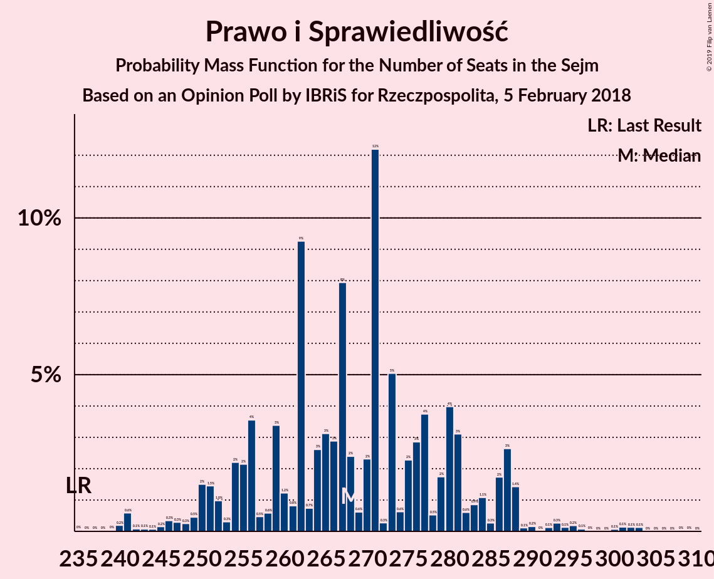
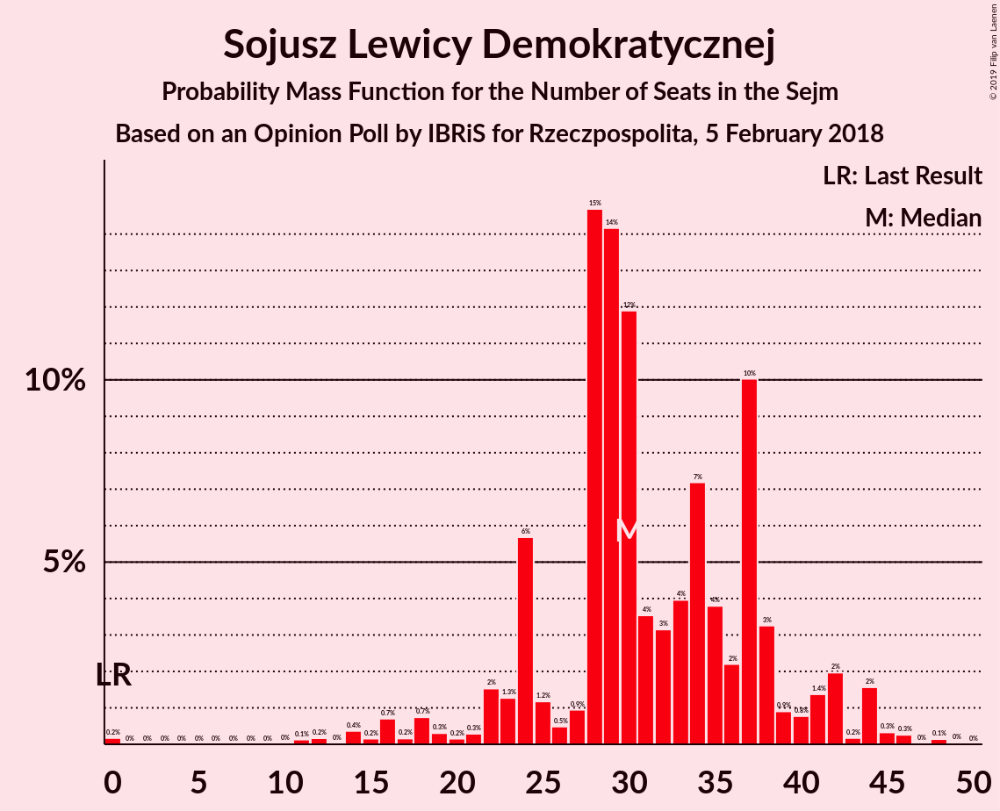
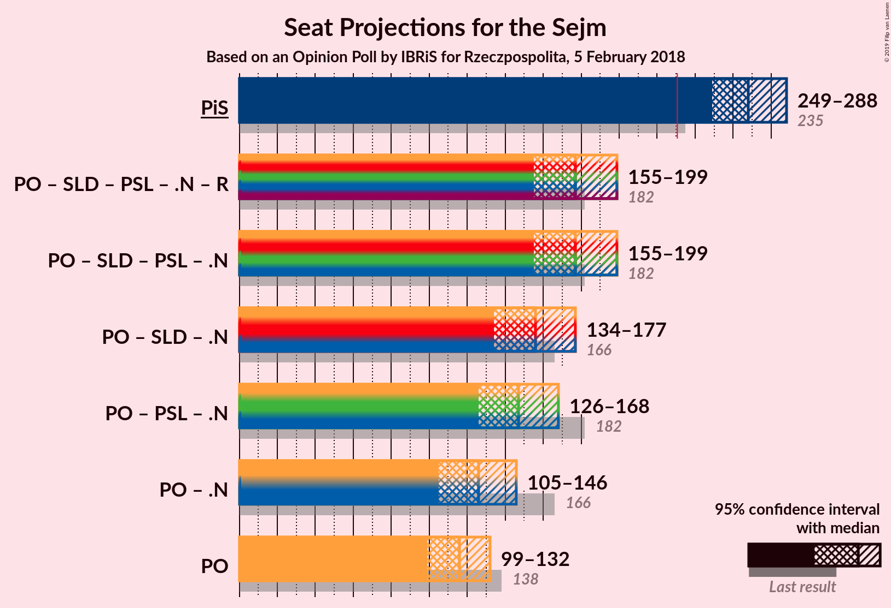
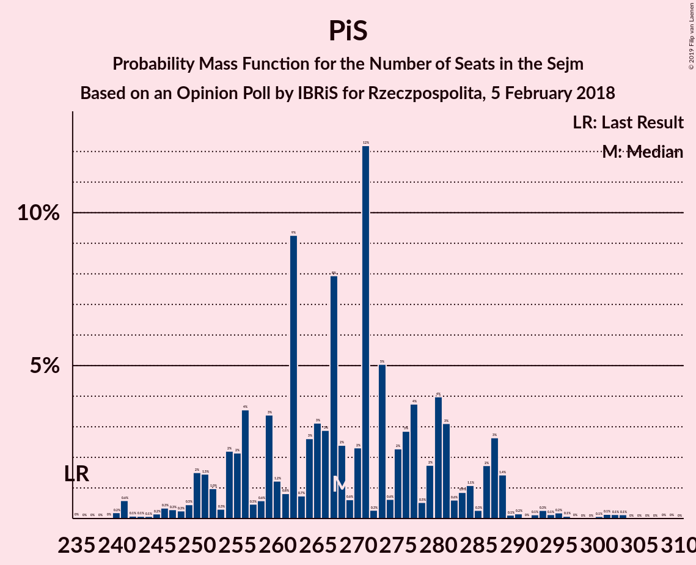
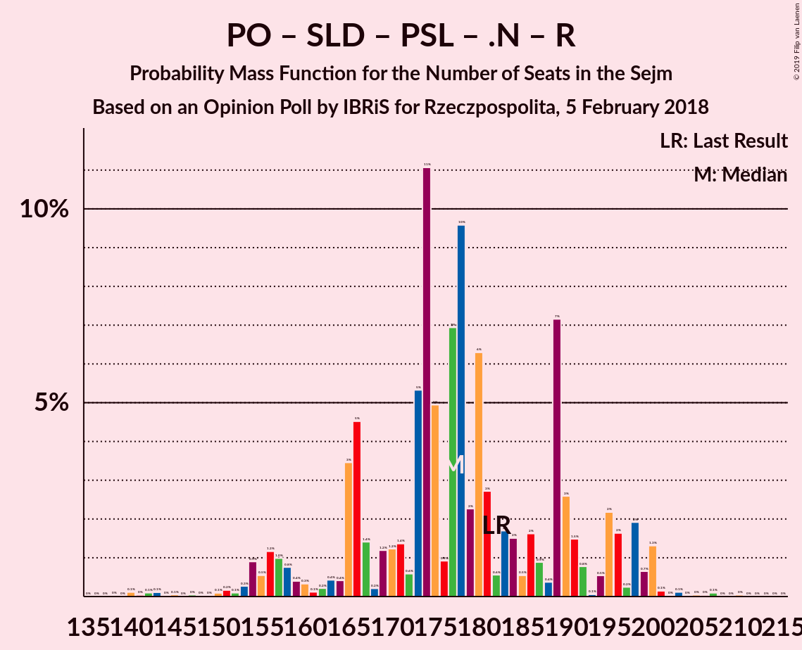
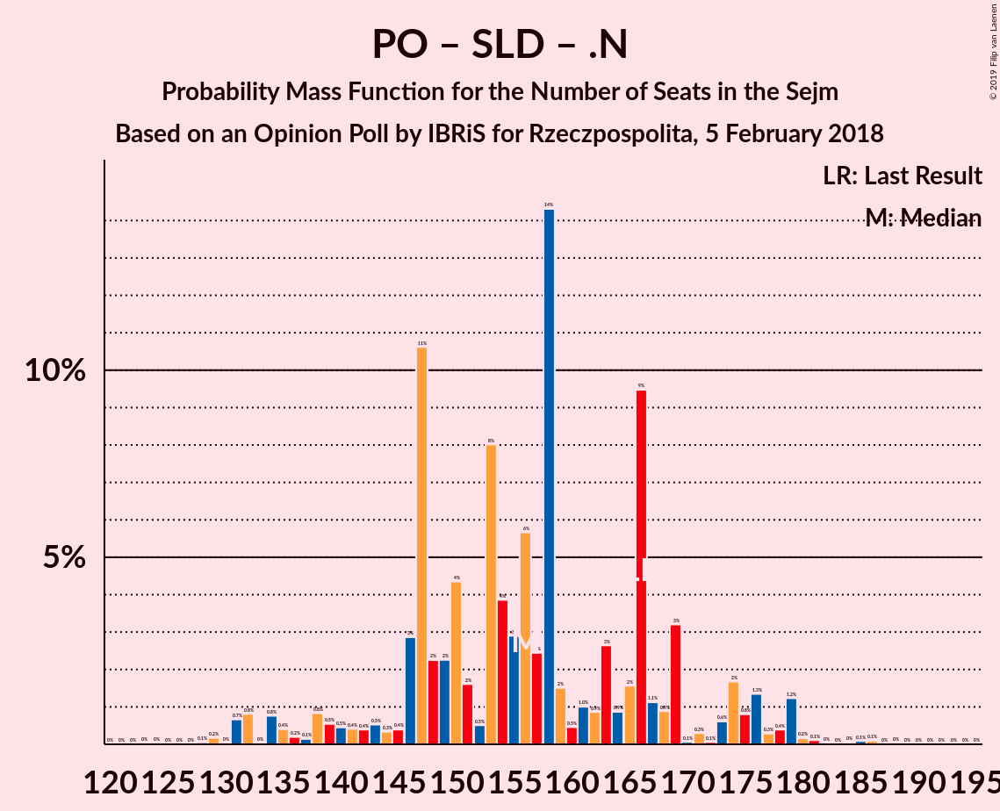
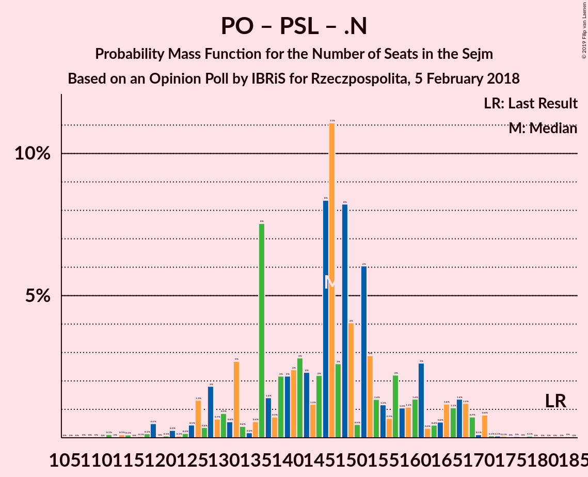

# Opinion Poll by IBRiS for Rzeczpospolita, 5 February 2018

<a href="#voting-intentions">Voting Intentions</a> | <a href="#seats">Seats</a> | <a href="#coalitions">Coalitions</a> | <a href="#technical-information">Technical Information</a>

## Voting Intentions

### Confidence Intervals

| Party | Last Result | Poll Result | 80% Confidence Interval | 90% Confidence Interval | 95% Confidence Interval | 99% Confidence Interval |
|:-----:|:-----------:|:-----------:|:-----------------------:|:-----------------------:|:-----------------------:|:-----------------------:|
| Prawo i Sprawiedliwość | 37.6% | 42.9% | 40.9–44.9% |40.3–45.5% |39.9–46.0% |38.9–47.0% |
| Platforma Obywatelska | 24.1% | 20.1% | 18.5–21.8% |18.1–22.3% |17.7–22.7% |17.0–23.5% |
| Sojusz Lewicy Demokratycznej | 7.6% | 7.2% | 6.2–8.4% |6.0–8.7% |5.7–9.0% |5.3–9.6% |
| Polskie Stronnictwo Ludowe | 5.1% | 6.0% | 5.1–7.1% |4.9–7.4% |4.7–7.7% |4.3–8.2% |
| Kukiz’15 | 8.8% | 5.7% | 4.9–6.8% |4.6–7.1% |4.4–7.3% |4.1–7.9% |
| .Nowoczesna | 7.6% | 5.3% | 4.5–6.3% |4.3–6.6% |4.1–6.9% |3.7–7.4% |
| Lewica Razem | 3.6% | 2.9% | 2.3–3.7% |2.2–3.9% |2.0–4.1% |1.8–4.6% |
| KORWiN | 4.8% | 0.4% | 0.2–0.8% |0.2–0.9% |0.2–1.0% |0.1–1.3% |

*Note:* The poll result column reflects the actual value used in the calculations. Published results may vary slightly, and in addition be rounded to fewer digits.

## Seats

### Confidence Intervals

| Party | Last Result | Median | 80% Confidence Interval | 90% Confidence Interval | 95% Confidence Interval | 99% Confidence Interval |
|:-----:|:-----------:|:------:|:-----------------------:|:-----------------------:|:-----------------------:|:-----------------------:|
| <a href="#prawo-i-sprawiedliwość">Prawo i Sprawiedliwość</a> | 235 | 292 | 247–302 |247–302 |247–302 |239–302 |
| <a href="#platforma-obywatelska">Platforma Obywatelska</a> | 138 | 107 | 107–116 |107–116 |107–119 |107–121 |
| <a href="#sojusz-lewicy-demokratycznej">Sojusz Lewicy Demokratycznej</a> | 0 | 29 | 21–46 |21–46 |21–46 |21–53 |
| <a href="#polskie-stronnictwo-ludowe">Polskie Stronnictwo Ludowe</a> | 16 | 0 | 0–31 |0–31 |0–31 |0–32 |
| <a href="#kukiz’15">Kukiz’15</a> | 42 | 15 | 15–33 |15–33 |15–33 |15–33 |
| <a href="#.nowoczesna">.Nowoczesna</a> | 28 | 15 | 0–15 |0–15 |0–17 |0–17 |
| <a href="#lewica-razem">Lewica Razem</a> | 0 | 0 | 0 |0 |0 |0 |
| <a href="#korwin">KORWiN</a> | 0 | 0 | 0 |0 |0 |0 |

### Prawo i Sprawiedliwość

*For a full overview of the results for this party, see the [Prawo i Sprawiedliwość](party-prawoisprawiedliwość.html) page.*

| Number of Seats | Probability | Accumulated | Special Marks |
|:---------------:|:-----------:|:-----------:|:-------------:|
| 235 | 0% | 100% | Last Result |
| 236 | 0% | 100% |  |
| 237 | 0% | 100% |  |
| 238 | 0% | 100% |  |
| 239 | 0.7% | 100% |  |
| 240 | 0% | 99.3% |  |
| 241 | 0% | 99.3% |  |
| 242 | 0.2% | 99.3% |  |
| 243 | 0% | 99.1% |  |
| 244 | 1.2% | 99.1% |  |
| 245 | 0% | 98% |  |
| 246 | 0% | 98% |  |
| 247 | 12% | 98% |  |
| 248 | 0.1% | 86% |  |
| 249 | 0% | 86% |  |
| 250 | 0.6% | 86% |  |
| 251 | 0% | 85% |  |
| 252 | 0% | 85% |  |
| 253 | 30% | 85% |  |
| 254 | 0% | 55% |  |
| 255 | 0.1% | 55% |  |
| 256 | 0.7% | 55% |  |
| 257 | 0% | 54% |  |
| 258 | 0.3% | 54% |  |
| 259 | 4% | 54% |  |
| 260 | 0% | 50% |  |
| 261 | 0% | 50% |  |
| 262 | 0% | 50% |  |
| 263 | 0% | 50% |  |
| 264 | 0% | 50% |  |
| 265 | 0% | 50% |  |
| 266 | 0% | 50% |  |
| 267 | 0% | 50% |  |
| 268 | 0% | 50% |  |
| 269 | 0% | 50% |  |
| 270 | 0% | 50% |  |
| 271 | 0% | 50% |  |
| 272 | 0% | 50% |  |
| 273 | 0% | 50% |  |
| 274 | 0% | 50% |  |
| 275 | 0% | 50% |  |
| 276 | 0% | 50% |  |
| 277 | 0% | 50% |  |
| 278 | 0.1% | 50% |  |
| 279 | 0% | 50% |  |
| 280 | 0% | 50% |  |
| 281 | 0% | 50% |  |
| 282 | 0% | 50% |  |
| 283 | 0% | 50% |  |
| 284 | 0% | 50% |  |
| 285 | 0% | 50% |  |
| 286 | 0% | 50% |  |
| 287 | 0% | 50% |  |
| 288 | 0% | 50% |  |
| 289 | 0% | 50% |  |
| 290 | 0% | 50% |  |
| 291 | 0% | 50% |  |
| 292 | 3% | 50% | Median |
| 293 | 0% | 48% |  |
| 294 | 0% | 48% |  |
| 295 | 0% | 48% |  |
| 296 | 0% | 48% |  |
| 297 | 0% | 48% |  |
| 298 | 0% | 48% |  |
| 299 | 0% | 48% |  |
| 300 | 0% | 48% |  |
| 301 | 0% | 48% |  |
| 302 | 48% | 48% |  |
| 303 | 0% | 0% |  |

### Platforma Obywatelska

*For a full overview of the results for this party, see the [Platforma Obywatelska](party-platformaobywatelska.html) page.*

| Number of Seats | Probability | Accumulated | Special Marks |
|:---------------:|:-----------:|:-----------:|:-------------:|
| 99 | 0.1% | 100% |  |
| 100 | 0% | 99.9% |  |
| 101 | 0% | 99.9% |  |
| 102 | 0% | 99.9% |  |
| 103 | 0% | 99.9% |  |
| 104 | 0% | 99.9% |  |
| 105 | 0% | 99.9% |  |
| 106 | 0% | 99.9% |  |
| 107 | 50% | 99.9% | Median |
| 108 | 0% | 50% |  |
| 109 | 0% | 50% |  |
| 110 | 0% | 50% |  |
| 111 | 0% | 50% |  |
| 112 | 0.7% | 50% |  |
| 113 | 4% | 49% |  |
| 114 | 0% | 45% |  |
| 115 | 0.4% | 45% |  |
| 116 | 42% | 45% |  |
| 117 | 0% | 3% |  |
| 118 | 0.6% | 3% |  |
| 119 | 0.7% | 3% |  |
| 120 | 0.3% | 2% |  |
| 121 | 1.5% | 2% |  |
| 122 | 0% | 0.2% |  |
| 123 | 0% | 0.2% |  |
| 124 | 0% | 0.2% |  |
| 125 | 0% | 0.2% |  |
| 126 | 0% | 0.2% |  |
| 127 | 0% | 0.2% |  |
| 128 | 0% | 0.2% |  |
| 129 | 0% | 0.2% |  |
| 130 | 0% | 0.1% |  |
| 131 | 0% | 0.1% |  |
| 132 | 0% | 0.1% |  |
| 133 | 0% | 0.1% |  |
| 134 | 0% | 0.1% |  |
| 135 | 0% | 0.1% |  |
| 136 | 0% | 0.1% |  |
| 137 | 0% | 0.1% |  |
| 138 | 0% | 0.1% | Last Result |
| 139 | 0% | 0.1% |  |
| 140 | 0.1% | 0.1% |  |
| 141 | 0% | 0.1% |  |
| 142 | 0% | 0.1% |  |
| 143 | 0% | 0.1% |  |
| 144 | 0% | 0.1% |  |
| 145 | 0.1% | 0.1% |  |
| 146 | 0% | 0% |  |

### Sojusz Lewicy Demokratycznej

*For a full overview of the results for this party, see the [Sojusz Lewicy Demokratycznej](party-sojuszlewicydemokratycznej.html) page.*

| Number of Seats | Probability | Accumulated | Special Marks |
|:---------------:|:-----------:|:-----------:|:-------------:|
| 0 | 0% | 100% | Last Result |
| 1 | 0% | 100% |  |
| 2 | 0% | 100% |  |
| 3 | 0% | 100% |  |
| 4 | 0% | 100% |  |
| 5 | 0% | 100% |  |
| 6 | 0% | 100% |  |
| 7 | 0% | 100% |  |
| 8 | 0% | 100% |  |
| 9 | 0% | 100% |  |
| 10 | 0% | 100% |  |
| 11 | 0% | 100% |  |
| 12 | 0% | 100% |  |
| 13 | 0% | 100% |  |
| 14 | 0% | 100% |  |
| 15 | 0% | 100% |  |
| 16 | 0% | 100% |  |
| 17 | 0% | 99.9% |  |
| 18 | 0.1% | 99.9% |  |
| 19 | 0% | 99.9% |  |
| 20 | 0% | 99.9% |  |
| 21 | 48% | 99.8% |  |
| 22 | 0% | 52% |  |
| 23 | 0.1% | 52% |  |
| 24 | 0% | 52% |  |
| 25 | 0% | 52% |  |
| 26 | 0% | 52% |  |
| 27 | 0% | 52% |  |
| 28 | 0.3% | 52% |  |
| 29 | 3% | 52% | Median |
| 30 | 0% | 49% |  |
| 31 | 0.6% | 49% |  |
| 32 | 0% | 49% |  |
| 33 | 12% | 49% |  |
| 34 | 0% | 37% |  |
| 35 | 0% | 37% |  |
| 36 | 0% | 37% |  |
| 37 | 0% | 37% |  |
| 38 | 0.2% | 37% |  |
| 39 | 4% | 37% |  |
| 40 | 0.7% | 33% |  |
| 41 | 0% | 32% |  |
| 42 | 0.7% | 32% |  |
| 43 | 0% | 32% |  |
| 44 | 0% | 32% |  |
| 45 | 0% | 32% |  |
| 46 | 30% | 32% |  |
| 47 | 0.4% | 2% |  |
| 48 | 0% | 1.2% |  |
| 49 | 0% | 1.2% |  |
| 50 | 0% | 1.2% |  |
| 51 | 0% | 1.2% |  |
| 52 | 0% | 1.2% |  |
| 53 | 1.2% | 1.2% |  |
| 54 | 0% | 0% |  |

### Polskie Stronnictwo Ludowe

*For a full overview of the results for this party, see the [Polskie Stronnictwo Ludowe](party-polskiestronnictwoludowe.html) page.*

| Number of Seats | Probability | Accumulated | Special Marks |
|:---------------:|:-----------:|:-----------:|:-------------:|
| 0 | 50% | 100% | Median |
| 1 | 0% | 50% |  |
| 2 | 0% | 50% |  |
| 3 | 0% | 50% |  |
| 4 | 0% | 50% |  |
| 5 | 0% | 50% |  |
| 6 | 0% | 50% |  |
| 7 | 0% | 50% |  |
| 8 | 0% | 50% |  |
| 9 | 0% | 50% |  |
| 10 | 0% | 50% |  |
| 11 | 0% | 50% |  |
| 12 | 0% | 50% |  |
| 13 | 0% | 50% |  |
| 14 | 0% | 50% |  |
| 15 | 0% | 50% |  |
| 16 | 0% | 50% | Last Result |
| 17 | 0% | 50% |  |
| 18 | 0% | 50% |  |
| 19 | 0% | 50% |  |
| 20 | 0.1% | 50% |  |
| 21 | 0% | 50% |  |
| 22 | 0% | 50% |  |
| 23 | 1.3% | 50% |  |
| 24 | 0% | 48% |  |
| 25 | 0% | 48% |  |
| 26 | 30% | 48% |  |
| 27 | 0.7% | 18% |  |
| 28 | 0% | 17% |  |
| 29 | 0.4% | 17% |  |
| 30 | 4% | 17% |  |
| 31 | 12% | 13% |  |
| 32 | 0.7% | 0.7% |  |
| 33 | 0% | 0% |  |

### Kukiz’15

*For a full overview of the results for this party, see the [Kukiz’15](party-kukiz’15.html) page.*

| Number of Seats | Probability | Accumulated | Special Marks |
|:---------------:|:-----------:|:-----------:|:-------------:|
| 0 | 0.4% | 100% |  |
| 1 | 0% | 99.6% |  |
| 2 | 0% | 99.6% |  |
| 3 | 0% | 99.6% |  |
| 4 | 0% | 99.6% |  |
| 5 | 0.1% | 99.6% |  |
| 6 | 0% | 99.5% |  |
| 7 | 0% | 99.5% |  |
| 8 | 0% | 99.5% |  |
| 9 | 0% | 99.5% |  |
| 10 | 0% | 99.5% |  |
| 11 | 0% | 99.5% |  |
| 12 | 0% | 99.5% |  |
| 13 | 0% | 99.5% |  |
| 14 | 0% | 99.5% |  |
| 15 | 50% | 99.5% | Median |
| 16 | 0% | 49% |  |
| 17 | 0% | 49% |  |
| 18 | 0% | 49% |  |
| 19 | 35% | 49% |  |
| 20 | 0.7% | 14% |  |
| 21 | 0% | 14% |  |
| 22 | 0.4% | 14% |  |
| 23 | 0% | 13% |  |
| 24 | 0% | 13% |  |
| 25 | 0% | 13% |  |
| 26 | 0% | 13% |  |
| 27 | 0% | 13% |  |
| 28 | 0% | 13% |  |
| 29 | 0% | 13% |  |
| 30 | 0% | 13% |  |
| 31 | 0.6% | 13% |  |
| 32 | 0% | 13% |  |
| 33 | 13% | 13% |  |
| 34 | 0% | 0% |  |
| 35 | 0% | 0% |  |
| 36 | 0% | 0% |  |
| 37 | 0% | 0% |  |
| 38 | 0% | 0% |  |
| 39 | 0% | 0% |  |
| 40 | 0% | 0% |  |
| 41 | 0% | 0% |  |
| 42 | 0% | 0% | Last Result |

### .Nowoczesna

*For a full overview of the results for this party, see the [.Nowoczesna](party-nowoczesna.html) page.*

| Number of Seats | Probability | Accumulated | Special Marks |
|:---------------:|:-----------:|:-----------:|:-------------:|
| 0 | 49% | 100% |  |
| 1 | 0% | 51% |  |
| 2 | 0% | 51% |  |
| 3 | 0% | 51% |  |
| 4 | 0% | 51% |  |
| 5 | 0% | 51% |  |
| 6 | 0% | 51% |  |
| 7 | 0% | 51% |  |
| 8 | 0% | 51% |  |
| 9 | 0% | 51% |  |
| 10 | 0% | 51% |  |
| 11 | 0.1% | 51% |  |
| 12 | 0% | 51% |  |
| 13 | 0% | 51% |  |
| 14 | 0% | 51% |  |
| 15 | 48% | 51% | Median |
| 16 | 0% | 3% |  |
| 17 | 3% | 3% |  |
| 18 | 0% | 0.4% |  |
| 19 | 0% | 0.4% |  |
| 20 | 0% | 0.4% |  |
| 21 | 0.1% | 0.4% |  |
| 22 | 0.1% | 0.3% |  |
| 23 | 0.3% | 0.3% |  |
| 24 | 0% | 0% |  |
| 25 | 0% | 0% |  |
| 26 | 0% | 0% |  |
| 27 | 0% | 0% |  |
| 28 | 0% | 0% | Last Result |

### Lewica Razem

*For a full overview of the results for this party, see the [Lewica Razem](party-lewicarazem.html) page.*

| Number of Seats | Probability | Accumulated | Special Marks |
|:---------------:|:-----------:|:-----------:|:-------------:|
| 0 | 100% | 100% | Last Result, Median |

### KORWiN

*For a full overview of the results for this party, see the [KORWiN](party-korwin.html) page.*

| Number of Seats | Probability | Accumulated | Special Marks |
|:---------------:|:-----------:|:-----------:|:-------------:|
| 0 | 100% | 100% | Last Result, Median |

## Coalitions

### Confidence Intervals

| Coalition | Last Result | Median | Majority? | 80% Confidence Interval | 90% Confidence Interval | 95% Confidence Interval | 99% Confidence Interval |
|:---------:|:-----------:|:------:|:---------:|:-----------------------:|:-----------------------:|:-----------------------:|:-----------------------:|
| Prawo i Sprawiedliwość | 235 | 292 | 100% | 247–302 | 247–302 | 247–302 | 239–302 |
| Platforma Obywatelska – Sojusz Lewicy Demokratycznej – Polskie Stronnictwo Ludowe – .Nowoczesna – Lewica Razem | 182 | 153 | 0% | 143–188 | 143–188 | 143–188 | 143–197 |
| Platforma Obywatelska – Sojusz Lewicy Demokratycznej – Polskie Stronnictwo Ludowe – .Nowoczesna | 182 | 153 | 0% | 143–188 | 143–188 | 143–188 | 143–197 |
| Platforma Obywatelska – Sojusz Lewicy Demokratycznej – .Nowoczesna | 166 | 149 | 0% | 143–162 | 143–162 | 143–162 | 143–174 |
| Platforma Obywatelska – Polskie Stronnictwo Ludowe – .Nowoczesna | 182 | 124 | 0% | 122–147 | 122–147 | 122–147 | 122–161 |
| Platforma Obywatelska – .Nowoczesna | 166 | 122 | 0% | 116–122 | 116–122 | 113–124 | 112–125 |
| Platforma Obywatelska | 138 | 107 | 0% | 107–116 | 107–116 | 107–119 | 107–121 |

### Prawo i Sprawiedliwość

| Number of Seats | Probability | Accumulated | Special Marks |
|:---------------:|:-----------:|:-----------:|:-------------:|
| 235 | 0% | 100% | Last Result |
| 236 | 0% | 100% |  |
| 237 | 0% | 100% |  |
| 238 | 0% | 100% |  |
| 239 | 0.7% | 100% |  |
| 240 | 0% | 99.3% |  |
| 241 | 0% | 99.3% |  |
| 242 | 0.2% | 99.3% |  |
| 243 | 0% | 99.1% |  |
| 244 | 1.2% | 99.1% |  |
| 245 | 0% | 98% |  |
| 246 | 0% | 98% |  |
| 247 | 12% | 98% |  |
| 248 | 0.1% | 86% |  |
| 249 | 0% | 86% |  |
| 250 | 0.6% | 86% |  |
| 251 | 0% | 85% |  |
| 252 | 0% | 85% |  |
| 253 | 30% | 85% |  |
| 254 | 0% | 55% |  |
| 255 | 0.1% | 55% |  |
| 256 | 0.7% | 55% |  |
| 257 | 0% | 54% |  |
| 258 | 0.3% | 54% |  |
| 259 | 4% | 54% |  |
| 260 | 0% | 50% |  |
| 261 | 0% | 50% |  |
| 262 | 0% | 50% |  |
| 263 | 0% | 50% |  |
| 264 | 0% | 50% |  |
| 265 | 0% | 50% |  |
| 266 | 0% | 50% |  |
| 267 | 0% | 50% |  |
| 268 | 0% | 50% |  |
| 269 | 0% | 50% |  |
| 270 | 0% | 50% |  |
| 271 | 0% | 50% |  |
| 272 | 0% | 50% |  |
| 273 | 0% | 50% |  |
| 274 | 0% | 50% |  |
| 275 | 0% | 50% |  |
| 276 | 0% | 50% |  |
| 277 | 0% | 50% |  |
| 278 | 0.1% | 50% |  |
| 279 | 0% | 50% |  |
| 280 | 0% | 50% |  |
| 281 | 0% | 50% |  |
| 282 | 0% | 50% |  |
| 283 | 0% | 50% |  |
| 284 | 0% | 50% |  |
| 285 | 0% | 50% |  |
| 286 | 0% | 50% |  |
| 287 | 0% | 50% |  |
| 288 | 0% | 50% |  |
| 289 | 0% | 50% |  |
| 290 | 0% | 50% |  |
| 291 | 0% | 50% |  |
| 292 | 3% | 50% | Median |
| 293 | 0% | 48% |  |
| 294 | 0% | 48% |  |
| 295 | 0% | 48% |  |
| 296 | 0% | 48% |  |
| 297 | 0% | 48% |  |
| 298 | 0% | 48% |  |
| 299 | 0% | 48% |  |
| 300 | 0% | 48% |  |
| 301 | 0% | 48% |  |
| 302 | 48% | 48% |  |
| 303 | 0% | 0% |  |

### Platforma Obywatelska – Sojusz Lewicy Demokratycznej – Polskie Stronnictwo Ludowe – .Nowoczesna – Lewica Razem

| Number of Seats | Probability | Accumulated | Special Marks |
|:---------------:|:-----------:|:-----------:|:-------------:|
| 143 | 48% | 100% |  |
| 144 | 0% | 52% |  |
| 145 | 0% | 52% |  |
| 146 | 0% | 52% |  |
| 147 | 0% | 52% |  |
| 148 | 0% | 52% |  |
| 149 | 0% | 52% |  |
| 150 | 0% | 52% |  |
| 151 | 0% | 52% | Median |
| 152 | 0% | 52% |  |
| 153 | 3% | 52% |  |
| 154 | 0% | 50% |  |
| 155 | 0% | 50% |  |
| 156 | 0% | 50% |  |
| 157 | 0% | 50% |  |
| 158 | 0% | 50% |  |
| 159 | 0% | 50% |  |
| 160 | 0% | 50% |  |
| 161 | 0% | 50% |  |
| 162 | 0% | 50% |  |
| 163 | 0% | 50% |  |
| 164 | 0% | 50% |  |
| 165 | 0% | 50% |  |
| 166 | 0% | 50% |  |
| 167 | 0% | 50% |  |
| 168 | 0% | 50% |  |
| 169 | 0% | 50% |  |
| 170 | 0% | 50% |  |
| 171 | 0% | 50% |  |
| 172 | 0% | 50% |  |
| 173 | 0% | 50% |  |
| 174 | 0% | 50% |  |
| 175 | 0% | 50% |  |
| 176 | 0% | 50% |  |
| 177 | 0% | 50% |  |
| 178 | 0% | 50% |  |
| 179 | 0.6% | 50% |  |
| 180 | 12% | 49% |  |
| 181 | 0% | 37% |  |
| 182 | 4% | 37% | Last Result |
| 183 | 0% | 34% |  |
| 184 | 0.7% | 34% |  |
| 185 | 0.2% | 33% |  |
| 186 | 0% | 33% |  |
| 187 | 0% | 33% |  |
| 188 | 31% | 33% |  |
| 189 | 0% | 2% |  |
| 190 | 0% | 2% |  |
| 191 | 0.4% | 2% |  |
| 192 | 0% | 2% |  |
| 193 | 0% | 2% |  |
| 194 | 0% | 2% |  |
| 195 | 0% | 2% |  |
| 196 | 0% | 2% |  |
| 197 | 1.2% | 2% |  |
| 198 | 0% | 0.4% |  |
| 199 | 0% | 0.4% |  |
| 200 | 0% | 0.4% |  |
| 201 | 0% | 0.4% |  |
| 202 | 0.3% | 0.4% |  |
| 203 | 0% | 0.1% |  |
| 204 | 0% | 0.1% |  |
| 205 | 0.1% | 0.1% |  |
| 206 | 0% | 0.1% |  |
| 207 | 0.1% | 0.1% |  |
| 208 | 0% | 0% |  |

### Platforma Obywatelska – Sojusz Lewicy Demokratycznej – Polskie Stronnictwo Ludowe – .Nowoczesna

| Number of Seats | Probability | Accumulated | Special Marks |
|:---------------:|:-----------:|:-----------:|:-------------:|
| 143 | 48% | 100% |  |
| 144 | 0% | 52% |  |
| 145 | 0% | 52% |  |
| 146 | 0% | 52% |  |
| 147 | 0% | 52% |  |
| 148 | 0% | 52% |  |
| 149 | 0% | 52% |  |
| 150 | 0% | 52% |  |
| 151 | 0% | 52% | Median |
| 152 | 0% | 52% |  |
| 153 | 3% | 52% |  |
| 154 | 0% | 50% |  |
| 155 | 0% | 50% |  |
| 156 | 0% | 50% |  |
| 157 | 0% | 50% |  |
| 158 | 0% | 50% |  |
| 159 | 0% | 50% |  |
| 160 | 0% | 50% |  |
| 161 | 0% | 50% |  |
| 162 | 0% | 50% |  |
| 163 | 0% | 50% |  |
| 164 | 0% | 50% |  |
| 165 | 0% | 50% |  |
| 166 | 0% | 50% |  |
| 167 | 0% | 50% |  |
| 168 | 0% | 50% |  |
| 169 | 0% | 50% |  |
| 170 | 0% | 50% |  |
| 171 | 0% | 50% |  |
| 172 | 0% | 50% |  |
| 173 | 0% | 50% |  |
| 174 | 0% | 50% |  |
| 175 | 0% | 50% |  |
| 176 | 0% | 50% |  |
| 177 | 0% | 50% |  |
| 178 | 0% | 50% |  |
| 179 | 0.6% | 50% |  |
| 180 | 12% | 49% |  |
| 181 | 0% | 37% |  |
| 182 | 4% | 37% | Last Result |
| 183 | 0% | 34% |  |
| 184 | 0.7% | 34% |  |
| 185 | 0.2% | 33% |  |
| 186 | 0% | 33% |  |
| 187 | 0% | 33% |  |
| 188 | 31% | 33% |  |
| 189 | 0% | 2% |  |
| 190 | 0% | 2% |  |
| 191 | 0.4% | 2% |  |
| 192 | 0% | 2% |  |
| 193 | 0% | 2% |  |
| 194 | 0% | 2% |  |
| 195 | 0% | 2% |  |
| 196 | 0% | 2% |  |
| 197 | 1.2% | 2% |  |
| 198 | 0% | 0.4% |  |
| 199 | 0% | 0.4% |  |
| 200 | 0% | 0.4% |  |
| 201 | 0% | 0.4% |  |
| 202 | 0.3% | 0.4% |  |
| 203 | 0% | 0.1% |  |
| 204 | 0% | 0.1% |  |
| 205 | 0.1% | 0.1% |  |
| 206 | 0% | 0.1% |  |
| 207 | 0.1% | 0.1% |  |
| 208 | 0% | 0% |  |

### Platforma Obywatelska – Sojusz Lewicy Demokratycznej – .Nowoczesna

| Number of Seats | Probability | Accumulated | Special Marks |
|:---------------:|:-----------:|:-----------:|:-------------:|
| 135 | 0% | 100% |  |
| 136 | 0% | 99.9% |  |
| 137 | 0% | 99.9% |  |
| 138 | 0% | 99.9% |  |
| 139 | 0% | 99.9% |  |
| 140 | 0% | 99.9% |  |
| 141 | 0% | 99.9% |  |
| 142 | 0% | 99.9% |  |
| 143 | 48% | 99.9% |  |
| 144 | 0% | 52% |  |
| 145 | 0% | 52% |  |
| 146 | 0% | 52% |  |
| 147 | 0% | 52% |  |
| 148 | 0% | 52% |  |
| 149 | 12% | 52% |  |
| 150 | 0% | 40% |  |
| 151 | 0% | 40% | Median |
| 152 | 4% | 40% |  |
| 153 | 3% | 36% |  |
| 154 | 0% | 33% |  |
| 155 | 0% | 33% |  |
| 156 | 0% | 33% |  |
| 157 | 0% | 33% |  |
| 158 | 0% | 33% |  |
| 159 | 0.2% | 33% |  |
| 160 | 0% | 33% |  |
| 161 | 0.7% | 33% |  |
| 162 | 30% | 32% |  |
| 163 | 0% | 2% |  |
| 164 | 0% | 2% |  |
| 165 | 0% | 2% |  |
| 166 | 0% | 2% | Last Result |
| 167 | 0% | 2% |  |
| 168 | 0% | 2% |  |
| 169 | 0% | 2% |  |
| 170 | 0% | 2% |  |
| 171 | 0.3% | 2% |  |
| 172 | 0% | 1.4% |  |
| 173 | 0% | 1.4% |  |
| 174 | 1.2% | 1.4% |  |
| 175 | 0% | 0.1% |  |
| 176 | 0% | 0.1% |  |
| 177 | 0% | 0.1% |  |
| 178 | 0% | 0.1% |  |
| 179 | 0% | 0.1% |  |
| 180 | 0% | 0.1% |  |
| 181 | 0% | 0.1% |  |
| 182 | 0% | 0.1% |  |
| 183 | 0% | 0.1% |  |
| 184 | 0.1% | 0.1% |  |
| 185 | 0.1% | 0.1% |  |
| 186 | 0% | 0% |  |

### Platforma Obywatelska – Polskie Stronnictwo Ludowe – .Nowoczesna

| Number of Seats | Probability | Accumulated | Special Marks |
|:---------------:|:-----------:|:-----------:|:-------------:|
| 122 | 48% | 100% | Median |
| 123 | 0% | 52% |  |
| 124 | 3% | 52% |  |
| 125 | 0% | 50% |  |
| 126 | 0% | 50% |  |
| 127 | 0% | 50% |  |
| 128 | 0% | 50% |  |
| 129 | 0% | 50% |  |
| 130 | 0% | 50% |  |
| 131 | 0% | 50% |  |
| 132 | 0% | 50% |  |
| 133 | 0% | 50% |  |
| 134 | 0% | 50% |  |
| 135 | 0% | 50% |  |
| 136 | 0% | 50% |  |
| 137 | 0% | 50% |  |
| 138 | 0% | 50% |  |
| 139 | 0% | 50% |  |
| 140 | 0% | 50% |  |
| 141 | 0% | 50% |  |
| 142 | 30% | 50% |  |
| 143 | 4% | 20% |  |
| 144 | 2% | 16% |  |
| 145 | 0% | 14% |  |
| 146 | 0.7% | 14% |  |
| 147 | 12% | 13% |  |
| 148 | 0.6% | 1.1% |  |
| 149 | 0% | 0.5% |  |
| 150 | 0% | 0.5% |  |
| 151 | 0% | 0.5% |  |
| 152 | 0% | 0.5% |  |
| 153 | 0% | 0.5% |  |
| 154 | 0% | 0.5% |  |
| 155 | 0% | 0.5% |  |
| 156 | 0% | 0.5% |  |
| 157 | 0% | 0.5% |  |
| 158 | 0% | 0.5% |  |
| 159 | 0% | 0.5% |  |
| 160 | 0% | 0.5% |  |
| 161 | 0.1% | 0.5% |  |
| 162 | 0% | 0.4% |  |
| 163 | 0% | 0.4% |  |
| 164 | 0% | 0.4% |  |
| 165 | 0% | 0.4% |  |
| 166 | 0% | 0.4% |  |
| 167 | 0% | 0.4% |  |
| 168 | 0% | 0.4% |  |
| 169 | 0% | 0.4% |  |
| 170 | 0% | 0.4% |  |
| 171 | 0% | 0.4% |  |
| 172 | 0% | 0.4% |  |
| 173 | 0% | 0.4% |  |
| 174 | 0.3% | 0.4% |  |
| 175 | 0% | 0.1% |  |
| 176 | 0% | 0.1% |  |
| 177 | 0% | 0.1% |  |
| 178 | 0% | 0.1% |  |
| 179 | 0% | 0.1% |  |
| 180 | 0% | 0.1% |  |
| 181 | 0% | 0.1% |  |
| 182 | 0% | 0.1% | Last Result |
| 183 | 0% | 0.1% |  |
| 184 | 0.1% | 0.1% |  |
| 185 | 0% | 0.1% |  |
| 186 | 0% | 0.1% |  |
| 187 | 0.1% | 0.1% |  |
| 188 | 0% | 0% |  |

### Platforma Obywatelska – .Nowoczesna

| Number of Seats | Probability | Accumulated | Special Marks |
|:---------------:|:-----------:|:-----------:|:-------------:|
| 112 | 0.7% | 100% |  |
| 113 | 4% | 99.3% |  |
| 114 | 0% | 96% |  |
| 115 | 0.4% | 96% |  |
| 116 | 42% | 95% |  |
| 117 | 0% | 53% |  |
| 118 | 0.6% | 53% |  |
| 119 | 0.7% | 53% |  |
| 120 | 0% | 52% |  |
| 121 | 1.5% | 52% |  |
| 122 | 48% | 51% | Median |
| 123 | 0% | 3% |  |
| 124 | 3% | 3% |  |
| 125 | 0% | 0.5% |  |
| 126 | 0% | 0.5% |  |
| 127 | 0% | 0.5% |  |
| 128 | 0% | 0.5% |  |
| 129 | 0% | 0.5% |  |
| 130 | 0% | 0.5% |  |
| 131 | 0.1% | 0.5% |  |
| 132 | 0% | 0.4% |  |
| 133 | 0% | 0.4% |  |
| 134 | 0% | 0.4% |  |
| 135 | 0% | 0.4% |  |
| 136 | 0% | 0.4% |  |
| 137 | 0% | 0.4% |  |
| 138 | 0% | 0.4% |  |
| 139 | 0% | 0.4% |  |
| 140 | 0% | 0.4% |  |
| 141 | 0% | 0.4% |  |
| 142 | 0% | 0.4% |  |
| 143 | 0.3% | 0.4% |  |
| 144 | 0% | 0.1% |  |
| 145 | 0% | 0.1% |  |
| 146 | 0% | 0.1% |  |
| 147 | 0% | 0.1% |  |
| 148 | 0% | 0.1% |  |
| 149 | 0% | 0.1% |  |
| 150 | 0% | 0.1% |  |
| 151 | 0% | 0.1% |  |
| 152 | 0% | 0.1% |  |
| 153 | 0% | 0.1% |  |
| 154 | 0% | 0.1% |  |
| 155 | 0% | 0.1% |  |
| 156 | 0% | 0.1% |  |
| 157 | 0% | 0.1% |  |
| 158 | 0% | 0.1% |  |
| 159 | 0% | 0.1% |  |
| 160 | 0% | 0.1% |  |
| 161 | 0.1% | 0.1% |  |
| 162 | 0% | 0.1% |  |
| 163 | 0% | 0.1% |  |
| 164 | 0% | 0.1% |  |
| 165 | 0% | 0.1% |  |
| 166 | 0% | 0.1% | Last Result |
| 167 | 0.1% | 0.1% |  |
| 168 | 0% | 0% |  |

### Platforma Obywatelska

| Number of Seats | Probability | Accumulated | Special Marks |
|:---------------:|:-----------:|:-----------:|:-------------:|
| 99 | 0.1% | 100% |  |
| 100 | 0% | 99.9% |  |
| 101 | 0% | 99.9% |  |
| 102 | 0% | 99.9% |  |
| 103 | 0% | 99.9% |  |
| 104 | 0% | 99.9% |  |
| 105 | 0% | 99.9% |  |
| 106 | 0% | 99.9% |  |
| 107 | 50% | 99.9% | Median |
| 108 | 0% | 50% |  |
| 109 | 0% | 50% |  |
| 110 | 0% | 50% |  |
| 111 | 0% | 50% |  |
| 112 | 0.7% | 50% |  |
| 113 | 4% | 49% |  |
| 114 | 0% | 45% |  |
| 115 | 0.4% | 45% |  |
| 116 | 42% | 45% |  |
| 117 | 0% | 3% |  |
| 118 | 0.6% | 3% |  |
| 119 | 0.7% | 3% |  |
| 120 | 0.3% | 2% |  |
| 121 | 1.5% | 2% |  |
| 122 | 0% | 0.2% |  |
| 123 | 0% | 0.2% |  |
| 124 | 0% | 0.2% |  |
| 125 | 0% | 0.2% |  |
| 126 | 0% | 0.2% |  |
| 127 | 0% | 0.2% |  |
| 128 | 0% | 0.2% |  |
| 129 | 0% | 0.2% |  |
| 130 | 0% | 0.1% |  |
| 131 | 0% | 0.1% |  |
| 132 | 0% | 0.1% |  |
| 133 | 0% | 0.1% |  |
| 134 | 0% | 0.1% |  |
| 135 | 0% | 0.1% |  |
| 136 | 0% | 0.1% |  |
| 137 | 0% | 0.1% |  |
| 138 | 0% | 0.1% | Last Result |
| 139 | 0% | 0.1% |  |
| 140 | 0.1% | 0.1% |  |
| 141 | 0% | 0.1% |  |
| 142 | 0% | 0.1% |  |
| 143 | 0% | 0.1% |  |
| 144 | 0% | 0.1% |  |
| 145 | 0.1% | 0.1% |  |
| 146 | 0% | 0% |  |

## Technical Information

### Opinion Poll

+ **Polling firm:** IBRiS
+ **Commissioner(s):** Rzeczpospolita
+ **Fieldwork period:** 5 February 2018

### Calculations

+ **Sample size:** 1000
+ **Simulations done:** 1,024
+ **Error estimate:** 1.51%

