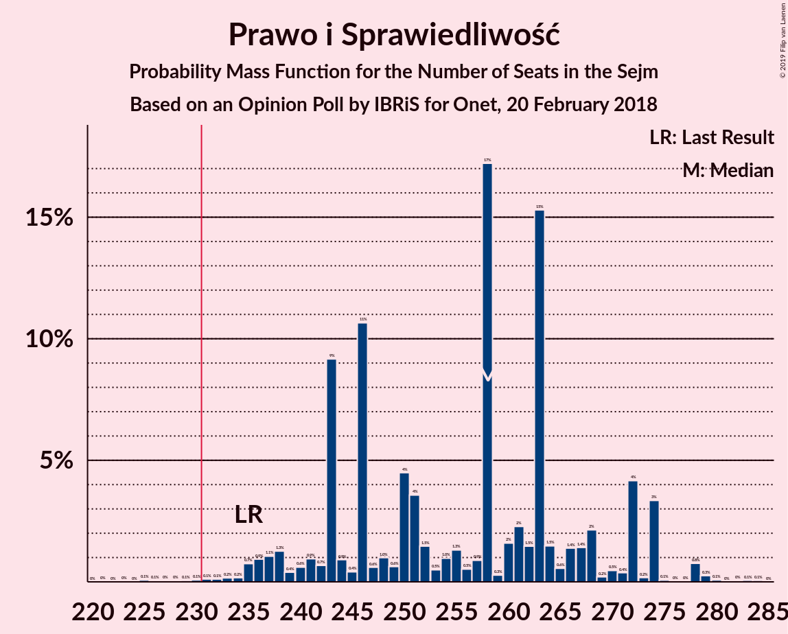
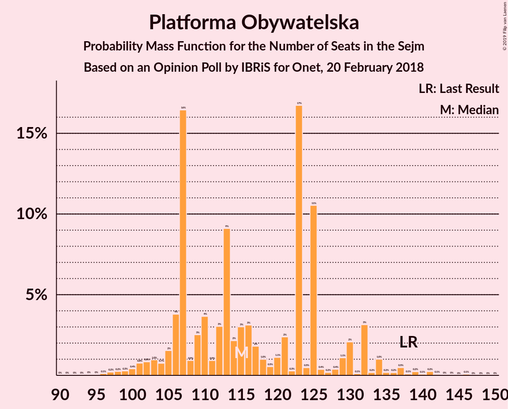
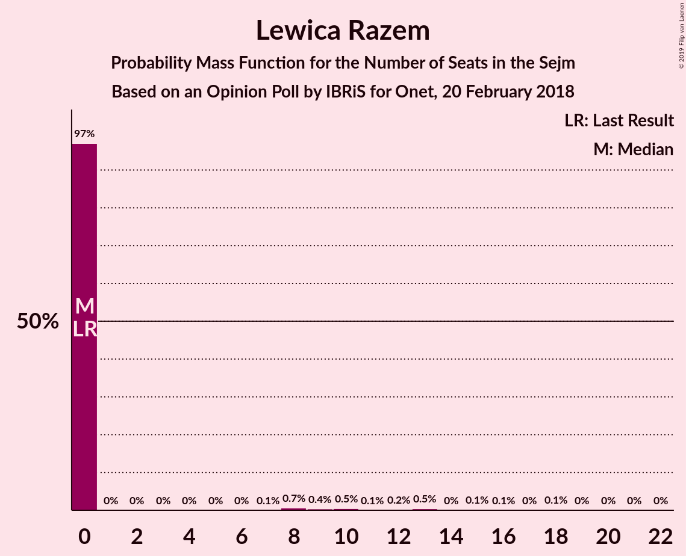
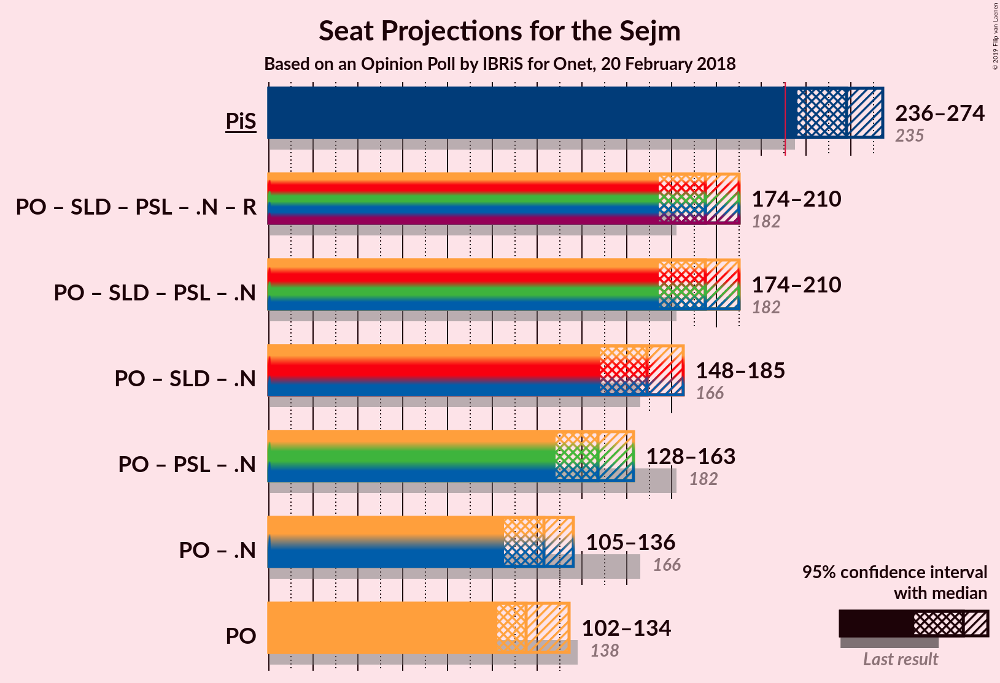
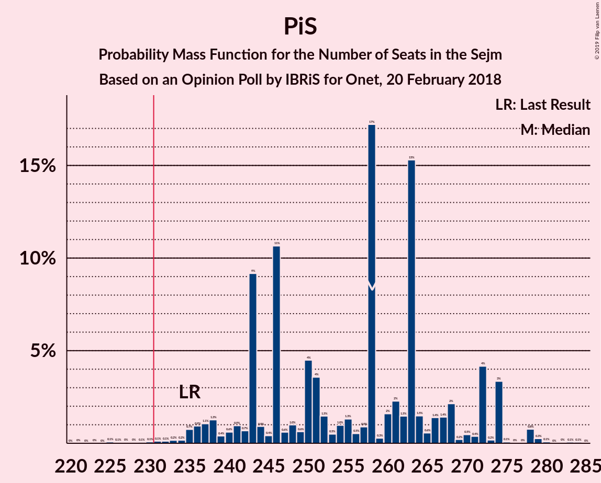
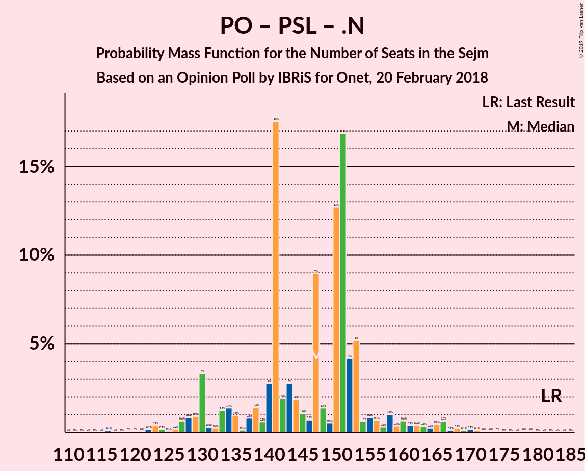

# Opinion Poll by IBRiS for Onet, 20 February 2018

<a href="#voting-intentions">Voting Intentions</a> | <a href="#seats">Seats</a> | <a href="#coalitions">Coalitions</a> | <a href="#technical-information">Technical Information</a>

## Voting Intentions

### Confidence Intervals

| Party | Last Result | Poll Result | 80% Confidence Interval | 90% Confidence Interval | 95% Confidence Interval | 99% Confidence Interval |
|:-----:|:-----------:|:-----------:|:-----------------------:|:-----------------------:|:-----------------------:|:-----------------------:|
| Prawo i Sprawiedliwość | 37.6% | 39.7% | 37.9–41.6% |37.3–42.2% |36.9–42.7% |36.0–43.6% |
| Platforma Obywatelska | 24.1% | 19.6% | 18.2–21.2% |17.7–21.7% |17.4–22.1% |16.7–22.9% |
| Sojusz Lewicy Demokratycznej | 7.6% | 9.5% | 8.4–10.7% |8.1–11.0% |7.9–11.3% |7.4–11.9% |
| Polskie Stronnictwo Ludowe | 5.1% | 6.6% | 5.8–7.7% |5.5–8.0% |5.3–8.3% |4.9–8.8% |
| Kukiz’15 | 8.8% | 5.5% | 4.8–6.5% |4.5–6.8% |4.3–7.1% |4.0–7.6% |
| .Nowoczesna | 7.6% | 4.5% | 3.8–5.5% |3.6–5.7% |3.5–5.9% |3.1–6.4% |
| Lewica Razem | 3.6% | 3.9% | 3.2–4.8% |3.1–5.0% |2.9–5.2% |2.6–5.7% |
| KORWiN | 4.8% | 1.4% | 1.0–1.9% |0.9–2.1% |0.8–2.2% |0.7–2.5% |

*Note:* The poll result column reflects the actual value used in the calculations. Published results may vary slightly, and in addition be rounded to fewer digits.

## Seats

### Confidence Intervals

| Party | Last Result | Median | 80% Confidence Interval | 90% Confidence Interval | 95% Confidence Interval | 99% Confidence Interval |
|:-----:|:-----------:|:------:|:-----------------------:|:-----------------------:|:-----------------------:|:-----------------------:|
| <a href="#prawo-i-sprawiedliwość">Prawo i Sprawiedliwość</a> | 235 | 258 | 243–269 |238–272 |236–274 |231–279 |
| <a href="#platforma-obywatelska">Platforma Obywatelska</a> | 138 | 115 | 106–126 |105–132 |102–134 |98–140 |
| <a href="#sojusz-lewicy-demokratycznej">Sojusz Lewicy Demokratycznej</a> | 0 | 46 | 41–54 |39–55 |36–58 |33–65 |
| <a href="#polskie-stronnictwo-ludowe">Polskie Stronnictwo Ludowe</a> | 16 | 24 | 21–29 |19–35 |18–38 |16–41 |
| <a href="#kukiz’15">Kukiz’15</a> | 42 | 12 | 0–22 |0–24 |0–29 |0–35 |
| <a href="#.nowoczesna">.Nowoczesna</a> | 28 | 0 | 0–12 |0–13 |0–14 |0–20 |
| <a href="#lewica-razem">Lewica Razem</a> | 0 | 0 | 0 |0 |0–8 |0–13 |
| <a href="#korwin">KORWiN</a> | 0 | 0 | 0 |0 |0 |0 |

### Prawo i Sprawiedliwość

*For a full overview of the results for this party, see the [Prawo i Sprawiedliwość](party-prawoisprawiedliwość.html) page.*

| Number of Seats | Probability | Accumulated | Special Marks |
|:---------------:|:-----------:|:-----------:|:-------------:|
| 222 | 0% | 100% |  |
| 223 | 0% | 99.9% |  |
| 224 | 0% | 99.9% |  |
| 225 | 0.1% | 99.9% |  |
| 226 | 0.1% | 99.9% |  |
| 227 | 0% | 99.8% |  |
| 228 | 0% | 99.7% |  |
| 229 | 0.1% | 99.7% |  |
| 230 | 0.1% | 99.6% |  |
| 231 | 0.1% | 99.6% | Majority |
| 232 | 0.1% | 99.4% |  |
| 233 | 0.2% | 99.3% |  |
| 234 | 0.2% | 99.2% |  |
| 235 | 0.7% | 99.0% | Last Result |
| 236 | 0.9% | 98% |  |
| 237 | 1.1% | 97% |  |
| 238 | 1.3% | 96% |  |
| 239 | 0.4% | 95% |  |
| 240 | 0.6% | 95% |  |
| 241 | 0.9% | 94% |  |
| 242 | 0.7% | 93% |  |
| 243 | 9% | 92% |  |
| 244 | 0.9% | 83% |  |
| 245 | 0.4% | 82% |  |
| 246 | 11% | 82% |  |
| 247 | 0.6% | 71% |  |
| 248 | 1.0% | 71% |  |
| 249 | 0.6% | 70% |  |
| 250 | 4% | 69% |  |
| 251 | 4% | 65% |  |
| 252 | 1.5% | 61% |  |
| 253 | 0.5% | 59% |  |
| 254 | 1.0% | 59% |  |
| 255 | 1.3% | 58% |  |
| 256 | 0.5% | 57% |  |
| 257 | 0.9% | 56% |  |
| 258 | 17% | 55% | Median |
| 259 | 0.3% | 38% |  |
| 260 | 2% | 38% |  |
| 261 | 2% | 36% |  |
| 262 | 1.5% | 34% |  |
| 263 | 15% | 32% |  |
| 264 | 1.5% | 17% |  |
| 265 | 0.6% | 16% |  |
| 266 | 1.4% | 15% |  |
| 267 | 1.4% | 14% |  |
| 268 | 2% | 12% |  |
| 269 | 0.2% | 10% |  |
| 270 | 0.5% | 10% |  |
| 271 | 0.4% | 10% |  |
| 272 | 4% | 9% |  |
| 273 | 0.2% | 5% |  |
| 274 | 3% | 5% |  |
| 275 | 0.1% | 1.4% |  |
| 276 | 0% | 1.4% |  |
| 277 | 0% | 1.3% |  |
| 278 | 0.8% | 1.3% |  |
| 279 | 0.3% | 0.6% |  |
| 280 | 0.1% | 0.3% |  |
| 281 | 0% | 0.2% |  |
| 282 | 0% | 0.2% |  |
| 283 | 0.1% | 0.2% |  |
| 284 | 0.1% | 0.1% |  |
| 285 | 0% | 0% |  |

### Platforma Obywatelska

*For a full overview of the results for this party, see the [Platforma Obywatelska](party-platformaobywatelska.html) page.*

| Number of Seats | Probability | Accumulated | Special Marks |
|:---------------:|:-----------:|:-----------:|:-------------:|
| 93 | 0% | 100% |  |
| 94 | 0% | 99.9% |  |
| 95 | 0% | 99.9% |  |
| 96 | 0.1% | 99.9% |  |
| 97 | 0.2% | 99.7% |  |
| 98 | 0.2% | 99.5% |  |
| 99 | 0.3% | 99.3% |  |
| 100 | 0.4% | 99.0% |  |
| 101 | 0.8% | 98.6% |  |
| 102 | 0.8% | 98% |  |
| 103 | 1.0% | 97% |  |
| 104 | 0.7% | 96% |  |
| 105 | 2% | 95% |  |
| 106 | 4% | 94% |  |
| 107 | 16% | 90% |  |
| 108 | 0.9% | 74% |  |
| 109 | 3% | 73% |  |
| 110 | 4% | 70% |  |
| 111 | 0.9% | 66% |  |
| 112 | 3% | 65% |  |
| 113 | 9% | 62% |  |
| 114 | 2% | 53% |  |
| 115 | 3% | 51% | Median |
| 116 | 3% | 48% |  |
| 117 | 2% | 45% |  |
| 118 | 1.0% | 43% |  |
| 119 | 0.5% | 42% |  |
| 120 | 1.1% | 42% |  |
| 121 | 2% | 41% |  |
| 122 | 0.3% | 38% |  |
| 123 | 17% | 38% |  |
| 124 | 0.5% | 21% |  |
| 125 | 11% | 21% |  |
| 126 | 0.4% | 10% |  |
| 127 | 0.2% | 10% |  |
| 128 | 0.4% | 10% |  |
| 129 | 1.1% | 9% |  |
| 130 | 2% | 8% |  |
| 131 | 0.1% | 6% |  |
| 132 | 3% | 6% |  |
| 133 | 0.2% | 3% |  |
| 134 | 1.0% | 3% |  |
| 135 | 0.2% | 2% |  |
| 136 | 0.2% | 1.5% |  |
| 137 | 0.5% | 1.3% |  |
| 138 | 0.1% | 0.8% | Last Result |
| 139 | 0.2% | 0.7% |  |
| 140 | 0.1% | 0.5% |  |
| 141 | 0.2% | 0.4% |  |
| 142 | 0.1% | 0.2% |  |
| 143 | 0% | 0.1% |  |
| 144 | 0% | 0.1% |  |
| 145 | 0% | 0.1% |  |
| 146 | 0.1% | 0.1% |  |
| 147 | 0% | 0% |  |

### Sojusz Lewicy Demokratycznej

*For a full overview of the results for this party, see the [Sojusz Lewicy Demokratycznej](party-sojuszlewicydemokratycznej.html) page.*

| Number of Seats | Probability | Accumulated | Special Marks |
|:---------------:|:-----------:|:-----------:|:-------------:|
| 0 | 0% | 100% | Last Result |
| 1 | 0% | 100% |  |
| 2 | 0% | 100% |  |
| 3 | 0% | 100% |  |
| 4 | 0% | 100% |  |
| 5 | 0% | 100% |  |
| 6 | 0% | 100% |  |
| 7 | 0% | 100% |  |
| 8 | 0% | 100% |  |
| 9 | 0% | 100% |  |
| 10 | 0% | 100% |  |
| 11 | 0% | 100% |  |
| 12 | 0% | 100% |  |
| 13 | 0% | 100% |  |
| 14 | 0% | 100% |  |
| 15 | 0% | 100% |  |
| 16 | 0% | 100% |  |
| 17 | 0% | 100% |  |
| 18 | 0% | 100% |  |
| 19 | 0% | 100% |  |
| 20 | 0% | 100% |  |
| 21 | 0% | 100% |  |
| 22 | 0% | 100% |  |
| 23 | 0% | 100% |  |
| 24 | 0% | 100% |  |
| 25 | 0% | 100% |  |
| 26 | 0% | 100% |  |
| 27 | 0% | 100% |  |
| 28 | 0% | 100% |  |
| 29 | 0% | 99.9% |  |
| 30 | 0.2% | 99.9% |  |
| 31 | 0.2% | 99.8% |  |
| 32 | 0.1% | 99.6% |  |
| 33 | 0.4% | 99.5% |  |
| 34 | 0.4% | 99.1% |  |
| 35 | 0.9% | 98.7% |  |
| 36 | 0.5% | 98% |  |
| 37 | 1.0% | 97% |  |
| 38 | 1.2% | 96% |  |
| 39 | 2% | 95% |  |
| 40 | 3% | 94% |  |
| 41 | 2% | 90% |  |
| 42 | 2% | 88% |  |
| 43 | 4% | 87% |  |
| 44 | 25% | 83% |  |
| 45 | 7% | 58% |  |
| 46 | 18% | 51% | Median |
| 47 | 1.2% | 34% |  |
| 48 | 10% | 32% |  |
| 49 | 3% | 23% |  |
| 50 | 2% | 19% |  |
| 51 | 0.8% | 17% |  |
| 52 | 0.5% | 16% |  |
| 53 | 0.4% | 16% |  |
| 54 | 10% | 16% |  |
| 55 | 1.2% | 6% |  |
| 56 | 0.3% | 4% |  |
| 57 | 2% | 4% |  |
| 58 | 0.1% | 3% |  |
| 59 | 0.3% | 2% |  |
| 60 | 0.6% | 2% |  |
| 61 | 0.3% | 2% |  |
| 62 | 0.1% | 1.3% |  |
| 63 | 0.1% | 1.2% |  |
| 64 | 0.5% | 1.0% |  |
| 65 | 0.2% | 0.5% |  |
| 66 | 0.2% | 0.4% |  |
| 67 | 0.1% | 0.2% |  |
| 68 | 0% | 0.1% |  |
| 69 | 0% | 0.1% |  |
| 70 | 0% | 0% |  |

### Polskie Stronnictwo Ludowe

*For a full overview of the results for this party, see the [Polskie Stronnictwo Ludowe](party-polskiestronnictwoludowe.html) page.*

| Number of Seats | Probability | Accumulated | Special Marks |
|:---------------:|:-----------:|:-----------:|:-------------:|
| 0 | 0.4% | 100% |  |
| 1 | 0% | 99.6% |  |
| 2 | 0% | 99.6% |  |
| 3 | 0% | 99.6% |  |
| 4 | 0% | 99.6% |  |
| 5 | 0% | 99.6% |  |
| 6 | 0% | 99.6% |  |
| 7 | 0% | 99.6% |  |
| 8 | 0% | 99.6% |  |
| 9 | 0% | 99.6% |  |
| 10 | 0% | 99.6% |  |
| 11 | 0% | 99.6% |  |
| 12 | 0% | 99.6% |  |
| 13 | 0% | 99.6% |  |
| 14 | 0.1% | 99.6% |  |
| 15 | 0% | 99.5% |  |
| 16 | 0.6% | 99.5% | Last Result |
| 17 | 0.9% | 98.9% |  |
| 18 | 2% | 98% |  |
| 19 | 3% | 96% |  |
| 20 | 0.6% | 93% |  |
| 21 | 4% | 92% |  |
| 22 | 12% | 88% |  |
| 23 | 20% | 76% |  |
| 24 | 8% | 56% | Median |
| 25 | 11% | 48% |  |
| 26 | 2% | 36% |  |
| 27 | 5% | 34% |  |
| 28 | 18% | 29% |  |
| 29 | 2% | 11% |  |
| 30 | 0.7% | 9% |  |
| 31 | 1.2% | 8% |  |
| 32 | 0.4% | 7% |  |
| 33 | 0.4% | 6% |  |
| 34 | 0.6% | 6% |  |
| 35 | 0.8% | 5% |  |
| 36 | 0.5% | 5% |  |
| 37 | 1.2% | 4% |  |
| 38 | 1.2% | 3% |  |
| 39 | 0.8% | 2% |  |
| 40 | 0.1% | 0.9% |  |
| 41 | 0.4% | 0.8% |  |
| 42 | 0% | 0.5% |  |
| 43 | 0% | 0.4% |  |
| 44 | 0.1% | 0.4% |  |
| 45 | 0% | 0.3% |  |
| 46 | 0.1% | 0.3% |  |
| 47 | 0.1% | 0.2% |  |
| 48 | 0% | 0.1% |  |
| 49 | 0.1% | 0.1% |  |
| 50 | 0% | 0% |  |

### Kukiz’15

*For a full overview of the results for this party, see the [Kukiz’15](party-kukiz’15.html) page.*

| Number of Seats | Probability | Accumulated | Special Marks |
|:---------------:|:-----------:|:-----------:|:-------------:|
| 0 | 30% | 100% |  |
| 1 | 0% | 70% |  |
| 2 | 0% | 70% |  |
| 3 | 0% | 70% |  |
| 4 | 0% | 70% |  |
| 5 | 0% | 70% |  |
| 6 | 0% | 70% |  |
| 7 | 0% | 70% |  |
| 8 | 0.3% | 70% |  |
| 9 | 1.2% | 70% |  |
| 10 | 12% | 69% |  |
| 11 | 2% | 57% |  |
| 12 | 9% | 55% | Median |
| 13 | 0.9% | 46% |  |
| 14 | 1.1% | 45% |  |
| 15 | 3% | 44% |  |
| 16 | 0.7% | 41% |  |
| 17 | 18% | 40% |  |
| 18 | 0.8% | 22% |  |
| 19 | 2% | 21% |  |
| 20 | 2% | 19% |  |
| 21 | 2% | 17% |  |
| 22 | 8% | 16% |  |
| 23 | 0.8% | 7% |  |
| 24 | 2% | 6% |  |
| 25 | 0.1% | 5% |  |
| 26 | 0.5% | 5% |  |
| 27 | 0.7% | 4% |  |
| 28 | 0.6% | 3% |  |
| 29 | 0.4% | 3% |  |
| 30 | 0.1% | 2% |  |
| 31 | 0.1% | 2% |  |
| 32 | 0.7% | 2% |  |
| 33 | 0.4% | 2% |  |
| 34 | 0.4% | 1.1% |  |
| 35 | 0.3% | 0.7% |  |
| 36 | 0.1% | 0.5% |  |
| 37 | 0.1% | 0.4% |  |
| 38 | 0.2% | 0.3% |  |
| 39 | 0% | 0.1% |  |
| 40 | 0% | 0.1% |  |
| 41 | 0% | 0.1% |  |
| 42 | 0% | 0% | Last Result |

### .Nowoczesna

*For a full overview of the results for this party, see the [.Nowoczesna](party-nowoczesna.html) page.*

| Number of Seats | Probability | Accumulated | Special Marks |
|:---------------:|:-----------:|:-----------:|:-------------:|
| 0 | 62% | 100% | Median |
| 1 | 0% | 38% |  |
| 2 | 0% | 38% |  |
| 3 | 0% | 38% |  |
| 4 | 0% | 38% |  |
| 5 | 0% | 38% |  |
| 6 | 0% | 38% |  |
| 7 | 0% | 38% |  |
| 8 | 0% | 38% |  |
| 9 | 0% | 38% |  |
| 10 | 0.4% | 38% |  |
| 11 | 17% | 38% |  |
| 12 | 14% | 21% |  |
| 13 | 4% | 7% |  |
| 14 | 1.4% | 3% |  |
| 15 | 0.4% | 2% |  |
| 16 | 0.2% | 1.3% |  |
| 17 | 0.1% | 1.1% |  |
| 18 | 0.2% | 1.0% |  |
| 19 | 0.2% | 0.8% |  |
| 20 | 0.2% | 0.6% |  |
| 21 | 0.1% | 0.3% |  |
| 22 | 0.1% | 0.2% |  |
| 23 | 0% | 0.1% |  |
| 24 | 0% | 0.1% |  |
| 25 | 0% | 0.1% |  |
| 26 | 0% | 0% |  |
| 27 | 0% | 0% |  |
| 28 | 0% | 0% | Last Result |

### Lewica Razem

*For a full overview of the results for this party, see the [Lewica Razem](party-lewicarazem.html) page.*

| Number of Seats | Probability | Accumulated | Special Marks |
|:---------------:|:-----------:|:-----------:|:-------------:|
| 0 | 97% | 100% | Last Result, Median |
| 1 | 0% | 3% |  |
| 2 | 0% | 3% |  |
| 3 | 0% | 3% |  |
| 4 | 0% | 3% |  |
| 5 | 0% | 3% |  |
| 6 | 0% | 3% |  |
| 7 | 0.1% | 3% |  |
| 8 | 0.7% | 3% |  |
| 9 | 0.4% | 2% |  |
| 10 | 0.5% | 2% |  |
| 11 | 0.1% | 1.2% |  |
| 12 | 0.2% | 1.1% |  |
| 13 | 0.5% | 0.9% |  |
| 14 | 0% | 0.5% |  |
| 15 | 0.1% | 0.4% |  |
| 16 | 0.1% | 0.3% |  |
| 17 | 0% | 0.2% |  |
| 18 | 0.1% | 0.2% |  |
| 19 | 0% | 0.1% |  |
| 20 | 0% | 0.1% |  |
| 21 | 0% | 0.1% |  |
| 22 | 0% | 0% |  |

### KORWiN

*For a full overview of the results for this party, see the [KORWiN](party-korwin.html) page.*

| Number of Seats | Probability | Accumulated | Special Marks |
|:---------------:|:-----------:|:-----------:|:-------------:|
| 0 | 100% | 100% | Last Result, Median |

## Coalitions

### Confidence Intervals

| Coalition | Last Result | Median | Majority? | 80% Confidence Interval | 90% Confidence Interval | 95% Confidence Interval | 99% Confidence Interval |
|:---------:|:-----------:|:------:|:---------:|:-----------------------:|:-----------------------:|:-----------------------:|:-----------------------:|
| Prawo i Sprawiedliwość | 235 | 258 | 99.6% | 243–269 | 238–272 | 236–274 | 231–279 |
| Platforma Obywatelska – Sojusz Lewicy Demokratycznej – Polskie Stronnictwo Ludowe – .Nowoczesna – Lewica Razem | 182 | 195 | 0% | 181–204 | 174–207 | 174–210 | 168–217 |
| Platforma Obywatelska – Sojusz Lewicy Demokratycznej – Polskie Stronnictwo Ludowe – .Nowoczesna | 182 | 195 | 0% | 180–204 | 174–207 | 174–210 | 168–217 |
| Platforma Obywatelska – Sojusz Lewicy Demokratycznej – .Nowoczesna | 166 | 169 | 0% | 154–179 | 150–180 | 148–185 | 143–190 |
| Platforma Obywatelska – Polskie Stronnictwo Ludowe – .Nowoczesna | 182 | 147 | 0% | 135–153 | 130–158 | 128–163 | 123–169 |
| Platforma Obywatelska – .Nowoczesna | 166 | 123 | 0% | 109–130 | 106–132 | 105–136 | 99–145 |
| Platforma Obywatelska | 138 | 115 | 0% | 106–126 | 105–132 | 102–134 | 98–140 |

### Prawo i Sprawiedliwość

| Number of Seats | Probability | Accumulated | Special Marks |
|:---------------:|:-----------:|:-----------:|:-------------:|
| 222 | 0% | 100% |  |
| 223 | 0% | 99.9% |  |
| 224 | 0% | 99.9% |  |
| 225 | 0.1% | 99.9% |  |
| 226 | 0.1% | 99.9% |  |
| 227 | 0% | 99.8% |  |
| 228 | 0% | 99.7% |  |
| 229 | 0.1% | 99.7% |  |
| 230 | 0.1% | 99.6% |  |
| 231 | 0.1% | 99.6% | Majority |
| 232 | 0.1% | 99.4% |  |
| 233 | 0.2% | 99.3% |  |
| 234 | 0.2% | 99.2% |  |
| 235 | 0.7% | 99.0% | Last Result |
| 236 | 0.9% | 98% |  |
| 237 | 1.1% | 97% |  |
| 238 | 1.3% | 96% |  |
| 239 | 0.4% | 95% |  |
| 240 | 0.6% | 95% |  |
| 241 | 0.9% | 94% |  |
| 242 | 0.7% | 93% |  |
| 243 | 9% | 92% |  |
| 244 | 0.9% | 83% |  |
| 245 | 0.4% | 82% |  |
| 246 | 11% | 82% |  |
| 247 | 0.6% | 71% |  |
| 248 | 1.0% | 71% |  |
| 249 | 0.6% | 70% |  |
| 250 | 4% | 69% |  |
| 251 | 4% | 65% |  |
| 252 | 1.5% | 61% |  |
| 253 | 0.5% | 59% |  |
| 254 | 1.0% | 59% |  |
| 255 | 1.3% | 58% |  |
| 256 | 0.5% | 57% |  |
| 257 | 0.9% | 56% |  |
| 258 | 17% | 55% | Median |
| 259 | 0.3% | 38% |  |
| 260 | 2% | 38% |  |
| 261 | 2% | 36% |  |
| 262 | 1.5% | 34% |  |
| 263 | 15% | 32% |  |
| 264 | 1.5% | 17% |  |
| 265 | 0.6% | 16% |  |
| 266 | 1.4% | 15% |  |
| 267 | 1.4% | 14% |  |
| 268 | 2% | 12% |  |
| 269 | 0.2% | 10% |  |
| 270 | 0.5% | 10% |  |
| 271 | 0.4% | 10% |  |
| 272 | 4% | 9% |  |
| 273 | 0.2% | 5% |  |
| 274 | 3% | 5% |  |
| 275 | 0.1% | 1.4% |  |
| 276 | 0% | 1.4% |  |
| 277 | 0% | 1.3% |  |
| 278 | 0.8% | 1.3% |  |
| 279 | 0.3% | 0.6% |  |
| 280 | 0.1% | 0.3% |  |
| 281 | 0% | 0.2% |  |
| 282 | 0% | 0.2% |  |
| 283 | 0.1% | 0.2% |  |
| 284 | 0.1% | 0.1% |  |
| 285 | 0% | 0% |  |

### Platforma Obywatelska – Sojusz Lewicy Demokratycznej – Polskie Stronnictwo Ludowe – .Nowoczesna – Lewica Razem

| Number of Seats | Probability | Accumulated | Special Marks |
|:---------------:|:-----------:|:-----------:|:-------------:|
| 158 | 0% | 100% |  |
| 159 | 0% | 99.9% |  |
| 160 | 0% | 99.9% |  |
| 161 | 0.2% | 99.9% |  |
| 162 | 0% | 99.8% |  |
| 163 | 0% | 99.7% |  |
| 164 | 0% | 99.7% |  |
| 165 | 0% | 99.7% |  |
| 166 | 0% | 99.7% |  |
| 167 | 0.1% | 99.7% |  |
| 168 | 0.2% | 99.6% |  |
| 169 | 0.2% | 99.4% |  |
| 170 | 0.1% | 99.3% |  |
| 171 | 0.1% | 99.2% |  |
| 172 | 0.9% | 99.1% |  |
| 173 | 0.2% | 98% |  |
| 174 | 4% | 98% |  |
| 175 | 0.3% | 94% |  |
| 176 | 0.3% | 94% |  |
| 177 | 1.2% | 94% |  |
| 178 | 0.9% | 93% |  |
| 179 | 1.2% | 92% |  |
| 180 | 0.2% | 91% |  |
| 181 | 2% | 90% |  |
| 182 | 0.2% | 88% | Last Result |
| 183 | 2% | 88% |  |
| 184 | 0.2% | 86% |  |
| 185 | 17% | 86% | Median |
| 186 | 1.2% | 69% |  |
| 187 | 1.4% | 68% |  |
| 188 | 4% | 66% |  |
| 189 | 1.1% | 62% |  |
| 190 | 1.5% | 61% |  |
| 191 | 0.8% | 60% |  |
| 192 | 3% | 59% |  |
| 193 | 2% | 55% |  |
| 194 | 1.1% | 54% |  |
| 195 | 9% | 53% |  |
| 196 | 0.3% | 43% |  |
| 197 | 18% | 43% |  |
| 198 | 2% | 25% |  |
| 199 | 2% | 23% |  |
| 200 | 2% | 21% |  |
| 201 | 0.8% | 19% |  |
| 202 | 0.6% | 19% |  |
| 203 | 0.3% | 18% |  |
| 204 | 10% | 18% |  |
| 205 | 0.9% | 8% |  |
| 206 | 0.4% | 7% |  |
| 207 | 2% | 6% |  |
| 208 | 0.1% | 4% |  |
| 209 | 0.2% | 4% |  |
| 210 | 2% | 4% |  |
| 211 | 0.8% | 2% |  |
| 212 | 0.1% | 2% |  |
| 213 | 0.2% | 1.4% |  |
| 214 | 0.4% | 1.3% |  |
| 215 | 0.1% | 0.9% |  |
| 216 | 0.2% | 0.7% |  |
| 217 | 0.1% | 0.6% |  |
| 218 | 0.2% | 0.5% |  |
| 219 | 0% | 0.3% |  |
| 220 | 0% | 0.3% |  |
| 221 | 0.1% | 0.2% |  |
| 222 | 0% | 0.2% |  |
| 223 | 0% | 0.2% |  |
| 224 | 0% | 0.1% |  |
| 225 | 0.1% | 0.1% |  |
| 226 | 0% | 0.1% |  |
| 227 | 0% | 0.1% |  |
| 228 | 0% | 0% |  |

### Platforma Obywatelska – Sojusz Lewicy Demokratycznej – Polskie Stronnictwo Ludowe – .Nowoczesna

| Number of Seats | Probability | Accumulated | Special Marks |
|:---------------:|:-----------:|:-----------:|:-------------:|
| 158 | 0% | 100% |  |
| 159 | 0% | 99.9% |  |
| 160 | 0% | 99.9% |  |
| 161 | 0.2% | 99.9% |  |
| 162 | 0% | 99.8% |  |
| 163 | 0% | 99.7% |  |
| 164 | 0% | 99.7% |  |
| 165 | 0% | 99.7% |  |
| 166 | 0.1% | 99.6% |  |
| 167 | 0.1% | 99.6% |  |
| 168 | 0.2% | 99.5% |  |
| 169 | 0.2% | 99.4% |  |
| 170 | 0.1% | 99.2% |  |
| 171 | 0.1% | 99.1% |  |
| 172 | 1.0% | 99.0% |  |
| 173 | 0.2% | 98% |  |
| 174 | 4% | 98% |  |
| 175 | 0.3% | 94% |  |
| 176 | 0.4% | 94% |  |
| 177 | 1.4% | 94% |  |
| 178 | 0.9% | 92% |  |
| 179 | 1.2% | 91% |  |
| 180 | 0.2% | 90% |  |
| 181 | 2% | 90% |  |
| 182 | 0.2% | 88% | Last Result |
| 183 | 2% | 88% |  |
| 184 | 0.2% | 86% |  |
| 185 | 17% | 85% | Median |
| 186 | 1.3% | 68% |  |
| 187 | 2% | 67% |  |
| 188 | 4% | 65% |  |
| 189 | 1.2% | 61% |  |
| 190 | 1.4% | 60% |  |
| 191 | 0.8% | 58% |  |
| 192 | 4% | 58% |  |
| 193 | 1.5% | 54% |  |
| 194 | 1.2% | 52% |  |
| 195 | 9% | 51% |  |
| 196 | 0.3% | 42% |  |
| 197 | 18% | 42% |  |
| 198 | 1.4% | 23% |  |
| 199 | 2% | 22% |  |
| 200 | 1.0% | 20% |  |
| 201 | 0.7% | 19% |  |
| 202 | 0.6% | 18% |  |
| 203 | 0.2% | 17% |  |
| 204 | 10% | 17% |  |
| 205 | 0.7% | 7% |  |
| 206 | 0.6% | 6% |  |
| 207 | 2% | 6% |  |
| 208 | 0.1% | 4% |  |
| 209 | 0.2% | 4% |  |
| 210 | 1.5% | 4% |  |
| 211 | 0.8% | 2% |  |
| 212 | 0.1% | 1.2% |  |
| 213 | 0.1% | 1.1% |  |
| 214 | 0.3% | 1.0% |  |
| 215 | 0.1% | 0.7% |  |
| 216 | 0.1% | 0.6% |  |
| 217 | 0.1% | 0.5% |  |
| 218 | 0.2% | 0.4% |  |
| 219 | 0% | 0.2% |  |
| 220 | 0% | 0.2% |  |
| 221 | 0.1% | 0.2% |  |
| 222 | 0% | 0.1% |  |
| 223 | 0% | 0.1% |  |
| 224 | 0% | 0.1% |  |
| 225 | 0% | 0.1% |  |
| 226 | 0% | 0.1% |  |
| 227 | 0% | 0.1% |  |
| 228 | 0% | 0% |  |

### Platforma Obywatelska – Sojusz Lewicy Demokratycznej – .Nowoczesna

| Number of Seats | Probability | Accumulated | Special Marks |
|:---------------:|:-----------:|:-----------:|:-------------:|
| 135 | 0% | 100% |  |
| 136 | 0% | 99.9% |  |
| 137 | 0.1% | 99.9% |  |
| 138 | 0% | 99.9% |  |
| 139 | 0% | 99.8% |  |
| 140 | 0% | 99.8% |  |
| 141 | 0.1% | 99.8% |  |
| 142 | 0% | 99.7% |  |
| 143 | 0.2% | 99.7% |  |
| 144 | 0% | 99.5% |  |
| 145 | 0.4% | 99.4% |  |
| 146 | 0.2% | 99.1% |  |
| 147 | 1.3% | 98.9% |  |
| 148 | 0.8% | 98% |  |
| 149 | 0.2% | 97% |  |
| 150 | 4% | 97% |  |
| 151 | 0.4% | 93% |  |
| 152 | 1.2% | 92% |  |
| 153 | 0.5% | 91% |  |
| 154 | 0.9% | 90% |  |
| 155 | 0.9% | 90% |  |
| 156 | 1.1% | 89% |  |
| 157 | 2% | 88% |  |
| 158 | 1.1% | 86% |  |
| 159 | 3% | 85% |  |
| 160 | 1.1% | 82% |  |
| 161 | 3% | 81% | Median |
| 162 | 17% | 78% |  |
| 163 | 0.8% | 62% |  |
| 164 | 2% | 61% |  |
| 165 | 0.5% | 59% |  |
| 166 | 2% | 59% | Last Result |
| 167 | 1.2% | 57% |  |
| 168 | 0.9% | 56% |  |
| 169 | 17% | 55% |  |
| 170 | 3% | 38% |  |
| 171 | 4% | 36% |  |
| 172 | 0.5% | 32% |  |
| 173 | 9% | 31% |  |
| 174 | 0.7% | 23% |  |
| 175 | 1.1% | 22% |  |
| 176 | 4% | 21% |  |
| 177 | 0.2% | 17% |  |
| 178 | 0.5% | 17% |  |
| 179 | 10% | 17% |  |
| 180 | 2% | 7% |  |
| 181 | 0.3% | 5% |  |
| 182 | 0.5% | 5% |  |
| 183 | 0.6% | 4% |  |
| 184 | 0.1% | 3% |  |
| 185 | 0.9% | 3% |  |
| 186 | 0.9% | 2% |  |
| 187 | 0.3% | 2% |  |
| 188 | 0.1% | 1.3% |  |
| 189 | 0.6% | 1.1% |  |
| 190 | 0.1% | 0.6% |  |
| 191 | 0.1% | 0.4% |  |
| 192 | 0.1% | 0.3% |  |
| 193 | 0.1% | 0.2% |  |
| 194 | 0% | 0.1% |  |
| 195 | 0% | 0.1% |  |
| 196 | 0% | 0.1% |  |
| 197 | 0% | 0% |  |

### Platforma Obywatelska – Polskie Stronnictwo Ludowe – .Nowoczesna

| Number of Seats | Probability | Accumulated | Special Marks |
|:---------------:|:-----------:|:-----------:|:-------------:|
| 113 | 0% | 100% |  |
| 114 | 0% | 99.9% |  |
| 115 | 0% | 99.9% |  |
| 116 | 0.1% | 99.9% |  |
| 117 | 0% | 99.9% |  |
| 118 | 0% | 99.8% |  |
| 119 | 0% | 99.8% |  |
| 120 | 0% | 99.8% |  |
| 121 | 0% | 99.7% |  |
| 122 | 0.2% | 99.7% |  |
| 123 | 0.4% | 99.5% |  |
| 124 | 0.1% | 99.2% |  |
| 125 | 0.1% | 99.0% |  |
| 126 | 0.2% | 99.0% |  |
| 127 | 0.6% | 98.8% |  |
| 128 | 0.8% | 98% |  |
| 129 | 0.9% | 97% |  |
| 130 | 3% | 96% |  |
| 131 | 0.3% | 93% |  |
| 132 | 0.2% | 93% |  |
| 133 | 1.2% | 93% |  |
| 134 | 1.4% | 91% |  |
| 135 | 1.0% | 90% |  |
| 136 | 0.1% | 89% |  |
| 137 | 0.8% | 89% |  |
| 138 | 1.4% | 88% |  |
| 139 | 0.6% | 87% | Median |
| 140 | 3% | 86% |  |
| 141 | 18% | 83% |  |
| 142 | 2% | 66% |  |
| 143 | 3% | 64% |  |
| 144 | 2% | 61% |  |
| 145 | 1.0% | 59% |  |
| 146 | 0.7% | 58% |  |
| 147 | 9% | 58% |  |
| 148 | 1.4% | 49% |  |
| 149 | 0.5% | 47% |  |
| 150 | 13% | 47% |  |
| 151 | 17% | 34% |  |
| 152 | 4% | 17% |  |
| 153 | 5% | 13% |  |
| 154 | 0.6% | 8% |  |
| 155 | 0.8% | 7% |  |
| 156 | 0.7% | 6% |  |
| 157 | 0.3% | 6% |  |
| 158 | 1.0% | 5% |  |
| 159 | 0.4% | 4% |  |
| 160 | 0.6% | 4% |  |
| 161 | 0.4% | 3% |  |
| 162 | 0.4% | 3% |  |
| 163 | 0.3% | 3% |  |
| 164 | 0.2% | 2% |  |
| 165 | 0.5% | 2% |  |
| 166 | 0.6% | 1.5% |  |
| 167 | 0.1% | 0.9% |  |
| 168 | 0.2% | 0.8% |  |
| 169 | 0.1% | 0.6% |  |
| 170 | 0.1% | 0.5% |  |
| 171 | 0.1% | 0.3% |  |
| 172 | 0% | 0.2% |  |
| 173 | 0% | 0.2% |  |
| 174 | 0% | 0.2% |  |
| 175 | 0% | 0.1% |  |
| 176 | 0% | 0.1% |  |
| 177 | 0% | 0.1% |  |
| 178 | 0% | 0.1% |  |
| 179 | 0% | 0.1% |  |
| 180 | 0% | 0.1% |  |
| 181 | 0% | 0% |  |
| 182 | 0% | 0% | Last Result |

### Platforma Obywatelska – .Nowoczesna

| Number of Seats | Probability | Accumulated | Special Marks |
|:---------------:|:-----------:|:-----------:|:-------------:|
| 95 | 0% | 100% |  |
| 96 | 0.1% | 99.9% |  |
| 97 | 0.1% | 99.9% |  |
| 98 | 0.2% | 99.7% |  |
| 99 | 0.3% | 99.6% |  |
| 100 | 0% | 99.3% |  |
| 101 | 0.5% | 99.3% |  |
| 102 | 0.5% | 98.8% |  |
| 103 | 0.2% | 98% |  |
| 104 | 0.6% | 98% |  |
| 105 | 1.0% | 98% |  |
| 106 | 4% | 97% |  |
| 107 | 0.3% | 93% |  |
| 108 | 0.8% | 93% |  |
| 109 | 2% | 92% |  |
| 110 | 1.0% | 90% |  |
| 111 | 0.6% | 89% |  |
| 112 | 2% | 88% |  |
| 113 | 0.2% | 86% |  |
| 114 | 2% | 86% |  |
| 115 | 2% | 83% | Median |
| 116 | 3% | 81% |  |
| 117 | 1.0% | 78% |  |
| 118 | 16% | 77% |  |
| 119 | 1.0% | 61% |  |
| 120 | 0.7% | 59% |  |
| 121 | 2% | 59% |  |
| 122 | 2% | 56% |  |
| 123 | 17% | 54% |  |
| 124 | 0.9% | 37% |  |
| 125 | 21% | 36% |  |
| 126 | 0.5% | 15% |  |
| 127 | 1.2% | 15% |  |
| 128 | 0.9% | 14% |  |
| 129 | 2% | 13% |  |
| 130 | 3% | 11% |  |
| 131 | 0.1% | 8% |  |
| 132 | 3% | 8% |  |
| 133 | 0.8% | 4% |  |
| 134 | 0.7% | 4% |  |
| 135 | 0.3% | 3% |  |
| 136 | 0.2% | 3% |  |
| 137 | 0.6% | 2% |  |
| 138 | 0.1% | 2% |  |
| 139 | 0.3% | 2% |  |
| 140 | 0.1% | 1.4% |  |
| 141 | 0.3% | 1.3% |  |
| 142 | 0.2% | 1.0% |  |
| 143 | 0.1% | 0.8% |  |
| 144 | 0% | 0.8% |  |
| 145 | 0.5% | 0.7% |  |
| 146 | 0.1% | 0.2% |  |
| 147 | 0% | 0.1% |  |
| 148 | 0% | 0.1% |  |
| 149 | 0% | 0.1% |  |
| 150 | 0% | 0.1% |  |
| 151 | 0% | 0.1% |  |
| 152 | 0% | 0% |  |
| 153 | 0% | 0% |  |
| 154 | 0% | 0% |  |
| 155 | 0% | 0% |  |
| 156 | 0% | 0% |  |
| 157 | 0% | 0% |  |
| 158 | 0% | 0% |  |
| 159 | 0% | 0% |  |
| 160 | 0% | 0% |  |
| 161 | 0% | 0% |  |
| 162 | 0% | 0% |  |
| 163 | 0% | 0% |  |
| 164 | 0% | 0% |  |
| 165 | 0% | 0% |  |
| 166 | 0% | 0% | Last Result |

### Platforma Obywatelska

| Number of Seats | Probability | Accumulated | Special Marks |
|:---------------:|:-----------:|:-----------:|:-------------:|
| 93 | 0% | 100% |  |
| 94 | 0% | 99.9% |  |
| 95 | 0% | 99.9% |  |
| 96 | 0.1% | 99.9% |  |
| 97 | 0.2% | 99.7% |  |
| 98 | 0.2% | 99.5% |  |
| 99 | 0.3% | 99.3% |  |
| 100 | 0.4% | 99.0% |  |
| 101 | 0.8% | 98.6% |  |
| 102 | 0.8% | 98% |  |
| 103 | 1.0% | 97% |  |
| 104 | 0.7% | 96% |  |
| 105 | 2% | 95% |  |
| 106 | 4% | 94% |  |
| 107 | 16% | 90% |  |
| 108 | 0.9% | 74% |  |
| 109 | 3% | 73% |  |
| 110 | 4% | 70% |  |
| 111 | 0.9% | 66% |  |
| 112 | 3% | 65% |  |
| 113 | 9% | 62% |  |
| 114 | 2% | 53% |  |
| 115 | 3% | 51% | Median |
| 116 | 3% | 48% |  |
| 117 | 2% | 45% |  |
| 118 | 1.0% | 43% |  |
| 119 | 0.5% | 42% |  |
| 120 | 1.1% | 42% |  |
| 121 | 2% | 41% |  |
| 122 | 0.3% | 38% |  |
| 123 | 17% | 38% |  |
| 124 | 0.5% | 21% |  |
| 125 | 11% | 21% |  |
| 126 | 0.4% | 10% |  |
| 127 | 0.2% | 10% |  |
| 128 | 0.4% | 10% |  |
| 129 | 1.1% | 9% |  |
| 130 | 2% | 8% |  |
| 131 | 0.1% | 6% |  |
| 132 | 3% | 6% |  |
| 133 | 0.2% | 3% |  |
| 134 | 1.0% | 3% |  |
| 135 | 0.2% | 2% |  |
| 136 | 0.2% | 1.5% |  |
| 137 | 0.5% | 1.3% |  |
| 138 | 0.1% | 0.8% | Last Result |
| 139 | 0.2% | 0.7% |  |
| 140 | 0.1% | 0.5% |  |
| 141 | 0.2% | 0.4% |  |
| 142 | 0.1% | 0.2% |  |
| 143 | 0% | 0.1% |  |
| 144 | 0% | 0.1% |  |
| 145 | 0% | 0.1% |  |
| 146 | 0.1% | 0.1% |  |
| 147 | 0% | 0% |  |

## Technical Information

### Opinion Poll

+ **Polling firm:** IBRiS
+ **Commissioner(s):** Onet
+ **Fieldwork period:** 20 February 2018

### Calculations

+ **Sample size:** 1100
+ **Simulations done:** 131,072
+ **Error estimate:** 2.65%

