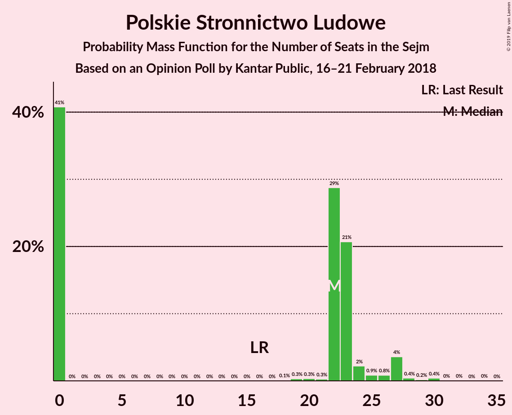

# Opinion Poll by Kantar Public, 16–21 February 2018

<a href="#voting-intentions">Voting Intentions</a> | <a href="#seats">Seats</a> | <a href="#coalitions">Coalitions</a> | <a href="#technical-information">Technical Information</a>

## Voting Intentions

### Confidence Intervals

| Party | Last Result | Poll Result | 80% Confidence Interval | 90% Confidence Interval | 95% Confidence Interval | 99% Confidence Interval |
|:-----:|:-----------:|:-----------:|:-----------------------:|:-----------------------:|:-----------------------:|:-----------------------:|
| Prawo i Sprawiedliwość | 37.6% | 37.0% | 35.1–38.9% |34.5–39.5% |34.1–40.0% |33.2–40.9% |
| Platforma Obywatelska | 24.1% | 20.0% | 18.5–21.7% |18.1–22.2% |17.7–22.6% |17.0–23.4% |
| Kukiz’15 | 8.8% | 7.0% | 6.1–8.1% |5.8–8.4% |5.6–8.7% |5.2–9.3% |
| .Nowoczesna | 7.6% | 6.0% | 5.2–7.1% |4.9–7.4% |4.7–7.6% |4.3–8.2% |
| Polskie Stronnictwo Ludowe | 5.1% | 5.0% | 4.3–6.0% |4.0–6.3% |3.9–6.6% |3.5–7.1% |
| Sojusz Lewicy Demokratycznej | 7.6% | 5.0% | 4.3–6.0% |4.0–6.3% |3.9–6.6% |3.5–7.1% |
| Lewica Razem | 3.6% | 2.0% | 1.6–2.7% |1.4–2.9% |1.3–3.1% |1.1–3.5% |
| KORWiN | 4.8% | 1.0% | 0.7–1.5% |0.6–1.6% |0.5–1.8% |0.4–2.1% |

*Note:* The poll result column reflects the actual value used in the calculations. Published results may vary slightly, and in addition be rounded to fewer digits.

## Seats

### Confidence Intervals

| Party | Last Result | Median | 80% Confidence Interval | 90% Confidence Interval | 95% Confidence Interval | 99% Confidence Interval |
|:-----:|:-----------:|:------:|:-----------------------:|:-----------------------:|:-----------------------:|:-----------------------:|
| <a href="#prawo-i-sprawiedliwość">Prawo i Sprawiedliwość</a> | 235 | 245 | 242–253 |242–253 |239–253 |231–253 |
| <a href="#platforma-obywatelska">Platforma Obywatelska</a> | 138 | 139 | 132–147 |120–147 |120–147 |120–147 |
| <a href="#kukiz’15">Kukiz’15</a> | 42 | 27 | 27–45 |27–46 |27–46 |27–46 |
| <a href="#.nowoczesna">.Nowoczesna</a> | 28 | 32 | 0–33 |0–33 |0–33 |0–34 |
| <a href="#polskie-stronnictwo-ludowe">Polskie Stronnictwo Ludowe</a> | 16 | 0 | 0–20 |0–20 |0–23 |0–23 |
| <a href="#sojusz-lewicy-demokratycznej">Sojusz Lewicy Demokratycznej</a> | 0 | 0 | 0–28 |0–28 |0–28 |0–29 |
| <a href="#lewica-razem">Lewica Razem</a> | 0 | 0 | 0 |0 |0 |0 |
| <a href="#korwin">KORWiN</a> | 0 | 0 | 0 |0 |0 |0 |

### Prawo i Sprawiedliwość

*For a full overview of the results for this party, see the [Prawo i Sprawiedliwość](party-prawoisprawiedliwość.html) page.*

| Number of Seats | Probability | Accumulated | Special Marks |
|:---------------:|:-----------:|:-----------:|:-------------:|
| 221 | 0.2% | 100% |  |
| 222 | 0% | 99.8% |  |
| 223 | 0% | 99.8% |  |
| 224 | 0% | 99.8% |  |
| 225 | 0% | 99.8% |  |
| 226 | 0.1% | 99.8% |  |
| 227 | 0% | 99.7% |  |
| 228 | 0% | 99.7% |  |
| 229 | 0% | 99.7% |  |
| 230 | 0% | 99.7% |  |
| 231 | 0.1% | 99.6% | Majority |
| 232 | 0% | 99.5% |  |
| 233 | 0% | 99.5% |  |
| 234 | 0% | 99.5% |  |
| 235 | 0% | 99.5% | Last Result |
| 236 | 0.7% | 99.5% |  |
| 237 | 0.3% | 98.8% |  |
| 238 | 0% | 98.5% |  |
| 239 | 3% | 98.5% |  |
| 240 | 0.1% | 96% |  |
| 241 | 0.2% | 95% |  |
| 242 | 38% | 95% |  |
| 243 | 0.2% | 57% |  |
| 244 | 0% | 57% |  |
| 245 | 21% | 57% | Median |
| 246 | 0.4% | 36% |  |
| 247 | 6% | 35% |  |
| 248 | 6% | 30% |  |
| 249 | 3% | 23% |  |
| 250 | 0% | 20% |  |
| 251 | 1.0% | 20% |  |
| 252 | 0% | 19% |  |
| 253 | 19% | 19% |  |
| 254 | 0% | 0.2% |  |
| 255 | 0% | 0.2% |  |
| 256 | 0% | 0.2% |  |
| 257 | 0.2% | 0.2% |  |
| 258 | 0% | 0% |  |

### Platforma Obywatelska

*For a full overview of the results for this party, see the [Platforma Obywatelska](party-platformaobywatelska.html) page.*

| Number of Seats | Probability | Accumulated | Special Marks |
|:---------------:|:-----------:|:-----------:|:-------------:|
| 119 | 0.4% | 100% |  |
| 120 | 6% | 99.6% |  |
| 121 | 1.1% | 94% |  |
| 122 | 0% | 93% |  |
| 123 | 0% | 93% |  |
| 124 | 0.1% | 93% |  |
| 125 | 0% | 93% |  |
| 126 | 0.2% | 93% |  |
| 127 | 0% | 93% |  |
| 128 | 0% | 93% |  |
| 129 | 0% | 93% |  |
| 130 | 0.2% | 93% |  |
| 131 | 0% | 92% |  |
| 132 | 3% | 92% |  |
| 133 | 0.1% | 89% |  |
| 134 | 0% | 89% |  |
| 135 | 0% | 89% |  |
| 136 | 4% | 89% |  |
| 137 | 0% | 85% |  |
| 138 | 0% | 85% | Last Result |
| 139 | 39% | 85% | Median |
| 140 | 0% | 47% |  |
| 141 | 6% | 47% |  |
| 142 | 21% | 41% |  |
| 143 | 0% | 19% |  |
| 144 | 0% | 19% |  |
| 145 | 0% | 19% |  |
| 146 | 0.2% | 19% |  |
| 147 | 19% | 19% |  |
| 148 | 0% | 0% |  |

### Kukiz’15

*For a full overview of the results for this party, see the [Kukiz’15](party-kukiz’15.html) page.*

| Number of Seats | Probability | Accumulated | Special Marks |
|:---------------:|:-----------:|:-----------:|:-------------:|
| 19 | 0% | 100% |  |
| 20 | 0% | 99.9% |  |
| 21 | 0% | 99.9% |  |
| 22 | 0% | 99.9% |  |
| 23 | 0% | 99.9% |  |
| 24 | 0.2% | 99.9% |  |
| 25 | 0% | 99.8% |  |
| 26 | 0% | 99.8% |  |
| 27 | 57% | 99.8% | Median |
| 28 | 0.2% | 43% |  |
| 29 | 0.2% | 43% |  |
| 30 | 0% | 43% |  |
| 31 | 0.5% | 43% |  |
| 32 | 0% | 42% |  |
| 33 | 0.1% | 42% |  |
| 34 | 0.2% | 42% |  |
| 35 | 0.2% | 42% |  |
| 36 | 0% | 42% |  |
| 37 | 0.1% | 42% |  |
| 38 | 3% | 41% |  |
| 39 | 0.2% | 39% |  |
| 40 | 0% | 39% |  |
| 41 | 0.7% | 39% |  |
| 42 | 3% | 38% | Last Result |
| 43 | 6% | 35% |  |
| 44 | 1.0% | 29% |  |
| 45 | 22% | 28% |  |
| 46 | 6% | 6% |  |
| 47 | 0% | 0% |  |

### .Nowoczesna

*For a full overview of the results for this party, see the [.Nowoczesna](party-nowoczesna.html) page.*

| Number of Seats | Probability | Accumulated | Special Marks |
|:---------------:|:-----------:|:-----------:|:-------------:|
| 0 | 30% | 100% |  |
| 1 | 0% | 70% |  |
| 2 | 0% | 70% |  |
| 3 | 0% | 70% |  |
| 4 | 0% | 70% |  |
| 5 | 0% | 70% |  |
| 6 | 0% | 70% |  |
| 7 | 0% | 70% |  |
| 8 | 0% | 70% |  |
| 9 | 0% | 70% |  |
| 10 | 0% | 70% |  |
| 11 | 0.7% | 70% |  |
| 12 | 0.1% | 69% |  |
| 13 | 0% | 69% |  |
| 14 | 0% | 69% |  |
| 15 | 0% | 69% |  |
| 16 | 0% | 69% |  |
| 17 | 0% | 69% |  |
| 18 | 0% | 69% |  |
| 19 | 0% | 69% |  |
| 20 | 0% | 69% |  |
| 21 | 0% | 69% |  |
| 22 | 0% | 69% |  |
| 23 | 0% | 69% |  |
| 24 | 0% | 69% |  |
| 25 | 0% | 69% |  |
| 26 | 7% | 69% |  |
| 27 | 0.4% | 62% |  |
| 28 | 0% | 61% | Last Result |
| 29 | 0.1% | 61% |  |
| 30 | 0.2% | 61% |  |
| 31 | 0% | 61% |  |
| 32 | 38% | 61% | Median |
| 33 | 22% | 23% |  |
| 34 | 1.3% | 2% |  |
| 35 | 0% | 0.3% |  |
| 36 | 0.1% | 0.3% |  |
| 37 | 0% | 0.2% |  |
| 38 | 0.2% | 0.2% |  |
| 39 | 0% | 0% |  |

### Polskie Stronnictwo Ludowe

*For a full overview of the results for this party, see the [Polskie Stronnictwo Ludowe](party-polskiestronnictwoludowe.html) page.*

| Number of Seats | Probability | Accumulated | Special Marks |
|:---------------:|:-----------:|:-----------:|:-------------:|
| 0 | 58% | 100% | Median |
| 1 | 0% | 42% |  |
| 2 | 0% | 42% |  |
| 3 | 0% | 42% |  |
| 4 | 0% | 42% |  |
| 5 | 0% | 42% |  |
| 6 | 0% | 42% |  |
| 7 | 0% | 42% |  |
| 8 | 0% | 42% |  |
| 9 | 0% | 42% |  |
| 10 | 0% | 42% |  |
| 11 | 0% | 42% |  |
| 12 | 0% | 42% |  |
| 13 | 0% | 42% |  |
| 14 | 0% | 42% |  |
| 15 | 0% | 42% |  |
| 16 | 0% | 42% | Last Result |
| 17 | 0% | 42% |  |
| 18 | 0% | 42% |  |
| 19 | 0% | 42% |  |
| 20 | 38% | 42% |  |
| 21 | 0.1% | 4% |  |
| 22 | 0% | 4% |  |
| 23 | 3% | 4% |  |
| 24 | 0.3% | 0.4% |  |
| 25 | 0% | 0.1% |  |
| 26 | 0% | 0.1% |  |
| 27 | 0% | 0.1% |  |
| 28 | 0% | 0.1% |  |
| 29 | 0% | 0.1% |  |
| 30 | 0% | 0% |  |

### Sojusz Lewicy Demokratycznej

*For a full overview of the results for this party, see the [Sojusz Lewicy Demokratycznej](party-sojuszlewicydemokratycznej.html) page.*

| Number of Seats | Probability | Accumulated | Special Marks |
|:---------------:|:-----------:|:-----------:|:-------------:|
| 0 | 61% | 100% | Last Result, Median |
| 1 | 0% | 39% |  |
| 2 | 0% | 39% |  |
| 3 | 0% | 39% |  |
| 4 | 0% | 39% |  |
| 5 | 0% | 39% |  |
| 6 | 0% | 39% |  |
| 7 | 0% | 39% |  |
| 8 | 0% | 39% |  |
| 9 | 0% | 39% |  |
| 10 | 0% | 39% |  |
| 11 | 0% | 39% |  |
| 12 | 0% | 39% |  |
| 13 | 0.1% | 39% |  |
| 14 | 0% | 39% |  |
| 15 | 0% | 39% |  |
| 16 | 0% | 39% |  |
| 17 | 0% | 39% |  |
| 18 | 1.0% | 39% |  |
| 19 | 0% | 38% |  |
| 20 | 0% | 38% |  |
| 21 | 6% | 38% |  |
| 22 | 0.4% | 32% |  |
| 23 | 0% | 32% |  |
| 24 | 0% | 32% |  |
| 25 | 0.2% | 32% |  |
| 26 | 0% | 31% |  |
| 27 | 0% | 31% |  |
| 28 | 30% | 31% |  |
| 29 | 1.3% | 1.5% |  |
| 30 | 0.2% | 0.2% |  |
| 31 | 0% | 0% |  |

### Lewica Razem

*For a full overview of the results for this party, see the [Lewica Razem](party-lewicarazem.html) page.*

| Number of Seats | Probability | Accumulated | Special Marks |
|:---------------:|:-----------:|:-----------:|:-------------:|
| 0 | 100% | 100% | Last Result, Median |

### KORWiN

*For a full overview of the results for this party, see the [KORWiN](party-korwin.html) page.*

| Number of Seats | Probability | Accumulated | Special Marks |
|:---------------:|:-----------:|:-----------:|:-------------:|
| 0 | 100% | 100% | Last Result, Median |

## Coalitions

### Confidence Intervals

| Coalition | Last Result | Median | Majority? | 80% Confidence Interval | 90% Confidence Interval | 95% Confidence Interval | 99% Confidence Interval |
|:---------:|:-----------:|:------:|:---------:|:-----------------------:|:-----------------------:|:-----------------------:|:-----------------------:|
| Prawo i Sprawiedliwość | 235 | 245 | 99.6% | 242–253 | 242–253 | 239–253 | 231–253 |
| Platforma Obywatelska – .Nowoczesna – Polskie Stronnictwo Ludowe – Sojusz Lewicy Demokratycznej – Lewica Razem | 182 | 180 | 0% | 169–191 | 167–191 | 167–191 | 165–196 |
| Platforma Obywatelska – .Nowoczesna – Polskie Stronnictwo Ludowe – Sojusz Lewicy Demokratycznej | 182 | 180 | 0% | 169–191 | 167–191 | 167–191 | 165–196 |
| Platforma Obywatelska – .Nowoczesna – Polskie Stronnictwo Ludowe | 182 | 180 | 0% | 142–191 | 141–191 | 141–191 | 141–191 |
| Platforma Obywatelska – .Nowoczesna – Sojusz Lewicy Demokratycznej | 166 | 171 | 0% | 168–180 | 167–180 | 160–180 | 160–180 |
| Platforma Obywatelska – .Nowoczesna | 166 | 171 | 0% | 142–180 | 141–180 | 132–180 | 132–180 |
| Platforma Obywatelska | 138 | 139 | 0% | 132–147 | 120–147 | 120–147 | 120–147 |

### Prawo i Sprawiedliwość

| Number of Seats | Probability | Accumulated | Special Marks |
|:---------------:|:-----------:|:-----------:|:-------------:|
| 221 | 0.2% | 100% |  |
| 222 | 0% | 99.8% |  |
| 223 | 0% | 99.8% |  |
| 224 | 0% | 99.8% |  |
| 225 | 0% | 99.8% |  |
| 226 | 0.1% | 99.8% |  |
| 227 | 0% | 99.7% |  |
| 228 | 0% | 99.7% |  |
| 229 | 0% | 99.7% |  |
| 230 | 0% | 99.7% |  |
| 231 | 0.1% | 99.6% | Majority |
| 232 | 0% | 99.5% |  |
| 233 | 0% | 99.5% |  |
| 234 | 0% | 99.5% |  |
| 235 | 0% | 99.5% | Last Result |
| 236 | 0.7% | 99.5% |  |
| 237 | 0.3% | 98.8% |  |
| 238 | 0% | 98.5% |  |
| 239 | 3% | 98.5% |  |
| 240 | 0.1% | 96% |  |
| 241 | 0.2% | 95% |  |
| 242 | 38% | 95% |  |
| 243 | 0.2% | 57% |  |
| 244 | 0% | 57% |  |
| 245 | 21% | 57% | Median |
| 246 | 0.4% | 36% |  |
| 247 | 6% | 35% |  |
| 248 | 6% | 30% |  |
| 249 | 3% | 23% |  |
| 250 | 0% | 20% |  |
| 251 | 1.0% | 20% |  |
| 252 | 0% | 19% |  |
| 253 | 19% | 19% |  |
| 254 | 0% | 0.2% |  |
| 255 | 0% | 0.2% |  |
| 256 | 0% | 0.2% |  |
| 257 | 0.2% | 0.2% |  |
| 258 | 0% | 0% |  |

### Platforma Obywatelska – .Nowoczesna – Polskie Stronnictwo Ludowe – Sojusz Lewicy Demokratycznej – Lewica Razem

| Number of Seats | Probability | Accumulated | Special Marks |
|:---------------:|:-----------:|:-----------:|:-------------:|
| 165 | 1.0% | 100% |  |
| 166 | 0% | 99.0% |  |
| 167 | 6% | 99.0% |  |
| 168 | 0.4% | 93% |  |
| 169 | 9% | 93% |  |
| 170 | 22% | 84% |  |
| 171 | 0% | 62% | Median |
| 172 | 0% | 62% |  |
| 173 | 0% | 62% |  |
| 174 | 0% | 62% |  |
| 175 | 0% | 62% |  |
| 176 | 0% | 62% |  |
| 177 | 0% | 62% |  |
| 178 | 0.2% | 62% |  |
| 179 | 1.3% | 62% |  |
| 180 | 19% | 61% |  |
| 181 | 0% | 42% |  |
| 182 | 0% | 42% | Last Result |
| 183 | 2% | 42% |  |
| 184 | 0.4% | 39% |  |
| 185 | 0% | 39% |  |
| 186 | 0% | 39% |  |
| 187 | 0% | 39% |  |
| 188 | 0% | 39% |  |
| 189 | 0% | 39% |  |
| 190 | 0.5% | 39% |  |
| 191 | 38% | 38% |  |
| 192 | 0% | 0.5% |  |
| 193 | 0% | 0.5% |  |
| 194 | 0% | 0.5% |  |
| 195 | 0% | 0.5% |  |
| 196 | 0.1% | 0.5% |  |
| 197 | 0% | 0.4% |  |
| 198 | 0% | 0.4% |  |
| 199 | 0% | 0.4% |  |
| 200 | 0% | 0.4% |  |
| 201 | 0% | 0.4% |  |
| 202 | 0% | 0.4% |  |
| 203 | 0% | 0.4% |  |
| 204 | 0% | 0.4% |  |
| 205 | 0% | 0.4% |  |
| 206 | 0.1% | 0.4% |  |
| 207 | 0% | 0.2% |  |
| 208 | 0% | 0.2% |  |
| 209 | 0% | 0.2% |  |
| 210 | 0.2% | 0.2% |  |
| 211 | 0% | 0.1% |  |
| 212 | 0% | 0.1% |  |
| 213 | 0% | 0% |  |

### Platforma Obywatelska – .Nowoczesna – Polskie Stronnictwo Ludowe – Sojusz Lewicy Demokratycznej

| Number of Seats | Probability | Accumulated | Special Marks |
|:---------------:|:-----------:|:-----------:|:-------------:|
| 165 | 1.0% | 100% |  |
| 166 | 0% | 99.0% |  |
| 167 | 6% | 99.0% |  |
| 168 | 0.4% | 93% |  |
| 169 | 9% | 93% |  |
| 170 | 22% | 84% |  |
| 171 | 0% | 62% | Median |
| 172 | 0% | 62% |  |
| 173 | 0% | 62% |  |
| 174 | 0% | 62% |  |
| 175 | 0% | 62% |  |
| 176 | 0% | 62% |  |
| 177 | 0% | 62% |  |
| 178 | 0.2% | 62% |  |
| 179 | 1.3% | 62% |  |
| 180 | 19% | 61% |  |
| 181 | 0% | 42% |  |
| 182 | 0% | 42% | Last Result |
| 183 | 2% | 42% |  |
| 184 | 0.4% | 39% |  |
| 185 | 0% | 39% |  |
| 186 | 0% | 39% |  |
| 187 | 0% | 39% |  |
| 188 | 0% | 39% |  |
| 189 | 0% | 39% |  |
| 190 | 0.5% | 39% |  |
| 191 | 38% | 38% |  |
| 192 | 0% | 0.5% |  |
| 193 | 0% | 0.5% |  |
| 194 | 0% | 0.5% |  |
| 195 | 0% | 0.5% |  |
| 196 | 0.1% | 0.5% |  |
| 197 | 0% | 0.4% |  |
| 198 | 0% | 0.4% |  |
| 199 | 0% | 0.4% |  |
| 200 | 0% | 0.4% |  |
| 201 | 0% | 0.4% |  |
| 202 | 0% | 0.4% |  |
| 203 | 0% | 0.4% |  |
| 204 | 0% | 0.4% |  |
| 205 | 0% | 0.4% |  |
| 206 | 0.1% | 0.4% |  |
| 207 | 0% | 0.2% |  |
| 208 | 0% | 0.2% |  |
| 209 | 0% | 0.2% |  |
| 210 | 0.2% | 0.2% |  |
| 211 | 0% | 0.1% |  |
| 212 | 0% | 0.1% |  |
| 213 | 0% | 0% |  |

### Platforma Obywatelska – .Nowoczesna – Polskie Stronnictwo Ludowe

| Number of Seats | Probability | Accumulated | Special Marks |
|:---------------:|:-----------:|:-----------:|:-------------:|
| 141 | 6% | 100% |  |
| 142 | 21% | 94% |  |
| 143 | 0% | 72% |  |
| 144 | 0% | 72% |  |
| 145 | 0% | 72% |  |
| 146 | 6% | 72% |  |
| 147 | 1.0% | 66% |  |
| 148 | 0% | 65% |  |
| 149 | 0% | 65% |  |
| 150 | 0.7% | 65% |  |
| 151 | 0% | 65% |  |
| 152 | 0% | 65% |  |
| 153 | 0% | 65% |  |
| 154 | 0% | 65% |  |
| 155 | 3% | 65% |  |
| 156 | 0% | 62% |  |
| 157 | 0% | 62% |  |
| 158 | 0% | 62% |  |
| 159 | 0% | 62% |  |
| 160 | 0% | 62% |  |
| 161 | 0% | 62% |  |
| 162 | 0% | 62% |  |
| 163 | 0% | 62% |  |
| 164 | 0% | 62% |  |
| 165 | 0.1% | 62% |  |
| 166 | 0% | 62% |  |
| 167 | 0% | 62% |  |
| 168 | 0% | 62% |  |
| 169 | 3% | 62% |  |
| 170 | 0.7% | 59% |  |
| 171 | 0.1% | 58% | Median |
| 172 | 0% | 58% |  |
| 173 | 0% | 58% |  |
| 174 | 0% | 58% |  |
| 175 | 0% | 58% |  |
| 176 | 0% | 58% |  |
| 177 | 0.1% | 58% |  |
| 178 | 0.1% | 58% |  |
| 179 | 0.5% | 58% |  |
| 180 | 19% | 58% |  |
| 181 | 0% | 38% |  |
| 182 | 0% | 38% | Last Result |
| 183 | 0% | 38% |  |
| 184 | 0% | 38% |  |
| 185 | 0% | 38% |  |
| 186 | 0% | 38% |  |
| 187 | 0% | 38% |  |
| 188 | 0% | 38% |  |
| 189 | 0% | 38% |  |
| 190 | 0.5% | 38% |  |
| 191 | 38% | 38% |  |
| 192 | 0% | 0.1% |  |
| 193 | 0% | 0.1% |  |
| 194 | 0% | 0% |  |

### Platforma Obywatelska – .Nowoczesna – Sojusz Lewicy Demokratycznej

| Number of Seats | Probability | Accumulated | Special Marks |
|:---------------:|:-----------:|:-----------:|:-------------:|
| 156 | 0.2% | 100% |  |
| 157 | 0% | 99.8% |  |
| 158 | 0% | 99.8% |  |
| 159 | 0% | 99.8% |  |
| 160 | 2% | 99.8% |  |
| 161 | 0.4% | 97% |  |
| 162 | 0% | 97% |  |
| 163 | 0% | 97% |  |
| 164 | 0% | 97% |  |
| 165 | 1.0% | 97% |  |
| 166 | 0% | 96% | Last Result |
| 167 | 6% | 96% |  |
| 168 | 0.4% | 90% |  |
| 169 | 9% | 90% |  |
| 170 | 23% | 81% |  |
| 171 | 38% | 58% | Median |
| 172 | 0% | 21% |  |
| 173 | 0.1% | 21% |  |
| 174 | 0% | 21% |  |
| 175 | 0% | 21% |  |
| 176 | 0% | 21% |  |
| 177 | 0% | 21% |  |
| 178 | 0.2% | 21% |  |
| 179 | 1.1% | 20% |  |
| 180 | 19% | 19% |  |
| 181 | 0% | 0.4% |  |
| 182 | 0.1% | 0.4% |  |
| 183 | 0% | 0.2% |  |
| 184 | 0% | 0.2% |  |
| 185 | 0% | 0.2% |  |
| 186 | 0.2% | 0.2% |  |
| 187 | 0% | 0% |  |

### Platforma Obywatelska – .Nowoczesna

| Number of Seats | Probability | Accumulated | Special Marks |
|:---------------:|:-----------:|:-----------:|:-------------:|
| 132 | 3% | 100% |  |
| 133 | 0% | 97% |  |
| 134 | 0% | 97% |  |
| 135 | 0% | 97% |  |
| 136 | 0% | 97% |  |
| 137 | 0% | 97% |  |
| 138 | 0% | 97% |  |
| 139 | 0% | 97% |  |
| 140 | 0% | 97% |  |
| 141 | 6% | 97% |  |
| 142 | 21% | 91% |  |
| 143 | 0% | 70% |  |
| 144 | 0% | 70% |  |
| 145 | 0% | 70% |  |
| 146 | 6% | 70% |  |
| 147 | 1.0% | 64% |  |
| 148 | 0.1% | 63% |  |
| 149 | 0% | 62% |  |
| 150 | 0.7% | 62% |  |
| 151 | 0% | 62% |  |
| 152 | 0% | 62% |  |
| 153 | 0.1% | 62% |  |
| 154 | 0% | 61% |  |
| 155 | 0% | 61% |  |
| 156 | 0.4% | 61% |  |
| 157 | 0% | 61% |  |
| 158 | 0% | 61% |  |
| 159 | 0% | 61% |  |
| 160 | 0% | 61% |  |
| 161 | 0% | 61% |  |
| 162 | 0% | 61% |  |
| 163 | 0% | 61% |  |
| 164 | 0% | 61% |  |
| 165 | 0.1% | 61% |  |
| 166 | 0% | 61% | Last Result |
| 167 | 0% | 61% |  |
| 168 | 0% | 61% |  |
| 169 | 3% | 61% |  |
| 170 | 1.3% | 58% |  |
| 171 | 38% | 57% | Median |
| 172 | 0% | 19% |  |
| 173 | 0% | 19% |  |
| 174 | 0% | 19% |  |
| 175 | 0% | 19% |  |
| 176 | 0% | 19% |  |
| 177 | 0% | 19% |  |
| 178 | 0.1% | 19% |  |
| 179 | 0.3% | 19% |  |
| 180 | 19% | 19% |  |
| 181 | 0% | 0% |  |

### Platforma Obywatelska

| Number of Seats | Probability | Accumulated | Special Marks |
|:---------------:|:-----------:|:-----------:|:-------------:|
| 119 | 0.4% | 100% |  |
| 120 | 6% | 99.6% |  |
| 121 | 1.1% | 94% |  |
| 122 | 0% | 93% |  |
| 123 | 0% | 93% |  |
| 124 | 0.1% | 93% |  |
| 125 | 0% | 93% |  |
| 126 | 0.2% | 93% |  |
| 127 | 0% | 93% |  |
| 128 | 0% | 93% |  |
| 129 | 0% | 93% |  |
| 130 | 0.2% | 93% |  |
| 131 | 0% | 92% |  |
| 132 | 3% | 92% |  |
| 133 | 0.1% | 89% |  |
| 134 | 0% | 89% |  |
| 135 | 0% | 89% |  |
| 136 | 4% | 89% |  |
| 137 | 0% | 85% |  |
| 138 | 0% | 85% | Last Result |
| 139 | 39% | 85% | Median |
| 140 | 0% | 47% |  |
| 141 | 6% | 47% |  |
| 142 | 21% | 41% |  |
| 143 | 0% | 19% |  |
| 144 | 0% | 19% |  |
| 145 | 0% | 19% |  |
| 146 | 0.2% | 19% |  |
| 147 | 19% | 19% |  |
| 148 | 0% | 0% |  |

## Technical Information

### Opinion Poll

+ **Polling firm:** Kantar Public
+ **Commissioner(s):** —
+ **Fieldwork period:** 16–21 February 2018

### Calculations

+ **Sample size:** 1033
+ **Simulations done:** 1,024
+ **Error estimate:** 2.48%

