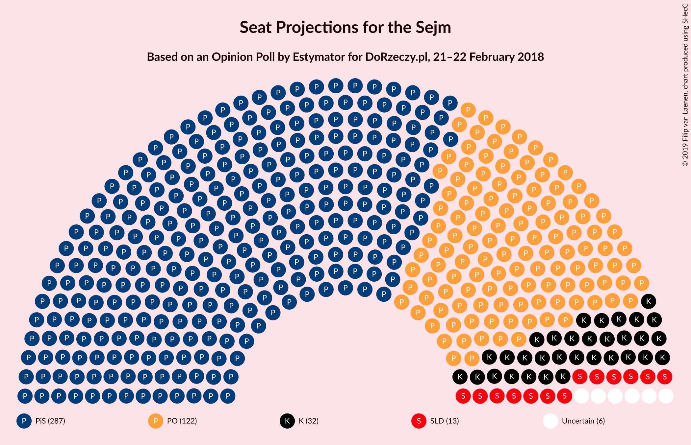
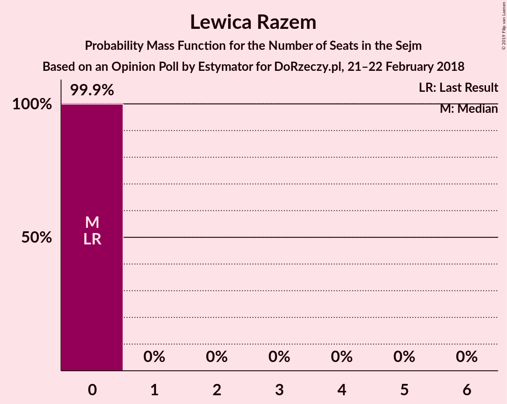
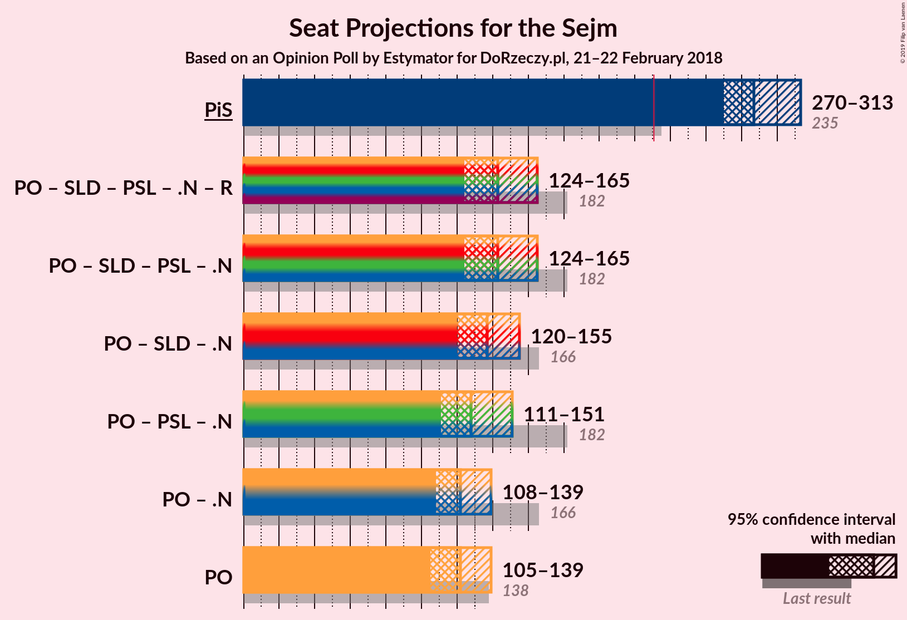
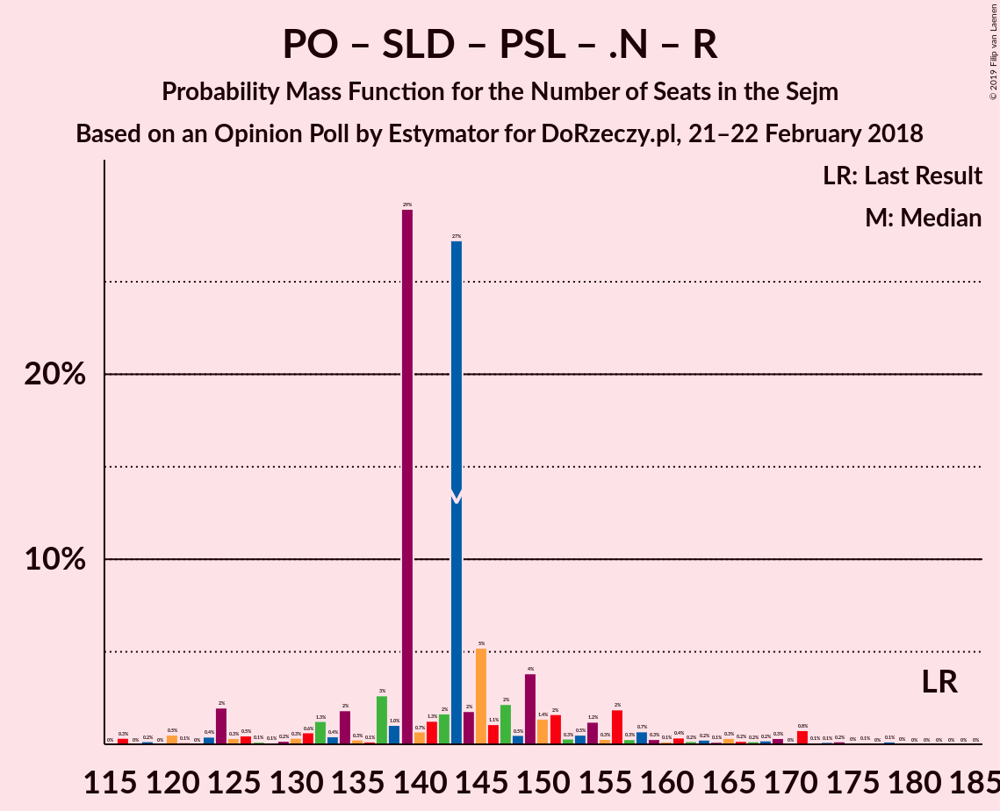
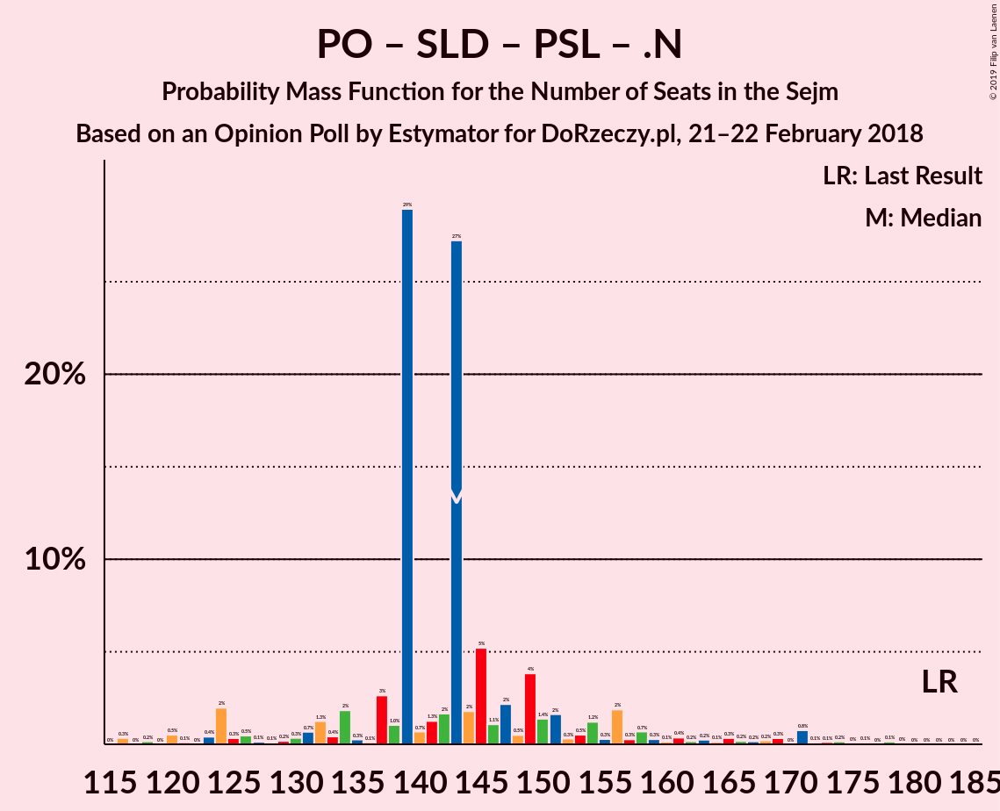
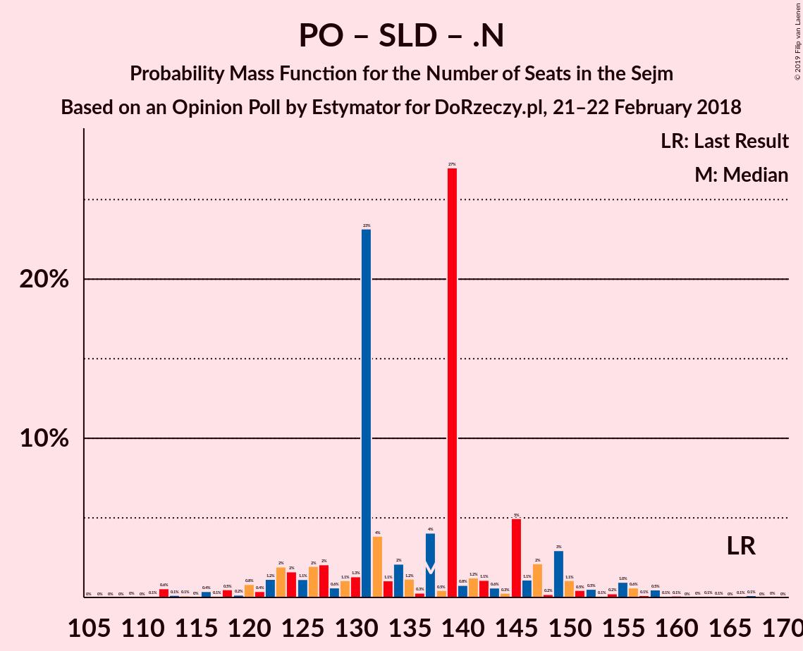

# Opinion Poll by Estymator for DoRzeczy.pl, 21–22 February 2018

<a href="#voting-intentions">Voting Intentions</a> | <a href="#seats">Seats</a> | <a href="#coalitions">Coalitions</a> | <a href="#technical-information">Technical Information</a>

## Voting Intentions

### Confidence Intervals

| Party | Last Result | Poll Result | 80% Confidence Interval | 90% Confidence Interval | 95% Confidence Interval | 99% Confidence Interval |
|:-----:|:-----------:|:-----------:|:-----------------------:|:-----------------------:|:-----------------------:|:-----------------------:|
| Prawo i Sprawiedliwość | 37.6% | 50.2% | 48.2–52.3% |47.7–52.8% |47.2–53.3% |46.2–54.3% |
| Platforma Obywatelska | 24.1% | 22.9% | 21.3–24.7% |20.8–25.2% |20.4–25.6% |19.6–26.5% |
| Kukiz’15 | 8.8% | 7.3% | 6.4–8.5% |6.1–8.8% |5.9–9.1% |5.5–9.7% |
| Sojusz Lewicy Demokratycznej | 7.6% | 5.9% | 5.1–7.0% |4.8–7.3% |4.6–7.6% |4.3–8.1% |
| Polskie Stronnictwo Ludowe | 5.1% | 5.2% | 4.4–6.2% |4.1–6.4% |3.9–6.7% |3.6–7.2% |
| .Nowoczesna | 7.6% | 4.1% | 3.4–5.0% |3.2–5.2% |3.0–5.5% |2.7–5.9% |
| Lewica Razem | 3.6% | 3.0% | 2.4–3.8% |2.2–4.0% |2.1–4.2% |1.8–4.6% |
| KORWiN | 4.8% | 0.8% | 0.5–1.3% |0.5–1.4% |0.4–1.6% |0.3–1.8% |

*Note:* The poll result column reflects the actual value used in the calculations. Published results may vary slightly, and in addition be rounded to fewer digits.

## Seats

### Confidence Intervals

| Party | Last Result | Median | 80% Confidence Interval | 90% Confidence Interval | 95% Confidence Interval | 99% Confidence Interval |
|:-----:|:-----------:|:------:|:-----------------------:|:-----------------------:|:-----------------------:|:-----------------------:|
| <a href="#prawo-i-sprawiedliwość">Prawo i Sprawiedliwość</a> | 235 | 291 | 276–306 |276–310 |276–310 |256–313 |
| <a href="#platforma-obywatelska">Platforma Obywatelska</a> | 138 | 109 | 97–115 |97–115 |90–120 |90–141 |
| <a href="#kukiz’15">Kukiz’15</a> | 42 | 26 | 9–39 |9–39 |9–45 |4–45 |
| <a href="#sojusz-lewicy-demokratycznej">Sojusz Lewicy Demokratycznej</a> | 0 | 27 | 0–29 |0–29 |0–35 |0–35 |
| <a href="#polskie-stronnictwo-ludowe">Polskie Stronnictwo Ludowe</a> | 16 | 0 | 0–26 |0–26 |0–26 |0–26 |
| <a href="#.nowoczesna">.Nowoczesna</a> | 28 | 8 | 0–10 |0–10 |0–10 |0–14 |
| <a href="#lewica-razem">Lewica Razem</a> | 0 | 0 | 0–8 |0–8 |0–8 |0–13 |
| <a href="#korwin">KORWiN</a> | 0 | 0 | 0 |0 |0 |0 |

### Prawo i Sprawiedliwość

*For a full overview of the results for this party, see the [Prawo i Sprawiedliwość](party-prawoisprawiedliwość.html) page.*

| Number of Seats | Probability | Accumulated | Special Marks |
|:---------------:|:-----------:|:-----------:|:-------------:|
| 235 | 0% | 100% | Last Result |
| 236 | 0% | 100% |  |
| 237 | 0% | 100% |  |
| 238 | 0% | 100% |  |
| 239 | 0% | 100% |  |
| 240 | 0% | 100% |  |
| 241 | 0% | 100% |  |
| 242 | 0% | 100% |  |
| 243 | 0% | 100% |  |
| 244 | 0% | 100% |  |
| 245 | 0% | 100% |  |
| 246 | 0% | 100% |  |
| 247 | 0% | 100% |  |
| 248 | 0.1% | 100% |  |
| 249 | 0% | 99.9% |  |
| 250 | 0% | 99.9% |  |
| 251 | 0% | 99.9% |  |
| 252 | 0% | 99.9% |  |
| 253 | 0% | 99.9% |  |
| 254 | 0% | 99.9% |  |
| 255 | 0% | 99.9% |  |
| 256 | 0.5% | 99.9% |  |
| 257 | 0% | 99.4% |  |
| 258 | 0% | 99.4% |  |
| 259 | 0.1% | 99.4% |  |
| 260 | 0% | 99.3% |  |
| 261 | 0% | 99.3% |  |
| 262 | 0% | 99.3% |  |
| 263 | 0% | 99.3% |  |
| 264 | 0% | 99.3% |  |
| 265 | 0% | 99.3% |  |
| 266 | 0% | 99.3% |  |
| 267 | 0% | 99.3% |  |
| 268 | 0% | 99.3% |  |
| 269 | 0% | 99.3% |  |
| 270 | 0% | 99.3% |  |
| 271 | 0.1% | 99.3% |  |
| 272 | 1.1% | 99.2% |  |
| 273 | 0% | 98% |  |
| 274 | 0% | 98% |  |
| 275 | 0% | 98% |  |
| 276 | 15% | 98% |  |
| 277 | 0% | 83% |  |
| 278 | 0.2% | 83% |  |
| 279 | 0% | 83% |  |
| 280 | 0.4% | 83% |  |
| 281 | 0% | 82% |  |
| 282 | 0.5% | 82% |  |
| 283 | 0% | 82% |  |
| 284 | 0.5% | 82% |  |
| 285 | 0% | 81% |  |
| 286 | 0% | 81% |  |
| 287 | 0.4% | 81% |  |
| 288 | 30% | 81% |  |
| 289 | 0% | 51% |  |
| 290 | 0% | 51% |  |
| 291 | 3% | 51% | Median |
| 292 | 0.2% | 48% |  |
| 293 | 0% | 48% |  |
| 294 | 7% | 48% |  |
| 295 | 13% | 41% |  |
| 296 | 0.3% | 28% |  |
| 297 | 0% | 27% |  |
| 298 | 2% | 27% |  |
| 299 | 0% | 25% |  |
| 300 | 3% | 25% |  |
| 301 | 0% | 23% |  |
| 302 | 0% | 23% |  |
| 303 | 0% | 23% |  |
| 304 | 0% | 23% |  |
| 305 | 0% | 23% |  |
| 306 | 16% | 23% |  |
| 307 | 0.1% | 6% |  |
| 308 | 0% | 6% |  |
| 309 | 0.3% | 6% |  |
| 310 | 5% | 6% |  |
| 311 | 0% | 1.5% |  |
| 312 | 0% | 1.4% |  |
| 313 | 1.1% | 1.4% |  |
| 314 | 0% | 0.3% |  |
| 315 | 0% | 0.3% |  |
| 316 | 0.3% | 0.3% |  |
| 317 | 0% | 0% |  |

### Platforma Obywatelska

*For a full overview of the results for this party, see the [Platforma Obywatelska](party-platformaobywatelska.html) page.*

| Number of Seats | Probability | Accumulated | Special Marks |
|:---------------:|:-----------:|:-----------:|:-------------:|
| 90 | 4% | 100% |  |
| 91 | 0% | 96% |  |
| 92 | 0% | 96% |  |
| 93 | 0% | 96% |  |
| 94 | 0% | 96% |  |
| 95 | 0% | 96% |  |
| 96 | 0% | 96% |  |
| 97 | 16% | 96% |  |
| 98 | 0% | 80% |  |
| 99 | 5% | 80% |  |
| 100 | 0% | 75% |  |
| 101 | 0.3% | 75% |  |
| 102 | 0% | 75% |  |
| 103 | 0% | 75% |  |
| 104 | 0.2% | 75% |  |
| 105 | 0.5% | 75% |  |
| 106 | 1.1% | 74% |  |
| 107 | 13% | 73% |  |
| 108 | 2% | 60% |  |
| 109 | 30% | 58% | Median |
| 110 | 4% | 28% |  |
| 111 | 0% | 25% |  |
| 112 | 0% | 25% |  |
| 113 | 0% | 25% |  |
| 114 | 0% | 25% |  |
| 115 | 20% | 25% |  |
| 116 | 0% | 5% |  |
| 117 | 0% | 5% |  |
| 118 | 0% | 4% |  |
| 119 | 0% | 4% |  |
| 120 | 3% | 4% |  |
| 121 | 0.4% | 2% |  |
| 122 | 0% | 1.3% |  |
| 123 | 0% | 1.3% |  |
| 124 | 0% | 1.3% |  |
| 125 | 0.2% | 1.3% |  |
| 126 | 0.1% | 1.1% |  |
| 127 | 0.1% | 1.0% |  |
| 128 | 0% | 0.9% |  |
| 129 | 0% | 0.8% |  |
| 130 | 0% | 0.8% |  |
| 131 | 0% | 0.8% |  |
| 132 | 0% | 0.8% |  |
| 133 | 0% | 0.8% |  |
| 134 | 0% | 0.8% |  |
| 135 | 0% | 0.8% |  |
| 136 | 0% | 0.8% |  |
| 137 | 0.2% | 0.8% |  |
| 138 | 0% | 0.6% | Last Result |
| 139 | 0% | 0.6% |  |
| 140 | 0% | 0.6% |  |
| 141 | 0.1% | 0.6% |  |
| 142 | 0% | 0.5% |  |
| 143 | 0% | 0.5% |  |
| 144 | 0% | 0.5% |  |
| 145 | 0% | 0.5% |  |
| 146 | 0% | 0.5% |  |
| 147 | 0% | 0.5% |  |
| 148 | 0% | 0.5% |  |
| 149 | 0.1% | 0.5% |  |
| 150 | 0.4% | 0.4% |  |
| 151 | 0% | 0% |  |

### Kukiz’15

*For a full overview of the results for this party, see the [Kukiz’15](party-kukiz’15.html) page.*

| Number of Seats | Probability | Accumulated | Special Marks |
|:---------------:|:-----------:|:-----------:|:-------------:|
| 0 | 0.1% | 100% |  |
| 1 | 0% | 99.9% |  |
| 2 | 0% | 99.9% |  |
| 3 | 0.1% | 99.9% |  |
| 4 | 0.5% | 99.9% |  |
| 5 | 0% | 99.4% |  |
| 6 | 0% | 99.4% |  |
| 7 | 0% | 99.4% |  |
| 8 | 0% | 99.4% |  |
| 9 | 13% | 99.4% |  |
| 10 | 0% | 86% |  |
| 11 | 1.3% | 86% |  |
| 12 | 0% | 85% |  |
| 13 | 0% | 85% |  |
| 14 | 0.1% | 85% |  |
| 15 | 0% | 85% |  |
| 16 | 0.2% | 85% |  |
| 17 | 2% | 85% |  |
| 18 | 0.1% | 83% |  |
| 19 | 1.1% | 83% |  |
| 20 | 0% | 82% |  |
| 21 | 0% | 82% |  |
| 22 | 5% | 82% |  |
| 23 | 16% | 77% |  |
| 24 | 3% | 61% |  |
| 25 | 0% | 57% |  |
| 26 | 31% | 57% | Median |
| 27 | 0% | 27% |  |
| 28 | 0% | 27% |  |
| 29 | 0% | 27% |  |
| 30 | 0% | 27% |  |
| 31 | 0% | 27% |  |
| 32 | 0% | 27% |  |
| 33 | 0.3% | 27% |  |
| 34 | 0% | 26% |  |
| 35 | 0.3% | 26% |  |
| 36 | 0% | 26% |  |
| 37 | 3% | 26% |  |
| 38 | 0.2% | 23% |  |
| 39 | 20% | 23% |  |
| 40 | 0% | 3% |  |
| 41 | 0% | 3% |  |
| 42 | 0% | 3% | Last Result |
| 43 | 0.3% | 3% |  |
| 44 | 0% | 3% |  |
| 45 | 3% | 3% |  |
| 46 | 0% | 0% |  |

### Sojusz Lewicy Demokratycznej

*For a full overview of the results for this party, see the [Sojusz Lewicy Demokratycznej](party-sojuszlewicydemokratycznej.html) page.*

| Number of Seats | Probability | Accumulated | Special Marks |
|:---------------:|:-----------:|:-----------:|:-------------:|
| 0 | 21% | 100% | Last Result |
| 1 | 0% | 79% |  |
| 2 | 0% | 79% |  |
| 3 | 0% | 79% |  |
| 4 | 0% | 79% |  |
| 5 | 0% | 79% |  |
| 6 | 0% | 79% |  |
| 7 | 0% | 79% |  |
| 8 | 0% | 79% |  |
| 9 | 3% | 79% |  |
| 10 | 0% | 76% |  |
| 11 | 0.1% | 76% |  |
| 12 | 2% | 76% |  |
| 13 | 13% | 74% |  |
| 14 | 0% | 61% |  |
| 15 | 0% | 61% |  |
| 16 | 0.2% | 61% |  |
| 17 | 0% | 60% |  |
| 18 | 0% | 60% |  |
| 19 | 0% | 60% |  |
| 20 | 0% | 60% |  |
| 21 | 0% | 60% |  |
| 22 | 0.2% | 60% |  |
| 23 | 0% | 60% |  |
| 24 | 0.1% | 60% |  |
| 25 | 0.1% | 60% |  |
| 26 | 4% | 60% |  |
| 27 | 16% | 56% | Median |
| 28 | 0% | 40% |  |
| 29 | 35% | 40% |  |
| 30 | 0.2% | 5% |  |
| 31 | 0% | 4% |  |
| 32 | 0.1% | 4% |  |
| 33 | 0% | 4% |  |
| 34 | 0.4% | 4% |  |
| 35 | 4% | 4% |  |
| 36 | 0% | 0% |  |

### Polskie Stronnictwo Ludowe

*For a full overview of the results for this party, see the [Polskie Stronnictwo Ludowe](party-polskiestronnictwoludowe.html) page.*

| Number of Seats | Probability | Accumulated | Special Marks |
|:---------------:|:-----------:|:-----------:|:-------------:|
| 0 | 61% | 100% | Median |
| 1 | 0% | 39% |  |
| 2 | 0% | 39% |  |
| 3 | 0% | 39% |  |
| 4 | 0% | 39% |  |
| 5 | 0% | 39% |  |
| 6 | 0% | 39% |  |
| 7 | 0% | 39% |  |
| 8 | 0% | 39% |  |
| 9 | 0% | 39% |  |
| 10 | 0% | 39% |  |
| 11 | 4% | 39% |  |
| 12 | 18% | 35% |  |
| 13 | 2% | 17% |  |
| 14 | 0% | 15% |  |
| 15 | 0.1% | 15% |  |
| 16 | 0.1% | 15% | Last Result |
| 17 | 1.0% | 15% |  |
| 18 | 0.1% | 14% |  |
| 19 | 0% | 14% |  |
| 20 | 0% | 14% |  |
| 21 | 0% | 14% |  |
| 22 | 0% | 14% |  |
| 23 | 0.1% | 14% |  |
| 24 | 0.6% | 14% |  |
| 25 | 0% | 13% |  |
| 26 | 13% | 13% |  |
| 27 | 0.1% | 0.1% |  |
| 28 | 0% | 0% |  |

### .Nowoczesna

*For a full overview of the results for this party, see the [.Nowoczesna](party-nowoczesna.html) page.*

| Number of Seats | Probability | Accumulated | Special Marks |
|:---------------:|:-----------:|:-----------:|:-------------:|
| 0 | 23% | 100% |  |
| 1 | 0% | 77% |  |
| 2 | 0% | 77% |  |
| 3 | 0% | 77% |  |
| 4 | 0% | 77% |  |
| 5 | 0% | 77% |  |
| 6 | 0% | 77% |  |
| 7 | 0% | 77% |  |
| 8 | 46% | 77% | Median |
| 9 | 15% | 31% |  |
| 10 | 14% | 15% |  |
| 11 | 0% | 2% |  |
| 12 | 0% | 2% |  |
| 13 | 0% | 2% |  |
| 14 | 1.1% | 2% |  |
| 15 | 0% | 0.4% |  |
| 16 | 0% | 0.4% |  |
| 17 | 0% | 0.4% |  |
| 18 | 0% | 0.4% |  |
| 19 | 0.4% | 0.4% |  |
| 20 | 0% | 0% |  |
| 21 | 0% | 0% |  |
| 22 | 0% | 0% |  |
| 23 | 0% | 0% |  |
| 24 | 0% | 0% |  |
| 25 | 0% | 0% |  |
| 26 | 0% | 0% |  |
| 27 | 0% | 0% |  |
| 28 | 0% | 0% | Last Result |

### Lewica Razem

*For a full overview of the results for this party, see the [Lewica Razem](party-lewicarazem.html) page.*

| Number of Seats | Probability | Accumulated | Special Marks |
|:---------------:|:-----------:|:-----------:|:-------------:|
| 0 | 81% | 100% | Last Result, Median |
| 1 | 0% | 19% |  |
| 2 | 0.2% | 19% |  |
| 3 | 0% | 19% |  |
| 4 | 0% | 19% |  |
| 5 | 0% | 19% |  |
| 6 | 0% | 19% |  |
| 7 | 0.4% | 19% |  |
| 8 | 16% | 18% |  |
| 9 | 0% | 2% |  |
| 10 | 0% | 2% |  |
| 11 | 0% | 2% |  |
| 12 | 0% | 2% |  |
| 13 | 2% | 2% |  |
| 14 | 0% | 0% |  |

### KORWiN

*For a full overview of the results for this party, see the [KORWiN](party-korwin.html) page.*

| Number of Seats | Probability | Accumulated | Special Marks |
|:---------------:|:-----------:|:-----------:|:-------------:|
| 0 | 100% | 100% | Last Result, Median |

## Coalitions

### Confidence Intervals

| Coalition | Last Result | Median | Majority? | 80% Confidence Interval | 90% Confidence Interval | 95% Confidence Interval | 99% Confidence Interval |
|:---------:|:-----------:|:------:|:---------:|:-----------------------:|:-----------------------:|:-----------------------:|:-----------------------:|
| Prawo i Sprawiedliwość | 235 | 291 | 100% | 276–306 | 276–310 | 276–310 | 256–313 |
| Platforma Obywatelska – Sojusz Lewicy Demokratycznej – Polskie Stronnictwo Ludowe – .Nowoczesna – Lewica Razem | 182 | 145 | 0% | 128–156 | 127–156 | 115–162 | 115–172 |
| Platforma Obywatelska – Sojusz Lewicy Demokratycznej – Polskie Stronnictwo Ludowe – .Nowoczesna | 182 | 145 | 0% | 123–156 | 123–156 | 115–162 | 115–169 |
| Platforma Obywatelska – Sojusz Lewicy Demokratycznej – .Nowoczesna | 166 | 133 | 0% | 120–146 | 116–146 | 115–149 | 115–164 |
| Platforma Obywatelska – Polskie Stronnictwo Ludowe – .Nowoczesna | 182 | 118 | 0% | 110–143 | 101–143 | 99–143 | 99–153 |
| Platforma Obywatelska – .Nowoczesna | 166 | 117 | 0% | 106–123 | 99–123 | 90–123 | 90–149 |
| Platforma Obywatelska | 138 | 109 | 0% | 97–115 | 97–115 | 90–120 | 90–141 |

### Prawo i Sprawiedliwość

| Number of Seats | Probability | Accumulated | Special Marks |
|:---------------:|:-----------:|:-----------:|:-------------:|
| 235 | 0% | 100% | Last Result |
| 236 | 0% | 100% |  |
| 237 | 0% | 100% |  |
| 238 | 0% | 100% |  |
| 239 | 0% | 100% |  |
| 240 | 0% | 100% |  |
| 241 | 0% | 100% |  |
| 242 | 0% | 100% |  |
| 243 | 0% | 100% |  |
| 244 | 0% | 100% |  |
| 245 | 0% | 100% |  |
| 246 | 0% | 100% |  |
| 247 | 0% | 100% |  |
| 248 | 0.1% | 100% |  |
| 249 | 0% | 99.9% |  |
| 250 | 0% | 99.9% |  |
| 251 | 0% | 99.9% |  |
| 252 | 0% | 99.9% |  |
| 253 | 0% | 99.9% |  |
| 254 | 0% | 99.9% |  |
| 255 | 0% | 99.9% |  |
| 256 | 0.5% | 99.9% |  |
| 257 | 0% | 99.4% |  |
| 258 | 0% | 99.4% |  |
| 259 | 0.1% | 99.4% |  |
| 260 | 0% | 99.3% |  |
| 261 | 0% | 99.3% |  |
| 262 | 0% | 99.3% |  |
| 263 | 0% | 99.3% |  |
| 264 | 0% | 99.3% |  |
| 265 | 0% | 99.3% |  |
| 266 | 0% | 99.3% |  |
| 267 | 0% | 99.3% |  |
| 268 | 0% | 99.3% |  |
| 269 | 0% | 99.3% |  |
| 270 | 0% | 99.3% |  |
| 271 | 0.1% | 99.3% |  |
| 272 | 1.1% | 99.2% |  |
| 273 | 0% | 98% |  |
| 274 | 0% | 98% |  |
| 275 | 0% | 98% |  |
| 276 | 15% | 98% |  |
| 277 | 0% | 83% |  |
| 278 | 0.2% | 83% |  |
| 279 | 0% | 83% |  |
| 280 | 0.4% | 83% |  |
| 281 | 0% | 82% |  |
| 282 | 0.5% | 82% |  |
| 283 | 0% | 82% |  |
| 284 | 0.5% | 82% |  |
| 285 | 0% | 81% |  |
| 286 | 0% | 81% |  |
| 287 | 0.4% | 81% |  |
| 288 | 30% | 81% |  |
| 289 | 0% | 51% |  |
| 290 | 0% | 51% |  |
| 291 | 3% | 51% | Median |
| 292 | 0.2% | 48% |  |
| 293 | 0% | 48% |  |
| 294 | 7% | 48% |  |
| 295 | 13% | 41% |  |
| 296 | 0.3% | 28% |  |
| 297 | 0% | 27% |  |
| 298 | 2% | 27% |  |
| 299 | 0% | 25% |  |
| 300 | 3% | 25% |  |
| 301 | 0% | 23% |  |
| 302 | 0% | 23% |  |
| 303 | 0% | 23% |  |
| 304 | 0% | 23% |  |
| 305 | 0% | 23% |  |
| 306 | 16% | 23% |  |
| 307 | 0.1% | 6% |  |
| 308 | 0% | 6% |  |
| 309 | 0.3% | 6% |  |
| 310 | 5% | 6% |  |
| 311 | 0% | 1.5% |  |
| 312 | 0% | 1.4% |  |
| 313 | 1.1% | 1.4% |  |
| 314 | 0% | 0.3% |  |
| 315 | 0% | 0.3% |  |
| 316 | 0.3% | 0.3% |  |
| 317 | 0% | 0% |  |

### Platforma Obywatelska – Sojusz Lewicy Demokratycznej – Polskie Stronnictwo Ludowe – .Nowoczesna – Lewica Razem

| Number of Seats | Probability | Accumulated | Special Marks |
|:---------------:|:-----------:|:-----------:|:-------------:|
| 101 | 0.3% | 100% |  |
| 102 | 0% | 99.7% |  |
| 103 | 0% | 99.7% |  |
| 104 | 0% | 99.7% |  |
| 105 | 0% | 99.7% |  |
| 106 | 0% | 99.7% |  |
| 107 | 0% | 99.7% |  |
| 108 | 0% | 99.7% |  |
| 109 | 0% | 99.7% |  |
| 110 | 0% | 99.7% |  |
| 111 | 0% | 99.7% |  |
| 112 | 0% | 99.7% |  |
| 113 | 0% | 99.7% |  |
| 114 | 0% | 99.7% |  |
| 115 | 3% | 99.7% |  |
| 116 | 0.3% | 97% |  |
| 117 | 0% | 97% |  |
| 118 | 0% | 97% |  |
| 119 | 0% | 97% |  |
| 120 | 0% | 97% |  |
| 121 | 0% | 97% |  |
| 122 | 0% | 97% |  |
| 123 | 0% | 97% |  |
| 124 | 0% | 97% |  |
| 125 | 0% | 97% |  |
| 126 | 0% | 97% |  |
| 127 | 4% | 97% |  |
| 128 | 6% | 93% |  |
| 129 | 3% | 87% |  |
| 130 | 0.2% | 84% |  |
| 131 | 16% | 84% |  |
| 132 | 0% | 67% |  |
| 133 | 0% | 67% |  |
| 134 | 0% | 67% |  |
| 135 | 0% | 67% |  |
| 136 | 0% | 67% |  |
| 137 | 0% | 67% |  |
| 138 | 0% | 67% |  |
| 139 | 0% | 67% |  |
| 140 | 0% | 67% |  |
| 141 | 0% | 67% |  |
| 142 | 0% | 67% |  |
| 143 | 0.6% | 67% |  |
| 144 | 0% | 67% | Median |
| 145 | 20% | 67% |  |
| 146 | 30% | 46% |  |
| 147 | 0% | 17% |  |
| 148 | 0% | 17% |  |
| 149 | 0% | 17% |  |
| 150 | 0.1% | 17% |  |
| 151 | 0% | 17% |  |
| 152 | 0% | 17% |  |
| 153 | 0.4% | 17% |  |
| 154 | 0% | 16% |  |
| 155 | 0% | 16% |  |
| 156 | 13% | 16% |  |
| 157 | 0% | 3% |  |
| 158 | 0% | 3% |  |
| 159 | 0% | 3% |  |
| 160 | 0% | 3% |  |
| 161 | 0% | 3% |  |
| 162 | 2% | 3% |  |
| 163 | 0% | 2% |  |
| 164 | 0% | 2% |  |
| 165 | 0% | 2% |  |
| 166 | 0% | 2% |  |
| 167 | 0.5% | 2% |  |
| 168 | 0% | 1.2% |  |
| 169 | 0% | 1.2% |  |
| 170 | 0% | 1.2% |  |
| 171 | 0.3% | 1.2% |  |
| 172 | 0.4% | 0.9% |  |
| 173 | 0% | 0.5% |  |
| 174 | 0% | 0.5% |  |
| 175 | 0.1% | 0.5% |  |
| 176 | 0% | 0.4% |  |
| 177 | 0% | 0.4% |  |
| 178 | 0% | 0.4% |  |
| 179 | 0% | 0.4% |  |
| 180 | 0% | 0.4% |  |
| 181 | 0% | 0.4% |  |
| 182 | 0% | 0.4% | Last Result |
| 183 | 0% | 0.4% |  |
| 184 | 0% | 0.4% |  |
| 185 | 0% | 0.4% |  |
| 186 | 0% | 0.4% |  |
| 187 | 0% | 0.4% |  |
| 188 | 0.2% | 0.4% |  |
| 189 | 0% | 0.2% |  |
| 190 | 0% | 0.2% |  |
| 191 | 0% | 0.2% |  |
| 192 | 0% | 0.2% |  |
| 193 | 0% | 0.2% |  |
| 194 | 0.1% | 0.2% |  |
| 195 | 0% | 0.1% |  |
| 196 | 0% | 0.1% |  |
| 197 | 0% | 0.1% |  |
| 198 | 0% | 0.1% |  |
| 199 | 0% | 0.1% |  |
| 200 | 0% | 0.1% |  |
| 201 | 0.1% | 0.1% |  |
| 202 | 0% | 0% |  |

### Platforma Obywatelska – Sojusz Lewicy Demokratycznej – Polskie Stronnictwo Ludowe – .Nowoczesna

| Number of Seats | Probability | Accumulated | Special Marks |
|:---------------:|:-----------:|:-----------:|:-------------:|
| 101 | 0.3% | 100% |  |
| 102 | 0% | 99.7% |  |
| 103 | 0% | 99.7% |  |
| 104 | 0% | 99.7% |  |
| 105 | 0% | 99.7% |  |
| 106 | 0% | 99.7% |  |
| 107 | 0% | 99.7% |  |
| 108 | 0% | 99.7% |  |
| 109 | 0% | 99.7% |  |
| 110 | 0% | 99.7% |  |
| 111 | 0% | 99.7% |  |
| 112 | 0% | 99.7% |  |
| 113 | 0% | 99.7% |  |
| 114 | 0% | 99.7% |  |
| 115 | 3% | 99.7% |  |
| 116 | 0.3% | 97% |  |
| 117 | 0% | 97% |  |
| 118 | 0% | 97% |  |
| 119 | 0% | 97% |  |
| 120 | 0% | 97% |  |
| 121 | 0% | 97% |  |
| 122 | 0% | 97% |  |
| 123 | 16% | 97% |  |
| 124 | 0% | 80% |  |
| 125 | 0% | 80% |  |
| 126 | 0% | 80% |  |
| 127 | 4% | 80% |  |
| 128 | 6% | 76% |  |
| 129 | 3% | 70% |  |
| 130 | 0.2% | 68% |  |
| 131 | 0% | 67% |  |
| 132 | 2% | 67% |  |
| 133 | 0% | 66% |  |
| 134 | 0% | 66% |  |
| 135 | 0% | 66% |  |
| 136 | 0% | 66% |  |
| 137 | 0% | 66% |  |
| 138 | 0% | 66% |  |
| 139 | 0.1% | 66% |  |
| 140 | 0% | 65% |  |
| 141 | 0% | 65% |  |
| 142 | 0% | 65% |  |
| 143 | 0.6% | 65% |  |
| 144 | 0% | 65% | Median |
| 145 | 18% | 65% |  |
| 146 | 30% | 46% |  |
| 147 | 0% | 17% |  |
| 148 | 0% | 17% |  |
| 149 | 0% | 17% |  |
| 150 | 0.1% | 17% |  |
| 151 | 0% | 17% |  |
| 152 | 0% | 17% |  |
| 153 | 0.4% | 17% |  |
| 154 | 0% | 16% |  |
| 155 | 0% | 16% |  |
| 156 | 13% | 16% |  |
| 157 | 0% | 3% |  |
| 158 | 0% | 3% |  |
| 159 | 0% | 3% |  |
| 160 | 0% | 3% |  |
| 161 | 0% | 3% |  |
| 162 | 2% | 3% |  |
| 163 | 0% | 2% |  |
| 164 | 0% | 2% |  |
| 165 | 0.4% | 2% |  |
| 166 | 0% | 1.3% |  |
| 167 | 0.5% | 1.3% |  |
| 168 | 0% | 0.7% |  |
| 169 | 0.2% | 0.7% |  |
| 170 | 0% | 0.5% |  |
| 171 | 0% | 0.5% |  |
| 172 | 0% | 0.5% |  |
| 173 | 0% | 0.5% |  |
| 174 | 0% | 0.5% |  |
| 175 | 0.1% | 0.5% |  |
| 176 | 0% | 0.4% |  |
| 177 | 0% | 0.4% |  |
| 178 | 0% | 0.4% |  |
| 179 | 0% | 0.4% |  |
| 180 | 0% | 0.4% |  |
| 181 | 0% | 0.4% |  |
| 182 | 0% | 0.4% | Last Result |
| 183 | 0% | 0.4% |  |
| 184 | 0% | 0.4% |  |
| 185 | 0% | 0.4% |  |
| 186 | 0% | 0.4% |  |
| 187 | 0% | 0.4% |  |
| 188 | 0.2% | 0.4% |  |
| 189 | 0% | 0.2% |  |
| 190 | 0% | 0.2% |  |
| 191 | 0% | 0.2% |  |
| 192 | 0% | 0.2% |  |
| 193 | 0% | 0.2% |  |
| 194 | 0.1% | 0.2% |  |
| 195 | 0% | 0.1% |  |
| 196 | 0% | 0.1% |  |
| 197 | 0% | 0.1% |  |
| 198 | 0% | 0.1% |  |
| 199 | 0% | 0.1% |  |
| 200 | 0% | 0.1% |  |
| 201 | 0.1% | 0.1% |  |
| 202 | 0% | 0% |  |

### Platforma Obywatelska – Sojusz Lewicy Demokratycznej – .Nowoczesna

| Number of Seats | Probability | Accumulated | Special Marks |
|:---------------:|:-----------:|:-----------:|:-------------:|
| 101 | 0.3% | 100% |  |
| 102 | 0% | 99.7% |  |
| 103 | 0% | 99.7% |  |
| 104 | 0% | 99.7% |  |
| 105 | 0% | 99.7% |  |
| 106 | 0% | 99.7% |  |
| 107 | 0% | 99.7% |  |
| 108 | 0% | 99.7% |  |
| 109 | 0% | 99.7% |  |
| 110 | 0% | 99.7% |  |
| 111 | 0% | 99.7% |  |
| 112 | 0% | 99.7% |  |
| 113 | 0% | 99.7% |  |
| 114 | 0% | 99.7% |  |
| 115 | 4% | 99.7% |  |
| 116 | 5% | 96% |  |
| 117 | 0.2% | 91% |  |
| 118 | 0% | 91% |  |
| 119 | 0% | 91% |  |
| 120 | 2% | 91% |  |
| 121 | 0% | 89% |  |
| 122 | 0% | 89% |  |
| 123 | 16% | 89% |  |
| 124 | 0% | 73% |  |
| 125 | 0% | 73% |  |
| 126 | 0.1% | 73% |  |
| 127 | 0% | 73% |  |
| 128 | 5% | 73% |  |
| 129 | 3% | 68% |  |
| 130 | 13% | 65% |  |
| 131 | 0.6% | 52% |  |
| 132 | 0% | 52% |  |
| 133 | 15% | 52% |  |
| 134 | 0.1% | 36% |  |
| 135 | 0% | 36% |  |
| 136 | 0% | 36% |  |
| 137 | 0% | 36% |  |
| 138 | 0% | 36% |  |
| 139 | 0% | 36% |  |
| 140 | 0% | 36% |  |
| 141 | 0% | 36% |  |
| 142 | 0% | 36% |  |
| 143 | 0% | 36% |  |
| 144 | 0% | 36% | Median |
| 145 | 3% | 36% |  |
| 146 | 30% | 33% |  |
| 147 | 0% | 3% |  |
| 148 | 0.5% | 3% |  |
| 149 | 1.1% | 3% |  |
| 150 | 0.6% | 2% |  |
| 151 | 0% | 1.1% |  |
| 152 | 0% | 1.1% |  |
| 153 | 0% | 1.1% |  |
| 154 | 0% | 1.1% |  |
| 155 | 0% | 1.1% |  |
| 156 | 0% | 1.1% |  |
| 157 | 0% | 1.1% |  |
| 158 | 0% | 1.1% |  |
| 159 | 0% | 1.1% |  |
| 160 | 0.1% | 1.1% |  |
| 161 | 0% | 1.1% |  |
| 162 | 0.4% | 1.0% |  |
| 163 | 0% | 0.6% |  |
| 164 | 0.2% | 0.6% |  |
| 165 | 0% | 0.4% |  |
| 166 | 0% | 0.4% | Last Result |
| 167 | 0% | 0.4% |  |
| 168 | 0% | 0.4% |  |
| 169 | 0.2% | 0.4% |  |
| 170 | 0.1% | 0.2% |  |
| 171 | 0% | 0.1% |  |
| 172 | 0% | 0.1% |  |
| 173 | 0% | 0.1% |  |
| 174 | 0% | 0.1% |  |
| 175 | 0% | 0.1% |  |
| 176 | 0% | 0.1% |  |
| 177 | 0% | 0.1% |  |
| 178 | 0% | 0.1% |  |
| 179 | 0% | 0.1% |  |
| 180 | 0% | 0.1% |  |
| 181 | 0% | 0.1% |  |
| 182 | 0% | 0.1% |  |
| 183 | 0.1% | 0.1% |  |
| 184 | 0% | 0% |  |

### Platforma Obywatelska – Polskie Stronnictwo Ludowe – .Nowoczesna

| Number of Seats | Probability | Accumulated | Special Marks |
|:---------------:|:-----------:|:-----------:|:-------------:|
| 99 | 5% | 100% |  |
| 100 | 0% | 95% |  |
| 101 | 5% | 95% |  |
| 102 | 0% | 91% |  |
| 103 | 0% | 91% |  |
| 104 | 0% | 91% |  |
| 105 | 0% | 91% |  |
| 106 | 0% | 91% |  |
| 107 | 0.3% | 91% |  |
| 108 | 0% | 90% |  |
| 109 | 0.4% | 90% |  |
| 110 | 3% | 90% |  |
| 111 | 0% | 87% |  |
| 112 | 0% | 87% |  |
| 113 | 0% | 87% |  |
| 114 | 0% | 87% |  |
| 115 | 3% | 87% |  |
| 116 | 0% | 84% |  |
| 117 | 30% | 84% | Median |
| 118 | 15% | 54% |  |
| 119 | 0% | 39% |  |
| 120 | 5% | 39% |  |
| 121 | 0% | 35% |  |
| 122 | 0% | 34% |  |
| 123 | 16% | 34% |  |
| 124 | 0% | 18% |  |
| 125 | 0.1% | 18% |  |
| 126 | 0% | 18% |  |
| 127 | 0.2% | 18% |  |
| 128 | 1.1% | 18% |  |
| 129 | 0% | 17% |  |
| 130 | 0% | 17% |  |
| 131 | 0% | 17% |  |
| 132 | 0.5% | 17% |  |
| 133 | 1.1% | 16% |  |
| 134 | 0% | 15% |  |
| 135 | 0% | 15% |  |
| 136 | 0% | 15% |  |
| 137 | 0% | 15% |  |
| 138 | 0.4% | 15% |  |
| 139 | 0.1% | 15% |  |
| 140 | 0% | 14% |  |
| 141 | 0% | 14% |  |
| 142 | 0% | 14% |  |
| 143 | 13% | 14% |  |
| 144 | 0% | 2% |  |
| 145 | 0% | 2% |  |
| 146 | 0% | 2% |  |
| 147 | 0.2% | 2% |  |
| 148 | 0% | 1.3% |  |
| 149 | 0% | 1.3% |  |
| 150 | 0.4% | 1.3% |  |
| 151 | 0% | 0.9% |  |
| 152 | 0% | 0.9% |  |
| 153 | 0.4% | 0.9% |  |
| 154 | 0% | 0.5% |  |
| 155 | 0% | 0.5% |  |
| 156 | 0% | 0.5% |  |
| 157 | 0% | 0.5% |  |
| 158 | 0.2% | 0.5% |  |
| 159 | 0% | 0.3% |  |
| 160 | 0% | 0.3% |  |
| 161 | 0% | 0.3% |  |
| 162 | 0% | 0.2% |  |
| 163 | 0% | 0.2% |  |
| 164 | 0.1% | 0.2% |  |
| 165 | 0% | 0.2% |  |
| 166 | 0% | 0.2% |  |
| 167 | 0% | 0.2% |  |
| 168 | 0% | 0.2% |  |
| 169 | 0.1% | 0.2% |  |
| 170 | 0.1% | 0.1% |  |
| 171 | 0% | 0% |  |
| 172 | 0% | 0% |  |
| 173 | 0% | 0% |  |
| 174 | 0% | 0% |  |
| 175 | 0% | 0% |  |
| 176 | 0% | 0% |  |
| 177 | 0% | 0% |  |
| 178 | 0% | 0% |  |
| 179 | 0% | 0% |  |
| 180 | 0% | 0% |  |
| 181 | 0% | 0% |  |
| 182 | 0% | 0% | Last Result |

### Platforma Obywatelska – .Nowoczesna

| Number of Seats | Probability | Accumulated | Special Marks |
|:---------------:|:-----------:|:-----------:|:-------------:|
| 90 | 4% | 100% |  |
| 91 | 0% | 96% |  |
| 92 | 0% | 96% |  |
| 93 | 0% | 96% |  |
| 94 | 0% | 96% |  |
| 95 | 0% | 96% |  |
| 96 | 0% | 96% |  |
| 97 | 0.4% | 96% |  |
| 98 | 0% | 95% |  |
| 99 | 5% | 95% |  |
| 100 | 0% | 91% |  |
| 101 | 0.3% | 91% |  |
| 102 | 0% | 90% |  |
| 103 | 0% | 90% |  |
| 104 | 0.2% | 90% |  |
| 105 | 0% | 90% |  |
| 106 | 15% | 90% |  |
| 107 | 0.3% | 75% |  |
| 108 | 2% | 75% |  |
| 109 | 0.1% | 73% |  |
| 110 | 3% | 73% |  |
| 111 | 0% | 69% |  |
| 112 | 0% | 69% |  |
| 113 | 0% | 69% |  |
| 114 | 0% | 69% |  |
| 115 | 4% | 69% |  |
| 116 | 0% | 65% |  |
| 117 | 43% | 65% | Median |
| 118 | 0% | 22% |  |
| 119 | 0% | 22% |  |
| 120 | 4% | 22% |  |
| 121 | 0.4% | 18% |  |
| 122 | 0% | 18% |  |
| 123 | 16% | 18% |  |
| 124 | 0% | 2% |  |
| 125 | 0% | 2% |  |
| 126 | 0.1% | 2% |  |
| 127 | 0% | 1.5% |  |
| 128 | 0% | 1.5% |  |
| 129 | 0.3% | 1.5% |  |
| 130 | 0% | 1.2% |  |
| 131 | 0% | 1.2% |  |
| 132 | 0% | 1.2% |  |
| 133 | 0% | 1.2% |  |
| 134 | 0.2% | 1.2% |  |
| 135 | 0% | 1.0% |  |
| 136 | 0% | 1.0% |  |
| 137 | 0% | 1.0% |  |
| 138 | 0% | 1.0% |  |
| 139 | 0% | 0.9% |  |
| 140 | 0% | 0.9% |  |
| 141 | 0% | 0.9% |  |
| 142 | 0% | 0.9% |  |
| 143 | 0% | 0.9% |  |
| 144 | 0% | 0.9% |  |
| 145 | 0% | 0.9% |  |
| 146 | 0.1% | 0.9% |  |
| 147 | 0.2% | 0.8% |  |
| 148 | 0% | 0.6% |  |
| 149 | 0.1% | 0.6% |  |
| 150 | 0.4% | 0.5% |  |
| 151 | 0.1% | 0.1% |  |
| 152 | 0% | 0% |  |
| 153 | 0% | 0% |  |
| 154 | 0% | 0% |  |
| 155 | 0% | 0% |  |
| 156 | 0% | 0% |  |
| 157 | 0% | 0% |  |
| 158 | 0% | 0% |  |
| 159 | 0% | 0% |  |
| 160 | 0% | 0% |  |
| 161 | 0% | 0% |  |
| 162 | 0% | 0% |  |
| 163 | 0% | 0% |  |
| 164 | 0% | 0% |  |
| 165 | 0% | 0% |  |
| 166 | 0% | 0% | Last Result |

### Platforma Obywatelska

| Number of Seats | Probability | Accumulated | Special Marks |
|:---------------:|:-----------:|:-----------:|:-------------:|
| 90 | 4% | 100% |  |
| 91 | 0% | 96% |  |
| 92 | 0% | 96% |  |
| 93 | 0% | 96% |  |
| 94 | 0% | 96% |  |
| 95 | 0% | 96% |  |
| 96 | 0% | 96% |  |
| 97 | 16% | 96% |  |
| 98 | 0% | 80% |  |
| 99 | 5% | 80% |  |
| 100 | 0% | 75% |  |
| 101 | 0.3% | 75% |  |
| 102 | 0% | 75% |  |
| 103 | 0% | 75% |  |
| 104 | 0.2% | 75% |  |
| 105 | 0.5% | 75% |  |
| 106 | 1.1% | 74% |  |
| 107 | 13% | 73% |  |
| 108 | 2% | 60% |  |
| 109 | 30% | 58% | Median |
| 110 | 4% | 28% |  |
| 111 | 0% | 25% |  |
| 112 | 0% | 25% |  |
| 113 | 0% | 25% |  |
| 114 | 0% | 25% |  |
| 115 | 20% | 25% |  |
| 116 | 0% | 5% |  |
| 117 | 0% | 5% |  |
| 118 | 0% | 4% |  |
| 119 | 0% | 4% |  |
| 120 | 3% | 4% |  |
| 121 | 0.4% | 2% |  |
| 122 | 0% | 1.3% |  |
| 123 | 0% | 1.3% |  |
| 124 | 0% | 1.3% |  |
| 125 | 0.2% | 1.3% |  |
| 126 | 0.1% | 1.1% |  |
| 127 | 0.1% | 1.0% |  |
| 128 | 0% | 0.9% |  |
| 129 | 0% | 0.8% |  |
| 130 | 0% | 0.8% |  |
| 131 | 0% | 0.8% |  |
| 132 | 0% | 0.8% |  |
| 133 | 0% | 0.8% |  |
| 134 | 0% | 0.8% |  |
| 135 | 0% | 0.8% |  |
| 136 | 0% | 0.8% |  |
| 137 | 0.2% | 0.8% |  |
| 138 | 0% | 0.6% | Last Result |
| 139 | 0% | 0.6% |  |
| 140 | 0% | 0.6% |  |
| 141 | 0.1% | 0.6% |  |
| 142 | 0% | 0.5% |  |
| 143 | 0% | 0.5% |  |
| 144 | 0% | 0.5% |  |
| 145 | 0% | 0.5% |  |
| 146 | 0% | 0.5% |  |
| 147 | 0% | 0.5% |  |
| 148 | 0% | 0.5% |  |
| 149 | 0.1% | 0.5% |  |
| 150 | 0.4% | 0.4% |  |
| 151 | 0% | 0% |  |

## Technical Information

### Opinion Poll

+ **Polling firm:** Estymator
+ **Commissioner(s):** DoRzeczy.pl
+ **Fieldwork period:** 21–22 February 2018

### Calculations

+ **Sample size:** 1009
+ **Simulations done:** 1,024
+ **Error estimate:** 3.87%

