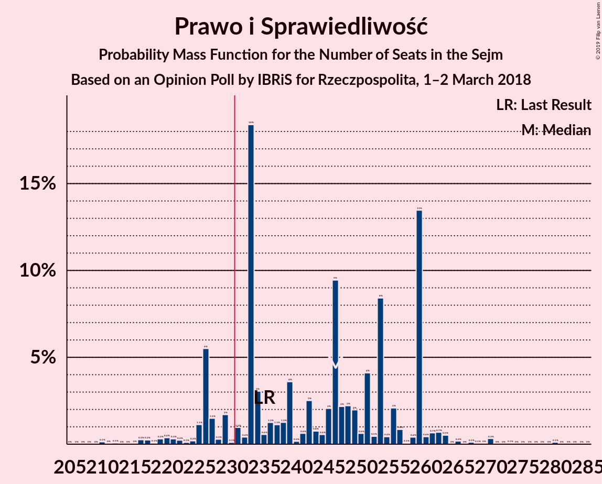
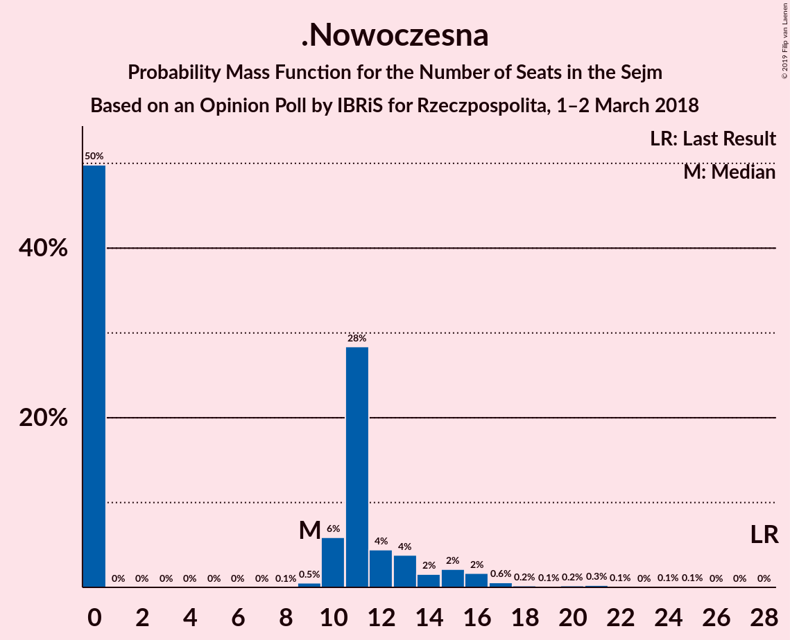

# Opinion Poll by IBRiS for Rzeczpospolita, 1–2 March 2018

<a href="#voting-intentions">Voting Intentions</a> | <a href="#seats">Seats</a> | <a href="#coalitions">Coalitions</a> | <a href="#technical-information">Technical Information</a>

## Voting Intentions

### Confidence Intervals

| Party | Last Result | Poll Result | 80% Confidence Interval | 90% Confidence Interval | 95% Confidence Interval | 99% Confidence Interval |
|:-----:|:-----------:|:-----------:|:-----------------------:|:-----------------------:|:-----------------------:|:-----------------------:|
| Prawo i Sprawiedliwość | 37.6% | 39.4% | 37.4–41.4% |36.9–42.0% |36.4–42.5% |35.5–43.4% |
| Platforma Obywatelska | 24.1% | 22.5% | 20.9–24.3% |20.4–24.8% |20.0–25.2% |19.3–26.1% |
| Sojusz Lewicy Demokratycznej | 7.6% | 9.7% | 8.6–11.0% |8.3–11.4% |8.0–11.7% |7.5–12.3% |
| Kukiz’15 | 8.8% | 6.8% | 5.9–7.9% |5.6–8.3% |5.4–8.5% |5.0–9.1% |
| Polskie Stronnictwo Ludowe | 5.1% | 5.2% | 4.4–6.2% |4.2–6.5% |4.0–6.8% |3.6–7.3% |
| .Nowoczesna | 7.6% | 5.0% | 4.2–6.0% |4.0–6.3% |3.8–6.5% |3.5–7.1% |
| Lewica Razem | 3.6% | 1.4% | 1.0–2.0% |0.9–2.2% |0.8–2.3% |0.7–2.7% |
| KORWiN | 4.8% | 0.5% | 0.3–0.9% |0.3–1.1% |0.2–1.2% |0.2–1.4% |

*Note:* The poll result column reflects the actual value used in the calculations. Published results may vary slightly, and in addition be rounded to fewer digits.

## Seats

### Confidence Intervals

| Party | Last Result | Median | 80% Confidence Interval | 90% Confidence Interval | 95% Confidence Interval | 99% Confidence Interval |
|:-----:|:-----------:|:------:|:-----------------------:|:-----------------------:|:-----------------------:|:-----------------------:|
| <a href="#prawo-i-sprawiedliwość">Prawo i Sprawiedliwość</a> | 235 | 234 | 228–234 |228–260 |228–260 |228–263 |
| <a href="#platforma-obywatelska">Platforma Obywatelska</a> | 138 | 132 | 122–132 |121–132 |121–132 |113–132 |
| <a href="#sojusz-lewicy-demokratycznej">Sojusz Lewicy Demokratycznej</a> | 0 | 41 | 41–45 |41–45 |41–45 |41–51 |
| <a href="#kukiz’15">Kukiz’15</a> | 42 | 31 | 31–33 |21–33 |21–33 |21–34 |
| <a href="#polskie-stronnictwo-ludowe">Polskie Stronnictwo Ludowe</a> | 16 | 22 | 21–22 |0–22 |0–22 |0–22 |
| <a href="#.nowoczesna">.Nowoczesna</a> | 28 | 0 | 0–11 |0–14 |0–14 |0–14 |
| <a href="#lewica-razem">Lewica Razem</a> | 0 | 0 | 0 |0 |0 |0 |
| <a href="#korwin">KORWiN</a> | 0 | 0 | 0 |0 |0 |0 |

### Prawo i Sprawiedliwość

*For a full overview of the results for this party, see the [Prawo i Sprawiedliwość](party-prawoisprawiedliwość.html) page.*

| Number of Seats | Probability | Accumulated | Special Marks |
|:---------------:|:-----------:|:-----------:|:-------------:|
| 213 | 0.1% | 100% |  |
| 214 | 0% | 99.9% |  |
| 215 | 0% | 99.9% |  |
| 216 | 0% | 99.9% |  |
| 217 | 0% | 99.9% |  |
| 218 | 0% | 99.9% |  |
| 219 | 0% | 99.9% |  |
| 220 | 0.1% | 99.9% |  |
| 221 | 0% | 99.8% |  |
| 222 | 0.1% | 99.8% |  |
| 223 | 0% | 99.6% |  |
| 224 | 0% | 99.6% |  |
| 225 | 0% | 99.6% |  |
| 226 | 0% | 99.6% |  |
| 227 | 0% | 99.6% |  |
| 228 | 24% | 99.6% |  |
| 229 | 0% | 76% |  |
| 230 | 0.2% | 76% |  |
| 231 | 0% | 76% | Majority |
| 232 | 0% | 76% |  |
| 233 | 0% | 76% |  |
| 234 | 68% | 76% | Median |
| 235 | 0% | 8% | Last Result |
| 236 | 0% | 8% |  |
| 237 | 0% | 8% |  |
| 238 | 0% | 8% |  |
| 239 | 0% | 8% |  |
| 240 | 0% | 8% |  |
| 241 | 0% | 8% |  |
| 242 | 0% | 8% |  |
| 243 | 0% | 8% |  |
| 244 | 0.1% | 8% |  |
| 245 | 0% | 8% |  |
| 246 | 0.5% | 8% |  |
| 247 | 0% | 7% |  |
| 248 | 0% | 7% |  |
| 249 | 0% | 7% |  |
| 250 | 0% | 7% |  |
| 251 | 0% | 7% |  |
| 252 | 0% | 7% |  |
| 253 | 0% | 7% |  |
| 254 | 0% | 7% |  |
| 255 | 0% | 7% |  |
| 256 | 0% | 7% |  |
| 257 | 0% | 7% |  |
| 258 | 0% | 7% |  |
| 259 | 0% | 7% |  |
| 260 | 6% | 7% |  |
| 261 | 0% | 2% |  |
| 262 | 0% | 2% |  |
| 263 | 2% | 2% |  |
| 264 | 0% | 0% |  |

### Platforma Obywatelska

*For a full overview of the results for this party, see the [Platforma Obywatelska](party-platformaobywatelska.html) page.*

| Number of Seats | Probability | Accumulated | Special Marks |
|:---------------:|:-----------:|:-----------:|:-------------:|
| 110 | 0% | 100% |  |
| 111 | 0% | 99.9% |  |
| 112 | 0% | 99.9% |  |
| 113 | 0.5% | 99.9% |  |
| 114 | 0% | 99.5% |  |
| 115 | 0% | 99.5% |  |
| 116 | 0% | 99.5% |  |
| 117 | 0% | 99.5% |  |
| 118 | 0% | 99.5% |  |
| 119 | 0% | 99.5% |  |
| 120 | 0.1% | 99.5% |  |
| 121 | 6% | 99.4% |  |
| 122 | 24% | 94% |  |
| 123 | 0% | 70% |  |
| 124 | 0% | 70% |  |
| 125 | 2% | 70% |  |
| 126 | 0.1% | 68% |  |
| 127 | 0% | 68% |  |
| 128 | 0% | 68% |  |
| 129 | 0% | 68% |  |
| 130 | 0.1% | 68% |  |
| 131 | 0% | 68% |  |
| 132 | 68% | 68% | Median |
| 133 | 0% | 0.1% |  |
| 134 | 0% | 0.1% |  |
| 135 | 0% | 0.1% |  |
| 136 | 0% | 0.1% |  |
| 137 | 0% | 0.1% |  |
| 138 | 0% | 0.1% | Last Result |
| 139 | 0% | 0.1% |  |
| 140 | 0% | 0.1% |  |
| 141 | 0% | 0.1% |  |
| 142 | 0% | 0.1% |  |
| 143 | 0% | 0.1% |  |
| 144 | 0% | 0.1% |  |
| 145 | 0% | 0.1% |  |
| 146 | 0% | 0.1% |  |
| 147 | 0% | 0.1% |  |
| 148 | 0% | 0.1% |  |
| 149 | 0% | 0.1% |  |
| 150 | 0% | 0.1% |  |
| 151 | 0% | 0.1% |  |
| 152 | 0% | 0.1% |  |
| 153 | 0% | 0.1% |  |
| 154 | 0% | 0.1% |  |
| 155 | 0% | 0.1% |  |
| 156 | 0.1% | 0.1% |  |
| 157 | 0% | 0% |  |

### Sojusz Lewicy Demokratycznej

*For a full overview of the results for this party, see the [Sojusz Lewicy Demokratycznej](party-sojuszlewicydemokratycznej.html) page.*

| Number of Seats | Probability | Accumulated | Special Marks |
|:---------------:|:-----------:|:-----------:|:-------------:|
| 0 | 0% | 100% | Last Result |
| 1 | 0% | 100% |  |
| 2 | 0% | 100% |  |
| 3 | 0% | 100% |  |
| 4 | 0% | 100% |  |
| 5 | 0% | 100% |  |
| 6 | 0% | 100% |  |
| 7 | 0% | 100% |  |
| 8 | 0% | 100% |  |
| 9 | 0% | 100% |  |
| 10 | 0% | 100% |  |
| 11 | 0% | 100% |  |
| 12 | 0% | 100% |  |
| 13 | 0% | 100% |  |
| 14 | 0% | 100% |  |
| 15 | 0% | 100% |  |
| 16 | 0% | 100% |  |
| 17 | 0% | 100% |  |
| 18 | 0% | 100% |  |
| 19 | 0% | 100% |  |
| 20 | 0% | 100% |  |
| 21 | 0% | 100% |  |
| 22 | 0% | 100% |  |
| 23 | 0% | 100% |  |
| 24 | 0% | 100% |  |
| 25 | 0% | 100% |  |
| 26 | 0% | 100% |  |
| 27 | 0% | 100% |  |
| 28 | 0% | 100% |  |
| 29 | 0% | 100% |  |
| 30 | 0% | 100% |  |
| 31 | 0% | 100% |  |
| 32 | 0% | 100% |  |
| 33 | 0% | 100% |  |
| 34 | 0% | 100% |  |
| 35 | 0% | 100% |  |
| 36 | 0% | 99.9% |  |
| 37 | 0% | 99.9% |  |
| 38 | 0% | 99.9% |  |
| 39 | 0% | 99.9% |  |
| 40 | 0% | 99.9% |  |
| 41 | 68% | 99.9% | Median |
| 42 | 0% | 32% |  |
| 43 | 0% | 32% |  |
| 44 | 6% | 32% |  |
| 45 | 24% | 26% |  |
| 46 | 0% | 2% |  |
| 47 | 2% | 2% |  |
| 48 | 0% | 0.8% |  |
| 49 | 0% | 0.7% |  |
| 50 | 0.1% | 0.7% |  |
| 51 | 0.5% | 0.6% |  |
| 52 | 0% | 0.2% |  |
| 53 | 0.1% | 0.2% |  |
| 54 | 0% | 0.1% |  |
| 55 | 0% | 0.1% |  |
| 56 | 0% | 0.1% |  |
| 57 | 0% | 0.1% |  |
| 58 | 0% | 0.1% |  |
| 59 | 0% | 0.1% |  |
| 60 | 0% | 0.1% |  |
| 61 | 0% | 0% |  |

### Kukiz’15

*For a full overview of the results for this party, see the [Kukiz’15](party-kukiz’15.html) page.*

| Number of Seats | Probability | Accumulated | Special Marks |
|:---------------:|:-----------:|:-----------:|:-------------:|
| 11 | 0.1% | 100% |  |
| 12 | 0% | 99.9% |  |
| 13 | 0% | 99.9% |  |
| 14 | 0% | 99.9% |  |
| 15 | 0% | 99.9% |  |
| 16 | 0% | 99.9% |  |
| 17 | 0% | 99.9% |  |
| 18 | 0% | 99.9% |  |
| 19 | 0% | 99.8% |  |
| 20 | 0% | 99.8% |  |
| 21 | 6% | 99.8% |  |
| 22 | 0% | 94% |  |
| 23 | 0% | 94% |  |
| 24 | 0% | 94% |  |
| 25 | 2% | 94% |  |
| 26 | 0% | 93% |  |
| 27 | 0% | 93% |  |
| 28 | 0.1% | 93% |  |
| 29 | 0% | 93% |  |
| 30 | 0% | 93% |  |
| 31 | 68% | 93% | Median |
| 32 | 0% | 25% |  |
| 33 | 24% | 25% |  |
| 34 | 0.5% | 0.9% |  |
| 35 | 0.1% | 0.4% |  |
| 36 | 0.1% | 0.3% |  |
| 37 | 0.1% | 0.3% |  |
| 38 | 0% | 0.1% |  |
| 39 | 0% | 0.1% |  |
| 40 | 0% | 0.1% |  |
| 41 | 0.1% | 0.1% |  |
| 42 | 0% | 0% | Last Result |

### Polskie Stronnictwo Ludowe

*For a full overview of the results for this party, see the [Polskie Stronnictwo Ludowe](party-polskiestronnictwoludowe.html) page.*

| Number of Seats | Probability | Accumulated | Special Marks |
|:---------------:|:-----------:|:-----------:|:-------------:|
| 0 | 7% | 100% |  |
| 1 | 0% | 93% |  |
| 2 | 0% | 93% |  |
| 3 | 0% | 93% |  |
| 4 | 0% | 93% |  |
| 5 | 0% | 93% |  |
| 6 | 0% | 93% |  |
| 7 | 0% | 93% |  |
| 8 | 0% | 93% |  |
| 9 | 0% | 93% |  |
| 10 | 0% | 93% |  |
| 11 | 0% | 93% |  |
| 12 | 0% | 93% |  |
| 13 | 0% | 93% |  |
| 14 | 0% | 93% |  |
| 15 | 0% | 93% |  |
| 16 | 0.5% | 93% | Last Result |
| 17 | 0% | 92% |  |
| 18 | 0% | 92% |  |
| 19 | 0% | 92% |  |
| 20 | 0% | 92% |  |
| 21 | 24% | 92% |  |
| 22 | 68% | 69% | Median |
| 23 | 0.1% | 0.5% |  |
| 24 | 0% | 0.4% |  |
| 25 | 0% | 0.4% |  |
| 26 | 0.1% | 0.4% |  |
| 27 | 0% | 0.2% |  |
| 28 | 0.1% | 0.2% |  |
| 29 | 0% | 0.1% |  |
| 30 | 0% | 0.1% |  |
| 31 | 0% | 0.1% |  |
| 32 | 0% | 0.1% |  |
| 33 | 0% | 0.1% |  |
| 34 | 0% | 0.1% |  |
| 35 | 0% | 0.1% |  |
| 36 | 0.1% | 0.1% |  |
| 37 | 0% | 0% |  |

### .Nowoczesna

*For a full overview of the results for this party, see the [.Nowoczesna](party-nowoczesna.html) page.*

| Number of Seats | Probability | Accumulated | Special Marks |
|:---------------:|:-----------:|:-----------:|:-------------:|
| 0 | 70% | 100% | Median |
| 1 | 0% | 30% |  |
| 2 | 0% | 30% |  |
| 3 | 0% | 30% |  |
| 4 | 0% | 30% |  |
| 5 | 0% | 30% |  |
| 6 | 0% | 30% |  |
| 7 | 0% | 30% |  |
| 8 | 0% | 30% |  |
| 9 | 0% | 30% |  |
| 10 | 0% | 30% |  |
| 11 | 24% | 30% |  |
| 12 | 0% | 6% |  |
| 13 | 0.1% | 6% |  |
| 14 | 6% | 6% |  |
| 15 | 0% | 0% |  |
| 16 | 0% | 0% |  |
| 17 | 0% | 0% |  |
| 18 | 0% | 0% |  |
| 19 | 0% | 0% |  |
| 20 | 0% | 0% |  |
| 21 | 0% | 0% |  |
| 22 | 0% | 0% |  |
| 23 | 0% | 0% |  |
| 24 | 0% | 0% |  |
| 25 | 0% | 0% |  |
| 26 | 0% | 0% |  |
| 27 | 0% | 0% |  |
| 28 | 0% | 0% | Last Result |

### Lewica Razem

*For a full overview of the results for this party, see the [Lewica Razem](party-lewicarazem.html) page.*

| Number of Seats | Probability | Accumulated | Special Marks |
|:---------------:|:-----------:|:-----------:|:-------------:|
| 0 | 100% | 100% | Last Result, Median |

### KORWiN

*For a full overview of the results for this party, see the [KORWiN](party-korwin.html) page.*

| Number of Seats | Probability | Accumulated | Special Marks |
|:---------------:|:-----------:|:-----------:|:-------------:|
| 0 | 100% | 100% | Last Result, Median |

## Coalitions

### Confidence Intervals

| Coalition | Last Result | Median | Majority? | 80% Confidence Interval | 90% Confidence Interval | 95% Confidence Interval | 99% Confidence Interval |
|:---------:|:-----------:|:------:|:---------:|:-----------------------:|:-----------------------:|:-----------------------:|:-----------------------:|
| Prawo i Sprawiedliwość | 235 | 234 | 76% | 228–234 | 228–260 | 228–260 | 228–263 |
| Platforma Obywatelska – Sojusz Lewicy Demokratycznej – Polskie Stronnictwo Ludowe – .Nowoczesna – Lewica Razem | 182 | 195 | 0% | 195–199 | 179–199 | 179–199 | 172–199 |
| Platforma Obywatelska – Sojusz Lewicy Demokratycznej – Polskie Stronnictwo Ludowe – .Nowoczesna | 182 | 195 | 0% | 195–199 | 179–199 | 179–199 | 172–199 |
| Platforma Obywatelska – Sojusz Lewicy Demokratycznej – .Nowoczesna | 166 | 173 | 0% | 173–178 | 173–179 | 173–179 | 164–179 |
| Platforma Obywatelska – Polskie Stronnictwo Ludowe – .Nowoczesna | 182 | 154 | 0% | 154 | 135–154 | 135–154 | 125–154 |
| Platforma Obywatelska – .Nowoczesna | 166 | 132 | 0% | 132–133 | 132–135 | 132–135 | 113–135 |
| Platforma Obywatelska | 138 | 132 | 0% | 122–132 | 121–132 | 121–132 | 113–132 |

### Prawo i Sprawiedliwość

| Number of Seats | Probability | Accumulated | Special Marks |
|:---------------:|:-----------:|:-----------:|:-------------:|
| 213 | 0.1% | 100% |  |
| 214 | 0% | 99.9% |  |
| 215 | 0% | 99.9% |  |
| 216 | 0% | 99.9% |  |
| 217 | 0% | 99.9% |  |
| 218 | 0% | 99.9% |  |
| 219 | 0% | 99.9% |  |
| 220 | 0.1% | 99.9% |  |
| 221 | 0% | 99.8% |  |
| 222 | 0.1% | 99.8% |  |
| 223 | 0% | 99.6% |  |
| 224 | 0% | 99.6% |  |
| 225 | 0% | 99.6% |  |
| 226 | 0% | 99.6% |  |
| 227 | 0% | 99.6% |  |
| 228 | 24% | 99.6% |  |
| 229 | 0% | 76% |  |
| 230 | 0.2% | 76% |  |
| 231 | 0% | 76% | Majority |
| 232 | 0% | 76% |  |
| 233 | 0% | 76% |  |
| 234 | 68% | 76% | Median |
| 235 | 0% | 8% | Last Result |
| 236 | 0% | 8% |  |
| 237 | 0% | 8% |  |
| 238 | 0% | 8% |  |
| 239 | 0% | 8% |  |
| 240 | 0% | 8% |  |
| 241 | 0% | 8% |  |
| 242 | 0% | 8% |  |
| 243 | 0% | 8% |  |
| 244 | 0.1% | 8% |  |
| 245 | 0% | 8% |  |
| 246 | 0.5% | 8% |  |
| 247 | 0% | 7% |  |
| 248 | 0% | 7% |  |
| 249 | 0% | 7% |  |
| 250 | 0% | 7% |  |
| 251 | 0% | 7% |  |
| 252 | 0% | 7% |  |
| 253 | 0% | 7% |  |
| 254 | 0% | 7% |  |
| 255 | 0% | 7% |  |
| 256 | 0% | 7% |  |
| 257 | 0% | 7% |  |
| 258 | 0% | 7% |  |
| 259 | 0% | 7% |  |
| 260 | 6% | 7% |  |
| 261 | 0% | 2% |  |
| 262 | 0% | 2% |  |
| 263 | 2% | 2% |  |
| 264 | 0% | 0% |  |

### Platforma Obywatelska – Sojusz Lewicy Demokratycznej – Polskie Stronnictwo Ludowe – .Nowoczesna – Lewica Razem

| Number of Seats | Probability | Accumulated | Special Marks |
|:---------------:|:-----------:|:-----------:|:-------------:|
| 172 | 2% | 100% |  |
| 173 | 0% | 98% |  |
| 174 | 0% | 98% |  |
| 175 | 0% | 98% |  |
| 176 | 0% | 98% |  |
| 177 | 0% | 98% |  |
| 178 | 0% | 98% |  |
| 179 | 6% | 98% |  |
| 180 | 0.5% | 93% |  |
| 181 | 0% | 92% |  |
| 182 | 0% | 92% | Last Result |
| 183 | 0% | 92% |  |
| 184 | 0% | 92% |  |
| 185 | 0% | 92% |  |
| 186 | 0% | 92% |  |
| 187 | 0% | 92% |  |
| 188 | 0% | 92% |  |
| 189 | 0% | 92% |  |
| 190 | 0% | 92% |  |
| 191 | 0% | 92% |  |
| 192 | 0% | 92% |  |
| 193 | 0% | 92% |  |
| 194 | 0% | 92% |  |
| 195 | 68% | 92% | Median |
| 196 | 0% | 24% |  |
| 197 | 0% | 24% |  |
| 198 | 0% | 24% |  |
| 199 | 24% | 24% |  |
| 200 | 0% | 0.4% |  |
| 201 | 0.1% | 0.4% |  |
| 202 | 0.1% | 0.3% |  |
| 203 | 0% | 0.3% |  |
| 204 | 0% | 0.3% |  |
| 205 | 0% | 0.2% |  |
| 206 | 0% | 0.2% |  |
| 207 | 0% | 0.2% |  |
| 208 | 0% | 0.2% |  |
| 209 | 0% | 0.2% |  |
| 210 | 0% | 0.2% |  |
| 211 | 0% | 0.2% |  |
| 212 | 0% | 0.2% |  |
| 213 | 0% | 0.2% |  |
| 214 | 0% | 0.2% |  |
| 215 | 0% | 0.2% |  |
| 216 | 0% | 0.2% |  |
| 217 | 0% | 0.2% |  |
| 218 | 0% | 0.2% |  |
| 219 | 0.2% | 0.2% |  |
| 220 | 0% | 0% |  |

### Platforma Obywatelska – Sojusz Lewicy Demokratycznej – Polskie Stronnictwo Ludowe – .Nowoczesna

| Number of Seats | Probability | Accumulated | Special Marks |
|:---------------:|:-----------:|:-----------:|:-------------:|
| 172 | 2% | 100% |  |
| 173 | 0% | 98% |  |
| 174 | 0% | 98% |  |
| 175 | 0% | 98% |  |
| 176 | 0% | 98% |  |
| 177 | 0% | 98% |  |
| 178 | 0% | 98% |  |
| 179 | 6% | 98% |  |
| 180 | 0.5% | 93% |  |
| 181 | 0% | 92% |  |
| 182 | 0% | 92% | Last Result |
| 183 | 0% | 92% |  |
| 184 | 0% | 92% |  |
| 185 | 0% | 92% |  |
| 186 | 0% | 92% |  |
| 187 | 0% | 92% |  |
| 188 | 0% | 92% |  |
| 189 | 0% | 92% |  |
| 190 | 0% | 92% |  |
| 191 | 0% | 92% |  |
| 192 | 0% | 92% |  |
| 193 | 0% | 92% |  |
| 194 | 0% | 92% |  |
| 195 | 68% | 92% | Median |
| 196 | 0% | 24% |  |
| 197 | 0% | 24% |  |
| 198 | 0% | 24% |  |
| 199 | 24% | 24% |  |
| 200 | 0% | 0.4% |  |
| 201 | 0.1% | 0.4% |  |
| 202 | 0.1% | 0.3% |  |
| 203 | 0% | 0.3% |  |
| 204 | 0% | 0.3% |  |
| 205 | 0% | 0.2% |  |
| 206 | 0% | 0.2% |  |
| 207 | 0% | 0.2% |  |
| 208 | 0% | 0.2% |  |
| 209 | 0% | 0.2% |  |
| 210 | 0% | 0.2% |  |
| 211 | 0% | 0.2% |  |
| 212 | 0% | 0.2% |  |
| 213 | 0% | 0.2% |  |
| 214 | 0% | 0.2% |  |
| 215 | 0% | 0.2% |  |
| 216 | 0% | 0.2% |  |
| 217 | 0% | 0.2% |  |
| 218 | 0% | 0.2% |  |
| 219 | 0.2% | 0.2% |  |
| 220 | 0% | 0% |  |

### Platforma Obywatelska – Sojusz Lewicy Demokratycznej – .Nowoczesna

| Number of Seats | Probability | Accumulated | Special Marks |
|:---------------:|:-----------:|:-----------:|:-------------:|
| 163 | 0.1% | 100% |  |
| 164 | 0.5% | 99.9% |  |
| 165 | 0% | 99.5% |  |
| 166 | 0% | 99.5% | Last Result |
| 167 | 0% | 99.5% |  |
| 168 | 0% | 99.5% |  |
| 169 | 0.1% | 99.5% |  |
| 170 | 0% | 99.4% |  |
| 171 | 0.1% | 99.4% |  |
| 172 | 2% | 99.3% |  |
| 173 | 68% | 98% | Median |
| 174 | 0% | 30% |  |
| 175 | 0.1% | 30% |  |
| 176 | 0% | 30% |  |
| 177 | 0% | 30% |  |
| 178 | 24% | 30% |  |
| 179 | 6% | 6% |  |
| 180 | 0% | 0.3% |  |
| 181 | 0% | 0.3% |  |
| 182 | 0% | 0.3% |  |
| 183 | 0.1% | 0.2% |  |
| 184 | 0% | 0.1% |  |
| 185 | 0% | 0.1% |  |
| 186 | 0% | 0.1% |  |
| 187 | 0% | 0.1% |  |
| 188 | 0% | 0.1% |  |
| 189 | 0% | 0.1% |  |
| 190 | 0% | 0.1% |  |
| 191 | 0% | 0.1% |  |
| 192 | 0% | 0.1% |  |
| 193 | 0% | 0.1% |  |
| 194 | 0% | 0.1% |  |
| 195 | 0% | 0.1% |  |
| 196 | 0% | 0.1% |  |
| 197 | 0% | 0.1% |  |
| 198 | 0% | 0.1% |  |
| 199 | 0% | 0.1% |  |
| 200 | 0% | 0.1% |  |
| 201 | 0% | 0.1% |  |
| 202 | 0% | 0.1% |  |
| 203 | 0% | 0.1% |  |
| 204 | 0% | 0.1% |  |
| 205 | 0% | 0.1% |  |
| 206 | 0% | 0.1% |  |
| 207 | 0% | 0.1% |  |
| 208 | 0% | 0.1% |  |
| 209 | 0% | 0.1% |  |
| 210 | 0% | 0.1% |  |
| 211 | 0% | 0.1% |  |
| 212 | 0% | 0.1% |  |
| 213 | 0% | 0.1% |  |
| 214 | 0% | 0.1% |  |
| 215 | 0% | 0.1% |  |
| 216 | 0% | 0.1% |  |
| 217 | 0% | 0.1% |  |
| 218 | 0% | 0.1% |  |
| 219 | 0.1% | 0.1% |  |
| 220 | 0% | 0% |  |

### Platforma Obywatelska – Polskie Stronnictwo Ludowe – .Nowoczesna

| Number of Seats | Probability | Accumulated | Special Marks |
|:---------------:|:-----------:|:-----------:|:-------------:|
| 125 | 2% | 100% |  |
| 126 | 0% | 98% |  |
| 127 | 0% | 98% |  |
| 128 | 0% | 98% |  |
| 129 | 0.5% | 98% |  |
| 130 | 0% | 98% |  |
| 131 | 0% | 98% |  |
| 132 | 0% | 98% |  |
| 133 | 0% | 98% |  |
| 134 | 0% | 98% |  |
| 135 | 6% | 98% |  |
| 136 | 0% | 92% |  |
| 137 | 0% | 92% |  |
| 138 | 0% | 92% |  |
| 139 | 0% | 92% |  |
| 140 | 0% | 92% |  |
| 141 | 0% | 92% |  |
| 142 | 0% | 92% |  |
| 143 | 0% | 92% |  |
| 144 | 0% | 92% |  |
| 145 | 0% | 92% |  |
| 146 | 0% | 92% |  |
| 147 | 0% | 92% |  |
| 148 | 0% | 92% |  |
| 149 | 0% | 92% |  |
| 150 | 0% | 92% |  |
| 151 | 0.1% | 92% |  |
| 152 | 0% | 92% |  |
| 153 | 0% | 92% |  |
| 154 | 92% | 92% | Median |
| 155 | 0.1% | 0.4% |  |
| 156 | 0% | 0.3% |  |
| 157 | 0.1% | 0.3% |  |
| 158 | 0% | 0.3% |  |
| 159 | 0% | 0.2% |  |
| 160 | 0% | 0.2% |  |
| 161 | 0% | 0.2% |  |
| 162 | 0% | 0.2% |  |
| 163 | 0% | 0.2% |  |
| 164 | 0% | 0.2% |  |
| 165 | 0% | 0.2% |  |
| 166 | 0.1% | 0.2% |  |
| 167 | 0% | 0.1% |  |
| 168 | 0% | 0.1% |  |
| 169 | 0.1% | 0.1% |  |
| 170 | 0% | 0% |  |
| 171 | 0% | 0% |  |
| 172 | 0% | 0% |  |
| 173 | 0% | 0% |  |
| 174 | 0% | 0% |  |
| 175 | 0% | 0% |  |
| 176 | 0% | 0% |  |
| 177 | 0% | 0% |  |
| 178 | 0% | 0% |  |
| 179 | 0% | 0% |  |
| 180 | 0% | 0% |  |
| 181 | 0% | 0% |  |
| 182 | 0% | 0% | Last Result |

### Platforma Obywatelska – .Nowoczesna

| Number of Seats | Probability | Accumulated | Special Marks |
|:---------------:|:-----------:|:-----------:|:-------------:|
| 110 | 0% | 100% |  |
| 111 | 0% | 99.9% |  |
| 112 | 0% | 99.9% |  |
| 113 | 0.5% | 99.9% |  |
| 114 | 0% | 99.5% |  |
| 115 | 0% | 99.5% |  |
| 116 | 0% | 99.5% |  |
| 117 | 0% | 99.5% |  |
| 118 | 0% | 99.5% |  |
| 119 | 0% | 99.5% |  |
| 120 | 0% | 99.5% |  |
| 121 | 0% | 99.5% |  |
| 122 | 0% | 99.5% |  |
| 123 | 0% | 99.5% |  |
| 124 | 0% | 99.5% |  |
| 125 | 2% | 99.5% |  |
| 126 | 0.1% | 98% |  |
| 127 | 0% | 98% |  |
| 128 | 0% | 98% |  |
| 129 | 0% | 98% |  |
| 130 | 0.1% | 98% |  |
| 131 | 0.1% | 98% |  |
| 132 | 68% | 98% | Median |
| 133 | 24% | 29% |  |
| 134 | 0% | 6% |  |
| 135 | 6% | 6% |  |
| 136 | 0% | 0.1% |  |
| 137 | 0% | 0.1% |  |
| 138 | 0% | 0.1% |  |
| 139 | 0% | 0.1% |  |
| 140 | 0% | 0.1% |  |
| 141 | 0% | 0.1% |  |
| 142 | 0% | 0.1% |  |
| 143 | 0% | 0.1% |  |
| 144 | 0% | 0.1% |  |
| 145 | 0% | 0.1% |  |
| 146 | 0% | 0.1% |  |
| 147 | 0% | 0.1% |  |
| 148 | 0% | 0.1% |  |
| 149 | 0% | 0.1% |  |
| 150 | 0% | 0.1% |  |
| 151 | 0% | 0.1% |  |
| 152 | 0% | 0.1% |  |
| 153 | 0% | 0.1% |  |
| 154 | 0% | 0.1% |  |
| 155 | 0% | 0.1% |  |
| 156 | 0% | 0.1% |  |
| 157 | 0% | 0.1% |  |
| 158 | 0% | 0.1% |  |
| 159 | 0% | 0.1% |  |
| 160 | 0% | 0.1% |  |
| 161 | 0% | 0.1% |  |
| 162 | 0% | 0.1% |  |
| 163 | 0% | 0.1% |  |
| 164 | 0% | 0.1% |  |
| 165 | 0% | 0.1% |  |
| 166 | 0% | 0.1% | Last Result |
| 167 | 0% | 0.1% |  |
| 168 | 0% | 0.1% |  |
| 169 | 0.1% | 0.1% |  |
| 170 | 0% | 0% |  |

### Platforma Obywatelska

| Number of Seats | Probability | Accumulated | Special Marks |
|:---------------:|:-----------:|:-----------:|:-------------:|
| 110 | 0% | 100% |  |
| 111 | 0% | 99.9% |  |
| 112 | 0% | 99.9% |  |
| 113 | 0.5% | 99.9% |  |
| 114 | 0% | 99.5% |  |
| 115 | 0% | 99.5% |  |
| 116 | 0% | 99.5% |  |
| 117 | 0% | 99.5% |  |
| 118 | 0% | 99.5% |  |
| 119 | 0% | 99.5% |  |
| 120 | 0.1% | 99.5% |  |
| 121 | 6% | 99.4% |  |
| 122 | 24% | 94% |  |
| 123 | 0% | 70% |  |
| 124 | 0% | 70% |  |
| 125 | 2% | 70% |  |
| 126 | 0.1% | 68% |  |
| 127 | 0% | 68% |  |
| 128 | 0% | 68% |  |
| 129 | 0% | 68% |  |
| 130 | 0.1% | 68% |  |
| 131 | 0% | 68% |  |
| 132 | 68% | 68% | Median |
| 133 | 0% | 0.1% |  |
| 134 | 0% | 0.1% |  |
| 135 | 0% | 0.1% |  |
| 136 | 0% | 0.1% |  |
| 137 | 0% | 0.1% |  |
| 138 | 0% | 0.1% | Last Result |
| 139 | 0% | 0.1% |  |
| 140 | 0% | 0.1% |  |
| 141 | 0% | 0.1% |  |
| 142 | 0% | 0.1% |  |
| 143 | 0% | 0.1% |  |
| 144 | 0% | 0.1% |  |
| 145 | 0% | 0.1% |  |
| 146 | 0% | 0.1% |  |
| 147 | 0% | 0.1% |  |
| 148 | 0% | 0.1% |  |
| 149 | 0% | 0.1% |  |
| 150 | 0% | 0.1% |  |
| 151 | 0% | 0.1% |  |
| 152 | 0% | 0.1% |  |
| 153 | 0% | 0.1% |  |
| 154 | 0% | 0.1% |  |
| 155 | 0% | 0.1% |  |
| 156 | 0.1% | 0.1% |  |
| 157 | 0% | 0% |  |

## Technical Information

### Opinion Poll

+ **Polling firm:** IBRiS
+ **Commissioner(s):** Rzeczpospolita
+ **Fieldwork period:** 1–2 March 2018

### Calculations

+ **Sample size:** 1000
+ **Simulations done:** 1,024
+ **Error estimate:** 3.80%

