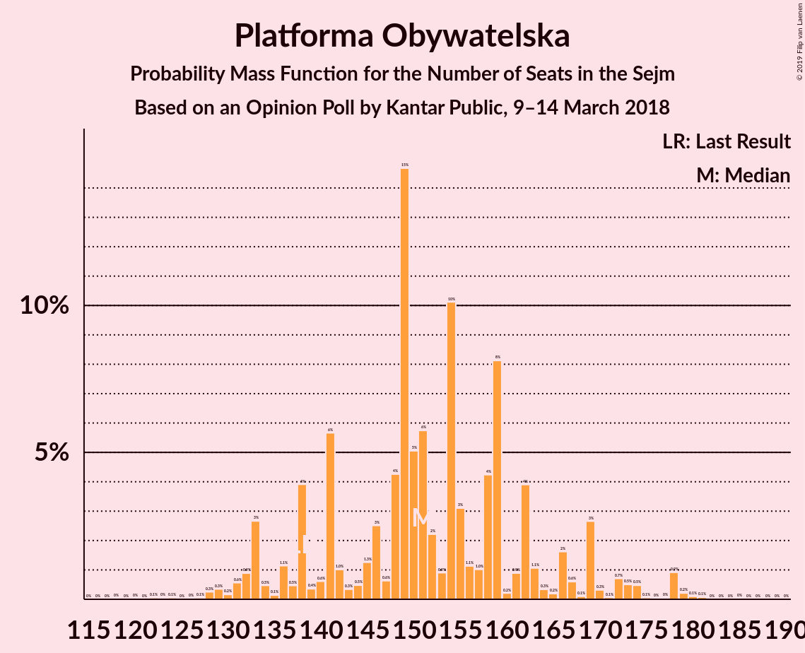
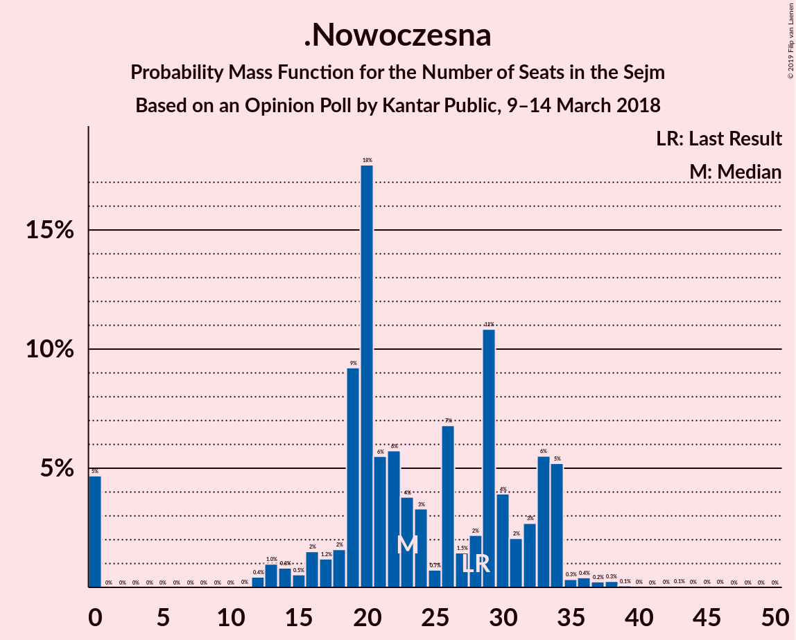
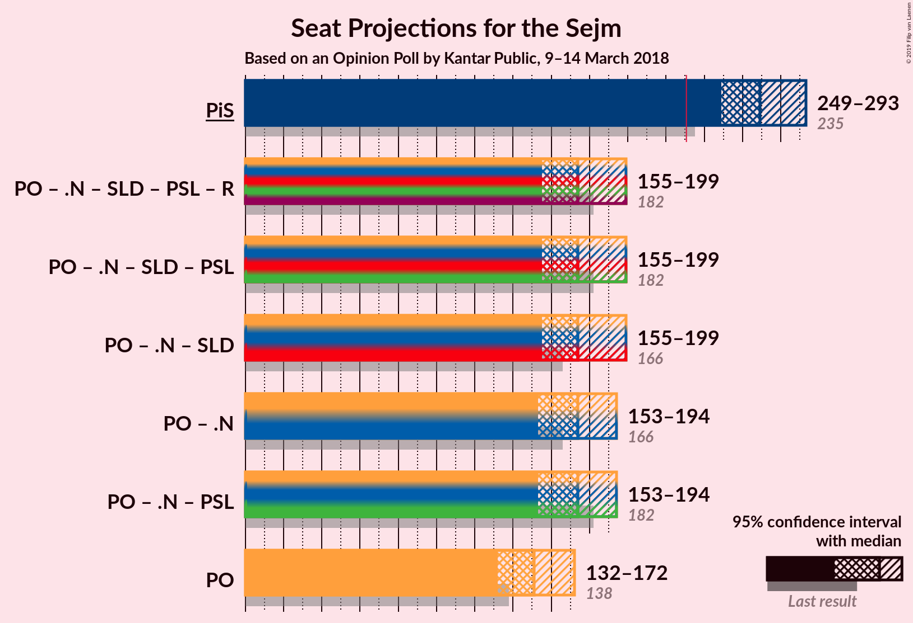
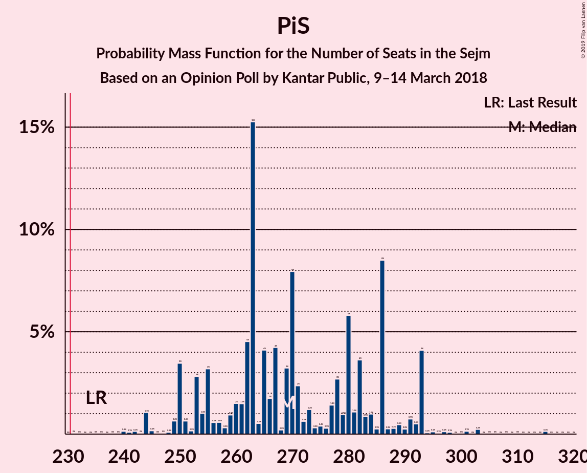
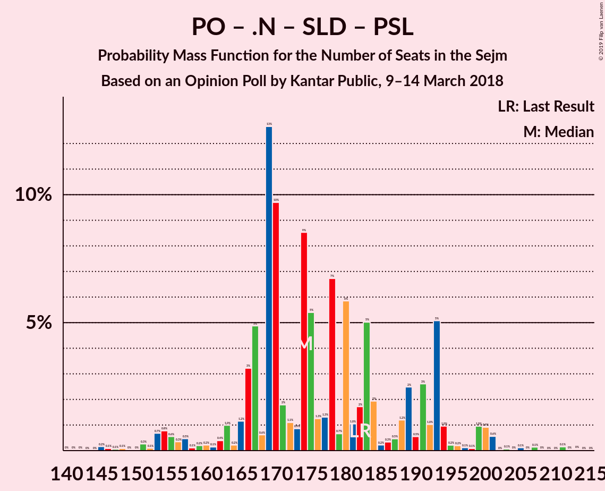

# Opinion Poll by Kantar Public, 9–14 March 2018

<a href="#voting-intentions">Voting Intentions</a> | <a href="#seats">Seats</a> | <a href="#coalitions">Coalitions</a> | <a href="#technical-information">Technical Information</a>

## Voting Intentions

### Confidence Intervals

| Party | Last Result | Poll Result | 80% Confidence Interval | 90% Confidence Interval | 95% Confidence Interval | 99% Confidence Interval |
|:-----:|:-----------:|:-----------:|:-----------------------:|:-----------------------:|:-----------------------:|:-----------------------:|
| Prawo i Sprawiedliwość | 37.6% | 37.8% | 35.9–39.8% |35.3–40.3% |34.9–40.8% |34.0–41.7% |
| Platforma Obywatelska | 24.1% | 22.5% | 20.9–24.2% |20.4–24.7% |20.0–25.1% |19.3–26.0% |
| .Nowoczesna | 7.6% | 6.1% | 5.3–7.2% |5.0–7.5% |4.8–7.8% |4.4–8.3% |
| Kukiz’15 | 8.8% | 5.1% | 4.3–6.1% |4.1–6.3% |3.9–6.6% |3.5–7.1% |
| Sojusz Lewicy Demokratycznej | 7.6% | 4.1% | 3.4–5.0% |3.2–5.3% |3.0–5.5% |2.7–6.0% |
| Polskie Stronnictwo Ludowe | 5.1% | 2.0% | 1.6–2.7% |1.4–2.9% |1.3–3.1% |1.1–3.5% |
| KORWiN | 4.8% | 1.0% | 0.7–1.5% |0.6–1.6% |0.5–1.8% |0.4–2.1% |
| Lewica Razem | 3.6% | 1.0% | 0.7–1.5% |0.6–1.6% |0.5–1.8% |0.4–2.1% |

*Note:* The poll result column reflects the actual value used in the calculations. Published results may vary slightly, and in addition be rounded to fewer digits.

## Seats

### Confidence Intervals

| Party | Last Result | Median | 80% Confidence Interval | 90% Confidence Interval | 95% Confidence Interval | 99% Confidence Interval |
|:-----:|:-----------:|:------:|:-----------------------:|:-----------------------:|:-----------------------:|:-----------------------:|
| <a href="#prawo-i-sprawiedliwość">Prawo i Sprawiedliwość</a> | 235 | 280 | 262–297 |262–297 |255–297 |240–299 |
| <a href="#platforma-obywatelska">Platforma Obywatelska</a> | 138 | 146 | 142–172 |142–175 |142–175 |142–175 |
| <a href="#.nowoczesna">.Nowoczesna</a> | 28 | 23 | 21–34 |21–34 |18–34 |18–37 |
| <a href="#kukiz’15">Kukiz’15</a> | 42 | 0 | 0 |0 |0–29 |0–29 |
| <a href="#sojusz-lewicy-demokratycznej">Sojusz Lewicy Demokratycznej</a> | 0 | 0 | 0 |0 |0 |0–27 |
| <a href="#polskie-stronnictwo-ludowe">Polskie Stronnictwo Ludowe</a> | 16 | 0 | 0 |0 |0 |0 |
| <a href="#korwin">KORWiN</a> | 0 | 0 | 0 |0 |0 |0 |
| <a href="#lewica-razem">Lewica Razem</a> | 0 | 0 | 0 |0 |0 |0 |

### Prawo i Sprawiedliwość

*For a full overview of the results for this party, see the [Prawo i Sprawiedliwość](party-prawoisprawiedliwość.html) page.*

| Number of Seats | Probability | Accumulated | Special Marks |
|:---------------:|:-----------:|:-----------:|:-------------:|
| 235 | 0% | 100% | Last Result |
| 236 | 0% | 100% |  |
| 237 | 0% | 100% |  |
| 238 | 0% | 100% |  |
| 239 | 0% | 100% |  |
| 240 | 0.5% | 100% |  |
| 241 | 0% | 99.5% |  |
| 242 | 0% | 99.5% |  |
| 243 | 0% | 99.5% |  |
| 244 | 0% | 99.4% |  |
| 245 | 0% | 99.4% |  |
| 246 | 0.1% | 99.4% |  |
| 247 | 0% | 99.4% |  |
| 248 | 0% | 99.4% |  |
| 249 | 0% | 99.4% |  |
| 250 | 0% | 99.4% |  |
| 251 | 0% | 99.4% |  |
| 252 | 0% | 99.4% |  |
| 253 | 0.1% | 99.4% |  |
| 254 | 0% | 99.3% |  |
| 255 | 3% | 99.3% |  |
| 256 | 0.1% | 96% |  |
| 257 | 0% | 96% |  |
| 258 | 0% | 96% |  |
| 259 | 0% | 96% |  |
| 260 | 0.2% | 96% |  |
| 261 | 0% | 96% |  |
| 262 | 6% | 96% |  |
| 263 | 0% | 90% |  |
| 264 | 6% | 90% |  |
| 265 | 0% | 84% |  |
| 266 | 0% | 84% |  |
| 267 | 0.1% | 84% |  |
| 268 | 0% | 84% |  |
| 269 | 0% | 84% |  |
| 270 | 0% | 84% |  |
| 271 | 0% | 84% |  |
| 272 | 0% | 84% |  |
| 273 | 0% | 84% |  |
| 274 | 0.2% | 84% |  |
| 275 | 0% | 83% |  |
| 276 | 0% | 83% |  |
| 277 | 0% | 83% |  |
| 278 | 0% | 83% |  |
| 279 | 0% | 83% |  |
| 280 | 44% | 83% | Median |
| 281 | 0% | 39% |  |
| 282 | 0% | 39% |  |
| 283 | 0% | 39% |  |
| 284 | 0% | 39% |  |
| 285 | 0% | 39% |  |
| 286 | 0% | 39% |  |
| 287 | 0% | 39% |  |
| 288 | 0.3% | 39% |  |
| 289 | 0% | 39% |  |
| 290 | 0% | 39% |  |
| 291 | 0% | 39% |  |
| 292 | 0% | 39% |  |
| 293 | 0% | 39% |  |
| 294 | 0% | 39% |  |
| 295 | 0% | 39% |  |
| 296 | 0% | 39% |  |
| 297 | 38% | 39% |  |
| 298 | 0% | 0.9% |  |
| 299 | 0.9% | 0.9% |  |
| 300 | 0% | 0% |  |

### Platforma Obywatelska

*For a full overview of the results for this party, see the [Platforma Obywatelska](party-platformaobywatelska.html) page.*

| Number of Seats | Probability | Accumulated | Special Marks |
|:---------------:|:-----------:|:-----------:|:-------------:|
| 121 | 0.1% | 100% |  |
| 122 | 0% | 99.9% |  |
| 123 | 0% | 99.9% |  |
| 124 | 0% | 99.9% |  |
| 125 | 0% | 99.9% |  |
| 126 | 0% | 99.9% |  |
| 127 | 0% | 99.9% |  |
| 128 | 0% | 99.9% |  |
| 129 | 0% | 99.9% |  |
| 130 | 0% | 99.9% |  |
| 131 | 0% | 99.9% |  |
| 132 | 0% | 99.9% |  |
| 133 | 0% | 99.9% |  |
| 134 | 0.3% | 99.9% |  |
| 135 | 0% | 99.6% |  |
| 136 | 0% | 99.6% |  |
| 137 | 0% | 99.6% |  |
| 138 | 0% | 99.6% | Last Result |
| 139 | 0% | 99.6% |  |
| 140 | 0% | 99.6% |  |
| 141 | 0% | 99.5% |  |
| 142 | 38% | 99.5% |  |
| 143 | 4% | 62% |  |
| 144 | 0.1% | 58% |  |
| 145 | 0% | 57% |  |
| 146 | 44% | 57% | Median |
| 147 | 0% | 13% |  |
| 148 | 0% | 13% |  |
| 149 | 0% | 13% |  |
| 150 | 0% | 13% |  |
| 151 | 0% | 13% |  |
| 152 | 0% | 13% |  |
| 153 | 2% | 13% |  |
| 154 | 0.5% | 11% |  |
| 155 | 0% | 10% |  |
| 156 | 0% | 10% |  |
| 157 | 0.1% | 10% |  |
| 158 | 0.1% | 10% |  |
| 159 | 0% | 10% |  |
| 160 | 0% | 10% |  |
| 161 | 0% | 10% |  |
| 162 | 0% | 10% |  |
| 163 | 0% | 10% |  |
| 164 | 0% | 10% |  |
| 165 | 0% | 10% |  |
| 166 | 0% | 10% |  |
| 167 | 0% | 10% |  |
| 168 | 0% | 10% |  |
| 169 | 0% | 10% |  |
| 170 | 0% | 10% |  |
| 171 | 0% | 10% |  |
| 172 | 0.1% | 10% |  |
| 173 | 0% | 10% |  |
| 174 | 0% | 10% |  |
| 175 | 10% | 10% |  |
| 176 | 0% | 0% |  |

### .Nowoczesna

*For a full overview of the results for this party, see the [.Nowoczesna](party-nowoczesna.html) page.*

| Number of Seats | Probability | Accumulated | Special Marks |
|:---------------:|:-----------:|:-----------:|:-------------:|
| 0 | 0.1% | 100% |  |
| 1 | 0% | 99.9% |  |
| 2 | 0% | 99.9% |  |
| 3 | 0% | 99.9% |  |
| 4 | 0% | 99.9% |  |
| 5 | 0% | 99.9% |  |
| 6 | 0% | 99.9% |  |
| 7 | 0% | 99.9% |  |
| 8 | 0% | 99.9% |  |
| 9 | 0% | 99.9% |  |
| 10 | 0% | 99.9% |  |
| 11 | 0% | 99.9% |  |
| 12 | 0% | 99.9% |  |
| 13 | 0% | 99.9% |  |
| 14 | 0% | 99.9% |  |
| 15 | 0% | 99.9% |  |
| 16 | 0% | 99.9% |  |
| 17 | 0% | 99.9% |  |
| 18 | 3% | 99.9% |  |
| 19 | 0% | 97% |  |
| 20 | 0% | 97% |  |
| 21 | 44% | 97% |  |
| 22 | 0% | 53% |  |
| 23 | 4% | 53% | Median |
| 24 | 0% | 49% |  |
| 25 | 0% | 49% |  |
| 26 | 0% | 49% |  |
| 27 | 0% | 49% |  |
| 28 | 0% | 49% | Last Result |
| 29 | 0% | 49% |  |
| 30 | 0.1% | 49% |  |
| 31 | 0% | 49% |  |
| 32 | 0% | 49% |  |
| 33 | 3% | 49% |  |
| 34 | 44% | 45% |  |
| 35 | 0% | 1.0% |  |
| 36 | 0% | 1.0% |  |
| 37 | 0.6% | 1.0% |  |
| 38 | 0.3% | 0.4% |  |
| 39 | 0% | 0.1% |  |
| 40 | 0% | 0.1% |  |
| 41 | 0% | 0.1% |  |
| 42 | 0% | 0.1% |  |
| 43 | 0% | 0.1% |  |
| 44 | 0% | 0.1% |  |
| 45 | 0% | 0.1% |  |
| 46 | 0% | 0.1% |  |
| 47 | 0% | 0.1% |  |
| 48 | 0% | 0.1% |  |
| 49 | 0% | 0.1% |  |
| 50 | 0.1% | 0.1% |  |
| 51 | 0% | 0% |  |

### Kukiz’15

*For a full overview of the results for this party, see the [Kukiz’15](party-kukiz’15.html) page.*

| Number of Seats | Probability | Accumulated | Special Marks |
|:---------------:|:-----------:|:-----------:|:-------------:|
| 0 | 96% | 100% | Median |
| 1 | 0% | 4% |  |
| 2 | 0% | 4% |  |
| 3 | 0% | 4% |  |
| 4 | 0% | 4% |  |
| 5 | 0% | 4% |  |
| 6 | 0% | 4% |  |
| 7 | 0% | 4% |  |
| 8 | 0% | 4% |  |
| 9 | 0% | 4% |  |
| 10 | 0% | 4% |  |
| 11 | 0% | 4% |  |
| 12 | 0% | 4% |  |
| 13 | 0% | 4% |  |
| 14 | 0% | 4% |  |
| 15 | 0% | 4% |  |
| 16 | 0% | 4% |  |
| 17 | 0% | 4% |  |
| 18 | 0% | 4% |  |
| 19 | 0% | 4% |  |
| 20 | 0% | 4% |  |
| 21 | 0% | 4% |  |
| 22 | 0% | 4% |  |
| 23 | 0% | 4% |  |
| 24 | 0% | 4% |  |
| 25 | 0% | 4% |  |
| 26 | 0.2% | 4% |  |
| 27 | 0% | 4% |  |
| 28 | 0.1% | 4% |  |
| 29 | 4% | 4% |  |
| 30 | 0% | 0.1% |  |
| 31 | 0% | 0.1% |  |
| 32 | 0% | 0.1% |  |
| 33 | 0% | 0.1% |  |
| 34 | 0% | 0.1% |  |
| 35 | 0% | 0.1% |  |
| 36 | 0% | 0.1% |  |
| 37 | 0% | 0.1% |  |
| 38 | 0% | 0% |  |
| 39 | 0% | 0% |  |
| 40 | 0% | 0% |  |
| 41 | 0% | 0% |  |
| 42 | 0% | 0% | Last Result |

### Sojusz Lewicy Demokratycznej

*For a full overview of the results for this party, see the [Sojusz Lewicy Demokratycznej](party-sojuszlewicydemokratycznej.html) page.*

| Number of Seats | Probability | Accumulated | Special Marks |
|:---------------:|:-----------:|:-----------:|:-------------:|
| 0 | 98% | 100% | Last Result, Median |
| 1 | 0% | 2% |  |
| 2 | 0% | 2% |  |
| 3 | 0% | 2% |  |
| 4 | 0% | 2% |  |
| 5 | 0% | 2% |  |
| 6 | 0% | 2% |  |
| 7 | 0% | 2% |  |
| 8 | 0% | 2% |  |
| 9 | 0% | 2% |  |
| 10 | 0% | 2% |  |
| 11 | 0% | 2% |  |
| 12 | 0% | 2% |  |
| 13 | 0% | 2% |  |
| 14 | 0% | 2% |  |
| 15 | 0% | 2% |  |
| 16 | 0% | 2% |  |
| 17 | 0% | 2% |  |
| 18 | 0% | 2% |  |
| 19 | 0% | 2% |  |
| 20 | 0% | 2% |  |
| 21 | 0% | 2% |  |
| 22 | 0% | 2% |  |
| 23 | 0% | 2% |  |
| 24 | 0% | 2% |  |
| 25 | 0% | 2% |  |
| 26 | 0% | 2% |  |
| 27 | 2% | 2% |  |
| 28 | 0.1% | 0.1% |  |
| 29 | 0% | 0% |  |

### Polskie Stronnictwo Ludowe

*For a full overview of the results for this party, see the [Polskie Stronnictwo Ludowe](party-polskiestronnictwoludowe.html) page.*

| Number of Seats | Probability | Accumulated | Special Marks |
|:---------------:|:-----------:|:-----------:|:-------------:|
| 0 | 100% | 100% | Median |
| 1 | 0% | 0% |  |
| 2 | 0% | 0% |  |
| 3 | 0% | 0% |  |
| 4 | 0% | 0% |  |
| 5 | 0% | 0% |  |
| 6 | 0% | 0% |  |
| 7 | 0% | 0% |  |
| 8 | 0% | 0% |  |
| 9 | 0% | 0% |  |
| 10 | 0% | 0% |  |
| 11 | 0% | 0% |  |
| 12 | 0% | 0% |  |
| 13 | 0% | 0% |  |
| 14 | 0% | 0% |  |
| 15 | 0% | 0% |  |
| 16 | 0% | 0% | Last Result |

### KORWiN

*For a full overview of the results for this party, see the [KORWiN](party-korwin.html) page.*

| Number of Seats | Probability | Accumulated | Special Marks |
|:---------------:|:-----------:|:-----------:|:-------------:|
| 0 | 100% | 100% | Last Result, Median |

### Lewica Razem

*For a full overview of the results for this party, see the [Lewica Razem](party-lewicarazem.html) page.*

| Number of Seats | Probability | Accumulated | Special Marks |
|:---------------:|:-----------:|:-----------:|:-------------:|
| 0 | 100% | 100% | Last Result, Median |

## Coalitions

### Confidence Intervals

| Coalition | Last Result | Median | Majority? | 80% Confidence Interval | 90% Confidence Interval | 95% Confidence Interval | 99% Confidence Interval |
|:---------:|:-----------:|:------:|:---------:|:-----------------------:|:-----------------------:|:-----------------------:|:-----------------------:|
| Prawo i Sprawiedliwość | 235 | 280 | 100% | 262–297 | 262–297 | 255–297 | 240–299 |
| Platforma Obywatelska – .Nowoczesna – Sojusz Lewicy Demokratycznej – Polskie Stronnictwo Ludowe – Lewica Razem | 182 | 180 | 0% | 163–196 | 163–198 | 163–198 | 161–198 |
| Platforma Obywatelska – .Nowoczesna | 166 | 180 | 0% | 163–196 | 163–196 | 163–198 | 161–198 |
| Platforma Obywatelska – .Nowoczesna – Polskie Stronnictwo Ludowe | 182 | 180 | 0% | 163–196 | 163–196 | 163–198 | 161–198 |
| Platforma Obywatelska – .Nowoczesna – Sojusz Lewicy Demokratycznej – Polskie Stronnictwo Ludowe | 182 | 180 | 0% | 163–196 | 163–198 | 163–198 | 161–198 |
| Platforma Obywatelska – .Nowoczesna – Sojusz Lewicy Demokratycznej | 166 | 180 | 0% | 163–196 | 163–198 | 163–198 | 161–198 |
| Platforma Obywatelska | 138 | 146 | 0% | 142–172 | 142–175 | 142–175 | 142–175 |

### Prawo i Sprawiedliwość

| Number of Seats | Probability | Accumulated | Special Marks |
|:---------------:|:-----------:|:-----------:|:-------------:|
| 235 | 0% | 100% | Last Result |
| 236 | 0% | 100% |  |
| 237 | 0% | 100% |  |
| 238 | 0% | 100% |  |
| 239 | 0% | 100% |  |
| 240 | 0.5% | 100% |  |
| 241 | 0% | 99.5% |  |
| 242 | 0% | 99.5% |  |
| 243 | 0% | 99.5% |  |
| 244 | 0% | 99.4% |  |
| 245 | 0% | 99.4% |  |
| 246 | 0.1% | 99.4% |  |
| 247 | 0% | 99.4% |  |
| 248 | 0% | 99.4% |  |
| 249 | 0% | 99.4% |  |
| 250 | 0% | 99.4% |  |
| 251 | 0% | 99.4% |  |
| 252 | 0% | 99.4% |  |
| 253 | 0.1% | 99.4% |  |
| 254 | 0% | 99.3% |  |
| 255 | 3% | 99.3% |  |
| 256 | 0.1% | 96% |  |
| 257 | 0% | 96% |  |
| 258 | 0% | 96% |  |
| 259 | 0% | 96% |  |
| 260 | 0.2% | 96% |  |
| 261 | 0% | 96% |  |
| 262 | 6% | 96% |  |
| 263 | 0% | 90% |  |
| 264 | 6% | 90% |  |
| 265 | 0% | 84% |  |
| 266 | 0% | 84% |  |
| 267 | 0.1% | 84% |  |
| 268 | 0% | 84% |  |
| 269 | 0% | 84% |  |
| 270 | 0% | 84% |  |
| 271 | 0% | 84% |  |
| 272 | 0% | 84% |  |
| 273 | 0% | 84% |  |
| 274 | 0.2% | 84% |  |
| 275 | 0% | 83% |  |
| 276 | 0% | 83% |  |
| 277 | 0% | 83% |  |
| 278 | 0% | 83% |  |
| 279 | 0% | 83% |  |
| 280 | 44% | 83% | Median |
| 281 | 0% | 39% |  |
| 282 | 0% | 39% |  |
| 283 | 0% | 39% |  |
| 284 | 0% | 39% |  |
| 285 | 0% | 39% |  |
| 286 | 0% | 39% |  |
| 287 | 0% | 39% |  |
| 288 | 0.3% | 39% |  |
| 289 | 0% | 39% |  |
| 290 | 0% | 39% |  |
| 291 | 0% | 39% |  |
| 292 | 0% | 39% |  |
| 293 | 0% | 39% |  |
| 294 | 0% | 39% |  |
| 295 | 0% | 39% |  |
| 296 | 0% | 39% |  |
| 297 | 38% | 39% |  |
| 298 | 0% | 0.9% |  |
| 299 | 0.9% | 0.9% |  |
| 300 | 0% | 0% |  |

### Platforma Obywatelska – .Nowoczesna – Sojusz Lewicy Demokratycznej – Polskie Stronnictwo Ludowe – Lewica Razem

| Number of Seats | Probability | Accumulated | Special Marks |
|:---------------:|:-----------:|:-----------:|:-------------:|
| 158 | 0.1% | 100% |  |
| 159 | 0% | 99.9% |  |
| 160 | 0% | 99.9% |  |
| 161 | 0.9% | 99.9% |  |
| 162 | 0% | 99.0% |  |
| 163 | 38% | 99.0% |  |
| 164 | 0% | 61% |  |
| 165 | 0% | 61% |  |
| 166 | 0% | 61% |  |
| 167 | 0.1% | 61% |  |
| 168 | 0% | 61% |  |
| 169 | 0% | 61% | Median |
| 170 | 0% | 61% |  |
| 171 | 0% | 61% |  |
| 172 | 0.3% | 61% |  |
| 173 | 0% | 61% |  |
| 174 | 0.1% | 61% |  |
| 175 | 0% | 61% |  |
| 176 | 3% | 61% |  |
| 177 | 0% | 57% |  |
| 178 | 0% | 57% |  |
| 179 | 0% | 57% |  |
| 180 | 44% | 57% |  |
| 181 | 0% | 13% |  |
| 182 | 0% | 13% | Last Result |
| 183 | 0% | 13% |  |
| 184 | 0% | 13% |  |
| 185 | 0% | 13% |  |
| 186 | 0.1% | 13% |  |
| 187 | 0% | 13% |  |
| 188 | 0.1% | 13% |  |
| 189 | 0% | 13% |  |
| 190 | 0% | 13% |  |
| 191 | 0.5% | 13% |  |
| 192 | 0% | 12% |  |
| 193 | 0.1% | 12% |  |
| 194 | 0% | 12% |  |
| 195 | 0% | 12% |  |
| 196 | 6% | 12% |  |
| 197 | 0.1% | 6% |  |
| 198 | 6% | 6% |  |
| 199 | 0% | 0.2% |  |
| 200 | 0% | 0.2% |  |
| 201 | 0% | 0.2% |  |
| 202 | 0% | 0.1% |  |
| 203 | 0% | 0.1% |  |
| 204 | 0% | 0.1% |  |
| 205 | 0% | 0.1% |  |
| 206 | 0% | 0.1% |  |
| 207 | 0.1% | 0.1% |  |
| 208 | 0% | 0% |  |

### Platforma Obywatelska – .Nowoczesna

| Number of Seats | Probability | Accumulated | Special Marks |
|:---------------:|:-----------:|:-----------:|:-------------:|
| 158 | 0.2% | 100% |  |
| 159 | 0% | 99.8% |  |
| 160 | 0% | 99.8% |  |
| 161 | 0.9% | 99.8% |  |
| 162 | 0% | 99.0% |  |
| 163 | 38% | 99.0% |  |
| 164 | 0% | 61% |  |
| 165 | 0% | 61% |  |
| 166 | 0% | 61% | Last Result |
| 167 | 0.1% | 61% |  |
| 168 | 0% | 61% |  |
| 169 | 0% | 61% | Median |
| 170 | 0% | 61% |  |
| 171 | 2% | 61% |  |
| 172 | 0.3% | 59% |  |
| 173 | 0% | 59% |  |
| 174 | 0.1% | 59% |  |
| 175 | 0% | 59% |  |
| 176 | 3% | 59% |  |
| 177 | 0% | 55% |  |
| 178 | 0% | 55% |  |
| 179 | 0% | 55% |  |
| 180 | 44% | 55% |  |
| 181 | 0% | 11% |  |
| 182 | 0% | 11% |  |
| 183 | 0% | 11% |  |
| 184 | 0% | 11% |  |
| 185 | 0% | 11% |  |
| 186 | 0% | 11% |  |
| 187 | 0% | 11% |  |
| 188 | 0.1% | 11% |  |
| 189 | 0% | 11% |  |
| 190 | 0% | 11% |  |
| 191 | 0.5% | 11% |  |
| 192 | 0% | 10% |  |
| 193 | 0.1% | 10% |  |
| 194 | 0% | 10% |  |
| 195 | 0% | 10% |  |
| 196 | 6% | 10% |  |
| 197 | 0% | 4% |  |
| 198 | 4% | 4% |  |
| 199 | 0% | 0.1% |  |
| 200 | 0% | 0.1% |  |
| 201 | 0% | 0.1% |  |
| 202 | 0% | 0.1% |  |
| 203 | 0% | 0.1% |  |
| 204 | 0% | 0.1% |  |
| 205 | 0% | 0.1% |  |
| 206 | 0% | 0.1% |  |
| 207 | 0.1% | 0.1% |  |
| 208 | 0% | 0% |  |

### Platforma Obywatelska – .Nowoczesna – Polskie Stronnictwo Ludowe

| Number of Seats | Probability | Accumulated | Special Marks |
|:---------------:|:-----------:|:-----------:|:-------------:|
| 158 | 0.2% | 100% |  |
| 159 | 0% | 99.8% |  |
| 160 | 0% | 99.8% |  |
| 161 | 0.9% | 99.8% |  |
| 162 | 0% | 99.0% |  |
| 163 | 38% | 99.0% |  |
| 164 | 0% | 61% |  |
| 165 | 0% | 61% |  |
| 166 | 0% | 61% |  |
| 167 | 0.1% | 61% |  |
| 168 | 0% | 61% |  |
| 169 | 0% | 61% | Median |
| 170 | 0% | 61% |  |
| 171 | 2% | 61% |  |
| 172 | 0.3% | 59% |  |
| 173 | 0% | 59% |  |
| 174 | 0.1% | 59% |  |
| 175 | 0% | 59% |  |
| 176 | 3% | 59% |  |
| 177 | 0% | 55% |  |
| 178 | 0% | 55% |  |
| 179 | 0% | 55% |  |
| 180 | 44% | 55% |  |
| 181 | 0% | 11% |  |
| 182 | 0% | 11% | Last Result |
| 183 | 0% | 11% |  |
| 184 | 0% | 11% |  |
| 185 | 0% | 11% |  |
| 186 | 0% | 11% |  |
| 187 | 0% | 11% |  |
| 188 | 0.1% | 11% |  |
| 189 | 0% | 11% |  |
| 190 | 0% | 11% |  |
| 191 | 0.5% | 11% |  |
| 192 | 0% | 10% |  |
| 193 | 0.1% | 10% |  |
| 194 | 0% | 10% |  |
| 195 | 0% | 10% |  |
| 196 | 6% | 10% |  |
| 197 | 0% | 4% |  |
| 198 | 4% | 4% |  |
| 199 | 0% | 0.1% |  |
| 200 | 0% | 0.1% |  |
| 201 | 0% | 0.1% |  |
| 202 | 0% | 0.1% |  |
| 203 | 0% | 0.1% |  |
| 204 | 0% | 0.1% |  |
| 205 | 0% | 0.1% |  |
| 206 | 0% | 0.1% |  |
| 207 | 0.1% | 0.1% |  |
| 208 | 0% | 0% |  |

### Platforma Obywatelska – .Nowoczesna – Sojusz Lewicy Demokratycznej – Polskie Stronnictwo Ludowe

| Number of Seats | Probability | Accumulated | Special Marks |
|:---------------:|:-----------:|:-----------:|:-------------:|
| 158 | 0.1% | 100% |  |
| 159 | 0% | 99.9% |  |
| 160 | 0% | 99.9% |  |
| 161 | 0.9% | 99.9% |  |
| 162 | 0% | 99.0% |  |
| 163 | 38% | 99.0% |  |
| 164 | 0% | 61% |  |
| 165 | 0% | 61% |  |
| 166 | 0% | 61% |  |
| 167 | 0.1% | 61% |  |
| 168 | 0% | 61% |  |
| 169 | 0% | 61% | Median |
| 170 | 0% | 61% |  |
| 171 | 0% | 61% |  |
| 172 | 0.3% | 61% |  |
| 173 | 0% | 61% |  |
| 174 | 0.1% | 61% |  |
| 175 | 0% | 61% |  |
| 176 | 3% | 61% |  |
| 177 | 0% | 57% |  |
| 178 | 0% | 57% |  |
| 179 | 0% | 57% |  |
| 180 | 44% | 57% |  |
| 181 | 0% | 13% |  |
| 182 | 0% | 13% | Last Result |
| 183 | 0% | 13% |  |
| 184 | 0% | 13% |  |
| 185 | 0% | 13% |  |
| 186 | 0.1% | 13% |  |
| 187 | 0% | 13% |  |
| 188 | 0.1% | 13% |  |
| 189 | 0% | 13% |  |
| 190 | 0% | 13% |  |
| 191 | 0.5% | 13% |  |
| 192 | 0% | 12% |  |
| 193 | 0.1% | 12% |  |
| 194 | 0% | 12% |  |
| 195 | 0% | 12% |  |
| 196 | 6% | 12% |  |
| 197 | 0.1% | 6% |  |
| 198 | 6% | 6% |  |
| 199 | 0% | 0.2% |  |
| 200 | 0% | 0.2% |  |
| 201 | 0% | 0.2% |  |
| 202 | 0% | 0.1% |  |
| 203 | 0% | 0.1% |  |
| 204 | 0% | 0.1% |  |
| 205 | 0% | 0.1% |  |
| 206 | 0% | 0.1% |  |
| 207 | 0.1% | 0.1% |  |
| 208 | 0% | 0% |  |

### Platforma Obywatelska – .Nowoczesna – Sojusz Lewicy Demokratycznej

| Number of Seats | Probability | Accumulated | Special Marks |
|:---------------:|:-----------:|:-----------:|:-------------:|
| 158 | 0.1% | 100% |  |
| 159 | 0% | 99.9% |  |
| 160 | 0% | 99.9% |  |
| 161 | 0.9% | 99.9% |  |
| 162 | 0% | 99.0% |  |
| 163 | 38% | 99.0% |  |
| 164 | 0% | 61% |  |
| 165 | 0% | 61% |  |
| 166 | 0% | 61% | Last Result |
| 167 | 0.1% | 61% |  |
| 168 | 0% | 61% |  |
| 169 | 0% | 61% | Median |
| 170 | 0% | 61% |  |
| 171 | 0% | 61% |  |
| 172 | 0.3% | 61% |  |
| 173 | 0% | 61% |  |
| 174 | 0.1% | 61% |  |
| 175 | 0% | 61% |  |
| 176 | 3% | 61% |  |
| 177 | 0% | 57% |  |
| 178 | 0% | 57% |  |
| 179 | 0% | 57% |  |
| 180 | 44% | 57% |  |
| 181 | 0% | 13% |  |
| 182 | 0% | 13% |  |
| 183 | 0% | 13% |  |
| 184 | 0% | 13% |  |
| 185 | 0% | 13% |  |
| 186 | 0.1% | 13% |  |
| 187 | 0% | 13% |  |
| 188 | 0.1% | 13% |  |
| 189 | 0% | 13% |  |
| 190 | 0% | 13% |  |
| 191 | 0.5% | 13% |  |
| 192 | 0% | 12% |  |
| 193 | 0.1% | 12% |  |
| 194 | 0% | 12% |  |
| 195 | 0% | 12% |  |
| 196 | 6% | 12% |  |
| 197 | 0.1% | 6% |  |
| 198 | 6% | 6% |  |
| 199 | 0% | 0.2% |  |
| 200 | 0% | 0.2% |  |
| 201 | 0% | 0.2% |  |
| 202 | 0% | 0.1% |  |
| 203 | 0% | 0.1% |  |
| 204 | 0% | 0.1% |  |
| 205 | 0% | 0.1% |  |
| 206 | 0% | 0.1% |  |
| 207 | 0.1% | 0.1% |  |
| 208 | 0% | 0% |  |

### Platforma Obywatelska

| Number of Seats | Probability | Accumulated | Special Marks |
|:---------------:|:-----------:|:-----------:|:-------------:|
| 121 | 0.1% | 100% |  |
| 122 | 0% | 99.9% |  |
| 123 | 0% | 99.9% |  |
| 124 | 0% | 99.9% |  |
| 125 | 0% | 99.9% |  |
| 126 | 0% | 99.9% |  |
| 127 | 0% | 99.9% |  |
| 128 | 0% | 99.9% |  |
| 129 | 0% | 99.9% |  |
| 130 | 0% | 99.9% |  |
| 131 | 0% | 99.9% |  |
| 132 | 0% | 99.9% |  |
| 133 | 0% | 99.9% |  |
| 134 | 0.3% | 99.9% |  |
| 135 | 0% | 99.6% |  |
| 136 | 0% | 99.6% |  |
| 137 | 0% | 99.6% |  |
| 138 | 0% | 99.6% | Last Result |
| 139 | 0% | 99.6% |  |
| 140 | 0% | 99.6% |  |
| 141 | 0% | 99.5% |  |
| 142 | 38% | 99.5% |  |
| 143 | 4% | 62% |  |
| 144 | 0.1% | 58% |  |
| 145 | 0% | 57% |  |
| 146 | 44% | 57% | Median |
| 147 | 0% | 13% |  |
| 148 | 0% | 13% |  |
| 149 | 0% | 13% |  |
| 150 | 0% | 13% |  |
| 151 | 0% | 13% |  |
| 152 | 0% | 13% |  |
| 153 | 2% | 13% |  |
| 154 | 0.5% | 11% |  |
| 155 | 0% | 10% |  |
| 156 | 0% | 10% |  |
| 157 | 0.1% | 10% |  |
| 158 | 0.1% | 10% |  |
| 159 | 0% | 10% |  |
| 160 | 0% | 10% |  |
| 161 | 0% | 10% |  |
| 162 | 0% | 10% |  |
| 163 | 0% | 10% |  |
| 164 | 0% | 10% |  |
| 165 | 0% | 10% |  |
| 166 | 0% | 10% |  |
| 167 | 0% | 10% |  |
| 168 | 0% | 10% |  |
| 169 | 0% | 10% |  |
| 170 | 0% | 10% |  |
| 171 | 0% | 10% |  |
| 172 | 0.1% | 10% |  |
| 173 | 0% | 10% |  |
| 174 | 0% | 10% |  |
| 175 | 10% | 10% |  |
| 176 | 0% | 0% |  |

## Technical Information

### Opinion Poll

+ **Polling firm:** Kantar Public
+ **Commissioner(s):** —
+ **Fieldwork period:** 9–14 March 2018

### Calculations

+ **Sample size:** 1027
+ **Simulations done:** 1,024
+ **Error estimate:** 2.87%

