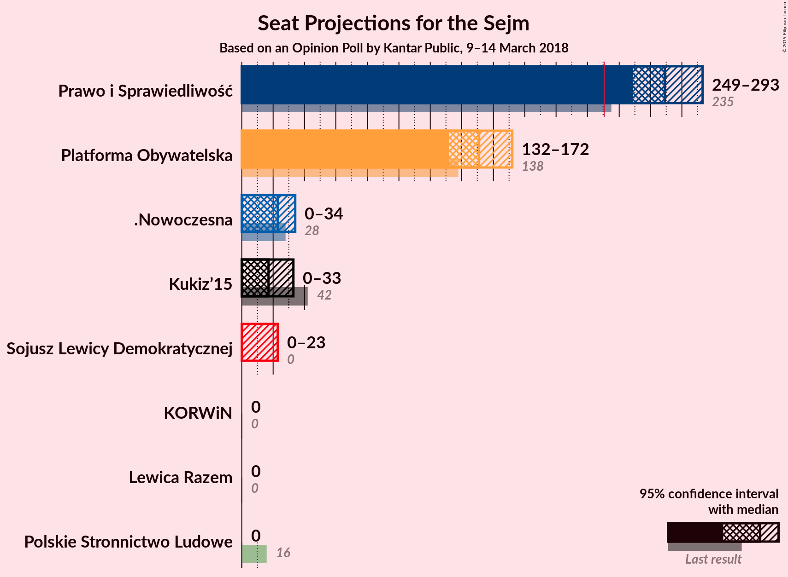
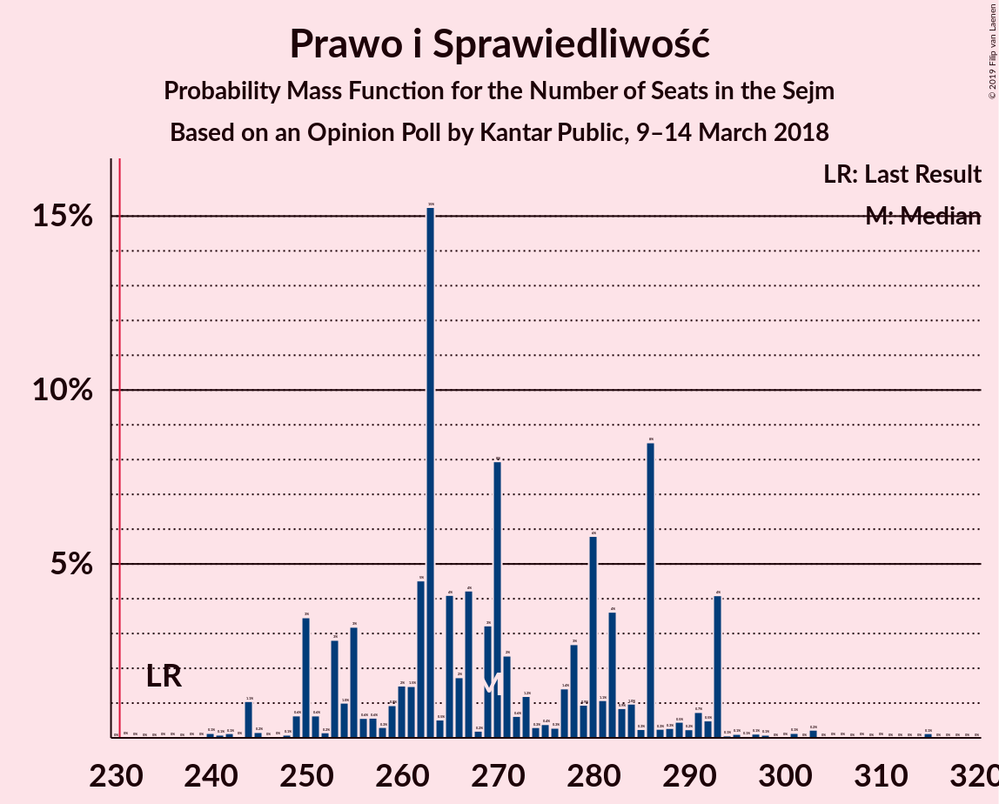
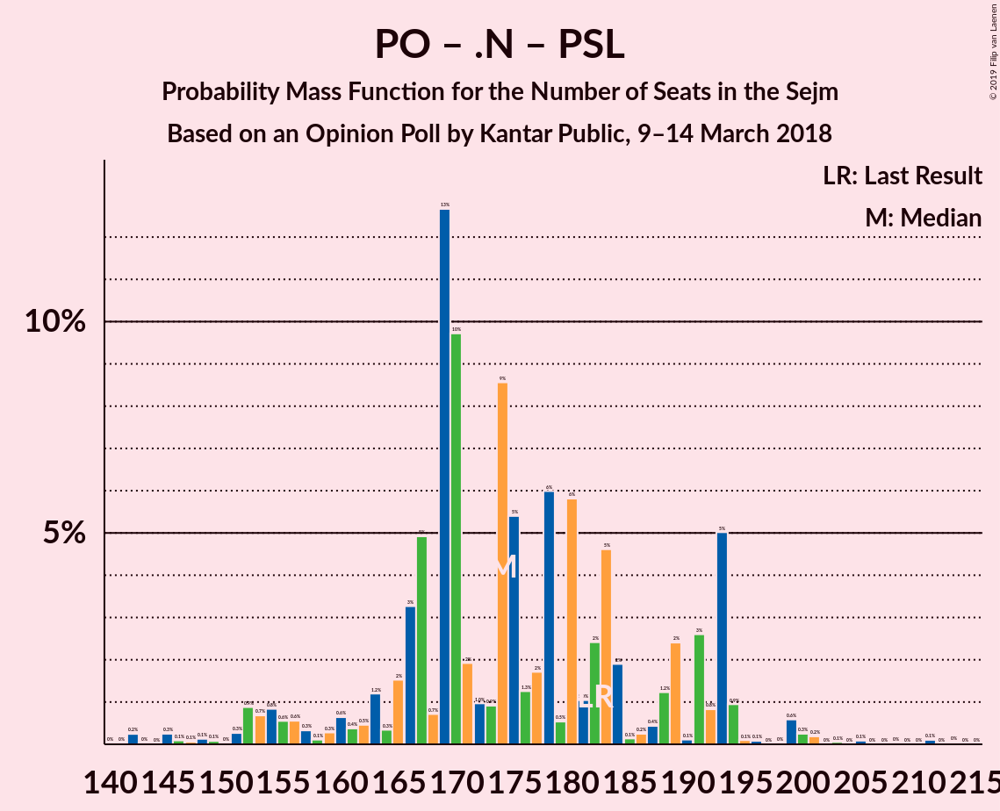

# Opinion Poll by Kantar Public, 9–14 March 2018

<a href="#voting-intentions">Voting Intentions</a> | <a href="#seats">Seats</a> | <a href="#coalitions">Coalitions</a> | <a href="#technical-information">Technical Information</a>

## Voting Intentions

### Confidence Intervals

| Party | Last Result | Poll Result | 80% Confidence Interval | 90% Confidence Interval | 95% Confidence Interval | 99% Confidence Interval |
|:-----:|:-----------:|:-----------:|:-----------------------:|:-----------------------:|:-----------------------:|:-----------------------:|
| Prawo i Sprawiedliwość | 37.6% | 37.8% | 35.9–39.8% |35.3–40.3% |34.9–40.8% |34.0–41.7% |
| Platforma Obywatelska | 24.1% | 22.5% | 20.9–24.2% |20.4–24.7% |20.0–25.1% |19.3–26.0% |
| .Nowoczesna | 7.6% | 6.1% | 5.3–7.2% |5.0–7.5% |4.8–7.8% |4.4–8.3% |
| Kukiz’15 | 8.8% | 5.1% | 4.3–6.1% |4.1–6.3% |3.9–6.6% |3.5–7.1% |
| Sojusz Lewicy Demokratycznej | 7.6% | 4.1% | 3.4–5.0% |3.2–5.3% |3.0–5.5% |2.7–6.0% |
| Polskie Stronnictwo Ludowe | 5.1% | 2.0% | 1.6–2.7% |1.4–2.9% |1.3–3.1% |1.1–3.5% |
| KORWiN | 4.8% | 1.0% | 0.7–1.5% |0.6–1.6% |0.5–1.8% |0.4–2.1% |
| Lewica Razem | 3.6% | 1.0% | 0.7–1.5% |0.6–1.6% |0.5–1.8% |0.4–2.1% |

*Note:* The poll result column reflects the actual value used in the calculations. Published results may vary slightly, and in addition be rounded to fewer digits.

## Seats

### Confidence Intervals

| Party | Last Result | Median | 80% Confidence Interval | 90% Confidence Interval | 95% Confidence Interval | 99% Confidence Interval |
|:-----:|:-----------:|:------:|:-----------------------:|:-----------------------:|:-----------------------:|:-----------------------:|
| <a href="#prawo-i-sprawiedliwość">Prawo i Sprawiedliwość</a> | 235 | 269 | 254–286 |250–293 |249–293 |242–301 |
| <a href="#platforma-obywatelska">Platforma Obywatelska</a> | 138 | 151 | 138–163 |133–169 |132–172 |128–178 |
| <a href="#.nowoczesna">.Nowoczesna</a> | 28 | 23 | 17–33 |12–34 |0–34 |0–38 |
| <a href="#kukiz’15">Kukiz’15</a> | 42 | 17 | 0–28 |0–30 |0–33 |0–37 |
| <a href="#sojusz-lewicy-demokratycznej">Sojusz Lewicy Demokratycznej</a> | 0 | 0 | 0 |0–16 |0–23 |0–26 |
| <a href="#polskie-stronnictwo-ludowe">Polskie Stronnictwo Ludowe</a> | 16 | 0 | 0 |0 |0 |0 |
| <a href="#korwin">KORWiN</a> | 0 | 0 | 0 |0 |0 |0 |
| <a href="#lewica-razem">Lewica Razem</a> | 0 | 0 | 0 |0 |0 |0 |

### Prawo i Sprawiedliwość

*For a full overview of the results for this party, see the [Prawo i Sprawiedliwość](party-prawoisprawiedliwość.html) page.*

| Number of Seats | Probability | Accumulated | Special Marks |
|:---------------:|:-----------:|:-----------:|:-------------:|
| 231 | 0% | 100% | Majority |
| 232 | 0% | 99.9% |  |
| 233 | 0% | 99.9% |  |
| 234 | 0% | 99.9% |  |
| 235 | 0% | 99.9% | Last Result |
| 236 | 0% | 99.9% |  |
| 237 | 0% | 99.9% |  |
| 238 | 0% | 99.9% |  |
| 239 | 0% | 99.9% |  |
| 240 | 0.1% | 99.8% |  |
| 241 | 0.1% | 99.7% |  |
| 242 | 0.1% | 99.6% |  |
| 243 | 0% | 99.5% |  |
| 244 | 1.1% | 99.4% |  |
| 245 | 0.2% | 98% |  |
| 246 | 0% | 98% |  |
| 247 | 0% | 98% |  |
| 248 | 0.1% | 98% |  |
| 249 | 0.6% | 98% |  |
| 250 | 3% | 97% |  |
| 251 | 0.6% | 94% |  |
| 252 | 0.2% | 93% |  |
| 253 | 3% | 93% |  |
| 254 | 1.0% | 90% |  |
| 255 | 3% | 89% |  |
| 256 | 0.6% | 86% |  |
| 257 | 0.6% | 86% |  |
| 258 | 0.3% | 85% |  |
| 259 | 0.9% | 85% |  |
| 260 | 2% | 84% |  |
| 261 | 1.5% | 82% |  |
| 262 | 5% | 81% |  |
| 263 | 15% | 76% |  |
| 264 | 0.5% | 61% |  |
| 265 | 4% | 60% |  |
| 266 | 2% | 56% |  |
| 267 | 4% | 55% |  |
| 268 | 0.2% | 50% |  |
| 269 | 3% | 50% | Median |
| 270 | 8% | 47% |  |
| 271 | 2% | 39% |  |
| 272 | 0.6% | 37% |  |
| 273 | 1.2% | 36% |  |
| 274 | 0.3% | 35% |  |
| 275 | 0.4% | 34% |  |
| 276 | 0.3% | 34% |  |
| 277 | 1.4% | 34% |  |
| 278 | 3% | 32% |  |
| 279 | 0.9% | 30% |  |
| 280 | 6% | 29% |  |
| 281 | 1.1% | 23% |  |
| 282 | 4% | 22% |  |
| 283 | 0.9% | 18% |  |
| 284 | 1.0% | 17% |  |
| 285 | 0.3% | 16% |  |
| 286 | 8% | 16% |  |
| 287 | 0.3% | 8% |  |
| 288 | 0.3% | 7% |  |
| 289 | 0.5% | 7% |  |
| 290 | 0.2% | 7% |  |
| 291 | 0.7% | 6% |  |
| 292 | 0.5% | 6% |  |
| 293 | 4% | 5% |  |
| 294 | 0.1% | 1.1% |  |
| 295 | 0.1% | 1.0% |  |
| 296 | 0.1% | 0.9% |  |
| 297 | 0.1% | 0.8% |  |
| 298 | 0.1% | 0.7% |  |
| 299 | 0% | 0.6% |  |
| 300 | 0% | 0.6% |  |
| 301 | 0.1% | 0.6% |  |
| 302 | 0% | 0.5% |  |
| 303 | 0.2% | 0.5% |  |
| 304 | 0% | 0.2% |  |
| 305 | 0% | 0.2% |  |
| 306 | 0% | 0.2% |  |
| 307 | 0% | 0.2% |  |
| 308 | 0% | 0.2% |  |
| 309 | 0% | 0.2% |  |
| 310 | 0% | 0.2% |  |
| 311 | 0% | 0.1% |  |
| 312 | 0% | 0.1% |  |
| 313 | 0% | 0.1% |  |
| 314 | 0% | 0.1% |  |
| 315 | 0.1% | 0.1% |  |
| 316 | 0% | 0% |  |

### Platforma Obywatelska

*For a full overview of the results for this party, see the [Platforma Obywatelska](party-platformaobywatelska.html) page.*

| Number of Seats | Probability | Accumulated | Special Marks |
|:---------------:|:-----------:|:-----------:|:-------------:|
| 119 | 0% | 100% |  |
| 120 | 0% | 99.9% |  |
| 121 | 0% | 99.9% |  |
| 122 | 0.1% | 99.9% |  |
| 123 | 0% | 99.9% |  |
| 124 | 0.1% | 99.8% |  |
| 125 | 0% | 99.8% |  |
| 126 | 0% | 99.7% |  |
| 127 | 0.1% | 99.7% |  |
| 128 | 0.3% | 99.7% |  |
| 129 | 0.3% | 99.4% |  |
| 130 | 0.2% | 99.0% |  |
| 131 | 0.6% | 98.9% |  |
| 132 | 0.9% | 98% |  |
| 133 | 3% | 97% |  |
| 134 | 0.5% | 95% |  |
| 135 | 0.1% | 94% |  |
| 136 | 1.1% | 94% |  |
| 137 | 0.5% | 93% |  |
| 138 | 4% | 93% | Last Result |
| 139 | 0.4% | 89% |  |
| 140 | 0.6% | 88% |  |
| 141 | 6% | 88% |  |
| 142 | 1.0% | 82% |  |
| 143 | 0.3% | 81% |  |
| 144 | 0.5% | 81% |  |
| 145 | 1.3% | 80% |  |
| 146 | 3% | 79% |  |
| 147 | 0.6% | 76% |  |
| 148 | 4% | 76% |  |
| 149 | 15% | 71% |  |
| 150 | 5% | 57% |  |
| 151 | 6% | 52% | Median |
| 152 | 2% | 46% |  |
| 153 | 0.9% | 44% |  |
| 154 | 10% | 43% |  |
| 155 | 3% | 33% |  |
| 156 | 1.1% | 30% |  |
| 157 | 1.0% | 29% |  |
| 158 | 4% | 28% |  |
| 159 | 8% | 23% |  |
| 160 | 0.2% | 15% |  |
| 161 | 0.9% | 15% |  |
| 162 | 4% | 14% |  |
| 163 | 1.1% | 10% |  |
| 164 | 0.3% | 9% |  |
| 165 | 0.2% | 9% |  |
| 166 | 2% | 9% |  |
| 167 | 0.6% | 7% |  |
| 168 | 0.1% | 6% |  |
| 169 | 3% | 6% |  |
| 170 | 0.3% | 4% |  |
| 171 | 0.1% | 3% |  |
| 172 | 0.7% | 3% |  |
| 173 | 0.5% | 2% |  |
| 174 | 0.5% | 2% |  |
| 175 | 0.1% | 2% |  |
| 176 | 0% | 1.5% |  |
| 177 | 0% | 1.4% |  |
| 178 | 0.9% | 1.4% |  |
| 179 | 0.2% | 0.5% |  |
| 180 | 0.1% | 0.2% |  |
| 181 | 0.1% | 0.1% |  |
| 182 | 0% | 0.1% |  |
| 183 | 0% | 0.1% |  |
| 184 | 0% | 0.1% |  |
| 185 | 0% | 0.1% |  |
| 186 | 0% | 0% |  |

### .Nowoczesna

*For a full overview of the results for this party, see the [.Nowoczesna](party-nowoczesna.html) page.*

| Number of Seats | Probability | Accumulated | Special Marks |
|:---------------:|:-----------:|:-----------:|:-------------:|
| 0 | 5% | 100% |  |
| 1 | 0% | 95% |  |
| 2 | 0% | 95% |  |
| 3 | 0% | 95% |  |
| 4 | 0% | 95% |  |
| 5 | 0% | 95% |  |
| 6 | 0% | 95% |  |
| 7 | 0% | 95% |  |
| 8 | 0% | 95% |  |
| 9 | 0% | 95% |  |
| 10 | 0% | 95% |  |
| 11 | 0% | 95% |  |
| 12 | 0.4% | 95% |  |
| 13 | 1.0% | 95% |  |
| 14 | 0.8% | 94% |  |
| 15 | 0.5% | 93% |  |
| 16 | 2% | 93% |  |
| 17 | 1.2% | 91% |  |
| 18 | 2% | 90% |  |
| 19 | 9% | 88% |  |
| 20 | 18% | 79% |  |
| 21 | 6% | 61% |  |
| 22 | 6% | 56% |  |
| 23 | 4% | 50% | Median |
| 24 | 3% | 46% |  |
| 25 | 0.7% | 43% |  |
| 26 | 7% | 42% |  |
| 27 | 1.5% | 35% |  |
| 28 | 2% | 34% | Last Result |
| 29 | 11% | 32% |  |
| 30 | 4% | 21% |  |
| 31 | 2% | 17% |  |
| 32 | 3% | 15% |  |
| 33 | 6% | 12% |  |
| 34 | 5% | 7% |  |
| 35 | 0.3% | 2% |  |
| 36 | 0.4% | 1.2% |  |
| 37 | 0.2% | 0.8% |  |
| 38 | 0.3% | 0.5% |  |
| 39 | 0.1% | 0.3% |  |
| 40 | 0% | 0.2% |  |
| 41 | 0% | 0.2% |  |
| 42 | 0% | 0.2% |  |
| 43 | 0.1% | 0.2% |  |
| 44 | 0% | 0.1% |  |
| 45 | 0% | 0.1% |  |
| 46 | 0% | 0.1% |  |
| 47 | 0% | 0% |  |

### Kukiz’15

*For a full overview of the results for this party, see the [Kukiz’15](party-kukiz’15.html) page.*

| Number of Seats | Probability | Accumulated | Special Marks |
|:---------------:|:-----------:|:-----------:|:-------------:|
| 0 | 43% | 100% |  |
| 1 | 0% | 57% |  |
| 2 | 0% | 57% |  |
| 3 | 0% | 57% |  |
| 4 | 0% | 57% |  |
| 5 | 0% | 57% |  |
| 6 | 0% | 57% |  |
| 7 | 0% | 57% |  |
| 8 | 0% | 57% |  |
| 9 | 0% | 57% |  |
| 10 | 0.1% | 57% |  |
| 11 | 0% | 57% |  |
| 12 | 0.3% | 57% |  |
| 13 | 0.1% | 57% |  |
| 14 | 2% | 57% |  |
| 15 | 0.8% | 54% |  |
| 16 | 0.2% | 53% |  |
| 17 | 4% | 53% | Median |
| 18 | 2% | 49% |  |
| 19 | 0.6% | 47% |  |
| 20 | 6% | 47% |  |
| 21 | 3% | 41% |  |
| 22 | 5% | 38% |  |
| 23 | 1.0% | 33% |  |
| 24 | 4% | 32% |  |
| 25 | 0.6% | 27% |  |
| 26 | 0.6% | 27% |  |
| 27 | 4% | 26% |  |
| 28 | 16% | 22% |  |
| 29 | 0.7% | 6% |  |
| 30 | 2% | 6% |  |
| 31 | 0.2% | 4% |  |
| 32 | 0.2% | 3% |  |
| 33 | 0.8% | 3% |  |
| 34 | 0.1% | 2% |  |
| 35 | 0.2% | 2% |  |
| 36 | 1.4% | 2% |  |
| 37 | 0.4% | 0.6% |  |
| 38 | 0% | 0.2% |  |
| 39 | 0.1% | 0.2% |  |
| 40 | 0% | 0.1% |  |
| 41 | 0% | 0.1% |  |
| 42 | 0.1% | 0.1% | Last Result |
| 43 | 0% | 0% |  |

### Sojusz Lewicy Demokratycznej

*For a full overview of the results for this party, see the [Sojusz Lewicy Demokratycznej](party-sojuszlewicydemokratycznej.html) page.*

| Number of Seats | Probability | Accumulated | Special Marks |
|:---------------:|:-----------:|:-----------:|:-------------:|
| 0 | 94% | 100% | Last Result, Median |
| 1 | 0% | 6% |  |
| 2 | 0% | 6% |  |
| 3 | 0% | 6% |  |
| 4 | 0% | 6% |  |
| 5 | 0% | 6% |  |
| 6 | 0% | 6% |  |
| 7 | 0% | 6% |  |
| 8 | 0% | 6% |  |
| 9 | 0% | 6% |  |
| 10 | 0% | 6% |  |
| 11 | 0% | 6% |  |
| 12 | 0% | 6% |  |
| 13 | 0% | 6% |  |
| 14 | 0% | 6% |  |
| 15 | 0.4% | 6% |  |
| 16 | 0.6% | 5% |  |
| 17 | 0.1% | 5% |  |
| 18 | 1.0% | 5% |  |
| 19 | 0.1% | 4% |  |
| 20 | 0.4% | 4% |  |
| 21 | 0.1% | 3% |  |
| 22 | 0.2% | 3% |  |
| 23 | 0.7% | 3% |  |
| 24 | 0.5% | 2% |  |
| 25 | 0.6% | 2% |  |
| 26 | 0.8% | 1.2% |  |
| 27 | 0.1% | 0.4% |  |
| 28 | 0.1% | 0.3% |  |
| 29 | 0.1% | 0.2% |  |
| 30 | 0% | 0.1% |  |
| 31 | 0% | 0% |  |

### Polskie Stronnictwo Ludowe

*For a full overview of the results for this party, see the [Polskie Stronnictwo Ludowe](party-polskiestronnictwoludowe.html) page.*

| Number of Seats | Probability | Accumulated | Special Marks |
|:---------------:|:-----------:|:-----------:|:-------------:|
| 0 | 100% | 100% | Median |
| 1 | 0% | 0% |  |
| 2 | 0% | 0% |  |
| 3 | 0% | 0% |  |
| 4 | 0% | 0% |  |
| 5 | 0% | 0% |  |
| 6 | 0% | 0% |  |
| 7 | 0% | 0% |  |
| 8 | 0% | 0% |  |
| 9 | 0% | 0% |  |
| 10 | 0% | 0% |  |
| 11 | 0% | 0% |  |
| 12 | 0% | 0% |  |
| 13 | 0% | 0% |  |
| 14 | 0% | 0% |  |
| 15 | 0% | 0% |  |
| 16 | 0% | 0% | Last Result |

### KORWiN

*For a full overview of the results for this party, see the [KORWiN](party-korwin.html) page.*

| Number of Seats | Probability | Accumulated | Special Marks |
|:---------------:|:-----------:|:-----------:|:-------------:|
| 0 | 100% | 100% | Last Result, Median |

### Lewica Razem

*For a full overview of the results for this party, see the [Lewica Razem](party-lewicarazem.html) page.*

| Number of Seats | Probability | Accumulated | Special Marks |
|:---------------:|:-----------:|:-----------:|:-------------:|
| 0 | 100% | 100% | Last Result, Median |

## Coalitions

### Confidence Intervals

| Coalition | Last Result | Median | Majority? | 80% Confidence Interval | 90% Confidence Interval | 95% Confidence Interval | 99% Confidence Interval |
|:---------:|:-----------:|:------:|:---------:|:-----------------------:|:-----------------------:|:-----------------------:|:-----------------------:|
| Prawo i Sprawiedliwość | 235 | 269 | 100% | 254–286 | 250–293 | 249–293 | 242–301 |
| Platforma Obywatelska – .Nowoczesna – Sojusz Lewicy Demokratycznej – Polskie Stronnictwo Ludowe – Lewica Razem | 182 | 174 | 0% | 166–192 | 163–193 | 155–199 | 149–205 |
| Platforma Obywatelska – .Nowoczesna – Sojusz Lewicy Demokratycznej – Polskie Stronnictwo Ludowe | 182 | 174 | 0% | 166–192 | 163–193 | 155–199 | 149–205 |
| Platforma Obywatelska – .Nowoczesna – Sojusz Lewicy Demokratycznej | 166 | 174 | 0% | 166–192 | 163–193 | 155–199 | 149–205 |
| Platforma Obywatelska – .Nowoczesna | 166 | 174 | 0% | 165–191 | 157–193 | 153–194 | 145–201 |
| Platforma Obywatelska – .Nowoczesna – Polskie Stronnictwo Ludowe | 182 | 174 | 0% | 165–191 | 157–193 | 153–194 | 145–201 |
| Platforma Obywatelska | 138 | 151 | 0% | 138–163 | 133–169 | 132–172 | 128–178 |

### Prawo i Sprawiedliwość

| Number of Seats | Probability | Accumulated | Special Marks |
|:---------------:|:-----------:|:-----------:|:-------------:|
| 231 | 0% | 100% | Majority |
| 232 | 0% | 99.9% |  |
| 233 | 0% | 99.9% |  |
| 234 | 0% | 99.9% |  |
| 235 | 0% | 99.9% | Last Result |
| 236 | 0% | 99.9% |  |
| 237 | 0% | 99.9% |  |
| 238 | 0% | 99.9% |  |
| 239 | 0% | 99.9% |  |
| 240 | 0.1% | 99.8% |  |
| 241 | 0.1% | 99.7% |  |
| 242 | 0.1% | 99.6% |  |
| 243 | 0% | 99.5% |  |
| 244 | 1.1% | 99.4% |  |
| 245 | 0.2% | 98% |  |
| 246 | 0% | 98% |  |
| 247 | 0% | 98% |  |
| 248 | 0.1% | 98% |  |
| 249 | 0.6% | 98% |  |
| 250 | 3% | 97% |  |
| 251 | 0.6% | 94% |  |
| 252 | 0.2% | 93% |  |
| 253 | 3% | 93% |  |
| 254 | 1.0% | 90% |  |
| 255 | 3% | 89% |  |
| 256 | 0.6% | 86% |  |
| 257 | 0.6% | 86% |  |
| 258 | 0.3% | 85% |  |
| 259 | 0.9% | 85% |  |
| 260 | 2% | 84% |  |
| 261 | 1.5% | 82% |  |
| 262 | 5% | 81% |  |
| 263 | 15% | 76% |  |
| 264 | 0.5% | 61% |  |
| 265 | 4% | 60% |  |
| 266 | 2% | 56% |  |
| 267 | 4% | 55% |  |
| 268 | 0.2% | 50% |  |
| 269 | 3% | 50% | Median |
| 270 | 8% | 47% |  |
| 271 | 2% | 39% |  |
| 272 | 0.6% | 37% |  |
| 273 | 1.2% | 36% |  |
| 274 | 0.3% | 35% |  |
| 275 | 0.4% | 34% |  |
| 276 | 0.3% | 34% |  |
| 277 | 1.4% | 34% |  |
| 278 | 3% | 32% |  |
| 279 | 0.9% | 30% |  |
| 280 | 6% | 29% |  |
| 281 | 1.1% | 23% |  |
| 282 | 4% | 22% |  |
| 283 | 0.9% | 18% |  |
| 284 | 1.0% | 17% |  |
| 285 | 0.3% | 16% |  |
| 286 | 8% | 16% |  |
| 287 | 0.3% | 8% |  |
| 288 | 0.3% | 7% |  |
| 289 | 0.5% | 7% |  |
| 290 | 0.2% | 7% |  |
| 291 | 0.7% | 6% |  |
| 292 | 0.5% | 6% |  |
| 293 | 4% | 5% |  |
| 294 | 0.1% | 1.1% |  |
| 295 | 0.1% | 1.0% |  |
| 296 | 0.1% | 0.9% |  |
| 297 | 0.1% | 0.8% |  |
| 298 | 0.1% | 0.7% |  |
| 299 | 0% | 0.6% |  |
| 300 | 0% | 0.6% |  |
| 301 | 0.1% | 0.6% |  |
| 302 | 0% | 0.5% |  |
| 303 | 0.2% | 0.5% |  |
| 304 | 0% | 0.2% |  |
| 305 | 0% | 0.2% |  |
| 306 | 0% | 0.2% |  |
| 307 | 0% | 0.2% |  |
| 308 | 0% | 0.2% |  |
| 309 | 0% | 0.2% |  |
| 310 | 0% | 0.2% |  |
| 311 | 0% | 0.1% |  |
| 312 | 0% | 0.1% |  |
| 313 | 0% | 0.1% |  |
| 314 | 0% | 0.1% |  |
| 315 | 0.1% | 0.1% |  |
| 316 | 0% | 0% |  |

### Platforma Obywatelska – .Nowoczesna – Sojusz Lewicy Demokratycznej – Polskie Stronnictwo Ludowe – Lewica Razem

| Number of Seats | Probability | Accumulated | Special Marks |
|:---------------:|:-----------:|:-----------:|:-------------:|
| 141 | 0% | 100% |  |
| 142 | 0% | 99.9% |  |
| 143 | 0% | 99.9% |  |
| 144 | 0% | 99.9% |  |
| 145 | 0.2% | 99.9% |  |
| 146 | 0.1% | 99.7% |  |
| 147 | 0.1% | 99.7% |  |
| 148 | 0.1% | 99.6% |  |
| 149 | 0% | 99.5% |  |
| 150 | 0% | 99.5% |  |
| 151 | 0.3% | 99.5% |  |
| 152 | 0.1% | 99.2% |  |
| 153 | 0.7% | 99.1% |  |
| 154 | 0.8% | 98% |  |
| 155 | 0.6% | 98% |  |
| 156 | 0.3% | 97% |  |
| 157 | 0.5% | 97% |  |
| 158 | 0.1% | 96% |  |
| 159 | 0.2% | 96% |  |
| 160 | 0.2% | 96% |  |
| 161 | 0.1% | 96% |  |
| 162 | 0.4% | 96% |  |
| 163 | 1.0% | 95% |  |
| 164 | 0.2% | 94% |  |
| 165 | 1.2% | 94% |  |
| 166 | 3% | 93% |  |
| 167 | 5% | 90% |  |
| 168 | 0.6% | 85% |  |
| 169 | 13% | 84% |  |
| 170 | 10% | 72% |  |
| 171 | 2% | 62% |  |
| 172 | 1.1% | 60% |  |
| 173 | 0.9% | 59% |  |
| 174 | 9% | 58% | Median |
| 175 | 5% | 50% |  |
| 176 | 1.3% | 44% |  |
| 177 | 1.3% | 43% |  |
| 178 | 7% | 42% |  |
| 179 | 0.7% | 35% |  |
| 180 | 6% | 34% |  |
| 181 | 1.0% | 28% |  |
| 182 | 2% | 27% | Last Result |
| 183 | 5% | 26% |  |
| 184 | 2% | 21% |  |
| 185 | 0.2% | 19% |  |
| 186 | 0.3% | 18% |  |
| 187 | 0.5% | 18% |  |
| 188 | 1.2% | 18% |  |
| 189 | 2% | 16% |  |
| 190 | 0.5% | 14% |  |
| 191 | 3% | 13% |  |
| 192 | 1.0% | 11% |  |
| 193 | 5% | 10% |  |
| 194 | 1.0% | 5% |  |
| 195 | 0.2% | 4% |  |
| 196 | 0.2% | 3% |  |
| 197 | 0.1% | 3% |  |
| 198 | 0.1% | 3% |  |
| 199 | 1.0% | 3% |  |
| 200 | 0.9% | 2% |  |
| 201 | 0.6% | 1.2% |  |
| 202 | 0% | 0.7% |  |
| 203 | 0.1% | 0.7% |  |
| 204 | 0% | 0.6% |  |
| 205 | 0.1% | 0.6% |  |
| 206 | 0% | 0.5% |  |
| 207 | 0.1% | 0.4% |  |
| 208 | 0% | 0.3% |  |
| 209 | 0% | 0.3% |  |
| 210 | 0% | 0.2% |  |
| 211 | 0.1% | 0.2% |  |
| 212 | 0% | 0.1% |  |
| 213 | 0% | 0.1% |  |
| 214 | 0% | 0% |  |

### Platforma Obywatelska – .Nowoczesna – Sojusz Lewicy Demokratycznej – Polskie Stronnictwo Ludowe

| Number of Seats | Probability | Accumulated | Special Marks |
|:---------------:|:-----------:|:-----------:|:-------------:|
| 141 | 0% | 100% |  |
| 142 | 0% | 99.9% |  |
| 143 | 0% | 99.9% |  |
| 144 | 0% | 99.9% |  |
| 145 | 0.2% | 99.9% |  |
| 146 | 0.1% | 99.7% |  |
| 147 | 0.1% | 99.7% |  |
| 148 | 0.1% | 99.6% |  |
| 149 | 0% | 99.5% |  |
| 150 | 0% | 99.5% |  |
| 151 | 0.3% | 99.5% |  |
| 152 | 0.1% | 99.2% |  |
| 153 | 0.7% | 99.1% |  |
| 154 | 0.8% | 98% |  |
| 155 | 0.6% | 98% |  |
| 156 | 0.3% | 97% |  |
| 157 | 0.5% | 97% |  |
| 158 | 0.1% | 96% |  |
| 159 | 0.2% | 96% |  |
| 160 | 0.2% | 96% |  |
| 161 | 0.1% | 96% |  |
| 162 | 0.4% | 96% |  |
| 163 | 1.0% | 95% |  |
| 164 | 0.2% | 94% |  |
| 165 | 1.2% | 94% |  |
| 166 | 3% | 93% |  |
| 167 | 5% | 90% |  |
| 168 | 0.6% | 85% |  |
| 169 | 13% | 84% |  |
| 170 | 10% | 72% |  |
| 171 | 2% | 62% |  |
| 172 | 1.1% | 60% |  |
| 173 | 0.9% | 59% |  |
| 174 | 9% | 58% | Median |
| 175 | 5% | 50% |  |
| 176 | 1.3% | 44% |  |
| 177 | 1.3% | 43% |  |
| 178 | 7% | 42% |  |
| 179 | 0.7% | 35% |  |
| 180 | 6% | 34% |  |
| 181 | 1.0% | 28% |  |
| 182 | 2% | 27% | Last Result |
| 183 | 5% | 26% |  |
| 184 | 2% | 21% |  |
| 185 | 0.2% | 19% |  |
| 186 | 0.3% | 18% |  |
| 187 | 0.5% | 18% |  |
| 188 | 1.2% | 18% |  |
| 189 | 2% | 16% |  |
| 190 | 0.5% | 14% |  |
| 191 | 3% | 13% |  |
| 192 | 1.0% | 11% |  |
| 193 | 5% | 10% |  |
| 194 | 1.0% | 5% |  |
| 195 | 0.2% | 4% |  |
| 196 | 0.2% | 3% |  |
| 197 | 0.1% | 3% |  |
| 198 | 0.1% | 3% |  |
| 199 | 1.0% | 3% |  |
| 200 | 0.9% | 2% |  |
| 201 | 0.6% | 1.2% |  |
| 202 | 0% | 0.7% |  |
| 203 | 0.1% | 0.7% |  |
| 204 | 0% | 0.6% |  |
| 205 | 0.1% | 0.6% |  |
| 206 | 0% | 0.5% |  |
| 207 | 0.1% | 0.4% |  |
| 208 | 0% | 0.3% |  |
| 209 | 0% | 0.3% |  |
| 210 | 0% | 0.2% |  |
| 211 | 0.1% | 0.2% |  |
| 212 | 0% | 0.1% |  |
| 213 | 0% | 0.1% |  |
| 214 | 0% | 0% |  |

### Platforma Obywatelska – .Nowoczesna – Sojusz Lewicy Demokratycznej

| Number of Seats | Probability | Accumulated | Special Marks |
|:---------------:|:-----------:|:-----------:|:-------------:|
| 141 | 0% | 100% |  |
| 142 | 0% | 99.9% |  |
| 143 | 0% | 99.9% |  |
| 144 | 0% | 99.9% |  |
| 145 | 0.2% | 99.9% |  |
| 146 | 0.1% | 99.7% |  |
| 147 | 0.1% | 99.7% |  |
| 148 | 0.1% | 99.6% |  |
| 149 | 0% | 99.5% |  |
| 150 | 0% | 99.5% |  |
| 151 | 0.3% | 99.5% |  |
| 152 | 0.1% | 99.2% |  |
| 153 | 0.7% | 99.1% |  |
| 154 | 0.8% | 98% |  |
| 155 | 0.6% | 98% |  |
| 156 | 0.3% | 97% |  |
| 157 | 0.5% | 97% |  |
| 158 | 0.1% | 96% |  |
| 159 | 0.2% | 96% |  |
| 160 | 0.2% | 96% |  |
| 161 | 0.1% | 96% |  |
| 162 | 0.4% | 96% |  |
| 163 | 1.0% | 95% |  |
| 164 | 0.2% | 94% |  |
| 165 | 1.2% | 94% |  |
| 166 | 3% | 93% | Last Result |
| 167 | 5% | 90% |  |
| 168 | 0.6% | 85% |  |
| 169 | 13% | 84% |  |
| 170 | 10% | 72% |  |
| 171 | 2% | 62% |  |
| 172 | 1.1% | 60% |  |
| 173 | 0.9% | 59% |  |
| 174 | 9% | 58% | Median |
| 175 | 5% | 50% |  |
| 176 | 1.3% | 44% |  |
| 177 | 1.3% | 43% |  |
| 178 | 7% | 42% |  |
| 179 | 0.7% | 35% |  |
| 180 | 6% | 34% |  |
| 181 | 1.0% | 28% |  |
| 182 | 2% | 27% |  |
| 183 | 5% | 26% |  |
| 184 | 2% | 21% |  |
| 185 | 0.2% | 19% |  |
| 186 | 0.3% | 18% |  |
| 187 | 0.5% | 18% |  |
| 188 | 1.2% | 18% |  |
| 189 | 2% | 16% |  |
| 190 | 0.5% | 14% |  |
| 191 | 3% | 13% |  |
| 192 | 1.0% | 11% |  |
| 193 | 5% | 10% |  |
| 194 | 1.0% | 5% |  |
| 195 | 0.2% | 4% |  |
| 196 | 0.2% | 3% |  |
| 197 | 0.1% | 3% |  |
| 198 | 0.1% | 3% |  |
| 199 | 1.0% | 3% |  |
| 200 | 0.9% | 2% |  |
| 201 | 0.6% | 1.2% |  |
| 202 | 0% | 0.7% |  |
| 203 | 0.1% | 0.7% |  |
| 204 | 0% | 0.6% |  |
| 205 | 0.1% | 0.6% |  |
| 206 | 0% | 0.5% |  |
| 207 | 0.1% | 0.4% |  |
| 208 | 0% | 0.3% |  |
| 209 | 0% | 0.3% |  |
| 210 | 0% | 0.2% |  |
| 211 | 0.1% | 0.2% |  |
| 212 | 0% | 0.1% |  |
| 213 | 0% | 0.1% |  |
| 214 | 0% | 0% |  |

### Platforma Obywatelska – .Nowoczesna

| Number of Seats | Probability | Accumulated | Special Marks |
|:---------------:|:-----------:|:-----------:|:-------------:|
| 140 | 0% | 100% |  |
| 141 | 0% | 99.9% |  |
| 142 | 0.2% | 99.9% |  |
| 143 | 0% | 99.7% |  |
| 144 | 0% | 99.6% |  |
| 145 | 0.3% | 99.6% |  |
| 146 | 0.1% | 99.4% |  |
| 147 | 0.1% | 99.3% |  |
| 148 | 0.1% | 99.2% |  |
| 149 | 0.1% | 99.1% |  |
| 150 | 0% | 99.0% |  |
| 151 | 0.3% | 99.0% |  |
| 152 | 0.9% | 98.7% |  |
| 153 | 0.7% | 98% |  |
| 154 | 0.8% | 97% |  |
| 155 | 0.6% | 96% |  |
| 156 | 0.6% | 96% |  |
| 157 | 0.3% | 95% |  |
| 158 | 0.1% | 95% |  |
| 159 | 0.3% | 95% |  |
| 160 | 0.6% | 94% |  |
| 161 | 0.4% | 94% |  |
| 162 | 0.5% | 93% |  |
| 163 | 1.2% | 93% |  |
| 164 | 0.3% | 92% |  |
| 165 | 2% | 91% |  |
| 166 | 3% | 90% | Last Result |
| 167 | 5% | 87% |  |
| 168 | 0.7% | 82% |  |
| 169 | 13% | 81% |  |
| 170 | 10% | 68% |  |
| 171 | 2% | 59% |  |
| 172 | 1.0% | 57% |  |
| 173 | 0.9% | 56% |  |
| 174 | 9% | 55% | Median |
| 175 | 5% | 46% |  |
| 176 | 1.3% | 41% |  |
| 177 | 2% | 40% |  |
| 178 | 6% | 38% |  |
| 179 | 0.5% | 32% |  |
| 180 | 6% | 31% |  |
| 181 | 1.0% | 26% |  |
| 182 | 2% | 24% |  |
| 183 | 5% | 22% |  |
| 184 | 2% | 17% |  |
| 185 | 0.1% | 16% |  |
| 186 | 0.2% | 15% |  |
| 187 | 0.4% | 15% |  |
| 188 | 1.2% | 15% |  |
| 189 | 2% | 14% |  |
| 190 | 0.1% | 11% |  |
| 191 | 3% | 11% |  |
| 192 | 0.8% | 8% |  |
| 193 | 5% | 8% |  |
| 194 | 0.9% | 3% |  |
| 195 | 0.1% | 2% |  |
| 196 | 0.1% | 1.5% |  |
| 197 | 0% | 1.4% |  |
| 198 | 0% | 1.4% |  |
| 199 | 0.6% | 1.4% |  |
| 200 | 0.3% | 0.8% |  |
| 201 | 0.2% | 0.5% |  |
| 202 | 0% | 0.3% |  |
| 203 | 0.1% | 0.3% |  |
| 204 | 0% | 0.3% |  |
| 205 | 0.1% | 0.3% |  |
| 206 | 0% | 0.2% |  |
| 207 | 0% | 0.2% |  |
| 208 | 0% | 0.2% |  |
| 209 | 0% | 0.2% |  |
| 210 | 0% | 0.2% |  |
| 211 | 0.1% | 0.2% |  |
| 212 | 0% | 0% |  |

### Platforma Obywatelska – .Nowoczesna – Polskie Stronnictwo Ludowe

| Number of Seats | Probability | Accumulated | Special Marks |
|:---------------:|:-----------:|:-----------:|:-------------:|
| 140 | 0% | 100% |  |
| 141 | 0% | 99.9% |  |
| 142 | 0.2% | 99.9% |  |
| 143 | 0% | 99.7% |  |
| 144 | 0% | 99.6% |  |
| 145 | 0.3% | 99.6% |  |
| 146 | 0.1% | 99.4% |  |
| 147 | 0.1% | 99.3% |  |
| 148 | 0.1% | 99.2% |  |
| 149 | 0.1% | 99.1% |  |
| 150 | 0% | 99.0% |  |
| 151 | 0.3% | 99.0% |  |
| 152 | 0.9% | 98.7% |  |
| 153 | 0.7% | 98% |  |
| 154 | 0.8% | 97% |  |
| 155 | 0.6% | 96% |  |
| 156 | 0.6% | 96% |  |
| 157 | 0.3% | 95% |  |
| 158 | 0.1% | 95% |  |
| 159 | 0.3% | 95% |  |
| 160 | 0.6% | 94% |  |
| 161 | 0.4% | 94% |  |
| 162 | 0.5% | 93% |  |
| 163 | 1.2% | 93% |  |
| 164 | 0.3% | 92% |  |
| 165 | 2% | 91% |  |
| 166 | 3% | 90% |  |
| 167 | 5% | 87% |  |
| 168 | 0.7% | 82% |  |
| 169 | 13% | 81% |  |
| 170 | 10% | 68% |  |
| 171 | 2% | 59% |  |
| 172 | 1.0% | 57% |  |
| 173 | 0.9% | 56% |  |
| 174 | 9% | 55% | Median |
| 175 | 5% | 46% |  |
| 176 | 1.3% | 41% |  |
| 177 | 2% | 40% |  |
| 178 | 6% | 38% |  |
| 179 | 0.5% | 32% |  |
| 180 | 6% | 31% |  |
| 181 | 1.0% | 26% |  |
| 182 | 2% | 24% | Last Result |
| 183 | 5% | 22% |  |
| 184 | 2% | 17% |  |
| 185 | 0.1% | 16% |  |
| 186 | 0.2% | 15% |  |
| 187 | 0.4% | 15% |  |
| 188 | 1.2% | 15% |  |
| 189 | 2% | 14% |  |
| 190 | 0.1% | 11% |  |
| 191 | 3% | 11% |  |
| 192 | 0.8% | 8% |  |
| 193 | 5% | 8% |  |
| 194 | 0.9% | 3% |  |
| 195 | 0.1% | 2% |  |
| 196 | 0.1% | 1.5% |  |
| 197 | 0% | 1.4% |  |
| 198 | 0% | 1.4% |  |
| 199 | 0.6% | 1.4% |  |
| 200 | 0.3% | 0.8% |  |
| 201 | 0.2% | 0.5% |  |
| 202 | 0% | 0.3% |  |
| 203 | 0.1% | 0.3% |  |
| 204 | 0% | 0.3% |  |
| 205 | 0.1% | 0.3% |  |
| 206 | 0% | 0.2% |  |
| 207 | 0% | 0.2% |  |
| 208 | 0% | 0.2% |  |
| 209 | 0% | 0.2% |  |
| 210 | 0% | 0.2% |  |
| 211 | 0.1% | 0.2% |  |
| 212 | 0% | 0% |  |

### Platforma Obywatelska

| Number of Seats | Probability | Accumulated | Special Marks |
|:---------------:|:-----------:|:-----------:|:-------------:|
| 119 | 0% | 100% |  |
| 120 | 0% | 99.9% |  |
| 121 | 0% | 99.9% |  |
| 122 | 0.1% | 99.9% |  |
| 123 | 0% | 99.9% |  |
| 124 | 0.1% | 99.8% |  |
| 125 | 0% | 99.8% |  |
| 126 | 0% | 99.7% |  |
| 127 | 0.1% | 99.7% |  |
| 128 | 0.3% | 99.7% |  |
| 129 | 0.3% | 99.4% |  |
| 130 | 0.2% | 99.0% |  |
| 131 | 0.6% | 98.9% |  |
| 132 | 0.9% | 98% |  |
| 133 | 3% | 97% |  |
| 134 | 0.5% | 95% |  |
| 135 | 0.1% | 94% |  |
| 136 | 1.1% | 94% |  |
| 137 | 0.5% | 93% |  |
| 138 | 4% | 93% | Last Result |
| 139 | 0.4% | 89% |  |
| 140 | 0.6% | 88% |  |
| 141 | 6% | 88% |  |
| 142 | 1.0% | 82% |  |
| 143 | 0.3% | 81% |  |
| 144 | 0.5% | 81% |  |
| 145 | 1.3% | 80% |  |
| 146 | 3% | 79% |  |
| 147 | 0.6% | 76% |  |
| 148 | 4% | 76% |  |
| 149 | 15% | 71% |  |
| 150 | 5% | 57% |  |
| 151 | 6% | 52% | Median |
| 152 | 2% | 46% |  |
| 153 | 0.9% | 44% |  |
| 154 | 10% | 43% |  |
| 155 | 3% | 33% |  |
| 156 | 1.1% | 30% |  |
| 157 | 1.0% | 29% |  |
| 158 | 4% | 28% |  |
| 159 | 8% | 23% |  |
| 160 | 0.2% | 15% |  |
| 161 | 0.9% | 15% |  |
| 162 | 4% | 14% |  |
| 163 | 1.1% | 10% |  |
| 164 | 0.3% | 9% |  |
| 165 | 0.2% | 9% |  |
| 166 | 2% | 9% |  |
| 167 | 0.6% | 7% |  |
| 168 | 0.1% | 6% |  |
| 169 | 3% | 6% |  |
| 170 | 0.3% | 4% |  |
| 171 | 0.1% | 3% |  |
| 172 | 0.7% | 3% |  |
| 173 | 0.5% | 2% |  |
| 174 | 0.5% | 2% |  |
| 175 | 0.1% | 2% |  |
| 176 | 0% | 1.5% |  |
| 177 | 0% | 1.4% |  |
| 178 | 0.9% | 1.4% |  |
| 179 | 0.2% | 0.5% |  |
| 180 | 0.1% | 0.2% |  |
| 181 | 0.1% | 0.1% |  |
| 182 | 0% | 0.1% |  |
| 183 | 0% | 0.1% |  |
| 184 | 0% | 0.1% |  |
| 185 | 0% | 0.1% |  |
| 186 | 0% | 0% |  |

## Technical Information

### Opinion Poll

+ **Polling firm:** Kantar Public
+ **Commissioner(s):** —
+ **Fieldwork period:** 9–14 March 2018

### Calculations

+ **Sample size:** 1027
+ **Simulations done:** 131,072
+ **Error estimate:** 0.61%

