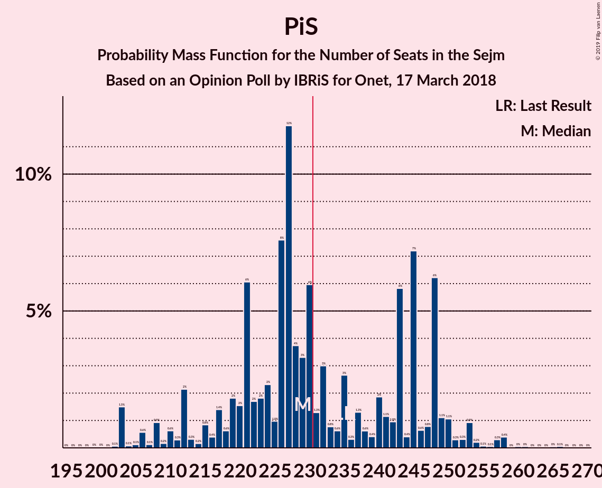
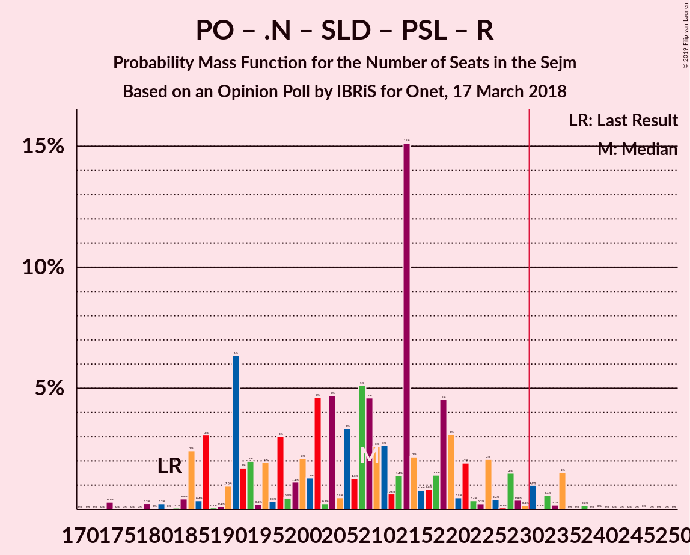

# Opinion Poll by IBRiS for Onet, 17 March 2018

<a href="#voting-intentions">Voting Intentions</a> | <a href="#seats">Seats</a> | <a href="#coalitions">Coalitions</a> | <a href="#technical-information">Technical Information</a>

## Voting Intentions

### Confidence Intervals

| Party | Last Result | Poll Result | 80% Confidence Interval | 90% Confidence Interval | 95% Confidence Interval | 99% Confidence Interval |
|:-----:|:-----------:|:-----------:|:-----------------------:|:-----------------------:|:-----------------------:|:-----------------------:|
| Prawo i Sprawiedliwość | 37.6% | 37.1% | 35.2–39.1% |34.6–39.7% |34.2–40.1% |33.2–41.1% |
| Platforma Obywatelska | 24.1% | 24.0% | 22.3–25.8% |21.9–26.3% |21.4–26.7% |20.7–27.6% |
| .Nowoczesna | 7.6% | 8.3% | 7.3–9.5% |7.0–9.9% |6.7–10.2% |6.3–10.8% |
| Sojusz Lewicy Demokratycznej | 7.6% | 7.6% | 6.6–8.8% |6.3–9.1% |6.1–9.4% |5.7–10.0% |
| Kukiz’15 | 8.8% | 6.3% | 5.4–7.4% |5.2–7.7% |5.0–8.0% |4.6–8.6% |
| Polskie Stronnictwo Ludowe | 5.1% | 4.4% | 3.7–5.3% |3.5–5.6% |3.3–5.9% |3.0–6.4% |
| Lewica Razem | 3.6% | 2.0% | 1.5–2.7% |1.4–2.9% |1.3–3.1% |1.1–3.4% |
| KORWiN | 4.8% | 0.4% | 0.2–0.8% |0.2–0.9% |0.2–1.0% |0.1–1.3% |

*Note:* The poll result column reflects the actual value used in the calculations. Published results may vary slightly, and in addition be rounded to fewer digits.

## Seats

### Confidence Intervals

| Party | Last Result | Median | 80% Confidence Interval | 90% Confidence Interval | 95% Confidence Interval | 99% Confidence Interval |
|:-----:|:-----------:|:------:|:-----------------------:|:-----------------------:|:-----------------------:|:-----------------------:|
| <a href="#prawo-i-sprawiedliwość">Prawo i Sprawiedliwość</a> | 235 | 228 | 220–244 |217–247 |212–249 |206–258 |
| <a href="#platforma-obywatelska">Platforma Obywatelska</a> | 138 | 136 | 130–150 |124–153 |119–155 |116–157 |
| <a href="#.nowoczesna">.Nowoczesna</a> | 28 | 29 | 24–40 |22–43 |21–45 |18–50 |
| <a href="#sojusz-lewicy-demokratycznej">Sojusz Lewicy Demokratycznej</a> | 0 | 35 | 25–37 |23–41 |22–44 |19–45 |
| <a href="#kukiz’15">Kukiz’15</a> | 42 | 21 | 11–33 |8–35 |0–40 |0–40 |
| <a href="#polskie-stronnictwo-ludowe">Polskie Stronnictwo Ludowe</a> | 16 | 0 | 0–17 |0–17 |0–18 |0–20 |
| <a href="#lewica-razem">Lewica Razem</a> | 0 | 0 | 0 |0 |0 |0 |
| <a href="#korwin">KORWiN</a> | 0 | 0 | 0 |0 |0 |0 |

### Prawo i Sprawiedliwość

*For a full overview of the results for this party, see the [Prawo i Sprawiedliwość](party-prawoisprawiedliwość.html) page.*

| Number of Seats | Probability | Accumulated | Special Marks |
|:---------------:|:-----------:|:-----------:|:-------------:|
| 199 | 0% | 100% |  |
| 200 | 0% | 99.9% |  |
| 201 | 0% | 99.9% |  |
| 202 | 0% | 99.9% |  |
| 203 | 0% | 99.9% |  |
| 204 | 0.1% | 99.9% |  |
| 205 | 0.1% | 99.9% |  |
| 206 | 1.0% | 99.7% |  |
| 207 | 0.1% | 98.7% |  |
| 208 | 0.3% | 98.6% |  |
| 209 | 0.2% | 98% |  |
| 210 | 0% | 98% |  |
| 211 | 0.1% | 98% |  |
| 212 | 1.1% | 98% |  |
| 213 | 0.4% | 97% |  |
| 214 | 0.1% | 96% |  |
| 215 | 0.1% | 96% |  |
| 216 | 0.6% | 96% |  |
| 217 | 1.3% | 96% |  |
| 218 | 0.4% | 94% |  |
| 219 | 1.5% | 94% |  |
| 220 | 3% | 93% |  |
| 221 | 3% | 90% |  |
| 222 | 1.2% | 87% |  |
| 223 | 3% | 85% |  |
| 224 | 0.7% | 82% |  |
| 225 | 2% | 81% |  |
| 226 | 11% | 80% |  |
| 227 | 18% | 69% |  |
| 228 | 5% | 51% | Median |
| 229 | 6% | 46% |  |
| 230 | 9% | 40% |  |
| 231 | 1.0% | 32% | Majority |
| 232 | 1.0% | 31% |  |
| 233 | 0.5% | 30% |  |
| 234 | 0.9% | 29% |  |
| 235 | 2% | 28% | Last Result |
| 236 | 0.1% | 26% |  |
| 237 | 0.1% | 26% |  |
| 238 | 0.8% | 26% |  |
| 239 | 0.6% | 25% |  |
| 240 | 0.9% | 25% |  |
| 241 | 1.2% | 24% |  |
| 242 | 1.5% | 23% |  |
| 243 | 11% | 21% |  |
| 244 | 0.7% | 11% |  |
| 245 | 4% | 10% |  |
| 246 | 0.3% | 6% |  |
| 247 | 0.6% | 5% |  |
| 248 | 0.3% | 5% |  |
| 249 | 2% | 4% |  |
| 250 | 0% | 2% |  |
| 251 | 0.1% | 2% |  |
| 252 | 0.1% | 2% |  |
| 253 | 0.4% | 2% |  |
| 254 | 0.1% | 2% |  |
| 255 | 0.1% | 2% |  |
| 256 | 0% | 1.4% |  |
| 257 | 0.5% | 1.4% |  |
| 258 | 0.7% | 0.9% |  |
| 259 | 0% | 0.2% |  |
| 260 | 0.1% | 0.2% |  |
| 261 | 0% | 0.1% |  |
| 262 | 0% | 0.1% |  |
| 263 | 0% | 0.1% |  |
| 264 | 0% | 0.1% |  |
| 265 | 0.1% | 0.1% |  |
| 266 | 0% | 0% |  |

### Platforma Obywatelska

*For a full overview of the results for this party, see the [Platforma Obywatelska](party-platformaobywatelska.html) page.*

| Number of Seats | Probability | Accumulated | Special Marks |
|:---------------:|:-----------:|:-----------:|:-------------:|
| 115 | 0.1% | 100% |  |
| 116 | 0.4% | 99.9% |  |
| 117 | 0.9% | 99.5% |  |
| 118 | 0.1% | 98.6% |  |
| 119 | 2% | 98% |  |
| 120 | 0.3% | 97% |  |
| 121 | 0.2% | 96% |  |
| 122 | 0.9% | 96% |  |
| 123 | 0.2% | 95% |  |
| 124 | 4% | 95% |  |
| 125 | 0.2% | 91% |  |
| 126 | 0.1% | 91% |  |
| 127 | 0.3% | 91% |  |
| 128 | 0% | 91% |  |
| 129 | 0.5% | 91% |  |
| 130 | 0.1% | 90% |  |
| 131 | 0.6% | 90% |  |
| 132 | 0.2% | 89% |  |
| 133 | 4% | 89% |  |
| 134 | 16% | 85% |  |
| 135 | 16% | 69% |  |
| 136 | 15% | 53% | Median |
| 137 | 12% | 38% |  |
| 138 | 3% | 26% | Last Result |
| 139 | 2% | 22% |  |
| 140 | 2% | 20% |  |
| 141 | 2% | 18% |  |
| 142 | 3% | 16% |  |
| 143 | 0.3% | 13% |  |
| 144 | 0.2% | 13% |  |
| 145 | 0.1% | 13% |  |
| 146 | 0.3% | 13% |  |
| 147 | 0% | 12% |  |
| 148 | 0.7% | 12% |  |
| 149 | 0.1% | 12% |  |
| 150 | 4% | 12% |  |
| 151 | 1.5% | 8% |  |
| 152 | 0.5% | 6% |  |
| 153 | 3% | 6% |  |
| 154 | 0.2% | 3% |  |
| 155 | 2% | 3% |  |
| 156 | 0.3% | 0.9% |  |
| 157 | 0.4% | 0.7% |  |
| 158 | 0.1% | 0.3% |  |
| 159 | 0% | 0.2% |  |
| 160 | 0% | 0.2% |  |
| 161 | 0% | 0.2% |  |
| 162 | 0% | 0.2% |  |
| 163 | 0% | 0.2% |  |
| 164 | 0% | 0.1% |  |
| 165 | 0% | 0.1% |  |
| 166 | 0% | 0.1% |  |
| 167 | 0.1% | 0.1% |  |
| 168 | 0% | 0.1% |  |
| 169 | 0% | 0% |  |

### .Nowoczesna

*For a full overview of the results for this party, see the [.Nowoczesna](party-nowoczesna.html) page.*

| Number of Seats | Probability | Accumulated | Special Marks |
|:---------------:|:-----------:|:-----------:|:-------------:|
| 13 | 0.1% | 100% |  |
| 14 | 0% | 99.9% |  |
| 15 | 0% | 99.8% |  |
| 16 | 0% | 99.8% |  |
| 17 | 0.1% | 99.8% |  |
| 18 | 0.7% | 99.7% |  |
| 19 | 0.4% | 99.0% |  |
| 20 | 0.9% | 98.6% |  |
| 21 | 1.5% | 98% |  |
| 22 | 5% | 96% |  |
| 23 | 0.8% | 91% |  |
| 24 | 1.1% | 90% |  |
| 25 | 0.1% | 89% |  |
| 26 | 3% | 89% |  |
| 27 | 1.4% | 87% |  |
| 28 | 28% | 85% | Last Result |
| 29 | 11% | 57% | Median |
| 30 | 2% | 46% |  |
| 31 | 5% | 43% |  |
| 32 | 0.7% | 38% |  |
| 33 | 0.2% | 37% |  |
| 34 | 0.8% | 37% |  |
| 35 | 0.8% | 37% |  |
| 36 | 4% | 36% |  |
| 37 | 10% | 32% |  |
| 38 | 1.4% | 22% |  |
| 39 | 0.4% | 20% |  |
| 40 | 13% | 20% |  |
| 41 | 0.8% | 7% |  |
| 42 | 1.2% | 6% |  |
| 43 | 0.4% | 5% |  |
| 44 | 2% | 5% |  |
| 45 | 2% | 3% |  |
| 46 | 0.1% | 1.1% |  |
| 47 | 0.3% | 1.0% |  |
| 48 | 0% | 0.7% |  |
| 49 | 0.1% | 0.6% |  |
| 50 | 0.4% | 0.5% |  |
| 51 | 0% | 0.1% |  |
| 52 | 0% | 0.1% |  |
| 53 | 0% | 0.1% |  |
| 54 | 0% | 0.1% |  |
| 55 | 0% | 0.1% |  |
| 56 | 0% | 0.1% |  |
| 57 | 0% | 0.1% |  |
| 58 | 0% | 0% |  |

### Sojusz Lewicy Demokratycznej

*For a full overview of the results for this party, see the [Sojusz Lewicy Demokratycznej](party-sojuszlewicydemokratycznej.html) page.*

| Number of Seats | Probability | Accumulated | Special Marks |
|:---------------:|:-----------:|:-----------:|:-------------:|
| 0 | 0% | 100% | Last Result |
| 1 | 0% | 100% |  |
| 2 | 0% | 100% |  |
| 3 | 0% | 100% |  |
| 4 | 0% | 100% |  |
| 5 | 0% | 100% |  |
| 6 | 0% | 100% |  |
| 7 | 0% | 100% |  |
| 8 | 0% | 100% |  |
| 9 | 0% | 100% |  |
| 10 | 0% | 100% |  |
| 11 | 0% | 100% |  |
| 12 | 0% | 100% |  |
| 13 | 0% | 100% |  |
| 14 | 0.2% | 99.9% |  |
| 15 | 0% | 99.7% |  |
| 16 | 0.1% | 99.7% |  |
| 17 | 0% | 99.6% |  |
| 18 | 0% | 99.6% |  |
| 19 | 0.5% | 99.6% |  |
| 20 | 0.1% | 99.1% |  |
| 21 | 0.7% | 99.0% |  |
| 22 | 1.4% | 98% |  |
| 23 | 2% | 97% |  |
| 24 | 1.0% | 95% |  |
| 25 | 12% | 94% |  |
| 26 | 2% | 82% |  |
| 27 | 5% | 80% |  |
| 28 | 0.2% | 75% |  |
| 29 | 6% | 75% |  |
| 30 | 3% | 69% |  |
| 31 | 5% | 67% |  |
| 32 | 2% | 62% |  |
| 33 | 8% | 60% |  |
| 34 | 2% | 52% |  |
| 35 | 33% | 50% | Median |
| 36 | 6% | 17% |  |
| 37 | 1.2% | 11% |  |
| 38 | 1.4% | 10% |  |
| 39 | 1.2% | 8% |  |
| 40 | 0.8% | 7% |  |
| 41 | 3% | 6% |  |
| 42 | 0.6% | 4% |  |
| 43 | 0.1% | 3% |  |
| 44 | 1.4% | 3% |  |
| 45 | 1.1% | 1.5% |  |
| 46 | 0.1% | 0.4% |  |
| 47 | 0.1% | 0.3% |  |
| 48 | 0.1% | 0.2% |  |
| 49 | 0% | 0.1% |  |
| 50 | 0% | 0.1% |  |
| 51 | 0% | 0% |  |

### Kukiz’15

*For a full overview of the results for this party, see the [Kukiz’15](party-kukiz’15.html) page.*

| Number of Seats | Probability | Accumulated | Special Marks |
|:---------------:|:-----------:|:-----------:|:-------------:|
| 0 | 4% | 100% |  |
| 1 | 0% | 96% |  |
| 2 | 0% | 96% |  |
| 3 | 0% | 96% |  |
| 4 | 0% | 96% |  |
| 5 | 0% | 96% |  |
| 6 | 0.2% | 96% |  |
| 7 | 0.8% | 96% |  |
| 8 | 0.8% | 95% |  |
| 9 | 1.0% | 94% |  |
| 10 | 2% | 93% |  |
| 11 | 1.4% | 91% |  |
| 12 | 0.5% | 90% |  |
| 13 | 0.1% | 89% |  |
| 14 | 1.0% | 89% |  |
| 15 | 0.2% | 88% |  |
| 16 | 0.5% | 88% |  |
| 17 | 3% | 87% |  |
| 18 | 0.6% | 85% |  |
| 19 | 19% | 84% |  |
| 20 | 12% | 65% |  |
| 21 | 10% | 53% | Median |
| 22 | 3% | 43% |  |
| 23 | 5% | 40% |  |
| 24 | 2% | 36% |  |
| 25 | 2% | 34% |  |
| 26 | 11% | 32% |  |
| 27 | 0.5% | 21% |  |
| 28 | 2% | 21% |  |
| 29 | 2% | 19% |  |
| 30 | 6% | 17% |  |
| 31 | 0.4% | 11% |  |
| 32 | 0.1% | 11% |  |
| 33 | 1.1% | 11% |  |
| 34 | 0.6% | 10% |  |
| 35 | 5% | 9% |  |
| 36 | 0.3% | 4% |  |
| 37 | 0.2% | 4% |  |
| 38 | 0.2% | 4% |  |
| 39 | 0.6% | 4% |  |
| 40 | 3% | 3% |  |
| 41 | 0.1% | 0.3% |  |
| 42 | 0% | 0.2% | Last Result |
| 43 | 0.1% | 0.2% |  |
| 44 | 0.1% | 0.1% |  |
| 45 | 0% | 0% |  |

### Polskie Stronnictwo Ludowe

*For a full overview of the results for this party, see the [Polskie Stronnictwo Ludowe](party-polskiestronnictwoludowe.html) page.*

| Number of Seats | Probability | Accumulated | Special Marks |
|:---------------:|:-----------:|:-----------:|:-------------:|
| 0 | 60% | 100% | Median |
| 1 | 0% | 40% |  |
| 2 | 0% | 40% |  |
| 3 | 0% | 40% |  |
| 4 | 0% | 40% |  |
| 5 | 0% | 40% |  |
| 6 | 0% | 40% |  |
| 7 | 0% | 40% |  |
| 8 | 0% | 40% |  |
| 9 | 0% | 40% |  |
| 10 | 0% | 40% |  |
| 11 | 0% | 40% |  |
| 12 | 0% | 40% |  |
| 13 | 0.1% | 40% |  |
| 14 | 0.1% | 40% |  |
| 15 | 3% | 40% |  |
| 16 | 19% | 37% | Last Result |
| 17 | 14% | 18% |  |
| 18 | 2% | 4% |  |
| 19 | 1.1% | 2% |  |
| 20 | 0.2% | 0.7% |  |
| 21 | 0.1% | 0.5% |  |
| 22 | 0% | 0.4% |  |
| 23 | 0% | 0.4% |  |
| 24 | 0% | 0.3% |  |
| 25 | 0.1% | 0.3% |  |
| 26 | 0.1% | 0.2% |  |
| 27 | 0.1% | 0.1% |  |
| 28 | 0% | 0% |  |

### Lewica Razem

*For a full overview of the results for this party, see the [Lewica Razem](party-lewicarazem.html) page.*

| Number of Seats | Probability | Accumulated | Special Marks |
|:---------------:|:-----------:|:-----------:|:-------------:|
| 0 | 100% | 100% | Last Result, Median |

### KORWiN

*For a full overview of the results for this party, see the [KORWiN](party-korwin.html) page.*

| Number of Seats | Probability | Accumulated | Special Marks |
|:---------------:|:-----------:|:-----------:|:-------------:|
| 0 | 100% | 100% | Last Result, Median |

## Coalitions

### Confidence Intervals

| Coalition | Last Result | Median | Majority? | 80% Confidence Interval | 90% Confidence Interval | 95% Confidence Interval | 99% Confidence Interval |
|:---------:|:-----------:|:------:|:---------:|:-----------------------:|:-----------------------:|:-----------------------:|:-----------------------:|
| Prawo i Sprawiedliwość | 235 | 228 | 32% | 220–244 | 217–247 | 212–249 | 206–258 |
| Platforma Obywatelska – .Nowoczesna – Sojusz Lewicy Demokratycznej – Polskie Stronnictwo Ludowe – Lewica Razem | 182 | 210 | 3% | 191–220 | 185–225 | 185–231 | 174–233 |
| Platforma Obywatelska – .Nowoczesna – Sojusz Lewicy Demokratycznej – Polskie Stronnictwo Ludowe | 182 | 210 | 3% | 191–220 | 185–225 | 185–231 | 174–233 |
| Platforma Obywatelska – .Nowoczesna – Sojusz Lewicy Demokratycznej | 166 | 198 | 0.8% | 191–211 | 185–216 | 185–219 | 174–231 |
| Platforma Obywatelska – .Nowoczesna – Polskie Stronnictwo Ludowe | 182 | 179 | 0% | 161–187 | 156–190 | 156–198 | 144–202 |
| Platforma Obywatelska – .Nowoczesna | 166 | 166 | 0% | 159–183 | 156–186 | 156–189 | 144–194 |
| Platforma Obywatelska | 138 | 136 | 0% | 130–150 | 124–153 | 119–155 | 116–157 |

### Prawo i Sprawiedliwość

| Number of Seats | Probability | Accumulated | Special Marks |
|:---------------:|:-----------:|:-----------:|:-------------:|
| 199 | 0% | 100% |  |
| 200 | 0% | 99.9% |  |
| 201 | 0% | 99.9% |  |
| 202 | 0% | 99.9% |  |
| 203 | 0% | 99.9% |  |
| 204 | 0.1% | 99.9% |  |
| 205 | 0.1% | 99.9% |  |
| 206 | 1.0% | 99.7% |  |
| 207 | 0.1% | 98.7% |  |
| 208 | 0.3% | 98.6% |  |
| 209 | 0.2% | 98% |  |
| 210 | 0% | 98% |  |
| 211 | 0.1% | 98% |  |
| 212 | 1.1% | 98% |  |
| 213 | 0.4% | 97% |  |
| 214 | 0.1% | 96% |  |
| 215 | 0.1% | 96% |  |
| 216 | 0.6% | 96% |  |
| 217 | 1.3% | 96% |  |
| 218 | 0.4% | 94% |  |
| 219 | 1.5% | 94% |  |
| 220 | 3% | 93% |  |
| 221 | 3% | 90% |  |
| 222 | 1.2% | 87% |  |
| 223 | 3% | 85% |  |
| 224 | 0.7% | 82% |  |
| 225 | 2% | 81% |  |
| 226 | 11% | 80% |  |
| 227 | 18% | 69% |  |
| 228 | 5% | 51% | Median |
| 229 | 6% | 46% |  |
| 230 | 9% | 40% |  |
| 231 | 1.0% | 32% | Majority |
| 232 | 1.0% | 31% |  |
| 233 | 0.5% | 30% |  |
| 234 | 0.9% | 29% |  |
| 235 | 2% | 28% | Last Result |
| 236 | 0.1% | 26% |  |
| 237 | 0.1% | 26% |  |
| 238 | 0.8% | 26% |  |
| 239 | 0.6% | 25% |  |
| 240 | 0.9% | 25% |  |
| 241 | 1.2% | 24% |  |
| 242 | 1.5% | 23% |  |
| 243 | 11% | 21% |  |
| 244 | 0.7% | 11% |  |
| 245 | 4% | 10% |  |
| 246 | 0.3% | 6% |  |
| 247 | 0.6% | 5% |  |
| 248 | 0.3% | 5% |  |
| 249 | 2% | 4% |  |
| 250 | 0% | 2% |  |
| 251 | 0.1% | 2% |  |
| 252 | 0.1% | 2% |  |
| 253 | 0.4% | 2% |  |
| 254 | 0.1% | 2% |  |
| 255 | 0.1% | 2% |  |
| 256 | 0% | 1.4% |  |
| 257 | 0.5% | 1.4% |  |
| 258 | 0.7% | 0.9% |  |
| 259 | 0% | 0.2% |  |
| 260 | 0.1% | 0.2% |  |
| 261 | 0% | 0.1% |  |
| 262 | 0% | 0.1% |  |
| 263 | 0% | 0.1% |  |
| 264 | 0% | 0.1% |  |
| 265 | 0.1% | 0.1% |  |
| 266 | 0% | 0% |  |

### Platforma Obywatelska – .Nowoczesna – Sojusz Lewicy Demokratycznej – Polskie Stronnictwo Ludowe – Lewica Razem

| Number of Seats | Probability | Accumulated | Special Marks |
|:---------------:|:-----------:|:-----------:|:-------------:|
| 174 | 0.5% | 100% |  |
| 175 | 0% | 99.4% |  |
| 176 | 0% | 99.4% |  |
| 177 | 0% | 99.4% |  |
| 178 | 0% | 99.4% |  |
| 179 | 0% | 99.4% |  |
| 180 | 0% | 99.3% |  |
| 181 | 0.3% | 99.3% |  |
| 182 | 0% | 99.0% | Last Result |
| 183 | 0.1% | 99.0% |  |
| 184 | 0% | 98.9% |  |
| 185 | 4% | 98.9% |  |
| 186 | 0.5% | 94% |  |
| 187 | 2% | 94% |  |
| 188 | 0% | 92% |  |
| 189 | 0.1% | 92% |  |
| 190 | 0.4% | 92% |  |
| 191 | 11% | 92% |  |
| 192 | 0.1% | 81% |  |
| 193 | 0.3% | 81% |  |
| 194 | 0% | 81% |  |
| 195 | 0.9% | 81% |  |
| 196 | 0.3% | 80% |  |
| 197 | 4% | 79% |  |
| 198 | 0.1% | 75% |  |
| 199 | 0.1% | 75% |  |
| 200 | 3% | 75% | Median |
| 201 | 0.6% | 72% |  |
| 202 | 1.3% | 71% |  |
| 203 | 0.2% | 70% |  |
| 204 | 0.1% | 70% |  |
| 205 | 0.2% | 70% |  |
| 206 | 2% | 69% |  |
| 207 | 2% | 67% |  |
| 208 | 8% | 65% |  |
| 209 | 8% | 58% |  |
| 210 | 2% | 50% |  |
| 211 | 4% | 48% |  |
| 212 | 0.7% | 44% |  |
| 213 | 1.2% | 44% |  |
| 214 | 27% | 43% |  |
| 215 | 0.6% | 15% |  |
| 216 | 1.2% | 15% |  |
| 217 | 0.9% | 14% |  |
| 218 | 1.0% | 13% |  |
| 219 | 0.6% | 12% |  |
| 220 | 4% | 11% |  |
| 221 | 0.4% | 7% |  |
| 222 | 0.7% | 7% |  |
| 223 | 0.4% | 6% |  |
| 224 | 0.2% | 6% |  |
| 225 | 2% | 6% |  |
| 226 | 0.4% | 4% |  |
| 227 | 0% | 4% |  |
| 228 | 0.1% | 4% |  |
| 229 | 0.3% | 4% |  |
| 230 | 0.1% | 3% |  |
| 231 | 2% | 3% | Majority |
| 232 | 0% | 1.5% |  |
| 233 | 1.0% | 1.5% |  |
| 234 | 0% | 0.4% |  |
| 235 | 0% | 0.4% |  |
| 236 | 0% | 0.4% |  |
| 237 | 0% | 0.3% |  |
| 238 | 0.2% | 0.3% |  |
| 239 | 0% | 0.1% |  |
| 240 | 0% | 0.1% |  |
| 241 | 0% | 0% |  |

### Platforma Obywatelska – .Nowoczesna – Sojusz Lewicy Demokratycznej – Polskie Stronnictwo Ludowe

| Number of Seats | Probability | Accumulated | Special Marks |
|:---------------:|:-----------:|:-----------:|:-------------:|
| 174 | 0.5% | 100% |  |
| 175 | 0% | 99.4% |  |
| 176 | 0% | 99.4% |  |
| 177 | 0% | 99.4% |  |
| 178 | 0% | 99.4% |  |
| 179 | 0% | 99.4% |  |
| 180 | 0% | 99.3% |  |
| 181 | 0.3% | 99.3% |  |
| 182 | 0% | 99.0% | Last Result |
| 183 | 0.1% | 99.0% |  |
| 184 | 0% | 98.9% |  |
| 185 | 4% | 98.9% |  |
| 186 | 0.5% | 94% |  |
| 187 | 2% | 94% |  |
| 188 | 0% | 92% |  |
| 189 | 0.1% | 92% |  |
| 190 | 0.4% | 92% |  |
| 191 | 11% | 92% |  |
| 192 | 0.1% | 81% |  |
| 193 | 0.3% | 81% |  |
| 194 | 0% | 81% |  |
| 195 | 0.9% | 81% |  |
| 196 | 0.3% | 80% |  |
| 197 | 4% | 79% |  |
| 198 | 0.1% | 75% |  |
| 199 | 0.1% | 75% |  |
| 200 | 3% | 75% | Median |
| 201 | 0.6% | 72% |  |
| 202 | 1.3% | 71% |  |
| 203 | 0.2% | 70% |  |
| 204 | 0.1% | 70% |  |
| 205 | 0.2% | 70% |  |
| 206 | 2% | 69% |  |
| 207 | 2% | 67% |  |
| 208 | 8% | 65% |  |
| 209 | 8% | 58% |  |
| 210 | 2% | 50% |  |
| 211 | 4% | 48% |  |
| 212 | 0.7% | 44% |  |
| 213 | 1.2% | 44% |  |
| 214 | 27% | 43% |  |
| 215 | 0.6% | 15% |  |
| 216 | 1.2% | 15% |  |
| 217 | 0.9% | 14% |  |
| 218 | 1.0% | 13% |  |
| 219 | 0.6% | 12% |  |
| 220 | 4% | 11% |  |
| 221 | 0.4% | 7% |  |
| 222 | 0.7% | 7% |  |
| 223 | 0.4% | 6% |  |
| 224 | 0.2% | 6% |  |
| 225 | 2% | 6% |  |
| 226 | 0.4% | 4% |  |
| 227 | 0% | 4% |  |
| 228 | 0.1% | 4% |  |
| 229 | 0.3% | 4% |  |
| 230 | 0.1% | 3% |  |
| 231 | 2% | 3% | Majority |
| 232 | 0% | 1.5% |  |
| 233 | 1.0% | 1.5% |  |
| 234 | 0% | 0.4% |  |
| 235 | 0% | 0.4% |  |
| 236 | 0% | 0.4% |  |
| 237 | 0% | 0.3% |  |
| 238 | 0.2% | 0.3% |  |
| 239 | 0% | 0.1% |  |
| 240 | 0% | 0.1% |  |
| 241 | 0% | 0% |  |

### Platforma Obywatelska – .Nowoczesna – Sojusz Lewicy Demokratycznej

| Number of Seats | Probability | Accumulated | Special Marks |
|:---------------:|:-----------:|:-----------:|:-------------:|
| 166 | 0% | 100% | Last Result |
| 167 | 0% | 100% |  |
| 168 | 0% | 100% |  |
| 169 | 0% | 100% |  |
| 170 | 0% | 100% |  |
| 171 | 0% | 99.9% |  |
| 172 | 0% | 99.9% |  |
| 173 | 0.2% | 99.9% |  |
| 174 | 0.5% | 99.7% |  |
| 175 | 0% | 99.2% |  |
| 176 | 0% | 99.2% |  |
| 177 | 0% | 99.2% |  |
| 178 | 0% | 99.1% |  |
| 179 | 0% | 99.1% |  |
| 180 | 0.1% | 99.1% |  |
| 181 | 0.4% | 99.0% |  |
| 182 | 0.4% | 98.6% |  |
| 183 | 0.1% | 98% |  |
| 184 | 0% | 98% |  |
| 185 | 4% | 98% |  |
| 186 | 0.6% | 94% |  |
| 187 | 2% | 93% |  |
| 188 | 0.2% | 91% |  |
| 189 | 0.1% | 91% |  |
| 190 | 0.4% | 91% |  |
| 191 | 11% | 91% |  |
| 192 | 1.3% | 79% |  |
| 193 | 0.3% | 78% |  |
| 194 | 0.1% | 78% |  |
| 195 | 0.9% | 78% |  |
| 196 | 0.3% | 77% |  |
| 197 | 15% | 77% |  |
| 198 | 16% | 62% |  |
| 199 | 0.1% | 45% |  |
| 200 | 3% | 45% | Median |
| 201 | 0.5% | 42% |  |
| 202 | 2% | 42% |  |
| 203 | 2% | 39% |  |
| 204 | 0.1% | 37% |  |
| 205 | 2% | 37% |  |
| 206 | 2% | 35% |  |
| 207 | 2% | 32% |  |
| 208 | 7% | 30% |  |
| 209 | 8% | 23% |  |
| 210 | 2% | 15% |  |
| 211 | 4% | 13% |  |
| 212 | 2% | 10% |  |
| 213 | 1.1% | 8% |  |
| 214 | 0.4% | 7% |  |
| 215 | 0.6% | 7% |  |
| 216 | 1.2% | 6% |  |
| 217 | 1.0% | 5% |  |
| 218 | 0.8% | 4% |  |
| 219 | 0.6% | 3% |  |
| 220 | 0.2% | 2% |  |
| 221 | 0.4% | 2% |  |
| 222 | 0% | 2% |  |
| 223 | 0.1% | 2% |  |
| 224 | 0.1% | 2% |  |
| 225 | 0.1% | 2% |  |
| 226 | 0.4% | 2% |  |
| 227 | 0% | 1.2% |  |
| 228 | 0% | 1.2% |  |
| 229 | 0.3% | 1.2% |  |
| 230 | 0.1% | 0.9% |  |
| 231 | 0.7% | 0.8% | Majority |
| 232 | 0% | 0.1% |  |
| 233 | 0% | 0.1% |  |
| 234 | 0% | 0% |  |

### Platforma Obywatelska – .Nowoczesna – Polskie Stronnictwo Ludowe

| Number of Seats | Probability | Accumulated | Special Marks |
|:---------------:|:-----------:|:-----------:|:-------------:|
| 144 | 0.5% | 100% |  |
| 145 | 0% | 99.4% |  |
| 146 | 0% | 99.4% |  |
| 147 | 0.1% | 99.4% |  |
| 148 | 0% | 99.4% |  |
| 149 | 0.1% | 99.3% |  |
| 150 | 0.1% | 99.2% |  |
| 151 | 0% | 99.1% |  |
| 152 | 0.1% | 99.1% |  |
| 153 | 0.2% | 99.0% |  |
| 154 | 0.3% | 98.8% |  |
| 155 | 0.2% | 98.5% |  |
| 156 | 6% | 98% |  |
| 157 | 1.0% | 92% |  |
| 158 | 0.2% | 91% |  |
| 159 | 0.1% | 91% |  |
| 160 | 0.5% | 91% |  |
| 161 | 4% | 90% |  |
| 162 | 0.2% | 86% |  |
| 163 | 0.1% | 86% |  |
| 164 | 0.1% | 86% |  |
| 165 | 0.1% | 86% | Median |
| 166 | 10% | 86% |  |
| 167 | 0.3% | 75% |  |
| 168 | 0.9% | 75% |  |
| 169 | 0.2% | 74% |  |
| 170 | 0.4% | 74% |  |
| 171 | 1.1% | 73% |  |
| 172 | 2% | 72% |  |
| 173 | 8% | 70% |  |
| 174 | 1.2% | 62% |  |
| 175 | 0.4% | 61% |  |
| 176 | 9% | 61% |  |
| 177 | 1.1% | 52% |  |
| 178 | 0.6% | 51% |  |
| 179 | 30% | 50% |  |
| 180 | 0.6% | 20% |  |
| 181 | 3% | 20% |  |
| 182 | 0.1% | 17% | Last Result |
| 183 | 2% | 17% |  |
| 184 | 2% | 15% |  |
| 185 | 1.4% | 13% |  |
| 186 | 2% | 12% |  |
| 187 | 0.6% | 10% |  |
| 188 | 0.1% | 10% |  |
| 189 | 3% | 10% |  |
| 190 | 2% | 6% |  |
| 191 | 0.3% | 4% |  |
| 192 | 0.5% | 4% |  |
| 193 | 0.1% | 3% |  |
| 194 | 0.7% | 3% |  |
| 195 | 0% | 3% |  |
| 196 | 0.1% | 3% |  |
| 197 | 0% | 3% |  |
| 198 | 0.1% | 3% |  |
| 199 | 0.1% | 2% |  |
| 200 | 0.2% | 2% |  |
| 201 | 1.0% | 2% |  |
| 202 | 1.0% | 1.3% |  |
| 203 | 0% | 0.3% |  |
| 204 | 0% | 0.2% |  |
| 205 | 0% | 0.2% |  |
| 206 | 0% | 0.1% |  |
| 207 | 0% | 0.1% |  |
| 208 | 0% | 0.1% |  |
| 209 | 0% | 0.1% |  |
| 210 | 0% | 0.1% |  |
| 211 | 0% | 0.1% |  |
| 212 | 0.1% | 0.1% |  |
| 213 | 0% | 0% |  |

### Platforma Obywatelska – .Nowoczesna

| Number of Seats | Probability | Accumulated | Special Marks |
|:---------------:|:-----------:|:-----------:|:-------------:|
| 136 | 0.2% | 100% |  |
| 137 | 0% | 99.8% |  |
| 138 | 0% | 99.8% |  |
| 139 | 0% | 99.8% |  |
| 140 | 0% | 99.8% |  |
| 141 | 0% | 99.8% |  |
| 142 | 0% | 99.7% |  |
| 143 | 0% | 99.7% |  |
| 144 | 0.5% | 99.7% |  |
| 145 | 0% | 99.2% |  |
| 146 | 0% | 99.1% |  |
| 147 | 0.1% | 99.1% |  |
| 148 | 0% | 99.0% |  |
| 149 | 0.2% | 99.0% |  |
| 150 | 0.2% | 98.8% |  |
| 151 | 0% | 98.7% |  |
| 152 | 0.1% | 98.6% |  |
| 153 | 0.1% | 98.5% |  |
| 154 | 0.3% | 98% |  |
| 155 | 0.6% | 98% |  |
| 156 | 6% | 98% |  |
| 157 | 1.0% | 91% |  |
| 158 | 0.3% | 90% |  |
| 159 | 0.2% | 90% |  |
| 160 | 0.5% | 90% |  |
| 161 | 5% | 89% |  |
| 162 | 13% | 84% |  |
| 163 | 16% | 71% |  |
| 164 | 0.2% | 55% |  |
| 165 | 0.1% | 55% | Median |
| 166 | 11% | 55% | Last Result |
| 167 | 0.2% | 43% |  |
| 168 | 1.3% | 43% |  |
| 169 | 0.8% | 42% |  |
| 170 | 0.4% | 41% |  |
| 171 | 2% | 41% |  |
| 172 | 3% | 39% |  |
| 173 | 8% | 35% |  |
| 174 | 3% | 28% |  |
| 175 | 0.6% | 25% |  |
| 176 | 9% | 24% |  |
| 177 | 0.5% | 15% |  |
| 178 | 0.5% | 15% |  |
| 179 | 0.7% | 14% |  |
| 180 | 0.7% | 14% |  |
| 181 | 2% | 13% |  |
| 182 | 1.0% | 11% |  |
| 183 | 2% | 10% |  |
| 184 | 2% | 8% |  |
| 185 | 0.3% | 6% |  |
| 186 | 3% | 6% |  |
| 187 | 0.1% | 3% |  |
| 188 | 0.1% | 3% |  |
| 189 | 1.5% | 3% |  |
| 190 | 0.3% | 2% |  |
| 191 | 0% | 2% |  |
| 192 | 0.4% | 2% |  |
| 193 | 0% | 1.2% |  |
| 194 | 0.7% | 1.1% |  |
| 195 | 0% | 0.4% |  |
| 196 | 0.1% | 0.4% |  |
| 197 | 0% | 0.3% |  |
| 198 | 0% | 0.3% |  |
| 199 | 0% | 0.2% |  |
| 200 | 0.1% | 0.2% |  |
| 201 | 0.1% | 0.1% |  |
| 202 | 0% | 0.1% |  |
| 203 | 0% | 0.1% |  |
| 204 | 0% | 0.1% |  |
| 205 | 0% | 0% |  |

### Platforma Obywatelska

| Number of Seats | Probability | Accumulated | Special Marks |
|:---------------:|:-----------:|:-----------:|:-------------:|
| 115 | 0.1% | 100% |  |
| 116 | 0.4% | 99.9% |  |
| 117 | 0.9% | 99.5% |  |
| 118 | 0.1% | 98.6% |  |
| 119 | 2% | 98% |  |
| 120 | 0.3% | 97% |  |
| 121 | 0.2% | 96% |  |
| 122 | 0.9% | 96% |  |
| 123 | 0.2% | 95% |  |
| 124 | 4% | 95% |  |
| 125 | 0.2% | 91% |  |
| 126 | 0.1% | 91% |  |
| 127 | 0.3% | 91% |  |
| 128 | 0% | 91% |  |
| 129 | 0.5% | 91% |  |
| 130 | 0.1% | 90% |  |
| 131 | 0.6% | 90% |  |
| 132 | 0.2% | 89% |  |
| 133 | 4% | 89% |  |
| 134 | 16% | 85% |  |
| 135 | 16% | 69% |  |
| 136 | 15% | 53% | Median |
| 137 | 12% | 38% |  |
| 138 | 3% | 26% | Last Result |
| 139 | 2% | 22% |  |
| 140 | 2% | 20% |  |
| 141 | 2% | 18% |  |
| 142 | 3% | 16% |  |
| 143 | 0.3% | 13% |  |
| 144 | 0.2% | 13% |  |
| 145 | 0.1% | 13% |  |
| 146 | 0.3% | 13% |  |
| 147 | 0% | 12% |  |
| 148 | 0.7% | 12% |  |
| 149 | 0.1% | 12% |  |
| 150 | 4% | 12% |  |
| 151 | 1.5% | 8% |  |
| 152 | 0.5% | 6% |  |
| 153 | 3% | 6% |  |
| 154 | 0.2% | 3% |  |
| 155 | 2% | 3% |  |
| 156 | 0.3% | 0.9% |  |
| 157 | 0.4% | 0.7% |  |
| 158 | 0.1% | 0.3% |  |
| 159 | 0% | 0.2% |  |
| 160 | 0% | 0.2% |  |
| 161 | 0% | 0.2% |  |
| 162 | 0% | 0.2% |  |
| 163 | 0% | 0.2% |  |
| 164 | 0% | 0.1% |  |
| 165 | 0% | 0.1% |  |
| 166 | 0% | 0.1% |  |
| 167 | 0.1% | 0.1% |  |
| 168 | 0% | 0.1% |  |
| 169 | 0% | 0% |  |

## Technical Information

### Opinion Poll

+ **Polling firm:** IBRiS
+ **Commissioner(s):** Onet
+ **Fieldwork period:** 17 March 2018

### Calculations

+ **Sample size:** 1000
+ **Simulations done:** 65,536
+ **Error estimate:** 1.98%

