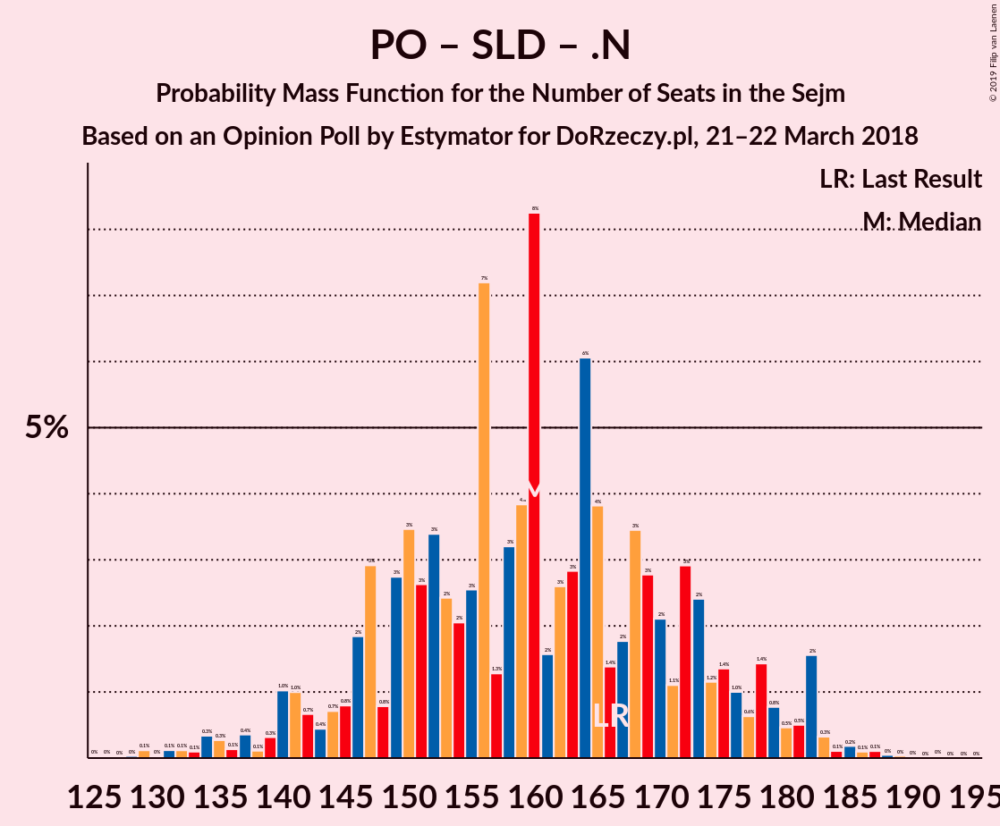

# Opinion Poll by Estymator for DoRzeczy.pl, 21–22 March 2018

<a href="#voting-intentions">Voting Intentions</a> | <a href="#seats">Seats</a> | <a href="#coalitions">Coalitions</a> | <a href="#technical-information">Technical Information</a>

## Voting Intentions

### Confidence Intervals

| Party | Last Result | Poll Result | 80% Confidence Interval | 90% Confidence Interval | 95% Confidence Interval | 99% Confidence Interval |
|:-----:|:-----------:|:-----------:|:-----------------------:|:-----------------------:|:-----------------------:|:-----------------------:|
| Prawo i Sprawiedliwość | 37.6% | 46.7% | 44.7–48.7% |44.1–49.3% |43.6–49.8% |42.7–50.7% |
| Platforma Obywatelska | 24.1% | 25.6% | 23.9–27.4% |23.4–28.0% |23.0–28.4% |22.2–29.3% |
| Kukiz’15 | 8.8% | 7.9% | 6.9–9.1% |6.6–9.4% |6.4–9.8% |6.0–10.3% |
| Sojusz Lewicy Demokratycznej | 7.6% | 6.8% | 5.9–8.0% |5.6–8.3% |5.4–8.6% |5.0–9.1% |
| Polskie Stronnictwo Ludowe | 5.1% | 5.0% | 4.3–6.1% |4.0–6.3% |3.9–6.6% |3.5–7.1% |
| .Nowoczesna | 7.6% | 4.6% | 3.9–5.6% |3.7–5.9% |3.5–6.1% |3.2–6.6% |
| Lewica Razem | 3.6% | 1.7% | 1.3–2.3% |1.1–2.5% |1.1–2.7% |0.9–3.0% |
| KORWiN | 4.8% | 0.8% | 0.5–1.3% |0.5–1.4% |0.4–1.6% |0.3–1.8% |

*Note:* The poll result column reflects the actual value used in the calculations. Published results may vary slightly, and in addition be rounded to fewer digits.

## Seats

### Confidence Intervals

| Party | Last Result | Median | 80% Confidence Interval | 90% Confidence Interval | 95% Confidence Interval | 99% Confidence Interval |
|:-----:|:-----------:|:------:|:-----------------------:|:-----------------------:|:-----------------------:|:-----------------------:|
| <a href="#prawo-i-sprawiedliwość">Prawo i Sprawiedliwość</a> | 235 | 262 | 247–275 |244–282 |241–283 |237–288 |
| <a href="#platforma-obywatelska">Platforma Obywatelska</a> | 138 | 135 | 122–148 |119–152 |116–153 |114–158 |
| <a href="#kukiz’15">Kukiz’15</a> | 42 | 32 | 20–39 |18–42 |13–42 |11–45 |
| <a href="#sojusz-lewicy-demokratycznej">Sojusz Lewicy Demokratycznej</a> | 0 | 22 | 12–31 |11–32 |10–33 |8–36 |
| <a href="#polskie-stronnictwo-ludowe">Polskie Stronnictwo Ludowe</a> | 16 | 0 | 0–19 |0–21 |0–22 |0–24 |
| <a href="#.nowoczesna">.Nowoczesna</a> | 28 | 0 | 0–10 |0–11 |0–12 |0–15 |
| <a href="#lewica-razem">Lewica Razem</a> | 0 | 0 | 0 |0 |0 |0 |
| <a href="#korwin">KORWiN</a> | 0 | 0 | 0 |0 |0 |0 |

### Prawo i Sprawiedliwość

*For a full overview of the results for this party, see the [Prawo i Sprawiedliwość](party-prawoisprawiedliwość.html) page.*

| Number of Seats | Probability | Accumulated | Special Marks |
|:---------------:|:-----------:|:-----------:|:-------------:|
| 230 | 0% | 100% |  |
| 231 | 0% | 99.9% | Majority |
| 232 | 0% | 99.9% |  |
| 233 | 0.1% | 99.8% |  |
| 234 | 0% | 99.7% |  |
| 235 | 0.1% | 99.7% | Last Result |
| 236 | 0.1% | 99.7% |  |
| 237 | 0.4% | 99.6% |  |
| 238 | 0.2% | 99.1% |  |
| 239 | 0.2% | 98.9% |  |
| 240 | 0.4% | 98.7% |  |
| 241 | 1.1% | 98% |  |
| 242 | 0.4% | 97% |  |
| 243 | 0.6% | 97% |  |
| 244 | 1.4% | 96% |  |
| 245 | 1.1% | 95% |  |
| 246 | 0.6% | 94% |  |
| 247 | 3% | 93% |  |
| 248 | 2% | 90% |  |
| 249 | 3% | 88% |  |
| 250 | 4% | 86% |  |
| 251 | 3% | 82% |  |
| 252 | 1.2% | 79% |  |
| 253 | 2% | 78% |  |
| 254 | 2% | 76% |  |
| 255 | 3% | 74% |  |
| 256 | 1.5% | 72% |  |
| 257 | 6% | 70% |  |
| 258 | 3% | 64% |  |
| 259 | 2% | 62% |  |
| 260 | 1.1% | 60% |  |
| 261 | 5% | 59% |  |
| 262 | 6% | 54% | Median |
| 263 | 4% | 48% |  |
| 264 | 1.3% | 43% |  |
| 265 | 8% | 42% |  |
| 266 | 2% | 34% |  |
| 267 | 0.9% | 32% |  |
| 268 | 2% | 31% |  |
| 269 | 2% | 29% |  |
| 270 | 1.2% | 28% |  |
| 271 | 5% | 27% |  |
| 272 | 3% | 22% |  |
| 273 | 3% | 19% |  |
| 274 | 5% | 16% |  |
| 275 | 1.1% | 11% |  |
| 276 | 0.9% | 9% |  |
| 277 | 0.8% | 9% |  |
| 278 | 0.8% | 8% |  |
| 279 | 0.5% | 7% |  |
| 280 | 1.2% | 6% |  |
| 281 | 0.2% | 5% |  |
| 282 | 2% | 5% |  |
| 283 | 0.7% | 3% |  |
| 284 | 0.7% | 2% |  |
| 285 | 0.5% | 1.4% |  |
| 286 | 0.2% | 0.9% |  |
| 287 | 0.1% | 0.7% |  |
| 288 | 0.1% | 0.5% |  |
| 289 | 0% | 0.4% |  |
| 290 | 0% | 0.4% |  |
| 291 | 0.2% | 0.4% |  |
| 292 | 0% | 0.2% |  |
| 293 | 0% | 0.1% |  |
| 294 | 0.1% | 0.1% |  |
| 295 | 0% | 0.1% |  |
| 296 | 0% | 0.1% |  |
| 297 | 0% | 0% |  |

### Platforma Obywatelska

*For a full overview of the results for this party, see the [Platforma Obywatelska](party-platformaobywatelska.html) page.*

| Number of Seats | Probability | Accumulated | Special Marks |
|:---------------:|:-----------:|:-----------:|:-------------:|
| 108 | 0% | 100% |  |
| 109 | 0% | 99.9% |  |
| 110 | 0.1% | 99.9% |  |
| 111 | 0% | 99.8% |  |
| 112 | 0.1% | 99.8% |  |
| 113 | 0.2% | 99.7% |  |
| 114 | 0.4% | 99.5% |  |
| 115 | 2% | 99.1% |  |
| 116 | 0.7% | 98% |  |
| 117 | 0.5% | 97% |  |
| 118 | 1.2% | 96% |  |
| 119 | 0.8% | 95% |  |
| 120 | 2% | 94% |  |
| 121 | 1.3% | 92% |  |
| 122 | 2% | 91% |  |
| 123 | 3% | 89% |  |
| 124 | 2% | 86% |  |
| 125 | 0.6% | 84% |  |
| 126 | 6% | 83% |  |
| 127 | 4% | 78% |  |
| 128 | 3% | 74% |  |
| 129 | 3% | 70% |  |
| 130 | 2% | 68% |  |
| 131 | 3% | 65% |  |
| 132 | 4% | 62% |  |
| 133 | 1.5% | 58% |  |
| 134 | 5% | 56% |  |
| 135 | 2% | 52% | Median |
| 136 | 9% | 49% |  |
| 137 | 2% | 41% |  |
| 138 | 2% | 39% | Last Result |
| 139 | 1.2% | 37% |  |
| 140 | 3% | 36% |  |
| 141 | 2% | 33% |  |
| 142 | 4% | 31% |  |
| 143 | 6% | 26% |  |
| 144 | 2% | 21% |  |
| 145 | 2% | 19% |  |
| 146 | 1.0% | 17% |  |
| 147 | 4% | 16% |  |
| 148 | 3% | 12% |  |
| 149 | 0.7% | 9% |  |
| 150 | 1.4% | 8% |  |
| 151 | 0.6% | 7% |  |
| 152 | 1.5% | 6% |  |
| 153 | 3% | 5% |  |
| 154 | 0.1% | 2% |  |
| 155 | 0.8% | 2% |  |
| 156 | 0.4% | 1.2% |  |
| 157 | 0.1% | 0.8% |  |
| 158 | 0.5% | 0.7% |  |
| 159 | 0.1% | 0.3% |  |
| 160 | 0% | 0.2% |  |
| 161 | 0% | 0.1% |  |
| 162 | 0% | 0.1% |  |
| 163 | 0% | 0.1% |  |
| 164 | 0% | 0.1% |  |
| 165 | 0% | 0% |  |

### Kukiz’15

*For a full overview of the results for this party, see the [Kukiz’15](party-kukiz’15.html) page.*

| Number of Seats | Probability | Accumulated | Special Marks |
|:---------------:|:-----------:|:-----------:|:-------------:|
| 7 | 0% | 100% |  |
| 8 | 0.1% | 99.9% |  |
| 9 | 0.1% | 99.8% |  |
| 10 | 0.1% | 99.7% |  |
| 11 | 0.5% | 99.6% |  |
| 12 | 0.5% | 99.1% |  |
| 13 | 1.4% | 98.5% |  |
| 14 | 0.5% | 97% |  |
| 15 | 0.4% | 97% |  |
| 16 | 0.5% | 96% |  |
| 17 | 0.7% | 96% |  |
| 18 | 2% | 95% |  |
| 19 | 2% | 93% |  |
| 20 | 4% | 92% |  |
| 21 | 2% | 88% |  |
| 22 | 1.4% | 86% |  |
| 23 | 1.2% | 84% |  |
| 24 | 2% | 83% |  |
| 25 | 6% | 81% |  |
| 26 | 4% | 75% |  |
| 27 | 5% | 71% |  |
| 28 | 5% | 66% |  |
| 29 | 3% | 61% |  |
| 30 | 2% | 59% |  |
| 31 | 4% | 57% |  |
| 32 | 6% | 53% | Median |
| 33 | 4% | 48% |  |
| 34 | 2% | 44% |  |
| 35 | 15% | 42% |  |
| 36 | 4% | 27% |  |
| 37 | 2% | 23% |  |
| 38 | 9% | 20% |  |
| 39 | 3% | 12% |  |
| 40 | 1.2% | 8% |  |
| 41 | 2% | 7% |  |
| 42 | 3% | 5% | Last Result |
| 43 | 1.1% | 2% |  |
| 44 | 0.3% | 0.9% |  |
| 45 | 0.2% | 0.6% |  |
| 46 | 0.1% | 0.3% |  |
| 47 | 0.1% | 0.3% |  |
| 48 | 0% | 0.1% |  |
| 49 | 0% | 0.1% |  |
| 50 | 0.1% | 0.1% |  |
| 51 | 0% | 0% |  |

### Sojusz Lewicy Demokratycznej

*For a full overview of the results for this party, see the [Sojusz Lewicy Demokratycznej](party-sojuszlewicydemokratycznej.html) page.*

| Number of Seats | Probability | Accumulated | Special Marks |
|:---------------:|:-----------:|:-----------:|:-------------:|
| 0 | 0.4% | 100% | Last Result |
| 1 | 0% | 99.6% |  |
| 2 | 0% | 99.6% |  |
| 3 | 0% | 99.6% |  |
| 4 | 0% | 99.6% |  |
| 5 | 0% | 99.6% |  |
| 6 | 0% | 99.6% |  |
| 7 | 0% | 99.5% |  |
| 8 | 0.2% | 99.5% |  |
| 9 | 2% | 99.4% |  |
| 10 | 2% | 98% |  |
| 11 | 4% | 96% |  |
| 12 | 6% | 92% |  |
| 13 | 3% | 86% |  |
| 14 | 4% | 83% |  |
| 15 | 1.3% | 79% |  |
| 16 | 9% | 78% |  |
| 17 | 1.1% | 68% |  |
| 18 | 3% | 67% |  |
| 19 | 1.1% | 64% |  |
| 20 | 5% | 63% |  |
| 21 | 2% | 58% |  |
| 22 | 8% | 56% | Median |
| 23 | 6% | 48% |  |
| 24 | 3% | 42% |  |
| 25 | 6% | 39% |  |
| 26 | 3% | 32% |  |
| 27 | 4% | 29% |  |
| 28 | 5% | 25% |  |
| 29 | 7% | 20% |  |
| 30 | 3% | 13% |  |
| 31 | 3% | 11% |  |
| 32 | 6% | 8% |  |
| 33 | 0.8% | 3% |  |
| 34 | 1.0% | 2% |  |
| 35 | 0.3% | 0.8% |  |
| 36 | 0.1% | 0.5% |  |
| 37 | 0% | 0.4% |  |
| 38 | 0.2% | 0.3% |  |
| 39 | 0% | 0.2% |  |
| 40 | 0.1% | 0.1% |  |
| 41 | 0% | 0.1% |  |
| 42 | 0% | 0.1% |  |
| 43 | 0% | 0% |  |

### Polskie Stronnictwo Ludowe

*For a full overview of the results for this party, see the [Polskie Stronnictwo Ludowe](party-polskiestronnictwoludowe.html) page.*

| Number of Seats | Probability | Accumulated | Special Marks |
|:---------------:|:-----------:|:-----------:|:-------------:|
| 0 | 50% | 100% | Median |
| 1 | 0% | 50% |  |
| 2 | 0% | 50% |  |
| 3 | 0% | 50% |  |
| 4 | 0% | 50% |  |
| 5 | 0% | 50% |  |
| 6 | 0% | 50% |  |
| 7 | 0% | 50% |  |
| 8 | 0% | 50% |  |
| 9 | 0% | 50% |  |
| 10 | 0% | 50% |  |
| 11 | 4% | 50% |  |
| 12 | 5% | 46% |  |
| 13 | 8% | 41% |  |
| 14 | 9% | 33% |  |
| 15 | 5% | 24% |  |
| 16 | 3% | 19% | Last Result |
| 17 | 2% | 16% |  |
| 18 | 3% | 14% |  |
| 19 | 2% | 11% |  |
| 20 | 2% | 9% |  |
| 21 | 3% | 7% |  |
| 22 | 2% | 4% |  |
| 23 | 2% | 2% |  |
| 24 | 0.5% | 0.6% |  |
| 25 | 0% | 0.2% |  |
| 26 | 0.1% | 0.1% |  |
| 27 | 0% | 0% |  |

### .Nowoczesna

*For a full overview of the results for this party, see the [.Nowoczesna](party-nowoczesna.html) page.*

| Number of Seats | Probability | Accumulated | Special Marks |
|:---------------:|:-----------:|:-----------:|:-------------:|
| 0 | 67% | 100% | Median |
| 1 | 0% | 33% |  |
| 2 | 0% | 33% |  |
| 3 | 0% | 33% |  |
| 4 | 0% | 33% |  |
| 5 | 0% | 33% |  |
| 6 | 0.1% | 33% |  |
| 7 | 6% | 33% |  |
| 8 | 9% | 27% |  |
| 9 | 6% | 18% |  |
| 10 | 5% | 12% |  |
| 11 | 4% | 7% |  |
| 12 | 2% | 4% |  |
| 13 | 1.0% | 2% |  |
| 14 | 0.2% | 0.7% |  |
| 15 | 0.2% | 0.5% |  |
| 16 | 0.1% | 0.4% |  |
| 17 | 0.1% | 0.3% |  |
| 18 | 0.1% | 0.2% |  |
| 19 | 0.1% | 0.1% |  |
| 20 | 0% | 0.1% |  |
| 21 | 0% | 0% |  |
| 22 | 0% | 0% |  |
| 23 | 0% | 0% |  |
| 24 | 0% | 0% |  |
| 25 | 0% | 0% |  |
| 26 | 0% | 0% |  |
| 27 | 0% | 0% |  |
| 28 | 0% | 0% | Last Result |

### Lewica Razem

*For a full overview of the results for this party, see the [Lewica Razem](party-lewicarazem.html) page.*

| Number of Seats | Probability | Accumulated | Special Marks |
|:---------------:|:-----------:|:-----------:|:-------------:|
| 0 | 100% | 100% | Last Result, Median |

### KORWiN

*For a full overview of the results for this party, see the [KORWiN](party-korwin.html) page.*

| Number of Seats | Probability | Accumulated | Special Marks |
|:---------------:|:-----------:|:-----------:|:-------------:|
| 0 | 100% | 100% | Last Result, Median |

## Coalitions

### Confidence Intervals

| Coalition | Last Result | Median | Majority? | 80% Confidence Interval | 90% Confidence Interval | 95% Confidence Interval | 99% Confidence Interval |
|:---------:|:-----------:|:------:|:---------:|:-----------------------:|:-----------------------:|:-----------------------:|:-----------------------:|
| Prawo i Sprawiedliwość | 235 | 262 | 99.9% | 247–275 | 244–282 | 241–283 | 237–288 |
| Platforma Obywatelska – Sojusz Lewicy Demokratycznej – Polskie Stronnictwo Ludowe – .Nowoczesna – Lewica Razem | 182 | 167 | 0% | 152–182 | 148–186 | 145–189 | 139–197 |
| Platforma Obywatelska – Sojusz Lewicy Demokratycznej – Polskie Stronnictwo Ludowe – .Nowoczesna | 182 | 167 | 0% | 152–182 | 148–186 | 145–189 | 139–197 |
| Platforma Obywatelska – Sojusz Lewicy Demokratycznej – .Nowoczesna | 166 | 160 | 0% | 146–173 | 141–178 | 140–182 | 131–185 |
| Platforma Obywatelska – Polskie Stronnictwo Ludowe – .Nowoczesna | 182 | 145 | 0% | 130–162 | 127–166 | 126–168 | 120–174 |
| Platforma Obywatelska – .Nowoczesna | 166 | 138 | 0% | 124–151 | 121–155 | 119–159 | 116–160 |
| Platforma Obywatelska | 138 | 135 | 0% | 122–148 | 119–152 | 116–153 | 114–158 |

### Prawo i Sprawiedliwość

| Number of Seats | Probability | Accumulated | Special Marks |
|:---------------:|:-----------:|:-----------:|:-------------:|
| 230 | 0% | 100% |  |
| 231 | 0% | 99.9% | Majority |
| 232 | 0% | 99.9% |  |
| 233 | 0.1% | 99.8% |  |
| 234 | 0% | 99.7% |  |
| 235 | 0.1% | 99.7% | Last Result |
| 236 | 0.1% | 99.7% |  |
| 237 | 0.4% | 99.6% |  |
| 238 | 0.2% | 99.1% |  |
| 239 | 0.2% | 98.9% |  |
| 240 | 0.4% | 98.7% |  |
| 241 | 1.1% | 98% |  |
| 242 | 0.4% | 97% |  |
| 243 | 0.6% | 97% |  |
| 244 | 1.4% | 96% |  |
| 245 | 1.1% | 95% |  |
| 246 | 0.6% | 94% |  |
| 247 | 3% | 93% |  |
| 248 | 2% | 90% |  |
| 249 | 3% | 88% |  |
| 250 | 4% | 86% |  |
| 251 | 3% | 82% |  |
| 252 | 1.2% | 79% |  |
| 253 | 2% | 78% |  |
| 254 | 2% | 76% |  |
| 255 | 3% | 74% |  |
| 256 | 1.5% | 72% |  |
| 257 | 6% | 70% |  |
| 258 | 3% | 64% |  |
| 259 | 2% | 62% |  |
| 260 | 1.1% | 60% |  |
| 261 | 5% | 59% |  |
| 262 | 6% | 54% | Median |
| 263 | 4% | 48% |  |
| 264 | 1.3% | 43% |  |
| 265 | 8% | 42% |  |
| 266 | 2% | 34% |  |
| 267 | 0.9% | 32% |  |
| 268 | 2% | 31% |  |
| 269 | 2% | 29% |  |
| 270 | 1.2% | 28% |  |
| 271 | 5% | 27% |  |
| 272 | 3% | 22% |  |
| 273 | 3% | 19% |  |
| 274 | 5% | 16% |  |
| 275 | 1.1% | 11% |  |
| 276 | 0.9% | 9% |  |
| 277 | 0.8% | 9% |  |
| 278 | 0.8% | 8% |  |
| 279 | 0.5% | 7% |  |
| 280 | 1.2% | 6% |  |
| 281 | 0.2% | 5% |  |
| 282 | 2% | 5% |  |
| 283 | 0.7% | 3% |  |
| 284 | 0.7% | 2% |  |
| 285 | 0.5% | 1.4% |  |
| 286 | 0.2% | 0.9% |  |
| 287 | 0.1% | 0.7% |  |
| 288 | 0.1% | 0.5% |  |
| 289 | 0% | 0.4% |  |
| 290 | 0% | 0.4% |  |
| 291 | 0.2% | 0.4% |  |
| 292 | 0% | 0.2% |  |
| 293 | 0% | 0.1% |  |
| 294 | 0.1% | 0.1% |  |
| 295 | 0% | 0.1% |  |
| 296 | 0% | 0.1% |  |
| 297 | 0% | 0% |  |

### Platforma Obywatelska – Sojusz Lewicy Demokratycznej – Polskie Stronnictwo Ludowe – .Nowoczesna – Lewica Razem

| Number of Seats | Probability | Accumulated | Special Marks |
|:---------------:|:-----------:|:-----------:|:-------------:|
| 135 | 0% | 100% |  |
| 136 | 0% | 99.9% |  |
| 137 | 0.3% | 99.9% |  |
| 138 | 0% | 99.6% |  |
| 139 | 0.2% | 99.6% |  |
| 140 | 1.0% | 99.5% |  |
| 141 | 0.2% | 98% |  |
| 142 | 0.2% | 98% |  |
| 143 | 0.2% | 98% |  |
| 144 | 0.3% | 98% |  |
| 145 | 0.6% | 98% |  |
| 146 | 0.4% | 97% |  |
| 147 | 0.7% | 97% |  |
| 148 | 1.1% | 96% |  |
| 149 | 0.2% | 95% |  |
| 150 | 2% | 95% |  |
| 151 | 1.1% | 92% |  |
| 152 | 2% | 91% |  |
| 153 | 2% | 89% |  |
| 154 | 0.8% | 87% |  |
| 155 | 2% | 86% |  |
| 156 | 1.4% | 84% |  |
| 157 | 0.4% | 83% | Median |
| 158 | 0.8% | 83% |  |
| 159 | 0.7% | 82% |  |
| 160 | 12% | 81% |  |
| 161 | 2% | 69% |  |
| 162 | 0.8% | 68% |  |
| 163 | 5% | 67% |  |
| 164 | 6% | 63% |  |
| 165 | 3% | 56% |  |
| 166 | 4% | 54% |  |
| 167 | 0.9% | 50% |  |
| 168 | 5% | 49% |  |
| 169 | 2% | 44% |  |
| 170 | 2% | 42% |  |
| 171 | 2% | 40% |  |
| 172 | 5% | 38% |  |
| 173 | 2% | 33% |  |
| 174 | 2% | 30% |  |
| 175 | 2% | 28% |  |
| 176 | 3% | 27% |  |
| 177 | 3% | 23% |  |
| 178 | 4% | 20% |  |
| 179 | 2% | 17% |  |
| 180 | 0.7% | 14% |  |
| 181 | 1.5% | 14% |  |
| 182 | 3% | 12% | Last Result |
| 183 | 2% | 9% |  |
| 184 | 0.6% | 7% |  |
| 185 | 0.7% | 7% |  |
| 186 | 2% | 6% |  |
| 187 | 1.1% | 4% |  |
| 188 | 0.5% | 3% |  |
| 189 | 0.7% | 3% |  |
| 190 | 0.2% | 2% |  |
| 191 | 0.3% | 2% |  |
| 192 | 0.3% | 1.4% |  |
| 193 | 0.1% | 1.1% |  |
| 194 | 0.2% | 1.0% |  |
| 195 | 0.2% | 0.8% |  |
| 196 | 0% | 0.6% |  |
| 197 | 0.1% | 0.5% |  |
| 198 | 0.1% | 0.5% |  |
| 199 | 0.1% | 0.4% |  |
| 200 | 0.1% | 0.3% |  |
| 201 | 0.1% | 0.2% |  |
| 202 | 0.1% | 0.1% |  |
| 203 | 0% | 0.1% |  |
| 204 | 0% | 0% |  |

### Platforma Obywatelska – Sojusz Lewicy Demokratycznej – Polskie Stronnictwo Ludowe – .Nowoczesna

| Number of Seats | Probability | Accumulated | Special Marks |
|:---------------:|:-----------:|:-----------:|:-------------:|
| 135 | 0% | 100% |  |
| 136 | 0% | 99.9% |  |
| 137 | 0.3% | 99.9% |  |
| 138 | 0% | 99.6% |  |
| 139 | 0.2% | 99.6% |  |
| 140 | 1.0% | 99.5% |  |
| 141 | 0.2% | 98% |  |
| 142 | 0.2% | 98% |  |
| 143 | 0.2% | 98% |  |
| 144 | 0.3% | 98% |  |
| 145 | 0.6% | 98% |  |
| 146 | 0.4% | 97% |  |
| 147 | 0.7% | 97% |  |
| 148 | 1.1% | 96% |  |
| 149 | 0.2% | 95% |  |
| 150 | 2% | 95% |  |
| 151 | 1.1% | 92% |  |
| 152 | 2% | 91% |  |
| 153 | 2% | 89% |  |
| 154 | 0.8% | 87% |  |
| 155 | 2% | 86% |  |
| 156 | 1.4% | 84% |  |
| 157 | 0.4% | 83% | Median |
| 158 | 0.8% | 83% |  |
| 159 | 0.7% | 82% |  |
| 160 | 12% | 81% |  |
| 161 | 2% | 69% |  |
| 162 | 0.8% | 68% |  |
| 163 | 5% | 67% |  |
| 164 | 6% | 63% |  |
| 165 | 3% | 56% |  |
| 166 | 4% | 54% |  |
| 167 | 0.9% | 50% |  |
| 168 | 5% | 49% |  |
| 169 | 2% | 44% |  |
| 170 | 2% | 42% |  |
| 171 | 2% | 40% |  |
| 172 | 5% | 38% |  |
| 173 | 2% | 33% |  |
| 174 | 2% | 30% |  |
| 175 | 2% | 28% |  |
| 176 | 3% | 27% |  |
| 177 | 3% | 23% |  |
| 178 | 4% | 20% |  |
| 179 | 2% | 17% |  |
| 180 | 0.7% | 14% |  |
| 181 | 1.5% | 14% |  |
| 182 | 3% | 12% | Last Result |
| 183 | 2% | 9% |  |
| 184 | 0.6% | 7% |  |
| 185 | 0.7% | 7% |  |
| 186 | 2% | 6% |  |
| 187 | 1.1% | 4% |  |
| 188 | 0.5% | 3% |  |
| 189 | 0.7% | 3% |  |
| 190 | 0.2% | 2% |  |
| 191 | 0.3% | 2% |  |
| 192 | 0.3% | 1.4% |  |
| 193 | 0.1% | 1.1% |  |
| 194 | 0.2% | 1.0% |  |
| 195 | 0.2% | 0.8% |  |
| 196 | 0% | 0.6% |  |
| 197 | 0.1% | 0.5% |  |
| 198 | 0.1% | 0.5% |  |
| 199 | 0.1% | 0.4% |  |
| 200 | 0.1% | 0.3% |  |
| 201 | 0.1% | 0.2% |  |
| 202 | 0.1% | 0.1% |  |
| 203 | 0% | 0.1% |  |
| 204 | 0% | 0% |  |

### Platforma Obywatelska – Sojusz Lewicy Demokratycznej – .Nowoczesna

| Number of Seats | Probability | Accumulated | Special Marks |
|:---------------:|:-----------:|:-----------:|:-------------:|
| 125 | 0% | 100% |  |
| 126 | 0% | 99.9% |  |
| 127 | 0% | 99.9% |  |
| 128 | 0% | 99.9% |  |
| 129 | 0.2% | 99.9% |  |
| 130 | 0% | 99.7% |  |
| 131 | 0.2% | 99.7% |  |
| 132 | 0.2% | 99.5% |  |
| 133 | 0.2% | 99.3% |  |
| 134 | 0.3% | 99.1% |  |
| 135 | 0.1% | 98.8% |  |
| 136 | 0.2% | 98.7% |  |
| 137 | 0.4% | 98.6% |  |
| 138 | 0.1% | 98% |  |
| 139 | 0.5% | 98% |  |
| 140 | 1.3% | 98% |  |
| 141 | 2% | 96% |  |
| 142 | 0.8% | 94% |  |
| 143 | 0.4% | 93% |  |
| 144 | 0.6% | 93% |  |
| 145 | 0.6% | 93% |  |
| 146 | 3% | 92% |  |
| 147 | 2% | 89% |  |
| 148 | 1.3% | 86% |  |
| 149 | 2% | 85% |  |
| 150 | 3% | 83% |  |
| 151 | 4% | 80% |  |
| 152 | 5% | 76% |  |
| 153 | 3% | 71% |  |
| 154 | 1.2% | 68% |  |
| 155 | 1.1% | 67% |  |
| 156 | 2% | 66% |  |
| 157 | 1.0% | 64% | Median |
| 158 | 3% | 63% |  |
| 159 | 4% | 59% |  |
| 160 | 11% | 55% |  |
| 161 | 2% | 45% |  |
| 162 | 1.0% | 43% |  |
| 163 | 4% | 42% |  |
| 164 | 7% | 37% |  |
| 165 | 5% | 31% |  |
| 166 | 1.1% | 26% | Last Result |
| 167 | 1.0% | 25% |  |
| 168 | 5% | 24% |  |
| 169 | 2% | 19% |  |
| 170 | 2% | 17% |  |
| 171 | 1.1% | 15% |  |
| 172 | 2% | 14% |  |
| 173 | 2% | 12% |  |
| 174 | 1.3% | 9% |  |
| 175 | 0.5% | 8% |  |
| 176 | 2% | 7% |  |
| 177 | 0.4% | 6% |  |
| 178 | 0.5% | 5% |  |
| 179 | 0.4% | 5% |  |
| 180 | 0.4% | 4% |  |
| 181 | 0.4% | 4% |  |
| 182 | 2% | 3% |  |
| 183 | 0.6% | 1.2% |  |
| 184 | 0.1% | 0.6% |  |
| 185 | 0.2% | 0.5% |  |
| 186 | 0.1% | 0.3% |  |
| 187 | 0.1% | 0.2% |  |
| 188 | 0% | 0.2% |  |
| 189 | 0.1% | 0.1% |  |
| 190 | 0% | 0.1% |  |
| 191 | 0% | 0.1% |  |
| 192 | 0% | 0% |  |

### Platforma Obywatelska – Polskie Stronnictwo Ludowe – .Nowoczesna

| Number of Seats | Probability | Accumulated | Special Marks |
|:---------------:|:-----------:|:-----------:|:-------------:|
| 113 | 0% | 100% |  |
| 114 | 0% | 99.9% |  |
| 115 | 0% | 99.9% |  |
| 116 | 0% | 99.9% |  |
| 117 | 0% | 99.9% |  |
| 118 | 0.1% | 99.9% |  |
| 119 | 0.2% | 99.7% |  |
| 120 | 0.3% | 99.6% |  |
| 121 | 0.1% | 99.3% |  |
| 122 | 0.1% | 99.2% |  |
| 123 | 0.2% | 99.1% |  |
| 124 | 0.8% | 98.9% |  |
| 125 | 0.2% | 98% |  |
| 126 | 1.5% | 98% |  |
| 127 | 2% | 96% |  |
| 128 | 1.2% | 94% |  |
| 129 | 2% | 93% |  |
| 130 | 2% | 92% |  |
| 131 | 2% | 90% |  |
| 132 | 5% | 88% |  |
| 133 | 2% | 83% |  |
| 134 | 5% | 82% |  |
| 135 | 2% | 77% | Median |
| 136 | 0.8% | 75% |  |
| 137 | 1.3% | 74% |  |
| 138 | 0.8% | 73% |  |
| 139 | 2% | 72% |  |
| 140 | 3% | 70% |  |
| 141 | 2% | 67% |  |
| 142 | 2% | 65% |  |
| 143 | 5% | 64% |  |
| 144 | 8% | 59% |  |
| 145 | 3% | 50% |  |
| 146 | 2% | 47% |  |
| 147 | 3% | 46% |  |
| 148 | 3% | 43% |  |
| 149 | 2% | 40% |  |
| 150 | 4% | 38% |  |
| 151 | 3% | 34% |  |
| 152 | 2% | 31% |  |
| 153 | 2% | 29% |  |
| 154 | 0.9% | 28% |  |
| 155 | 4% | 27% |  |
| 156 | 3% | 23% |  |
| 157 | 1.1% | 20% |  |
| 158 | 1.2% | 19% |  |
| 159 | 0.7% | 18% |  |
| 160 | 5% | 17% |  |
| 161 | 1.4% | 12% |  |
| 162 | 1.4% | 10% |  |
| 163 | 2% | 9% |  |
| 164 | 1.2% | 7% |  |
| 165 | 0.5% | 6% |  |
| 166 | 2% | 6% |  |
| 167 | 0.5% | 3% |  |
| 168 | 0.9% | 3% |  |
| 169 | 0.3% | 2% |  |
| 170 | 0.2% | 2% |  |
| 171 | 0.2% | 1.5% |  |
| 172 | 0.5% | 1.2% |  |
| 173 | 0.2% | 0.7% |  |
| 174 | 0.1% | 0.5% |  |
| 175 | 0.1% | 0.5% |  |
| 176 | 0.1% | 0.4% |  |
| 177 | 0.1% | 0.3% |  |
| 178 | 0% | 0.2% |  |
| 179 | 0% | 0.1% |  |
| 180 | 0.1% | 0.1% |  |
| 181 | 0% | 0.1% |  |
| 182 | 0% | 0% | Last Result |

### Platforma Obywatelska – .Nowoczesna

| Number of Seats | Probability | Accumulated | Special Marks |
|:---------------:|:-----------:|:-----------:|:-------------:|
| 110 | 0.1% | 100% |  |
| 111 | 0% | 99.9% |  |
| 112 | 0% | 99.9% |  |
| 113 | 0.1% | 99.9% |  |
| 114 | 0.1% | 99.8% |  |
| 115 | 0.2% | 99.7% |  |
| 116 | 0.4% | 99.5% |  |
| 117 | 0.1% | 99.1% |  |
| 118 | 1.0% | 99.0% |  |
| 119 | 0.7% | 98% |  |
| 120 | 2% | 97% |  |
| 121 | 0.5% | 95% |  |
| 122 | 0.5% | 95% |  |
| 123 | 2% | 94% |  |
| 124 | 3% | 92% |  |
| 125 | 0.9% | 90% |  |
| 126 | 5% | 89% |  |
| 127 | 3% | 84% |  |
| 128 | 3% | 81% |  |
| 129 | 2% | 77% |  |
| 130 | 3% | 75% |  |
| 131 | 2% | 72% |  |
| 132 | 5% | 70% |  |
| 133 | 1.4% | 64% |  |
| 134 | 5% | 63% |  |
| 135 | 2% | 58% | Median |
| 136 | 2% | 55% |  |
| 137 | 2% | 53% |  |
| 138 | 1.3% | 51% |  |
| 139 | 2% | 50% |  |
| 140 | 2% | 48% |  |
| 141 | 1.0% | 46% |  |
| 142 | 3% | 45% |  |
| 143 | 6% | 42% |  |
| 144 | 7% | 36% |  |
| 145 | 2% | 29% |  |
| 146 | 2% | 27% |  |
| 147 | 6% | 25% |  |
| 148 | 3% | 19% |  |
| 149 | 0.9% | 16% |  |
| 150 | 2% | 15% |  |
| 151 | 3% | 13% |  |
| 152 | 2% | 9% |  |
| 153 | 1.4% | 8% |  |
| 154 | 0.7% | 6% |  |
| 155 | 1.0% | 5% |  |
| 156 | 0.8% | 4% |  |
| 157 | 0.4% | 4% |  |
| 158 | 0.6% | 3% |  |
| 159 | 0.3% | 3% |  |
| 160 | 2% | 2% |  |
| 161 | 0.1% | 0.5% |  |
| 162 | 0.1% | 0.4% |  |
| 163 | 0.1% | 0.3% |  |
| 164 | 0.1% | 0.3% |  |
| 165 | 0% | 0.2% |  |
| 166 | 0.1% | 0.2% | Last Result |
| 167 | 0% | 0.1% |  |
| 168 | 0% | 0.1% |  |
| 169 | 0% | 0% |  |

### Platforma Obywatelska

| Number of Seats | Probability | Accumulated | Special Marks |
|:---------------:|:-----------:|:-----------:|:-------------:|
| 108 | 0% | 100% |  |
| 109 | 0% | 99.9% |  |
| 110 | 0.1% | 99.9% |  |
| 111 | 0% | 99.8% |  |
| 112 | 0.1% | 99.8% |  |
| 113 | 0.2% | 99.7% |  |
| 114 | 0.4% | 99.5% |  |
| 115 | 2% | 99.1% |  |
| 116 | 0.7% | 98% |  |
| 117 | 0.5% | 97% |  |
| 118 | 1.2% | 96% |  |
| 119 | 0.8% | 95% |  |
| 120 | 2% | 94% |  |
| 121 | 1.3% | 92% |  |
| 122 | 2% | 91% |  |
| 123 | 3% | 89% |  |
| 124 | 2% | 86% |  |
| 125 | 0.6% | 84% |  |
| 126 | 6% | 83% |  |
| 127 | 4% | 78% |  |
| 128 | 3% | 74% |  |
| 129 | 3% | 70% |  |
| 130 | 2% | 68% |  |
| 131 | 3% | 65% |  |
| 132 | 4% | 62% |  |
| 133 | 1.5% | 58% |  |
| 134 | 5% | 56% |  |
| 135 | 2% | 52% | Median |
| 136 | 9% | 49% |  |
| 137 | 2% | 41% |  |
| 138 | 2% | 39% | Last Result |
| 139 | 1.2% | 37% |  |
| 140 | 3% | 36% |  |
| 141 | 2% | 33% |  |
| 142 | 4% | 31% |  |
| 143 | 6% | 26% |  |
| 144 | 2% | 21% |  |
| 145 | 2% | 19% |  |
| 146 | 1.0% | 17% |  |
| 147 | 4% | 16% |  |
| 148 | 3% | 12% |  |
| 149 | 0.7% | 9% |  |
| 150 | 1.4% | 8% |  |
| 151 | 0.6% | 7% |  |
| 152 | 1.5% | 6% |  |
| 153 | 3% | 5% |  |
| 154 | 0.1% | 2% |  |
| 155 | 0.8% | 2% |  |
| 156 | 0.4% | 1.2% |  |
| 157 | 0.1% | 0.8% |  |
| 158 | 0.5% | 0.7% |  |
| 159 | 0.1% | 0.3% |  |
| 160 | 0% | 0.2% |  |
| 161 | 0% | 0.1% |  |
| 162 | 0% | 0.1% |  |
| 163 | 0% | 0.1% |  |
| 164 | 0% | 0.1% |  |
| 165 | 0% | 0% |  |

## Technical Information

### Opinion Poll

+ **Polling firm:** Estymator
+ **Commissioner(s):** DoRzeczy.pl
+ **Fieldwork period:** 21–22 March 2018

### Calculations

+ **Sample size:** 1011
+ **Simulations done:** 524,288
+ **Error estimate:** 1.10%

