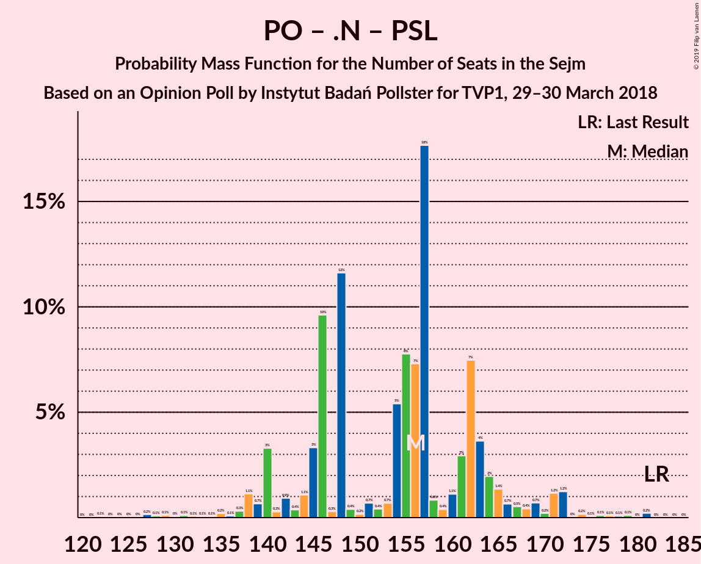

# Opinion Poll by Instytut Badań Pollster for TVP1, 29–30 March 2018

<a href="#voting-intentions">Voting Intentions</a> | <a href="#seats">Seats</a> | <a href="#coalitions">Coalitions</a> | <a href="#technical-information">Technical Information</a>

## Voting Intentions

### Confidence Intervals

| Party | Last Result | Poll Result | 80% Confidence Interval | 90% Confidence Interval | 95% Confidence Interval | 99% Confidence Interval |
|:-----:|:-----------:|:-----------:|:-----------------------:|:-----------------------:|:-----------------------:|:-----------------------:|
| Prawo i Sprawiedliwość | 37.6% | 38.9% | 37.0–40.8% |36.5–41.4% |36.0–41.9% |35.1–42.8% |
| Platforma Obywatelska | 24.1% | 21.9% | 20.4–23.6% |19.9–24.1% |19.5–24.5% |18.8–25.3% |
| Kukiz’15 | 8.8% | 11.0% | 9.9–12.3% |9.5–12.7% |9.3–13.0% |8.7–13.7% |
| Sojusz Lewicy Demokratycznej | 7.6% | 8.0% | 7.0–9.2% |6.8–9.5% |6.5–9.8% |6.1–10.4% |
| .Nowoczesna | 7.6% | 7.0% | 6.1–8.1% |5.8–8.4% |5.6–8.7% |5.2–9.3% |
| Polskie Stronnictwo Ludowe | 5.1% | 6.0% | 5.1–7.0% |4.9–7.3% |4.7–7.6% |4.3–8.1% |
| Lewica Razem | 3.6% | 4.0% | 3.3–4.9% |3.1–5.2% |3.0–5.4% |2.7–5.8% |
| KORWiN | 4.8% | 3.0% | 2.4–3.8% |2.3–4.0% |2.1–4.2% |1.9–4.6% |

*Note:* The poll result column reflects the actual value used in the calculations. Published results may vary slightly, and in addition be rounded to fewer digits.

## Seats

### Confidence Intervals

| Party | Last Result | Median | 80% Confidence Interval | 90% Confidence Interval | 95% Confidence Interval | 99% Confidence Interval |
|:-----:|:-----------:|:------:|:-----------------------:|:-----------------------:|:-----------------------:|:-----------------------:|
| <a href="#prawo-i-sprawiedliwość">Prawo i Sprawiedliwość</a> | 235 | 222 | 215–222 |204–264 |201–264 |201–264 |
| <a href="#platforma-obywatelska">Platforma Obywatelska</a> | 138 | 116 | 111–137 |105–138 |104–138 |97–138 |
| <a href="#kukiz’15">Kukiz’15</a> | 42 | 52 | 42–52 |42–64 |42–64 |42–64 |
| <a href="#sojusz-lewicy-demokratycznej">Sojusz Lewicy Demokratycznej</a> | 0 | 30 | 23–35 |18–39 |18–41 |18–45 |
| <a href="#.nowoczesna">.Nowoczesna</a> | 28 | 13 | 12–26 |0–28 |0–28 |0–32 |
| <a href="#polskie-stronnictwo-ludowe">Polskie Stronnictwo Ludowe</a> | 16 | 27 | 21–27 |13–28 |13–35 |0–35 |
| <a href="#lewica-razem">Lewica Razem</a> | 0 | 0 | 0–5 |0–10 |0–10 |0–10 |
| <a href="#korwin">KORWiN</a> | 0 | 0 | 0 |0 |0 |0 |

### Prawo i Sprawiedliwość

*For a full overview of the results for this party, see the [Prawo i Sprawiedliwość](party-prawoisprawiedliwość.html) page.*

| Number of Seats | Probability | Accumulated | Special Marks |
|:---------------:|:-----------:|:-----------:|:-------------:|
| 190 | 0.1% | 100% |  |
| 191 | 0% | 99.9% |  |
| 192 | 0% | 99.9% |  |
| 193 | 0% | 99.9% |  |
| 194 | 0% | 99.9% |  |
| 195 | 0% | 99.9% |  |
| 196 | 0% | 99.9% |  |
| 197 | 0% | 99.9% |  |
| 198 | 0% | 99.9% |  |
| 199 | 0% | 99.9% |  |
| 200 | 0.4% | 99.9% |  |
| 201 | 2% | 99.6% |  |
| 202 | 0% | 97% |  |
| 203 | 0% | 97% |  |
| 204 | 5% | 97% |  |
| 205 | 0% | 92% |  |
| 206 | 0% | 92% |  |
| 207 | 0% | 92% |  |
| 208 | 0% | 92% |  |
| 209 | 0% | 92% |  |
| 210 | 0% | 92% |  |
| 211 | 0.5% | 92% |  |
| 212 | 0% | 91% |  |
| 213 | 0% | 91% |  |
| 214 | 0% | 91% |  |
| 215 | 14% | 91% |  |
| 216 | 0% | 77% |  |
| 217 | 0% | 77% |  |
| 218 | 4% | 77% |  |
| 219 | 0% | 73% |  |
| 220 | 0% | 73% |  |
| 221 | 0% | 73% |  |
| 222 | 63% | 73% | Median |
| 223 | 0% | 9% |  |
| 224 | 0% | 9% |  |
| 225 | 0% | 9% |  |
| 226 | 0% | 9% |  |
| 227 | 0% | 9% |  |
| 228 | 0.3% | 9% |  |
| 229 | 0.8% | 9% |  |
| 230 | 0% | 8% |  |
| 231 | 0% | 8% | Majority |
| 232 | 0% | 8% |  |
| 233 | 0% | 8% |  |
| 234 | 0% | 8% |  |
| 235 | 0.1% | 8% | Last Result |
| 236 | 0% | 8% |  |
| 237 | 0% | 8% |  |
| 238 | 0% | 8% |  |
| 239 | 0% | 8% |  |
| 240 | 0% | 8% |  |
| 241 | 0% | 8% |  |
| 242 | 0% | 8% |  |
| 243 | 0% | 8% |  |
| 244 | 0% | 8% |  |
| 245 | 0% | 8% |  |
| 246 | 0% | 8% |  |
| 247 | 0% | 8% |  |
| 248 | 1.2% | 8% |  |
| 249 | 0% | 7% |  |
| 250 | 0% | 7% |  |
| 251 | 0% | 7% |  |
| 252 | 0% | 7% |  |
| 253 | 0% | 7% |  |
| 254 | 0% | 7% |  |
| 255 | 0% | 7% |  |
| 256 | 0% | 7% |  |
| 257 | 0% | 7% |  |
| 258 | 0% | 7% |  |
| 259 | 0% | 7% |  |
| 260 | 0% | 7% |  |
| 261 | 0% | 7% |  |
| 262 | 0% | 7% |  |
| 263 | 0% | 7% |  |
| 264 | 7% | 7% |  |
| 265 | 0% | 0% |  |

### Platforma Obywatelska

*For a full overview of the results for this party, see the [Platforma Obywatelska](party-platformaobywatelska.html) page.*

| Number of Seats | Probability | Accumulated | Special Marks |
|:---------------:|:-----------:|:-----------:|:-------------:|
| 97 | 1.1% | 100% |  |
| 98 | 0% | 98.9% |  |
| 99 | 0% | 98.9% |  |
| 100 | 0% | 98.9% |  |
| 101 | 1.1% | 98.9% |  |
| 102 | 0% | 98% |  |
| 103 | 0% | 98% |  |
| 104 | 0.5% | 98% |  |
| 105 | 5% | 97% |  |
| 106 | 2% | 92% |  |
| 107 | 0% | 91% |  |
| 108 | 0% | 91% |  |
| 109 | 0% | 91% |  |
| 110 | 0% | 91% |  |
| 111 | 7% | 91% |  |
| 112 | 0% | 84% |  |
| 113 | 0% | 84% |  |
| 114 | 4% | 84% |  |
| 115 | 0% | 79% |  |
| 116 | 62% | 79% | Median |
| 117 | 0% | 18% |  |
| 118 | 0% | 18% |  |
| 119 | 0% | 18% |  |
| 120 | 0.1% | 18% |  |
| 121 | 0% | 18% |  |
| 122 | 5% | 18% |  |
| 123 | 0% | 12% |  |
| 124 | 0% | 12% |  |
| 125 | 0% | 12% |  |
| 126 | 0% | 12% |  |
| 127 | 0.1% | 12% |  |
| 128 | 0% | 12% |  |
| 129 | 0% | 12% |  |
| 130 | 0% | 12% |  |
| 131 | 0.4% | 12% |  |
| 132 | 0% | 12% |  |
| 133 | 0% | 12% |  |
| 134 | 0% | 12% |  |
| 135 | 0% | 12% |  |
| 136 | 0% | 12% |  |
| 137 | 2% | 12% |  |
| 138 | 9% | 9% | Last Result |
| 139 | 0% | 0% |  |

### Kukiz’15

*For a full overview of the results for this party, see the [Kukiz’15](party-kukiz’15.html) page.*

| Number of Seats | Probability | Accumulated | Special Marks |
|:---------------:|:-----------:|:-----------:|:-------------:|
| 42 | 11% | 100% | Last Result |
| 43 | 2% | 89% |  |
| 44 | 7% | 87% |  |
| 45 | 9% | 80% |  |
| 46 | 0% | 71% |  |
| 47 | 0% | 71% |  |
| 48 | 0% | 71% |  |
| 49 | 0% | 71% |  |
| 50 | 0.1% | 71% |  |
| 51 | 0% | 71% |  |
| 52 | 63% | 71% | Median |
| 53 | 0.1% | 7% |  |
| 54 | 0% | 7% |  |
| 55 | 0% | 7% |  |
| 56 | 0% | 7% |  |
| 57 | 0.1% | 7% |  |
| 58 | 0% | 7% |  |
| 59 | 0% | 7% |  |
| 60 | 2% | 7% |  |
| 61 | 0% | 5% |  |
| 62 | 0% | 5% |  |
| 63 | 0% | 5% |  |
| 64 | 5% | 5% |  |
| 65 | 0% | 0% |  |

### Sojusz Lewicy Demokratycznej

*For a full overview of the results for this party, see the [Sojusz Lewicy Demokratycznej](party-sojuszlewicydemokratycznej.html) page.*

| Number of Seats | Probability | Accumulated | Special Marks |
|:---------------:|:-----------:|:-----------:|:-------------:|
| 0 | 0% | 100% | Last Result |
| 1 | 0% | 100% |  |
| 2 | 0% | 100% |  |
| 3 | 0% | 100% |  |
| 4 | 0% | 100% |  |
| 5 | 0% | 100% |  |
| 6 | 0% | 100% |  |
| 7 | 0% | 100% |  |
| 8 | 0% | 100% |  |
| 9 | 0% | 100% |  |
| 10 | 0% | 100% |  |
| 11 | 0% | 100% |  |
| 12 | 0% | 100% |  |
| 13 | 0% | 100% |  |
| 14 | 0% | 100% |  |
| 15 | 0% | 100% |  |
| 16 | 0% | 100% |  |
| 17 | 0.1% | 100% |  |
| 18 | 9% | 99.9% |  |
| 19 | 0% | 91% |  |
| 20 | 0% | 91% |  |
| 21 | 0% | 91% |  |
| 22 | 0.3% | 91% |  |
| 23 | 5% | 90% |  |
| 24 | 0% | 85% |  |
| 25 | 0% | 85% |  |
| 26 | 0% | 85% |  |
| 27 | 0% | 85% |  |
| 28 | 7% | 85% |  |
| 29 | 0% | 78% |  |
| 30 | 62% | 78% | Median |
| 31 | 2% | 17% |  |
| 32 | 0% | 15% |  |
| 33 | 0% | 15% |  |
| 34 | 0% | 15% |  |
| 35 | 5% | 15% |  |
| 36 | 0% | 10% |  |
| 37 | 0.7% | 10% |  |
| 38 | 0% | 9% |  |
| 39 | 4% | 9% |  |
| 40 | 0% | 5% |  |
| 41 | 2% | 5% |  |
| 42 | 0.4% | 2% |  |
| 43 | 0.8% | 2% |  |
| 44 | 0% | 1.2% |  |
| 45 | 1.1% | 1.1% |  |
| 46 | 0% | 0% |  |

### .Nowoczesna

*For a full overview of the results for this party, see the [.Nowoczesna](party-nowoczesna.html) page.*

| Number of Seats | Probability | Accumulated | Special Marks |
|:---------------:|:-----------:|:-----------:|:-------------:|
| 0 | 7% | 100% |  |
| 1 | 0% | 93% |  |
| 2 | 0% | 93% |  |
| 3 | 0% | 93% |  |
| 4 | 0% | 93% |  |
| 5 | 0% | 93% |  |
| 6 | 0% | 93% |  |
| 7 | 0% | 93% |  |
| 8 | 0% | 93% |  |
| 9 | 0% | 93% |  |
| 10 | 0% | 93% |  |
| 11 | 0.9% | 93% |  |
| 12 | 9% | 92% |  |
| 13 | 62% | 83% | Median |
| 14 | 0% | 21% |  |
| 15 | 0.5% | 21% |  |
| 16 | 2% | 21% |  |
| 17 | 0% | 18% |  |
| 18 | 0% | 18% |  |
| 19 | 0% | 18% |  |
| 20 | 0% | 18% |  |
| 21 | 0% | 18% |  |
| 22 | 0% | 18% |  |
| 23 | 0% | 18% |  |
| 24 | 1.1% | 18% |  |
| 25 | 7% | 17% |  |
| 26 | 4% | 10% |  |
| 27 | 0% | 6% |  |
| 28 | 5% | 6% | Last Result |
| 29 | 0% | 0.7% |  |
| 30 | 0% | 0.7% |  |
| 31 | 0% | 0.7% |  |
| 32 | 0.4% | 0.7% |  |
| 33 | 0% | 0.3% |  |
| 34 | 0.3% | 0.3% |  |
| 35 | 0% | 0% |  |

### Polskie Stronnictwo Ludowe

*For a full overview of the results for this party, see the [Polskie Stronnictwo Ludowe](party-polskiestronnictwoludowe.html) page.*

| Number of Seats | Probability | Accumulated | Special Marks |
|:---------------:|:-----------:|:-----------:|:-------------:|
| 0 | 1.3% | 100% |  |
| 1 | 0% | 98.7% |  |
| 2 | 0% | 98.7% |  |
| 3 | 0% | 98.7% |  |
| 4 | 0% | 98.7% |  |
| 5 | 0% | 98.7% |  |
| 6 | 0% | 98.7% |  |
| 7 | 0% | 98.7% |  |
| 8 | 0% | 98.7% |  |
| 9 | 0% | 98.7% |  |
| 10 | 0% | 98.7% |  |
| 11 | 0% | 98.7% |  |
| 12 | 0% | 98.7% |  |
| 13 | 7% | 98.7% |  |
| 14 | 0% | 92% |  |
| 15 | 0% | 92% |  |
| 16 | 0% | 92% | Last Result |
| 17 | 0% | 92% |  |
| 18 | 0% | 92% |  |
| 19 | 0.3% | 92% |  |
| 20 | 0.8% | 91% |  |
| 21 | 4% | 90% |  |
| 22 | 17% | 86% |  |
| 23 | 0% | 69% |  |
| 24 | 2% | 69% |  |
| 25 | 0.1% | 67% |  |
| 26 | 0.1% | 67% |  |
| 27 | 62% | 67% | Median |
| 28 | 0.5% | 5% |  |
| 29 | 0% | 5% |  |
| 30 | 0% | 5% |  |
| 31 | 0% | 5% |  |
| 32 | 0% | 5% |  |
| 33 | 0% | 5% |  |
| 34 | 0% | 5% |  |
| 35 | 5% | 5% |  |
| 36 | 0% | 0% |  |

### Lewica Razem

*For a full overview of the results for this party, see the [Lewica Razem](party-lewicarazem.html) page.*

| Number of Seats | Probability | Accumulated | Special Marks |
|:---------------:|:-----------:|:-----------:|:-------------:|
| 0 | 90% | 100% | Last Result, Median |
| 1 | 0% | 10% |  |
| 2 | 0% | 10% |  |
| 3 | 0% | 10% |  |
| 4 | 0% | 10% |  |
| 5 | 0.5% | 10% |  |
| 6 | 0.1% | 10% |  |
| 7 | 0% | 9% |  |
| 8 | 0% | 9% |  |
| 9 | 0% | 9% |  |
| 10 | 9% | 9% |  |
| 11 | 0% | 0% |  |

### KORWiN

*For a full overview of the results for this party, see the [KORWiN](party-korwin.html) page.*

| Number of Seats | Probability | Accumulated | Special Marks |
|:---------------:|:-----------:|:-----------:|:-------------:|
| 0 | 100% | 100% | Last Result, Median |

## Coalitions

### Confidence Intervals

| Coalition | Last Result | Median | Majority? | 80% Confidence Interval | 90% Confidence Interval | 95% Confidence Interval | 99% Confidence Interval |
|:---------:|:-----------:|:------:|:---------:|:-----------------------:|:-----------------------:|:-----------------------:|:-----------------------:|
| Prawo i Sprawiedliwość | 235 | 222 | 8% | 215–222 | 204–264 | 201–264 | 201–264 |
| Platforma Obywatelska – Sojusz Lewicy Demokratycznej – .Nowoczesna – Polskie Stronnictwo Ludowe – Lewica Razem | 182 | 186 | 0% | 186–200 | 152–203 | 152–216 | 152–216 |
| Platforma Obywatelska – Sojusz Lewicy Demokratycznej – .Nowoczesna – Polskie Stronnictwo Ludowe | 182 | 186 | 0% | 186–200 | 152–203 | 152–216 | 152–216 |
| Platforma Obywatelska – Sojusz Lewicy Demokratycznej – .Nowoczesna | 166 | 159 | 0% | 159–170 | 139–179 | 139–194 | 139–194 |
| Platforma Obywatelska – .Nowoczesna – Polskie Stronnictwo Ludowe | 182 | 156 | 0% | 155–172 | 124–172 | 124–175 | 124–175 |
| Platforma Obywatelska – .Nowoczesna | 166 | 129 | 0% | 129–150 | 111–150 | 111–153 | 108–153 |
| Platforma Obywatelska | 138 | 116 | 0% | 111–137 | 105–138 | 104–138 | 97–138 |

### Prawo i Sprawiedliwość

| Number of Seats | Probability | Accumulated | Special Marks |
|:---------------:|:-----------:|:-----------:|:-------------:|
| 190 | 0.1% | 100% |  |
| 191 | 0% | 99.9% |  |
| 192 | 0% | 99.9% |  |
| 193 | 0% | 99.9% |  |
| 194 | 0% | 99.9% |  |
| 195 | 0% | 99.9% |  |
| 196 | 0% | 99.9% |  |
| 197 | 0% | 99.9% |  |
| 198 | 0% | 99.9% |  |
| 199 | 0% | 99.9% |  |
| 200 | 0.4% | 99.9% |  |
| 201 | 2% | 99.6% |  |
| 202 | 0% | 97% |  |
| 203 | 0% | 97% |  |
| 204 | 5% | 97% |  |
| 205 | 0% | 92% |  |
| 206 | 0% | 92% |  |
| 207 | 0% | 92% |  |
| 208 | 0% | 92% |  |
| 209 | 0% | 92% |  |
| 210 | 0% | 92% |  |
| 211 | 0.5% | 92% |  |
| 212 | 0% | 91% |  |
| 213 | 0% | 91% |  |
| 214 | 0% | 91% |  |
| 215 | 14% | 91% |  |
| 216 | 0% | 77% |  |
| 217 | 0% | 77% |  |
| 218 | 4% | 77% |  |
| 219 | 0% | 73% |  |
| 220 | 0% | 73% |  |
| 221 | 0% | 73% |  |
| 222 | 63% | 73% | Median |
| 223 | 0% | 9% |  |
| 224 | 0% | 9% |  |
| 225 | 0% | 9% |  |
| 226 | 0% | 9% |  |
| 227 | 0% | 9% |  |
| 228 | 0.3% | 9% |  |
| 229 | 0.8% | 9% |  |
| 230 | 0% | 8% |  |
| 231 | 0% | 8% | Majority |
| 232 | 0% | 8% |  |
| 233 | 0% | 8% |  |
| 234 | 0% | 8% |  |
| 235 | 0.1% | 8% | Last Result |
| 236 | 0% | 8% |  |
| 237 | 0% | 8% |  |
| 238 | 0% | 8% |  |
| 239 | 0% | 8% |  |
| 240 | 0% | 8% |  |
| 241 | 0% | 8% |  |
| 242 | 0% | 8% |  |
| 243 | 0% | 8% |  |
| 244 | 0% | 8% |  |
| 245 | 0% | 8% |  |
| 246 | 0% | 8% |  |
| 247 | 0% | 8% |  |
| 248 | 1.2% | 8% |  |
| 249 | 0% | 7% |  |
| 250 | 0% | 7% |  |
| 251 | 0% | 7% |  |
| 252 | 0% | 7% |  |
| 253 | 0% | 7% |  |
| 254 | 0% | 7% |  |
| 255 | 0% | 7% |  |
| 256 | 0% | 7% |  |
| 257 | 0% | 7% |  |
| 258 | 0% | 7% |  |
| 259 | 0% | 7% |  |
| 260 | 0% | 7% |  |
| 261 | 0% | 7% |  |
| 262 | 0% | 7% |  |
| 263 | 0% | 7% |  |
| 264 | 7% | 7% |  |
| 265 | 0% | 0% |  |

### Platforma Obywatelska – Sojusz Lewicy Demokratycznej – .Nowoczesna – Polskie Stronnictwo Ludowe – Lewica Razem

| Number of Seats | Probability | Accumulated | Special Marks |
|:---------------:|:-----------:|:-----------:|:-------------:|
| 152 | 7% | 100% |  |
| 153 | 0% | 93% |  |
| 154 | 0% | 93% |  |
| 155 | 0% | 93% |  |
| 156 | 0% | 93% |  |
| 157 | 0% | 93% |  |
| 158 | 0% | 93% |  |
| 159 | 0.1% | 93% |  |
| 160 | 0% | 93% |  |
| 161 | 0% | 93% |  |
| 162 | 0% | 93% |  |
| 163 | 0% | 93% |  |
| 164 | 0% | 93% |  |
| 165 | 0% | 93% |  |
| 166 | 0% | 93% |  |
| 167 | 0% | 93% |  |
| 168 | 0% | 93% |  |
| 169 | 0% | 93% |  |
| 170 | 1.1% | 93% |  |
| 171 | 0.8% | 92% |  |
| 172 | 0.3% | 91% |  |
| 173 | 0% | 91% |  |
| 174 | 0% | 91% |  |
| 175 | 0.1% | 91% |  |
| 176 | 0% | 91% |  |
| 177 | 0% | 91% |  |
| 178 | 0% | 91% |  |
| 179 | 0% | 91% |  |
| 180 | 0% | 91% |  |
| 181 | 0% | 91% |  |
| 182 | 0% | 91% | Last Result |
| 183 | 0% | 91% |  |
| 184 | 0% | 91% |  |
| 185 | 0% | 91% |  |
| 186 | 63% | 91% | Median |
| 187 | 0% | 27% |  |
| 188 | 0% | 27% |  |
| 189 | 0.5% | 27% |  |
| 190 | 0% | 27% |  |
| 191 | 0% | 27% |  |
| 192 | 5% | 27% |  |
| 193 | 0% | 21% |  |
| 194 | 0% | 21% |  |
| 195 | 0% | 21% |  |
| 196 | 0% | 21% |  |
| 197 | 0% | 21% |  |
| 198 | 0% | 21% |  |
| 199 | 0% | 21% |  |
| 200 | 14% | 21% |  |
| 201 | 0% | 8% |  |
| 202 | 0% | 8% |  |
| 203 | 5% | 8% |  |
| 204 | 0% | 3% |  |
| 205 | 0% | 3% |  |
| 206 | 0% | 3% |  |
| 207 | 0% | 3% |  |
| 208 | 0% | 3% |  |
| 209 | 0% | 3% |  |
| 210 | 0% | 3% |  |
| 211 | 0% | 3% |  |
| 212 | 0% | 3% |  |
| 213 | 0.1% | 3% |  |
| 214 | 0% | 3% |  |
| 215 | 0% | 3% |  |
| 216 | 2% | 3% |  |
| 217 | 0% | 0.4% |  |
| 218 | 0.4% | 0.4% |  |
| 219 | 0% | 0% |  |

### Platforma Obywatelska – Sojusz Lewicy Demokratycznej – .Nowoczesna – Polskie Stronnictwo Ludowe

| Number of Seats | Probability | Accumulated | Special Marks |
|:---------------:|:-----------:|:-----------:|:-------------:|
| 152 | 7% | 100% |  |
| 153 | 0.1% | 93% |  |
| 154 | 0% | 93% |  |
| 155 | 0% | 93% |  |
| 156 | 0% | 93% |  |
| 157 | 0% | 93% |  |
| 158 | 0% | 93% |  |
| 159 | 0% | 93% |  |
| 160 | 0% | 93% |  |
| 161 | 0% | 93% |  |
| 162 | 0% | 93% |  |
| 163 | 0% | 93% |  |
| 164 | 0% | 93% |  |
| 165 | 0% | 93% |  |
| 166 | 0% | 93% |  |
| 167 | 0% | 93% |  |
| 168 | 0% | 93% |  |
| 169 | 0% | 93% |  |
| 170 | 1.1% | 93% |  |
| 171 | 0.8% | 92% |  |
| 172 | 0.3% | 91% |  |
| 173 | 0.1% | 91% |  |
| 174 | 0% | 91% |  |
| 175 | 0.1% | 91% |  |
| 176 | 0% | 91% |  |
| 177 | 0% | 91% |  |
| 178 | 0% | 91% |  |
| 179 | 0% | 91% |  |
| 180 | 0% | 91% |  |
| 181 | 0% | 91% |  |
| 182 | 0% | 91% | Last Result |
| 183 | 0% | 91% |  |
| 184 | 0.5% | 91% |  |
| 185 | 0% | 90% |  |
| 186 | 63% | 90% | Median |
| 187 | 0% | 27% |  |
| 188 | 0% | 27% |  |
| 189 | 0% | 27% |  |
| 190 | 9% | 27% |  |
| 191 | 0% | 18% |  |
| 192 | 5% | 18% |  |
| 193 | 0% | 12% |  |
| 194 | 0% | 12% |  |
| 195 | 0% | 12% |  |
| 196 | 0% | 12% |  |
| 197 | 0% | 12% |  |
| 198 | 0% | 12% |  |
| 199 | 0% | 12% |  |
| 200 | 4% | 12% |  |
| 201 | 0% | 8% |  |
| 202 | 0% | 8% |  |
| 203 | 5% | 8% |  |
| 204 | 0% | 3% |  |
| 205 | 0% | 3% |  |
| 206 | 0% | 3% |  |
| 207 | 0.1% | 3% |  |
| 208 | 0% | 3% |  |
| 209 | 0% | 3% |  |
| 210 | 0% | 3% |  |
| 211 | 0% | 3% |  |
| 212 | 0% | 3% |  |
| 213 | 0% | 3% |  |
| 214 | 0% | 3% |  |
| 215 | 0% | 3% |  |
| 216 | 2% | 3% |  |
| 217 | 0% | 0.4% |  |
| 218 | 0.4% | 0.4% |  |
| 219 | 0% | 0% |  |

### Platforma Obywatelska – Sojusz Lewicy Demokratycznej – .Nowoczesna

| Number of Seats | Probability | Accumulated | Special Marks |
|:---------------:|:-----------:|:-----------:|:-------------:|
| 139 | 7% | 100% |  |
| 140 | 0% | 93% |  |
| 141 | 0% | 93% |  |
| 142 | 0% | 93% |  |
| 143 | 0% | 93% |  |
| 144 | 0% | 93% |  |
| 145 | 0% | 93% |  |
| 146 | 0% | 93% |  |
| 147 | 0% | 93% |  |
| 148 | 0% | 93% |  |
| 149 | 0% | 93% |  |
| 150 | 0% | 93% |  |
| 151 | 0.8% | 93% |  |
| 152 | 0% | 92% |  |
| 153 | 0.3% | 92% |  |
| 154 | 0% | 92% |  |
| 155 | 0% | 92% |  |
| 156 | 0.5% | 92% |  |
| 157 | 0% | 92% |  |
| 158 | 0% | 92% |  |
| 159 | 62% | 92% | Median |
| 160 | 0% | 30% |  |
| 161 | 0% | 30% |  |
| 162 | 2% | 30% |  |
| 163 | 0% | 28% |  |
| 164 | 0% | 28% |  |
| 165 | 0% | 28% |  |
| 166 | 0% | 28% | Last Result |
| 167 | 0% | 28% |  |
| 168 | 14% | 28% |  |
| 169 | 0% | 14% |  |
| 170 | 6% | 14% |  |
| 171 | 0% | 7% |  |
| 172 | 0% | 7% |  |
| 173 | 0% | 7% |  |
| 174 | 0% | 7% |  |
| 175 | 0.1% | 7% |  |
| 176 | 0% | 7% |  |
| 177 | 0% | 7% |  |
| 178 | 0% | 7% |  |
| 179 | 4% | 7% |  |
| 180 | 0% | 3% |  |
| 181 | 0% | 3% |  |
| 182 | 0.1% | 3% |  |
| 183 | 0% | 3% |  |
| 184 | 0% | 3% |  |
| 185 | 0% | 3% |  |
| 186 | 0% | 3% |  |
| 187 | 0% | 3% |  |
| 188 | 0% | 3% |  |
| 189 | 0% | 3% |  |
| 190 | 0% | 3% |  |
| 191 | 0% | 3% |  |
| 192 | 0% | 3% |  |
| 193 | 0% | 3% |  |
| 194 | 2% | 3% |  |
| 195 | 0% | 0.4% |  |
| 196 | 0% | 0.4% |  |
| 197 | 0% | 0.4% |  |
| 198 | 0% | 0.4% |  |
| 199 | 0% | 0.4% |  |
| 200 | 0% | 0.4% |  |
| 201 | 0% | 0.4% |  |
| 202 | 0% | 0.4% |  |
| 203 | 0% | 0.4% |  |
| 204 | 0% | 0.4% |  |
| 205 | 0.4% | 0.4% |  |
| 206 | 0% | 0% |  |

### Platforma Obywatelska – .Nowoczesna – Polskie Stronnictwo Ludowe

| Number of Seats | Probability | Accumulated | Special Marks |
|:---------------:|:-----------:|:-----------:|:-------------:|
| 124 | 7% | 100% |  |
| 125 | 1.1% | 93% |  |
| 126 | 0% | 92% |  |
| 127 | 0% | 92% |  |
| 128 | 0.8% | 92% |  |
| 129 | 0% | 91% |  |
| 130 | 0% | 91% |  |
| 131 | 0% | 91% |  |
| 132 | 0% | 91% |  |
| 133 | 0% | 91% |  |
| 134 | 0% | 91% |  |
| 135 | 0% | 91% |  |
| 136 | 0.1% | 91% |  |
| 137 | 0% | 91% |  |
| 138 | 0.1% | 91% |  |
| 139 | 0% | 91% |  |
| 140 | 0% | 91% |  |
| 141 | 0% | 91% |  |
| 142 | 0% | 91% |  |
| 143 | 0% | 91% |  |
| 144 | 0% | 91% |  |
| 145 | 0% | 91% |  |
| 146 | 0% | 91% |  |
| 147 | 0.5% | 91% |  |
| 148 | 0% | 91% |  |
| 149 | 0% | 91% |  |
| 150 | 0.3% | 91% |  |
| 151 | 0% | 90% |  |
| 152 | 0% | 90% |  |
| 153 | 0% | 90% |  |
| 154 | 0% | 90% |  |
| 155 | 2% | 90% |  |
| 156 | 62% | 88% | Median |
| 157 | 0% | 27% |  |
| 158 | 0.1% | 27% |  |
| 159 | 0% | 27% |  |
| 160 | 0% | 27% |  |
| 161 | 4% | 27% |  |
| 162 | 0% | 22% |  |
| 163 | 0% | 22% |  |
| 164 | 0% | 22% |  |
| 165 | 0% | 22% |  |
| 166 | 0% | 22% |  |
| 167 | 0% | 22% |  |
| 168 | 5% | 22% |  |
| 169 | 5% | 17% |  |
| 170 | 0% | 12% |  |
| 171 | 0% | 12% |  |
| 172 | 9% | 12% |  |
| 173 | 0% | 3% |  |
| 174 | 0% | 3% |  |
| 175 | 2% | 3% |  |
| 176 | 0.4% | 0.4% |  |
| 177 | 0% | 0% |  |
| 178 | 0% | 0% |  |
| 179 | 0% | 0% |  |
| 180 | 0% | 0% |  |
| 181 | 0% | 0% |  |
| 182 | 0% | 0% | Last Result |

### Platforma Obywatelska – .Nowoczesna

| Number of Seats | Probability | Accumulated | Special Marks |
|:---------------:|:-----------:|:-----------:|:-------------:|
| 108 | 0.8% | 100% |  |
| 109 | 0% | 99.2% |  |
| 110 | 0% | 99.2% |  |
| 111 | 7% | 99.2% |  |
| 112 | 0% | 92% |  |
| 113 | 0% | 92% |  |
| 114 | 0% | 92% |  |
| 115 | 0% | 92% |  |
| 116 | 0% | 92% |  |
| 117 | 0% | 92% |  |
| 118 | 0% | 92% |  |
| 119 | 0.5% | 92% |  |
| 120 | 0% | 92% |  |
| 121 | 0% | 92% |  |
| 122 | 0% | 92% |  |
| 123 | 0% | 92% |  |
| 124 | 0% | 92% |  |
| 125 | 1.1% | 92% |  |
| 126 | 0% | 91% |  |
| 127 | 0% | 91% |  |
| 128 | 0% | 91% |  |
| 129 | 62% | 91% | Median |
| 130 | 0% | 29% |  |
| 131 | 2% | 29% |  |
| 132 | 0.1% | 27% |  |
| 133 | 5% | 27% |  |
| 134 | 0% | 22% |  |
| 135 | 0% | 22% |  |
| 136 | 0.1% | 22% |  |
| 137 | 0% | 22% |  |
| 138 | 0.1% | 22% |  |
| 139 | 0% | 22% |  |
| 140 | 4% | 22% |  |
| 141 | 0% | 18% |  |
| 142 | 0% | 18% |  |
| 143 | 0.1% | 18% |  |
| 144 | 0% | 17% |  |
| 145 | 0% | 17% |  |
| 146 | 0% | 17% |  |
| 147 | 5% | 17% |  |
| 148 | 0% | 12% |  |
| 149 | 0% | 12% |  |
| 150 | 9% | 12% |  |
| 151 | 0% | 3% |  |
| 152 | 0% | 3% |  |
| 153 | 2% | 3% |  |
| 154 | 0% | 0.4% |  |
| 155 | 0% | 0.4% |  |
| 156 | 0% | 0.4% |  |
| 157 | 0% | 0.4% |  |
| 158 | 0% | 0.4% |  |
| 159 | 0% | 0.4% |  |
| 160 | 0% | 0.4% |  |
| 161 | 0% | 0.4% |  |
| 162 | 0% | 0.4% |  |
| 163 | 0.4% | 0.4% |  |
| 164 | 0% | 0% |  |
| 165 | 0% | 0% |  |
| 166 | 0% | 0% | Last Result |

### Platforma Obywatelska

| Number of Seats | Probability | Accumulated | Special Marks |
|:---------------:|:-----------:|:-----------:|:-------------:|
| 97 | 1.1% | 100% |  |
| 98 | 0% | 98.9% |  |
| 99 | 0% | 98.9% |  |
| 100 | 0% | 98.9% |  |
| 101 | 1.1% | 98.9% |  |
| 102 | 0% | 98% |  |
| 103 | 0% | 98% |  |
| 104 | 0.5% | 98% |  |
| 105 | 5% | 97% |  |
| 106 | 2% | 92% |  |
| 107 | 0% | 91% |  |
| 108 | 0% | 91% |  |
| 109 | 0% | 91% |  |
| 110 | 0% | 91% |  |
| 111 | 7% | 91% |  |
| 112 | 0% | 84% |  |
| 113 | 0% | 84% |  |
| 114 | 4% | 84% |  |
| 115 | 0% | 79% |  |
| 116 | 62% | 79% | Median |
| 117 | 0% | 18% |  |
| 118 | 0% | 18% |  |
| 119 | 0% | 18% |  |
| 120 | 0.1% | 18% |  |
| 121 | 0% | 18% |  |
| 122 | 5% | 18% |  |
| 123 | 0% | 12% |  |
| 124 | 0% | 12% |  |
| 125 | 0% | 12% |  |
| 126 | 0% | 12% |  |
| 127 | 0.1% | 12% |  |
| 128 | 0% | 12% |  |
| 129 | 0% | 12% |  |
| 130 | 0% | 12% |  |
| 131 | 0.4% | 12% |  |
| 132 | 0% | 12% |  |
| 133 | 0% | 12% |  |
| 134 | 0% | 12% |  |
| 135 | 0% | 12% |  |
| 136 | 0% | 12% |  |
| 137 | 2% | 12% |  |
| 138 | 9% | 9% | Last Result |
| 139 | 0% | 0% |  |

## Technical Information

### Opinion Poll

+ **Polling firm:** Instytut Badań Pollster
+ **Commissioner(s):** TVP1
+ **Fieldwork period:** 29–30 March 2018

### Calculations

+ **Sample size:** 1072
+ **Simulations done:** 1,024
+ **Error estimate:** 2.41%

