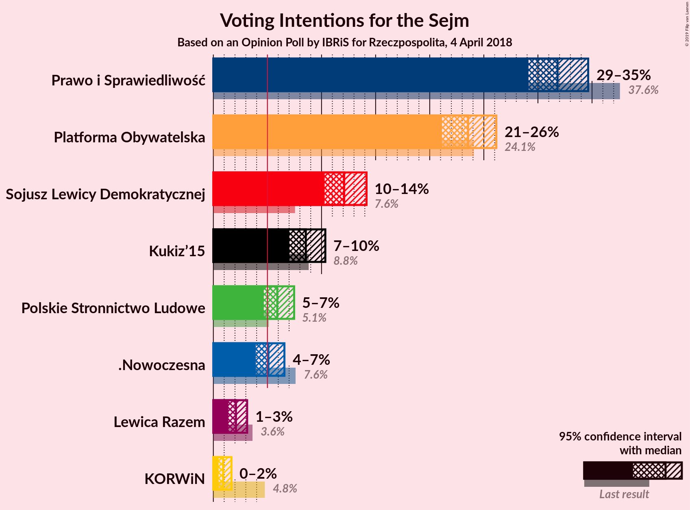
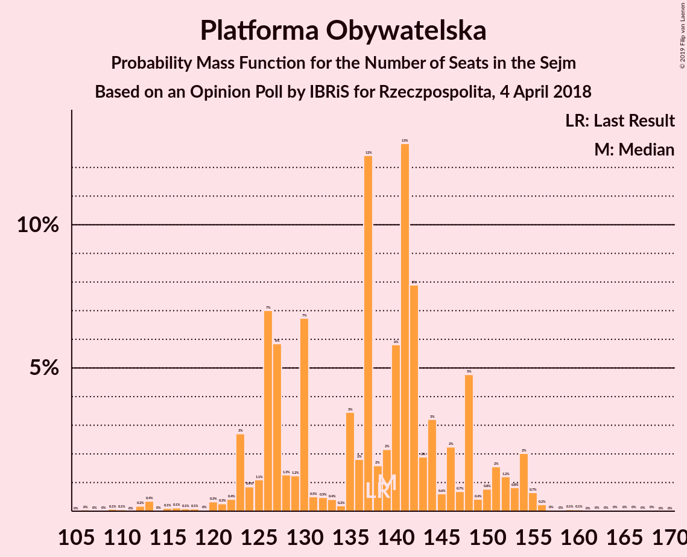
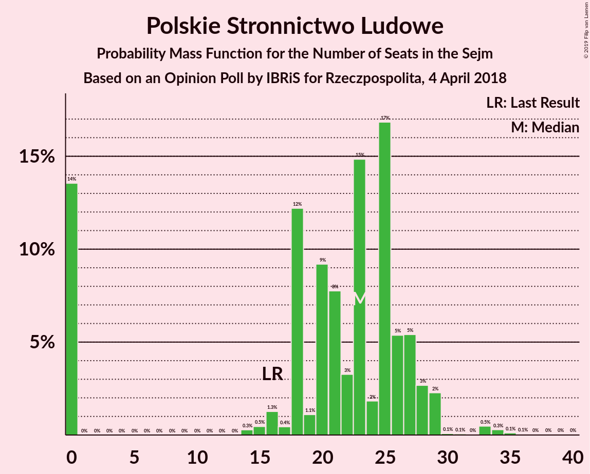
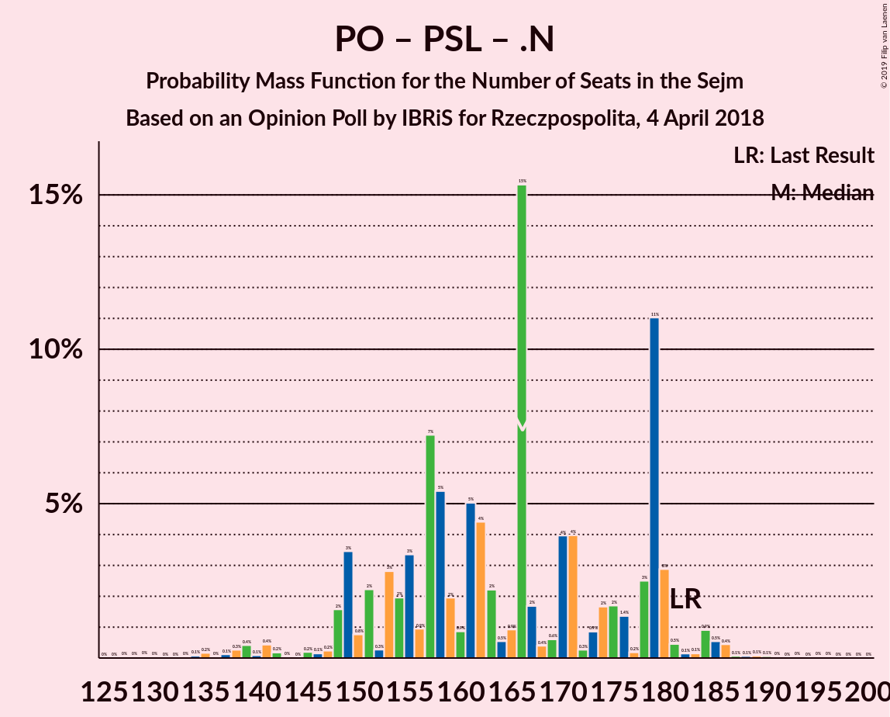

# Opinion Poll by IBRiS for Rzeczpospolita, 4 April 2018

<a href="#voting-intentions">Voting Intentions</a> | <a href="#seats">Seats</a> | <a href="#coalitions">Coalitions</a> | <a href="#technical-information">Technical Information</a>

## Voting Intentions

### Confidence Intervals

| Party | Last Result | Poll Result | 80% Confidence Interval | 90% Confidence Interval | 95% Confidence Interval | 99% Confidence Interval |
|:-----:|:-----------:|:-----------:|:-----------------------:|:-----------------------:|:-----------------------:|:-----------------------:|
| Prawo i Sprawiedliwość | 37.6% | 31.8% | 30.1–33.7% |29.6–34.2% |29.1–34.6% |28.3–35.5% |
| Platforma Obywatelska | 24.1% | 23.5% | 22.0–25.3% |21.5–25.7% |21.1–26.2% |20.4–27.0% |
| Sojusz Lewicy Demokratycznej | 7.6% | 12.1% | 10.9–13.4% |10.6–13.8% |10.3–14.2% |9.8–14.8% |
| Kukiz’15 | 8.8% | 8.5% | 7.5–9.7% |7.3–10.1% |7.0–10.3% |6.6–10.9% |
| Polskie Stronnictwo Ludowe | 5.1% | 5.9% | 5.1–6.9% |4.8–7.2% |4.7–7.5% |4.3–8.0% |
| .Nowoczesna | 7.6% | 5.1% | 4.3–6.1% |4.1–6.3% |3.9–6.6% |3.6–7.0% |
| Lewica Razem | 3.6% | 2.1% | 1.6–2.8% |1.5–3.0% |1.4–3.1% |1.2–3.5% |
| KORWiN | 4.8% | 0.9% | 0.6–1.4% |0.5–1.5% |0.5–1.7% |0.4–1.9% |

*Note:* The poll result column reflects the actual value used in the calculations. Published results may vary slightly, and in addition be rounded to fewer digits.

## Seats

### Confidence Intervals

| Party | Last Result | Median | 80% Confidence Interval | 90% Confidence Interval | 95% Confidence Interval | 99% Confidence Interval |
|:-----:|:-----------:|:------:|:-----------------------:|:-----------------------:|:-----------------------:|:-----------------------:|
| <a href="#prawo-i-sprawiedliwość">Prawo i Sprawiedliwość</a> | 235 | 194 | 191–196 |191–196 |191–200 |186–215 |
| <a href="#platforma-obywatelska">Platforma Obywatelska</a> | 138 | 135 | 124–135 |124–135 |124–135 |121–140 |
| <a href="#sojusz-lewicy-demokratycznej">Sojusz Lewicy Demokratycznej</a> | 0 | 67 | 59–68 |59–71 |59–77 |59–77 |
| <a href="#kukiz’15">Kukiz’15</a> | 42 | 41 | 39–42 |39–42 |33–42 |33–56 |
| <a href="#polskie-stronnictwo-ludowe">Polskie Stronnictwo Ludowe</a> | 16 | 23 | 23–34 |21–34 |16–34 |0–34 |
| <a href="#.nowoczesna">.Nowoczesna</a> | 28 | 0 | 0–10 |0–10 |0–10 |0–14 |
| <a href="#lewica-razem">Lewica Razem</a> | 0 | 0 | 0 |0 |0 |0 |
| <a href="#korwin">KORWiN</a> | 0 | 0 | 0 |0 |0 |0 |

### Prawo i Sprawiedliwość

*For a full overview of the results for this party, see the [Prawo i Sprawiedliwość](party-prawoisprawiedliwość.html) page.*

| Number of Seats | Probability | Accumulated | Special Marks |
|:---------------:|:-----------:|:-----------:|:-------------:|
| 174 | 0.2% | 100% |  |
| 175 | 0% | 99.7% |  |
| 176 | 0% | 99.7% |  |
| 177 | 0% | 99.7% |  |
| 178 | 0% | 99.7% |  |
| 179 | 0% | 99.7% |  |
| 180 | 0% | 99.7% |  |
| 181 | 0% | 99.7% |  |
| 182 | 0% | 99.7% |  |
| 183 | 0.1% | 99.7% |  |
| 184 | 0% | 99.7% |  |
| 185 | 0% | 99.7% |  |
| 186 | 0.9% | 99.7% |  |
| 187 | 0% | 98.8% |  |
| 188 | 0% | 98.8% |  |
| 189 | 0% | 98.8% |  |
| 190 | 0.2% | 98.8% |  |
| 191 | 16% | 98.5% |  |
| 192 | 0% | 82% |  |
| 193 | 31% | 82% |  |
| 194 | 2% | 51% | Median |
| 195 | 0% | 49% |  |
| 196 | 44% | 49% |  |
| 197 | 0.6% | 4% |  |
| 198 | 0.6% | 4% |  |
| 199 | 0.1% | 3% |  |
| 200 | 2% | 3% |  |
| 201 | 0% | 0.7% |  |
| 202 | 0% | 0.7% |  |
| 203 | 0% | 0.7% |  |
| 204 | 0% | 0.7% |  |
| 205 | 0% | 0.7% |  |
| 206 | 0% | 0.7% |  |
| 207 | 0% | 0.7% |  |
| 208 | 0% | 0.7% |  |
| 209 | 0% | 0.7% |  |
| 210 | 0% | 0.7% |  |
| 211 | 0% | 0.6% |  |
| 212 | 0% | 0.6% |  |
| 213 | 0% | 0.6% |  |
| 214 | 0% | 0.6% |  |
| 215 | 0.6% | 0.6% |  |
| 216 | 0% | 0.1% |  |
| 217 | 0% | 0.1% |  |
| 218 | 0% | 0.1% |  |
| 219 | 0% | 0.1% |  |
| 220 | 0% | 0.1% |  |
| 221 | 0% | 0.1% |  |
| 222 | 0% | 0.1% |  |
| 223 | 0% | 0.1% |  |
| 224 | 0.1% | 0.1% |  |
| 225 | 0% | 0% |  |
| 226 | 0% | 0% |  |
| 227 | 0% | 0% |  |
| 228 | 0% | 0% |  |
| 229 | 0% | 0% |  |
| 230 | 0% | 0% |  |
| 231 | 0% | 0% | Majority |
| 232 | 0% | 0% |  |
| 233 | 0% | 0% |  |
| 234 | 0% | 0% |  |
| 235 | 0% | 0% | Last Result |

### Platforma Obywatelska

*For a full overview of the results for this party, see the [Platforma Obywatelska](party-platformaobywatelska.html) page.*

| Number of Seats | Probability | Accumulated | Special Marks |
|:---------------:|:-----------:|:-----------:|:-------------:|
| 121 | 0.7% | 100% |  |
| 122 | 0.6% | 99.3% |  |
| 123 | 0% | 98.7% |  |
| 124 | 17% | 98.7% |  |
| 125 | 0% | 82% |  |
| 126 | 0.1% | 82% |  |
| 127 | 0% | 82% |  |
| 128 | 0% | 82% |  |
| 129 | 4% | 82% |  |
| 130 | 0% | 78% |  |
| 131 | 0% | 78% |  |
| 132 | 0% | 78% |  |
| 133 | 0% | 78% |  |
| 134 | 0% | 78% |  |
| 135 | 76% | 78% | Median |
| 136 | 0.1% | 2% |  |
| 137 | 0% | 2% |  |
| 138 | 0% | 2% | Last Result |
| 139 | 1.2% | 2% |  |
| 140 | 0.8% | 1.1% |  |
| 141 | 0% | 0.3% |  |
| 142 | 0% | 0.3% |  |
| 143 | 0% | 0.3% |  |
| 144 | 0% | 0.3% |  |
| 145 | 0% | 0.3% |  |
| 146 | 0% | 0.3% |  |
| 147 | 0% | 0.3% |  |
| 148 | 0% | 0.3% |  |
| 149 | 0% | 0.3% |  |
| 150 | 0.2% | 0.3% |  |
| 151 | 0% | 0% |  |

### Sojusz Lewicy Demokratycznej

*For a full overview of the results for this party, see the [Sojusz Lewicy Demokratycznej](party-sojuszlewicydemokratycznej.html) page.*

| Number of Seats | Probability | Accumulated | Special Marks |
|:---------------:|:-----------:|:-----------:|:-------------:|
| 0 | 0% | 100% | Last Result |
| 1 | 0% | 100% |  |
| 2 | 0% | 100% |  |
| 3 | 0% | 100% |  |
| 4 | 0% | 100% |  |
| 5 | 0% | 100% |  |
| 6 | 0% | 100% |  |
| 7 | 0% | 100% |  |
| 8 | 0% | 100% |  |
| 9 | 0% | 100% |  |
| 10 | 0% | 100% |  |
| 11 | 0% | 100% |  |
| 12 | 0% | 100% |  |
| 13 | 0% | 100% |  |
| 14 | 0% | 100% |  |
| 15 | 0% | 100% |  |
| 16 | 0% | 100% |  |
| 17 | 0% | 100% |  |
| 18 | 0% | 100% |  |
| 19 | 0% | 100% |  |
| 20 | 0% | 100% |  |
| 21 | 0% | 100% |  |
| 22 | 0% | 100% |  |
| 23 | 0% | 100% |  |
| 24 | 0% | 100% |  |
| 25 | 0% | 100% |  |
| 26 | 0% | 100% |  |
| 27 | 0% | 100% |  |
| 28 | 0% | 100% |  |
| 29 | 0% | 100% |  |
| 30 | 0% | 100% |  |
| 31 | 0% | 100% |  |
| 32 | 0% | 100% |  |
| 33 | 0% | 100% |  |
| 34 | 0% | 100% |  |
| 35 | 0% | 100% |  |
| 36 | 0% | 100% |  |
| 37 | 0% | 100% |  |
| 38 | 0% | 100% |  |
| 39 | 0% | 100% |  |
| 40 | 0% | 100% |  |
| 41 | 0% | 100% |  |
| 42 | 0% | 100% |  |
| 43 | 0% | 100% |  |
| 44 | 0% | 100% |  |
| 45 | 0% | 100% |  |
| 46 | 0% | 100% |  |
| 47 | 0% | 100% |  |
| 48 | 0% | 100% |  |
| 49 | 0% | 100% |  |
| 50 | 0% | 100% |  |
| 51 | 0% | 100% |  |
| 52 | 0% | 100% |  |
| 53 | 0% | 100% |  |
| 54 | 0% | 100% |  |
| 55 | 0% | 99.9% |  |
| 56 | 0% | 99.9% |  |
| 57 | 0% | 99.9% |  |
| 58 | 0% | 99.9% |  |
| 59 | 16% | 99.9% |  |
| 60 | 0.2% | 83% |  |
| 61 | 1.2% | 83% |  |
| 62 | 0% | 82% |  |
| 63 | 0% | 82% |  |
| 64 | 0.8% | 82% |  |
| 65 | 0.2% | 81% |  |
| 66 | 0% | 81% |  |
| 67 | 44% | 81% | Median |
| 68 | 31% | 37% |  |
| 69 | 0% | 5% |  |
| 70 | 0% | 5% |  |
| 71 | 0.7% | 5% |  |
| 72 | 0% | 5% |  |
| 73 | 0.6% | 5% |  |
| 74 | 0.1% | 4% |  |
| 75 | 0% | 4% |  |
| 76 | 1.1% | 4% |  |
| 77 | 3% | 3% |  |
| 78 | 0% | 0% |  |

### Kukiz’15

*For a full overview of the results for this party, see the [Kukiz’15](party-kukiz’15.html) page.*

| Number of Seats | Probability | Accumulated | Special Marks |
|:---------------:|:-----------:|:-----------:|:-------------:|
| 33 | 2% | 100% |  |
| 34 | 0.4% | 97% |  |
| 35 | 0% | 97% |  |
| 36 | 0.6% | 97% |  |
| 37 | 0% | 96% |  |
| 38 | 0% | 96% |  |
| 39 | 44% | 96% |  |
| 40 | 0.8% | 52% |  |
| 41 | 31% | 51% | Median |
| 42 | 18% | 20% | Last Result |
| 43 | 0% | 2% |  |
| 44 | 0% | 2% |  |
| 45 | 0% | 2% |  |
| 46 | 0.2% | 2% |  |
| 47 | 0% | 2% |  |
| 48 | 0% | 2% |  |
| 49 | 0% | 2% |  |
| 50 | 0% | 2% |  |
| 51 | 1.1% | 2% |  |
| 52 | 0% | 1.0% |  |
| 53 | 0% | 0.9% |  |
| 54 | 0.1% | 0.9% |  |
| 55 | 0% | 0.9% |  |
| 56 | 0.9% | 0.9% |  |
| 57 | 0% | 0% |  |

### Polskie Stronnictwo Ludowe

*For a full overview of the results for this party, see the [Polskie Stronnictwo Ludowe](party-polskiestronnictwoludowe.html) page.*

| Number of Seats | Probability | Accumulated | Special Marks |
|:---------------:|:-----------:|:-----------:|:-------------:|
| 0 | 2% | 100% |  |
| 1 | 0% | 98% |  |
| 2 | 0% | 98% |  |
| 3 | 0% | 98% |  |
| 4 | 0% | 98% |  |
| 5 | 0% | 98% |  |
| 6 | 0% | 98% |  |
| 7 | 0% | 98% |  |
| 8 | 0% | 98% |  |
| 9 | 0% | 98% |  |
| 10 | 0% | 98% |  |
| 11 | 0% | 98% |  |
| 12 | 0% | 98% |  |
| 13 | 0% | 98% |  |
| 14 | 0% | 98% |  |
| 15 | 0% | 98% |  |
| 16 | 0.6% | 98% | Last Result |
| 17 | 0% | 97% |  |
| 18 | 0% | 97% |  |
| 19 | 0% | 97% |  |
| 20 | 0% | 97% |  |
| 21 | 3% | 97% |  |
| 22 | 0.4% | 95% |  |
| 23 | 76% | 94% | Median |
| 24 | 0% | 19% |  |
| 25 | 0% | 19% |  |
| 26 | 0% | 19% |  |
| 27 | 0% | 19% |  |
| 28 | 0% | 19% |  |
| 29 | 0.9% | 19% |  |
| 30 | 0% | 18% |  |
| 31 | 0% | 18% |  |
| 32 | 0% | 18% |  |
| 33 | 0% | 18% |  |
| 34 | 18% | 18% |  |
| 35 | 0% | 0% |  |

### .Nowoczesna

*For a full overview of the results for this party, see the [.Nowoczesna](party-nowoczesna.html) page.*

| Number of Seats | Probability | Accumulated | Special Marks |
|:---------------:|:-----------:|:-----------:|:-------------:|
| 0 | 82% | 100% | Median |
| 1 | 0% | 18% |  |
| 2 | 0% | 18% |  |
| 3 | 0% | 18% |  |
| 4 | 0% | 18% |  |
| 5 | 0% | 18% |  |
| 6 | 0% | 18% |  |
| 7 | 0% | 18% |  |
| 8 | 0% | 18% |  |
| 9 | 0% | 18% |  |
| 10 | 17% | 18% |  |
| 11 | 0% | 0.9% |  |
| 12 | 0% | 0.9% |  |
| 13 | 0% | 0.9% |  |
| 14 | 0.9% | 0.9% |  |
| 15 | 0% | 0% |  |
| 16 | 0% | 0% |  |
| 17 | 0% | 0% |  |
| 18 | 0% | 0% |  |
| 19 | 0% | 0% |  |
| 20 | 0% | 0% |  |
| 21 | 0% | 0% |  |
| 22 | 0% | 0% |  |
| 23 | 0% | 0% |  |
| 24 | 0% | 0% |  |
| 25 | 0% | 0% |  |
| 26 | 0% | 0% |  |
| 27 | 0% | 0% |  |
| 28 | 0% | 0% | Last Result |

### Lewica Razem

*For a full overview of the results for this party, see the [Lewica Razem](party-lewicarazem.html) page.*

| Number of Seats | Probability | Accumulated | Special Marks |
|:---------------:|:-----------:|:-----------:|:-------------:|
| 0 | 100% | 100% | Last Result, Median |

### KORWiN

*For a full overview of the results for this party, see the [KORWiN](party-korwin.html) page.*

| Number of Seats | Probability | Accumulated | Special Marks |
|:---------------:|:-----------:|:-----------:|:-------------:|
| 0 | 100% | 100% | Last Result, Median |

## Coalitions

### Confidence Intervals

| Coalition | Last Result | Median | Majority? | 80% Confidence Interval | 90% Confidence Interval | 95% Confidence Interval | 99% Confidence Interval |
|:---------:|:-----------:|:------:|:---------:|:-----------------------:|:-----------------------:|:-----------------------:|:-----------------------:|
| Platforma Obywatelska – Sojusz Lewicy Demokratycznej – Polskie Stronnictwo Ludowe – .Nowoczesna – Lewica Razem | 182 | 226 | 0.3% | 225–227 | 225–227 | 218–227 | 209–228 |
| Platforma Obywatelska – Sojusz Lewicy Demokratycznej – Polskie Stronnictwo Ludowe – .Nowoczesna | 182 | 226 | 0.3% | 225–227 | 225–227 | 218–227 | 209–228 |
| Platforma Obywatelska – Sojusz Lewicy Demokratycznej – .Nowoczesna | 166 | 202 | 0% | 193–203 | 193–206 | 193–206 | 190–218 |
| Prawo i Sprawiedliwość | 235 | 194 | 0% | 191–196 | 191–196 | 191–200 | 186–215 |
| Platforma Obywatelska – Polskie Stronnictwo Ludowe – .Nowoczesna | 182 | 158 | 0% | 158–168 | 151–168 | 150–168 | 138–168 |
| Platforma Obywatelska – .Nowoczesna | 166 | 135 | 0% | 134–135 | 129–135 | 129–136 | 121–154 |
| Platforma Obywatelska | 138 | 135 | 0% | 124–135 | 124–135 | 124–135 | 121–140 |

### Platforma Obywatelska – Sojusz Lewicy Demokratycznej – Polskie Stronnictwo Ludowe – .Nowoczesna – Lewica Razem

| Number of Seats | Probability | Accumulated | Special Marks |
|:---------------:|:-----------:|:-----------:|:-------------:|
| 182 | 0% | 100% | Last Result |
| 183 | 0% | 100% |  |
| 184 | 0% | 100% |  |
| 185 | 0% | 100% |  |
| 186 | 0% | 100% |  |
| 187 | 0% | 100% |  |
| 188 | 0% | 100% |  |
| 189 | 0% | 100% |  |
| 190 | 0% | 100% |  |
| 191 | 0% | 100% |  |
| 192 | 0% | 100% |  |
| 193 | 0% | 100% |  |
| 194 | 0% | 100% |  |
| 195 | 0% | 100% |  |
| 196 | 0% | 100% |  |
| 197 | 0% | 100% |  |
| 198 | 0% | 100% |  |
| 199 | 0% | 100% |  |
| 200 | 0.1% | 100% |  |
| 201 | 0% | 99.9% |  |
| 202 | 0% | 99.9% |  |
| 203 | 0% | 99.9% |  |
| 204 | 0% | 99.9% |  |
| 205 | 0% | 99.9% |  |
| 206 | 0% | 99.9% |  |
| 207 | 0% | 99.9% |  |
| 208 | 0% | 99.9% |  |
| 209 | 0.6% | 99.9% |  |
| 210 | 0% | 99.4% |  |
| 211 | 0% | 99.4% |  |
| 212 | 0% | 99.4% |  |
| 213 | 0% | 99.4% |  |
| 214 | 0% | 99.4% |  |
| 215 | 1.1% | 99.3% |  |
| 216 | 0% | 98% |  |
| 217 | 0% | 98% |  |
| 218 | 0.9% | 98% |  |
| 219 | 0% | 97% |  |
| 220 | 0% | 97% |  |
| 221 | 0.1% | 97% |  |
| 222 | 0.1% | 97% |  |
| 223 | 0.7% | 97% |  |
| 224 | 0.9% | 96% |  |
| 225 | 44% | 95% | Median |
| 226 | 31% | 51% |  |
| 227 | 19% | 20% |  |
| 228 | 0.7% | 1.0% |  |
| 229 | 0% | 0.3% |  |
| 230 | 0% | 0.3% |  |
| 231 | 0% | 0.3% | Majority |
| 232 | 0% | 0.3% |  |
| 233 | 0% | 0.3% |  |
| 234 | 0% | 0.3% |  |
| 235 | 0% | 0.3% |  |
| 236 | 0% | 0.3% |  |
| 237 | 0% | 0.3% |  |
| 238 | 0% | 0.3% |  |
| 239 | 0% | 0.3% |  |
| 240 | 0.2% | 0.3% |  |
| 241 | 0% | 0% |  |

### Platforma Obywatelska – Sojusz Lewicy Demokratycznej – Polskie Stronnictwo Ludowe – .Nowoczesna

| Number of Seats | Probability | Accumulated | Special Marks |
|:---------------:|:-----------:|:-----------:|:-------------:|
| 182 | 0% | 100% | Last Result |
| 183 | 0% | 100% |  |
| 184 | 0% | 100% |  |
| 185 | 0% | 100% |  |
| 186 | 0% | 100% |  |
| 187 | 0% | 100% |  |
| 188 | 0% | 100% |  |
| 189 | 0% | 100% |  |
| 190 | 0% | 100% |  |
| 191 | 0% | 100% |  |
| 192 | 0% | 100% |  |
| 193 | 0% | 100% |  |
| 194 | 0% | 100% |  |
| 195 | 0% | 100% |  |
| 196 | 0% | 100% |  |
| 197 | 0% | 100% |  |
| 198 | 0% | 100% |  |
| 199 | 0% | 100% |  |
| 200 | 0.1% | 100% |  |
| 201 | 0% | 99.9% |  |
| 202 | 0% | 99.9% |  |
| 203 | 0% | 99.9% |  |
| 204 | 0% | 99.9% |  |
| 205 | 0% | 99.9% |  |
| 206 | 0% | 99.9% |  |
| 207 | 0% | 99.9% |  |
| 208 | 0% | 99.9% |  |
| 209 | 0.6% | 99.9% |  |
| 210 | 0% | 99.4% |  |
| 211 | 0% | 99.4% |  |
| 212 | 0% | 99.4% |  |
| 213 | 0% | 99.4% |  |
| 214 | 0% | 99.4% |  |
| 215 | 1.1% | 99.3% |  |
| 216 | 0% | 98% |  |
| 217 | 0% | 98% |  |
| 218 | 0.9% | 98% |  |
| 219 | 0% | 97% |  |
| 220 | 0% | 97% |  |
| 221 | 0.1% | 97% |  |
| 222 | 0.1% | 97% |  |
| 223 | 0.7% | 97% |  |
| 224 | 0.9% | 96% |  |
| 225 | 44% | 95% | Median |
| 226 | 31% | 51% |  |
| 227 | 19% | 20% |  |
| 228 | 0.7% | 1.0% |  |
| 229 | 0% | 0.3% |  |
| 230 | 0% | 0.3% |  |
| 231 | 0% | 0.3% | Majority |
| 232 | 0% | 0.3% |  |
| 233 | 0% | 0.3% |  |
| 234 | 0% | 0.3% |  |
| 235 | 0% | 0.3% |  |
| 236 | 0% | 0.3% |  |
| 237 | 0% | 0.3% |  |
| 238 | 0% | 0.3% |  |
| 239 | 0% | 0.3% |  |
| 240 | 0.2% | 0.3% |  |
| 241 | 0% | 0% |  |

### Platforma Obywatelska – Sojusz Lewicy Demokratycznej – .Nowoczesna

| Number of Seats | Probability | Accumulated | Special Marks |
|:---------------:|:-----------:|:-----------:|:-------------:|
| 166 | 0% | 100% | Last Result |
| 167 | 0% | 100% |  |
| 168 | 0% | 100% |  |
| 169 | 0% | 100% |  |
| 170 | 0% | 100% |  |
| 171 | 0% | 100% |  |
| 172 | 0% | 100% |  |
| 173 | 0% | 100% |  |
| 174 | 0% | 100% |  |
| 175 | 0% | 100% |  |
| 176 | 0% | 100% |  |
| 177 | 0% | 100% |  |
| 178 | 0% | 100% |  |
| 179 | 0% | 100% |  |
| 180 | 0% | 100% |  |
| 181 | 0% | 100% |  |
| 182 | 0% | 100% |  |
| 183 | 0% | 100% |  |
| 184 | 0% | 100% |  |
| 185 | 0% | 100% |  |
| 186 | 0% | 100% |  |
| 187 | 0% | 100% |  |
| 188 | 0% | 100% |  |
| 189 | 0% | 100% |  |
| 190 | 0.9% | 100% |  |
| 191 | 0% | 99.1% |  |
| 192 | 0.1% | 99.1% |  |
| 193 | 17% | 99.0% |  |
| 194 | 0.8% | 82% |  |
| 195 | 0% | 81% |  |
| 196 | 0% | 81% |  |
| 197 | 0% | 81% |  |
| 198 | 0% | 81% |  |
| 199 | 0% | 81% |  |
| 200 | 0.1% | 81% |  |
| 201 | 0.1% | 81% |  |
| 202 | 44% | 81% | Median |
| 203 | 31% | 37% |  |
| 204 | 0% | 5% |  |
| 205 | 0% | 5% |  |
| 206 | 3% | 5% |  |
| 207 | 0% | 2% |  |
| 208 | 0% | 2% |  |
| 209 | 0.1% | 2% |  |
| 210 | 0% | 2% |  |
| 211 | 0.3% | 2% |  |
| 212 | 0% | 2% |  |
| 213 | 0% | 2% |  |
| 214 | 0% | 2% |  |
| 215 | 1.1% | 2% |  |
| 216 | 0% | 0.9% |  |
| 217 | 0% | 0.9% |  |
| 218 | 0.9% | 0.9% |  |
| 219 | 0% | 0% |  |

### Prawo i Sprawiedliwość

| Number of Seats | Probability | Accumulated | Special Marks |
|:---------------:|:-----------:|:-----------:|:-------------:|
| 174 | 0.2% | 100% |  |
| 175 | 0% | 99.7% |  |
| 176 | 0% | 99.7% |  |
| 177 | 0% | 99.7% |  |
| 178 | 0% | 99.7% |  |
| 179 | 0% | 99.7% |  |
| 180 | 0% | 99.7% |  |
| 181 | 0% | 99.7% |  |
| 182 | 0% | 99.7% |  |
| 183 | 0.1% | 99.7% |  |
| 184 | 0% | 99.7% |  |
| 185 | 0% | 99.7% |  |
| 186 | 0.9% | 99.7% |  |
| 187 | 0% | 98.8% |  |
| 188 | 0% | 98.8% |  |
| 189 | 0% | 98.8% |  |
| 190 | 0.2% | 98.8% |  |
| 191 | 16% | 98.5% |  |
| 192 | 0% | 82% |  |
| 193 | 31% | 82% |  |
| 194 | 2% | 51% | Median |
| 195 | 0% | 49% |  |
| 196 | 44% | 49% |  |
| 197 | 0.6% | 4% |  |
| 198 | 0.6% | 4% |  |
| 199 | 0.1% | 3% |  |
| 200 | 2% | 3% |  |
| 201 | 0% | 0.7% |  |
| 202 | 0% | 0.7% |  |
| 203 | 0% | 0.7% |  |
| 204 | 0% | 0.7% |  |
| 205 | 0% | 0.7% |  |
| 206 | 0% | 0.7% |  |
| 207 | 0% | 0.7% |  |
| 208 | 0% | 0.7% |  |
| 209 | 0% | 0.7% |  |
| 210 | 0% | 0.7% |  |
| 211 | 0% | 0.6% |  |
| 212 | 0% | 0.6% |  |
| 213 | 0% | 0.6% |  |
| 214 | 0% | 0.6% |  |
| 215 | 0.6% | 0.6% |  |
| 216 | 0% | 0.1% |  |
| 217 | 0% | 0.1% |  |
| 218 | 0% | 0.1% |  |
| 219 | 0% | 0.1% |  |
| 220 | 0% | 0.1% |  |
| 221 | 0% | 0.1% |  |
| 222 | 0% | 0.1% |  |
| 223 | 0% | 0.1% |  |
| 224 | 0.1% | 0.1% |  |
| 225 | 0% | 0% |  |
| 226 | 0% | 0% |  |
| 227 | 0% | 0% |  |
| 228 | 0% | 0% |  |
| 229 | 0% | 0% |  |
| 230 | 0% | 0% |  |
| 231 | 0% | 0% | Majority |
| 232 | 0% | 0% |  |
| 233 | 0% | 0% |  |
| 234 | 0% | 0% |  |
| 235 | 0% | 0% | Last Result |

### Platforma Obywatelska – Polskie Stronnictwo Ludowe – .Nowoczesna

| Number of Seats | Probability | Accumulated | Special Marks |
|:---------------:|:-----------:|:-----------:|:-------------:|
| 126 | 0.1% | 100% |  |
| 127 | 0% | 99.9% |  |
| 128 | 0% | 99.9% |  |
| 129 | 0% | 99.9% |  |
| 130 | 0% | 99.9% |  |
| 131 | 0% | 99.9% |  |
| 132 | 0% | 99.9% |  |
| 133 | 0% | 99.9% |  |
| 134 | 0% | 99.9% |  |
| 135 | 0% | 99.9% |  |
| 136 | 0% | 99.9% |  |
| 137 | 0% | 99.9% |  |
| 138 | 0.6% | 99.9% |  |
| 139 | 1.2% | 99.4% |  |
| 140 | 0% | 98% |  |
| 141 | 0% | 98% |  |
| 142 | 0% | 98% |  |
| 143 | 0% | 98% |  |
| 144 | 0% | 98% |  |
| 145 | 0% | 98% |  |
| 146 | 0% | 98% |  |
| 147 | 0% | 98% |  |
| 148 | 0% | 98% |  |
| 149 | 0% | 98% |  |
| 150 | 3% | 98% |  |
| 151 | 0.4% | 95% |  |
| 152 | 0.1% | 95% |  |
| 153 | 0.1% | 95% |  |
| 154 | 0.8% | 94% |  |
| 155 | 0% | 94% |  |
| 156 | 0% | 94% |  |
| 157 | 0.1% | 94% |  |
| 158 | 76% | 94% | Median |
| 159 | 0% | 18% |  |
| 160 | 0% | 18% |  |
| 161 | 0% | 18% |  |
| 162 | 0% | 18% |  |
| 163 | 0.9% | 18% |  |
| 164 | 0% | 17% |  |
| 165 | 0% | 17% |  |
| 166 | 0% | 17% |  |
| 167 | 0% | 17% |  |
| 168 | 17% | 17% |  |
| 169 | 0% | 0.3% |  |
| 170 | 0% | 0.3% |  |
| 171 | 0% | 0.3% |  |
| 172 | 0% | 0.3% |  |
| 173 | 0% | 0.3% |  |
| 174 | 0% | 0.3% |  |
| 175 | 0% | 0.3% |  |
| 176 | 0% | 0.3% |  |
| 177 | 0% | 0.3% |  |
| 178 | 0% | 0.3% |  |
| 179 | 0.2% | 0.3% |  |
| 180 | 0% | 0% |  |
| 181 | 0% | 0% |  |
| 182 | 0% | 0% | Last Result |

### Platforma Obywatelska – .Nowoczesna

| Number of Seats | Probability | Accumulated | Special Marks |
|:---------------:|:-----------:|:-----------:|:-------------:|
| 121 | 0.7% | 100% |  |
| 122 | 0.6% | 99.3% |  |
| 123 | 0% | 98.7% |  |
| 124 | 0% | 98.7% |  |
| 125 | 0% | 98.7% |  |
| 126 | 0.1% | 98.7% |  |
| 127 | 0% | 98.7% |  |
| 128 | 0% | 98.7% |  |
| 129 | 4% | 98.7% |  |
| 130 | 0% | 95% |  |
| 131 | 0% | 95% |  |
| 132 | 0% | 95% |  |
| 133 | 0% | 95% |  |
| 134 | 17% | 95% |  |
| 135 | 76% | 78% | Median |
| 136 | 0.1% | 3% |  |
| 137 | 0% | 2% |  |
| 138 | 0% | 2% |  |
| 139 | 1.2% | 2% |  |
| 140 | 0% | 1.2% |  |
| 141 | 0% | 1.2% |  |
| 142 | 0% | 1.2% |  |
| 143 | 0% | 1.2% |  |
| 144 | 0% | 1.2% |  |
| 145 | 0% | 1.2% |  |
| 146 | 0% | 1.2% |  |
| 147 | 0% | 1.2% |  |
| 148 | 0% | 1.2% |  |
| 149 | 0% | 1.2% |  |
| 150 | 0.2% | 1.2% |  |
| 151 | 0% | 0.9% |  |
| 152 | 0% | 0.9% |  |
| 153 | 0.1% | 0.9% |  |
| 154 | 0.8% | 0.8% |  |
| 155 | 0% | 0% |  |
| 156 | 0% | 0% |  |
| 157 | 0% | 0% |  |
| 158 | 0% | 0% |  |
| 159 | 0% | 0% |  |
| 160 | 0% | 0% |  |
| 161 | 0% | 0% |  |
| 162 | 0% | 0% |  |
| 163 | 0% | 0% |  |
| 164 | 0% | 0% |  |
| 165 | 0% | 0% |  |
| 166 | 0% | 0% | Last Result |

### Platforma Obywatelska

| Number of Seats | Probability | Accumulated | Special Marks |
|:---------------:|:-----------:|:-----------:|:-------------:|
| 121 | 0.7% | 100% |  |
| 122 | 0.6% | 99.3% |  |
| 123 | 0% | 98.7% |  |
| 124 | 17% | 98.7% |  |
| 125 | 0% | 82% |  |
| 126 | 0.1% | 82% |  |
| 127 | 0% | 82% |  |
| 128 | 0% | 82% |  |
| 129 | 4% | 82% |  |
| 130 | 0% | 78% |  |
| 131 | 0% | 78% |  |
| 132 | 0% | 78% |  |
| 133 | 0% | 78% |  |
| 134 | 0% | 78% |  |
| 135 | 76% | 78% | Median |
| 136 | 0.1% | 2% |  |
| 137 | 0% | 2% |  |
| 138 | 0% | 2% | Last Result |
| 139 | 1.2% | 2% |  |
| 140 | 0.8% | 1.1% |  |
| 141 | 0% | 0.3% |  |
| 142 | 0% | 0.3% |  |
| 143 | 0% | 0.3% |  |
| 144 | 0% | 0.3% |  |
| 145 | 0% | 0.3% |  |
| 146 | 0% | 0.3% |  |
| 147 | 0% | 0.3% |  |
| 148 | 0% | 0.3% |  |
| 149 | 0% | 0.3% |  |
| 150 | 0.2% | 0.3% |  |
| 151 | 0% | 0% |  |

## Technical Information

### Opinion Poll

+ **Polling firm:** IBRiS
+ **Commissioner(s):** Rzeczpospolita
+ **Fieldwork period:** 4 April 2018

### Calculations

+ **Sample size:** 1100
+ **Simulations done:** 1,024
+ **Error estimate:** 3.19%

