# Opinion Poll by Instytut Badań Pollster for TVP1, 6–7 April 2018

<a href="#voting-intentions">Voting Intentions</a> | <a href="#seats">Seats</a> | <a href="#coalitions">Coalitions</a> | <a href="#technical-information">Technical Information</a>

## Voting Intentions

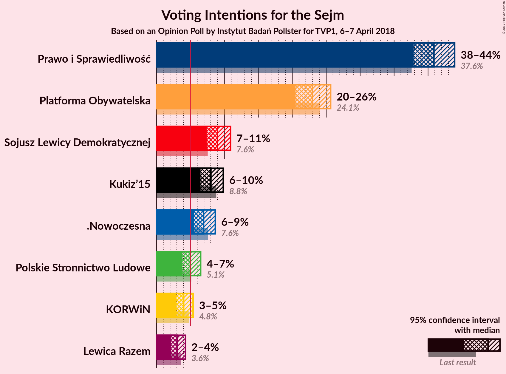

### Confidence Intervals

| Party | Last Result | Poll Result | 80% Confidence Interval | 90% Confidence Interval | 95% Confidence Interval | 99% Confidence Interval |
|:-----:|:-----------:|:-----------:|:-----------------------:|:-----------------------:|:-----------------------:|:-----------------------:|
| Prawo i Sprawiedliwość | 37.6% | 40.9% | 38.9–42.9% |38.4–43.4% |37.9–43.9% |37.0–44.9% |
| Platforma Obywatelska | 24.1% | 23.0% | 21.3–24.7% |20.9–25.2% |20.5–25.7% |19.7–26.5% |
| Sojusz Lewicy Demokratycznej | 7.6% | 9.0% | 7.9–10.2% |7.6–10.6% |7.4–10.9% |6.9–11.5% |
| Kukiz’15 | 8.8% | 8.0% | 7.0–9.2% |6.7–9.6% |6.5–9.8% |6.1–10.5% |
| .Nowoczesna | 7.6% | 6.9% | 6.0–8.1% |5.8–8.4% |5.5–8.7% |5.1–9.2% |
| Polskie Stronnictwo Ludowe | 5.1% | 5.0% | 4.2–6.0% |4.0–6.2% |3.8–6.5% |3.5–7.0% |
| KORWiN | 4.8% | 4.0% | 3.3–4.9% |3.1–5.2% |3.0–5.4% |2.7–5.9% |
| Lewica Razem | 3.6% | 3.0% | 2.4–3.8% |2.3–4.1% |2.1–4.3% |1.9–4.7% |

*Note:* The poll result column reflects the actual value used in the calculations. Published results may vary slightly, and in addition be rounded to fewer digits.

## Seats

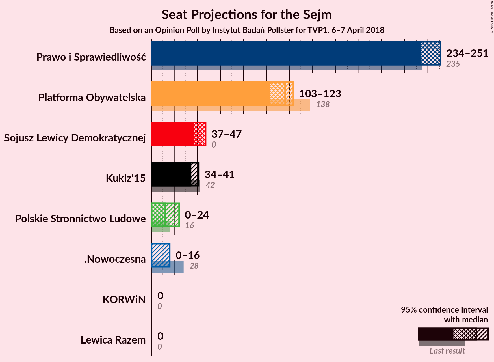

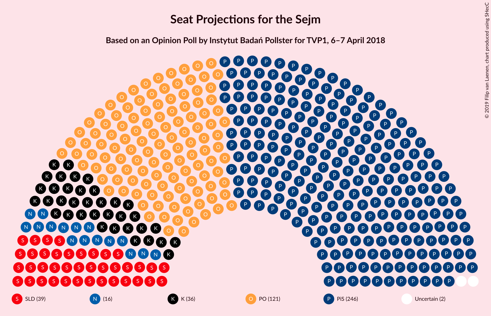

### Confidence Intervals

| Party | Last Result | Median | 80% Confidence Interval | 90% Confidence Interval | 95% Confidence Interval | 99% Confidence Interval |
|:-----:|:-----------:|:------:|:-----------------------:|:-----------------------:|:-----------------------:|:-----------------------:|
| <a href="#prawo-i-sprawiedliwość">Prawo i Sprawiedliwość</a> | 235 | 251 | 251 |240–251 |234–251 |223–251 |
| <a href="#platforma-obywatelska">Platforma Obywatelska</a> | 138 | 116 | 116 |116 |103–123 |103–138 |
| <a href="#sojusz-lewicy-demokratycznej">Sojusz Lewicy Demokratycznej</a> | 0 | 47 | 47 |39–47 |37–47 |27–47 |
| <a href="#kukiz’15">Kukiz’15</a> | 42 | 34 | 34 |34–35 |34–41 |29–45 |
| <a href="#.nowoczesna">.Nowoczesna</a> | 28 | 0 | 0 |0–15 |0–16 |0–40 |
| <a href="#polskie-stronnictwo-ludowe">Polskie Stronnictwo Ludowe</a> | 16 | 12 | 12 |12 |0–24 |0–24 |
| <a href="#korwin">KORWiN</a> | 0 | 0 | 0 |0 |0 |0 |
| <a href="#lewica-razem">Lewica Razem</a> | 0 | 0 | 0 |0 |0 |0 |

### Prawo i Sprawiedliwość

*For a full overview of the results for this party, see the [Prawo i Sprawiedliwość](party-prawoisprawiedliwość.html) page.*

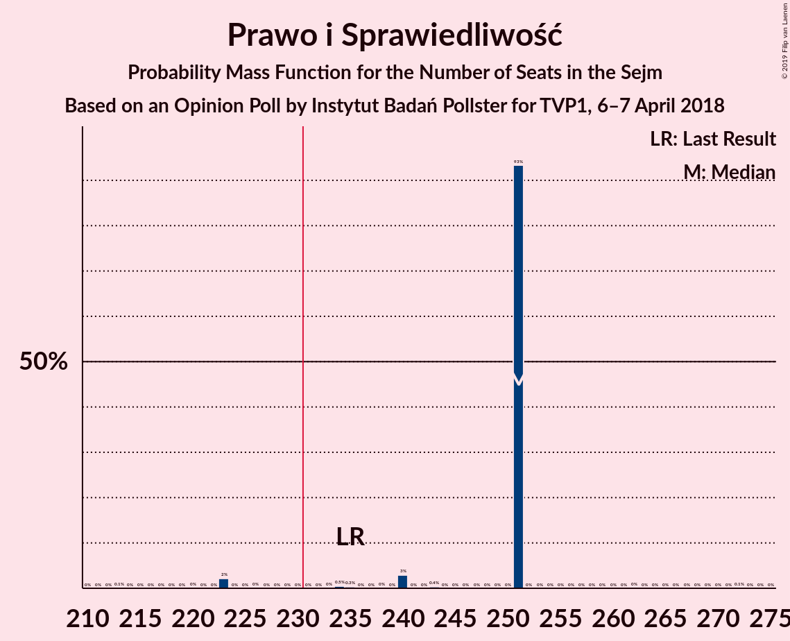

| Number of Seats | Probability | Accumulated | Special Marks |
|:---------------:|:-----------:|:-----------:|:-------------:|
| 213 | 0.1% | 100% |  |
| 214 | 0% | 99.9% |  |
| 215 | 0% | 99.9% |  |
| 216 | 0% | 99.9% |  |
| 217 | 0% | 99.9% |  |
| 218 | 0% | 99.9% |  |
| 219 | 0% | 99.9% |  |
| 220 | 0% | 99.9% |  |
| 221 | 0% | 99.9% |  |
| 222 | 0% | 99.9% |  |
| 223 | 2% | 99.9% |  |
| 224 | 0% | 98% |  |
| 225 | 0% | 98% |  |
| 226 | 0% | 98% |  |
| 227 | 0% | 98% |  |
| 228 | 0% | 98% |  |
| 229 | 0% | 98% |  |
| 230 | 0% | 98% |  |
| 231 | 0% | 98% | Majority |
| 232 | 0% | 98% |  |
| 233 | 0% | 98% |  |
| 234 | 0.5% | 98% |  |
| 235 | 0.3% | 97% | Last Result |
| 236 | 0% | 97% |  |
| 237 | 0% | 97% |  |
| 238 | 0% | 97% |  |
| 239 | 0% | 97% |  |
| 240 | 3% | 97% |  |
| 241 | 0% | 94% |  |
| 242 | 0% | 94% |  |
| 243 | 0.4% | 94% |  |
| 244 | 0% | 94% |  |
| 245 | 0% | 94% |  |
| 246 | 0% | 94% |  |
| 247 | 0% | 94% |  |
| 248 | 0% | 94% |  |
| 249 | 0% | 94% |  |
| 250 | 0% | 94% |  |
| 251 | 93% | 94% | Median |
| 252 | 0% | 0.2% |  |
| 253 | 0% | 0.2% |  |
| 254 | 0% | 0.2% |  |
| 255 | 0% | 0.2% |  |
| 256 | 0% | 0.2% |  |
| 257 | 0% | 0.2% |  |
| 258 | 0% | 0.2% |  |
| 259 | 0% | 0.2% |  |
| 260 | 0% | 0.2% |  |
| 261 | 0% | 0.2% |  |
| 262 | 0% | 0.2% |  |
| 263 | 0% | 0.1% |  |
| 264 | 0% | 0.1% |  |
| 265 | 0% | 0.1% |  |
| 266 | 0% | 0.1% |  |
| 267 | 0% | 0.1% |  |
| 268 | 0% | 0.1% |  |
| 269 | 0% | 0.1% |  |
| 270 | 0% | 0.1% |  |
| 271 | 0% | 0.1% |  |
| 272 | 0.1% | 0.1% |  |
| 273 | 0% | 0% |  |

### Platforma Obywatelska

*For a full overview of the results for this party, see the [Platforma Obywatelska](party-platformaobywatelska.html) page.*

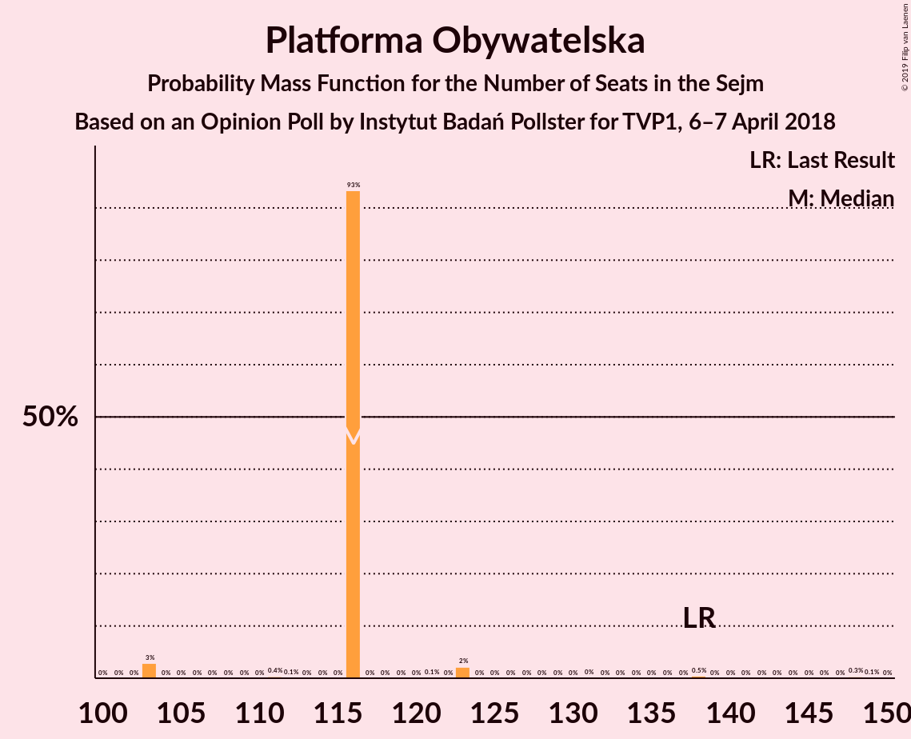

| Number of Seats | Probability | Accumulated | Special Marks |
|:---------------:|:-----------:|:-----------:|:-------------:|
| 103 | 3% | 100% |  |
| 104 | 0% | 97% |  |
| 105 | 0% | 97% |  |
| 106 | 0% | 97% |  |
| 107 | 0% | 97% |  |
| 108 | 0% | 97% |  |
| 109 | 0% | 97% |  |
| 110 | 0% | 97% |  |
| 111 | 0.4% | 97% |  |
| 112 | 0.1% | 97% |  |
| 113 | 0% | 97% |  |
| 114 | 0% | 97% |  |
| 115 | 0% | 97% |  |
| 116 | 93% | 97% | Median |
| 117 | 0% | 3% |  |
| 118 | 0% | 3% |  |
| 119 | 0% | 3% |  |
| 120 | 0% | 3% |  |
| 121 | 0.1% | 3% |  |
| 122 | 0% | 3% |  |
| 123 | 2% | 3% |  |
| 124 | 0% | 1.0% |  |
| 125 | 0% | 1.0% |  |
| 126 | 0% | 1.0% |  |
| 127 | 0% | 1.0% |  |
| 128 | 0% | 1.0% |  |
| 129 | 0% | 1.0% |  |
| 130 | 0% | 1.0% |  |
| 131 | 0% | 1.0% |  |
| 132 | 0% | 0.9% |  |
| 133 | 0% | 0.9% |  |
| 134 | 0% | 0.9% |  |
| 135 | 0% | 0.9% |  |
| 136 | 0% | 0.9% |  |
| 137 | 0% | 0.9% |  |
| 138 | 0.5% | 0.9% | Last Result |
| 139 | 0% | 0.5% |  |
| 140 | 0% | 0.5% |  |
| 141 | 0% | 0.5% |  |
| 142 | 0% | 0.5% |  |
| 143 | 0% | 0.5% |  |
| 144 | 0% | 0.5% |  |
| 145 | 0% | 0.5% |  |
| 146 | 0% | 0.5% |  |
| 147 | 0% | 0.5% |  |
| 148 | 0.3% | 0.5% |  |
| 149 | 0.1% | 0.1% |  |
| 150 | 0% | 0% |  |

### Sojusz Lewicy Demokratycznej

*For a full overview of the results for this party, see the [Sojusz Lewicy Demokratycznej](party-sojuszlewicydemokratycznej.html) page.*

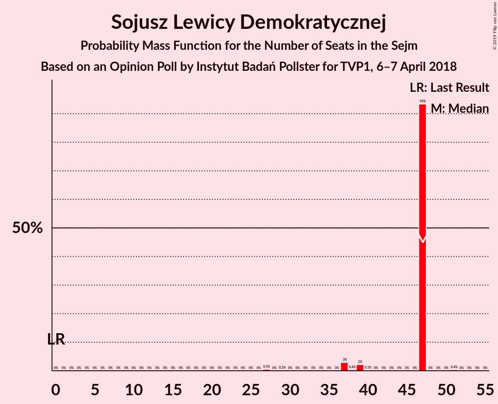

| Number of Seats | Probability | Accumulated | Special Marks |
|:---------------:|:-----------:|:-----------:|:-------------:|
| 0 | 0% | 100% | Last Result |
| 1 | 0% | 100% |  |
| 2 | 0% | 100% |  |
| 3 | 0% | 100% |  |
| 4 | 0% | 100% |  |
| 5 | 0% | 100% |  |
| 6 | 0% | 100% |  |
| 7 | 0% | 100% |  |
| 8 | 0% | 100% |  |
| 9 | 0% | 100% |  |
| 10 | 0% | 100% |  |
| 11 | 0% | 100% |  |
| 12 | 0% | 100% |  |
| 13 | 0% | 100% |  |
| 14 | 0% | 100% |  |
| 15 | 0% | 100% |  |
| 16 | 0% | 100% |  |
| 17 | 0% | 100% |  |
| 18 | 0% | 100% |  |
| 19 | 0% | 100% |  |
| 20 | 0% | 100% |  |
| 21 | 0% | 100% |  |
| 22 | 0% | 100% |  |
| 23 | 0% | 100% |  |
| 24 | 0% | 100% |  |
| 25 | 0% | 100% |  |
| 26 | 0% | 100% |  |
| 27 | 0.5% | 100% |  |
| 28 | 0% | 99.5% |  |
| 29 | 0.2% | 99.5% |  |
| 30 | 0% | 99.3% |  |
| 31 | 0% | 99.3% |  |
| 32 | 0% | 99.3% |  |
| 33 | 0% | 99.3% |  |
| 34 | 0% | 99.3% |  |
| 35 | 0% | 99.3% |  |
| 36 | 0% | 99.3% |  |
| 37 | 3% | 99.3% |  |
| 38 | 0.4% | 96% |  |
| 39 | 2% | 96% |  |
| 40 | 0.1% | 94% |  |
| 41 | 0% | 94% |  |
| 42 | 0% | 94% |  |
| 43 | 0% | 94% |  |
| 44 | 0% | 94% |  |
| 45 | 0% | 94% |  |
| 46 | 0% | 94% |  |
| 47 | 93% | 94% | Median |
| 48 | 0% | 0.4% |  |
| 49 | 0% | 0.4% |  |
| 50 | 0% | 0.4% |  |
| 51 | 0.4% | 0.4% |  |
| 52 | 0% | 0% |  |

### Kukiz’15

*For a full overview of the results for this party, see the [Kukiz’15](party-kukiz’15.html) page.*

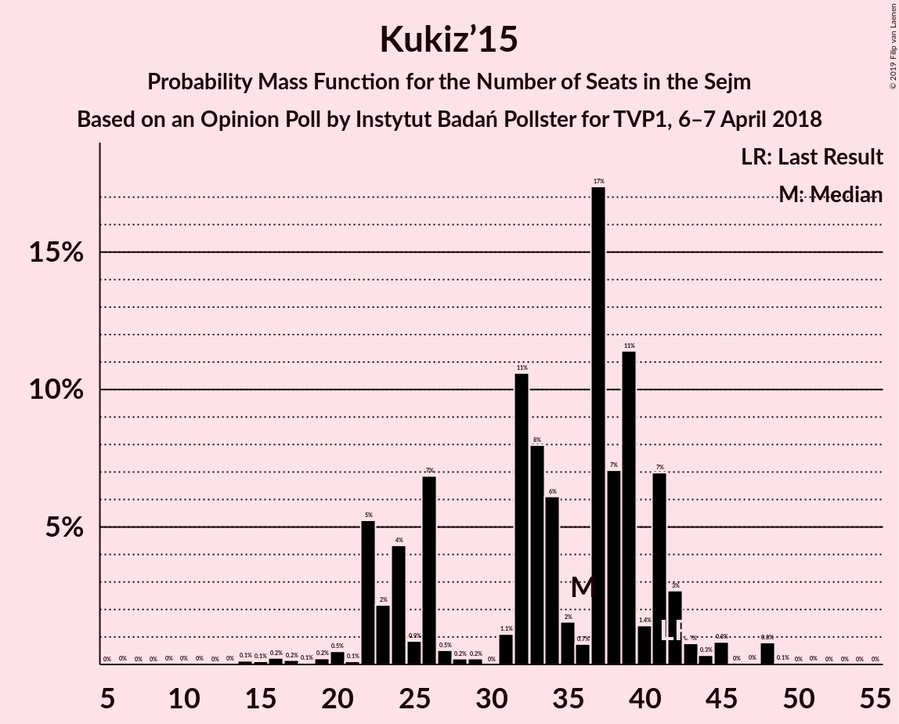

| Number of Seats | Probability | Accumulated | Special Marks |
|:---------------:|:-----------:|:-----------:|:-------------:|
| 21 | 0.3% | 100% |  |
| 22 | 0% | 99.6% |  |
| 23 | 0% | 99.6% |  |
| 24 | 0% | 99.6% |  |
| 25 | 0% | 99.6% |  |
| 26 | 0% | 99.6% |  |
| 27 | 0% | 99.6% |  |
| 28 | 0% | 99.6% |  |
| 29 | 0.1% | 99.6% |  |
| 30 | 0% | 99.4% |  |
| 31 | 0% | 99.4% |  |
| 32 | 0% | 99.4% |  |
| 33 | 0% | 99.4% |  |
| 34 | 93% | 99.4% | Median |
| 35 | 2% | 6% |  |
| 36 | 0% | 4% |  |
| 37 | 0% | 4% |  |
| 38 | 0% | 4% |  |
| 39 | 0.4% | 4% |  |
| 40 | 0% | 4% |  |
| 41 | 3% | 4% |  |
| 42 | 0% | 0.7% | Last Result |
| 43 | 0% | 0.6% |  |
| 44 | 0% | 0.6% |  |
| 45 | 0.5% | 0.6% |  |
| 46 | 0% | 0.1% |  |
| 47 | 0.1% | 0.1% |  |
| 48 | 0% | 0% |  |

### .Nowoczesna

*For a full overview of the results for this party, see the [.Nowoczesna](party-nowoczesna.html) page.*

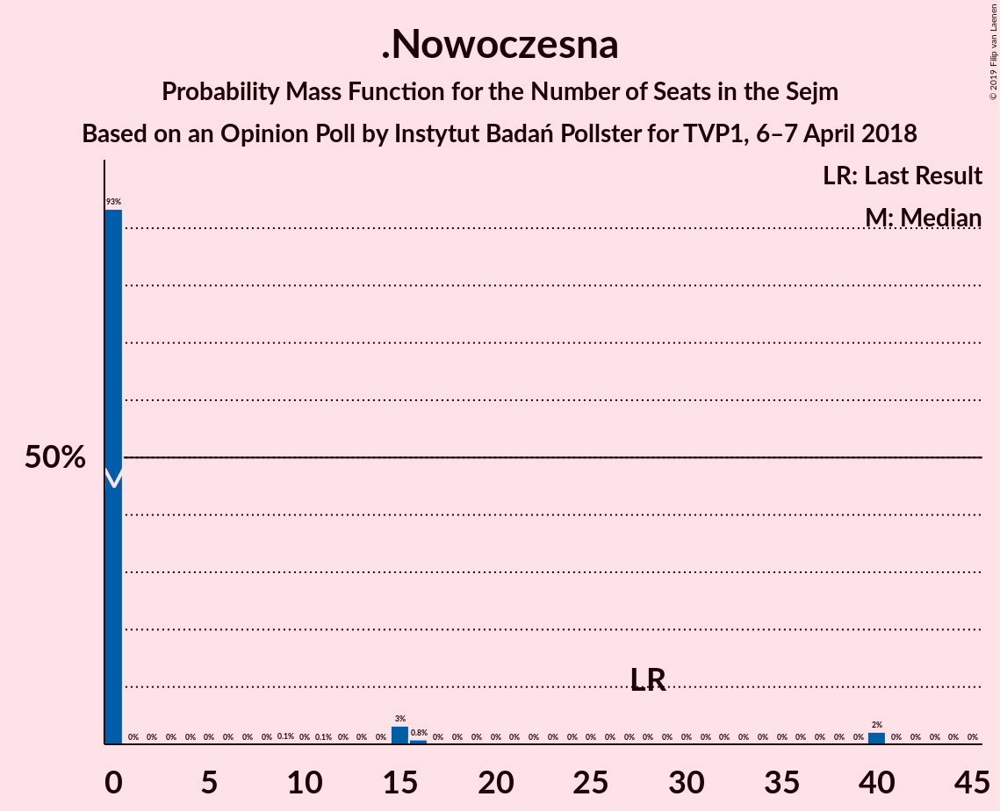

| Number of Seats | Probability | Accumulated | Special Marks |
|:---------------:|:-----------:|:-----------:|:-------------:|
| 0 | 93% | 100% | Median |
| 1 | 0% | 7% |  |
| 2 | 0% | 7% |  |
| 3 | 0% | 7% |  |
| 4 | 0% | 7% |  |
| 5 | 0% | 7% |  |
| 6 | 0% | 7% |  |
| 7 | 0% | 7% |  |
| 8 | 0% | 7% |  |
| 9 | 0.1% | 7% |  |
| 10 | 0% | 7% |  |
| 11 | 0.1% | 6% |  |
| 12 | 0% | 6% |  |
| 13 | 0% | 6% |  |
| 14 | 0% | 6% |  |
| 15 | 3% | 6% |  |
| 16 | 0.8% | 3% |  |
| 17 | 0% | 2% |  |
| 18 | 0% | 2% |  |
| 19 | 0% | 2% |  |
| 20 | 0% | 2% |  |
| 21 | 0% | 2% |  |
| 22 | 0% | 2% |  |
| 23 | 0% | 2% |  |
| 24 | 0% | 2% |  |
| 25 | 0% | 2% |  |
| 26 | 0% | 2% |  |
| 27 | 0% | 2% |  |
| 28 | 0% | 2% | Last Result |
| 29 | 0% | 2% |  |
| 30 | 0% | 2% |  |
| 31 | 0% | 2% |  |
| 32 | 0% | 2% |  |
| 33 | 0% | 2% |  |
| 34 | 0% | 2% |  |
| 35 | 0% | 2% |  |
| 36 | 0% | 2% |  |
| 37 | 0% | 2% |  |
| 38 | 0% | 2% |  |
| 39 | 0% | 2% |  |
| 40 | 2% | 2% |  |
| 41 | 0% | 0% |  |

### Polskie Stronnictwo Ludowe

*For a full overview of the results for this party, see the [Polskie Stronnictwo Ludowe](party-polskiestronnictwoludowe.html) page.*

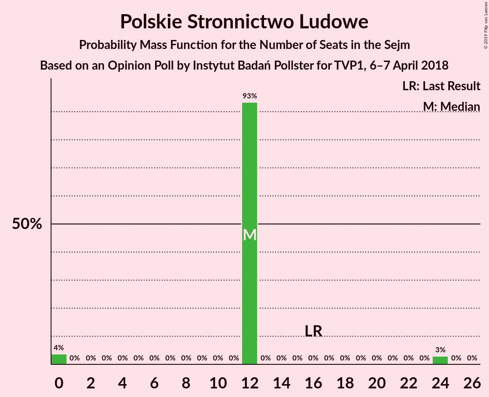

| Number of Seats | Probability | Accumulated | Special Marks |
|:---------------:|:-----------:|:-----------:|:-------------:|
| 0 | 4% | 100% |  |
| 1 | 0% | 96% |  |
| 2 | 0% | 96% |  |
| 3 | 0% | 96% |  |
| 4 | 0% | 96% |  |
| 5 | 0% | 96% |  |
| 6 | 0% | 96% |  |
| 7 | 0% | 96% |  |
| 8 | 0% | 96% |  |
| 9 | 0% | 96% |  |
| 10 | 0% | 96% |  |
| 11 | 0% | 96% |  |
| 12 | 93% | 96% | Median |
| 13 | 0% | 3% |  |
| 14 | 0% | 3% |  |
| 15 | 0% | 3% |  |
| 16 | 0% | 3% | Last Result |
| 17 | 0% | 3% |  |
| 18 | 0% | 3% |  |
| 19 | 0% | 3% |  |
| 20 | 0% | 3% |  |
| 21 | 0% | 3% |  |
| 22 | 0% | 3% |  |
| 23 | 0% | 3% |  |
| 24 | 3% | 3% |  |
| 25 | 0% | 0% |  |

### KORWiN

*For a full overview of the results for this party, see the [KORWiN](party-korwin.html) page.*

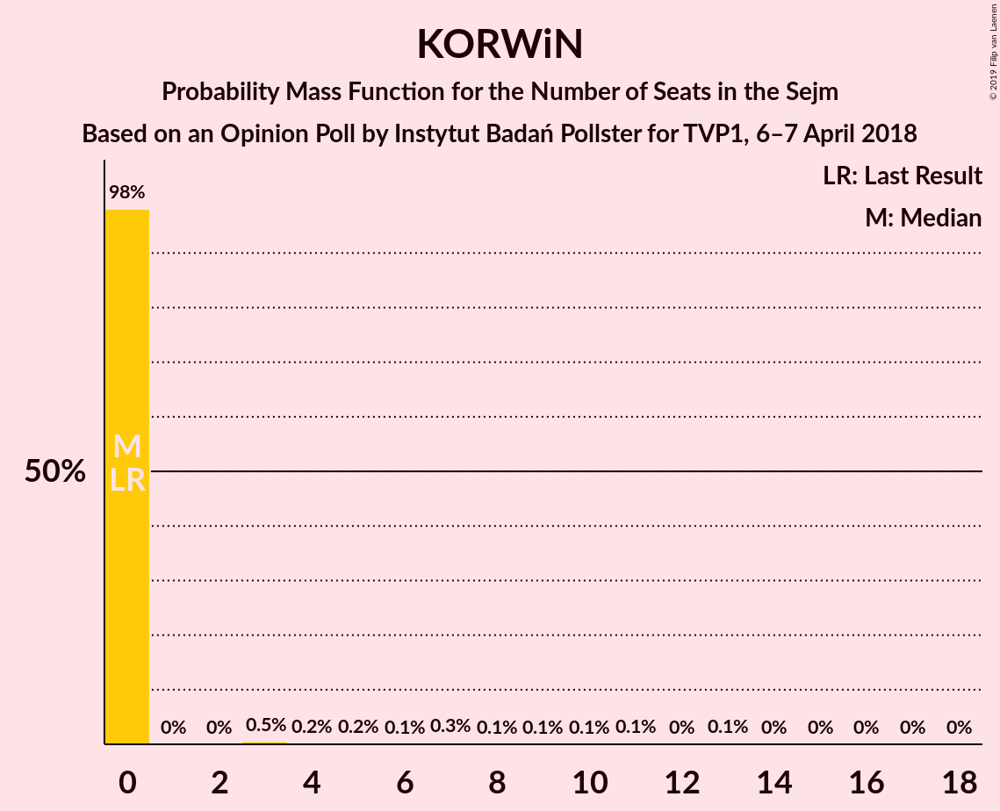

| Number of Seats | Probability | Accumulated | Special Marks |
|:---------------:|:-----------:|:-----------:|:-------------:|
| 0 | 100% | 100% | Last Result, Median |

### Lewica Razem

*For a full overview of the results for this party, see the [Lewica Razem](party-lewicarazem.html) page.*

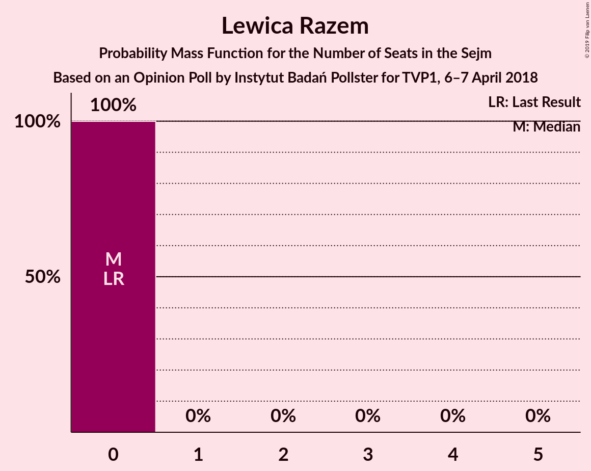

| Number of Seats | Probability | Accumulated | Special Marks |
|:---------------:|:-----------:|:-----------:|:-------------:|
| 0 | 99.7% | 100% | Last Result, Median |
| 1 | 0% | 0.3% |  |
| 2 | 0% | 0.3% |  |
| 3 | 0.3% | 0.3% |  |
| 4 | 0% | 0% |  |

## Coalitions

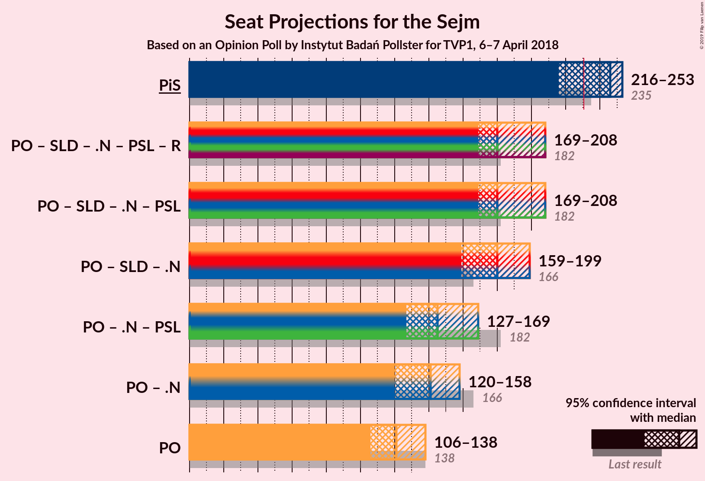

### Confidence Intervals

| Coalition | Last Result | Median | Majority? | 80% Confidence Interval | 90% Confidence Interval | 95% Confidence Interval | 99% Confidence Interval |
|:---------:|:-----------:|:------:|:---------:|:-----------------------:|:-----------------------:|:-----------------------:|:-----------------------:|
| Prawo i Sprawiedliwość | 235 | 251 | 98% | 251 | 240–251 | 234–251 | 223–251 |
| Platforma Obywatelska – Sojusz Lewicy Demokratycznej – .Nowoczesna – Polskie Stronnictwo Ludowe – Lewica Razem | 182 | 175 | 0% | 175 | 175–179 | 175–202 | 175–202 |
| Platforma Obywatelska – Sojusz Lewicy Demokratycznej – .Nowoczesna – Polskie Stronnictwo Ludowe | 182 | 175 | 0% | 175 | 175–179 | 175–201 | 175–202 |
| Platforma Obywatelska – Sojusz Lewicy Demokratycznej – .Nowoczesna | 166 | 163 | 0% | 163 | 163 | 155–201 | 155–202 |
| Platforma Obywatelska – .Nowoczesna – Polskie Stronnictwo Ludowe | 182 | 128 | 0% | 128 | 128–142 | 128–163 | 128–163 |
| Platforma Obywatelska – .Nowoczesna | 166 | 116 | 0% | 116 | 116–118 | 116–163 | 116–163 |
| Platforma Obywatelska | 138 | 116 | 0% | 116 | 116 | 103–123 | 103–138 |

### Prawo i Sprawiedliwość

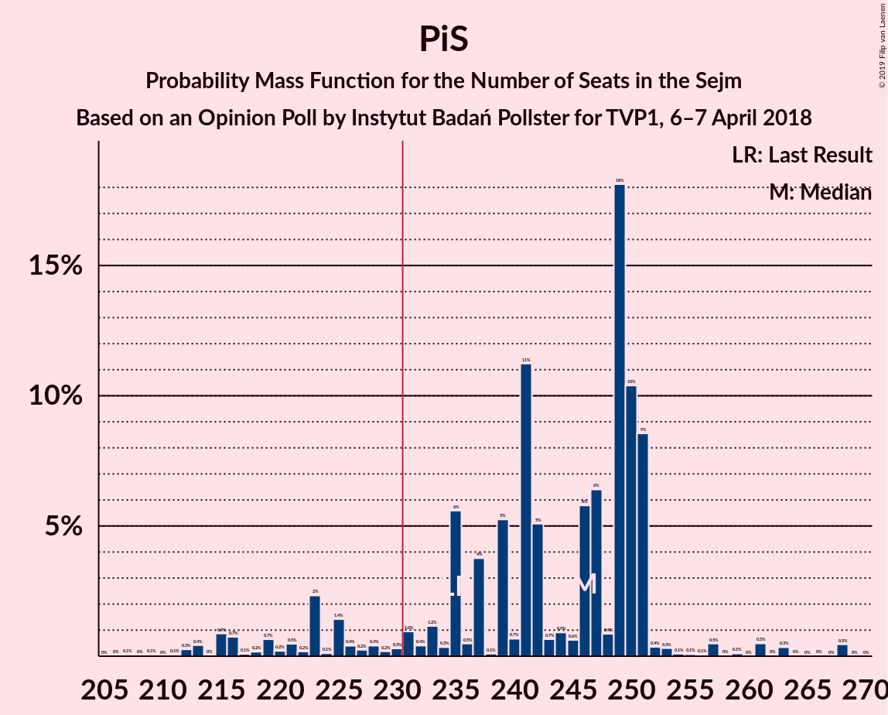

| Number of Seats | Probability | Accumulated | Special Marks |
|:---------------:|:-----------:|:-----------:|:-------------:|
| 213 | 0.1% | 100% |  |
| 214 | 0% | 99.9% |  |
| 215 | 0% | 99.9% |  |
| 216 | 0% | 99.9% |  |
| 217 | 0% | 99.9% |  |
| 218 | 0% | 99.9% |  |
| 219 | 0% | 99.9% |  |
| 220 | 0% | 99.9% |  |
| 221 | 0% | 99.9% |  |
| 222 | 0% | 99.9% |  |
| 223 | 2% | 99.9% |  |
| 224 | 0% | 98% |  |
| 225 | 0% | 98% |  |
| 226 | 0% | 98% |  |
| 227 | 0% | 98% |  |
| 228 | 0% | 98% |  |
| 229 | 0% | 98% |  |
| 230 | 0% | 98% |  |
| 231 | 0% | 98% | Majority |
| 232 | 0% | 98% |  |
| 233 | 0% | 98% |  |
| 234 | 0.5% | 98% |  |
| 235 | 0.3% | 97% | Last Result |
| 236 | 0% | 97% |  |
| 237 | 0% | 97% |  |
| 238 | 0% | 97% |  |
| 239 | 0% | 97% |  |
| 240 | 3% | 97% |  |
| 241 | 0% | 94% |  |
| 242 | 0% | 94% |  |
| 243 | 0.4% | 94% |  |
| 244 | 0% | 94% |  |
| 245 | 0% | 94% |  |
| 246 | 0% | 94% |  |
| 247 | 0% | 94% |  |
| 248 | 0% | 94% |  |
| 249 | 0% | 94% |  |
| 250 | 0% | 94% |  |
| 251 | 93% | 94% | Median |
| 252 | 0% | 0.2% |  |
| 253 | 0% | 0.2% |  |
| 254 | 0% | 0.2% |  |
| 255 | 0% | 0.2% |  |
| 256 | 0% | 0.2% |  |
| 257 | 0% | 0.2% |  |
| 258 | 0% | 0.2% |  |
| 259 | 0% | 0.2% |  |
| 260 | 0% | 0.2% |  |
| 261 | 0% | 0.2% |  |
| 262 | 0% | 0.2% |  |
| 263 | 0% | 0.1% |  |
| 264 | 0% | 0.1% |  |
| 265 | 0% | 0.1% |  |
| 266 | 0% | 0.1% |  |
| 267 | 0% | 0.1% |  |
| 268 | 0% | 0.1% |  |
| 269 | 0% | 0.1% |  |
| 270 | 0% | 0.1% |  |
| 271 | 0% | 0.1% |  |
| 272 | 0.1% | 0.1% |  |
| 273 | 0% | 0% |  |

### Platforma Obywatelska – Sojusz Lewicy Demokratycznej – .Nowoczesna – Polskie Stronnictwo Ludowe – Lewica Razem

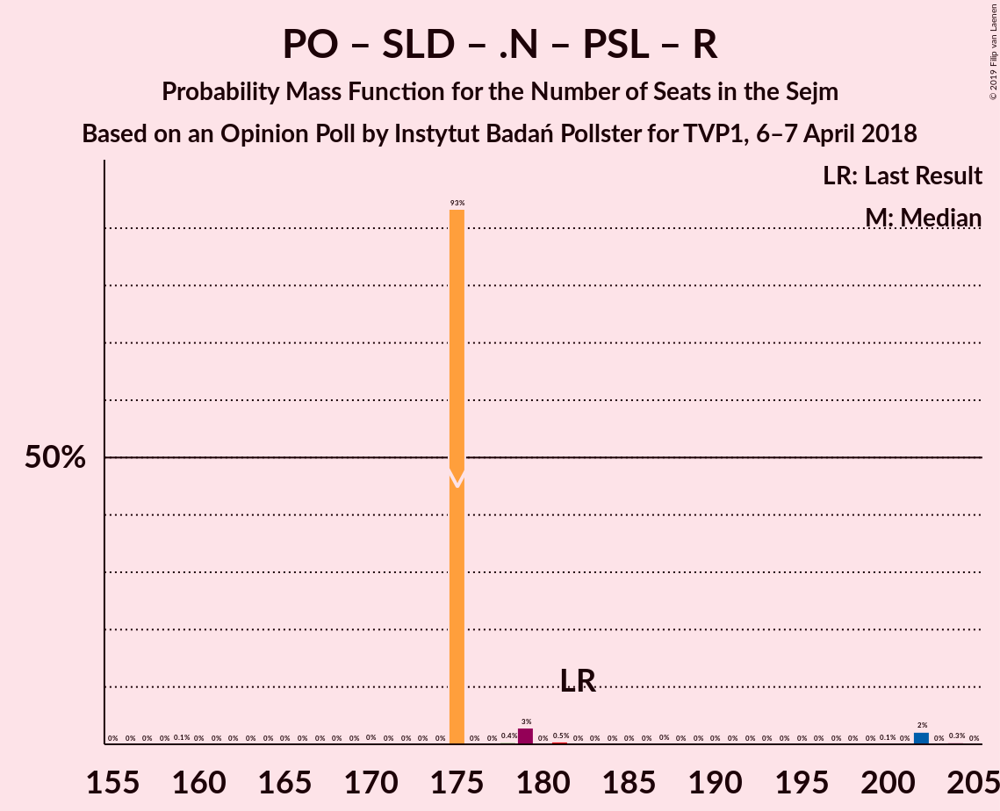

| Number of Seats | Probability | Accumulated | Special Marks |
|:---------------:|:-----------:|:-----------:|:-------------:|
| 159 | 0.1% | 100% |  |
| 160 | 0% | 99.9% |  |
| 161 | 0% | 99.9% |  |
| 162 | 0% | 99.9% |  |
| 163 | 0% | 99.9% |  |
| 164 | 0% | 99.9% |  |
| 165 | 0% | 99.9% |  |
| 166 | 0% | 99.9% |  |
| 167 | 0% | 99.9% |  |
| 168 | 0% | 99.9% |  |
| 169 | 0% | 99.9% |  |
| 170 | 0% | 99.9% |  |
| 171 | 0% | 99.8% |  |
| 172 | 0% | 99.8% |  |
| 173 | 0% | 99.8% |  |
| 174 | 0% | 99.8% |  |
| 175 | 93% | 99.8% | Median |
| 176 | 0% | 6% |  |
| 177 | 0% | 6% |  |
| 178 | 0.4% | 6% |  |
| 179 | 3% | 6% |  |
| 180 | 0% | 3% |  |
| 181 | 0.5% | 3% |  |
| 182 | 0% | 3% | Last Result |
| 183 | 0% | 3% |  |
| 184 | 0% | 3% |  |
| 185 | 0% | 3% |  |
| 186 | 0% | 3% |  |
| 187 | 0% | 3% |  |
| 188 | 0% | 3% |  |
| 189 | 0% | 3% |  |
| 190 | 0% | 3% |  |
| 191 | 0% | 3% |  |
| 192 | 0% | 3% |  |
| 193 | 0% | 3% |  |
| 194 | 0% | 3% |  |
| 195 | 0% | 3% |  |
| 196 | 0% | 3% |  |
| 197 | 0% | 3% |  |
| 198 | 0% | 3% |  |
| 199 | 0% | 3% |  |
| 200 | 0.1% | 3% |  |
| 201 | 0% | 3% |  |
| 202 | 2% | 3% |  |
| 203 | 0% | 0.4% |  |
| 204 | 0.3% | 0.4% |  |
| 205 | 0% | 0% |  |

### Platforma Obywatelska – Sojusz Lewicy Demokratycznej – .Nowoczesna – Polskie Stronnictwo Ludowe

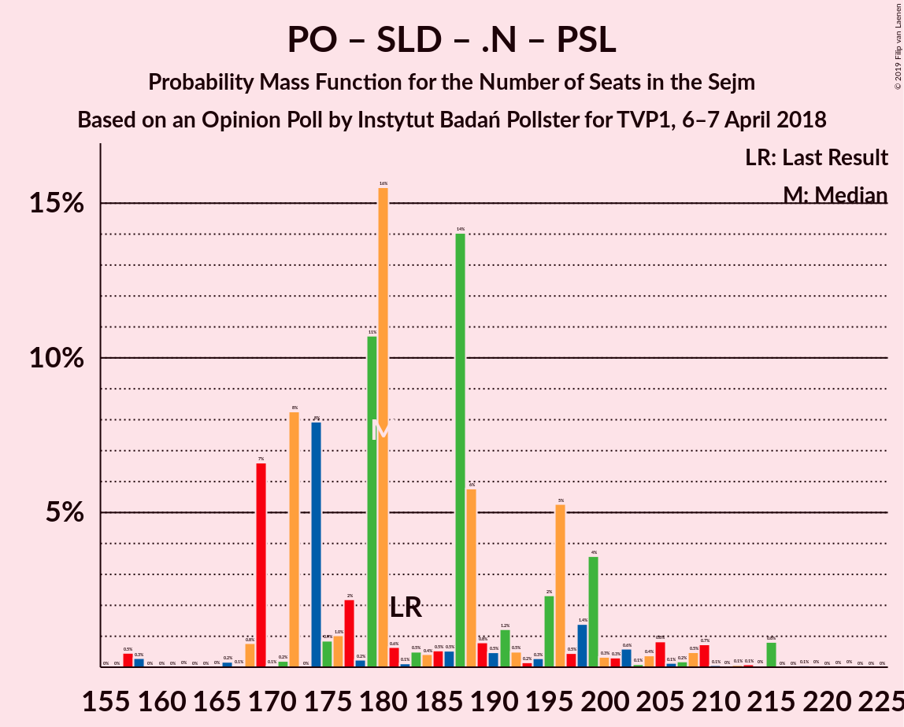

| Number of Seats | Probability | Accumulated | Special Marks |
|:---------------:|:-----------:|:-----------:|:-------------:|
| 159 | 0.1% | 100% |  |
| 160 | 0% | 99.9% |  |
| 161 | 0% | 99.9% |  |
| 162 | 0% | 99.9% |  |
| 163 | 0% | 99.9% |  |
| 164 | 0% | 99.9% |  |
| 165 | 0% | 99.9% |  |
| 166 | 0% | 99.9% |  |
| 167 | 0% | 99.9% |  |
| 168 | 0% | 99.9% |  |
| 169 | 0% | 99.9% |  |
| 170 | 0% | 99.9% |  |
| 171 | 0% | 99.8% |  |
| 172 | 0% | 99.8% |  |
| 173 | 0% | 99.8% |  |
| 174 | 0% | 99.8% |  |
| 175 | 93% | 99.8% | Median |
| 176 | 0% | 6% |  |
| 177 | 0% | 6% |  |
| 178 | 0.4% | 6% |  |
| 179 | 3% | 6% |  |
| 180 | 0% | 3% |  |
| 181 | 0.5% | 3% |  |
| 182 | 0% | 3% | Last Result |
| 183 | 0% | 3% |  |
| 184 | 0% | 3% |  |
| 185 | 0% | 3% |  |
| 186 | 0% | 3% |  |
| 187 | 0% | 3% |  |
| 188 | 0% | 3% |  |
| 189 | 0% | 3% |  |
| 190 | 0% | 3% |  |
| 191 | 0% | 3% |  |
| 192 | 0% | 3% |  |
| 193 | 0% | 3% |  |
| 194 | 0% | 3% |  |
| 195 | 0% | 3% |  |
| 196 | 0% | 3% |  |
| 197 | 0% | 3% |  |
| 198 | 0% | 3% |  |
| 199 | 0% | 3% |  |
| 200 | 0.1% | 3% |  |
| 201 | 0.3% | 3% |  |
| 202 | 2% | 2% |  |
| 203 | 0% | 0% |  |

### Platforma Obywatelska – Sojusz Lewicy Demokratycznej – .Nowoczesna

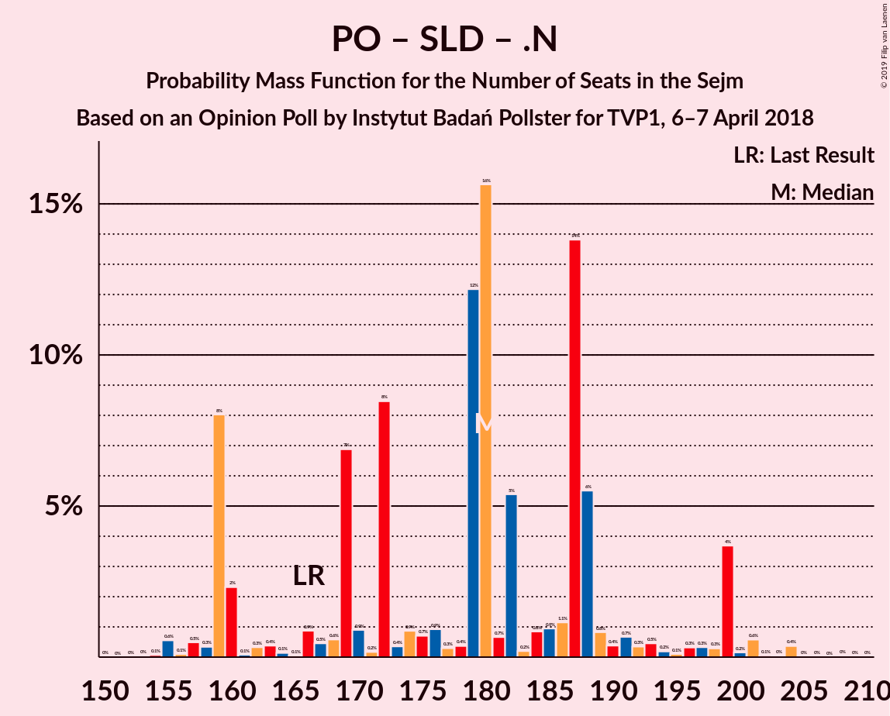

| Number of Seats | Probability | Accumulated | Special Marks |
|:---------------:|:-----------:|:-----------:|:-------------:|
| 155 | 3% | 100% |  |
| 156 | 0% | 97% |  |
| 157 | 0% | 97% |  |
| 158 | 0% | 97% |  |
| 159 | 0.1% | 97% |  |
| 160 | 0% | 97% |  |
| 161 | 0% | 97% |  |
| 162 | 0% | 97% |  |
| 163 | 93% | 97% | Median |
| 164 | 0% | 4% |  |
| 165 | 0% | 4% |  |
| 166 | 0% | 4% | Last Result |
| 167 | 0% | 4% |  |
| 168 | 0% | 4% |  |
| 169 | 0% | 4% |  |
| 170 | 0% | 4% |  |
| 171 | 0% | 4% |  |
| 172 | 0% | 4% |  |
| 173 | 0% | 4% |  |
| 174 | 0% | 4% |  |
| 175 | 0% | 4% |  |
| 176 | 0% | 4% |  |
| 177 | 0% | 4% |  |
| 178 | 0.4% | 4% |  |
| 179 | 0% | 3% |  |
| 180 | 0% | 3% |  |
| 181 | 0.5% | 3% |  |
| 182 | 0% | 3% |  |
| 183 | 0% | 3% |  |
| 184 | 0% | 3% |  |
| 185 | 0% | 3% |  |
| 186 | 0% | 3% |  |
| 187 | 0% | 3% |  |
| 188 | 0% | 3% |  |
| 189 | 0% | 3% |  |
| 190 | 0% | 3% |  |
| 191 | 0% | 3% |  |
| 192 | 0% | 3% |  |
| 193 | 0% | 3% |  |
| 194 | 0% | 3% |  |
| 195 | 0% | 3% |  |
| 196 | 0% | 3% |  |
| 197 | 0% | 3% |  |
| 198 | 0% | 3% |  |
| 199 | 0% | 3% |  |
| 200 | 0.1% | 3% |  |
| 201 | 0.3% | 3% |  |
| 202 | 2% | 2% |  |
| 203 | 0% | 0% |  |

### Platforma Obywatelska – .Nowoczesna – Polskie Stronnictwo Ludowe

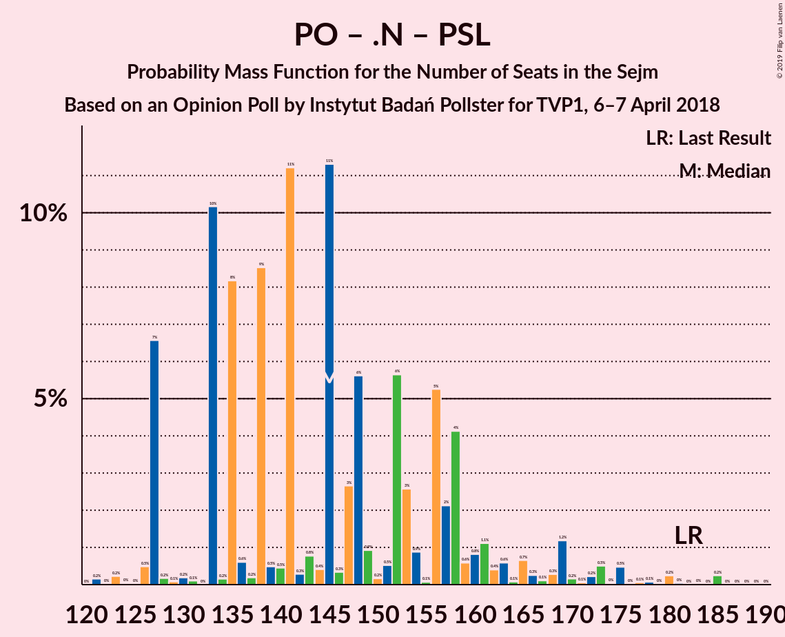

| Number of Seats | Probability | Accumulated | Special Marks |
|:---------------:|:-----------:|:-----------:|:-------------:|
| 127 | 0.4% | 100% |  |
| 128 | 93% | 99.6% | Median |
| 129 | 0% | 6% |  |
| 130 | 0.1% | 6% |  |
| 131 | 0% | 6% |  |
| 132 | 0% | 6% |  |
| 133 | 0% | 6% |  |
| 134 | 0% | 6% |  |
| 135 | 0% | 6% |  |
| 136 | 0% | 6% |  |
| 137 | 0% | 6% |  |
| 138 | 0% | 6% |  |
| 139 | 0% | 6% |  |
| 140 | 0% | 6% |  |
| 141 | 0% | 6% |  |
| 142 | 3% | 6% |  |
| 143 | 0% | 3% |  |
| 144 | 0% | 3% |  |
| 145 | 0% | 3% |  |
| 146 | 0% | 3% |  |
| 147 | 0% | 3% |  |
| 148 | 0% | 3% |  |
| 149 | 0% | 3% |  |
| 150 | 0% | 3% |  |
| 151 | 0% | 3% |  |
| 152 | 0% | 3% |  |
| 153 | 0% | 3% |  |
| 154 | 0.5% | 3% |  |
| 155 | 0% | 3% |  |
| 156 | 0% | 3% |  |
| 157 | 0% | 3% |  |
| 158 | 0% | 3% |  |
| 159 | 0% | 3% |  |
| 160 | 0.1% | 3% |  |
| 161 | 0% | 3% |  |
| 162 | 0% | 3% |  |
| 163 | 3% | 3% |  |
| 164 | 0% | 0.1% |  |
| 165 | 0% | 0.1% |  |
| 166 | 0% | 0% |  |
| 167 | 0% | 0% |  |
| 168 | 0% | 0% |  |
| 169 | 0% | 0% |  |
| 170 | 0% | 0% |  |
| 171 | 0% | 0% |  |
| 172 | 0% | 0% |  |
| 173 | 0% | 0% |  |
| 174 | 0% | 0% |  |
| 175 | 0% | 0% |  |
| 176 | 0% | 0% |  |
| 177 | 0% | 0% |  |
| 178 | 0% | 0% |  |
| 179 | 0% | 0% |  |
| 180 | 0% | 0% |  |
| 181 | 0% | 0% |  |
| 182 | 0% | 0% | Last Result |

### Platforma Obywatelska – .Nowoczesna

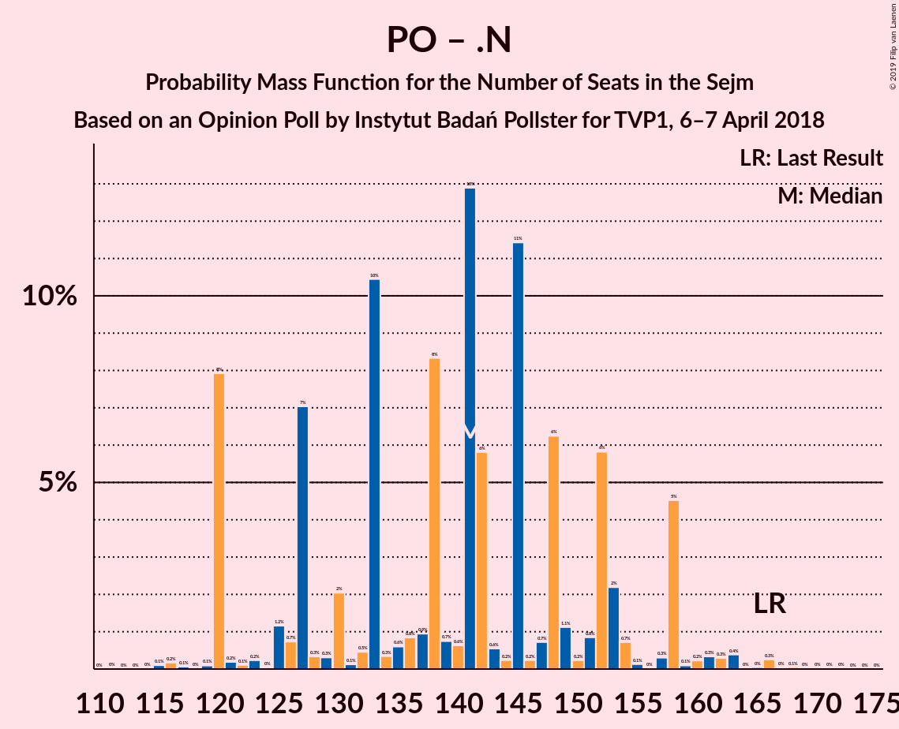

| Number of Seats | Probability | Accumulated | Special Marks |
|:---------------:|:-----------:|:-----------:|:-------------:|
| 116 | 93% | 100% | Median |
| 117 | 0% | 7% |  |
| 118 | 3% | 7% |  |
| 119 | 0% | 4% |  |
| 120 | 0% | 4% |  |
| 121 | 0% | 4% |  |
| 122 | 0% | 4% |  |
| 123 | 0% | 4% |  |
| 124 | 0% | 4% |  |
| 125 | 0% | 4% |  |
| 126 | 0% | 4% |  |
| 127 | 0.4% | 4% |  |
| 128 | 0% | 3% |  |
| 129 | 0% | 3% |  |
| 130 | 0.1% | 3% |  |
| 131 | 0% | 3% |  |
| 132 | 0% | 3% |  |
| 133 | 0% | 3% |  |
| 134 | 0% | 3% |  |
| 135 | 0% | 3% |  |
| 136 | 0% | 3% |  |
| 137 | 0% | 3% |  |
| 138 | 0% | 3% |  |
| 139 | 0% | 3% |  |
| 140 | 0% | 3% |  |
| 141 | 0% | 3% |  |
| 142 | 0% | 3% |  |
| 143 | 0% | 3% |  |
| 144 | 0% | 3% |  |
| 145 | 0% | 3% |  |
| 146 | 0% | 3% |  |
| 147 | 0% | 3% |  |
| 148 | 0% | 3% |  |
| 149 | 0% | 3% |  |
| 150 | 0% | 3% |  |
| 151 | 0% | 3% |  |
| 152 | 0% | 3% |  |
| 153 | 0% | 3% |  |
| 154 | 0.5% | 3% |  |
| 155 | 0% | 3% |  |
| 156 | 0% | 3% |  |
| 157 | 0% | 3% |  |
| 158 | 0% | 3% |  |
| 159 | 0% | 3% |  |
| 160 | 0.1% | 3% |  |
| 161 | 0% | 3% |  |
| 162 | 0% | 3% |  |
| 163 | 3% | 3% |  |
| 164 | 0% | 0% |  |
| 165 | 0% | 0% |  |
| 166 | 0% | 0% | Last Result |

### Platforma Obywatelska

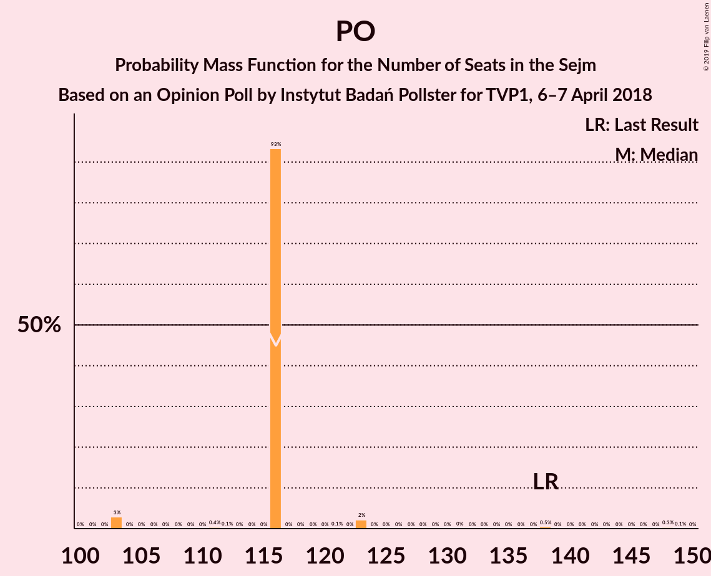

| Number of Seats | Probability | Accumulated | Special Marks |
|:---------------:|:-----------:|:-----------:|:-------------:|
| 103 | 3% | 100% |  |
| 104 | 0% | 97% |  |
| 105 | 0% | 97% |  |
| 106 | 0% | 97% |  |
| 107 | 0% | 97% |  |
| 108 | 0% | 97% |  |
| 109 | 0% | 97% |  |
| 110 | 0% | 97% |  |
| 111 | 0.4% | 97% |  |
| 112 | 0.1% | 97% |  |
| 113 | 0% | 97% |  |
| 114 | 0% | 97% |  |
| 115 | 0% | 97% |  |
| 116 | 93% | 97% | Median |
| 117 | 0% | 3% |  |
| 118 | 0% | 3% |  |
| 119 | 0% | 3% |  |
| 120 | 0% | 3% |  |
| 121 | 0.1% | 3% |  |
| 122 | 0% | 3% |  |
| 123 | 2% | 3% |  |
| 124 | 0% | 1.0% |  |
| 125 | 0% | 1.0% |  |
| 126 | 0% | 1.0% |  |
| 127 | 0% | 1.0% |  |
| 128 | 0% | 1.0% |  |
| 129 | 0% | 1.0% |  |
| 130 | 0% | 1.0% |  |
| 131 | 0% | 1.0% |  |
| 132 | 0% | 0.9% |  |
| 133 | 0% | 0.9% |  |
| 134 | 0% | 0.9% |  |
| 135 | 0% | 0.9% |  |
| 136 | 0% | 0.9% |  |
| 137 | 0% | 0.9% |  |
| 138 | 0.5% | 0.9% | Last Result |
| 139 | 0% | 0.5% |  |
| 140 | 0% | 0.5% |  |
| 141 | 0% | 0.5% |  |
| 142 | 0% | 0.5% |  |
| 143 | 0% | 0.5% |  |
| 144 | 0% | 0.5% |  |
| 145 | 0% | 0.5% |  |
| 146 | 0% | 0.5% |  |
| 147 | 0% | 0.5% |  |
| 148 | 0.3% | 0.5% |  |
| 149 | 0.1% | 0.1% |  |
| 150 | 0% | 0% |  |

## Technical Information

### Opinion Poll

+ **Polling firm:** Instytut Badań Pollster
+ **Commissioner(s):** TVP1
+ **Fieldwork period:** 6–7 April 2018

### Calculations

+ **Sample size:** 1023
+ **Simulations done:** 1,024
+ **Error estimate:** 2.10%

