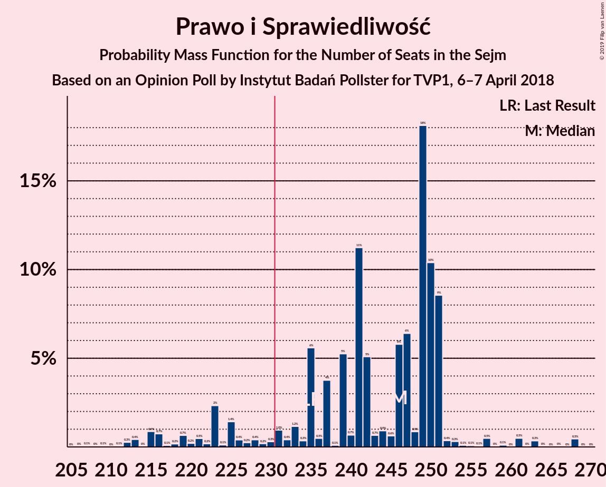
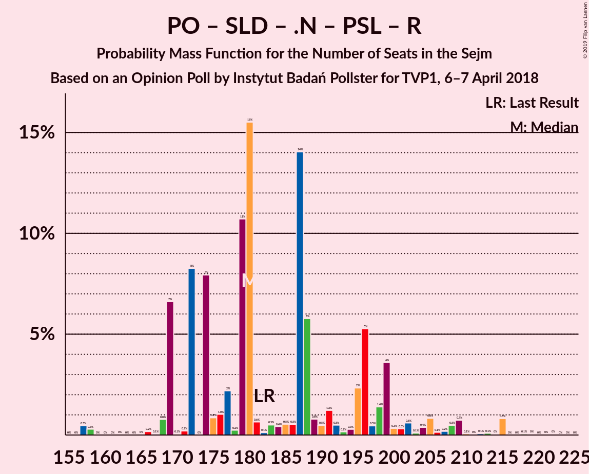

# Opinion Poll by Instytut Badań Pollster for TVP1, 6–7 April 2018

<a href="#voting-intentions">Voting Intentions</a> | <a href="#seats">Seats</a> | <a href="#coalitions">Coalitions</a> | <a href="#technical-information">Technical Information</a>

## Voting Intentions

### Confidence Intervals

| Party | Last Result | Poll Result | 80% Confidence Interval | 90% Confidence Interval | 95% Confidence Interval | 99% Confidence Interval |
|:-----:|:-----------:|:-----------:|:-----------------------:|:-----------------------:|:-----------------------:|:-----------------------:|
| Prawo i Sprawiedliwość | 37.6% | 40.9% | 38.9–42.9% |38.4–43.4% |37.9–43.9% |37.0–44.9% |
| Platforma Obywatelska | 24.1% | 23.0% | 21.3–24.7% |20.9–25.2% |20.5–25.7% |19.7–26.5% |
| Sojusz Lewicy Demokratycznej | 7.6% | 9.0% | 7.9–10.2% |7.6–10.6% |7.4–10.9% |6.9–11.5% |
| Kukiz’15 | 8.8% | 8.0% | 7.0–9.2% |6.7–9.6% |6.5–9.8% |6.1–10.5% |
| .Nowoczesna | 7.6% | 6.9% | 6.0–8.1% |5.8–8.4% |5.5–8.7% |5.1–9.2% |
| Polskie Stronnictwo Ludowe | 5.1% | 5.0% | 4.2–6.0% |4.0–6.2% |3.8–6.5% |3.5–7.0% |
| KORWiN | 4.8% | 4.0% | 3.3–4.9% |3.1–5.2% |3.0–5.4% |2.7–5.9% |
| Lewica Razem | 3.6% | 3.0% | 2.4–3.8% |2.3–4.1% |2.1–4.3% |1.9–4.7% |

*Note:* The poll result column reflects the actual value used in the calculations. Published results may vary slightly, and in addition be rounded to fewer digits.

## Seats

### Confidence Intervals

| Party | Last Result | Median | 80% Confidence Interval | 90% Confidence Interval | 95% Confidence Interval | 99% Confidence Interval |
|:-----:|:-----------:|:------:|:-----------------------:|:-----------------------:|:-----------------------:|:-----------------------:|
| <a href="#prawo-i-sprawiedliwość">Prawo i Sprawiedliwość</a> | 235 | 246 | 231–251 |223–251 |216–253 |212–264 |
| <a href="#platforma-obywatelska">Platforma Obywatelska</a> | 138 | 121 | 107–132 |107–135 |106–138 |104–142 |
| <a href="#sojusz-lewicy-demokratycznej">Sojusz Lewicy Demokratycznej</a> | 0 | 39 | 32–46 |30–46 |29–46 |24–51 |
| <a href="#kukiz’15">Kukiz’15</a> | 42 | 36 | 24–41 |22–42 |22–43 |16–48 |
| <a href="#.nowoczesna">.Nowoczesna</a> | 28 | 16 | 13–28 |12–29 |11–29 |8–34 |
| <a href="#polskie-stronnictwo-ludowe">Polskie Stronnictwo Ludowe</a> | 16 | 0 | 0–16 |0–19 |0–23 |0–26 |
| <a href="#korwin">KORWiN</a> | 0 | 0 | 0 |0 |0 |0–9 |
| <a href="#lewica-razem">Lewica Razem</a> | 0 | 0 | 0 |0 |0 |0 |

### Prawo i Sprawiedliwość

*For a full overview of the results for this party, see the [Prawo i Sprawiedliwość](party-prawoisprawiedliwość.html) page.*

| Number of Seats | Probability | Accumulated | Special Marks |
|:---------------:|:-----------:|:-----------:|:-------------:|
| 205 | 0% | 100% |  |
| 206 | 0% | 99.9% |  |
| 207 | 0.1% | 99.9% |  |
| 208 | 0% | 99.9% |  |
| 209 | 0.1% | 99.8% |  |
| 210 | 0% | 99.8% |  |
| 211 | 0.1% | 99.8% |  |
| 212 | 0.3% | 99.7% |  |
| 213 | 0.4% | 99.5% |  |
| 214 | 0% | 99.0% |  |
| 215 | 0.9% | 99.0% |  |
| 216 | 0.7% | 98% |  |
| 217 | 0.1% | 97% |  |
| 218 | 0.2% | 97% |  |
| 219 | 0.7% | 97% |  |
| 220 | 0.2% | 96% |  |
| 221 | 0.5% | 96% |  |
| 222 | 0.2% | 96% |  |
| 223 | 2% | 96% |  |
| 224 | 0.1% | 93% |  |
| 225 | 1.4% | 93% |  |
| 226 | 0.4% | 92% |  |
| 227 | 0.2% | 91% |  |
| 228 | 0.4% | 91% |  |
| 229 | 0.2% | 91% |  |
| 230 | 0.3% | 91% |  |
| 231 | 1.0% | 90% | Majority |
| 232 | 0.4% | 89% |  |
| 233 | 1.2% | 89% |  |
| 234 | 0.3% | 88% |  |
| 235 | 6% | 87% | Last Result |
| 236 | 0.5% | 82% |  |
| 237 | 4% | 81% |  |
| 238 | 0.1% | 78% |  |
| 239 | 5% | 77% |  |
| 240 | 0.7% | 72% |  |
| 241 | 11% | 72% |  |
| 242 | 5% | 60% |  |
| 243 | 0.7% | 55% |  |
| 244 | 0.9% | 55% |  |
| 245 | 0.6% | 54% |  |
| 246 | 6% | 53% | Median |
| 247 | 6% | 47% |  |
| 248 | 0.9% | 41% |  |
| 249 | 18% | 40% |  |
| 250 | 10% | 22% |  |
| 251 | 9% | 11% |  |
| 252 | 0.4% | 3% |  |
| 253 | 0.3% | 3% |  |
| 254 | 0.1% | 2% |  |
| 255 | 0.1% | 2% |  |
| 256 | 0.1% | 2% |  |
| 257 | 0.5% | 2% |  |
| 258 | 0% | 1.5% |  |
| 259 | 0.1% | 1.5% |  |
| 260 | 0% | 1.4% |  |
| 261 | 0.5% | 1.4% |  |
| 262 | 0% | 0.9% |  |
| 263 | 0.3% | 0.9% |  |
| 264 | 0% | 0.5% |  |
| 265 | 0% | 0.5% |  |
| 266 | 0% | 0.5% |  |
| 267 | 0% | 0.5% |  |
| 268 | 0.5% | 0.5% |  |
| 269 | 0% | 0% |  |

### Platforma Obywatelska

*For a full overview of the results for this party, see the [Platforma Obywatelska](party-platformaobywatelska.html) page.*

| Number of Seats | Probability | Accumulated | Special Marks |
|:---------------:|:-----------:|:-----------:|:-------------:|
| 98 | 0% | 100% |  |
| 99 | 0% | 99.9% |  |
| 100 | 0.1% | 99.9% |  |
| 101 | 0.1% | 99.8% |  |
| 102 | 0.2% | 99.7% |  |
| 103 | 0% | 99.5% |  |
| 104 | 0.1% | 99.5% |  |
| 105 | 0.8% | 99.4% |  |
| 106 | 2% | 98.6% |  |
| 107 | 8% | 97% |  |
| 108 | 0.1% | 89% |  |
| 109 | 0.5% | 89% |  |
| 110 | 14% | 88% |  |
| 111 | 0.3% | 74% |  |
| 112 | 0.5% | 73% |  |
| 113 | 1.1% | 73% |  |
| 114 | 0.1% | 72% |  |
| 115 | 6% | 72% |  |
| 116 | 0.6% | 66% |  |
| 117 | 0.9% | 65% |  |
| 118 | 12% | 64% |  |
| 119 | 0.6% | 52% |  |
| 120 | 0.7% | 52% |  |
| 121 | 1.3% | 51% | Median |
| 122 | 0.3% | 50% |  |
| 123 | 5% | 49% |  |
| 124 | 0.3% | 44% |  |
| 125 | 7% | 44% |  |
| 126 | 2% | 37% |  |
| 127 | 11% | 35% |  |
| 128 | 0.7% | 24% |  |
| 129 | 9% | 24% |  |
| 130 | 0.1% | 15% |  |
| 131 | 0.5% | 14% |  |
| 132 | 7% | 14% |  |
| 133 | 0.4% | 7% |  |
| 134 | 0.9% | 7% |  |
| 135 | 2% | 6% |  |
| 136 | 0.4% | 4% |  |
| 137 | 0.4% | 4% |  |
| 138 | 2% | 3% | Last Result |
| 139 | 0.7% | 1.3% |  |
| 140 | 0% | 0.6% |  |
| 141 | 0% | 0.6% |  |
| 142 | 0.1% | 0.6% |  |
| 143 | 0.1% | 0.4% |  |
| 144 | 0.2% | 0.4% |  |
| 145 | 0.1% | 0.2% |  |
| 146 | 0% | 0.1% |  |
| 147 | 0% | 0.1% |  |
| 148 | 0% | 0% |  |

### Sojusz Lewicy Demokratycznej

*For a full overview of the results for this party, see the [Sojusz Lewicy Demokratycznej](party-sojuszlewicydemokratycznej.html) page.*

| Number of Seats | Probability | Accumulated | Special Marks |
|:---------------:|:-----------:|:-----------:|:-------------:|
| 0 | 0% | 100% | Last Result |
| 1 | 0% | 100% |  |
| 2 | 0% | 100% |  |
| 3 | 0% | 100% |  |
| 4 | 0% | 100% |  |
| 5 | 0% | 100% |  |
| 6 | 0% | 100% |  |
| 7 | 0% | 100% |  |
| 8 | 0% | 100% |  |
| 9 | 0% | 100% |  |
| 10 | 0% | 100% |  |
| 11 | 0% | 100% |  |
| 12 | 0% | 100% |  |
| 13 | 0% | 100% |  |
| 14 | 0% | 100% |  |
| 15 | 0% | 100% |  |
| 16 | 0% | 100% |  |
| 17 | 0% | 100% |  |
| 18 | 0% | 100% |  |
| 19 | 0% | 100% |  |
| 20 | 0% | 100% |  |
| 21 | 0.1% | 100% |  |
| 22 | 0% | 99.9% |  |
| 23 | 0.4% | 99.9% |  |
| 24 | 0.1% | 99.5% |  |
| 25 | 0.1% | 99.4% |  |
| 26 | 0.1% | 99.4% |  |
| 27 | 0.2% | 99.3% |  |
| 28 | 0.6% | 99.1% |  |
| 29 | 1.3% | 98% |  |
| 30 | 3% | 97% |  |
| 31 | 1.4% | 94% |  |
| 32 | 6% | 92% |  |
| 33 | 1.1% | 87% |  |
| 34 | 10% | 86% |  |
| 35 | 7% | 75% |  |
| 36 | 1.4% | 68% |  |
| 37 | 2% | 67% |  |
| 38 | 3% | 65% |  |
| 39 | 19% | 63% | Median |
| 40 | 7% | 44% |  |
| 41 | 4% | 37% |  |
| 42 | 13% | 33% |  |
| 43 | 6% | 20% |  |
| 44 | 0.7% | 14% |  |
| 45 | 1.1% | 13% |  |
| 46 | 10% | 12% |  |
| 47 | 0.2% | 2% |  |
| 48 | 0.3% | 2% |  |
| 49 | 0.2% | 2% |  |
| 50 | 0.6% | 1.3% |  |
| 51 | 0.3% | 0.7% |  |
| 52 | 0.1% | 0.4% |  |
| 53 | 0.2% | 0.3% |  |
| 54 | 0% | 0.1% |  |
| 55 | 0% | 0.1% |  |
| 56 | 0% | 0.1% |  |
| 57 | 0% | 0.1% |  |
| 58 | 0.1% | 0.1% |  |
| 59 | 0% | 0% |  |

### Kukiz’15

*For a full overview of the results for this party, see the [Kukiz’15](party-kukiz’15.html) page.*

| Number of Seats | Probability | Accumulated | Special Marks |
|:---------------:|:-----------:|:-----------:|:-------------:|
| 9 | 0% | 100% |  |
| 10 | 0% | 99.9% |  |
| 11 | 0% | 99.9% |  |
| 12 | 0% | 99.9% |  |
| 13 | 0% | 99.9% |  |
| 14 | 0.1% | 99.8% |  |
| 15 | 0.1% | 99.7% |  |
| 16 | 0.2% | 99.6% |  |
| 17 | 0.2% | 99.4% |  |
| 18 | 0.1% | 99.2% |  |
| 19 | 0.2% | 99.2% |  |
| 20 | 0.5% | 98.9% |  |
| 21 | 0.1% | 98% |  |
| 22 | 5% | 98% |  |
| 23 | 2% | 93% |  |
| 24 | 4% | 91% |  |
| 25 | 0.9% | 87% |  |
| 26 | 7% | 86% |  |
| 27 | 0.5% | 79% |  |
| 28 | 0.2% | 78% |  |
| 29 | 0.2% | 78% |  |
| 30 | 0% | 78% |  |
| 31 | 1.1% | 78% |  |
| 32 | 11% | 77% |  |
| 33 | 8% | 66% |  |
| 34 | 6% | 58% |  |
| 35 | 2% | 52% |  |
| 36 | 0.7% | 51% | Median |
| 37 | 17% | 50% |  |
| 38 | 7% | 32% |  |
| 39 | 11% | 25% |  |
| 40 | 1.4% | 14% |  |
| 41 | 7% | 13% |  |
| 42 | 3% | 6% | Last Result |
| 43 | 0.8% | 3% |  |
| 44 | 0.3% | 2% |  |
| 45 | 0.8% | 2% |  |
| 46 | 0% | 1.0% |  |
| 47 | 0% | 1.0% |  |
| 48 | 0.8% | 0.9% |  |
| 49 | 0.1% | 0.1% |  |
| 50 | 0% | 0.1% |  |
| 51 | 0% | 0% |  |

### .Nowoczesna

*For a full overview of the results for this party, see the [.Nowoczesna](party-nowoczesna.html) page.*

| Number of Seats | Probability | Accumulated | Special Marks |
|:---------------:|:-----------:|:-----------:|:-------------:|
| 0 | 0.4% | 100% |  |
| 1 | 0% | 99.6% |  |
| 2 | 0% | 99.6% |  |
| 3 | 0% | 99.6% |  |
| 4 | 0% | 99.6% |  |
| 5 | 0% | 99.6% |  |
| 6 | 0% | 99.6% |  |
| 7 | 0% | 99.6% |  |
| 8 | 0.2% | 99.6% |  |
| 9 | 0.4% | 99.4% |  |
| 10 | 0.9% | 99.0% |  |
| 11 | 0.9% | 98% |  |
| 12 | 2% | 97% |  |
| 13 | 17% | 95% |  |
| 14 | 11% | 78% |  |
| 15 | 12% | 67% |  |
| 16 | 6% | 55% | Median |
| 17 | 8% | 49% |  |
| 18 | 0.5% | 42% |  |
| 19 | 1.1% | 41% |  |
| 20 | 0.5% | 40% |  |
| 21 | 0.5% | 40% |  |
| 22 | 2% | 39% |  |
| 23 | 4% | 37% |  |
| 24 | 2% | 33% |  |
| 25 | 6% | 31% |  |
| 26 | 1.1% | 25% |  |
| 27 | 11% | 24% |  |
| 28 | 8% | 13% | Last Result |
| 29 | 4% | 5% |  |
| 30 | 0.1% | 1.1% |  |
| 31 | 0.1% | 1.1% |  |
| 32 | 0.3% | 1.0% |  |
| 33 | 0.1% | 0.7% |  |
| 34 | 0.2% | 0.6% |  |
| 35 | 0.1% | 0.3% |  |
| 36 | 0.1% | 0.2% |  |
| 37 | 0.1% | 0.1% |  |
| 38 | 0% | 0.1% |  |
| 39 | 0% | 0% |  |

### Polskie Stronnictwo Ludowe

*For a full overview of the results for this party, see the [Polskie Stronnictwo Ludowe](party-polskiestronnictwoludowe.html) page.*

| Number of Seats | Probability | Accumulated | Special Marks |
|:---------------:|:-----------:|:-----------:|:-------------:|
| 0 | 71% | 100% | Median |
| 1 | 0% | 29% |  |
| 2 | 0% | 29% |  |
| 3 | 0% | 29% |  |
| 4 | 0% | 29% |  |
| 5 | 0% | 29% |  |
| 6 | 0% | 29% |  |
| 7 | 0% | 29% |  |
| 8 | 0% | 29% |  |
| 9 | 0% | 29% |  |
| 10 | 0% | 29% |  |
| 11 | 0% | 29% |  |
| 12 | 0.2% | 29% |  |
| 13 | 1.0% | 29% |  |
| 14 | 7% | 28% |  |
| 15 | 9% | 21% |  |
| 16 | 3% | 12% | Last Result |
| 17 | 3% | 9% |  |
| 18 | 0.4% | 6% |  |
| 19 | 0.7% | 5% |  |
| 20 | 0.2% | 5% |  |
| 21 | 2% | 5% |  |
| 22 | 0.4% | 3% |  |
| 23 | 0.8% | 3% |  |
| 24 | 1.1% | 2% |  |
| 25 | 0% | 0.7% |  |
| 26 | 0.5% | 0.7% |  |
| 27 | 0.2% | 0.2% |  |
| 28 | 0% | 0% |  |

### KORWiN

*For a full overview of the results for this party, see the [KORWiN](party-korwin.html) page.*

| Number of Seats | Probability | Accumulated | Special Marks |
|:---------------:|:-----------:|:-----------:|:-------------:|
| 0 | 98% | 100% | Last Result, Median |
| 1 | 0% | 2% |  |
| 2 | 0% | 2% |  |
| 3 | 0.5% | 2% |  |
| 4 | 0.2% | 1.4% |  |
| 5 | 0.2% | 1.2% |  |
| 6 | 0.1% | 1.0% |  |
| 7 | 0.3% | 0.9% |  |
| 8 | 0.1% | 0.6% |  |
| 9 | 0.1% | 0.5% |  |
| 10 | 0.1% | 0.4% |  |
| 11 | 0.1% | 0.3% |  |
| 12 | 0% | 0.2% |  |
| 13 | 0.1% | 0.2% |  |
| 14 | 0% | 0.1% |  |
| 15 | 0% | 0.1% |  |
| 16 | 0% | 0.1% |  |
| 17 | 0% | 0% |  |

### Lewica Razem

*For a full overview of the results for this party, see the [Lewica Razem](party-lewicarazem.html) page.*

| Number of Seats | Probability | Accumulated | Special Marks |
|:---------------:|:-----------:|:-----------:|:-------------:|
| 0 | 100% | 100% | Last Result, Median |

## Coalitions

### Confidence Intervals

| Coalition | Last Result | Median | Majority? | 80% Confidence Interval | 90% Confidence Interval | 95% Confidence Interval | 99% Confidence Interval |
|:---------:|:-----------:|:------:|:---------:|:-----------------------:|:-----------------------:|:-----------------------:|:-----------------------:|
| Prawo i Sprawiedliwość | 235 | 246 | 90% | 231–251 | 223–251 | 216–253 | 212–264 |
| Platforma Obywatelska – Sojusz Lewicy Demokratycznej – .Nowoczesna – Polskie Stronnictwo Ludowe – Lewica Razem | 182 | 180 | 0% | 172–198 | 169–201 | 169–208 | 158–215 |
| Platforma Obywatelska – Sojusz Lewicy Demokratycznej – .Nowoczesna – Polskie Stronnictwo Ludowe | 182 | 180 | 0% | 172–198 | 169–201 | 169–208 | 158–215 |
| Platforma Obywatelska – Sojusz Lewicy Demokratycznej – .Nowoczesna | 166 | 180 | 0% | 160–188 | 159–198 | 159–199 | 155–203 |
| Platforma Obywatelska – .Nowoczesna – Polskie Stronnictwo Ludowe | 182 | 145 | 0% | 133–158 | 127–163 | 127–169 | 126–180 |
| Platforma Obywatelska – .Nowoczesna | 166 | 141 | 0% | 125–152 | 120–158 | 120–158 | 120–163 |
| Platforma Obywatelska | 138 | 121 | 0% | 107–132 | 107–135 | 106–138 | 104–142 |

### Prawo i Sprawiedliwość

| Number of Seats | Probability | Accumulated | Special Marks |
|:---------------:|:-----------:|:-----------:|:-------------:|
| 205 | 0% | 100% |  |
| 206 | 0% | 99.9% |  |
| 207 | 0.1% | 99.9% |  |
| 208 | 0% | 99.9% |  |
| 209 | 0.1% | 99.8% |  |
| 210 | 0% | 99.8% |  |
| 211 | 0.1% | 99.8% |  |
| 212 | 0.3% | 99.7% |  |
| 213 | 0.4% | 99.5% |  |
| 214 | 0% | 99.0% |  |
| 215 | 0.9% | 99.0% |  |
| 216 | 0.7% | 98% |  |
| 217 | 0.1% | 97% |  |
| 218 | 0.2% | 97% |  |
| 219 | 0.7% | 97% |  |
| 220 | 0.2% | 96% |  |
| 221 | 0.5% | 96% |  |
| 222 | 0.2% | 96% |  |
| 223 | 2% | 96% |  |
| 224 | 0.1% | 93% |  |
| 225 | 1.4% | 93% |  |
| 226 | 0.4% | 92% |  |
| 227 | 0.2% | 91% |  |
| 228 | 0.4% | 91% |  |
| 229 | 0.2% | 91% |  |
| 230 | 0.3% | 91% |  |
| 231 | 1.0% | 90% | Majority |
| 232 | 0.4% | 89% |  |
| 233 | 1.2% | 89% |  |
| 234 | 0.3% | 88% |  |
| 235 | 6% | 87% | Last Result |
| 236 | 0.5% | 82% |  |
| 237 | 4% | 81% |  |
| 238 | 0.1% | 78% |  |
| 239 | 5% | 77% |  |
| 240 | 0.7% | 72% |  |
| 241 | 11% | 72% |  |
| 242 | 5% | 60% |  |
| 243 | 0.7% | 55% |  |
| 244 | 0.9% | 55% |  |
| 245 | 0.6% | 54% |  |
| 246 | 6% | 53% | Median |
| 247 | 6% | 47% |  |
| 248 | 0.9% | 41% |  |
| 249 | 18% | 40% |  |
| 250 | 10% | 22% |  |
| 251 | 9% | 11% |  |
| 252 | 0.4% | 3% |  |
| 253 | 0.3% | 3% |  |
| 254 | 0.1% | 2% |  |
| 255 | 0.1% | 2% |  |
| 256 | 0.1% | 2% |  |
| 257 | 0.5% | 2% |  |
| 258 | 0% | 1.5% |  |
| 259 | 0.1% | 1.5% |  |
| 260 | 0% | 1.4% |  |
| 261 | 0.5% | 1.4% |  |
| 262 | 0% | 0.9% |  |
| 263 | 0.3% | 0.9% |  |
| 264 | 0% | 0.5% |  |
| 265 | 0% | 0.5% |  |
| 266 | 0% | 0.5% |  |
| 267 | 0% | 0.5% |  |
| 268 | 0.5% | 0.5% |  |
| 269 | 0% | 0% |  |

### Platforma Obywatelska – Sojusz Lewicy Demokratycznej – .Nowoczesna – Polskie Stronnictwo Ludowe – Lewica Razem

| Number of Seats | Probability | Accumulated | Special Marks |
|:---------------:|:-----------:|:-----------:|:-------------:|
| 157 | 0.5% | 100% |  |
| 158 | 0.3% | 99.5% |  |
| 159 | 0% | 99.2% |  |
| 160 | 0% | 99.2% |  |
| 161 | 0% | 99.2% |  |
| 162 | 0% | 99.2% |  |
| 163 | 0% | 99.2% |  |
| 164 | 0% | 99.2% |  |
| 165 | 0% | 99.2% |  |
| 166 | 0.2% | 99.1% |  |
| 167 | 0.1% | 98.9% |  |
| 168 | 0.8% | 98.9% |  |
| 169 | 7% | 98% |  |
| 170 | 0.1% | 91% |  |
| 171 | 0.2% | 91% |  |
| 172 | 8% | 91% |  |
| 173 | 0% | 83% |  |
| 174 | 8% | 83% |  |
| 175 | 0.9% | 75% |  |
| 176 | 1.0% | 74% | Median |
| 177 | 2% | 73% |  |
| 178 | 0.2% | 71% |  |
| 179 | 11% | 71% |  |
| 180 | 16% | 60% |  |
| 181 | 0.6% | 44% |  |
| 182 | 0.1% | 44% | Last Result |
| 183 | 0.5% | 44% |  |
| 184 | 0.4% | 43% |  |
| 185 | 0.5% | 43% |  |
| 186 | 0.5% | 42% |  |
| 187 | 14% | 42% |  |
| 188 | 6% | 28% |  |
| 189 | 0.8% | 22% |  |
| 190 | 0.5% | 21% |  |
| 191 | 1.2% | 21% |  |
| 192 | 0.5% | 19% |  |
| 193 | 0.2% | 19% |  |
| 194 | 0.3% | 19% |  |
| 195 | 2% | 18% |  |
| 196 | 5% | 16% |  |
| 197 | 0.5% | 11% |  |
| 198 | 1.4% | 10% |  |
| 199 | 4% | 9% |  |
| 200 | 0.3% | 5% |  |
| 201 | 0.3% | 5% |  |
| 202 | 0.6% | 5% |  |
| 203 | 0.1% | 4% |  |
| 204 | 0.4% | 4% |  |
| 205 | 0.8% | 4% |  |
| 206 | 0.1% | 3% |  |
| 207 | 0.2% | 3% |  |
| 208 | 0.5% | 3% |  |
| 209 | 0.7% | 2% |  |
| 210 | 0.1% | 1.3% |  |
| 211 | 0% | 1.3% |  |
| 212 | 0.1% | 1.2% |  |
| 213 | 0.1% | 1.2% |  |
| 214 | 0% | 1.1% |  |
| 215 | 0.8% | 1.0% |  |
| 216 | 0% | 0.2% |  |
| 217 | 0% | 0.2% |  |
| 218 | 0.1% | 0.2% |  |
| 219 | 0% | 0.2% |  |
| 220 | 0% | 0.1% |  |
| 221 | 0% | 0.1% |  |
| 222 | 0% | 0.1% |  |
| 223 | 0% | 0% |  |

### Platforma Obywatelska – Sojusz Lewicy Demokratycznej – .Nowoczesna – Polskie Stronnictwo Ludowe

| Number of Seats | Probability | Accumulated | Special Marks |
|:---------------:|:-----------:|:-----------:|:-------------:|
| 157 | 0.5% | 100% |  |
| 158 | 0.3% | 99.5% |  |
| 159 | 0% | 99.2% |  |
| 160 | 0% | 99.2% |  |
| 161 | 0% | 99.2% |  |
| 162 | 0% | 99.2% |  |
| 163 | 0% | 99.2% |  |
| 164 | 0% | 99.2% |  |
| 165 | 0% | 99.2% |  |
| 166 | 0.2% | 99.1% |  |
| 167 | 0.1% | 98.9% |  |
| 168 | 0.8% | 98.9% |  |
| 169 | 7% | 98% |  |
| 170 | 0.1% | 91% |  |
| 171 | 0.2% | 91% |  |
| 172 | 8% | 91% |  |
| 173 | 0% | 83% |  |
| 174 | 8% | 83% |  |
| 175 | 0.9% | 75% |  |
| 176 | 1.0% | 74% | Median |
| 177 | 2% | 73% |  |
| 178 | 0.2% | 71% |  |
| 179 | 11% | 71% |  |
| 180 | 16% | 60% |  |
| 181 | 0.6% | 44% |  |
| 182 | 0.1% | 44% | Last Result |
| 183 | 0.5% | 44% |  |
| 184 | 0.4% | 43% |  |
| 185 | 0.5% | 43% |  |
| 186 | 0.5% | 42% |  |
| 187 | 14% | 42% |  |
| 188 | 6% | 28% |  |
| 189 | 0.8% | 22% |  |
| 190 | 0.5% | 21% |  |
| 191 | 1.2% | 21% |  |
| 192 | 0.5% | 19% |  |
| 193 | 0.2% | 19% |  |
| 194 | 0.3% | 19% |  |
| 195 | 2% | 18% |  |
| 196 | 5% | 16% |  |
| 197 | 0.5% | 11% |  |
| 198 | 1.4% | 10% |  |
| 199 | 4% | 9% |  |
| 200 | 0.3% | 5% |  |
| 201 | 0.3% | 5% |  |
| 202 | 0.6% | 5% |  |
| 203 | 0.1% | 4% |  |
| 204 | 0.4% | 4% |  |
| 205 | 0.8% | 4% |  |
| 206 | 0.1% | 3% |  |
| 207 | 0.2% | 3% |  |
| 208 | 0.5% | 3% |  |
| 209 | 0.7% | 2% |  |
| 210 | 0.1% | 1.3% |  |
| 211 | 0% | 1.3% |  |
| 212 | 0.1% | 1.2% |  |
| 213 | 0.1% | 1.2% |  |
| 214 | 0% | 1.1% |  |
| 215 | 0.8% | 1.0% |  |
| 216 | 0% | 0.2% |  |
| 217 | 0% | 0.2% |  |
| 218 | 0.1% | 0.2% |  |
| 219 | 0% | 0.2% |  |
| 220 | 0% | 0.1% |  |
| 221 | 0% | 0.1% |  |
| 222 | 0% | 0.1% |  |
| 223 | 0% | 0% |  |

### Platforma Obywatelska – Sojusz Lewicy Demokratycznej – .Nowoczesna

| Number of Seats | Probability | Accumulated | Special Marks |
|:---------------:|:-----------:|:-----------:|:-------------:|
| 153 | 0% | 100% |  |
| 154 | 0.1% | 99.9% |  |
| 155 | 0.6% | 99.8% |  |
| 156 | 0.1% | 99.3% |  |
| 157 | 0.5% | 99.2% |  |
| 158 | 0.3% | 98.7% |  |
| 159 | 8% | 98% |  |
| 160 | 2% | 90% |  |
| 161 | 0.1% | 88% |  |
| 162 | 0.3% | 88% |  |
| 163 | 0.4% | 88% |  |
| 164 | 0.1% | 87% |  |
| 165 | 0.1% | 87% |  |
| 166 | 0.9% | 87% | Last Result |
| 167 | 0.5% | 86% |  |
| 168 | 0.6% | 86% |  |
| 169 | 7% | 85% |  |
| 170 | 0.9% | 78% |  |
| 171 | 0.2% | 77% |  |
| 172 | 8% | 77% |  |
| 173 | 0.4% | 69% |  |
| 174 | 0.9% | 68% |  |
| 175 | 0.7% | 68% |  |
| 176 | 0.9% | 67% | Median |
| 177 | 0.3% | 66% |  |
| 178 | 0.4% | 66% |  |
| 179 | 12% | 65% |  |
| 180 | 16% | 53% |  |
| 181 | 0.7% | 37% |  |
| 182 | 5% | 37% |  |
| 183 | 0.2% | 31% |  |
| 184 | 0.8% | 31% |  |
| 185 | 0.9% | 30% |  |
| 186 | 1.1% | 29% |  |
| 187 | 14% | 28% |  |
| 188 | 6% | 14% |  |
| 189 | 0.8% | 9% |  |
| 190 | 0.4% | 8% |  |
| 191 | 0.7% | 8% |  |
| 192 | 0.3% | 7% |  |
| 193 | 0.5% | 7% |  |
| 194 | 0.2% | 6% |  |
| 195 | 0.1% | 6% |  |
| 196 | 0.3% | 6% |  |
| 197 | 0.3% | 6% |  |
| 198 | 0.3% | 5% |  |
| 199 | 4% | 5% |  |
| 200 | 0.2% | 1.3% |  |
| 201 | 0.6% | 1.2% |  |
| 202 | 0.1% | 0.6% |  |
| 203 | 0% | 0.5% |  |
| 204 | 0.4% | 0.5% |  |
| 205 | 0% | 0.1% |  |
| 206 | 0% | 0.1% |  |
| 207 | 0% | 0.1% |  |
| 208 | 0% | 0.1% |  |
| 209 | 0% | 0% |  |

### Platforma Obywatelska – .Nowoczesna – Polskie Stronnictwo Ludowe

| Number of Seats | Probability | Accumulated | Special Marks |
|:---------------:|:-----------:|:-----------:|:-------------:|
| 121 | 0.2% | 100% |  |
| 122 | 0% | 99.8% |  |
| 123 | 0.2% | 99.8% |  |
| 124 | 0% | 99.6% |  |
| 125 | 0% | 99.5% |  |
| 126 | 0.5% | 99.5% |  |
| 127 | 7% | 99.0% |  |
| 128 | 0.2% | 92% |  |
| 129 | 0.1% | 92% |  |
| 130 | 0.2% | 92% |  |
| 131 | 0.1% | 92% |  |
| 132 | 0% | 92% |  |
| 133 | 10% | 92% |  |
| 134 | 0.2% | 82% |  |
| 135 | 8% | 82% |  |
| 136 | 0.6% | 73% |  |
| 137 | 0.2% | 73% | Median |
| 138 | 9% | 73% |  |
| 139 | 0.5% | 64% |  |
| 140 | 0.5% | 64% |  |
| 141 | 11% | 63% |  |
| 142 | 0.3% | 52% |  |
| 143 | 0.8% | 52% |  |
| 144 | 0.4% | 51% |  |
| 145 | 11% | 50% |  |
| 146 | 0.3% | 39% |  |
| 147 | 3% | 39% |  |
| 148 | 6% | 36% |  |
| 149 | 0.9% | 31% |  |
| 150 | 0.2% | 30% |  |
| 151 | 0.5% | 29% |  |
| 152 | 6% | 29% |  |
| 153 | 3% | 23% |  |
| 154 | 0.9% | 21% |  |
| 155 | 0.1% | 20% |  |
| 156 | 5% | 20% |  |
| 157 | 2% | 15% |  |
| 158 | 4% | 12% |  |
| 159 | 0.6% | 8% |  |
| 160 | 0.8% | 8% |  |
| 161 | 1.1% | 7% |  |
| 162 | 0.4% | 6% |  |
| 163 | 0.6% | 5% |  |
| 164 | 0.1% | 5% |  |
| 165 | 0.7% | 5% |  |
| 166 | 0.3% | 4% |  |
| 167 | 0.1% | 4% |  |
| 168 | 0.3% | 4% |  |
| 169 | 1.2% | 3% |  |
| 170 | 0.2% | 2% |  |
| 171 | 0.1% | 2% |  |
| 172 | 0.2% | 2% |  |
| 173 | 0.5% | 2% |  |
| 174 | 0% | 1.3% |  |
| 175 | 0.5% | 1.2% |  |
| 176 | 0% | 0.7% |  |
| 177 | 0.1% | 0.7% |  |
| 178 | 0.1% | 0.7% |  |
| 179 | 0% | 0.6% |  |
| 180 | 0.2% | 0.6% |  |
| 181 | 0% | 0.3% |  |
| 182 | 0% | 0.3% | Last Result |
| 183 | 0% | 0.3% |  |
| 184 | 0% | 0.3% |  |
| 185 | 0.2% | 0.3% |  |
| 186 | 0% | 0% |  |

### Platforma Obywatelska – .Nowoczesna

| Number of Seats | Probability | Accumulated | Special Marks |
|:---------------:|:-----------:|:-----------:|:-------------:|
| 115 | 0.1% | 100% |  |
| 116 | 0.2% | 99.9% |  |
| 117 | 0.1% | 99.7% |  |
| 118 | 0% | 99.6% |  |
| 119 | 0.1% | 99.6% |  |
| 120 | 8% | 99.5% |  |
| 121 | 0.2% | 92% |  |
| 122 | 0.1% | 91% |  |
| 123 | 0.2% | 91% |  |
| 124 | 0% | 91% |  |
| 125 | 1.2% | 91% |  |
| 126 | 0.7% | 90% |  |
| 127 | 7% | 89% |  |
| 128 | 0.3% | 82% |  |
| 129 | 0.3% | 82% |  |
| 130 | 2% | 81% |  |
| 131 | 0.1% | 79% |  |
| 132 | 0.5% | 79% |  |
| 133 | 10% | 79% |  |
| 134 | 0.3% | 68% |  |
| 135 | 0.6% | 68% |  |
| 136 | 0.8% | 67% |  |
| 137 | 0.9% | 67% | Median |
| 138 | 8% | 66% |  |
| 139 | 0.7% | 57% |  |
| 140 | 0.6% | 57% |  |
| 141 | 13% | 56% |  |
| 142 | 6% | 43% |  |
| 143 | 0.6% | 37% |  |
| 144 | 0.2% | 37% |  |
| 145 | 11% | 36% |  |
| 146 | 0.2% | 25% |  |
| 147 | 0.7% | 25% |  |
| 148 | 6% | 24% |  |
| 149 | 1.1% | 18% |  |
| 150 | 0.2% | 17% |  |
| 151 | 0.8% | 16% |  |
| 152 | 6% | 16% |  |
| 153 | 2% | 10% |  |
| 154 | 0.7% | 8% |  |
| 155 | 0.1% | 7% |  |
| 156 | 0% | 7% |  |
| 157 | 0.3% | 7% |  |
| 158 | 5% | 6% |  |
| 159 | 0.1% | 2% |  |
| 160 | 0.2% | 2% |  |
| 161 | 0.3% | 1.5% |  |
| 162 | 0.3% | 1.2% |  |
| 163 | 0.4% | 0.9% |  |
| 164 | 0% | 0.5% |  |
| 165 | 0% | 0.5% |  |
| 166 | 0.3% | 0.4% | Last Result |
| 167 | 0% | 0.2% |  |
| 168 | 0.1% | 0.1% |  |
| 169 | 0% | 0.1% |  |
| 170 | 0% | 0.1% |  |
| 171 | 0% | 0% |  |

### Platforma Obywatelska

| Number of Seats | Probability | Accumulated | Special Marks |
|:---------------:|:-----------:|:-----------:|:-------------:|
| 98 | 0% | 100% |  |
| 99 | 0% | 99.9% |  |
| 100 | 0.1% | 99.9% |  |
| 101 | 0.1% | 99.8% |  |
| 102 | 0.2% | 99.7% |  |
| 103 | 0% | 99.5% |  |
| 104 | 0.1% | 99.5% |  |
| 105 | 0.8% | 99.4% |  |
| 106 | 2% | 98.6% |  |
| 107 | 8% | 97% |  |
| 108 | 0.1% | 89% |  |
| 109 | 0.5% | 89% |  |
| 110 | 14% | 88% |  |
| 111 | 0.3% | 74% |  |
| 112 | 0.5% | 73% |  |
| 113 | 1.1% | 73% |  |
| 114 | 0.1% | 72% |  |
| 115 | 6% | 72% |  |
| 116 | 0.6% | 66% |  |
| 117 | 0.9% | 65% |  |
| 118 | 12% | 64% |  |
| 119 | 0.6% | 52% |  |
| 120 | 0.7% | 52% |  |
| 121 | 1.3% | 51% | Median |
| 122 | 0.3% | 50% |  |
| 123 | 5% | 49% |  |
| 124 | 0.3% | 44% |  |
| 125 | 7% | 44% |  |
| 126 | 2% | 37% |  |
| 127 | 11% | 35% |  |
| 128 | 0.7% | 24% |  |
| 129 | 9% | 24% |  |
| 130 | 0.1% | 15% |  |
| 131 | 0.5% | 14% |  |
| 132 | 7% | 14% |  |
| 133 | 0.4% | 7% |  |
| 134 | 0.9% | 7% |  |
| 135 | 2% | 6% |  |
| 136 | 0.4% | 4% |  |
| 137 | 0.4% | 4% |  |
| 138 | 2% | 3% | Last Result |
| 139 | 0.7% | 1.3% |  |
| 140 | 0% | 0.6% |  |
| 141 | 0% | 0.6% |  |
| 142 | 0.1% | 0.6% |  |
| 143 | 0.1% | 0.4% |  |
| 144 | 0.2% | 0.4% |  |
| 145 | 0.1% | 0.2% |  |
| 146 | 0% | 0.1% |  |
| 147 | 0% | 0.1% |  |
| 148 | 0% | 0% |  |

## Technical Information

### Opinion Poll

+ **Polling firm:** Instytut Badań Pollster
+ **Commissioner(s):** TVP1
+ **Fieldwork period:** 6–7 April 2018

### Calculations

+ **Sample size:** 1023
+ **Simulations done:** 131,072
+ **Error estimate:** 2.30%

