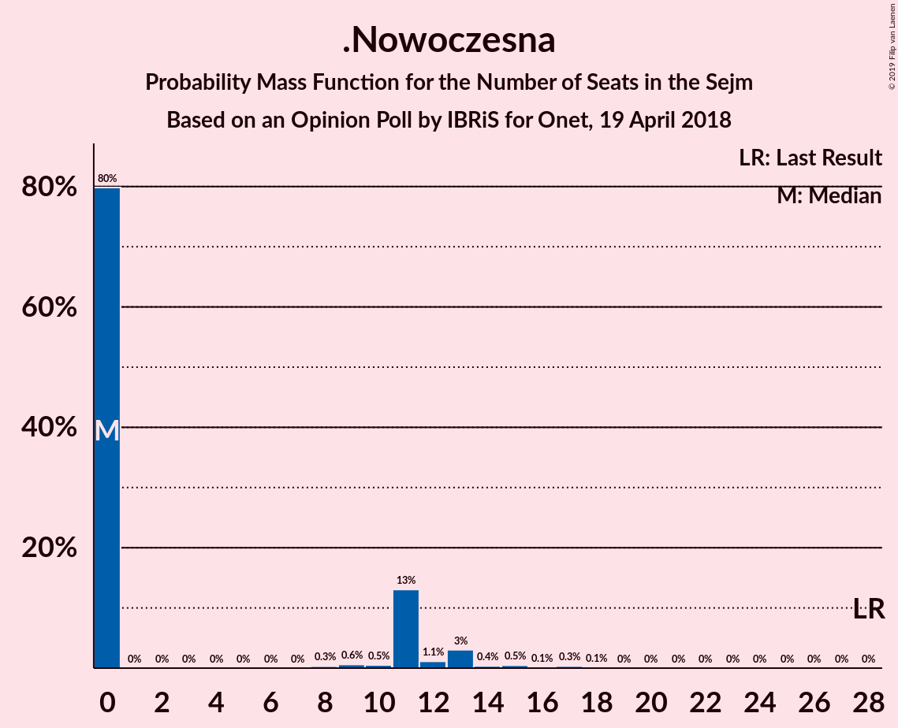
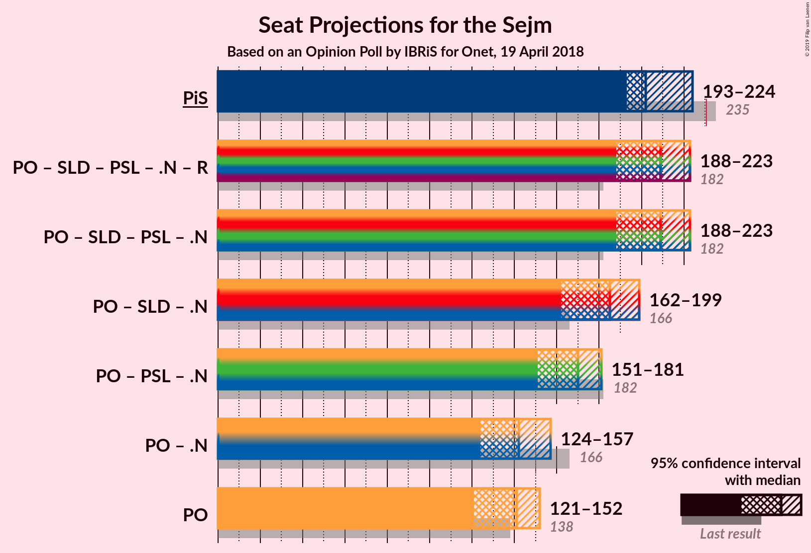
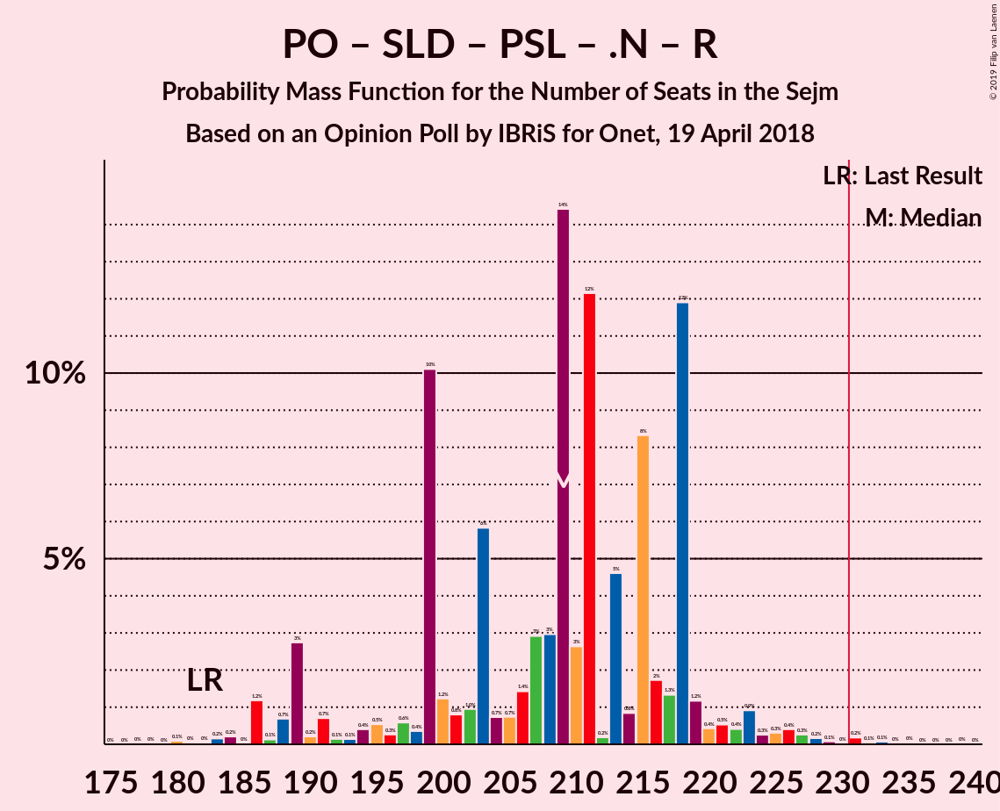
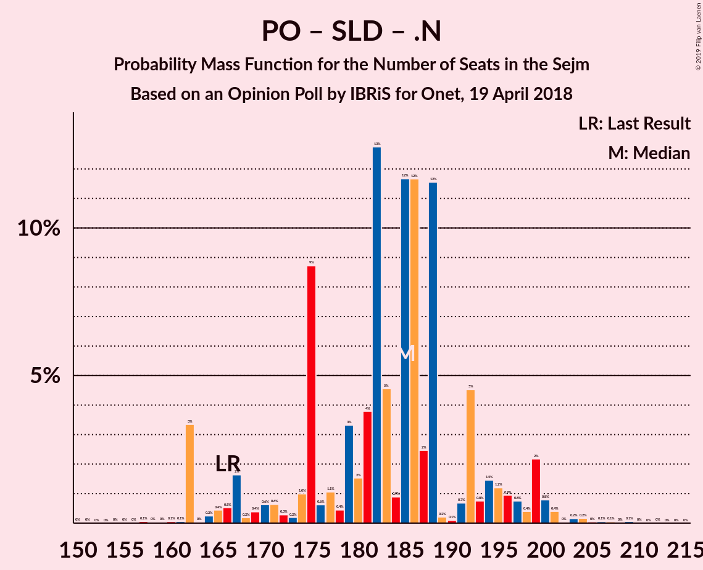
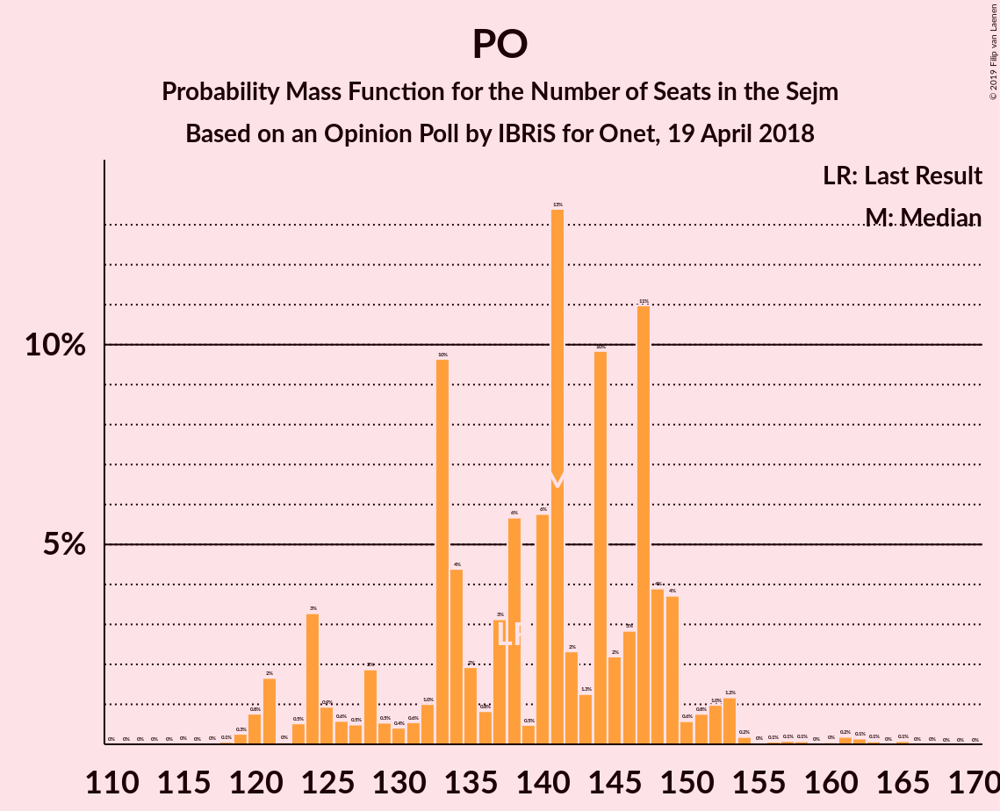

# Opinion Poll by IBRiS for Onet, 19 April 2018

<a href="#voting-intentions">Voting Intentions</a> | <a href="#seats">Seats</a> | <a href="#coalitions">Coalitions</a> | <a href="#technical-information">Technical Information</a>

## Voting Intentions

### Confidence Intervals

| Party | Last Result | Poll Result | 80% Confidence Interval | 90% Confidence Interval | 95% Confidence Interval | 99% Confidence Interval |
|:-----:|:-----------:|:-----------:|:-----------------------:|:-----------------------:|:-----------------------:|:-----------------------:|
| Prawo i Sprawiedliwość | 37.6% | 34.5% | 32.7–36.4% |32.2–36.9% |31.8–37.4% |30.9–38.3% |
| Platforma Obywatelska | 24.1% | 24.3% | 22.7–26.0% |22.2–26.5% |21.8–26.9% |21.1–27.7% |
| Kukiz’15 | 8.8% | 9.8% | 8.7–11.1% |8.4–11.4% |8.2–11.7% |7.7–12.3% |
| Sojusz Lewicy Demokratycznej | 7.6% | 9.2% | 8.2–10.4% |7.8–10.7% |7.6–11.0% |7.1–11.6% |
| Polskie Stronnictwo Ludowe | 5.1% | 6.6% | 5.8–7.7% |5.5–8.0% |5.3–8.3% |4.9–8.8% |
| .Nowoczesna | 7.6% | 4.5% | 3.8–5.5% |3.6–5.7% |3.5–5.9% |3.1–6.4% |
| KORWiN | 4.8% | 1.5% | 1.2–2.1% |1.1–2.3% |1.0–2.5% |0.8–2.8% |
| Lewica Razem | 3.6% | 1.1% | 0.8–1.6% |0.7–1.8% |0.6–1.9% |0.5–2.2% |

*Note:* The poll result column reflects the actual value used in the calculations. Published results may vary slightly, and in addition be rounded to fewer digits.

## Seats

### Confidence Intervals

| Party | Last Result | Median | 80% Confidence Interval | 90% Confidence Interval | 95% Confidence Interval | 99% Confidence Interval |
|:-----:|:-----------:|:------:|:-----------------------:|:-----------------------:|:-----------------------:|:-----------------------:|
| <a href="#prawo-i-sprawiedliwość">Prawo i Sprawiedliwość</a> | 235 | 202 | 199–219 |198–223 |193–224 |181–229 |
| <a href="#platforma-obywatelska">Platforma Obywatelska</a> | 138 | 141 | 128–148 |124–149 |121–152 |120–161 |
| <a href="#kukiz’15">Kukiz’15</a> | 42 | 47 | 41–51 |40–53 |39–54 |34–60 |
| <a href="#sojusz-lewicy-demokratycznej">Sojusz Lewicy Demokratycznej</a> | 0 | 42 | 34–47 |32–48 |31–50 |27–53 |
| <a href="#polskie-stronnictwo-ludowe">Polskie Stronnictwo Ludowe</a> | 16 | 24 | 21–33 |19–33 |17–33 |0–36 |
| <a href="#.nowoczesna">.Nowoczesna</a> | 28 | 0 | 0–11 |0–12 |0–13 |0–17 |
| <a href="#korwin">KORWiN</a> | 0 | 0 | 0 |0 |0 |0 |
| <a href="#lewica-razem">Lewica Razem</a> | 0 | 0 | 0 |0 |0 |0 |

### Prawo i Sprawiedliwość

*For a full overview of the results for this party, see the [Prawo i Sprawiedliwość](party-prawoisprawiedliwość.html) page.*

| Number of Seats | Probability | Accumulated | Special Marks |
|:---------------:|:-----------:|:-----------:|:-------------:|
| 178 | 0% | 100% |  |
| 179 | 0% | 99.9% |  |
| 180 | 0.3% | 99.9% |  |
| 181 | 0.2% | 99.6% |  |
| 182 | 0.1% | 99.4% |  |
| 183 | 0.1% | 99.3% |  |
| 184 | 0% | 99.3% |  |
| 185 | 0.1% | 99.2% |  |
| 186 | 0.2% | 99.1% |  |
| 187 | 0.4% | 98.9% |  |
| 188 | 0.1% | 98.5% |  |
| 189 | 0.1% | 98% |  |
| 190 | 0.2% | 98% |  |
| 191 | 0.3% | 98% |  |
| 192 | 0.4% | 98% |  |
| 193 | 0.4% | 98% |  |
| 194 | 0.2% | 97% |  |
| 195 | 0.4% | 97% |  |
| 196 | 0.3% | 97% |  |
| 197 | 0.8% | 96% |  |
| 198 | 5% | 96% |  |
| 199 | 3% | 90% |  |
| 200 | 18% | 87% |  |
| 201 | 8% | 69% |  |
| 202 | 15% | 61% | Median |
| 203 | 2% | 46% |  |
| 204 | 7% | 44% |  |
| 205 | 3% | 36% |  |
| 206 | 2% | 33% |  |
| 207 | 3% | 31% |  |
| 208 | 3% | 27% |  |
| 209 | 3% | 24% |  |
| 210 | 1.3% | 21% |  |
| 211 | 1.0% | 20% |  |
| 212 | 0.6% | 19% |  |
| 213 | 0.2% | 18% |  |
| 214 | 0.5% | 18% |  |
| 215 | 0.7% | 18% |  |
| 216 | 0.4% | 17% |  |
| 217 | 0.1% | 17% |  |
| 218 | 1.1% | 16% |  |
| 219 | 8% | 15% |  |
| 220 | 0.8% | 7% |  |
| 221 | 0.1% | 6% |  |
| 222 | 0.5% | 6% |  |
| 223 | 3% | 6% |  |
| 224 | 1.1% | 3% |  |
| 225 | 0.7% | 2% |  |
| 226 | 0.1% | 1.0% |  |
| 227 | 0.2% | 0.9% |  |
| 228 | 0.1% | 0.7% |  |
| 229 | 0.1% | 0.6% |  |
| 230 | 0.2% | 0.5% |  |
| 231 | 0.2% | 0.3% | Majority |
| 232 | 0% | 0.1% |  |
| 233 | 0% | 0.1% |  |
| 234 | 0% | 0.1% |  |
| 235 | 0% | 0.1% | Last Result |
| 236 | 0% | 0% |  |

### Platforma Obywatelska

*For a full overview of the results for this party, see the [Platforma Obywatelska](party-platformaobywatelska.html) page.*

| Number of Seats | Probability | Accumulated | Special Marks |
|:---------------:|:-----------:|:-----------:|:-------------:|
| 111 | 0% | 100% |  |
| 112 | 0% | 99.9% |  |
| 113 | 0% | 99.9% |  |
| 114 | 0% | 99.9% |  |
| 115 | 0% | 99.9% |  |
| 116 | 0% | 99.9% |  |
| 117 | 0% | 99.9% |  |
| 118 | 0.1% | 99.8% |  |
| 119 | 0.3% | 99.8% |  |
| 120 | 0.8% | 99.5% |  |
| 121 | 2% | 98.7% |  |
| 122 | 0% | 97% |  |
| 123 | 0.5% | 97% |  |
| 124 | 3% | 97% |  |
| 125 | 0.9% | 93% |  |
| 126 | 0.6% | 92% |  |
| 127 | 0.5% | 92% |  |
| 128 | 2% | 91% |  |
| 129 | 0.5% | 89% |  |
| 130 | 0.4% | 89% |  |
| 131 | 0.6% | 88% |  |
| 132 | 1.0% | 88% |  |
| 133 | 10% | 87% |  |
| 134 | 4% | 77% |  |
| 135 | 2% | 73% |  |
| 136 | 0.8% | 71% |  |
| 137 | 3% | 70% |  |
| 138 | 6% | 67% | Last Result |
| 139 | 0.5% | 61% |  |
| 140 | 6% | 61% |  |
| 141 | 13% | 55% | Median |
| 142 | 2% | 42% |  |
| 143 | 1.3% | 39% |  |
| 144 | 10% | 38% |  |
| 145 | 2% | 28% |  |
| 146 | 3% | 26% |  |
| 147 | 11% | 23% |  |
| 148 | 4% | 12% |  |
| 149 | 4% | 8% |  |
| 150 | 0.6% | 5% |  |
| 151 | 0.8% | 4% |  |
| 152 | 1.0% | 3% |  |
| 153 | 1.2% | 2% |  |
| 154 | 0.2% | 1.0% |  |
| 155 | 0% | 0.9% |  |
| 156 | 0.1% | 0.8% |  |
| 157 | 0.1% | 0.7% |  |
| 158 | 0.1% | 0.7% |  |
| 159 | 0% | 0.6% |  |
| 160 | 0% | 0.6% |  |
| 161 | 0.2% | 0.5% |  |
| 162 | 0.1% | 0.3% |  |
| 163 | 0.1% | 0.2% |  |
| 164 | 0% | 0.1% |  |
| 165 | 0.1% | 0.1% |  |
| 166 | 0% | 0% |  |

### Kukiz’15

*For a full overview of the results for this party, see the [Kukiz’15](party-kukiz’15.html) page.*

| Number of Seats | Probability | Accumulated | Special Marks |
|:---------------:|:-----------:|:-----------:|:-------------:|
| 29 | 0% | 100% |  |
| 30 | 0% | 99.9% |  |
| 31 | 0.1% | 99.9% |  |
| 32 | 0.1% | 99.9% |  |
| 33 | 0.2% | 99.8% |  |
| 34 | 0.2% | 99.6% |  |
| 35 | 0.1% | 99.3% |  |
| 36 | 0.6% | 99.2% |  |
| 37 | 0.2% | 98.6% |  |
| 38 | 0.6% | 98% |  |
| 39 | 0.6% | 98% |  |
| 40 | 4% | 97% |  |
| 41 | 5% | 94% |  |
| 42 | 18% | 89% | Last Result |
| 43 | 3% | 71% |  |
| 44 | 9% | 68% |  |
| 45 | 6% | 59% |  |
| 46 | 3% | 54% |  |
| 47 | 7% | 51% | Median |
| 48 | 6% | 44% |  |
| 49 | 25% | 38% |  |
| 50 | 2% | 13% |  |
| 51 | 1.2% | 11% |  |
| 52 | 0.9% | 9% |  |
| 53 | 5% | 8% |  |
| 54 | 0.7% | 3% |  |
| 55 | 0.3% | 2% |  |
| 56 | 0.5% | 2% |  |
| 57 | 0.5% | 2% |  |
| 58 | 0.1% | 1.2% |  |
| 59 | 0.5% | 1.1% |  |
| 60 | 0.4% | 0.6% |  |
| 61 | 0.1% | 0.3% |  |
| 62 | 0.1% | 0.2% |  |
| 63 | 0% | 0.1% |  |
| 64 | 0% | 0.1% |  |
| 65 | 0% | 0.1% |  |
| 66 | 0% | 0% |  |

### Sojusz Lewicy Demokratycznej

*For a full overview of the results for this party, see the [Sojusz Lewicy Demokratycznej](party-sojuszlewicydemokratycznej.html) page.*

| Number of Seats | Probability | Accumulated | Special Marks |
|:---------------:|:-----------:|:-----------:|:-------------:|
| 0 | 0% | 100% | Last Result |
| 1 | 0% | 100% |  |
| 2 | 0% | 100% |  |
| 3 | 0% | 100% |  |
| 4 | 0% | 100% |  |
| 5 | 0% | 100% |  |
| 6 | 0% | 100% |  |
| 7 | 0% | 100% |  |
| 8 | 0% | 100% |  |
| 9 | 0% | 100% |  |
| 10 | 0% | 100% |  |
| 11 | 0% | 100% |  |
| 12 | 0% | 100% |  |
| 13 | 0% | 100% |  |
| 14 | 0% | 100% |  |
| 15 | 0% | 100% |  |
| 16 | 0% | 100% |  |
| 17 | 0% | 100% |  |
| 18 | 0% | 100% |  |
| 19 | 0% | 100% |  |
| 20 | 0% | 100% |  |
| 21 | 0% | 100% |  |
| 22 | 0% | 100% |  |
| 23 | 0% | 100% |  |
| 24 | 0% | 100% |  |
| 25 | 0% | 100% |  |
| 26 | 0% | 100% |  |
| 27 | 0.4% | 99.9% |  |
| 28 | 0.8% | 99.5% |  |
| 29 | 0.7% | 98.7% |  |
| 30 | 0.3% | 98% |  |
| 31 | 0.5% | 98% |  |
| 32 | 4% | 97% |  |
| 33 | 2% | 93% |  |
| 34 | 0.7% | 91% |  |
| 35 | 1.0% | 90% |  |
| 36 | 1.0% | 89% |  |
| 37 | 1.2% | 88% |  |
| 38 | 7% | 87% |  |
| 39 | 5% | 80% |  |
| 40 | 3% | 75% |  |
| 41 | 17% | 72% |  |
| 42 | 22% | 55% | Median |
| 43 | 10% | 33% |  |
| 44 | 10% | 23% |  |
| 45 | 1.1% | 13% |  |
| 46 | 0.5% | 12% |  |
| 47 | 2% | 12% |  |
| 48 | 5% | 9% |  |
| 49 | 0.6% | 4% |  |
| 50 | 0.9% | 3% |  |
| 51 | 0.6% | 2% |  |
| 52 | 0.9% | 2% |  |
| 53 | 0.4% | 0.8% |  |
| 54 | 0.2% | 0.5% |  |
| 55 | 0% | 0.3% |  |
| 56 | 0% | 0.2% |  |
| 57 | 0% | 0.2% |  |
| 58 | 0% | 0.2% |  |
| 59 | 0.1% | 0.2% |  |
| 60 | 0% | 0.1% |  |
| 61 | 0% | 0% |  |

### Polskie Stronnictwo Ludowe

*For a full overview of the results for this party, see the [Polskie Stronnictwo Ludowe](party-polskiestronnictwoludowe.html) page.*

| Number of Seats | Probability | Accumulated | Special Marks |
|:---------------:|:-----------:|:-----------:|:-------------:|
| 0 | 0.7% | 100% |  |
| 1 | 0% | 99.3% |  |
| 2 | 0% | 99.3% |  |
| 3 | 0% | 99.3% |  |
| 4 | 0% | 99.3% |  |
| 5 | 0% | 99.3% |  |
| 6 | 0% | 99.3% |  |
| 7 | 0% | 99.3% |  |
| 8 | 0% | 99.3% |  |
| 9 | 0% | 99.3% |  |
| 10 | 0% | 99.3% |  |
| 11 | 0% | 99.3% |  |
| 12 | 0% | 99.3% |  |
| 13 | 0.1% | 99.3% |  |
| 14 | 0.2% | 99.2% |  |
| 15 | 0.5% | 99.0% |  |
| 16 | 0.5% | 98% | Last Result |
| 17 | 2% | 98% |  |
| 18 | 0.8% | 96% |  |
| 19 | 1.3% | 95% |  |
| 20 | 2% | 94% |  |
| 21 | 5% | 92% |  |
| 22 | 2% | 87% |  |
| 23 | 29% | 85% |  |
| 24 | 11% | 56% | Median |
| 25 | 2% | 45% |  |
| 26 | 10% | 42% |  |
| 27 | 8% | 33% |  |
| 28 | 2% | 25% |  |
| 29 | 1.2% | 23% |  |
| 30 | 5% | 22% |  |
| 31 | 0.3% | 17% |  |
| 32 | 0.6% | 17% |  |
| 33 | 15% | 16% |  |
| 34 | 0.1% | 0.8% |  |
| 35 | 0.2% | 0.7% |  |
| 36 | 0.1% | 0.5% |  |
| 37 | 0.1% | 0.4% |  |
| 38 | 0.1% | 0.3% |  |
| 39 | 0% | 0.2% |  |
| 40 | 0% | 0.2% |  |
| 41 | 0.1% | 0.1% |  |
| 42 | 0% | 0.1% |  |
| 43 | 0% | 0.1% |  |
| 44 | 0% | 0.1% |  |
| 45 | 0% | 0% |  |

### .Nowoczesna

*For a full overview of the results for this party, see the [.Nowoczesna](party-nowoczesna.html) page.*

| Number of Seats | Probability | Accumulated | Special Marks |
|:---------------:|:-----------:|:-----------:|:-------------:|
| 0 | 80% | 100% | Median |
| 1 | 0% | 20% |  |
| 2 | 0% | 20% |  |
| 3 | 0% | 20% |  |
| 4 | 0% | 20% |  |
| 5 | 0% | 20% |  |
| 6 | 0% | 20% |  |
| 7 | 0% | 20% |  |
| 8 | 0.3% | 20% |  |
| 9 | 0.6% | 20% |  |
| 10 | 0.5% | 19% |  |
| 11 | 13% | 19% |  |
| 12 | 1.1% | 6% |  |
| 13 | 3% | 5% |  |
| 14 | 0.4% | 1.4% |  |
| 15 | 0.5% | 1.1% |  |
| 16 | 0.1% | 0.6% |  |
| 17 | 0.3% | 0.5% |  |
| 18 | 0.1% | 0.2% |  |
| 19 | 0% | 0.1% |  |
| 20 | 0% | 0.1% |  |
| 21 | 0% | 0.1% |  |
| 22 | 0% | 0% |  |
| 23 | 0% | 0% |  |
| 24 | 0% | 0% |  |
| 25 | 0% | 0% |  |
| 26 | 0% | 0% |  |
| 27 | 0% | 0% |  |
| 28 | 0% | 0% | Last Result |

### KORWiN

*For a full overview of the results for this party, see the [KORWiN](party-korwin.html) page.*

| Number of Seats | Probability | Accumulated | Special Marks |
|:---------------:|:-----------:|:-----------:|:-------------:|
| 0 | 100% | 100% | Last Result, Median |

### Lewica Razem

*For a full overview of the results for this party, see the [Lewica Razem](party-lewicarazem.html) page.*

| Number of Seats | Probability | Accumulated | Special Marks |
|:---------------:|:-----------:|:-----------:|:-------------:|
| 0 | 100% | 100% | Last Result, Median |

## Coalitions

### Confidence Intervals

| Coalition | Last Result | Median | Majority? | 80% Confidence Interval | 90% Confidence Interval | 95% Confidence Interval | 99% Confidence Interval |
|:---------:|:-----------:|:------:|:---------:|:-----------------------:|:-----------------------:|:-----------------------:|:-----------------------:|
| Prawo i Sprawiedliwość | 235 | 202 | 0.3% | 199–219 | 198–223 | 193–224 | 181–229 |
| Platforma Obywatelska – Sojusz Lewicy Demokratycznej – Polskie Stronnictwo Ludowe – .Nowoczesna – Lewica Razem | 182 | 209 | 0.4% | 199–218 | 189–219 | 188–223 | 184–229 |
| Platforma Obywatelska – Sojusz Lewicy Demokratycznej – Polskie Stronnictwo Ludowe – .Nowoczesna | 182 | 209 | 0.4% | 199–218 | 189–219 | 188–223 | 184–229 |
| Platforma Obywatelska – Sojusz Lewicy Demokratycznej – .Nowoczesna | 166 | 185 | 0% | 175–192 | 167–197 | 162–199 | 162–203 |
| Platforma Obywatelska – Polskie Stronnictwo Ludowe – .Nowoczesna | 182 | 170 | 0% | 155–176 | 151–177 | 151–181 | 145–189 |
| Platforma Obywatelska – .Nowoczesna | 166 | 142 | 0% | 132–151 | 127–156 | 124–157 | 123–164 |
| Platforma Obywatelska | 138 | 141 | 0% | 128–148 | 124–149 | 121–152 | 120–161 |

### Prawo i Sprawiedliwość

| Number of Seats | Probability | Accumulated | Special Marks |
|:---------------:|:-----------:|:-----------:|:-------------:|
| 178 | 0% | 100% |  |
| 179 | 0% | 99.9% |  |
| 180 | 0.3% | 99.9% |  |
| 181 | 0.2% | 99.6% |  |
| 182 | 0.1% | 99.4% |  |
| 183 | 0.1% | 99.3% |  |
| 184 | 0% | 99.3% |  |
| 185 | 0.1% | 99.2% |  |
| 186 | 0.2% | 99.1% |  |
| 187 | 0.4% | 98.9% |  |
| 188 | 0.1% | 98.5% |  |
| 189 | 0.1% | 98% |  |
| 190 | 0.2% | 98% |  |
| 191 | 0.3% | 98% |  |
| 192 | 0.4% | 98% |  |
| 193 | 0.4% | 98% |  |
| 194 | 0.2% | 97% |  |
| 195 | 0.4% | 97% |  |
| 196 | 0.3% | 97% |  |
| 197 | 0.8% | 96% |  |
| 198 | 5% | 96% |  |
| 199 | 3% | 90% |  |
| 200 | 18% | 87% |  |
| 201 | 8% | 69% |  |
| 202 | 15% | 61% | Median |
| 203 | 2% | 46% |  |
| 204 | 7% | 44% |  |
| 205 | 3% | 36% |  |
| 206 | 2% | 33% |  |
| 207 | 3% | 31% |  |
| 208 | 3% | 27% |  |
| 209 | 3% | 24% |  |
| 210 | 1.3% | 21% |  |
| 211 | 1.0% | 20% |  |
| 212 | 0.6% | 19% |  |
| 213 | 0.2% | 18% |  |
| 214 | 0.5% | 18% |  |
| 215 | 0.7% | 18% |  |
| 216 | 0.4% | 17% |  |
| 217 | 0.1% | 17% |  |
| 218 | 1.1% | 16% |  |
| 219 | 8% | 15% |  |
| 220 | 0.8% | 7% |  |
| 221 | 0.1% | 6% |  |
| 222 | 0.5% | 6% |  |
| 223 | 3% | 6% |  |
| 224 | 1.1% | 3% |  |
| 225 | 0.7% | 2% |  |
| 226 | 0.1% | 1.0% |  |
| 227 | 0.2% | 0.9% |  |
| 228 | 0.1% | 0.7% |  |
| 229 | 0.1% | 0.6% |  |
| 230 | 0.2% | 0.5% |  |
| 231 | 0.2% | 0.3% | Majority |
| 232 | 0% | 0.1% |  |
| 233 | 0% | 0.1% |  |
| 234 | 0% | 0.1% |  |
| 235 | 0% | 0.1% | Last Result |
| 236 | 0% | 0% |  |

### Platforma Obywatelska – Sojusz Lewicy Demokratycznej – Polskie Stronnictwo Ludowe – .Nowoczesna – Lewica Razem

| Number of Seats | Probability | Accumulated | Special Marks |
|:---------------:|:-----------:|:-----------:|:-------------:|
| 178 | 0% | 100% |  |
| 179 | 0% | 99.9% |  |
| 180 | 0.1% | 99.9% |  |
| 181 | 0% | 99.8% |  |
| 182 | 0% | 99.8% | Last Result |
| 183 | 0.2% | 99.8% |  |
| 184 | 0.2% | 99.6% |  |
| 185 | 0% | 99.4% |  |
| 186 | 1.2% | 99.4% |  |
| 187 | 0.1% | 98% |  |
| 188 | 0.7% | 98% |  |
| 189 | 3% | 97% |  |
| 190 | 0.2% | 95% |  |
| 191 | 0.7% | 94% |  |
| 192 | 0.1% | 94% |  |
| 193 | 0.1% | 94% |  |
| 194 | 0.4% | 93% |  |
| 195 | 0.5% | 93% |  |
| 196 | 0.3% | 92% |  |
| 197 | 0.6% | 92% |  |
| 198 | 0.4% | 92% |  |
| 199 | 10% | 91% |  |
| 200 | 1.2% | 81% |  |
| 201 | 0.8% | 80% |  |
| 202 | 1.0% | 79% |  |
| 203 | 6% | 78% |  |
| 204 | 0.7% | 72% |  |
| 205 | 0.7% | 72% |  |
| 206 | 1.4% | 71% |  |
| 207 | 3% | 69% | Median |
| 208 | 3% | 67% |  |
| 209 | 14% | 64% |  |
| 210 | 3% | 49% |  |
| 211 | 12% | 46% |  |
| 212 | 0.2% | 34% |  |
| 213 | 5% | 34% |  |
| 214 | 0.8% | 30% |  |
| 215 | 8% | 29% |  |
| 216 | 2% | 20% |  |
| 217 | 1.3% | 19% |  |
| 218 | 12% | 17% |  |
| 219 | 1.2% | 5% |  |
| 220 | 0.4% | 4% |  |
| 221 | 0.5% | 4% |  |
| 222 | 0.4% | 3% |  |
| 223 | 0.9% | 3% |  |
| 224 | 0.3% | 2% |  |
| 225 | 0.3% | 2% |  |
| 226 | 0.4% | 1.3% |  |
| 227 | 0.3% | 0.9% |  |
| 228 | 0.2% | 0.7% |  |
| 229 | 0.1% | 0.5% |  |
| 230 | 0% | 0.4% |  |
| 231 | 0.2% | 0.4% | Majority |
| 232 | 0.1% | 0.2% |  |
| 233 | 0.1% | 0.2% |  |
| 234 | 0% | 0.1% |  |
| 235 | 0% | 0.1% |  |
| 236 | 0% | 0% |  |

### Platforma Obywatelska – Sojusz Lewicy Demokratycznej – Polskie Stronnictwo Ludowe – .Nowoczesna

| Number of Seats | Probability | Accumulated | Special Marks |
|:---------------:|:-----------:|:-----------:|:-------------:|
| 178 | 0% | 100% |  |
| 179 | 0% | 99.9% |  |
| 180 | 0.1% | 99.9% |  |
| 181 | 0% | 99.8% |  |
| 182 | 0% | 99.8% | Last Result |
| 183 | 0.2% | 99.8% |  |
| 184 | 0.2% | 99.6% |  |
| 185 | 0% | 99.4% |  |
| 186 | 1.2% | 99.4% |  |
| 187 | 0.1% | 98% |  |
| 188 | 0.7% | 98% |  |
| 189 | 3% | 97% |  |
| 190 | 0.2% | 95% |  |
| 191 | 0.7% | 94% |  |
| 192 | 0.1% | 94% |  |
| 193 | 0.1% | 94% |  |
| 194 | 0.4% | 93% |  |
| 195 | 0.5% | 93% |  |
| 196 | 0.3% | 92% |  |
| 197 | 0.6% | 92% |  |
| 198 | 0.4% | 92% |  |
| 199 | 10% | 91% |  |
| 200 | 1.2% | 81% |  |
| 201 | 0.8% | 80% |  |
| 202 | 1.0% | 79% |  |
| 203 | 6% | 78% |  |
| 204 | 0.7% | 72% |  |
| 205 | 0.7% | 72% |  |
| 206 | 1.4% | 71% |  |
| 207 | 3% | 69% | Median |
| 208 | 3% | 67% |  |
| 209 | 14% | 64% |  |
| 210 | 3% | 49% |  |
| 211 | 12% | 46% |  |
| 212 | 0.2% | 34% |  |
| 213 | 5% | 34% |  |
| 214 | 0.8% | 30% |  |
| 215 | 8% | 29% |  |
| 216 | 2% | 20% |  |
| 217 | 1.3% | 19% |  |
| 218 | 12% | 17% |  |
| 219 | 1.2% | 5% |  |
| 220 | 0.4% | 4% |  |
| 221 | 0.5% | 4% |  |
| 222 | 0.4% | 3% |  |
| 223 | 0.9% | 3% |  |
| 224 | 0.3% | 2% |  |
| 225 | 0.3% | 2% |  |
| 226 | 0.4% | 1.3% |  |
| 227 | 0.3% | 0.9% |  |
| 228 | 0.2% | 0.7% |  |
| 229 | 0.1% | 0.5% |  |
| 230 | 0% | 0.4% |  |
| 231 | 0.2% | 0.4% | Majority |
| 232 | 0.1% | 0.2% |  |
| 233 | 0.1% | 0.2% |  |
| 234 | 0% | 0.1% |  |
| 235 | 0% | 0.1% |  |
| 236 | 0% | 0% |  |

### Platforma Obywatelska – Sojusz Lewicy Demokratycznej – .Nowoczesna

| Number of Seats | Probability | Accumulated | Special Marks |
|:---------------:|:-----------:|:-----------:|:-------------:|
| 154 | 0% | 100% |  |
| 155 | 0% | 99.9% |  |
| 156 | 0% | 99.9% |  |
| 157 | 0.1% | 99.9% |  |
| 158 | 0% | 99.9% |  |
| 159 | 0% | 99.8% |  |
| 160 | 0.1% | 99.8% |  |
| 161 | 0.1% | 99.7% |  |
| 162 | 3% | 99.7% |  |
| 163 | 0% | 96% |  |
| 164 | 0.2% | 96% |  |
| 165 | 0.4% | 96% |  |
| 166 | 0.5% | 96% | Last Result |
| 167 | 2% | 95% |  |
| 168 | 0.2% | 93% |  |
| 169 | 0.4% | 93% |  |
| 170 | 0.6% | 93% |  |
| 171 | 0.6% | 92% |  |
| 172 | 0.3% | 92% |  |
| 173 | 0.2% | 91% |  |
| 174 | 1.0% | 91% |  |
| 175 | 9% | 90% |  |
| 176 | 0.6% | 81% |  |
| 177 | 1.1% | 81% |  |
| 178 | 0.4% | 80% |  |
| 179 | 3% | 79% |  |
| 180 | 2% | 76% |  |
| 181 | 4% | 74% |  |
| 182 | 13% | 71% |  |
| 183 | 5% | 58% | Median |
| 184 | 0.9% | 53% |  |
| 185 | 12% | 52% |  |
| 186 | 12% | 41% |  |
| 187 | 2% | 29% |  |
| 188 | 12% | 27% |  |
| 189 | 0.2% | 15% |  |
| 190 | 0.1% | 15% |  |
| 191 | 0.7% | 15% |  |
| 192 | 5% | 14% |  |
| 193 | 0.8% | 10% |  |
| 194 | 1.5% | 9% |  |
| 195 | 1.2% | 7% |  |
| 196 | 0.9% | 6% |  |
| 197 | 0.8% | 5% |  |
| 198 | 0.4% | 4% |  |
| 199 | 2% | 4% |  |
| 200 | 0.8% | 2% |  |
| 201 | 0.4% | 1.1% |  |
| 202 | 0% | 0.7% |  |
| 203 | 0.2% | 0.6% |  |
| 204 | 0.2% | 0.5% |  |
| 205 | 0% | 0.3% |  |
| 206 | 0.1% | 0.3% |  |
| 207 | 0.1% | 0.2% |  |
| 208 | 0% | 0.2% |  |
| 209 | 0.1% | 0.1% |  |
| 210 | 0% | 0.1% |  |
| 211 | 0% | 0% |  |

### Platforma Obywatelska – Polskie Stronnictwo Ludowe – .Nowoczesna

| Number of Seats | Probability | Accumulated | Special Marks |
|:---------------:|:-----------:|:-----------:|:-------------:|
| 138 | 0% | 100% |  |
| 139 | 0% | 99.9% |  |
| 140 | 0% | 99.9% |  |
| 141 | 0.1% | 99.9% |  |
| 142 | 0.1% | 99.9% |  |
| 143 | 0.1% | 99.7% |  |
| 144 | 0.2% | 99.7% |  |
| 145 | 0% | 99.5% |  |
| 146 | 0.1% | 99.5% |  |
| 147 | 1.2% | 99.4% |  |
| 148 | 0.2% | 98% |  |
| 149 | 0.3% | 98% |  |
| 150 | 0.2% | 98% |  |
| 151 | 4% | 98% |  |
| 152 | 0.8% | 94% |  |
| 153 | 0.9% | 93% |  |
| 154 | 1.2% | 92% |  |
| 155 | 4% | 91% |  |
| 156 | 0.7% | 87% |  |
| 157 | 9% | 86% |  |
| 158 | 1.1% | 77% |  |
| 159 | 2% | 76% |  |
| 160 | 2% | 74% |  |
| 161 | 0.4% | 72% |  |
| 162 | 0.6% | 72% |  |
| 163 | 0.3% | 71% |  |
| 164 | 0.4% | 71% |  |
| 165 | 0.4% | 70% | Median |
| 166 | 1.3% | 70% |  |
| 167 | 11% | 69% |  |
| 168 | 1.4% | 58% |  |
| 169 | 2% | 57% |  |
| 170 | 14% | 55% |  |
| 171 | 3% | 41% |  |
| 172 | 1.0% | 38% |  |
| 173 | 2% | 37% |  |
| 174 | 16% | 35% |  |
| 175 | 8% | 19% |  |
| 176 | 4% | 11% |  |
| 177 | 1.5% | 6% |  |
| 178 | 0.5% | 5% |  |
| 179 | 1.3% | 4% |  |
| 180 | 0.7% | 3% |  |
| 181 | 0.3% | 3% |  |
| 182 | 0.6% | 2% | Last Result |
| 183 | 0.1% | 2% |  |
| 184 | 0.1% | 1.5% |  |
| 185 | 0.2% | 1.4% |  |
| 186 | 0.1% | 1.1% |  |
| 187 | 0.2% | 1.0% |  |
| 188 | 0.2% | 0.9% |  |
| 189 | 0.4% | 0.7% |  |
| 190 | 0% | 0.3% |  |
| 191 | 0% | 0.3% |  |
| 192 | 0% | 0.2% |  |
| 193 | 0.1% | 0.2% |  |
| 194 | 0% | 0.1% |  |
| 195 | 0% | 0.1% |  |
| 196 | 0% | 0.1% |  |
| 197 | 0% | 0.1% |  |
| 198 | 0% | 0.1% |  |
| 199 | 0% | 0% |  |

### Platforma Obywatelska – .Nowoczesna

| Number of Seats | Probability | Accumulated | Special Marks |
|:---------------:|:-----------:|:-----------:|:-------------:|
| 117 | 0% | 100% |  |
| 118 | 0.1% | 99.9% |  |
| 119 | 0.1% | 99.9% |  |
| 120 | 0.1% | 99.7% |  |
| 121 | 0.1% | 99.7% |  |
| 122 | 0% | 99.5% |  |
| 123 | 0.3% | 99.5% |  |
| 124 | 3% | 99.3% |  |
| 125 | 0.8% | 96% |  |
| 126 | 0.6% | 96% |  |
| 127 | 0.2% | 95% |  |
| 128 | 1.4% | 95% |  |
| 129 | 0.5% | 94% |  |
| 130 | 0.5% | 93% |  |
| 131 | 1.1% | 93% |  |
| 132 | 2% | 91% |  |
| 133 | 10% | 89% |  |
| 134 | 4% | 80% |  |
| 135 | 2% | 76% |  |
| 136 | 0.8% | 74% |  |
| 137 | 1.2% | 73% |  |
| 138 | 0.5% | 72% |  |
| 139 | 0.5% | 71% |  |
| 140 | 5% | 71% |  |
| 141 | 14% | 66% | Median |
| 142 | 2% | 52% |  |
| 143 | 1.2% | 50% |  |
| 144 | 10% | 49% |  |
| 145 | 2% | 39% |  |
| 146 | 1.4% | 37% |  |
| 147 | 11% | 36% |  |
| 148 | 4% | 25% |  |
| 149 | 9% | 21% |  |
| 150 | 2% | 13% |  |
| 151 | 1.0% | 10% |  |
| 152 | 1.2% | 9% |  |
| 153 | 2% | 8% |  |
| 154 | 0.4% | 6% |  |
| 155 | 0.2% | 6% |  |
| 156 | 0.7% | 6% |  |
| 157 | 3% | 5% |  |
| 158 | 0.4% | 2% |  |
| 159 | 0.1% | 1.4% |  |
| 160 | 0.1% | 1.3% |  |
| 161 | 0.3% | 1.1% |  |
| 162 | 0.1% | 0.9% |  |
| 163 | 0.1% | 0.7% |  |
| 164 | 0.3% | 0.7% |  |
| 165 | 0.1% | 0.4% |  |
| 166 | 0.1% | 0.2% | Last Result |
| 167 | 0% | 0.2% |  |
| 168 | 0% | 0.1% |  |
| 169 | 0% | 0.1% |  |
| 170 | 0.1% | 0.1% |  |
| 171 | 0% | 0% |  |

### Platforma Obywatelska

| Number of Seats | Probability | Accumulated | Special Marks |
|:---------------:|:-----------:|:-----------:|:-------------:|
| 111 | 0% | 100% |  |
| 112 | 0% | 99.9% |  |
| 113 | 0% | 99.9% |  |
| 114 | 0% | 99.9% |  |
| 115 | 0% | 99.9% |  |
| 116 | 0% | 99.9% |  |
| 117 | 0% | 99.9% |  |
| 118 | 0.1% | 99.8% |  |
| 119 | 0.3% | 99.8% |  |
| 120 | 0.8% | 99.5% |  |
| 121 | 2% | 98.7% |  |
| 122 | 0% | 97% |  |
| 123 | 0.5% | 97% |  |
| 124 | 3% | 97% |  |
| 125 | 0.9% | 93% |  |
| 126 | 0.6% | 92% |  |
| 127 | 0.5% | 92% |  |
| 128 | 2% | 91% |  |
| 129 | 0.5% | 89% |  |
| 130 | 0.4% | 89% |  |
| 131 | 0.6% | 88% |  |
| 132 | 1.0% | 88% |  |
| 133 | 10% | 87% |  |
| 134 | 4% | 77% |  |
| 135 | 2% | 73% |  |
| 136 | 0.8% | 71% |  |
| 137 | 3% | 70% |  |
| 138 | 6% | 67% | Last Result |
| 139 | 0.5% | 61% |  |
| 140 | 6% | 61% |  |
| 141 | 13% | 55% | Median |
| 142 | 2% | 42% |  |
| 143 | 1.3% | 39% |  |
| 144 | 10% | 38% |  |
| 145 | 2% | 28% |  |
| 146 | 3% | 26% |  |
| 147 | 11% | 23% |  |
| 148 | 4% | 12% |  |
| 149 | 4% | 8% |  |
| 150 | 0.6% | 5% |  |
| 151 | 0.8% | 4% |  |
| 152 | 1.0% | 3% |  |
| 153 | 1.2% | 2% |  |
| 154 | 0.2% | 1.0% |  |
| 155 | 0% | 0.9% |  |
| 156 | 0.1% | 0.8% |  |
| 157 | 0.1% | 0.7% |  |
| 158 | 0.1% | 0.7% |  |
| 159 | 0% | 0.6% |  |
| 160 | 0% | 0.6% |  |
| 161 | 0.2% | 0.5% |  |
| 162 | 0.1% | 0.3% |  |
| 163 | 0.1% | 0.2% |  |
| 164 | 0% | 0.1% |  |
| 165 | 0.1% | 0.1% |  |
| 166 | 0% | 0% |  |

## Technical Information

### Opinion Poll

+ **Polling firm:** IBRiS
+ **Commissioner(s):** Onet
+ **Fieldwork period:** 19 April 2018

### Calculations

+ **Sample size:** 1100
+ **Simulations done:** 131,072
+ **Error estimate:** 0.81%

