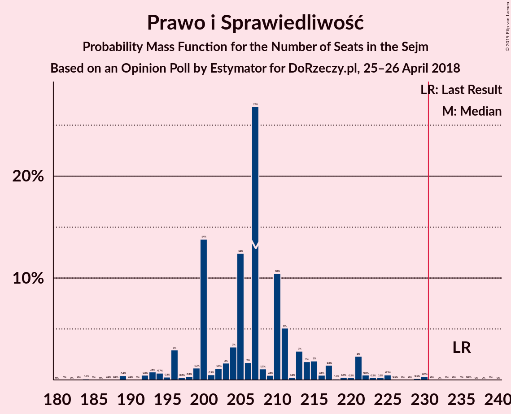
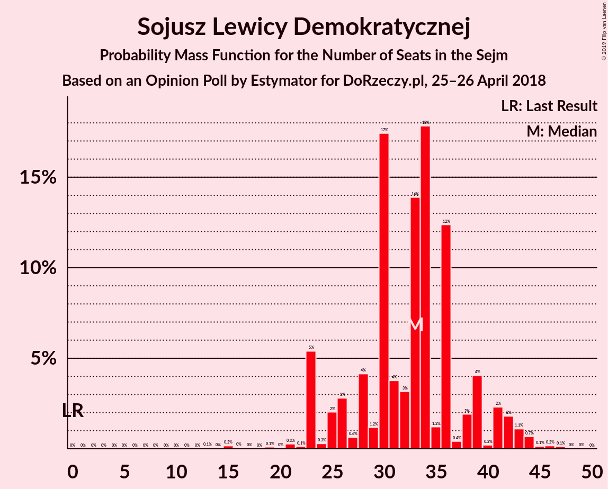
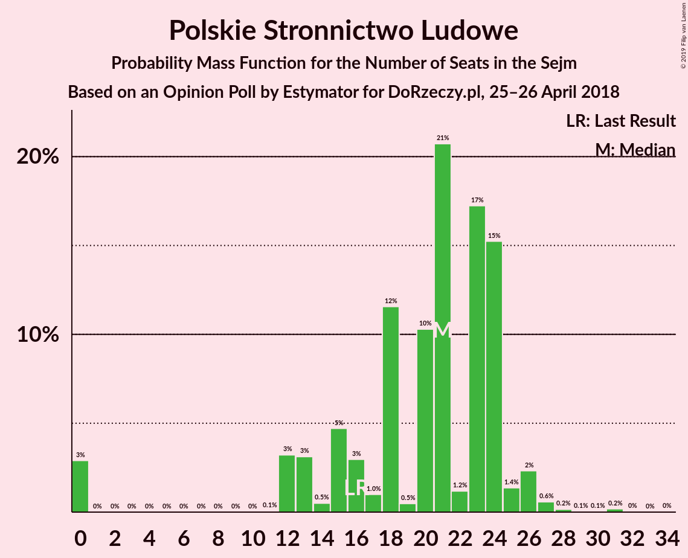
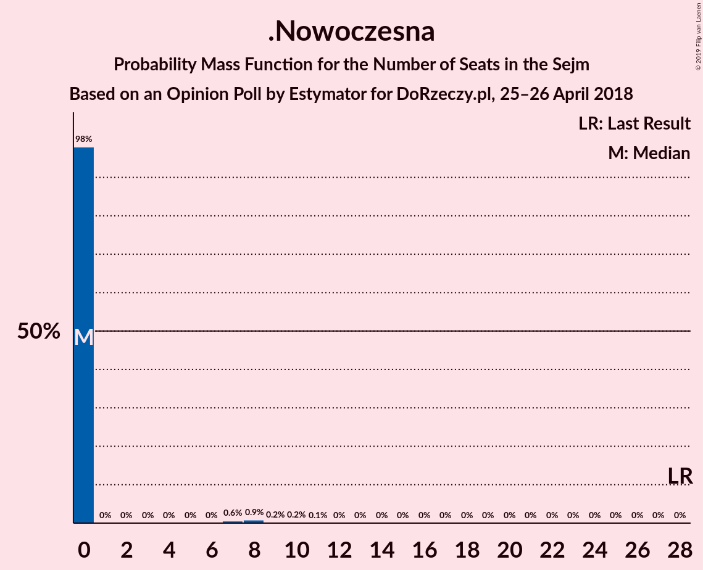
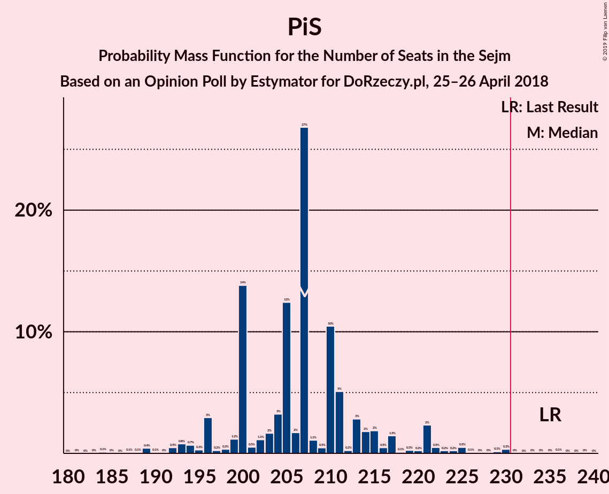

# Opinion Poll by Estymator for DoRzeczy.pl, 25–26 April 2018

<a href="#voting-intentions">Voting Intentions</a> | <a href="#seats">Seats</a> | <a href="#coalitions">Coalitions</a> | <a href="#technical-information">Technical Information</a>

## Voting Intentions

### Confidence Intervals

| Party | Last Result | Poll Result | 80% Confidence Interval | 90% Confidence Interval | 95% Confidence Interval | 99% Confidence Interval |
|:-----:|:-----------:|:-----------:|:-----------------------:|:-----------------------:|:-----------------------:|:-----------------------:|
| Prawo i Sprawiedliwość | 37.6% | 38.2% | 36.3–40.2% |35.8–40.8% |35.3–41.3% |34.4–42.2% |
| Platforma Obywatelska | 24.1% | 27.3% | 25.5–29.1% |25.1–29.7% |24.6–30.1% |23.8–31.0% |
| Kukiz’15 | 8.8% | 13.1% | 11.8–14.6% |11.5–15.0% |11.2–15.3% |10.6–16.0% |
| Sojusz Lewicy Demokratycznej | 7.6% | 8.6% | 7.5–9.8% |7.2–10.2% |7.0–10.5% |6.5–11.1% |
| Polskie Stronnictwo Ludowe | 5.1% | 6.2% | 5.3–7.3% |5.1–7.6% |4.9–7.9% |4.5–8.4% |
| .Nowoczesna | 7.6% | 3.9% | 3.3–4.8% |3.1–5.1% |2.9–5.3% |2.6–5.8% |
| Lewica Razem | 3.6% | 1.3% | 0.9–1.9% |0.8–2.0% |0.7–2.2% |0.6–2.5% |
| KORWiN | 4.8% | 1.1% | 0.8–1.6% |0.7–1.8% |0.6–1.9% |0.5–2.2% |

*Note:* The poll result column reflects the actual value used in the calculations. Published results may vary slightly, and in addition be rounded to fewer digits.

## Seats

### Confidence Intervals

| Party | Last Result | Median | 80% Confidence Interval | 90% Confidence Interval | 95% Confidence Interval | 99% Confidence Interval |
|:-----:|:-----------:|:------:|:-----------------------:|:-----------------------:|:-----------------------:|:-----------------------:|
| <a href="#prawo-i-sprawiedliwość">Prawo i Sprawiedliwość</a> | 235 | 211 | 211–213 |211–213 |211–213 |211–218 |
| <a href="#platforma-obywatelska">Platforma Obywatelska</a> | 138 | 141 | 141–149 |141–149 |141–149 |131–149 |
| <a href="#kukiz’15">Kukiz’15</a> | 42 | 53 | 52–53 |52–53 |52–53 |44–53 |
| <a href="#sojusz-lewicy-demokratycznej">Sojusz Lewicy Demokratycznej</a> | 0 | 34 | 26–34 |26–34 |26–34 |26–41 |
| <a href="#polskie-stronnictwo-ludowe">Polskie Stronnictwo Ludowe</a> | 16 | 21 | 20–21 |20–21 |20–21 |20–26 |
| <a href="#.nowoczesna">.Nowoczesna</a> | 28 | 0 | 0 |0 |0 |0 |
| <a href="#lewica-razem">Lewica Razem</a> | 0 | 0 | 0 |0 |0 |0 |
| <a href="#korwin">KORWiN</a> | 0 | 0 | 0 |0 |0 |0 |

### Prawo i Sprawiedliwość

*For a full overview of the results for this party, see the [Prawo i Sprawiedliwość](party-prawoisprawiedliwość.html) page.*

| Number of Seats | Probability | Accumulated | Special Marks |
|:---------------:|:-----------:|:-----------:|:-------------:|
| 201 | 0% | 100% |  |
| 202 | 0% | 99.9% |  |
| 203 | 0% | 99.9% |  |
| 204 | 0% | 99.9% |  |
| 205 | 0% | 99.9% |  |
| 206 | 0% | 99.9% |  |
| 207 | 0% | 99.9% |  |
| 208 | 0% | 99.9% |  |
| 209 | 0.2% | 99.9% |  |
| 210 | 0% | 99.7% |  |
| 211 | 78% | 99.7% | Median |
| 212 | 0% | 22% |  |
| 213 | 21% | 22% |  |
| 214 | 0% | 0.9% |  |
| 215 | 0% | 0.9% |  |
| 216 | 0% | 0.9% |  |
| 217 | 0% | 0.9% |  |
| 218 | 0.7% | 0.9% |  |
| 219 | 0% | 0.2% |  |
| 220 | 0% | 0.2% |  |
| 221 | 0% | 0.2% |  |
| 222 | 0% | 0.2% |  |
| 223 | 0% | 0.2% |  |
| 224 | 0% | 0.2% |  |
| 225 | 0.1% | 0.1% |  |
| 226 | 0% | 0% |  |
| 227 | 0% | 0% |  |
| 228 | 0% | 0% |  |
| 229 | 0% | 0% |  |
| 230 | 0% | 0% |  |
| 231 | 0% | 0% | Majority |
| 232 | 0% | 0% |  |
| 233 | 0% | 0% |  |
| 234 | 0% | 0% |  |
| 235 | 0% | 0% | Last Result |

### Platforma Obywatelska

*For a full overview of the results for this party, see the [Platforma Obywatelska](party-platformaobywatelska.html) page.*

| Number of Seats | Probability | Accumulated | Special Marks |
|:---------------:|:-----------:|:-----------:|:-------------:|
| 131 | 0.7% | 100% |  |
| 132 | 0% | 99.2% |  |
| 133 | 0% | 99.2% |  |
| 134 | 0% | 99.2% |  |
| 135 | 0% | 99.2% |  |
| 136 | 0.2% | 99.2% |  |
| 137 | 0% | 98.9% |  |
| 138 | 0% | 98.9% | Last Result |
| 139 | 0% | 98.9% |  |
| 140 | 0% | 98.9% |  |
| 141 | 78% | 98.9% | Median |
| 142 | 0% | 21% |  |
| 143 | 0% | 21% |  |
| 144 | 0% | 21% |  |
| 145 | 0% | 21% |  |
| 146 | 0.1% | 21% |  |
| 147 | 0% | 21% |  |
| 148 | 0% | 21% |  |
| 149 | 21% | 21% |  |
| 150 | 0% | 0% |  |

### Kukiz’15

*For a full overview of the results for this party, see the [Kukiz’15](party-kukiz’15.html) page.*

| Number of Seats | Probability | Accumulated | Special Marks |
|:---------------:|:-----------:|:-----------:|:-------------:|
| 42 | 0% | 100% | Last Result |
| 43 | 0% | 100% |  |
| 44 | 0.7% | 100% |  |
| 45 | 0.1% | 99.3% |  |
| 46 | 0% | 99.2% |  |
| 47 | 0% | 99.1% |  |
| 48 | 0% | 99.1% |  |
| 49 | 0% | 99.1% |  |
| 50 | 0% | 99.1% |  |
| 51 | 0% | 99.1% |  |
| 52 | 21% | 99.1% |  |
| 53 | 78% | 78% | Median |
| 54 | 0% | 0.1% |  |
| 55 | 0% | 0.1% |  |
| 56 | 0% | 0.1% |  |
| 57 | 0% | 0.1% |  |
| 58 | 0% | 0.1% |  |
| 59 | 0% | 0.1% |  |
| 60 | 0% | 0% |  |

### Sojusz Lewicy Demokratycznej

*For a full overview of the results for this party, see the [Sojusz Lewicy Demokratycznej](party-sojuszlewicydemokratycznej.html) page.*

| Number of Seats | Probability | Accumulated | Special Marks |
|:---------------:|:-----------:|:-----------:|:-------------:|
| 0 | 0% | 100% | Last Result |
| 1 | 0% | 100% |  |
| 2 | 0% | 100% |  |
| 3 | 0% | 100% |  |
| 4 | 0% | 100% |  |
| 5 | 0% | 100% |  |
| 6 | 0% | 100% |  |
| 7 | 0% | 100% |  |
| 8 | 0% | 100% |  |
| 9 | 0% | 100% |  |
| 10 | 0% | 100% |  |
| 11 | 0% | 100% |  |
| 12 | 0% | 100% |  |
| 13 | 0% | 100% |  |
| 14 | 0% | 100% |  |
| 15 | 0% | 100% |  |
| 16 | 0% | 100% |  |
| 17 | 0% | 100% |  |
| 18 | 0% | 100% |  |
| 19 | 0% | 100% |  |
| 20 | 0% | 100% |  |
| 21 | 0% | 100% |  |
| 22 | 0% | 100% |  |
| 23 | 0% | 100% |  |
| 24 | 0% | 99.9% |  |
| 25 | 0% | 99.9% |  |
| 26 | 21% | 99.9% |  |
| 27 | 0% | 79% |  |
| 28 | 0.1% | 79% |  |
| 29 | 0% | 79% |  |
| 30 | 0% | 79% |  |
| 31 | 0% | 79% |  |
| 32 | 0% | 79% |  |
| 33 | 0% | 79% |  |
| 34 | 78% | 79% | Median |
| 35 | 0% | 1.0% |  |
| 36 | 0% | 1.0% |  |
| 37 | 0% | 1.0% |  |
| 38 | 0% | 1.0% |  |
| 39 | 0.2% | 1.0% |  |
| 40 | 0% | 0.8% |  |
| 41 | 0.7% | 0.8% |  |
| 42 | 0% | 0% |  |

### Polskie Stronnictwo Ludowe

*For a full overview of the results for this party, see the [Polskie Stronnictwo Ludowe](party-polskiestronnictwoludowe.html) page.*

| Number of Seats | Probability | Accumulated | Special Marks |
|:---------------:|:-----------:|:-----------:|:-------------:|
| 16 | 0.1% | 100% | Last Result |
| 17 | 0% | 99.9% |  |
| 18 | 0% | 99.9% |  |
| 19 | 0% | 99.9% |  |
| 20 | 21% | 99.9% |  |
| 21 | 78% | 79% | Median |
| 22 | 0% | 1.0% |  |
| 23 | 0.3% | 1.0% |  |
| 24 | 0% | 0.7% |  |
| 25 | 0% | 0.7% |  |
| 26 | 0.7% | 0.7% |  |
| 27 | 0% | 0% |  |

### .Nowoczesna

*For a full overview of the results for this party, see the [.Nowoczesna](party-nowoczesna.html) page.*

| Number of Seats | Probability | Accumulated | Special Marks |
|:---------------:|:-----------:|:-----------:|:-------------:|
| 0 | 100% | 100% | Median |
| 1 | 0% | 0% |  |
| 2 | 0% | 0% |  |
| 3 | 0% | 0% |  |
| 4 | 0% | 0% |  |
| 5 | 0% | 0% |  |
| 6 | 0% | 0% |  |
| 7 | 0% | 0% |  |
| 8 | 0% | 0% |  |
| 9 | 0% | 0% |  |
| 10 | 0% | 0% |  |
| 11 | 0% | 0% |  |
| 12 | 0% | 0% |  |
| 13 | 0% | 0% |  |
| 14 | 0% | 0% |  |
| 15 | 0% | 0% |  |
| 16 | 0% | 0% |  |
| 17 | 0% | 0% |  |
| 18 | 0% | 0% |  |
| 19 | 0% | 0% |  |
| 20 | 0% | 0% |  |
| 21 | 0% | 0% |  |
| 22 | 0% | 0% |  |
| 23 | 0% | 0% |  |
| 24 | 0% | 0% |  |
| 25 | 0% | 0% |  |
| 26 | 0% | 0% |  |
| 27 | 0% | 0% |  |
| 28 | 0% | 0% | Last Result |

### Lewica Razem

*For a full overview of the results for this party, see the [Lewica Razem](party-lewicarazem.html) page.*

| Number of Seats | Probability | Accumulated | Special Marks |
|:---------------:|:-----------:|:-----------:|:-------------:|
| 0 | 100% | 100% | Last Result, Median |

### KORWiN

*For a full overview of the results for this party, see the [KORWiN](party-korwin.html) page.*

| Number of Seats | Probability | Accumulated | Special Marks |
|:---------------:|:-----------:|:-----------:|:-------------:|
| 0 | 100% | 100% | Last Result, Median |

## Coalitions

### Confidence Intervals

| Coalition | Last Result | Median | Majority? | 80% Confidence Interval | 90% Confidence Interval | 95% Confidence Interval | 99% Confidence Interval |
|:---------:|:-----------:|:------:|:---------:|:-----------------------:|:-----------------------:|:-----------------------:|:-----------------------:|
| Prawo i Sprawiedliwość | 235 | 211 | 0% | 211–213 | 211–213 | 211–213 | 211–218 |
| Platforma Obywatelska – Sojusz Lewicy Demokratycznej – Polskie Stronnictwo Ludowe – .Nowoczesna – Lewica Razem | 182 | 196 | 0% | 195–196 | 195–196 | 195–196 | 195–198 |
| Platforma Obywatelska – Sojusz Lewicy Demokratycznej – Polskie Stronnictwo Ludowe – .Nowoczesna | 182 | 196 | 0% | 195–196 | 195–196 | 195–196 | 195–198 |
| Platforma Obywatelska – Sojusz Lewicy Demokratycznej – .Nowoczesna | 166 | 175 | 0% | 175 | 175 | 175 | 172–175 |
| Platforma Obywatelska – Polskie Stronnictwo Ludowe – .Nowoczesna | 182 | 162 | 0% | 162–169 | 162–169 | 162–169 | 157–169 |
| Platforma Obywatelska – .Nowoczesna | 166 | 141 | 0% | 141–149 | 141–149 | 141–149 | 131–149 |
| Platforma Obywatelska | 138 | 141 | 0% | 141–149 | 141–149 | 141–149 | 131–149 |

### Prawo i Sprawiedliwość

| Number of Seats | Probability | Accumulated | Special Marks |
|:---------------:|:-----------:|:-----------:|:-------------:|
| 201 | 0% | 100% |  |
| 202 | 0% | 99.9% |  |
| 203 | 0% | 99.9% |  |
| 204 | 0% | 99.9% |  |
| 205 | 0% | 99.9% |  |
| 206 | 0% | 99.9% |  |
| 207 | 0% | 99.9% |  |
| 208 | 0% | 99.9% |  |
| 209 | 0.2% | 99.9% |  |
| 210 | 0% | 99.7% |  |
| 211 | 78% | 99.7% | Median |
| 212 | 0% | 22% |  |
| 213 | 21% | 22% |  |
| 214 | 0% | 0.9% |  |
| 215 | 0% | 0.9% |  |
| 216 | 0% | 0.9% |  |
| 217 | 0% | 0.9% |  |
| 218 | 0.7% | 0.9% |  |
| 219 | 0% | 0.2% |  |
| 220 | 0% | 0.2% |  |
| 221 | 0% | 0.2% |  |
| 222 | 0% | 0.2% |  |
| 223 | 0% | 0.2% |  |
| 224 | 0% | 0.2% |  |
| 225 | 0.1% | 0.1% |  |
| 226 | 0% | 0% |  |
| 227 | 0% | 0% |  |
| 228 | 0% | 0% |  |
| 229 | 0% | 0% |  |
| 230 | 0% | 0% |  |
| 231 | 0% | 0% | Majority |
| 232 | 0% | 0% |  |
| 233 | 0% | 0% |  |
| 234 | 0% | 0% |  |
| 235 | 0% | 0% | Last Result |

### Platforma Obywatelska – Sojusz Lewicy Demokratycznej – Polskie Stronnictwo Ludowe – .Nowoczesna – Lewica Razem

| Number of Seats | Probability | Accumulated | Special Marks |
|:---------------:|:-----------:|:-----------:|:-------------:|
| 182 | 0% | 100% | Last Result |
| 183 | 0% | 99.9% |  |
| 184 | 0% | 99.9% |  |
| 185 | 0% | 99.9% |  |
| 186 | 0% | 99.9% |  |
| 187 | 0% | 99.9% |  |
| 188 | 0% | 99.9% |  |
| 189 | 0% | 99.9% |  |
| 190 | 0.1% | 99.9% |  |
| 191 | 0% | 99.8% |  |
| 192 | 0% | 99.8% |  |
| 193 | 0% | 99.8% |  |
| 194 | 0% | 99.8% |  |
| 195 | 21% | 99.8% |  |
| 196 | 78% | 79% | Median |
| 197 | 0% | 1.0% |  |
| 198 | 1.0% | 1.0% |  |
| 199 | 0% | 0.1% |  |
| 200 | 0% | 0.1% |  |
| 201 | 0% | 0% |  |

### Platforma Obywatelska – Sojusz Lewicy Demokratycznej – Polskie Stronnictwo Ludowe – .Nowoczesna

| Number of Seats | Probability | Accumulated | Special Marks |
|:---------------:|:-----------:|:-----------:|:-------------:|
| 182 | 0% | 100% | Last Result |
| 183 | 0% | 99.9% |  |
| 184 | 0% | 99.9% |  |
| 185 | 0% | 99.9% |  |
| 186 | 0% | 99.9% |  |
| 187 | 0% | 99.9% |  |
| 188 | 0% | 99.9% |  |
| 189 | 0% | 99.9% |  |
| 190 | 0.1% | 99.9% |  |
| 191 | 0% | 99.8% |  |
| 192 | 0% | 99.8% |  |
| 193 | 0% | 99.8% |  |
| 194 | 0% | 99.8% |  |
| 195 | 21% | 99.8% |  |
| 196 | 78% | 79% | Median |
| 197 | 0% | 1.0% |  |
| 198 | 1.0% | 1.0% |  |
| 199 | 0% | 0.1% |  |
| 200 | 0% | 0.1% |  |
| 201 | 0% | 0% |  |

### Platforma Obywatelska – Sojusz Lewicy Demokratycznej – .Nowoczesna

| Number of Seats | Probability | Accumulated | Special Marks |
|:---------------:|:-----------:|:-----------:|:-------------:|
| 166 | 0% | 100% | Last Result |
| 167 | 0% | 99.9% |  |
| 168 | 0% | 99.9% |  |
| 169 | 0% | 99.9% |  |
| 170 | 0% | 99.9% |  |
| 171 | 0% | 99.9% |  |
| 172 | 0.7% | 99.9% |  |
| 173 | 0% | 99.2% |  |
| 174 | 0.1% | 99.2% |  |
| 175 | 99.1% | 99.1% | Median |
| 176 | 0% | 0.1% |  |
| 177 | 0% | 0.1% |  |
| 178 | 0% | 0% |  |

### Platforma Obywatelska – Polskie Stronnictwo Ludowe – .Nowoczesna

| Number of Seats | Probability | Accumulated | Special Marks |
|:---------------:|:-----------:|:-----------:|:-------------:|
| 157 | 0.8% | 100% |  |
| 158 | 0% | 99.2% |  |
| 159 | 0.2% | 99.2% |  |
| 160 | 0% | 98.9% |  |
| 161 | 0% | 98.9% |  |
| 162 | 78% | 98.9% | Median |
| 163 | 0% | 21% |  |
| 164 | 0% | 21% |  |
| 165 | 0% | 21% |  |
| 166 | 0% | 21% |  |
| 167 | 0% | 21% |  |
| 168 | 0% | 21% |  |
| 169 | 21% | 21% |  |
| 170 | 0% | 0% |  |
| 171 | 0% | 0% |  |
| 172 | 0% | 0% |  |
| 173 | 0% | 0% |  |
| 174 | 0% | 0% |  |
| 175 | 0% | 0% |  |
| 176 | 0% | 0% |  |
| 177 | 0% | 0% |  |
| 178 | 0% | 0% |  |
| 179 | 0% | 0% |  |
| 180 | 0% | 0% |  |
| 181 | 0% | 0% |  |
| 182 | 0% | 0% | Last Result |

### Platforma Obywatelska – .Nowoczesna

| Number of Seats | Probability | Accumulated | Special Marks |
|:---------------:|:-----------:|:-----------:|:-------------:|
| 131 | 0.7% | 100% |  |
| 132 | 0% | 99.2% |  |
| 133 | 0% | 99.2% |  |
| 134 | 0% | 99.2% |  |
| 135 | 0% | 99.2% |  |
| 136 | 0.2% | 99.2% |  |
| 137 | 0% | 98.9% |  |
| 138 | 0% | 98.9% |  |
| 139 | 0% | 98.9% |  |
| 140 | 0% | 98.9% |  |
| 141 | 78% | 98.9% | Median |
| 142 | 0% | 21% |  |
| 143 | 0% | 21% |  |
| 144 | 0% | 21% |  |
| 145 | 0% | 21% |  |
| 146 | 0.1% | 21% |  |
| 147 | 0% | 21% |  |
| 148 | 0% | 21% |  |
| 149 | 21% | 21% |  |
| 150 | 0% | 0% |  |
| 151 | 0% | 0% |  |
| 152 | 0% | 0% |  |
| 153 | 0% | 0% |  |
| 154 | 0% | 0% |  |
| 155 | 0% | 0% |  |
| 156 | 0% | 0% |  |
| 157 | 0% | 0% |  |
| 158 | 0% | 0% |  |
| 159 | 0% | 0% |  |
| 160 | 0% | 0% |  |
| 161 | 0% | 0% |  |
| 162 | 0% | 0% |  |
| 163 | 0% | 0% |  |
| 164 | 0% | 0% |  |
| 165 | 0% | 0% |  |
| 166 | 0% | 0% | Last Result |

### Platforma Obywatelska

| Number of Seats | Probability | Accumulated | Special Marks |
|:---------------:|:-----------:|:-----------:|:-------------:|
| 131 | 0.7% | 100% |  |
| 132 | 0% | 99.2% |  |
| 133 | 0% | 99.2% |  |
| 134 | 0% | 99.2% |  |
| 135 | 0% | 99.2% |  |
| 136 | 0.2% | 99.2% |  |
| 137 | 0% | 98.9% |  |
| 138 | 0% | 98.9% | Last Result |
| 139 | 0% | 98.9% |  |
| 140 | 0% | 98.9% |  |
| 141 | 78% | 98.9% | Median |
| 142 | 0% | 21% |  |
| 143 | 0% | 21% |  |
| 144 | 0% | 21% |  |
| 145 | 0% | 21% |  |
| 146 | 0.1% | 21% |  |
| 147 | 0% | 21% |  |
| 148 | 0% | 21% |  |
| 149 | 21% | 21% |  |
| 150 | 0% | 0% |  |

## Technical Information

### Opinion Poll

+ **Polling firm:** Estymator
+ **Commissioner(s):** DoRzeczy.pl
+ **Fieldwork period:** 25–26 April 2018

### Calculations

+ **Sample size:** 1015
+ **Simulations done:** 1,024
+ **Error estimate:** 1.89%

