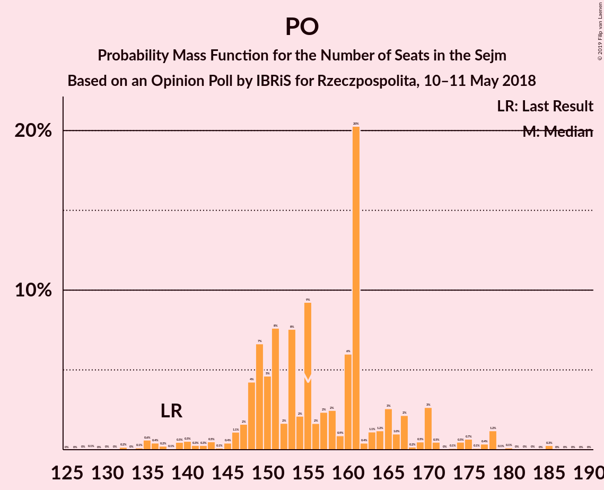

# Opinion Poll by IBRiS for Rzeczpospolita, 10–11 May 2018

<a href="#voting-intentions">Voting Intentions</a> | <a href="#seats">Seats</a> | <a href="#coalitions">Coalitions</a> | <a href="#technical-information">Technical Information</a>

## Voting Intentions

### Confidence Intervals

| Party | Last Result | Poll Result | 80% Confidence Interval | 90% Confidence Interval | 95% Confidence Interval | 99% Confidence Interval |
|:-----:|:-----------:|:-----------:|:-----------------------:|:-----------------------:|:-----------------------:|:-----------------------:|
| Prawo i Sprawiedliwość | 37.6% | 37.6% | 35.8–39.5% |35.3–40.1% |34.8–40.5% |33.9–41.5% |
| Platforma Obywatelska | 24.1% | 27.3% | 25.6–29.1% |25.1–29.6% |24.7–30.0% |23.9–30.8% |
| Sojusz Lewicy Demokratycznej | 7.6% | 10.4% | 9.3–11.6% |9.0–12.0% |8.7–12.3% |8.2–12.9% |
| Kukiz’15 | 8.8% | 6.3% | 5.4–7.3% |5.2–7.6% |5.0–7.9% |4.6–8.4% |
| Polskie Stronnictwo Ludowe | 5.1% | 5.3% | 4.5–6.2% |4.3–6.5% |4.1–6.8% |3.7–7.3% |
| .Nowoczesna | 7.6% | 2.9% | 2.3–3.7% |2.2–3.9% |2.1–4.1% |1.8–4.5% |
| KORWiN | 4.8% | 1.5% | 1.1–2.0% |1.0–2.2% |0.9–2.4% |0.7–2.7% |
| Lewica Razem | 3.6% | 1.0% | 0.7–1.5% |0.6–1.7% |0.6–1.8% |0.4–2.1% |

*Note:* The poll result column reflects the actual value used in the calculations. Published results may vary slightly, and in addition be rounded to fewer digits.

## Seats

### Confidence Intervals

| Party | Last Result | Median | 80% Confidence Interval | 90% Confidence Interval | 95% Confidence Interval | 99% Confidence Interval |
|:-----:|:-----------:|:------:|:-----------------------:|:-----------------------:|:-----------------------:|:-----------------------:|
| <a href="#prawo-i-sprawiedliwość">Prawo i Sprawiedliwość</a> | 235 | 218 | 215–240 |215–245 |215–251 |213–253 |
| <a href="#platforma-obywatelska">Platforma Obywatelska</a> | 138 | 150 | 134–158 |134–158 |134–167 |134–167 |
| <a href="#sojusz-lewicy-demokratycznej">Sojusz Lewicy Demokratycznej</a> | 0 | 54 | 44–60 |39–60 |39–60 |35–61 |
| <a href="#kukiz’15">Kukiz’15</a> | 42 | 16 | 14–32 |8–32 |0–32 |0–32 |
| <a href="#polskie-stronnictwo-ludowe">Polskie Stronnictwo Ludowe</a> | 16 | 19 | 0–22 |0–22 |0–24 |0–27 |
| <a href="#.nowoczesna">.Nowoczesna</a> | 28 | 0 | 0 |0 |0 |0 |
| <a href="#korwin">KORWiN</a> | 0 | 0 | 0 |0 |0 |0 |
| <a href="#lewica-razem">Lewica Razem</a> | 0 | 0 | 0 |0 |0 |0 |

### Prawo i Sprawiedliwość

*For a full overview of the results for this party, see the [Prawo i Sprawiedliwość](party-prawoisprawiedliwość.html) page.*

| Number of Seats | Probability | Accumulated | Special Marks |
|:---------------:|:-----------:|:-----------:|:-------------:|
| 209 | 0% | 100% |  |
| 210 | 0% | 99.9% |  |
| 211 | 0% | 99.9% |  |
| 212 | 0% | 99.9% |  |
| 213 | 1.0% | 99.9% |  |
| 214 | 0% | 99.0% |  |
| 215 | 48% | 99.0% |  |
| 216 | 0% | 51% |  |
| 217 | 0.1% | 51% |  |
| 218 | 1.5% | 51% | Median |
| 219 | 1.0% | 49% |  |
| 220 | 0% | 48% |  |
| 221 | 0% | 48% |  |
| 222 | 0% | 48% |  |
| 223 | 0% | 48% |  |
| 224 | 0% | 48% |  |
| 225 | 0% | 48% |  |
| 226 | 0% | 48% |  |
| 227 | 6% | 48% |  |
| 228 | 0.1% | 42% |  |
| 229 | 0% | 42% |  |
| 230 | 0% | 42% |  |
| 231 | 13% | 42% | Majority |
| 232 | 0% | 29% |  |
| 233 | 13% | 29% |  |
| 234 | 0.1% | 16% |  |
| 235 | 0% | 16% | Last Result |
| 236 | 0% | 16% |  |
| 237 | 0% | 16% |  |
| 238 | 0% | 16% |  |
| 239 | 0.6% | 16% |  |
| 240 | 8% | 15% |  |
| 241 | 0% | 7% |  |
| 242 | 0% | 7% |  |
| 243 | 0% | 7% |  |
| 244 | 0% | 7% |  |
| 245 | 4% | 7% |  |
| 246 | 0% | 3% |  |
| 247 | 0% | 3% |  |
| 248 | 0% | 3% |  |
| 249 | 0% | 3% |  |
| 250 | 0% | 3% |  |
| 251 | 1.3% | 3% |  |
| 252 | 0% | 2% |  |
| 253 | 2% | 2% |  |
| 254 | 0% | 0% |  |

### Platforma Obywatelska

*For a full overview of the results for this party, see the [Platforma Obywatelska](party-platformaobywatelska.html) page.*

| Number of Seats | Probability | Accumulated | Special Marks |
|:---------------:|:-----------:|:-----------:|:-------------:|
| 134 | 21% | 100% |  |
| 135 | 0% | 79% |  |
| 136 | 0% | 79% |  |
| 137 | 0% | 79% |  |
| 138 | 0% | 79% | Last Result |
| 139 | 0% | 79% |  |
| 140 | 0.2% | 79% |  |
| 141 | 0% | 79% |  |
| 142 | 0% | 79% |  |
| 143 | 11% | 79% |  |
| 144 | 0% | 68% |  |
| 145 | 0% | 68% |  |
| 146 | 1.1% | 68% |  |
| 147 | 2% | 67% |  |
| 148 | 0% | 65% |  |
| 149 | 0% | 65% |  |
| 150 | 48% | 65% | Median |
| 151 | 3% | 16% |  |
| 152 | 0% | 14% |  |
| 153 | 0% | 14% |  |
| 154 | 0% | 13% |  |
| 155 | 0% | 13% |  |
| 156 | 2% | 13% |  |
| 157 | 0.1% | 11% |  |
| 158 | 6% | 11% |  |
| 159 | 0% | 5% |  |
| 160 | 0% | 5% |  |
| 161 | 0.5% | 5% |  |
| 162 | 0% | 4% |  |
| 163 | 0% | 4% |  |
| 164 | 0% | 4% |  |
| 165 | 0% | 4% |  |
| 166 | 0% | 4% |  |
| 167 | 4% | 4% |  |
| 168 | 0% | 0% |  |

### Sojusz Lewicy Demokratycznej

*For a full overview of the results for this party, see the [Sojusz Lewicy Demokratycznej](party-sojuszlewicydemokratycznej.html) page.*

| Number of Seats | Probability | Accumulated | Special Marks |
|:---------------:|:-----------:|:-----------:|:-------------:|
| 0 | 0% | 100% | Last Result |
| 1 | 0% | 100% |  |
| 2 | 0% | 100% |  |
| 3 | 0% | 100% |  |
| 4 | 0% | 100% |  |
| 5 | 0% | 100% |  |
| 6 | 0% | 100% |  |
| 7 | 0% | 100% |  |
| 8 | 0% | 100% |  |
| 9 | 0% | 100% |  |
| 10 | 0% | 100% |  |
| 11 | 0% | 100% |  |
| 12 | 0% | 100% |  |
| 13 | 0% | 100% |  |
| 14 | 0% | 100% |  |
| 15 | 0% | 100% |  |
| 16 | 0% | 100% |  |
| 17 | 0% | 100% |  |
| 18 | 0% | 100% |  |
| 19 | 0% | 100% |  |
| 20 | 0% | 100% |  |
| 21 | 0% | 100% |  |
| 22 | 0% | 100% |  |
| 23 | 0% | 100% |  |
| 24 | 0% | 100% |  |
| 25 | 0% | 100% |  |
| 26 | 0% | 100% |  |
| 27 | 0% | 100% |  |
| 28 | 0% | 100% |  |
| 29 | 0% | 100% |  |
| 30 | 0% | 100% |  |
| 31 | 0% | 100% |  |
| 32 | 0% | 100% |  |
| 33 | 0% | 100% |  |
| 34 | 0% | 100% |  |
| 35 | 1.3% | 100% |  |
| 36 | 0.1% | 98.6% |  |
| 37 | 0% | 98.6% |  |
| 38 | 0% | 98.6% |  |
| 39 | 6% | 98.6% |  |
| 40 | 0% | 92% |  |
| 41 | 0.1% | 92% |  |
| 42 | 0% | 92% |  |
| 43 | 2% | 92% |  |
| 44 | 15% | 90% |  |
| 45 | 0% | 75% |  |
| 46 | 0% | 75% |  |
| 47 | 0% | 75% |  |
| 48 | 15% | 75% |  |
| 49 | 0.1% | 61% |  |
| 50 | 0% | 60% |  |
| 51 | 1.4% | 60% |  |
| 52 | 0.2% | 59% |  |
| 53 | 0% | 59% |  |
| 54 | 11% | 59% | Median |
| 55 | 0% | 48% |  |
| 56 | 1.0% | 48% |  |
| 57 | 0% | 47% |  |
| 58 | 0% | 47% |  |
| 59 | 0% | 47% |  |
| 60 | 46% | 47% |  |
| 61 | 1.5% | 2% |  |
| 62 | 0% | 0% |  |

### Kukiz’15

*For a full overview of the results for this party, see the [Kukiz’15](party-kukiz’15.html) page.*

| Number of Seats | Probability | Accumulated | Special Marks |
|:---------------:|:-----------:|:-----------:|:-------------:|
| 0 | 4% | 100% |  |
| 1 | 0% | 96% |  |
| 2 | 0% | 96% |  |
| 3 | 0% | 96% |  |
| 4 | 0% | 96% |  |
| 5 | 0% | 96% |  |
| 6 | 0% | 96% |  |
| 7 | 0% | 96% |  |
| 8 | 2% | 96% |  |
| 9 | 0.4% | 94% |  |
| 10 | 0% | 93% |  |
| 11 | 0.1% | 93% |  |
| 12 | 0% | 93% |  |
| 13 | 1.5% | 93% |  |
| 14 | 8% | 92% |  |
| 15 | 1.0% | 83% |  |
| 16 | 46% | 82% | Median |
| 17 | 0% | 37% |  |
| 18 | 0% | 37% |  |
| 19 | 0% | 37% |  |
| 20 | 0% | 37% |  |
| 21 | 0% | 37% |  |
| 22 | 8% | 37% |  |
| 23 | 4% | 29% |  |
| 24 | 1.0% | 25% |  |
| 25 | 0% | 24% |  |
| 26 | 0% | 24% |  |
| 27 | 0% | 24% |  |
| 28 | 0% | 24% |  |
| 29 | 0% | 24% |  |
| 30 | 11% | 24% |  |
| 31 | 0% | 13% |  |
| 32 | 13% | 13% |  |
| 33 | 0% | 0.2% |  |
| 34 | 0% | 0.2% |  |
| 35 | 0% | 0.2% |  |
| 36 | 0% | 0.2% |  |
| 37 | 0% | 0.2% |  |
| 38 | 0.1% | 0.2% |  |
| 39 | 0% | 0% |  |
| 40 | 0% | 0% |  |
| 41 | 0% | 0% |  |
| 42 | 0% | 0% | Last Result |

### Polskie Stronnictwo Ludowe

*For a full overview of the results for this party, see the [Polskie Stronnictwo Ludowe](party-polskiestronnictwoludowe.html) page.*

| Number of Seats | Probability | Accumulated | Special Marks |
|:---------------:|:-----------:|:-----------:|:-------------:|
| 0 | 19% | 100% |  |
| 1 | 0% | 81% |  |
| 2 | 0% | 81% |  |
| 3 | 0% | 81% |  |
| 4 | 0% | 81% |  |
| 5 | 0% | 81% |  |
| 6 | 0% | 81% |  |
| 7 | 0% | 81% |  |
| 8 | 0% | 81% |  |
| 9 | 0% | 81% |  |
| 10 | 0% | 81% |  |
| 11 | 0% | 81% |  |
| 12 | 0% | 81% |  |
| 13 | 0.1% | 81% |  |
| 14 | 0% | 81% |  |
| 15 | 0% | 81% |  |
| 16 | 8% | 81% | Last Result |
| 17 | 2% | 73% |  |
| 18 | 0% | 72% |  |
| 19 | 61% | 72% | Median |
| 20 | 0.1% | 11% |  |
| 21 | 0% | 11% |  |
| 22 | 8% | 11% |  |
| 23 | 0% | 3% |  |
| 24 | 1.0% | 3% |  |
| 25 | 0% | 2% |  |
| 26 | 0% | 2% |  |
| 27 | 2% | 2% |  |
| 28 | 0% | 0% |  |

### .Nowoczesna

*For a full overview of the results for this party, see the [.Nowoczesna](party-nowoczesna.html) page.*

| Number of Seats | Probability | Accumulated | Special Marks |
|:---------------:|:-----------:|:-----------:|:-------------:|
| 0 | 100% | 100% | Median |
| 1 | 0% | 0% |  |
| 2 | 0% | 0% |  |
| 3 | 0% | 0% |  |
| 4 | 0% | 0% |  |
| 5 | 0% | 0% |  |
| 6 | 0% | 0% |  |
| 7 | 0% | 0% |  |
| 8 | 0% | 0% |  |
| 9 | 0% | 0% |  |
| 10 | 0% | 0% |  |
| 11 | 0% | 0% |  |
| 12 | 0% | 0% |  |
| 13 | 0% | 0% |  |
| 14 | 0% | 0% |  |
| 15 | 0% | 0% |  |
| 16 | 0% | 0% |  |
| 17 | 0% | 0% |  |
| 18 | 0% | 0% |  |
| 19 | 0% | 0% |  |
| 20 | 0% | 0% |  |
| 21 | 0% | 0% |  |
| 22 | 0% | 0% |  |
| 23 | 0% | 0% |  |
| 24 | 0% | 0% |  |
| 25 | 0% | 0% |  |
| 26 | 0% | 0% |  |
| 27 | 0% | 0% |  |
| 28 | 0% | 0% | Last Result |

### KORWiN

*For a full overview of the results for this party, see the [KORWiN](party-korwin.html) page.*

| Number of Seats | Probability | Accumulated | Special Marks |
|:---------------:|:-----------:|:-----------:|:-------------:|
| 0 | 100% | 100% | Last Result, Median |

### Lewica Razem

*For a full overview of the results for this party, see the [Lewica Razem](party-lewicarazem.html) page.*

| Number of Seats | Probability | Accumulated | Special Marks |
|:---------------:|:-----------:|:-----------:|:-------------:|
| 0 | 100% | 100% | Last Result, Median |

## Coalitions

### Confidence Intervals

| Coalition | Last Result | Median | Majority? | 80% Confidence Interval | 90% Confidence Interval | 95% Confidence Interval | 99% Confidence Interval |
|:---------:|:-----------:|:------:|:---------:|:-----------------------:|:-----------------------:|:-----------------------:|:-----------------------:|
| Prawo i Sprawiedliwość | 235 | 218 | 42% | 215–240 | 215–245 | 215–251 | 213–253 |
| Platforma Obywatelska – Sojusz Lewicy Demokratycznej – Polskie Stronnictwo Ludowe – .Nowoczesna – Lewica Razem | 182 | 222 | 0% | 197–229 | 197–229 | 193–229 | 186–229 |
| Platforma Obywatelska – Sojusz Lewicy Demokratycznej – Polskie Stronnictwo Ludowe – .Nowoczesna | 182 | 222 | 0% | 197–229 | 197–229 | 193–229 | 186–229 |
| Platforma Obywatelska – Sojusz Lewicy Demokratycznej – .Nowoczesna | 166 | 210 | 0% | 178–210 | 178–212 | 178–215 | 178–215 |
| Platforma Obywatelska – Polskie Stronnictwo Ludowe – .Nowoczesna | 182 | 169 | 0% | 143–174 | 143–180 | 143–180 | 143–180 |
| Platforma Obywatelska – .Nowoczesna | 166 | 150 | 0% | 134–158 | 134–158 | 134–167 | 134–167 |
| Platforma Obywatelska | 138 | 150 | 0% | 134–158 | 134–158 | 134–167 | 134–167 |

### Prawo i Sprawiedliwość

| Number of Seats | Probability | Accumulated | Special Marks |
|:---------------:|:-----------:|:-----------:|:-------------:|
| 209 | 0% | 100% |  |
| 210 | 0% | 99.9% |  |
| 211 | 0% | 99.9% |  |
| 212 | 0% | 99.9% |  |
| 213 | 1.0% | 99.9% |  |
| 214 | 0% | 99.0% |  |
| 215 | 48% | 99.0% |  |
| 216 | 0% | 51% |  |
| 217 | 0.1% | 51% |  |
| 218 | 1.5% | 51% | Median |
| 219 | 1.0% | 49% |  |
| 220 | 0% | 48% |  |
| 221 | 0% | 48% |  |
| 222 | 0% | 48% |  |
| 223 | 0% | 48% |  |
| 224 | 0% | 48% |  |
| 225 | 0% | 48% |  |
| 226 | 0% | 48% |  |
| 227 | 6% | 48% |  |
| 228 | 0.1% | 42% |  |
| 229 | 0% | 42% |  |
| 230 | 0% | 42% |  |
| 231 | 13% | 42% | Majority |
| 232 | 0% | 29% |  |
| 233 | 13% | 29% |  |
| 234 | 0.1% | 16% |  |
| 235 | 0% | 16% | Last Result |
| 236 | 0% | 16% |  |
| 237 | 0% | 16% |  |
| 238 | 0% | 16% |  |
| 239 | 0.6% | 16% |  |
| 240 | 8% | 15% |  |
| 241 | 0% | 7% |  |
| 242 | 0% | 7% |  |
| 243 | 0% | 7% |  |
| 244 | 0% | 7% |  |
| 245 | 4% | 7% |  |
| 246 | 0% | 3% |  |
| 247 | 0% | 3% |  |
| 248 | 0% | 3% |  |
| 249 | 0% | 3% |  |
| 250 | 0% | 3% |  |
| 251 | 1.3% | 3% |  |
| 252 | 0% | 2% |  |
| 253 | 2% | 2% |  |
| 254 | 0% | 0% |  |

### Platforma Obywatelska – Sojusz Lewicy Demokratycznej – Polskie Stronnictwo Ludowe – .Nowoczesna – Lewica Razem

| Number of Seats | Probability | Accumulated | Special Marks |
|:---------------:|:-----------:|:-----------:|:-------------:|
| 182 | 0% | 100% | Last Result |
| 183 | 0% | 100% |  |
| 184 | 0% | 100% |  |
| 185 | 0% | 100% |  |
| 186 | 1.3% | 100% |  |
| 187 | 0% | 98.7% |  |
| 188 | 0% | 98.7% |  |
| 189 | 0% | 98.7% |  |
| 190 | 0% | 98.7% |  |
| 191 | 0% | 98.7% |  |
| 192 | 0% | 98.7% |  |
| 193 | 2% | 98.7% |  |
| 194 | 0.1% | 97% |  |
| 195 | 0% | 97% |  |
| 196 | 0% | 97% |  |
| 197 | 23% | 97% |  |
| 198 | 8% | 73% |  |
| 199 | 0% | 65% |  |
| 200 | 0% | 65% |  |
| 201 | 0% | 65% |  |
| 202 | 0% | 65% |  |
| 203 | 0% | 65% |  |
| 204 | 0% | 65% |  |
| 205 | 0% | 65% |  |
| 206 | 0% | 65% |  |
| 207 | 0% | 65% |  |
| 208 | 0% | 65% |  |
| 209 | 0% | 65% |  |
| 210 | 0% | 65% |  |
| 211 | 0% | 65% |  |
| 212 | 0.4% | 65% |  |
| 213 | 0% | 65% |  |
| 214 | 0% | 65% |  |
| 215 | 4% | 65% |  |
| 216 | 0% | 61% |  |
| 217 | 0% | 61% |  |
| 218 | 0% | 61% |  |
| 219 | 9% | 61% |  |
| 220 | 0.1% | 52% |  |
| 221 | 0% | 52% |  |
| 222 | 2% | 52% |  |
| 223 | 1.0% | 49% | Median |
| 224 | 0% | 48% |  |
| 225 | 0% | 48% |  |
| 226 | 1.0% | 48% |  |
| 227 | 0% | 47% |  |
| 228 | 0% | 47% |  |
| 229 | 47% | 47% |  |
| 230 | 0% | 0% |  |

### Platforma Obywatelska – Sojusz Lewicy Demokratycznej – Polskie Stronnictwo Ludowe – .Nowoczesna

| Number of Seats | Probability | Accumulated | Special Marks |
|:---------------:|:-----------:|:-----------:|:-------------:|
| 182 | 0% | 100% | Last Result |
| 183 | 0% | 100% |  |
| 184 | 0% | 100% |  |
| 185 | 0% | 100% |  |
| 186 | 1.3% | 100% |  |
| 187 | 0% | 98.7% |  |
| 188 | 0% | 98.7% |  |
| 189 | 0% | 98.7% |  |
| 190 | 0% | 98.7% |  |
| 191 | 0% | 98.7% |  |
| 192 | 0% | 98.7% |  |
| 193 | 2% | 98.7% |  |
| 194 | 0.1% | 97% |  |
| 195 | 0% | 97% |  |
| 196 | 0% | 97% |  |
| 197 | 23% | 97% |  |
| 198 | 8% | 73% |  |
| 199 | 0% | 65% |  |
| 200 | 0% | 65% |  |
| 201 | 0% | 65% |  |
| 202 | 0% | 65% |  |
| 203 | 0% | 65% |  |
| 204 | 0% | 65% |  |
| 205 | 0% | 65% |  |
| 206 | 0% | 65% |  |
| 207 | 0% | 65% |  |
| 208 | 0% | 65% |  |
| 209 | 0% | 65% |  |
| 210 | 0% | 65% |  |
| 211 | 0% | 65% |  |
| 212 | 0.4% | 65% |  |
| 213 | 0% | 65% |  |
| 214 | 0% | 65% |  |
| 215 | 4% | 65% |  |
| 216 | 0% | 61% |  |
| 217 | 0% | 61% |  |
| 218 | 0% | 61% |  |
| 219 | 9% | 61% |  |
| 220 | 0.1% | 52% |  |
| 221 | 0% | 52% |  |
| 222 | 2% | 52% |  |
| 223 | 1.0% | 49% | Median |
| 224 | 0% | 48% |  |
| 225 | 0% | 48% |  |
| 226 | 1.0% | 48% |  |
| 227 | 0% | 47% |  |
| 228 | 0% | 47% |  |
| 229 | 47% | 47% |  |
| 230 | 0% | 0% |  |

### Platforma Obywatelska – Sojusz Lewicy Demokratycznej – .Nowoczesna

| Number of Seats | Probability | Accumulated | Special Marks |
|:---------------:|:-----------:|:-----------:|:-------------:|
| 166 | 0% | 100% | Last Result |
| 167 | 0% | 100% |  |
| 168 | 0% | 100% |  |
| 169 | 0% | 100% |  |
| 170 | 0% | 100% |  |
| 171 | 0% | 100% |  |
| 172 | 0% | 100% |  |
| 173 | 0% | 100% |  |
| 174 | 0% | 100% |  |
| 175 | 0% | 100% |  |
| 176 | 0% | 100% |  |
| 177 | 0% | 100% |  |
| 178 | 13% | 100% |  |
| 179 | 0% | 87% |  |
| 180 | 0% | 87% |  |
| 181 | 0.1% | 87% |  |
| 182 | 8% | 87% |  |
| 183 | 0% | 79% |  |
| 184 | 0% | 79% |  |
| 185 | 0% | 79% |  |
| 186 | 1.3% | 79% |  |
| 187 | 0% | 78% |  |
| 188 | 0% | 78% |  |
| 189 | 0% | 78% |  |
| 190 | 0% | 78% |  |
| 191 | 0% | 78% |  |
| 192 | 0% | 78% |  |
| 193 | 2% | 78% |  |
| 194 | 0% | 76% |  |
| 195 | 2% | 76% |  |
| 196 | 0% | 73% |  |
| 197 | 17% | 73% |  |
| 198 | 0.2% | 56% |  |
| 199 | 0% | 56% |  |
| 200 | 3% | 56% |  |
| 201 | 1.0% | 54% |  |
| 202 | 1.0% | 53% |  |
| 203 | 0% | 52% |  |
| 204 | 0% | 52% | Median |
| 205 | 0% | 52% |  |
| 206 | 0% | 52% |  |
| 207 | 0% | 52% |  |
| 208 | 0% | 52% |  |
| 209 | 0% | 52% |  |
| 210 | 46% | 52% |  |
| 211 | 0% | 6% |  |
| 212 | 2% | 6% |  |
| 213 | 0% | 4% |  |
| 214 | 0% | 4% |  |
| 215 | 4% | 4% |  |
| 216 | 0% | 0% |  |

### Platforma Obywatelska – Polskie Stronnictwo Ludowe – .Nowoczesna

| Number of Seats | Probability | Accumulated | Special Marks |
|:---------------:|:-----------:|:-----------:|:-------------:|
| 143 | 11% | 100% |  |
| 144 | 0% | 89% |  |
| 145 | 0% | 89% |  |
| 146 | 0.2% | 89% |  |
| 147 | 0% | 89% |  |
| 148 | 0% | 89% |  |
| 149 | 0% | 89% |  |
| 150 | 10% | 89% |  |
| 151 | 1.3% | 79% |  |
| 152 | 0% | 78% |  |
| 153 | 13% | 78% |  |
| 154 | 0% | 65% |  |
| 155 | 0% | 65% |  |
| 156 | 0% | 65% |  |
| 157 | 0% | 65% |  |
| 158 | 0% | 65% |  |
| 159 | 0% | 65% |  |
| 160 | 0% | 65% |  |
| 161 | 0.4% | 65% |  |
| 162 | 0% | 65% |  |
| 163 | 0% | 65% |  |
| 164 | 0% | 65% |  |
| 165 | 0% | 65% |  |
| 166 | 0% | 65% |  |
| 167 | 4% | 65% |  |
| 168 | 1.5% | 61% |  |
| 169 | 46% | 59% | Median |
| 170 | 1.0% | 13% |  |
| 171 | 0.1% | 13% |  |
| 172 | 1.0% | 12% |  |
| 173 | 0% | 11% |  |
| 174 | 2% | 11% |  |
| 175 | 2% | 9% |  |
| 176 | 0% | 7% |  |
| 177 | 0% | 7% |  |
| 178 | 0% | 7% |  |
| 179 | 0.1% | 7% |  |
| 180 | 6% | 6% |  |
| 181 | 0% | 0% |  |
| 182 | 0% | 0% | Last Result |

### Platforma Obywatelska – .Nowoczesna

| Number of Seats | Probability | Accumulated | Special Marks |
|:---------------:|:-----------:|:-----------:|:-------------:|
| 134 | 21% | 100% |  |
| 135 | 0% | 79% |  |
| 136 | 0% | 79% |  |
| 137 | 0% | 79% |  |
| 138 | 0% | 79% |  |
| 139 | 0% | 79% |  |
| 140 | 0.2% | 79% |  |
| 141 | 0% | 79% |  |
| 142 | 0% | 79% |  |
| 143 | 11% | 79% |  |
| 144 | 0% | 68% |  |
| 145 | 0% | 68% |  |
| 146 | 1.1% | 68% |  |
| 147 | 2% | 67% |  |
| 148 | 0% | 65% |  |
| 149 | 0% | 65% |  |
| 150 | 48% | 65% | Median |
| 151 | 3% | 16% |  |
| 152 | 0% | 14% |  |
| 153 | 0% | 14% |  |
| 154 | 0% | 13% |  |
| 155 | 0% | 13% |  |
| 156 | 2% | 13% |  |
| 157 | 0.1% | 11% |  |
| 158 | 6% | 11% |  |
| 159 | 0% | 5% |  |
| 160 | 0% | 5% |  |
| 161 | 0.5% | 5% |  |
| 162 | 0% | 4% |  |
| 163 | 0% | 4% |  |
| 164 | 0% | 4% |  |
| 165 | 0% | 4% |  |
| 166 | 0% | 4% | Last Result |
| 167 | 4% | 4% |  |
| 168 | 0% | 0% |  |

### Platforma Obywatelska

| Number of Seats | Probability | Accumulated | Special Marks |
|:---------------:|:-----------:|:-----------:|:-------------:|
| 134 | 21% | 100% |  |
| 135 | 0% | 79% |  |
| 136 | 0% | 79% |  |
| 137 | 0% | 79% |  |
| 138 | 0% | 79% | Last Result |
| 139 | 0% | 79% |  |
| 140 | 0.2% | 79% |  |
| 141 | 0% | 79% |  |
| 142 | 0% | 79% |  |
| 143 | 11% | 79% |  |
| 144 | 0% | 68% |  |
| 145 | 0% | 68% |  |
| 146 | 1.1% | 68% |  |
| 147 | 2% | 67% |  |
| 148 | 0% | 65% |  |
| 149 | 0% | 65% |  |
| 150 | 48% | 65% | Median |
| 151 | 3% | 16% |  |
| 152 | 0% | 14% |  |
| 153 | 0% | 14% |  |
| 154 | 0% | 13% |  |
| 155 | 0% | 13% |  |
| 156 | 2% | 13% |  |
| 157 | 0.1% | 11% |  |
| 158 | 6% | 11% |  |
| 159 | 0% | 5% |  |
| 160 | 0% | 5% |  |
| 161 | 0.5% | 5% |  |
| 162 | 0% | 4% |  |
| 163 | 0% | 4% |  |
| 164 | 0% | 4% |  |
| 165 | 0% | 4% |  |
| 166 | 0% | 4% |  |
| 167 | 4% | 4% |  |
| 168 | 0% | 0% |  |

## Technical Information

### Opinion Poll

+ **Polling firm:** IBRiS
+ **Commissioner(s):** Rzeczpospolita
+ **Fieldwork period:** 10–11 May 2018

### Calculations

+ **Sample size:** 1100
+ **Simulations done:** 1,024
+ **Error estimate:** 2.80%

