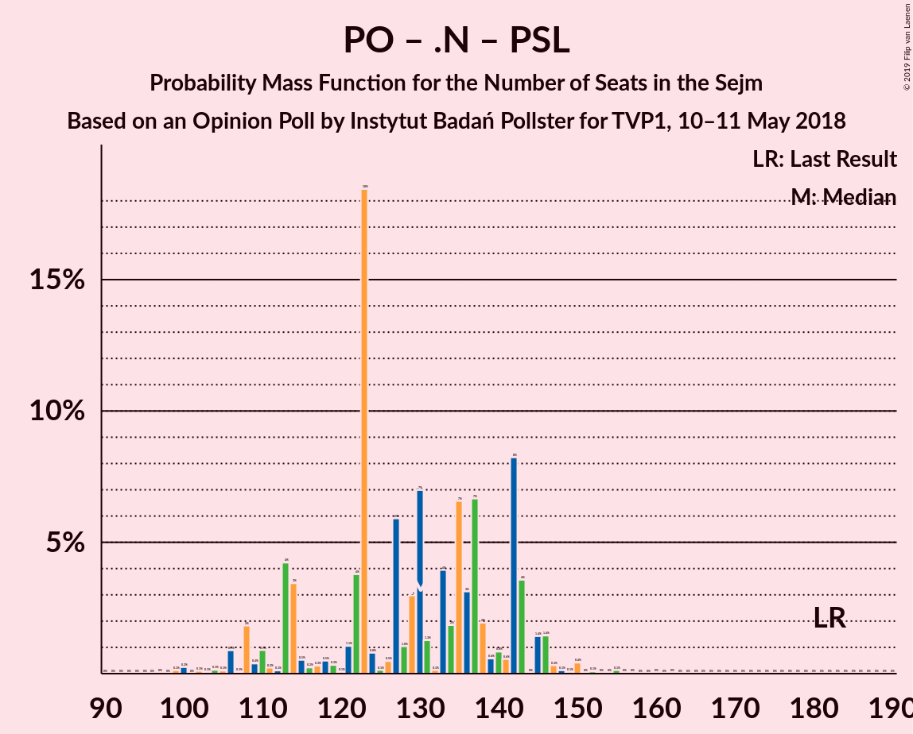
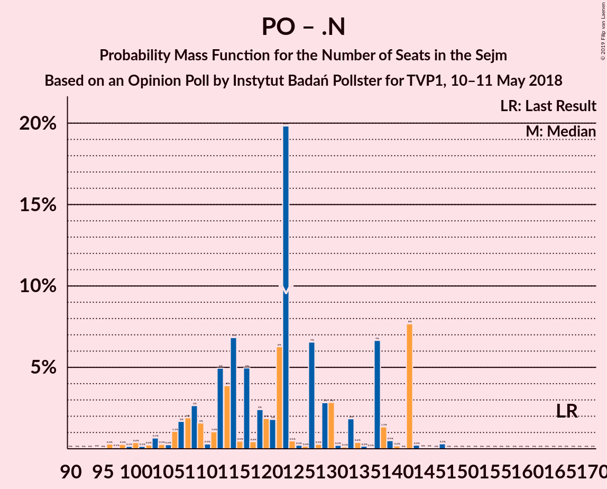

# Opinion Poll by Instytut Badań Pollster for TVP1, 10–11 May 2018

<a href="#voting-intentions">Voting Intentions</a> | <a href="#seats">Seats</a> | <a href="#coalitions">Coalitions</a> | <a href="#technical-information">Technical Information</a>

## Voting Intentions

### Confidence Intervals

| Party | Last Result | Poll Result | 80% Confidence Interval | 90% Confidence Interval | 95% Confidence Interval | 99% Confidence Interval |
|:-----:|:-----------:|:-----------:|:-----------------------:|:-----------------------:|:-----------------------:|:-----------------------:|
| Prawo i Sprawiedliwość | 37.6% | 42.9% | 41.0–44.8% |40.4–45.4% |40.0–45.8% |39.1–46.8% |
| Platforma Obywatelska | 24.1% | 20.0% | 18.5–21.6% |18.1–22.1% |17.7–22.5% |17.0–23.3% |
| Sojusz Lewicy Demokratycznej | 7.6% | 8.9% | 7.9–10.2% |7.6–10.5% |7.4–10.8% |6.9–11.4% |
| Kukiz’15 | 8.8% | 7.9% | 7.0–9.1% |6.7–9.4% |6.5–9.7% |6.0–10.3% |
| .Nowoczesna | 7.6% | 6.0% | 5.2–7.1% |5.0–7.3% |4.8–7.6% |4.4–8.1% |
| Polskie Stronnictwo Ludowe | 5.1% | 5.0% | 4.3–6.0% |4.1–6.2% |3.9–6.5% |3.5–7.0% |
| Lewica Razem | 3.6% | 5.0% | 4.3–6.0% |4.1–6.2% |3.9–6.5% |3.5–7.0% |
| KORWiN | 4.8% | 4.0% | 3.3–4.9% |3.2–5.1% |3.0–5.3% |2.7–5.8% |

*Note:* The poll result column reflects the actual value used in the calculations. Published results may vary slightly, and in addition be rounded to fewer digits.

## Seats

### Confidence Intervals

| Party | Last Result | Median | 80% Confidence Interval | 90% Confidence Interval | 95% Confidence Interval | 99% Confidence Interval |
|:-----:|:-----------:|:------:|:-----------------------:|:-----------------------:|:-----------------------:|:-----------------------:|
| <a href="#prawo-i-sprawiedliwość">Prawo i Sprawiedliwość</a> | 235 | 264 | 264 |259–271 |251–271 |251–271 |
| <a href="#platforma-obywatelska">Platforma Obywatelska</a> | 138 | 94 | 85–94 |83–94 |83–94 |83–94 |
| <a href="#sojusz-lewicy-demokratycznej">Sojusz Lewicy Demokratycznej</a> | 0 | 32 | 32–34 |32–43 |32–43 |32–43 |
| <a href="#kukiz’15">Kukiz’15</a> | 42 | 38 | 38–42 |38–42 |38–42 |38–42 |
| <a href="#.nowoczesna">.Nowoczesna</a> | 28 | 20 | 14–20 |11–20 |11–20 |11–24 |
| <a href="#polskie-stronnictwo-ludowe">Polskie Stronnictwo Ludowe</a> | 16 | 0 | 0–16 |0–16 |0–16 |0–17 |
| <a href="#lewica-razem">Lewica Razem</a> | 0 | 12 | 0–12 |0–12 |0–12 |0–12 |
| <a href="#korwin">KORWiN</a> | 0 | 0 | 0 |0 |0 |0 |

### Prawo i Sprawiedliwość

*For a full overview of the results for this party, see the [Prawo i Sprawiedliwość](party-prawoisprawiedliwość.html) page.*

| Number of Seats | Probability | Accumulated | Special Marks |
|:---------------:|:-----------:|:-----------:|:-------------:|
| 233 | 0.1% | 100% |  |
| 234 | 0% | 99.9% |  |
| 235 | 0% | 99.9% | Last Result |
| 236 | 0% | 99.9% |  |
| 237 | 0% | 99.9% |  |
| 238 | 0% | 99.9% |  |
| 239 | 0% | 99.9% |  |
| 240 | 0% | 99.9% |  |
| 241 | 0% | 99.9% |  |
| 242 | 0% | 99.9% |  |
| 243 | 0% | 99.9% |  |
| 244 | 0% | 99.9% |  |
| 245 | 0% | 99.9% |  |
| 246 | 0% | 99.9% |  |
| 247 | 0% | 99.9% |  |
| 248 | 0% | 99.9% |  |
| 249 | 0% | 99.9% |  |
| 250 | 0% | 99.9% |  |
| 251 | 2% | 99.9% |  |
| 252 | 0% | 97% |  |
| 253 | 0% | 97% |  |
| 254 | 0% | 97% |  |
| 255 | 0% | 97% |  |
| 256 | 0.1% | 97% |  |
| 257 | 0% | 97% |  |
| 258 | 0% | 97% |  |
| 259 | 6% | 97% |  |
| 260 | 0% | 91% |  |
| 261 | 0% | 91% |  |
| 262 | 0% | 91% |  |
| 263 | 0.1% | 91% |  |
| 264 | 83% | 91% | Median |
| 265 | 0% | 8% |  |
| 266 | 0% | 8% |  |
| 267 | 0% | 8% |  |
| 268 | 0% | 8% |  |
| 269 | 0% | 8% |  |
| 270 | 0% | 8% |  |
| 271 | 8% | 8% |  |
| 272 | 0% | 0% |  |

### Platforma Obywatelska

*For a full overview of the results for this party, see the [Platforma Obywatelska](party-platformaobywatelska.html) page.*

| Number of Seats | Probability | Accumulated | Special Marks |
|:---------------:|:-----------:|:-----------:|:-------------:|
| 83 | 8% | 100% |  |
| 84 | 0% | 92% |  |
| 85 | 2% | 92% |  |
| 86 | 0% | 90% |  |
| 87 | 0% | 90% |  |
| 88 | 0% | 90% |  |
| 89 | 0% | 90% |  |
| 90 | 0% | 90% |  |
| 91 | 0% | 90% |  |
| 92 | 0.1% | 90% |  |
| 93 | 6% | 90% |  |
| 94 | 84% | 84% | Median |
| 95 | 0% | 0.3% |  |
| 96 | 0% | 0.3% |  |
| 97 | 0% | 0.3% |  |
| 98 | 0% | 0.3% |  |
| 99 | 0% | 0.3% |  |
| 100 | 0% | 0.3% |  |
| 101 | 0% | 0.3% |  |
| 102 | 0% | 0.3% |  |
| 103 | 0% | 0.3% |  |
| 104 | 0.1% | 0.3% |  |
| 105 | 0% | 0.2% |  |
| 106 | 0% | 0.2% |  |
| 107 | 0% | 0.2% |  |
| 108 | 0% | 0.1% |  |
| 109 | 0% | 0.1% |  |
| 110 | 0% | 0.1% |  |
| 111 | 0% | 0.1% |  |
| 112 | 0% | 0.1% |  |
| 113 | 0% | 0.1% |  |
| 114 | 0% | 0.1% |  |
| 115 | 0% | 0.1% |  |
| 116 | 0% | 0.1% |  |
| 117 | 0% | 0.1% |  |
| 118 | 0% | 0.1% |  |
| 119 | 0% | 0.1% |  |
| 120 | 0.1% | 0.1% |  |
| 121 | 0% | 0% |  |
| 122 | 0% | 0% |  |
| 123 | 0% | 0% |  |
| 124 | 0% | 0% |  |
| 125 | 0% | 0% |  |
| 126 | 0% | 0% |  |
| 127 | 0% | 0% |  |
| 128 | 0% | 0% |  |
| 129 | 0% | 0% |  |
| 130 | 0% | 0% |  |
| 131 | 0% | 0% |  |
| 132 | 0% | 0% |  |
| 133 | 0% | 0% |  |
| 134 | 0% | 0% |  |
| 135 | 0% | 0% |  |
| 136 | 0% | 0% |  |
| 137 | 0% | 0% |  |
| 138 | 0% | 0% | Last Result |

### Sojusz Lewicy Demokratycznej

*For a full overview of the results for this party, see the [Sojusz Lewicy Demokratycznej](party-sojuszlewicydemokratycznej.html) page.*

| Number of Seats | Probability | Accumulated | Special Marks |
|:---------------:|:-----------:|:-----------:|:-------------:|
| 0 | 0% | 100% | Last Result |
| 1 | 0% | 100% |  |
| 2 | 0% | 100% |  |
| 3 | 0% | 100% |  |
| 4 | 0% | 100% |  |
| 5 | 0% | 100% |  |
| 6 | 0% | 100% |  |
| 7 | 0% | 100% |  |
| 8 | 0% | 100% |  |
| 9 | 0% | 100% |  |
| 10 | 0% | 100% |  |
| 11 | 0% | 100% |  |
| 12 | 0% | 100% |  |
| 13 | 0% | 100% |  |
| 14 | 0% | 100% |  |
| 15 | 0% | 100% |  |
| 16 | 0% | 100% |  |
| 17 | 0% | 100% |  |
| 18 | 0% | 100% |  |
| 19 | 0% | 100% |  |
| 20 | 0% | 100% |  |
| 21 | 0% | 100% |  |
| 22 | 0% | 100% |  |
| 23 | 0% | 100% |  |
| 24 | 0% | 100% |  |
| 25 | 0% | 100% |  |
| 26 | 0% | 100% |  |
| 27 | 0% | 100% |  |
| 28 | 0% | 100% |  |
| 29 | 0% | 100% |  |
| 30 | 0% | 100% |  |
| 31 | 0% | 100% |  |
| 32 | 83% | 100% | Median |
| 33 | 0% | 16% |  |
| 34 | 8% | 16% |  |
| 35 | 0% | 8% |  |
| 36 | 0.1% | 8% |  |
| 37 | 2% | 8% |  |
| 38 | 0% | 6% |  |
| 39 | 0% | 6% |  |
| 40 | 0% | 6% |  |
| 41 | 0.1% | 6% |  |
| 42 | 0.1% | 6% |  |
| 43 | 6% | 6% |  |
| 44 | 0% | 0.2% |  |
| 45 | 0% | 0.1% |  |
| 46 | 0% | 0.1% |  |
| 47 | 0% | 0.1% |  |
| 48 | 0% | 0.1% |  |
| 49 | 0% | 0.1% |  |
| 50 | 0% | 0.1% |  |
| 51 | 0% | 0.1% |  |
| 52 | 0.1% | 0.1% |  |
| 53 | 0% | 0% |  |

### Kukiz’15

*For a full overview of the results for this party, see the [Kukiz’15](party-kukiz’15.html) page.*

| Number of Seats | Probability | Accumulated | Special Marks |
|:---------------:|:-----------:|:-----------:|:-------------:|
| 36 | 0.1% | 100% |  |
| 37 | 0% | 99.9% |  |
| 38 | 83% | 99.9% | Median |
| 39 | 0.2% | 16% |  |
| 40 | 2% | 16% |  |
| 41 | 0.2% | 14% |  |
| 42 | 14% | 14% | Last Result |
| 43 | 0% | 0.1% |  |
| 44 | 0% | 0.1% |  |
| 45 | 0% | 0.1% |  |
| 46 | 0% | 0.1% |  |
| 47 | 0% | 0.1% |  |
| 48 | 0% | 0.1% |  |
| 49 | 0% | 0.1% |  |
| 50 | 0% | 0.1% |  |
| 51 | 0% | 0.1% |  |
| 52 | 0% | 0.1% |  |
| 53 | 0% | 0.1% |  |
| 54 | 0% | 0.1% |  |
| 55 | 0.1% | 0.1% |  |
| 56 | 0% | 0% |  |

### .Nowoczesna

*For a full overview of the results for this party, see the [.Nowoczesna](party-nowoczesna.html) page.*

| Number of Seats | Probability | Accumulated | Special Marks |
|:---------------:|:-----------:|:-----------:|:-------------:|
| 0 | 0.2% | 100% |  |
| 1 | 0% | 99.8% |  |
| 2 | 0% | 99.8% |  |
| 3 | 0% | 99.8% |  |
| 4 | 0% | 99.8% |  |
| 5 | 0% | 99.8% |  |
| 6 | 0% | 99.8% |  |
| 7 | 0% | 99.8% |  |
| 8 | 0% | 99.8% |  |
| 9 | 0% | 99.8% |  |
| 10 | 0% | 99.8% |  |
| 11 | 6% | 99.8% |  |
| 12 | 0% | 94% |  |
| 13 | 0% | 94% |  |
| 14 | 8% | 94% |  |
| 15 | 0% | 86% |  |
| 16 | 0% | 86% |  |
| 17 | 0% | 86% |  |
| 18 | 0% | 86% |  |
| 19 | 0% | 86% |  |
| 20 | 83% | 86% | Median |
| 21 | 0% | 2% |  |
| 22 | 0.2% | 2% |  |
| 23 | 0% | 2% |  |
| 24 | 2% | 2% |  |
| 25 | 0% | 0.1% |  |
| 26 | 0% | 0.1% |  |
| 27 | 0% | 0.1% |  |
| 28 | 0% | 0% | Last Result |

### Polskie Stronnictwo Ludowe

*For a full overview of the results for this party, see the [Polskie Stronnictwo Ludowe](party-polskiestronnictwoludowe.html) page.*

| Number of Seats | Probability | Accumulated | Special Marks |
|:---------------:|:-----------:|:-----------:|:-------------:|
| 0 | 84% | 100% | Median |
| 1 | 0% | 16% |  |
| 2 | 0% | 16% |  |
| 3 | 0% | 16% |  |
| 4 | 0% | 16% |  |
| 5 | 0% | 16% |  |
| 6 | 0% | 16% |  |
| 7 | 0% | 16% |  |
| 8 | 0% | 16% |  |
| 9 | 0% | 16% |  |
| 10 | 0% | 16% |  |
| 11 | 0% | 16% |  |
| 12 | 6% | 16% |  |
| 13 | 0% | 10% |  |
| 14 | 0% | 10% |  |
| 15 | 0% | 10% |  |
| 16 | 8% | 10% | Last Result |
| 17 | 2% | 2% |  |
| 18 | 0% | 0.1% |  |
| 19 | 0% | 0.1% |  |
| 20 | 0% | 0.1% |  |
| 21 | 0% | 0.1% |  |
| 22 | 0% | 0.1% |  |
| 23 | 0% | 0.1% |  |
| 24 | 0% | 0.1% |  |
| 25 | 0% | 0.1% |  |
| 26 | 0% | 0.1% |  |
| 27 | 0.1% | 0.1% |  |
| 28 | 0% | 0% |  |

### Lewica Razem

*For a full overview of the results for this party, see the [Lewica Razem](party-lewicarazem.html) page.*

| Number of Seats | Probability | Accumulated | Special Marks |
|:---------------:|:-----------:|:-----------:|:-------------:|
| 0 | 14% | 100% | Last Result |
| 1 | 0% | 86% |  |
| 2 | 0% | 86% |  |
| 3 | 0% | 86% |  |
| 4 | 0% | 86% |  |
| 5 | 0.2% | 86% |  |
| 6 | 2% | 86% |  |
| 7 | 0% | 84% |  |
| 8 | 0% | 84% |  |
| 9 | 0.1% | 84% |  |
| 10 | 0% | 84% |  |
| 11 | 0% | 84% |  |
| 12 | 83% | 84% | Median |
| 13 | 0% | 0% |  |

### KORWiN

*For a full overview of the results for this party, see the [KORWiN](party-korwin.html) page.*

| Number of Seats | Probability | Accumulated | Special Marks |
|:---------------:|:-----------:|:-----------:|:-------------:|
| 0 | 100% | 100% | Last Result, Median |

## Coalitions

### Confidence Intervals

| Coalition | Last Result | Median | Majority? | 80% Confidence Interval | 90% Confidence Interval | 95% Confidence Interval | 99% Confidence Interval |
|:---------:|:-----------:|:------:|:---------:|:-----------------------:|:-----------------------:|:-----------------------:|:-----------------------:|
| Prawo i Sprawiedliwość | 235 | 264 | 100% | 264 | 259–271 | 251–271 | 251–271 |
| Platforma Obywatelska – Sojusz Lewicy Demokratycznej – .Nowoczesna – Lewica Razem – Polskie Stronnictwo Ludowe | 182 | 158 | 0% | 158 | 147–159 | 147–165 | 147–169 |
| Platforma Obywatelska – Sojusz Lewicy Demokratycznej – .Nowoczesna – Polskie Stronnictwo Ludowe | 182 | 146 | 0% | 146–147 | 146–159 | 146–160 | 146–163 |
| Platforma Obywatelska – Sojusz Lewicy Demokratycznej – .Nowoczesna | 166 | 146 | 0% | 146 | 131–147 | 131–147 | 131–154 |
| Platforma Obywatelska – .Nowoczesna – Polskie Stronnictwo Ludowe | 182 | 114 | 0% | 114 | 113–116 | 113–120 | 113–126 |
| Platforma Obywatelska – .Nowoczesna | 166 | 114 | 0% | 104–114 | 97–114 | 97–114 | 97–114 |
| Platforma Obywatelska | 138 | 94 | 0% | 85–94 | 83–94 | 83–94 | 83–94 |

### Prawo i Sprawiedliwość

| Number of Seats | Probability | Accumulated | Special Marks |
|:---------------:|:-----------:|:-----------:|:-------------:|
| 233 | 0.1% | 100% |  |
| 234 | 0% | 99.9% |  |
| 235 | 0% | 99.9% | Last Result |
| 236 | 0% | 99.9% |  |
| 237 | 0% | 99.9% |  |
| 238 | 0% | 99.9% |  |
| 239 | 0% | 99.9% |  |
| 240 | 0% | 99.9% |  |
| 241 | 0% | 99.9% |  |
| 242 | 0% | 99.9% |  |
| 243 | 0% | 99.9% |  |
| 244 | 0% | 99.9% |  |
| 245 | 0% | 99.9% |  |
| 246 | 0% | 99.9% |  |
| 247 | 0% | 99.9% |  |
| 248 | 0% | 99.9% |  |
| 249 | 0% | 99.9% |  |
| 250 | 0% | 99.9% |  |
| 251 | 2% | 99.9% |  |
| 252 | 0% | 97% |  |
| 253 | 0% | 97% |  |
| 254 | 0% | 97% |  |
| 255 | 0% | 97% |  |
| 256 | 0.1% | 97% |  |
| 257 | 0% | 97% |  |
| 258 | 0% | 97% |  |
| 259 | 6% | 97% |  |
| 260 | 0% | 91% |  |
| 261 | 0% | 91% |  |
| 262 | 0% | 91% |  |
| 263 | 0.1% | 91% |  |
| 264 | 83% | 91% | Median |
| 265 | 0% | 8% |  |
| 266 | 0% | 8% |  |
| 267 | 0% | 8% |  |
| 268 | 0% | 8% |  |
| 269 | 0% | 8% |  |
| 270 | 0% | 8% |  |
| 271 | 8% | 8% |  |
| 272 | 0% | 0% |  |

### Platforma Obywatelska – Sojusz Lewicy Demokratycznej – .Nowoczesna – Lewica Razem – Polskie Stronnictwo Ludowe

| Number of Seats | Probability | Accumulated | Special Marks |
|:---------------:|:-----------:|:-----------:|:-------------:|
| 147 | 8% | 100% |  |
| 148 | 0% | 92% |  |
| 149 | 0% | 92% |  |
| 150 | 0% | 92% |  |
| 151 | 0% | 92% |  |
| 152 | 0% | 92% |  |
| 153 | 0% | 92% |  |
| 154 | 0.1% | 92% |  |
| 155 | 0% | 92% |  |
| 156 | 0% | 92% |  |
| 157 | 0% | 92% |  |
| 158 | 83% | 92% | Median |
| 159 | 6% | 8% |  |
| 160 | 0% | 3% |  |
| 161 | 0% | 3% |  |
| 162 | 0% | 3% |  |
| 163 | 0% | 3% |  |
| 164 | 0% | 3% |  |
| 165 | 0.1% | 3% |  |
| 166 | 0% | 2% |  |
| 167 | 0% | 2% |  |
| 168 | 0.1% | 2% |  |
| 169 | 2% | 2% |  |
| 170 | 0% | 0.1% |  |
| 171 | 0% | 0.1% |  |
| 172 | 0% | 0.1% |  |
| 173 | 0% | 0.1% |  |
| 174 | 0% | 0.1% |  |
| 175 | 0% | 0.1% |  |
| 176 | 0% | 0.1% |  |
| 177 | 0% | 0.1% |  |
| 178 | 0% | 0.1% |  |
| 179 | 0% | 0.1% |  |
| 180 | 0% | 0.1% |  |
| 181 | 0% | 0.1% |  |
| 182 | 0% | 0.1% | Last Result |
| 183 | 0% | 0.1% |  |
| 184 | 0% | 0.1% |  |
| 185 | 0% | 0.1% |  |
| 186 | 0% | 0.1% |  |
| 187 | 0% | 0.1% |  |
| 188 | 0% | 0.1% |  |
| 189 | 0% | 0.1% |  |
| 190 | 0% | 0.1% |  |
| 191 | 0.1% | 0.1% |  |
| 192 | 0% | 0% |  |

### Platforma Obywatelska – Sojusz Lewicy Demokratycznej – .Nowoczesna – Polskie Stronnictwo Ludowe

| Number of Seats | Probability | Accumulated | Special Marks |
|:---------------:|:-----------:|:-----------:|:-------------:|
| 146 | 83% | 100% | Median |
| 147 | 8% | 17% |  |
| 148 | 0% | 9% |  |
| 149 | 0% | 9% |  |
| 150 | 0% | 9% |  |
| 151 | 0% | 9% |  |
| 152 | 0% | 9% |  |
| 153 | 0% | 9% |  |
| 154 | 0.1% | 9% |  |
| 155 | 0% | 8% |  |
| 156 | 0% | 8% |  |
| 157 | 0% | 8% |  |
| 158 | 0% | 8% |  |
| 159 | 6% | 8% |  |
| 160 | 0.1% | 3% |  |
| 161 | 0% | 2% |  |
| 162 | 0% | 2% |  |
| 163 | 2% | 2% |  |
| 164 | 0% | 0.2% |  |
| 165 | 0% | 0.2% |  |
| 166 | 0% | 0.2% |  |
| 167 | 0% | 0.2% |  |
| 168 | 0.1% | 0.2% |  |
| 169 | 0% | 0.1% |  |
| 170 | 0% | 0.1% |  |
| 171 | 0% | 0.1% |  |
| 172 | 0% | 0.1% |  |
| 173 | 0% | 0.1% |  |
| 174 | 0% | 0.1% |  |
| 175 | 0% | 0.1% |  |
| 176 | 0% | 0.1% |  |
| 177 | 0% | 0.1% |  |
| 178 | 0% | 0.1% |  |
| 179 | 0% | 0.1% |  |
| 180 | 0% | 0.1% |  |
| 181 | 0% | 0.1% |  |
| 182 | 0.1% | 0.1% | Last Result |
| 183 | 0% | 0% |  |

### Platforma Obywatelska – Sojusz Lewicy Demokratycznej – .Nowoczesna

| Number of Seats | Probability | Accumulated | Special Marks |
|:---------------:|:-----------:|:-----------:|:-------------:|
| 131 | 8% | 100% |  |
| 132 | 0% | 92% |  |
| 133 | 0% | 92% |  |
| 134 | 0% | 92% |  |
| 135 | 0% | 92% |  |
| 136 | 0% | 92% |  |
| 137 | 0% | 92% |  |
| 138 | 0% | 92% |  |
| 139 | 0% | 92% |  |
| 140 | 0% | 92% |  |
| 141 | 0% | 92% |  |
| 142 | 0% | 92% |  |
| 143 | 0% | 92% |  |
| 144 | 0% | 92% |  |
| 145 | 0% | 92% |  |
| 146 | 86% | 92% | Median |
| 147 | 6% | 6% |  |
| 148 | 0% | 0.6% |  |
| 149 | 0% | 0.6% |  |
| 150 | 0% | 0.6% |  |
| 151 | 0% | 0.6% |  |
| 152 | 0% | 0.6% |  |
| 153 | 0% | 0.6% |  |
| 154 | 0.2% | 0.6% |  |
| 155 | 0.1% | 0.4% |  |
| 156 | 0% | 0.3% |  |
| 157 | 0% | 0.3% |  |
| 158 | 0% | 0.3% |  |
| 159 | 0% | 0.3% |  |
| 160 | 0.1% | 0.3% |  |
| 161 | 0% | 0.1% |  |
| 162 | 0% | 0.1% |  |
| 163 | 0% | 0.1% |  |
| 164 | 0% | 0.1% |  |
| 165 | 0% | 0.1% |  |
| 166 | 0% | 0.1% | Last Result |
| 167 | 0% | 0.1% |  |
| 168 | 0.1% | 0.1% |  |
| 169 | 0% | 0% |  |

### Platforma Obywatelska – .Nowoczesna – Polskie Stronnictwo Ludowe

| Number of Seats | Probability | Accumulated | Special Marks |
|:---------------:|:-----------:|:-----------:|:-------------:|
| 113 | 8% | 100% |  |
| 114 | 83% | 92% | Median |
| 115 | 0% | 9% |  |
| 116 | 6% | 9% |  |
| 117 | 0% | 3% |  |
| 118 | 0.1% | 3% |  |
| 119 | 0% | 3% |  |
| 120 | 0.2% | 3% |  |
| 121 | 0% | 2% |  |
| 122 | 0% | 2% |  |
| 123 | 0% | 2% |  |
| 124 | 0% | 2% |  |
| 125 | 0% | 2% |  |
| 126 | 2% | 2% |  |
| 127 | 0% | 0.1% |  |
| 128 | 0% | 0.1% |  |
| 129 | 0% | 0.1% |  |
| 130 | 0% | 0.1% |  |
| 131 | 0% | 0.1% |  |
| 132 | 0% | 0.1% |  |
| 133 | 0% | 0.1% |  |
| 134 | 0% | 0.1% |  |
| 135 | 0% | 0.1% |  |
| 136 | 0% | 0.1% |  |
| 137 | 0% | 0.1% |  |
| 138 | 0% | 0.1% |  |
| 139 | 0% | 0.1% |  |
| 140 | 0% | 0.1% |  |
| 141 | 0.1% | 0.1% |  |
| 142 | 0% | 0% |  |
| 143 | 0% | 0% |  |
| 144 | 0% | 0% |  |
| 145 | 0% | 0% |  |
| 146 | 0% | 0% |  |
| 147 | 0% | 0% |  |
| 148 | 0% | 0% |  |
| 149 | 0% | 0% |  |
| 150 | 0% | 0% |  |
| 151 | 0% | 0% |  |
| 152 | 0% | 0% |  |
| 153 | 0% | 0% |  |
| 154 | 0% | 0% |  |
| 155 | 0% | 0% |  |
| 156 | 0% | 0% |  |
| 157 | 0% | 0% |  |
| 158 | 0% | 0% |  |
| 159 | 0% | 0% |  |
| 160 | 0% | 0% |  |
| 161 | 0% | 0% |  |
| 162 | 0% | 0% |  |
| 163 | 0% | 0% |  |
| 164 | 0% | 0% |  |
| 165 | 0% | 0% |  |
| 166 | 0% | 0% |  |
| 167 | 0% | 0% |  |
| 168 | 0% | 0% |  |
| 169 | 0% | 0% |  |
| 170 | 0% | 0% |  |
| 171 | 0% | 0% |  |
| 172 | 0% | 0% |  |
| 173 | 0% | 0% |  |
| 174 | 0% | 0% |  |
| 175 | 0% | 0% |  |
| 176 | 0% | 0% |  |
| 177 | 0% | 0% |  |
| 178 | 0% | 0% |  |
| 179 | 0% | 0% |  |
| 180 | 0% | 0% |  |
| 181 | 0% | 0% |  |
| 182 | 0% | 0% | Last Result |

### Platforma Obywatelska – .Nowoczesna

| Number of Seats | Probability | Accumulated | Special Marks |
|:---------------:|:-----------:|:-----------:|:-------------:|
| 97 | 8% | 100% |  |
| 98 | 0% | 92% |  |
| 99 | 0% | 92% |  |
| 100 | 0% | 92% |  |
| 101 | 0% | 92% |  |
| 102 | 0% | 92% |  |
| 103 | 0% | 92% |  |
| 104 | 6% | 92% |  |
| 105 | 0% | 86% |  |
| 106 | 0% | 86% |  |
| 107 | 0% | 86% |  |
| 108 | 0% | 86% |  |
| 109 | 2% | 86% |  |
| 110 | 0% | 84% |  |
| 111 | 0% | 84% |  |
| 112 | 0% | 84% |  |
| 113 | 0% | 84% |  |
| 114 | 84% | 84% | Median |
| 115 | 0% | 0.4% |  |
| 116 | 0.1% | 0.4% |  |
| 117 | 0% | 0.3% |  |
| 118 | 0.1% | 0.3% |  |
| 119 | 0% | 0.2% |  |
| 120 | 0.2% | 0.2% |  |
| 121 | 0% | 0% |  |
| 122 | 0% | 0% |  |
| 123 | 0% | 0% |  |
| 124 | 0% | 0% |  |
| 125 | 0% | 0% |  |
| 126 | 0% | 0% |  |
| 127 | 0% | 0% |  |
| 128 | 0% | 0% |  |
| 129 | 0% | 0% |  |
| 130 | 0% | 0% |  |
| 131 | 0% | 0% |  |
| 132 | 0% | 0% |  |
| 133 | 0% | 0% |  |
| 134 | 0% | 0% |  |
| 135 | 0% | 0% |  |
| 136 | 0% | 0% |  |
| 137 | 0% | 0% |  |
| 138 | 0% | 0% |  |
| 139 | 0% | 0% |  |
| 140 | 0% | 0% |  |
| 141 | 0% | 0% |  |
| 142 | 0% | 0% |  |
| 143 | 0% | 0% |  |
| 144 | 0% | 0% |  |
| 145 | 0% | 0% |  |
| 146 | 0% | 0% |  |
| 147 | 0% | 0% |  |
| 148 | 0% | 0% |  |
| 149 | 0% | 0% |  |
| 150 | 0% | 0% |  |
| 151 | 0% | 0% |  |
| 152 | 0% | 0% |  |
| 153 | 0% | 0% |  |
| 154 | 0% | 0% |  |
| 155 | 0% | 0% |  |
| 156 | 0% | 0% |  |
| 157 | 0% | 0% |  |
| 158 | 0% | 0% |  |
| 159 | 0% | 0% |  |
| 160 | 0% | 0% |  |
| 161 | 0% | 0% |  |
| 162 | 0% | 0% |  |
| 163 | 0% | 0% |  |
| 164 | 0% | 0% |  |
| 165 | 0% | 0% |  |
| 166 | 0% | 0% | Last Result |

### Platforma Obywatelska

| Number of Seats | Probability | Accumulated | Special Marks |
|:---------------:|:-----------:|:-----------:|:-------------:|
| 83 | 8% | 100% |  |
| 84 | 0% | 92% |  |
| 85 | 2% | 92% |  |
| 86 | 0% | 90% |  |
| 87 | 0% | 90% |  |
| 88 | 0% | 90% |  |
| 89 | 0% | 90% |  |
| 90 | 0% | 90% |  |
| 91 | 0% | 90% |  |
| 92 | 0.1% | 90% |  |
| 93 | 6% | 90% |  |
| 94 | 84% | 84% | Median |
| 95 | 0% | 0.3% |  |
| 96 | 0% | 0.3% |  |
| 97 | 0% | 0.3% |  |
| 98 | 0% | 0.3% |  |
| 99 | 0% | 0.3% |  |
| 100 | 0% | 0.3% |  |
| 101 | 0% | 0.3% |  |
| 102 | 0% | 0.3% |  |
| 103 | 0% | 0.3% |  |
| 104 | 0.1% | 0.3% |  |
| 105 | 0% | 0.2% |  |
| 106 | 0% | 0.2% |  |
| 107 | 0% | 0.2% |  |
| 108 | 0% | 0.1% |  |
| 109 | 0% | 0.1% |  |
| 110 | 0% | 0.1% |  |
| 111 | 0% | 0.1% |  |
| 112 | 0% | 0.1% |  |
| 113 | 0% | 0.1% |  |
| 114 | 0% | 0.1% |  |
| 115 | 0% | 0.1% |  |
| 116 | 0% | 0.1% |  |
| 117 | 0% | 0.1% |  |
| 118 | 0% | 0.1% |  |
| 119 | 0% | 0.1% |  |
| 120 | 0.1% | 0.1% |  |
| 121 | 0% | 0% |  |
| 122 | 0% | 0% |  |
| 123 | 0% | 0% |  |
| 124 | 0% | 0% |  |
| 125 | 0% | 0% |  |
| 126 | 0% | 0% |  |
| 127 | 0% | 0% |  |
| 128 | 0% | 0% |  |
| 129 | 0% | 0% |  |
| 130 | 0% | 0% |  |
| 131 | 0% | 0% |  |
| 132 | 0% | 0% |  |
| 133 | 0% | 0% |  |
| 134 | 0% | 0% |  |
| 135 | 0% | 0% |  |
| 136 | 0% | 0% |  |
| 137 | 0% | 0% |  |
| 138 | 0% | 0% | Last Result |

## Technical Information

### Opinion Poll

+ **Polling firm:** Instytut Badań Pollster
+ **Commissioner(s):** TVP1
+ **Fieldwork period:** 10–11 May 2018

### Calculations

+ **Sample size:** 1096
+ **Simulations done:** 1,024
+ **Error estimate:** 2.04%

