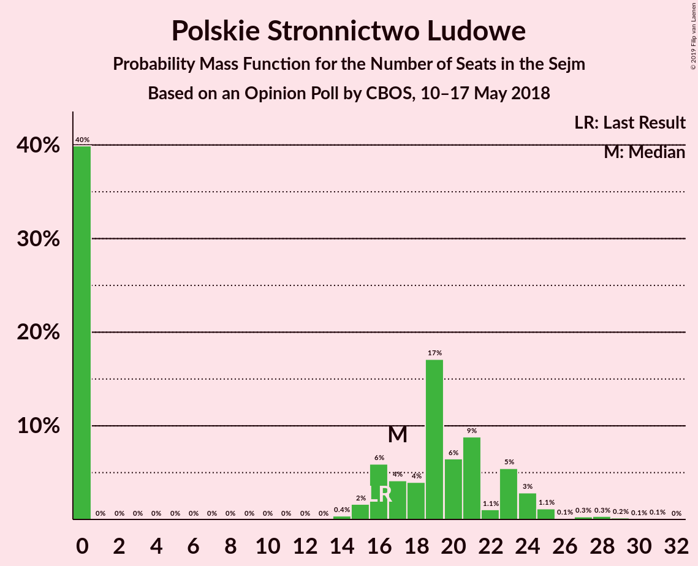
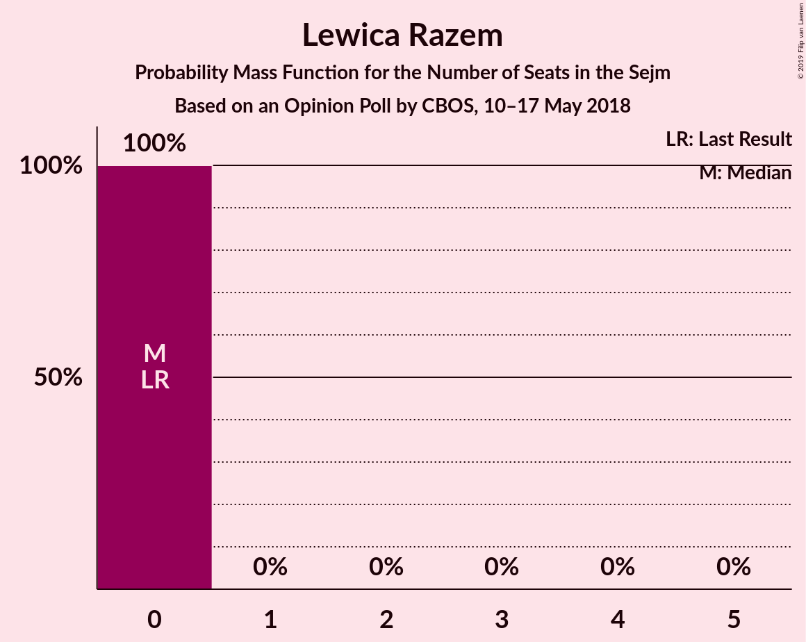
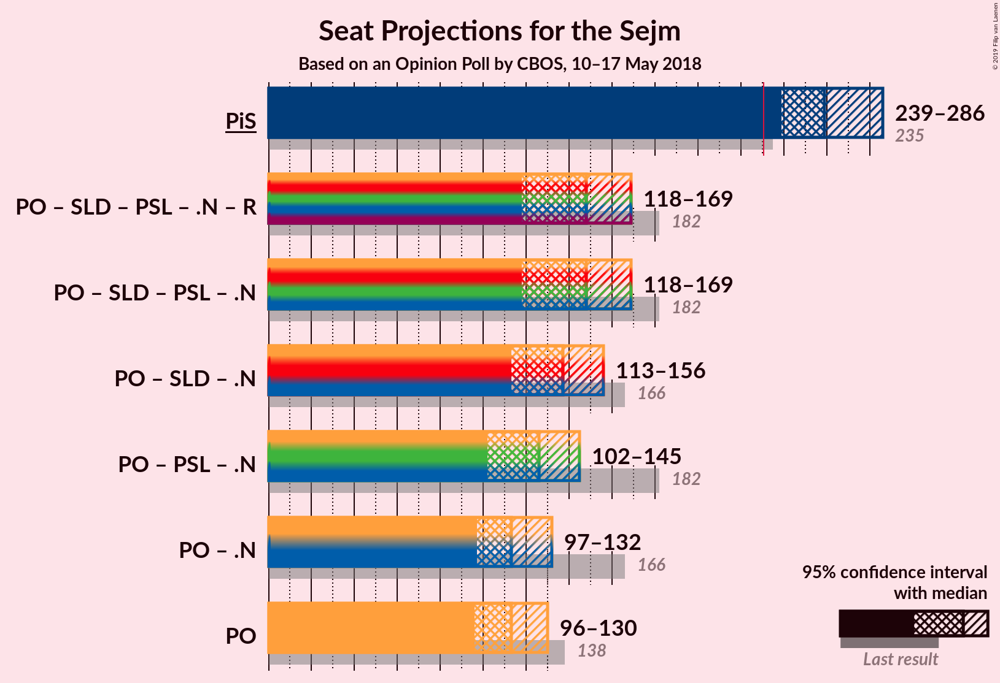
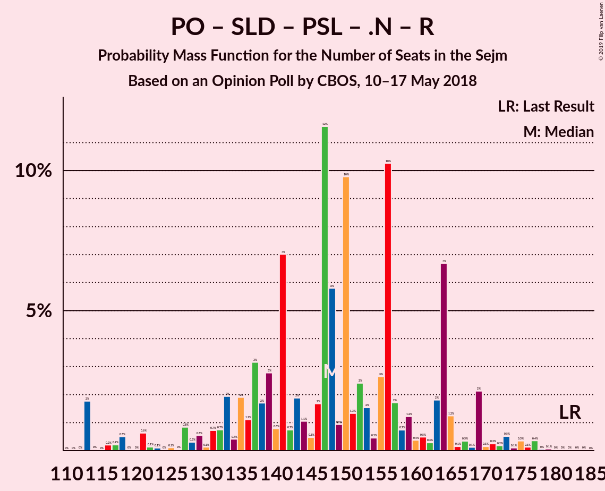

# Opinion Poll by CBOS, 10–17 May 2018

<a href="#voting-intentions">Voting Intentions</a> | <a href="#seats">Seats</a> | <a href="#coalitions">Coalitions</a> | <a href="#technical-information">Technical Information</a>

## Voting Intentions

### Confidence Intervals

| Party | Last Result | Poll Result | 80% Confidence Interval | 90% Confidence Interval | 95% Confidence Interval | 99% Confidence Interval |
|:-----:|:-----------:|:-----------:|:-----------------------:|:-----------------------:|:-----------------------:|:-----------------------:|
| Prawo i Sprawiedliwość | 37.6% | 40.0% | 38.2–41.9% |37.7–42.4% |37.2–42.8% |36.4–43.7% |
| Platforma Obywatelska | 24.1% | 19.0% | 17.6–20.5% |17.2–21.0% |16.8–21.3% |16.2–22.1% |
| Kukiz’15 | 8.8% | 10.0% | 8.9–11.2% |8.7–11.6% |8.4–11.9% |7.9–12.5% |
| Sojusz Lewicy Demokratycznej | 7.6% | 6.0% | 5.2–7.0% |5.0–7.3% |4.8–7.5% |4.4–8.0% |
| Polskie Stronnictwo Ludowe | 5.1% | 5.0% | 4.3–6.0% |4.1–6.2% |3.9–6.5% |3.6–6.9% |
| .Nowoczesna | 7.6% | 4.0% | 3.4–4.9% |3.2–5.1% |3.0–5.3% |2.7–5.7% |
| KORWiN | 4.8% | 2.0% | 1.5–2.6% |1.4–2.8% |1.3–2.9% |1.1–3.3% |
| Lewica Razem | 3.6% | 1.0% | 0.7–1.5% |0.7–1.7% |0.6–1.8% |0.5–2.1% |

*Note:* The poll result column reflects the actual value used in the calculations. Published results may vary slightly, and in addition be rounded to fewer digits.

## Seats

### Confidence Intervals

| Party | Last Result | Median | 80% Confidence Interval | 90% Confidence Interval | 95% Confidence Interval | 99% Confidence Interval |
|:-----:|:-----------:|:------:|:-----------------------:|:-----------------------:|:-----------------------:|:-----------------------:|
| <a href="#prawo-i-sprawiedliwość">Prawo i Sprawiedliwość</a> | 235 | 243 | 232–272 |232–272 |232–272 |228–272 |
| <a href="#platforma-obywatelska">Platforma Obywatelska</a> | 138 | 123 | 110–128 |110–128 |110–132 |110–139 |
| <a href="#kukiz’15">Kukiz’15</a> | 42 | 51 | 38–59 |38–62 |38–63 |38–70 |
| <a href="#sojusz-lewicy-demokratycznej">Sojusz Lewicy Demokratycznej</a> | 0 | 27 | 24–30 |20–30 |20–31 |0–37 |
| <a href="#polskie-stronnictwo-ludowe">Polskie Stronnictwo Ludowe</a> | 16 | 18 | 0–24 |0–24 |0–24 |0–27 |
| <a href="#.nowoczesna">.Nowoczesna</a> | 28 | 0 | 0 |0 |0 |0 |
| <a href="#korwin">KORWiN</a> | 0 | 0 | 0 |0 |0 |0 |
| <a href="#lewica-razem">Lewica Razem</a> | 0 | 0 | 0 |0 |0 |0 |

### Prawo i Sprawiedliwość

*For a full overview of the results for this party, see the [Prawo i Sprawiedliwość](party-prawoisprawiedliwość.html) page.*

| Number of Seats | Probability | Accumulated | Special Marks |
|:---------------:|:-----------:|:-----------:|:-------------:|
| 222 | 0.1% | 100% |  |
| 223 | 0% | 99.9% |  |
| 224 | 0% | 99.9% |  |
| 225 | 0% | 99.9% |  |
| 226 | 0.1% | 99.9% |  |
| 227 | 0% | 99.7% |  |
| 228 | 0.3% | 99.7% |  |
| 229 | 0% | 99.4% |  |
| 230 | 0% | 99.4% |  |
| 231 | 0% | 99.4% | Majority |
| 232 | 15% | 99.4% |  |
| 233 | 0% | 84% |  |
| 234 | 0.9% | 84% |  |
| 235 | 0.1% | 83% | Last Result |
| 236 | 0% | 83% |  |
| 237 | 0% | 83% |  |
| 238 | 0% | 83% |  |
| 239 | 0% | 83% |  |
| 240 | 2% | 83% |  |
| 241 | 0% | 82% |  |
| 242 | 0.4% | 82% |  |
| 243 | 39% | 81% | Median |
| 244 | 0% | 42% |  |
| 245 | 0% | 42% |  |
| 246 | 0% | 42% |  |
| 247 | 0.9% | 42% |  |
| 248 | 0% | 41% |  |
| 249 | 0% | 41% |  |
| 250 | 0.8% | 41% |  |
| 251 | 0% | 40% |  |
| 252 | 0% | 40% |  |
| 253 | 0% | 40% |  |
| 254 | 0.3% | 40% |  |
| 255 | 2% | 40% |  |
| 256 | 0% | 38% |  |
| 257 | 0.1% | 38% |  |
| 258 | 0% | 38% |  |
| 259 | 0% | 38% |  |
| 260 | 1.2% | 38% |  |
| 261 | 0.8% | 37% |  |
| 262 | 0.1% | 36% |  |
| 263 | 0% | 36% |  |
| 264 | 0% | 36% |  |
| 265 | 0% | 36% |  |
| 266 | 4% | 36% |  |
| 267 | 0% | 32% |  |
| 268 | 1.3% | 32% |  |
| 269 | 0% | 30% |  |
| 270 | 0% | 30% |  |
| 271 | 0% | 30% |  |
| 272 | 30% | 30% |  |
| 273 | 0% | 0% |  |

### Platforma Obywatelska

*For a full overview of the results for this party, see the [Platforma Obywatelska](party-platformaobywatelska.html) page.*

| Number of Seats | Probability | Accumulated | Special Marks |
|:---------------:|:-----------:|:-----------:|:-------------:|
| 102 | 0% | 100% |  |
| 103 | 0% | 99.9% |  |
| 104 | 0% | 99.9% |  |
| 105 | 0% | 99.9% |  |
| 106 | 0% | 99.9% |  |
| 107 | 0% | 99.9% |  |
| 108 | 0% | 99.9% |  |
| 109 | 0% | 99.9% |  |
| 110 | 39% | 99.9% |  |
| 111 | 0.3% | 61% |  |
| 112 | 6% | 60% |  |
| 113 | 0.1% | 54% |  |
| 114 | 1.2% | 54% |  |
| 115 | 0% | 53% |  |
| 116 | 0% | 53% |  |
| 117 | 0% | 53% |  |
| 118 | 0.6% | 53% |  |
| 119 | 0% | 52% |  |
| 120 | 0.1% | 52% |  |
| 121 | 0% | 52% |  |
| 122 | 0% | 52% |  |
| 123 | 31% | 52% | Median |
| 124 | 1.4% | 21% |  |
| 125 | 0% | 20% |  |
| 126 | 0.1% | 20% |  |
| 127 | 0% | 20% |  |
| 128 | 16% | 20% |  |
| 129 | 0% | 3% |  |
| 130 | 0% | 3% |  |
| 131 | 0.2% | 3% |  |
| 132 | 2% | 3% |  |
| 133 | 0% | 1.2% |  |
| 134 | 0.4% | 1.2% |  |
| 135 | 0% | 0.8% |  |
| 136 | 0% | 0.8% |  |
| 137 | 0% | 0.8% |  |
| 138 | 0% | 0.8% | Last Result |
| 139 | 0.3% | 0.8% |  |
| 140 | 0% | 0.5% |  |
| 141 | 0% | 0.5% |  |
| 142 | 0% | 0.5% |  |
| 143 | 0% | 0.5% |  |
| 144 | 0% | 0.5% |  |
| 145 | 0% | 0.5% |  |
| 146 | 0% | 0.5% |  |
| 147 | 0% | 0.5% |  |
| 148 | 0% | 0.5% |  |
| 149 | 0% | 0.5% |  |
| 150 | 0% | 0.5% |  |
| 151 | 0.4% | 0.4% |  |
| 152 | 0% | 0.1% |  |
| 153 | 0% | 0.1% |  |
| 154 | 0% | 0.1% |  |
| 155 | 0% | 0% |  |

### Kukiz’15

*For a full overview of the results for this party, see the [Kukiz’15](party-kukiz’15.html) page.*

| Number of Seats | Probability | Accumulated | Special Marks |
|:---------------:|:-----------:|:-----------:|:-------------:|
| 32 | 0.1% | 100% |  |
| 33 | 0% | 99.9% |  |
| 34 | 0% | 99.9% |  |
| 35 | 0% | 99.9% |  |
| 36 | 0% | 99.9% |  |
| 37 | 0% | 99.9% |  |
| 38 | 30% | 99.9% |  |
| 39 | 2% | 70% |  |
| 40 | 1.3% | 68% |  |
| 41 | 0% | 67% |  |
| 42 | 0% | 67% | Last Result |
| 43 | 0.3% | 67% |  |
| 44 | 0% | 67% |  |
| 45 | 2% | 67% |  |
| 46 | 0.1% | 65% |  |
| 47 | 0% | 65% |  |
| 48 | 0.1% | 65% |  |
| 49 | 0% | 65% |  |
| 50 | 0% | 65% |  |
| 51 | 16% | 65% | Median |
| 52 | 0% | 49% |  |
| 53 | 0% | 49% |  |
| 54 | 0% | 49% |  |
| 55 | 0% | 49% |  |
| 56 | 0.4% | 49% |  |
| 57 | 1.2% | 49% |  |
| 58 | 0.9% | 47% |  |
| 59 | 39% | 47% |  |
| 60 | 0% | 7% |  |
| 61 | 0% | 7% |  |
| 62 | 4% | 7% |  |
| 63 | 1.1% | 3% |  |
| 64 | 0% | 2% |  |
| 65 | 0% | 2% |  |
| 66 | 0% | 2% |  |
| 67 | 0% | 2% |  |
| 68 | 0% | 2% |  |
| 69 | 0% | 2% |  |
| 70 | 2% | 2% |  |
| 71 | 0.1% | 0.1% |  |
| 72 | 0% | 0.1% |  |
| 73 | 0% | 0.1% |  |
| 74 | 0.1% | 0.1% |  |
| 75 | 0% | 0% |  |

### Sojusz Lewicy Demokratycznej

*For a full overview of the results for this party, see the [Sojusz Lewicy Demokratycznej](party-sojuszlewicydemokratycznej.html) page.*

| Number of Seats | Probability | Accumulated | Special Marks |
|:---------------:|:-----------:|:-----------:|:-------------:|
| 0 | 1.4% | 100% | Last Result |
| 1 | 0% | 98.6% |  |
| 2 | 0% | 98.6% |  |
| 3 | 0% | 98.6% |  |
| 4 | 0% | 98.6% |  |
| 5 | 0% | 98.6% |  |
| 6 | 0% | 98.6% |  |
| 7 | 0% | 98.6% |  |
| 8 | 0% | 98.6% |  |
| 9 | 0% | 98.6% |  |
| 10 | 0% | 98.6% |  |
| 11 | 0% | 98.6% |  |
| 12 | 0% | 98.6% |  |
| 13 | 0% | 98.6% |  |
| 14 | 0.1% | 98.6% |  |
| 15 | 0% | 98.5% |  |
| 16 | 0% | 98.5% |  |
| 17 | 0% | 98.5% |  |
| 18 | 0.4% | 98.5% |  |
| 19 | 0.1% | 98% |  |
| 20 | 5% | 98% |  |
| 21 | 0% | 93% |  |
| 22 | 2% | 93% |  |
| 23 | 0% | 92% |  |
| 24 | 2% | 92% |  |
| 25 | 15% | 90% |  |
| 26 | 0% | 75% |  |
| 27 | 30% | 75% | Median |
| 28 | 1.3% | 45% |  |
| 29 | 1.2% | 44% |  |
| 30 | 39% | 42% |  |
| 31 | 1.1% | 3% |  |
| 32 | 0% | 2% |  |
| 33 | 0.1% | 2% |  |
| 34 | 0.1% | 2% |  |
| 35 | 0% | 2% |  |
| 36 | 0% | 2% |  |
| 37 | 2% | 2% |  |
| 38 | 0% | 0.4% |  |
| 39 | 0% | 0.4% |  |
| 40 | 0.3% | 0.4% |  |
| 41 | 0% | 0% |  |

### Polskie Stronnictwo Ludowe

*For a full overview of the results for this party, see the [Polskie Stronnictwo Ludowe](party-polskiestronnictwoludowe.html) page.*

| Number of Seats | Probability | Accumulated | Special Marks |
|:---------------:|:-----------:|:-----------:|:-------------:|
| 0 | 42% | 100% |  |
| 1 | 0% | 58% |  |
| 2 | 0% | 58% |  |
| 3 | 0% | 58% |  |
| 4 | 0% | 58% |  |
| 5 | 0% | 58% |  |
| 6 | 0% | 58% |  |
| 7 | 0% | 58% |  |
| 8 | 0% | 58% |  |
| 9 | 0% | 58% |  |
| 10 | 0% | 58% |  |
| 11 | 0% | 58% |  |
| 12 | 0% | 58% |  |
| 13 | 0% | 58% |  |
| 14 | 0% | 58% |  |
| 15 | 0% | 58% |  |
| 16 | 0% | 58% | Last Result |
| 17 | 0.1% | 58% |  |
| 18 | 40% | 58% | Median |
| 19 | 0.4% | 19% |  |
| 20 | 0% | 18% |  |
| 21 | 0% | 18% |  |
| 22 | 0% | 18% |  |
| 23 | 0.5% | 18% |  |
| 24 | 16% | 18% |  |
| 25 | 0% | 2% |  |
| 26 | 0.2% | 2% |  |
| 27 | 2% | 2% |  |
| 28 | 0% | 0% |  |

### .Nowoczesna

*For a full overview of the results for this party, see the [.Nowoczesna](party-nowoczesna.html) page.*

| Number of Seats | Probability | Accumulated | Special Marks |
|:---------------:|:-----------:|:-----------:|:-------------:|
| 0 | 99.9% | 100% | Median |
| 1 | 0% | 0.1% |  |
| 2 | 0% | 0.1% |  |
| 3 | 0% | 0.1% |  |
| 4 | 0% | 0.1% |  |
| 5 | 0% | 0.1% |  |
| 6 | 0% | 0.1% |  |
| 7 | 0% | 0.1% |  |
| 8 | 0% | 0.1% |  |
| 9 | 0% | 0.1% |  |
| 10 | 0% | 0.1% |  |
| 11 | 0% | 0.1% |  |
| 12 | 0% | 0.1% |  |
| 13 | 0% | 0.1% |  |
| 14 | 0% | 0.1% |  |
| 15 | 0% | 0.1% |  |
| 16 | 0% | 0.1% |  |
| 17 | 0% | 0.1% |  |
| 18 | 0% | 0.1% |  |
| 19 | 0% | 0% |  |
| 20 | 0% | 0% |  |
| 21 | 0% | 0% |  |
| 22 | 0% | 0% |  |
| 23 | 0% | 0% |  |
| 24 | 0% | 0% |  |
| 25 | 0% | 0% |  |
| 26 | 0% | 0% |  |
| 27 | 0% | 0% |  |
| 28 | 0% | 0% | Last Result |

### KORWiN

*For a full overview of the results for this party, see the [KORWiN](party-korwin.html) page.*

| Number of Seats | Probability | Accumulated | Special Marks |
|:---------------:|:-----------:|:-----------:|:-------------:|
| 0 | 100% | 100% | Last Result, Median |

### Lewica Razem

*For a full overview of the results for this party, see the [Lewica Razem](party-lewicarazem.html) page.*

| Number of Seats | Probability | Accumulated | Special Marks |
|:---------------:|:-----------:|:-----------:|:-------------:|
| 0 | 100% | 100% | Last Result, Median |

## Coalitions

### Confidence Intervals

| Coalition | Last Result | Median | Majority? | 80% Confidence Interval | 90% Confidence Interval | 95% Confidence Interval | 99% Confidence Interval |
|:---------:|:-----------:|:------:|:---------:|:-----------------------:|:-----------------------:|:-----------------------:|:-----------------------:|
| Prawo i Sprawiedliwość | 235 | 243 | 99.4% | 232–272 | 232–272 | 232–272 | 228–272 |
| Platforma Obywatelska – Sojusz Lewicy Demokratycznej – Polskie Stronnictwo Ludowe – .Nowoczesna – Lewica Razem | 182 | 158 | 0% | 150–177 | 132–177 | 132–177 | 118–181 |
| Platforma Obywatelska – Sojusz Lewicy Demokratycznej – Polskie Stronnictwo Ludowe – .Nowoczesna | 182 | 158 | 0% | 150–177 | 132–177 | 132–177 | 118–181 |
| Platforma Obywatelska – Polskie Stronnictwo Ludowe – .Nowoczesna | 182 | 128 | 0% | 123–152 | 112–152 | 112–159 | 112–163 |
| Platforma Obywatelska – Sojusz Lewicy Demokratycznej – .Nowoczesna | 166 | 150 | 0% | 140–153 | 132–153 | 132–154 | 118–160 |
| Platforma Obywatelska – .Nowoczesna | 166 | 123 | 0% | 110–128 | 110–128 | 110–132 | 110–139 |
| Platforma Obywatelska | 138 | 123 | 0% | 110–128 | 110–128 | 110–132 | 110–139 |

### Prawo i Sprawiedliwość

| Number of Seats | Probability | Accumulated | Special Marks |
|:---------------:|:-----------:|:-----------:|:-------------:|
| 222 | 0.1% | 100% |  |
| 223 | 0% | 99.9% |  |
| 224 | 0% | 99.9% |  |
| 225 | 0% | 99.9% |  |
| 226 | 0.1% | 99.9% |  |
| 227 | 0% | 99.7% |  |
| 228 | 0.3% | 99.7% |  |
| 229 | 0% | 99.4% |  |
| 230 | 0% | 99.4% |  |
| 231 | 0% | 99.4% | Majority |
| 232 | 15% | 99.4% |  |
| 233 | 0% | 84% |  |
| 234 | 0.9% | 84% |  |
| 235 | 0.1% | 83% | Last Result |
| 236 | 0% | 83% |  |
| 237 | 0% | 83% |  |
| 238 | 0% | 83% |  |
| 239 | 0% | 83% |  |
| 240 | 2% | 83% |  |
| 241 | 0% | 82% |  |
| 242 | 0.4% | 82% |  |
| 243 | 39% | 81% | Median |
| 244 | 0% | 42% |  |
| 245 | 0% | 42% |  |
| 246 | 0% | 42% |  |
| 247 | 0.9% | 42% |  |
| 248 | 0% | 41% |  |
| 249 | 0% | 41% |  |
| 250 | 0.8% | 41% |  |
| 251 | 0% | 40% |  |
| 252 | 0% | 40% |  |
| 253 | 0% | 40% |  |
| 254 | 0.3% | 40% |  |
| 255 | 2% | 40% |  |
| 256 | 0% | 38% |  |
| 257 | 0.1% | 38% |  |
| 258 | 0% | 38% |  |
| 259 | 0% | 38% |  |
| 260 | 1.2% | 38% |  |
| 261 | 0.8% | 37% |  |
| 262 | 0.1% | 36% |  |
| 263 | 0% | 36% |  |
| 264 | 0% | 36% |  |
| 265 | 0% | 36% |  |
| 266 | 4% | 36% |  |
| 267 | 0% | 32% |  |
| 268 | 1.3% | 32% |  |
| 269 | 0% | 30% |  |
| 270 | 0% | 30% |  |
| 271 | 0% | 30% |  |
| 272 | 30% | 30% |  |
| 273 | 0% | 0% |  |

### Platforma Obywatelska – Sojusz Lewicy Demokratycznej – Polskie Stronnictwo Ludowe – .Nowoczesna – Lewica Razem

| Number of Seats | Probability | Accumulated | Special Marks |
|:---------------:|:-----------:|:-----------:|:-------------:|
| 118 | 0.6% | 100% |  |
| 119 | 0% | 99.4% |  |
| 120 | 0% | 99.4% |  |
| 121 | 0% | 99.4% |  |
| 122 | 0% | 99.4% |  |
| 123 | 0% | 99.4% |  |
| 124 | 0% | 99.4% |  |
| 125 | 0% | 99.4% |  |
| 126 | 0% | 99.4% |  |
| 127 | 0.1% | 99.4% |  |
| 128 | 0% | 99.3% |  |
| 129 | 0% | 99.3% |  |
| 130 | 0% | 99.3% |  |
| 131 | 0% | 99.3% |  |
| 132 | 4% | 99.3% |  |
| 133 | 0% | 95% |  |
| 134 | 0% | 95% |  |
| 135 | 0% | 95% |  |
| 136 | 0.8% | 95% |  |
| 137 | 0% | 94% |  |
| 138 | 0% | 94% |  |
| 139 | 0% | 94% |  |
| 140 | 0% | 94% |  |
| 141 | 0% | 94% |  |
| 142 | 0% | 94% |  |
| 143 | 2% | 94% |  |
| 144 | 0% | 92% |  |
| 145 | 0.1% | 92% |  |
| 146 | 0% | 92% |  |
| 147 | 0% | 92% |  |
| 148 | 0% | 92% |  |
| 149 | 0% | 92% |  |
| 150 | 30% | 92% |  |
| 151 | 0.1% | 62% |  |
| 152 | 2% | 62% |  |
| 153 | 0.1% | 60% |  |
| 154 | 0% | 60% |  |
| 155 | 0% | 60% |  |
| 156 | 0% | 60% |  |
| 157 | 0% | 60% |  |
| 158 | 39% | 60% |  |
| 159 | 0% | 21% |  |
| 160 | 2% | 21% |  |
| 161 | 0% | 19% |  |
| 162 | 0% | 19% |  |
| 163 | 0.3% | 19% |  |
| 164 | 0% | 19% |  |
| 165 | 0% | 19% |  |
| 166 | 0% | 19% |  |
| 167 | 0% | 19% |  |
| 168 | 0% | 19% | Median |
| 169 | 0.3% | 19% |  |
| 170 | 0.4% | 18% |  |
| 171 | 0.1% | 18% |  |
| 172 | 0% | 18% |  |
| 173 | 0% | 18% |  |
| 174 | 0% | 18% |  |
| 175 | 0.5% | 18% |  |
| 176 | 0% | 18% |  |
| 177 | 15% | 17% |  |
| 178 | 0% | 2% |  |
| 179 | 0.4% | 2% |  |
| 180 | 0% | 2% |  |
| 181 | 2% | 2% |  |
| 182 | 0% | 0.3% | Last Result |
| 183 | 0% | 0.3% |  |
| 184 | 0% | 0.3% |  |
| 185 | 0% | 0.3% |  |
| 186 | 0% | 0.3% |  |
| 187 | 0% | 0.3% |  |
| 188 | 0.1% | 0.3% |  |
| 189 | 0% | 0.1% |  |
| 190 | 0.1% | 0.1% |  |
| 191 | 0% | 0% |  |

### Platforma Obywatelska – Sojusz Lewicy Demokratycznej – Polskie Stronnictwo Ludowe – .Nowoczesna

| Number of Seats | Probability | Accumulated | Special Marks |
|:---------------:|:-----------:|:-----------:|:-------------:|
| 118 | 0.6% | 100% |  |
| 119 | 0% | 99.4% |  |
| 120 | 0% | 99.4% |  |
| 121 | 0% | 99.4% |  |
| 122 | 0% | 99.4% |  |
| 123 | 0% | 99.4% |  |
| 124 | 0% | 99.4% |  |
| 125 | 0% | 99.4% |  |
| 126 | 0% | 99.4% |  |
| 127 | 0.1% | 99.4% |  |
| 128 | 0% | 99.3% |  |
| 129 | 0% | 99.3% |  |
| 130 | 0% | 99.3% |  |
| 131 | 0% | 99.3% |  |
| 132 | 4% | 99.3% |  |
| 133 | 0% | 95% |  |
| 134 | 0% | 95% |  |
| 135 | 0% | 95% |  |
| 136 | 0.8% | 95% |  |
| 137 | 0% | 94% |  |
| 138 | 0% | 94% |  |
| 139 | 0% | 94% |  |
| 140 | 0% | 94% |  |
| 141 | 0% | 94% |  |
| 142 | 0% | 94% |  |
| 143 | 2% | 94% |  |
| 144 | 0% | 92% |  |
| 145 | 0.1% | 92% |  |
| 146 | 0% | 92% |  |
| 147 | 0% | 92% |  |
| 148 | 0% | 92% |  |
| 149 | 0% | 92% |  |
| 150 | 30% | 92% |  |
| 151 | 0.1% | 62% |  |
| 152 | 2% | 62% |  |
| 153 | 0.1% | 60% |  |
| 154 | 0% | 60% |  |
| 155 | 0% | 60% |  |
| 156 | 0% | 60% |  |
| 157 | 0% | 60% |  |
| 158 | 39% | 60% |  |
| 159 | 0% | 21% |  |
| 160 | 2% | 21% |  |
| 161 | 0% | 19% |  |
| 162 | 0% | 19% |  |
| 163 | 0.3% | 19% |  |
| 164 | 0% | 19% |  |
| 165 | 0% | 19% |  |
| 166 | 0% | 19% |  |
| 167 | 0% | 19% |  |
| 168 | 0% | 19% | Median |
| 169 | 0.3% | 19% |  |
| 170 | 0.4% | 18% |  |
| 171 | 0.1% | 18% |  |
| 172 | 0% | 18% |  |
| 173 | 0% | 18% |  |
| 174 | 0% | 18% |  |
| 175 | 0.5% | 18% |  |
| 176 | 0% | 18% |  |
| 177 | 15% | 17% |  |
| 178 | 0% | 2% |  |
| 179 | 0.4% | 2% |  |
| 180 | 0% | 2% |  |
| 181 | 2% | 2% |  |
| 182 | 0% | 0.3% | Last Result |
| 183 | 0% | 0.3% |  |
| 184 | 0% | 0.3% |  |
| 185 | 0% | 0.3% |  |
| 186 | 0% | 0.3% |  |
| 187 | 0% | 0.3% |  |
| 188 | 0.1% | 0.3% |  |
| 189 | 0% | 0.1% |  |
| 190 | 0.1% | 0.1% |  |
| 191 | 0% | 0% |  |

### Platforma Obywatelska – Polskie Stronnictwo Ludowe – .Nowoczesna

| Number of Seats | Probability | Accumulated | Special Marks |
|:---------------:|:-----------:|:-----------:|:-------------:|
| 112 | 6% | 100% |  |
| 113 | 0.1% | 94% |  |
| 114 | 1.2% | 94% |  |
| 115 | 0% | 93% |  |
| 116 | 0% | 93% |  |
| 117 | 0% | 93% |  |
| 118 | 0.6% | 93% |  |
| 119 | 0% | 92% |  |
| 120 | 0% | 92% |  |
| 121 | 0% | 92% |  |
| 122 | 0% | 92% |  |
| 123 | 31% | 92% |  |
| 124 | 1.4% | 61% |  |
| 125 | 0% | 59% |  |
| 126 | 0.1% | 59% |  |
| 127 | 0% | 59% |  |
| 128 | 40% | 59% |  |
| 129 | 0.3% | 19% |  |
| 130 | 0% | 19% |  |
| 131 | 0% | 19% |  |
| 132 | 0% | 19% |  |
| 133 | 0% | 19% |  |
| 134 | 0% | 19% |  |
| 135 | 0% | 19% |  |
| 136 | 0% | 19% |  |
| 137 | 0.1% | 19% |  |
| 138 | 0% | 19% |  |
| 139 | 0% | 19% |  |
| 140 | 0% | 19% |  |
| 141 | 0% | 19% | Median |
| 142 | 0% | 19% |  |
| 143 | 0% | 19% |  |
| 144 | 0% | 19% |  |
| 145 | 0% | 19% |  |
| 146 | 0% | 19% |  |
| 147 | 0% | 19% |  |
| 148 | 0% | 19% |  |
| 149 | 0% | 19% |  |
| 150 | 0% | 19% |  |
| 151 | 0% | 19% |  |
| 152 | 15% | 19% |  |
| 153 | 0% | 3% |  |
| 154 | 0% | 3% |  |
| 155 | 0.5% | 3% |  |
| 156 | 0% | 3% |  |
| 157 | 0.2% | 3% |  |
| 158 | 0% | 3% |  |
| 159 | 2% | 3% |  |
| 160 | 0% | 1.1% |  |
| 161 | 0.4% | 1.1% |  |
| 162 | 0% | 0.7% |  |
| 163 | 0.3% | 0.7% |  |
| 164 | 0% | 0.4% |  |
| 165 | 0% | 0.4% |  |
| 166 | 0% | 0.4% |  |
| 167 | 0% | 0.4% |  |
| 168 | 0% | 0.4% |  |
| 169 | 0% | 0.4% |  |
| 170 | 0.4% | 0.4% |  |
| 171 | 0% | 0% |  |
| 172 | 0% | 0% |  |
| 173 | 0% | 0% |  |
| 174 | 0% | 0% |  |
| 175 | 0% | 0% |  |
| 176 | 0% | 0% |  |
| 177 | 0% | 0% |  |
| 178 | 0% | 0% |  |
| 179 | 0% | 0% |  |
| 180 | 0% | 0% |  |
| 181 | 0% | 0% |  |
| 182 | 0% | 0% | Last Result |

### Platforma Obywatelska – Sojusz Lewicy Demokratycznej – .Nowoczesna

| Number of Seats | Probability | Accumulated | Special Marks |
|:---------------:|:-----------:|:-----------:|:-------------:|
| 118 | 0.6% | 100% |  |
| 119 | 0% | 99.4% |  |
| 120 | 0% | 99.4% |  |
| 121 | 0% | 99.4% |  |
| 122 | 0% | 99.4% |  |
| 123 | 0% | 99.4% |  |
| 124 | 0% | 99.4% |  |
| 125 | 0% | 99.4% |  |
| 126 | 0% | 99.4% |  |
| 127 | 0.1% | 99.4% |  |
| 128 | 0% | 99.3% |  |
| 129 | 0% | 99.3% |  |
| 130 | 0% | 99.3% |  |
| 131 | 0% | 99.3% |  |
| 132 | 4% | 99.3% |  |
| 133 | 0% | 95% |  |
| 134 | 0% | 95% |  |
| 135 | 0% | 95% |  |
| 136 | 0.8% | 95% |  |
| 137 | 0% | 94% |  |
| 138 | 0% | 94% |  |
| 139 | 0.3% | 94% |  |
| 140 | 39% | 94% |  |
| 141 | 0% | 54% |  |
| 142 | 0% | 54% |  |
| 143 | 2% | 54% |  |
| 144 | 0% | 52% |  |
| 145 | 0.1% | 52% |  |
| 146 | 0% | 52% |  |
| 147 | 0% | 52% |  |
| 148 | 0% | 52% |  |
| 149 | 0% | 52% |  |
| 150 | 30% | 52% | Median |
| 151 | 0.8% | 23% |  |
| 152 | 3% | 22% |  |
| 153 | 15% | 19% |  |
| 154 | 2% | 4% |  |
| 155 | 0% | 2% |  |
| 156 | 0% | 2% |  |
| 157 | 0% | 2% |  |
| 158 | 0% | 2% |  |
| 159 | 0% | 2% |  |
| 160 | 2% | 2% |  |
| 161 | 0% | 0.3% |  |
| 162 | 0.2% | 0.3% |  |
| 163 | 0% | 0.1% |  |
| 164 | 0.1% | 0.1% |  |
| 165 | 0% | 0% |  |
| 166 | 0% | 0% | Last Result |

### Platforma Obywatelska – .Nowoczesna

| Number of Seats | Probability | Accumulated | Special Marks |
|:---------------:|:-----------:|:-----------:|:-------------:|
| 110 | 39% | 100% |  |
| 111 | 0.3% | 61% |  |
| 112 | 6% | 60% |  |
| 113 | 0.1% | 54% |  |
| 114 | 1.2% | 54% |  |
| 115 | 0% | 53% |  |
| 116 | 0% | 53% |  |
| 117 | 0% | 53% |  |
| 118 | 0.6% | 53% |  |
| 119 | 0% | 52% |  |
| 120 | 0.1% | 52% |  |
| 121 | 0% | 52% |  |
| 122 | 0% | 52% |  |
| 123 | 31% | 52% | Median |
| 124 | 1.4% | 21% |  |
| 125 | 0% | 20% |  |
| 126 | 0.1% | 20% |  |
| 127 | 0% | 20% |  |
| 128 | 16% | 20% |  |
| 129 | 0% | 3% |  |
| 130 | 0% | 3% |  |
| 131 | 0.2% | 3% |  |
| 132 | 2% | 3% |  |
| 133 | 0% | 1.2% |  |
| 134 | 0.4% | 1.2% |  |
| 135 | 0% | 0.8% |  |
| 136 | 0% | 0.8% |  |
| 137 | 0% | 0.8% |  |
| 138 | 0% | 0.8% |  |
| 139 | 0.3% | 0.8% |  |
| 140 | 0% | 0.5% |  |
| 141 | 0% | 0.5% |  |
| 142 | 0% | 0.5% |  |
| 143 | 0% | 0.5% |  |
| 144 | 0% | 0.5% |  |
| 145 | 0% | 0.5% |  |
| 146 | 0% | 0.5% |  |
| 147 | 0% | 0.5% |  |
| 148 | 0% | 0.5% |  |
| 149 | 0% | 0.5% |  |
| 150 | 0% | 0.5% |  |
| 151 | 0.4% | 0.5% |  |
| 152 | 0% | 0.1% |  |
| 153 | 0% | 0.1% |  |
| 154 | 0% | 0.1% |  |
| 155 | 0% | 0.1% |  |
| 156 | 0% | 0.1% |  |
| 157 | 0% | 0% |  |
| 158 | 0% | 0% |  |
| 159 | 0% | 0% |  |
| 160 | 0% | 0% |  |
| 161 | 0% | 0% |  |
| 162 | 0% | 0% |  |
| 163 | 0% | 0% |  |
| 164 | 0% | 0% |  |
| 165 | 0% | 0% |  |
| 166 | 0% | 0% | Last Result |

### Platforma Obywatelska

| Number of Seats | Probability | Accumulated | Special Marks |
|:---------------:|:-----------:|:-----------:|:-------------:|
| 102 | 0% | 100% |  |
| 103 | 0% | 99.9% |  |
| 104 | 0% | 99.9% |  |
| 105 | 0% | 99.9% |  |
| 106 | 0% | 99.9% |  |
| 107 | 0% | 99.9% |  |
| 108 | 0% | 99.9% |  |
| 109 | 0% | 99.9% |  |
| 110 | 39% | 99.9% |  |
| 111 | 0.3% | 61% |  |
| 112 | 6% | 60% |  |
| 113 | 0.1% | 54% |  |
| 114 | 1.2% | 54% |  |
| 115 | 0% | 53% |  |
| 116 | 0% | 53% |  |
| 117 | 0% | 53% |  |
| 118 | 0.6% | 53% |  |
| 119 | 0% | 52% |  |
| 120 | 0.1% | 52% |  |
| 121 | 0% | 52% |  |
| 122 | 0% | 52% |  |
| 123 | 31% | 52% | Median |
| 124 | 1.4% | 21% |  |
| 125 | 0% | 20% |  |
| 126 | 0.1% | 20% |  |
| 127 | 0% | 20% |  |
| 128 | 16% | 20% |  |
| 129 | 0% | 3% |  |
| 130 | 0% | 3% |  |
| 131 | 0.2% | 3% |  |
| 132 | 2% | 3% |  |
| 133 | 0% | 1.2% |  |
| 134 | 0.4% | 1.2% |  |
| 135 | 0% | 0.8% |  |
| 136 | 0% | 0.8% |  |
| 137 | 0% | 0.8% |  |
| 138 | 0% | 0.8% | Last Result |
| 139 | 0.3% | 0.8% |  |
| 140 | 0% | 0.5% |  |
| 141 | 0% | 0.5% |  |
| 142 | 0% | 0.5% |  |
| 143 | 0% | 0.5% |  |
| 144 | 0% | 0.5% |  |
| 145 | 0% | 0.5% |  |
| 146 | 0% | 0.5% |  |
| 147 | 0% | 0.5% |  |
| 148 | 0% | 0.5% |  |
| 149 | 0% | 0.5% |  |
| 150 | 0% | 0.5% |  |
| 151 | 0.4% | 0.4% |  |
| 152 | 0% | 0.1% |  |
| 153 | 0% | 0.1% |  |
| 154 | 0% | 0.1% |  |
| 155 | 0% | 0% |  |

## Technical Information

### Opinion Poll

+ **Polling firm:** CBOS
+ **Commissioner(s):** —
+ **Fieldwork period:** 10–17 May 2018

### Calculations

+ **Sample size:** 1170
+ **Simulations done:** 1,024
+ **Error estimate:** 3.22%

