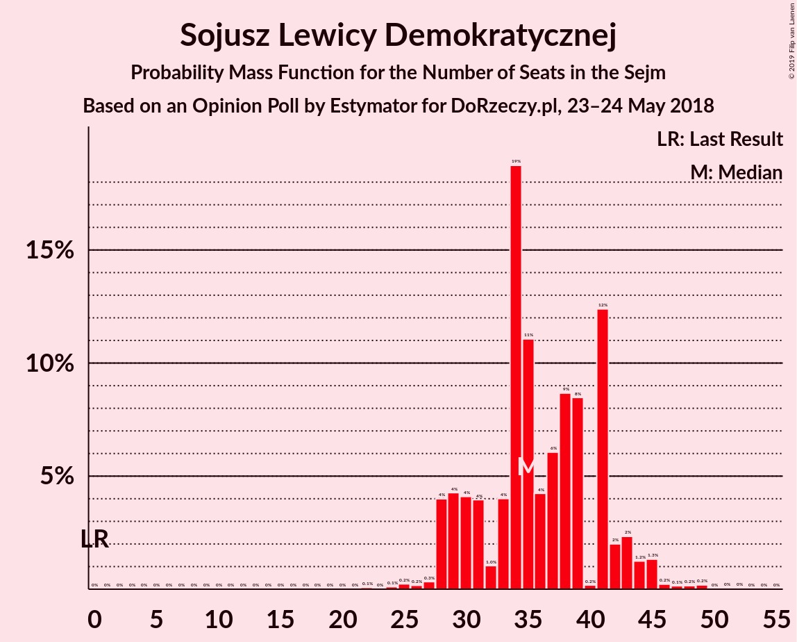
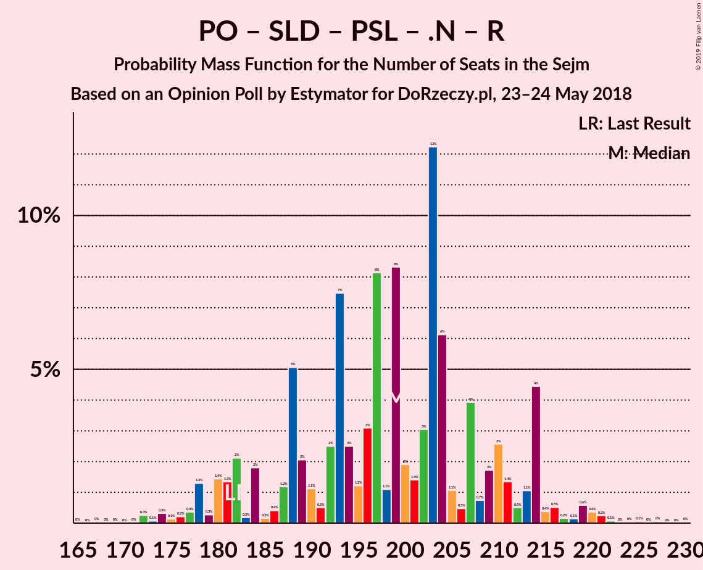
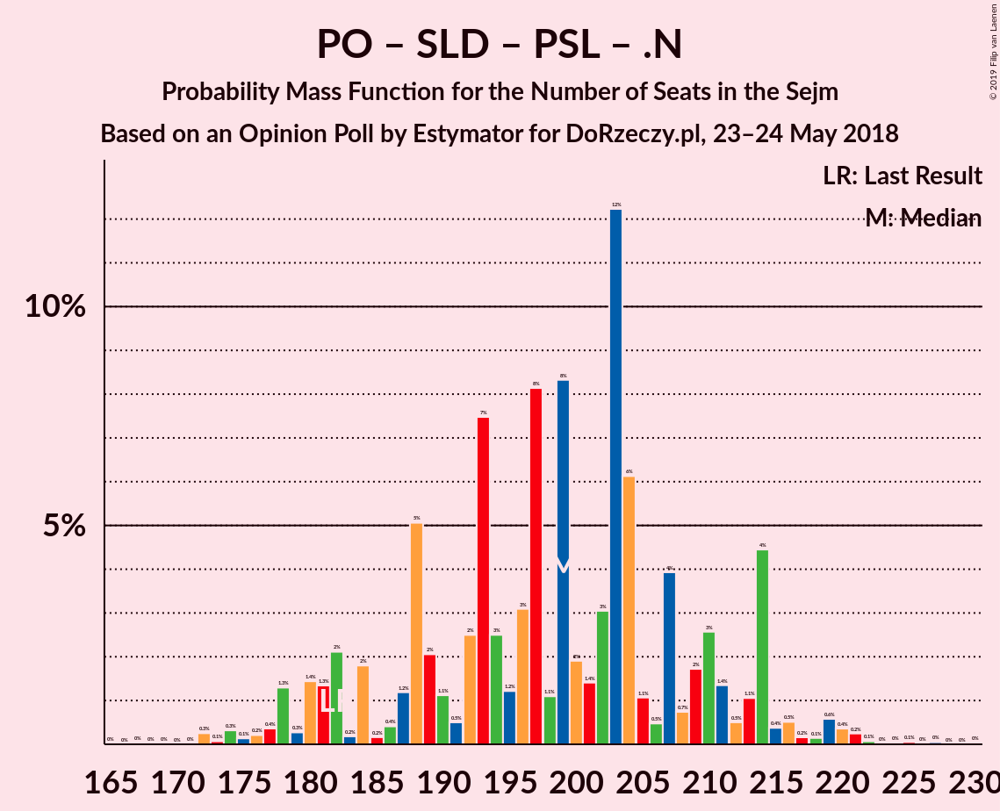

# Opinion Poll by Estymator for DoRzeczy.pl, 23–24 May 2018

<a href="#voting-intentions">Voting Intentions</a> | <a href="#seats">Seats</a> | <a href="#coalitions">Coalitions</a> | <a href="#technical-information">Technical Information</a>

## Voting Intentions

### Confidence Intervals

| Party | Last Result | Poll Result | 80% Confidence Interval | 90% Confidence Interval | 95% Confidence Interval | 99% Confidence Interval |
|:-----:|:-----------:|:-----------:|:-----------------------:|:-----------------------:|:-----------------------:|:-----------------------:|
| Prawo i Sprawiedliwość | 37.6% | 38.9% | 37.0–40.9% |36.4–41.5% |36.0–42.0% |35.0–43.0% |
| Platforma Obywatelska | 24.1% | 27.1% | 25.4–29.0% |24.9–29.5% |24.4–29.9% |23.6–30.8% |
| Kukiz’15 | 8.8% | 10.4% | 9.3–11.8% |9.0–12.1% |8.7–12.5% |8.2–13.1% |
| Sojusz Lewicy Demokratycznej | 7.6% | 9.0% | 8.0–10.3% |7.7–10.7% |7.4–11.0% |6.9–11.6% |
| Polskie Stronnictwo Ludowe | 5.1% | 6.2% | 5.3–7.2% |5.0–7.5% |4.8–7.8% |4.4–8.4% |
| .Nowoczesna | 7.6% | 2.9% | 2.3–3.7% |2.1–3.9% |2.0–4.1% |1.8–4.5% |
| KORWiN | 4.8% | 2.3% | 1.8–3.0% |1.6–3.2% |1.5–3.4% |1.3–3.8% |
| Lewica Razem | 3.6% | 2.1% | 1.6–2.8% |1.5–3.0% |1.4–3.2% |1.2–3.6% |

*Note:* The poll result column reflects the actual value used in the calculations. Published results may vary slightly, and in addition be rounded to fewer digits.

## Seats

### Confidence Intervals

| Party | Last Result | Median | 80% Confidence Interval | 90% Confidence Interval | 95% Confidence Interval | 99% Confidence Interval |
|:-----:|:-----------:|:------:|:-----------------------:|:-----------------------:|:-----------------------:|:-----------------------:|
| <a href="#prawo-i-sprawiedliwość">Prawo i Sprawiedliwość</a> | 235 | 228 | 222–228 |222–229 |221–232 |212–232 |
| <a href="#platforma-obywatelska">Platforma Obywatelska</a> | 138 | 131 | 131–134 |131–136 |131–136 |131–140 |
| <a href="#kukiz’15">Kukiz’15</a> | 42 | 44 | 43–44 |43–48 |43–50 |40–50 |
| <a href="#sojusz-lewicy-demokratycznej">Sojusz Lewicy Demokratycznej</a> | 0 | 41 | 41–43 |30–43 |28–43 |28–45 |
| <a href="#polskie-stronnictwo-ludowe">Polskie Stronnictwo Ludowe</a> | 16 | 16 | 16–18 |16–18 |15–21 |15–24 |
| <a href="#.nowoczesna">.Nowoczesna</a> | 28 | 0 | 0 |0 |0 |0 |
| <a href="#korwin">KORWiN</a> | 0 | 0 | 0 |0 |0 |0 |
| <a href="#lewica-razem">Lewica Razem</a> | 0 | 0 | 0 |0 |0 |0 |

### Prawo i Sprawiedliwość

*For a full overview of the results for this party, see the [Prawo i Sprawiedliwość](party-prawoisprawiedliwość.html) page.*

| Number of Seats | Probability | Accumulated | Special Marks |
|:---------------:|:-----------:|:-----------:|:-------------:|
| 205 | 0.1% | 100% |  |
| 206 | 0% | 99.9% |  |
| 207 | 0% | 99.9% |  |
| 208 | 0% | 99.9% |  |
| 209 | 0.1% | 99.9% |  |
| 210 | 0% | 99.8% |  |
| 211 | 0% | 99.8% |  |
| 212 | 1.0% | 99.8% |  |
| 213 | 0% | 98.8% |  |
| 214 | 0% | 98.7% |  |
| 215 | 0.3% | 98.7% |  |
| 216 | 0.5% | 98% |  |
| 217 | 0% | 98% |  |
| 218 | 0% | 98% |  |
| 219 | 0% | 98% |  |
| 220 | 0% | 98% |  |
| 221 | 0.9% | 98% |  |
| 222 | 24% | 97% |  |
| 223 | 0% | 73% |  |
| 224 | 0% | 73% |  |
| 225 | 0% | 73% |  |
| 226 | 0% | 73% |  |
| 227 | 0% | 73% |  |
| 228 | 66% | 73% | Median |
| 229 | 4% | 7% |  |
| 230 | 0% | 3% |  |
| 231 | 0% | 3% | Majority |
| 232 | 3% | 3% |  |
| 233 | 0% | 0.4% |  |
| 234 | 0% | 0.4% |  |
| 235 | 0% | 0.4% | Last Result |
| 236 | 0% | 0.4% |  |
| 237 | 0.4% | 0.4% |  |
| 238 | 0% | 0% |  |

### Platforma Obywatelska

*For a full overview of the results for this party, see the [Platforma Obywatelska](party-platformaobywatelska.html) page.*

| Number of Seats | Probability | Accumulated | Special Marks |
|:---------------:|:-----------:|:-----------:|:-------------:|
| 131 | 66% | 100% | Median |
| 132 | 3% | 34% |  |
| 133 | 0% | 31% |  |
| 134 | 24% | 31% |  |
| 135 | 0.4% | 7% |  |
| 136 | 4% | 7% |  |
| 137 | 0.3% | 2% |  |
| 138 | 0% | 2% | Last Result |
| 139 | 1.0% | 2% |  |
| 140 | 0.9% | 1.1% |  |
| 141 | 0% | 0.2% |  |
| 142 | 0.1% | 0.2% |  |
| 143 | 0% | 0.1% |  |
| 144 | 0% | 0.1% |  |
| 145 | 0.1% | 0.1% |  |
| 146 | 0% | 0% |  |

### Kukiz’15

*For a full overview of the results for this party, see the [Kukiz’15](party-kukiz’15.html) page.*

| Number of Seats | Probability | Accumulated | Special Marks |
|:---------------:|:-----------:|:-----------:|:-------------:|
| 38 | 0.1% | 100% |  |
| 39 | 0% | 99.9% |  |
| 40 | 1.0% | 99.9% |  |
| 41 | 0.3% | 98.9% |  |
| 42 | 0% | 98.6% | Last Result |
| 43 | 25% | 98.6% |  |
| 44 | 69% | 74% | Median |
| 45 | 0.1% | 5% |  |
| 46 | 0% | 5% |  |
| 47 | 0% | 5% |  |
| 48 | 0.9% | 5% |  |
| 49 | 0% | 4% |  |
| 50 | 4% | 4% |  |
| 51 | 0.4% | 0.4% |  |
| 52 | 0% | 0% |  |

### Sojusz Lewicy Demokratycznej

*For a full overview of the results for this party, see the [Sojusz Lewicy Demokratycznej](party-sojuszlewicydemokratycznej.html) page.*

| Number of Seats | Probability | Accumulated | Special Marks |
|:---------------:|:-----------:|:-----------:|:-------------:|
| 0 | 0% | 100% | Last Result |
| 1 | 0% | 100% |  |
| 2 | 0% | 100% |  |
| 3 | 0% | 100% |  |
| 4 | 0% | 100% |  |
| 5 | 0% | 100% |  |
| 6 | 0% | 100% |  |
| 7 | 0% | 100% |  |
| 8 | 0% | 100% |  |
| 9 | 0% | 100% |  |
| 10 | 0% | 100% |  |
| 11 | 0% | 100% |  |
| 12 | 0% | 100% |  |
| 13 | 0% | 100% |  |
| 14 | 0% | 100% |  |
| 15 | 0% | 100% |  |
| 16 | 0% | 100% |  |
| 17 | 0% | 100% |  |
| 18 | 0% | 100% |  |
| 19 | 0% | 100% |  |
| 20 | 0.4% | 100% |  |
| 21 | 0% | 99.6% |  |
| 22 | 0% | 99.6% |  |
| 23 | 0% | 99.6% |  |
| 24 | 0% | 99.6% |  |
| 25 | 0% | 99.6% |  |
| 26 | 0% | 99.6% |  |
| 27 | 0% | 99.6% |  |
| 28 | 4% | 99.6% |  |
| 29 | 0% | 96% |  |
| 30 | 0.9% | 96% |  |
| 31 | 0% | 95% |  |
| 32 | 0.1% | 95% |  |
| 33 | 0% | 95% |  |
| 34 | 0% | 95% |  |
| 35 | 0% | 95% |  |
| 36 | 0% | 95% |  |
| 37 | 3% | 95% |  |
| 38 | 0% | 92% |  |
| 39 | 0% | 92% |  |
| 40 | 0% | 92% |  |
| 41 | 66% | 92% | Median |
| 42 | 0.5% | 26% |  |
| 43 | 24% | 26% |  |
| 44 | 0% | 1.4% |  |
| 45 | 1.0% | 1.4% |  |
| 46 | 0% | 0.4% |  |
| 47 | 0.4% | 0.4% |  |
| 48 | 0% | 0% |  |

### Polskie Stronnictwo Ludowe

*For a full overview of the results for this party, see the [Polskie Stronnictwo Ludowe](party-polskiestronnictwoludowe.html) page.*

| Number of Seats | Probability | Accumulated | Special Marks |
|:---------------:|:-----------:|:-----------:|:-------------:|
| 15 | 3% | 100% |  |
| 16 | 66% | 97% | Last Result, Median |
| 17 | 4% | 31% |  |
| 18 | 24% | 27% |  |
| 19 | 0% | 3% |  |
| 20 | 0.3% | 3% |  |
| 21 | 0.9% | 3% |  |
| 22 | 0% | 2% |  |
| 23 | 0.5% | 2% |  |
| 24 | 1.1% | 1.3% |  |
| 25 | 0.1% | 0.1% |  |
| 26 | 0% | 0% |  |

### .Nowoczesna

*For a full overview of the results for this party, see the [.Nowoczesna](party-nowoczesna.html) page.*

| Number of Seats | Probability | Accumulated | Special Marks |
|:---------------:|:-----------:|:-----------:|:-------------:|
| 0 | 99.9% | 100% | Median |
| 1 | 0% | 0.1% |  |
| 2 | 0% | 0.1% |  |
| 3 | 0% | 0.1% |  |
| 4 | 0% | 0.1% |  |
| 5 | 0% | 0.1% |  |
| 6 | 0% | 0.1% |  |
| 7 | 0% | 0.1% |  |
| 8 | 0.1% | 0.1% |  |
| 9 | 0% | 0% |  |
| 10 | 0% | 0% |  |
| 11 | 0% | 0% |  |
| 12 | 0% | 0% |  |
| 13 | 0% | 0% |  |
| 14 | 0% | 0% |  |
| 15 | 0% | 0% |  |
| 16 | 0% | 0% |  |
| 17 | 0% | 0% |  |
| 18 | 0% | 0% |  |
| 19 | 0% | 0% |  |
| 20 | 0% | 0% |  |
| 21 | 0% | 0% |  |
| 22 | 0% | 0% |  |
| 23 | 0% | 0% |  |
| 24 | 0% | 0% |  |
| 25 | 0% | 0% |  |
| 26 | 0% | 0% |  |
| 27 | 0% | 0% |  |
| 28 | 0% | 0% | Last Result |

### KORWiN

*For a full overview of the results for this party, see the [KORWiN](party-korwin.html) page.*

| Number of Seats | Probability | Accumulated | Special Marks |
|:---------------:|:-----------:|:-----------:|:-------------:|
| 0 | 100% | 100% | Last Result, Median |

### Lewica Razem

*For a full overview of the results for this party, see the [Lewica Razem](party-lewicarazem.html) page.*

| Number of Seats | Probability | Accumulated | Special Marks |
|:---------------:|:-----------:|:-----------:|:-------------:|
| 0 | 100% | 100% | Last Result, Median |

## Coalitions

### Confidence Intervals

| Coalition | Last Result | Median | Majority? | 80% Confidence Interval | 90% Confidence Interval | 95% Confidence Interval | 99% Confidence Interval |
|:---------:|:-----------:|:------:|:---------:|:-----------------------:|:-----------------------:|:-----------------------:|:-----------------------:|
| Prawo i Sprawiedliwość | 235 | 228 | 3% | 222–228 | 222–229 | 221–232 | 212–232 |
| Platforma Obywatelska – Sojusz Lewicy Demokratycznej – Polskie Stronnictwo Ludowe – .Nowoczesna – Lewica Razem | 182 | 188 | 0% | 188–195 | 184–195 | 181–195 | 181–208 |
| Platforma Obywatelska – Sojusz Lewicy Demokratycznej – Polskie Stronnictwo Ludowe – .Nowoczesna | 182 | 188 | 0% | 188–195 | 184–195 | 181–195 | 181–208 |
| Platforma Obywatelska – Sojusz Lewicy Demokratycznej – .Nowoczesna | 166 | 172 | 0% | 172–177 | 169–177 | 164–177 | 164–184 |
| Platforma Obywatelska – Polskie Stronnictwo Ludowe – .Nowoczesna | 182 | 147 | 0% | 147–152 | 147–153 | 147–159 | 147–163 |
| Platforma Obywatelska – .Nowoczesna | 166 | 131 | 0% | 131–134 | 131–136 | 131–136 | 131–140 |
| Platforma Obywatelska | 138 | 131 | 0% | 131–134 | 131–136 | 131–136 | 131–140 |

### Prawo i Sprawiedliwość

| Number of Seats | Probability | Accumulated | Special Marks |
|:---------------:|:-----------:|:-----------:|:-------------:|
| 205 | 0.1% | 100% |  |
| 206 | 0% | 99.9% |  |
| 207 | 0% | 99.9% |  |
| 208 | 0% | 99.9% |  |
| 209 | 0.1% | 99.9% |  |
| 210 | 0% | 99.8% |  |
| 211 | 0% | 99.8% |  |
| 212 | 1.0% | 99.8% |  |
| 213 | 0% | 98.8% |  |
| 214 | 0% | 98.7% |  |
| 215 | 0.3% | 98.7% |  |
| 216 | 0.5% | 98% |  |
| 217 | 0% | 98% |  |
| 218 | 0% | 98% |  |
| 219 | 0% | 98% |  |
| 220 | 0% | 98% |  |
| 221 | 0.9% | 98% |  |
| 222 | 24% | 97% |  |
| 223 | 0% | 73% |  |
| 224 | 0% | 73% |  |
| 225 | 0% | 73% |  |
| 226 | 0% | 73% |  |
| 227 | 0% | 73% |  |
| 228 | 66% | 73% | Median |
| 229 | 4% | 7% |  |
| 230 | 0% | 3% |  |
| 231 | 0% | 3% | Majority |
| 232 | 3% | 3% |  |
| 233 | 0% | 0.4% |  |
| 234 | 0% | 0.4% |  |
| 235 | 0% | 0.4% | Last Result |
| 236 | 0% | 0.4% |  |
| 237 | 0.4% | 0.4% |  |
| 238 | 0% | 0% |  |

### Platforma Obywatelska – Sojusz Lewicy Demokratycznej – Polskie Stronnictwo Ludowe – .Nowoczesna – Lewica Razem

| Number of Seats | Probability | Accumulated | Special Marks |
|:---------------:|:-----------:|:-----------:|:-------------:|
| 172 | 0.4% | 100% |  |
| 173 | 0% | 99.6% |  |
| 174 | 0% | 99.6% |  |
| 175 | 0% | 99.6% |  |
| 176 | 0% | 99.6% |  |
| 177 | 0% | 99.6% |  |
| 178 | 0% | 99.6% |  |
| 179 | 0% | 99.6% |  |
| 180 | 0% | 99.6% |  |
| 181 | 4% | 99.6% |  |
| 182 | 0% | 96% | Last Result |
| 183 | 0% | 96% |  |
| 184 | 3% | 96% |  |
| 185 | 0% | 93% |  |
| 186 | 0% | 93% |  |
| 187 | 0% | 93% |  |
| 188 | 66% | 93% | Median |
| 189 | 0% | 27% |  |
| 190 | 0% | 27% |  |
| 191 | 0.9% | 27% |  |
| 192 | 0% | 26% |  |
| 193 | 0% | 26% |  |
| 194 | 0% | 26% |  |
| 195 | 24% | 26% |  |
| 196 | 0% | 2% |  |
| 197 | 0% | 2% |  |
| 198 | 0% | 2% |  |
| 199 | 0% | 2% |  |
| 200 | 0% | 2% |  |
| 201 | 0.5% | 2% |  |
| 202 | 0% | 2% |  |
| 203 | 0% | 2% |  |
| 204 | 0.3% | 2% |  |
| 205 | 0% | 1.2% |  |
| 206 | 0.1% | 1.2% |  |
| 207 | 0% | 1.1% |  |
| 208 | 1.0% | 1.1% |  |
| 209 | 0% | 0.1% |  |
| 210 | 0% | 0.1% |  |
| 211 | 0% | 0.1% |  |
| 212 | 0% | 0.1% |  |
| 213 | 0% | 0.1% |  |
| 214 | 0% | 0.1% |  |
| 215 | 0% | 0.1% |  |
| 216 | 0% | 0.1% |  |
| 217 | 0.1% | 0.1% |  |
| 218 | 0% | 0% |  |

### Platforma Obywatelska – Sojusz Lewicy Demokratycznej – Polskie Stronnictwo Ludowe – .Nowoczesna

| Number of Seats | Probability | Accumulated | Special Marks |
|:---------------:|:-----------:|:-----------:|:-------------:|
| 172 | 0.4% | 100% |  |
| 173 | 0% | 99.6% |  |
| 174 | 0% | 99.6% |  |
| 175 | 0% | 99.6% |  |
| 176 | 0% | 99.6% |  |
| 177 | 0% | 99.6% |  |
| 178 | 0% | 99.6% |  |
| 179 | 0% | 99.6% |  |
| 180 | 0% | 99.6% |  |
| 181 | 4% | 99.6% |  |
| 182 | 0% | 96% | Last Result |
| 183 | 0% | 96% |  |
| 184 | 3% | 96% |  |
| 185 | 0% | 93% |  |
| 186 | 0% | 93% |  |
| 187 | 0% | 93% |  |
| 188 | 66% | 93% | Median |
| 189 | 0% | 27% |  |
| 190 | 0% | 27% |  |
| 191 | 0.9% | 27% |  |
| 192 | 0% | 26% |  |
| 193 | 0% | 26% |  |
| 194 | 0% | 26% |  |
| 195 | 24% | 26% |  |
| 196 | 0% | 2% |  |
| 197 | 0% | 2% |  |
| 198 | 0% | 2% |  |
| 199 | 0% | 2% |  |
| 200 | 0% | 2% |  |
| 201 | 0.5% | 2% |  |
| 202 | 0% | 2% |  |
| 203 | 0% | 2% |  |
| 204 | 0.3% | 2% |  |
| 205 | 0% | 1.2% |  |
| 206 | 0.1% | 1.2% |  |
| 207 | 0% | 1.1% |  |
| 208 | 1.0% | 1.1% |  |
| 209 | 0% | 0.1% |  |
| 210 | 0% | 0.1% |  |
| 211 | 0% | 0.1% |  |
| 212 | 0% | 0.1% |  |
| 213 | 0% | 0.1% |  |
| 214 | 0% | 0.1% |  |
| 215 | 0% | 0.1% |  |
| 216 | 0% | 0.1% |  |
| 217 | 0.1% | 0.1% |  |
| 218 | 0% | 0% |  |

### Platforma Obywatelska – Sojusz Lewicy Demokratycznej – .Nowoczesna

| Number of Seats | Probability | Accumulated | Special Marks |
|:---------------:|:-----------:|:-----------:|:-------------:|
| 155 | 0.4% | 100% |  |
| 156 | 0% | 99.6% |  |
| 157 | 0% | 99.6% |  |
| 158 | 0% | 99.6% |  |
| 159 | 0% | 99.6% |  |
| 160 | 0% | 99.6% |  |
| 161 | 0% | 99.6% |  |
| 162 | 0% | 99.6% |  |
| 163 | 0% | 99.6% |  |
| 164 | 4% | 99.6% |  |
| 165 | 0% | 96% |  |
| 166 | 0% | 96% | Last Result |
| 167 | 0% | 96% |  |
| 168 | 0% | 96% |  |
| 169 | 3% | 96% |  |
| 170 | 0.9% | 93% |  |
| 171 | 0% | 92% |  |
| 172 | 66% | 92% | Median |
| 173 | 0% | 26% |  |
| 174 | 0% | 26% |  |
| 175 | 0% | 26% |  |
| 176 | 0% | 26% |  |
| 177 | 24% | 26% |  |
| 178 | 0.5% | 2% |  |
| 179 | 0% | 2% |  |
| 180 | 0% | 2% |  |
| 181 | 0% | 2% |  |
| 182 | 0.1% | 2% |  |
| 183 | 0% | 1.4% |  |
| 184 | 1.3% | 1.4% |  |
| 185 | 0% | 0.1% |  |
| 186 | 0% | 0.1% |  |
| 187 | 0% | 0.1% |  |
| 188 | 0% | 0.1% |  |
| 189 | 0% | 0.1% |  |
| 190 | 0% | 0.1% |  |
| 191 | 0% | 0.1% |  |
| 192 | 0.1% | 0.1% |  |
| 193 | 0% | 0% |  |

### Platforma Obywatelska – Polskie Stronnictwo Ludowe – .Nowoczesna

| Number of Seats | Probability | Accumulated | Special Marks |
|:---------------:|:-----------:|:-----------:|:-------------:|
| 147 | 69% | 100% | Median |
| 148 | 0% | 31% |  |
| 149 | 0% | 31% |  |
| 150 | 0% | 31% |  |
| 151 | 0% | 31% |  |
| 152 | 24% | 31% |  |
| 153 | 4% | 7% |  |
| 154 | 0% | 3% |  |
| 155 | 0% | 3% |  |
| 156 | 0% | 3% |  |
| 157 | 0.3% | 3% |  |
| 158 | 0% | 3% |  |
| 159 | 0.5% | 3% |  |
| 160 | 0% | 2% |  |
| 161 | 0.9% | 2% |  |
| 162 | 0% | 1.3% |  |
| 163 | 1.0% | 1.3% |  |
| 164 | 0% | 0.3% |  |
| 165 | 0% | 0.3% |  |
| 166 | 0% | 0.3% |  |
| 167 | 0% | 0.3% |  |
| 168 | 0% | 0.3% |  |
| 169 | 0% | 0.2% |  |
| 170 | 0.1% | 0.2% |  |
| 171 | 0% | 0.1% |  |
| 172 | 0% | 0.1% |  |
| 173 | 0% | 0.1% |  |
| 174 | 0.1% | 0.1% |  |
| 175 | 0% | 0% |  |
| 176 | 0% | 0% |  |
| 177 | 0% | 0% |  |
| 178 | 0% | 0% |  |
| 179 | 0% | 0% |  |
| 180 | 0% | 0% |  |
| 181 | 0% | 0% |  |
| 182 | 0% | 0% | Last Result |

### Platforma Obywatelska – .Nowoczesna

| Number of Seats | Probability | Accumulated | Special Marks |
|:---------------:|:-----------:|:-----------:|:-------------:|
| 131 | 66% | 100% | Median |
| 132 | 3% | 34% |  |
| 133 | 0% | 31% |  |
| 134 | 24% | 31% |  |
| 135 | 0.4% | 7% |  |
| 136 | 4% | 7% |  |
| 137 | 0.3% | 2% |  |
| 138 | 0% | 2% |  |
| 139 | 1.0% | 2% |  |
| 140 | 0.9% | 1.1% |  |
| 141 | 0% | 0.3% |  |
| 142 | 0% | 0.3% |  |
| 143 | 0% | 0.2% |  |
| 144 | 0% | 0.2% |  |
| 145 | 0.1% | 0.2% |  |
| 146 | 0% | 0.1% |  |
| 147 | 0% | 0.1% |  |
| 148 | 0% | 0.1% |  |
| 149 | 0% | 0.1% |  |
| 150 | 0.1% | 0.1% |  |
| 151 | 0% | 0% |  |
| 152 | 0% | 0% |  |
| 153 | 0% | 0% |  |
| 154 | 0% | 0% |  |
| 155 | 0% | 0% |  |
| 156 | 0% | 0% |  |
| 157 | 0% | 0% |  |
| 158 | 0% | 0% |  |
| 159 | 0% | 0% |  |
| 160 | 0% | 0% |  |
| 161 | 0% | 0% |  |
| 162 | 0% | 0% |  |
| 163 | 0% | 0% |  |
| 164 | 0% | 0% |  |
| 165 | 0% | 0% |  |
| 166 | 0% | 0% | Last Result |

### Platforma Obywatelska

| Number of Seats | Probability | Accumulated | Special Marks |
|:---------------:|:-----------:|:-----------:|:-------------:|
| 131 | 66% | 100% | Median |
| 132 | 3% | 34% |  |
| 133 | 0% | 31% |  |
| 134 | 24% | 31% |  |
| 135 | 0.4% | 7% |  |
| 136 | 4% | 7% |  |
| 137 | 0.3% | 2% |  |
| 138 | 0% | 2% | Last Result |
| 139 | 1.0% | 2% |  |
| 140 | 0.9% | 1.1% |  |
| 141 | 0% | 0.2% |  |
| 142 | 0.1% | 0.2% |  |
| 143 | 0% | 0.1% |  |
| 144 | 0% | 0.1% |  |
| 145 | 0.1% | 0.1% |  |
| 146 | 0% | 0% |  |

## Technical Information

### Opinion Poll

+ **Polling firm:** Estymator
+ **Commissioner(s):** DoRzeczy.pl
+ **Fieldwork period:** 23–24 May 2018

### Calculations

+ **Sample size:** 1007
+ **Simulations done:** 1,024
+ **Error estimate:** 3.26%

