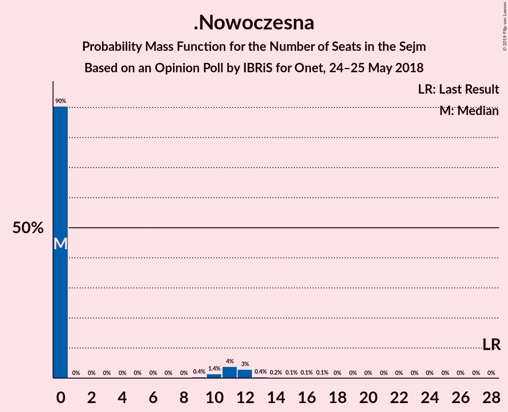
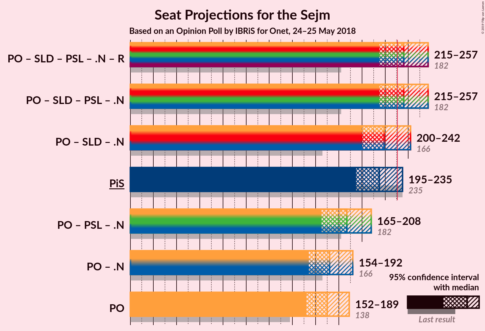
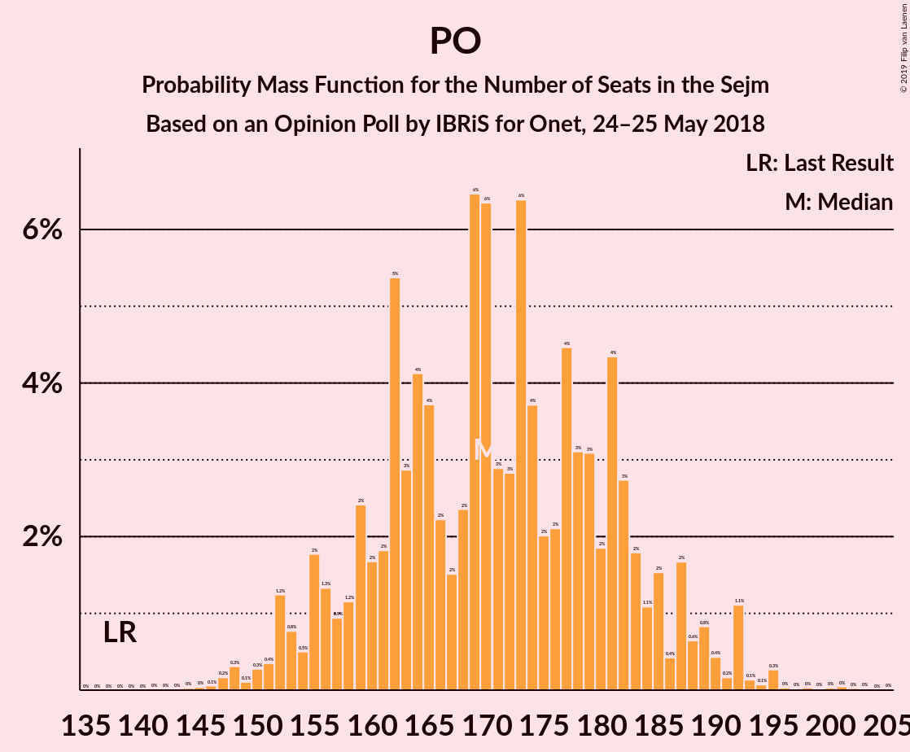

# Opinion Poll by IBRiS for Onet, 24–25 May 2018

<a href="#voting-intentions">Voting Intentions</a> | <a href="#seats">Seats</a> | <a href="#coalitions">Coalitions</a> | <a href="#technical-information">Technical Information</a>

## Voting Intentions

### Confidence Intervals

| Party | Last Result | Poll Result | 80% Confidence Interval | 90% Confidence Interval | 95% Confidence Interval | 99% Confidence Interval |
|:-----:|:-----------:|:-----------:|:-----------------------:|:-----------------------:|:-----------------------:|:-----------------------:|
| Prawo i Sprawiedliwość | 37.6% | 33.3% | 31.5–35.1% |31.0–35.7% |30.5–36.1% |29.7–37.0% |
| Platforma Obywatelska | 24.1% | 27.6% | 26.0–29.4% |25.5–29.9% |25.1–30.4% |24.3–31.2% |
| Sojusz Lewicy Demokratycznej | 7.6% | 9.9% | 8.8–11.2% |8.5–11.5% |8.3–11.8% |7.8–12.5% |
| Polskie Stronnictwo Ludowe | 5.1% | 5.3% | 4.5–6.2% |4.3–6.5% |4.1–6.8% |3.7–7.3% |
| Kukiz’15 | 8.8% | 5.2% | 4.4–6.1% |4.2–6.4% |4.0–6.7% |3.7–7.1% |
| .Nowoczesna | 7.6% | 4.1% | 3.4–5.0% |3.2–5.2% |3.1–5.4% |2.8–5.9% |
| Lewica Razem | 3.6% | 3.2% | 2.6–4.0% |2.4–4.2% |2.3–4.4% |2.0–4.8% |
| KORWiN | 4.8% | 2.0% | 1.6–2.7% |1.4–2.9% |1.3–3.0% |1.1–3.4% |

*Note:* The poll result column reflects the actual value used in the calculations. Published results may vary slightly, and in addition be rounded to fewer digits.

## Seats

### Confidence Intervals

| Party | Last Result | Median | 80% Confidence Interval | 90% Confidence Interval | 95% Confidence Interval | 99% Confidence Interval |
|:-----:|:-----------:|:------:|:-----------------------:|:-----------------------:|:-----------------------:|:-----------------------:|
| <a href="#prawo-i-sprawiedliwość">Prawo i Sprawiedliwość</a> | 235 | 195 | 192–203 |192–203 |192–214 |192–218 |
| <a href="#platforma-obywatelska">Platforma Obywatelska</a> | 138 | 184 | 172–185 |168–185 |161–185 |161–187 |
| <a href="#sojusz-lewicy-demokratycznej">Sojusz Lewicy Demokratycznej</a> | 0 | 37 | 36–42 |36–42 |36–46 |36–71 |
| <a href="#polskie-stronnictwo-ludowe">Polskie Stronnictwo Ludowe</a> | 16 | 28 | 18–29 |18–29 |18–29 |0–35 |
| <a href="#kukiz’15">Kukiz’15</a> | 42 | 18 | 16–25 |16–25 |8–40 |0–40 |
| <a href="#.nowoczesna">.Nowoczesna</a> | 28 | 0 | 0 |0 |0 |0 |
| <a href="#lewica-razem">Lewica Razem</a> | 0 | 0 | 0 |0 |0 |0 |
| <a href="#korwin">KORWiN</a> | 0 | 0 | 0 |0 |0 |0 |

### Prawo i Sprawiedliwość

*For a full overview of the results for this party, see the [Prawo i Sprawiedliwość](party-prawoisprawiedliwość.html) page.*

| Number of Seats | Probability | Accumulated | Special Marks |
|:---------------:|:-----------:|:-----------:|:-------------:|
| 191 | 0.2% | 100% |  |
| 192 | 34% | 99.8% |  |
| 193 | 0% | 66% |  |
| 194 | 0.7% | 66% |  |
| 195 | 32% | 65% | Median |
| 196 | 3% | 33% |  |
| 197 | 0% | 31% |  |
| 198 | 0% | 31% |  |
| 199 | 0% | 31% |  |
| 200 | 0% | 31% |  |
| 201 | 0.1% | 31% |  |
| 202 | 0% | 31% |  |
| 203 | 26% | 31% |  |
| 204 | 1.4% | 5% |  |
| 205 | 0.1% | 3% |  |
| 206 | 0.6% | 3% |  |
| 207 | 0% | 3% |  |
| 208 | 0.1% | 3% |  |
| 209 | 0% | 3% |  |
| 210 | 0% | 3% |  |
| 211 | 0% | 3% |  |
| 212 | 0% | 3% |  |
| 213 | 0% | 3% |  |
| 214 | 0.2% | 3% |  |
| 215 | 0% | 2% |  |
| 216 | 0.2% | 2% |  |
| 217 | 0% | 2% |  |
| 218 | 2% | 2% |  |
| 219 | 0% | 0.4% |  |
| 220 | 0% | 0.4% |  |
| 221 | 0.2% | 0.4% |  |
| 222 | 0% | 0.2% |  |
| 223 | 0% | 0.2% |  |
| 224 | 0% | 0.2% |  |
| 225 | 0% | 0.2% |  |
| 226 | 0% | 0.1% |  |
| 227 | 0.1% | 0.1% |  |
| 228 | 0% | 0% |  |
| 229 | 0% | 0% |  |
| 230 | 0% | 0% |  |
| 231 | 0% | 0% | Majority |
| 232 | 0% | 0% |  |
| 233 | 0% | 0% |  |
| 234 | 0% | 0% |  |
| 235 | 0% | 0% | Last Result |

### Platforma Obywatelska

*For a full overview of the results for this party, see the [Platforma Obywatelska](party-platformaobywatelska.html) page.*

| Number of Seats | Probability | Accumulated | Special Marks |
|:---------------:|:-----------:|:-----------:|:-------------:|
| 138 | 0% | 100% | Last Result |
| 139 | 0% | 100% |  |
| 140 | 0% | 100% |  |
| 141 | 0% | 100% |  |
| 142 | 0% | 100% |  |
| 143 | 0% | 100% |  |
| 144 | 0% | 100% |  |
| 145 | 0% | 100% |  |
| 146 | 0% | 100% |  |
| 147 | 0.1% | 99.9% |  |
| 148 | 0% | 99.9% |  |
| 149 | 0% | 99.9% |  |
| 150 | 0% | 99.9% |  |
| 151 | 0% | 99.9% |  |
| 152 | 0% | 99.9% |  |
| 153 | 0.1% | 99.9% |  |
| 154 | 0% | 99.8% |  |
| 155 | 0% | 99.8% |  |
| 156 | 0% | 99.8% |  |
| 157 | 0% | 99.8% |  |
| 158 | 0.1% | 99.8% |  |
| 159 | 0% | 99.8% |  |
| 160 | 0% | 99.7% |  |
| 161 | 3% | 99.7% |  |
| 162 | 0% | 97% |  |
| 163 | 0% | 97% |  |
| 164 | 0% | 97% |  |
| 165 | 0% | 97% |  |
| 166 | 0% | 97% |  |
| 167 | 0.2% | 97% |  |
| 168 | 2% | 97% |  |
| 169 | 0% | 95% |  |
| 170 | 0.1% | 95% |  |
| 171 | 0.6% | 95% |  |
| 172 | 15% | 94% |  |
| 173 | 11% | 79% |  |
| 174 | 0% | 68% |  |
| 175 | 0% | 68% |  |
| 176 | 0% | 68% |  |
| 177 | 0% | 68% |  |
| 178 | 0.2% | 68% |  |
| 179 | 0% | 68% |  |
| 180 | 0% | 68% |  |
| 181 | 0% | 68% |  |
| 182 | 0% | 68% |  |
| 183 | 0% | 68% |  |
| 184 | 34% | 68% | Median |
| 185 | 32% | 34% |  |
| 186 | 0.8% | 2% |  |
| 187 | 0.7% | 0.7% |  |
| 188 | 0% | 0% |  |

### Sojusz Lewicy Demokratycznej

*For a full overview of the results for this party, see the [Sojusz Lewicy Demokratycznej](party-sojuszlewicydemokratycznej.html) page.*

| Number of Seats | Probability | Accumulated | Special Marks |
|:---------------:|:-----------:|:-----------:|:-------------:|
| 0 | 0% | 100% | Last Result |
| 1 | 0% | 100% |  |
| 2 | 0% | 100% |  |
| 3 | 0% | 100% |  |
| 4 | 0% | 100% |  |
| 5 | 0% | 100% |  |
| 6 | 0% | 100% |  |
| 7 | 0% | 100% |  |
| 8 | 0% | 100% |  |
| 9 | 0% | 100% |  |
| 10 | 0% | 100% |  |
| 11 | 0% | 100% |  |
| 12 | 0% | 100% |  |
| 13 | 0% | 100% |  |
| 14 | 0% | 100% |  |
| 15 | 0% | 100% |  |
| 16 | 0% | 100% |  |
| 17 | 0% | 100% |  |
| 18 | 0% | 100% |  |
| 19 | 0% | 100% |  |
| 20 | 0% | 100% |  |
| 21 | 0% | 100% |  |
| 22 | 0% | 100% |  |
| 23 | 0% | 100% |  |
| 24 | 0% | 100% |  |
| 25 | 0% | 100% |  |
| 26 | 0% | 100% |  |
| 27 | 0% | 100% |  |
| 28 | 0% | 100% |  |
| 29 | 0.1% | 100% |  |
| 30 | 0% | 99.9% |  |
| 31 | 0% | 99.9% |  |
| 32 | 0% | 99.9% |  |
| 33 | 0% | 99.9% |  |
| 34 | 0% | 99.9% |  |
| 35 | 0.1% | 99.9% |  |
| 36 | 33% | 99.8% |  |
| 37 | 35% | 67% | Median |
| 38 | 3% | 33% |  |
| 39 | 0% | 30% |  |
| 40 | 0% | 30% |  |
| 41 | 0% | 30% |  |
| 42 | 26% | 30% |  |
| 43 | 0.2% | 4% |  |
| 44 | 0% | 4% |  |
| 45 | 0% | 4% |  |
| 46 | 2% | 4% |  |
| 47 | 0.2% | 2% |  |
| 48 | 0% | 2% |  |
| 49 | 0% | 2% |  |
| 50 | 0% | 2% |  |
| 51 | 0% | 2% |  |
| 52 | 0% | 2% |  |
| 53 | 0% | 2% |  |
| 54 | 0% | 2% |  |
| 55 | 0% | 2% |  |
| 56 | 0% | 2% |  |
| 57 | 0.1% | 2% |  |
| 58 | 0% | 1.5% |  |
| 59 | 0% | 1.4% |  |
| 60 | 0% | 1.4% |  |
| 61 | 0% | 1.4% |  |
| 62 | 0% | 1.4% |  |
| 63 | 0% | 1.4% |  |
| 64 | 0% | 1.4% |  |
| 65 | 0% | 1.4% |  |
| 66 | 0% | 1.4% |  |
| 67 | 0% | 1.4% |  |
| 68 | 0% | 1.4% |  |
| 69 | 0% | 1.4% |  |
| 70 | 0.8% | 1.4% |  |
| 71 | 0.6% | 0.6% |  |
| 72 | 0% | 0% |  |

### Polskie Stronnictwo Ludowe

*For a full overview of the results for this party, see the [Polskie Stronnictwo Ludowe](party-polskiestronnictwoludowe.html) page.*

| Number of Seats | Probability | Accumulated | Special Marks |
|:---------------:|:-----------:|:-----------:|:-------------:|
| 0 | 2% | 100% |  |
| 1 | 0% | 98% |  |
| 2 | 0% | 98% |  |
| 3 | 0% | 98% |  |
| 4 | 0% | 98% |  |
| 5 | 0% | 98% |  |
| 6 | 0% | 98% |  |
| 7 | 0% | 98% |  |
| 8 | 0% | 98% |  |
| 9 | 0% | 98% |  |
| 10 | 0% | 98% |  |
| 11 | 0% | 98% |  |
| 12 | 0% | 98% |  |
| 13 | 0% | 98% |  |
| 14 | 0% | 98% |  |
| 15 | 0% | 98% |  |
| 16 | 0% | 98% | Last Result |
| 17 | 0% | 98% |  |
| 18 | 26% | 98% |  |
| 19 | 0.1% | 73% |  |
| 20 | 2% | 73% |  |
| 21 | 0.2% | 70% |  |
| 22 | 0% | 70% |  |
| 23 | 0% | 70% |  |
| 24 | 0% | 70% |  |
| 25 | 3% | 70% |  |
| 26 | 0% | 67% |  |
| 27 | 0.8% | 67% |  |
| 28 | 32% | 67% | Median |
| 29 | 34% | 35% |  |
| 30 | 0% | 0.8% |  |
| 31 | 0% | 0.8% |  |
| 32 | 0% | 0.8% |  |
| 33 | 0% | 0.8% |  |
| 34 | 0% | 0.8% |  |
| 35 | 0.7% | 0.8% |  |
| 36 | 0.1% | 0.1% |  |
| 37 | 0% | 0% |  |

### Kukiz’15

*For a full overview of the results for this party, see the [Kukiz’15](party-kukiz’15.html) page.*

| Number of Seats | Probability | Accumulated | Special Marks |
|:---------------:|:-----------:|:-----------:|:-------------:|
| 0 | 2% | 100% |  |
| 1 | 0% | 98% |  |
| 2 | 0% | 98% |  |
| 3 | 0% | 98% |  |
| 4 | 0% | 98% |  |
| 5 | 0% | 98% |  |
| 6 | 0% | 98% |  |
| 7 | 0% | 98% |  |
| 8 | 2% | 98% |  |
| 9 | 0.2% | 96% |  |
| 10 | 0.1% | 96% |  |
| 11 | 0.7% | 96% |  |
| 12 | 0.1% | 95% |  |
| 13 | 0% | 95% |  |
| 14 | 0% | 95% |  |
| 15 | 0% | 95% |  |
| 16 | 33% | 95% |  |
| 17 | 0% | 63% |  |
| 18 | 34% | 63% | Median |
| 19 | 0% | 29% |  |
| 20 | 0% | 29% |  |
| 21 | 0% | 29% |  |
| 22 | 0% | 29% |  |
| 23 | 0% | 29% |  |
| 24 | 10% | 29% |  |
| 25 | 15% | 18% |  |
| 26 | 0% | 3% |  |
| 27 | 0% | 3% |  |
| 28 | 0% | 3% |  |
| 29 | 0% | 3% |  |
| 30 | 0% | 3% |  |
| 31 | 0% | 3% |  |
| 32 | 0% | 3% |  |
| 33 | 0% | 3% |  |
| 34 | 0% | 3% |  |
| 35 | 0% | 3% |  |
| 36 | 0% | 3% |  |
| 37 | 0% | 3% |  |
| 38 | 0% | 3% |  |
| 39 | 0% | 3% |  |
| 40 | 3% | 3% |  |
| 41 | 0% | 0% |  |
| 42 | 0% | 0% | Last Result |

### .Nowoczesna

*For a full overview of the results for this party, see the [.Nowoczesna](party-nowoczesna.html) page.*

| Number of Seats | Probability | Accumulated | Special Marks |
|:---------------:|:-----------:|:-----------:|:-------------:|
| 0 | 99.8% | 100% | Median |
| 1 | 0% | 0.2% |  |
| 2 | 0% | 0.2% |  |
| 3 | 0% | 0.2% |  |
| 4 | 0% | 0.2% |  |
| 5 | 0% | 0.2% |  |
| 6 | 0% | 0.2% |  |
| 7 | 0% | 0.2% |  |
| 8 | 0% | 0.2% |  |
| 9 | 0% | 0.2% |  |
| 10 | 0% | 0.2% |  |
| 11 | 0% | 0.2% |  |
| 12 | 0% | 0.2% |  |
| 13 | 0.1% | 0.2% |  |
| 14 | 0% | 0.1% |  |
| 15 | 0% | 0.1% |  |
| 16 | 0% | 0.1% |  |
| 17 | 0% | 0.1% |  |
| 18 | 0% | 0.1% |  |
| 19 | 0.1% | 0.1% |  |
| 20 | 0% | 0% |  |
| 21 | 0% | 0% |  |
| 22 | 0% | 0% |  |
| 23 | 0% | 0% |  |
| 24 | 0% | 0% |  |
| 25 | 0% | 0% |  |
| 26 | 0% | 0% |  |
| 27 | 0% | 0% |  |
| 28 | 0% | 0% | Last Result |

### Lewica Razem

*For a full overview of the results for this party, see the [Lewica Razem](party-lewicarazem.html) page.*

| Number of Seats | Probability | Accumulated | Special Marks |
|:---------------:|:-----------:|:-----------:|:-------------:|
| 0 | 100% | 100% | Last Result, Median |

### KORWiN

*For a full overview of the results for this party, see the [KORWiN](party-korwin.html) page.*

| Number of Seats | Probability | Accumulated | Special Marks |
|:---------------:|:-----------:|:-----------:|:-------------:|
| 0 | 100% | 100% | Last Result, Median |

## Coalitions

### Confidence Intervals

| Coalition | Last Result | Median | Majority? | 80% Confidence Interval | 90% Confidence Interval | 95% Confidence Interval | 99% Confidence Interval |
|:---------:|:-----------:|:------:|:---------:|:-----------------------:|:-----------------------:|:-----------------------:|:-----------------------:|
| Platforma Obywatelska – Sojusz Lewicy Demokratycznej – Polskie Stronnictwo Ludowe – .Nowoczesna – Lewica Razem | 182 | 249 | 97% | 232–250 | 232–250 | 224–250 | 224–256 |
| Platforma Obywatelska – Sojusz Lewicy Demokratycznej – Polskie Stronnictwo Ludowe – .Nowoczesna | 182 | 249 | 97% | 232–250 | 232–250 | 224–250 | 224–256 |
| Platforma Obywatelska – Sojusz Lewicy Demokratycznej – .Nowoczesna | 166 | 221 | 1.4% | 214–221 | 214–221 | 199–221 | 199–256 |
| Prawo i Sprawiedliwość | 235 | 195 | 0% | 192–203 | 192–203 | 192–214 | 192–218 |
| Platforma Obywatelska – Polskie Stronnictwo Ludowe – .Nowoczesna | 182 | 213 | 0% | 190–213 | 188–213 | 186–213 | 185–214 |
| Platforma Obywatelska – .Nowoczesna | 166 | 184 | 0% | 172–185 | 170–185 | 161–185 | 161–187 |
| Platforma Obywatelska | 138 | 184 | 0% | 172–185 | 168–185 | 161–185 | 161–187 |

### Platforma Obywatelska – Sojusz Lewicy Demokratycznej – Polskie Stronnictwo Ludowe – .Nowoczesna – Lewica Razem

| Number of Seats | Probability | Accumulated | Special Marks |
|:---------------:|:-----------:|:-----------:|:-------------:|
| 182 | 0% | 100% | Last Result |
| 183 | 0% | 100% |  |
| 184 | 0% | 100% |  |
| 185 | 0% | 100% |  |
| 186 | 0% | 100% |  |
| 187 | 0% | 100% |  |
| 188 | 0% | 100% |  |
| 189 | 0% | 100% |  |
| 190 | 0% | 100% |  |
| 191 | 0% | 100% |  |
| 192 | 0% | 100% |  |
| 193 | 0% | 100% |  |
| 194 | 0% | 100% |  |
| 195 | 0% | 100% |  |
| 196 | 0% | 100% |  |
| 197 | 0% | 100% |  |
| 198 | 0% | 100% |  |
| 199 | 0% | 100% |  |
| 200 | 0% | 100% |  |
| 201 | 0% | 100% |  |
| 202 | 0% | 100% |  |
| 203 | 0% | 100% |  |
| 204 | 0% | 100% |  |
| 205 | 0% | 100% |  |
| 206 | 0% | 100% |  |
| 207 | 0% | 100% |  |
| 208 | 0% | 100% |  |
| 209 | 0% | 100% |  |
| 210 | 0% | 100% |  |
| 211 | 0% | 100% |  |
| 212 | 0% | 100% |  |
| 213 | 0% | 100% |  |
| 214 | 0% | 100% |  |
| 215 | 0% | 100% |  |
| 216 | 0% | 100% |  |
| 217 | 0% | 100% |  |
| 218 | 0% | 99.9% |  |
| 219 | 0% | 99.9% |  |
| 220 | 0% | 99.9% |  |
| 221 | 0.2% | 99.9% |  |
| 222 | 0% | 99.8% |  |
| 223 | 0.1% | 99.8% |  |
| 224 | 3% | 99.7% |  |
| 225 | 0.1% | 97% |  |
| 226 | 0% | 97% |  |
| 227 | 0% | 97% |  |
| 228 | 0% | 97% |  |
| 229 | 0% | 97% |  |
| 230 | 0% | 97% |  |
| 231 | 0% | 97% | Majority |
| 232 | 15% | 97% |  |
| 233 | 10% | 82% |  |
| 234 | 2% | 71% |  |
| 235 | 0.2% | 69% |  |
| 236 | 0% | 69% |  |
| 237 | 0% | 69% |  |
| 238 | 0% | 69% |  |
| 239 | 0.2% | 69% |  |
| 240 | 0% | 69% |  |
| 241 | 0% | 69% |  |
| 242 | 0.1% | 69% |  |
| 243 | 0.7% | 69% |  |
| 244 | 0% | 68% |  |
| 245 | 0% | 68% |  |
| 246 | 0% | 68% |  |
| 247 | 0% | 68% |  |
| 248 | 0% | 68% |  |
| 249 | 32% | 68% | Median |
| 250 | 35% | 36% |  |
| 251 | 0.2% | 2% |  |
| 252 | 0% | 1.4% |  |
| 253 | 0% | 1.4% |  |
| 254 | 0% | 1.4% |  |
| 255 | 0% | 1.4% |  |
| 256 | 1.4% | 1.4% |  |
| 257 | 0% | 0% |  |

### Platforma Obywatelska – Sojusz Lewicy Demokratycznej – Polskie Stronnictwo Ludowe – .Nowoczesna

| Number of Seats | Probability | Accumulated | Special Marks |
|:---------------:|:-----------:|:-----------:|:-------------:|
| 182 | 0% | 100% | Last Result |
| 183 | 0% | 100% |  |
| 184 | 0% | 100% |  |
| 185 | 0% | 100% |  |
| 186 | 0% | 100% |  |
| 187 | 0% | 100% |  |
| 188 | 0% | 100% |  |
| 189 | 0% | 100% |  |
| 190 | 0% | 100% |  |
| 191 | 0% | 100% |  |
| 192 | 0% | 100% |  |
| 193 | 0% | 100% |  |
| 194 | 0% | 100% |  |
| 195 | 0% | 100% |  |
| 196 | 0% | 100% |  |
| 197 | 0% | 100% |  |
| 198 | 0% | 100% |  |
| 199 | 0% | 100% |  |
| 200 | 0% | 100% |  |
| 201 | 0% | 100% |  |
| 202 | 0% | 100% |  |
| 203 | 0% | 100% |  |
| 204 | 0% | 100% |  |
| 205 | 0% | 100% |  |
| 206 | 0% | 100% |  |
| 207 | 0% | 100% |  |
| 208 | 0% | 100% |  |
| 209 | 0% | 100% |  |
| 210 | 0% | 100% |  |
| 211 | 0% | 100% |  |
| 212 | 0% | 100% |  |
| 213 | 0% | 100% |  |
| 214 | 0% | 100% |  |
| 215 | 0% | 100% |  |
| 216 | 0% | 100% |  |
| 217 | 0% | 100% |  |
| 218 | 0% | 99.9% |  |
| 219 | 0% | 99.9% |  |
| 220 | 0% | 99.9% |  |
| 221 | 0.2% | 99.9% |  |
| 222 | 0% | 99.8% |  |
| 223 | 0.1% | 99.8% |  |
| 224 | 3% | 99.7% |  |
| 225 | 0.1% | 97% |  |
| 226 | 0% | 97% |  |
| 227 | 0% | 97% |  |
| 228 | 0% | 97% |  |
| 229 | 0% | 97% |  |
| 230 | 0% | 97% |  |
| 231 | 0% | 97% | Majority |
| 232 | 15% | 97% |  |
| 233 | 10% | 82% |  |
| 234 | 2% | 71% |  |
| 235 | 0.2% | 69% |  |
| 236 | 0% | 69% |  |
| 237 | 0% | 69% |  |
| 238 | 0% | 69% |  |
| 239 | 0.2% | 69% |  |
| 240 | 0% | 69% |  |
| 241 | 0% | 69% |  |
| 242 | 0.1% | 69% |  |
| 243 | 0.7% | 69% |  |
| 244 | 0% | 68% |  |
| 245 | 0% | 68% |  |
| 246 | 0% | 68% |  |
| 247 | 0% | 68% |  |
| 248 | 0% | 68% |  |
| 249 | 32% | 68% | Median |
| 250 | 35% | 36% |  |
| 251 | 0.2% | 2% |  |
| 252 | 0% | 1.4% |  |
| 253 | 0% | 1.4% |  |
| 254 | 0% | 1.4% |  |
| 255 | 0% | 1.4% |  |
| 256 | 1.4% | 1.4% |  |
| 257 | 0% | 0% |  |

### Platforma Obywatelska – Sojusz Lewicy Demokratycznej – .Nowoczesna

| Number of Seats | Probability | Accumulated | Special Marks |
|:---------------:|:-----------:|:-----------:|:-------------:|
| 166 | 0% | 100% | Last Result |
| 167 | 0% | 100% |  |
| 168 | 0% | 100% |  |
| 169 | 0% | 100% |  |
| 170 | 0% | 100% |  |
| 171 | 0% | 100% |  |
| 172 | 0% | 100% |  |
| 173 | 0% | 100% |  |
| 174 | 0% | 100% |  |
| 175 | 0% | 100% |  |
| 176 | 0% | 100% |  |
| 177 | 0% | 100% |  |
| 178 | 0% | 100% |  |
| 179 | 0% | 100% |  |
| 180 | 0% | 100% |  |
| 181 | 0% | 100% |  |
| 182 | 0% | 100% |  |
| 183 | 0% | 100% |  |
| 184 | 0% | 100% |  |
| 185 | 0% | 100% |  |
| 186 | 0% | 100% |  |
| 187 | 0% | 100% |  |
| 188 | 0% | 100% |  |
| 189 | 0% | 100% |  |
| 190 | 0% | 100% |  |
| 191 | 0% | 100% |  |
| 192 | 0% | 99.9% |  |
| 193 | 0% | 99.9% |  |
| 194 | 0% | 99.9% |  |
| 195 | 0% | 99.9% |  |
| 196 | 0% | 99.9% |  |
| 197 | 0% | 99.9% |  |
| 198 | 0% | 99.9% |  |
| 199 | 3% | 99.9% |  |
| 200 | 0% | 97% |  |
| 201 | 0% | 97% |  |
| 202 | 0% | 97% |  |
| 203 | 0% | 97% |  |
| 204 | 0% | 97% |  |
| 205 | 0% | 97% |  |
| 206 | 0.1% | 97% |  |
| 207 | 0.2% | 97% |  |
| 208 | 0.7% | 97% |  |
| 209 | 0% | 96% |  |
| 210 | 0% | 96% |  |
| 211 | 0% | 96% |  |
| 212 | 0% | 96% |  |
| 213 | 0% | 96% |  |
| 214 | 17% | 96% |  |
| 215 | 10% | 79% |  |
| 216 | 0% | 69% |  |
| 217 | 0% | 69% |  |
| 218 | 0% | 69% |  |
| 219 | 0.2% | 69% |  |
| 220 | 0% | 68% |  |
| 221 | 66% | 68% | Median |
| 222 | 0.2% | 2% |  |
| 223 | 0.8% | 2% |  |
| 224 | 0% | 1.5% |  |
| 225 | 0% | 1.5% |  |
| 226 | 0% | 1.5% |  |
| 227 | 0% | 1.5% |  |
| 228 | 0% | 1.5% |  |
| 229 | 0% | 1.4% |  |
| 230 | 0% | 1.4% |  |
| 231 | 0% | 1.4% | Majority |
| 232 | 0% | 1.4% |  |
| 233 | 0% | 1.4% |  |
| 234 | 0% | 1.4% |  |
| 235 | 0% | 1.4% |  |
| 236 | 0% | 1.4% |  |
| 237 | 0% | 1.4% |  |
| 238 | 0% | 1.4% |  |
| 239 | 0% | 1.4% |  |
| 240 | 0% | 1.4% |  |
| 241 | 0% | 1.4% |  |
| 242 | 0% | 1.4% |  |
| 243 | 0% | 1.4% |  |
| 244 | 0% | 1.4% |  |
| 245 | 0% | 1.4% |  |
| 246 | 0% | 1.4% |  |
| 247 | 0% | 1.4% |  |
| 248 | 0% | 1.4% |  |
| 249 | 0% | 1.4% |  |
| 250 | 0% | 1.4% |  |
| 251 | 0% | 1.4% |  |
| 252 | 0% | 1.4% |  |
| 253 | 0% | 1.4% |  |
| 254 | 0% | 1.4% |  |
| 255 | 0% | 1.4% |  |
| 256 | 1.4% | 1.4% |  |
| 257 | 0% | 0% |  |

### Prawo i Sprawiedliwość

| Number of Seats | Probability | Accumulated | Special Marks |
|:---------------:|:-----------:|:-----------:|:-------------:|
| 191 | 0.2% | 100% |  |
| 192 | 34% | 99.8% |  |
| 193 | 0% | 66% |  |
| 194 | 0.7% | 66% |  |
| 195 | 32% | 65% | Median |
| 196 | 3% | 33% |  |
| 197 | 0% | 31% |  |
| 198 | 0% | 31% |  |
| 199 | 0% | 31% |  |
| 200 | 0% | 31% |  |
| 201 | 0.1% | 31% |  |
| 202 | 0% | 31% |  |
| 203 | 26% | 31% |  |
| 204 | 1.4% | 5% |  |
| 205 | 0.1% | 3% |  |
| 206 | 0.6% | 3% |  |
| 207 | 0% | 3% |  |
| 208 | 0.1% | 3% |  |
| 209 | 0% | 3% |  |
| 210 | 0% | 3% |  |
| 211 | 0% | 3% |  |
| 212 | 0% | 3% |  |
| 213 | 0% | 3% |  |
| 214 | 0.2% | 3% |  |
| 215 | 0% | 2% |  |
| 216 | 0.2% | 2% |  |
| 217 | 0% | 2% |  |
| 218 | 2% | 2% |  |
| 219 | 0% | 0.4% |  |
| 220 | 0% | 0.4% |  |
| 221 | 0.2% | 0.4% |  |
| 222 | 0% | 0.2% |  |
| 223 | 0% | 0.2% |  |
| 224 | 0% | 0.2% |  |
| 225 | 0% | 0.2% |  |
| 226 | 0% | 0.1% |  |
| 227 | 0.1% | 0.1% |  |
| 228 | 0% | 0% |  |
| 229 | 0% | 0% |  |
| 230 | 0% | 0% |  |
| 231 | 0% | 0% | Majority |
| 232 | 0% | 0% |  |
| 233 | 0% | 0% |  |
| 234 | 0% | 0% |  |
| 235 | 0% | 0% | Last Result |

### Platforma Obywatelska – Polskie Stronnictwo Ludowe – .Nowoczesna

| Number of Seats | Probability | Accumulated | Special Marks |
|:---------------:|:-----------:|:-----------:|:-------------:|
| 166 | 0.1% | 100% |  |
| 167 | 0% | 99.9% |  |
| 168 | 0% | 99.9% |  |
| 169 | 0% | 99.9% |  |
| 170 | 0% | 99.9% |  |
| 171 | 0% | 99.9% |  |
| 172 | 0% | 99.9% |  |
| 173 | 0% | 99.9% |  |
| 174 | 0% | 99.9% |  |
| 175 | 0% | 99.9% |  |
| 176 | 0% | 99.9% |  |
| 177 | 0% | 99.9% |  |
| 178 | 0.2% | 99.9% |  |
| 179 | 0% | 99.7% |  |
| 180 | 0% | 99.7% |  |
| 181 | 0% | 99.7% |  |
| 182 | 0% | 99.7% | Last Result |
| 183 | 0% | 99.7% |  |
| 184 | 0% | 99.7% |  |
| 185 | 0.7% | 99.7% |  |
| 186 | 4% | 99.0% |  |
| 187 | 0% | 95% |  |
| 188 | 2% | 95% |  |
| 189 | 0% | 93% |  |
| 190 | 15% | 93% |  |
| 191 | 10% | 78% |  |
| 192 | 0.1% | 68% |  |
| 193 | 0.2% | 68% |  |
| 194 | 0% | 67% |  |
| 195 | 0% | 67% |  |
| 196 | 0% | 67% |  |
| 197 | 0% | 67% |  |
| 198 | 0% | 67% |  |
| 199 | 0% | 67% |  |
| 200 | 0% | 67% |  |
| 201 | 0% | 67% |  |
| 202 | 0% | 67% |  |
| 203 | 0% | 67% |  |
| 204 | 0% | 67% |  |
| 205 | 0% | 67% |  |
| 206 | 0.7% | 67% |  |
| 207 | 0.1% | 67% |  |
| 208 | 0% | 67% |  |
| 209 | 0% | 67% |  |
| 210 | 0% | 67% |  |
| 211 | 0% | 67% |  |
| 212 | 0% | 67% | Median |
| 213 | 66% | 67% |  |
| 214 | 0.7% | 0.7% |  |
| 215 | 0% | 0% |  |

### Platforma Obywatelska – .Nowoczesna

| Number of Seats | Probability | Accumulated | Special Marks |
|:---------------:|:-----------:|:-----------:|:-------------:|
| 152 | 0.1% | 100% |  |
| 153 | 0% | 99.9% |  |
| 154 | 0% | 99.9% |  |
| 155 | 0% | 99.9% |  |
| 156 | 0% | 99.9% |  |
| 157 | 0% | 99.9% |  |
| 158 | 0% | 99.9% |  |
| 159 | 0% | 99.9% |  |
| 160 | 0% | 99.9% |  |
| 161 | 3% | 99.9% |  |
| 162 | 0% | 97% |  |
| 163 | 0% | 97% |  |
| 164 | 0% | 97% |  |
| 165 | 0% | 97% |  |
| 166 | 0.1% | 97% | Last Result |
| 167 | 0.2% | 97% |  |
| 168 | 2% | 97% |  |
| 169 | 0% | 95% |  |
| 170 | 0.1% | 95% |  |
| 171 | 0.6% | 95% |  |
| 172 | 15% | 94% |  |
| 173 | 11% | 79% |  |
| 174 | 0% | 68% |  |
| 175 | 0% | 68% |  |
| 176 | 0% | 68% |  |
| 177 | 0.1% | 68% |  |
| 178 | 0.2% | 68% |  |
| 179 | 0% | 68% |  |
| 180 | 0% | 68% |  |
| 181 | 0% | 68% |  |
| 182 | 0% | 68% |  |
| 183 | 0% | 68% |  |
| 184 | 34% | 68% | Median |
| 185 | 32% | 34% |  |
| 186 | 0.8% | 2% |  |
| 187 | 0.7% | 0.7% |  |
| 188 | 0% | 0% |  |

### Platforma Obywatelska

| Number of Seats | Probability | Accumulated | Special Marks |
|:---------------:|:-----------:|:-----------:|:-------------:|
| 138 | 0% | 100% | Last Result |
| 139 | 0% | 100% |  |
| 140 | 0% | 100% |  |
| 141 | 0% | 100% |  |
| 142 | 0% | 100% |  |
| 143 | 0% | 100% |  |
| 144 | 0% | 100% |  |
| 145 | 0% | 100% |  |
| 146 | 0% | 100% |  |
| 147 | 0.1% | 99.9% |  |
| 148 | 0% | 99.9% |  |
| 149 | 0% | 99.9% |  |
| 150 | 0% | 99.9% |  |
| 151 | 0% | 99.9% |  |
| 152 | 0% | 99.9% |  |
| 153 | 0.1% | 99.9% |  |
| 154 | 0% | 99.8% |  |
| 155 | 0% | 99.8% |  |
| 156 | 0% | 99.8% |  |
| 157 | 0% | 99.8% |  |
| 158 | 0.1% | 99.8% |  |
| 159 | 0% | 99.8% |  |
| 160 | 0% | 99.7% |  |
| 161 | 3% | 99.7% |  |
| 162 | 0% | 97% |  |
| 163 | 0% | 97% |  |
| 164 | 0% | 97% |  |
| 165 | 0% | 97% |  |
| 166 | 0% | 97% |  |
| 167 | 0.2% | 97% |  |
| 168 | 2% | 97% |  |
| 169 | 0% | 95% |  |
| 170 | 0.1% | 95% |  |
| 171 | 0.6% | 95% |  |
| 172 | 15% | 94% |  |
| 173 | 11% | 79% |  |
| 174 | 0% | 68% |  |
| 175 | 0% | 68% |  |
| 176 | 0% | 68% |  |
| 177 | 0% | 68% |  |
| 178 | 0.2% | 68% |  |
| 179 | 0% | 68% |  |
| 180 | 0% | 68% |  |
| 181 | 0% | 68% |  |
| 182 | 0% | 68% |  |
| 183 | 0% | 68% |  |
| 184 | 34% | 68% | Median |
| 185 | 32% | 34% |  |
| 186 | 0.8% | 2% |  |
| 187 | 0.7% | 0.7% |  |
| 188 | 0% | 0% |  |

## Technical Information

### Opinion Poll

+ **Polling firm:** IBRiS
+ **Commissioner(s):** Onet
+ **Fieldwork period:** 24–25 May 2018

### Calculations

+ **Sample size:** 1100
+ **Simulations done:** 1,024
+ **Error estimate:** 2.09%

