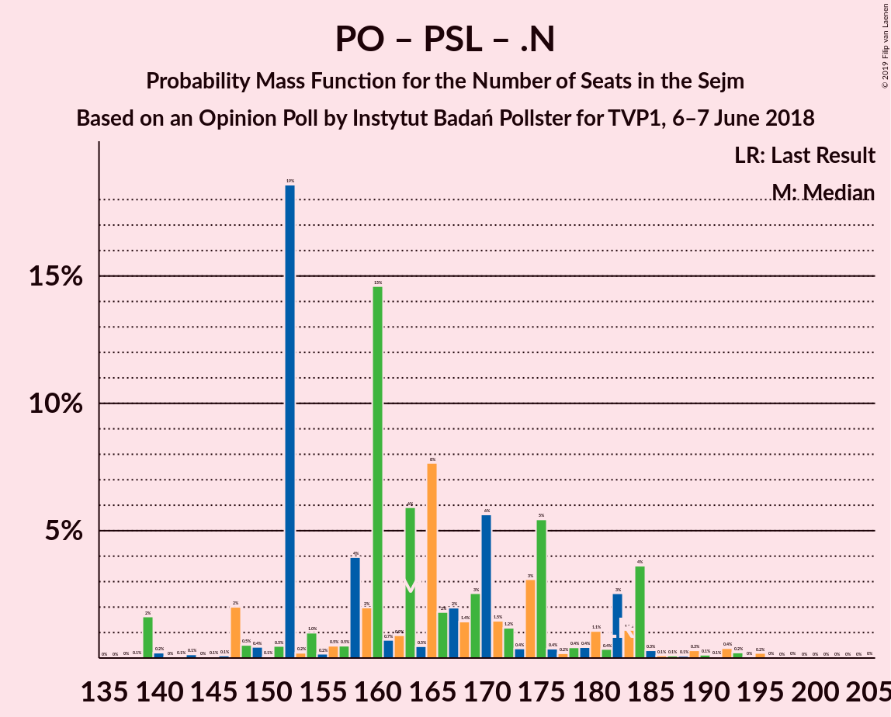

# Opinion Poll by Instytut Badań Pollster for TVP1, 6–7 June 2018

<a href="#voting-intentions">Voting Intentions</a> | <a href="#seats">Seats</a> | <a href="#coalitions">Coalitions</a> | <a href="#technical-information">Technical Information</a>

## Voting Intentions

### Confidence Intervals

| Party | Last Result | Poll Result | 80% Confidence Interval | 90% Confidence Interval | 95% Confidence Interval | 99% Confidence Interval |
|:-----:|:-----------:|:-----------:|:-----------------------:|:-----------------------:|:-----------------------:|:-----------------------:|
| Prawo i Sprawiedliwość | 37.6% | 39.9% | 38.0–41.8% |37.4–42.4% |37.0–42.9% |36.1–43.8% |
| Platforma Obywatelska | 24.1% | 28.0% | 26.2–29.8% |25.8–30.3% |25.3–30.7% |24.5–31.6% |
| Kukiz’15 | 8.8% | 8.0% | 7.0–9.2% |6.8–9.5% |6.5–9.8% |6.1–10.4% |
| Sojusz Lewicy Demokratycznej | 7.6% | 7.0% | 6.1–8.1% |5.8–8.4% |5.6–8.7% |5.2–9.2% |
| Polskie Stronnictwo Ludowe | 5.1% | 5.0% | 4.3–6.0% |4.1–6.3% |3.9–6.5% |3.5–7.0% |
| .Nowoczesna | 7.6% | 4.0% | 3.3–4.9% |3.1–5.1% |3.0–5.4% |2.7–5.8% |
| KORWiN | 4.8% | 4.0% | 3.3–4.9% |3.1–5.1% |3.0–5.4% |2.7–5.8% |
| Lewica Razem | 3.6% | 4.0% | 3.3–4.9% |3.1–5.1% |3.0–5.4% |2.7–5.8% |

*Note:* The poll result column reflects the actual value used in the calculations. Published results may vary slightly, and in addition be rounded to fewer digits.

## Seats

### Confidence Intervals

| Party | Last Result | Median | 80% Confidence Interval | 90% Confidence Interval | 95% Confidence Interval | 99% Confidence Interval |
|:-----:|:-----------:|:------:|:-----------------------:|:-----------------------:|:-----------------------:|:-----------------------:|
| <a href="#prawo-i-sprawiedliwość">Prawo i Sprawiedliwość</a> | 235 | 237 | 216–248 |213–251 |212–252 |210–258 |
| <a href="#platforma-obywatelska">Platforma Obywatelska</a> | 138 | 156 | 147–166 |142–169 |139–170 |136–180 |
| <a href="#kukiz’15">Kukiz’15</a> | 42 | 34 | 28–41 |24–44 |20–45 |13–47 |
| <a href="#sojusz-lewicy-demokratycznej">Sojusz Lewicy Demokratycznej</a> | 0 | 28 | 16–33 |13–35 |12–35 |10–40 |
| <a href="#polskie-stronnictwo-ludowe">Polskie Stronnictwo Ludowe</a> | 16 | 0 | 0–19 |0–21 |0–23 |0–24 |
| <a href="#.nowoczesna">.Nowoczesna</a> | 28 | 0 | 0 |0–7 |0–11 |0–12 |
| <a href="#korwin">KORWiN</a> | 0 | 0 | 0 |0 |0 |0–7 |
| <a href="#lewica-razem">Lewica Razem</a> | 0 | 0 | 0 |0 |0–6 |0–10 |

### Prawo i Sprawiedliwość

*For a full overview of the results for this party, see the [Prawo i Sprawiedliwość](party-prawoisprawiedliwość.html) page.*

| Number of Seats | Probability | Accumulated | Special Marks |
|:---------------:|:-----------:|:-----------:|:-------------:|
| 199 | 0% | 100% |  |
| 200 | 0% | 99.9% |  |
| 201 | 0% | 99.9% |  |
| 202 | 0% | 99.9% |  |
| 203 | 0% | 99.9% |  |
| 204 | 0.1% | 99.9% |  |
| 205 | 0.1% | 99.8% |  |
| 206 | 0% | 99.8% |  |
| 207 | 0% | 99.7% |  |
| 208 | 0.1% | 99.7% |  |
| 209 | 0.1% | 99.6% |  |
| 210 | 0.2% | 99.5% |  |
| 211 | 0.4% | 99.3% |  |
| 212 | 2% | 98.9% |  |
| 213 | 4% | 97% |  |
| 214 | 0.8% | 94% |  |
| 215 | 0.1% | 93% |  |
| 216 | 5% | 93% |  |
| 217 | 0.2% | 88% |  |
| 218 | 0.8% | 88% |  |
| 219 | 0.9% | 87% |  |
| 220 | 1.0% | 86% |  |
| 221 | 0.2% | 85% |  |
| 222 | 1.3% | 85% |  |
| 223 | 2% | 83% |  |
| 224 | 0.2% | 82% |  |
| 225 | 2% | 82% |  |
| 226 | 5% | 80% |  |
| 227 | 0.8% | 75% |  |
| 228 | 5% | 74% |  |
| 229 | 0.6% | 69% |  |
| 230 | 2% | 69% |  |
| 231 | 1.3% | 67% | Majority |
| 232 | 0.6% | 66% |  |
| 233 | 0.2% | 65% |  |
| 234 | 3% | 65% |  |
| 235 | 3% | 61% | Last Result |
| 236 | 0.5% | 58% |  |
| 237 | 15% | 58% | Median |
| 238 | 0.8% | 43% |  |
| 239 | 0.2% | 42% |  |
| 240 | 0.1% | 42% |  |
| 241 | 3% | 42% |  |
| 242 | 6% | 39% |  |
| 243 | 0.6% | 33% |  |
| 244 | 5% | 33% |  |
| 245 | 0.1% | 28% |  |
| 246 | 0.1% | 28% |  |
| 247 | 0.1% | 28% |  |
| 248 | 18% | 28% |  |
| 249 | 2% | 10% |  |
| 250 | 2% | 8% |  |
| 251 | 2% | 6% |  |
| 252 | 3% | 5% |  |
| 253 | 0.3% | 2% |  |
| 254 | 0.1% | 2% |  |
| 255 | 0.8% | 2% |  |
| 256 | 0.3% | 0.9% |  |
| 257 | 0% | 0.6% |  |
| 258 | 0.1% | 0.6% |  |
| 259 | 0.2% | 0.5% |  |
| 260 | 0% | 0.3% |  |
| 261 | 0% | 0.3% |  |
| 262 | 0.2% | 0.2% |  |
| 263 | 0% | 0.1% |  |
| 264 | 0% | 0% |  |

### Platforma Obywatelska

*For a full overview of the results for this party, see the [Platforma Obywatelska](party-platformaobywatelska.html) page.*

| Number of Seats | Probability | Accumulated | Special Marks |
|:---------------:|:-----------:|:-----------:|:-------------:|
| 129 | 0% | 100% |  |
| 130 | 0% | 99.9% |  |
| 131 | 0.1% | 99.9% |  |
| 132 | 0% | 99.9% |  |
| 133 | 0.1% | 99.8% |  |
| 134 | 0.1% | 99.8% |  |
| 135 | 0% | 99.7% |  |
| 136 | 0.9% | 99.7% |  |
| 137 | 0.3% | 98.8% |  |
| 138 | 0.1% | 98.5% | Last Result |
| 139 | 2% | 98% |  |
| 140 | 0.6% | 97% |  |
| 141 | 0.4% | 96% |  |
| 142 | 0.7% | 96% |  |
| 143 | 0.5% | 95% |  |
| 144 | 0.2% | 95% |  |
| 145 | 0.7% | 94% |  |
| 146 | 0.3% | 94% |  |
| 147 | 4% | 93% |  |
| 148 | 1.5% | 90% |  |
| 149 | 4% | 88% |  |
| 150 | 1.0% | 84% |  |
| 151 | 0.8% | 83% |  |
| 152 | 23% | 82% |  |
| 153 | 1.0% | 59% |  |
| 154 | 3% | 58% |  |
| 155 | 4% | 54% |  |
| 156 | 1.5% | 51% | Median |
| 157 | 0.9% | 49% |  |
| 158 | 6% | 48% |  |
| 159 | 6% | 43% |  |
| 160 | 15% | 36% |  |
| 161 | 2% | 21% |  |
| 162 | 1.2% | 19% |  |
| 163 | 0.1% | 18% |  |
| 164 | 0.6% | 18% |  |
| 165 | 4% | 17% |  |
| 166 | 4% | 13% |  |
| 167 | 2% | 9% |  |
| 168 | 0.7% | 7% |  |
| 169 | 2% | 7% |  |
| 170 | 2% | 4% |  |
| 171 | 0.2% | 2% |  |
| 172 | 0.2% | 2% |  |
| 173 | 0.1% | 2% |  |
| 174 | 0.3% | 2% |  |
| 175 | 0.5% | 2% |  |
| 176 | 0.1% | 1.1% |  |
| 177 | 0% | 1.0% |  |
| 178 | 0.4% | 1.0% |  |
| 179 | 0.1% | 0.6% |  |
| 180 | 0.3% | 0.5% |  |
| 181 | 0% | 0.3% |  |
| 182 | 0.1% | 0.2% |  |
| 183 | 0% | 0.1% |  |
| 184 | 0% | 0.1% |  |
| 185 | 0% | 0.1% |  |
| 186 | 0% | 0.1% |  |
| 187 | 0% | 0% |  |

### Kukiz’15

*For a full overview of the results for this party, see the [Kukiz’15](party-kukiz’15.html) page.*

| Number of Seats | Probability | Accumulated | Special Marks |
|:---------------:|:-----------:|:-----------:|:-------------:|
| 10 | 0% | 100% |  |
| 11 | 0% | 99.9% |  |
| 12 | 0.2% | 99.9% |  |
| 13 | 0.3% | 99.7% |  |
| 14 | 0.1% | 99.5% |  |
| 15 | 0% | 99.4% |  |
| 16 | 0.2% | 99.4% |  |
| 17 | 0.1% | 99.1% |  |
| 18 | 0.8% | 99.0% |  |
| 19 | 0.5% | 98% |  |
| 20 | 0.5% | 98% |  |
| 21 | 0.7% | 97% |  |
| 22 | 0.3% | 97% |  |
| 23 | 0.4% | 96% |  |
| 24 | 1.1% | 96% |  |
| 25 | 0.8% | 95% |  |
| 26 | 2% | 94% |  |
| 27 | 0.5% | 92% |  |
| 28 | 4% | 91% |  |
| 29 | 2% | 88% |  |
| 30 | 2% | 86% |  |
| 31 | 1.2% | 84% |  |
| 32 | 18% | 82% |  |
| 33 | 6% | 64% |  |
| 34 | 17% | 58% | Median |
| 35 | 6% | 41% |  |
| 36 | 8% | 35% |  |
| 37 | 0.9% | 27% |  |
| 38 | 5% | 26% |  |
| 39 | 3% | 21% |  |
| 40 | 4% | 18% |  |
| 41 | 5% | 14% |  |
| 42 | 4% | 10% | Last Result |
| 43 | 0.7% | 6% |  |
| 44 | 1.1% | 5% |  |
| 45 | 3% | 4% |  |
| 46 | 1.0% | 2% |  |
| 47 | 0.1% | 0.6% |  |
| 48 | 0.1% | 0.5% |  |
| 49 | 0.3% | 0.4% |  |
| 50 | 0% | 0.1% |  |
| 51 | 0% | 0% |  |

### Sojusz Lewicy Demokratycznej

*For a full overview of the results for this party, see the [Sojusz Lewicy Demokratycznej](party-sojuszlewicydemokratycznej.html) page.*

| Number of Seats | Probability | Accumulated | Special Marks |
|:---------------:|:-----------:|:-----------:|:-------------:|
| 0 | 0.2% | 100% | Last Result |
| 1 | 0% | 99.8% |  |
| 2 | 0% | 99.8% |  |
| 3 | 0% | 99.8% |  |
| 4 | 0% | 99.8% |  |
| 5 | 0% | 99.8% |  |
| 6 | 0% | 99.8% |  |
| 7 | 0% | 99.8% |  |
| 8 | 0% | 99.8% |  |
| 9 | 0.2% | 99.8% |  |
| 10 | 0.2% | 99.6% |  |
| 11 | 1.5% | 99.4% |  |
| 12 | 2% | 98% |  |
| 13 | 2% | 96% |  |
| 14 | 1.0% | 93% |  |
| 15 | 0.6% | 92% |  |
| 16 | 2% | 92% |  |
| 17 | 0.4% | 90% |  |
| 18 | 0.4% | 89% |  |
| 19 | 9% | 89% |  |
| 20 | 1.0% | 80% |  |
| 21 | 0.5% | 79% |  |
| 22 | 1.1% | 79% |  |
| 23 | 3% | 78% |  |
| 24 | 5% | 74% |  |
| 25 | 3% | 69% |  |
| 26 | 2% | 67% |  |
| 27 | 4% | 64% |  |
| 28 | 22% | 61% | Median |
| 29 | 21% | 39% |  |
| 30 | 4% | 18% |  |
| 31 | 0.2% | 13% |  |
| 32 | 0.4% | 13% |  |
| 33 | 6% | 12% |  |
| 34 | 0.1% | 6% |  |
| 35 | 4% | 6% |  |
| 36 | 0.5% | 2% |  |
| 37 | 0.1% | 2% |  |
| 38 | 0.3% | 2% |  |
| 39 | 0.9% | 2% |  |
| 40 | 0.2% | 0.6% |  |
| 41 | 0.2% | 0.4% |  |
| 42 | 0.1% | 0.2% |  |
| 43 | 0% | 0.2% |  |
| 44 | 0.1% | 0.2% |  |
| 45 | 0% | 0% |  |

### Polskie Stronnictwo Ludowe

*For a full overview of the results for this party, see the [Polskie Stronnictwo Ludowe](party-polskiestronnictwoludowe.html) page.*

| Number of Seats | Probability | Accumulated | Special Marks |
|:---------------:|:-----------:|:-----------:|:-------------:|
| 0 | 60% | 100% | Median |
| 1 | 0% | 40% |  |
| 2 | 0% | 40% |  |
| 3 | 0% | 40% |  |
| 4 | 0% | 40% |  |
| 5 | 0% | 40% |  |
| 6 | 0% | 40% |  |
| 7 | 0% | 40% |  |
| 8 | 0% | 40% |  |
| 9 | 0% | 40% |  |
| 10 | 0% | 40% |  |
| 11 | 6% | 40% |  |
| 12 | 0.7% | 35% |  |
| 13 | 1.0% | 34% |  |
| 14 | 2% | 33% |  |
| 15 | 4% | 32% |  |
| 16 | 10% | 28% | Last Result |
| 17 | 2% | 17% |  |
| 18 | 4% | 15% |  |
| 19 | 3% | 11% |  |
| 20 | 2% | 9% |  |
| 21 | 2% | 6% |  |
| 22 | 1.3% | 5% |  |
| 23 | 1.1% | 4% |  |
| 24 | 2% | 2% |  |
| 25 | 0.1% | 0.4% |  |
| 26 | 0.2% | 0.3% |  |
| 27 | 0.1% | 0.1% |  |
| 28 | 0% | 0% |  |

### .Nowoczesna

*For a full overview of the results for this party, see the [.Nowoczesna](party-nowoczesna.html) page.*

| Number of Seats | Probability | Accumulated | Special Marks |
|:---------------:|:-----------:|:-----------:|:-------------:|
| 0 | 95% | 100% | Median |
| 1 | 0% | 5% |  |
| 2 | 0% | 5% |  |
| 3 | 0% | 5% |  |
| 4 | 0% | 5% |  |
| 5 | 0% | 5% |  |
| 6 | 0% | 5% |  |
| 7 | 0.5% | 5% |  |
| 8 | 0.2% | 5% |  |
| 9 | 0.3% | 4% |  |
| 10 | 0.8% | 4% |  |
| 11 | 3% | 3% |  |
| 12 | 0.5% | 0.6% |  |
| 13 | 0% | 0.1% |  |
| 14 | 0% | 0% |  |
| 15 | 0% | 0% |  |
| 16 | 0% | 0% |  |
| 17 | 0% | 0% |  |
| 18 | 0% | 0% |  |
| 19 | 0% | 0% |  |
| 20 | 0% | 0% |  |
| 21 | 0% | 0% |  |
| 22 | 0% | 0% |  |
| 23 | 0% | 0% |  |
| 24 | 0% | 0% |  |
| 25 | 0% | 0% |  |
| 26 | 0% | 0% |  |
| 27 | 0% | 0% |  |
| 28 | 0% | 0% | Last Result |

### KORWiN

*For a full overview of the results for this party, see the [KORWiN](party-korwin.html) page.*

| Number of Seats | Probability | Accumulated | Special Marks |
|:---------------:|:-----------:|:-----------:|:-------------:|
| 0 | 98% | 100% | Last Result, Median |
| 1 | 0% | 2% |  |
| 2 | 0% | 2% |  |
| 3 | 0.1% | 2% |  |
| 4 | 0.4% | 2% |  |
| 5 | 0.2% | 1.4% |  |
| 6 | 0.4% | 1.1% |  |
| 7 | 0.3% | 0.7% |  |
| 8 | 0% | 0.4% |  |
| 9 | 0.1% | 0.4% |  |
| 10 | 0% | 0.3% |  |
| 11 | 0% | 0.3% |  |
| 12 | 0% | 0.2% |  |
| 13 | 0% | 0.2% |  |
| 14 | 0.1% | 0.2% |  |
| 15 | 0% | 0.1% |  |
| 16 | 0% | 0.1% |  |
| 17 | 0% | 0.1% |  |
| 18 | 0% | 0% |  |

### Lewica Razem

*For a full overview of the results for this party, see the [Lewica Razem](party-lewicarazem.html) page.*

| Number of Seats | Probability | Accumulated | Special Marks |
|:---------------:|:-----------:|:-----------:|:-------------:|
| 0 | 95% | 100% | Last Result, Median |
| 1 | 0% | 5% |  |
| 2 | 0.3% | 5% |  |
| 3 | 0.1% | 4% |  |
| 4 | 0.1% | 4% |  |
| 5 | 0.6% | 4% |  |
| 6 | 2% | 4% |  |
| 7 | 0.5% | 2% |  |
| 8 | 0.4% | 1.3% |  |
| 9 | 0.4% | 0.9% |  |
| 10 | 0.1% | 0.5% |  |
| 11 | 0.1% | 0.5% |  |
| 12 | 0% | 0.3% |  |
| 13 | 0% | 0.3% |  |
| 14 | 0% | 0.2% |  |
| 15 | 0.1% | 0.2% |  |
| 16 | 0% | 0.1% |  |
| 17 | 0.1% | 0.1% |  |
| 18 | 0% | 0.1% |  |
| 19 | 0% | 0% |  |

## Coalitions

### Confidence Intervals

| Coalition | Last Result | Median | Majority? | 80% Confidence Interval | 90% Confidence Interval | 95% Confidence Interval | 99% Confidence Interval |
|:---------:|:-----------:|:------:|:---------:|:-----------------------:|:-----------------------:|:-----------------------:|:-----------------------:|
| Prawo i Sprawiedliwość | 235 | 237 | 67% | 216–248 | 213–251 | 212–252 | 210–258 |
| Platforma Obywatelska – Sojusz Lewicy Demokratycznej – Polskie Stronnictwo Ludowe – .Nowoczesna – Lewica Razem | 182 | 189 | 0% | 179–209 | 172–214 | 168–214 | 163–220 |
| Platforma Obywatelska – Sojusz Lewicy Demokratycznej – Polskie Stronnictwo Ludowe – .Nowoczesna | 182 | 189 | 0% | 178–208 | 171–213 | 167–214 | 163–220 |
| Platforma Obywatelska – Sojusz Lewicy Demokratycznej – .Nowoczesna | 166 | 183 | 0% | 169–196 | 167–198 | 163–201 | 160–206 |
| Platforma Obywatelska – Polskie Stronnictwo Ludowe – .Nowoczesna | 182 | 163 | 0% | 152–180 | 149–184 | 147–184 | 139–193 |
| Platforma Obywatelska – .Nowoczesna | 166 | 158 | 0% | 148–167 | 144–169 | 139–172 | 136–180 |
| Platforma Obywatelska | 138 | 156 | 0% | 147–166 | 142–169 | 139–170 | 136–180 |

### Prawo i Sprawiedliwość

| Number of Seats | Probability | Accumulated | Special Marks |
|:---------------:|:-----------:|:-----------:|:-------------:|
| 199 | 0% | 100% |  |
| 200 | 0% | 99.9% |  |
| 201 | 0% | 99.9% |  |
| 202 | 0% | 99.9% |  |
| 203 | 0% | 99.9% |  |
| 204 | 0.1% | 99.9% |  |
| 205 | 0.1% | 99.8% |  |
| 206 | 0% | 99.8% |  |
| 207 | 0% | 99.7% |  |
| 208 | 0.1% | 99.7% |  |
| 209 | 0.1% | 99.6% |  |
| 210 | 0.2% | 99.5% |  |
| 211 | 0.4% | 99.3% |  |
| 212 | 2% | 98.9% |  |
| 213 | 4% | 97% |  |
| 214 | 0.8% | 94% |  |
| 215 | 0.1% | 93% |  |
| 216 | 5% | 93% |  |
| 217 | 0.2% | 88% |  |
| 218 | 0.8% | 88% |  |
| 219 | 0.9% | 87% |  |
| 220 | 1.0% | 86% |  |
| 221 | 0.2% | 85% |  |
| 222 | 1.3% | 85% |  |
| 223 | 2% | 83% |  |
| 224 | 0.2% | 82% |  |
| 225 | 2% | 82% |  |
| 226 | 5% | 80% |  |
| 227 | 0.8% | 75% |  |
| 228 | 5% | 74% |  |
| 229 | 0.6% | 69% |  |
| 230 | 2% | 69% |  |
| 231 | 1.3% | 67% | Majority |
| 232 | 0.6% | 66% |  |
| 233 | 0.2% | 65% |  |
| 234 | 3% | 65% |  |
| 235 | 3% | 61% | Last Result |
| 236 | 0.5% | 58% |  |
| 237 | 15% | 58% | Median |
| 238 | 0.8% | 43% |  |
| 239 | 0.2% | 42% |  |
| 240 | 0.1% | 42% |  |
| 241 | 3% | 42% |  |
| 242 | 6% | 39% |  |
| 243 | 0.6% | 33% |  |
| 244 | 5% | 33% |  |
| 245 | 0.1% | 28% |  |
| 246 | 0.1% | 28% |  |
| 247 | 0.1% | 28% |  |
| 248 | 18% | 28% |  |
| 249 | 2% | 10% |  |
| 250 | 2% | 8% |  |
| 251 | 2% | 6% |  |
| 252 | 3% | 5% |  |
| 253 | 0.3% | 2% |  |
| 254 | 0.1% | 2% |  |
| 255 | 0.8% | 2% |  |
| 256 | 0.3% | 0.9% |  |
| 257 | 0% | 0.6% |  |
| 258 | 0.1% | 0.6% |  |
| 259 | 0.2% | 0.5% |  |
| 260 | 0% | 0.3% |  |
| 261 | 0% | 0.3% |  |
| 262 | 0.2% | 0.2% |  |
| 263 | 0% | 0.1% |  |
| 264 | 0% | 0% |  |

### Platforma Obywatelska – Sojusz Lewicy Demokratycznej – Polskie Stronnictwo Ludowe – .Nowoczesna – Lewica Razem

| Number of Seats | Probability | Accumulated | Special Marks |
|:---------------:|:-----------:|:-----------:|:-------------:|
| 157 | 0.1% | 100% |  |
| 158 | 0% | 99.9% |  |
| 159 | 0% | 99.9% |  |
| 160 | 0% | 99.9% |  |
| 161 | 0% | 99.9% |  |
| 162 | 0.1% | 99.9% |  |
| 163 | 2% | 99.8% |  |
| 164 | 0% | 98% |  |
| 165 | 0% | 98% |  |
| 166 | 0.2% | 98% |  |
| 167 | 0.1% | 98% |  |
| 168 | 0% | 98% |  |
| 169 | 1.4% | 97% |  |
| 170 | 0.8% | 96% |  |
| 171 | 0% | 95% |  |
| 172 | 2% | 95% |  |
| 173 | 0.2% | 94% |  |
| 174 | 0.1% | 93% |  |
| 175 | 0.1% | 93% |  |
| 176 | 0.2% | 93% |  |
| 177 | 0.5% | 93% |  |
| 178 | 2% | 92% |  |
| 179 | 2% | 90% |  |
| 180 | 18% | 88% |  |
| 181 | 0.6% | 70% |  |
| 182 | 6% | 70% | Last Result |
| 183 | 0.2% | 63% |  |
| 184 | 4% | 63% | Median |
| 185 | 0.7% | 59% |  |
| 186 | 0.7% | 59% |  |
| 187 | 0.4% | 58% |  |
| 188 | 2% | 57% |  |
| 189 | 14% | 55% |  |
| 190 | 1.2% | 41% |  |
| 191 | 0.8% | 40% |  |
| 192 | 1.5% | 39% |  |
| 193 | 1.2% | 38% |  |
| 194 | 4% | 36% |  |
| 195 | 3% | 33% |  |
| 196 | 0.4% | 30% |  |
| 197 | 0.8% | 30% |  |
| 198 | 3% | 29% |  |
| 199 | 5% | 26% |  |
| 200 | 0.6% | 21% |  |
| 201 | 2% | 21% |  |
| 202 | 0.5% | 18% |  |
| 203 | 4% | 18% |  |
| 204 | 0.1% | 14% |  |
| 205 | 0.6% | 13% |  |
| 206 | 0.5% | 13% |  |
| 207 | 0.4% | 12% |  |
| 208 | 2% | 12% |  |
| 209 | 2% | 10% |  |
| 210 | 1.4% | 8% |  |
| 211 | 2% | 7% |  |
| 212 | 0.3% | 5% |  |
| 213 | 0.1% | 5% |  |
| 214 | 4% | 5% |  |
| 215 | 0.2% | 1.4% |  |
| 216 | 0.4% | 1.2% |  |
| 217 | 0.1% | 0.8% |  |
| 218 | 0.1% | 0.8% |  |
| 219 | 0.1% | 0.7% |  |
| 220 | 0.4% | 0.6% |  |
| 221 | 0% | 0.2% |  |
| 222 | 0% | 0.2% |  |
| 223 | 0% | 0.1% |  |
| 224 | 0% | 0.1% |  |
| 225 | 0% | 0.1% |  |
| 226 | 0% | 0.1% |  |
| 227 | 0% | 0% |  |

### Platforma Obywatelska – Sojusz Lewicy Demokratycznej – Polskie Stronnictwo Ludowe – .Nowoczesna

| Number of Seats | Probability | Accumulated | Special Marks |
|:---------------:|:-----------:|:-----------:|:-------------:|
| 157 | 0.1% | 100% |  |
| 158 | 0% | 99.9% |  |
| 159 | 0% | 99.9% |  |
| 160 | 0% | 99.9% |  |
| 161 | 0% | 99.9% |  |
| 162 | 0.1% | 99.9% |  |
| 163 | 2% | 99.8% |  |
| 164 | 0% | 98% |  |
| 165 | 0% | 98% |  |
| 166 | 0.2% | 98% |  |
| 167 | 0.1% | 98% |  |
| 168 | 0% | 97% |  |
| 169 | 1.4% | 97% |  |
| 170 | 0.8% | 96% |  |
| 171 | 0.4% | 95% |  |
| 172 | 2% | 95% |  |
| 173 | 0.3% | 93% |  |
| 174 | 0.2% | 93% |  |
| 175 | 0.3% | 93% |  |
| 176 | 0.3% | 92% |  |
| 177 | 0.2% | 92% |  |
| 178 | 2% | 92% |  |
| 179 | 3% | 90% |  |
| 180 | 18% | 87% |  |
| 181 | 0.5% | 70% |  |
| 182 | 7% | 69% | Last Result |
| 183 | 0.1% | 62% |  |
| 184 | 4% | 62% | Median |
| 185 | 0.7% | 59% |  |
| 186 | 0.7% | 58% |  |
| 187 | 0.2% | 57% |  |
| 188 | 2% | 57% |  |
| 189 | 15% | 55% |  |
| 190 | 1.1% | 40% |  |
| 191 | 0.8% | 39% |  |
| 192 | 2% | 38% |  |
| 193 | 1.2% | 37% |  |
| 194 | 3% | 36% |  |
| 195 | 3% | 32% |  |
| 196 | 0.5% | 29% |  |
| 197 | 1.3% | 29% |  |
| 198 | 3% | 28% |  |
| 199 | 4% | 25% |  |
| 200 | 0.6% | 20% |  |
| 201 | 2% | 20% |  |
| 202 | 0.5% | 17% |  |
| 203 | 4% | 17% |  |
| 204 | 0.9% | 13% |  |
| 205 | 0.5% | 12% |  |
| 206 | 0.5% | 11% |  |
| 207 | 0.3% | 11% |  |
| 208 | 2% | 11% |  |
| 209 | 2% | 9% |  |
| 210 | 0.3% | 7% |  |
| 211 | 2% | 7% |  |
| 212 | 0.3% | 5% |  |
| 213 | 0.1% | 5% |  |
| 214 | 4% | 5% |  |
| 215 | 0.2% | 1.3% |  |
| 216 | 0.4% | 1.1% |  |
| 217 | 0.1% | 0.8% |  |
| 218 | 0.1% | 0.7% |  |
| 219 | 0.1% | 0.6% |  |
| 220 | 0.4% | 0.6% |  |
| 221 | 0% | 0.2% |  |
| 222 | 0% | 0.1% |  |
| 223 | 0% | 0.1% |  |
| 224 | 0% | 0.1% |  |
| 225 | 0% | 0.1% |  |
| 226 | 0% | 0.1% |  |
| 227 | 0% | 0% |  |

### Platforma Obywatelska – Sojusz Lewicy Demokratycznej – .Nowoczesna

| Number of Seats | Probability | Accumulated | Special Marks |
|:---------------:|:-----------:|:-----------:|:-------------:|
| 154 | 0.1% | 100% |  |
| 155 | 0.1% | 99.9% |  |
| 156 | 0.1% | 99.8% |  |
| 157 | 0.2% | 99.8% |  |
| 158 | 0.1% | 99.6% |  |
| 159 | 0% | 99.6% |  |
| 160 | 0.1% | 99.6% |  |
| 161 | 0.2% | 99.5% |  |
| 162 | 0.8% | 99.3% |  |
| 163 | 3% | 98% |  |
| 164 | 0% | 96% |  |
| 165 | 0.1% | 96% |  |
| 166 | 0.3% | 95% | Last Result |
| 167 | 0.6% | 95% |  |
| 168 | 4% | 95% |  |
| 169 | 1.5% | 91% |  |
| 170 | 1.0% | 90% |  |
| 171 | 6% | 89% |  |
| 172 | 2% | 83% |  |
| 173 | 0.7% | 80% |  |
| 174 | 0.5% | 80% |  |
| 175 | 2% | 79% |  |
| 176 | 0.4% | 77% |  |
| 177 | 0.7% | 77% |  |
| 178 | 2% | 76% |  |
| 179 | 2% | 74% |  |
| 180 | 18% | 72% |  |
| 181 | 0.8% | 53% |  |
| 182 | 1.2% | 52% |  |
| 183 | 5% | 51% |  |
| 184 | 2% | 46% | Median |
| 185 | 0.7% | 44% |  |
| 186 | 0.6% | 43% |  |
| 187 | 1.4% | 43% |  |
| 188 | 6% | 41% |  |
| 189 | 17% | 35% |  |
| 190 | 1.3% | 19% |  |
| 191 | 0.3% | 17% |  |
| 192 | 1.5% | 17% |  |
| 193 | 0.6% | 16% |  |
| 194 | 1.5% | 15% |  |
| 195 | 3% | 13% |  |
| 196 | 4% | 10% |  |
| 197 | 0.5% | 6% |  |
| 198 | 3% | 6% |  |
| 199 | 0.2% | 3% |  |
| 200 | 0.1% | 3% |  |
| 201 | 1.0% | 3% |  |
| 202 | 0.1% | 2% |  |
| 203 | 0.3% | 1.5% |  |
| 204 | 0% | 1.2% |  |
| 205 | 0.2% | 1.2% |  |
| 206 | 0.6% | 1.0% |  |
| 207 | 0% | 0.4% |  |
| 208 | 0% | 0.4% |  |
| 209 | 0.2% | 0.4% |  |
| 210 | 0% | 0.2% |  |
| 211 | 0% | 0.2% |  |
| 212 | 0% | 0.2% |  |
| 213 | 0.1% | 0.1% |  |
| 214 | 0% | 0.1% |  |
| 215 | 0% | 0.1% |  |
| 216 | 0.1% | 0.1% |  |
| 217 | 0% | 0% |  |

### Platforma Obywatelska – Polskie Stronnictwo Ludowe – .Nowoczesna

| Number of Seats | Probability | Accumulated | Special Marks |
|:---------------:|:-----------:|:-----------:|:-------------:|
| 137 | 0% | 100% |  |
| 138 | 0.1% | 99.9% |  |
| 139 | 2% | 99.9% |  |
| 140 | 0.2% | 98% |  |
| 141 | 0% | 98% |  |
| 142 | 0.1% | 98% |  |
| 143 | 0.1% | 98% |  |
| 144 | 0% | 98% |  |
| 145 | 0.1% | 98% |  |
| 146 | 0.1% | 98% |  |
| 147 | 2% | 98% |  |
| 148 | 0.5% | 96% |  |
| 149 | 0.4% | 95% |  |
| 150 | 0.1% | 95% |  |
| 151 | 0.5% | 95% |  |
| 152 | 19% | 94% |  |
| 153 | 0.2% | 76% |  |
| 154 | 1.0% | 75% |  |
| 155 | 0.2% | 74% |  |
| 156 | 0.5% | 74% | Median |
| 157 | 0.5% | 74% |  |
| 158 | 4% | 73% |  |
| 159 | 2% | 69% |  |
| 160 | 15% | 67% |  |
| 161 | 0.7% | 53% |  |
| 162 | 0.9% | 52% |  |
| 163 | 6% | 51% |  |
| 164 | 0.5% | 45% |  |
| 165 | 8% | 45% |  |
| 166 | 2% | 37% |  |
| 167 | 2% | 35% |  |
| 168 | 1.4% | 33% |  |
| 169 | 3% | 32% |  |
| 170 | 6% | 29% |  |
| 171 | 1.5% | 24% |  |
| 172 | 1.2% | 22% |  |
| 173 | 0.4% | 21% |  |
| 174 | 3% | 21% |  |
| 175 | 5% | 18% |  |
| 176 | 0.4% | 12% |  |
| 177 | 0.2% | 12% |  |
| 178 | 0.4% | 12% |  |
| 179 | 0.4% | 11% |  |
| 180 | 1.1% | 11% |  |
| 181 | 0.4% | 10% |  |
| 182 | 3% | 9% | Last Result |
| 183 | 1.1% | 7% |  |
| 184 | 4% | 6% |  |
| 185 | 0.3% | 2% |  |
| 186 | 0.1% | 2% |  |
| 187 | 0.1% | 2% |  |
| 188 | 0.1% | 2% |  |
| 189 | 0.3% | 1.4% |  |
| 190 | 0.1% | 1.1% |  |
| 191 | 0.1% | 1.0% |  |
| 192 | 0.4% | 0.9% |  |
| 193 | 0.2% | 0.6% |  |
| 194 | 0% | 0.3% |  |
| 195 | 0.2% | 0.3% |  |
| 196 | 0% | 0.1% |  |
| 197 | 0% | 0.1% |  |
| 198 | 0% | 0.1% |  |
| 199 | 0% | 0.1% |  |
| 200 | 0% | 0.1% |  |
| 201 | 0% | 0.1% |  |
| 202 | 0% | 0.1% |  |
| 203 | 0% | 0.1% |  |
| 204 | 0% | 0% |  |

### Platforma Obywatelska – .Nowoczesna

| Number of Seats | Probability | Accumulated | Special Marks |
|:---------------:|:-----------:|:-----------:|:-------------:|
| 129 | 0% | 100% |  |
| 130 | 0% | 99.9% |  |
| 131 | 0% | 99.9% |  |
| 132 | 0% | 99.9% |  |
| 133 | 0% | 99.9% |  |
| 134 | 0.1% | 99.8% |  |
| 135 | 0% | 99.8% |  |
| 136 | 0.9% | 99.8% |  |
| 137 | 0.1% | 98.9% |  |
| 138 | 0.1% | 98.8% |  |
| 139 | 2% | 98.8% |  |
| 140 | 0.6% | 97% |  |
| 141 | 0.3% | 96% |  |
| 142 | 0.7% | 96% |  |
| 143 | 0.3% | 95% |  |
| 144 | 0.2% | 95% |  |
| 145 | 0.7% | 95% |  |
| 146 | 0.3% | 94% |  |
| 147 | 3% | 94% |  |
| 148 | 1.2% | 91% |  |
| 149 | 4% | 89% |  |
| 150 | 0.7% | 85% |  |
| 151 | 0.8% | 85% |  |
| 152 | 23% | 84% |  |
| 153 | 1.1% | 60% |  |
| 154 | 3% | 59% |  |
| 155 | 4% | 56% |  |
| 156 | 0.6% | 53% | Median |
| 157 | 0.6% | 52% |  |
| 158 | 6% | 51% |  |
| 159 | 7% | 46% |  |
| 160 | 15% | 39% |  |
| 161 | 2% | 24% |  |
| 162 | 1.2% | 22% |  |
| 163 | 0.3% | 21% |  |
| 164 | 0.6% | 20% |  |
| 165 | 4% | 20% |  |
| 166 | 5% | 15% | Last Result |
| 167 | 2% | 10% |  |
| 168 | 1.0% | 8% |  |
| 169 | 3% | 7% |  |
| 170 | 2% | 5% |  |
| 171 | 0.3% | 3% |  |
| 172 | 0.2% | 3% |  |
| 173 | 0.2% | 2% |  |
| 174 | 0.2% | 2% |  |
| 175 | 0.5% | 2% |  |
| 176 | 0.3% | 1.4% |  |
| 177 | 0.1% | 1.1% |  |
| 178 | 0.4% | 1.0% |  |
| 179 | 0.1% | 0.6% |  |
| 180 | 0.3% | 0.6% |  |
| 181 | 0.1% | 0.3% |  |
| 182 | 0.1% | 0.2% |  |
| 183 | 0% | 0.1% |  |
| 184 | 0% | 0.1% |  |
| 185 | 0% | 0.1% |  |
| 186 | 0% | 0.1% |  |
| 187 | 0% | 0% |  |

### Platforma Obywatelska

| Number of Seats | Probability | Accumulated | Special Marks |
|:---------------:|:-----------:|:-----------:|:-------------:|
| 129 | 0% | 100% |  |
| 130 | 0% | 99.9% |  |
| 131 | 0.1% | 99.9% |  |
| 132 | 0% | 99.9% |  |
| 133 | 0.1% | 99.8% |  |
| 134 | 0.1% | 99.8% |  |
| 135 | 0% | 99.7% |  |
| 136 | 0.9% | 99.7% |  |
| 137 | 0.3% | 98.8% |  |
| 138 | 0.1% | 98.5% | Last Result |
| 139 | 2% | 98% |  |
| 140 | 0.6% | 97% |  |
| 141 | 0.4% | 96% |  |
| 142 | 0.7% | 96% |  |
| 143 | 0.5% | 95% |  |
| 144 | 0.2% | 95% |  |
| 145 | 0.7% | 94% |  |
| 146 | 0.3% | 94% |  |
| 147 | 4% | 93% |  |
| 148 | 1.5% | 90% |  |
| 149 | 4% | 88% |  |
| 150 | 1.0% | 84% |  |
| 151 | 0.8% | 83% |  |
| 152 | 23% | 82% |  |
| 153 | 1.0% | 59% |  |
| 154 | 3% | 58% |  |
| 155 | 4% | 54% |  |
| 156 | 1.5% | 51% | Median |
| 157 | 0.9% | 49% |  |
| 158 | 6% | 48% |  |
| 159 | 6% | 43% |  |
| 160 | 15% | 36% |  |
| 161 | 2% | 21% |  |
| 162 | 1.2% | 19% |  |
| 163 | 0.1% | 18% |  |
| 164 | 0.6% | 18% |  |
| 165 | 4% | 17% |  |
| 166 | 4% | 13% |  |
| 167 | 2% | 9% |  |
| 168 | 0.7% | 7% |  |
| 169 | 2% | 7% |  |
| 170 | 2% | 4% |  |
| 171 | 0.2% | 2% |  |
| 172 | 0.2% | 2% |  |
| 173 | 0.1% | 2% |  |
| 174 | 0.3% | 2% |  |
| 175 | 0.5% | 2% |  |
| 176 | 0.1% | 1.1% |  |
| 177 | 0% | 1.0% |  |
| 178 | 0.4% | 1.0% |  |
| 179 | 0.1% | 0.6% |  |
| 180 | 0.3% | 0.5% |  |
| 181 | 0% | 0.3% |  |
| 182 | 0.1% | 0.2% |  |
| 183 | 0% | 0.1% |  |
| 184 | 0% | 0.1% |  |
| 185 | 0% | 0.1% |  |
| 186 | 0% | 0.1% |  |
| 187 | 0% | 0% |  |

## Technical Information

### Opinion Poll

+ **Polling firm:** Instytut Badań Pollster
+ **Commissioner(s):** TVP1
+ **Fieldwork period:** 6–7 June 2018

### Calculations

+ **Sample size:** 1073
+ **Simulations done:** 262,144
+ **Error estimate:** 1.78%

