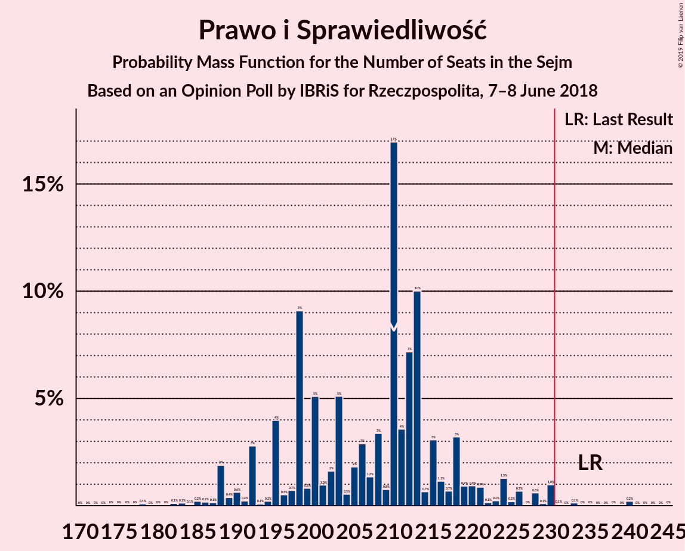
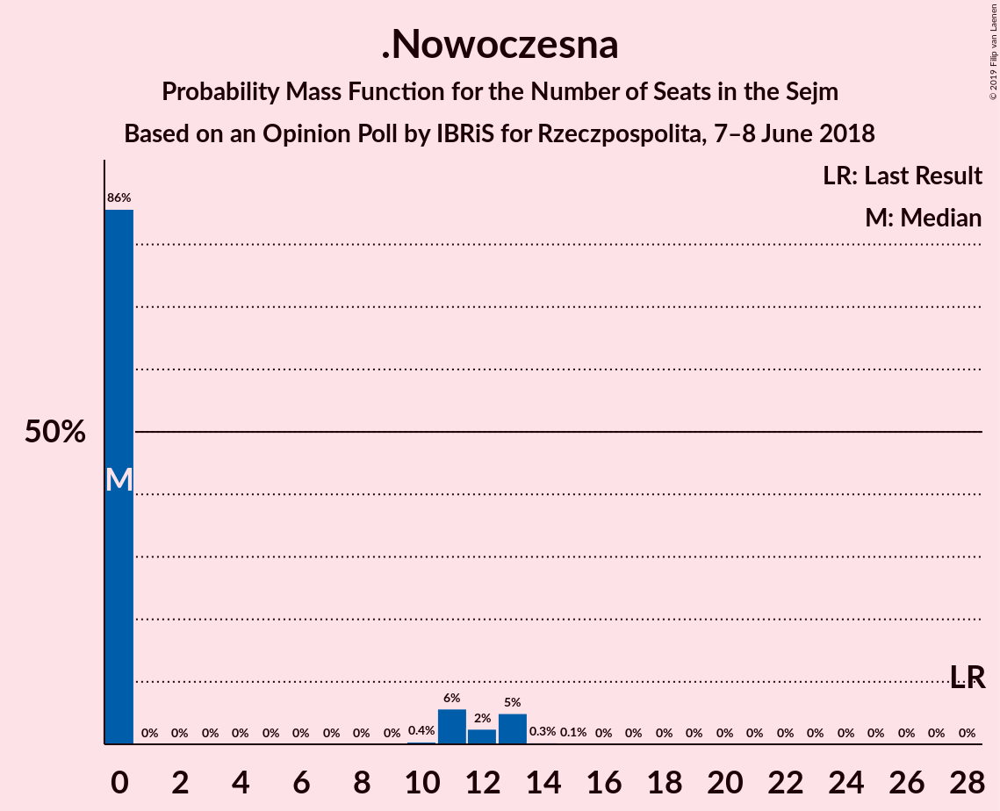

# Opinion Poll by IBRiS for Rzeczpospolita, 7–8 June 2018

<a href="#voting-intentions">Voting Intentions</a> | <a href="#seats">Seats</a> | <a href="#coalitions">Coalitions</a> | <a href="#technical-information">Technical Information</a>

## Voting Intentions

### Confidence Intervals

| Party | Last Result | Poll Result | 80% Confidence Interval | 90% Confidence Interval | 95% Confidence Interval | 99% Confidence Interval |
|:-----:|:-----------:|:-----------:|:-----------------------:|:-----------------------:|:-----------------------:|:-----------------------:|
| Prawo i Sprawiedliwość | 37.6% | 32.7% | 30.9–34.6% |30.4–35.1% |29.9–35.6% |29.1–36.5% |
| Platforma Obywatelska | 24.1% | 26.4% | 24.8–28.2% |24.3–28.7% |23.9–29.2% |23.1–30.0% |
| Sojusz Lewicy Demokratycznej | 7.6% | 9.6% | 8.5–10.8% |8.2–11.2% |7.9–11.5% |7.5–12.1% |
| Polskie Stronnictwo Ludowe | 5.1% | 6.3% | 5.4–7.3% |5.2–7.6% |5.0–7.9% |4.6–8.4% |
| Kukiz’15 | 8.8% | 6.2% | 5.3–7.2% |5.1–7.5% |4.9–7.8% |4.5–8.3% |
| .Nowoczesna | 7.6% | 4.3% | 3.6–5.2% |3.4–5.5% |3.2–5.7% |2.9–6.2% |
| Lewica Razem | 3.6% | 3.3% | 2.7–4.1% |2.5–4.3% |2.4–4.5% |2.1–5.0% |
| KORWiN | 4.8% | 1.3% | 1.0–1.9% |0.9–2.0% |0.8–2.2% |0.6–2.5% |

*Note:* The poll result column reflects the actual value used in the calculations. Published results may vary slightly, and in addition be rounded to fewer digits.

## Seats

### Confidence Intervals

| Party | Last Result | Median | 80% Confidence Interval | 90% Confidence Interval | 95% Confidence Interval | 99% Confidence Interval |
|:-----:|:-----------:|:------:|:-----------------------:|:-----------------------:|:-----------------------:|:-----------------------:|
| <a href="#prawo-i-sprawiedliwość">Prawo i Sprawiedliwość</a> | 235 | 224 | 207–224 |205–225 |200–225 |200–227 |
| <a href="#platforma-obywatelska">Platforma Obywatelska</a> | 138 | 166 | 158–166 |158–167 |141–167 |139–167 |
| <a href="#sojusz-lewicy-demokratycznej">Sojusz Lewicy Demokratycznej</a> | 0 | 41 | 41–49 |40–50 |39–59 |39–60 |
| <a href="#polskie-stronnictwo-ludowe">Polskie Stronnictwo Ludowe</a> | 16 | 0 | 0–27 |0–27 |0–28 |0–28 |
| <a href="#kukiz’15">Kukiz’15</a> | 42 | 29 | 16–29 |12–29 |12–34 |0–34 |
| <a href="#.nowoczesna">.Nowoczesna</a> | 28 | 0 | 0 |0 |0 |0–9 |
| <a href="#lewica-razem">Lewica Razem</a> | 0 | 0 | 0 |0 |0 |0 |
| <a href="#korwin">KORWiN</a> | 0 | 0 | 0 |0 |0 |0 |

### Prawo i Sprawiedliwość

*For a full overview of the results for this party, see the [Prawo i Sprawiedliwość](party-prawoisprawiedliwość.html) page.*

| Number of Seats | Probability | Accumulated | Special Marks |
|:---------------:|:-----------:|:-----------:|:-------------:|
| 199 | 0% | 100% |  |
| 200 | 3% | 99.9% |  |
| 201 | 0% | 97% |  |
| 202 | 0% | 97% |  |
| 203 | 0% | 97% |  |
| 204 | 0% | 97% |  |
| 205 | 4% | 97% |  |
| 206 | 0.5% | 93% |  |
| 207 | 2% | 92% |  |
| 208 | 0.2% | 90% |  |
| 209 | 10% | 90% |  |
| 210 | 4% | 79% |  |
| 211 | 0.9% | 75% |  |
| 212 | 0% | 75% |  |
| 213 | 3% | 75% |  |
| 214 | 0% | 72% |  |
| 215 | 0% | 72% |  |
| 216 | 1.3% | 72% |  |
| 217 | 4% | 70% |  |
| 218 | 3% | 67% |  |
| 219 | 0% | 64% |  |
| 220 | 0% | 64% |  |
| 221 | 0% | 64% |  |
| 222 | 0% | 64% |  |
| 223 | 0% | 64% |  |
| 224 | 59% | 64% | Median |
| 225 | 4% | 6% |  |
| 226 | 0.2% | 1.1% |  |
| 227 | 0.5% | 1.0% |  |
| 228 | 0% | 0.5% |  |
| 229 | 0% | 0.5% |  |
| 230 | 0% | 0.5% |  |
| 231 | 0% | 0.5% | Majority |
| 232 | 0% | 0.5% |  |
| 233 | 0% | 0.5% |  |
| 234 | 0% | 0.4% |  |
| 235 | 0% | 0.4% | Last Result |
| 236 | 0% | 0.4% |  |
| 237 | 0% | 0.4% |  |
| 238 | 0% | 0.4% |  |
| 239 | 0.4% | 0.4% |  |
| 240 | 0% | 0% |  |

### Platforma Obywatelska

*For a full overview of the results for this party, see the [Platforma Obywatelska](party-platformaobywatelska.html) page.*

| Number of Seats | Probability | Accumulated | Special Marks |
|:---------------:|:-----------:|:-----------:|:-------------:|
| 138 | 0% | 100% | Last Result |
| 139 | 2% | 100% |  |
| 140 | 0% | 98% |  |
| 141 | 1.4% | 98% |  |
| 142 | 0% | 97% |  |
| 143 | 0% | 97% |  |
| 144 | 0% | 97% |  |
| 145 | 0% | 97% |  |
| 146 | 0% | 97% |  |
| 147 | 0% | 97% |  |
| 148 | 0% | 97% |  |
| 149 | 0% | 97% |  |
| 150 | 0% | 97% |  |
| 151 | 0% | 97% |  |
| 152 | 0% | 97% |  |
| 153 | 0% | 97% |  |
| 154 | 0.5% | 97% |  |
| 155 | 0% | 96% |  |
| 156 | 0% | 96% |  |
| 157 | 0% | 96% |  |
| 158 | 12% | 96% |  |
| 159 | 4% | 84% |  |
| 160 | 4% | 79% |  |
| 161 | 5% | 75% |  |
| 162 | 5% | 71% |  |
| 163 | 0% | 65% |  |
| 164 | 0% | 65% |  |
| 165 | 0% | 65% |  |
| 166 | 59% | 65% | Median |
| 167 | 6% | 6% |  |
| 168 | 0% | 0.2% |  |
| 169 | 0.2% | 0.2% |  |
| 170 | 0% | 0% |  |

### Sojusz Lewicy Demokratycznej

*For a full overview of the results for this party, see the [Sojusz Lewicy Demokratycznej](party-sojuszlewicydemokratycznej.html) page.*

| Number of Seats | Probability | Accumulated | Special Marks |
|:---------------:|:-----------:|:-----------:|:-------------:|
| 0 | 0% | 100% | Last Result |
| 1 | 0% | 100% |  |
| 2 | 0% | 100% |  |
| 3 | 0% | 100% |  |
| 4 | 0% | 100% |  |
| 5 | 0% | 100% |  |
| 6 | 0% | 100% |  |
| 7 | 0% | 100% |  |
| 8 | 0% | 100% |  |
| 9 | 0% | 100% |  |
| 10 | 0% | 100% |  |
| 11 | 0% | 100% |  |
| 12 | 0% | 100% |  |
| 13 | 0% | 100% |  |
| 14 | 0% | 100% |  |
| 15 | 0% | 100% |  |
| 16 | 0% | 100% |  |
| 17 | 0% | 100% |  |
| 18 | 0% | 100% |  |
| 19 | 0% | 100% |  |
| 20 | 0% | 100% |  |
| 21 | 0% | 100% |  |
| 22 | 0% | 100% |  |
| 23 | 0% | 100% |  |
| 24 | 0% | 100% |  |
| 25 | 0% | 100% |  |
| 26 | 0% | 100% |  |
| 27 | 0% | 100% |  |
| 28 | 0% | 100% |  |
| 29 | 0% | 100% |  |
| 30 | 0% | 100% |  |
| 31 | 0% | 100% |  |
| 32 | 0% | 100% |  |
| 33 | 0% | 100% |  |
| 34 | 0% | 100% |  |
| 35 | 0% | 100% |  |
| 36 | 0% | 100% |  |
| 37 | 0% | 100% |  |
| 38 | 0% | 100% |  |
| 39 | 3% | 100% |  |
| 40 | 4% | 97% |  |
| 41 | 61% | 93% | Median |
| 42 | 2% | 32% |  |
| 43 | 10% | 31% |  |
| 44 | 0% | 20% |  |
| 45 | 3% | 20% |  |
| 46 | 2% | 18% |  |
| 47 | 3% | 16% |  |
| 48 | 0% | 13% |  |
| 49 | 7% | 13% |  |
| 50 | 3% | 6% |  |
| 51 | 0% | 3% |  |
| 52 | 0% | 3% |  |
| 53 | 0% | 3% |  |
| 54 | 0% | 3% |  |
| 55 | 0% | 3% |  |
| 56 | 0% | 3% |  |
| 57 | 0% | 3% |  |
| 58 | 0% | 3% |  |
| 59 | 1.4% | 3% |  |
| 60 | 2% | 2% |  |
| 61 | 0% | 0% |  |

### Polskie Stronnictwo Ludowe

*For a full overview of the results for this party, see the [Polskie Stronnictwo Ludowe](party-polskiestronnictwoludowe.html) page.*

| Number of Seats | Probability | Accumulated | Special Marks |
|:---------------:|:-----------:|:-----------:|:-------------:|
| 0 | 64% | 100% | Median |
| 1 | 0% | 36% |  |
| 2 | 0% | 36% |  |
| 3 | 0% | 36% |  |
| 4 | 0% | 36% |  |
| 5 | 0% | 36% |  |
| 6 | 0% | 36% |  |
| 7 | 0% | 36% |  |
| 8 | 0% | 36% |  |
| 9 | 0% | 36% |  |
| 10 | 0% | 36% |  |
| 11 | 0% | 36% |  |
| 12 | 0% | 36% |  |
| 13 | 0% | 36% |  |
| 14 | 0% | 36% |  |
| 15 | 0% | 36% |  |
| 16 | 3% | 36% | Last Result |
| 17 | 0.5% | 34% |  |
| 18 | 0% | 33% |  |
| 19 | 2% | 33% |  |
| 20 | 0.1% | 31% |  |
| 21 | 0.9% | 31% |  |
| 22 | 11% | 30% |  |
| 23 | 4% | 20% |  |
| 24 | 0% | 15% |  |
| 25 | 0.3% | 15% |  |
| 26 | 1.4% | 15% |  |
| 27 | 9% | 14% |  |
| 28 | 4% | 4% |  |
| 29 | 0% | 0% |  |

### Kukiz’15

*For a full overview of the results for this party, see the [Kukiz’15](party-kukiz’15.html) page.*

| Number of Seats | Probability | Accumulated | Special Marks |
|:---------------:|:-----------:|:-----------:|:-------------:|
| 0 | 1.5% | 100% |  |
| 1 | 0% | 98.5% |  |
| 2 | 0% | 98.5% |  |
| 3 | 0% | 98.5% |  |
| 4 | 0% | 98.5% |  |
| 5 | 0% | 98.5% |  |
| 6 | 0% | 98.5% |  |
| 7 | 0% | 98.5% |  |
| 8 | 0% | 98.5% |  |
| 9 | 0.4% | 98.5% |  |
| 10 | 0% | 98% |  |
| 11 | 0.5% | 98% |  |
| 12 | 4% | 98% |  |
| 13 | 0% | 94% |  |
| 14 | 0% | 94% |  |
| 15 | 1.2% | 94% |  |
| 16 | 4% | 92% |  |
| 17 | 0% | 88% |  |
| 18 | 3% | 88% |  |
| 19 | 0% | 85% |  |
| 20 | 0% | 85% |  |
| 21 | 0% | 85% |  |
| 22 | 2% | 85% |  |
| 23 | 3% | 83% |  |
| 24 | 0% | 80% |  |
| 25 | 0% | 80% |  |
| 26 | 0% | 80% |  |
| 27 | 4% | 80% |  |
| 28 | 14% | 76% |  |
| 29 | 59% | 62% | Median |
| 30 | 0% | 3% |  |
| 31 | 0% | 3% |  |
| 32 | 0% | 3% |  |
| 33 | 0% | 3% |  |
| 34 | 3% | 3% |  |
| 35 | 0% | 0.1% |  |
| 36 | 0% | 0.1% |  |
| 37 | 0% | 0.1% |  |
| 38 | 0% | 0.1% |  |
| 39 | 0% | 0% |  |
| 40 | 0% | 0% |  |
| 41 | 0% | 0% |  |
| 42 | 0% | 0% | Last Result |

### .Nowoczesna

*For a full overview of the results for this party, see the [.Nowoczesna](party-nowoczesna.html) page.*

| Number of Seats | Probability | Accumulated | Special Marks |
|:---------------:|:-----------:|:-----------:|:-------------:|
| 0 | 99.4% | 100% | Median |
| 1 | 0% | 0.6% |  |
| 2 | 0% | 0.6% |  |
| 3 | 0% | 0.6% |  |
| 4 | 0% | 0.6% |  |
| 5 | 0% | 0.6% |  |
| 6 | 0% | 0.6% |  |
| 7 | 0% | 0.6% |  |
| 8 | 0% | 0.6% |  |
| 9 | 0.4% | 0.6% |  |
| 10 | 0.1% | 0.1% |  |
| 11 | 0% | 0.1% |  |
| 12 | 0% | 0.1% |  |
| 13 | 0% | 0% |  |
| 14 | 0% | 0% |  |
| 15 | 0% | 0% |  |
| 16 | 0% | 0% |  |
| 17 | 0% | 0% |  |
| 18 | 0% | 0% |  |
| 19 | 0% | 0% |  |
| 20 | 0% | 0% |  |
| 21 | 0% | 0% |  |
| 22 | 0% | 0% |  |
| 23 | 0% | 0% |  |
| 24 | 0% | 0% |  |
| 25 | 0% | 0% |  |
| 26 | 0% | 0% |  |
| 27 | 0% | 0% |  |
| 28 | 0% | 0% | Last Result |

### Lewica Razem

*For a full overview of the results for this party, see the [Lewica Razem](party-lewicarazem.html) page.*

| Number of Seats | Probability | Accumulated | Special Marks |
|:---------------:|:-----------:|:-----------:|:-------------:|
| 0 | 100% | 100% | Last Result, Median |

### KORWiN

*For a full overview of the results for this party, see the [KORWiN](party-korwin.html) page.*

| Number of Seats | Probability | Accumulated | Special Marks |
|:---------------:|:-----------:|:-----------:|:-------------:|
| 0 | 100% | 100% | Last Result, Median |

## Coalitions

### Confidence Intervals

| Coalition | Last Result | Median | Majority? | 80% Confidence Interval | 90% Confidence Interval | 95% Confidence Interval | 99% Confidence Interval |
|:---------:|:-----------:|:------:|:---------:|:-----------------------:|:-----------------------:|:-----------------------:|:-----------------------:|
| Platforma Obywatelska – Sojusz Lewicy Demokratycznej – Polskie Stronnictwo Ludowe – .Nowoczesna – Lewica Razem | 182 | 207 | 13% | 207–231 | 207–238 | 207–239 | 207–243 |
| Platforma Obywatelska – Sojusz Lewicy Demokratycznej – Polskie Stronnictwo Ludowe – .Nowoczesna | 182 | 207 | 13% | 207–231 | 207–238 | 207–239 | 207–243 |
| Prawo i Sprawiedliwość | 235 | 224 | 0.5% | 207–224 | 205–225 | 200–225 | 200–227 |
| Platforma Obywatelska – Sojusz Lewicy Demokratycznej – .Nowoczesna | 166 | 207 | 0% | 201–209 | 200–211 | 199–211 | 199–216 |
| Platforma Obywatelska – Polskie Stronnictwo Ludowe – .Nowoczesna | 182 | 166 | 0% | 166–185 | 166–189 | 166–190 | 166–194 |
| Platforma Obywatelska – .Nowoczesna | 166 | 166 | 0% | 158–166 | 158–167 | 141–167 | 139–167 |
| Platforma Obywatelska | 138 | 166 | 0% | 158–166 | 158–167 | 141–167 | 139–167 |

### Platforma Obywatelska – Sojusz Lewicy Demokratycznej – Polskie Stronnictwo Ludowe – .Nowoczesna – Lewica Razem

| Number of Seats | Probability | Accumulated | Special Marks |
|:---------------:|:-----------:|:-----------:|:-------------:|
| 182 | 0% | 100% | Last Result |
| 183 | 0% | 100% |  |
| 184 | 0% | 100% |  |
| 185 | 0% | 100% |  |
| 186 | 0% | 100% |  |
| 187 | 0% | 100% |  |
| 188 | 0% | 100% |  |
| 189 | 0% | 100% |  |
| 190 | 0% | 100% |  |
| 191 | 0% | 100% |  |
| 192 | 0% | 100% |  |
| 193 | 0% | 100% |  |
| 194 | 0% | 100% |  |
| 195 | 0% | 100% |  |
| 196 | 0% | 100% |  |
| 197 | 0% | 100% |  |
| 198 | 0% | 100% |  |
| 199 | 0% | 100% |  |
| 200 | 0% | 100% |  |
| 201 | 0% | 100% |  |
| 202 | 0% | 100% |  |
| 203 | 0% | 100% |  |
| 204 | 0% | 100% |  |
| 205 | 0% | 100% |  |
| 206 | 0.1% | 100% |  |
| 207 | 63% | 99.9% | Median |
| 208 | 0% | 37% |  |
| 209 | 0% | 37% |  |
| 210 | 0% | 37% |  |
| 211 | 0.2% | 37% |  |
| 212 | 0.4% | 37% |  |
| 213 | 0% | 36% |  |
| 214 | 0% | 36% |  |
| 215 | 3% | 36% |  |
| 216 | 0% | 34% |  |
| 217 | 0% | 34% |  |
| 218 | 0% | 34% |  |
| 219 | 0% | 34% |  |
| 220 | 0% | 34% |  |
| 221 | 2% | 34% |  |
| 222 | 1.5% | 32% |  |
| 223 | 10% | 30% |  |
| 224 | 0% | 20% |  |
| 225 | 0% | 20% |  |
| 226 | 3% | 20% |  |
| 227 | 0.5% | 17% |  |
| 228 | 0% | 16% |  |
| 229 | 1.5% | 16% |  |
| 230 | 2% | 15% |  |
| 231 | 3% | 13% | Majority |
| 232 | 0% | 10% |  |
| 233 | 0% | 10% |  |
| 234 | 0% | 10% |  |
| 235 | 0% | 10% |  |
| 236 | 0% | 10% |  |
| 237 | 3% | 10% |  |
| 238 | 4% | 7% |  |
| 239 | 2% | 3% |  |
| 240 | 0% | 1.5% |  |
| 241 | 0% | 1.5% |  |
| 242 | 0% | 1.5% |  |
| 243 | 1.5% | 1.5% |  |
| 244 | 0% | 0% |  |

### Platforma Obywatelska – Sojusz Lewicy Demokratycznej – Polskie Stronnictwo Ludowe – .Nowoczesna

| Number of Seats | Probability | Accumulated | Special Marks |
|:---------------:|:-----------:|:-----------:|:-------------:|
| 182 | 0% | 100% | Last Result |
| 183 | 0% | 100% |  |
| 184 | 0% | 100% |  |
| 185 | 0% | 100% |  |
| 186 | 0% | 100% |  |
| 187 | 0% | 100% |  |
| 188 | 0% | 100% |  |
| 189 | 0% | 100% |  |
| 190 | 0% | 100% |  |
| 191 | 0% | 100% |  |
| 192 | 0% | 100% |  |
| 193 | 0% | 100% |  |
| 194 | 0% | 100% |  |
| 195 | 0% | 100% |  |
| 196 | 0% | 100% |  |
| 197 | 0% | 100% |  |
| 198 | 0% | 100% |  |
| 199 | 0% | 100% |  |
| 200 | 0% | 100% |  |
| 201 | 0% | 100% |  |
| 202 | 0% | 100% |  |
| 203 | 0% | 100% |  |
| 204 | 0% | 100% |  |
| 205 | 0% | 100% |  |
| 206 | 0.1% | 100% |  |
| 207 | 63% | 99.9% | Median |
| 208 | 0% | 37% |  |
| 209 | 0% | 37% |  |
| 210 | 0% | 37% |  |
| 211 | 0.2% | 37% |  |
| 212 | 0.4% | 37% |  |
| 213 | 0% | 36% |  |
| 214 | 0% | 36% |  |
| 215 | 3% | 36% |  |
| 216 | 0% | 34% |  |
| 217 | 0% | 34% |  |
| 218 | 0% | 34% |  |
| 219 | 0% | 34% |  |
| 220 | 0% | 34% |  |
| 221 | 2% | 34% |  |
| 222 | 1.5% | 32% |  |
| 223 | 10% | 30% |  |
| 224 | 0% | 20% |  |
| 225 | 0% | 20% |  |
| 226 | 3% | 20% |  |
| 227 | 0.5% | 17% |  |
| 228 | 0% | 16% |  |
| 229 | 1.5% | 16% |  |
| 230 | 2% | 15% |  |
| 231 | 3% | 13% | Majority |
| 232 | 0% | 10% |  |
| 233 | 0% | 10% |  |
| 234 | 0% | 10% |  |
| 235 | 0% | 10% |  |
| 236 | 0% | 10% |  |
| 237 | 3% | 10% |  |
| 238 | 4% | 7% |  |
| 239 | 2% | 3% |  |
| 240 | 0% | 1.5% |  |
| 241 | 0% | 1.5% |  |
| 242 | 0% | 1.5% |  |
| 243 | 1.5% | 1.5% |  |
| 244 | 0% | 0% |  |

### Prawo i Sprawiedliwość

| Number of Seats | Probability | Accumulated | Special Marks |
|:---------------:|:-----------:|:-----------:|:-------------:|
| 199 | 0% | 100% |  |
| 200 | 3% | 99.9% |  |
| 201 | 0% | 97% |  |
| 202 | 0% | 97% |  |
| 203 | 0% | 97% |  |
| 204 | 0% | 97% |  |
| 205 | 4% | 97% |  |
| 206 | 0.5% | 93% |  |
| 207 | 2% | 92% |  |
| 208 | 0.2% | 90% |  |
| 209 | 10% | 90% |  |
| 210 | 4% | 79% |  |
| 211 | 0.9% | 75% |  |
| 212 | 0% | 75% |  |
| 213 | 3% | 75% |  |
| 214 | 0% | 72% |  |
| 215 | 0% | 72% |  |
| 216 | 1.3% | 72% |  |
| 217 | 4% | 70% |  |
| 218 | 3% | 67% |  |
| 219 | 0% | 64% |  |
| 220 | 0% | 64% |  |
| 221 | 0% | 64% |  |
| 222 | 0% | 64% |  |
| 223 | 0% | 64% |  |
| 224 | 59% | 64% | Median |
| 225 | 4% | 6% |  |
| 226 | 0.2% | 1.1% |  |
| 227 | 0.5% | 1.0% |  |
| 228 | 0% | 0.5% |  |
| 229 | 0% | 0.5% |  |
| 230 | 0% | 0.5% |  |
| 231 | 0% | 0.5% | Majority |
| 232 | 0% | 0.5% |  |
| 233 | 0% | 0.5% |  |
| 234 | 0% | 0.4% |  |
| 235 | 0% | 0.4% | Last Result |
| 236 | 0% | 0.4% |  |
| 237 | 0% | 0.4% |  |
| 238 | 0% | 0.4% |  |
| 239 | 0.4% | 0.4% |  |
| 240 | 0% | 0% |  |

### Platforma Obywatelska – Sojusz Lewicy Demokratycznej – .Nowoczesna

| Number of Seats | Probability | Accumulated | Special Marks |
|:---------------:|:-----------:|:-----------:|:-------------:|
| 166 | 0% | 100% | Last Result |
| 167 | 0% | 100% |  |
| 168 | 0% | 100% |  |
| 169 | 0% | 100% |  |
| 170 | 0% | 100% |  |
| 171 | 0% | 100% |  |
| 172 | 0% | 100% |  |
| 173 | 0% | 100% |  |
| 174 | 0% | 100% |  |
| 175 | 0% | 100% |  |
| 176 | 0% | 100% |  |
| 177 | 0% | 100% |  |
| 178 | 0% | 100% |  |
| 179 | 0% | 100% |  |
| 180 | 0% | 100% |  |
| 181 | 0% | 100% |  |
| 182 | 0% | 100% |  |
| 183 | 0% | 100% |  |
| 184 | 0% | 100% |  |
| 185 | 0% | 100% |  |
| 186 | 0% | 100% |  |
| 187 | 0% | 100% |  |
| 188 | 0% | 100% |  |
| 189 | 0% | 100% |  |
| 190 | 0% | 100% |  |
| 191 | 0% | 100% |  |
| 192 | 0% | 100% |  |
| 193 | 0% | 100% |  |
| 194 | 0% | 100% |  |
| 195 | 0% | 100% |  |
| 196 | 0% | 100% |  |
| 197 | 0% | 100% |  |
| 198 | 0% | 100% |  |
| 199 | 4% | 100% |  |
| 200 | 1.4% | 95% |  |
| 201 | 11% | 94% |  |
| 202 | 2% | 83% |  |
| 203 | 2% | 81% |  |
| 204 | 0.2% | 79% |  |
| 205 | 0.9% | 78% |  |
| 206 | 1.3% | 77% |  |
| 207 | 63% | 76% | Median |
| 208 | 3% | 13% |  |
| 209 | 3% | 10% |  |
| 210 | 0% | 8% |  |
| 211 | 6% | 8% |  |
| 212 | 0.4% | 2% |  |
| 213 | 0% | 1.5% |  |
| 214 | 0% | 1.5% |  |
| 215 | 0% | 1.5% |  |
| 216 | 1.5% | 1.5% |  |
| 217 | 0% | 0% |  |

### Platforma Obywatelska – Polskie Stronnictwo Ludowe – .Nowoczesna

| Number of Seats | Probability | Accumulated | Special Marks |
|:---------------:|:-----------:|:-----------:|:-------------:|
| 165 | 0% | 100% |  |
| 166 | 61% | 99.9% | Median |
| 167 | 6% | 39% |  |
| 168 | 0% | 33% |  |
| 169 | 0.2% | 33% |  |
| 170 | 0% | 33% |  |
| 171 | 0% | 33% |  |
| 172 | 0% | 33% |  |
| 173 | 0% | 33% |  |
| 174 | 0% | 33% |  |
| 175 | 0% | 33% |  |
| 176 | 3% | 33% |  |
| 177 | 0% | 30% |  |
| 178 | 0% | 30% |  |
| 179 | 0.1% | 30% |  |
| 180 | 13% | 30% |  |
| 181 | 0% | 17% |  |
| 182 | 0% | 17% | Last Result |
| 183 | 1.2% | 17% |  |
| 184 | 3% | 16% |  |
| 185 | 3% | 12% |  |
| 186 | 0% | 10% |  |
| 187 | 3% | 10% |  |
| 188 | 0% | 7% |  |
| 189 | 4% | 7% |  |
| 190 | 1.5% | 3% |  |
| 191 | 0% | 1.5% |  |
| 192 | 0% | 1.5% |  |
| 193 | 0% | 1.5% |  |
| 194 | 1.5% | 1.5% |  |
| 195 | 0% | 0% |  |

### Platforma Obywatelska – .Nowoczesna

| Number of Seats | Probability | Accumulated | Special Marks |
|:---------------:|:-----------:|:-----------:|:-------------:|
| 139 | 2% | 100% |  |
| 140 | 0% | 98% |  |
| 141 | 1.4% | 98% |  |
| 142 | 0% | 97% |  |
| 143 | 0% | 97% |  |
| 144 | 0% | 97% |  |
| 145 | 0% | 97% |  |
| 146 | 0% | 97% |  |
| 147 | 0% | 97% |  |
| 148 | 0% | 97% |  |
| 149 | 0.1% | 97% |  |
| 150 | 0% | 97% |  |
| 151 | 0% | 97% |  |
| 152 | 0% | 97% |  |
| 153 | 0% | 97% |  |
| 154 | 0% | 97% |  |
| 155 | 0% | 97% |  |
| 156 | 0% | 97% |  |
| 157 | 0% | 97% |  |
| 158 | 12% | 97% |  |
| 159 | 4% | 84% |  |
| 160 | 4% | 80% |  |
| 161 | 5% | 76% |  |
| 162 | 5% | 71% |  |
| 163 | 0.4% | 66% |  |
| 164 | 0% | 65% |  |
| 165 | 0% | 65% |  |
| 166 | 59% | 65% | Last Result, Median |
| 167 | 6% | 6% |  |
| 168 | 0% | 0.2% |  |
| 169 | 0.2% | 0.2% |  |
| 170 | 0% | 0.1% |  |
| 171 | 0% | 0.1% |  |
| 172 | 0% | 0% |  |

### Platforma Obywatelska

| Number of Seats | Probability | Accumulated | Special Marks |
|:---------------:|:-----------:|:-----------:|:-------------:|
| 138 | 0% | 100% | Last Result |
| 139 | 2% | 100% |  |
| 140 | 0% | 98% |  |
| 141 | 1.4% | 98% |  |
| 142 | 0% | 97% |  |
| 143 | 0% | 97% |  |
| 144 | 0% | 97% |  |
| 145 | 0% | 97% |  |
| 146 | 0% | 97% |  |
| 147 | 0% | 97% |  |
| 148 | 0% | 97% |  |
| 149 | 0% | 97% |  |
| 150 | 0% | 97% |  |
| 151 | 0% | 97% |  |
| 152 | 0% | 97% |  |
| 153 | 0% | 97% |  |
| 154 | 0.5% | 97% |  |
| 155 | 0% | 96% |  |
| 156 | 0% | 96% |  |
| 157 | 0% | 96% |  |
| 158 | 12% | 96% |  |
| 159 | 4% | 84% |  |
| 160 | 4% | 79% |  |
| 161 | 5% | 75% |  |
| 162 | 5% | 71% |  |
| 163 | 0% | 65% |  |
| 164 | 0% | 65% |  |
| 165 | 0% | 65% |  |
| 166 | 59% | 65% | Median |
| 167 | 6% | 6% |  |
| 168 | 0% | 0.2% |  |
| 169 | 0.2% | 0.2% |  |
| 170 | 0% | 0% |  |

## Technical Information

### Opinion Poll

+ **Polling firm:** IBRiS
+ **Commissioner(s):** Rzeczpospolita
+ **Fieldwork period:** 7–8 June 2018

### Calculations

+ **Sample size:** 1067
+ **Simulations done:** 1,024
+ **Error estimate:** 1.68%

