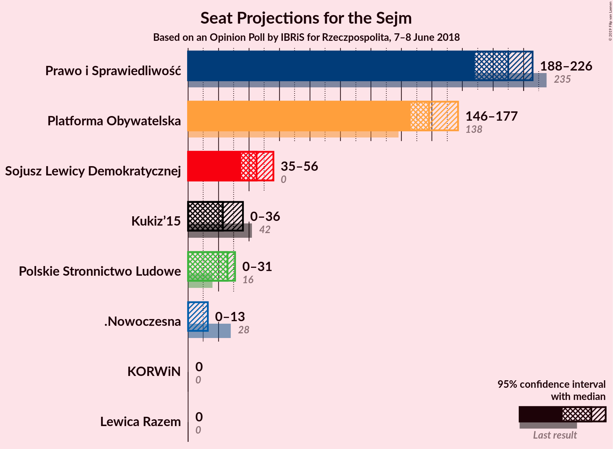
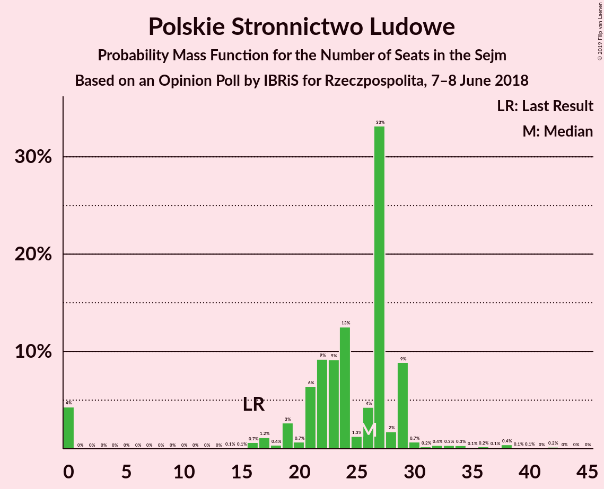
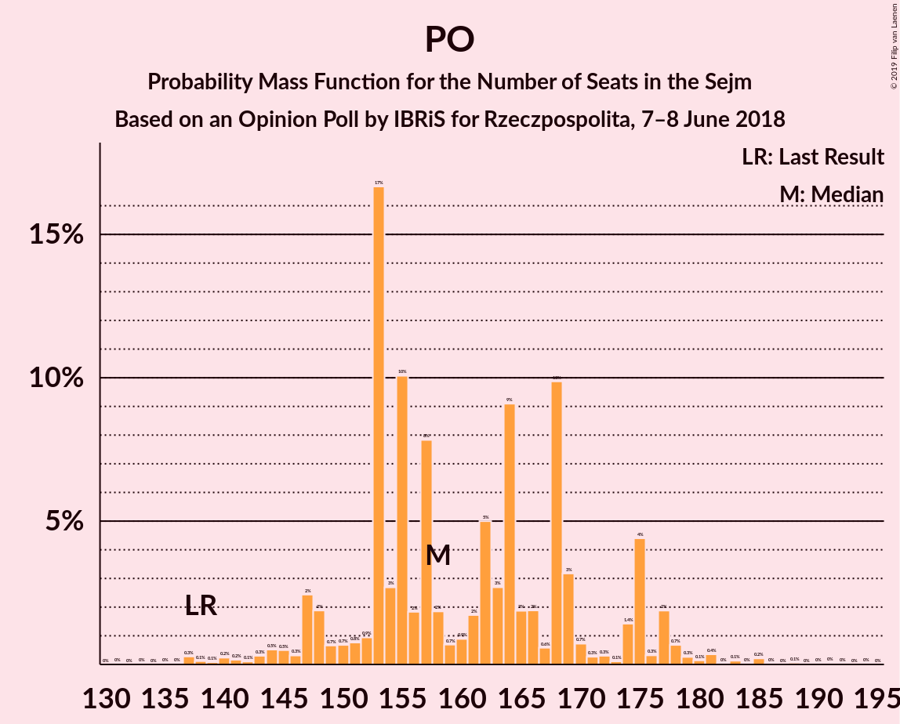

# Opinion Poll by IBRiS for Rzeczpospolita, 7–8 June 2018

<a href="#voting-intentions">Voting Intentions</a> | <a href="#seats">Seats</a> | <a href="#coalitions">Coalitions</a> | <a href="#technical-information">Technical Information</a>

## Voting Intentions

### Confidence Intervals

| Party | Last Result | Poll Result | 80% Confidence Interval | 90% Confidence Interval | 95% Confidence Interval | 99% Confidence Interval |
|:-----:|:-----------:|:-----------:|:-----------------------:|:-----------------------:|:-----------------------:|:-----------------------:|
| Prawo i Sprawiedliwość | 37.6% | 32.7% | 30.9–34.6% |30.4–35.1% |29.9–35.6% |29.1–36.5% |
| Platforma Obywatelska | 24.1% | 26.4% | 24.8–28.2% |24.3–28.7% |23.9–29.2% |23.1–30.0% |
| Sojusz Lewicy Demokratycznej | 7.6% | 9.6% | 8.5–10.8% |8.2–11.2% |7.9–11.5% |7.5–12.1% |
| Polskie Stronnictwo Ludowe | 5.1% | 6.3% | 5.4–7.3% |5.2–7.6% |5.0–7.9% |4.6–8.4% |
| Kukiz’15 | 8.8% | 6.2% | 5.3–7.2% |5.1–7.5% |4.9–7.8% |4.5–8.3% |
| .Nowoczesna | 7.6% | 4.3% | 3.6–5.2% |3.4–5.5% |3.2–5.7% |2.9–6.2% |
| Lewica Razem | 3.6% | 3.3% | 2.7–4.1% |2.5–4.3% |2.4–4.5% |2.1–5.0% |
| KORWiN | 4.8% | 1.3% | 1.0–1.9% |0.9–2.0% |0.8–2.2% |0.6–2.5% |

*Note:* The poll result column reflects the actual value used in the calculations. Published results may vary slightly, and in addition be rounded to fewer digits.

## Seats

### Confidence Intervals

| Party | Last Result | Median | 80% Confidence Interval | 90% Confidence Interval | 95% Confidence Interval | 99% Confidence Interval |
|:-----:|:-----------:|:------:|:-----------------------:|:-----------------------:|:-----------------------:|:-----------------------:|
| <a href="#prawo-i-sprawiedliwość">Prawo i Sprawiedliwość</a> | 235 | 210 | 198–218 |190–223 |188–225 |183–228 |
| <a href="#platforma-obywatelska">Platforma Obywatelska</a> | 138 | 155 | 153–169 |148–169 |147–174 |141–185 |
| <a href="#sojusz-lewicy-demokratycznej">Sojusz Lewicy Demokratycznej</a> | 0 | 45 | 36–50 |36–53 |36–56 |32–62 |
| <a href="#polskie-stronnictwo-ludowe">Polskie Stronnictwo Ludowe</a> | 16 | 25 | 19–27 |0–28 |0–33 |0–40 |
| <a href="#kukiz’15">Kukiz’15</a> | 42 | 23 | 15–31 |13–36 |9–36 |0–42 |
| <a href="#.nowoczesna">.Nowoczesna</a> | 28 | 0 | 0–11 |0–12 |0–13 |0–14 |
| <a href="#lewica-razem">Lewica Razem</a> | 0 | 0 | 0 |0 |0 |0 |
| <a href="#korwin">KORWiN</a> | 0 | 0 | 0 |0 |0 |0 |

### Prawo i Sprawiedliwość

*For a full overview of the results for this party, see the [Prawo i Sprawiedliwość](party-prawoisprawiedliwość.html) page.*

| Number of Seats | Probability | Accumulated | Special Marks |
|:---------------:|:-----------:|:-----------:|:-------------:|
| 174 | 0.1% | 100% |  |
| 175 | 0% | 99.9% |  |
| 176 | 0% | 99.9% |  |
| 177 | 0% | 99.9% |  |
| 178 | 0.1% | 99.8% |  |
| 179 | 0% | 99.8% |  |
| 180 | 0% | 99.8% |  |
| 181 | 0% | 99.7% |  |
| 182 | 0.1% | 99.7% |  |
| 183 | 0.1% | 99.6% |  |
| 184 | 0% | 99.5% |  |
| 185 | 0% | 99.5% |  |
| 186 | 0.2% | 99.4% |  |
| 187 | 0.2% | 99.2% |  |
| 188 | 3% | 99.1% |  |
| 189 | 0.5% | 96% |  |
| 190 | 0.6% | 95% |  |
| 191 | 0.3% | 94% |  |
| 192 | 0.5% | 94% |  |
| 193 | 0.1% | 94% |  |
| 194 | 0.1% | 94% |  |
| 195 | 0.3% | 93% |  |
| 196 | 0.3% | 93% |  |
| 197 | 0.4% | 93% |  |
| 198 | 3% | 92% |  |
| 199 | 1.1% | 90% |  |
| 200 | 9% | 89% |  |
| 201 | 1.5% | 80% |  |
| 202 | 0.9% | 78% |  |
| 203 | 1.3% | 77% |  |
| 204 | 0.4% | 76% |  |
| 205 | 1.0% | 76% |  |
| 206 | 0.5% | 75% |  |
| 207 | 2% | 74% |  |
| 208 | 0.7% | 72% |  |
| 209 | 1.3% | 72% |  |
| 210 | 31% | 70% | Median |
| 211 | 0.8% | 39% |  |
| 212 | 3% | 39% |  |
| 213 | 18% | 36% |  |
| 214 | 1.0% | 18% |  |
| 215 | 0.4% | 17% |  |
| 216 | 2% | 16% |  |
| 217 | 0.2% | 15% |  |
| 218 | 5% | 14% |  |
| 219 | 0.9% | 9% |  |
| 220 | 1.5% | 8% |  |
| 221 | 1.4% | 7% |  |
| 222 | 0.3% | 6% |  |
| 223 | 0.3% | 5% |  |
| 224 | 2% | 5% |  |
| 225 | 0.2% | 3% |  |
| 226 | 1.1% | 2% |  |
| 227 | 0% | 1.3% |  |
| 228 | 0.9% | 1.3% |  |
| 229 | 0% | 0.3% |  |
| 230 | 0% | 0.3% |  |
| 231 | 0.1% | 0.3% | Majority |
| 232 | 0% | 0.2% |  |
| 233 | 0% | 0.2% |  |
| 234 | 0% | 0.1% |  |
| 235 | 0% | 0.1% | Last Result |
| 236 | 0% | 0.1% |  |
| 237 | 0% | 0.1% |  |
| 238 | 0% | 0.1% |  |
| 239 | 0% | 0.1% |  |
| 240 | 0% | 0.1% |  |
| 241 | 0% | 0% |  |

### Platforma Obywatelska

*For a full overview of the results for this party, see the [Platforma Obywatelska](party-platformaobywatelska.html) page.*

| Number of Seats | Probability | Accumulated | Special Marks |
|:---------------:|:-----------:|:-----------:|:-------------:|
| 133 | 0% | 100% |  |
| 134 | 0% | 99.9% |  |
| 135 | 0% | 99.9% |  |
| 136 | 0% | 99.9% |  |
| 137 | 0% | 99.9% |  |
| 138 | 0.1% | 99.9% | Last Result |
| 139 | 0.1% | 99.8% |  |
| 140 | 0.2% | 99.7% |  |
| 141 | 0.2% | 99.6% |  |
| 142 | 0.1% | 99.4% |  |
| 143 | 0.5% | 99.3% |  |
| 144 | 0.6% | 98.7% |  |
| 145 | 0.3% | 98% |  |
| 146 | 0.3% | 98% |  |
| 147 | 1.3% | 98% |  |
| 148 | 2% | 96% |  |
| 149 | 1.1% | 94% |  |
| 150 | 0.9% | 93% |  |
| 151 | 1.3% | 92% |  |
| 152 | 0.2% | 91% |  |
| 153 | 30% | 91% |  |
| 154 | 2% | 61% |  |
| 155 | 18% | 59% | Median |
| 156 | 2% | 40% |  |
| 157 | 0.4% | 38% |  |
| 158 | 3% | 38% |  |
| 159 | 0.6% | 35% |  |
| 160 | 1.5% | 34% |  |
| 161 | 2% | 33% |  |
| 162 | 0.5% | 31% |  |
| 163 | 0.7% | 30% |  |
| 164 | 0.3% | 30% |  |
| 165 | 2% | 29% |  |
| 166 | 3% | 28% |  |
| 167 | 0.5% | 25% |  |
| 168 | 14% | 24% |  |
| 169 | 6% | 10% |  |
| 170 | 0.6% | 5% |  |
| 171 | 0.2% | 4% |  |
| 172 | 0.5% | 4% |  |
| 173 | 0.2% | 3% |  |
| 174 | 0.8% | 3% |  |
| 175 | 0.1% | 2% |  |
| 176 | 0.3% | 2% |  |
| 177 | 0.6% | 2% |  |
| 178 | 0% | 1.3% |  |
| 179 | 0.1% | 1.3% |  |
| 180 | 0.2% | 1.3% |  |
| 181 | 0.3% | 1.1% |  |
| 182 | 0.1% | 0.8% |  |
| 183 | 0.1% | 0.7% |  |
| 184 | 0% | 0.7% |  |
| 185 | 0.4% | 0.6% |  |
| 186 | 0% | 0.2% |  |
| 187 | 0% | 0.2% |  |
| 188 | 0.1% | 0.2% |  |
| 189 | 0% | 0.1% |  |
| 190 | 0% | 0.1% |  |
| 191 | 0% | 0.1% |  |
| 192 | 0% | 0.1% |  |
| 193 | 0% | 0.1% |  |
| 194 | 0.1% | 0.1% |  |
| 195 | 0% | 0% |  |

### Sojusz Lewicy Demokratycznej

*For a full overview of the results for this party, see the [Sojusz Lewicy Demokratycznej](party-sojuszlewicydemokratycznej.html) page.*

| Number of Seats | Probability | Accumulated | Special Marks |
|:---------------:|:-----------:|:-----------:|:-------------:|
| 0 | 0% | 100% | Last Result |
| 1 | 0% | 100% |  |
| 2 | 0% | 100% |  |
| 3 | 0% | 100% |  |
| 4 | 0% | 100% |  |
| 5 | 0% | 100% |  |
| 6 | 0% | 100% |  |
| 7 | 0% | 100% |  |
| 8 | 0% | 100% |  |
| 9 | 0% | 100% |  |
| 10 | 0% | 100% |  |
| 11 | 0% | 100% |  |
| 12 | 0% | 100% |  |
| 13 | 0% | 100% |  |
| 14 | 0% | 100% |  |
| 15 | 0% | 100% |  |
| 16 | 0% | 100% |  |
| 17 | 0% | 100% |  |
| 18 | 0% | 100% |  |
| 19 | 0% | 100% |  |
| 20 | 0% | 100% |  |
| 21 | 0% | 100% |  |
| 22 | 0% | 100% |  |
| 23 | 0% | 100% |  |
| 24 | 0% | 100% |  |
| 25 | 0% | 100% |  |
| 26 | 0% | 100% |  |
| 27 | 0% | 100% |  |
| 28 | 0% | 100% |  |
| 29 | 0.1% | 100% |  |
| 30 | 0.1% | 99.8% |  |
| 31 | 0% | 99.8% |  |
| 32 | 0.8% | 99.7% |  |
| 33 | 0.1% | 98.9% |  |
| 34 | 0.6% | 98.9% |  |
| 35 | 0.5% | 98% |  |
| 36 | 12% | 98% |  |
| 37 | 2% | 86% |  |
| 38 | 0.2% | 84% |  |
| 39 | 3% | 83% |  |
| 40 | 2% | 81% |  |
| 41 | 3% | 79% |  |
| 42 | 1.2% | 76% |  |
| 43 | 3% | 75% |  |
| 44 | 2% | 72% |  |
| 45 | 48% | 70% | Median |
| 46 | 4% | 22% |  |
| 47 | 3% | 18% |  |
| 48 | 2% | 15% |  |
| 49 | 0.4% | 13% |  |
| 50 | 3% | 12% |  |
| 51 | 0.6% | 9% |  |
| 52 | 0.4% | 9% |  |
| 53 | 4% | 8% |  |
| 54 | 0.2% | 5% |  |
| 55 | 0.2% | 5% |  |
| 56 | 2% | 4% |  |
| 57 | 0.1% | 2% |  |
| 58 | 0.1% | 2% |  |
| 59 | 0.4% | 2% |  |
| 60 | 0.4% | 1.5% |  |
| 61 | 0.1% | 1.1% |  |
| 62 | 0.5% | 1.0% |  |
| 63 | 0% | 0.5% |  |
| 64 | 0.1% | 0.5% |  |
| 65 | 0% | 0.3% |  |
| 66 | 0% | 0.3% |  |
| 67 | 0.1% | 0.3% |  |
| 68 | 0.1% | 0.2% |  |
| 69 | 0% | 0.1% |  |
| 70 | 0% | 0% |  |

### Polskie Stronnictwo Ludowe

*For a full overview of the results for this party, see the [Polskie Stronnictwo Ludowe](party-polskiestronnictwoludowe.html) page.*

| Number of Seats | Probability | Accumulated | Special Marks |
|:---------------:|:-----------:|:-----------:|:-------------:|
| 0 | 6% | 100% |  |
| 1 | 0% | 94% |  |
| 2 | 0% | 94% |  |
| 3 | 0% | 94% |  |
| 4 | 0% | 94% |  |
| 5 | 0% | 94% |  |
| 6 | 0% | 94% |  |
| 7 | 0% | 94% |  |
| 8 | 0% | 94% |  |
| 9 | 0% | 94% |  |
| 10 | 0% | 94% |  |
| 11 | 0% | 94% |  |
| 12 | 0% | 94% |  |
| 13 | 0% | 94% |  |
| 14 | 0% | 94% |  |
| 15 | 0.1% | 94% |  |
| 16 | 1.2% | 94% | Last Result |
| 17 | 2% | 93% |  |
| 18 | 0.6% | 91% |  |
| 19 | 1.1% | 91% |  |
| 20 | 0.9% | 90% |  |
| 21 | 0.9% | 89% |  |
| 22 | 9% | 88% |  |
| 23 | 8% | 79% |  |
| 24 | 21% | 71% |  |
| 25 | 0.4% | 50% | Median |
| 26 | 3% | 50% |  |
| 27 | 40% | 47% |  |
| 28 | 2% | 7% |  |
| 29 | 0.9% | 5% |  |
| 30 | 0.9% | 4% |  |
| 31 | 0.1% | 3% |  |
| 32 | 0.3% | 3% |  |
| 33 | 0.5% | 3% |  |
| 34 | 0.6% | 2% |  |
| 35 | 0.1% | 2% |  |
| 36 | 0.1% | 1.5% |  |
| 37 | 0.2% | 1.3% |  |
| 38 | 0.5% | 1.2% |  |
| 39 | 0% | 0.6% |  |
| 40 | 0.1% | 0.6% |  |
| 41 | 0% | 0.4% |  |
| 42 | 0.3% | 0.4% |  |
| 43 | 0.1% | 0.1% |  |
| 44 | 0% | 0% |  |

### Kukiz’15

*For a full overview of the results for this party, see the [Kukiz’15](party-kukiz’15.html) page.*

| Number of Seats | Probability | Accumulated | Special Marks |
|:---------------:|:-----------:|:-----------:|:-------------:|
| 0 | 2% | 100% |  |
| 1 | 0% | 98% |  |
| 2 | 0% | 98% |  |
| 3 | 0% | 98% |  |
| 4 | 0% | 98% |  |
| 5 | 0% | 98% |  |
| 6 | 0% | 98% |  |
| 7 | 0% | 98% |  |
| 8 | 0.2% | 98% |  |
| 9 | 0.1% | 98% |  |
| 10 | 1.0% | 97% |  |
| 11 | 0.2% | 96% |  |
| 12 | 0.4% | 96% |  |
| 13 | 2% | 96% |  |
| 14 | 2% | 94% |  |
| 15 | 6% | 92% |  |
| 16 | 0.8% | 86% |  |
| 17 | 9% | 85% |  |
| 18 | 2% | 76% |  |
| 19 | 3% | 75% |  |
| 20 | 0.6% | 72% |  |
| 21 | 2% | 71% |  |
| 22 | 2% | 69% |  |
| 23 | 19% | 68% | Median |
| 24 | 2% | 49% |  |
| 25 | 29% | 47% |  |
| 26 | 0.4% | 18% |  |
| 27 | 0.7% | 18% |  |
| 28 | 4% | 17% |  |
| 29 | 2% | 13% |  |
| 30 | 0.5% | 11% |  |
| 31 | 1.0% | 10% |  |
| 32 | 0.4% | 9% |  |
| 33 | 0.3% | 9% |  |
| 34 | 0.2% | 9% |  |
| 35 | 0.5% | 8% |  |
| 36 | 6% | 8% |  |
| 37 | 0.5% | 2% |  |
| 38 | 0.1% | 2% |  |
| 39 | 0.1% | 2% |  |
| 40 | 0.7% | 2% |  |
| 41 | 0.1% | 0.9% |  |
| 42 | 0.7% | 0.8% | Last Result |
| 43 | 0% | 0% |  |

### .Nowoczesna

*For a full overview of the results for this party, see the [.Nowoczesna](party-nowoczesna.html) page.*

| Number of Seats | Probability | Accumulated | Special Marks |
|:---------------:|:-----------:|:-----------:|:-------------:|
| 0 | 86% | 100% | Median |
| 1 | 0% | 14% |  |
| 2 | 0% | 14% |  |
| 3 | 0% | 14% |  |
| 4 | 0% | 14% |  |
| 5 | 0% | 14% |  |
| 6 | 0% | 14% |  |
| 7 | 0% | 14% |  |
| 8 | 0% | 14% |  |
| 9 | 0% | 14% |  |
| 10 | 0.4% | 14% |  |
| 11 | 8% | 14% |  |
| 12 | 3% | 6% |  |
| 13 | 2% | 3% |  |
| 14 | 0.4% | 0.7% |  |
| 15 | 0% | 0.3% |  |
| 16 | 0% | 0.3% |  |
| 17 | 0.1% | 0.2% |  |
| 18 | 0% | 0.2% |  |
| 19 | 0% | 0.1% |  |
| 20 | 0.1% | 0.1% |  |
| 21 | 0% | 0% |  |
| 22 | 0% | 0% |  |
| 23 | 0% | 0% |  |
| 24 | 0% | 0% |  |
| 25 | 0% | 0% |  |
| 26 | 0% | 0% |  |
| 27 | 0% | 0% |  |
| 28 | 0% | 0% | Last Result |

### Lewica Razem

*For a full overview of the results for this party, see the [Lewica Razem](party-lewicarazem.html) page.*

| Number of Seats | Probability | Accumulated | Special Marks |
|:---------------:|:-----------:|:-----------:|:-------------:|
| 0 | 99.6% | 100% | Last Result, Median |
| 1 | 0% | 0.4% |  |
| 2 | 0% | 0.4% |  |
| 3 | 0% | 0.4% |  |
| 4 | 0% | 0.4% |  |
| 5 | 0.1% | 0.4% |  |
| 6 | 0% | 0.3% |  |
| 7 | 0% | 0.3% |  |
| 8 | 0.1% | 0.3% |  |
| 9 | 0% | 0.2% |  |
| 10 | 0% | 0.2% |  |
| 11 | 0% | 0.2% |  |
| 12 | 0.1% | 0.2% |  |
| 13 | 0% | 0% |  |

### KORWiN

*For a full overview of the results for this party, see the [KORWiN](party-korwin.html) page.*

| Number of Seats | Probability | Accumulated | Special Marks |
|:---------------:|:-----------:|:-----------:|:-------------:|
| 0 | 100% | 100% | Last Result, Median |

## Coalitions

### Confidence Intervals

| Coalition | Last Result | Median | Majority? | 80% Confidence Interval | 90% Confidence Interval | 95% Confidence Interval | 99% Confidence Interval |
|:---------:|:-----------:|:------:|:---------:|:-----------------------:|:-----------------------:|:-----------------------:|:-----------------------:|
| Platforma Obywatelska – Sojusz Lewicy Demokratycznej – Polskie Stronnictwo Ludowe – .Nowoczesna – Lewica Razem | 182 | 225 | 27% | 220–243 | 215–243 | 213–247 | 207–257 |
| Platforma Obywatelska – Sojusz Lewicy Demokratycznej – Polskie Stronnictwo Ludowe – .Nowoczesna | 182 | 225 | 27% | 220–243 | 215–243 | 212–247 | 207–257 |
| Prawo i Sprawiedliwość | 235 | 210 | 0.3% | 198–218 | 190–223 | 188–225 | 183–228 |
| Platforma Obywatelska – Sojusz Lewicy Demokratycznej – .Nowoczesna | 166 | 200 | 0.8% | 198–217 | 195–221 | 193–222 | 190–232 |
| Platforma Obywatelska – Polskie Stronnictwo Ludowe – .Nowoczesna | 182 | 180 | 0% | 175–203 | 170–207 | 167–207 | 165–213 |
| Platforma Obywatelska – .Nowoczesna | 166 | 155 | 0% | 153–174 | 151–180 | 148–180 | 142–188 |
| Platforma Obywatelska | 138 | 155 | 0% | 153–169 | 148–169 | 147–174 | 141–185 |

### Platforma Obywatelska – Sojusz Lewicy Demokratycznej – Polskie Stronnictwo Ludowe – .Nowoczesna – Lewica Razem

| Number of Seats | Probability | Accumulated | Special Marks |
|:---------------:|:-----------:|:-----------:|:-------------:|
| 182 | 0% | 100% | Last Result |
| 183 | 0% | 100% |  |
| 184 | 0% | 100% |  |
| 185 | 0% | 100% |  |
| 186 | 0% | 100% |  |
| 187 | 0% | 100% |  |
| 188 | 0% | 100% |  |
| 189 | 0% | 100% |  |
| 190 | 0% | 100% |  |
| 191 | 0% | 100% |  |
| 192 | 0% | 100% |  |
| 193 | 0% | 100% |  |
| 194 | 0% | 100% |  |
| 195 | 0% | 100% |  |
| 196 | 0% | 100% |  |
| 197 | 0% | 100% |  |
| 198 | 0% | 100% |  |
| 199 | 0% | 100% |  |
| 200 | 0% | 100% |  |
| 201 | 0% | 99.9% |  |
| 202 | 0% | 99.9% |  |
| 203 | 0.1% | 99.9% |  |
| 204 | 0% | 99.8% |  |
| 205 | 0.1% | 99.8% |  |
| 206 | 0% | 99.8% |  |
| 207 | 2% | 99.7% |  |
| 208 | 0% | 98% |  |
| 209 | 0% | 98% |  |
| 210 | 0% | 98% |  |
| 211 | 0% | 98% |  |
| 212 | 0.1% | 98% |  |
| 213 | 1.1% | 98% |  |
| 214 | 1.0% | 96% |  |
| 215 | 0.6% | 95% |  |
| 216 | 1.3% | 95% |  |
| 217 | 2% | 94% |  |
| 218 | 0.3% | 92% |  |
| 219 | 0.7% | 91% |  |
| 220 | 3% | 91% |  |
| 221 | 0.5% | 88% |  |
| 222 | 2% | 87% |  |
| 223 | 0.4% | 85% |  |
| 224 | 18% | 85% |  |
| 225 | 29% | 66% | Median |
| 226 | 3% | 37% |  |
| 227 | 5% | 34% |  |
| 228 | 0.8% | 28% |  |
| 229 | 0.1% | 28% |  |
| 230 | 0.2% | 27% |  |
| 231 | 0.3% | 27% | Majority |
| 232 | 0.5% | 27% |  |
| 233 | 0.2% | 26% |  |
| 234 | 0.6% | 26% |  |
| 235 | 2% | 26% |  |
| 236 | 5% | 24% |  |
| 237 | 0.3% | 19% |  |
| 238 | 0.9% | 19% |  |
| 239 | 1.0% | 18% |  |
| 240 | 0.7% | 17% |  |
| 241 | 0.7% | 16% |  |
| 242 | 0% | 15% |  |
| 243 | 11% | 15% |  |
| 244 | 0.1% | 4% |  |
| 245 | 0.5% | 4% |  |
| 246 | 0.6% | 3% |  |
| 247 | 0.2% | 3% |  |
| 248 | 0.2% | 2% |  |
| 249 | 0.2% | 2% |  |
| 250 | 0.3% | 2% |  |
| 251 | 0.4% | 2% |  |
| 252 | 0% | 1.3% |  |
| 253 | 0.2% | 1.3% |  |
| 254 | 0.2% | 1.1% |  |
| 255 | 0.2% | 0.9% |  |
| 256 | 0% | 0.7% |  |
| 257 | 0.3% | 0.7% |  |
| 258 | 0% | 0.4% |  |
| 259 | 0.1% | 0.4% |  |
| 260 | 0% | 0.3% |  |
| 261 | 0.1% | 0.2% |  |
| 262 | 0% | 0.2% |  |
| 263 | 0% | 0.2% |  |
| 264 | 0.1% | 0.1% |  |
| 265 | 0% | 0.1% |  |
| 266 | 0% | 0.1% |  |
| 267 | 0% | 0.1% |  |
| 268 | 0.1% | 0.1% |  |
| 269 | 0% | 0% |  |

### Platforma Obywatelska – Sojusz Lewicy Demokratycznej – Polskie Stronnictwo Ludowe – .Nowoczesna

| Number of Seats | Probability | Accumulated | Special Marks |
|:---------------:|:-----------:|:-----------:|:-------------:|
| 182 | 0% | 100% | Last Result |
| 183 | 0% | 100% |  |
| 184 | 0% | 100% |  |
| 185 | 0% | 100% |  |
| 186 | 0% | 100% |  |
| 187 | 0% | 100% |  |
| 188 | 0% | 100% |  |
| 189 | 0% | 100% |  |
| 190 | 0% | 100% |  |
| 191 | 0% | 100% |  |
| 192 | 0% | 100% |  |
| 193 | 0% | 100% |  |
| 194 | 0% | 100% |  |
| 195 | 0% | 100% |  |
| 196 | 0% | 100% |  |
| 197 | 0% | 100% |  |
| 198 | 0% | 100% |  |
| 199 | 0% | 100% |  |
| 200 | 0% | 100% |  |
| 201 | 0% | 99.9% |  |
| 202 | 0% | 99.9% |  |
| 203 | 0.1% | 99.9% |  |
| 204 | 0% | 99.8% |  |
| 205 | 0.1% | 99.8% |  |
| 206 | 0% | 99.7% |  |
| 207 | 2% | 99.7% |  |
| 208 | 0% | 98% |  |
| 209 | 0% | 98% |  |
| 210 | 0.1% | 98% |  |
| 211 | 0% | 98% |  |
| 212 | 0.1% | 98% |  |
| 213 | 1.1% | 97% |  |
| 214 | 1.0% | 96% |  |
| 215 | 0.6% | 95% |  |
| 216 | 1.3% | 95% |  |
| 217 | 2% | 93% |  |
| 218 | 0.3% | 91% |  |
| 219 | 0.7% | 91% |  |
| 220 | 3% | 90% |  |
| 221 | 0.5% | 88% |  |
| 222 | 2% | 87% |  |
| 223 | 0.5% | 85% |  |
| 224 | 18% | 85% |  |
| 225 | 29% | 66% | Median |
| 226 | 3% | 37% |  |
| 227 | 5% | 34% |  |
| 228 | 0.9% | 28% |  |
| 229 | 0.1% | 27% |  |
| 230 | 0.3% | 27% |  |
| 231 | 0.4% | 27% | Majority |
| 232 | 0.5% | 27% |  |
| 233 | 0.2% | 26% |  |
| 234 | 0.6% | 26% |  |
| 235 | 2% | 25% |  |
| 236 | 4% | 23% |  |
| 237 | 0.3% | 19% |  |
| 238 | 0.9% | 19% |  |
| 239 | 1.0% | 18% |  |
| 240 | 0.7% | 17% |  |
| 241 | 0.7% | 16% |  |
| 242 | 0% | 15% |  |
| 243 | 11% | 15% |  |
| 244 | 0.1% | 4% |  |
| 245 | 0.4% | 4% |  |
| 246 | 0.6% | 3% |  |
| 247 | 0.2% | 3% |  |
| 248 | 0.2% | 2% |  |
| 249 | 0.2% | 2% |  |
| 250 | 0.3% | 2% |  |
| 251 | 0.4% | 2% |  |
| 252 | 0% | 1.3% |  |
| 253 | 0.2% | 1.3% |  |
| 254 | 0.2% | 1.1% |  |
| 255 | 0.2% | 0.9% |  |
| 256 | 0% | 0.7% |  |
| 257 | 0.3% | 0.7% |  |
| 258 | 0% | 0.4% |  |
| 259 | 0.1% | 0.4% |  |
| 260 | 0% | 0.3% |  |
| 261 | 0.1% | 0.2% |  |
| 262 | 0% | 0.2% |  |
| 263 | 0% | 0.2% |  |
| 264 | 0.1% | 0.1% |  |
| 265 | 0% | 0.1% |  |
| 266 | 0% | 0.1% |  |
| 267 | 0% | 0.1% |  |
| 268 | 0.1% | 0.1% |  |
| 269 | 0% | 0% |  |

### Prawo i Sprawiedliwość

| Number of Seats | Probability | Accumulated | Special Marks |
|:---------------:|:-----------:|:-----------:|:-------------:|
| 174 | 0.1% | 100% |  |
| 175 | 0% | 99.9% |  |
| 176 | 0% | 99.9% |  |
| 177 | 0% | 99.9% |  |
| 178 | 0.1% | 99.8% |  |
| 179 | 0% | 99.8% |  |
| 180 | 0% | 99.8% |  |
| 181 | 0% | 99.7% |  |
| 182 | 0.1% | 99.7% |  |
| 183 | 0.1% | 99.6% |  |
| 184 | 0% | 99.5% |  |
| 185 | 0% | 99.5% |  |
| 186 | 0.2% | 99.4% |  |
| 187 | 0.2% | 99.2% |  |
| 188 | 3% | 99.1% |  |
| 189 | 0.5% | 96% |  |
| 190 | 0.6% | 95% |  |
| 191 | 0.3% | 94% |  |
| 192 | 0.5% | 94% |  |
| 193 | 0.1% | 94% |  |
| 194 | 0.1% | 94% |  |
| 195 | 0.3% | 93% |  |
| 196 | 0.3% | 93% |  |
| 197 | 0.4% | 93% |  |
| 198 | 3% | 92% |  |
| 199 | 1.1% | 90% |  |
| 200 | 9% | 89% |  |
| 201 | 1.5% | 80% |  |
| 202 | 0.9% | 78% |  |
| 203 | 1.3% | 77% |  |
| 204 | 0.4% | 76% |  |
| 205 | 1.0% | 76% |  |
| 206 | 0.5% | 75% |  |
| 207 | 2% | 74% |  |
| 208 | 0.7% | 72% |  |
| 209 | 1.3% | 72% |  |
| 210 | 31% | 70% | Median |
| 211 | 0.8% | 39% |  |
| 212 | 3% | 39% |  |
| 213 | 18% | 36% |  |
| 214 | 1.0% | 18% |  |
| 215 | 0.4% | 17% |  |
| 216 | 2% | 16% |  |
| 217 | 0.2% | 15% |  |
| 218 | 5% | 14% |  |
| 219 | 0.9% | 9% |  |
| 220 | 1.5% | 8% |  |
| 221 | 1.4% | 7% |  |
| 222 | 0.3% | 6% |  |
| 223 | 0.3% | 5% |  |
| 224 | 2% | 5% |  |
| 225 | 0.2% | 3% |  |
| 226 | 1.1% | 2% |  |
| 227 | 0% | 1.3% |  |
| 228 | 0.9% | 1.3% |  |
| 229 | 0% | 0.3% |  |
| 230 | 0% | 0.3% |  |
| 231 | 0.1% | 0.3% | Majority |
| 232 | 0% | 0.2% |  |
| 233 | 0% | 0.2% |  |
| 234 | 0% | 0.1% |  |
| 235 | 0% | 0.1% | Last Result |
| 236 | 0% | 0.1% |  |
| 237 | 0% | 0.1% |  |
| 238 | 0% | 0.1% |  |
| 239 | 0% | 0.1% |  |
| 240 | 0% | 0.1% |  |
| 241 | 0% | 0% |  |

### Platforma Obywatelska – Sojusz Lewicy Demokratycznej – .Nowoczesna

| Number of Seats | Probability | Accumulated | Special Marks |
|:---------------:|:-----------:|:-----------:|:-------------:|
| 166 | 0% | 100% | Last Result |
| 167 | 0% | 100% |  |
| 168 | 0% | 100% |  |
| 169 | 0% | 100% |  |
| 170 | 0% | 100% |  |
| 171 | 0% | 100% |  |
| 172 | 0% | 100% |  |
| 173 | 0% | 100% |  |
| 174 | 0% | 100% |  |
| 175 | 0% | 100% |  |
| 176 | 0% | 100% |  |
| 177 | 0% | 100% |  |
| 178 | 0% | 100% |  |
| 179 | 0% | 100% |  |
| 180 | 0% | 100% |  |
| 181 | 0.1% | 99.9% |  |
| 182 | 0% | 99.9% |  |
| 183 | 0% | 99.9% |  |
| 184 | 0% | 99.8% |  |
| 185 | 0.1% | 99.8% |  |
| 186 | 0.1% | 99.8% |  |
| 187 | 0.1% | 99.7% |  |
| 188 | 0.1% | 99.6% |  |
| 189 | 0% | 99.5% |  |
| 190 | 1.0% | 99.5% |  |
| 191 | 0.4% | 98% |  |
| 192 | 0.3% | 98% |  |
| 193 | 0.5% | 98% |  |
| 194 | 2% | 97% |  |
| 195 | 1.2% | 96% |  |
| 196 | 0.3% | 95% |  |
| 197 | 2% | 94% |  |
| 198 | 30% | 93% |  |
| 199 | 0.5% | 62% |  |
| 200 | 20% | 62% | Median |
| 201 | 1.1% | 42% |  |
| 202 | 1.3% | 41% |  |
| 203 | 2% | 40% |  |
| 204 | 6% | 38% |  |
| 205 | 0.2% | 31% |  |
| 206 | 0.6% | 31% |  |
| 207 | 2% | 30% |  |
| 208 | 0.7% | 28% |  |
| 209 | 3% | 27% |  |
| 210 | 0.2% | 24% |  |
| 211 | 0.6% | 24% |  |
| 212 | 0.3% | 23% |  |
| 213 | 0.1% | 23% |  |
| 214 | 3% | 23% |  |
| 215 | 0.4% | 20% |  |
| 216 | 8% | 20% |  |
| 217 | 2% | 12% |  |
| 218 | 0.2% | 10% |  |
| 219 | 0.4% | 10% |  |
| 220 | 3% | 9% |  |
| 221 | 4% | 7% |  |
| 222 | 1.0% | 3% |  |
| 223 | 0.4% | 2% |  |
| 224 | 0.2% | 2% |  |
| 225 | 0.2% | 2% |  |
| 226 | 0.1% | 1.4% |  |
| 227 | 0.1% | 1.2% |  |
| 228 | 0.2% | 1.2% |  |
| 229 | 0.1% | 0.9% |  |
| 230 | 0% | 0.9% |  |
| 231 | 0.1% | 0.8% | Majority |
| 232 | 0.2% | 0.7% |  |
| 233 | 0.1% | 0.4% |  |
| 234 | 0.1% | 0.4% |  |
| 235 | 0.1% | 0.3% |  |
| 236 | 0% | 0.2% |  |
| 237 | 0% | 0.2% |  |
| 238 | 0% | 0.2% |  |
| 239 | 0% | 0.2% |  |
| 240 | 0% | 0.1% |  |
| 241 | 0% | 0.1% |  |
| 242 | 0% | 0.1% |  |
| 243 | 0% | 0.1% |  |
| 244 | 0% | 0.1% |  |
| 245 | 0.1% | 0.1% |  |
| 246 | 0% | 0% |  |

### Platforma Obywatelska – Polskie Stronnictwo Ludowe – .Nowoczesna

| Number of Seats | Probability | Accumulated | Special Marks |
|:---------------:|:-----------:|:-----------:|:-------------:|
| 154 | 0.1% | 100% |  |
| 155 | 0% | 99.9% |  |
| 156 | 0.1% | 99.9% |  |
| 157 | 0.1% | 99.8% |  |
| 158 | 0% | 99.7% |  |
| 159 | 0% | 99.7% |  |
| 160 | 0% | 99.7% |  |
| 161 | 0.1% | 99.7% |  |
| 162 | 0% | 99.6% |  |
| 163 | 0% | 99.6% |  |
| 164 | 0.1% | 99.6% |  |
| 165 | 0% | 99.5% |  |
| 166 | 2% | 99.5% |  |
| 167 | 0.2% | 98% |  |
| 168 | 1.0% | 97% |  |
| 169 | 0.2% | 96% |  |
| 170 | 4% | 96% |  |
| 171 | 1.1% | 92% |  |
| 172 | 0.5% | 91% |  |
| 173 | 0.1% | 90% |  |
| 174 | 0.2% | 90% |  |
| 175 | 1.0% | 90% |  |
| 176 | 0.4% | 89% |  |
| 177 | 0.3% | 89% |  |
| 178 | 2% | 88% |  |
| 179 | 21% | 87% |  |
| 180 | 31% | 66% | Median |
| 181 | 0.1% | 35% |  |
| 182 | 2% | 35% | Last Result |
| 183 | 0.8% | 34% |  |
| 184 | 0.5% | 33% |  |
| 185 | 0.5% | 32% |  |
| 186 | 0.6% | 32% |  |
| 187 | 2% | 31% |  |
| 188 | 0.6% | 29% |  |
| 189 | 0.8% | 28% |  |
| 190 | 8% | 28% |  |
| 191 | 6% | 20% |  |
| 192 | 1.5% | 14% |  |
| 193 | 0.2% | 13% |  |
| 194 | 0.4% | 12% |  |
| 195 | 0.4% | 12% |  |
| 196 | 0.2% | 12% |  |
| 197 | 0% | 11% |  |
| 198 | 0.2% | 11% |  |
| 199 | 0.2% | 11% |  |
| 200 | 0% | 11% |  |
| 201 | 0.3% | 11% |  |
| 202 | 0.3% | 11% |  |
| 203 | 2% | 10% |  |
| 204 | 0.9% | 9% |  |
| 205 | 0.1% | 8% |  |
| 206 | 1.3% | 8% |  |
| 207 | 6% | 7% |  |
| 208 | 0% | 1.1% |  |
| 209 | 0% | 1.1% |  |
| 210 | 0.1% | 1.1% |  |
| 211 | 0% | 1.0% |  |
| 212 | 0.3% | 0.9% |  |
| 213 | 0.3% | 0.7% |  |
| 214 | 0.1% | 0.4% |  |
| 215 | 0.1% | 0.3% |  |
| 216 | 0.1% | 0.2% |  |
| 217 | 0.1% | 0.2% |  |
| 218 | 0.1% | 0.1% |  |
| 219 | 0% | 0% |  |

### Platforma Obywatelska – .Nowoczesna

| Number of Seats | Probability | Accumulated | Special Marks |
|:---------------:|:-----------:|:-----------:|:-------------:|
| 135 | 0% | 100% |  |
| 136 | 0% | 99.9% |  |
| 137 | 0% | 99.9% |  |
| 138 | 0.1% | 99.9% |  |
| 139 | 0.1% | 99.8% |  |
| 140 | 0.1% | 99.8% |  |
| 141 | 0.1% | 99.6% |  |
| 142 | 0.1% | 99.6% |  |
| 143 | 0% | 99.4% |  |
| 144 | 0.4% | 99.4% |  |
| 145 | 0% | 99.0% |  |
| 146 | 0.1% | 99.0% |  |
| 147 | 1.3% | 98.9% |  |
| 148 | 0.5% | 98% |  |
| 149 | 0.8% | 97% |  |
| 150 | 0.9% | 96% |  |
| 151 | 1.3% | 95% |  |
| 152 | 0.2% | 94% |  |
| 153 | 30% | 94% |  |
| 154 | 3% | 64% |  |
| 155 | 18% | 62% | Median |
| 156 | 3% | 43% |  |
| 157 | 0.6% | 41% |  |
| 158 | 0.6% | 40% |  |
| 159 | 0.7% | 40% |  |
| 160 | 1.2% | 39% |  |
| 161 | 3% | 38% |  |
| 162 | 0.5% | 34% |  |
| 163 | 0.6% | 34% |  |
| 164 | 0.3% | 33% |  |
| 165 | 2% | 33% |  |
| 166 | 3% | 31% | Last Result |
| 167 | 0.7% | 28% |  |
| 168 | 13% | 28% |  |
| 169 | 0.2% | 15% |  |
| 170 | 3% | 15% |  |
| 171 | 0.9% | 12% |  |
| 172 | 0.5% | 11% |  |
| 173 | 0.3% | 10% |  |
| 174 | 0.8% | 10% |  |
| 175 | 0.1% | 9% |  |
| 176 | 0% | 9% |  |
| 177 | 0.7% | 9% |  |
| 178 | 0% | 9% |  |
| 179 | 1.3% | 9% |  |
| 180 | 6% | 7% |  |
| 181 | 0.2% | 2% |  |
| 182 | 0% | 1.3% |  |
| 183 | 0.1% | 1.3% |  |
| 184 | 0.1% | 1.2% |  |
| 185 | 0.4% | 1.1% |  |
| 186 | 0.1% | 0.7% |  |
| 187 | 0.1% | 0.7% |  |
| 188 | 0.1% | 0.6% |  |
| 189 | 0.3% | 0.5% |  |
| 190 | 0% | 0.2% |  |
| 191 | 0% | 0.2% |  |
| 192 | 0.1% | 0.2% |  |
| 193 | 0% | 0.1% |  |
| 194 | 0.1% | 0.1% |  |
| 195 | 0% | 0% |  |

### Platforma Obywatelska

| Number of Seats | Probability | Accumulated | Special Marks |
|:---------------:|:-----------:|:-----------:|:-------------:|
| 133 | 0% | 100% |  |
| 134 | 0% | 99.9% |  |
| 135 | 0% | 99.9% |  |
| 136 | 0% | 99.9% |  |
| 137 | 0% | 99.9% |  |
| 138 | 0.1% | 99.9% | Last Result |
| 139 | 0.1% | 99.8% |  |
| 140 | 0.2% | 99.7% |  |
| 141 | 0.2% | 99.6% |  |
| 142 | 0.1% | 99.4% |  |
| 143 | 0.5% | 99.3% |  |
| 144 | 0.6% | 98.7% |  |
| 145 | 0.3% | 98% |  |
| 146 | 0.3% | 98% |  |
| 147 | 1.3% | 98% |  |
| 148 | 2% | 96% |  |
| 149 | 1.1% | 94% |  |
| 150 | 0.9% | 93% |  |
| 151 | 1.3% | 92% |  |
| 152 | 0.2% | 91% |  |
| 153 | 30% | 91% |  |
| 154 | 2% | 61% |  |
| 155 | 18% | 59% | Median |
| 156 | 2% | 40% |  |
| 157 | 0.4% | 38% |  |
| 158 | 3% | 38% |  |
| 159 | 0.6% | 35% |  |
| 160 | 1.5% | 34% |  |
| 161 | 2% | 33% |  |
| 162 | 0.5% | 31% |  |
| 163 | 0.7% | 30% |  |
| 164 | 0.3% | 30% |  |
| 165 | 2% | 29% |  |
| 166 | 3% | 28% |  |
| 167 | 0.5% | 25% |  |
| 168 | 14% | 24% |  |
| 169 | 6% | 10% |  |
| 170 | 0.6% | 5% |  |
| 171 | 0.2% | 4% |  |
| 172 | 0.5% | 4% |  |
| 173 | 0.2% | 3% |  |
| 174 | 0.8% | 3% |  |
| 175 | 0.1% | 2% |  |
| 176 | 0.3% | 2% |  |
| 177 | 0.6% | 2% |  |
| 178 | 0% | 1.3% |  |
| 179 | 0.1% | 1.3% |  |
| 180 | 0.2% | 1.3% |  |
| 181 | 0.3% | 1.1% |  |
| 182 | 0.1% | 0.8% |  |
| 183 | 0.1% | 0.7% |  |
| 184 | 0% | 0.7% |  |
| 185 | 0.4% | 0.6% |  |
| 186 | 0% | 0.2% |  |
| 187 | 0% | 0.2% |  |
| 188 | 0.1% | 0.2% |  |
| 189 | 0% | 0.1% |  |
| 190 | 0% | 0.1% |  |
| 191 | 0% | 0.1% |  |
| 192 | 0% | 0.1% |  |
| 193 | 0% | 0.1% |  |
| 194 | 0.1% | 0.1% |  |
| 195 | 0% | 0% |  |

## Technical Information

### Opinion Poll

+ **Polling firm:** IBRiS
+ **Commissioner(s):** Rzeczpospolita
+ **Fieldwork period:** 7–8 June 2018

### Calculations

+ **Sample size:** 1067
+ **Simulations done:** 65,536
+ **Error estimate:** 2.26%

