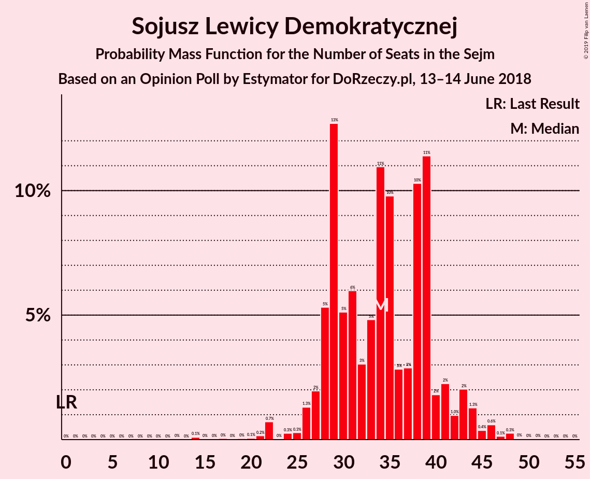
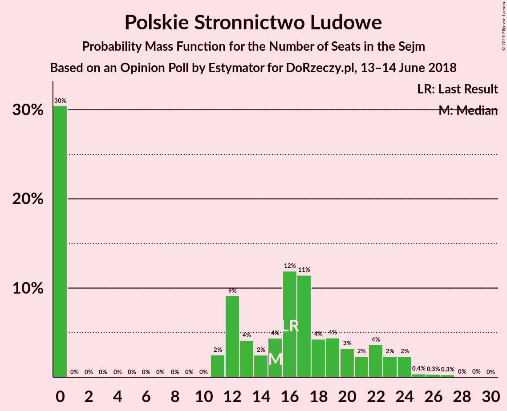
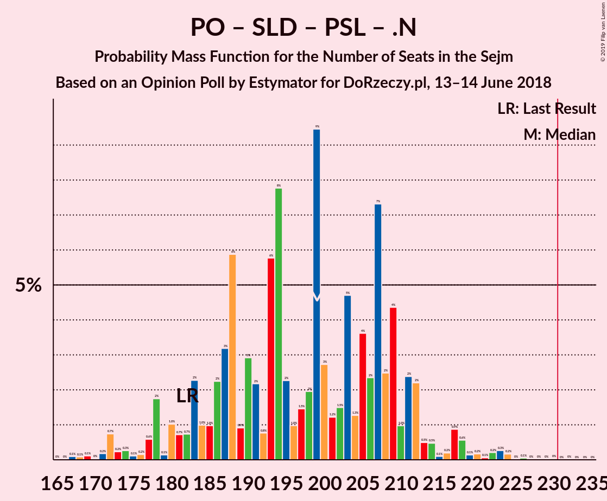
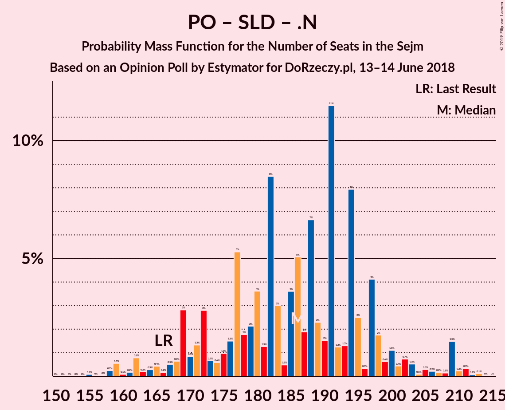
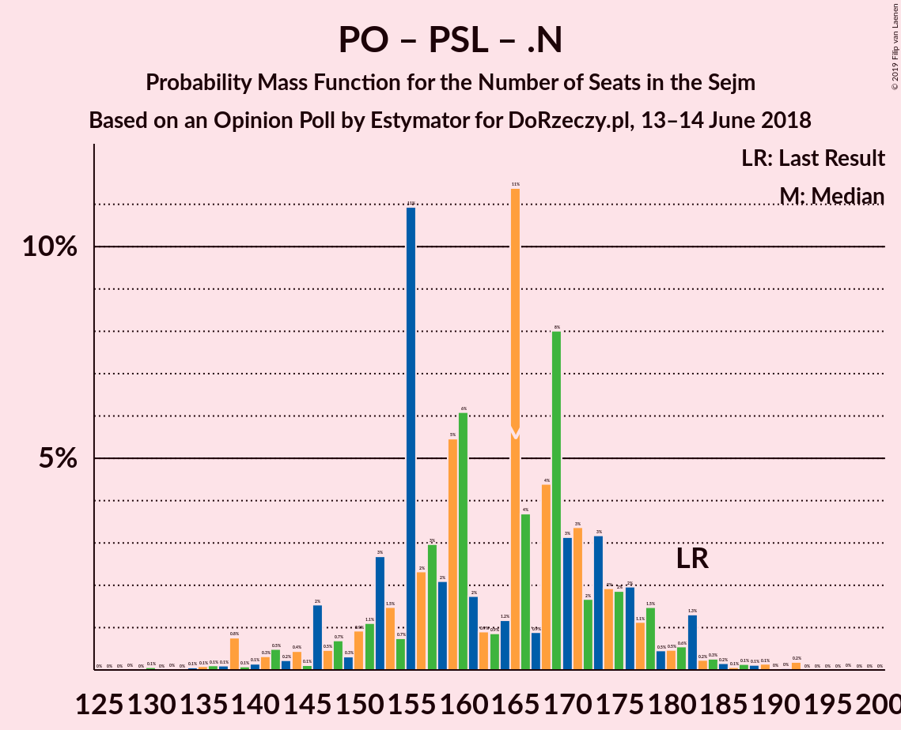

# Opinion Poll by Estymator for DoRzeczy.pl, 13–14 June 2018

<a href="#voting-intentions">Voting Intentions</a> | <a href="#seats">Seats</a> | <a href="#coalitions">Coalitions</a> | <a href="#technical-information">Technical Information</a>

## Voting Intentions

### Confidence Intervals

| Party | Last Result | Poll Result | 80% Confidence Interval | 90% Confidence Interval | 95% Confidence Interval | 99% Confidence Interval |
|:-----:|:-----------:|:-----------:|:-----------------------:|:-----------------------:|:-----------------------:|:-----------------------:|
| Prawo i Sprawiedliwość | 37.6% | 40.7% | 38.8–42.7% |38.2–43.3% |37.8–43.8% |36.8–44.7% |
| Platforma Obywatelska | 24.1% | 27.9% | 26.2–29.8% |25.7–30.3% |25.2–30.8% |24.4–31.7% |
| Sojusz Lewicy Demokratycznej | 7.6% | 8.6% | 7.6–9.8% |7.3–10.2% |7.0–10.5% |6.6–11.1% |
| Kukiz’15 | 8.8% | 8.3% | 7.3–9.5% |7.0–9.9% |6.8–10.2% |6.3–10.8% |
| Polskie Stronnictwo Ludowe | 5.1% | 5.4% | 4.6–6.4% |4.3–6.7% |4.2–7.0% |3.8–7.5% |
| .Nowoczesna | 7.6% | 4.2% | 3.5–5.1% |3.3–5.4% |3.1–5.6% |2.8–6.1% |
| Lewica Razem | 3.6% | 2.9% | 2.4–3.7% |2.2–4.0% |2.1–4.2% |1.8–4.6% |
| KORWiN | 4.8% | 1.9% | 1.4–2.5% |1.3–2.7% |1.2–2.9% |1.0–3.2% |

*Note:* The poll result column reflects the actual value used in the calculations. Published results may vary slightly, and in addition be rounded to fewer digits.

## Seats

### Confidence Intervals

| Party | Last Result | Median | 80% Confidence Interval | 90% Confidence Interval | 95% Confidence Interval | 99% Confidence Interval |
|:-----:|:-----------:|:------:|:-----------------------:|:-----------------------:|:-----------------------:|:-----------------------:|
| <a href="#prawo-i-sprawiedliwość">Prawo i Sprawiedliwość</a> | 235 | 219 | 214–248 |214–248 |206–248 |205–248 |
| <a href="#platforma-obywatelska">Platforma Obywatelska</a> | 138 | 151 | 138–161 |138–161 |130–161 |120–173 |
| <a href="#sojusz-lewicy-demokratycznej">Sojusz Lewicy Demokratycznej</a> | 0 | 30 | 29–43 |29–54 |29–54 |29–54 |
| <a href="#kukiz’15">Kukiz’15</a> | 42 | 35 | 18–42 |18–42 |18–42 |18–48 |
| <a href="#polskie-stronnictwo-ludowe">Polskie Stronnictwo Ludowe</a> | 16 | 19 | 0–25 |0–25 |0–25 |0–26 |
| <a href="#.nowoczesna">.Nowoczesna</a> | 28 | 0 | 0–8 |0–10 |0–10 |0–10 |
| <a href="#lewica-razem">Lewica Razem</a> | 0 | 0 | 0 |0 |0 |0 |
| <a href="#korwin">KORWiN</a> | 0 | 0 | 0 |0 |0 |0 |

### Prawo i Sprawiedliwość

*For a full overview of the results for this party, see the [Prawo i Sprawiedliwość](party-prawoisprawiedliwość.html) page.*

| Number of Seats | Probability | Accumulated | Special Marks |
|:---------------:|:-----------:|:-----------:|:-------------:|
| 204 | 0.1% | 100% |  |
| 205 | 0.8% | 99.9% |  |
| 206 | 2% | 99.1% |  |
| 207 | 0% | 97% |  |
| 208 | 0% | 97% |  |
| 209 | 0% | 97% |  |
| 210 | 0% | 97% |  |
| 211 | 0% | 97% |  |
| 212 | 0% | 97% |  |
| 213 | 0% | 97% |  |
| 214 | 36% | 97% |  |
| 215 | 0% | 61% |  |
| 216 | 0% | 61% |  |
| 217 | 0% | 61% |  |
| 218 | 0% | 61% |  |
| 219 | 13% | 61% | Median |
| 220 | 0.3% | 48% |  |
| 221 | 0.5% | 48% |  |
| 222 | 0.1% | 47% |  |
| 223 | 0% | 47% |  |
| 224 | 0% | 47% |  |
| 225 | 0% | 47% |  |
| 226 | 6% | 47% |  |
| 227 | 0% | 41% |  |
| 228 | 0% | 41% |  |
| 229 | 0% | 41% |  |
| 230 | 0% | 41% |  |
| 231 | 0% | 41% | Majority |
| 232 | 4% | 41% |  |
| 233 | 0.4% | 37% |  |
| 234 | 0% | 36% |  |
| 235 | 0% | 36% | Last Result |
| 236 | 0% | 36% |  |
| 237 | 0% | 36% |  |
| 238 | 0% | 36% |  |
| 239 | 0% | 36% |  |
| 240 | 0% | 36% |  |
| 241 | 0% | 36% |  |
| 242 | 0% | 36% |  |
| 243 | 0% | 36% |  |
| 244 | 0% | 36% |  |
| 245 | 0% | 36% |  |
| 246 | 0% | 36% |  |
| 247 | 0% | 36% |  |
| 248 | 36% | 36% |  |
| 249 | 0% | 0.4% |  |
| 250 | 0% | 0.4% |  |
| 251 | 0% | 0.4% |  |
| 252 | 0% | 0.4% |  |
| 253 | 0% | 0.4% |  |
| 254 | 0% | 0.4% |  |
| 255 | 0% | 0.4% |  |
| 256 | 0% | 0.4% |  |
| 257 | 0% | 0.4% |  |
| 258 | 0% | 0.4% |  |
| 259 | 0% | 0.4% |  |
| 260 | 0% | 0.4% |  |
| 261 | 0% | 0.4% |  |
| 262 | 0% | 0.4% |  |
| 263 | 0.4% | 0.4% |  |
| 264 | 0% | 0% |  |

### Platforma Obywatelska

*For a full overview of the results for this party, see the [Platforma Obywatelska](party-platformaobywatelska.html) page.*

| Number of Seats | Probability | Accumulated | Special Marks |
|:---------------:|:-----------:|:-----------:|:-------------:|
| 119 | 0.1% | 100% |  |
| 120 | 0.4% | 99.9% |  |
| 121 | 0% | 99.4% |  |
| 122 | 0% | 99.4% |  |
| 123 | 0% | 99.4% |  |
| 124 | 0% | 99.4% |  |
| 125 | 0% | 99.4% |  |
| 126 | 0% | 99.4% |  |
| 127 | 0% | 99.4% |  |
| 128 | 0% | 99.4% |  |
| 129 | 0% | 99.4% |  |
| 130 | 4% | 99.4% |  |
| 131 | 0% | 95% |  |
| 132 | 0% | 95% |  |
| 133 | 0% | 95% |  |
| 134 | 0% | 95% |  |
| 135 | 0% | 95% |  |
| 136 | 0% | 95% |  |
| 137 | 0% | 95% |  |
| 138 | 36% | 95% | Last Result |
| 139 | 0.5% | 59% |  |
| 140 | 0% | 59% |  |
| 141 | 0% | 59% |  |
| 142 | 0.1% | 59% |  |
| 143 | 0% | 59% |  |
| 144 | 0% | 59% |  |
| 145 | 6% | 59% |  |
| 146 | 0.8% | 53% |  |
| 147 | 0% | 52% |  |
| 148 | 0% | 52% |  |
| 149 | 0% | 52% |  |
| 150 | 0% | 52% |  |
| 151 | 13% | 52% | Median |
| 152 | 0% | 39% |  |
| 153 | 0% | 39% |  |
| 154 | 0.3% | 39% |  |
| 155 | 0% | 38% |  |
| 156 | 0% | 38% |  |
| 157 | 0% | 38% |  |
| 158 | 0% | 38% |  |
| 159 | 0.1% | 38% |  |
| 160 | 0% | 38% |  |
| 161 | 36% | 38% |  |
| 162 | 0% | 2% |  |
| 163 | 0% | 2% |  |
| 164 | 0% | 2% |  |
| 165 | 0% | 2% |  |
| 166 | 0% | 2% |  |
| 167 | 0% | 2% |  |
| 168 | 0% | 2% |  |
| 169 | 0% | 2% |  |
| 170 | 0.4% | 2% |  |
| 171 | 0% | 2% |  |
| 172 | 0% | 2% |  |
| 173 | 2% | 2% |  |
| 174 | 0% | 0% |  |

### Sojusz Lewicy Demokratycznej

*For a full overview of the results for this party, see the [Sojusz Lewicy Demokratycznej](party-sojuszlewicydemokratycznej.html) page.*

| Number of Seats | Probability | Accumulated | Special Marks |
|:---------------:|:-----------:|:-----------:|:-------------:|
| 0 | 0% | 100% | Last Result |
| 1 | 0% | 100% |  |
| 2 | 0% | 100% |  |
| 3 | 0% | 100% |  |
| 4 | 0% | 100% |  |
| 5 | 0% | 100% |  |
| 6 | 0% | 100% |  |
| 7 | 0% | 100% |  |
| 8 | 0% | 100% |  |
| 9 | 0% | 100% |  |
| 10 | 0% | 100% |  |
| 11 | 0% | 100% |  |
| 12 | 0% | 100% |  |
| 13 | 0% | 100% |  |
| 14 | 0.1% | 100% |  |
| 15 | 0% | 99.9% |  |
| 16 | 0% | 99.9% |  |
| 17 | 0.3% | 99.9% |  |
| 18 | 0% | 99.6% |  |
| 19 | 0% | 99.6% |  |
| 20 | 0% | 99.6% |  |
| 21 | 0% | 99.6% |  |
| 22 | 0% | 99.6% |  |
| 23 | 0% | 99.6% |  |
| 24 | 0% | 99.6% |  |
| 25 | 0% | 99.6% |  |
| 26 | 0% | 99.6% |  |
| 27 | 0% | 99.6% |  |
| 28 | 0% | 99.6% |  |
| 29 | 36% | 99.6% |  |
| 30 | 14% | 63% | Median |
| 31 | 0% | 50% |  |
| 32 | 0% | 50% |  |
| 33 | 0% | 50% |  |
| 34 | 0% | 50% |  |
| 35 | 0.5% | 50% |  |
| 36 | 0.4% | 49% |  |
| 37 | 0% | 49% |  |
| 38 | 0% | 49% |  |
| 39 | 0.1% | 49% |  |
| 40 | 4% | 49% |  |
| 41 | 2% | 44% |  |
| 42 | 0.8% | 43% |  |
| 43 | 36% | 42% |  |
| 44 | 0% | 6% |  |
| 45 | 0% | 6% |  |
| 46 | 0% | 6% |  |
| 47 | 0% | 6% |  |
| 48 | 0% | 6% |  |
| 49 | 0% | 6% |  |
| 50 | 0% | 6% |  |
| 51 | 0% | 6% |  |
| 52 | 0% | 6% |  |
| 53 | 0% | 6% |  |
| 54 | 6% | 6% |  |
| 55 | 0% | 0% |  |

### Kukiz’15

*For a full overview of the results for this party, see the [Kukiz’15](party-kukiz’15.html) page.*

| Number of Seats | Probability | Accumulated | Special Marks |
|:---------------:|:-----------:|:-----------:|:-------------:|
| 18 | 36% | 100% |  |
| 19 | 0% | 64% |  |
| 20 | 0% | 64% |  |
| 21 | 0.4% | 64% |  |
| 22 | 0% | 64% |  |
| 23 | 0% | 64% |  |
| 24 | 0% | 64% |  |
| 25 | 6% | 64% |  |
| 26 | 0% | 58% |  |
| 27 | 0.4% | 58% |  |
| 28 | 0.1% | 57% |  |
| 29 | 0% | 57% |  |
| 30 | 0% | 57% |  |
| 31 | 0% | 57% |  |
| 32 | 4% | 57% |  |
| 33 | 0% | 53% |  |
| 34 | 0% | 53% |  |
| 35 | 13% | 53% | Median |
| 36 | 0% | 40% |  |
| 37 | 0.1% | 40% |  |
| 38 | 0% | 39% |  |
| 39 | 0% | 39% |  |
| 40 | 2% | 39% |  |
| 41 | 0.8% | 38% |  |
| 42 | 36% | 37% | Last Result |
| 43 | 0% | 0.6% |  |
| 44 | 0% | 0.6% |  |
| 45 | 0.1% | 0.6% |  |
| 46 | 0% | 0.6% |  |
| 47 | 0% | 0.6% |  |
| 48 | 0.5% | 0.6% |  |
| 49 | 0% | 0% |  |

### Polskie Stronnictwo Ludowe

*For a full overview of the results for this party, see the [Polskie Stronnictwo Ludowe](party-polskiestronnictwoludowe.html) page.*

| Number of Seats | Probability | Accumulated | Special Marks |
|:---------------:|:-----------:|:-----------:|:-------------:|
| 0 | 44% | 100% |  |
| 1 | 0% | 56% |  |
| 2 | 0% | 56% |  |
| 3 | 0% | 56% |  |
| 4 | 0% | 56% |  |
| 5 | 0% | 56% |  |
| 6 | 0% | 56% |  |
| 7 | 0% | 56% |  |
| 8 | 0% | 56% |  |
| 9 | 0% | 56% |  |
| 10 | 0% | 56% |  |
| 11 | 0% | 56% |  |
| 12 | 0% | 56% |  |
| 13 | 0% | 56% |  |
| 14 | 0% | 56% |  |
| 15 | 0.3% | 56% |  |
| 16 | 0% | 56% | Last Result |
| 17 | 0.7% | 56% |  |
| 18 | 0% | 55% |  |
| 19 | 40% | 55% | Median |
| 20 | 0% | 15% |  |
| 21 | 0.4% | 15% |  |
| 22 | 0% | 14% |  |
| 23 | 0% | 14% |  |
| 24 | 0% | 14% |  |
| 25 | 13% | 14% |  |
| 26 | 0.9% | 1.0% |  |
| 27 | 0.1% | 0.1% |  |
| 28 | 0% | 0% |  |

### .Nowoczesna

*For a full overview of the results for this party, see the [.Nowoczesna](party-nowoczesna.html) page.*

| Number of Seats | Probability | Accumulated | Special Marks |
|:---------------:|:-----------:|:-----------:|:-------------:|
| 0 | 54% | 100% | Median |
| 1 | 0% | 46% |  |
| 2 | 0% | 46% |  |
| 3 | 0% | 46% |  |
| 4 | 0% | 46% |  |
| 5 | 0% | 46% |  |
| 6 | 0% | 46% |  |
| 7 | 4% | 46% |  |
| 8 | 36% | 42% |  |
| 9 | 0% | 6% |  |
| 10 | 6% | 6% |  |
| 11 | 0.1% | 0.5% |  |
| 12 | 0.4% | 0.4% |  |
| 13 | 0% | 0% |  |
| 14 | 0% | 0% |  |
| 15 | 0% | 0% |  |
| 16 | 0% | 0% |  |
| 17 | 0% | 0% |  |
| 18 | 0% | 0% |  |
| 19 | 0% | 0% |  |
| 20 | 0% | 0% |  |
| 21 | 0% | 0% |  |
| 22 | 0% | 0% |  |
| 23 | 0% | 0% |  |
| 24 | 0% | 0% |  |
| 25 | 0% | 0% |  |
| 26 | 0% | 0% |  |
| 27 | 0% | 0% |  |
| 28 | 0% | 0% | Last Result |

### Lewica Razem

*For a full overview of the results for this party, see the [Lewica Razem](party-lewicarazem.html) page.*

| Number of Seats | Probability | Accumulated | Special Marks |
|:---------------:|:-----------:|:-----------:|:-------------:|
| 0 | 100% | 100% | Last Result, Median |

### KORWiN

*For a full overview of the results for this party, see the [KORWiN](party-korwin.html) page.*

| Number of Seats | Probability | Accumulated | Special Marks |
|:---------------:|:-----------:|:-----------:|:-------------:|
| 0 | 100% | 100% | Last Result, Median |

## Coalitions

### Confidence Intervals

| Coalition | Last Result | Median | Majority? | 80% Confidence Interval | 90% Confidence Interval | 95% Confidence Interval | 99% Confidence Interval |
|:---------:|:-----------:|:------:|:---------:|:-----------------------:|:-----------------------:|:-----------------------:|:-----------------------:|
| Prawo i Sprawiedliwość | 235 | 219 | 41% | 214–248 | 214–248 | 206–248 | 205–248 |
| Platforma Obywatelska – Sojusz Lewicy Demokratycznej – Polskie Stronnictwo Ludowe – .Nowoczesna – Lewica Razem | 182 | 204 | 0% | 194–206 | 194–209 | 194–214 | 175–214 |
| Platforma Obywatelska – Sojusz Lewicy Demokratycznej – Polskie Stronnictwo Ludowe – .Nowoczesna | 182 | 204 | 0% | 194–206 | 194–209 | 194–214 | 175–214 |
| Platforma Obywatelska – Sojusz Lewicy Demokratycznej – .Nowoczesna | 166 | 181 | 0% | 175–204 | 175–209 | 175–209 | 158–214 |
| Platforma Obywatelska – Polskie Stronnictwo Ludowe – .Nowoczesna | 182 | 165 | 0% | 156–176 | 155–176 | 155–176 | 141–176 |
| Platforma Obywatelska – .Nowoczesna | 166 | 151 | 0% | 146–161 | 139–161 | 137–166 | 120–173 |
| Platforma Obywatelska | 138 | 151 | 0% | 138–161 | 138–161 | 130–161 | 120–173 |

### Prawo i Sprawiedliwość

| Number of Seats | Probability | Accumulated | Special Marks |
|:---------------:|:-----------:|:-----------:|:-------------:|
| 204 | 0.1% | 100% |  |
| 205 | 0.8% | 99.9% |  |
| 206 | 2% | 99.1% |  |
| 207 | 0% | 97% |  |
| 208 | 0% | 97% |  |
| 209 | 0% | 97% |  |
| 210 | 0% | 97% |  |
| 211 | 0% | 97% |  |
| 212 | 0% | 97% |  |
| 213 | 0% | 97% |  |
| 214 | 36% | 97% |  |
| 215 | 0% | 61% |  |
| 216 | 0% | 61% |  |
| 217 | 0% | 61% |  |
| 218 | 0% | 61% |  |
| 219 | 13% | 61% | Median |
| 220 | 0.3% | 48% |  |
| 221 | 0.5% | 48% |  |
| 222 | 0.1% | 47% |  |
| 223 | 0% | 47% |  |
| 224 | 0% | 47% |  |
| 225 | 0% | 47% |  |
| 226 | 6% | 47% |  |
| 227 | 0% | 41% |  |
| 228 | 0% | 41% |  |
| 229 | 0% | 41% |  |
| 230 | 0% | 41% |  |
| 231 | 0% | 41% | Majority |
| 232 | 4% | 41% |  |
| 233 | 0.4% | 37% |  |
| 234 | 0% | 36% |  |
| 235 | 0% | 36% | Last Result |
| 236 | 0% | 36% |  |
| 237 | 0% | 36% |  |
| 238 | 0% | 36% |  |
| 239 | 0% | 36% |  |
| 240 | 0% | 36% |  |
| 241 | 0% | 36% |  |
| 242 | 0% | 36% |  |
| 243 | 0% | 36% |  |
| 244 | 0% | 36% |  |
| 245 | 0% | 36% |  |
| 246 | 0% | 36% |  |
| 247 | 0% | 36% |  |
| 248 | 36% | 36% |  |
| 249 | 0% | 0.4% |  |
| 250 | 0% | 0.4% |  |
| 251 | 0% | 0.4% |  |
| 252 | 0% | 0.4% |  |
| 253 | 0% | 0.4% |  |
| 254 | 0% | 0.4% |  |
| 255 | 0% | 0.4% |  |
| 256 | 0% | 0.4% |  |
| 257 | 0% | 0.4% |  |
| 258 | 0% | 0.4% |  |
| 259 | 0% | 0.4% |  |
| 260 | 0% | 0.4% |  |
| 261 | 0% | 0.4% |  |
| 262 | 0% | 0.4% |  |
| 263 | 0.4% | 0.4% |  |
| 264 | 0% | 0% |  |

### Platforma Obywatelska – Sojusz Lewicy Demokratycznej – Polskie Stronnictwo Ludowe – .Nowoczesna – Lewica Razem

| Number of Seats | Probability | Accumulated | Special Marks |
|:---------------:|:-----------:|:-----------:|:-------------:|
| 170 | 0.4% | 100% |  |
| 171 | 0% | 99.6% |  |
| 172 | 0% | 99.6% |  |
| 173 | 0% | 99.6% |  |
| 174 | 0% | 99.6% |  |
| 175 | 0.1% | 99.6% |  |
| 176 | 0% | 99.4% |  |
| 177 | 0% | 99.4% |  |
| 178 | 0% | 99.4% |  |
| 179 | 0% | 99.4% |  |
| 180 | 0% | 99.4% |  |
| 181 | 0% | 99.4% |  |
| 182 | 0% | 99.4% | Last Result |
| 183 | 0% | 99.4% |  |
| 184 | 0% | 99.4% |  |
| 185 | 0% | 99.4% |  |
| 186 | 0% | 99.4% |  |
| 187 | 0% | 99.4% |  |
| 188 | 0% | 99.4% |  |
| 189 | 0% | 99.4% |  |
| 190 | 0% | 99.4% |  |
| 191 | 0.5% | 99.4% |  |
| 192 | 0% | 98.9% |  |
| 193 | 0.1% | 98.9% |  |
| 194 | 36% | 98.8% |  |
| 195 | 0% | 63% |  |
| 196 | 4% | 63% |  |
| 197 | 0% | 59% |  |
| 198 | 0.3% | 59% |  |
| 199 | 0% | 58% |  |
| 200 | 0% | 58% | Median |
| 201 | 0% | 58% |  |
| 202 | 0% | 58% |  |
| 203 | 0% | 58% |  |
| 204 | 36% | 58% |  |
| 205 | 0% | 22% |  |
| 206 | 14% | 22% |  |
| 207 | 0% | 9% |  |
| 208 | 0% | 9% |  |
| 209 | 6% | 9% |  |
| 210 | 0% | 3% |  |
| 211 | 0% | 3% |  |
| 212 | 0% | 3% |  |
| 213 | 0% | 3% |  |
| 214 | 2% | 3% |  |
| 215 | 0% | 0.1% |  |
| 216 | 0% | 0.1% |  |
| 217 | 0% | 0.1% |  |
| 218 | 0% | 0.1% |  |
| 219 | 0% | 0.1% |  |
| 220 | 0% | 0.1% |  |
| 221 | 0% | 0.1% |  |
| 222 | 0% | 0.1% |  |
| 223 | 0% | 0.1% |  |
| 224 | 0% | 0.1% |  |
| 225 | 0% | 0.1% |  |
| 226 | 0% | 0.1% |  |
| 227 | 0% | 0.1% |  |
| 228 | 0.1% | 0.1% |  |
| 229 | 0% | 0% |  |

### Platforma Obywatelska – Sojusz Lewicy Demokratycznej – Polskie Stronnictwo Ludowe – .Nowoczesna

| Number of Seats | Probability | Accumulated | Special Marks |
|:---------------:|:-----------:|:-----------:|:-------------:|
| 170 | 0.4% | 100% |  |
| 171 | 0% | 99.6% |  |
| 172 | 0% | 99.6% |  |
| 173 | 0% | 99.6% |  |
| 174 | 0% | 99.6% |  |
| 175 | 0.1% | 99.6% |  |
| 176 | 0% | 99.4% |  |
| 177 | 0% | 99.4% |  |
| 178 | 0% | 99.4% |  |
| 179 | 0% | 99.4% |  |
| 180 | 0% | 99.4% |  |
| 181 | 0% | 99.4% |  |
| 182 | 0% | 99.4% | Last Result |
| 183 | 0% | 99.4% |  |
| 184 | 0% | 99.4% |  |
| 185 | 0% | 99.4% |  |
| 186 | 0% | 99.4% |  |
| 187 | 0% | 99.4% |  |
| 188 | 0% | 99.4% |  |
| 189 | 0% | 99.4% |  |
| 190 | 0% | 99.4% |  |
| 191 | 0.5% | 99.4% |  |
| 192 | 0% | 98.9% |  |
| 193 | 0.1% | 98.9% |  |
| 194 | 36% | 98.8% |  |
| 195 | 0% | 63% |  |
| 196 | 4% | 63% |  |
| 197 | 0% | 59% |  |
| 198 | 0.3% | 59% |  |
| 199 | 0% | 58% |  |
| 200 | 0% | 58% | Median |
| 201 | 0% | 58% |  |
| 202 | 0% | 58% |  |
| 203 | 0% | 58% |  |
| 204 | 36% | 58% |  |
| 205 | 0% | 22% |  |
| 206 | 14% | 22% |  |
| 207 | 0% | 9% |  |
| 208 | 0% | 9% |  |
| 209 | 6% | 9% |  |
| 210 | 0% | 3% |  |
| 211 | 0% | 3% |  |
| 212 | 0% | 3% |  |
| 213 | 0% | 3% |  |
| 214 | 2% | 3% |  |
| 215 | 0% | 0.1% |  |
| 216 | 0% | 0.1% |  |
| 217 | 0% | 0.1% |  |
| 218 | 0% | 0.1% |  |
| 219 | 0% | 0.1% |  |
| 220 | 0% | 0.1% |  |
| 221 | 0% | 0.1% |  |
| 222 | 0% | 0.1% |  |
| 223 | 0% | 0.1% |  |
| 224 | 0% | 0.1% |  |
| 225 | 0% | 0.1% |  |
| 226 | 0% | 0.1% |  |
| 227 | 0% | 0.1% |  |
| 228 | 0.1% | 0.1% |  |
| 229 | 0% | 0% |  |

### Platforma Obywatelska – Sojusz Lewicy Demokratycznej – .Nowoczesna

| Number of Seats | Probability | Accumulated | Special Marks |
|:---------------:|:-----------:|:-----------:|:-------------:|
| 149 | 0.4% | 100% |  |
| 150 | 0% | 99.6% |  |
| 151 | 0% | 99.6% |  |
| 152 | 0% | 99.6% |  |
| 153 | 0% | 99.6% |  |
| 154 | 0% | 99.6% |  |
| 155 | 0% | 99.6% |  |
| 156 | 0% | 99.6% |  |
| 157 | 0% | 99.6% |  |
| 158 | 0.1% | 99.6% |  |
| 159 | 0% | 99.4% |  |
| 160 | 0% | 99.4% |  |
| 161 | 0% | 99.4% |  |
| 162 | 0% | 99.4% |  |
| 163 | 0% | 99.4% |  |
| 164 | 0% | 99.4% |  |
| 165 | 0% | 99.4% |  |
| 166 | 0% | 99.4% | Last Result |
| 167 | 0.1% | 99.4% |  |
| 168 | 0% | 99.3% |  |
| 169 | 0% | 99.3% |  |
| 170 | 0% | 99.3% |  |
| 171 | 0% | 99.3% |  |
| 172 | 0% | 99.3% |  |
| 173 | 0% | 99.3% |  |
| 174 | 0.5% | 99.3% |  |
| 175 | 36% | 98.8% |  |
| 176 | 0% | 63% |  |
| 177 | 4% | 63% |  |
| 178 | 0% | 59% |  |
| 179 | 0% | 59% |  |
| 180 | 0% | 59% |  |
| 181 | 13% | 59% | Median |
| 182 | 0% | 45% |  |
| 183 | 0.3% | 45% |  |
| 184 | 0% | 45% |  |
| 185 | 0% | 45% |  |
| 186 | 0% | 45% |  |
| 187 | 0% | 45% |  |
| 188 | 0.8% | 45% |  |
| 189 | 0% | 44% |  |
| 190 | 0% | 44% |  |
| 191 | 0% | 44% |  |
| 192 | 0% | 44% |  |
| 193 | 0% | 44% |  |
| 194 | 0% | 44% |  |
| 195 | 0% | 44% |  |
| 196 | 0% | 44% |  |
| 197 | 0% | 44% |  |
| 198 | 0% | 44% |  |
| 199 | 0% | 44% |  |
| 200 | 0% | 44% |  |
| 201 | 0.1% | 44% |  |
| 202 | 0% | 44% |  |
| 203 | 0% | 44% |  |
| 204 | 36% | 44% |  |
| 205 | 0% | 8% |  |
| 206 | 0.4% | 8% |  |
| 207 | 0% | 8% |  |
| 208 | 0% | 8% |  |
| 209 | 6% | 8% |  |
| 210 | 0% | 2% |  |
| 211 | 0% | 2% |  |
| 212 | 0% | 2% |  |
| 213 | 0% | 2% |  |
| 214 | 2% | 2% |  |
| 215 | 0% | 0% |  |

### Platforma Obywatelska – Polskie Stronnictwo Ludowe – .Nowoczesna

| Number of Seats | Probability | Accumulated | Special Marks |
|:---------------:|:-----------:|:-----------:|:-------------:|
| 136 | 0.1% | 100% |  |
| 137 | 0% | 99.9% |  |
| 138 | 0% | 99.9% |  |
| 139 | 0% | 99.9% |  |
| 140 | 0% | 99.9% |  |
| 141 | 0.4% | 99.9% |  |
| 142 | 0% | 99.4% |  |
| 143 | 0% | 99.4% |  |
| 144 | 0% | 99.4% |  |
| 145 | 0% | 99.4% |  |
| 146 | 0% | 99.4% |  |
| 147 | 0% | 99.4% |  |
| 148 | 0% | 99.4% |  |
| 149 | 0% | 99.4% |  |
| 150 | 0% | 99.4% |  |
| 151 | 0% | 99.4% |  |
| 152 | 0% | 99.4% |  |
| 153 | 0% | 99.4% |  |
| 154 | 0% | 99.4% |  |
| 155 | 6% | 99.4% |  |
| 156 | 5% | 93% |  |
| 157 | 0% | 89% |  |
| 158 | 0% | 89% |  |
| 159 | 0% | 89% |  |
| 160 | 0% | 89% |  |
| 161 | 36% | 89% |  |
| 162 | 0% | 53% |  |
| 163 | 0% | 53% |  |
| 164 | 0% | 53% |  |
| 165 | 36% | 53% |  |
| 166 | 0% | 17% |  |
| 167 | 0% | 17% |  |
| 168 | 0% | 17% |  |
| 169 | 0% | 17% |  |
| 170 | 0.4% | 17% | Median |
| 171 | 0% | 16% |  |
| 172 | 0.8% | 16% |  |
| 173 | 2% | 16% |  |
| 174 | 0% | 14% |  |
| 175 | 0% | 14% |  |
| 176 | 13% | 14% |  |
| 177 | 0% | 0.5% |  |
| 178 | 0% | 0.5% |  |
| 179 | 0.1% | 0.5% |  |
| 180 | 0% | 0.4% |  |
| 181 | 0.3% | 0.4% |  |
| 182 | 0% | 0.1% | Last Result |
| 183 | 0% | 0.1% |  |
| 184 | 0% | 0.1% |  |
| 185 | 0% | 0.1% |  |
| 186 | 0% | 0.1% |  |
| 187 | 0% | 0.1% |  |
| 188 | 0% | 0.1% |  |
| 189 | 0% | 0.1% |  |
| 190 | 0% | 0.1% |  |
| 191 | 0% | 0.1% |  |
| 192 | 0% | 0.1% |  |
| 193 | 0% | 0.1% |  |
| 194 | 0% | 0.1% |  |
| 195 | 0% | 0.1% |  |
| 196 | 0% | 0.1% |  |
| 197 | 0% | 0.1% |  |
| 198 | 0.1% | 0.1% |  |
| 199 | 0% | 0% |  |

### Platforma Obywatelska – .Nowoczesna

| Number of Seats | Probability | Accumulated | Special Marks |
|:---------------:|:-----------:|:-----------:|:-------------:|
| 119 | 0.1% | 100% |  |
| 120 | 0.4% | 99.9% |  |
| 121 | 0% | 99.4% |  |
| 122 | 0% | 99.4% |  |
| 123 | 0% | 99.4% |  |
| 124 | 0% | 99.4% |  |
| 125 | 0% | 99.4% |  |
| 126 | 0% | 99.4% |  |
| 127 | 0% | 99.4% |  |
| 128 | 0% | 99.4% |  |
| 129 | 0% | 99.4% |  |
| 130 | 0% | 99.4% |  |
| 131 | 0% | 99.4% |  |
| 132 | 0% | 99.4% |  |
| 133 | 0% | 99.4% |  |
| 134 | 0% | 99.4% |  |
| 135 | 0% | 99.4% |  |
| 136 | 0% | 99.4% |  |
| 137 | 4% | 99.4% |  |
| 138 | 0% | 95% |  |
| 139 | 0.5% | 95% |  |
| 140 | 0% | 95% |  |
| 141 | 0% | 95% |  |
| 142 | 0% | 95% |  |
| 143 | 0% | 95% |  |
| 144 | 0% | 95% |  |
| 145 | 0% | 95% |  |
| 146 | 37% | 95% |  |
| 147 | 0% | 58% |  |
| 148 | 0% | 58% |  |
| 149 | 0% | 58% |  |
| 150 | 0% | 58% |  |
| 151 | 13% | 58% | Median |
| 152 | 0% | 45% |  |
| 153 | 0.1% | 45% |  |
| 154 | 0% | 44% |  |
| 155 | 6% | 44% |  |
| 156 | 0% | 39% |  |
| 157 | 0% | 39% |  |
| 158 | 0% | 39% |  |
| 159 | 0% | 39% |  |
| 160 | 0% | 39% |  |
| 161 | 36% | 39% |  |
| 162 | 0% | 3% |  |
| 163 | 0% | 3% |  |
| 164 | 0% | 3% |  |
| 165 | 0% | 3% |  |
| 166 | 0.3% | 3% | Last Result |
| 167 | 0% | 2% |  |
| 168 | 0% | 2% |  |
| 169 | 0% | 2% |  |
| 170 | 0.4% | 2% |  |
| 171 | 0.1% | 2% |  |
| 172 | 0% | 2% |  |
| 173 | 2% | 2% |  |
| 174 | 0% | 0% |  |

### Platforma Obywatelska

| Number of Seats | Probability | Accumulated | Special Marks |
|:---------------:|:-----------:|:-----------:|:-------------:|
| 119 | 0.1% | 100% |  |
| 120 | 0.4% | 99.9% |  |
| 121 | 0% | 99.4% |  |
| 122 | 0% | 99.4% |  |
| 123 | 0% | 99.4% |  |
| 124 | 0% | 99.4% |  |
| 125 | 0% | 99.4% |  |
| 126 | 0% | 99.4% |  |
| 127 | 0% | 99.4% |  |
| 128 | 0% | 99.4% |  |
| 129 | 0% | 99.4% |  |
| 130 | 4% | 99.4% |  |
| 131 | 0% | 95% |  |
| 132 | 0% | 95% |  |
| 133 | 0% | 95% |  |
| 134 | 0% | 95% |  |
| 135 | 0% | 95% |  |
| 136 | 0% | 95% |  |
| 137 | 0% | 95% |  |
| 138 | 36% | 95% | Last Result |
| 139 | 0.5% | 59% |  |
| 140 | 0% | 59% |  |
| 141 | 0% | 59% |  |
| 142 | 0.1% | 59% |  |
| 143 | 0% | 59% |  |
| 144 | 0% | 59% |  |
| 145 | 6% | 59% |  |
| 146 | 0.8% | 53% |  |
| 147 | 0% | 52% |  |
| 148 | 0% | 52% |  |
| 149 | 0% | 52% |  |
| 150 | 0% | 52% |  |
| 151 | 13% | 52% | Median |
| 152 | 0% | 39% |  |
| 153 | 0% | 39% |  |
| 154 | 0.3% | 39% |  |
| 155 | 0% | 38% |  |
| 156 | 0% | 38% |  |
| 157 | 0% | 38% |  |
| 158 | 0% | 38% |  |
| 159 | 0.1% | 38% |  |
| 160 | 0% | 38% |  |
| 161 | 36% | 38% |  |
| 162 | 0% | 2% |  |
| 163 | 0% | 2% |  |
| 164 | 0% | 2% |  |
| 165 | 0% | 2% |  |
| 166 | 0% | 2% |  |
| 167 | 0% | 2% |  |
| 168 | 0% | 2% |  |
| 169 | 0% | 2% |  |
| 170 | 0.4% | 2% |  |
| 171 | 0% | 2% |  |
| 172 | 0% | 2% |  |
| 173 | 2% | 2% |  |
| 174 | 0% | 0% |  |

## Technical Information

### Opinion Poll

+ **Polling firm:** Estymator
+ **Commissioner(s):** DoRzeczy.pl
+ **Fieldwork period:** 13–14 June 2018

### Calculations

+ **Sample size:** 1021
+ **Simulations done:** 1,024
+ **Error estimate:** 6.84%

