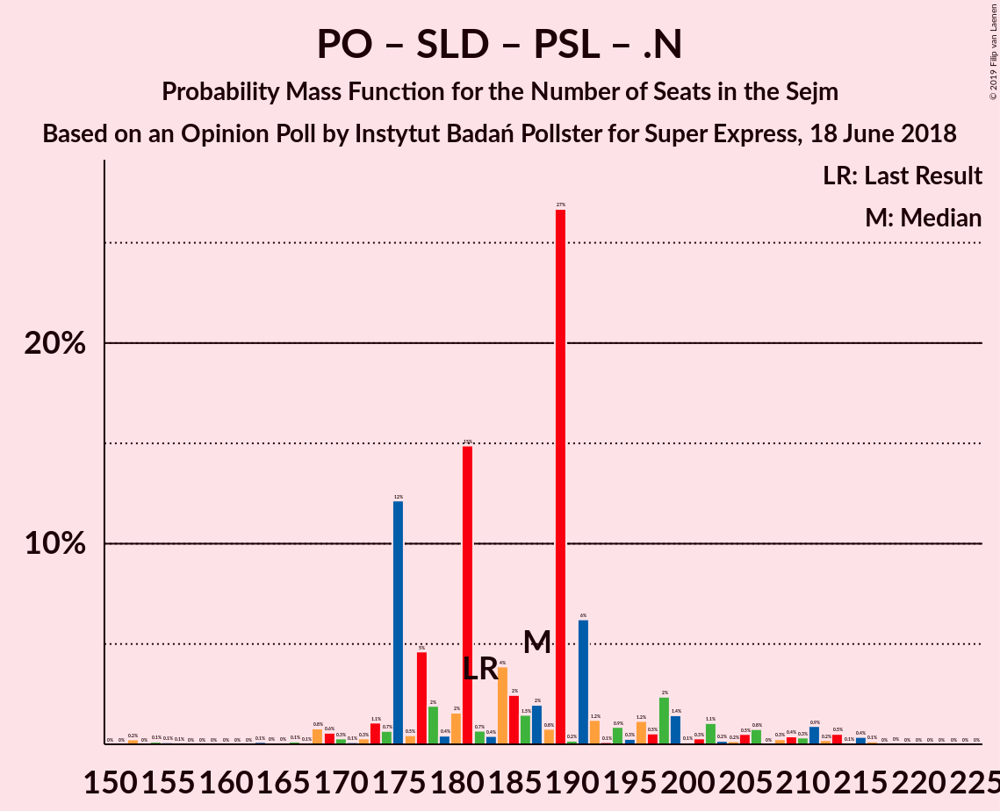
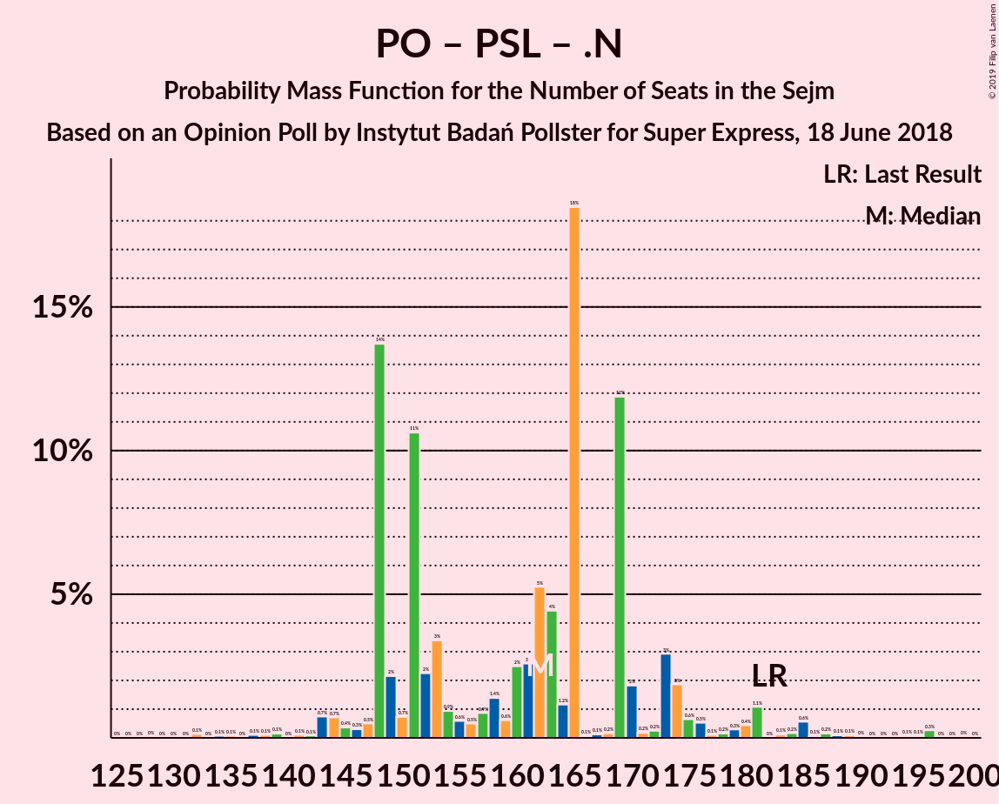

# Opinion Poll by Instytut Badań Pollster for Super Express, 18 June 2018

<a href="#voting-intentions">Voting Intentions</a> | <a href="#seats">Seats</a> | <a href="#coalitions">Coalitions</a> | <a href="#technical-information">Technical Information</a>

## Voting Intentions

### Confidence Intervals

| Party | Last Result | Poll Result | 80% Confidence Interval | 90% Confidence Interval | 95% Confidence Interval | 99% Confidence Interval |
|:-----:|:-----------:|:-----------:|:-----------------------:|:-----------------------:|:-----------------------:|:-----------------------:|
| Prawo i Sprawiedliwość | 37.6% | 40.9% | 38.9–42.9% |38.4–43.4% |37.9–43.9% |37.0–44.9% |
| Platforma Obywatelska | 24.1% | 27.0% | 25.3–28.8% |24.8–29.3% |24.3–29.8% |23.5–30.7% |
| Kukiz’15 | 8.8% | 6.9% | 6.0–8.1% |5.8–8.4% |5.5–8.7% |5.1–9.2% |
| Sojusz Lewicy Demokratycznej | 7.6% | 6.9% | 6.0–8.1% |5.8–8.4% |5.5–8.7% |5.1–9.2% |
| Polskie Stronnictwo Ludowe | 5.1% | 5.0% | 4.2–6.0% |4.0–6.2% |3.8–6.5% |3.5–7.0% |
| Lewica Razem | 3.6% | 5.0% | 4.2–6.0% |4.0–6.2% |3.8–6.5% |3.5–7.0% |
| .Nowoczesna | 7.6% | 4.0% | 3.3–4.9% |3.1–5.2% |3.0–5.4% |2.7–5.9% |
| KORWiN | 4.8% | 4.0% | 3.3–4.9% |3.1–5.2% |3.0–5.4% |2.7–5.9% |

*Note:* The poll result column reflects the actual value used in the calculations. Published results may vary slightly, and in addition be rounded to fewer digits.

## Seats

### Confidence Intervals

| Party | Last Result | Median | 80% Confidence Interval | 90% Confidence Interval | 95% Confidence Interval | 99% Confidence Interval |
|:-----:|:-----------:|:------:|:-----------------------:|:-----------------------:|:-----------------------:|:-----------------------:|
| <a href="#prawo-i-sprawiedliwość">Prawo i Sprawiedliwość</a> | 235 | 262 | 257–262 |243–262 |236–262 |236–262 |
| <a href="#platforma-obywatelska">Platforma Obywatelska</a> | 138 | 150 | 150 |141–151 |139–152 |139–153 |
| <a href="#kukiz’15">Kukiz’15</a> | 42 | 0 | 0–30 |0–38 |0–38 |0–38 |
| <a href="#sojusz-lewicy-demokratycznej">Sojusz Lewicy Demokratycznej</a> | 0 | 31 | 31 |14–36 |14–38 |9–38 |
| <a href="#polskie-stronnictwo-ludowe">Polskie Stronnictwo Ludowe</a> | 16 | 0 | 0 |0–21 |0–23 |0–23 |
| <a href="#lewica-razem">Lewica Razem</a> | 0 | 17 | 0–17 |0–17 |0–17 |0–17 |
| <a href="#.nowoczesna">.Nowoczesna</a> | 28 | 0 | 0 |0 |0 |0 |
| <a href="#korwin">KORWiN</a> | 0 | 0 | 0 |0 |0–8 |0–8 |

### Prawo i Sprawiedliwość

*For a full overview of the results for this party, see the [Prawo i Sprawiedliwość](party-prawoisprawiedliwość.html) page.*

| Number of Seats | Probability | Accumulated | Special Marks |
|:---------------:|:-----------:|:-----------:|:-------------:|
| 203 | 0.1% | 100% |  |
| 204 | 0% | 99.9% |  |
| 205 | 0% | 99.9% |  |
| 206 | 0% | 99.9% |  |
| 207 | 0% | 99.9% |  |
| 208 | 0% | 99.9% |  |
| 209 | 0% | 99.9% |  |
| 210 | 0% | 99.9% |  |
| 211 | 0% | 99.9% |  |
| 212 | 0% | 99.9% |  |
| 213 | 0% | 99.9% |  |
| 214 | 0% | 99.9% |  |
| 215 | 0% | 99.9% |  |
| 216 | 0% | 99.9% |  |
| 217 | 0% | 99.9% |  |
| 218 | 0% | 99.9% |  |
| 219 | 0% | 99.9% |  |
| 220 | 0% | 99.9% |  |
| 221 | 0% | 99.9% |  |
| 222 | 0% | 99.9% |  |
| 223 | 0% | 99.9% |  |
| 224 | 0% | 99.9% |  |
| 225 | 0% | 99.9% |  |
| 226 | 0% | 99.9% |  |
| 227 | 0% | 99.9% |  |
| 228 | 0% | 99.9% |  |
| 229 | 0% | 99.9% |  |
| 230 | 0% | 99.9% |  |
| 231 | 0% | 99.9% | Majority |
| 232 | 0% | 99.9% |  |
| 233 | 0% | 99.9% |  |
| 234 | 0% | 99.9% |  |
| 235 | 0% | 99.9% | Last Result |
| 236 | 2% | 99.9% |  |
| 237 | 0% | 97% |  |
| 238 | 0% | 97% |  |
| 239 | 0.2% | 97% |  |
| 240 | 0% | 97% |  |
| 241 | 0% | 97% |  |
| 242 | 2% | 97% |  |
| 243 | 1.1% | 95% |  |
| 244 | 0.2% | 94% |  |
| 245 | 0.1% | 94% |  |
| 246 | 0% | 94% |  |
| 247 | 0.1% | 94% |  |
| 248 | 0% | 94% |  |
| 249 | 0% | 94% |  |
| 250 | 0% | 94% |  |
| 251 | 0% | 94% |  |
| 252 | 0% | 94% |  |
| 253 | 3% | 94% |  |
| 254 | 0% | 91% |  |
| 255 | 0% | 91% |  |
| 256 | 0% | 91% |  |
| 257 | 6% | 91% |  |
| 258 | 0% | 85% |  |
| 259 | 0% | 85% |  |
| 260 | 0% | 85% |  |
| 261 | 0% | 85% |  |
| 262 | 85% | 85% | Median |
| 263 | 0% | 0% |  |

### Platforma Obywatelska

*For a full overview of the results for this party, see the [Platforma Obywatelska](party-platformaobywatelska.html) page.*

| Number of Seats | Probability | Accumulated | Special Marks |
|:---------------:|:-----------:|:-----------:|:-------------:|
| 134 | 0% | 100% |  |
| 135 | 0% | 99.9% |  |
| 136 | 0% | 99.9% |  |
| 137 | 0.1% | 99.9% |  |
| 138 | 0% | 99.9% | Last Result |
| 139 | 3% | 99.9% |  |
| 140 | 0% | 97% |  |
| 141 | 2% | 97% |  |
| 142 | 0.1% | 94% |  |
| 143 | 0% | 94% |  |
| 144 | 0% | 94% |  |
| 145 | 0.2% | 94% |  |
| 146 | 0% | 94% |  |
| 147 | 0% | 94% |  |
| 148 | 0% | 94% |  |
| 149 | 0% | 94% |  |
| 150 | 85% | 94% | Median |
| 151 | 6% | 9% |  |
| 152 | 1.1% | 3% |  |
| 153 | 2% | 2% |  |
| 154 | 0% | 0.1% |  |
| 155 | 0% | 0.1% |  |
| 156 | 0% | 0.1% |  |
| 157 | 0% | 0.1% |  |
| 158 | 0% | 0.1% |  |
| 159 | 0% | 0.1% |  |
| 160 | 0% | 0.1% |  |
| 161 | 0% | 0.1% |  |
| 162 | 0% | 0.1% |  |
| 163 | 0% | 0.1% |  |
| 164 | 0% | 0.1% |  |
| 165 | 0% | 0.1% |  |
| 166 | 0% | 0.1% |  |
| 167 | 0% | 0.1% |  |
| 168 | 0% | 0.1% |  |
| 169 | 0% | 0.1% |  |
| 170 | 0% | 0.1% |  |
| 171 | 0% | 0.1% |  |
| 172 | 0% | 0.1% |  |
| 173 | 0% | 0.1% |  |
| 174 | 0% | 0.1% |  |
| 175 | 0% | 0.1% |  |
| 176 | 0% | 0.1% |  |
| 177 | 0.1% | 0.1% |  |
| 178 | 0% | 0% |  |

### Kukiz’15

*For a full overview of the results for this party, see the [Kukiz’15](party-kukiz’15.html) page.*

| Number of Seats | Probability | Accumulated | Special Marks |
|:---------------:|:-----------:|:-----------:|:-------------:|
| 0 | 86% | 100% | Median |
| 1 | 0% | 14% |  |
| 2 | 0% | 14% |  |
| 3 | 0% | 14% |  |
| 4 | 0% | 14% |  |
| 5 | 0% | 14% |  |
| 6 | 0% | 14% |  |
| 7 | 0% | 14% |  |
| 8 | 0% | 14% |  |
| 9 | 0% | 14% |  |
| 10 | 0% | 14% |  |
| 11 | 0% | 14% |  |
| 12 | 0% | 14% |  |
| 13 | 0.1% | 14% |  |
| 14 | 0% | 14% |  |
| 15 | 0.3% | 14% |  |
| 16 | 2% | 13% |  |
| 17 | 0.1% | 11% |  |
| 18 | 0% | 11% |  |
| 19 | 0% | 11% |  |
| 20 | 0% | 11% |  |
| 21 | 0% | 11% |  |
| 22 | 0% | 11% |  |
| 23 | 0% | 11% |  |
| 24 | 0% | 11% |  |
| 25 | 0% | 11% |  |
| 26 | 0% | 11% |  |
| 27 | 0% | 11% |  |
| 28 | 0% | 11% |  |
| 29 | 0.1% | 11% |  |
| 30 | 3% | 11% |  |
| 31 | 2% | 8% |  |
| 32 | 0.1% | 6% |  |
| 33 | 0% | 6% |  |
| 34 | 0% | 6% |  |
| 35 | 0% | 6% |  |
| 36 | 0% | 6% |  |
| 37 | 0% | 6% |  |
| 38 | 6% | 6% |  |
| 39 | 0% | 0.1% |  |
| 40 | 0% | 0.1% |  |
| 41 | 0% | 0.1% |  |
| 42 | 0.1% | 0.1% | Last Result |
| 43 | 0% | 0% |  |

### Sojusz Lewicy Demokratycznej

*For a full overview of the results for this party, see the [Sojusz Lewicy Demokratycznej](party-sojuszlewicydemokratycznej.html) page.*

| Number of Seats | Probability | Accumulated | Special Marks |
|:---------------:|:-----------:|:-----------:|:-------------:|
| 0 | 0.1% | 100% | Last Result |
| 1 | 0% | 99.9% |  |
| 2 | 0% | 99.9% |  |
| 3 | 0% | 99.9% |  |
| 4 | 0% | 99.9% |  |
| 5 | 0% | 99.9% |  |
| 6 | 0% | 99.9% |  |
| 7 | 0% | 99.9% |  |
| 8 | 0% | 99.9% |  |
| 9 | 2% | 99.9% |  |
| 10 | 0% | 98% |  |
| 11 | 0% | 98% |  |
| 12 | 0% | 98% |  |
| 13 | 0% | 98% |  |
| 14 | 6% | 98% |  |
| 15 | 0.2% | 93% |  |
| 16 | 0% | 92% |  |
| 17 | 0% | 92% |  |
| 18 | 0% | 92% |  |
| 19 | 0% | 92% |  |
| 20 | 0.1% | 92% |  |
| 21 | 0% | 92% |  |
| 22 | 0.1% | 92% |  |
| 23 | 0% | 92% |  |
| 24 | 0% | 92% |  |
| 25 | 0% | 92% |  |
| 26 | 0.1% | 92% |  |
| 27 | 0% | 92% |  |
| 28 | 1.1% | 92% |  |
| 29 | 0% | 91% |  |
| 30 | 0.1% | 91% |  |
| 31 | 85% | 91% | Median |
| 32 | 0% | 6% |  |
| 33 | 0% | 6% |  |
| 34 | 0% | 6% |  |
| 35 | 0% | 6% |  |
| 36 | 2% | 6% |  |
| 37 | 0.2% | 4% |  |
| 38 | 3% | 3% |  |
| 39 | 0% | 0.2% |  |
| 40 | 0% | 0.1% |  |
| 41 | 0% | 0.1% |  |
| 42 | 0% | 0.1% |  |
| 43 | 0.1% | 0.1% |  |
| 44 | 0% | 0% |  |

### Polskie Stronnictwo Ludowe

*For a full overview of the results for this party, see the [Polskie Stronnictwo Ludowe](party-polskiestronnictwoludowe.html) page.*

| Number of Seats | Probability | Accumulated | Special Marks |
|:---------------:|:-----------:|:-----------:|:-------------:|
| 0 | 94% | 100% | Median |
| 1 | 0% | 6% |  |
| 2 | 0% | 6% |  |
| 3 | 0% | 6% |  |
| 4 | 0% | 6% |  |
| 5 | 0% | 6% |  |
| 6 | 0% | 6% |  |
| 7 | 0% | 6% |  |
| 8 | 0% | 6% |  |
| 9 | 0% | 6% |  |
| 10 | 0% | 6% |  |
| 11 | 0% | 6% |  |
| 12 | 0% | 6% |  |
| 13 | 0.1% | 6% |  |
| 14 | 0% | 6% |  |
| 15 | 0.1% | 6% |  |
| 16 | 0% | 6% | Last Result |
| 17 | 0% | 6% |  |
| 18 | 0% | 6% |  |
| 19 | 0% | 6% |  |
| 20 | 0% | 6% |  |
| 21 | 2% | 6% |  |
| 22 | 0% | 4% |  |
| 23 | 4% | 4% |  |
| 24 | 0.2% | 0.2% |  |
| 25 | 0% | 0% |  |

### Lewica Razem

*For a full overview of the results for this party, see the [Lewica Razem](party-lewicarazem.html) page.*

| Number of Seats | Probability | Accumulated | Special Marks |
|:---------------:|:-----------:|:-----------:|:-------------:|
| 0 | 13% | 100% | Last Result |
| 1 | 0% | 87% |  |
| 2 | 0% | 87% |  |
| 3 | 0% | 87% |  |
| 4 | 0% | 87% |  |
| 5 | 0.1% | 87% |  |
| 6 | 0% | 87% |  |
| 7 | 0% | 87% |  |
| 8 | 0% | 87% |  |
| 9 | 0% | 87% |  |
| 10 | 0% | 86% |  |
| 11 | 0% | 86% |  |
| 12 | 0% | 86% |  |
| 13 | 0% | 86% |  |
| 14 | 1.2% | 86% |  |
| 15 | 0.1% | 85% |  |
| 16 | 0% | 85% |  |
| 17 | 85% | 85% | Median |
| 18 | 0% | 0.1% |  |
| 19 | 0% | 0.1% |  |
| 20 | 0% | 0.1% |  |
| 21 | 0.1% | 0.1% |  |
| 22 | 0% | 0% |  |

### .Nowoczesna

*For a full overview of the results for this party, see the [.Nowoczesna](party-nowoczesna.html) page.*

| Number of Seats | Probability | Accumulated | Special Marks |
|:---------------:|:-----------:|:-----------:|:-------------:|
| 0 | 99.8% | 100% | Median |
| 1 | 0% | 0.2% |  |
| 2 | 0% | 0.2% |  |
| 3 | 0% | 0.2% |  |
| 4 | 0% | 0.2% |  |
| 5 | 0% | 0.2% |  |
| 6 | 0% | 0.2% |  |
| 7 | 0% | 0.2% |  |
| 8 | 0% | 0.2% |  |
| 9 | 0% | 0.1% |  |
| 10 | 0% | 0.1% |  |
| 11 | 0% | 0.1% |  |
| 12 | 0% | 0.1% |  |
| 13 | 0% | 0.1% |  |
| 14 | 0.1% | 0.1% |  |
| 15 | 0% | 0% |  |
| 16 | 0% | 0% |  |
| 17 | 0% | 0% |  |
| 18 | 0% | 0% |  |
| 19 | 0% | 0% |  |
| 20 | 0% | 0% |  |
| 21 | 0% | 0% |  |
| 22 | 0% | 0% |  |
| 23 | 0% | 0% |  |
| 24 | 0% | 0% |  |
| 25 | 0% | 0% |  |
| 26 | 0% | 0% |  |
| 27 | 0% | 0% |  |
| 28 | 0% | 0% | Last Result |

### KORWiN

*For a full overview of the results for this party, see the [KORWiN](party-korwin.html) page.*

| Number of Seats | Probability | Accumulated | Special Marks |
|:---------------:|:-----------:|:-----------:|:-------------:|
| 0 | 95% | 100% | Last Result, Median |
| 1 | 0% | 5% |  |
| 2 | 0% | 5% |  |
| 3 | 0% | 5% |  |
| 4 | 2% | 5% |  |
| 5 | 0% | 3% |  |
| 6 | 0.1% | 3% |  |
| 7 | 0.1% | 3% |  |
| 8 | 3% | 3% |  |
| 9 | 0% | 0.1% |  |
| 10 | 0.1% | 0.1% |  |
| 11 | 0% | 0.1% |  |
| 12 | 0% | 0.1% |  |
| 13 | 0% | 0.1% |  |
| 14 | 0% | 0.1% |  |
| 15 | 0% | 0.1% |  |
| 16 | 0% | 0.1% |  |
| 17 | 0% | 0.1% |  |
| 18 | 0% | 0.1% |  |
| 19 | 0% | 0.1% |  |
| 20 | 0% | 0.1% |  |
| 21 | 0% | 0.1% |  |
| 22 | 0% | 0.1% |  |
| 23 | 0% | 0.1% |  |
| 24 | 0% | 0% |  |

## Coalitions

### Confidence Intervals

| Coalition | Last Result | Median | Majority? | 80% Confidence Interval | 90% Confidence Interval | 95% Confidence Interval | 99% Confidence Interval |
|:---------:|:-----------:|:------:|:---------:|:-----------------------:|:-----------------------:|:-----------------------:|:-----------------------:|
| Prawo i Sprawiedliwość | 235 | 262 | 99.9% | 257–262 | 243–262 | 236–262 | 236–262 |
| Platforma Obywatelska – Sojusz Lewicy Demokratycznej – Lewica Razem – Polskie Stronnictwo Ludowe – .Nowoczesna | 182 | 198 | 0% | 183–198 | 165–198 | 165–200 | 165–217 |
| Platforma Obywatelska – Sojusz Lewicy Demokratycznej – Polskie Stronnictwo Ludowe – .Nowoczesna | 182 | 181 | 0% | 181 | 165–183 | 165–200 | 165–203 |
| Platforma Obywatelska – Sojusz Lewicy Demokratycznej – .Nowoczesna | 166 | 181 | 0% | 177–181 | 165–181 | 165–181 | 162–181 |
| Platforma Obywatelska – Polskie Stronnictwo Ludowe – .Nowoczesna | 182 | 150 | 0% | 150–151 | 150–164 | 139–174 | 139–175 |
| Platforma Obywatelska – .Nowoczesna | 166 | 150 | 0% | 150 | 141–151 | 139–152 | 139–153 |
| Platforma Obywatelska | 138 | 150 | 0% | 150 | 141–151 | 139–152 | 139–153 |

### Prawo i Sprawiedliwość

| Number of Seats | Probability | Accumulated | Special Marks |
|:---------------:|:-----------:|:-----------:|:-------------:|
| 203 | 0.1% | 100% |  |
| 204 | 0% | 99.9% |  |
| 205 | 0% | 99.9% |  |
| 206 | 0% | 99.9% |  |
| 207 | 0% | 99.9% |  |
| 208 | 0% | 99.9% |  |
| 209 | 0% | 99.9% |  |
| 210 | 0% | 99.9% |  |
| 211 | 0% | 99.9% |  |
| 212 | 0% | 99.9% |  |
| 213 | 0% | 99.9% |  |
| 214 | 0% | 99.9% |  |
| 215 | 0% | 99.9% |  |
| 216 | 0% | 99.9% |  |
| 217 | 0% | 99.9% |  |
| 218 | 0% | 99.9% |  |
| 219 | 0% | 99.9% |  |
| 220 | 0% | 99.9% |  |
| 221 | 0% | 99.9% |  |
| 222 | 0% | 99.9% |  |
| 223 | 0% | 99.9% |  |
| 224 | 0% | 99.9% |  |
| 225 | 0% | 99.9% |  |
| 226 | 0% | 99.9% |  |
| 227 | 0% | 99.9% |  |
| 228 | 0% | 99.9% |  |
| 229 | 0% | 99.9% |  |
| 230 | 0% | 99.9% |  |
| 231 | 0% | 99.9% | Majority |
| 232 | 0% | 99.9% |  |
| 233 | 0% | 99.9% |  |
| 234 | 0% | 99.9% |  |
| 235 | 0% | 99.9% | Last Result |
| 236 | 2% | 99.9% |  |
| 237 | 0% | 97% |  |
| 238 | 0% | 97% |  |
| 239 | 0.2% | 97% |  |
| 240 | 0% | 97% |  |
| 241 | 0% | 97% |  |
| 242 | 2% | 97% |  |
| 243 | 1.1% | 95% |  |
| 244 | 0.2% | 94% |  |
| 245 | 0.1% | 94% |  |
| 246 | 0% | 94% |  |
| 247 | 0.1% | 94% |  |
| 248 | 0% | 94% |  |
| 249 | 0% | 94% |  |
| 250 | 0% | 94% |  |
| 251 | 0% | 94% |  |
| 252 | 0% | 94% |  |
| 253 | 3% | 94% |  |
| 254 | 0% | 91% |  |
| 255 | 0% | 91% |  |
| 256 | 0% | 91% |  |
| 257 | 6% | 91% |  |
| 258 | 0% | 85% |  |
| 259 | 0% | 85% |  |
| 260 | 0% | 85% |  |
| 261 | 0% | 85% |  |
| 262 | 85% | 85% | Median |
| 263 | 0% | 0% |  |

### Platforma Obywatelska – Sojusz Lewicy Demokratycznej – Lewica Razem – Polskie Stronnictwo Ludowe – .Nowoczesna

| Number of Seats | Probability | Accumulated | Special Marks |
|:---------------:|:-----------:|:-----------:|:-------------:|
| 163 | 0.1% | 100% |  |
| 164 | 0% | 99.9% |  |
| 165 | 6% | 99.9% |  |
| 166 | 0% | 94% |  |
| 167 | 0% | 94% |  |
| 168 | 0% | 94% |  |
| 169 | 0% | 94% |  |
| 170 | 0% | 94% |  |
| 171 | 0% | 94% |  |
| 172 | 0% | 94% |  |
| 173 | 0% | 94% |  |
| 174 | 0% | 94% |  |
| 175 | 0% | 94% |  |
| 176 | 0% | 94% |  |
| 177 | 3% | 94% |  |
| 178 | 0% | 91% |  |
| 179 | 0% | 91% |  |
| 180 | 0.1% | 91% |  |
| 181 | 0% | 91% |  |
| 182 | 0% | 91% | Last Result |
| 183 | 2% | 91% |  |
| 184 | 0% | 89% |  |
| 185 | 0% | 89% |  |
| 186 | 0% | 89% |  |
| 187 | 0% | 89% |  |
| 188 | 0% | 89% |  |
| 189 | 0% | 89% |  |
| 190 | 0% | 89% |  |
| 191 | 0% | 89% |  |
| 192 | 0% | 89% |  |
| 193 | 0% | 89% |  |
| 194 | 0% | 89% |  |
| 195 | 0% | 89% |  |
| 196 | 0% | 89% |  |
| 197 | 0% | 89% |  |
| 198 | 85% | 89% | Median |
| 199 | 0.1% | 4% |  |
| 200 | 3% | 4% |  |
| 201 | 0% | 2% |  |
| 202 | 0% | 2% |  |
| 203 | 0% | 2% |  |
| 204 | 0% | 2% |  |
| 205 | 0% | 1.5% |  |
| 206 | 0.2% | 1.5% |  |
| 207 | 0% | 1.3% |  |
| 208 | 0% | 1.2% |  |
| 209 | 0% | 1.2% |  |
| 210 | 0% | 1.2% |  |
| 211 | 0% | 1.2% |  |
| 212 | 0% | 1.2% |  |
| 213 | 0% | 1.2% |  |
| 214 | 0% | 1.2% |  |
| 215 | 0% | 1.2% |  |
| 216 | 0% | 1.2% |  |
| 217 | 1.1% | 1.2% |  |
| 218 | 0% | 0.1% |  |
| 219 | 0% | 0.1% |  |
| 220 | 0.1% | 0.1% |  |
| 221 | 0% | 0% |  |

### Platforma Obywatelska – Sojusz Lewicy Demokratycznej – Polskie Stronnictwo Ludowe – .Nowoczesna

| Number of Seats | Probability | Accumulated | Special Marks |
|:---------------:|:-----------:|:-----------:|:-------------:|
| 142 | 0.1% | 100% |  |
| 143 | 0% | 99.9% |  |
| 144 | 0% | 99.9% |  |
| 145 | 0% | 99.9% |  |
| 146 | 0% | 99.9% |  |
| 147 | 0% | 99.9% |  |
| 148 | 0% | 99.9% |  |
| 149 | 0% | 99.9% |  |
| 150 | 0% | 99.9% |  |
| 151 | 0% | 99.9% |  |
| 152 | 0% | 99.9% |  |
| 153 | 0% | 99.9% |  |
| 154 | 0% | 99.9% |  |
| 155 | 0% | 99.9% |  |
| 156 | 0% | 99.9% |  |
| 157 | 0% | 99.9% |  |
| 158 | 0% | 99.9% |  |
| 159 | 0% | 99.9% |  |
| 160 | 0% | 99.9% |  |
| 161 | 0% | 99.9% |  |
| 162 | 0% | 99.9% |  |
| 163 | 0% | 99.9% |  |
| 164 | 0% | 99.9% |  |
| 165 | 6% | 99.9% |  |
| 166 | 0.1% | 94% |  |
| 167 | 0% | 94% |  |
| 168 | 0% | 94% |  |
| 169 | 0% | 94% |  |
| 170 | 0% | 94% |  |
| 171 | 0% | 94% |  |
| 172 | 0% | 94% |  |
| 173 | 0% | 94% |  |
| 174 | 0% | 94% |  |
| 175 | 0% | 94% |  |
| 176 | 0% | 94% |  |
| 177 | 3% | 94% |  |
| 178 | 0% | 91% |  |
| 179 | 0% | 91% |  |
| 180 | 0% | 91% |  |
| 181 | 85% | 91% | Median |
| 182 | 0% | 6% | Last Result |
| 183 | 2% | 6% |  |
| 184 | 0.1% | 4% |  |
| 185 | 0% | 4% |  |
| 186 | 0% | 4% |  |
| 187 | 0.1% | 4% |  |
| 188 | 0% | 4% |  |
| 189 | 0% | 4% |  |
| 190 | 0% | 4% |  |
| 191 | 0% | 4% |  |
| 192 | 0% | 4% |  |
| 193 | 0% | 4% |  |
| 194 | 0% | 4% |  |
| 195 | 0.1% | 4% |  |
| 196 | 0% | 4% |  |
| 197 | 0% | 4% |  |
| 198 | 0% | 4% |  |
| 199 | 0% | 4% |  |
| 200 | 2% | 4% |  |
| 201 | 0% | 1.5% |  |
| 202 | 0% | 1.5% |  |
| 203 | 1.1% | 1.5% |  |
| 204 | 0% | 0.4% |  |
| 205 | 0% | 0.4% |  |
| 206 | 0.2% | 0.4% |  |
| 207 | 0% | 0.1% |  |
| 208 | 0% | 0.1% |  |
| 209 | 0% | 0.1% |  |
| 210 | 0% | 0.1% |  |
| 211 | 0% | 0.1% |  |
| 212 | 0% | 0.1% |  |
| 213 | 0% | 0.1% |  |
| 214 | 0% | 0.1% |  |
| 215 | 0% | 0.1% |  |
| 216 | 0% | 0.1% |  |
| 217 | 0% | 0.1% |  |
| 218 | 0% | 0.1% |  |
| 219 | 0% | 0.1% |  |
| 220 | 0.1% | 0.1% |  |
| 221 | 0% | 0% |  |

### Platforma Obywatelska – Sojusz Lewicy Demokratycznej – .Nowoczesna

| Number of Seats | Probability | Accumulated | Special Marks |
|:---------------:|:-----------:|:-----------:|:-------------:|
| 142 | 0.1% | 100% |  |
| 143 | 0% | 99.9% |  |
| 144 | 0% | 99.9% |  |
| 145 | 0% | 99.9% |  |
| 146 | 0% | 99.9% |  |
| 147 | 0% | 99.9% |  |
| 148 | 0% | 99.9% |  |
| 149 | 0% | 99.9% |  |
| 150 | 0% | 99.9% |  |
| 151 | 0% | 99.9% |  |
| 152 | 0% | 99.9% |  |
| 153 | 0% | 99.9% |  |
| 154 | 0% | 99.9% |  |
| 155 | 0% | 99.9% |  |
| 156 | 0% | 99.9% |  |
| 157 | 0% | 99.9% |  |
| 158 | 0% | 99.9% |  |
| 159 | 0% | 99.9% |  |
| 160 | 0% | 99.9% |  |
| 161 | 0.1% | 99.9% |  |
| 162 | 2% | 99.8% |  |
| 163 | 0% | 98% |  |
| 164 | 0% | 98% |  |
| 165 | 6% | 98% |  |
| 166 | 0.1% | 93% | Last Result |
| 167 | 0% | 92% |  |
| 168 | 0% | 92% |  |
| 169 | 0% | 92% |  |
| 170 | 0% | 92% |  |
| 171 | 0% | 92% |  |
| 172 | 0% | 92% |  |
| 173 | 0% | 92% |  |
| 174 | 0% | 92% |  |
| 175 | 0% | 92% |  |
| 176 | 0% | 92% |  |
| 177 | 6% | 92% |  |
| 178 | 0% | 87% |  |
| 179 | 0% | 87% |  |
| 180 | 1.2% | 87% |  |
| 181 | 85% | 85% | Median |
| 182 | 0.2% | 0.4% |  |
| 183 | 0% | 0.3% |  |
| 184 | 0% | 0.3% |  |
| 185 | 0.1% | 0.3% |  |
| 186 | 0% | 0.2% |  |
| 187 | 0.1% | 0.2% |  |
| 188 | 0% | 0.1% |  |
| 189 | 0% | 0.1% |  |
| 190 | 0% | 0.1% |  |
| 191 | 0% | 0.1% |  |
| 192 | 0% | 0.1% |  |
| 193 | 0% | 0.1% |  |
| 194 | 0% | 0.1% |  |
| 195 | 0% | 0.1% |  |
| 196 | 0% | 0.1% |  |
| 197 | 0% | 0.1% |  |
| 198 | 0% | 0.1% |  |
| 199 | 0% | 0.1% |  |
| 200 | 0% | 0.1% |  |
| 201 | 0% | 0.1% |  |
| 202 | 0% | 0.1% |  |
| 203 | 0% | 0.1% |  |
| 204 | 0% | 0.1% |  |
| 205 | 0% | 0.1% |  |
| 206 | 0% | 0.1% |  |
| 207 | 0.1% | 0.1% |  |
| 208 | 0% | 0.1% |  |
| 209 | 0% | 0% |  |

### Platforma Obywatelska – Polskie Stronnictwo Ludowe – .Nowoczesna

| Number of Seats | Probability | Accumulated | Special Marks |
|:---------------:|:-----------:|:-----------:|:-------------:|
| 134 | 0% | 100% |  |
| 135 | 0% | 99.9% |  |
| 136 | 0% | 99.9% |  |
| 137 | 0% | 99.9% |  |
| 138 | 0% | 99.9% |  |
| 139 | 3% | 99.9% |  |
| 140 | 0% | 97% |  |
| 141 | 0% | 97% |  |
| 142 | 0.1% | 97% |  |
| 143 | 0% | 97% |  |
| 144 | 0% | 97% |  |
| 145 | 0% | 97% |  |
| 146 | 0% | 97% |  |
| 147 | 0% | 97% |  |
| 148 | 0% | 97% |  |
| 149 | 0% | 97% |  |
| 150 | 85% | 97% | Median |
| 151 | 6% | 12% |  |
| 152 | 0.1% | 6% |  |
| 153 | 0% | 6% |  |
| 154 | 0% | 6% |  |
| 155 | 0% | 6% |  |
| 156 | 0% | 6% |  |
| 157 | 0% | 6% |  |
| 158 | 0% | 6% |  |
| 159 | 0% | 6% |  |
| 160 | 0% | 6% |  |
| 161 | 0% | 6% |  |
| 162 | 0.1% | 6% |  |
| 163 | 0% | 6% |  |
| 164 | 2% | 6% |  |
| 165 | 0% | 3% |  |
| 166 | 0% | 3% |  |
| 167 | 0% | 3% |  |
| 168 | 0% | 3% |  |
| 169 | 0.2% | 3% |  |
| 170 | 0% | 3% |  |
| 171 | 0% | 3% |  |
| 172 | 0% | 3% |  |
| 173 | 0% | 3% |  |
| 174 | 2% | 3% |  |
| 175 | 1.1% | 1.3% |  |
| 176 | 0% | 0.2% |  |
| 177 | 0% | 0.2% |  |
| 178 | 0% | 0.2% |  |
| 179 | 0% | 0.2% |  |
| 180 | 0% | 0.2% |  |
| 181 | 0% | 0.2% |  |
| 182 | 0% | 0.2% | Last Result |
| 183 | 0% | 0.2% |  |
| 184 | 0% | 0.2% |  |
| 185 | 0% | 0.2% |  |
| 186 | 0.1% | 0.2% |  |
| 187 | 0% | 0.1% |  |
| 188 | 0% | 0.1% |  |
| 189 | 0% | 0.1% |  |
| 190 | 0.1% | 0.1% |  |
| 191 | 0% | 0% |  |

### Platforma Obywatelska – .Nowoczesna

| Number of Seats | Probability | Accumulated | Special Marks |
|:---------------:|:-----------:|:-----------:|:-------------:|
| 134 | 0% | 100% |  |
| 135 | 0% | 99.9% |  |
| 136 | 0% | 99.9% |  |
| 137 | 0.1% | 99.9% |  |
| 138 | 0% | 99.9% |  |
| 139 | 3% | 99.9% |  |
| 140 | 0% | 97% |  |
| 141 | 2% | 97% |  |
| 142 | 0.1% | 94% |  |
| 143 | 0% | 94% |  |
| 144 | 0% | 94% |  |
| 145 | 0.2% | 94% |  |
| 146 | 0% | 94% |  |
| 147 | 0% | 94% |  |
| 148 | 0% | 94% |  |
| 149 | 0% | 94% |  |
| 150 | 85% | 94% | Median |
| 151 | 6% | 9% |  |
| 152 | 1.1% | 3% |  |
| 153 | 2% | 2% |  |
| 154 | 0% | 0.3% |  |
| 155 | 0% | 0.2% |  |
| 156 | 0% | 0.2% |  |
| 157 | 0% | 0.2% |  |
| 158 | 0% | 0.2% |  |
| 159 | 0% | 0.2% |  |
| 160 | 0% | 0.2% |  |
| 161 | 0% | 0.2% |  |
| 162 | 0% | 0.2% |  |
| 163 | 0% | 0.2% |  |
| 164 | 0% | 0.2% |  |
| 165 | 0.1% | 0.2% |  |
| 166 | 0% | 0.1% | Last Result |
| 167 | 0% | 0.1% |  |
| 168 | 0% | 0.1% |  |
| 169 | 0% | 0.1% |  |
| 170 | 0% | 0.1% |  |
| 171 | 0% | 0.1% |  |
| 172 | 0% | 0.1% |  |
| 173 | 0% | 0.1% |  |
| 174 | 0% | 0.1% |  |
| 175 | 0% | 0.1% |  |
| 176 | 0% | 0.1% |  |
| 177 | 0.1% | 0.1% |  |
| 178 | 0% | 0% |  |

### Platforma Obywatelska

| Number of Seats | Probability | Accumulated | Special Marks |
|:---------------:|:-----------:|:-----------:|:-------------:|
| 134 | 0% | 100% |  |
| 135 | 0% | 99.9% |  |
| 136 | 0% | 99.9% |  |
| 137 | 0.1% | 99.9% |  |
| 138 | 0% | 99.9% | Last Result |
| 139 | 3% | 99.9% |  |
| 140 | 0% | 97% |  |
| 141 | 2% | 97% |  |
| 142 | 0.1% | 94% |  |
| 143 | 0% | 94% |  |
| 144 | 0% | 94% |  |
| 145 | 0.2% | 94% |  |
| 146 | 0% | 94% |  |
| 147 | 0% | 94% |  |
| 148 | 0% | 94% |  |
| 149 | 0% | 94% |  |
| 150 | 85% | 94% | Median |
| 151 | 6% | 9% |  |
| 152 | 1.1% | 3% |  |
| 153 | 2% | 2% |  |
| 154 | 0% | 0.1% |  |
| 155 | 0% | 0.1% |  |
| 156 | 0% | 0.1% |  |
| 157 | 0% | 0.1% |  |
| 158 | 0% | 0.1% |  |
| 159 | 0% | 0.1% |  |
| 160 | 0% | 0.1% |  |
| 161 | 0% | 0.1% |  |
| 162 | 0% | 0.1% |  |
| 163 | 0% | 0.1% |  |
| 164 | 0% | 0.1% |  |
| 165 | 0% | 0.1% |  |
| 166 | 0% | 0.1% |  |
| 167 | 0% | 0.1% |  |
| 168 | 0% | 0.1% |  |
| 169 | 0% | 0.1% |  |
| 170 | 0% | 0.1% |  |
| 171 | 0% | 0.1% |  |
| 172 | 0% | 0.1% |  |
| 173 | 0% | 0.1% |  |
| 174 | 0% | 0.1% |  |
| 175 | 0% | 0.1% |  |
| 176 | 0% | 0.1% |  |
| 177 | 0.1% | 0.1% |  |
| 178 | 0% | 0% |  |

## Technical Information

### Opinion Poll

+ **Polling firm:** Instytut Badań Pollster
+ **Commissioner(s):** Super Express
+ **Fieldwork period:** 18 June 2018

### Calculations

+ **Sample size:** 1023
+ **Simulations done:** 1,024
+ **Error estimate:** 2.13%

