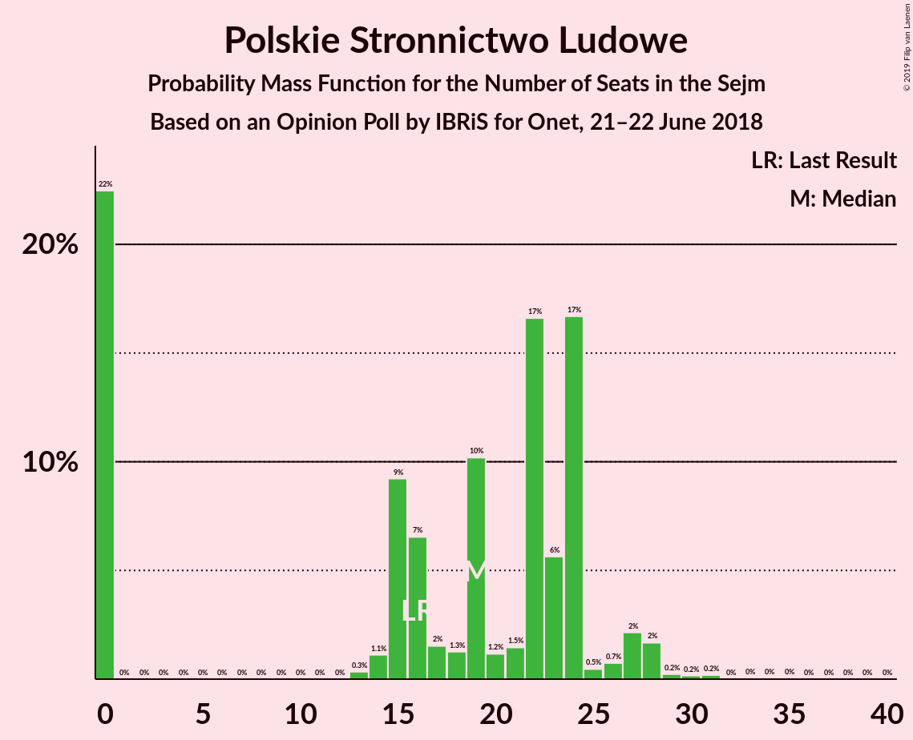

# Opinion Poll by IBRiS for Onet, 21–22 June 2018

<a href="#voting-intentions">Voting Intentions</a> | <a href="#seats">Seats</a> | <a href="#coalitions">Coalitions</a> | <a href="#technical-information">Technical Information</a>

## Voting Intentions

### Confidence Intervals

| Party | Last Result | Poll Result | 80% Confidence Interval | 90% Confidence Interval | 95% Confidence Interval | 99% Confidence Interval |
|:-----:|:-----------:|:-----------:|:-----------------------:|:-----------------------:|:-----------------------:|:-----------------------:|
| Prawo i Sprawiedliwość | 37.6% | 37.8% | 36.0–39.7% |35.4–40.3% |35.0–40.7% |34.1–41.6% |
| Platforma Obywatelska | 24.1% | 24.6% | 23.0–26.4% |22.6–26.9% |22.2–27.3% |21.4–28.1% |
| Sojusz Lewicy Demokratycznej | 7.6% | 9.6% | 8.6–10.9% |8.3–11.2% |8.0–11.5% |7.5–12.1% |
| Kukiz’15 | 8.8% | 7.5% | 6.6–8.7% |6.3–9.0% |6.1–9.3% |5.7–9.8% |
| Polskie Stronnictwo Ludowe | 5.1% | 5.7% | 4.9–6.7% |4.7–7.0% |4.5–7.3% |4.1–7.8% |
| .Nowoczesna | 7.6% | 3.3% | 2.7–4.1% |2.5–4.3% |2.4–4.5% |2.1–4.9% |
| Lewica Razem | 3.6% | 1.3% | 0.9–1.8% |0.8–2.0% |0.8–2.1% |0.6–2.4% |
| KORWiN | 4.8% | 0.9% | 0.6–1.4% |0.5–1.5% |0.5–1.7% |0.4–1.9% |

*Note:* The poll result column reflects the actual value used in the calculations. Published results may vary slightly, and in addition be rounded to fewer digits.

## Seats

### Confidence Intervals

| Party | Last Result | Median | 80% Confidence Interval | 90% Confidence Interval | 95% Confidence Interval | 99% Confidence Interval |
|:-----:|:-----------:|:------:|:-----------------------:|:-----------------------:|:-----------------------:|:-----------------------:|
| <a href="#prawo-i-sprawiedliwość">Prawo i Sprawiedliwość</a> | 235 | 222 | 222–243 |221–243 |216–243 |195–243 |
| <a href="#platforma-obywatelska">Platforma Obywatelska</a> | 138 | 133 | 133–135 |133–135 |133–143 |129–152 |
| <a href="#sojusz-lewicy-demokratycznej">Sojusz Lewicy Demokratycznej</a> | 0 | 47 | 36–47 |35–47 |35–47 |30–48 |
| <a href="#kukiz’15">Kukiz’15</a> | 42 | 38 | 24–38 |24–47 |24–47 |16–51 |
| <a href="#polskie-stronnictwo-ludowe">Polskie Stronnictwo Ludowe</a> | 16 | 20 | 20–22 |20–23 |20–24 |18–31 |
| <a href="#.nowoczesna">.Nowoczesna</a> | 28 | 0 | 0 |0 |0 |0 |
| <a href="#lewica-razem">Lewica Razem</a> | 0 | 0 | 0 |0 |0 |0 |
| <a href="#korwin">KORWiN</a> | 0 | 0 | 0 |0 |0 |0 |

### Prawo i Sprawiedliwość

*For a full overview of the results for this party, see the [Prawo i Sprawiedliwość](party-prawoisprawiedliwość.html) page.*

| Number of Seats | Probability | Accumulated | Special Marks |
|:---------------:|:-----------:|:-----------:|:-------------:|
| 195 | 1.4% | 100% |  |
| 196 | 0.4% | 98.6% |  |
| 197 | 0% | 98% |  |
| 198 | 0% | 98% |  |
| 199 | 0% | 98% |  |
| 200 | 0% | 98% |  |
| 201 | 0% | 98% |  |
| 202 | 0% | 98% |  |
| 203 | 0.4% | 98% |  |
| 204 | 0% | 98% |  |
| 205 | 0% | 98% |  |
| 206 | 0% | 98% |  |
| 207 | 0% | 98% |  |
| 208 | 0% | 98% |  |
| 209 | 0.1% | 98% |  |
| 210 | 0% | 98% |  |
| 211 | 0% | 98% |  |
| 212 | 0% | 98% |  |
| 213 | 0% | 98% |  |
| 214 | 0% | 98% |  |
| 215 | 0% | 98% |  |
| 216 | 1.0% | 98% |  |
| 217 | 0% | 97% |  |
| 218 | 0% | 97% |  |
| 219 | 0% | 97% |  |
| 220 | 0% | 97% |  |
| 221 | 5% | 97% |  |
| 222 | 68% | 92% | Median |
| 223 | 0% | 23% |  |
| 224 | 0% | 23% |  |
| 225 | 0% | 23% |  |
| 226 | 0% | 23% |  |
| 227 | 0% | 23% |  |
| 228 | 0% | 23% |  |
| 229 | 0% | 23% |  |
| 230 | 0.1% | 23% |  |
| 231 | 0.1% | 23% | Majority |
| 232 | 1.1% | 23% |  |
| 233 | 0% | 22% |  |
| 234 | 1.4% | 22% |  |
| 235 | 0% | 21% | Last Result |
| 236 | 0% | 21% |  |
| 237 | 0% | 21% |  |
| 238 | 0% | 21% |  |
| 239 | 0% | 21% |  |
| 240 | 0% | 21% |  |
| 241 | 4% | 21% |  |
| 242 | 0% | 17% |  |
| 243 | 17% | 17% |  |
| 244 | 0.1% | 0.3% |  |
| 245 | 0.1% | 0.2% |  |
| 246 | 0% | 0.1% |  |
| 247 | 0% | 0.1% |  |
| 248 | 0% | 0.1% |  |
| 249 | 0% | 0.1% |  |
| 250 | 0% | 0.1% |  |
| 251 | 0% | 0.1% |  |
| 252 | 0% | 0.1% |  |
| 253 | 0% | 0.1% |  |
| 254 | 0% | 0.1% |  |
| 255 | 0% | 0.1% |  |
| 256 | 0% | 0.1% |  |
| 257 | 0% | 0.1% |  |
| 258 | 0% | 0% |  |

### Platforma Obywatelska

*For a full overview of the results for this party, see the [Platforma Obywatelska](party-platformaobywatelska.html) page.*

| Number of Seats | Probability | Accumulated | Special Marks |
|:---------------:|:-----------:|:-----------:|:-------------:|
| 117 | 0.1% | 100% |  |
| 118 | 0% | 99.9% |  |
| 119 | 0% | 99.9% |  |
| 120 | 0% | 99.9% |  |
| 121 | 0% | 99.9% |  |
| 122 | 0% | 99.9% |  |
| 123 | 0% | 99.9% |  |
| 124 | 0% | 99.9% |  |
| 125 | 0% | 99.8% |  |
| 126 | 0% | 99.8% |  |
| 127 | 0% | 99.8% |  |
| 128 | 0% | 99.8% |  |
| 129 | 1.1% | 99.8% |  |
| 130 | 0.1% | 98.7% |  |
| 131 | 0% | 98.6% |  |
| 132 | 0% | 98.6% |  |
| 133 | 66% | 98.6% | Median |
| 134 | 3% | 33% |  |
| 135 | 25% | 29% |  |
| 136 | 0.2% | 4% |  |
| 137 | 0% | 4% |  |
| 138 | 0% | 4% | Last Result |
| 139 | 0% | 4% |  |
| 140 | 0% | 4% |  |
| 141 | 0% | 4% |  |
| 142 | 0% | 4% |  |
| 143 | 1.5% | 4% |  |
| 144 | 0% | 2% |  |
| 145 | 0% | 2% |  |
| 146 | 0% | 2% |  |
| 147 | 0% | 2% |  |
| 148 | 0.4% | 2% |  |
| 149 | 0% | 2% |  |
| 150 | 0% | 2% |  |
| 151 | 0% | 2% |  |
| 152 | 2% | 2% |  |
| 153 | 0% | 0% |  |

### Sojusz Lewicy Demokratycznej

*For a full overview of the results for this party, see the [Sojusz Lewicy Demokratycznej](party-sojuszlewicydemokratycznej.html) page.*

| Number of Seats | Probability | Accumulated | Special Marks |
|:---------------:|:-----------:|:-----------:|:-------------:|
| 0 | 0% | 100% | Last Result |
| 1 | 0% | 100% |  |
| 2 | 0% | 100% |  |
| 3 | 0% | 100% |  |
| 4 | 0% | 100% |  |
| 5 | 0% | 100% |  |
| 6 | 0% | 100% |  |
| 7 | 0% | 100% |  |
| 8 | 0% | 100% |  |
| 9 | 0% | 100% |  |
| 10 | 0% | 100% |  |
| 11 | 0% | 100% |  |
| 12 | 0% | 100% |  |
| 13 | 0% | 100% |  |
| 14 | 0% | 100% |  |
| 15 | 0% | 100% |  |
| 16 | 0% | 100% |  |
| 17 | 0% | 100% |  |
| 18 | 0% | 100% |  |
| 19 | 0% | 100% |  |
| 20 | 0% | 100% |  |
| 21 | 0% | 100% |  |
| 22 | 0% | 100% |  |
| 23 | 0% | 100% |  |
| 24 | 0% | 100% |  |
| 25 | 0% | 100% |  |
| 26 | 0% | 100% |  |
| 27 | 0% | 100% |  |
| 28 | 0% | 100% |  |
| 29 | 0% | 100% |  |
| 30 | 1.1% | 100% |  |
| 31 | 0.1% | 98.9% |  |
| 32 | 0% | 98.9% |  |
| 33 | 0.1% | 98.9% |  |
| 34 | 0% | 98.8% |  |
| 35 | 5% | 98.8% |  |
| 36 | 17% | 94% |  |
| 37 | 4% | 77% |  |
| 38 | 0% | 73% |  |
| 39 | 0% | 73% |  |
| 40 | 0% | 73% |  |
| 41 | 0.5% | 73% |  |
| 42 | 1.4% | 72% |  |
| 43 | 1.5% | 71% |  |
| 44 | 0% | 69% |  |
| 45 | 0% | 69% |  |
| 46 | 0% | 69% |  |
| 47 | 68% | 69% | Median |
| 48 | 1.0% | 1.1% |  |
| 49 | 0% | 0.1% |  |
| 50 | 0% | 0% |  |

### Kukiz’15

*For a full overview of the results for this party, see the [Kukiz’15](party-kukiz’15.html) page.*

| Number of Seats | Probability | Accumulated | Special Marks |
|:---------------:|:-----------:|:-----------:|:-------------:|
| 16 | 1.4% | 100% |  |
| 17 | 0% | 98.6% |  |
| 18 | 0.1% | 98.6% |  |
| 19 | 0% | 98.5% |  |
| 20 | 0% | 98.5% |  |
| 21 | 0% | 98% |  |
| 22 | 0% | 98% |  |
| 23 | 0.1% | 98% |  |
| 24 | 21% | 98% |  |
| 25 | 0% | 78% |  |
| 26 | 0% | 78% |  |
| 27 | 0% | 78% |  |
| 28 | 0% | 78% |  |
| 29 | 0% | 78% |  |
| 30 | 0% | 78% |  |
| 31 | 0% | 78% |  |
| 32 | 0% | 78% |  |
| 33 | 0% | 78% |  |
| 34 | 0% | 78% |  |
| 35 | 0.1% | 78% |  |
| 36 | 0% | 78% |  |
| 37 | 2% | 78% |  |
| 38 | 66% | 76% | Median |
| 39 | 0% | 10% |  |
| 40 | 2% | 10% |  |
| 41 | 1.0% | 8% |  |
| 42 | 0% | 7% | Last Result |
| 43 | 0% | 7% |  |
| 44 | 0% | 7% |  |
| 45 | 0.2% | 7% |  |
| 46 | 0.4% | 7% |  |
| 47 | 5% | 6% |  |
| 48 | 0% | 1.1% |  |
| 49 | 0% | 1.1% |  |
| 50 | 0% | 1.1% |  |
| 51 | 1.1% | 1.1% |  |
| 52 | 0% | 0% |  |

### Polskie Stronnictwo Ludowe

*For a full overview of the results for this party, see the [Polskie Stronnictwo Ludowe](party-polskiestronnictwoludowe.html) page.*

| Number of Seats | Probability | Accumulated | Special Marks |
|:---------------:|:-----------:|:-----------:|:-------------:|
| 15 | 0% | 100% |  |
| 16 | 0.1% | 99.9% | Last Result |
| 17 | 0% | 99.8% |  |
| 18 | 1.1% | 99.8% |  |
| 19 | 0.1% | 98.7% |  |
| 20 | 68% | 98.6% | Median |
| 21 | 1.0% | 31% |  |
| 22 | 22% | 30% |  |
| 23 | 4% | 7% |  |
| 24 | 1.4% | 4% |  |
| 25 | 0.1% | 2% |  |
| 26 | 0.4% | 2% |  |
| 27 | 0% | 2% |  |
| 28 | 0% | 2% |  |
| 29 | 0% | 2% |  |
| 30 | 0% | 2% |  |
| 31 | 2% | 2% |  |
| 32 | 0% | 0% |  |

### .Nowoczesna

*For a full overview of the results for this party, see the [.Nowoczesna](party-nowoczesna.html) page.*

| Number of Seats | Probability | Accumulated | Special Marks |
|:---------------:|:-----------:|:-----------:|:-------------:|
| 0 | 99.9% | 100% | Median |
| 1 | 0% | 0.1% |  |
| 2 | 0% | 0.1% |  |
| 3 | 0% | 0.1% |  |
| 4 | 0% | 0.1% |  |
| 5 | 0% | 0.1% |  |
| 6 | 0% | 0.1% |  |
| 7 | 0% | 0.1% |  |
| 8 | 0% | 0.1% |  |
| 9 | 0% | 0.1% |  |
| 10 | 0% | 0.1% |  |
| 11 | 0% | 0.1% |  |
| 12 | 0.1% | 0.1% |  |
| 13 | 0% | 0% |  |
| 14 | 0% | 0% |  |
| 15 | 0% | 0% |  |
| 16 | 0% | 0% |  |
| 17 | 0% | 0% |  |
| 18 | 0% | 0% |  |
| 19 | 0% | 0% |  |
| 20 | 0% | 0% |  |
| 21 | 0% | 0% |  |
| 22 | 0% | 0% |  |
| 23 | 0% | 0% |  |
| 24 | 0% | 0% |  |
| 25 | 0% | 0% |  |
| 26 | 0% | 0% |  |
| 27 | 0% | 0% |  |
| 28 | 0% | 0% | Last Result |

### Lewica Razem

*For a full overview of the results for this party, see the [Lewica Razem](party-lewicarazem.html) page.*

| Number of Seats | Probability | Accumulated | Special Marks |
|:---------------:|:-----------:|:-----------:|:-------------:|
| 0 | 100% | 100% | Last Result, Median |

### KORWiN

*For a full overview of the results for this party, see the [KORWiN](party-korwin.html) page.*

| Number of Seats | Probability | Accumulated | Special Marks |
|:---------------:|:-----------:|:-----------:|:-------------:|
| 0 | 100% | 100% | Last Result, Median |

## Coalitions

### Confidence Intervals

| Coalition | Last Result | Median | Majority? | 80% Confidence Interval | 90% Confidence Interval | 95% Confidence Interval | 99% Confidence Interval |
|:---------:|:-----------:|:------:|:---------:|:-----------------------:|:-----------------------:|:-----------------------:|:-----------------------:|
| Prawo i Sprawiedliwość | 235 | 222 | 23% | 222–243 | 221–243 | 216–243 | 195–243 |
| Platforma Obywatelska – Sojusz Lewicy Demokratycznej – Polskie Stronnictwo Ludowe – .Nowoczesna – Lewica Razem | 182 | 200 | 0% | 193–200 | 192–201 | 192–210 | 177–225 |
| Platforma Obywatelska – Sojusz Lewicy Demokratycznej – Polskie Stronnictwo Ludowe – .Nowoczesna | 182 | 200 | 0% | 193–200 | 192–201 | 192–210 | 177–225 |
| Platforma Obywatelska – Sojusz Lewicy Demokratycznej – .Nowoczesna | 166 | 180 | 0% | 171–180 | 170–181 | 170–186 | 159–194 |
| Platforma Obywatelska – Polskie Stronnictwo Ludowe – .Nowoczesna | 182 | 153 | 0% | 153–157 | 153–158 | 153–167 | 147–183 |
| Platforma Obywatelska – .Nowoczesna | 166 | 133 | 0% | 133–135 | 133–135 | 133–143 | 129–152 |
| Platforma Obywatelska | 138 | 133 | 0% | 133–135 | 133–135 | 133–143 | 129–152 |

### Prawo i Sprawiedliwość

| Number of Seats | Probability | Accumulated | Special Marks |
|:---------------:|:-----------:|:-----------:|:-------------:|
| 195 | 1.4% | 100% |  |
| 196 | 0.4% | 98.6% |  |
| 197 | 0% | 98% |  |
| 198 | 0% | 98% |  |
| 199 | 0% | 98% |  |
| 200 | 0% | 98% |  |
| 201 | 0% | 98% |  |
| 202 | 0% | 98% |  |
| 203 | 0.4% | 98% |  |
| 204 | 0% | 98% |  |
| 205 | 0% | 98% |  |
| 206 | 0% | 98% |  |
| 207 | 0% | 98% |  |
| 208 | 0% | 98% |  |
| 209 | 0.1% | 98% |  |
| 210 | 0% | 98% |  |
| 211 | 0% | 98% |  |
| 212 | 0% | 98% |  |
| 213 | 0% | 98% |  |
| 214 | 0% | 98% |  |
| 215 | 0% | 98% |  |
| 216 | 1.0% | 98% |  |
| 217 | 0% | 97% |  |
| 218 | 0% | 97% |  |
| 219 | 0% | 97% |  |
| 220 | 0% | 97% |  |
| 221 | 5% | 97% |  |
| 222 | 68% | 92% | Median |
| 223 | 0% | 23% |  |
| 224 | 0% | 23% |  |
| 225 | 0% | 23% |  |
| 226 | 0% | 23% |  |
| 227 | 0% | 23% |  |
| 228 | 0% | 23% |  |
| 229 | 0% | 23% |  |
| 230 | 0.1% | 23% |  |
| 231 | 0.1% | 23% | Majority |
| 232 | 1.1% | 23% |  |
| 233 | 0% | 22% |  |
| 234 | 1.4% | 22% |  |
| 235 | 0% | 21% | Last Result |
| 236 | 0% | 21% |  |
| 237 | 0% | 21% |  |
| 238 | 0% | 21% |  |
| 239 | 0% | 21% |  |
| 240 | 0% | 21% |  |
| 241 | 4% | 21% |  |
| 242 | 0% | 17% |  |
| 243 | 17% | 17% |  |
| 244 | 0.1% | 0.3% |  |
| 245 | 0.1% | 0.2% |  |
| 246 | 0% | 0.1% |  |
| 247 | 0% | 0.1% |  |
| 248 | 0% | 0.1% |  |
| 249 | 0% | 0.1% |  |
| 250 | 0% | 0.1% |  |
| 251 | 0% | 0.1% |  |
| 252 | 0% | 0.1% |  |
| 253 | 0% | 0.1% |  |
| 254 | 0% | 0.1% |  |
| 255 | 0% | 0.1% |  |
| 256 | 0% | 0.1% |  |
| 257 | 0% | 0.1% |  |
| 258 | 0% | 0% |  |

### Platforma Obywatelska – Sojusz Lewicy Demokratycznej – Polskie Stronnictwo Ludowe – .Nowoczesna – Lewica Razem

| Number of Seats | Probability | Accumulated | Special Marks |
|:---------------:|:-----------:|:-----------:|:-------------:|
| 177 | 1.1% | 100% |  |
| 178 | 0% | 98.9% |  |
| 179 | 0.1% | 98.9% |  |
| 180 | 0% | 98.9% |  |
| 181 | 0.1% | 98.9% |  |
| 182 | 0.1% | 98.8% | Last Result |
| 183 | 0% | 98.7% |  |
| 184 | 0% | 98.7% |  |
| 185 | 0% | 98.7% |  |
| 186 | 0% | 98.7% |  |
| 187 | 0% | 98.7% |  |
| 188 | 0% | 98.7% |  |
| 189 | 0% | 98.7% |  |
| 190 | 0% | 98.7% |  |
| 191 | 0% | 98.7% |  |
| 192 | 5% | 98.7% |  |
| 193 | 17% | 94% |  |
| 194 | 0% | 77% |  |
| 195 | 4% | 76% |  |
| 196 | 0% | 73% |  |
| 197 | 0% | 73% |  |
| 198 | 0% | 73% |  |
| 199 | 0% | 73% |  |
| 200 | 66% | 73% | Median |
| 201 | 2% | 7% |  |
| 202 | 0% | 5% |  |
| 203 | 1.0% | 5% |  |
| 204 | 0.1% | 4% |  |
| 205 | 0% | 4% |  |
| 206 | 0% | 4% |  |
| 207 | 0% | 4% |  |
| 208 | 0% | 4% |  |
| 209 | 0% | 4% |  |
| 210 | 1.4% | 4% |  |
| 211 | 0.5% | 2% |  |
| 212 | 0% | 2% |  |
| 213 | 0% | 2% |  |
| 214 | 0% | 2% |  |
| 215 | 0% | 2% |  |
| 216 | 0% | 2% |  |
| 217 | 0% | 2% |  |
| 218 | 0% | 2% |  |
| 219 | 0% | 2% |  |
| 220 | 0% | 2% |  |
| 221 | 0% | 2% |  |
| 222 | 0% | 2% |  |
| 223 | 0% | 2% |  |
| 224 | 0.4% | 2% |  |
| 225 | 1.4% | 1.4% |  |
| 226 | 0% | 0% |  |

### Platforma Obywatelska – Sojusz Lewicy Demokratycznej – Polskie Stronnictwo Ludowe – .Nowoczesna

| Number of Seats | Probability | Accumulated | Special Marks |
|:---------------:|:-----------:|:-----------:|:-------------:|
| 177 | 1.1% | 100% |  |
| 178 | 0% | 98.9% |  |
| 179 | 0.1% | 98.9% |  |
| 180 | 0% | 98.9% |  |
| 181 | 0.1% | 98.9% |  |
| 182 | 0.1% | 98.8% | Last Result |
| 183 | 0% | 98.7% |  |
| 184 | 0% | 98.7% |  |
| 185 | 0% | 98.7% |  |
| 186 | 0% | 98.7% |  |
| 187 | 0% | 98.7% |  |
| 188 | 0% | 98.7% |  |
| 189 | 0% | 98.7% |  |
| 190 | 0% | 98.7% |  |
| 191 | 0% | 98.7% |  |
| 192 | 5% | 98.7% |  |
| 193 | 17% | 94% |  |
| 194 | 0% | 77% |  |
| 195 | 4% | 76% |  |
| 196 | 0% | 73% |  |
| 197 | 0% | 73% |  |
| 198 | 0% | 73% |  |
| 199 | 0% | 73% |  |
| 200 | 66% | 73% | Median |
| 201 | 2% | 7% |  |
| 202 | 0% | 5% |  |
| 203 | 1.0% | 5% |  |
| 204 | 0.1% | 4% |  |
| 205 | 0% | 4% |  |
| 206 | 0% | 4% |  |
| 207 | 0% | 4% |  |
| 208 | 0% | 4% |  |
| 209 | 0% | 4% |  |
| 210 | 1.4% | 4% |  |
| 211 | 0.5% | 2% |  |
| 212 | 0% | 2% |  |
| 213 | 0% | 2% |  |
| 214 | 0% | 2% |  |
| 215 | 0% | 2% |  |
| 216 | 0% | 2% |  |
| 217 | 0% | 2% |  |
| 218 | 0% | 2% |  |
| 219 | 0% | 2% |  |
| 220 | 0% | 2% |  |
| 221 | 0% | 2% |  |
| 222 | 0% | 2% |  |
| 223 | 0% | 2% |  |
| 224 | 0.4% | 2% |  |
| 225 | 1.4% | 1.4% |  |
| 226 | 0% | 0% |  |

### Platforma Obywatelska – Sojusz Lewicy Demokratycznej – .Nowoczesna

| Number of Seats | Probability | Accumulated | Special Marks |
|:---------------:|:-----------:|:-----------:|:-------------:|
| 159 | 1.1% | 100% |  |
| 160 | 0.1% | 98.9% |  |
| 161 | 0% | 98.9% |  |
| 162 | 0% | 98.9% |  |
| 163 | 0.1% | 98.9% |  |
| 164 | 0% | 98.8% |  |
| 165 | 0% | 98.8% |  |
| 166 | 0% | 98.8% | Last Result |
| 167 | 0% | 98.8% |  |
| 168 | 0% | 98.8% |  |
| 169 | 0% | 98.8% |  |
| 170 | 5% | 98.8% |  |
| 171 | 17% | 94% |  |
| 172 | 4% | 77% |  |
| 173 | 0% | 73% |  |
| 174 | 0% | 73% |  |
| 175 | 0% | 73% |  |
| 176 | 0.1% | 73% |  |
| 177 | 0% | 73% |  |
| 178 | 0% | 73% |  |
| 179 | 0% | 73% |  |
| 180 | 66% | 73% | Median |
| 181 | 2% | 7% |  |
| 182 | 1.0% | 5% |  |
| 183 | 0% | 4% |  |
| 184 | 0% | 4% |  |
| 185 | 0.4% | 4% |  |
| 186 | 1.4% | 3% |  |
| 187 | 0% | 2% |  |
| 188 | 0% | 2% |  |
| 189 | 0% | 2% |  |
| 190 | 0% | 2% |  |
| 191 | 0% | 2% |  |
| 192 | 0% | 2% |  |
| 193 | 0.4% | 2% |  |
| 194 | 1.4% | 1.4% |  |
| 195 | 0% | 0% |  |

### Platforma Obywatelska – Polskie Stronnictwo Ludowe – .Nowoczesna

| Number of Seats | Probability | Accumulated | Special Marks |
|:---------------:|:-----------:|:-----------:|:-------------:|
| 139 | 0% | 100% |  |
| 140 | 0% | 99.9% |  |
| 141 | 0% | 99.9% |  |
| 142 | 0% | 99.9% |  |
| 143 | 0% | 99.9% |  |
| 144 | 0% | 99.9% |  |
| 145 | 0.1% | 99.9% |  |
| 146 | 0% | 99.8% |  |
| 147 | 1.1% | 99.8% |  |
| 148 | 0.1% | 98.7% |  |
| 149 | 0.1% | 98.6% |  |
| 150 | 0% | 98.6% |  |
| 151 | 0% | 98.6% |  |
| 152 | 0% | 98.6% |  |
| 153 | 66% | 98.6% | Median |
| 154 | 2% | 33% |  |
| 155 | 1.0% | 31% |  |
| 156 | 0% | 30% |  |
| 157 | 22% | 30% |  |
| 158 | 4% | 8% |  |
| 159 | 0% | 4% |  |
| 160 | 0% | 4% |  |
| 161 | 0% | 4% |  |
| 162 | 0% | 4% |  |
| 163 | 0% | 4% |  |
| 164 | 0% | 4% |  |
| 165 | 0% | 4% |  |
| 166 | 0% | 4% |  |
| 167 | 1.4% | 4% |  |
| 168 | 0.1% | 2% |  |
| 169 | 0% | 2% |  |
| 170 | 0% | 2% |  |
| 171 | 0% | 2% |  |
| 172 | 0% | 2% |  |
| 173 | 0% | 2% |  |
| 174 | 0.4% | 2% |  |
| 175 | 0% | 2% |  |
| 176 | 0% | 2% |  |
| 177 | 0% | 2% |  |
| 178 | 0% | 2% |  |
| 179 | 0% | 2% |  |
| 180 | 0% | 2% |  |
| 181 | 0% | 2% |  |
| 182 | 0% | 2% | Last Result |
| 183 | 2% | 2% |  |
| 184 | 0% | 0% |  |

### Platforma Obywatelska – .Nowoczesna

| Number of Seats | Probability | Accumulated | Special Marks |
|:---------------:|:-----------:|:-----------:|:-------------:|
| 129 | 1.2% | 100% |  |
| 130 | 0.1% | 98.7% |  |
| 131 | 0% | 98.6% |  |
| 132 | 0% | 98.6% |  |
| 133 | 66% | 98.6% | Median |
| 134 | 3% | 33% |  |
| 135 | 25% | 29% |  |
| 136 | 0.2% | 4% |  |
| 137 | 0% | 4% |  |
| 138 | 0% | 4% |  |
| 139 | 0% | 4% |  |
| 140 | 0% | 4% |  |
| 141 | 0% | 4% |  |
| 142 | 0% | 4% |  |
| 143 | 1.5% | 4% |  |
| 144 | 0% | 2% |  |
| 145 | 0% | 2% |  |
| 146 | 0% | 2% |  |
| 147 | 0% | 2% |  |
| 148 | 0.4% | 2% |  |
| 149 | 0% | 2% |  |
| 150 | 0% | 2% |  |
| 151 | 0% | 2% |  |
| 152 | 2% | 2% |  |
| 153 | 0% | 0% |  |
| 154 | 0% | 0% |  |
| 155 | 0% | 0% |  |
| 156 | 0% | 0% |  |
| 157 | 0% | 0% |  |
| 158 | 0% | 0% |  |
| 159 | 0% | 0% |  |
| 160 | 0% | 0% |  |
| 161 | 0% | 0% |  |
| 162 | 0% | 0% |  |
| 163 | 0% | 0% |  |
| 164 | 0% | 0% |  |
| 165 | 0% | 0% |  |
| 166 | 0% | 0% | Last Result |

### Platforma Obywatelska

| Number of Seats | Probability | Accumulated | Special Marks |
|:---------------:|:-----------:|:-----------:|:-------------:|
| 117 | 0.1% | 100% |  |
| 118 | 0% | 99.9% |  |
| 119 | 0% | 99.9% |  |
| 120 | 0% | 99.9% |  |
| 121 | 0% | 99.9% |  |
| 122 | 0% | 99.9% |  |
| 123 | 0% | 99.9% |  |
| 124 | 0% | 99.9% |  |
| 125 | 0% | 99.8% |  |
| 126 | 0% | 99.8% |  |
| 127 | 0% | 99.8% |  |
| 128 | 0% | 99.8% |  |
| 129 | 1.1% | 99.8% |  |
| 130 | 0.1% | 98.7% |  |
| 131 | 0% | 98.6% |  |
| 132 | 0% | 98.6% |  |
| 133 | 66% | 98.6% | Median |
| 134 | 3% | 33% |  |
| 135 | 25% | 29% |  |
| 136 | 0.2% | 4% |  |
| 137 | 0% | 4% |  |
| 138 | 0% | 4% | Last Result |
| 139 | 0% | 4% |  |
| 140 | 0% | 4% |  |
| 141 | 0% | 4% |  |
| 142 | 0% | 4% |  |
| 143 | 1.5% | 4% |  |
| 144 | 0% | 2% |  |
| 145 | 0% | 2% |  |
| 146 | 0% | 2% |  |
| 147 | 0% | 2% |  |
| 148 | 0.4% | 2% |  |
| 149 | 0% | 2% |  |
| 150 | 0% | 2% |  |
| 151 | 0% | 2% |  |
| 152 | 2% | 2% |  |
| 153 | 0% | 0% |  |

## Technical Information

### Opinion Poll

+ **Polling firm:** IBRiS
+ **Commissioner(s):** Onet
+ **Fieldwork period:** 21–22 June 2018

### Calculations

+ **Sample size:** 1100
+ **Simulations done:** 1,024
+ **Error estimate:** 2.16%

