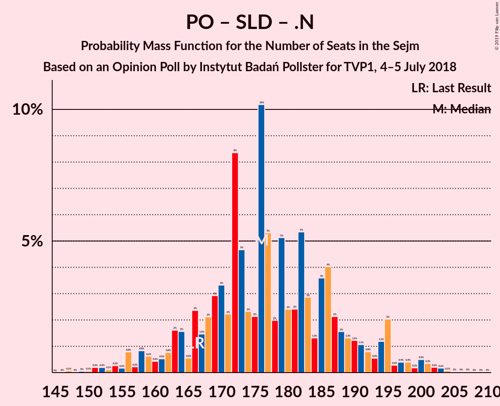
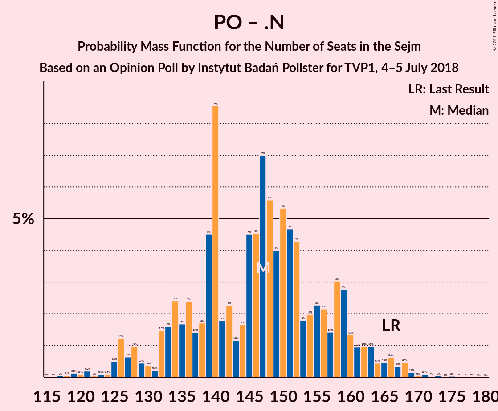

# Opinion Poll by Instytut Badań Pollster for TVP1, 4–5 July 2018

<a href="#voting-intentions">Voting Intentions</a> | <a href="#seats">Seats</a> | <a href="#coalitions">Coalitions</a> | <a href="#technical-information">Technical Information</a>

## Voting Intentions

### Confidence Intervals

| Party | Last Result | Poll Result | 80% Confidence Interval | 90% Confidence Interval | 95% Confidence Interval | 99% Confidence Interval |
|:-----:|:-----------:|:-----------:|:-----------------------:|:-----------------------:|:-----------------------:|:-----------------------:|
| Prawo i Sprawiedliwość | 37.6% | 42.0% | 40.1–44.0% |39.6–44.6% |39.1–45.1% |38.2–46.0% |
| Platforma Obywatelska | 24.1% | 26.0% | 24.4–27.8% |23.9–28.3% |23.5–28.8% |22.7–29.6% |
| Kukiz’15 | 8.8% | 8.0% | 7.0–9.1% |6.7–9.5% |6.5–9.8% |6.0–10.3% |
| Sojusz Lewicy Demokratycznej | 7.6% | 8.0% | 7.0–9.1% |6.7–9.5% |6.5–9.8% |6.0–10.3% |
| .Nowoczesna | 7.6% | 5.0% | 4.3–6.0% |4.0–6.3% |3.9–6.5% |3.5–7.0% |
| Polskie Stronnictwo Ludowe | 5.1% | 5.0% | 4.3–6.0% |4.0–6.3% |3.9–6.5% |3.5–7.0% |

*Note:* The poll result column reflects the actual value used in the calculations. Published results may vary slightly, and in addition be rounded to fewer digits.

## Seats

### Confidence Intervals

| Party | Last Result | Median | 80% Confidence Interval | 90% Confidence Interval | 95% Confidence Interval | 99% Confidence Interval |
|:-----:|:-----------:|:------:|:-----------------------:|:-----------------------:|:-----------------------:|:-----------------------:|
| <a href="#prawo-i-sprawiedliwość">Prawo i Sprawiedliwość</a> | 235 | 230 | 225–230 |225–235 |225–235 |225–248 |
| <a href="#platforma-obywatelska">Platforma Obywatelska</a> | 138 | 140 | 131–141 |131–142 |131–142 |130–153 |
| <a href="#kukiz’15">Kukiz’15</a> | 42 | 29 | 29–42 |29–42 |28–42 |9–42 |
| <a href="#sojusz-lewicy-demokratycznej">Sojusz Lewicy Demokratycznej</a> | 0 | 30 | 29–30 |29–41 |29–41 |20–41 |
| <a href="#.nowoczesna">.Nowoczesna</a> | 28 | 12 | 11–12 |11–14 |11–14 |0–15 |
| <a href="#polskie-stronnictwo-ludowe">Polskie Stronnictwo Ludowe</a> | 16 | 19 | 19–22 |0–22 |0–22 |0–26 |

### Prawo i Sprawiedliwość

*For a full overview of the results for this party, see the [Prawo i Sprawiedliwość](party-prawoisprawiedliwość.html) page.*

| Number of Seats | Probability | Accumulated | Special Marks |
|:---------------:|:-----------:|:-----------:|:-------------:|
| 221 | 0.1% | 100% |  |
| 222 | 0% | 99.9% |  |
| 223 | 0% | 99.9% |  |
| 224 | 0% | 99.9% |  |
| 225 | 12% | 99.9% |  |
| 226 | 0.7% | 88% |  |
| 227 | 0% | 87% |  |
| 228 | 0% | 87% |  |
| 229 | 8% | 87% |  |
| 230 | 70% | 79% | Median |
| 231 | 3% | 10% | Majority |
| 232 | 0.1% | 7% |  |
| 233 | 0.5% | 7% |  |
| 234 | 0.4% | 6% |  |
| 235 | 4% | 6% | Last Result |
| 236 | 1.3% | 2% |  |
| 237 | 0% | 0.8% |  |
| 238 | 0% | 0.7% |  |
| 239 | 0% | 0.7% |  |
| 240 | 0% | 0.7% |  |
| 241 | 0% | 0.7% |  |
| 242 | 0% | 0.7% |  |
| 243 | 0% | 0.7% |  |
| 244 | 0% | 0.7% |  |
| 245 | 0.1% | 0.7% |  |
| 246 | 0% | 0.6% |  |
| 247 | 0% | 0.6% |  |
| 248 | 0.1% | 0.6% |  |
| 249 | 0% | 0.4% |  |
| 250 | 0% | 0.4% |  |
| 251 | 0% | 0.4% |  |
| 252 | 0.1% | 0.4% |  |
| 253 | 0.3% | 0.3% |  |
| 254 | 0% | 0% |  |

### Platforma Obywatelska

*For a full overview of the results for this party, see the [Platforma Obywatelska](party-platformaobywatelska.html) page.*

| Number of Seats | Probability | Accumulated | Special Marks |
|:---------------:|:-----------:|:-----------:|:-------------:|
| 130 | 0.9% | 100% |  |
| 131 | 12% | 99.1% |  |
| 132 | 0% | 87% |  |
| 133 | 2% | 87% |  |
| 134 | 0.1% | 85% |  |
| 135 | 0% | 85% |  |
| 136 | 0% | 85% |  |
| 137 | 0% | 85% |  |
| 138 | 4% | 85% | Last Result |
| 139 | 1.4% | 81% |  |
| 140 | 43% | 80% | Median |
| 141 | 28% | 37% |  |
| 142 | 8% | 10% |  |
| 143 | 0% | 2% |  |
| 144 | 0.1% | 2% |  |
| 145 | 0.5% | 2% |  |
| 146 | 0% | 1.0% |  |
| 147 | 0% | 1.0% |  |
| 148 | 0.3% | 1.0% |  |
| 149 | 0% | 0.7% |  |
| 150 | 0% | 0.7% |  |
| 151 | 0.1% | 0.7% |  |
| 152 | 0% | 0.6% |  |
| 153 | 0.2% | 0.6% |  |
| 154 | 0.2% | 0.4% |  |
| 155 | 0% | 0.2% |  |
| 156 | 0% | 0.2% |  |
| 157 | 0% | 0.2% |  |
| 158 | 0.2% | 0.2% |  |
| 159 | 0% | 0% |  |

### Kukiz’15

*For a full overview of the results for this party, see the [Kukiz’15](party-kukiz’15.html) page.*

| Number of Seats | Probability | Accumulated | Special Marks |
|:---------------:|:-----------:|:-----------:|:-------------:|
| 7 | 0.3% | 100% |  |
| 8 | 0.1% | 99.7% |  |
| 9 | 0.1% | 99.5% |  |
| 10 | 0% | 99.4% |  |
| 11 | 0% | 99.4% |  |
| 12 | 0% | 99.4% |  |
| 13 | 0% | 99.4% |  |
| 14 | 0% | 99.4% |  |
| 15 | 0% | 99.4% |  |
| 16 | 0% | 99.4% |  |
| 17 | 0% | 99.4% |  |
| 18 | 0% | 99.4% |  |
| 19 | 0% | 99.4% |  |
| 20 | 0% | 99.4% |  |
| 21 | 0% | 99.4% |  |
| 22 | 0% | 99.4% |  |
| 23 | 0% | 99.4% |  |
| 24 | 0.1% | 99.4% |  |
| 25 | 0.3% | 99.3% |  |
| 26 | 0% | 99.0% |  |
| 27 | 0% | 99.0% |  |
| 28 | 3% | 99.0% |  |
| 29 | 76% | 96% | Median |
| 30 | 1.4% | 20% |  |
| 31 | 0% | 19% |  |
| 32 | 4% | 19% |  |
| 33 | 0% | 15% |  |
| 34 | 0% | 15% |  |
| 35 | 0% | 15% |  |
| 36 | 0% | 15% |  |
| 37 | 0% | 15% |  |
| 38 | 0% | 15% |  |
| 39 | 0% | 15% |  |
| 40 | 0% | 15% |  |
| 41 | 0.7% | 15% |  |
| 42 | 14% | 14% | Last Result |
| 43 | 0.2% | 0.3% |  |
| 44 | 0% | 0.1% |  |
| 45 | 0% | 0.1% |  |
| 46 | 0% | 0.1% |  |
| 47 | 0% | 0.1% |  |
| 48 | 0% | 0.1% |  |
| 49 | 0.1% | 0.1% |  |
| 50 | 0% | 0% |  |

### Sojusz Lewicy Demokratycznej

*For a full overview of the results for this party, see the [Sojusz Lewicy Demokratycznej](party-sojuszlewicydemokratycznej.html) page.*

| Number of Seats | Probability | Accumulated | Special Marks |
|:---------------:|:-----------:|:-----------:|:-------------:|
| 0 | 0% | 100% | Last Result |
| 1 | 0% | 100% |  |
| 2 | 0% | 100% |  |
| 3 | 0% | 100% |  |
| 4 | 0% | 100% |  |
| 5 | 0% | 100% |  |
| 6 | 0% | 100% |  |
| 7 | 0% | 100% |  |
| 8 | 0% | 100% |  |
| 9 | 0% | 100% |  |
| 10 | 0% | 100% |  |
| 11 | 0% | 100% |  |
| 12 | 0% | 100% |  |
| 13 | 0% | 100% |  |
| 14 | 0% | 100% |  |
| 15 | 0.1% | 100% |  |
| 16 | 0% | 99.9% |  |
| 17 | 0% | 99.9% |  |
| 18 | 0% | 99.9% |  |
| 19 | 0.3% | 99.9% |  |
| 20 | 0.5% | 99.5% |  |
| 21 | 0% | 99.1% |  |
| 22 | 0.1% | 99.1% |  |
| 23 | 0% | 99.0% |  |
| 24 | 0% | 99.0% |  |
| 25 | 0% | 99.0% |  |
| 26 | 0% | 99.0% |  |
| 27 | 0.1% | 99.0% |  |
| 28 | 0.2% | 98.9% |  |
| 29 | 40% | 98.8% |  |
| 30 | 52% | 59% | Median |
| 31 | 0.1% | 8% |  |
| 32 | 0% | 8% |  |
| 33 | 0% | 8% |  |
| 34 | 0% | 8% |  |
| 35 | 0.1% | 8% |  |
| 36 | 0.3% | 7% |  |
| 37 | 0% | 7% |  |
| 38 | 0.1% | 7% |  |
| 39 | 0.1% | 7% |  |
| 40 | 2% | 7% |  |
| 41 | 5% | 5% |  |
| 42 | 0% | 0.2% |  |
| 43 | 0% | 0.2% |  |
| 44 | 0% | 0.2% |  |
| 45 | 0.1% | 0.2% |  |
| 46 | 0.1% | 0.1% |  |
| 47 | 0% | 0% |  |

### .Nowoczesna

*For a full overview of the results for this party, see the [.Nowoczesna](party-nowoczesna.html) page.*

| Number of Seats | Probability | Accumulated | Special Marks |
|:---------------:|:-----------:|:-----------:|:-------------:|
| 0 | 0.5% | 100% |  |
| 1 | 0% | 99.5% |  |
| 2 | 0% | 99.5% |  |
| 3 | 0% | 99.5% |  |
| 4 | 0% | 99.5% |  |
| 5 | 0% | 99.5% |  |
| 6 | 0% | 99.5% |  |
| 7 | 0.5% | 99.5% |  |
| 8 | 0.4% | 98.9% |  |
| 9 | 0.1% | 98.5% |  |
| 10 | 0% | 98% |  |
| 11 | 21% | 98% |  |
| 12 | 71% | 77% | Median |
| 13 | 0% | 7% |  |
| 14 | 5% | 7% |  |
| 15 | 2% | 2% |  |
| 16 | 0% | 0% |  |
| 17 | 0% | 0% |  |
| 18 | 0% | 0% |  |
| 19 | 0% | 0% |  |
| 20 | 0% | 0% |  |
| 21 | 0% | 0% |  |
| 22 | 0% | 0% |  |
| 23 | 0% | 0% |  |
| 24 | 0% | 0% |  |
| 25 | 0% | 0% |  |
| 26 | 0% | 0% |  |
| 27 | 0% | 0% |  |
| 28 | 0% | 0% | Last Result |

### Polskie Stronnictwo Ludowe

*For a full overview of the results for this party, see the [Polskie Stronnictwo Ludowe](party-polskiestronnictwoludowe.html) page.*

| Number of Seats | Probability | Accumulated | Special Marks |
|:---------------:|:-----------:|:-----------:|:-------------:|
| 0 | 7% | 100% |  |
| 1 | 0% | 93% |  |
| 2 | 0% | 93% |  |
| 3 | 0% | 93% |  |
| 4 | 0% | 93% |  |
| 5 | 0% | 93% |  |
| 6 | 0% | 93% |  |
| 7 | 0% | 93% |  |
| 8 | 0% | 93% |  |
| 9 | 0% | 93% |  |
| 10 | 0% | 93% |  |
| 11 | 0% | 93% |  |
| 12 | 0% | 92% |  |
| 13 | 0.1% | 92% |  |
| 14 | 0% | 92% |  |
| 15 | 0% | 92% |  |
| 16 | 0% | 92% | Last Result |
| 17 | 0% | 92% |  |
| 18 | 0.2% | 92% |  |
| 19 | 78% | 92% | Median |
| 20 | 0.1% | 14% |  |
| 21 | 0% | 14% |  |
| 22 | 13% | 14% |  |
| 23 | 0% | 0.9% |  |
| 24 | 0% | 0.9% |  |
| 25 | 0% | 0.9% |  |
| 26 | 0.9% | 0.9% |  |
| 27 | 0.1% | 0.1% |  |
| 28 | 0% | 0% |  |

## Coalitions

### Confidence Intervals

| Coalition | Last Result | Median | Majority? | 80% Confidence Interval | 90% Confidence Interval | 95% Confidence Interval | 99% Confidence Interval |
|:---------:|:-----------:|:------:|:---------:|:-----------------------:|:-----------------------:|:-----------------------:|:-----------------------:|
| Prawo i Sprawiedliwość | 235 | 230 | 10% | 225–230 | 225–235 | 225–235 | 225–248 |
| Platforma Obywatelska – Sojusz Lewicy Demokratycznej – .Nowoczesna – Polskie Stronnictwo Ludowe | 182 | 201 | 0% | 193–201 | 193–202 | 193–202 | 188–202 |
| Platforma Obywatelska – Sojusz Lewicy Demokratycznej – .Nowoczesna | 166 | 182 | 0% | 171–183 | 171–193 | 171–193 | 171–194 |
| Platforma Obywatelska – .Nowoczesna – Polskie Stronnictwo Ludowe | 182 | 171 | 0% | 164–172 | 152–172 | 152–172 | 148–178 |
| Platforma Obywatelska – .Nowoczesna | 166 | 152 | 0% | 142–153 | 142–153 | 142–153 | 141–158 |
| Platforma Obywatelska | 138 | 140 | 0% | 131–141 | 131–142 | 131–142 | 130–153 |

### Prawo i Sprawiedliwość

| Number of Seats | Probability | Accumulated | Special Marks |
|:---------------:|:-----------:|:-----------:|:-------------:|
| 221 | 0.1% | 100% |  |
| 222 | 0% | 99.9% |  |
| 223 | 0% | 99.9% |  |
| 224 | 0% | 99.9% |  |
| 225 | 12% | 99.9% |  |
| 226 | 0.7% | 88% |  |
| 227 | 0% | 87% |  |
| 228 | 0% | 87% |  |
| 229 | 8% | 87% |  |
| 230 | 70% | 79% | Median |
| 231 | 3% | 10% | Majority |
| 232 | 0.1% | 7% |  |
| 233 | 0.5% | 7% |  |
| 234 | 0.4% | 6% |  |
| 235 | 4% | 6% | Last Result |
| 236 | 1.3% | 2% |  |
| 237 | 0% | 0.8% |  |
| 238 | 0% | 0.7% |  |
| 239 | 0% | 0.7% |  |
| 240 | 0% | 0.7% |  |
| 241 | 0% | 0.7% |  |
| 242 | 0% | 0.7% |  |
| 243 | 0% | 0.7% |  |
| 244 | 0% | 0.7% |  |
| 245 | 0.1% | 0.7% |  |
| 246 | 0% | 0.6% |  |
| 247 | 0% | 0.6% |  |
| 248 | 0.1% | 0.6% |  |
| 249 | 0% | 0.4% |  |
| 250 | 0% | 0.4% |  |
| 251 | 0% | 0.4% |  |
| 252 | 0.1% | 0.4% |  |
| 253 | 0.3% | 0.3% |  |
| 254 | 0% | 0% |  |

### Platforma Obywatelska – Sojusz Lewicy Demokratycznej – .Nowoczesna – Polskie Stronnictwo Ludowe

| Number of Seats | Probability | Accumulated | Special Marks |
|:---------------:|:-----------:|:-----------:|:-------------:|
| 166 | 0.1% | 100% |  |
| 167 | 0% | 99.9% |  |
| 168 | 0% | 99.9% |  |
| 169 | 0% | 99.9% |  |
| 170 | 0% | 99.9% |  |
| 171 | 0% | 99.9% |  |
| 172 | 0% | 99.9% |  |
| 173 | 0% | 99.9% |  |
| 174 | 0% | 99.9% |  |
| 175 | 0% | 99.9% |  |
| 176 | 0% | 99.9% |  |
| 177 | 0% | 99.9% |  |
| 178 | 0% | 99.9% |  |
| 179 | 0% | 99.9% |  |
| 180 | 0% | 99.9% |  |
| 181 | 0% | 99.9% |  |
| 182 | 0% | 99.9% | Last Result |
| 183 | 0% | 99.8% |  |
| 184 | 0% | 99.8% |  |
| 185 | 0% | 99.8% |  |
| 186 | 0.1% | 99.8% |  |
| 187 | 0% | 99.8% |  |
| 188 | 2% | 99.7% |  |
| 189 | 0% | 98% |  |
| 190 | 0% | 98% |  |
| 191 | 0% | 98% |  |
| 192 | 0% | 98% |  |
| 193 | 16% | 98% |  |
| 194 | 1.3% | 81% |  |
| 195 | 0% | 80% |  |
| 196 | 0.1% | 80% |  |
| 197 | 0% | 80% |  |
| 198 | 0.5% | 80% |  |
| 199 | 0.2% | 79% |  |
| 200 | 0.3% | 79% |  |
| 201 | 71% | 79% | Median |
| 202 | 8% | 8% |  |
| 203 | 0% | 0.2% |  |
| 204 | 0.2% | 0.2% |  |
| 205 | 0% | 0% |  |

### Platforma Obywatelska – Sojusz Lewicy Demokratycznej – .Nowoczesna

| Number of Seats | Probability | Accumulated | Special Marks |
|:---------------:|:-----------:|:-----------:|:-------------:|
| 161 | 0% | 100% |  |
| 162 | 0% | 99.9% |  |
| 163 | 0% | 99.9% |  |
| 164 | 0% | 99.9% |  |
| 165 | 0% | 99.9% |  |
| 166 | 0.1% | 99.9% | Last Result |
| 167 | 0% | 99.9% |  |
| 168 | 0% | 99.9% |  |
| 169 | 0% | 99.9% |  |
| 170 | 0% | 99.9% |  |
| 171 | 13% | 99.9% |  |
| 172 | 0.5% | 87% |  |
| 173 | 0.1% | 87% |  |
| 174 | 0% | 87% |  |
| 175 | 0.3% | 87% |  |
| 176 | 0% | 86% |  |
| 177 | 0% | 86% |  |
| 178 | 0% | 86% |  |
| 179 | 0% | 86% |  |
| 180 | 0% | 86% |  |
| 181 | 0.1% | 86% |  |
| 182 | 70% | 86% | Median |
| 183 | 8% | 16% |  |
| 184 | 0% | 8% |  |
| 185 | 0% | 8% |  |
| 186 | 0.3% | 8% |  |
| 187 | 0% | 7% |  |
| 188 | 2% | 7% |  |
| 189 | 0% | 5% |  |
| 190 | 0% | 5% |  |
| 191 | 0% | 5% |  |
| 192 | 0% | 5% |  |
| 193 | 4% | 5% |  |
| 194 | 1.3% | 2% |  |
| 195 | 0% | 0.4% |  |
| 196 | 0% | 0.4% |  |
| 197 | 0% | 0.4% |  |
| 198 | 0% | 0.4% |  |
| 199 | 0.1% | 0.4% |  |
| 200 | 0.3% | 0.3% |  |
| 201 | 0% | 0% |  |

### Platforma Obywatelska – .Nowoczesna – Polskie Stronnictwo Ludowe

| Number of Seats | Probability | Accumulated | Special Marks |
|:---------------:|:-----------:|:-----------:|:-------------:|
| 140 | 0.1% | 100% |  |
| 141 | 0% | 99.9% |  |
| 142 | 0% | 99.9% |  |
| 143 | 0% | 99.9% |  |
| 144 | 0% | 99.9% |  |
| 145 | 0% | 99.9% |  |
| 146 | 0% | 99.9% |  |
| 147 | 0.2% | 99.9% |  |
| 148 | 2% | 99.6% |  |
| 149 | 0.1% | 98% |  |
| 150 | 0% | 98% |  |
| 151 | 0.1% | 98% |  |
| 152 | 4% | 98% |  |
| 153 | 1.2% | 94% |  |
| 154 | 0.1% | 93% |  |
| 155 | 0% | 93% |  |
| 156 | 0% | 93% |  |
| 157 | 0% | 93% |  |
| 158 | 0% | 93% |  |
| 159 | 0% | 93% |  |
| 160 | 0% | 93% |  |
| 161 | 0% | 93% |  |
| 162 | 0% | 93% |  |
| 163 | 0.9% | 93% |  |
| 164 | 12% | 92% |  |
| 165 | 0.1% | 80% |  |
| 166 | 0% | 80% |  |
| 167 | 0% | 80% |  |
| 168 | 0% | 80% |  |
| 169 | 0% | 80% |  |
| 170 | 0.1% | 80% |  |
| 171 | 43% | 80% | Median |
| 172 | 36% | 37% |  |
| 173 | 0.1% | 1.2% |  |
| 174 | 0% | 1.1% |  |
| 175 | 0% | 1.1% |  |
| 176 | 0.1% | 1.1% |  |
| 177 | 0.1% | 0.9% |  |
| 178 | 0.5% | 0.8% |  |
| 179 | 0% | 0.3% |  |
| 180 | 0% | 0.3% |  |
| 181 | 0% | 0.3% |  |
| 182 | 0.3% | 0.3% | Last Result |
| 183 | 0% | 0% |  |

### Platforma Obywatelska – .Nowoczesna

| Number of Seats | Probability | Accumulated | Special Marks |
|:---------------:|:-----------:|:-----------:|:-------------:|
| 138 | 0.1% | 100% |  |
| 139 | 0% | 99.9% |  |
| 140 | 0.1% | 99.9% |  |
| 141 | 0.9% | 99.8% |  |
| 142 | 12% | 98.9% |  |
| 143 | 0% | 87% |  |
| 144 | 0% | 87% |  |
| 145 | 0% | 87% |  |
| 146 | 0% | 87% |  |
| 147 | 0.2% | 87% |  |
| 148 | 2% | 87% |  |
| 149 | 0.1% | 85% |  |
| 150 | 0.1% | 85% |  |
| 151 | 0.1% | 85% |  |
| 152 | 47% | 85% | Median |
| 153 | 37% | 38% |  |
| 154 | 0.2% | 1.1% |  |
| 155 | 0% | 0.9% |  |
| 156 | 0.3% | 0.9% |  |
| 157 | 0% | 0.6% |  |
| 158 | 0.2% | 0.6% |  |
| 159 | 0% | 0.4% |  |
| 160 | 0% | 0.4% |  |
| 161 | 0% | 0.4% |  |
| 162 | 0% | 0.4% |  |
| 163 | 0.1% | 0.4% |  |
| 164 | 0.2% | 0.3% |  |
| 165 | 0.1% | 0.1% |  |
| 166 | 0% | 0% | Last Result |

### Platforma Obywatelska

| Number of Seats | Probability | Accumulated | Special Marks |
|:---------------:|:-----------:|:-----------:|:-------------:|
| 130 | 0.9% | 100% |  |
| 131 | 12% | 99.1% |  |
| 132 | 0% | 87% |  |
| 133 | 2% | 87% |  |
| 134 | 0.1% | 85% |  |
| 135 | 0% | 85% |  |
| 136 | 0% | 85% |  |
| 137 | 0% | 85% |  |
| 138 | 4% | 85% | Last Result |
| 139 | 1.4% | 81% |  |
| 140 | 43% | 80% | Median |
| 141 | 28% | 37% |  |
| 142 | 8% | 10% |  |
| 143 | 0% | 2% |  |
| 144 | 0.1% | 2% |  |
| 145 | 0.5% | 2% |  |
| 146 | 0% | 1.0% |  |
| 147 | 0% | 1.0% |  |
| 148 | 0.3% | 1.0% |  |
| 149 | 0% | 0.7% |  |
| 150 | 0% | 0.7% |  |
| 151 | 0.1% | 0.7% |  |
| 152 | 0% | 0.6% |  |
| 153 | 0.2% | 0.6% |  |
| 154 | 0.2% | 0.4% |  |
| 155 | 0% | 0.2% |  |
| 156 | 0% | 0.2% |  |
| 157 | 0% | 0.2% |  |
| 158 | 0.2% | 0.2% |  |
| 159 | 0% | 0% |  |

## Technical Information

### Opinion Poll

+ **Polling firm:** Instytut Badań Pollster
+ **Commissioner(s):** TVP1
+ **Fieldwork period:** 4–5 July 2018

### Calculations

+ **Sample size:** 1056
+ **Simulations done:** 1,024
+ **Error estimate:** 1.63%

