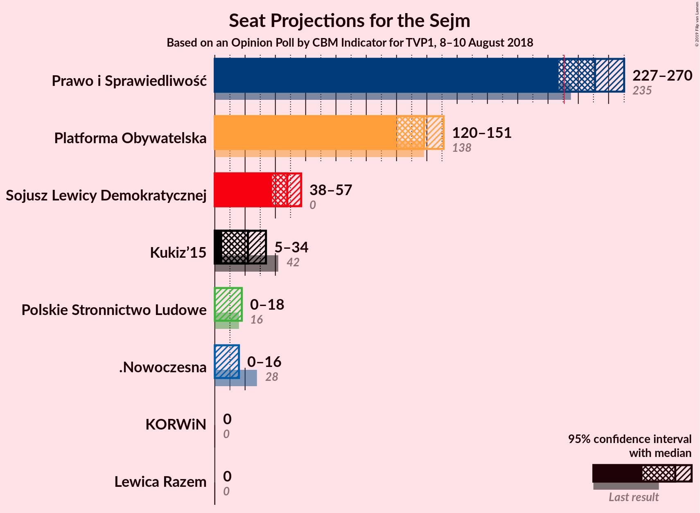
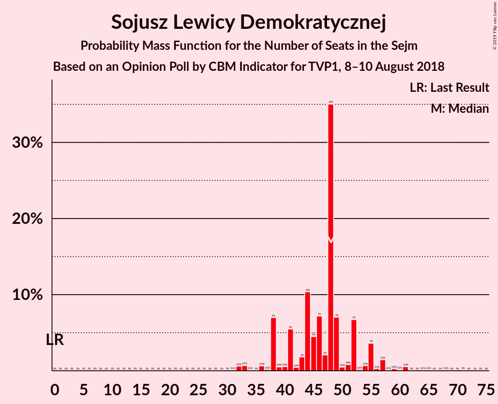
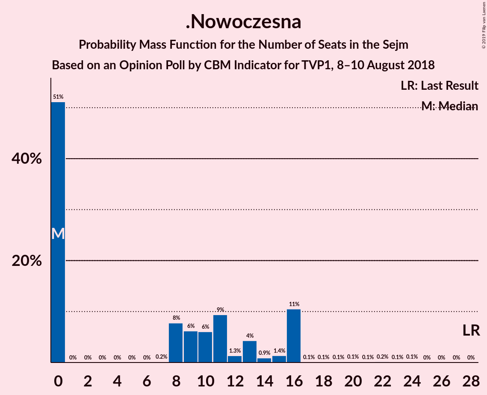

# Opinion Poll by CBM Indicator for TVP1, 8–10 August 2018

<a href="#voting-intentions">Voting Intentions</a> | <a href="#seats">Seats</a> | <a href="#coalitions">Coalitions</a> | <a href="#technical-information">Technical Information</a>

## Voting Intentions

### Confidence Intervals

| Party | Last Result | Poll Result | 80% Confidence Interval | 90% Confidence Interval | 95% Confidence Interval | 99% Confidence Interval |
|:-----:|:-----------:|:-----------:|:-----------------------:|:-----------------------:|:-----------------------:|:-----------------------:|
| Prawo i Sprawiedliwość | 37.6% | 42.0% | 40.0–44.0% |39.5–44.6% |39.0–45.1% |38.0–46.1% |
| Platforma Obywatelska | 24.1% | 24.6% | 22.9–26.4% |22.4–26.9% |22.0–27.4% |21.2–28.3% |
| Sojusz Lewicy Demokratycznej | 7.6% | 10.6% | 9.4–11.9% |9.1–12.3% |8.8–12.7% |8.3–13.3% |
| Kukiz’15 | 8.8% | 6.3% | 5.4–7.4% |5.2–7.7% |5.0–8.0% |4.6–8.6% |
| .Nowoczesna | 7.6% | 5.2% | 4.4–6.2% |4.2–6.5% |4.0–6.8% |3.6–7.3% |
| Polskie Stronnictwo Ludowe | 5.1% | 4.6% | 3.9–5.6% |3.6–5.9% |3.5–6.1% |3.1–6.6% |
| Lewica Razem | 3.6% | 3.5% | 2.9–4.4% |2.7–4.6% |2.5–4.8% |2.2–5.3% |
| KORWiN | 4.8% | 3.1% | 2.5–3.9% |2.3–4.2% |2.2–4.4% |1.9–4.8% |

*Note:* The poll result column reflects the actual value used in the calculations. Published results may vary slightly, and in addition be rounded to fewer digits.

## Seats

### Confidence Intervals

| Party | Last Result | Median | 80% Confidence Interval | 90% Confidence Interval | 95% Confidence Interval | 99% Confidence Interval |
|:-----:|:-----------:|:------:|:-----------------------:|:-----------------------:|:-----------------------:|:-----------------------:|
| <a href="#prawo-i-sprawiedliwość">Prawo i Sprawiedliwość</a> | 235 | 251 | 232–259 |232–261 |227–270 |221–275 |
| <a href="#platforma-obywatelska">Platforma Obywatelska</a> | 138 | 138 | 123–142 |121–150 |120–151 |115–155 |
| <a href="#sojusz-lewicy-demokratycznej">Sojusz Lewicy Demokratycznej</a> | 0 | 48 | 40–52 |38–55 |38–57 |32–61 |
| <a href="#kukiz’15">Kukiz’15</a> | 42 | 22 | 10–33 |7–34 |5–34 |0–37 |
| <a href="#.nowoczesna">.Nowoczesna</a> | 28 | 0 | 0–16 |0–16 |0–16 |0–20 |
| <a href="#polskie-stronnictwo-ludowe">Polskie Stronnictwo Ludowe</a> | 16 | 0 | 0–15 |0–16 |0–18 |0–23 |
| <a href="#lewica-razem">Lewica Razem</a> | 0 | 0 | 0 |0 |0 |0–3 |
| <a href="#korwin">KORWiN</a> | 0 | 0 | 0 |0 |0 |0 |

### Prawo i Sprawiedliwość

*For a full overview of the results for this party, see the [Prawo i Sprawiedliwość](party-prawoisprawiedliwość.html) page.*

| Number of Seats | Probability | Accumulated | Special Marks |
|:---------------:|:-----------:|:-----------:|:-------------:|
| 217 | 0% | 100% |  |
| 218 | 0.1% | 99.9% |  |
| 219 | 0.1% | 99.8% |  |
| 220 | 0.2% | 99.7% |  |
| 221 | 0.2% | 99.6% |  |
| 222 | 0.6% | 99.4% |  |
| 223 | 0.2% | 98.8% |  |
| 224 | 0.1% | 98.5% |  |
| 225 | 0.2% | 98% |  |
| 226 | 0.2% | 98% |  |
| 227 | 2% | 98% |  |
| 228 | 0.1% | 96% |  |
| 229 | 0.1% | 96% |  |
| 230 | 0.1% | 96% |  |
| 231 | 0.4% | 96% | Majority |
| 232 | 6% | 96% |  |
| 233 | 0.1% | 90% |  |
| 234 | 0.2% | 90% |  |
| 235 | 0.3% | 89% | Last Result |
| 236 | 0.1% | 89% |  |
| 237 | 2% | 89% |  |
| 238 | 0.1% | 87% |  |
| 239 | 0.3% | 87% |  |
| 240 | 0.1% | 87% |  |
| 241 | 0.7% | 87% |  |
| 242 | 0.2% | 86% |  |
| 243 | 3% | 86% |  |
| 244 | 0.1% | 83% |  |
| 245 | 0.2% | 83% |  |
| 246 | 5% | 83% |  |
| 247 | 6% | 78% |  |
| 248 | 4% | 72% |  |
| 249 | 8% | 68% |  |
| 250 | 0.8% | 60% |  |
| 251 | 34% | 59% | Median |
| 252 | 0.3% | 25% |  |
| 253 | 7% | 25% |  |
| 254 | 0.7% | 18% |  |
| 255 | 0.5% | 17% |  |
| 256 | 1.4% | 17% |  |
| 257 | 0.6% | 15% |  |
| 258 | 0.2% | 15% |  |
| 259 | 6% | 15% |  |
| 260 | 0.1% | 8% |  |
| 261 | 5% | 8% |  |
| 262 | 0.2% | 4% |  |
| 263 | 0% | 3% |  |
| 264 | 0% | 3% |  |
| 265 | 0% | 3% |  |
| 266 | 0.1% | 3% |  |
| 267 | 0.7% | 3% |  |
| 268 | 0% | 3% |  |
| 269 | 0% | 3% |  |
| 270 | 0.3% | 3% |  |
| 271 | 1.3% | 2% |  |
| 272 | 0.1% | 0.9% |  |
| 273 | 0% | 0.8% |  |
| 274 | 0.2% | 0.8% |  |
| 275 | 0.1% | 0.6% |  |
| 276 | 0% | 0.5% |  |
| 277 | 0.4% | 0.5% |  |
| 278 | 0% | 0% |  |

### Platforma Obywatelska

*For a full overview of the results for this party, see the [Platforma Obywatelska](party-platformaobywatelska.html) page.*

| Number of Seats | Probability | Accumulated | Special Marks |
|:---------------:|:-----------:|:-----------:|:-------------:|
| 107 | 0% | 100% |  |
| 108 | 0% | 99.9% |  |
| 109 | 0% | 99.9% |  |
| 110 | 0.1% | 99.9% |  |
| 111 | 0% | 99.8% |  |
| 112 | 0% | 99.8% |  |
| 113 | 0% | 99.8% |  |
| 114 | 0.1% | 99.8% |  |
| 115 | 0.2% | 99.7% |  |
| 116 | 0.1% | 99.4% |  |
| 117 | 0.2% | 99.3% |  |
| 118 | 0.1% | 99.2% |  |
| 119 | 0.8% | 99.0% |  |
| 120 | 3% | 98% |  |
| 121 | 1.1% | 95% |  |
| 122 | 0.3% | 94% |  |
| 123 | 7% | 94% |  |
| 124 | 0.2% | 87% |  |
| 125 | 4% | 87% |  |
| 126 | 0.7% | 83% |  |
| 127 | 9% | 82% |  |
| 128 | 0.1% | 73% |  |
| 129 | 4% | 73% |  |
| 130 | 0.3% | 69% |  |
| 131 | 0.2% | 69% |  |
| 132 | 0.4% | 69% |  |
| 133 | 0.5% | 69% |  |
| 134 | 3% | 68% |  |
| 135 | 0% | 65% |  |
| 136 | 2% | 65% |  |
| 137 | 7% | 63% |  |
| 138 | 40% | 56% | Last Result, Median |
| 139 | 0.6% | 16% |  |
| 140 | 0.9% | 16% |  |
| 141 | 4% | 15% |  |
| 142 | 0.8% | 11% |  |
| 143 | 0.1% | 10% |  |
| 144 | 0.2% | 10% |  |
| 145 | 0.1% | 10% |  |
| 146 | 0.2% | 9% |  |
| 147 | 0.2% | 9% |  |
| 148 | 0.2% | 9% |  |
| 149 | 3% | 9% |  |
| 150 | 1.0% | 6% |  |
| 151 | 3% | 5% |  |
| 152 | 0.1% | 2% |  |
| 153 | 0.5% | 2% |  |
| 154 | 0.3% | 1.0% |  |
| 155 | 0.6% | 0.8% |  |
| 156 | 0% | 0.2% |  |
| 157 | 0% | 0.2% |  |
| 158 | 0% | 0.2% |  |
| 159 | 0% | 0.1% |  |
| 160 | 0% | 0.1% |  |
| 161 | 0% | 0.1% |  |
| 162 | 0% | 0.1% |  |
| 163 | 0% | 0.1% |  |
| 164 | 0% | 0.1% |  |
| 165 | 0% | 0.1% |  |
| 166 | 0% | 0.1% |  |
| 167 | 0% | 0% |  |

### Sojusz Lewicy Demokratycznej

*For a full overview of the results for this party, see the [Sojusz Lewicy Demokratycznej](party-sojuszlewicydemokratycznej.html) page.*

| Number of Seats | Probability | Accumulated | Special Marks |
|:---------------:|:-----------:|:-----------:|:-------------:|
| 0 | 0% | 100% | Last Result |
| 1 | 0% | 100% |  |
| 2 | 0% | 100% |  |
| 3 | 0% | 100% |  |
| 4 | 0% | 100% |  |
| 5 | 0% | 100% |  |
| 6 | 0% | 100% |  |
| 7 | 0% | 100% |  |
| 8 | 0% | 100% |  |
| 9 | 0% | 100% |  |
| 10 | 0% | 100% |  |
| 11 | 0% | 100% |  |
| 12 | 0% | 100% |  |
| 13 | 0% | 100% |  |
| 14 | 0% | 100% |  |
| 15 | 0% | 100% |  |
| 16 | 0% | 100% |  |
| 17 | 0% | 100% |  |
| 18 | 0% | 100% |  |
| 19 | 0% | 100% |  |
| 20 | 0% | 100% |  |
| 21 | 0% | 100% |  |
| 22 | 0% | 100% |  |
| 23 | 0% | 100% |  |
| 24 | 0% | 100% |  |
| 25 | 0% | 100% |  |
| 26 | 0% | 100% |  |
| 27 | 0% | 100% |  |
| 28 | 0% | 100% |  |
| 29 | 0% | 100% |  |
| 30 | 0% | 100% |  |
| 31 | 0.1% | 100% |  |
| 32 | 0.6% | 99.9% |  |
| 33 | 0.7% | 99.3% |  |
| 34 | 0.1% | 98.6% |  |
| 35 | 0% | 98% |  |
| 36 | 0.6% | 98% |  |
| 37 | 0.2% | 98% |  |
| 38 | 7% | 98% |  |
| 39 | 0.5% | 91% |  |
| 40 | 0.5% | 90% |  |
| 41 | 5% | 90% |  |
| 42 | 0.4% | 84% |  |
| 43 | 2% | 84% |  |
| 44 | 10% | 82% |  |
| 45 | 4% | 72% |  |
| 46 | 7% | 67% |  |
| 47 | 2% | 60% |  |
| 48 | 35% | 58% | Median |
| 49 | 7% | 23% |  |
| 50 | 0.5% | 16% |  |
| 51 | 0.8% | 15% |  |
| 52 | 7% | 14% |  |
| 53 | 0.1% | 8% |  |
| 54 | 0.7% | 7% |  |
| 55 | 4% | 7% |  |
| 56 | 0.3% | 3% |  |
| 57 | 1.5% | 3% |  |
| 58 | 0.1% | 1.5% |  |
| 59 | 0.3% | 1.4% |  |
| 60 | 0.1% | 1.1% |  |
| 61 | 0.5% | 1.0% |  |
| 62 | 0% | 0.5% |  |
| 63 | 0% | 0.5% |  |
| 64 | 0.1% | 0.4% |  |
| 65 | 0.1% | 0.3% |  |
| 66 | 0% | 0.3% |  |
| 67 | 0% | 0.2% |  |
| 68 | 0.1% | 0.2% |  |
| 69 | 0% | 0.1% |  |
| 70 | 0% | 0.1% |  |
| 71 | 0% | 0.1% |  |
| 72 | 0% | 0.1% |  |
| 73 | 0% | 0% |  |

### Kukiz’15

*For a full overview of the results for this party, see the [Kukiz’15](party-kukiz’15.html) page.*

| Number of Seats | Probability | Accumulated | Special Marks |
|:---------------:|:-----------:|:-----------:|:-------------:|
| 0 | 1.4% | 100% |  |
| 1 | 0% | 98.6% |  |
| 2 | 0% | 98.6% |  |
| 3 | 0.2% | 98.6% |  |
| 4 | 0.3% | 98% |  |
| 5 | 3% | 98% |  |
| 6 | 0.2% | 95% |  |
| 7 | 0.3% | 95% |  |
| 8 | 0.5% | 95% |  |
| 9 | 1.3% | 94% |  |
| 10 | 3% | 93% |  |
| 11 | 0.4% | 89% |  |
| 12 | 14% | 89% |  |
| 13 | 3% | 75% |  |
| 14 | 0.1% | 72% |  |
| 15 | 1.0% | 72% |  |
| 16 | 6% | 71% |  |
| 17 | 4% | 64% |  |
| 18 | 1.0% | 60% |  |
| 19 | 2% | 59% |  |
| 20 | 1.3% | 57% |  |
| 21 | 1.0% | 56% |  |
| 22 | 6% | 55% | Median |
| 23 | 34% | 49% |  |
| 24 | 0.1% | 16% |  |
| 25 | 0.9% | 16% |  |
| 26 | 0.3% | 15% |  |
| 27 | 0.1% | 14% |  |
| 28 | 2% | 14% |  |
| 29 | 0.4% | 12% |  |
| 30 | 0.3% | 12% |  |
| 31 | 0.1% | 12% |  |
| 32 | 0.1% | 12% |  |
| 33 | 4% | 12% |  |
| 34 | 7% | 8% |  |
| 35 | 0.3% | 1.1% |  |
| 36 | 0.1% | 0.8% |  |
| 37 | 0.2% | 0.7% |  |
| 38 | 0.3% | 0.5% |  |
| 39 | 0.2% | 0.2% |  |
| 40 | 0% | 0.1% |  |
| 41 | 0% | 0% |  |
| 42 | 0% | 0% | Last Result |

### .Nowoczesna

*For a full overview of the results for this party, see the [.Nowoczesna](party-nowoczesna.html) page.*

| Number of Seats | Probability | Accumulated | Special Marks |
|:---------------:|:-----------:|:-----------:|:-------------:|
| 0 | 51% | 100% | Median |
| 1 | 0% | 49% |  |
| 2 | 0% | 49% |  |
| 3 | 0% | 49% |  |
| 4 | 0% | 49% |  |
| 5 | 0% | 49% |  |
| 6 | 0% | 49% |  |
| 7 | 0.2% | 49% |  |
| 8 | 8% | 49% |  |
| 9 | 6% | 41% |  |
| 10 | 6% | 35% |  |
| 11 | 9% | 29% |  |
| 12 | 1.3% | 19% |  |
| 13 | 4% | 18% |  |
| 14 | 0.9% | 14% |  |
| 15 | 1.4% | 13% |  |
| 16 | 11% | 11% |  |
| 17 | 0.1% | 0.8% |  |
| 18 | 0.1% | 0.8% |  |
| 19 | 0.1% | 0.7% |  |
| 20 | 0.1% | 0.6% |  |
| 21 | 0.1% | 0.5% |  |
| 22 | 0.2% | 0.4% |  |
| 23 | 0.1% | 0.2% |  |
| 24 | 0.1% | 0.2% |  |
| 25 | 0% | 0% |  |
| 26 | 0% | 0% |  |
| 27 | 0% | 0% |  |
| 28 | 0% | 0% | Last Result |

### Polskie Stronnictwo Ludowe

*For a full overview of the results for this party, see the [Polskie Stronnictwo Ludowe](party-polskiestronnictwoludowe.html) page.*

| Number of Seats | Probability | Accumulated | Special Marks |
|:---------------:|:-----------:|:-----------:|:-------------:|
| 0 | 77% | 100% | Median |
| 1 | 0% | 23% |  |
| 2 | 0% | 23% |  |
| 3 | 0% | 23% |  |
| 4 | 0% | 23% |  |
| 5 | 0% | 23% |  |
| 6 | 0% | 23% |  |
| 7 | 0% | 23% |  |
| 8 | 0% | 23% |  |
| 9 | 0% | 23% |  |
| 10 | 0% | 23% |  |
| 11 | 0% | 23% |  |
| 12 | 0.2% | 23% |  |
| 13 | 0.2% | 23% |  |
| 14 | 8% | 22% |  |
| 15 | 6% | 15% |  |
| 16 | 5% | 9% | Last Result |
| 17 | 0.2% | 3% |  |
| 18 | 0.8% | 3% |  |
| 19 | 0.4% | 2% |  |
| 20 | 0% | 2% |  |
| 21 | 0.3% | 2% |  |
| 22 | 0.5% | 2% |  |
| 23 | 1.0% | 1.1% |  |
| 24 | 0.1% | 0.1% |  |
| 25 | 0% | 0% |  |

### Lewica Razem

*For a full overview of the results for this party, see the [Lewica Razem](party-lewicarazem.html) page.*

| Number of Seats | Probability | Accumulated | Special Marks |
|:---------------:|:-----------:|:-----------:|:-------------:|
| 0 | 99.5% | 100% | Last Result, Median |
| 1 | 0% | 0.5% |  |
| 2 | 0% | 0.5% |  |
| 3 | 0.2% | 0.5% |  |
| 4 | 0% | 0.3% |  |
| 5 | 0.1% | 0.3% |  |
| 6 | 0.1% | 0.2% |  |
| 7 | 0.1% | 0.1% |  |
| 8 | 0% | 0.1% |  |
| 9 | 0% | 0.1% |  |
| 10 | 0% | 0.1% |  |
| 11 | 0% | 0% |  |

### KORWiN

*For a full overview of the results for this party, see the [KORWiN](party-korwin.html) page.*

| Number of Seats | Probability | Accumulated | Special Marks |
|:---------------:|:-----------:|:-----------:|:-------------:|
| 0 | 99.9% | 100% | Last Result, Median |
| 1 | 0% | 0.1% |  |
| 2 | 0% | 0.1% |  |
| 3 | 0% | 0.1% |  |
| 4 | 0% | 0.1% |  |
| 5 | 0.1% | 0.1% |  |
| 6 | 0% | 0% |  |

## Coalitions

### Confidence Intervals

| Coalition | Last Result | Median | Majority? | 80% Confidence Interval | 90% Confidence Interval | 95% Confidence Interval | 99% Confidence Interval |
|:---------:|:-----------:|:------:|:---------:|:-----------------------:|:-----------------------:|:-----------------------:|:-----------------------:|
| Prawo i Sprawiedliwość | 235 | 251 | 96% | 232–259 | 232–261 | 227–270 | 221–275 |
| Platforma Obywatelska – Sojusz Lewicy Demokratycznej – .Nowoczesna – Polskie Stronnictwo Ludowe – Lewica Razem | 182 | 186 | 0% | 179–212 | 177–212 | 175–212 | 168–228 |
| Platforma Obywatelska – Sojusz Lewicy Demokratycznej – .Nowoczesna – Polskie Stronnictwo Ludowe | 182 | 186 | 0% | 179–212 | 177–212 | 175–212 | 168–228 |
| Platforma Obywatelska – Sojusz Lewicy Demokratycznej – .Nowoczesna | 166 | 186 | 0% | 177–198 | 171–202 | 170–206 | 166–213 |
| Platforma Obywatelska – .Nowoczesna – Polskie Stronnictwo Ludowe | 182 | 138 | 0% | 131–163 | 130–165 | 129–174 | 121–181 |
| Platforma Obywatelska – .Nowoczesna | 166 | 138 | 0% | 129–154 | 129–158 | 127–158 | 119–166 |
| Platforma Obywatelska | 138 | 138 | 0% | 123–142 | 121–150 | 120–151 | 115–155 |

### Prawo i Sprawiedliwość

| Number of Seats | Probability | Accumulated | Special Marks |
|:---------------:|:-----------:|:-----------:|:-------------:|
| 217 | 0% | 100% |  |
| 218 | 0.1% | 99.9% |  |
| 219 | 0.1% | 99.8% |  |
| 220 | 0.2% | 99.7% |  |
| 221 | 0.2% | 99.6% |  |
| 222 | 0.6% | 99.4% |  |
| 223 | 0.2% | 98.8% |  |
| 224 | 0.1% | 98.5% |  |
| 225 | 0.2% | 98% |  |
| 226 | 0.2% | 98% |  |
| 227 | 2% | 98% |  |
| 228 | 0.1% | 96% |  |
| 229 | 0.1% | 96% |  |
| 230 | 0.1% | 96% |  |
| 231 | 0.4% | 96% | Majority |
| 232 | 6% | 96% |  |
| 233 | 0.1% | 90% |  |
| 234 | 0.2% | 90% |  |
| 235 | 0.3% | 89% | Last Result |
| 236 | 0.1% | 89% |  |
| 237 | 2% | 89% |  |
| 238 | 0.1% | 87% |  |
| 239 | 0.3% | 87% |  |
| 240 | 0.1% | 87% |  |
| 241 | 0.7% | 87% |  |
| 242 | 0.2% | 86% |  |
| 243 | 3% | 86% |  |
| 244 | 0.1% | 83% |  |
| 245 | 0.2% | 83% |  |
| 246 | 5% | 83% |  |
| 247 | 6% | 78% |  |
| 248 | 4% | 72% |  |
| 249 | 8% | 68% |  |
| 250 | 0.8% | 60% |  |
| 251 | 34% | 59% | Median |
| 252 | 0.3% | 25% |  |
| 253 | 7% | 25% |  |
| 254 | 0.7% | 18% |  |
| 255 | 0.5% | 17% |  |
| 256 | 1.4% | 17% |  |
| 257 | 0.6% | 15% |  |
| 258 | 0.2% | 15% |  |
| 259 | 6% | 15% |  |
| 260 | 0.1% | 8% |  |
| 261 | 5% | 8% |  |
| 262 | 0.2% | 4% |  |
| 263 | 0% | 3% |  |
| 264 | 0% | 3% |  |
| 265 | 0% | 3% |  |
| 266 | 0.1% | 3% |  |
| 267 | 0.7% | 3% |  |
| 268 | 0% | 3% |  |
| 269 | 0% | 3% |  |
| 270 | 0.3% | 3% |  |
| 271 | 1.3% | 2% |  |
| 272 | 0.1% | 0.9% |  |
| 273 | 0% | 0.8% |  |
| 274 | 0.2% | 0.8% |  |
| 275 | 0.1% | 0.6% |  |
| 276 | 0% | 0.5% |  |
| 277 | 0.4% | 0.5% |  |
| 278 | 0% | 0% |  |

### Platforma Obywatelska – Sojusz Lewicy Demokratycznej – .Nowoczesna – Polskie Stronnictwo Ludowe – Lewica Razem

| Number of Seats | Probability | Accumulated | Special Marks |
|:---------------:|:-----------:|:-----------:|:-------------:|
| 155 | 0.1% | 100% |  |
| 156 | 0% | 99.9% |  |
| 157 | 0% | 99.9% |  |
| 158 | 0% | 99.9% |  |
| 159 | 0% | 99.9% |  |
| 160 | 0% | 99.9% |  |
| 161 | 0% | 99.9% |  |
| 162 | 0% | 99.9% |  |
| 163 | 0% | 99.9% |  |
| 164 | 0% | 99.9% |  |
| 165 | 0% | 99.9% |  |
| 166 | 0.2% | 99.8% |  |
| 167 | 0% | 99.6% |  |
| 168 | 0.2% | 99.6% |  |
| 169 | 0% | 99.4% |  |
| 170 | 1.3% | 99.4% |  |
| 171 | 0.1% | 98% |  |
| 172 | 0.2% | 98% |  |
| 173 | 0% | 98% |  |
| 174 | 0% | 98% |  |
| 175 | 0.4% | 98% |  |
| 176 | 0.1% | 97% |  |
| 177 | 7% | 97% |  |
| 178 | 0.1% | 90% |  |
| 179 | 4% | 90% |  |
| 180 | 0.2% | 87% |  |
| 181 | 0.4% | 86% |  |
| 182 | 0.3% | 86% | Last Result |
| 183 | 0.3% | 86% |  |
| 184 | 4% | 85% |  |
| 185 | 0.4% | 81% |  |
| 186 | 37% | 81% | Median |
| 187 | 0.2% | 44% |  |
| 188 | 0.6% | 44% |  |
| 189 | 6% | 44% |  |
| 190 | 0.7% | 37% |  |
| 191 | 5% | 37% |  |
| 192 | 0.2% | 31% |  |
| 193 | 1.0% | 31% |  |
| 194 | 0.6% | 30% |  |
| 195 | 7% | 30% |  |
| 196 | 0.1% | 23% |  |
| 197 | 0.1% | 23% |  |
| 198 | 0.3% | 23% |  |
| 199 | 0.2% | 22% |  |
| 200 | 0.2% | 22% |  |
| 201 | 0.1% | 22% |  |
| 202 | 5% | 22% |  |
| 203 | 0.5% | 17% |  |
| 204 | 0.3% | 17% |  |
| 205 | 2% | 16% |  |
| 206 | 2% | 15% |  |
| 207 | 0.4% | 13% |  |
| 208 | 0.7% | 13% |  |
| 209 | 0.3% | 12% |  |
| 210 | 0.2% | 12% |  |
| 211 | 0.7% | 11% |  |
| 212 | 9% | 11% |  |
| 213 | 0.1% | 2% |  |
| 214 | 0.1% | 2% |  |
| 215 | 0% | 2% |  |
| 216 | 0.1% | 2% |  |
| 217 | 0.2% | 2% |  |
| 218 | 0.1% | 2% |  |
| 219 | 0.1% | 1.4% |  |
| 220 | 0% | 1.3% |  |
| 221 | 0% | 1.3% |  |
| 222 | 0% | 1.2% |  |
| 223 | 0% | 1.2% |  |
| 224 | 0.4% | 1.2% |  |
| 225 | 0.1% | 0.8% |  |
| 226 | 0% | 0.8% |  |
| 227 | 0% | 0.7% |  |
| 228 | 0.6% | 0.7% |  |
| 229 | 0.1% | 0.2% |  |
| 230 | 0% | 0% |  |

### Platforma Obywatelska – Sojusz Lewicy Demokratycznej – .Nowoczesna – Polskie Stronnictwo Ludowe

| Number of Seats | Probability | Accumulated | Special Marks |
|:---------------:|:-----------:|:-----------:|:-------------:|
| 155 | 0.1% | 100% |  |
| 156 | 0% | 99.9% |  |
| 157 | 0% | 99.9% |  |
| 158 | 0% | 99.9% |  |
| 159 | 0% | 99.9% |  |
| 160 | 0% | 99.9% |  |
| 161 | 0% | 99.9% |  |
| 162 | 0% | 99.9% |  |
| 163 | 0% | 99.9% |  |
| 164 | 0% | 99.9% |  |
| 165 | 0% | 99.8% |  |
| 166 | 0.2% | 99.8% |  |
| 167 | 0% | 99.6% |  |
| 168 | 0.2% | 99.6% |  |
| 169 | 0% | 99.4% |  |
| 170 | 1.3% | 99.4% |  |
| 171 | 0.1% | 98% |  |
| 172 | 0.2% | 98% |  |
| 173 | 0% | 98% |  |
| 174 | 0% | 98% |  |
| 175 | 0.4% | 98% |  |
| 176 | 0.1% | 97% |  |
| 177 | 7% | 97% |  |
| 178 | 0.1% | 90% |  |
| 179 | 4% | 90% |  |
| 180 | 0.2% | 87% |  |
| 181 | 0.4% | 86% |  |
| 182 | 0.3% | 86% | Last Result |
| 183 | 0.3% | 86% |  |
| 184 | 4% | 85% |  |
| 185 | 0.4% | 81% |  |
| 186 | 37% | 81% | Median |
| 187 | 0.2% | 44% |  |
| 188 | 0.6% | 44% |  |
| 189 | 6% | 44% |  |
| 190 | 0.8% | 37% |  |
| 191 | 5% | 36% |  |
| 192 | 0.2% | 31% |  |
| 193 | 0.8% | 31% |  |
| 194 | 0.6% | 30% |  |
| 195 | 7% | 30% |  |
| 196 | 0.1% | 23% |  |
| 197 | 0.2% | 23% |  |
| 198 | 0.3% | 23% |  |
| 199 | 0.1% | 22% |  |
| 200 | 0.2% | 22% |  |
| 201 | 0.1% | 22% |  |
| 202 | 5% | 22% |  |
| 203 | 0.5% | 17% |  |
| 204 | 0.3% | 17% |  |
| 205 | 2% | 16% |  |
| 206 | 2% | 15% |  |
| 207 | 0.4% | 13% |  |
| 208 | 0.7% | 12% |  |
| 209 | 0.3% | 12% |  |
| 210 | 0.2% | 11% |  |
| 211 | 0.7% | 11% |  |
| 212 | 9% | 11% |  |
| 213 | 0.1% | 2% |  |
| 214 | 0.1% | 2% |  |
| 215 | 0% | 2% |  |
| 216 | 0.1% | 2% |  |
| 217 | 0.2% | 2% |  |
| 218 | 0.1% | 2% |  |
| 219 | 0.1% | 1.4% |  |
| 220 | 0% | 1.3% |  |
| 221 | 0% | 1.3% |  |
| 222 | 0% | 1.2% |  |
| 223 | 0% | 1.2% |  |
| 224 | 0.4% | 1.2% |  |
| 225 | 0.1% | 0.8% |  |
| 226 | 0% | 0.8% |  |
| 227 | 0% | 0.7% |  |
| 228 | 0.6% | 0.7% |  |
| 229 | 0.1% | 0.2% |  |
| 230 | 0% | 0% |  |

### Platforma Obywatelska – Sojusz Lewicy Demokratycznej – .Nowoczesna

| Number of Seats | Probability | Accumulated | Special Marks |
|:---------------:|:-----------:|:-----------:|:-------------:|
| 155 | 0.1% | 100% |  |
| 156 | 0% | 99.9% |  |
| 157 | 0% | 99.9% |  |
| 158 | 0% | 99.9% |  |
| 159 | 0% | 99.9% |  |
| 160 | 0.1% | 99.9% |  |
| 161 | 0% | 99.8% |  |
| 162 | 0% | 99.8% |  |
| 163 | 0.2% | 99.8% |  |
| 164 | 0% | 99.5% |  |
| 165 | 0% | 99.5% |  |
| 166 | 0.2% | 99.5% | Last Result |
| 167 | 0.1% | 99.3% |  |
| 168 | 1.0% | 99.2% |  |
| 169 | 0% | 98% |  |
| 170 | 1.4% | 98% |  |
| 171 | 3% | 97% |  |
| 172 | 0.2% | 94% |  |
| 173 | 3% | 94% |  |
| 174 | 0.6% | 91% |  |
| 175 | 0.4% | 91% |  |
| 176 | 0.1% | 90% |  |
| 177 | 7% | 90% |  |
| 178 | 0.1% | 83% |  |
| 179 | 4% | 83% |  |
| 180 | 0.5% | 79% |  |
| 181 | 0.6% | 79% |  |
| 182 | 0.1% | 78% |  |
| 183 | 0.1% | 78% |  |
| 184 | 4% | 78% |  |
| 185 | 0.4% | 74% |  |
| 186 | 34% | 74% | Median |
| 187 | 0.1% | 39% |  |
| 188 | 0.2% | 39% |  |
| 189 | 4% | 39% |  |
| 190 | 0.9% | 36% |  |
| 191 | 8% | 35% |  |
| 192 | 0.3% | 26% |  |
| 193 | 0.9% | 26% |  |
| 194 | 0.8% | 25% |  |
| 195 | 7% | 24% |  |
| 196 | 3% | 17% |  |
| 197 | 0.2% | 15% |  |
| 198 | 6% | 14% |  |
| 199 | 0.1% | 8% |  |
| 200 | 0.2% | 8% |  |
| 201 | 0.4% | 8% |  |
| 202 | 5% | 8% |  |
| 203 | 0.1% | 3% |  |
| 204 | 0.2% | 3% |  |
| 205 | 0% | 3% |  |
| 206 | 0.2% | 3% |  |
| 207 | 0% | 2% |  |
| 208 | 0.5% | 2% |  |
| 209 | 0.3% | 2% |  |
| 210 | 0.2% | 2% |  |
| 211 | 0.4% | 1.5% |  |
| 212 | 0% | 1.0% |  |
| 213 | 0.6% | 1.0% |  |
| 214 | 0.1% | 0.4% |  |
| 215 | 0% | 0.3% |  |
| 216 | 0.1% | 0.2% |  |
| 217 | 0% | 0.2% |  |
| 218 | 0.1% | 0.2% |  |
| 219 | 0% | 0.1% |  |
| 220 | 0% | 0.1% |  |
| 221 | 0% | 0% |  |

### Platforma Obywatelska – .Nowoczesna – Polskie Stronnictwo Ludowe

| Number of Seats | Probability | Accumulated | Special Marks |
|:---------------:|:-----------:|:-----------:|:-------------:|
| 117 | 0.1% | 100% |  |
| 118 | 0% | 99.9% |  |
| 119 | 0.1% | 99.9% |  |
| 120 | 0.2% | 99.8% |  |
| 121 | 0% | 99.5% |  |
| 122 | 0% | 99.5% |  |
| 123 | 0% | 99.5% |  |
| 124 | 0.1% | 99.4% |  |
| 125 | 0% | 99.4% |  |
| 126 | 0.1% | 99.4% |  |
| 127 | 0.2% | 99.3% |  |
| 128 | 0.1% | 99.1% |  |
| 129 | 4% | 99.0% |  |
| 130 | 0.2% | 95% |  |
| 131 | 7% | 95% |  |
| 132 | 0.2% | 88% |  |
| 133 | 0.3% | 88% |  |
| 134 | 1.5% | 88% |  |
| 135 | 0.1% | 86% |  |
| 136 | 1.1% | 86% |  |
| 137 | 0.1% | 85% |  |
| 138 | 37% | 85% | Median |
| 139 | 0% | 47% |  |
| 140 | 0.4% | 47% |  |
| 141 | 0.8% | 47% |  |
| 142 | 3% | 46% |  |
| 143 | 7% | 44% |  |
| 144 | 1.3% | 37% |  |
| 145 | 2% | 36% |  |
| 146 | 0.2% | 34% |  |
| 147 | 5% | 33% |  |
| 148 | 1.2% | 28% |  |
| 149 | 2% | 27% |  |
| 150 | 0.7% | 25% |  |
| 151 | 4% | 25% |  |
| 152 | 0.2% | 21% |  |
| 153 | 0.1% | 21% |  |
| 154 | 0.9% | 21% |  |
| 155 | 0.1% | 20% |  |
| 156 | 0.2% | 20% |  |
| 157 | 4% | 19% |  |
| 158 | 0.2% | 15% |  |
| 159 | 0.4% | 15% |  |
| 160 | 0.1% | 15% |  |
| 161 | 1.3% | 15% |  |
| 162 | 2% | 13% |  |
| 163 | 6% | 12% |  |
| 164 | 0.3% | 6% |  |
| 165 | 0.5% | 5% |  |
| 166 | 0.1% | 5% |  |
| 167 | 0.1% | 5% |  |
| 168 | 0.3% | 5% |  |
| 169 | 0.3% | 4% |  |
| 170 | 0.2% | 4% |  |
| 171 | 0.1% | 4% |  |
| 172 | 0% | 4% |  |
| 173 | 0.3% | 4% |  |
| 174 | 3% | 4% |  |
| 175 | 0% | 0.9% |  |
| 176 | 0% | 0.9% |  |
| 177 | 0% | 0.9% |  |
| 178 | 0% | 0.8% |  |
| 179 | 0% | 0.8% |  |
| 180 | 0.1% | 0.8% |  |
| 181 | 0.6% | 0.7% |  |
| 182 | 0% | 0% | Last Result |

### Platforma Obywatelska – .Nowoczesna

| Number of Seats | Probability | Accumulated | Special Marks |
|:---------------:|:-----------:|:-----------:|:-------------:|
| 111 | 0% | 100% |  |
| 112 | 0% | 99.9% |  |
| 113 | 0% | 99.9% |  |
| 114 | 0% | 99.9% |  |
| 115 | 0% | 99.9% |  |
| 116 | 0% | 99.9% |  |
| 117 | 0.1% | 99.9% |  |
| 118 | 0% | 99.8% |  |
| 119 | 0.7% | 99.7% |  |
| 120 | 0.3% | 99.1% |  |
| 121 | 0% | 98.8% |  |
| 122 | 0% | 98.7% |  |
| 123 | 0% | 98.7% |  |
| 124 | 0.1% | 98.7% |  |
| 125 | 0.2% | 98.6% |  |
| 126 | 0.6% | 98% |  |
| 127 | 3% | 98% |  |
| 128 | 0.1% | 95% |  |
| 129 | 6% | 95% |  |
| 130 | 0.4% | 89% |  |
| 131 | 7% | 88% |  |
| 132 | 0.2% | 81% |  |
| 133 | 0.5% | 81% |  |
| 134 | 2% | 81% |  |
| 135 | 0.2% | 78% |  |
| 136 | 2% | 78% |  |
| 137 | 0.2% | 76% |  |
| 138 | 37% | 76% | Median |
| 139 | 0.3% | 39% |  |
| 140 | 0.7% | 38% |  |
| 141 | 0.3% | 38% |  |
| 142 | 0.2% | 38% |  |
| 143 | 7% | 37% |  |
| 144 | 0.9% | 31% |  |
| 145 | 0.1% | 30% |  |
| 146 | 0.3% | 30% |  |
| 147 | 5% | 30% |  |
| 148 | 3% | 24% |  |
| 149 | 6% | 21% |  |
| 150 | 0.8% | 15% |  |
| 151 | 4% | 14% |  |
| 152 | 0.1% | 10% |  |
| 153 | 0.3% | 10% |  |
| 154 | 0.5% | 10% |  |
| 155 | 0.1% | 10% |  |
| 156 | 0.1% | 9% |  |
| 157 | 4% | 9% |  |
| 158 | 3% | 5% |  |
| 159 | 0.1% | 2% |  |
| 160 | 0.1% | 2% |  |
| 161 | 1.1% | 2% |  |
| 162 | 0.1% | 1.1% |  |
| 163 | 0% | 1.0% |  |
| 164 | 0.1% | 1.0% |  |
| 165 | 0.2% | 0.9% |  |
| 166 | 0.6% | 0.7% | Last Result |
| 167 | 0% | 0.1% |  |
| 168 | 0% | 0.1% |  |
| 169 | 0% | 0.1% |  |
| 170 | 0% | 0% |  |

### Platforma Obywatelska

| Number of Seats | Probability | Accumulated | Special Marks |
|:---------------:|:-----------:|:-----------:|:-------------:|
| 107 | 0% | 100% |  |
| 108 | 0% | 99.9% |  |
| 109 | 0% | 99.9% |  |
| 110 | 0.1% | 99.9% |  |
| 111 | 0% | 99.8% |  |
| 112 | 0% | 99.8% |  |
| 113 | 0% | 99.8% |  |
| 114 | 0.1% | 99.8% |  |
| 115 | 0.2% | 99.7% |  |
| 116 | 0.1% | 99.4% |  |
| 117 | 0.2% | 99.3% |  |
| 118 | 0.1% | 99.2% |  |
| 119 | 0.8% | 99.0% |  |
| 120 | 3% | 98% |  |
| 121 | 1.1% | 95% |  |
| 122 | 0.3% | 94% |  |
| 123 | 7% | 94% |  |
| 124 | 0.2% | 87% |  |
| 125 | 4% | 87% |  |
| 126 | 0.7% | 83% |  |
| 127 | 9% | 82% |  |
| 128 | 0.1% | 73% |  |
| 129 | 4% | 73% |  |
| 130 | 0.3% | 69% |  |
| 131 | 0.2% | 69% |  |
| 132 | 0.4% | 69% |  |
| 133 | 0.5% | 69% |  |
| 134 | 3% | 68% |  |
| 135 | 0% | 65% |  |
| 136 | 2% | 65% |  |
| 137 | 7% | 63% |  |
| 138 | 40% | 56% | Last Result, Median |
| 139 | 0.6% | 16% |  |
| 140 | 0.9% | 16% |  |
| 141 | 4% | 15% |  |
| 142 | 0.8% | 11% |  |
| 143 | 0.1% | 10% |  |
| 144 | 0.2% | 10% |  |
| 145 | 0.1% | 10% |  |
| 146 | 0.2% | 9% |  |
| 147 | 0.2% | 9% |  |
| 148 | 0.2% | 9% |  |
| 149 | 3% | 9% |  |
| 150 | 1.0% | 6% |  |
| 151 | 3% | 5% |  |
| 152 | 0.1% | 2% |  |
| 153 | 0.5% | 2% |  |
| 154 | 0.3% | 1.0% |  |
| 155 | 0.6% | 0.8% |  |
| 156 | 0% | 0.2% |  |
| 157 | 0% | 0.2% |  |
| 158 | 0% | 0.2% |  |
| 159 | 0% | 0.1% |  |
| 160 | 0% | 0.1% |  |
| 161 | 0% | 0.1% |  |
| 162 | 0% | 0.1% |  |
| 163 | 0% | 0.1% |  |
| 164 | 0% | 0.1% |  |
| 165 | 0% | 0.1% |  |
| 166 | 0% | 0.1% |  |
| 167 | 0% | 0% |  |

## Technical Information

### Opinion Poll

+ **Polling firm:** CBM Indicator
+ **Commissioner(s):** TVP1
+ **Fieldwork period:** 8–10 August 2018

### Calculations

+ **Sample size:** 1000
+ **Simulations done:** 131,072
+ **Error estimate:** 2.04%

