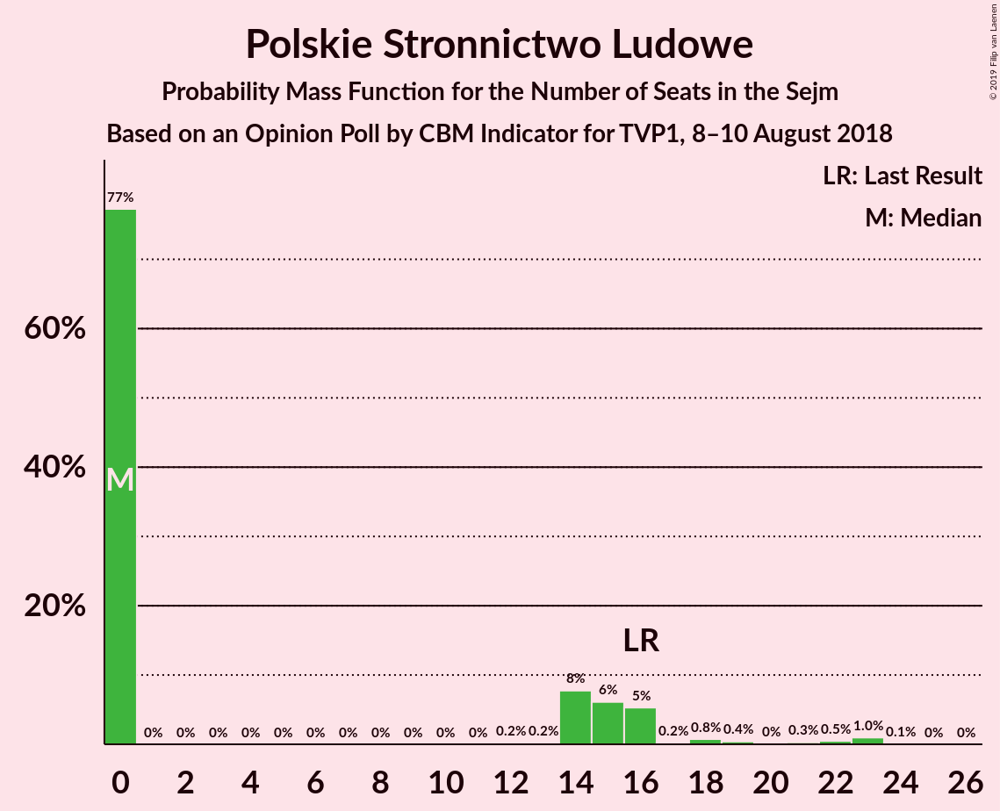
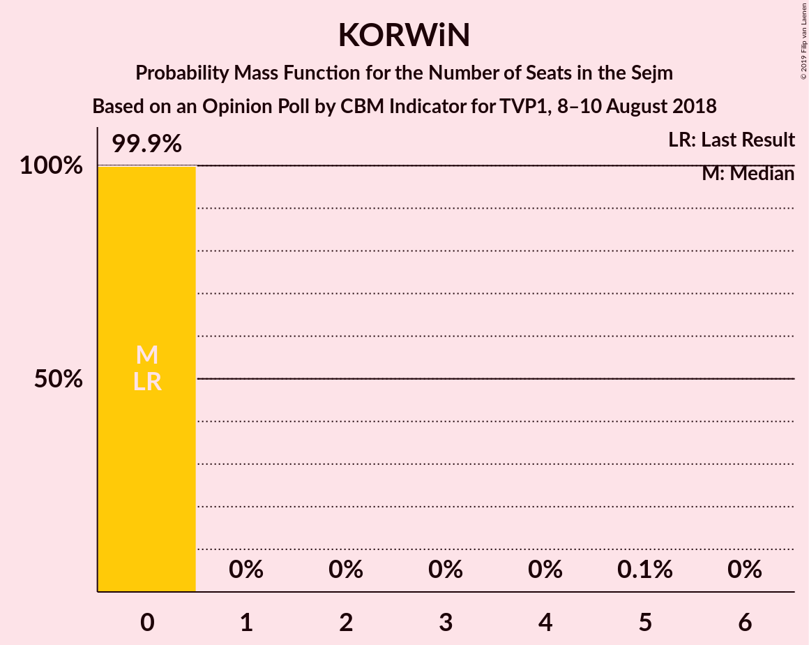
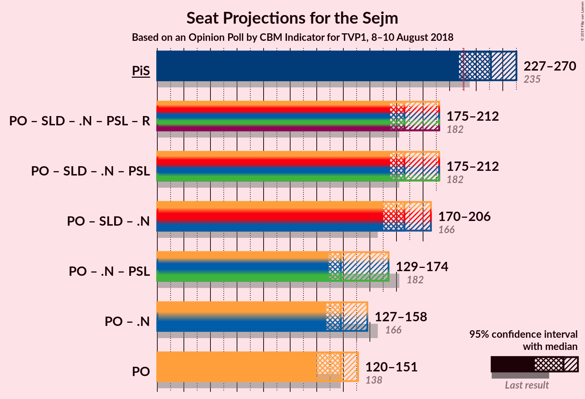
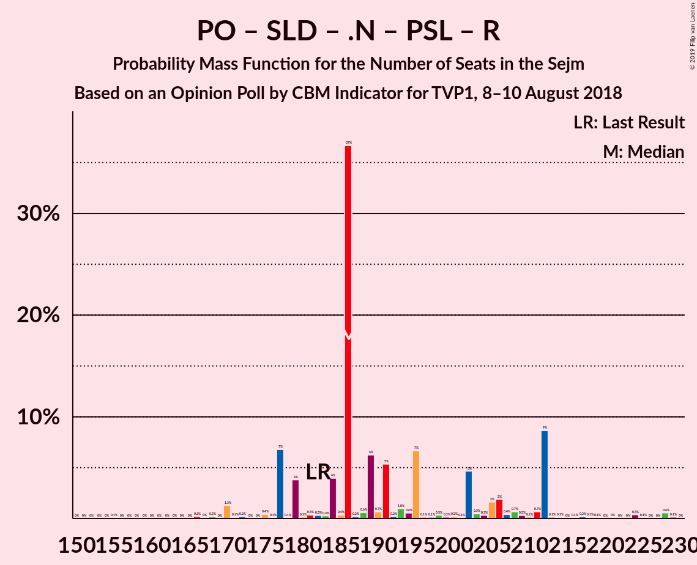
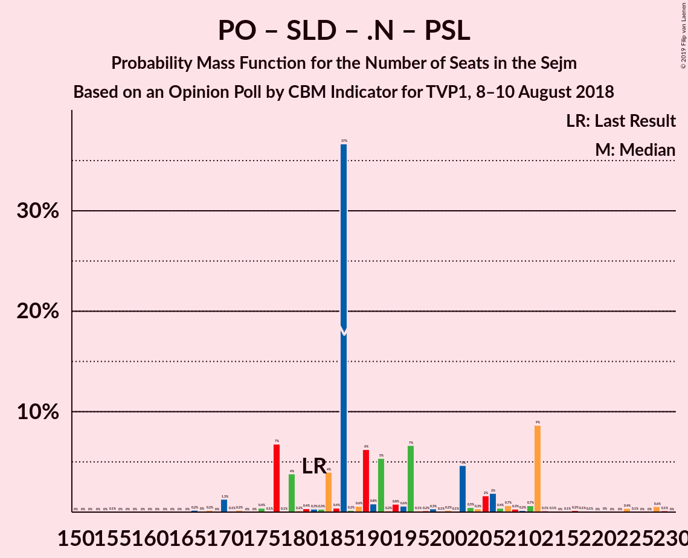
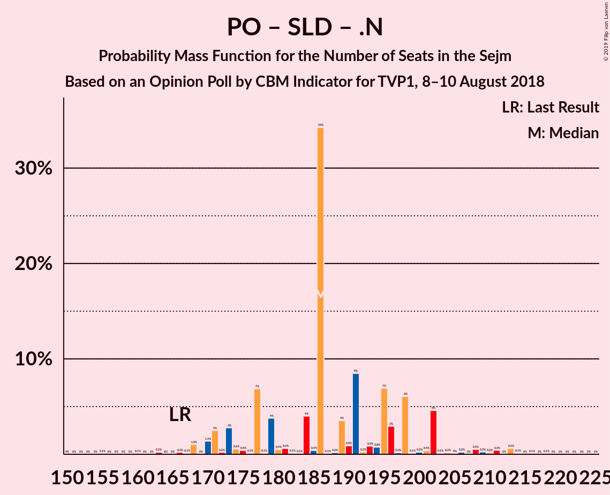

# Opinion Poll by CBM Indicator for TVP1, 8–10 August 2018

<a href="#voting-intentions">Voting Intentions</a> | <a href="#seats">Seats</a> | <a href="#coalitions">Coalitions</a> | <a href="#technical-information">Technical Information</a>

## Voting Intentions

### Confidence Intervals

| Party | Last Result | Poll Result | 80% Confidence Interval | 90% Confidence Interval | 95% Confidence Interval | 99% Confidence Interval |
|:-----:|:-----------:|:-----------:|:-----------------------:|:-----------------------:|:-----------------------:|:-----------------------:|
| Prawo i Sprawiedliwość | 37.6% | 42.0% | 40.0–44.0% |39.5–44.6% |39.0–45.1% |38.0–46.1% |
| Platforma Obywatelska | 24.1% | 24.6% | 22.9–26.4% |22.4–26.9% |22.0–27.4% |21.2–28.3% |
| Sojusz Lewicy Demokratycznej | 7.6% | 10.6% | 9.4–11.9% |9.1–12.3% |8.8–12.7% |8.3–13.3% |
| Kukiz’15 | 8.8% | 6.3% | 5.4–7.4% |5.2–7.7% |5.0–8.0% |4.6–8.6% |
| .Nowoczesna | 7.6% | 5.2% | 4.4–6.2% |4.2–6.5% |4.0–6.8% |3.6–7.3% |
| Polskie Stronnictwo Ludowe | 5.1% | 4.6% | 3.9–5.6% |3.6–5.9% |3.5–6.1% |3.1–6.6% |
| Lewica Razem | 3.6% | 3.5% | 2.9–4.4% |2.7–4.6% |2.5–4.8% |2.2–5.3% |
| KORWiN | 4.8% | 3.1% | 2.5–3.9% |2.3–4.2% |2.2–4.4% |1.9–4.8% |

*Note:* The poll result column reflects the actual value used in the calculations. Published results may vary slightly, and in addition be rounded to fewer digits.

## Seats

### Confidence Intervals

| Party | Last Result | Median | 80% Confidence Interval | 90% Confidence Interval | 95% Confidence Interval | 99% Confidence Interval |
|:-----:|:-----------:|:------:|:-----------------------:|:-----------------------:|:-----------------------:|:-----------------------:|
| <a href="#prawo-i-sprawiedliwość">Prawo i Sprawiedliwość</a> | 235 | 219 | 219–264 |219–264 |219–264 |219–272 |
| <a href="#platforma-obywatelska">Platforma Obywatelska</a> | 138 | 151 | 142–151 |129–151 |129–151 |111–151 |
| <a href="#sojusz-lewicy-demokratycznej">Sojusz Lewicy Demokratycznej</a> | 0 | 45 | 43–45 |43–62 |43–76 |38–76 |
| <a href="#kukiz’15">Kukiz’15</a> | 42 | 30 | 0–30 |0–30 |0–30 |0–40 |
| <a href="#.nowoczesna">.Nowoczesna</a> | 28 | 0 | 0–11 |0–11 |0–11 |0–13 |
| <a href="#polskie-stronnictwo-ludowe">Polskie Stronnictwo Ludowe</a> | 16 | 15 | 0–15 |0–15 |0–15 |0–24 |
| <a href="#lewica-razem">Lewica Razem</a> | 0 | 0 | 0 |0 |0 |0 |
| <a href="#korwin">KORWiN</a> | 0 | 0 | 0 |0 |0 |0 |

### Prawo i Sprawiedliwość

*For a full overview of the results for this party, see the [Prawo i Sprawiedliwość](party-prawoisprawiedliwość.html) page.*

| Number of Seats | Probability | Accumulated | Special Marks |
|:---------------:|:-----------:|:-----------:|:-------------:|
| 219 | 75% | 100% | Median |
| 220 | 0% | 25% |  |
| 221 | 0% | 25% |  |
| 222 | 2% | 25% |  |
| 223 | 0% | 24% |  |
| 224 | 0% | 24% |  |
| 225 | 0% | 24% |  |
| 226 | 0% | 24% |  |
| 227 | 0% | 24% |  |
| 228 | 0% | 24% |  |
| 229 | 0% | 23% |  |
| 230 | 0% | 23% |  |
| 231 | 0% | 23% | Majority |
| 232 | 0% | 23% |  |
| 233 | 0% | 23% |  |
| 234 | 0% | 23% |  |
| 235 | 5% | 23% | Last Result |
| 236 | 0% | 19% |  |
| 237 | 0% | 19% |  |
| 238 | 0% | 19% |  |
| 239 | 0% | 19% |  |
| 240 | 0% | 19% |  |
| 241 | 0% | 19% |  |
| 242 | 0.1% | 19% |  |
| 243 | 0% | 19% |  |
| 244 | 0% | 19% |  |
| 245 | 0% | 19% |  |
| 246 | 0% | 19% |  |
| 247 | 0% | 19% |  |
| 248 | 0% | 19% |  |
| 249 | 0% | 19% |  |
| 250 | 0% | 19% |  |
| 251 | 0% | 19% |  |
| 252 | 0% | 19% |  |
| 253 | 0% | 19% |  |
| 254 | 0% | 19% |  |
| 255 | 0% | 19% |  |
| 256 | 0% | 19% |  |
| 257 | 0% | 19% |  |
| 258 | 0.2% | 19% |  |
| 259 | 0% | 18% |  |
| 260 | 0% | 18% |  |
| 261 | 0% | 18% |  |
| 262 | 0% | 18% |  |
| 263 | 0% | 18% |  |
| 264 | 17% | 18% |  |
| 265 | 0% | 1.1% |  |
| 266 | 0% | 1.1% |  |
| 267 | 0% | 1.1% |  |
| 268 | 0% | 1.1% |  |
| 269 | 0% | 1.1% |  |
| 270 | 0% | 1.1% |  |
| 271 | 0% | 1.1% |  |
| 272 | 1.1% | 1.1% |  |
| 273 | 0% | 0% |  |

### Platforma Obywatelska

*For a full overview of the results for this party, see the [Platforma Obywatelska](party-platformaobywatelska.html) page.*

| Number of Seats | Probability | Accumulated | Special Marks |
|:---------------:|:-----------:|:-----------:|:-------------:|
| 109 | 0.2% | 100% |  |
| 110 | 0% | 99.8% |  |
| 111 | 1.1% | 99.8% |  |
| 112 | 0% | 98.7% |  |
| 113 | 0% | 98.7% |  |
| 114 | 0% | 98.7% |  |
| 115 | 0% | 98.7% |  |
| 116 | 0% | 98.7% |  |
| 117 | 0% | 98.7% |  |
| 118 | 0% | 98.7% |  |
| 119 | 0% | 98.7% |  |
| 120 | 0% | 98.7% |  |
| 121 | 0.1% | 98.7% |  |
| 122 | 0% | 98.6% |  |
| 123 | 0.5% | 98.6% |  |
| 124 | 0% | 98% |  |
| 125 | 0% | 98% |  |
| 126 | 0% | 98% |  |
| 127 | 0% | 98% |  |
| 128 | 0% | 98% |  |
| 129 | 5% | 98% |  |
| 130 | 1.3% | 93% |  |
| 131 | 0% | 92% |  |
| 132 | 0% | 92% |  |
| 133 | 0% | 92% |  |
| 134 | 0% | 92% |  |
| 135 | 0% | 92% |  |
| 136 | 0% | 92% |  |
| 137 | 0% | 92% |  |
| 138 | 0.1% | 92% | Last Result |
| 139 | 0% | 92% |  |
| 140 | 0% | 92% |  |
| 141 | 0% | 92% |  |
| 142 | 17% | 92% |  |
| 143 | 0% | 75% |  |
| 144 | 0% | 75% |  |
| 145 | 0% | 75% |  |
| 146 | 0% | 75% |  |
| 147 | 0% | 75% |  |
| 148 | 0% | 75% |  |
| 149 | 0% | 75% |  |
| 150 | 0% | 75% |  |
| 151 | 75% | 75% | Median |
| 152 | 0% | 0% |  |

### Sojusz Lewicy Demokratycznej

*For a full overview of the results for this party, see the [Sojusz Lewicy Demokratycznej](party-sojuszlewicydemokratycznej.html) page.*

| Number of Seats | Probability | Accumulated | Special Marks |
|:---------------:|:-----------:|:-----------:|:-------------:|
| 0 | 0% | 100% | Last Result |
| 1 | 0% | 100% |  |
| 2 | 0% | 100% |  |
| 3 | 0% | 100% |  |
| 4 | 0% | 100% |  |
| 5 | 0% | 100% |  |
| 6 | 0% | 100% |  |
| 7 | 0% | 100% |  |
| 8 | 0% | 100% |  |
| 9 | 0% | 100% |  |
| 10 | 0% | 100% |  |
| 11 | 0% | 100% |  |
| 12 | 0% | 100% |  |
| 13 | 0% | 100% |  |
| 14 | 0% | 100% |  |
| 15 | 0% | 100% |  |
| 16 | 0% | 100% |  |
| 17 | 0% | 100% |  |
| 18 | 0% | 100% |  |
| 19 | 0% | 100% |  |
| 20 | 0% | 100% |  |
| 21 | 0% | 100% |  |
| 22 | 0% | 100% |  |
| 23 | 0% | 100% |  |
| 24 | 0% | 100% |  |
| 25 | 0% | 100% |  |
| 26 | 0% | 100% |  |
| 27 | 0% | 100% |  |
| 28 | 0% | 100% |  |
| 29 | 0% | 100% |  |
| 30 | 0% | 100% |  |
| 31 | 0% | 100% |  |
| 32 | 0% | 100% |  |
| 33 | 0% | 100% |  |
| 34 | 0% | 100% |  |
| 35 | 0% | 100% |  |
| 36 | 0% | 100% |  |
| 37 | 0% | 100% |  |
| 38 | 0.5% | 100% |  |
| 39 | 0% | 99.5% |  |
| 40 | 0% | 99.5% |  |
| 41 | 0% | 99.4% |  |
| 42 | 0% | 99.4% |  |
| 43 | 17% | 99.4% |  |
| 44 | 0% | 82% |  |
| 45 | 75% | 82% | Median |
| 46 | 0% | 7% |  |
| 47 | 0% | 7% |  |
| 48 | 0% | 7% |  |
| 49 | 0% | 7% |  |
| 50 | 0% | 7% |  |
| 51 | 0% | 7% |  |
| 52 | 0% | 7% |  |
| 53 | 0% | 7% |  |
| 54 | 0% | 7% |  |
| 55 | 0% | 7% |  |
| 56 | 0% | 7% |  |
| 57 | 0% | 7% |  |
| 58 | 0% | 7% |  |
| 59 | 0% | 7% |  |
| 60 | 0% | 7% |  |
| 61 | 0% | 7% |  |
| 62 | 2% | 7% |  |
| 63 | 0% | 5% |  |
| 64 | 0% | 5% |  |
| 65 | 0% | 5% |  |
| 66 | 0% | 5% |  |
| 67 | 0.1% | 5% |  |
| 68 | 0% | 5% |  |
| 69 | 0% | 5% |  |
| 70 | 0% | 5% |  |
| 71 | 0% | 5% |  |
| 72 | 0% | 5% |  |
| 73 | 0% | 5% |  |
| 74 | 0% | 5% |  |
| 75 | 0% | 5% |  |
| 76 | 5% | 5% |  |
| 77 | 0% | 0% |  |

### Kukiz’15

*For a full overview of the results for this party, see the [Kukiz’15](party-kukiz’15.html) page.*

| Number of Seats | Probability | Accumulated | Special Marks |
|:---------------:|:-----------:|:-----------:|:-------------:|
| 0 | 18% | 100% |  |
| 1 | 0% | 82% |  |
| 2 | 0% | 82% |  |
| 3 | 0% | 82% |  |
| 4 | 0% | 82% |  |
| 5 | 0.1% | 82% |  |
| 6 | 0% | 82% |  |
| 7 | 0% | 82% |  |
| 8 | 0% | 82% |  |
| 9 | 0% | 82% |  |
| 10 | 5% | 82% |  |
| 11 | 1.3% | 77% |  |
| 12 | 0% | 76% |  |
| 13 | 0% | 76% |  |
| 14 | 0% | 75% |  |
| 15 | 0% | 75% |  |
| 16 | 0% | 75% |  |
| 17 | 0% | 75% |  |
| 18 | 0% | 75% |  |
| 19 | 0% | 75% |  |
| 20 | 0% | 75% |  |
| 21 | 0% | 75% |  |
| 22 | 0% | 75% |  |
| 23 | 0% | 75% |  |
| 24 | 0% | 75% |  |
| 25 | 0% | 75% |  |
| 26 | 0% | 75% |  |
| 27 | 0.2% | 75% |  |
| 28 | 0% | 75% |  |
| 29 | 0% | 75% |  |
| 30 | 75% | 75% | Median |
| 31 | 0% | 0.6% |  |
| 32 | 0% | 0.6% |  |
| 33 | 0% | 0.6% |  |
| 34 | 0% | 0.6% |  |
| 35 | 0% | 0.6% |  |
| 36 | 0% | 0.6% |  |
| 37 | 0% | 0.6% |  |
| 38 | 0% | 0.6% |  |
| 39 | 0% | 0.5% |  |
| 40 | 0.5% | 0.5% |  |
| 41 | 0% | 0% |  |
| 42 | 0% | 0% | Last Result |

### .Nowoczesna

*For a full overview of the results for this party, see the [.Nowoczesna](party-nowoczesna.html) page.*

| Number of Seats | Probability | Accumulated | Special Marks |
|:---------------:|:-----------:|:-----------:|:-------------:|
| 0 | 76% | 100% | Median |
| 1 | 0% | 24% |  |
| 2 | 0% | 24% |  |
| 3 | 0% | 24% |  |
| 4 | 0% | 24% |  |
| 5 | 0% | 24% |  |
| 6 | 0% | 24% |  |
| 7 | 0% | 24% |  |
| 8 | 0.1% | 24% |  |
| 9 | 0% | 24% |  |
| 10 | 5% | 24% |  |
| 11 | 18% | 19% |  |
| 12 | 0% | 0.6% |  |
| 13 | 0.5% | 0.6% |  |
| 14 | 0% | 0.1% |  |
| 15 | 0% | 0% |  |
| 16 | 0% | 0% |  |
| 17 | 0% | 0% |  |
| 18 | 0% | 0% |  |
| 19 | 0% | 0% |  |
| 20 | 0% | 0% |  |
| 21 | 0% | 0% |  |
| 22 | 0% | 0% |  |
| 23 | 0% | 0% |  |
| 24 | 0% | 0% |  |
| 25 | 0% | 0% |  |
| 26 | 0% | 0% |  |
| 27 | 0% | 0% |  |
| 28 | 0% | 0% | Last Result |

### Polskie Stronnictwo Ludowe

*For a full overview of the results for this party, see the [Polskie Stronnictwo Ludowe](party-polskiestronnictwoludowe.html) page.*

| Number of Seats | Probability | Accumulated | Special Marks |
|:---------------:|:-----------:|:-----------:|:-------------:|
| 0 | 22% | 100% |  |
| 1 | 0% | 78% |  |
| 2 | 0% | 78% |  |
| 3 | 0% | 78% |  |
| 4 | 0% | 78% |  |
| 5 | 0% | 78% |  |
| 6 | 0% | 78% |  |
| 7 | 0% | 78% |  |
| 8 | 0% | 78% |  |
| 9 | 0% | 78% |  |
| 10 | 0% | 78% |  |
| 11 | 0% | 78% |  |
| 12 | 0% | 78% |  |
| 13 | 0% | 78% |  |
| 14 | 0% | 78% |  |
| 15 | 76% | 78% | Median |
| 16 | 0% | 2% | Last Result |
| 17 | 0% | 2% |  |
| 18 | 0% | 2% |  |
| 19 | 0% | 2% |  |
| 20 | 0% | 2% |  |
| 21 | 0.2% | 2% |  |
| 22 | 0% | 2% |  |
| 23 | 0% | 2% |  |
| 24 | 2% | 2% |  |
| 25 | 0% | 0% |  |

### Lewica Razem

*For a full overview of the results for this party, see the [Lewica Razem](party-lewicarazem.html) page.*

| Number of Seats | Probability | Accumulated | Special Marks |
|:---------------:|:-----------:|:-----------:|:-------------:|
| 0 | 99.9% | 100% | Last Result, Median |
| 1 | 0% | 0.1% |  |
| 2 | 0% | 0.1% |  |
| 3 | 0% | 0.1% |  |
| 4 | 0% | 0.1% |  |
| 5 | 0% | 0.1% |  |
| 6 | 0% | 0.1% |  |
| 7 | 0% | 0.1% |  |
| 8 | 0% | 0.1% |  |
| 9 | 0% | 0% |  |

### KORWiN

*For a full overview of the results for this party, see the [KORWiN](party-korwin.html) page.*

| Number of Seats | Probability | Accumulated | Special Marks |
|:---------------:|:-----------:|:-----------:|:-------------:|
| 0 | 100% | 100% | Last Result, Median |

## Coalitions

### Confidence Intervals

| Coalition | Last Result | Median | Majority? | 80% Confidence Interval | 90% Confidence Interval | 95% Confidence Interval | 99% Confidence Interval |
|:---------:|:-----------:|:------:|:---------:|:-----------------------:|:-----------------------:|:-----------------------:|:-----------------------:|
| Prawo i Sprawiedliwość | 235 | 219 | 23% | 219–264 | 219–264 | 219–264 | 219–272 |
| Platforma Obywatelska – Sojusz Lewicy Demokratycznej – .Nowoczesna – Polskie Stronnictwo Ludowe – Lewica Razem | 182 | 211 | 0% | 196–211 | 196–215 | 196–215 | 188–227 |
| Platforma Obywatelska – Sojusz Lewicy Demokratycznej – .Nowoczesna – Polskie Stronnictwo Ludowe | 182 | 211 | 0% | 196–211 | 196–215 | 196–215 | 188–227 |
| Platforma Obywatelska – Sojusz Lewicy Demokratycznej – .Nowoczesna | 166 | 196 | 0% | 196 | 196–203 | 196–215 | 173–215 |
| Platforma Obywatelska – .Nowoczesna – Polskie Stronnictwo Ludowe | 182 | 166 | 0% | 153–166 | 139–166 | 139–166 | 126–166 |
| Platforma Obywatelska – .Nowoczesna | 166 | 151 | 0% | 151–153 | 139–153 | 139–153 | 111–153 |
| Platforma Obywatelska | 138 | 151 | 0% | 142–151 | 129–151 | 129–151 | 111–151 |

### Prawo i Sprawiedliwość

| Number of Seats | Probability | Accumulated | Special Marks |
|:---------------:|:-----------:|:-----------:|:-------------:|
| 219 | 75% | 100% | Median |
| 220 | 0% | 25% |  |
| 221 | 0% | 25% |  |
| 222 | 2% | 25% |  |
| 223 | 0% | 24% |  |
| 224 | 0% | 24% |  |
| 225 | 0% | 24% |  |
| 226 | 0% | 24% |  |
| 227 | 0% | 24% |  |
| 228 | 0% | 24% |  |
| 229 | 0% | 23% |  |
| 230 | 0% | 23% |  |
| 231 | 0% | 23% | Majority |
| 232 | 0% | 23% |  |
| 233 | 0% | 23% |  |
| 234 | 0% | 23% |  |
| 235 | 5% | 23% | Last Result |
| 236 | 0% | 19% |  |
| 237 | 0% | 19% |  |
| 238 | 0% | 19% |  |
| 239 | 0% | 19% |  |
| 240 | 0% | 19% |  |
| 241 | 0% | 19% |  |
| 242 | 0.1% | 19% |  |
| 243 | 0% | 19% |  |
| 244 | 0% | 19% |  |
| 245 | 0% | 19% |  |
| 246 | 0% | 19% |  |
| 247 | 0% | 19% |  |
| 248 | 0% | 19% |  |
| 249 | 0% | 19% |  |
| 250 | 0% | 19% |  |
| 251 | 0% | 19% |  |
| 252 | 0% | 19% |  |
| 253 | 0% | 19% |  |
| 254 | 0% | 19% |  |
| 255 | 0% | 19% |  |
| 256 | 0% | 19% |  |
| 257 | 0% | 19% |  |
| 258 | 0.2% | 19% |  |
| 259 | 0% | 18% |  |
| 260 | 0% | 18% |  |
| 261 | 0% | 18% |  |
| 262 | 0% | 18% |  |
| 263 | 0% | 18% |  |
| 264 | 17% | 18% |  |
| 265 | 0% | 1.1% |  |
| 266 | 0% | 1.1% |  |
| 267 | 0% | 1.1% |  |
| 268 | 0% | 1.1% |  |
| 269 | 0% | 1.1% |  |
| 270 | 0% | 1.1% |  |
| 271 | 0% | 1.1% |  |
| 272 | 1.1% | 1.1% |  |
| 273 | 0% | 0% |  |

### Platforma Obywatelska – Sojusz Lewicy Demokratycznej – .Nowoczesna – Polskie Stronnictwo Ludowe – Lewica Razem

| Number of Seats | Probability | Accumulated | Special Marks |
|:---------------:|:-----------:|:-----------:|:-------------:|
| 175 | 0.2% | 100% |  |
| 176 | 0% | 99.8% |  |
| 177 | 0% | 99.8% |  |
| 178 | 0% | 99.8% |  |
| 179 | 0% | 99.8% |  |
| 180 | 0% | 99.8% |  |
| 181 | 0% | 99.8% |  |
| 182 | 0% | 99.8% | Last Result |
| 183 | 0% | 99.7% |  |
| 184 | 0% | 99.7% |  |
| 185 | 0% | 99.7% |  |
| 186 | 0% | 99.7% |  |
| 187 | 0% | 99.7% |  |
| 188 | 1.1% | 99.7% |  |
| 189 | 0% | 98.6% |  |
| 190 | 0% | 98.6% |  |
| 191 | 0% | 98.6% |  |
| 192 | 0% | 98.6% |  |
| 193 | 0% | 98.6% |  |
| 194 | 0% | 98.6% |  |
| 195 | 0% | 98.6% |  |
| 196 | 17% | 98.6% |  |
| 197 | 0% | 81% |  |
| 198 | 0.5% | 81% |  |
| 199 | 0% | 81% |  |
| 200 | 0% | 81% |  |
| 201 | 0% | 81% |  |
| 202 | 0% | 81% |  |
| 203 | 0% | 81% |  |
| 204 | 0% | 81% |  |
| 205 | 0% | 81% |  |
| 206 | 0% | 81% |  |
| 207 | 0% | 81% |  |
| 208 | 0% | 81% |  |
| 209 | 0% | 81% |  |
| 210 | 0% | 81% |  |
| 211 | 75% | 81% | Median |
| 212 | 0% | 6% |  |
| 213 | 0.1% | 6% |  |
| 214 | 0% | 6% |  |
| 215 | 5% | 6% |  |
| 216 | 0% | 1.3% |  |
| 217 | 0% | 1.3% |  |
| 218 | 0% | 1.3% |  |
| 219 | 0% | 1.3% |  |
| 220 | 0% | 1.3% |  |
| 221 | 0% | 1.3% |  |
| 222 | 0% | 1.3% |  |
| 223 | 0% | 1.3% |  |
| 224 | 0% | 1.3% |  |
| 225 | 0% | 1.3% |  |
| 226 | 0% | 1.3% |  |
| 227 | 1.3% | 1.3% |  |
| 228 | 0% | 0% |  |

### Platforma Obywatelska – Sojusz Lewicy Demokratycznej – .Nowoczesna – Polskie Stronnictwo Ludowe

| Number of Seats | Probability | Accumulated | Special Marks |
|:---------------:|:-----------:|:-----------:|:-------------:|
| 175 | 0.2% | 100% |  |
| 176 | 0% | 99.8% |  |
| 177 | 0% | 99.8% |  |
| 178 | 0% | 99.8% |  |
| 179 | 0% | 99.8% |  |
| 180 | 0% | 99.8% |  |
| 181 | 0% | 99.8% |  |
| 182 | 0% | 99.8% | Last Result |
| 183 | 0% | 99.7% |  |
| 184 | 0% | 99.7% |  |
| 185 | 0% | 99.7% |  |
| 186 | 0% | 99.7% |  |
| 187 | 0% | 99.7% |  |
| 188 | 1.1% | 99.7% |  |
| 189 | 0% | 98.6% |  |
| 190 | 0% | 98.6% |  |
| 191 | 0% | 98.6% |  |
| 192 | 0% | 98.6% |  |
| 193 | 0% | 98.6% |  |
| 194 | 0% | 98.6% |  |
| 195 | 0% | 98.6% |  |
| 196 | 17% | 98.6% |  |
| 197 | 0% | 81% |  |
| 198 | 0.5% | 81% |  |
| 199 | 0% | 81% |  |
| 200 | 0% | 81% |  |
| 201 | 0% | 81% |  |
| 202 | 0% | 81% |  |
| 203 | 0% | 81% |  |
| 204 | 0% | 81% |  |
| 205 | 0% | 81% |  |
| 206 | 0% | 81% |  |
| 207 | 0% | 81% |  |
| 208 | 0% | 81% |  |
| 209 | 0% | 81% |  |
| 210 | 0% | 81% |  |
| 211 | 75% | 81% | Median |
| 212 | 0% | 6% |  |
| 213 | 0.1% | 6% |  |
| 214 | 0% | 6% |  |
| 215 | 5% | 6% |  |
| 216 | 0% | 1.3% |  |
| 217 | 0% | 1.3% |  |
| 218 | 0% | 1.3% |  |
| 219 | 0% | 1.3% |  |
| 220 | 0% | 1.3% |  |
| 221 | 0% | 1.3% |  |
| 222 | 0% | 1.3% |  |
| 223 | 0% | 1.3% |  |
| 224 | 0% | 1.3% |  |
| 225 | 0% | 1.3% |  |
| 226 | 0% | 1.3% |  |
| 227 | 1.3% | 1.3% |  |
| 228 | 0% | 0% |  |

### Platforma Obywatelska – Sojusz Lewicy Demokratycznej – .Nowoczesna

| Number of Seats | Probability | Accumulated | Special Marks |
|:---------------:|:-----------:|:-----------:|:-------------:|
| 154 | 0.2% | 100% |  |
| 155 | 0% | 99.8% |  |
| 156 | 0% | 99.8% |  |
| 157 | 0% | 99.8% |  |
| 158 | 0% | 99.8% |  |
| 159 | 0% | 99.8% |  |
| 160 | 0% | 99.8% |  |
| 161 | 0% | 99.8% |  |
| 162 | 0% | 99.8% |  |
| 163 | 0% | 99.8% |  |
| 164 | 0% | 99.8% |  |
| 165 | 0% | 99.8% |  |
| 166 | 0% | 99.8% | Last Result |
| 167 | 0% | 99.8% |  |
| 168 | 0% | 99.8% |  |
| 169 | 0% | 99.8% |  |
| 170 | 0% | 99.8% |  |
| 171 | 0% | 99.8% |  |
| 172 | 0% | 99.8% |  |
| 173 | 1.1% | 99.8% |  |
| 174 | 0.5% | 98.7% |  |
| 175 | 0% | 98% |  |
| 176 | 0% | 98% |  |
| 177 | 0% | 98% |  |
| 178 | 0% | 98% |  |
| 179 | 0% | 98% |  |
| 180 | 0% | 98% |  |
| 181 | 0% | 98% |  |
| 182 | 0% | 98% |  |
| 183 | 0% | 98% |  |
| 184 | 0% | 98% |  |
| 185 | 0% | 98% |  |
| 186 | 0% | 98% |  |
| 187 | 0% | 98% |  |
| 188 | 0% | 98% |  |
| 189 | 0% | 98% |  |
| 190 | 0% | 98% |  |
| 191 | 0% | 98% |  |
| 192 | 0% | 98% |  |
| 193 | 0% | 98% |  |
| 194 | 0% | 98% |  |
| 195 | 0% | 98% |  |
| 196 | 92% | 98% | Median |
| 197 | 0% | 6% |  |
| 198 | 0% | 6% |  |
| 199 | 0% | 6% |  |
| 200 | 0% | 6% |  |
| 201 | 0% | 6% |  |
| 202 | 0% | 6% |  |
| 203 | 1.3% | 6% |  |
| 204 | 0% | 5% |  |
| 205 | 0% | 5% |  |
| 206 | 0% | 5% |  |
| 207 | 0% | 5% |  |
| 208 | 0% | 5% |  |
| 209 | 0% | 5% |  |
| 210 | 0% | 5% |  |
| 211 | 0% | 5% |  |
| 212 | 0% | 5% |  |
| 213 | 0.1% | 5% |  |
| 214 | 0% | 5% |  |
| 215 | 5% | 5% |  |
| 216 | 0% | 0% |  |

### Platforma Obywatelska – .Nowoczesna – Polskie Stronnictwo Ludowe

| Number of Seats | Probability | Accumulated | Special Marks |
|:---------------:|:-----------:|:-----------:|:-------------:|
| 126 | 1.1% | 100% |  |
| 127 | 0% | 98.8% |  |
| 128 | 0% | 98.8% |  |
| 129 | 0% | 98.8% |  |
| 130 | 0.2% | 98.8% |  |
| 131 | 0% | 98.6% |  |
| 132 | 0% | 98.6% |  |
| 133 | 0% | 98.6% |  |
| 134 | 0% | 98.6% |  |
| 135 | 0% | 98.6% |  |
| 136 | 0% | 98.6% |  |
| 137 | 0% | 98.6% |  |
| 138 | 0% | 98.6% |  |
| 139 | 5% | 98.6% |  |
| 140 | 0% | 94% |  |
| 141 | 0% | 94% |  |
| 142 | 0% | 94% |  |
| 143 | 0% | 94% |  |
| 144 | 0% | 94% |  |
| 145 | 0% | 94% |  |
| 146 | 0.1% | 94% |  |
| 147 | 0% | 94% |  |
| 148 | 0% | 94% |  |
| 149 | 0% | 94% |  |
| 150 | 0% | 94% |  |
| 151 | 0% | 94% |  |
| 152 | 0% | 94% |  |
| 153 | 17% | 94% |  |
| 154 | 0% | 77% |  |
| 155 | 0% | 77% |  |
| 156 | 0% | 77% |  |
| 157 | 0% | 77% |  |
| 158 | 0.1% | 77% |  |
| 159 | 0% | 76% |  |
| 160 | 0.5% | 76% |  |
| 161 | 0% | 76% |  |
| 162 | 0% | 76% |  |
| 163 | 0% | 76% |  |
| 164 | 0% | 76% |  |
| 165 | 1.3% | 76% |  |
| 166 | 75% | 75% | Median |
| 167 | 0% | 0% |  |
| 168 | 0% | 0% |  |
| 169 | 0% | 0% |  |
| 170 | 0% | 0% |  |
| 171 | 0% | 0% |  |
| 172 | 0% | 0% |  |
| 173 | 0% | 0% |  |
| 174 | 0% | 0% |  |
| 175 | 0% | 0% |  |
| 176 | 0% | 0% |  |
| 177 | 0% | 0% |  |
| 178 | 0% | 0% |  |
| 179 | 0% | 0% |  |
| 180 | 0% | 0% |  |
| 181 | 0% | 0% |  |
| 182 | 0% | 0% | Last Result |

### Platforma Obywatelska – .Nowoczesna

| Number of Seats | Probability | Accumulated | Special Marks |
|:---------------:|:-----------:|:-----------:|:-------------:|
| 109 | 0.2% | 100% |  |
| 110 | 0% | 99.8% |  |
| 111 | 1.1% | 99.8% |  |
| 112 | 0% | 98.7% |  |
| 113 | 0% | 98.7% |  |
| 114 | 0% | 98.7% |  |
| 115 | 0% | 98.7% |  |
| 116 | 0% | 98.7% |  |
| 117 | 0% | 98.7% |  |
| 118 | 0% | 98.7% |  |
| 119 | 0% | 98.7% |  |
| 120 | 0% | 98.7% |  |
| 121 | 0% | 98.7% |  |
| 122 | 0% | 98.6% |  |
| 123 | 0% | 98.6% |  |
| 124 | 0% | 98.6% |  |
| 125 | 0% | 98.6% |  |
| 126 | 0% | 98.6% |  |
| 127 | 0% | 98.6% |  |
| 128 | 0% | 98.6% |  |
| 129 | 0% | 98.6% |  |
| 130 | 0% | 98.6% |  |
| 131 | 0% | 98.6% |  |
| 132 | 0% | 98.6% |  |
| 133 | 0% | 98.6% |  |
| 134 | 0% | 98.6% |  |
| 135 | 0% | 98.6% |  |
| 136 | 0.5% | 98.6% |  |
| 137 | 0% | 98% |  |
| 138 | 0% | 98% |  |
| 139 | 5% | 98% |  |
| 140 | 0% | 93% |  |
| 141 | 1.3% | 93% |  |
| 142 | 0% | 92% |  |
| 143 | 0% | 92% |  |
| 144 | 0% | 92% |  |
| 145 | 0% | 92% |  |
| 146 | 0.1% | 92% |  |
| 147 | 0% | 92% |  |
| 148 | 0% | 92% |  |
| 149 | 0% | 92% |  |
| 150 | 0% | 92% |  |
| 151 | 75% | 92% | Median |
| 152 | 0% | 17% |  |
| 153 | 17% | 17% |  |
| 154 | 0% | 0.1% |  |
| 155 | 0% | 0.1% |  |
| 156 | 0% | 0.1% |  |
| 157 | 0% | 0.1% |  |
| 158 | 0.1% | 0.1% |  |
| 159 | 0% | 0% |  |
| 160 | 0% | 0% |  |
| 161 | 0% | 0% |  |
| 162 | 0% | 0% |  |
| 163 | 0% | 0% |  |
| 164 | 0% | 0% |  |
| 165 | 0% | 0% |  |
| 166 | 0% | 0% | Last Result |

### Platforma Obywatelska

| Number of Seats | Probability | Accumulated | Special Marks |
|:---------------:|:-----------:|:-----------:|:-------------:|
| 109 | 0.2% | 100% |  |
| 110 | 0% | 99.8% |  |
| 111 | 1.1% | 99.8% |  |
| 112 | 0% | 98.7% |  |
| 113 | 0% | 98.7% |  |
| 114 | 0% | 98.7% |  |
| 115 | 0% | 98.7% |  |
| 116 | 0% | 98.7% |  |
| 117 | 0% | 98.7% |  |
| 118 | 0% | 98.7% |  |
| 119 | 0% | 98.7% |  |
| 120 | 0% | 98.7% |  |
| 121 | 0.1% | 98.7% |  |
| 122 | 0% | 98.6% |  |
| 123 | 0.5% | 98.6% |  |
| 124 | 0% | 98% |  |
| 125 | 0% | 98% |  |
| 126 | 0% | 98% |  |
| 127 | 0% | 98% |  |
| 128 | 0% | 98% |  |
| 129 | 5% | 98% |  |
| 130 | 1.3% | 93% |  |
| 131 | 0% | 92% |  |
| 132 | 0% | 92% |  |
| 133 | 0% | 92% |  |
| 134 | 0% | 92% |  |
| 135 | 0% | 92% |  |
| 136 | 0% | 92% |  |
| 137 | 0% | 92% |  |
| 138 | 0.1% | 92% | Last Result |
| 139 | 0% | 92% |  |
| 140 | 0% | 92% |  |
| 141 | 0% | 92% |  |
| 142 | 17% | 92% |  |
| 143 | 0% | 75% |  |
| 144 | 0% | 75% |  |
| 145 | 0% | 75% |  |
| 146 | 0% | 75% |  |
| 147 | 0% | 75% |  |
| 148 | 0% | 75% |  |
| 149 | 0% | 75% |  |
| 150 | 0% | 75% |  |
| 151 | 75% | 75% | Median |
| 152 | 0% | 0% |  |

## Technical Information

### Opinion Poll

+ **Polling firm:** CBM Indicator
+ **Commissioner(s):** TVP1
+ **Fieldwork period:** 8–10 August 2018

### Calculations

+ **Sample size:** 1000
+ **Simulations done:** 1,024
+ **Error estimate:** 3.83%

