# Opinion Poll by Instytut Badań Pollster for Super Express, 9–10 August 2018

<a href="#voting-intentions">Voting Intentions</a> | <a href="#seats">Seats</a> | <a href="#coalitions">Coalitions</a> | <a href="#technical-information">Technical Information</a>

## Voting Intentions

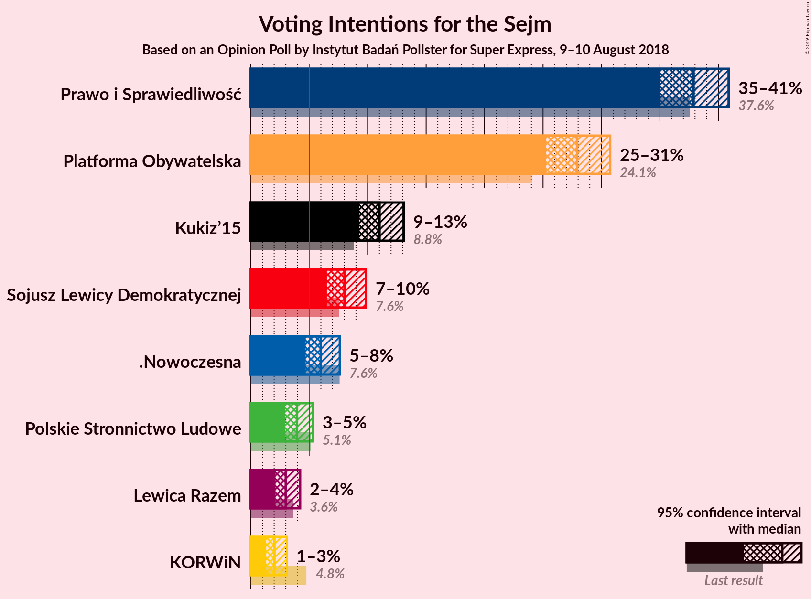

### Confidence Intervals

| Party | Last Result | Poll Result | 80% Confidence Interval | 90% Confidence Interval | 95% Confidence Interval | 99% Confidence Interval |
|:-----:|:-----------:|:-----------:|:-----------------------:|:-----------------------:|:-----------------------:|:-----------------------:|
| Prawo i Sprawiedliwość | 37.6% | 37.9% | 36.0–39.8% |35.4–40.4% |35.0–40.9% |34.1–41.8% |
| Platforma Obywatelska | 24.1% | 27.9% | 26.2–29.8% |25.7–30.3% |25.3–30.7% |24.4–31.6% |
| Kukiz’15 | 8.8% | 11.0% | 9.8–12.4% |9.5–12.7% |9.3–13.1% |8.7–13.7% |
| Sojusz Lewicy Demokratycznej | 7.6% | 8.0% | 7.0–9.2% |6.8–9.5% |6.5–9.8% |6.1–10.4% |
| .Nowoczesna | 7.6% | 6.0% | 5.1–7.1% |4.9–7.3% |4.7–7.6% |4.3–8.2% |
| Polskie Stronnictwo Ludowe | 5.1% | 4.0% | 3.3–4.9% |3.1–5.1% |2.9–5.3% |2.6–5.8% |
| Lewica Razem | 3.6% | 3.0% | 2.4–3.8% |2.3–4.0% |2.1–4.2% |1.9–4.6% |
| KORWiN | 4.8% | 2.0% | 1.6–2.7% |1.4–2.9% |1.3–3.1% |1.1–3.4% |

*Note:* The poll result column reflects the actual value used in the calculations. Published results may vary slightly, and in addition be rounded to fewer digits.

## Seats

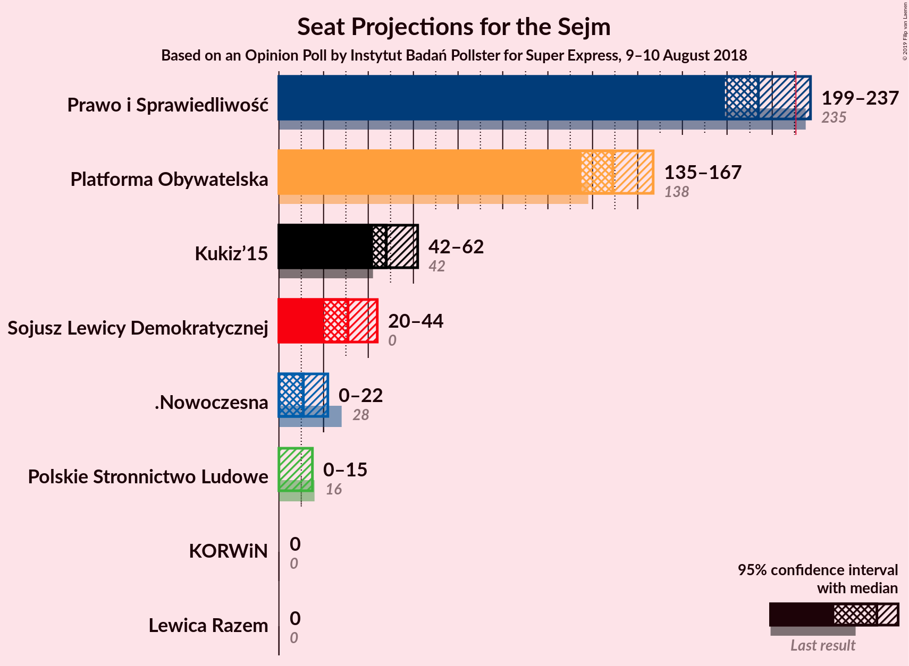

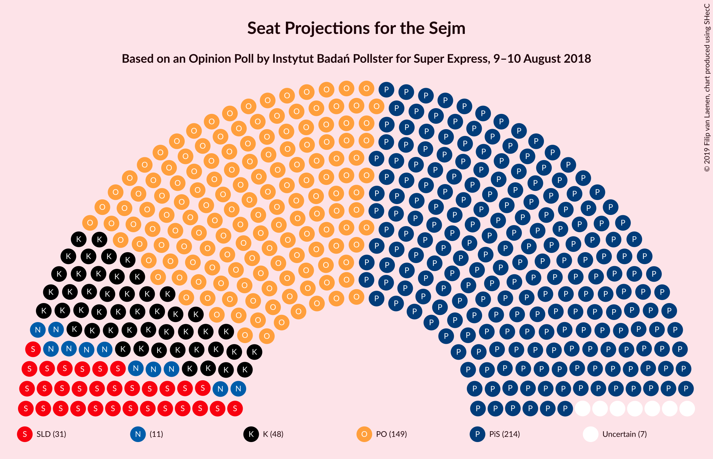

### Confidence Intervals

| Party | Last Result | Median | 80% Confidence Interval | 90% Confidence Interval | 95% Confidence Interval | 99% Confidence Interval |
|:-----:|:-----------:|:------:|:-----------------------:|:-----------------------:|:-----------------------:|:-----------------------:|
| <a href="#prawo-i-sprawiedliwość">Prawo i Sprawiedliwość</a> | 235 | 218 | 207–230 |203–232 |200–237 |194–240 |
| <a href="#platforma-obywatelska">Platforma Obywatelska</a> | 138 | 150 | 141–161 |137–164 |135–167 |131–172 |
| <a href="#kukiz’15">Kukiz’15</a> | 42 | 47 | 44–56 |43–58 |41–62 |37–65 |
| <a href="#sojusz-lewicy-demokratycznej">Sojusz Lewicy Demokratycznej</a> | 0 | 30 | 23–38 |22–40 |20–42 |14–45 |
| <a href="#.nowoczesna">.Nowoczesna</a> | 28 | 11 | 7–19 |0–21 |0–22 |0–25 |
| <a href="#polskie-stronnictwo-ludowe">Polskie Stronnictwo Ludowe</a> | 16 | 0 | 0 |0–12 |0–15 |0–18 |
| <a href="#lewica-razem">Lewica Razem</a> | 0 | 0 | 0 |0 |0 |0 |
| <a href="#korwin">KORWiN</a> | 0 | 0 | 0 |0 |0 |0 |

### Prawo i Sprawiedliwość

*For a full overview of the results for this party, see the [Prawo i Sprawiedliwość](party-prawoisprawiedliwość.html) page.*

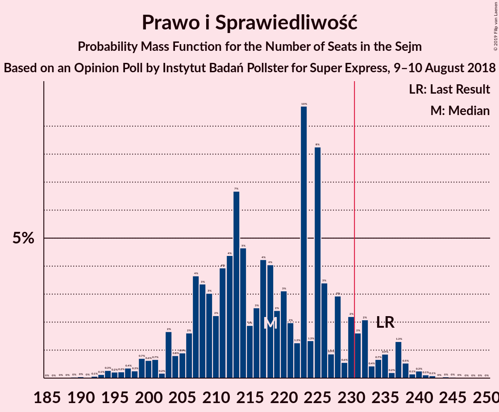

| Number of Seats | Probability | Accumulated | Special Marks |
|:---------------:|:-----------:|:-----------:|:-------------:|
| 187 | 0% | 100% |  |
| 188 | 0% | 99.9% |  |
| 189 | 0% | 99.9% |  |
| 190 | 0% | 99.9% |  |
| 191 | 0% | 99.8% |  |
| 192 | 0.1% | 99.8% |  |
| 193 | 0.1% | 99.7% |  |
| 194 | 0.3% | 99.6% |  |
| 195 | 0.2% | 99.3% |  |
| 196 | 0.2% | 99.1% |  |
| 197 | 0.4% | 98.9% |  |
| 198 | 0.3% | 98.5% |  |
| 199 | 0.7% | 98% |  |
| 200 | 0.6% | 98% |  |
| 201 | 0.7% | 97% |  |
| 202 | 0.2% | 96% |  |
| 203 | 2% | 96% |  |
| 204 | 0.8% | 94% |  |
| 205 | 0.9% | 94% |  |
| 206 | 2% | 93% |  |
| 207 | 4% | 91% |  |
| 208 | 3% | 87% |  |
| 209 | 3% | 84% |  |
| 210 | 2% | 81% |  |
| 211 | 4% | 79% |  |
| 212 | 4% | 75% |  |
| 213 | 7% | 70% |  |
| 214 | 5% | 64% |  |
| 215 | 2% | 59% |  |
| 216 | 3% | 57% |  |
| 217 | 4% | 55% |  |
| 218 | 4% | 51% | Median |
| 219 | 2% | 46% |  |
| 220 | 3% | 44% |  |
| 221 | 2% | 41% |  |
| 222 | 1.3% | 39% |  |
| 223 | 10% | 38% |  |
| 224 | 1.3% | 28% |  |
| 225 | 8% | 27% |  |
| 226 | 3% | 18% |  |
| 227 | 0.9% | 15% |  |
| 228 | 3% | 14% |  |
| 229 | 0.6% | 11% |  |
| 230 | 2% | 11% |  |
| 231 | 2% | 8% | Majority |
| 232 | 2% | 7% |  |
| 233 | 0.4% | 5% |  |
| 234 | 0.7% | 4% |  |
| 235 | 0.9% | 4% | Last Result |
| 236 | 0.2% | 3% |  |
| 237 | 1.3% | 3% |  |
| 238 | 0.5% | 1.3% |  |
| 239 | 0.1% | 0.8% |  |
| 240 | 0.3% | 0.6% |  |
| 241 | 0.1% | 0.4% |  |
| 242 | 0.1% | 0.3% |  |
| 243 | 0% | 0.2% |  |
| 244 | 0% | 0.1% |  |
| 245 | 0% | 0.1% |  |
| 246 | 0% | 0.1% |  |
| 247 | 0% | 0% |  |

### Platforma Obywatelska

*For a full overview of the results for this party, see the [Platforma Obywatelska](party-platformaobywatelska.html) page.*

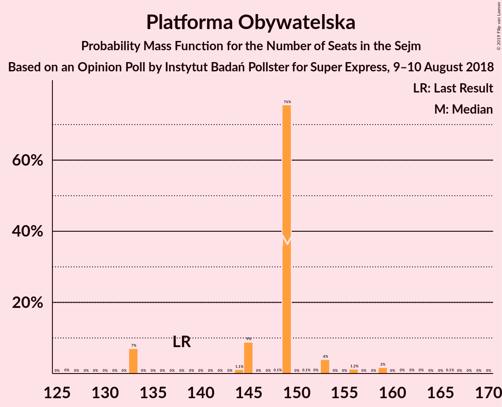

| Number of Seats | Probability | Accumulated | Special Marks |
|:---------------:|:-----------:|:-----------:|:-------------:|
| 125 | 0% | 100% |  |
| 126 | 0% | 99.9% |  |
| 127 | 0% | 99.9% |  |
| 128 | 0.1% | 99.8% |  |
| 129 | 0.1% | 99.8% |  |
| 130 | 0.1% | 99.7% |  |
| 131 | 0.2% | 99.5% |  |
| 132 | 0.3% | 99.4% |  |
| 133 | 0.6% | 99.1% |  |
| 134 | 0.6% | 98.6% |  |
| 135 | 0.8% | 98% |  |
| 136 | 2% | 97% |  |
| 137 | 0.3% | 95% |  |
| 138 | 2% | 95% | Last Result |
| 139 | 2% | 93% |  |
| 140 | 1.0% | 92% |  |
| 141 | 2% | 91% |  |
| 142 | 4% | 88% |  |
| 143 | 7% | 85% |  |
| 144 | 3% | 78% |  |
| 145 | 5% | 75% |  |
| 146 | 7% | 71% |  |
| 147 | 6% | 63% |  |
| 148 | 3% | 57% |  |
| 149 | 3% | 54% |  |
| 150 | 4% | 50% | Median |
| 151 | 4% | 46% |  |
| 152 | 4% | 42% |  |
| 153 | 4% | 38% |  |
| 154 | 9% | 34% |  |
| 155 | 1.3% | 25% |  |
| 156 | 4% | 23% |  |
| 157 | 1.1% | 19% |  |
| 158 | 3% | 18% |  |
| 159 | 3% | 15% |  |
| 160 | 0.6% | 12% |  |
| 161 | 3% | 12% |  |
| 162 | 0.6% | 8% |  |
| 163 | 2% | 8% |  |
| 164 | 0.7% | 6% |  |
| 165 | 0.8% | 5% |  |
| 166 | 0.6% | 4% |  |
| 167 | 2% | 4% |  |
| 168 | 0.3% | 2% |  |
| 169 | 0.4% | 2% |  |
| 170 | 0.4% | 1.2% |  |
| 171 | 0.1% | 0.8% |  |
| 172 | 0.2% | 0.7% |  |
| 173 | 0% | 0.5% |  |
| 174 | 0.1% | 0.4% |  |
| 175 | 0.1% | 0.3% |  |
| 176 | 0% | 0.2% |  |
| 177 | 0.1% | 0.2% |  |
| 178 | 0% | 0.1% |  |
| 179 | 0% | 0.1% |  |
| 180 | 0% | 0.1% |  |
| 181 | 0% | 0% |  |

### Kukiz’15

*For a full overview of the results for this party, see the [Kukiz’15](party-kukiz’15.html) page.*

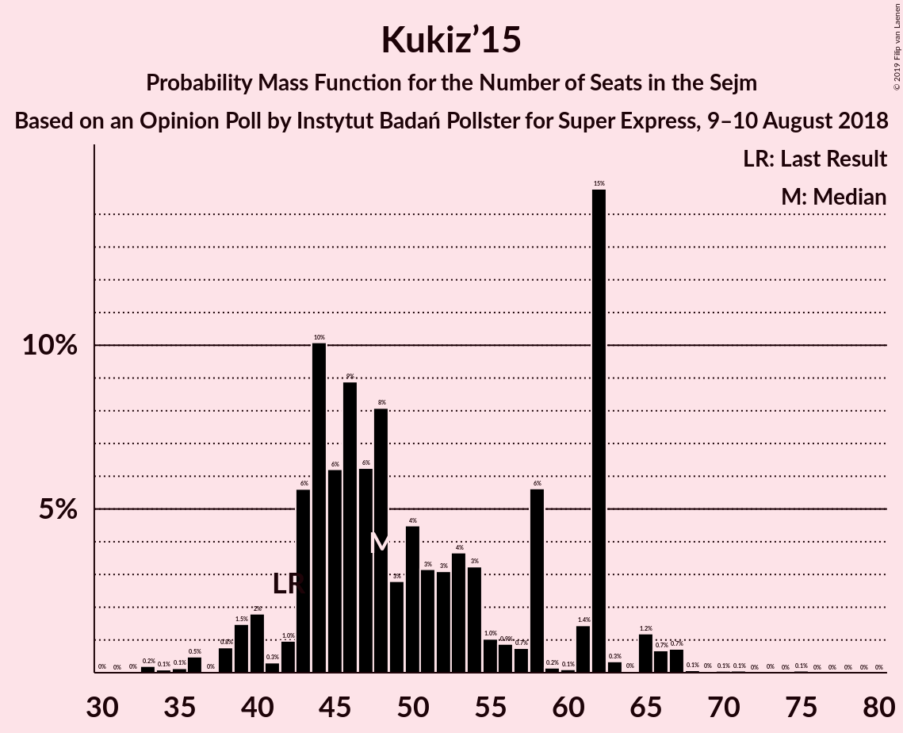

| Number of Seats | Probability | Accumulated | Special Marks |
|:---------------:|:-----------:|:-----------:|:-------------:|
| 33 | 0.1% | 100% |  |
| 34 | 0% | 99.9% |  |
| 35 | 0.2% | 99.9% |  |
| 36 | 0.1% | 99.7% |  |
| 37 | 0.2% | 99.6% |  |
| 38 | 0.2% | 99.4% |  |
| 39 | 0.8% | 99.3% |  |
| 40 | 0.6% | 98% |  |
| 41 | 1.1% | 98% |  |
| 42 | 1.2% | 97% | Last Result |
| 43 | 1.3% | 96% |  |
| 44 | 5% | 94% |  |
| 45 | 14% | 90% |  |
| 46 | 5% | 76% |  |
| 47 | 20% | 70% | Median |
| 48 | 9% | 50% |  |
| 49 | 3% | 41% |  |
| 50 | 9% | 38% |  |
| 51 | 4% | 29% |  |
| 52 | 2% | 24% |  |
| 53 | 3% | 22% |  |
| 54 | 4% | 19% |  |
| 55 | 4% | 15% |  |
| 56 | 3% | 11% |  |
| 57 | 2% | 8% |  |
| 58 | 1.3% | 6% |  |
| 59 | 1.0% | 5% |  |
| 60 | 0.7% | 4% |  |
| 61 | 0.5% | 3% |  |
| 62 | 1.1% | 3% |  |
| 63 | 0.7% | 1.4% |  |
| 64 | 0.2% | 0.8% |  |
| 65 | 0.1% | 0.6% |  |
| 66 | 0.2% | 0.4% |  |
| 67 | 0.1% | 0.3% |  |
| 68 | 0.1% | 0.2% |  |
| 69 | 0% | 0.1% |  |
| 70 | 0% | 0.1% |  |
| 71 | 0% | 0.1% |  |
| 72 | 0% | 0.1% |  |
| 73 | 0% | 0% |  |

### Sojusz Lewicy Demokratycznej

*For a full overview of the results for this party, see the [Sojusz Lewicy Demokratycznej](party-sojuszlewicydemokratycznej.html) page.*

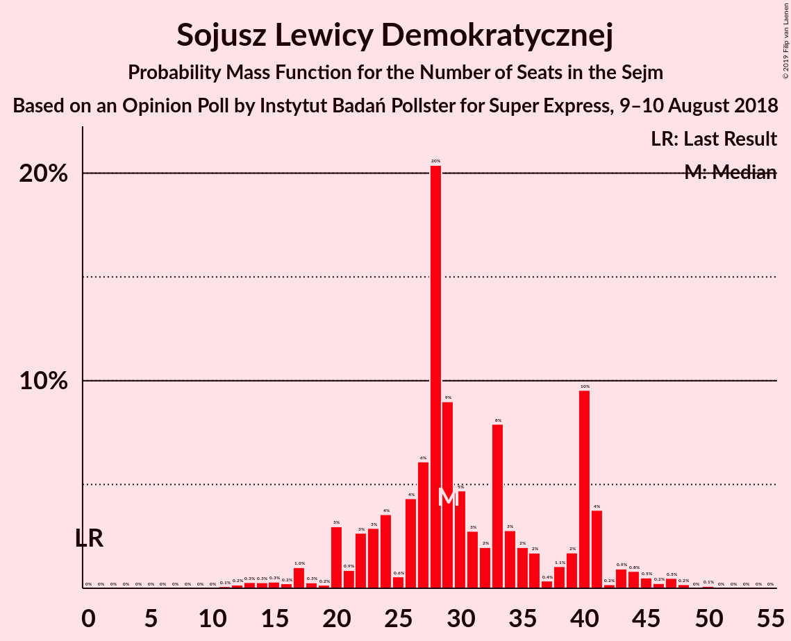

| Number of Seats | Probability | Accumulated | Special Marks |
|:---------------:|:-----------:|:-----------:|:-------------:|
| 0 | 0% | 100% | Last Result |
| 1 | 0% | 100% |  |
| 2 | 0% | 100% |  |
| 3 | 0% | 100% |  |
| 4 | 0% | 100% |  |
| 5 | 0% | 100% |  |
| 6 | 0% | 100% |  |
| 7 | 0% | 100% |  |
| 8 | 0% | 100% |  |
| 9 | 0% | 100% |  |
| 10 | 0% | 100% |  |
| 11 | 0% | 100% |  |
| 12 | 0% | 99.9% |  |
| 13 | 0.1% | 99.9% |  |
| 14 | 0.4% | 99.8% |  |
| 15 | 0.2% | 99.4% |  |
| 16 | 0.2% | 99.1% |  |
| 17 | 0.3% | 98.9% |  |
| 18 | 0.4% | 98.7% |  |
| 19 | 0.3% | 98% |  |
| 20 | 0.6% | 98% |  |
| 21 | 0.8% | 97% |  |
| 22 | 2% | 97% |  |
| 23 | 6% | 95% |  |
| 24 | 4% | 89% |  |
| 25 | 2% | 84% |  |
| 26 | 3% | 82% |  |
| 27 | 5% | 79% |  |
| 28 | 16% | 74% |  |
| 29 | 6% | 58% |  |
| 30 | 8% | 52% | Median |
| 31 | 5% | 44% |  |
| 32 | 7% | 39% |  |
| 33 | 6% | 32% |  |
| 34 | 6% | 26% |  |
| 35 | 2% | 20% |  |
| 36 | 1.3% | 18% |  |
| 37 | 2% | 17% |  |
| 38 | 5% | 14% |  |
| 39 | 3% | 10% |  |
| 40 | 2% | 7% |  |
| 41 | 2% | 4% |  |
| 42 | 0.5% | 3% |  |
| 43 | 0.4% | 2% |  |
| 44 | 0.6% | 2% |  |
| 45 | 0.9% | 1.3% |  |
| 46 | 0.1% | 0.4% |  |
| 47 | 0.1% | 0.3% |  |
| 48 | 0.1% | 0.2% |  |
| 49 | 0% | 0.1% |  |
| 50 | 0% | 0% |  |

### .Nowoczesna

*For a full overview of the results for this party, see the [.Nowoczesna](party-nowoczesna.html) page.*

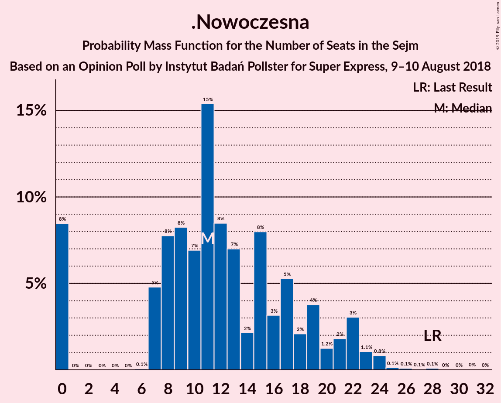

| Number of Seats | Probability | Accumulated | Special Marks |
|:---------------:|:-----------:|:-----------:|:-------------:|
| 0 | 7% | 100% |  |
| 1 | 0% | 93% |  |
| 2 | 0% | 93% |  |
| 3 | 0% | 93% |  |
| 4 | 0% | 93% |  |
| 5 | 0% | 93% |  |
| 6 | 0.1% | 93% |  |
| 7 | 6% | 93% |  |
| 8 | 10% | 87% |  |
| 9 | 9% | 77% |  |
| 10 | 5% | 68% |  |
| 11 | 18% | 63% | Median |
| 12 | 7% | 46% |  |
| 13 | 7% | 39% |  |
| 14 | 2% | 31% |  |
| 15 | 7% | 29% |  |
| 16 | 2% | 22% |  |
| 17 | 6% | 20% |  |
| 18 | 2% | 14% |  |
| 19 | 3% | 12% |  |
| 20 | 3% | 9% |  |
| 21 | 2% | 6% |  |
| 22 | 2% | 4% |  |
| 23 | 1.3% | 2% |  |
| 24 | 0.5% | 1.0% |  |
| 25 | 0.1% | 0.5% |  |
| 26 | 0.1% | 0.4% |  |
| 27 | 0.1% | 0.3% |  |
| 28 | 0.1% | 0.2% | Last Result |
| 29 | 0% | 0.1% |  |
| 30 | 0% | 0.1% |  |
| 31 | 0% | 0.1% |  |
| 32 | 0% | 0% |  |

### Polskie Stronnictwo Ludowe

*For a full overview of the results for this party, see the [Polskie Stronnictwo Ludowe](party-polskiestronnictwoludowe.html) page.*

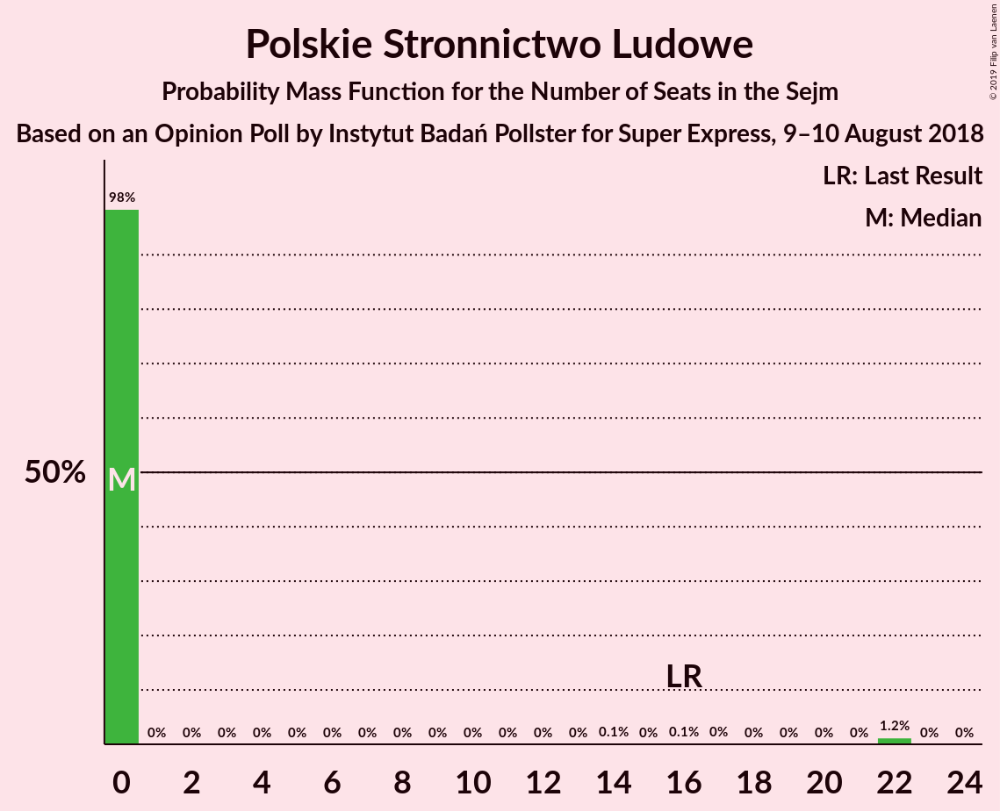

| Number of Seats | Probability | Accumulated | Special Marks |
|:---------------:|:-----------:|:-----------:|:-------------:|
| 0 | 94% | 100% | Median |
| 1 | 0% | 6% |  |
| 2 | 0% | 6% |  |
| 3 | 0% | 6% |  |
| 4 | 0% | 6% |  |
| 5 | 0% | 6% |  |
| 6 | 0% | 6% |  |
| 7 | 0% | 6% |  |
| 8 | 0% | 6% |  |
| 9 | 0% | 6% |  |
| 10 | 0% | 6% |  |
| 11 | 0% | 6% |  |
| 12 | 1.4% | 6% |  |
| 13 | 1.4% | 5% |  |
| 14 | 0.4% | 3% |  |
| 15 | 1.2% | 3% |  |
| 16 | 0.9% | 2% | Last Result |
| 17 | 0.2% | 0.9% |  |
| 18 | 0.4% | 0.8% |  |
| 19 | 0.2% | 0.4% |  |
| 20 | 0.1% | 0.2% |  |
| 21 | 0% | 0.1% |  |
| 22 | 0% | 0.1% |  |
| 23 | 0% | 0% |  |

### Lewica Razem

*For a full overview of the results for this party, see the [Lewica Razem](party-lewicarazem.html) page.*

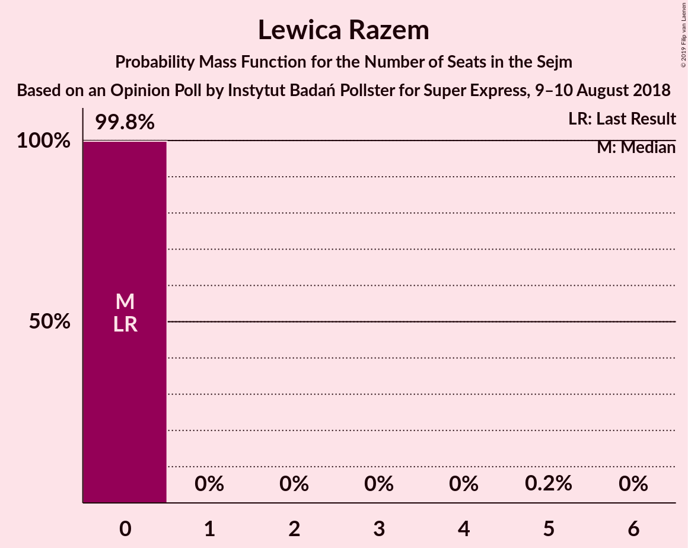

| Number of Seats | Probability | Accumulated | Special Marks |
|:---------------:|:-----------:|:-----------:|:-------------:|
| 0 | 99.9% | 100% | Last Result, Median |
| 1 | 0% | 0.1% |  |
| 2 | 0% | 0.1% |  |
| 3 | 0% | 0.1% |  |
| 4 | 0% | 0% |  |

### KORWiN

*For a full overview of the results for this party, see the [KORWiN](party-korwin.html) page.*

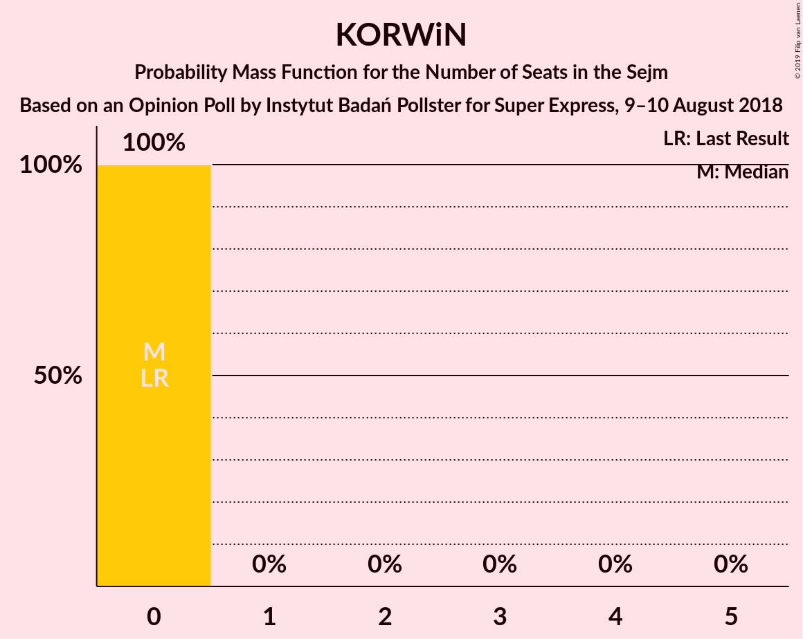

| Number of Seats | Probability | Accumulated | Special Marks |
|:---------------:|:-----------:|:-----------:|:-------------:|
| 0 | 100% | 100% | Last Result, Median |

## Coalitions

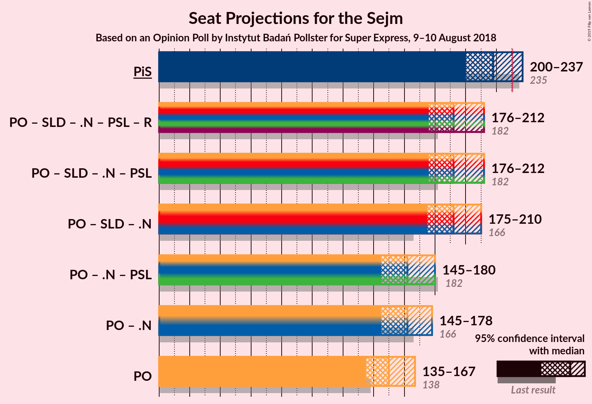

### Confidence Intervals

| Coalition | Last Result | Median | Majority? | 80% Confidence Interval | 90% Confidence Interval | 95% Confidence Interval | 99% Confidence Interval |
|:---------:|:-----------:|:------:|:---------:|:-----------------------:|:-----------------------:|:-----------------------:|:-----------------------:|
| Prawo i Sprawiedliwość | 235 | 218 | 8% | 207–230 | 203–232 | 200–237 | 194–240 |
| Platforma Obywatelska – Sojusz Lewicy Demokratycznej – .Nowoczesna – Polskie Stronnictwo Ludowe – Lewica Razem | 182 | 192 | 0% | 182–205 | 178–208 | 176–212 | 171–218 |
| Platforma Obywatelska – Sojusz Lewicy Demokratycznej – .Nowoczesna – Polskie Stronnictwo Ludowe | 182 | 192 | 0% | 182–205 | 178–208 | 176–212 | 171–218 |
| Platforma Obywatelska – Sojusz Lewicy Demokratycznej – .Nowoczesna | 166 | 192 | 0% | 181–203 | 178–207 | 175–210 | 171–217 |
| Platforma Obywatelska – .Nowoczesna – Polskie Stronnictwo Ludowe | 182 | 162 | 0% | 152–174 | 148–178 | 145–180 | 141–188 |
| Platforma Obywatelska – .Nowoczesna | 166 | 162 | 0% | 151–173 | 147–176 | 145–178 | 141–185 |
| Platforma Obywatelska | 138 | 150 | 0% | 141–161 | 137–164 | 135–167 | 131–172 |

### Prawo i Sprawiedliwość

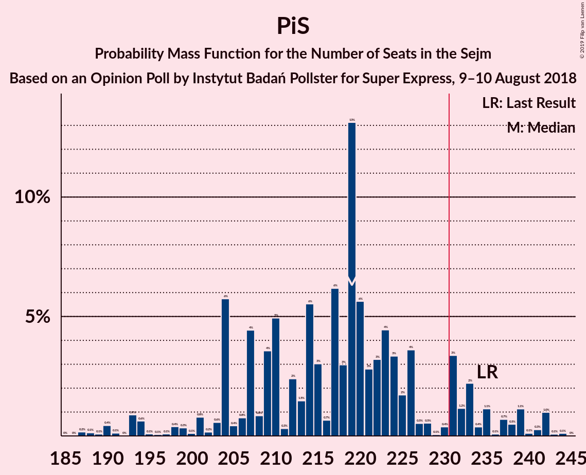

| Number of Seats | Probability | Accumulated | Special Marks |
|:---------------:|:-----------:|:-----------:|:-------------:|
| 187 | 0% | 100% |  |
| 188 | 0% | 99.9% |  |
| 189 | 0% | 99.9% |  |
| 190 | 0% | 99.9% |  |
| 191 | 0% | 99.8% |  |
| 192 | 0.1% | 99.8% |  |
| 193 | 0.1% | 99.7% |  |
| 194 | 0.3% | 99.6% |  |
| 195 | 0.2% | 99.3% |  |
| 196 | 0.2% | 99.1% |  |
| 197 | 0.4% | 98.9% |  |
| 198 | 0.3% | 98.5% |  |
| 199 | 0.7% | 98% |  |
| 200 | 0.6% | 98% |  |
| 201 | 0.7% | 97% |  |
| 202 | 0.2% | 96% |  |
| 203 | 2% | 96% |  |
| 204 | 0.8% | 94% |  |
| 205 | 0.9% | 94% |  |
| 206 | 2% | 93% |  |
| 207 | 4% | 91% |  |
| 208 | 3% | 87% |  |
| 209 | 3% | 84% |  |
| 210 | 2% | 81% |  |
| 211 | 4% | 79% |  |
| 212 | 4% | 75% |  |
| 213 | 7% | 70% |  |
| 214 | 5% | 64% |  |
| 215 | 2% | 59% |  |
| 216 | 3% | 57% |  |
| 217 | 4% | 55% |  |
| 218 | 4% | 51% | Median |
| 219 | 2% | 46% |  |
| 220 | 3% | 44% |  |
| 221 | 2% | 41% |  |
| 222 | 1.3% | 39% |  |
| 223 | 10% | 38% |  |
| 224 | 1.3% | 28% |  |
| 225 | 8% | 27% |  |
| 226 | 3% | 18% |  |
| 227 | 0.9% | 15% |  |
| 228 | 3% | 14% |  |
| 229 | 0.6% | 11% |  |
| 230 | 2% | 11% |  |
| 231 | 2% | 8% | Majority |
| 232 | 2% | 7% |  |
| 233 | 0.4% | 5% |  |
| 234 | 0.7% | 4% |  |
| 235 | 0.9% | 4% | Last Result |
| 236 | 0.2% | 3% |  |
| 237 | 1.3% | 3% |  |
| 238 | 0.5% | 1.3% |  |
| 239 | 0.1% | 0.8% |  |
| 240 | 0.3% | 0.6% |  |
| 241 | 0.1% | 0.4% |  |
| 242 | 0.1% | 0.3% |  |
| 243 | 0% | 0.2% |  |
| 244 | 0% | 0.1% |  |
| 245 | 0% | 0.1% |  |
| 246 | 0% | 0.1% |  |
| 247 | 0% | 0% |  |

### Platforma Obywatelska – Sojusz Lewicy Demokratycznej – .Nowoczesna – Polskie Stronnictwo Ludowe – Lewica Razem

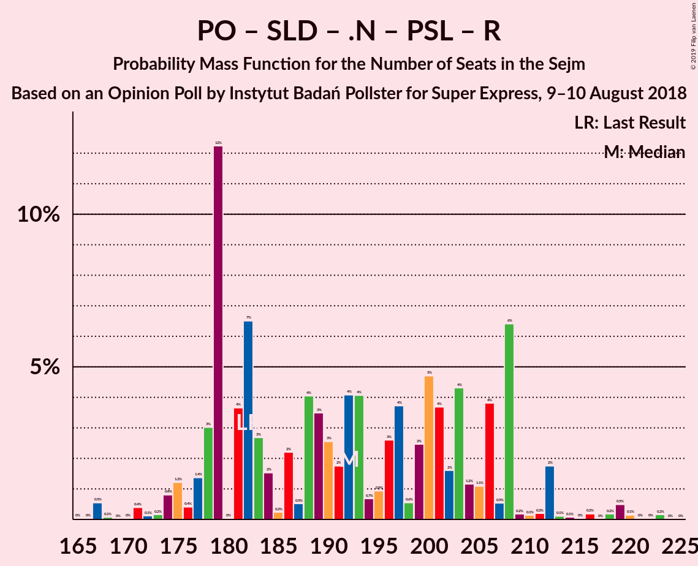

| Number of Seats | Probability | Accumulated | Special Marks |
|:---------------:|:-----------:|:-----------:|:-------------:|
| 164 | 0% | 100% |  |
| 165 | 0% | 99.9% |  |
| 166 | 0% | 99.9% |  |
| 167 | 0.1% | 99.9% |  |
| 168 | 0.1% | 99.8% |  |
| 169 | 0% | 99.7% |  |
| 170 | 0.1% | 99.7% |  |
| 171 | 0.4% | 99.6% |  |
| 172 | 0.3% | 99.3% |  |
| 173 | 0.4% | 99.0% |  |
| 174 | 0.6% | 98.6% |  |
| 175 | 0.3% | 98% |  |
| 176 | 2% | 98% |  |
| 177 | 0.4% | 96% |  |
| 178 | 1.4% | 96% |  |
| 179 | 3% | 94% |  |
| 180 | 0.3% | 92% |  |
| 181 | 1.0% | 92% |  |
| 182 | 1.3% | 91% | Last Result |
| 183 | 3% | 89% |  |
| 184 | 2% | 86% |  |
| 185 | 2% | 84% |  |
| 186 | 3% | 82% |  |
| 187 | 3% | 79% |  |
| 188 | 4% | 76% |  |
| 189 | 3% | 73% |  |
| 190 | 10% | 70% |  |
| 191 | 4% | 59% | Median |
| 192 | 6% | 55% |  |
| 193 | 2% | 49% |  |
| 194 | 4% | 48% |  |
| 195 | 5% | 44% |  |
| 196 | 3% | 39% |  |
| 197 | 5% | 36% |  |
| 198 | 3% | 31% |  |
| 199 | 4% | 28% |  |
| 200 | 6% | 24% |  |
| 201 | 2% | 18% |  |
| 202 | 2% | 17% |  |
| 203 | 2% | 15% |  |
| 204 | 1.5% | 12% |  |
| 205 | 3% | 11% |  |
| 206 | 1.4% | 8% |  |
| 207 | 1.1% | 7% |  |
| 208 | 0.8% | 5% |  |
| 209 | 0.3% | 5% |  |
| 210 | 1.2% | 4% |  |
| 211 | 0.3% | 3% |  |
| 212 | 0.7% | 3% |  |
| 213 | 0.5% | 2% |  |
| 214 | 0.3% | 2% |  |
| 215 | 0.4% | 1.5% |  |
| 216 | 0.1% | 1.0% |  |
| 217 | 0.3% | 0.9% |  |
| 218 | 0.1% | 0.6% |  |
| 219 | 0.2% | 0.5% |  |
| 220 | 0.1% | 0.2% |  |
| 221 | 0% | 0.2% |  |
| 222 | 0% | 0.1% |  |
| 223 | 0% | 0.1% |  |
| 224 | 0% | 0.1% |  |
| 225 | 0% | 0.1% |  |
| 226 | 0% | 0% |  |

### Platforma Obywatelska – Sojusz Lewicy Demokratycznej – .Nowoczesna – Polskie Stronnictwo Ludowe

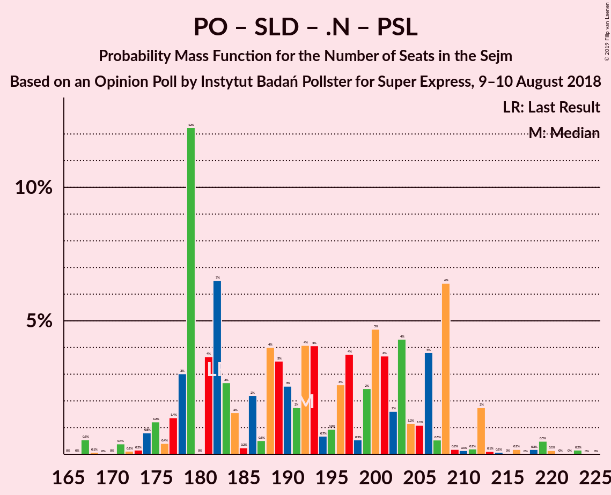

| Number of Seats | Probability | Accumulated | Special Marks |
|:---------------:|:-----------:|:-----------:|:-------------:|
| 164 | 0% | 100% |  |
| 165 | 0% | 99.9% |  |
| 166 | 0% | 99.9% |  |
| 167 | 0.1% | 99.9% |  |
| 168 | 0.1% | 99.8% |  |
| 169 | 0% | 99.7% |  |
| 170 | 0.1% | 99.7% |  |
| 171 | 0.4% | 99.6% |  |
| 172 | 0.3% | 99.3% |  |
| 173 | 0.4% | 99.0% |  |
| 174 | 0.6% | 98.6% |  |
| 175 | 0.3% | 98% |  |
| 176 | 2% | 98% |  |
| 177 | 0.4% | 96% |  |
| 178 | 1.4% | 96% |  |
| 179 | 3% | 94% |  |
| 180 | 0.3% | 92% |  |
| 181 | 1.0% | 92% |  |
| 182 | 1.3% | 91% | Last Result |
| 183 | 3% | 89% |  |
| 184 | 2% | 86% |  |
| 185 | 2% | 84% |  |
| 186 | 3% | 82% |  |
| 187 | 3% | 79% |  |
| 188 | 4% | 76% |  |
| 189 | 3% | 73% |  |
| 190 | 10% | 70% |  |
| 191 | 4% | 59% | Median |
| 192 | 6% | 55% |  |
| 193 | 2% | 49% |  |
| 194 | 4% | 48% |  |
| 195 | 5% | 44% |  |
| 196 | 3% | 39% |  |
| 197 | 5% | 36% |  |
| 198 | 3% | 31% |  |
| 199 | 4% | 28% |  |
| 200 | 6% | 24% |  |
| 201 | 2% | 18% |  |
| 202 | 2% | 17% |  |
| 203 | 2% | 15% |  |
| 204 | 1.5% | 12% |  |
| 205 | 3% | 11% |  |
| 206 | 1.4% | 8% |  |
| 207 | 1.1% | 7% |  |
| 208 | 0.8% | 5% |  |
| 209 | 0.3% | 5% |  |
| 210 | 1.2% | 4% |  |
| 211 | 0.3% | 3% |  |
| 212 | 0.7% | 3% |  |
| 213 | 0.5% | 2% |  |
| 214 | 0.3% | 2% |  |
| 215 | 0.4% | 1.5% |  |
| 216 | 0.1% | 1.0% |  |
| 217 | 0.3% | 0.9% |  |
| 218 | 0.1% | 0.6% |  |
| 219 | 0.2% | 0.5% |  |
| 220 | 0.1% | 0.2% |  |
| 221 | 0% | 0.2% |  |
| 222 | 0% | 0.1% |  |
| 223 | 0% | 0.1% |  |
| 224 | 0% | 0.1% |  |
| 225 | 0% | 0.1% |  |
| 226 | 0% | 0% |  |

### Platforma Obywatelska – Sojusz Lewicy Demokratycznej – .Nowoczesna

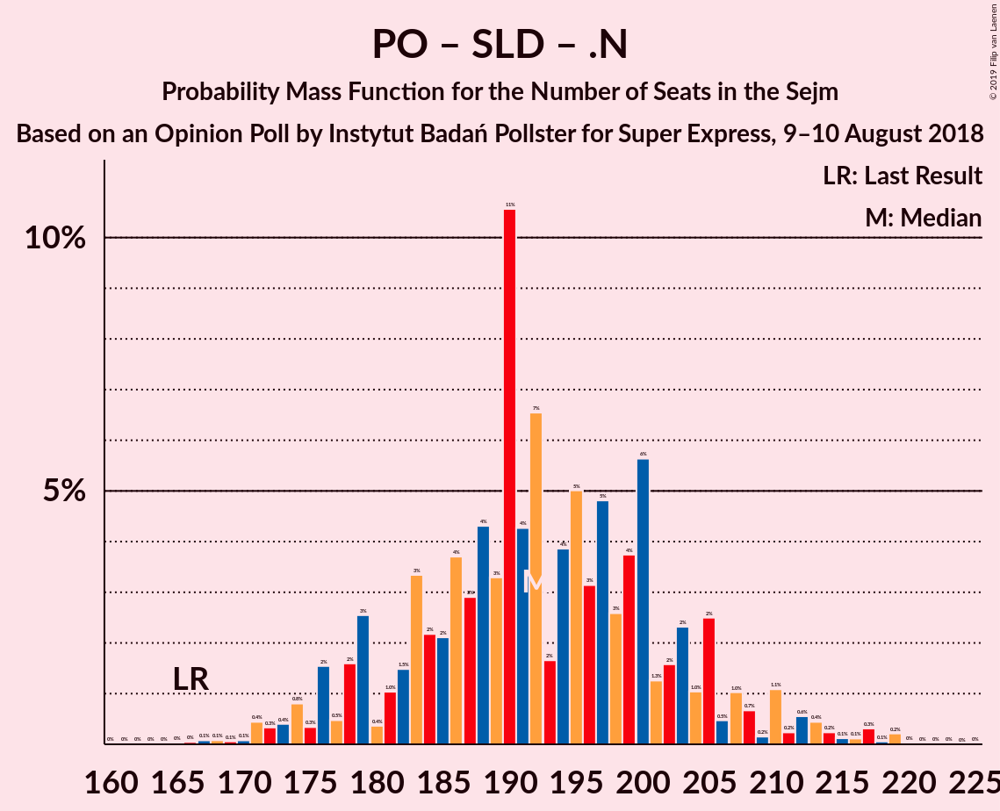

| Number of Seats | Probability | Accumulated | Special Marks |
|:---------------:|:-----------:|:-----------:|:-------------:|
| 163 | 0% | 100% |  |
| 164 | 0% | 99.9% |  |
| 165 | 0% | 99.9% |  |
| 166 | 0% | 99.9% | Last Result |
| 167 | 0.1% | 99.9% |  |
| 168 | 0.1% | 99.8% |  |
| 169 | 0.1% | 99.7% |  |
| 170 | 0.1% | 99.6% |  |
| 171 | 0.4% | 99.6% |  |
| 172 | 0.3% | 99.1% |  |
| 173 | 0.4% | 98.8% |  |
| 174 | 0.8% | 98% |  |
| 175 | 0.3% | 98% |  |
| 176 | 2% | 97% |  |
| 177 | 0.5% | 96% |  |
| 178 | 2% | 95% |  |
| 179 | 3% | 94% |  |
| 180 | 0.4% | 91% |  |
| 181 | 1.0% | 91% |  |
| 182 | 1.5% | 90% |  |
| 183 | 3% | 88% |  |
| 184 | 2% | 85% |  |
| 185 | 2% | 83% |  |
| 186 | 4% | 81% |  |
| 187 | 3% | 77% |  |
| 188 | 4% | 74% |  |
| 189 | 3% | 70% |  |
| 190 | 11% | 66% |  |
| 191 | 4% | 56% | Median |
| 192 | 7% | 51% |  |
| 193 | 2% | 45% |  |
| 194 | 4% | 43% |  |
| 195 | 5% | 39% |  |
| 196 | 3% | 34% |  |
| 197 | 5% | 31% |  |
| 198 | 3% | 26% |  |
| 199 | 4% | 24% |  |
| 200 | 6% | 20% |  |
| 201 | 1.3% | 14% |  |
| 202 | 2% | 13% |  |
| 203 | 2% | 12% |  |
| 204 | 1.0% | 9% |  |
| 205 | 2% | 8% |  |
| 206 | 0.5% | 6% |  |
| 207 | 1.0% | 5% |  |
| 208 | 0.7% | 4% |  |
| 209 | 0.2% | 4% |  |
| 210 | 1.1% | 3% |  |
| 211 | 0.2% | 2% |  |
| 212 | 0.6% | 2% |  |
| 213 | 0.4% | 2% |  |
| 214 | 0.2% | 1.1% |  |
| 215 | 0.1% | 0.9% |  |
| 216 | 0.1% | 0.8% |  |
| 217 | 0.3% | 0.7% |  |
| 218 | 0.1% | 0.4% |  |
| 219 | 0.2% | 0.3% |  |
| 220 | 0% | 0.1% |  |
| 221 | 0% | 0.1% |  |
| 222 | 0% | 0.1% |  |
| 223 | 0% | 0% |  |

### Platforma Obywatelska – .Nowoczesna – Polskie Stronnictwo Ludowe

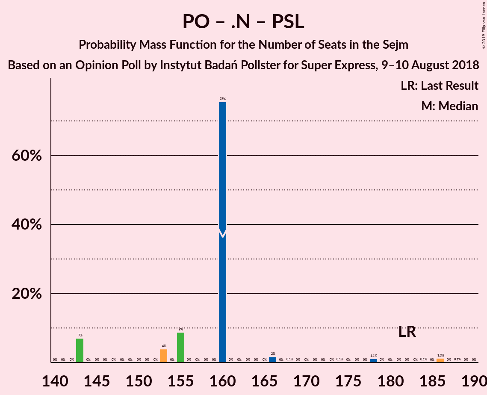

| Number of Seats | Probability | Accumulated | Special Marks |
|:---------------:|:-----------:|:-----------:|:-------------:|
| 134 | 0% | 100% |  |
| 135 | 0% | 99.9% |  |
| 136 | 0.1% | 99.9% |  |
| 137 | 0% | 99.9% |  |
| 138 | 0.1% | 99.8% |  |
| 139 | 0.1% | 99.7% |  |
| 140 | 0.1% | 99.7% |  |
| 141 | 0.6% | 99.6% |  |
| 142 | 0.2% | 99.1% |  |
| 143 | 0.4% | 98.9% |  |
| 144 | 0.6% | 98% |  |
| 145 | 2% | 98% |  |
| 146 | 0.5% | 96% |  |
| 147 | 0.5% | 96% |  |
| 148 | 1.1% | 95% |  |
| 149 | 0.8% | 94% |  |
| 150 | 0.9% | 93% |  |
| 151 | 2% | 92% |  |
| 152 | 0.8% | 90% |  |
| 153 | 1.3% | 90% |  |
| 154 | 3% | 88% |  |
| 155 | 2% | 85% |  |
| 156 | 3% | 84% |  |
| 157 | 0.9% | 80% |  |
| 158 | 8% | 79% |  |
| 159 | 7% | 72% |  |
| 160 | 3% | 65% |  |
| 161 | 4% | 61% | Median |
| 162 | 11% | 57% |  |
| 163 | 6% | 46% |  |
| 164 | 5% | 40% |  |
| 165 | 0.9% | 35% |  |
| 166 | 3% | 35% |  |
| 167 | 3% | 32% |  |
| 168 | 3% | 29% |  |
| 169 | 6% | 26% |  |
| 170 | 2% | 20% |  |
| 171 | 2% | 18% |  |
| 172 | 2% | 16% |  |
| 173 | 4% | 14% |  |
| 174 | 2% | 10% |  |
| 175 | 0.9% | 9% |  |
| 176 | 2% | 8% |  |
| 177 | 1.1% | 6% |  |
| 178 | 2% | 5% |  |
| 179 | 0.7% | 3% |  |
| 180 | 0.3% | 3% |  |
| 181 | 0.4% | 2% |  |
| 182 | 0.2% | 2% | Last Result |
| 183 | 0.3% | 2% |  |
| 184 | 0.2% | 2% |  |
| 185 | 0.5% | 1.4% |  |
| 186 | 0.2% | 0.9% |  |
| 187 | 0.2% | 0.7% |  |
| 188 | 0.1% | 0.5% |  |
| 189 | 0.2% | 0.4% |  |
| 190 | 0.1% | 0.3% |  |
| 191 | 0% | 0.2% |  |
| 192 | 0% | 0.2% |  |
| 193 | 0% | 0.1% |  |
| 194 | 0% | 0.1% |  |
| 195 | 0% | 0.1% |  |
| 196 | 0% | 0% |  |

### Platforma Obywatelska – .Nowoczesna

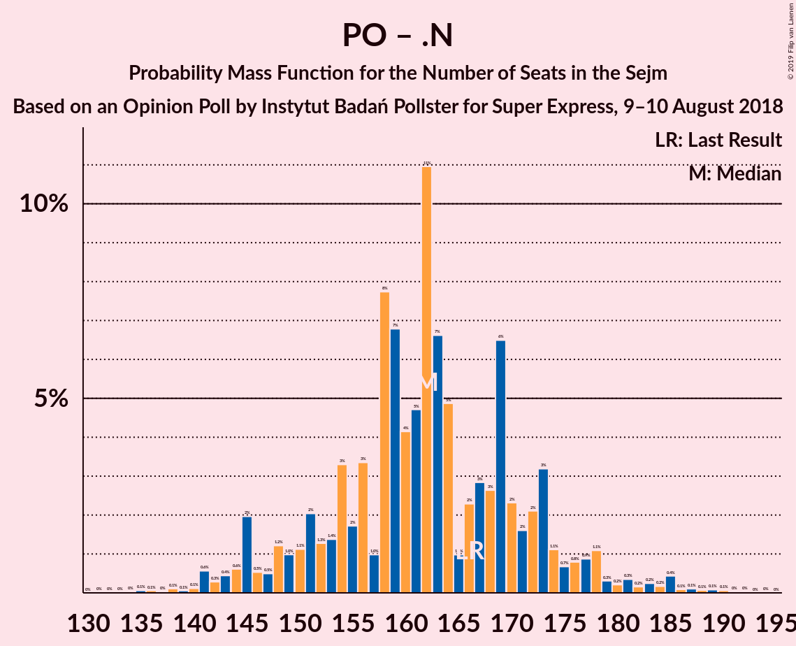

| Number of Seats | Probability | Accumulated | Special Marks |
|:---------------:|:-----------:|:-----------:|:-------------:|
| 134 | 0% | 100% |  |
| 135 | 0.1% | 99.9% |  |
| 136 | 0.1% | 99.9% |  |
| 137 | 0% | 99.8% |  |
| 138 | 0.1% | 99.8% |  |
| 139 | 0.1% | 99.7% |  |
| 140 | 0.1% | 99.6% |  |
| 141 | 0.6% | 99.5% |  |
| 142 | 0.3% | 98.9% |  |
| 143 | 0.4% | 98.7% |  |
| 144 | 0.6% | 98% |  |
| 145 | 2% | 98% |  |
| 146 | 0.5% | 96% |  |
| 147 | 0.5% | 95% |  |
| 148 | 1.2% | 95% |  |
| 149 | 1.0% | 93% |  |
| 150 | 1.1% | 92% |  |
| 151 | 2% | 91% |  |
| 152 | 1.3% | 89% |  |
| 153 | 1.4% | 88% |  |
| 154 | 3% | 87% |  |
| 155 | 2% | 83% |  |
| 156 | 3% | 82% |  |
| 157 | 1.0% | 78% |  |
| 158 | 8% | 77% |  |
| 159 | 7% | 69% |  |
| 160 | 4% | 63% |  |
| 161 | 5% | 59% | Median |
| 162 | 11% | 54% |  |
| 163 | 7% | 43% |  |
| 164 | 5% | 36% |  |
| 165 | 1.0% | 31% |  |
| 166 | 2% | 30% | Last Result |
| 167 | 3% | 28% |  |
| 168 | 3% | 25% |  |
| 169 | 6% | 23% |  |
| 170 | 2% | 16% |  |
| 171 | 2% | 14% |  |
| 172 | 2% | 12% |  |
| 173 | 3% | 10% |  |
| 174 | 1.1% | 7% |  |
| 175 | 0.7% | 6% |  |
| 176 | 0.8% | 5% |  |
| 177 | 0.9% | 4% |  |
| 178 | 1.1% | 3% |  |
| 179 | 0.3% | 2% |  |
| 180 | 0.2% | 2% |  |
| 181 | 0.3% | 2% |  |
| 182 | 0.2% | 2% |  |
| 183 | 0.2% | 1.3% |  |
| 184 | 0.2% | 1.1% |  |
| 185 | 0.4% | 0.9% |  |
| 186 | 0.1% | 0.5% |  |
| 187 | 0.1% | 0.4% |  |
| 188 | 0.1% | 0.3% |  |
| 189 | 0.1% | 0.2% |  |
| 190 | 0.1% | 0.1% |  |
| 191 | 0% | 0.1% |  |
| 192 | 0% | 0.1% |  |
| 193 | 0% | 0% |  |

### Platforma Obywatelska

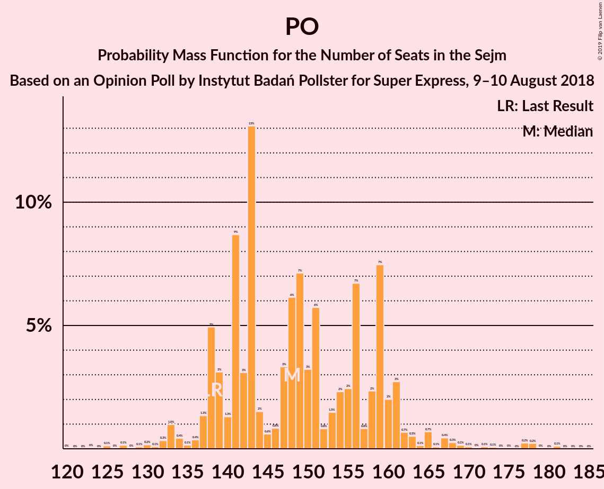

| Number of Seats | Probability | Accumulated | Special Marks |
|:---------------:|:-----------:|:-----------:|:-------------:|
| 125 | 0% | 100% |  |
| 126 | 0% | 99.9% |  |
| 127 | 0% | 99.9% |  |
| 128 | 0.1% | 99.8% |  |
| 129 | 0.1% | 99.8% |  |
| 130 | 0.1% | 99.7% |  |
| 131 | 0.2% | 99.5% |  |
| 132 | 0.3% | 99.4% |  |
| 133 | 0.6% | 99.1% |  |
| 134 | 0.6% | 98.6% |  |
| 135 | 0.8% | 98% |  |
| 136 | 2% | 97% |  |
| 137 | 0.3% | 95% |  |
| 138 | 2% | 95% | Last Result |
| 139 | 2% | 93% |  |
| 140 | 1.0% | 92% |  |
| 141 | 2% | 91% |  |
| 142 | 4% | 88% |  |
| 143 | 7% | 85% |  |
| 144 | 3% | 78% |  |
| 145 | 5% | 75% |  |
| 146 | 7% | 71% |  |
| 147 | 6% | 63% |  |
| 148 | 3% | 57% |  |
| 149 | 3% | 54% |  |
| 150 | 4% | 50% | Median |
| 151 | 4% | 46% |  |
| 152 | 4% | 42% |  |
| 153 | 4% | 38% |  |
| 154 | 9% | 34% |  |
| 155 | 1.3% | 25% |  |
| 156 | 4% | 23% |  |
| 157 | 1.1% | 19% |  |
| 158 | 3% | 18% |  |
| 159 | 3% | 15% |  |
| 160 | 0.6% | 12% |  |
| 161 | 3% | 12% |  |
| 162 | 0.6% | 8% |  |
| 163 | 2% | 8% |  |
| 164 | 0.7% | 6% |  |
| 165 | 0.8% | 5% |  |
| 166 | 0.6% | 4% |  |
| 167 | 2% | 4% |  |
| 168 | 0.3% | 2% |  |
| 169 | 0.4% | 2% |  |
| 170 | 0.4% | 1.2% |  |
| 171 | 0.1% | 0.8% |  |
| 172 | 0.2% | 0.7% |  |
| 173 | 0% | 0.5% |  |
| 174 | 0.1% | 0.4% |  |
| 175 | 0.1% | 0.3% |  |
| 176 | 0% | 0.2% |  |
| 177 | 0.1% | 0.2% |  |
| 178 | 0% | 0.1% |  |
| 179 | 0% | 0.1% |  |
| 180 | 0% | 0.1% |  |
| 181 | 0% | 0% |  |

## Technical Information

### Opinion Poll

+ **Polling firm:** Instytut Badań Pollster
+ **Commissioner(s):** Super Express
+ **Fieldwork period:** 9–10 August 2018

### Calculations

+ **Sample size:** 1035
+ **Simulations done:** 1,048,576
+ **Error estimate:** 4.34%

