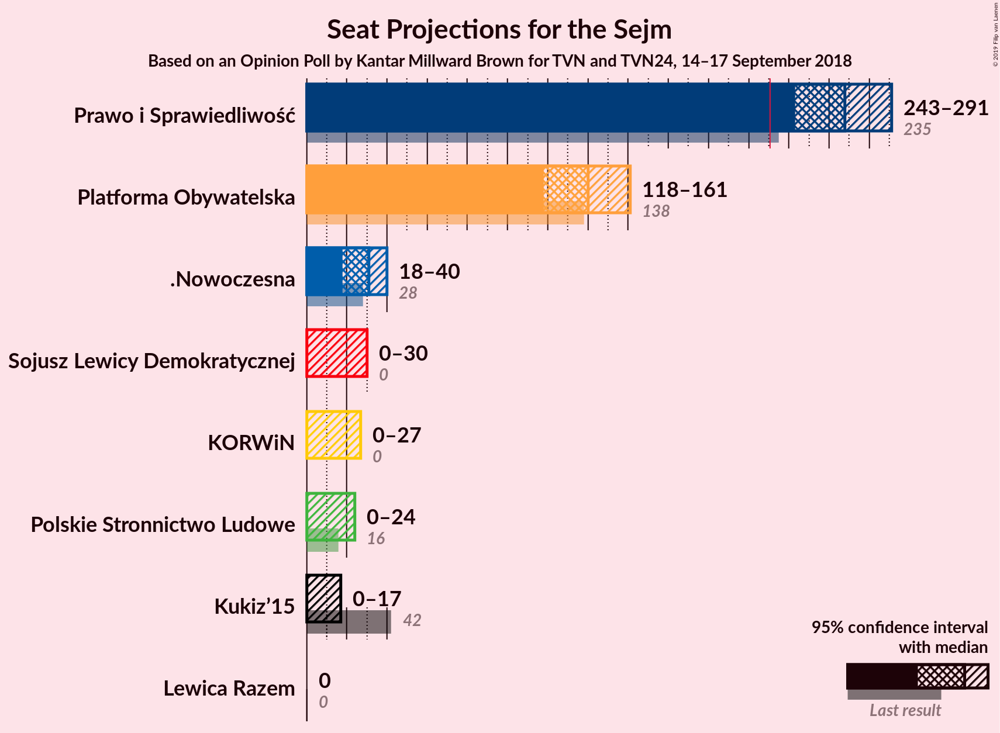

# Opinion Poll by Kantar Millward Brown for TVN and TVN24, 14–17 September 2018

<a href="#voting-intentions">Voting Intentions</a> | <a href="#seats">Seats</a> | <a href="#coalitions">Coalitions</a> | <a href="#technical-information">Technical Information</a>

## Voting Intentions

### Confidence Intervals

| Party | Last Result | Poll Result | 80% Confidence Interval | 90% Confidence Interval | 95% Confidence Interval | 99% Confidence Interval |
|:-----:|:-----------:|:-----------:|:-----------------------:|:-----------------------:|:-----------------------:|:-----------------------:|
| Prawo i Sprawiedliwość | 37.6% | 38.0% | 36.0–40.0% |35.5–40.5% |35.0–41.0% |34.1–42.0% |
| Platforma Obywatelska | 24.1% | 21.0% | 19.4–22.7% |18.9–23.2% |18.6–23.6% |17.8–24.5% |
| .Nowoczesna | 7.6% | 7.0% | 6.1–8.1% |5.8–8.5% |5.6–8.7% |5.2–9.3% |
| Sojusz Lewicy Demokratycznej | 7.6% | 5.0% | 4.2–6.0% |4.0–6.3% |3.8–6.5% |3.5–7.0% |
| KORWiN | 4.8% | 5.0% | 4.2–6.0% |4.0–6.3% |3.8–6.5% |3.5–7.0% |
| Kukiz’15 | 8.8% | 4.0% | 3.3–4.9% |3.1–5.2% |2.9–5.4% |2.6–5.9% |
| Polskie Stronnictwo Ludowe | 5.1% | 4.0% | 3.3–4.9% |3.1–5.2% |2.9–5.4% |2.6–5.9% |
| Lewica Razem | 3.6% | 4.0% | 3.3–4.9% |3.1–5.2% |2.9–5.4% |2.6–5.9% |

*Note:* The poll result column reflects the actual value used in the calculations. Published results may vary slightly, and in addition be rounded to fewer digits.

## Seats

### Confidence Intervals

| Party | Last Result | Median | 80% Confidence Interval | 90% Confidence Interval | 95% Confidence Interval | 99% Confidence Interval |
|:-----:|:-----------:|:------:|:-----------------------:|:-----------------------:|:-----------------------:|:-----------------------:|
| <a href="#prawo-i-sprawiedliwość">Prawo i Sprawiedliwość</a> | 235 | 259 | 259–263 |259–263 |259–263 |255–296 |
| <a href="#platforma-obywatelska">Platforma Obywatelska</a> | 138 | 124 | 124 |124–126 |124–129 |119–139 |
| <a href="#.nowoczesna">.Nowoczesna</a> | 28 | 33 | 22–33 |22–33 |22–33 |21–33 |
| <a href="#sojusz-lewicy-demokratycznej">Sojusz Lewicy Demokratycznej</a> | 0 | 26 | 0–26 |0–26 |0–26 |0–26 |
| <a href="#korwin">KORWiN</a> | 0 | 18 | 12–18 |12–18 |0–18 |0–18 |
| <a href="#kukiz’15">Kukiz’15</a> | 42 | 0 | 0 |0 |0 |0 |
| <a href="#polskie-stronnictwo-ludowe">Polskie Stronnictwo Ludowe</a> | 16 | 0 | 0–21 |0–21 |0–21 |0–23 |
| <a href="#lewica-razem">Lewica Razem</a> | 0 | 0 | 0–18 |0–18 |0–18 |0–18 |

### Prawo i Sprawiedliwość

*For a full overview of the results for this party, see the [Prawo i Sprawiedliwość](party-prawoisprawiedliwość.html) page.*

| Number of Seats | Probability | Accumulated | Special Marks |
|:---------------:|:-----------:|:-----------:|:-------------:|
| 235 | 0% | 100% | Last Result |
| 236 | 0% | 100% |  |
| 237 | 0% | 100% |  |
| 238 | 0% | 100% |  |
| 239 | 0% | 100% |  |
| 240 | 0% | 100% |  |
| 241 | 0% | 100% |  |
| 242 | 0% | 100% |  |
| 243 | 0% | 100% |  |
| 244 | 0.1% | 100% |  |
| 245 | 0% | 99.9% |  |
| 246 | 0% | 99.9% |  |
| 247 | 0% | 99.9% |  |
| 248 | 0% | 99.9% |  |
| 249 | 0% | 99.9% |  |
| 250 | 0% | 99.9% |  |
| 251 | 0% | 99.9% |  |
| 252 | 0% | 99.9% |  |
| 253 | 0% | 99.9% |  |
| 254 | 0.3% | 99.8% |  |
| 255 | 0.1% | 99.5% |  |
| 256 | 0% | 99.5% |  |
| 257 | 0% | 99.4% |  |
| 258 | 0% | 99.4% |  |
| 259 | 79% | 99.4% | Median |
| 260 | 0% | 21% |  |
| 261 | 0% | 21% |  |
| 262 | 0.1% | 21% |  |
| 263 | 20% | 21% |  |
| 264 | 0% | 1.0% |  |
| 265 | 0.1% | 1.0% |  |
| 266 | 0% | 0.8% |  |
| 267 | 0% | 0.8% |  |
| 268 | 0% | 0.8% |  |
| 269 | 0% | 0.8% |  |
| 270 | 0% | 0.8% |  |
| 271 | 0% | 0.8% |  |
| 272 | 0% | 0.8% |  |
| 273 | 0% | 0.8% |  |
| 274 | 0% | 0.8% |  |
| 275 | 0% | 0.8% |  |
| 276 | 0% | 0.8% |  |
| 277 | 0% | 0.8% |  |
| 278 | 0% | 0.8% |  |
| 279 | 0% | 0.8% |  |
| 280 | 0% | 0.8% |  |
| 281 | 0% | 0.8% |  |
| 282 | 0% | 0.8% |  |
| 283 | 0% | 0.8% |  |
| 284 | 0% | 0.8% |  |
| 285 | 0% | 0.8% |  |
| 286 | 0% | 0.8% |  |
| 287 | 0% | 0.8% |  |
| 288 | 0% | 0.8% |  |
| 289 | 0% | 0.8% |  |
| 290 | 0% | 0.8% |  |
| 291 | 0% | 0.8% |  |
| 292 | 0% | 0.8% |  |
| 293 | 0% | 0.8% |  |
| 294 | 0% | 0.8% |  |
| 295 | 0% | 0.8% |  |
| 296 | 0.8% | 0.8% |  |
| 297 | 0% | 0% |  |

### Platforma Obywatelska

*For a full overview of the results for this party, see the [Platforma Obywatelska](party-platformaobywatelska.html) page.*

| Number of Seats | Probability | Accumulated | Special Marks |
|:---------------:|:-----------:|:-----------:|:-------------:|
| 99 | 0.1% | 100% |  |
| 100 | 0% | 99.9% |  |
| 101 | 0% | 99.9% |  |
| 102 | 0% | 99.9% |  |
| 103 | 0% | 99.9% |  |
| 104 | 0% | 99.9% |  |
| 105 | 0% | 99.9% |  |
| 106 | 0% | 99.9% |  |
| 107 | 0% | 99.9% |  |
| 108 | 0% | 99.9% |  |
| 109 | 0% | 99.9% |  |
| 110 | 0% | 99.9% |  |
| 111 | 0.1% | 99.9% |  |
| 112 | 0% | 99.8% |  |
| 113 | 0% | 99.8% |  |
| 114 | 0% | 99.8% |  |
| 115 | 0% | 99.8% |  |
| 116 | 0% | 99.8% |  |
| 117 | 0% | 99.8% |  |
| 118 | 0% | 99.8% |  |
| 119 | 0.4% | 99.8% |  |
| 120 | 0% | 99.3% |  |
| 121 | 0% | 99.3% |  |
| 122 | 0% | 99.3% |  |
| 123 | 0% | 99.3% |  |
| 124 | 92% | 99.3% | Median |
| 125 | 0% | 8% |  |
| 126 | 5% | 8% |  |
| 127 | 0% | 3% |  |
| 128 | 0% | 3% |  |
| 129 | 2% | 3% |  |
| 130 | 0.1% | 1.0% |  |
| 131 | 0% | 0.8% |  |
| 132 | 0% | 0.8% |  |
| 133 | 0% | 0.8% |  |
| 134 | 0% | 0.8% |  |
| 135 | 0% | 0.8% |  |
| 136 | 0% | 0.8% |  |
| 137 | 0% | 0.8% |  |
| 138 | 0% | 0.8% | Last Result |
| 139 | 0.8% | 0.8% |  |
| 140 | 0% | 0% |  |

### .Nowoczesna

*For a full overview of the results for this party, see the [.Nowoczesna](party-nowoczesna.html) page.*

| Number of Seats | Probability | Accumulated | Special Marks |
|:---------------:|:-----------:|:-----------:|:-------------:|
| 15 | 0% | 100% |  |
| 16 | 0% | 99.9% |  |
| 17 | 0% | 99.9% |  |
| 18 | 0% | 99.9% |  |
| 19 | 0% | 99.9% |  |
| 20 | 0.1% | 99.9% |  |
| 21 | 2% | 99.8% |  |
| 22 | 13% | 98% |  |
| 23 | 0% | 85% |  |
| 24 | 0% | 85% |  |
| 25 | 0.8% | 85% |  |
| 26 | 0% | 84% |  |
| 27 | 0% | 84% |  |
| 28 | 0.2% | 84% | Last Result |
| 29 | 0% | 84% |  |
| 30 | 0% | 84% |  |
| 31 | 5% | 84% |  |
| 32 | 0% | 79% |  |
| 33 | 79% | 79% | Median |
| 34 | 0.4% | 0.5% |  |
| 35 | 0% | 0% |  |

### Sojusz Lewicy Demokratycznej

*For a full overview of the results for this party, see the [Sojusz Lewicy Demokratycznej](party-sojuszlewicydemokratycznej.html) page.*

| Number of Seats | Probability | Accumulated | Special Marks |
|:---------------:|:-----------:|:-----------:|:-------------:|
| 0 | 14% | 100% | Last Result |
| 1 | 0% | 86% |  |
| 2 | 0% | 86% |  |
| 3 | 0% | 86% |  |
| 4 | 0% | 86% |  |
| 5 | 0% | 86% |  |
| 6 | 0% | 86% |  |
| 7 | 0% | 86% |  |
| 8 | 0% | 86% |  |
| 9 | 0% | 86% |  |
| 10 | 0% | 86% |  |
| 11 | 0% | 86% |  |
| 12 | 0% | 86% |  |
| 13 | 0% | 86% |  |
| 14 | 0% | 86% |  |
| 15 | 0% | 86% |  |
| 16 | 0% | 86% |  |
| 17 | 0% | 86% |  |
| 18 | 0% | 86% |  |
| 19 | 0% | 86% |  |
| 20 | 0% | 86% |  |
| 21 | 0% | 86% |  |
| 22 | 0.1% | 86% |  |
| 23 | 0% | 86% |  |
| 24 | 2% | 86% |  |
| 25 | 5% | 84% |  |
| 26 | 79% | 79% | Median |
| 27 | 0.2% | 0.3% |  |
| 28 | 0% | 0.1% |  |
| 29 | 0% | 0.1% |  |
| 30 | 0% | 0.1% |  |
| 31 | 0% | 0.1% |  |
| 32 | 0% | 0.1% |  |
| 33 | 0% | 0.1% |  |
| 34 | 0% | 0.1% |  |
| 35 | 0% | 0.1% |  |
| 36 | 0% | 0.1% |  |
| 37 | 0% | 0.1% |  |
| 38 | 0.1% | 0.1% |  |
| 39 | 0% | 0% |  |

### KORWiN

*For a full overview of the results for this party, see the [KORWiN](party-korwin.html) page.*

| Number of Seats | Probability | Accumulated | Special Marks |
|:---------------:|:-----------:|:-----------:|:-------------:|
| 0 | 3% | 100% | Last Result |
| 1 | 0% | 97% |  |
| 2 | 0% | 97% |  |
| 3 | 0% | 97% |  |
| 4 | 0% | 97% |  |
| 5 | 0% | 97% |  |
| 6 | 0% | 97% |  |
| 7 | 0% | 97% |  |
| 8 | 0% | 97% |  |
| 9 | 0% | 97% |  |
| 10 | 0% | 97% |  |
| 11 | 0% | 97% |  |
| 12 | 13% | 97% |  |
| 13 | 0% | 84% |  |
| 14 | 0% | 84% |  |
| 15 | 5% | 84% |  |
| 16 | 0% | 79% |  |
| 17 | 0.1% | 79% |  |
| 18 | 79% | 79% | Median |
| 19 | 0% | 0.4% |  |
| 20 | 0% | 0.4% |  |
| 21 | 0% | 0.4% |  |
| 22 | 0% | 0.4% |  |
| 23 | 0% | 0.4% |  |
| 24 | 0% | 0.4% |  |
| 25 | 0.1% | 0.4% |  |
| 26 | 0% | 0.3% |  |
| 27 | 0% | 0.3% |  |
| 28 | 0% | 0.3% |  |
| 29 | 0% | 0.3% |  |
| 30 | 0% | 0.3% |  |
| 31 | 0% | 0.3% |  |
| 32 | 0% | 0.3% |  |
| 33 | 0% | 0.3% |  |
| 34 | 0% | 0.3% |  |
| 35 | 0% | 0.3% |  |
| 36 | 0% | 0.3% |  |
| 37 | 0% | 0.3% |  |
| 38 | 0.3% | 0.3% |  |
| 39 | 0% | 0% |  |

### Kukiz’15

*For a full overview of the results for this party, see the [Kukiz’15](party-kukiz’15.html) page.*

| Number of Seats | Probability | Accumulated | Special Marks |
|:---------------:|:-----------:|:-----------:|:-------------:|
| 0 | 99.6% | 100% | Median |
| 1 | 0% | 0.4% |  |
| 2 | 0% | 0.4% |  |
| 3 | 0% | 0.4% |  |
| 4 | 0% | 0.4% |  |
| 5 | 0% | 0.4% |  |
| 6 | 0% | 0.4% |  |
| 7 | 0% | 0.4% |  |
| 8 | 0% | 0.4% |  |
| 9 | 0% | 0.4% |  |
| 10 | 0% | 0.4% |  |
| 11 | 0% | 0.4% |  |
| 12 | 0.1% | 0.4% |  |
| 13 | 0% | 0.4% |  |
| 14 | 0% | 0.3% |  |
| 15 | 0.3% | 0.3% |  |
| 16 | 0% | 0% |  |
| 17 | 0% | 0% |  |
| 18 | 0% | 0% |  |
| 19 | 0% | 0% |  |
| 20 | 0% | 0% |  |
| 21 | 0% | 0% |  |
| 22 | 0% | 0% |  |
| 23 | 0% | 0% |  |
| 24 | 0% | 0% |  |
| 25 | 0% | 0% |  |
| 26 | 0% | 0% |  |
| 27 | 0% | 0% |  |
| 28 | 0% | 0% |  |
| 29 | 0% | 0% |  |
| 30 | 0% | 0% |  |
| 31 | 0% | 0% |  |
| 32 | 0% | 0% |  |
| 33 | 0% | 0% |  |
| 34 | 0% | 0% |  |
| 35 | 0% | 0% |  |
| 36 | 0% | 0% |  |
| 37 | 0% | 0% |  |
| 38 | 0% | 0% |  |
| 39 | 0% | 0% |  |
| 40 | 0% | 0% |  |
| 41 | 0% | 0% |  |
| 42 | 0% | 0% | Last Result |

### Polskie Stronnictwo Ludowe

*For a full overview of the results for this party, see the [Polskie Stronnictwo Ludowe](party-polskiestronnictwoludowe.html) page.*

| Number of Seats | Probability | Accumulated | Special Marks |
|:---------------:|:-----------:|:-----------:|:-------------:|
| 0 | 85% | 100% | Median |
| 1 | 0% | 15% |  |
| 2 | 0% | 15% |  |
| 3 | 0% | 15% |  |
| 4 | 0% | 15% |  |
| 5 | 0% | 15% |  |
| 6 | 0% | 15% |  |
| 7 | 0% | 15% |  |
| 8 | 0% | 15% |  |
| 9 | 0% | 15% |  |
| 10 | 0% | 15% |  |
| 11 | 0% | 15% |  |
| 12 | 0% | 15% |  |
| 13 | 0% | 15% |  |
| 14 | 0% | 15% |  |
| 15 | 0% | 15% |  |
| 16 | 0% | 15% | Last Result |
| 17 | 0% | 15% |  |
| 18 | 0% | 15% |  |
| 19 | 0.1% | 15% |  |
| 20 | 0% | 15% |  |
| 21 | 13% | 15% |  |
| 22 | 0% | 2% |  |
| 23 | 2% | 2% |  |
| 24 | 0% | 0.1% |  |
| 25 | 0% | 0% |  |

### Lewica Razem

*For a full overview of the results for this party, see the [Lewica Razem](party-lewicarazem.html) page.*

| Number of Seats | Probability | Accumulated | Special Marks |
|:---------------:|:-----------:|:-----------:|:-------------:|
| 0 | 87% | 100% | Last Result, Median |
| 1 | 0% | 13% |  |
| 2 | 0% | 13% |  |
| 3 | 0% | 13% |  |
| 4 | 0% | 13% |  |
| 5 | 0% | 13% |  |
| 6 | 0% | 13% |  |
| 7 | 0% | 13% |  |
| 8 | 0% | 13% |  |
| 9 | 0% | 13% |  |
| 10 | 0% | 13% |  |
| 11 | 0% | 13% |  |
| 12 | 0% | 13% |  |
| 13 | 0% | 13% |  |
| 14 | 0.1% | 13% |  |
| 15 | 0% | 13% |  |
| 16 | 0% | 13% |  |
| 17 | 0% | 13% |  |
| 18 | 13% | 13% |  |
| 19 | 0% | 0% |  |

## Coalitions

### Confidence Intervals

| Coalition | Last Result | Median | Majority? | 80% Confidence Interval | 90% Confidence Interval | 95% Confidence Interval | 99% Confidence Interval |
|:---------:|:-----------:|:------:|:---------:|:-----------------------:|:-----------------------:|:-----------------------:|:-----------------------:|
| Prawo i Sprawiedliwość | 235 | 259 | 100% | 259–263 | 259–263 | 259–263 | 255–296 |
| Platforma Obywatelska – .Nowoczesna – Sojusz Lewicy Demokratycznej – Lewica Razem – Polskie Stronnictwo Ludowe | 182 | 183 | 0% | 183–185 | 182–185 | 182–185 | 164–197 |
| Platforma Obywatelska – .Nowoczesna – Sojusz Lewicy Demokratycznej – Polskie Stronnictwo Ludowe | 182 | 183 | 0% | 167–183 | 167–183 | 167–183 | 164–197 |
| Platforma Obywatelska – .Nowoczesna – Sojusz Lewicy Demokratycznej | 166 | 183 | 0% | 146–183 | 146–183 | 146–183 | 146–183 |
| Platforma Obywatelska – .Nowoczesna – Polskie Stronnictwo Ludowe | 182 | 157 | 0% | 157–167 | 157–167 | 157–167 | 157–173 |
| Platforma Obywatelska – .Nowoczesna | 166 | 157 | 0% | 146–157 | 146–157 | 146–157 | 146–164 |
| Platforma Obywatelska | 138 | 124 | 0% | 124 | 124–126 | 124–129 | 119–139 |

### Prawo i Sprawiedliwość

| Number of Seats | Probability | Accumulated | Special Marks |
|:---------------:|:-----------:|:-----------:|:-------------:|
| 235 | 0% | 100% | Last Result |
| 236 | 0% | 100% |  |
| 237 | 0% | 100% |  |
| 238 | 0% | 100% |  |
| 239 | 0% | 100% |  |
| 240 | 0% | 100% |  |
| 241 | 0% | 100% |  |
| 242 | 0% | 100% |  |
| 243 | 0% | 100% |  |
| 244 | 0.1% | 100% |  |
| 245 | 0% | 99.9% |  |
| 246 | 0% | 99.9% |  |
| 247 | 0% | 99.9% |  |
| 248 | 0% | 99.9% |  |
| 249 | 0% | 99.9% |  |
| 250 | 0% | 99.9% |  |
| 251 | 0% | 99.9% |  |
| 252 | 0% | 99.9% |  |
| 253 | 0% | 99.9% |  |
| 254 | 0.3% | 99.8% |  |
| 255 | 0.1% | 99.5% |  |
| 256 | 0% | 99.5% |  |
| 257 | 0% | 99.4% |  |
| 258 | 0% | 99.4% |  |
| 259 | 79% | 99.4% | Median |
| 260 | 0% | 21% |  |
| 261 | 0% | 21% |  |
| 262 | 0.1% | 21% |  |
| 263 | 20% | 21% |  |
| 264 | 0% | 1.0% |  |
| 265 | 0.1% | 1.0% |  |
| 266 | 0% | 0.8% |  |
| 267 | 0% | 0.8% |  |
| 268 | 0% | 0.8% |  |
| 269 | 0% | 0.8% |  |
| 270 | 0% | 0.8% |  |
| 271 | 0% | 0.8% |  |
| 272 | 0% | 0.8% |  |
| 273 | 0% | 0.8% |  |
| 274 | 0% | 0.8% |  |
| 275 | 0% | 0.8% |  |
| 276 | 0% | 0.8% |  |
| 277 | 0% | 0.8% |  |
| 278 | 0% | 0.8% |  |
| 279 | 0% | 0.8% |  |
| 280 | 0% | 0.8% |  |
| 281 | 0% | 0.8% |  |
| 282 | 0% | 0.8% |  |
| 283 | 0% | 0.8% |  |
| 284 | 0% | 0.8% |  |
| 285 | 0% | 0.8% |  |
| 286 | 0% | 0.8% |  |
| 287 | 0% | 0.8% |  |
| 288 | 0% | 0.8% |  |
| 289 | 0% | 0.8% |  |
| 290 | 0% | 0.8% |  |
| 291 | 0% | 0.8% |  |
| 292 | 0% | 0.8% |  |
| 293 | 0% | 0.8% |  |
| 294 | 0% | 0.8% |  |
| 295 | 0% | 0.8% |  |
| 296 | 0.8% | 0.8% |  |
| 297 | 0% | 0% |  |

### Platforma Obywatelska – .Nowoczesna – Sojusz Lewicy Demokratycznej – Lewica Razem – Polskie Stronnictwo Ludowe

| Number of Seats | Probability | Accumulated | Special Marks |
|:---------------:|:-----------:|:-----------:|:-------------:|
| 153 | 0.3% | 100% |  |
| 154 | 0% | 99.7% |  |
| 155 | 0% | 99.7% |  |
| 156 | 0% | 99.7% |  |
| 157 | 0% | 99.7% |  |
| 158 | 0% | 99.7% |  |
| 159 | 0% | 99.7% |  |
| 160 | 0% | 99.7% |  |
| 161 | 0% | 99.7% |  |
| 162 | 0% | 99.7% |  |
| 163 | 0% | 99.7% |  |
| 164 | 0.8% | 99.7% |  |
| 165 | 0% | 98.9% |  |
| 166 | 0% | 98.9% |  |
| 167 | 0% | 98.9% |  |
| 168 | 0.1% | 98.9% |  |
| 169 | 0% | 98.8% |  |
| 170 | 0% | 98.8% |  |
| 171 | 0% | 98.8% |  |
| 172 | 0% | 98.8% |  |
| 173 | 0% | 98.8% |  |
| 174 | 0% | 98.8% |  |
| 175 | 0% | 98.8% |  |
| 176 | 0% | 98.8% |  |
| 177 | 0% | 98.8% |  |
| 178 | 0% | 98.8% |  |
| 179 | 0% | 98.8% |  |
| 180 | 0% | 98.8% |  |
| 181 | 0% | 98.8% |  |
| 182 | 5% | 98.8% | Last Result |
| 183 | 79% | 94% | Median |
| 184 | 0% | 15% |  |
| 185 | 13% | 15% |  |
| 186 | 0% | 2% |  |
| 187 | 0% | 2% |  |
| 188 | 0% | 2% |  |
| 189 | 0% | 2% |  |
| 190 | 0% | 2% |  |
| 191 | 0% | 2% |  |
| 192 | 0% | 2% |  |
| 193 | 0% | 2% |  |
| 194 | 0% | 2% |  |
| 195 | 0.1% | 2% |  |
| 196 | 0% | 2% |  |
| 197 | 2% | 2% |  |
| 198 | 0.1% | 0.2% |  |
| 199 | 0.1% | 0.1% |  |
| 200 | 0% | 0% |  |

### Platforma Obywatelska – .Nowoczesna – Sojusz Lewicy Demokratycznej – Polskie Stronnictwo Ludowe

| Number of Seats | Probability | Accumulated | Special Marks |
|:---------------:|:-----------:|:-----------:|:-------------:|
| 153 | 0.3% | 100% |  |
| 154 | 0.1% | 99.7% |  |
| 155 | 0% | 99.6% |  |
| 156 | 0% | 99.6% |  |
| 157 | 0% | 99.6% |  |
| 158 | 0% | 99.6% |  |
| 159 | 0% | 99.6% |  |
| 160 | 0% | 99.6% |  |
| 161 | 0% | 99.6% |  |
| 162 | 0% | 99.6% |  |
| 163 | 0% | 99.6% |  |
| 164 | 0.8% | 99.6% |  |
| 165 | 0% | 98.8% |  |
| 166 | 0% | 98.8% |  |
| 167 | 13% | 98.8% |  |
| 168 | 0% | 86% |  |
| 169 | 0% | 86% |  |
| 170 | 0% | 86% |  |
| 171 | 0% | 86% |  |
| 172 | 0% | 86% |  |
| 173 | 0% | 86% |  |
| 174 | 0% | 86% |  |
| 175 | 0% | 86% |  |
| 176 | 0% | 86% |  |
| 177 | 0% | 86% |  |
| 178 | 0% | 86% |  |
| 179 | 0% | 86% |  |
| 180 | 0% | 86% |  |
| 181 | 0% | 86% |  |
| 182 | 5% | 86% | Last Result |
| 183 | 79% | 81% | Median |
| 184 | 0% | 2% |  |
| 185 | 0% | 2% |  |
| 186 | 0% | 2% |  |
| 187 | 0% | 2% |  |
| 188 | 0% | 2% |  |
| 189 | 0% | 2% |  |
| 190 | 0% | 2% |  |
| 191 | 0% | 2% |  |
| 192 | 0% | 2% |  |
| 193 | 0% | 2% |  |
| 194 | 0% | 2% |  |
| 195 | 0.1% | 2% |  |
| 196 | 0% | 2% |  |
| 197 | 2% | 2% |  |
| 198 | 0.1% | 0.2% |  |
| 199 | 0.1% | 0.1% |  |
| 200 | 0% | 0% |  |

### Platforma Obywatelska – .Nowoczesna – Sojusz Lewicy Demokratycznej

| Number of Seats | Probability | Accumulated | Special Marks |
|:---------------:|:-----------:|:-----------:|:-------------:|
| 146 | 13% | 100% |  |
| 147 | 0% | 87% |  |
| 148 | 0% | 87% |  |
| 149 | 0% | 87% |  |
| 150 | 0% | 87% |  |
| 151 | 0% | 87% |  |
| 152 | 0% | 87% |  |
| 153 | 0.3% | 87% |  |
| 154 | 0.1% | 86% |  |
| 155 | 0% | 86% |  |
| 156 | 0% | 86% |  |
| 157 | 0% | 86% |  |
| 158 | 0% | 86% |  |
| 159 | 0% | 86% |  |
| 160 | 0% | 86% |  |
| 161 | 0% | 86% |  |
| 162 | 0% | 86% |  |
| 163 | 0% | 86% |  |
| 164 | 0.8% | 86% |  |
| 165 | 0% | 86% |  |
| 166 | 0% | 86% | Last Result |
| 167 | 0% | 86% |  |
| 168 | 0% | 86% |  |
| 169 | 0% | 86% |  |
| 170 | 0% | 86% |  |
| 171 | 0% | 86% |  |
| 172 | 0.1% | 86% |  |
| 173 | 0% | 85% |  |
| 174 | 2% | 85% |  |
| 175 | 0% | 84% |  |
| 176 | 0% | 84% |  |
| 177 | 0.1% | 84% |  |
| 178 | 0% | 84% |  |
| 179 | 0% | 84% |  |
| 180 | 0.1% | 84% |  |
| 181 | 0% | 84% |  |
| 182 | 5% | 84% |  |
| 183 | 79% | 79% | Median |
| 184 | 0% | 0.1% |  |
| 185 | 0% | 0.1% |  |
| 186 | 0% | 0.1% |  |
| 187 | 0% | 0.1% |  |
| 188 | 0% | 0.1% |  |
| 189 | 0% | 0.1% |  |
| 190 | 0% | 0% |  |

### Platforma Obywatelska – .Nowoczesna – Polskie Stronnictwo Ludowe

| Number of Seats | Probability | Accumulated | Special Marks |
|:---------------:|:-----------:|:-----------:|:-------------:|
| 127 | 0.1% | 100% |  |
| 128 | 0% | 99.9% |  |
| 129 | 0% | 99.9% |  |
| 130 | 0% | 99.9% |  |
| 131 | 0% | 99.9% |  |
| 132 | 0% | 99.9% |  |
| 133 | 0% | 99.9% |  |
| 134 | 0% | 99.9% |  |
| 135 | 0% | 99.9% |  |
| 136 | 0% | 99.9% |  |
| 137 | 0% | 99.9% |  |
| 138 | 0% | 99.9% |  |
| 139 | 0% | 99.9% |  |
| 140 | 0% | 99.9% |  |
| 141 | 0% | 99.9% |  |
| 142 | 0% | 99.9% |  |
| 143 | 0% | 99.9% |  |
| 144 | 0% | 99.9% |  |
| 145 | 0% | 99.9% |  |
| 146 | 0% | 99.9% |  |
| 147 | 0% | 99.9% |  |
| 148 | 0% | 99.9% |  |
| 149 | 0% | 99.9% |  |
| 150 | 0% | 99.9% |  |
| 151 | 0% | 99.9% |  |
| 152 | 0% | 99.9% |  |
| 153 | 0.3% | 99.9% |  |
| 154 | 0% | 99.5% |  |
| 155 | 0% | 99.5% |  |
| 156 | 0% | 99.5% |  |
| 157 | 84% | 99.5% | Median |
| 158 | 0% | 16% |  |
| 159 | 0% | 16% |  |
| 160 | 0.1% | 16% |  |
| 161 | 0% | 16% |  |
| 162 | 0% | 16% |  |
| 163 | 0% | 16% |  |
| 164 | 0.8% | 16% |  |
| 165 | 0% | 15% |  |
| 166 | 0% | 15% |  |
| 167 | 13% | 15% |  |
| 168 | 0% | 2% |  |
| 169 | 0% | 2% |  |
| 170 | 0% | 2% |  |
| 171 | 0% | 2% |  |
| 172 | 0.1% | 2% |  |
| 173 | 2% | 2% |  |
| 174 | 0% | 0% |  |
| 175 | 0% | 0% |  |
| 176 | 0% | 0% |  |
| 177 | 0% | 0% |  |
| 178 | 0% | 0% |  |
| 179 | 0% | 0% |  |
| 180 | 0% | 0% |  |
| 181 | 0% | 0% |  |
| 182 | 0% | 0% | Last Result |

### Platforma Obywatelska – .Nowoczesna

| Number of Seats | Probability | Accumulated | Special Marks |
|:---------------:|:-----------:|:-----------:|:-------------:|
| 127 | 0.1% | 100% |  |
| 128 | 0% | 99.9% |  |
| 129 | 0% | 99.9% |  |
| 130 | 0% | 99.9% |  |
| 131 | 0% | 99.9% |  |
| 132 | 0% | 99.9% |  |
| 133 | 0% | 99.9% |  |
| 134 | 0% | 99.9% |  |
| 135 | 0% | 99.9% |  |
| 136 | 0% | 99.9% |  |
| 137 | 0% | 99.9% |  |
| 138 | 0% | 99.9% |  |
| 139 | 0.1% | 99.9% |  |
| 140 | 0% | 99.8% |  |
| 141 | 0% | 99.8% |  |
| 142 | 0% | 99.8% |  |
| 143 | 0% | 99.8% |  |
| 144 | 0% | 99.8% |  |
| 145 | 0% | 99.8% |  |
| 146 | 13% | 99.8% |  |
| 147 | 0% | 87% |  |
| 148 | 0% | 87% |  |
| 149 | 0% | 87% |  |
| 150 | 2% | 87% |  |
| 151 | 0% | 85% |  |
| 152 | 0% | 85% |  |
| 153 | 0.4% | 85% |  |
| 154 | 0% | 84% |  |
| 155 | 0% | 84% |  |
| 156 | 0% | 84% |  |
| 157 | 84% | 84% | Median |
| 158 | 0% | 0.8% |  |
| 159 | 0% | 0.8% |  |
| 160 | 0% | 0.8% |  |
| 161 | 0% | 0.8% |  |
| 162 | 0% | 0.8% |  |
| 163 | 0% | 0.8% |  |
| 164 | 0.8% | 0.8% |  |
| 165 | 0% | 0% |  |
| 166 | 0% | 0% | Last Result |

### Platforma Obywatelska

| Number of Seats | Probability | Accumulated | Special Marks |
|:---------------:|:-----------:|:-----------:|:-------------:|
| 99 | 0.1% | 100% |  |
| 100 | 0% | 99.9% |  |
| 101 | 0% | 99.9% |  |
| 102 | 0% | 99.9% |  |
| 103 | 0% | 99.9% |  |
| 104 | 0% | 99.9% |  |
| 105 | 0% | 99.9% |  |
| 106 | 0% | 99.9% |  |
| 107 | 0% | 99.9% |  |
| 108 | 0% | 99.9% |  |
| 109 | 0% | 99.9% |  |
| 110 | 0% | 99.9% |  |
| 111 | 0.1% | 99.9% |  |
| 112 | 0% | 99.8% |  |
| 113 | 0% | 99.8% |  |
| 114 | 0% | 99.8% |  |
| 115 | 0% | 99.8% |  |
| 116 | 0% | 99.8% |  |
| 117 | 0% | 99.8% |  |
| 118 | 0% | 99.8% |  |
| 119 | 0.4% | 99.8% |  |
| 120 | 0% | 99.3% |  |
| 121 | 0% | 99.3% |  |
| 122 | 0% | 99.3% |  |
| 123 | 0% | 99.3% |  |
| 124 | 92% | 99.3% | Median |
| 125 | 0% | 8% |  |
| 126 | 5% | 8% |  |
| 127 | 0% | 3% |  |
| 128 | 0% | 3% |  |
| 129 | 2% | 3% |  |
| 130 | 0.1% | 1.0% |  |
| 131 | 0% | 0.8% |  |
| 132 | 0% | 0.8% |  |
| 133 | 0% | 0.8% |  |
| 134 | 0% | 0.8% |  |
| 135 | 0% | 0.8% |  |
| 136 | 0% | 0.8% |  |
| 137 | 0% | 0.8% |  |
| 138 | 0% | 0.8% | Last Result |
| 139 | 0.8% | 0.8% |  |
| 140 | 0% | 0% |  |

## Technical Information

### Opinion Poll

+ **Polling firm:** Kantar Millward Brown
+ **Commissioner(s):** TVN and TVN24
+ **Fieldwork period:** 14–17 September 2018

### Calculations

+ **Sample size:** 1001
+ **Simulations done:** 1,024
+ **Error estimate:** 1.89%

