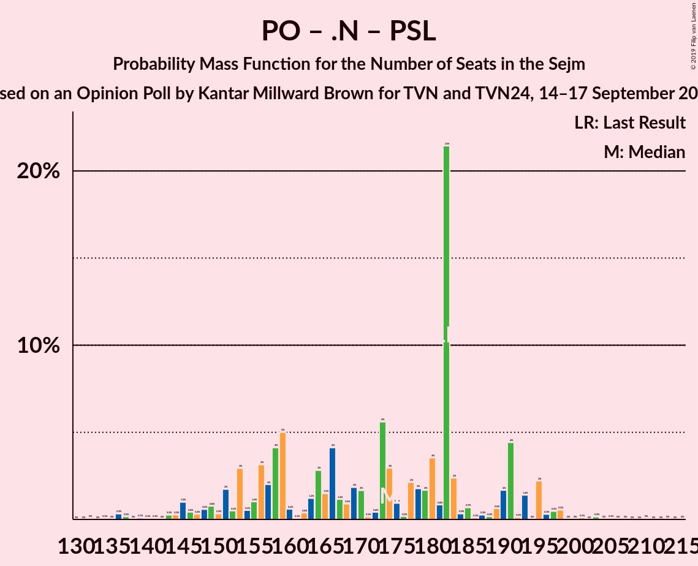

# Opinion Poll by Kantar Millward Brown for TVN and TVN24, 14–17 September 2018

<a href="#voting-intentions">Voting Intentions</a> | <a href="#seats">Seats</a> | <a href="#coalitions">Coalitions</a> | <a href="#technical-information">Technical Information</a>

## Voting Intentions

### Confidence Intervals

| Party | Last Result | Poll Result | 80% Confidence Interval | 90% Confidence Interval | 95% Confidence Interval | 99% Confidence Interval |
|:-----:|:-----------:|:-----------:|:-----------------------:|:-----------------------:|:-----------------------:|:-----------------------:|
| Prawo i Sprawiedliwość | 37.6% | 38.0% | 36.0–40.0% |35.5–40.5% |35.0–41.0% |34.1–42.0% |
| Platforma Obywatelska | 24.1% | 21.0% | 19.4–22.7% |18.9–23.2% |18.6–23.6% |17.8–24.5% |
| .Nowoczesna | 7.6% | 7.0% | 6.1–8.1% |5.8–8.5% |5.6–8.7% |5.2–9.3% |
| Sojusz Lewicy Demokratycznej | 7.6% | 5.0% | 4.2–6.0% |4.0–6.3% |3.8–6.5% |3.5–7.0% |
| KORWiN | 4.8% | 5.0% | 4.2–6.0% |4.0–6.3% |3.8–6.5% |3.5–7.0% |
| Kukiz’15 | 8.8% | 4.0% | 3.3–4.9% |3.1–5.2% |2.9–5.4% |2.6–5.9% |
| Polskie Stronnictwo Ludowe | 5.1% | 4.0% | 3.3–4.9% |3.1–5.2% |2.9–5.4% |2.6–5.9% |
| Lewica Razem | 3.6% | 4.0% | 3.3–4.9% |3.1–5.2% |2.9–5.4% |2.6–5.9% |

*Note:* The poll result column reflects the actual value used in the calculations. Published results may vary slightly, and in addition be rounded to fewer digits.

## Seats

### Confidence Intervals

| Party | Last Result | Median | 80% Confidence Interval | 90% Confidence Interval | 95% Confidence Interval | 99% Confidence Interval |
|:-----:|:-----------:|:------:|:-----------------------:|:-----------------------:|:-----------------------:|:-----------------------:|
| <a href="#prawo-i-sprawiedliwość">Prawo i Sprawiedliwość</a> | 235 | 268 | 251–282 |249–287 |243–291 |235–297 |
| <a href="#platforma-obywatelska">Platforma Obywatelska</a> | 138 | 140 | 124–150 |122–155 |118–161 |113–166 |
| <a href="#.nowoczesna">.Nowoczesna</a> | 28 | 31 | 21–36 |19–40 |18–40 |12–44 |
| <a href="#sojusz-lewicy-demokratycznej">Sojusz Lewicy Demokratycznej</a> | 0 | 0 | 0–26 |0–28 |0–30 |0–33 |
| <a href="#korwin">KORWiN</a> | 0 | 0 | 0–23 |0–25 |0–27 |0–34 |
| <a href="#kukiz’15">Kukiz’15</a> | 42 | 0 | 0 |0–13 |0–17 |0–19 |
| <a href="#polskie-stronnictwo-ludowe">Polskie Stronnictwo Ludowe</a> | 16 | 0 | 0–23 |0–23 |0–24 |0–25 |
| <a href="#lewica-razem">Lewica Razem</a> | 0 | 0 | 0 |0 |0 |0–19 |

### Prawo i Sprawiedliwość

*For a full overview of the results for this party, see the [Prawo i Sprawiedliwość](party-prawoisprawiedliwość.html) page.*

| Number of Seats | Probability | Accumulated | Special Marks |
|:---------------:|:-----------:|:-----------:|:-------------:|
| 227 | 0.1% | 100% |  |
| 228 | 0% | 99.9% |  |
| 229 | 0% | 99.8% |  |
| 230 | 0% | 99.8% |  |
| 231 | 0% | 99.8% | Majority |
| 232 | 0% | 99.8% |  |
| 233 | 0.1% | 99.8% |  |
| 234 | 0.1% | 99.7% |  |
| 235 | 0.2% | 99.6% | Last Result |
| 236 | 0.1% | 99.4% |  |
| 237 | 0.1% | 99.4% |  |
| 238 | 0.3% | 99.3% |  |
| 239 | 0.1% | 99.0% |  |
| 240 | 0.4% | 98.9% |  |
| 241 | 0.3% | 98% |  |
| 242 | 0.2% | 98% |  |
| 243 | 0.4% | 98% |  |
| 244 | 0.3% | 97% |  |
| 245 | 0.5% | 97% |  |
| 246 | 0.5% | 97% |  |
| 247 | 0.3% | 96% |  |
| 248 | 0.8% | 96% |  |
| 249 | 0.7% | 95% |  |
| 250 | 2% | 94% |  |
| 251 | 5% | 93% |  |
| 252 | 0.5% | 88% |  |
| 253 | 0.1% | 88% |  |
| 254 | 4% | 88% |  |
| 255 | 0.8% | 83% |  |
| 256 | 0.4% | 83% |  |
| 257 | 3% | 82% |  |
| 258 | 4% | 79% |  |
| 259 | 1.5% | 75% |  |
| 260 | 5% | 74% |  |
| 261 | 5% | 69% |  |
| 262 | 0.9% | 64% |  |
| 263 | 4% | 64% |  |
| 264 | 1.0% | 60% |  |
| 265 | 2% | 59% |  |
| 266 | 3% | 57% |  |
| 267 | 2% | 53% |  |
| 268 | 3% | 52% | Median |
| 269 | 0.1% | 49% |  |
| 270 | 1.3% | 49% |  |
| 271 | 0.2% | 47% |  |
| 272 | 0.3% | 47% |  |
| 273 | 4% | 47% |  |
| 274 | 0.1% | 43% |  |
| 275 | 0.2% | 43% |  |
| 276 | 0.3% | 42% |  |
| 277 | 1.0% | 42% |  |
| 278 | 21% | 41% |  |
| 279 | 1.2% | 20% |  |
| 280 | 4% | 18% |  |
| 281 | 2% | 15% |  |
| 282 | 3% | 12% |  |
| 283 | 2% | 9% |  |
| 284 | 0.2% | 7% |  |
| 285 | 1.0% | 7% |  |
| 286 | 0.1% | 6% |  |
| 287 | 3% | 6% |  |
| 288 | 0.2% | 3% |  |
| 289 | 0% | 3% |  |
| 290 | 0.2% | 3% |  |
| 291 | 0.9% | 3% |  |
| 292 | 0% | 2% |  |
| 293 | 0.3% | 2% |  |
| 294 | 0.3% | 2% |  |
| 295 | 0.1% | 1.4% |  |
| 296 | 0% | 1.4% |  |
| 297 | 0.9% | 1.3% |  |
| 298 | 0% | 0.4% |  |
| 299 | 0.1% | 0.4% |  |
| 300 | 0% | 0.3% |  |
| 301 | 0% | 0.3% |  |
| 302 | 0% | 0.2% |  |
| 303 | 0.1% | 0.2% |  |
| 304 | 0% | 0.2% |  |
| 305 | 0% | 0.2% |  |
| 306 | 0% | 0.2% |  |
| 307 | 0.1% | 0.2% |  |
| 308 | 0% | 0.1% |  |
| 309 | 0% | 0.1% |  |
| 310 | 0% | 0.1% |  |
| 311 | 0% | 0% |  |

### Platforma Obywatelska

*For a full overview of the results for this party, see the [Platforma Obywatelska](party-platformaobywatelska.html) page.*

| Number of Seats | Probability | Accumulated | Special Marks |
|:---------------:|:-----------:|:-----------:|:-------------:|
| 106 | 0% | 100% |  |
| 107 | 0% | 99.9% |  |
| 108 | 0% | 99.9% |  |
| 109 | 0.1% | 99.9% |  |
| 110 | 0% | 99.8% |  |
| 111 | 0.1% | 99.8% |  |
| 112 | 0.2% | 99.8% |  |
| 113 | 0.4% | 99.6% |  |
| 114 | 0.4% | 99.2% |  |
| 115 | 0.7% | 98.8% |  |
| 116 | 0.1% | 98% |  |
| 117 | 0.2% | 98% |  |
| 118 | 0.6% | 98% |  |
| 119 | 0.3% | 97% |  |
| 120 | 0.3% | 97% |  |
| 121 | 1.1% | 97% |  |
| 122 | 2% | 96% |  |
| 123 | 0.4% | 93% |  |
| 124 | 6% | 93% |  |
| 125 | 3% | 86% |  |
| 126 | 1.3% | 84% |  |
| 127 | 2% | 82% |  |
| 128 | 4% | 80% |  |
| 129 | 2% | 76% |  |
| 130 | 0.5% | 75% |  |
| 131 | 2% | 74% |  |
| 132 | 0.5% | 72% |  |
| 133 | 0.3% | 72% |  |
| 134 | 4% | 72% |  |
| 135 | 0.4% | 67% |  |
| 136 | 2% | 67% |  |
| 137 | 4% | 65% |  |
| 138 | 5% | 60% | Last Result |
| 139 | 5% | 55% |  |
| 140 | 1.1% | 50% | Median |
| 141 | 0.6% | 49% |  |
| 142 | 9% | 48% |  |
| 143 | 2% | 39% |  |
| 144 | 0.4% | 37% |  |
| 145 | 2% | 37% |  |
| 146 | 4% | 35% |  |
| 147 | 0.9% | 31% |  |
| 148 | 19% | 30% |  |
| 149 | 0.8% | 11% |  |
| 150 | 0.9% | 10% |  |
| 151 | 0.2% | 9% |  |
| 152 | 0.4% | 9% |  |
| 153 | 0.8% | 9% |  |
| 154 | 2% | 8% |  |
| 155 | 3% | 6% |  |
| 156 | 0.2% | 3% |  |
| 157 | 0.1% | 3% |  |
| 158 | 0% | 3% |  |
| 159 | 0% | 3% |  |
| 160 | 0% | 3% |  |
| 161 | 2% | 3% |  |
| 162 | 0% | 0.8% |  |
| 163 | 0.1% | 0.7% |  |
| 164 | 0% | 0.7% |  |
| 165 | 0% | 0.7% |  |
| 166 | 0.4% | 0.6% |  |
| 167 | 0.1% | 0.2% |  |
| 168 | 0.1% | 0.1% |  |
| 169 | 0% | 0.1% |  |
| 170 | 0% | 0.1% |  |
| 171 | 0% | 0% |  |

### .Nowoczesna

*For a full overview of the results for this party, see the [.Nowoczesna](party-nowoczesna.html) page.*

| Number of Seats | Probability | Accumulated | Special Marks |
|:---------------:|:-----------:|:-----------:|:-------------:|
| 0 | 0.5% | 100% |  |
| 1 | 0% | 99.5% |  |
| 2 | 0% | 99.5% |  |
| 3 | 0% | 99.5% |  |
| 4 | 0% | 99.5% |  |
| 5 | 0% | 99.5% |  |
| 6 | 0% | 99.5% |  |
| 7 | 0% | 99.5% |  |
| 8 | 0% | 99.5% |  |
| 9 | 0% | 99.5% |  |
| 10 | 0% | 99.5% |  |
| 11 | 0% | 99.5% |  |
| 12 | 0% | 99.5% |  |
| 13 | 0.1% | 99.5% |  |
| 14 | 0.2% | 99.4% |  |
| 15 | 0.5% | 99.1% |  |
| 16 | 0.4% | 98.7% |  |
| 17 | 0.4% | 98% |  |
| 18 | 2% | 98% |  |
| 19 | 1.3% | 96% |  |
| 20 | 2% | 94% |  |
| 21 | 4% | 92% |  |
| 22 | 5% | 88% |  |
| 23 | 1.1% | 84% |  |
| 24 | 0.4% | 82% |  |
| 25 | 4% | 82% |  |
| 26 | 2% | 78% |  |
| 27 | 4% | 76% |  |
| 28 | 3% | 72% | Last Result |
| 29 | 11% | 69% |  |
| 30 | 2% | 58% |  |
| 31 | 8% | 56% | Median |
| 32 | 2% | 48% |  |
| 33 | 3% | 46% |  |
| 34 | 29% | 43% |  |
| 35 | 4% | 14% |  |
| 36 | 3% | 10% |  |
| 37 | 0.7% | 8% |  |
| 38 | 1.0% | 7% |  |
| 39 | 0.3% | 6% |  |
| 40 | 4% | 6% |  |
| 41 | 0.2% | 2% |  |
| 42 | 0.2% | 1.4% |  |
| 43 | 0.4% | 1.2% |  |
| 44 | 0.4% | 0.8% |  |
| 45 | 0.1% | 0.4% |  |
| 46 | 0% | 0.4% |  |
| 47 | 0.1% | 0.3% |  |
| 48 | 0% | 0.3% |  |
| 49 | 0.1% | 0.2% |  |
| 50 | 0% | 0.1% |  |
| 51 | 0% | 0.1% |  |
| 52 | 0% | 0.1% |  |
| 53 | 0.1% | 0.1% |  |
| 54 | 0% | 0% |  |

### Sojusz Lewicy Demokratycznej

*For a full overview of the results for this party, see the [Sojusz Lewicy Demokratycznej](party-sojuszlewicydemokratycznej.html) page.*

| Number of Seats | Probability | Accumulated | Special Marks |
|:---------------:|:-----------:|:-----------:|:-------------:|
| 0 | 55% | 100% | Last Result, Median |
| 1 | 0% | 45% |  |
| 2 | 0% | 45% |  |
| 3 | 0% | 45% |  |
| 4 | 0% | 45% |  |
| 5 | 0% | 45% |  |
| 6 | 0% | 45% |  |
| 7 | 0% | 45% |  |
| 8 | 0% | 45% |  |
| 9 | 0% | 45% |  |
| 10 | 0% | 45% |  |
| 11 | 0% | 45% |  |
| 12 | 0% | 45% |  |
| 13 | 0% | 45% |  |
| 14 | 5% | 45% |  |
| 15 | 0.6% | 40% |  |
| 16 | 0.7% | 40% |  |
| 17 | 1.2% | 39% |  |
| 18 | 7% | 38% |  |
| 19 | 2% | 31% |  |
| 20 | 7% | 29% |  |
| 21 | 4% | 22% |  |
| 22 | 6% | 18% |  |
| 23 | 1.2% | 13% |  |
| 24 | 0.5% | 12% |  |
| 25 | 0.5% | 11% |  |
| 26 | 2% | 11% |  |
| 27 | 3% | 8% |  |
| 28 | 2% | 5% |  |
| 29 | 0.7% | 3% |  |
| 30 | 1.2% | 3% |  |
| 31 | 0.7% | 2% |  |
| 32 | 0.1% | 0.9% |  |
| 33 | 0.3% | 0.8% |  |
| 34 | 0.3% | 0.5% |  |
| 35 | 0.1% | 0.2% |  |
| 36 | 0.1% | 0.1% |  |
| 37 | 0% | 0% |  |

### KORWiN

*For a full overview of the results for this party, see the [KORWiN](party-korwin.html) page.*

| Number of Seats | Probability | Accumulated | Special Marks |
|:---------------:|:-----------:|:-----------:|:-------------:|
| 0 | 58% | 100% | Last Result, Median |
| 1 | 0% | 42% |  |
| 2 | 0% | 42% |  |
| 3 | 0% | 42% |  |
| 4 | 0% | 42% |  |
| 5 | 0% | 42% |  |
| 6 | 0% | 42% |  |
| 7 | 0% | 42% |  |
| 8 | 0% | 42% |  |
| 9 | 0.1% | 42% |  |
| 10 | 0.1% | 42% |  |
| 11 | 4% | 42% |  |
| 12 | 2% | 37% |  |
| 13 | 4% | 35% |  |
| 14 | 2% | 31% |  |
| 15 | 2% | 29% |  |
| 16 | 0.6% | 27% |  |
| 17 | 4% | 26% |  |
| 18 | 2% | 23% |  |
| 19 | 1.2% | 21% |  |
| 20 | 1.5% | 20% |  |
| 21 | 4% | 19% |  |
| 22 | 2% | 15% |  |
| 23 | 5% | 13% |  |
| 24 | 0.5% | 8% |  |
| 25 | 3% | 8% |  |
| 26 | 1.4% | 4% |  |
| 27 | 0.8% | 3% |  |
| 28 | 0.8% | 2% |  |
| 29 | 0.2% | 1.4% |  |
| 30 | 0.1% | 1.3% |  |
| 31 | 0.2% | 1.2% |  |
| 32 | 0.2% | 1.0% |  |
| 33 | 0% | 0.7% |  |
| 34 | 0.4% | 0.7% |  |
| 35 | 0% | 0.3% |  |
| 36 | 0.1% | 0.3% |  |
| 37 | 0.1% | 0.2% |  |
| 38 | 0% | 0.1% |  |
| 39 | 0% | 0.1% |  |
| 40 | 0.1% | 0.1% |  |
| 41 | 0% | 0% |  |

### Kukiz’15

*For a full overview of the results for this party, see the [Kukiz’15](party-kukiz’15.html) page.*

| Number of Seats | Probability | Accumulated | Special Marks |
|:---------------:|:-----------:|:-----------:|:-------------:|
| 0 | 91% | 100% | Median |
| 1 | 0% | 9% |  |
| 2 | 0% | 9% |  |
| 3 | 0% | 9% |  |
| 4 | 0% | 9% |  |
| 5 | 0% | 9% |  |
| 6 | 0% | 9% |  |
| 7 | 0% | 9% |  |
| 8 | 0% | 9% |  |
| 9 | 0% | 9% |  |
| 10 | 0.2% | 9% |  |
| 11 | 1.2% | 8% |  |
| 12 | 0.4% | 7% |  |
| 13 | 2% | 7% |  |
| 14 | 0.7% | 5% |  |
| 15 | 1.1% | 4% |  |
| 16 | 0.5% | 3% |  |
| 17 | 0.4% | 3% |  |
| 18 | 1.4% | 2% |  |
| 19 | 0.6% | 1.0% |  |
| 20 | 0.1% | 0.3% |  |
| 21 | 0.1% | 0.2% |  |
| 22 | 0% | 0.2% |  |
| 23 | 0% | 0.2% |  |
| 24 | 0.1% | 0.1% |  |
| 25 | 0% | 0% |  |
| 26 | 0% | 0% |  |
| 27 | 0% | 0% |  |
| 28 | 0% | 0% |  |
| 29 | 0% | 0% |  |
| 30 | 0% | 0% |  |
| 31 | 0% | 0% |  |
| 32 | 0% | 0% |  |
| 33 | 0% | 0% |  |
| 34 | 0% | 0% |  |
| 35 | 0% | 0% |  |
| 36 | 0% | 0% |  |
| 37 | 0% | 0% |  |
| 38 | 0% | 0% |  |
| 39 | 0% | 0% |  |
| 40 | 0% | 0% |  |
| 41 | 0% | 0% |  |
| 42 | 0% | 0% | Last Result |

### Polskie Stronnictwo Ludowe

*For a full overview of the results for this party, see the [Polskie Stronnictwo Ludowe](party-polskiestronnictwoludowe.html) page.*

| Number of Seats | Probability | Accumulated | Special Marks |
|:---------------:|:-----------:|:-----------:|:-------------:|
| 0 | 85% | 100% | Median |
| 1 | 0% | 15% |  |
| 2 | 0% | 15% |  |
| 3 | 0% | 15% |  |
| 4 | 0% | 15% |  |
| 5 | 0% | 15% |  |
| 6 | 0% | 15% |  |
| 7 | 0% | 15% |  |
| 8 | 0% | 15% |  |
| 9 | 0% | 15% |  |
| 10 | 0% | 15% |  |
| 11 | 0% | 15% |  |
| 12 | 0% | 15% |  |
| 13 | 0% | 15% |  |
| 14 | 0% | 15% |  |
| 15 | 0% | 15% |  |
| 16 | 0% | 15% | Last Result |
| 17 | 0% | 15% |  |
| 18 | 0.1% | 15% |  |
| 19 | 0.3% | 15% |  |
| 20 | 1.0% | 15% |  |
| 21 | 0.9% | 14% |  |
| 22 | 2% | 13% |  |
| 23 | 7% | 10% |  |
| 24 | 3% | 4% |  |
| 25 | 0.3% | 0.7% |  |
| 26 | 0.1% | 0.4% |  |
| 27 | 0.2% | 0.3% |  |
| 28 | 0.1% | 0.1% |  |
| 29 | 0% | 0% |  |

### Lewica Razem

*For a full overview of the results for this party, see the [Lewica Razem](party-lewicarazem.html) page.*

| Number of Seats | Probability | Accumulated | Special Marks |
|:---------------:|:-----------:|:-----------:|:-------------:|
| 0 | 98% | 100% | Last Result, Median |
| 1 | 0% | 2% |  |
| 2 | 0% | 2% |  |
| 3 | 0% | 2% |  |
| 4 | 0% | 2% |  |
| 5 | 0% | 2% |  |
| 6 | 0% | 2% |  |
| 7 | 0% | 2% |  |
| 8 | 0% | 2% |  |
| 9 | 0% | 2% |  |
| 10 | 0% | 2% |  |
| 11 | 0% | 2% |  |
| 12 | 0.5% | 2% |  |
| 13 | 0.1% | 2% |  |
| 14 | 0.1% | 2% |  |
| 15 | 0.6% | 2% |  |
| 16 | 0.2% | 1.1% |  |
| 17 | 0.1% | 0.9% |  |
| 18 | 0.3% | 0.9% |  |
| 19 | 0.2% | 0.5% |  |
| 20 | 0% | 0.4% |  |
| 21 | 0% | 0.3% |  |
| 22 | 0.1% | 0.3% |  |
| 23 | 0.1% | 0.2% |  |
| 24 | 0% | 0.1% |  |
| 25 | 0% | 0.1% |  |
| 26 | 0% | 0.1% |  |
| 27 | 0% | 0.1% |  |
| 28 | 0% | 0.1% |  |
| 29 | 0% | 0% |  |

## Coalitions

### Confidence Intervals

| Coalition | Last Result | Median | Majority? | 80% Confidence Interval | 90% Confidence Interval | 95% Confidence Interval | 99% Confidence Interval |
|:---------:|:-----------:|:------:|:---------:|:-----------------------:|:-----------------------:|:-----------------------:|:-----------------------:|
| Prawo i Sprawiedliwość | 235 | 268 | 99.8% | 251–282 | 249–287 | 243–291 | 235–297 |
| Platforma Obywatelska – .Nowoczesna – Sojusz Lewicy Demokratycznej – Lewica Razem – Polskie Stronnictwo Ludowe | 182 | 182 | 0% | 164–198 | 156–209 | 153–209 | 151–219 |
| Platforma Obywatelska – .Nowoczesna – Sojusz Lewicy Demokratycznej – Polskie Stronnictwo Ludowe | 182 | 182 | 0% | 163–198 | 156–209 | 153–209 | 150–217 |
| Platforma Obywatelska – .Nowoczesna – Sojusz Lewicy Demokratycznej | 166 | 182 | 0% | 157–192 | 154–195 | 153–200 | 146–210 |
| Platforma Obywatelska – .Nowoczesna – Polskie Stronnictwo Ludowe | 182 | 174 | 0% | 153–191 | 151–193 | 146–195 | 136–199 |
| Platforma Obywatelska – .Nowoczesna | 166 | 169 | 0% | 153–182 | 148–186 | 145–190 | 136–197 |
| Platforma Obywatelska | 138 | 140 | 0% | 124–150 | 122–155 | 118–161 | 113–166 |

### Prawo i Sprawiedliwość

| Number of Seats | Probability | Accumulated | Special Marks |
|:---------------:|:-----------:|:-----------:|:-------------:|
| 227 | 0.1% | 100% |  |
| 228 | 0% | 99.9% |  |
| 229 | 0% | 99.8% |  |
| 230 | 0% | 99.8% |  |
| 231 | 0% | 99.8% | Majority |
| 232 | 0% | 99.8% |  |
| 233 | 0.1% | 99.8% |  |
| 234 | 0.1% | 99.7% |  |
| 235 | 0.2% | 99.6% | Last Result |
| 236 | 0.1% | 99.4% |  |
| 237 | 0.1% | 99.4% |  |
| 238 | 0.3% | 99.3% |  |
| 239 | 0.1% | 99.0% |  |
| 240 | 0.4% | 98.9% |  |
| 241 | 0.3% | 98% |  |
| 242 | 0.2% | 98% |  |
| 243 | 0.4% | 98% |  |
| 244 | 0.3% | 97% |  |
| 245 | 0.5% | 97% |  |
| 246 | 0.5% | 97% |  |
| 247 | 0.3% | 96% |  |
| 248 | 0.8% | 96% |  |
| 249 | 0.7% | 95% |  |
| 250 | 2% | 94% |  |
| 251 | 5% | 93% |  |
| 252 | 0.5% | 88% |  |
| 253 | 0.1% | 88% |  |
| 254 | 4% | 88% |  |
| 255 | 0.8% | 83% |  |
| 256 | 0.4% | 83% |  |
| 257 | 3% | 82% |  |
| 258 | 4% | 79% |  |
| 259 | 1.5% | 75% |  |
| 260 | 5% | 74% |  |
| 261 | 5% | 69% |  |
| 262 | 0.9% | 64% |  |
| 263 | 4% | 64% |  |
| 264 | 1.0% | 60% |  |
| 265 | 2% | 59% |  |
| 266 | 3% | 57% |  |
| 267 | 2% | 53% |  |
| 268 | 3% | 52% | Median |
| 269 | 0.1% | 49% |  |
| 270 | 1.3% | 49% |  |
| 271 | 0.2% | 47% |  |
| 272 | 0.3% | 47% |  |
| 273 | 4% | 47% |  |
| 274 | 0.1% | 43% |  |
| 275 | 0.2% | 43% |  |
| 276 | 0.3% | 42% |  |
| 277 | 1.0% | 42% |  |
| 278 | 21% | 41% |  |
| 279 | 1.2% | 20% |  |
| 280 | 4% | 18% |  |
| 281 | 2% | 15% |  |
| 282 | 3% | 12% |  |
| 283 | 2% | 9% |  |
| 284 | 0.2% | 7% |  |
| 285 | 1.0% | 7% |  |
| 286 | 0.1% | 6% |  |
| 287 | 3% | 6% |  |
| 288 | 0.2% | 3% |  |
| 289 | 0% | 3% |  |
| 290 | 0.2% | 3% |  |
| 291 | 0.9% | 3% |  |
| 292 | 0% | 2% |  |
| 293 | 0.3% | 2% |  |
| 294 | 0.3% | 2% |  |
| 295 | 0.1% | 1.4% |  |
| 296 | 0% | 1.4% |  |
| 297 | 0.9% | 1.3% |  |
| 298 | 0% | 0.4% |  |
| 299 | 0.1% | 0.4% |  |
| 300 | 0% | 0.3% |  |
| 301 | 0% | 0.3% |  |
| 302 | 0% | 0.2% |  |
| 303 | 0.1% | 0.2% |  |
| 304 | 0% | 0.2% |  |
| 305 | 0% | 0.2% |  |
| 306 | 0% | 0.2% |  |
| 307 | 0.1% | 0.2% |  |
| 308 | 0% | 0.1% |  |
| 309 | 0% | 0.1% |  |
| 310 | 0% | 0.1% |  |
| 311 | 0% | 0% |  |

### Platforma Obywatelska – .Nowoczesna – Sojusz Lewicy Demokratycznej – Lewica Razem – Polskie Stronnictwo Ludowe

| Number of Seats | Probability | Accumulated | Special Marks |
|:---------------:|:-----------:|:-----------:|:-------------:|
| 137 | 0% | 100% |  |
| 138 | 0% | 99.9% |  |
| 139 | 0.1% | 99.9% |  |
| 140 | 0% | 99.9% |  |
| 141 | 0% | 99.9% |  |
| 142 | 0% | 99.8% |  |
| 143 | 0% | 99.8% |  |
| 144 | 0% | 99.8% |  |
| 145 | 0% | 99.8% |  |
| 146 | 0% | 99.8% |  |
| 147 | 0% | 99.7% |  |
| 148 | 0.1% | 99.7% |  |
| 149 | 0% | 99.6% |  |
| 150 | 0% | 99.6% |  |
| 151 | 0.3% | 99.6% |  |
| 152 | 0.1% | 99.3% |  |
| 153 | 3% | 99.3% |  |
| 154 | 0.1% | 96% |  |
| 155 | 0.7% | 96% |  |
| 156 | 2% | 96% |  |
| 157 | 0.6% | 93% |  |
| 158 | 0.5% | 92% |  |
| 159 | 0% | 92% |  |
| 160 | 0.1% | 92% |  |
| 161 | 0.1% | 92% |  |
| 162 | 0.4% | 92% |  |
| 163 | 0.9% | 91% |  |
| 164 | 0.7% | 90% |  |
| 165 | 0.2% | 90% |  |
| 166 | 0.7% | 89% |  |
| 167 | 2% | 89% |  |
| 168 | 0.6% | 87% |  |
| 169 | 1.3% | 86% |  |
| 170 | 1.0% | 85% |  |
| 171 | 0.3% | 84% | Median |
| 172 | 0.4% | 84% |  |
| 173 | 0.4% | 83% |  |
| 174 | 0.3% | 83% |  |
| 175 | 1.1% | 83% |  |
| 176 | 1.2% | 82% |  |
| 177 | 4% | 80% |  |
| 178 | 2% | 76% |  |
| 179 | 9% | 74% |  |
| 180 | 4% | 65% |  |
| 181 | 1.2% | 61% |  |
| 182 | 22% | 60% | Last Result |
| 183 | 3% | 38% |  |
| 184 | 0.5% | 35% |  |
| 185 | 2% | 35% |  |
| 186 | 0.7% | 32% |  |
| 187 | 5% | 32% |  |
| 188 | 4% | 27% |  |
| 189 | 0.9% | 23% |  |
| 190 | 2% | 22% |  |
| 191 | 0.9% | 21% |  |
| 192 | 0.6% | 20% |  |
| 193 | 1.3% | 19% |  |
| 194 | 3% | 18% |  |
| 195 | 2% | 15% |  |
| 196 | 0.2% | 13% |  |
| 197 | 2% | 13% |  |
| 198 | 0.6% | 11% |  |
| 199 | 0.1% | 10% |  |
| 200 | 1.0% | 10% |  |
| 201 | 0.1% | 9% |  |
| 202 | 0.4% | 9% |  |
| 203 | 0.4% | 8% |  |
| 204 | 0.1% | 8% |  |
| 205 | 0.2% | 8% |  |
| 206 | 0.8% | 8% |  |
| 207 | 0% | 7% |  |
| 208 | 0.3% | 7% |  |
| 209 | 4% | 6% |  |
| 210 | 1.1% | 2% |  |
| 211 | 0.2% | 1.1% |  |
| 212 | 0.1% | 1.0% |  |
| 213 | 0.1% | 0.8% |  |
| 214 | 0.2% | 0.8% |  |
| 215 | 0% | 0.6% |  |
| 216 | 0% | 0.6% |  |
| 217 | 0% | 0.5% |  |
| 218 | 0% | 0.5% |  |
| 219 | 0.1% | 0.5% |  |
| 220 | 0.3% | 0.4% |  |
| 221 | 0% | 0.1% |  |
| 222 | 0% | 0% |  |

### Platforma Obywatelska – .Nowoczesna – Sojusz Lewicy Demokratycznej – Polskie Stronnictwo Ludowe

| Number of Seats | Probability | Accumulated | Special Marks |
|:---------------:|:-----------:|:-----------:|:-------------:|
| 136 | 0% | 100% |  |
| 137 | 0% | 99.9% |  |
| 138 | 0% | 99.9% |  |
| 139 | 0.1% | 99.9% |  |
| 140 | 0% | 99.9% |  |
| 141 | 0% | 99.8% |  |
| 142 | 0% | 99.8% |  |
| 143 | 0% | 99.8% |  |
| 144 | 0% | 99.8% |  |
| 145 | 0% | 99.8% |  |
| 146 | 0% | 99.7% |  |
| 147 | 0% | 99.7% |  |
| 148 | 0.2% | 99.7% |  |
| 149 | 0% | 99.5% |  |
| 150 | 0% | 99.5% |  |
| 151 | 0.3% | 99.5% |  |
| 152 | 0.1% | 99.2% |  |
| 153 | 3% | 99.1% |  |
| 154 | 0.1% | 96% |  |
| 155 | 0.7% | 96% |  |
| 156 | 2% | 95% |  |
| 157 | 0.7% | 93% |  |
| 158 | 0.5% | 92% |  |
| 159 | 0.1% | 92% |  |
| 160 | 0.1% | 92% |  |
| 161 | 0.2% | 92% |  |
| 162 | 0.5% | 91% |  |
| 163 | 1.2% | 91% |  |
| 164 | 1.2% | 90% |  |
| 165 | 0.5% | 89% |  |
| 166 | 0.7% | 88% |  |
| 167 | 2% | 87% |  |
| 168 | 0.6% | 85% |  |
| 169 | 1.4% | 85% |  |
| 170 | 1.0% | 83% |  |
| 171 | 0.3% | 82% | Median |
| 172 | 0.4% | 82% |  |
| 173 | 0.3% | 82% |  |
| 174 | 0.4% | 81% |  |
| 175 | 1.1% | 81% |  |
| 176 | 0.7% | 80% |  |
| 177 | 4% | 79% |  |
| 178 | 2% | 75% |  |
| 179 | 9% | 73% |  |
| 180 | 4% | 64% |  |
| 181 | 1.3% | 60% |  |
| 182 | 22% | 59% | Last Result |
| 183 | 3% | 38% |  |
| 184 | 0.5% | 34% |  |
| 185 | 2% | 34% |  |
| 186 | 0.7% | 32% |  |
| 187 | 5% | 31% |  |
| 188 | 4% | 27% |  |
| 189 | 0.9% | 23% |  |
| 190 | 2% | 22% |  |
| 191 | 0.9% | 20% |  |
| 192 | 0.6% | 19% |  |
| 193 | 1.3% | 19% |  |
| 194 | 3% | 17% |  |
| 195 | 2% | 15% |  |
| 196 | 0.2% | 12% |  |
| 197 | 2% | 12% |  |
| 198 | 0.6% | 10% |  |
| 199 | 0.1% | 9% |  |
| 200 | 1.0% | 9% |  |
| 201 | 0.1% | 8% |  |
| 202 | 0.4% | 8% |  |
| 203 | 0.3% | 8% |  |
| 204 | 0% | 8% |  |
| 205 | 0.2% | 8% |  |
| 206 | 0.8% | 7% |  |
| 207 | 0% | 7% |  |
| 208 | 0.3% | 7% |  |
| 209 | 4% | 6% |  |
| 210 | 1.0% | 2% |  |
| 211 | 0.2% | 1.1% |  |
| 212 | 0.1% | 0.9% |  |
| 213 | 0.1% | 0.8% |  |
| 214 | 0.2% | 0.7% |  |
| 215 | 0% | 0.6% |  |
| 216 | 0% | 0.5% |  |
| 217 | 0% | 0.5% |  |
| 218 | 0% | 0.5% |  |
| 219 | 0.1% | 0.5% |  |
| 220 | 0.3% | 0.3% |  |
| 221 | 0% | 0% |  |

### Platforma Obywatelska – .Nowoczesna – Sojusz Lewicy Demokratycznej

| Number of Seats | Probability | Accumulated | Special Marks |
|:---------------:|:-----------:|:-----------:|:-------------:|
| 134 | 0% | 100% |  |
| 135 | 0% | 99.9% |  |
| 136 | 0% | 99.9% |  |
| 137 | 0% | 99.9% |  |
| 138 | 0% | 99.9% |  |
| 139 | 0.1% | 99.9% |  |
| 140 | 0% | 99.8% |  |
| 141 | 0% | 99.8% |  |
| 142 | 0% | 99.8% |  |
| 143 | 0.1% | 99.8% |  |
| 144 | 0% | 99.7% |  |
| 145 | 0% | 99.7% |  |
| 146 | 0.2% | 99.6% |  |
| 147 | 0.1% | 99.4% |  |
| 148 | 0.2% | 99.3% |  |
| 149 | 0.1% | 99.1% |  |
| 150 | 0% | 99.1% |  |
| 151 | 0.3% | 99.0% |  |
| 152 | 0.1% | 98.7% |  |
| 153 | 3% | 98.6% |  |
| 154 | 2% | 96% |  |
| 155 | 0.9% | 94% |  |
| 156 | 3% | 93% |  |
| 157 | 1.5% | 90% |  |
| 158 | 0.7% | 89% |  |
| 159 | 0.6% | 88% |  |
| 160 | 0.2% | 87% |  |
| 161 | 0.2% | 87% |  |
| 162 | 0.6% | 87% |  |
| 163 | 1.3% | 86% |  |
| 164 | 1.2% | 85% |  |
| 165 | 0.4% | 84% |  |
| 166 | 0.8% | 83% | Last Result |
| 167 | 2% | 83% |  |
| 168 | 0.8% | 81% |  |
| 169 | 1.5% | 80% |  |
| 170 | 1.0% | 79% |  |
| 171 | 2% | 78% | Median |
| 172 | 0.6% | 76% |  |
| 173 | 0.4% | 75% |  |
| 174 | 1.0% | 75% |  |
| 175 | 2% | 74% |  |
| 176 | 0.2% | 72% |  |
| 177 | 4% | 72% |  |
| 178 | 1.0% | 68% |  |
| 179 | 8% | 67% |  |
| 180 | 4% | 59% |  |
| 181 | 1.4% | 55% |  |
| 182 | 22% | 54% |  |
| 183 | 3% | 32% |  |
| 184 | 0.3% | 29% |  |
| 185 | 2% | 29% |  |
| 186 | 5% | 27% |  |
| 187 | 5% | 22% |  |
| 188 | 4% | 18% |  |
| 189 | 0.7% | 14% |  |
| 190 | 2% | 13% |  |
| 191 | 0.9% | 11% |  |
| 192 | 0.6% | 10% |  |
| 193 | 0.2% | 10% |  |
| 194 | 3% | 9% |  |
| 195 | 2% | 7% |  |
| 196 | 0.2% | 5% |  |
| 197 | 1.5% | 5% |  |
| 198 | 0.1% | 3% |  |
| 199 | 0.1% | 3% |  |
| 200 | 0.7% | 3% |  |
| 201 | 0.1% | 2% |  |
| 202 | 0.2% | 2% |  |
| 203 | 0% | 2% |  |
| 204 | 0% | 2% |  |
| 205 | 0.1% | 2% |  |
| 206 | 0.7% | 2% |  |
| 207 | 0% | 1.1% |  |
| 208 | 0.2% | 1.1% |  |
| 209 | 0% | 1.0% |  |
| 210 | 0.8% | 0.9% |  |
| 211 | 0% | 0.1% |  |
| 212 | 0% | 0.1% |  |
| 213 | 0% | 0.1% |  |
| 214 | 0% | 0.1% |  |
| 215 | 0% | 0% |  |

### Platforma Obywatelska – .Nowoczesna – Polskie Stronnictwo Ludowe

| Number of Seats | Probability | Accumulated | Special Marks |
|:---------------:|:-----------:|:-----------:|:-------------:|
| 130 | 0% | 100% |  |
| 131 | 0% | 99.9% |  |
| 132 | 0% | 99.9% |  |
| 133 | 0% | 99.9% |  |
| 134 | 0.1% | 99.9% |  |
| 135 | 0% | 99.8% |  |
| 136 | 0.3% | 99.8% |  |
| 137 | 0.2% | 99.5% |  |
| 138 | 0% | 99.3% |  |
| 139 | 0.1% | 99.3% |  |
| 140 | 0.1% | 99.2% |  |
| 141 | 0.1% | 99.2% |  |
| 142 | 0% | 99.1% |  |
| 143 | 0.3% | 99.1% |  |
| 144 | 0.3% | 98.8% |  |
| 145 | 1.0% | 98.5% |  |
| 146 | 0.4% | 98% |  |
| 147 | 0.3% | 97% |  |
| 148 | 0.6% | 97% |  |
| 149 | 0.8% | 96% |  |
| 150 | 0.3% | 95% |  |
| 151 | 2% | 95% |  |
| 152 | 0.5% | 93% |  |
| 153 | 3% | 93% |  |
| 154 | 0.5% | 90% |  |
| 155 | 1.0% | 89% |  |
| 156 | 3% | 88% |  |
| 157 | 2% | 85% |  |
| 158 | 4% | 83% |  |
| 159 | 5% | 79% |  |
| 160 | 0.6% | 74% |  |
| 161 | 0.1% | 74% |  |
| 162 | 0.4% | 73% |  |
| 163 | 1.2% | 73% |  |
| 164 | 3% | 72% |  |
| 165 | 1.5% | 69% |  |
| 166 | 4% | 68% |  |
| 167 | 1.2% | 63% |  |
| 168 | 0.9% | 62% |  |
| 169 | 2% | 61% |  |
| 170 | 2% | 60% |  |
| 171 | 0.1% | 58% | Median |
| 172 | 0.4% | 58% |  |
| 173 | 6% | 57% |  |
| 174 | 3% | 52% |  |
| 175 | 0.9% | 49% |  |
| 176 | 0.2% | 48% |  |
| 177 | 2% | 48% |  |
| 178 | 2% | 46% |  |
| 179 | 2% | 44% |  |
| 180 | 4% | 42% |  |
| 181 | 0.8% | 39% |  |
| 182 | 21% | 38% | Last Result |
| 183 | 2% | 16% |  |
| 184 | 0.3% | 14% |  |
| 185 | 0.7% | 14% |  |
| 186 | 0.1% | 13% |  |
| 187 | 0.3% | 13% |  |
| 188 | 0.2% | 12% |  |
| 189 | 0.6% | 12% |  |
| 190 | 2% | 12% |  |
| 191 | 4% | 10% |  |
| 192 | 0.1% | 6% |  |
| 193 | 1.4% | 5% |  |
| 194 | 0% | 4% |  |
| 195 | 2% | 4% |  |
| 196 | 0.3% | 2% |  |
| 197 | 0.5% | 2% |  |
| 198 | 0.5% | 1.1% |  |
| 199 | 0% | 0.5% |  |
| 200 | 0% | 0.5% |  |
| 201 | 0.1% | 0.5% |  |
| 202 | 0% | 0.4% |  |
| 203 | 0.2% | 0.4% |  |
| 204 | 0% | 0.2% |  |
| 205 | 0.1% | 0.2% |  |
| 206 | 0% | 0.1% |  |
| 207 | 0% | 0.1% |  |
| 208 | 0% | 0.1% |  |
| 209 | 0% | 0.1% |  |
| 210 | 0% | 0.1% |  |
| 211 | 0% | 0% |  |

### Platforma Obywatelska – .Nowoczesna

| Number of Seats | Probability | Accumulated | Special Marks |
|:---------------:|:-----------:|:-----------:|:-------------:|
| 129 | 0% | 100% |  |
| 130 | 0% | 99.9% |  |
| 131 | 0% | 99.9% |  |
| 132 | 0.1% | 99.9% |  |
| 133 | 0% | 99.8% |  |
| 134 | 0.1% | 99.8% |  |
| 135 | 0% | 99.8% |  |
| 136 | 0.3% | 99.8% |  |
| 137 | 0.2% | 99.4% |  |
| 138 | 0% | 99.2% |  |
| 139 | 0.6% | 99.2% |  |
| 140 | 0.1% | 98.6% |  |
| 141 | 0.2% | 98.5% |  |
| 142 | 0.1% | 98% |  |
| 143 | 0.3% | 98% |  |
| 144 | 0.3% | 98% |  |
| 145 | 1.0% | 98% |  |
| 146 | 0.6% | 97% |  |
| 147 | 0.6% | 96% |  |
| 148 | 0.6% | 95% |  |
| 149 | 0.9% | 95% |  |
| 150 | 0.9% | 94% |  |
| 151 | 2% | 93% |  |
| 152 | 1.1% | 91% |  |
| 153 | 3% | 90% |  |
| 154 | 2% | 87% |  |
| 155 | 1.2% | 85% |  |
| 156 | 3% | 84% |  |
| 157 | 3% | 80% |  |
| 158 | 4% | 78% |  |
| 159 | 5% | 73% |  |
| 160 | 0.7% | 68% |  |
| 161 | 0.1% | 68% |  |
| 162 | 0.7% | 67% |  |
| 163 | 1.2% | 67% |  |
| 164 | 3% | 65% |  |
| 165 | 1.4% | 63% |  |
| 166 | 4% | 61% | Last Result |
| 167 | 0.9% | 57% |  |
| 168 | 5% | 56% |  |
| 169 | 2% | 51% |  |
| 170 | 2% | 49% |  |
| 171 | 2% | 48% | Median |
| 172 | 0.5% | 46% |  |
| 173 | 5% | 45% |  |
| 174 | 3% | 40% |  |
| 175 | 0.7% | 37% |  |
| 176 | 0.3% | 37% |  |
| 177 | 2% | 36% |  |
| 178 | 0.7% | 34% |  |
| 179 | 0.6% | 34% |  |
| 180 | 4% | 33% |  |
| 181 | 0.7% | 29% |  |
| 182 | 21% | 29% |  |
| 183 | 2% | 7% |  |
| 184 | 0.1% | 6% |  |
| 185 | 0.7% | 6% |  |
| 186 | 0.1% | 5% |  |
| 187 | 0.2% | 5% |  |
| 188 | 0% | 5% |  |
| 189 | 0.6% | 5% |  |
| 190 | 2% | 4% |  |
| 191 | 0.1% | 2% |  |
| 192 | 0.1% | 2% |  |
| 193 | 0% | 2% |  |
| 194 | 0% | 2% |  |
| 195 | 2% | 2% |  |
| 196 | 0.1% | 0.7% |  |
| 197 | 0.4% | 0.5% |  |
| 198 | 0% | 0.1% |  |
| 199 | 0% | 0.1% |  |
| 200 | 0% | 0% |  |

### Platforma Obywatelska

| Number of Seats | Probability | Accumulated | Special Marks |
|:---------------:|:-----------:|:-----------:|:-------------:|
| 106 | 0% | 100% |  |
| 107 | 0% | 99.9% |  |
| 108 | 0% | 99.9% |  |
| 109 | 0.1% | 99.9% |  |
| 110 | 0% | 99.8% |  |
| 111 | 0.1% | 99.8% |  |
| 112 | 0.2% | 99.8% |  |
| 113 | 0.4% | 99.6% |  |
| 114 | 0.4% | 99.2% |  |
| 115 | 0.7% | 98.8% |  |
| 116 | 0.1% | 98% |  |
| 117 | 0.2% | 98% |  |
| 118 | 0.6% | 98% |  |
| 119 | 0.3% | 97% |  |
| 120 | 0.3% | 97% |  |
| 121 | 1.1% | 97% |  |
| 122 | 2% | 96% |  |
| 123 | 0.4% | 93% |  |
| 124 | 6% | 93% |  |
| 125 | 3% | 86% |  |
| 126 | 1.3% | 84% |  |
| 127 | 2% | 82% |  |
| 128 | 4% | 80% |  |
| 129 | 2% | 76% |  |
| 130 | 0.5% | 75% |  |
| 131 | 2% | 74% |  |
| 132 | 0.5% | 72% |  |
| 133 | 0.3% | 72% |  |
| 134 | 4% | 72% |  |
| 135 | 0.4% | 67% |  |
| 136 | 2% | 67% |  |
| 137 | 4% | 65% |  |
| 138 | 5% | 60% | Last Result |
| 139 | 5% | 55% |  |
| 140 | 1.1% | 50% | Median |
| 141 | 0.6% | 49% |  |
| 142 | 9% | 48% |  |
| 143 | 2% | 39% |  |
| 144 | 0.4% | 37% |  |
| 145 | 2% | 37% |  |
| 146 | 4% | 35% |  |
| 147 | 0.9% | 31% |  |
| 148 | 19% | 30% |  |
| 149 | 0.8% | 11% |  |
| 150 | 0.9% | 10% |  |
| 151 | 0.2% | 9% |  |
| 152 | 0.4% | 9% |  |
| 153 | 0.8% | 9% |  |
| 154 | 2% | 8% |  |
| 155 | 3% | 6% |  |
| 156 | 0.2% | 3% |  |
| 157 | 0.1% | 3% |  |
| 158 | 0% | 3% |  |
| 159 | 0% | 3% |  |
| 160 | 0% | 3% |  |
| 161 | 2% | 3% |  |
| 162 | 0% | 0.8% |  |
| 163 | 0.1% | 0.7% |  |
| 164 | 0% | 0.7% |  |
| 165 | 0% | 0.7% |  |
| 166 | 0.4% | 0.6% |  |
| 167 | 0.1% | 0.2% |  |
| 168 | 0.1% | 0.1% |  |
| 169 | 0% | 0.1% |  |
| 170 | 0% | 0.1% |  |
| 171 | 0% | 0% |  |

## Technical Information

### Opinion Poll

+ **Polling firm:** Kantar Millward Brown
+ **Commissioner(s):** TVN and TVN24
+ **Fieldwork period:** 14–17 September 2018

### Calculations

+ **Sample size:** 1001
+ **Simulations done:** 131,072
+ **Error estimate:** 1.95%

