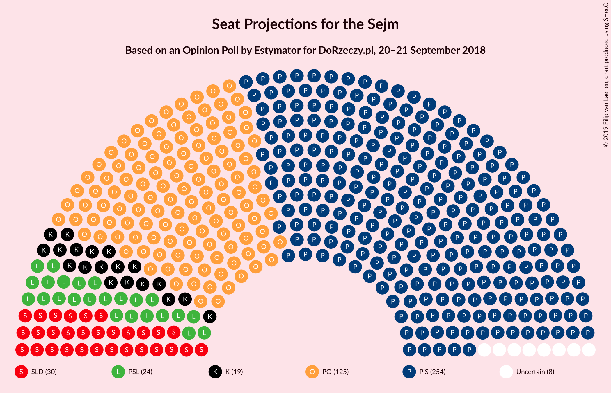
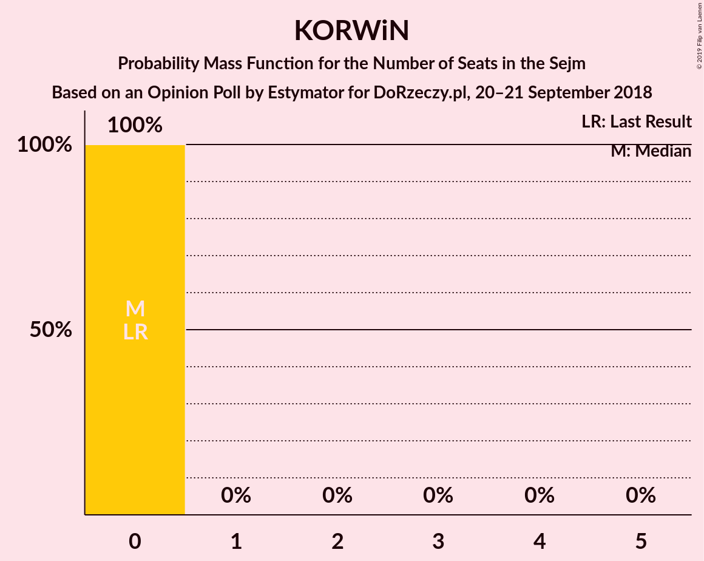
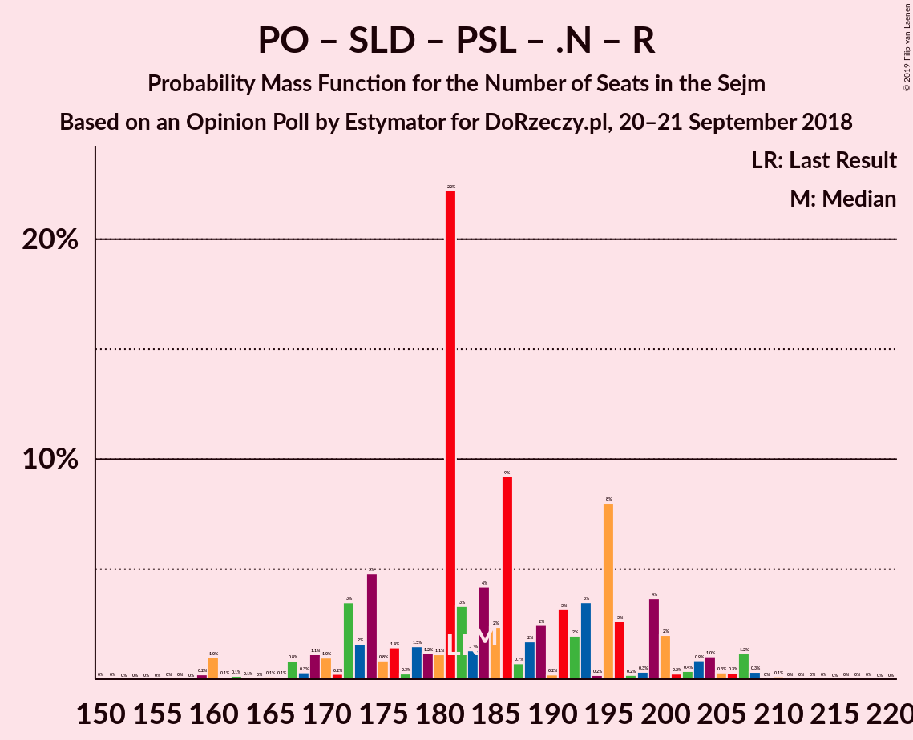
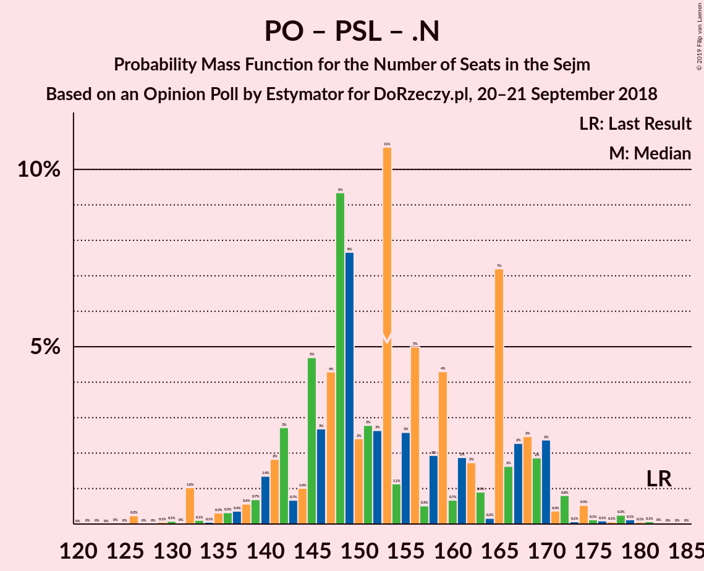

# Opinion Poll by Estymator for DoRzeczy.pl, 20–21 September 2018

<a href="#voting-intentions">Voting Intentions</a> | <a href="#seats">Seats</a> | <a href="#coalitions">Coalitions</a> | <a href="#technical-information">Technical Information</a>

## Voting Intentions

### Confidence Intervals

| Party | Last Result | Poll Result | 80% Confidence Interval | 90% Confidence Interval | 95% Confidence Interval | 99% Confidence Interval |
|:-----:|:-----------:|:-----------:|:-----------------------:|:-----------------------:|:-----------------------:|:-----------------------:|
| Prawo i Sprawiedliwość | 37.6% | 45.0% | 43.0–47.1% |42.5–47.6% |42.0–48.1% |41.0–49.1% |
| Platforma Obywatelska | 24.1% | 23.9% | 22.2–25.7% |21.7–26.2% |21.3–26.6% |20.5–27.5% |
| Sojusz Lewicy Demokratycznej | 7.6% | 8.1% | 7.0–9.3% |6.8–9.6% |6.5–9.9% |6.1–10.5% |
| Polskie Stronnictwo Ludowe | 5.1% | 7.4% | 6.4–8.5% |6.1–8.9% |5.9–9.1% |5.5–9.7% |
| Kukiz’15 | 8.8% | 6.9% | 5.9–8.0% |5.7–8.3% |5.5–8.6% |5.0–9.2% |
| .Nowoczesna | 7.6% | 4.1% | 3.4–5.0% |3.2–5.3% |3.0–5.5% |2.7–6.0% |
| Lewica Razem | 3.6% | 1.9% | 1.4–2.6% |1.3–2.8% |1.2–2.9% |1.0–3.3% |
| KORWiN | 4.8% | 1.5% | 1.1–2.1% |1.0–2.3% |0.9–2.5% |0.7–2.8% |

*Note:* The poll result column reflects the actual value used in the calculations. Published results may vary slightly, and in addition be rounded to fewer digits.

## Seats

### Confidence Intervals

| Party | Last Result | Median | 80% Confidence Interval | 90% Confidence Interval | 95% Confidence Interval | 99% Confidence Interval |
|:-----:|:-----------:|:------:|:-----------------------:|:-----------------------:|:-----------------------:|:-----------------------:|
| <a href="#prawo-i-sprawiedliwość">Prawo i Sprawiedliwość</a> | 235 | 252 | 238–262 |238–262 |238–264 |238–267 |
| <a href="#platforma-obywatelska">Platforma Obywatelska</a> | 138 | 130 | 116–137 |115–137 |115–137 |108–140 |
| <a href="#sojusz-lewicy-demokratycznej">Sojusz Lewicy Demokratycznej</a> | 0 | 29 | 28–40 |28–40 |20–40 |12–40 |
| <a href="#polskie-stronnictwo-ludowe">Polskie Stronnictwo Ludowe</a> | 16 | 25 | 22–33 |22–34 |22–45 |13–45 |
| <a href="#kukiz’15">Kukiz’15</a> | 42 | 19 | 15–19 |15–24 |15–35 |10–40 |
| <a href="#.nowoczesna">.Nowoczesna</a> | 28 | 0 | 0–12 |0–12 |0–12 |0–12 |
| <a href="#lewica-razem">Lewica Razem</a> | 0 | 0 | 0 |0 |0 |0 |
| <a href="#korwin">KORWiN</a> | 0 | 0 | 0 |0 |0 |0 |

### Prawo i Sprawiedliwość

*For a full overview of the results for this party, see the [Prawo i Sprawiedliwość](party-prawoisprawiedliwość.html) page.*

| Number of Seats | Probability | Accumulated | Special Marks |
|:---------------:|:-----------:|:-----------:|:-------------:|
| 225 | 0.1% | 100% |  |
| 226 | 0% | 99.9% |  |
| 227 | 0% | 99.9% |  |
| 228 | 0% | 99.9% |  |
| 229 | 0% | 99.9% |  |
| 230 | 0% | 99.9% |  |
| 231 | 0% | 99.9% | Majority |
| 232 | 0% | 99.9% |  |
| 233 | 0% | 99.9% |  |
| 234 | 0% | 99.9% |  |
| 235 | 0% | 99.9% | Last Result |
| 236 | 0% | 99.9% |  |
| 237 | 0.4% | 99.9% |  |
| 238 | 41% | 99.6% |  |
| 239 | 0% | 59% |  |
| 240 | 0% | 59% |  |
| 241 | 0% | 59% |  |
| 242 | 0% | 59% |  |
| 243 | 0% | 59% |  |
| 244 | 0% | 59% |  |
| 245 | 0% | 59% |  |
| 246 | 0% | 59% |  |
| 247 | 5% | 59% |  |
| 248 | 0.1% | 54% |  |
| 249 | 0.1% | 54% |  |
| 250 | 0% | 54% |  |
| 251 | 0% | 53% |  |
| 252 | 6% | 53% | Median |
| 253 | 32% | 48% |  |
| 254 | 0% | 16% |  |
| 255 | 0.5% | 16% |  |
| 256 | 0% | 16% |  |
| 257 | 0% | 16% |  |
| 258 | 4% | 16% |  |
| 259 | 0% | 12% |  |
| 260 | 0% | 12% |  |
| 261 | 0.3% | 12% |  |
| 262 | 9% | 11% |  |
| 263 | 0% | 3% |  |
| 264 | 2% | 3% |  |
| 265 | 0% | 0.6% |  |
| 266 | 0% | 0.6% |  |
| 267 | 0.2% | 0.6% |  |
| 268 | 0% | 0.4% |  |
| 269 | 0% | 0.4% |  |
| 270 | 0% | 0.4% |  |
| 271 | 0.2% | 0.4% |  |
| 272 | 0% | 0.2% |  |
| 273 | 0% | 0.2% |  |
| 274 | 0.2% | 0.2% |  |
| 275 | 0% | 0% |  |

### Platforma Obywatelska

*For a full overview of the results for this party, see the [Platforma Obywatelska](party-platformaobywatelska.html) page.*

| Number of Seats | Probability | Accumulated | Special Marks |
|:---------------:|:-----------:|:-----------:|:-------------:|
| 105 | 0.4% | 100% |  |
| 106 | 0% | 99.5% |  |
| 107 | 0% | 99.5% |  |
| 108 | 0.1% | 99.5% |  |
| 109 | 0% | 99.5% |  |
| 110 | 0% | 99.5% |  |
| 111 | 0% | 99.4% |  |
| 112 | 0.4% | 99.4% |  |
| 113 | 0% | 99.0% |  |
| 114 | 0.2% | 99.0% |  |
| 115 | 7% | 98.8% |  |
| 116 | 4% | 92% |  |
| 117 | 0% | 88% |  |
| 118 | 0% | 88% |  |
| 119 | 0% | 88% |  |
| 120 | 0% | 88% |  |
| 121 | 0.1% | 88% |  |
| 122 | 0.5% | 88% |  |
| 123 | 0% | 88% |  |
| 124 | 5% | 88% |  |
| 125 | 0% | 83% |  |
| 126 | 0% | 83% |  |
| 127 | 0% | 83% |  |
| 128 | 0.2% | 83% |  |
| 129 | 9% | 83% |  |
| 130 | 32% | 74% | Median |
| 131 | 0% | 42% |  |
| 132 | 0% | 42% |  |
| 133 | 0% | 42% |  |
| 134 | 0.2% | 42% |  |
| 135 | 0% | 42% |  |
| 136 | 0% | 42% |  |
| 137 | 41% | 42% |  |
| 138 | 0% | 0.8% | Last Result |
| 139 | 0% | 0.7% |  |
| 140 | 0.7% | 0.7% |  |
| 141 | 0% | 0% |  |

### Sojusz Lewicy Demokratycznej

*For a full overview of the results for this party, see the [Sojusz Lewicy Demokratycznej](party-sojuszlewicydemokratycznej.html) page.*

| Number of Seats | Probability | Accumulated | Special Marks |
|:---------------:|:-----------:|:-----------:|:-------------:|
| 0 | 0% | 100% | Last Result |
| 1 | 0% | 100% |  |
| 2 | 0% | 100% |  |
| 3 | 0% | 100% |  |
| 4 | 0% | 100% |  |
| 5 | 0% | 100% |  |
| 6 | 0% | 100% |  |
| 7 | 0% | 100% |  |
| 8 | 0% | 100% |  |
| 9 | 0% | 100% |  |
| 10 | 0% | 100% |  |
| 11 | 0% | 100% |  |
| 12 | 2% | 100% |  |
| 13 | 0% | 98% |  |
| 14 | 0.3% | 98% |  |
| 15 | 0% | 98% |  |
| 16 | 0% | 98% |  |
| 17 | 0% | 98% |  |
| 18 | 0% | 98% |  |
| 19 | 0% | 98% |  |
| 20 | 0.2% | 98% |  |
| 21 | 0% | 97% |  |
| 22 | 0.2% | 97% |  |
| 23 | 0% | 97% |  |
| 24 | 0% | 97% |  |
| 25 | 0% | 97% |  |
| 26 | 0% | 97% |  |
| 27 | 0% | 97% |  |
| 28 | 9% | 97% |  |
| 29 | 45% | 88% | Median |
| 30 | 0.8% | 43% |  |
| 31 | 0.1% | 42% |  |
| 32 | 0.5% | 42% |  |
| 33 | 0.4% | 42% |  |
| 34 | 4% | 41% |  |
| 35 | 0.1% | 37% |  |
| 36 | 0% | 37% |  |
| 37 | 0.4% | 37% |  |
| 38 | 0% | 37% |  |
| 39 | 5% | 37% |  |
| 40 | 32% | 32% |  |
| 41 | 0% | 0.2% |  |
| 42 | 0% | 0.2% |  |
| 43 | 0% | 0.2% |  |
| 44 | 0.1% | 0.1% |  |
| 45 | 0% | 0.1% |  |
| 46 | 0% | 0.1% |  |
| 47 | 0% | 0.1% |  |
| 48 | 0% | 0.1% |  |
| 49 | 0% | 0.1% |  |
| 50 | 0% | 0.1% |  |
| 51 | 0% | 0.1% |  |
| 52 | 0% | 0% |  |

### Polskie Stronnictwo Ludowe

*For a full overview of the results for this party, see the [Polskie Stronnictwo Ludowe](party-polskiestronnictwoludowe.html) page.*

| Number of Seats | Probability | Accumulated | Special Marks |
|:---------------:|:-----------:|:-----------:|:-------------:|
| 0 | 0.2% | 100% |  |
| 1 | 0% | 99.8% |  |
| 2 | 0% | 99.8% |  |
| 3 | 0% | 99.8% |  |
| 4 | 0% | 99.8% |  |
| 5 | 0% | 99.8% |  |
| 6 | 0% | 99.8% |  |
| 7 | 0% | 99.8% |  |
| 8 | 0% | 99.8% |  |
| 9 | 0% | 99.8% |  |
| 10 | 0% | 99.8% |  |
| 11 | 0% | 99.8% |  |
| 12 | 0% | 99.8% |  |
| 13 | 0.5% | 99.8% |  |
| 14 | 0% | 99.3% |  |
| 15 | 0% | 99.3% |  |
| 16 | 0% | 99.2% | Last Result |
| 17 | 0% | 99.2% |  |
| 18 | 0.2% | 99.2% |  |
| 19 | 0% | 99.1% |  |
| 20 | 0% | 99.0% |  |
| 21 | 0% | 99.0% |  |
| 22 | 32% | 99.0% |  |
| 23 | 0.8% | 67% |  |
| 24 | 10% | 66% |  |
| 25 | 41% | 57% | Median |
| 26 | 0% | 16% |  |
| 27 | 0% | 16% |  |
| 28 | 0% | 16% |  |
| 29 | 0% | 16% |  |
| 30 | 5% | 16% |  |
| 31 | 0% | 10% |  |
| 32 | 0.1% | 10% |  |
| 33 | 4% | 10% |  |
| 34 | 2% | 7% |  |
| 35 | 0% | 4% |  |
| 36 | 0% | 4% |  |
| 37 | 0% | 4% |  |
| 38 | 0% | 4% |  |
| 39 | 0% | 4% |  |
| 40 | 0% | 4% |  |
| 41 | 0% | 4% |  |
| 42 | 0% | 4% |  |
| 43 | 0% | 4% |  |
| 44 | 0% | 4% |  |
| 45 | 4% | 4% |  |
| 46 | 0% | 0% |  |

### Kukiz’15

*For a full overview of the results for this party, see the [Kukiz’15](party-kukiz’15.html) page.*

| Number of Seats | Probability | Accumulated | Special Marks |
|:---------------:|:-----------:|:-----------:|:-------------:|
| 0 | 0.1% | 100% |  |
| 1 | 0% | 99.9% |  |
| 2 | 0% | 99.9% |  |
| 3 | 0% | 99.9% |  |
| 4 | 0% | 99.9% |  |
| 5 | 0% | 99.9% |  |
| 6 | 0% | 99.9% |  |
| 7 | 0% | 99.9% |  |
| 8 | 0% | 99.9% |  |
| 9 | 0% | 99.9% |  |
| 10 | 0.8% | 99.9% |  |
| 11 | 0% | 99.1% |  |
| 12 | 0% | 99.1% |  |
| 13 | 0% | 99.1% |  |
| 14 | 0% | 99.1% |  |
| 15 | 37% | 99.1% |  |
| 16 | 0% | 62% |  |
| 17 | 9% | 62% |  |
| 18 | 0% | 54% |  |
| 19 | 45% | 54% | Median |
| 20 | 0.1% | 9% |  |
| 21 | 0% | 9% |  |
| 22 | 0% | 9% |  |
| 23 | 0% | 9% |  |
| 24 | 4% | 9% |  |
| 25 | 0% | 4% |  |
| 26 | 0% | 4% |  |
| 27 | 0.1% | 4% |  |
| 28 | 0% | 4% |  |
| 29 | 0% | 4% |  |
| 30 | 0.1% | 4% |  |
| 31 | 0% | 4% |  |
| 32 | 0% | 4% |  |
| 33 | 0.5% | 4% |  |
| 34 | 0.7% | 4% |  |
| 35 | 2% | 3% |  |
| 36 | 0% | 0.9% |  |
| 37 | 0.1% | 0.9% |  |
| 38 | 0% | 0.8% |  |
| 39 | 0% | 0.8% |  |
| 40 | 0.4% | 0.8% |  |
| 41 | 0% | 0.5% |  |
| 42 | 0% | 0.5% | Last Result |
| 43 | 0.4% | 0.5% |  |
| 44 | 0% | 0% |  |

### .Nowoczesna

*For a full overview of the results for this party, see the [.Nowoczesna](party-nowoczesna.html) page.*

| Number of Seats | Probability | Accumulated | Special Marks |
|:---------------:|:-----------:|:-----------:|:-------------:|
| 0 | 58% | 100% | Median |
| 1 | 0% | 42% |  |
| 2 | 0% | 42% |  |
| 3 | 0% | 42% |  |
| 4 | 0% | 42% |  |
| 5 | 0% | 42% |  |
| 6 | 0% | 42% |  |
| 7 | 0.5% | 42% |  |
| 8 | 0% | 42% |  |
| 9 | 0.6% | 42% |  |
| 10 | 0% | 41% |  |
| 11 | 0.4% | 41% |  |
| 12 | 41% | 41% |  |
| 13 | 0% | 0% |  |
| 14 | 0% | 0% |  |
| 15 | 0% | 0% |  |
| 16 | 0% | 0% |  |
| 17 | 0% | 0% |  |
| 18 | 0% | 0% |  |
| 19 | 0% | 0% |  |
| 20 | 0% | 0% |  |
| 21 | 0% | 0% |  |
| 22 | 0% | 0% |  |
| 23 | 0% | 0% |  |
| 24 | 0% | 0% |  |
| 25 | 0% | 0% |  |
| 26 | 0% | 0% |  |
| 27 | 0% | 0% |  |
| 28 | 0% | 0% | Last Result |

### Lewica Razem

*For a full overview of the results for this party, see the [Lewica Razem](party-lewicarazem.html) page.*

| Number of Seats | Probability | Accumulated | Special Marks |
|:---------------:|:-----------:|:-----------:|:-------------:|
| 0 | 100% | 100% | Last Result, Median |

### KORWiN

*For a full overview of the results for this party, see the [KORWiN](party-korwin.html) page.*

| Number of Seats | Probability | Accumulated | Special Marks |
|:---------------:|:-----------:|:-----------:|:-------------:|
| 0 | 100% | 100% | Last Result, Median |

## Coalitions

### Confidence Intervals

| Coalition | Last Result | Median | Majority? | 80% Confidence Interval | 90% Confidence Interval | 95% Confidence Interval | 99% Confidence Interval |
|:---------:|:-----------:|:------:|:---------:|:-----------------------:|:-----------------------:|:-----------------------:|:-----------------------:|
| Prawo i Sprawiedliwość | 235 | 252 | 99.9% | 238–262 | 238–262 | 238–264 | 238–267 |
| Platforma Obywatelska – Sojusz Lewicy Demokratycznej – Polskie Stronnictwo Ludowe – .Nowoczesna – Lewica Razem | 182 | 192 | 0% | 181–203 | 181–203 | 162–203 | 161–203 |
| Platforma Obywatelska – Sojusz Lewicy Demokratycznej – Polskie Stronnictwo Ludowe – .Nowoczesna | 182 | 192 | 0% | 181–203 | 181–203 | 162–203 | 161–203 |
| Platforma Obywatelska – Sojusz Lewicy Demokratycznej – .Nowoczesna | 166 | 170 | 0% | 150–178 | 144–178 | 138–178 | 127–179 |
| Platforma Obywatelska – Polskie Stronnictwo Ludowe – .Nowoczesna | 182 | 154 | 0% | 152–174 | 149–174 | 149–174 | 134–174 |
| Platforma Obywatelska – .Nowoczesna | 166 | 130 | 0% | 116–149 | 115–149 | 115–149 | 108–149 |
| Platforma Obywatelska | 138 | 130 | 0% | 116–137 | 115–137 | 115–137 | 108–140 |

### Prawo i Sprawiedliwość

| Number of Seats | Probability | Accumulated | Special Marks |
|:---------------:|:-----------:|:-----------:|:-------------:|
| 225 | 0.1% | 100% |  |
| 226 | 0% | 99.9% |  |
| 227 | 0% | 99.9% |  |
| 228 | 0% | 99.9% |  |
| 229 | 0% | 99.9% |  |
| 230 | 0% | 99.9% |  |
| 231 | 0% | 99.9% | Majority |
| 232 | 0% | 99.9% |  |
| 233 | 0% | 99.9% |  |
| 234 | 0% | 99.9% |  |
| 235 | 0% | 99.9% | Last Result |
| 236 | 0% | 99.9% |  |
| 237 | 0.4% | 99.9% |  |
| 238 | 41% | 99.6% |  |
| 239 | 0% | 59% |  |
| 240 | 0% | 59% |  |
| 241 | 0% | 59% |  |
| 242 | 0% | 59% |  |
| 243 | 0% | 59% |  |
| 244 | 0% | 59% |  |
| 245 | 0% | 59% |  |
| 246 | 0% | 59% |  |
| 247 | 5% | 59% |  |
| 248 | 0.1% | 54% |  |
| 249 | 0.1% | 54% |  |
| 250 | 0% | 54% |  |
| 251 | 0% | 53% |  |
| 252 | 6% | 53% | Median |
| 253 | 32% | 48% |  |
| 254 | 0% | 16% |  |
| 255 | 0.5% | 16% |  |
| 256 | 0% | 16% |  |
| 257 | 0% | 16% |  |
| 258 | 4% | 16% |  |
| 259 | 0% | 12% |  |
| 260 | 0% | 12% |  |
| 261 | 0.3% | 12% |  |
| 262 | 9% | 11% |  |
| 263 | 0% | 3% |  |
| 264 | 2% | 3% |  |
| 265 | 0% | 0.6% |  |
| 266 | 0% | 0.6% |  |
| 267 | 0.2% | 0.6% |  |
| 268 | 0% | 0.4% |  |
| 269 | 0% | 0.4% |  |
| 270 | 0% | 0.4% |  |
| 271 | 0.2% | 0.4% |  |
| 272 | 0% | 0.2% |  |
| 273 | 0% | 0.2% |  |
| 274 | 0.2% | 0.2% |  |
| 275 | 0% | 0% |  |

### Platforma Obywatelska – Sojusz Lewicy Demokratycznej – Polskie Stronnictwo Ludowe – .Nowoczesna – Lewica Razem

| Number of Seats | Probability | Accumulated | Special Marks |
|:---------------:|:-----------:|:-----------:|:-------------:|
| 156 | 0.2% | 100% |  |
| 157 | 0% | 99.8% |  |
| 158 | 0% | 99.8% |  |
| 159 | 0.2% | 99.8% |  |
| 160 | 0% | 99.6% |  |
| 161 | 2% | 99.6% |  |
| 162 | 0.4% | 98% |  |
| 163 | 0% | 97% |  |
| 164 | 0% | 97% |  |
| 165 | 0% | 97% |  |
| 166 | 0.3% | 97% |  |
| 167 | 0% | 97% |  |
| 168 | 0% | 97% |  |
| 169 | 0% | 97% |  |
| 170 | 0% | 97% |  |
| 171 | 0% | 97% |  |
| 172 | 0% | 97% |  |
| 173 | 0% | 97% |  |
| 174 | 0.5% | 97% |  |
| 175 | 0% | 96% |  |
| 176 | 0.2% | 96% |  |
| 177 | 0% | 96% |  |
| 178 | 0% | 96% |  |
| 179 | 0% | 96% |  |
| 180 | 0% | 96% |  |
| 181 | 9% | 96% |  |
| 182 | 0.1% | 87% | Last Result |
| 183 | 4% | 87% |  |
| 184 | 0.1% | 83% | Median |
| 185 | 0% | 83% |  |
| 186 | 0% | 83% |  |
| 187 | 0% | 83% |  |
| 188 | 0% | 83% |  |
| 189 | 4% | 83% |  |
| 190 | 0% | 78% |  |
| 191 | 0% | 78% |  |
| 192 | 32% | 78% |  |
| 193 | 5% | 47% |  |
| 194 | 0% | 42% |  |
| 195 | 0% | 42% |  |
| 196 | 0% | 42% |  |
| 197 | 0% | 42% |  |
| 198 | 0.1% | 42% |  |
| 199 | 0% | 41% |  |
| 200 | 0% | 41% |  |
| 201 | 0% | 41% |  |
| 202 | 0% | 41% |  |
| 203 | 41% | 41% |  |
| 204 | 0% | 0.1% |  |
| 205 | 0% | 0.1% |  |
| 206 | 0% | 0.1% |  |
| 207 | 0% | 0.1% |  |
| 208 | 0% | 0.1% |  |
| 209 | 0% | 0.1% |  |
| 210 | 0% | 0.1% |  |
| 211 | 0% | 0.1% |  |
| 212 | 0% | 0.1% |  |
| 213 | 0% | 0.1% |  |
| 214 | 0% | 0.1% |  |
| 215 | 0% | 0.1% |  |
| 216 | 0% | 0.1% |  |
| 217 | 0% | 0.1% |  |
| 218 | 0% | 0% |  |

### Platforma Obywatelska – Sojusz Lewicy Demokratycznej – Polskie Stronnictwo Ludowe – .Nowoczesna

| Number of Seats | Probability | Accumulated | Special Marks |
|:---------------:|:-----------:|:-----------:|:-------------:|
| 156 | 0.2% | 100% |  |
| 157 | 0% | 99.8% |  |
| 158 | 0% | 99.8% |  |
| 159 | 0.2% | 99.8% |  |
| 160 | 0% | 99.6% |  |
| 161 | 2% | 99.6% |  |
| 162 | 0.4% | 98% |  |
| 163 | 0% | 97% |  |
| 164 | 0% | 97% |  |
| 165 | 0% | 97% |  |
| 166 | 0.3% | 97% |  |
| 167 | 0% | 97% |  |
| 168 | 0% | 97% |  |
| 169 | 0% | 97% |  |
| 170 | 0% | 97% |  |
| 171 | 0% | 97% |  |
| 172 | 0% | 97% |  |
| 173 | 0% | 97% |  |
| 174 | 0.5% | 97% |  |
| 175 | 0% | 96% |  |
| 176 | 0.2% | 96% |  |
| 177 | 0% | 96% |  |
| 178 | 0% | 96% |  |
| 179 | 0% | 96% |  |
| 180 | 0% | 96% |  |
| 181 | 9% | 96% |  |
| 182 | 0.1% | 87% | Last Result |
| 183 | 4% | 87% |  |
| 184 | 0.1% | 83% | Median |
| 185 | 0% | 83% |  |
| 186 | 0% | 83% |  |
| 187 | 0% | 83% |  |
| 188 | 0% | 83% |  |
| 189 | 4% | 83% |  |
| 190 | 0% | 78% |  |
| 191 | 0% | 78% |  |
| 192 | 32% | 78% |  |
| 193 | 5% | 47% |  |
| 194 | 0% | 42% |  |
| 195 | 0% | 42% |  |
| 196 | 0% | 42% |  |
| 197 | 0% | 42% |  |
| 198 | 0.1% | 42% |  |
| 199 | 0% | 41% |  |
| 200 | 0% | 41% |  |
| 201 | 0% | 41% |  |
| 202 | 0% | 41% |  |
| 203 | 41% | 41% |  |
| 204 | 0% | 0.1% |  |
| 205 | 0% | 0.1% |  |
| 206 | 0% | 0.1% |  |
| 207 | 0% | 0.1% |  |
| 208 | 0% | 0.1% |  |
| 209 | 0% | 0.1% |  |
| 210 | 0% | 0.1% |  |
| 211 | 0% | 0.1% |  |
| 212 | 0% | 0.1% |  |
| 213 | 0% | 0.1% |  |
| 214 | 0% | 0.1% |  |
| 215 | 0% | 0.1% |  |
| 216 | 0% | 0.1% |  |
| 217 | 0% | 0.1% |  |
| 218 | 0% | 0% |  |

### Platforma Obywatelska – Sojusz Lewicy Demokratycznej – .Nowoczesna

| Number of Seats | Probability | Accumulated | Special Marks |
|:---------------:|:-----------:|:-----------:|:-------------:|
| 127 | 2% | 100% |  |
| 128 | 0% | 98% |  |
| 129 | 0% | 98% |  |
| 130 | 0% | 98% |  |
| 131 | 0% | 98% |  |
| 132 | 0% | 98% |  |
| 133 | 0% | 98% |  |
| 134 | 0.2% | 98% |  |
| 135 | 0% | 98% |  |
| 136 | 0% | 98% |  |
| 137 | 0% | 98% |  |
| 138 | 0.4% | 98% |  |
| 139 | 0% | 97% |  |
| 140 | 0% | 97% |  |
| 141 | 0% | 97% |  |
| 142 | 0% | 97% |  |
| 143 | 0.3% | 97% |  |
| 144 | 4% | 97% |  |
| 145 | 0% | 92% |  |
| 146 | 0% | 92% |  |
| 147 | 0% | 92% |  |
| 148 | 0% | 92% |  |
| 149 | 0% | 92% |  |
| 150 | 4% | 92% |  |
| 151 | 0% | 89% |  |
| 152 | 0.1% | 89% |  |
| 153 | 0% | 88% |  |
| 154 | 0% | 88% |  |
| 155 | 0% | 88% |  |
| 156 | 0.2% | 88% |  |
| 157 | 9% | 88% |  |
| 158 | 0.2% | 79% |  |
| 159 | 0% | 79% | Median |
| 160 | 0.4% | 79% |  |
| 161 | 0.5% | 79% |  |
| 162 | 0% | 78% |  |
| 163 | 5% | 78% |  |
| 164 | 0% | 73% |  |
| 165 | 0% | 73% |  |
| 166 | 0% | 73% | Last Result |
| 167 | 0% | 73% |  |
| 168 | 0% | 73% |  |
| 169 | 0% | 73% |  |
| 170 | 32% | 73% |  |
| 171 | 0% | 42% |  |
| 172 | 0% | 42% |  |
| 173 | 0% | 42% |  |
| 174 | 0% | 42% |  |
| 175 | 0.1% | 42% |  |
| 176 | 0% | 41% |  |
| 177 | 0% | 41% |  |
| 178 | 41% | 41% |  |
| 179 | 0.6% | 0.7% |  |
| 180 | 0% | 0.1% |  |
| 181 | 0% | 0.1% |  |
| 182 | 0% | 0.1% |  |
| 183 | 0% | 0.1% |  |
| 184 | 0% | 0.1% |  |
| 185 | 0% | 0.1% |  |
| 186 | 0% | 0.1% |  |
| 187 | 0% | 0.1% |  |
| 188 | 0% | 0% |  |

### Platforma Obywatelska – Polskie Stronnictwo Ludowe – .Nowoczesna

| Number of Seats | Probability | Accumulated | Special Marks |
|:---------------:|:-----------:|:-----------:|:-------------:|
| 129 | 0.4% | 100% |  |
| 130 | 0% | 99.5% |  |
| 131 | 0% | 99.5% |  |
| 132 | 0% | 99.5% |  |
| 133 | 0% | 99.5% |  |
| 134 | 0.2% | 99.5% |  |
| 135 | 0% | 99.3% |  |
| 136 | 0% | 99.3% |  |
| 137 | 0% | 99.3% |  |
| 138 | 0.1% | 99.3% |  |
| 139 | 0.3% | 99.3% |  |
| 140 | 0% | 99.0% |  |
| 141 | 0% | 99.0% |  |
| 142 | 0.5% | 99.0% |  |
| 143 | 0% | 98% |  |
| 144 | 0% | 98% |  |
| 145 | 0% | 98% |  |
| 146 | 0.5% | 98% |  |
| 147 | 0% | 98% |  |
| 148 | 0% | 98% |  |
| 149 | 6% | 98% |  |
| 150 | 0% | 92% |  |
| 151 | 0% | 92% |  |
| 152 | 32% | 92% |  |
| 153 | 9% | 60% |  |
| 154 | 5% | 51% |  |
| 155 | 0% | 46% | Median |
| 156 | 0% | 46% |  |
| 157 | 0% | 46% |  |
| 158 | 0% | 46% |  |
| 159 | 0% | 46% |  |
| 160 | 4% | 46% |  |
| 161 | 0% | 42% |  |
| 162 | 0% | 42% |  |
| 163 | 0.1% | 42% |  |
| 164 | 0% | 42% |  |
| 165 | 0% | 41% |  |
| 166 | 0% | 41% |  |
| 167 | 0% | 41% |  |
| 168 | 0% | 41% |  |
| 169 | 0% | 41% |  |
| 170 | 0% | 41% |  |
| 171 | 0% | 41% |  |
| 172 | 0% | 41% |  |
| 173 | 0.6% | 41% |  |
| 174 | 41% | 41% |  |
| 175 | 0% | 0% |  |
| 176 | 0% | 0% |  |
| 177 | 0% | 0% |  |
| 178 | 0% | 0% |  |
| 179 | 0% | 0% |  |
| 180 | 0% | 0% |  |
| 181 | 0% | 0% |  |
| 182 | 0% | 0% | Last Result |

### Platforma Obywatelska – .Nowoczesna

| Number of Seats | Probability | Accumulated | Special Marks |
|:---------------:|:-----------:|:-----------:|:-------------:|
| 105 | 0.4% | 100% |  |
| 106 | 0% | 99.5% |  |
| 107 | 0% | 99.5% |  |
| 108 | 0.1% | 99.5% |  |
| 109 | 0% | 99.5% |  |
| 110 | 0% | 99.5% |  |
| 111 | 0% | 99.4% |  |
| 112 | 0% | 99.4% |  |
| 113 | 0% | 99.4% |  |
| 114 | 0.2% | 99.4% |  |
| 115 | 7% | 99.2% |  |
| 116 | 4% | 93% |  |
| 117 | 0% | 89% |  |
| 118 | 0% | 89% |  |
| 119 | 0% | 89% |  |
| 120 | 0% | 89% |  |
| 121 | 0.1% | 89% |  |
| 122 | 0% | 89% |  |
| 123 | 0.4% | 89% |  |
| 124 | 5% | 88% |  |
| 125 | 0% | 83% |  |
| 126 | 0% | 83% |  |
| 127 | 0% | 83% |  |
| 128 | 0.2% | 83% |  |
| 129 | 10% | 83% |  |
| 130 | 32% | 74% | Median |
| 131 | 0% | 42% |  |
| 132 | 0% | 42% |  |
| 133 | 0% | 42% |  |
| 134 | 0.2% | 42% |  |
| 135 | 0% | 42% |  |
| 136 | 0% | 42% |  |
| 137 | 0% | 42% |  |
| 138 | 0% | 42% |  |
| 139 | 0% | 42% |  |
| 140 | 0.1% | 42% |  |
| 141 | 0% | 41% |  |
| 142 | 0% | 41% |  |
| 143 | 0% | 41% |  |
| 144 | 0% | 41% |  |
| 145 | 0% | 41% |  |
| 146 | 0% | 41% |  |
| 147 | 0% | 41% |  |
| 148 | 0% | 41% |  |
| 149 | 41% | 41% |  |
| 150 | 0% | 0% |  |
| 151 | 0% | 0% |  |
| 152 | 0% | 0% |  |
| 153 | 0% | 0% |  |
| 154 | 0% | 0% |  |
| 155 | 0% | 0% |  |
| 156 | 0% | 0% |  |
| 157 | 0% | 0% |  |
| 158 | 0% | 0% |  |
| 159 | 0% | 0% |  |
| 160 | 0% | 0% |  |
| 161 | 0% | 0% |  |
| 162 | 0% | 0% |  |
| 163 | 0% | 0% |  |
| 164 | 0% | 0% |  |
| 165 | 0% | 0% |  |
| 166 | 0% | 0% | Last Result |

### Platforma Obywatelska

| Number of Seats | Probability | Accumulated | Special Marks |
|:---------------:|:-----------:|:-----------:|:-------------:|
| 105 | 0.4% | 100% |  |
| 106 | 0% | 99.5% |  |
| 107 | 0% | 99.5% |  |
| 108 | 0.1% | 99.5% |  |
| 109 | 0% | 99.5% |  |
| 110 | 0% | 99.5% |  |
| 111 | 0% | 99.4% |  |
| 112 | 0.4% | 99.4% |  |
| 113 | 0% | 99.0% |  |
| 114 | 0.2% | 99.0% |  |
| 115 | 7% | 98.8% |  |
| 116 | 4% | 92% |  |
| 117 | 0% | 88% |  |
| 118 | 0% | 88% |  |
| 119 | 0% | 88% |  |
| 120 | 0% | 88% |  |
| 121 | 0.1% | 88% |  |
| 122 | 0.5% | 88% |  |
| 123 | 0% | 88% |  |
| 124 | 5% | 88% |  |
| 125 | 0% | 83% |  |
| 126 | 0% | 83% |  |
| 127 | 0% | 83% |  |
| 128 | 0.2% | 83% |  |
| 129 | 9% | 83% |  |
| 130 | 32% | 74% | Median |
| 131 | 0% | 42% |  |
| 132 | 0% | 42% |  |
| 133 | 0% | 42% |  |
| 134 | 0.2% | 42% |  |
| 135 | 0% | 42% |  |
| 136 | 0% | 42% |  |
| 137 | 41% | 42% |  |
| 138 | 0% | 0.8% | Last Result |
| 139 | 0% | 0.7% |  |
| 140 | 0.7% | 0.7% |  |
| 141 | 0% | 0% |  |

## Technical Information

### Opinion Poll

+ **Polling firm:** Estymator
+ **Commissioner(s):** DoRzeczy.pl
+ **Fieldwork period:** 20–21 September 2018

### Calculations

+ **Sample size:** 1006
+ **Simulations done:** 1,024
+ **Error estimate:** 2.19%

