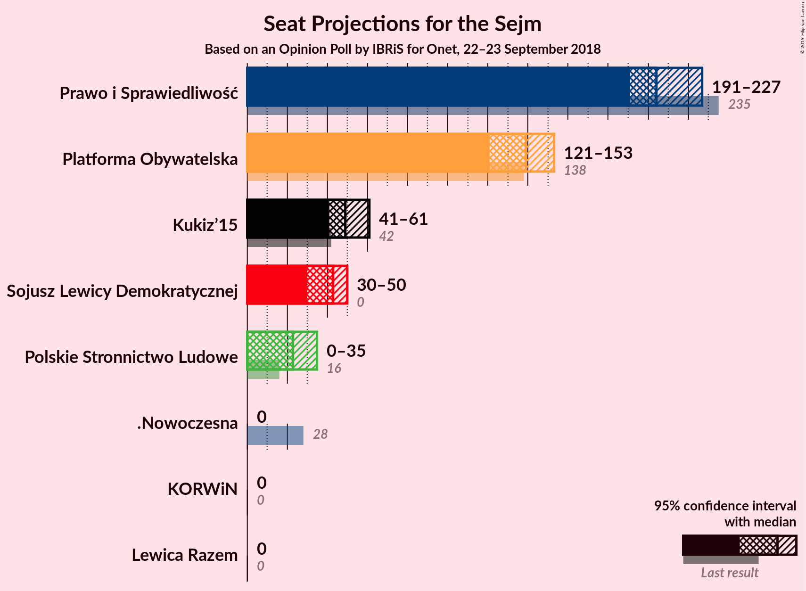
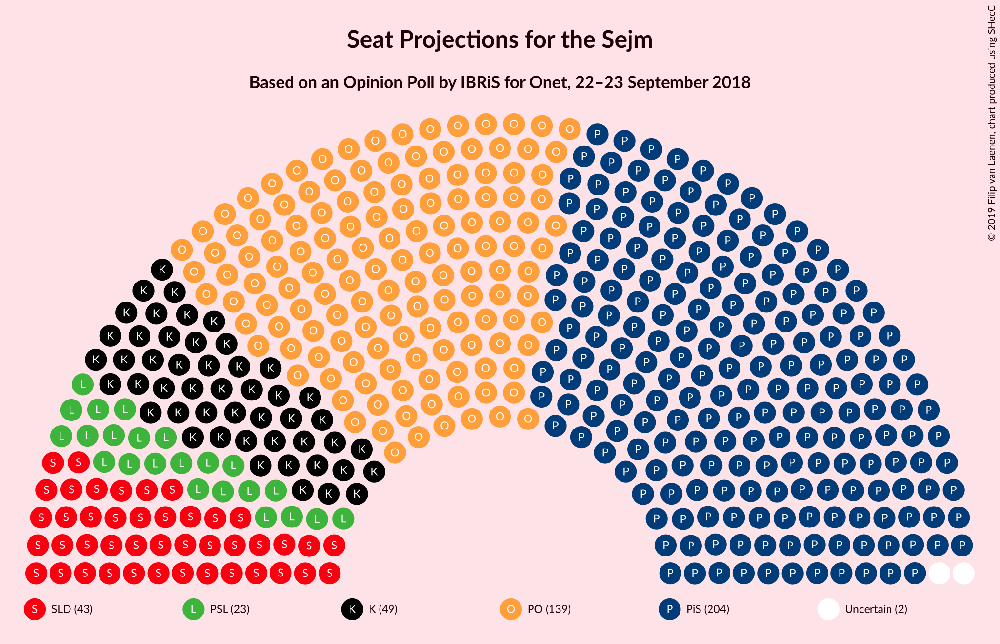
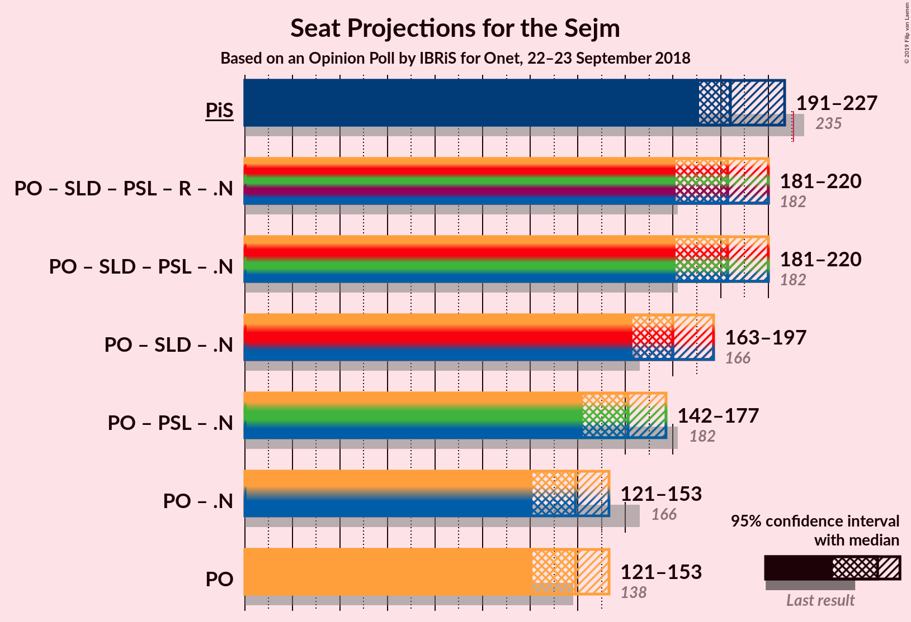

# Opinion Poll by IBRiS for Onet, 22–23 September 2018

<a href="#voting-intentions">Voting Intentions</a> | <a href="#seats">Seats</a> | <a href="#coalitions">Coalitions</a> | <a href="#technical-information">Technical Information</a>

## Voting Intentions

### Confidence Intervals

| Party | Last Result | Poll Result | 80% Confidence Interval | 90% Confidence Interval | 95% Confidence Interval | 99% Confidence Interval |
|:-----:|:-----------:|:-----------:|:-----------------------:|:-----------------------:|:-----------------------:|:-----------------------:|
| Prawo i Sprawiedliwość | 37.6% | 33.2% | 31.4–35.0% |30.9–35.6% |30.5–36.0% |29.6–36.9% |
| Platforma Obywatelska | 24.1% | 23.1% | 21.5–24.8% |21.1–25.3% |20.7–25.7% |20.0–26.5% |
| Kukiz’15 | 8.8% | 10.0% | 8.9–11.3% |8.6–11.6% |8.4–11.9% |7.9–12.5% |
| Sojusz Lewicy Demokratycznej | 7.6% | 8.7% | 7.7–9.9% |7.4–10.3% |7.2–10.5% |6.7–11.1% |
| Polskie Stronnictwo Ludowe | 5.1% | 6.3% | 5.4–7.3% |5.2–7.6% |5.0–7.9% |4.6–8.4% |
| KORWiN | 4.8% | 3.3% | 2.7–4.1% |2.5–4.3% |2.4–4.5% |2.1–4.9% |
| Lewica Razem | 3.6% | 2.4% | 1.9–3.1% |1.7–3.3% |1.6–3.4% |1.4–3.8% |
| .Nowoczesna | 7.6% | 2.2% | 1.7–2.9% |1.6–3.1% |1.5–3.2% |1.3–3.6% |

*Note:* The poll result column reflects the actual value used in the calculations. Published results may vary slightly, and in addition be rounded to fewer digits.

## Seats

### Confidence Intervals

| Party | Last Result | Median | 80% Confidence Interval | 90% Confidence Interval | 95% Confidence Interval | 99% Confidence Interval |
|:-----:|:-----------:|:------:|:-----------------------:|:-----------------------:|:-----------------------:|:-----------------------:|
| <a href="#prawo-i-sprawiedliwość">Prawo i Sprawiedliwość</a> | 235 | 215 | 205–223 |205–224 |205–224 |173–224 |
| <a href="#platforma-obywatelska">Platforma Obywatelska</a> | 138 | 128 | 128–135 |123–135 |123–135 |113–158 |
| <a href="#kukiz’15">Kukiz’15</a> | 42 | 53 | 53–64 |53–64 |53–64 |40–64 |
| <a href="#sojusz-lewicy-demokratycznej">Sojusz Lewicy Demokratycznej</a> | 0 | 44 | 44–45 |44–45 |44–45 |42–59 |
| <a href="#polskie-stronnictwo-ludowe">Polskie Stronnictwo Ludowe</a> | 16 | 23 | 0–23 |0–23 |0–23 |0–28 |
| <a href="#korwin">KORWiN</a> | 0 | 0 | 0 |0 |0 |0 |
| <a href="#lewica-razem">Lewica Razem</a> | 0 | 0 | 0 |0 |0 |0 |
| <a href="#.nowoczesna">.Nowoczesna</a> | 28 | 0 | 0 |0 |0 |0 |

### Prawo i Sprawiedliwość

*For a full overview of the results for this party, see the [Prawo i Sprawiedliwość](party-prawoisprawiedliwość.html) page.*

| Number of Seats | Probability | Accumulated | Special Marks |
|:---------------:|:-----------:|:-----------:|:-------------:|
| 171 | 0.1% | 100% |  |
| 172 | 0.2% | 99.9% |  |
| 173 | 0.2% | 99.7% |  |
| 174 | 0% | 99.5% |  |
| 175 | 0% | 99.5% |  |
| 176 | 0.1% | 99.5% |  |
| 177 | 0% | 99.4% |  |
| 178 | 0% | 99.4% |  |
| 179 | 0% | 99.4% |  |
| 180 | 0% | 99.4% |  |
| 181 | 0% | 99.4% |  |
| 182 | 0% | 99.4% |  |
| 183 | 0% | 99.4% |  |
| 184 | 0% | 99.4% |  |
| 185 | 0% | 99.4% |  |
| 186 | 0% | 99.4% |  |
| 187 | 0% | 99.4% |  |
| 188 | 0% | 99.4% |  |
| 189 | 0% | 99.4% |  |
| 190 | 0% | 99.4% |  |
| 191 | 0% | 99.4% |  |
| 192 | 0% | 99.4% |  |
| 193 | 0% | 99.4% |  |
| 194 | 0% | 99.4% |  |
| 195 | 0% | 99.4% |  |
| 196 | 0% | 99.4% |  |
| 197 | 0% | 99.4% |  |
| 198 | 0% | 99.4% |  |
| 199 | 0% | 99.4% |  |
| 200 | 0% | 99.4% |  |
| 201 | 0% | 99.4% |  |
| 202 | 0% | 99.4% |  |
| 203 | 0% | 99.4% |  |
| 204 | 0% | 99.4% |  |
| 205 | 49% | 99.4% |  |
| 206 | 0% | 51% |  |
| 207 | 0.2% | 51% |  |
| 208 | 0% | 51% |  |
| 209 | 0% | 51% |  |
| 210 | 0% | 51% |  |
| 211 | 0% | 51% |  |
| 212 | 0% | 51% |  |
| 213 | 0% | 51% |  |
| 214 | 0% | 51% |  |
| 215 | 5% | 51% | Median |
| 216 | 0% | 46% |  |
| 217 | 0% | 46% |  |
| 218 | 0% | 46% |  |
| 219 | 0.6% | 46% |  |
| 220 | 0.6% | 45% |  |
| 221 | 0% | 45% |  |
| 222 | 0.1% | 45% |  |
| 223 | 37% | 45% |  |
| 224 | 8% | 8% |  |
| 225 | 0.1% | 0.2% |  |
| 226 | 0% | 0.1% |  |
| 227 | 0% | 0.1% |  |
| 228 | 0% | 0.1% |  |
| 229 | 0% | 0.1% |  |
| 230 | 0% | 0.1% |  |
| 231 | 0% | 0.1% | Majority |
| 232 | 0% | 0.1% |  |
| 233 | 0% | 0.1% |  |
| 234 | 0% | 0.1% |  |
| 235 | 0% | 0.1% | Last Result |
| 236 | 0% | 0.1% |  |
| 237 | 0% | 0.1% |  |
| 238 | 0% | 0.1% |  |
| 239 | 0% | 0.1% |  |
| 240 | 0% | 0.1% |  |
| 241 | 0% | 0.1% |  |
| 242 | 0% | 0.1% |  |
| 243 | 0% | 0.1% |  |
| 244 | 0% | 0% |  |

### Platforma Obywatelska

*For a full overview of the results for this party, see the [Platforma Obywatelska](party-platformaobywatelska.html) page.*

| Number of Seats | Probability | Accumulated | Special Marks |
|:---------------:|:-----------:|:-----------:|:-------------:|
| 113 | 0.6% | 100% |  |
| 114 | 0% | 99.4% |  |
| 115 | 0.6% | 99.4% |  |
| 116 | 0% | 98.8% |  |
| 117 | 0% | 98.8% |  |
| 118 | 0% | 98.8% |  |
| 119 | 0% | 98.8% |  |
| 120 | 0% | 98.8% |  |
| 121 | 0% | 98.8% |  |
| 122 | 0% | 98.8% |  |
| 123 | 5% | 98.8% |  |
| 124 | 0.6% | 94% |  |
| 125 | 0% | 93% |  |
| 126 | 0% | 93% |  |
| 127 | 0% | 93% |  |
| 128 | 44% | 93% | Median |
| 129 | 0% | 49% |  |
| 130 | 0% | 49% |  |
| 131 | 0% | 49% |  |
| 132 | 0% | 49% |  |
| 133 | 0% | 49% |  |
| 134 | 0% | 49% |  |
| 135 | 49% | 49% |  |
| 136 | 0% | 0.7% |  |
| 137 | 0% | 0.7% |  |
| 138 | 0% | 0.7% | Last Result |
| 139 | 0% | 0.7% |  |
| 140 | 0% | 0.7% |  |
| 141 | 0% | 0.7% |  |
| 142 | 0% | 0.6% |  |
| 143 | 0% | 0.6% |  |
| 144 | 0% | 0.6% |  |
| 145 | 0% | 0.6% |  |
| 146 | 0% | 0.6% |  |
| 147 | 0% | 0.6% |  |
| 148 | 0% | 0.6% |  |
| 149 | 0% | 0.6% |  |
| 150 | 0% | 0.6% |  |
| 151 | 0% | 0.6% |  |
| 152 | 0% | 0.6% |  |
| 153 | 0% | 0.6% |  |
| 154 | 0% | 0.6% |  |
| 155 | 0% | 0.6% |  |
| 156 | 0% | 0.6% |  |
| 157 | 0% | 0.6% |  |
| 158 | 0.3% | 0.6% |  |
| 159 | 0% | 0.3% |  |
| 160 | 0% | 0.3% |  |
| 161 | 0% | 0.3% |  |
| 162 | 0% | 0.3% |  |
| 163 | 0% | 0.3% |  |
| 164 | 0% | 0.3% |  |
| 165 | 0% | 0.3% |  |
| 166 | 0.3% | 0.3% |  |
| 167 | 0% | 0% |  |

### Kukiz’15

*For a full overview of the results for this party, see the [Kukiz’15](party-kukiz’15.html) page.*

| Number of Seats | Probability | Accumulated | Special Marks |
|:---------------:|:-----------:|:-----------:|:-------------:|
| 40 | 0.6% | 100% |  |
| 41 | 0.6% | 99.4% |  |
| 42 | 0% | 98.8% | Last Result |
| 43 | 0% | 98.8% |  |
| 44 | 0% | 98.8% |  |
| 45 | 0% | 98.8% |  |
| 46 | 0% | 98.8% |  |
| 47 | 0.2% | 98.8% |  |
| 48 | 0.7% | 98.6% |  |
| 49 | 0.1% | 98% |  |
| 50 | 0% | 98% |  |
| 51 | 0% | 98% |  |
| 52 | 0.1% | 98% |  |
| 53 | 49% | 98% | Median |
| 54 | 0% | 49% |  |
| 55 | 0% | 49% |  |
| 56 | 0% | 49% |  |
| 57 | 0% | 49% |  |
| 58 | 0% | 49% |  |
| 59 | 0% | 49% |  |
| 60 | 0% | 49% |  |
| 61 | 5% | 49% |  |
| 62 | 0% | 44% |  |
| 63 | 0.1% | 44% |  |
| 64 | 44% | 44% |  |
| 65 | 0% | 0% |  |

### Sojusz Lewicy Demokratycznej

*For a full overview of the results for this party, see the [Sojusz Lewicy Demokratycznej](party-sojuszlewicydemokratycznej.html) page.*

| Number of Seats | Probability | Accumulated | Special Marks |
|:---------------:|:-----------:|:-----------:|:-------------:|
| 0 | 0% | 100% | Last Result |
| 1 | 0% | 100% |  |
| 2 | 0% | 100% |  |
| 3 | 0% | 100% |  |
| 4 | 0% | 100% |  |
| 5 | 0% | 100% |  |
| 6 | 0% | 100% |  |
| 7 | 0% | 100% |  |
| 8 | 0% | 100% |  |
| 9 | 0% | 100% |  |
| 10 | 0% | 100% |  |
| 11 | 0% | 100% |  |
| 12 | 0% | 100% |  |
| 13 | 0% | 100% |  |
| 14 | 0% | 100% |  |
| 15 | 0% | 100% |  |
| 16 | 0% | 100% |  |
| 17 | 0% | 100% |  |
| 18 | 0% | 100% |  |
| 19 | 0% | 100% |  |
| 20 | 0% | 100% |  |
| 21 | 0% | 100% |  |
| 22 | 0% | 100% |  |
| 23 | 0% | 100% |  |
| 24 | 0% | 100% |  |
| 25 | 0% | 100% |  |
| 26 | 0% | 100% |  |
| 27 | 0% | 100% |  |
| 28 | 0% | 100% |  |
| 29 | 0% | 100% |  |
| 30 | 0% | 100% |  |
| 31 | 0% | 100% |  |
| 32 | 0% | 99.9% |  |
| 33 | 0% | 99.9% |  |
| 34 | 0% | 99.9% |  |
| 35 | 0% | 99.9% |  |
| 36 | 0% | 99.9% |  |
| 37 | 0% | 99.9% |  |
| 38 | 0% | 99.9% |  |
| 39 | 0% | 99.9% |  |
| 40 | 0% | 99.9% |  |
| 41 | 0% | 99.9% |  |
| 42 | 0.8% | 99.9% |  |
| 43 | 0.1% | 99.1% |  |
| 44 | 56% | 99.0% | Median |
| 45 | 41% | 43% |  |
| 46 | 0% | 2% |  |
| 47 | 0% | 2% |  |
| 48 | 0% | 2% |  |
| 49 | 0% | 1.5% |  |
| 50 | 0% | 1.5% |  |
| 51 | 0% | 1.5% |  |
| 52 | 0% | 1.5% |  |
| 53 | 0% | 1.5% |  |
| 54 | 0% | 1.5% |  |
| 55 | 0% | 1.5% |  |
| 56 | 0.3% | 1.5% |  |
| 57 | 0.6% | 1.2% |  |
| 58 | 0% | 0.6% |  |
| 59 | 0.6% | 0.6% |  |
| 60 | 0% | 0% |  |

### Polskie Stronnictwo Ludowe

*For a full overview of the results for this party, see the [Polskie Stronnictwo Ludowe](party-polskiestronnictwoludowe.html) page.*

| Number of Seats | Probability | Accumulated | Special Marks |
|:---------------:|:-----------:|:-----------:|:-------------:|
| 0 | 44% | 100% |  |
| 1 | 0% | 56% |  |
| 2 | 0% | 56% |  |
| 3 | 0% | 56% |  |
| 4 | 0% | 56% |  |
| 5 | 0% | 56% |  |
| 6 | 0% | 56% |  |
| 7 | 0% | 56% |  |
| 8 | 0% | 56% |  |
| 9 | 0% | 56% |  |
| 10 | 0% | 56% |  |
| 11 | 0% | 56% |  |
| 12 | 0% | 56% |  |
| 13 | 0% | 56% |  |
| 14 | 0% | 56% |  |
| 15 | 0% | 56% |  |
| 16 | 5% | 56% | Last Result |
| 17 | 0% | 51% |  |
| 18 | 0% | 51% |  |
| 19 | 0% | 51% |  |
| 20 | 0% | 51% |  |
| 21 | 0% | 51% |  |
| 22 | 0% | 51% |  |
| 23 | 50% | 51% | Median |
| 24 | 0% | 2% |  |
| 25 | 0% | 2% |  |
| 26 | 0% | 2% |  |
| 27 | 0.3% | 2% |  |
| 28 | 1.1% | 1.2% |  |
| 29 | 0% | 0.1% |  |
| 30 | 0% | 0% |  |

### KORWiN

*For a full overview of the results for this party, see the [KORWiN](party-korwin.html) page.*

| Number of Seats | Probability | Accumulated | Special Marks |
|:---------------:|:-----------:|:-----------:|:-------------:|
| 0 | 100% | 100% | Last Result, Median |

### Lewica Razem

*For a full overview of the results for this party, see the [Lewica Razem](party-lewicarazem.html) page.*

| Number of Seats | Probability | Accumulated | Special Marks |
|:---------------:|:-----------:|:-----------:|:-------------:|
| 0 | 100% | 100% | Last Result, Median |

### .Nowoczesna

*For a full overview of the results for this party, see the [.Nowoczesna](party-nowoczesna.html) page.*

| Number of Seats | Probability | Accumulated | Special Marks |
|:---------------:|:-----------:|:-----------:|:-------------:|
| 0 | 100% | 100% | Median |
| 1 | 0% | 0% |  |
| 2 | 0% | 0% |  |
| 3 | 0% | 0% |  |
| 4 | 0% | 0% |  |
| 5 | 0% | 0% |  |
| 6 | 0% | 0% |  |
| 7 | 0% | 0% |  |
| 8 | 0% | 0% |  |
| 9 | 0% | 0% |  |
| 10 | 0% | 0% |  |
| 11 | 0% | 0% |  |
| 12 | 0% | 0% |  |
| 13 | 0% | 0% |  |
| 14 | 0% | 0% |  |
| 15 | 0% | 0% |  |
| 16 | 0% | 0% |  |
| 17 | 0% | 0% |  |
| 18 | 0% | 0% |  |
| 19 | 0% | 0% |  |
| 20 | 0% | 0% |  |
| 21 | 0% | 0% |  |
| 22 | 0% | 0% |  |
| 23 | 0% | 0% |  |
| 24 | 0% | 0% |  |
| 25 | 0% | 0% |  |
| 26 | 0% | 0% |  |
| 27 | 0% | 0% |  |
| 28 | 0% | 0% | Last Result |

## Coalitions

### Confidence Intervals

| Coalition | Last Result | Median | Majority? | 80% Confidence Interval | 90% Confidence Interval | 95% Confidence Interval | 99% Confidence Interval |
|:---------:|:-----------:|:------:|:---------:|:-----------------------:|:-----------------------:|:-----------------------:|:-----------------------:|
| Prawo i Sprawiedliwość | 235 | 215 | 0.1% | 205–223 | 205–224 | 205–224 | 173–224 |
| Platforma Obywatelska – Sojusz Lewicy Demokratycznej – Polskie Stronnictwo Ludowe – Lewica Razem – .Nowoczesna | 182 | 200 | 0.6% | 173–202 | 172–202 | 172–202 | 172–234 |
| Platforma Obywatelska – Sojusz Lewicy Demokratycznej – Polskie Stronnictwo Ludowe – .Nowoczesna | 182 | 200 | 0.6% | 173–202 | 172–202 | 172–202 | 172–234 |
| Platforma Obywatelska – Sojusz Lewicy Demokratycznej – .Nowoczesna | 166 | 173 | 0% | 172–179 | 168–179 | 168–179 | 166–211 |
| Platforma Obywatelska – Polskie Stronnictwo Ludowe – .Nowoczesna | 182 | 144 | 0% | 128–158 | 128–158 | 128–158 | 128–185 |
| Platforma Obywatelska – .Nowoczesna | 166 | 128 | 0% | 128–135 | 123–135 | 123–135 | 113–158 |
| Platforma Obywatelska | 138 | 128 | 0% | 128–135 | 123–135 | 123–135 | 113–158 |

### Prawo i Sprawiedliwość

| Number of Seats | Probability | Accumulated | Special Marks |
|:---------------:|:-----------:|:-----------:|:-------------:|
| 171 | 0.1% | 100% |  |
| 172 | 0.2% | 99.9% |  |
| 173 | 0.2% | 99.7% |  |
| 174 | 0% | 99.5% |  |
| 175 | 0% | 99.5% |  |
| 176 | 0.1% | 99.5% |  |
| 177 | 0% | 99.4% |  |
| 178 | 0% | 99.4% |  |
| 179 | 0% | 99.4% |  |
| 180 | 0% | 99.4% |  |
| 181 | 0% | 99.4% |  |
| 182 | 0% | 99.4% |  |
| 183 | 0% | 99.4% |  |
| 184 | 0% | 99.4% |  |
| 185 | 0% | 99.4% |  |
| 186 | 0% | 99.4% |  |
| 187 | 0% | 99.4% |  |
| 188 | 0% | 99.4% |  |
| 189 | 0% | 99.4% |  |
| 190 | 0% | 99.4% |  |
| 191 | 0% | 99.4% |  |
| 192 | 0% | 99.4% |  |
| 193 | 0% | 99.4% |  |
| 194 | 0% | 99.4% |  |
| 195 | 0% | 99.4% |  |
| 196 | 0% | 99.4% |  |
| 197 | 0% | 99.4% |  |
| 198 | 0% | 99.4% |  |
| 199 | 0% | 99.4% |  |
| 200 | 0% | 99.4% |  |
| 201 | 0% | 99.4% |  |
| 202 | 0% | 99.4% |  |
| 203 | 0% | 99.4% |  |
| 204 | 0% | 99.4% |  |
| 205 | 49% | 99.4% |  |
| 206 | 0% | 51% |  |
| 207 | 0.2% | 51% |  |
| 208 | 0% | 51% |  |
| 209 | 0% | 51% |  |
| 210 | 0% | 51% |  |
| 211 | 0% | 51% |  |
| 212 | 0% | 51% |  |
| 213 | 0% | 51% |  |
| 214 | 0% | 51% |  |
| 215 | 5% | 51% | Median |
| 216 | 0% | 46% |  |
| 217 | 0% | 46% |  |
| 218 | 0% | 46% |  |
| 219 | 0.6% | 46% |  |
| 220 | 0.6% | 45% |  |
| 221 | 0% | 45% |  |
| 222 | 0.1% | 45% |  |
| 223 | 37% | 45% |  |
| 224 | 8% | 8% |  |
| 225 | 0.1% | 0.2% |  |
| 226 | 0% | 0.1% |  |
| 227 | 0% | 0.1% |  |
| 228 | 0% | 0.1% |  |
| 229 | 0% | 0.1% |  |
| 230 | 0% | 0.1% |  |
| 231 | 0% | 0.1% | Majority |
| 232 | 0% | 0.1% |  |
| 233 | 0% | 0.1% |  |
| 234 | 0% | 0.1% |  |
| 235 | 0% | 0.1% | Last Result |
| 236 | 0% | 0.1% |  |
| 237 | 0% | 0.1% |  |
| 238 | 0% | 0.1% |  |
| 239 | 0% | 0.1% |  |
| 240 | 0% | 0.1% |  |
| 241 | 0% | 0.1% |  |
| 242 | 0% | 0.1% |  |
| 243 | 0% | 0.1% |  |
| 244 | 0% | 0% |  |

### Platforma Obywatelska – Sojusz Lewicy Demokratycznej – Polskie Stronnictwo Ludowe – Lewica Razem – .Nowoczesna

| Number of Seats | Probability | Accumulated | Special Marks |
|:---------------:|:-----------:|:-----------:|:-------------:|
| 172 | 8% | 100% |  |
| 173 | 36% | 92% |  |
| 174 | 0% | 56% |  |
| 175 | 0% | 56% |  |
| 176 | 0% | 56% |  |
| 177 | 0% | 56% |  |
| 178 | 0% | 56% |  |
| 179 | 0% | 56% |  |
| 180 | 0% | 56% |  |
| 181 | 0% | 56% |  |
| 182 | 0% | 56% | Last Result |
| 183 | 0% | 56% |  |
| 184 | 5% | 56% |  |
| 185 | 0% | 51% |  |
| 186 | 0% | 51% |  |
| 187 | 0% | 51% |  |
| 188 | 0% | 51% |  |
| 189 | 0.6% | 51% |  |
| 190 | 0% | 51% |  |
| 191 | 0% | 51% |  |
| 192 | 0% | 51% |  |
| 193 | 0% | 51% |  |
| 194 | 0% | 51% |  |
| 195 | 0% | 51% | Median |
| 196 | 0% | 51% |  |
| 197 | 0% | 51% |  |
| 198 | 0% | 51% |  |
| 199 | 0% | 51% |  |
| 200 | 1.3% | 50% |  |
| 201 | 0% | 49% |  |
| 202 | 49% | 49% |  |
| 203 | 0% | 0.7% |  |
| 204 | 0% | 0.7% |  |
| 205 | 0% | 0.7% |  |
| 206 | 0% | 0.7% |  |
| 207 | 0% | 0.7% |  |
| 208 | 0% | 0.6% |  |
| 209 | 0% | 0.6% |  |
| 210 | 0% | 0.6% |  |
| 211 | 0% | 0.6% |  |
| 212 | 0% | 0.6% |  |
| 213 | 0% | 0.6% |  |
| 214 | 0% | 0.6% |  |
| 215 | 0% | 0.6% |  |
| 216 | 0% | 0.6% |  |
| 217 | 0% | 0.6% |  |
| 218 | 0% | 0.6% |  |
| 219 | 0% | 0.6% |  |
| 220 | 0% | 0.6% |  |
| 221 | 0% | 0.6% |  |
| 222 | 0% | 0.6% |  |
| 223 | 0% | 0.6% |  |
| 224 | 0% | 0.6% |  |
| 225 | 0% | 0.6% |  |
| 226 | 0% | 0.6% |  |
| 227 | 0% | 0.6% |  |
| 228 | 0% | 0.6% |  |
| 229 | 0% | 0.6% |  |
| 230 | 0% | 0.6% |  |
| 231 | 0% | 0.6% | Majority |
| 232 | 0.1% | 0.6% |  |
| 233 | 0% | 0.5% |  |
| 234 | 0.2% | 0.5% |  |
| 235 | 0% | 0.3% |  |
| 236 | 0% | 0.3% |  |
| 237 | 0% | 0.3% |  |
| 238 | 0% | 0.3% |  |
| 239 | 0% | 0.3% |  |
| 240 | 0% | 0.3% |  |
| 241 | 0.3% | 0.3% |  |
| 242 | 0% | 0% |  |

### Platforma Obywatelska – Sojusz Lewicy Demokratycznej – Polskie Stronnictwo Ludowe – .Nowoczesna

| Number of Seats | Probability | Accumulated | Special Marks |
|:---------------:|:-----------:|:-----------:|:-------------:|
| 172 | 8% | 100% |  |
| 173 | 36% | 92% |  |
| 174 | 0% | 56% |  |
| 175 | 0% | 56% |  |
| 176 | 0% | 56% |  |
| 177 | 0% | 56% |  |
| 178 | 0% | 56% |  |
| 179 | 0% | 56% |  |
| 180 | 0% | 56% |  |
| 181 | 0% | 56% |  |
| 182 | 0% | 56% | Last Result |
| 183 | 0% | 56% |  |
| 184 | 5% | 56% |  |
| 185 | 0% | 51% |  |
| 186 | 0% | 51% |  |
| 187 | 0% | 51% |  |
| 188 | 0% | 51% |  |
| 189 | 0.6% | 51% |  |
| 190 | 0% | 51% |  |
| 191 | 0% | 51% |  |
| 192 | 0% | 51% |  |
| 193 | 0% | 51% |  |
| 194 | 0% | 51% |  |
| 195 | 0% | 51% | Median |
| 196 | 0% | 51% |  |
| 197 | 0% | 51% |  |
| 198 | 0% | 51% |  |
| 199 | 0% | 51% |  |
| 200 | 1.3% | 50% |  |
| 201 | 0% | 49% |  |
| 202 | 49% | 49% |  |
| 203 | 0% | 0.7% |  |
| 204 | 0% | 0.7% |  |
| 205 | 0% | 0.7% |  |
| 206 | 0% | 0.7% |  |
| 207 | 0% | 0.7% |  |
| 208 | 0% | 0.6% |  |
| 209 | 0% | 0.6% |  |
| 210 | 0% | 0.6% |  |
| 211 | 0% | 0.6% |  |
| 212 | 0% | 0.6% |  |
| 213 | 0% | 0.6% |  |
| 214 | 0% | 0.6% |  |
| 215 | 0% | 0.6% |  |
| 216 | 0% | 0.6% |  |
| 217 | 0% | 0.6% |  |
| 218 | 0% | 0.6% |  |
| 219 | 0% | 0.6% |  |
| 220 | 0% | 0.6% |  |
| 221 | 0% | 0.6% |  |
| 222 | 0% | 0.6% |  |
| 223 | 0% | 0.6% |  |
| 224 | 0% | 0.6% |  |
| 225 | 0% | 0.6% |  |
| 226 | 0% | 0.6% |  |
| 227 | 0% | 0.6% |  |
| 228 | 0% | 0.6% |  |
| 229 | 0% | 0.6% |  |
| 230 | 0% | 0.6% |  |
| 231 | 0% | 0.6% | Majority |
| 232 | 0.1% | 0.6% |  |
| 233 | 0% | 0.5% |  |
| 234 | 0.2% | 0.5% |  |
| 235 | 0% | 0.3% |  |
| 236 | 0% | 0.3% |  |
| 237 | 0% | 0.3% |  |
| 238 | 0% | 0.3% |  |
| 239 | 0% | 0.3% |  |
| 240 | 0% | 0.3% |  |
| 241 | 0.3% | 0.3% |  |
| 242 | 0% | 0% |  |

### Platforma Obywatelska – Sojusz Lewicy Demokratycznej – .Nowoczesna

| Number of Seats | Probability | Accumulated | Special Marks |
|:---------------:|:-----------:|:-----------:|:-------------:|
| 166 | 0.6% | 100% | Last Result |
| 167 | 0% | 99.3% |  |
| 168 | 5% | 99.3% |  |
| 169 | 0% | 95% |  |
| 170 | 0% | 95% |  |
| 171 | 0% | 95% |  |
| 172 | 9% | 95% | Median |
| 173 | 36% | 86% |  |
| 174 | 0% | 49% |  |
| 175 | 0% | 49% |  |
| 176 | 0% | 49% |  |
| 177 | 0.2% | 49% |  |
| 178 | 0% | 49% |  |
| 179 | 49% | 49% |  |
| 180 | 0% | 0.6% |  |
| 181 | 0% | 0.6% |  |
| 182 | 0% | 0.6% |  |
| 183 | 0% | 0.6% |  |
| 184 | 0% | 0.6% |  |
| 185 | 0% | 0.6% |  |
| 186 | 0% | 0.6% |  |
| 187 | 0% | 0.6% |  |
| 188 | 0% | 0.6% |  |
| 189 | 0% | 0.6% |  |
| 190 | 0% | 0.6% |  |
| 191 | 0% | 0.6% |  |
| 192 | 0% | 0.6% |  |
| 193 | 0% | 0.6% |  |
| 194 | 0% | 0.6% |  |
| 195 | 0% | 0.6% |  |
| 196 | 0% | 0.6% |  |
| 197 | 0% | 0.6% |  |
| 198 | 0% | 0.6% |  |
| 199 | 0% | 0.6% |  |
| 200 | 0% | 0.6% |  |
| 201 | 0% | 0.6% |  |
| 202 | 0% | 0.6% |  |
| 203 | 0% | 0.6% |  |
| 204 | 0% | 0.6% |  |
| 205 | 0% | 0.6% |  |
| 206 | 0% | 0.6% |  |
| 207 | 0% | 0.6% |  |
| 208 | 0% | 0.6% |  |
| 209 | 0.1% | 0.6% |  |
| 210 | 0% | 0.5% |  |
| 211 | 0.2% | 0.5% |  |
| 212 | 0% | 0.3% |  |
| 213 | 0% | 0.3% |  |
| 214 | 0.3% | 0.3% |  |
| 215 | 0% | 0% |  |

### Platforma Obywatelska – Polskie Stronnictwo Ludowe – .Nowoczesna

| Number of Seats | Probability | Accumulated | Special Marks |
|:---------------:|:-----------:|:-----------:|:-------------:|
| 128 | 44% | 100% |  |
| 129 | 0% | 56% |  |
| 130 | 0% | 56% |  |
| 131 | 0% | 56% |  |
| 132 | 0% | 56% |  |
| 133 | 0% | 56% |  |
| 134 | 0% | 56% |  |
| 135 | 0% | 56% |  |
| 136 | 0% | 56% |  |
| 137 | 0% | 56% |  |
| 138 | 0% | 56% |  |
| 139 | 5% | 56% |  |
| 140 | 0% | 51% |  |
| 141 | 0.6% | 51% |  |
| 142 | 0% | 51% |  |
| 143 | 0.6% | 51% |  |
| 144 | 0% | 50% |  |
| 145 | 0% | 50% |  |
| 146 | 0% | 50% |  |
| 147 | 0.6% | 50% |  |
| 148 | 0% | 49% |  |
| 149 | 0% | 49% |  |
| 150 | 0% | 49% |  |
| 151 | 0% | 49% | Median |
| 152 | 0% | 49% |  |
| 153 | 0% | 49% |  |
| 154 | 0% | 49% |  |
| 155 | 0% | 49% |  |
| 156 | 0% | 49% |  |
| 157 | 0% | 49% |  |
| 158 | 49% | 49% |  |
| 159 | 0% | 0.7% |  |
| 160 | 0% | 0.7% |  |
| 161 | 0% | 0.7% |  |
| 162 | 0% | 0.7% |  |
| 163 | 0% | 0.7% |  |
| 164 | 0% | 0.7% |  |
| 165 | 0% | 0.7% |  |
| 166 | 0% | 0.7% |  |
| 167 | 0% | 0.6% |  |
| 168 | 0% | 0.6% |  |
| 169 | 0% | 0.6% |  |
| 170 | 0% | 0.6% |  |
| 171 | 0% | 0.6% |  |
| 172 | 0% | 0.6% |  |
| 173 | 0% | 0.6% |  |
| 174 | 0% | 0.6% |  |
| 175 | 0% | 0.6% |  |
| 176 | 0% | 0.6% |  |
| 177 | 0% | 0.6% |  |
| 178 | 0% | 0.6% |  |
| 179 | 0% | 0.6% |  |
| 180 | 0% | 0.6% |  |
| 181 | 0% | 0.6% |  |
| 182 | 0% | 0.6% | Last Result |
| 183 | 0% | 0.6% |  |
| 184 | 0% | 0.6% |  |
| 185 | 0.3% | 0.6% |  |
| 186 | 0% | 0.3% |  |
| 187 | 0% | 0.3% |  |
| 188 | 0% | 0.3% |  |
| 189 | 0.3% | 0.3% |  |
| 190 | 0% | 0% |  |

### Platforma Obywatelska – .Nowoczesna

| Number of Seats | Probability | Accumulated | Special Marks |
|:---------------:|:-----------:|:-----------:|:-------------:|
| 113 | 0.6% | 100% |  |
| 114 | 0% | 99.4% |  |
| 115 | 0.6% | 99.4% |  |
| 116 | 0% | 98.8% |  |
| 117 | 0% | 98.8% |  |
| 118 | 0% | 98.8% |  |
| 119 | 0% | 98.8% |  |
| 120 | 0% | 98.8% |  |
| 121 | 0% | 98.8% |  |
| 122 | 0% | 98.8% |  |
| 123 | 5% | 98.8% |  |
| 124 | 0.6% | 94% |  |
| 125 | 0% | 93% |  |
| 126 | 0% | 93% |  |
| 127 | 0% | 93% |  |
| 128 | 44% | 93% | Median |
| 129 | 0% | 49% |  |
| 130 | 0% | 49% |  |
| 131 | 0% | 49% |  |
| 132 | 0% | 49% |  |
| 133 | 0% | 49% |  |
| 134 | 0% | 49% |  |
| 135 | 49% | 49% |  |
| 136 | 0% | 0.7% |  |
| 137 | 0% | 0.7% |  |
| 138 | 0% | 0.7% |  |
| 139 | 0% | 0.7% |  |
| 140 | 0% | 0.7% |  |
| 141 | 0% | 0.7% |  |
| 142 | 0% | 0.6% |  |
| 143 | 0% | 0.6% |  |
| 144 | 0% | 0.6% |  |
| 145 | 0% | 0.6% |  |
| 146 | 0% | 0.6% |  |
| 147 | 0% | 0.6% |  |
| 148 | 0% | 0.6% |  |
| 149 | 0% | 0.6% |  |
| 150 | 0% | 0.6% |  |
| 151 | 0% | 0.6% |  |
| 152 | 0% | 0.6% |  |
| 153 | 0% | 0.6% |  |
| 154 | 0% | 0.6% |  |
| 155 | 0% | 0.6% |  |
| 156 | 0% | 0.6% |  |
| 157 | 0% | 0.6% |  |
| 158 | 0.3% | 0.6% |  |
| 159 | 0% | 0.3% |  |
| 160 | 0% | 0.3% |  |
| 161 | 0% | 0.3% |  |
| 162 | 0% | 0.3% |  |
| 163 | 0% | 0.3% |  |
| 164 | 0% | 0.3% |  |
| 165 | 0% | 0.3% |  |
| 166 | 0.3% | 0.3% | Last Result |
| 167 | 0% | 0% |  |

### Platforma Obywatelska

| Number of Seats | Probability | Accumulated | Special Marks |
|:---------------:|:-----------:|:-----------:|:-------------:|
| 113 | 0.6% | 100% |  |
| 114 | 0% | 99.4% |  |
| 115 | 0.6% | 99.4% |  |
| 116 | 0% | 98.8% |  |
| 117 | 0% | 98.8% |  |
| 118 | 0% | 98.8% |  |
| 119 | 0% | 98.8% |  |
| 120 | 0% | 98.8% |  |
| 121 | 0% | 98.8% |  |
| 122 | 0% | 98.8% |  |
| 123 | 5% | 98.8% |  |
| 124 | 0.6% | 94% |  |
| 125 | 0% | 93% |  |
| 126 | 0% | 93% |  |
| 127 | 0% | 93% |  |
| 128 | 44% | 93% | Median |
| 129 | 0% | 49% |  |
| 130 | 0% | 49% |  |
| 131 | 0% | 49% |  |
| 132 | 0% | 49% |  |
| 133 | 0% | 49% |  |
| 134 | 0% | 49% |  |
| 135 | 49% | 49% |  |
| 136 | 0% | 0.7% |  |
| 137 | 0% | 0.7% |  |
| 138 | 0% | 0.7% | Last Result |
| 139 | 0% | 0.7% |  |
| 140 | 0% | 0.7% |  |
| 141 | 0% | 0.7% |  |
| 142 | 0% | 0.6% |  |
| 143 | 0% | 0.6% |  |
| 144 | 0% | 0.6% |  |
| 145 | 0% | 0.6% |  |
| 146 | 0% | 0.6% |  |
| 147 | 0% | 0.6% |  |
| 148 | 0% | 0.6% |  |
| 149 | 0% | 0.6% |  |
| 150 | 0% | 0.6% |  |
| 151 | 0% | 0.6% |  |
| 152 | 0% | 0.6% |  |
| 153 | 0% | 0.6% |  |
| 154 | 0% | 0.6% |  |
| 155 | 0% | 0.6% |  |
| 156 | 0% | 0.6% |  |
| 157 | 0% | 0.6% |  |
| 158 | 0.3% | 0.6% |  |
| 159 | 0% | 0.3% |  |
| 160 | 0% | 0.3% |  |
| 161 | 0% | 0.3% |  |
| 162 | 0% | 0.3% |  |
| 163 | 0% | 0.3% |  |
| 164 | 0% | 0.3% |  |
| 165 | 0% | 0.3% |  |
| 166 | 0.3% | 0.3% |  |
| 167 | 0% | 0% |  |

## Technical Information

### Opinion Poll

+ **Polling firm:** IBRiS
+ **Commissioner(s):** Onet
+ **Fieldwork period:** 22–23 September 2018

### Calculations

+ **Sample size:** 1100
+ **Simulations done:** 1,024
+ **Error estimate:** 3.09%

