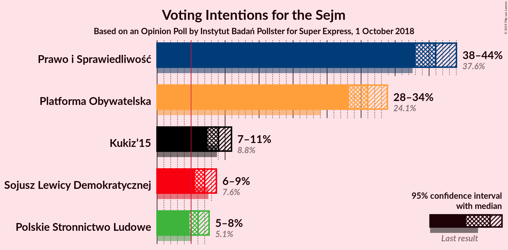
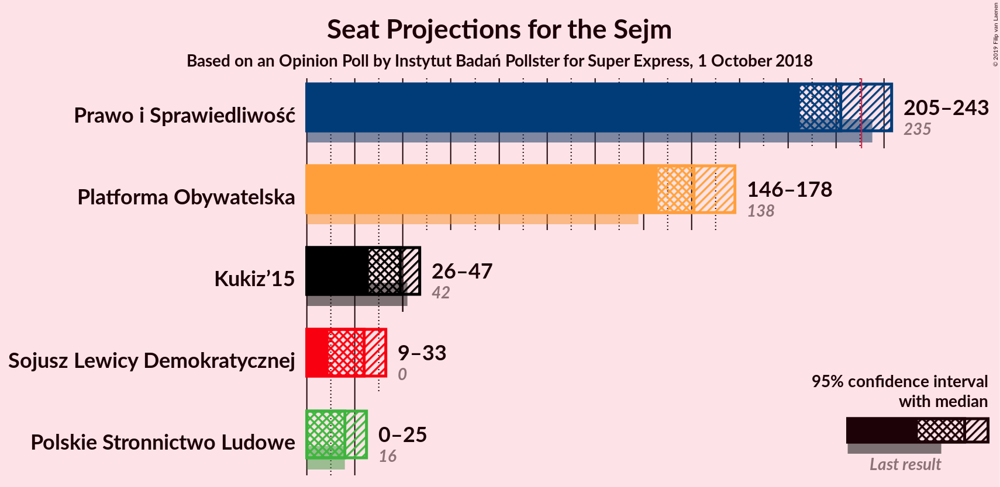
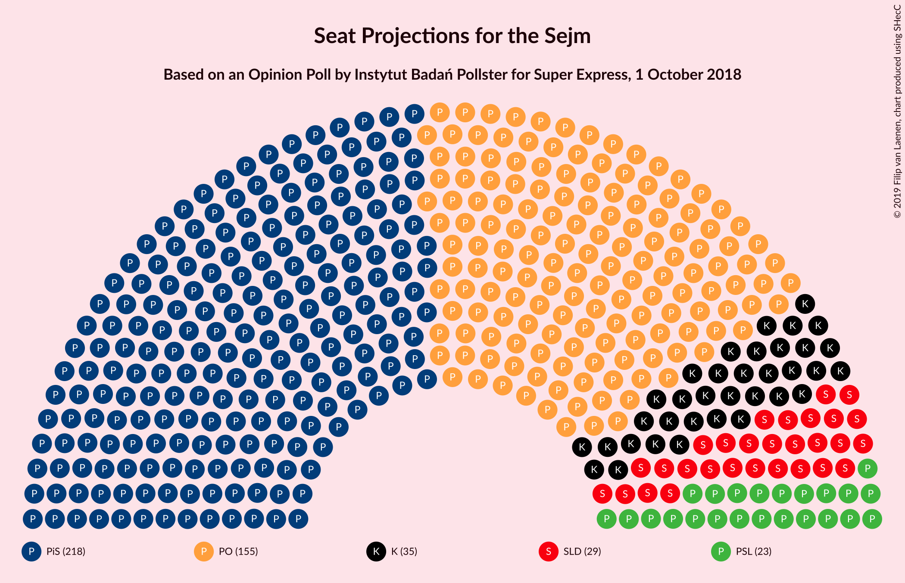
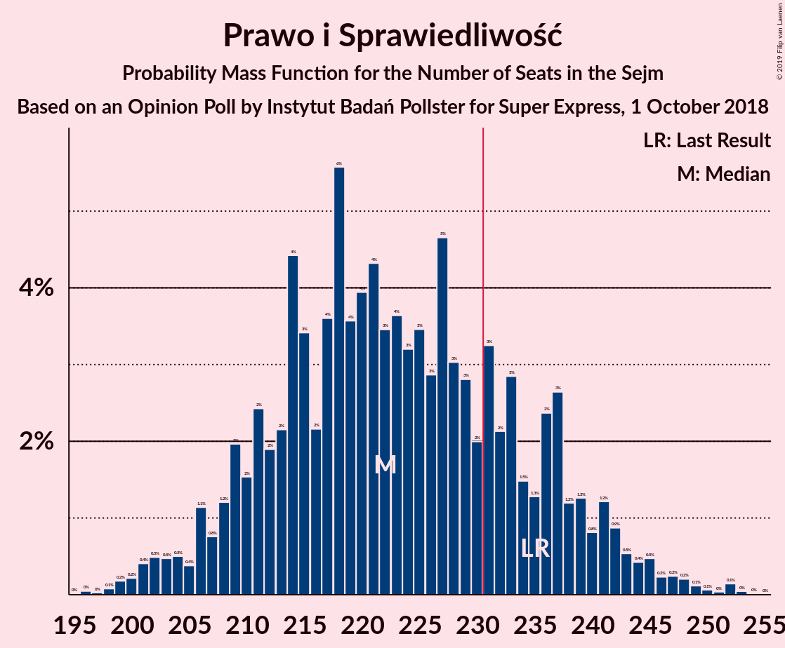
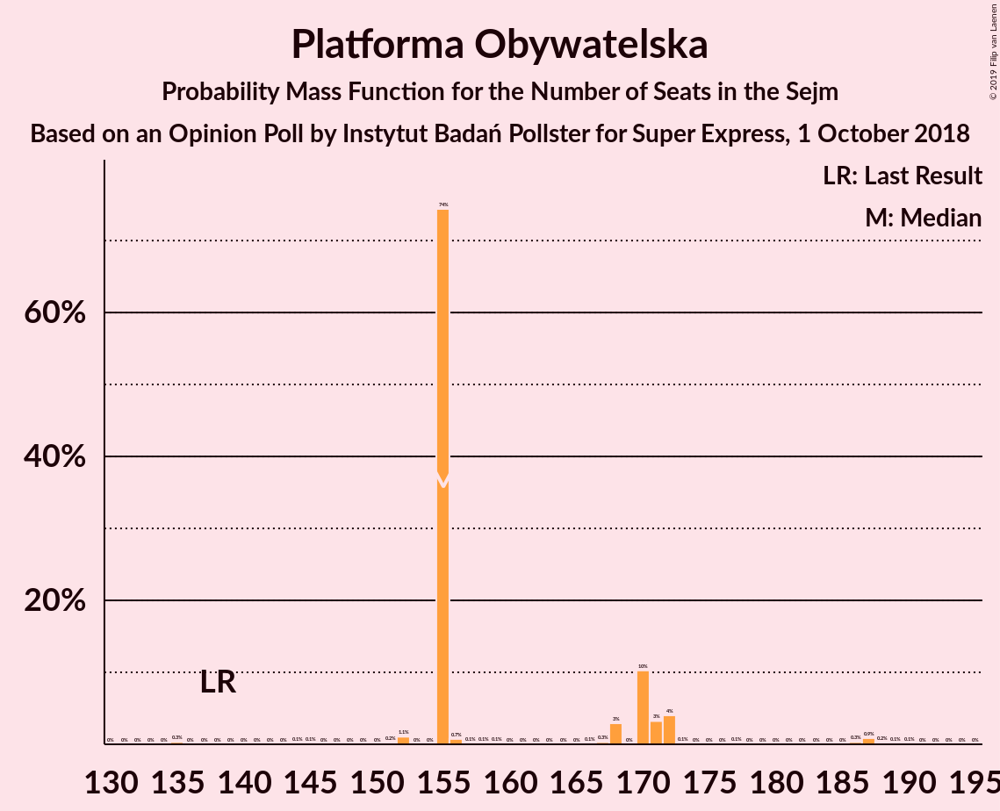
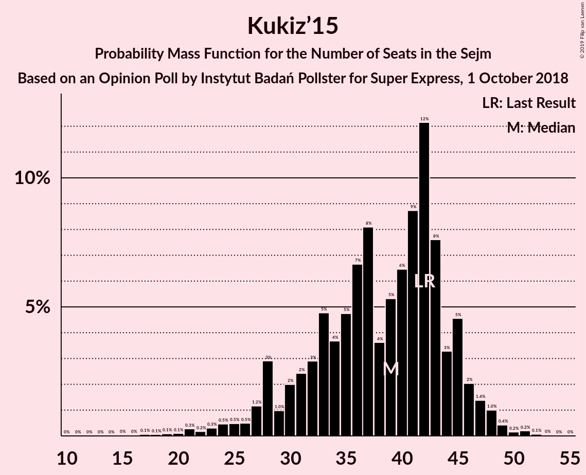
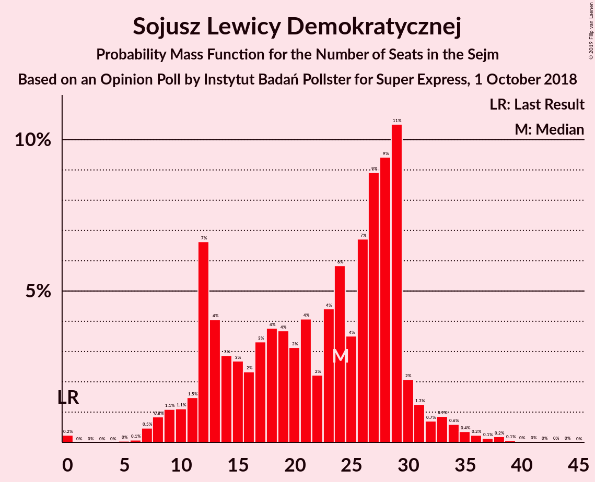
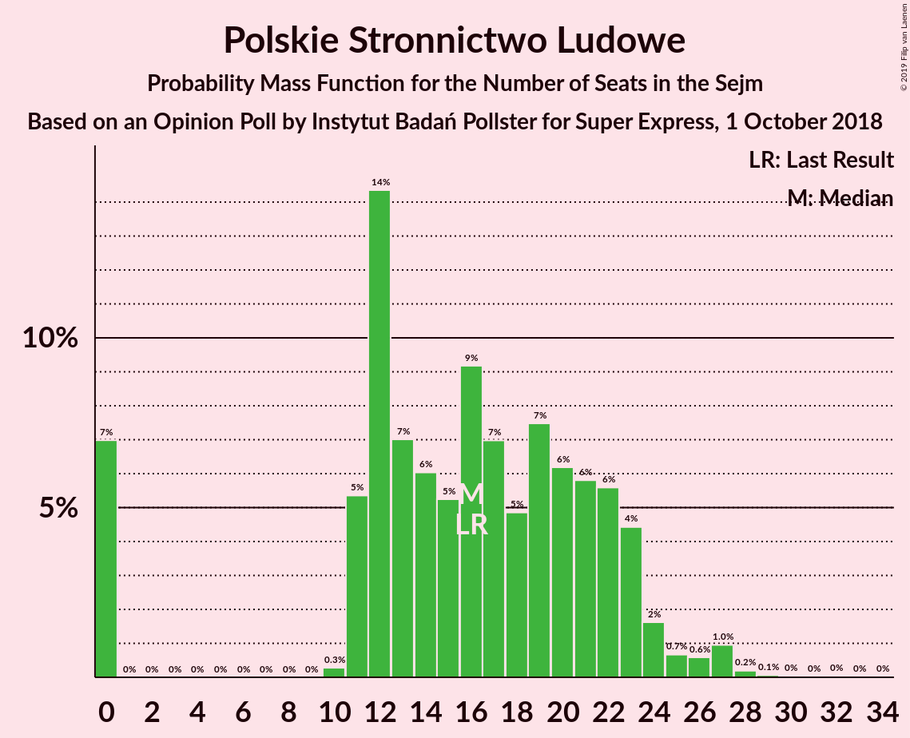
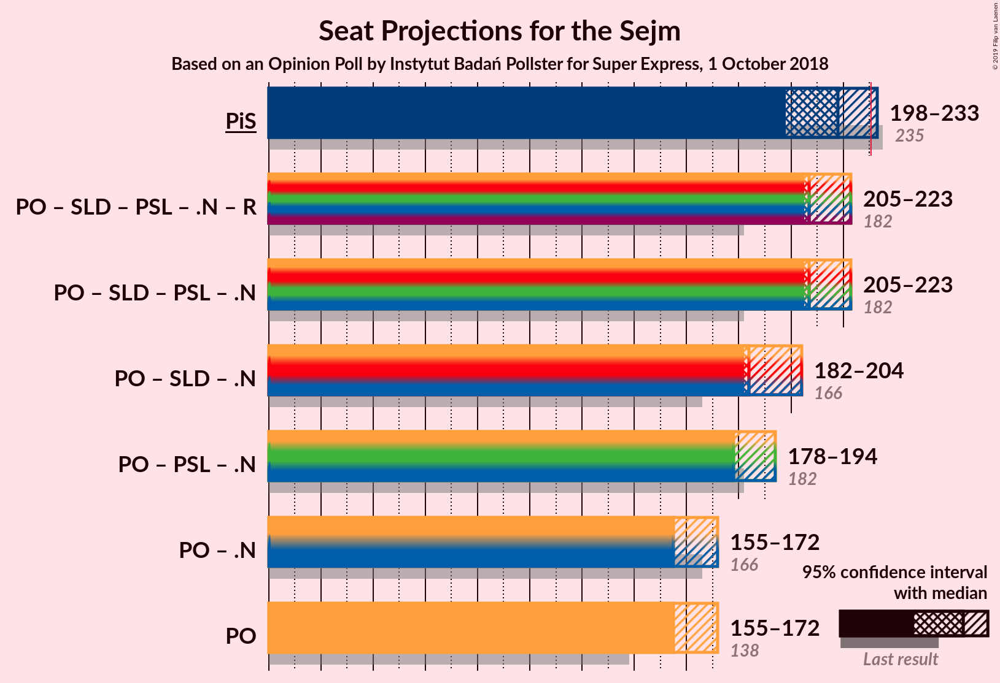
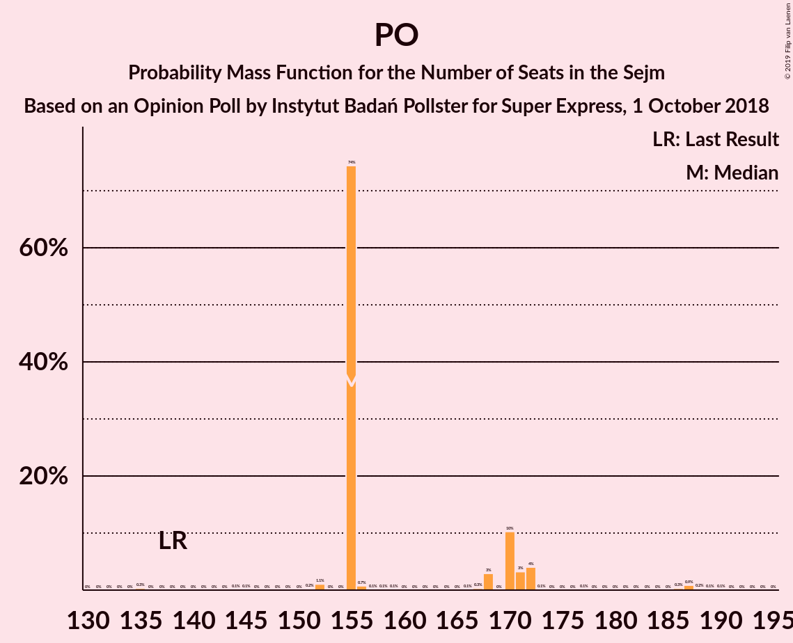

# Opinion Poll by Instytut Badań Pollster for Super Express, 1 October 2018

<a href="#voting-intentions">Voting Intentions</a> | <a href="#seats">Seats</a> | <a href="#coalitions">Coalitions</a> | <a href="#technical-information">Technical Information</a>

## Voting Intentions

### Confidence Intervals

| Party | Last Result | Poll Result | 80% Confidence Interval | 90% Confidence Interval | 95% Confidence Interval | 99% Confidence Interval |
|:-----:|:-----------:|:-----------:|:-----------------------:|:-----------------------:|:-----------------------:|:-----------------------:|
| Prawo i Sprawiedliwość | 37.6% | 41.0% | 39.0–43.0% |38.5–43.5% |38.0–44.0% |37.1–45.0% |
| Platforma Obywatelska | 24.1% | 31.0% | 29.2–32.9% |28.7–33.4% |28.2–33.9% |27.4–34.8% |
| Kukiz’15 | 8.8% | 9.0% | 8.0–10.3% |7.7–10.6% |7.4–10.9% |7.0–11.6% |
| Sojusz Lewicy Demokratycznej | 7.6% | 7.0% | 6.1–8.1% |5.8–8.4% |5.6–8.7% |5.2–9.3% |
| Polskie Stronnictwo Ludowe | 5.1% | 6.0% | 5.2–7.1% |4.9–7.4% |4.7–7.7% |4.3–8.2% |

*Note:* The poll result column reflects the actual value used in the calculations. Published results may vary slightly, and in addition be rounded to fewer digits.

## Seats

### Confidence Intervals

| Party | Last Result | Median | 80% Confidence Interval | 90% Confidence Interval | 95% Confidence Interval | 99% Confidence Interval |
|:-----:|:-----------:|:------:|:-----------------------:|:-----------------------:|:-----------------------:|:-----------------------:|
| <a href="#prawo-i-sprawiedliwość">Prawo i Sprawiedliwość</a> | 235 | 218 | 210–219 |209–232 |198–233 |198–243 |
| <a href="#platforma-obywatelska">Platforma Obywatelska</a> | 138 | 155 | 155–170 |155–172 |155–172 |145–187 |
| <a href="#kukiz’15">Kukiz’15</a> | 42 | 35 | 35–45 |20–45 |19–45 |17–45 |
| <a href="#sojusz-lewicy-demokratycznej">Sojusz Lewicy Demokratycznej</a> | 0 | 29 | 12–29 |12–29 |8–32 |7–32 |
| <a href="#polskie-stronnictwo-ludowe">Polskie Stronnictwo Ludowe</a> | 16 | 23 | 19–23 |13–23 |13–23 |12–26 |

### Prawo i Sprawiedliwość

*For a full overview of the results for this party, see the [Prawo i Sprawiedliwość](party-prawoisprawiedliwość.html) page.*

| Number of Seats | Probability | Accumulated | Special Marks |
|:---------------:|:-----------:|:-----------:|:-------------:|
| 198 | 4% | 100% |  |
| 199 | 0% | 96% |  |
| 200 | 0% | 96% |  |
| 201 | 0% | 96% |  |
| 202 | 0% | 96% |  |
| 203 | 0.1% | 96% |  |
| 204 | 0% | 96% |  |
| 205 | 0.1% | 96% |  |
| 206 | 0% | 96% |  |
| 207 | 0% | 96% |  |
| 208 | 0% | 96% |  |
| 209 | 3% | 96% |  |
| 210 | 7% | 93% |  |
| 211 | 0% | 86% |  |
| 212 | 0% | 86% |  |
| 213 | 0% | 86% |  |
| 214 | 0% | 86% |  |
| 215 | 0% | 86% |  |
| 216 | 0.4% | 86% |  |
| 217 | 0.3% | 85% |  |
| 218 | 64% | 85% | Median |
| 219 | 12% | 21% |  |
| 220 | 0% | 9% |  |
| 221 | 0% | 9% |  |
| 222 | 0% | 9% |  |
| 223 | 0.1% | 9% |  |
| 224 | 0% | 9% |  |
| 225 | 0% | 9% |  |
| 226 | 0% | 9% |  |
| 227 | 0% | 9% |  |
| 228 | 0% | 9% |  |
| 229 | 0% | 9% |  |
| 230 | 0.2% | 9% |  |
| 231 | 1.1% | 9% | Majority |
| 232 | 3% | 8% |  |
| 233 | 3% | 5% |  |
| 234 | 0.5% | 1.4% |  |
| 235 | 0% | 0.9% | Last Result |
| 236 | 0.1% | 0.9% |  |
| 237 | 0.1% | 0.8% |  |
| 238 | 0% | 0.7% |  |
| 239 | 0% | 0.7% |  |
| 240 | 0% | 0.7% |  |
| 241 | 0% | 0.7% |  |
| 242 | 0% | 0.7% |  |
| 243 | 0.4% | 0.7% |  |
| 244 | 0.2% | 0.4% |  |
| 245 | 0% | 0.1% |  |
| 246 | 0% | 0.1% |  |
| 247 | 0% | 0.1% |  |
| 248 | 0% | 0.1% |  |
| 249 | 0% | 0.1% |  |
| 250 | 0% | 0.1% |  |
| 251 | 0% | 0.1% |  |
| 252 | 0% | 0.1% |  |
| 253 | 0.1% | 0.1% |  |
| 254 | 0% | 0.1% |  |
| 255 | 0% | 0% |  |

### Platforma Obywatelska

*For a full overview of the results for this party, see the [Platforma Obywatelska](party-platformaobywatelska.html) page.*

| Number of Seats | Probability | Accumulated | Special Marks |
|:---------------:|:-----------:|:-----------:|:-------------:|
| 135 | 0.3% | 100% |  |
| 136 | 0% | 99.7% |  |
| 137 | 0% | 99.7% |  |
| 138 | 0% | 99.7% | Last Result |
| 139 | 0% | 99.7% |  |
| 140 | 0% | 99.7% |  |
| 141 | 0% | 99.7% |  |
| 142 | 0% | 99.7% |  |
| 143 | 0% | 99.7% |  |
| 144 | 0.1% | 99.6% |  |
| 145 | 0.1% | 99.5% |  |
| 146 | 0% | 99.4% |  |
| 147 | 0% | 99.4% |  |
| 148 | 0% | 99.4% |  |
| 149 | 0% | 99.4% |  |
| 150 | 0% | 99.4% |  |
| 151 | 0.2% | 99.4% |  |
| 152 | 1.1% | 99.2% |  |
| 153 | 0% | 98% |  |
| 154 | 0% | 98% |  |
| 155 | 74% | 98% | Median |
| 156 | 0.7% | 24% |  |
| 157 | 0.1% | 23% |  |
| 158 | 0.1% | 23% |  |
| 159 | 0.1% | 23% |  |
| 160 | 0% | 23% |  |
| 161 | 0% | 23% |  |
| 162 | 0% | 23% |  |
| 163 | 0% | 23% |  |
| 164 | 0% | 23% |  |
| 165 | 0% | 23% |  |
| 166 | 0.1% | 23% |  |
| 167 | 0.3% | 23% |  |
| 168 | 3% | 22% |  |
| 169 | 0% | 19% |  |
| 170 | 10% | 19% |  |
| 171 | 3% | 9% |  |
| 172 | 4% | 6% |  |
| 173 | 0.1% | 2% |  |
| 174 | 0% | 2% |  |
| 175 | 0% | 2% |  |
| 176 | 0% | 2% |  |
| 177 | 0.1% | 2% |  |
| 178 | 0% | 2% |  |
| 179 | 0% | 2% |  |
| 180 | 0% | 2% |  |
| 181 | 0% | 2% |  |
| 182 | 0% | 2% |  |
| 183 | 0% | 2% |  |
| 184 | 0% | 2% |  |
| 185 | 0% | 2% |  |
| 186 | 0.3% | 2% |  |
| 187 | 0.9% | 1.3% |  |
| 188 | 0.2% | 0.4% |  |
| 189 | 0.1% | 0.2% |  |
| 190 | 0.1% | 0.1% |  |
| 191 | 0% | 0% |  |

### Kukiz’15

*For a full overview of the results for this party, see the [Kukiz’15](party-kukiz’15.html) page.*

| Number of Seats | Probability | Accumulated | Special Marks |
|:---------------:|:-----------:|:-----------:|:-------------:|
| 14 | 0% | 100% |  |
| 15 | 0.1% | 99.9% |  |
| 16 | 0% | 99.9% |  |
| 17 | 0.5% | 99.9% |  |
| 18 | 0% | 99.4% |  |
| 19 | 3% | 99.4% |  |
| 20 | 3% | 96% |  |
| 21 | 0.2% | 93% |  |
| 22 | 0% | 93% |  |
| 23 | 0% | 93% |  |
| 24 | 0% | 93% |  |
| 25 | 0.1% | 93% |  |
| 26 | 0% | 93% |  |
| 27 | 0% | 93% |  |
| 28 | 0% | 93% |  |
| 29 | 0% | 93% |  |
| 30 | 0% | 93% |  |
| 31 | 0% | 93% |  |
| 32 | 0% | 93% |  |
| 33 | 0.1% | 93% |  |
| 34 | 1.2% | 93% |  |
| 35 | 75% | 92% | Median |
| 36 | 0% | 16% |  |
| 37 | 0.4% | 16% |  |
| 38 | 0% | 16% |  |
| 39 | 4% | 16% |  |
| 40 | 0% | 12% |  |
| 41 | 0.1% | 12% |  |
| 42 | 0% | 12% | Last Result |
| 43 | 0% | 12% |  |
| 44 | 1.3% | 12% |  |
| 45 | 10% | 11% |  |
| 46 | 0% | 0.4% |  |
| 47 | 0% | 0.4% |  |
| 48 | 0% | 0.4% |  |
| 49 | 0.2% | 0.4% |  |
| 50 | 0.1% | 0.2% |  |
| 51 | 0% | 0.1% |  |
| 52 | 0% | 0.1% |  |
| 53 | 0% | 0.1% |  |
| 54 | 0% | 0% |  |

### Sojusz Lewicy Demokratycznej

*For a full overview of the results for this party, see the [Sojusz Lewicy Demokratycznej](party-sojuszlewicydemokratycznej.html) page.*

| Number of Seats | Probability | Accumulated | Special Marks |
|:---------------:|:-----------:|:-----------:|:-------------:|
| 0 | 0.4% | 100% | Last Result |
| 1 | 0% | 99.6% |  |
| 2 | 0% | 99.6% |  |
| 3 | 0% | 99.6% |  |
| 4 | 0% | 99.6% |  |
| 5 | 0% | 99.6% |  |
| 6 | 0% | 99.6% |  |
| 7 | 1.1% | 99.6% |  |
| 8 | 1.1% | 98.5% |  |
| 9 | 0.6% | 97% |  |
| 10 | 0% | 97% |  |
| 11 | 0% | 97% |  |
| 12 | 10% | 97% |  |
| 13 | 0% | 86% |  |
| 14 | 0% | 86% |  |
| 15 | 0% | 86% |  |
| 16 | 0% | 86% |  |
| 17 | 0.1% | 86% |  |
| 18 | 0.1% | 86% |  |
| 19 | 0% | 86% |  |
| 20 | 0% | 86% |  |
| 21 | 0% | 86% |  |
| 22 | 0% | 86% |  |
| 23 | 0.6% | 86% |  |
| 24 | 0.2% | 86% |  |
| 25 | 3% | 86% |  |
| 26 | 0.1% | 82% |  |
| 27 | 3% | 82% |  |
| 28 | 13% | 79% |  |
| 29 | 62% | 66% | Median |
| 30 | 0% | 4% |  |
| 31 | 0.1% | 4% |  |
| 32 | 4% | 4% |  |
| 33 | 0% | 0.1% |  |
| 34 | 0% | 0.1% |  |
| 35 | 0% | 0.1% |  |
| 36 | 0% | 0.1% |  |
| 37 | 0% | 0.1% |  |
| 38 | 0% | 0.1% |  |
| 39 | 0% | 0.1% |  |
| 40 | 0% | 0.1% |  |
| 41 | 0% | 0.1% |  |
| 42 | 0% | 0.1% |  |
| 43 | 0% | 0% |  |

### Polskie Stronnictwo Ludowe

*For a full overview of the results for this party, see the [Polskie Stronnictwo Ludowe](party-polskiestronnictwoludowe.html) page.*

| Number of Seats | Probability | Accumulated | Special Marks |
|:---------------:|:-----------:|:-----------:|:-------------:|
| 0 | 0.4% | 100% |  |
| 1 | 0% | 99.6% |  |
| 2 | 0% | 99.6% |  |
| 3 | 0% | 99.6% |  |
| 4 | 0% | 99.6% |  |
| 5 | 0% | 99.6% |  |
| 6 | 0% | 99.6% |  |
| 7 | 0% | 99.6% |  |
| 8 | 0% | 99.6% |  |
| 9 | 0% | 99.6% |  |
| 10 | 0% | 99.6% |  |
| 11 | 0% | 99.6% |  |
| 12 | 2% | 99.6% |  |
| 13 | 6% | 98% |  |
| 14 | 0.5% | 92% |  |
| 15 | 0% | 91% |  |
| 16 | 0.3% | 91% | Last Result |
| 17 | 0.1% | 91% |  |
| 18 | 0% | 91% |  |
| 19 | 4% | 91% |  |
| 20 | 0% | 87% |  |
| 21 | 0% | 87% |  |
| 22 | 0% | 87% |  |
| 23 | 85% | 87% | Median |
| 24 | 0.8% | 2% |  |
| 25 | 0% | 1.4% |  |
| 26 | 1.3% | 1.3% |  |
| 27 | 0% | 0.1% |  |
| 28 | 0% | 0% |  |

## Coalitions

### Confidence Intervals

| Coalition | Last Result | Median | Majority? | 80% Confidence Interval | 90% Confidence Interval | 95% Confidence Interval | 99% Confidence Interval |
|:---------:|:-----------:|:------:|:---------:|:-----------------------:|:-----------------------:|:-----------------------:|:-----------------------:|
| Prawo i Sprawiedliwość | 235 | 218 | 9% | 210–219 | 209–232 | 198–233 | 198–243 |
| Platforma Obywatelska | 138 | 155 | 0% | 155–170 | 155–172 | 155–172 | 145–187 |

### Prawo i Sprawiedliwość

| Number of Seats | Probability | Accumulated | Special Marks |
|:---------------:|:-----------:|:-----------:|:-------------:|
| 198 | 4% | 100% |  |
| 199 | 0% | 96% |  |
| 200 | 0% | 96% |  |
| 201 | 0% | 96% |  |
| 202 | 0% | 96% |  |
| 203 | 0.1% | 96% |  |
| 204 | 0% | 96% |  |
| 205 | 0.1% | 96% |  |
| 206 | 0% | 96% |  |
| 207 | 0% | 96% |  |
| 208 | 0% | 96% |  |
| 209 | 3% | 96% |  |
| 210 | 7% | 93% |  |
| 211 | 0% | 86% |  |
| 212 | 0% | 86% |  |
| 213 | 0% | 86% |  |
| 214 | 0% | 86% |  |
| 215 | 0% | 86% |  |
| 216 | 0.4% | 86% |  |
| 217 | 0.3% | 85% |  |
| 218 | 64% | 85% | Median |
| 219 | 12% | 21% |  |
| 220 | 0% | 9% |  |
| 221 | 0% | 9% |  |
| 222 | 0% | 9% |  |
| 223 | 0.1% | 9% |  |
| 224 | 0% | 9% |  |
| 225 | 0% | 9% |  |
| 226 | 0% | 9% |  |
| 227 | 0% | 9% |  |
| 228 | 0% | 9% |  |
| 229 | 0% | 9% |  |
| 230 | 0.2% | 9% |  |
| 231 | 1.1% | 9% | Majority |
| 232 | 3% | 8% |  |
| 233 | 3% | 5% |  |
| 234 | 0.5% | 1.4% |  |
| 235 | 0% | 0.9% | Last Result |
| 236 | 0.1% | 0.9% |  |
| 237 | 0.1% | 0.8% |  |
| 238 | 0% | 0.7% |  |
| 239 | 0% | 0.7% |  |
| 240 | 0% | 0.7% |  |
| 241 | 0% | 0.7% |  |
| 242 | 0% | 0.7% |  |
| 243 | 0.4% | 0.7% |  |
| 244 | 0.2% | 0.4% |  |
| 245 | 0% | 0.1% |  |
| 246 | 0% | 0.1% |  |
| 247 | 0% | 0.1% |  |
| 248 | 0% | 0.1% |  |
| 249 | 0% | 0.1% |  |
| 250 | 0% | 0.1% |  |
| 251 | 0% | 0.1% |  |
| 252 | 0% | 0.1% |  |
| 253 | 0.1% | 0.1% |  |
| 254 | 0% | 0.1% |  |
| 255 | 0% | 0% |  |

### Platforma Obywatelska

| Number of Seats | Probability | Accumulated | Special Marks |
|:---------------:|:-----------:|:-----------:|:-------------:|
| 135 | 0.3% | 100% |  |
| 136 | 0% | 99.7% |  |
| 137 | 0% | 99.7% |  |
| 138 | 0% | 99.7% | Last Result |
| 139 | 0% | 99.7% |  |
| 140 | 0% | 99.7% |  |
| 141 | 0% | 99.7% |  |
| 142 | 0% | 99.7% |  |
| 143 | 0% | 99.7% |  |
| 144 | 0.1% | 99.6% |  |
| 145 | 0.1% | 99.5% |  |
| 146 | 0% | 99.4% |  |
| 147 | 0% | 99.4% |  |
| 148 | 0% | 99.4% |  |
| 149 | 0% | 99.4% |  |
| 150 | 0% | 99.4% |  |
| 151 | 0.2% | 99.4% |  |
| 152 | 1.1% | 99.2% |  |
| 153 | 0% | 98% |  |
| 154 | 0% | 98% |  |
| 155 | 74% | 98% | Median |
| 156 | 0.7% | 24% |  |
| 157 | 0.1% | 23% |  |
| 158 | 0.1% | 23% |  |
| 159 | 0.1% | 23% |  |
| 160 | 0% | 23% |  |
| 161 | 0% | 23% |  |
| 162 | 0% | 23% |  |
| 163 | 0% | 23% |  |
| 164 | 0% | 23% |  |
| 165 | 0% | 23% |  |
| 166 | 0.1% | 23% |  |
| 167 | 0.3% | 23% |  |
| 168 | 3% | 22% |  |
| 169 | 0% | 19% |  |
| 170 | 10% | 19% |  |
| 171 | 3% | 9% |  |
| 172 | 4% | 6% |  |
| 173 | 0.1% | 2% |  |
| 174 | 0% | 2% |  |
| 175 | 0% | 2% |  |
| 176 | 0% | 2% |  |
| 177 | 0.1% | 2% |  |
| 178 | 0% | 2% |  |
| 179 | 0% | 2% |  |
| 180 | 0% | 2% |  |
| 181 | 0% | 2% |  |
| 182 | 0% | 2% |  |
| 183 | 0% | 2% |  |
| 184 | 0% | 2% |  |
| 185 | 0% | 2% |  |
| 186 | 0.3% | 2% |  |
| 187 | 0.9% | 1.3% |  |
| 188 | 0.2% | 0.4% |  |
| 189 | 0.1% | 0.2% |  |
| 190 | 0.1% | 0.1% |  |
| 191 | 0% | 0% |  |

## Technical Information

### Opinion Poll

+ **Polling firm:** Instytut Badań Pollster
+ **Commissioner(s):** Super Express
+ **Fieldwork period:** 1 October 2018

### Calculations

+ **Sample size:** 1030
+ **Simulations done:** 1,024
+ **Error estimate:** 2.61%

