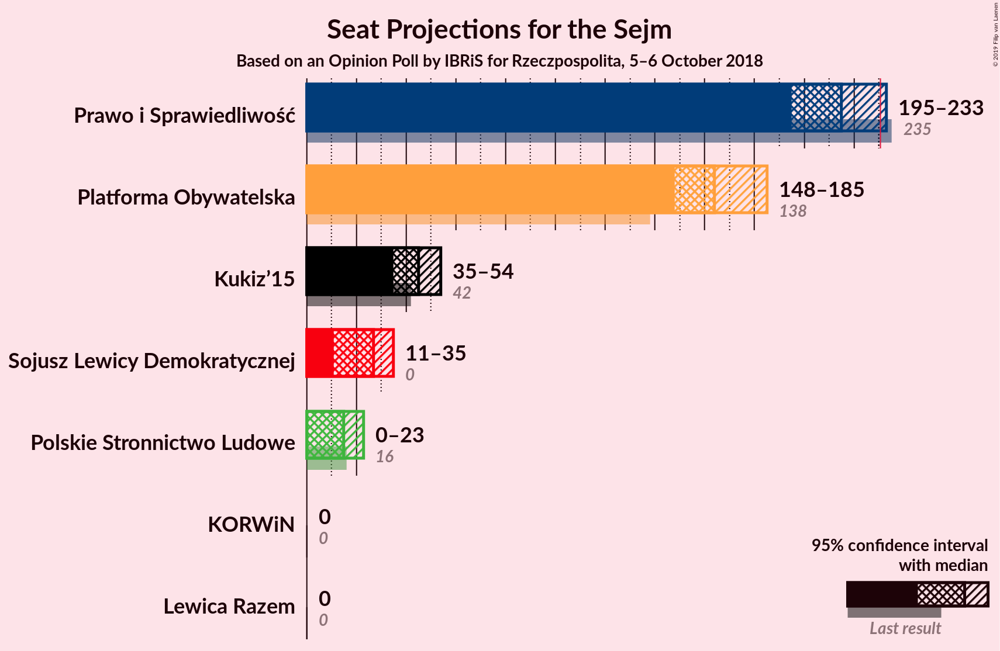
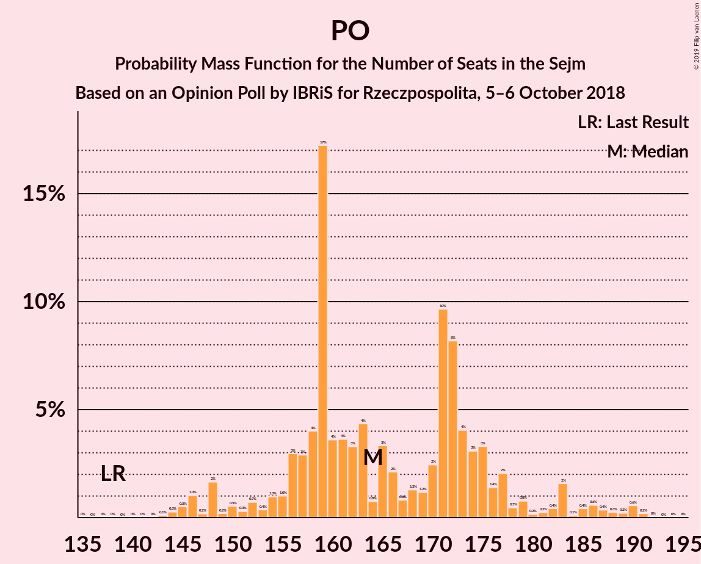

# Opinion Poll by IBRiS for Rzeczpospolita, 5–6 October 2018

<a href="#voting-intentions">Voting Intentions</a> | <a href="#seats">Seats</a> | <a href="#coalitions">Coalitions</a> | <a href="#technical-information">Technical Information</a>

## Voting Intentions

### Confidence Intervals

| Party | Last Result | Poll Result | 80% Confidence Interval | 90% Confidence Interval | 95% Confidence Interval | 99% Confidence Interval |
|:-----:|:-----------:|:-----------:|:-----------------------:|:-----------------------:|:-----------------------:|:-----------------------:|
| Prawo i Sprawiedliwość | 37.6% | 37.2% | 35.3–39.2% |34.7–39.8% |34.2–40.3% |33.3–41.2% |
| Platforma Obywatelska | 24.1% | 30.0% | 28.2–31.9% |27.7–32.4% |27.2–32.9% |26.4–33.9% |
| Kukiz’15 | 8.8% | 10.1% | 9.0–11.4% |8.6–11.8% |8.4–12.1% |7.9–12.8% |
| Sojusz Lewicy Demokratycznej | 7.6% | 7.0% | 6.1–8.2% |5.8–8.5% |5.6–8.8% |5.2–9.3% |
| Polskie Stronnictwo Ludowe | 5.1% | 5.2% | 4.4–6.2% |4.2–6.5% |4.0–6.8% |3.6–7.3% |
| Lewica Razem | 3.6% | 2.6% | 2.1–3.4% |1.9–3.6% |1.8–3.8% |1.6–4.2% |
| KORWiN | 4.8% | 1.1% | 0.8–1.7% |0.7–1.8% |0.6–2.0% |0.5–2.3% |

*Note:* The poll result column reflects the actual value used in the calculations. Published results may vary slightly, and in addition be rounded to fewer digits.

## Seats

### Confidence Intervals

| Party | Last Result | Median | 80% Confidence Interval | 90% Confidence Interval | 95% Confidence Interval | 99% Confidence Interval |
|:-----:|:-----------:|:------:|:-----------------------:|:-----------------------:|:-----------------------:|:-----------------------:|
| <a href="#prawo-i-sprawiedliwość">Prawo i Sprawiedliwość</a> | 235 | 222 | 198–222 |198–222 |198–222 |198–222 |
| <a href="#platforma-obywatelska">Platforma Obywatelska</a> | 138 | 162 | 161–168 |161–168 |159–168 |159–172 |
| <a href="#kukiz’15">Kukiz’15</a> | 42 | 48 | 47–50 |47–50 |47–50 |39–50 |
| <a href="#sojusz-lewicy-demokratycznej">Sojusz Lewicy Demokratycznej</a> | 0 | 28 | 28 |28 |28 |9–28 |
| <a href="#polskie-stronnictwo-ludowe">Polskie Stronnictwo Ludowe</a> | 16 | 0 | 0–16 |0–16 |0–16 |0–27 |
| <a href="#lewica-razem">Lewica Razem</a> | 0 | 0 | 0 |0 |0 |0 |
| <a href="#korwin">KORWiN</a> | 0 | 0 | 0 |0 |0 |0 |

### Prawo i Sprawiedliwość

*For a full overview of the results for this party, see the [Prawo i Sprawiedliwość](party-prawoisprawiedliwość.html) page.*

| Number of Seats | Probability | Accumulated | Special Marks |
|:---------------:|:-----------:|:-----------:|:-------------:|
| 188 | 0.3% | 100% |  |
| 189 | 0% | 99.7% |  |
| 190 | 0% | 99.7% |  |
| 191 | 0% | 99.7% |  |
| 192 | 0% | 99.7% |  |
| 193 | 0% | 99.7% |  |
| 194 | 0% | 99.7% |  |
| 195 | 0% | 99.7% |  |
| 196 | 0% | 99.7% |  |
| 197 | 0% | 99.7% |  |
| 198 | 11% | 99.7% |  |
| 199 | 0% | 88% |  |
| 200 | 0% | 88% |  |
| 201 | 17% | 88% |  |
| 202 | 0.1% | 71% |  |
| 203 | 0% | 71% |  |
| 204 | 0% | 71% |  |
| 205 | 0% | 71% |  |
| 206 | 0.1% | 71% |  |
| 207 | 0% | 71% |  |
| 208 | 0.2% | 71% |  |
| 209 | 0% | 71% |  |
| 210 | 0% | 71% |  |
| 211 | 0% | 71% |  |
| 212 | 0% | 71% |  |
| 213 | 0.5% | 71% |  |
| 214 | 3% | 70% |  |
| 215 | 0% | 67% |  |
| 216 | 0% | 67% |  |
| 217 | 0% | 67% |  |
| 218 | 0% | 67% |  |
| 219 | 0% | 67% |  |
| 220 | 0% | 67% |  |
| 221 | 0% | 67% |  |
| 222 | 67% | 67% | Median |
| 223 | 0% | 0.4% |  |
| 224 | 0% | 0.4% |  |
| 225 | 0% | 0.4% |  |
| 226 | 0% | 0.4% |  |
| 227 | 0% | 0.4% |  |
| 228 | 0% | 0.4% |  |
| 229 | 0.3% | 0.4% |  |
| 230 | 0% | 0.1% |  |
| 231 | 0% | 0.1% | Majority |
| 232 | 0.1% | 0.1% |  |
| 233 | 0% | 0% |  |
| 234 | 0% | 0% |  |
| 235 | 0% | 0% | Last Result |

### Platforma Obywatelska

*For a full overview of the results for this party, see the [Platforma Obywatelska](party-platformaobywatelska.html) page.*

| Number of Seats | Probability | Accumulated | Special Marks |
|:---------------:|:-----------:|:-----------:|:-------------:|
| 130 | 0.1% | 100% |  |
| 131 | 0% | 99.9% |  |
| 132 | 0% | 99.9% |  |
| 133 | 0% | 99.9% |  |
| 134 | 0% | 99.9% |  |
| 135 | 0% | 99.9% |  |
| 136 | 0% | 99.9% |  |
| 137 | 0% | 99.9% |  |
| 138 | 0% | 99.9% | Last Result |
| 139 | 0% | 99.9% |  |
| 140 | 0% | 99.9% |  |
| 141 | 0.3% | 99.9% |  |
| 142 | 0% | 99.7% |  |
| 143 | 0% | 99.6% |  |
| 144 | 0% | 99.6% |  |
| 145 | 0% | 99.6% |  |
| 146 | 0% | 99.6% |  |
| 147 | 0% | 99.6% |  |
| 148 | 0% | 99.6% |  |
| 149 | 0% | 99.6% |  |
| 150 | 0% | 99.6% |  |
| 151 | 0% | 99.6% |  |
| 152 | 0% | 99.6% |  |
| 153 | 0% | 99.6% |  |
| 154 | 0% | 99.6% |  |
| 155 | 0% | 99.6% |  |
| 156 | 0% | 99.6% |  |
| 157 | 0% | 99.6% |  |
| 158 | 0% | 99.6% |  |
| 159 | 3% | 99.6% |  |
| 160 | 0% | 97% |  |
| 161 | 34% | 97% |  |
| 162 | 29% | 63% | Median |
| 163 | 4% | 34% |  |
| 164 | 0% | 29% |  |
| 165 | 0% | 29% |  |
| 166 | 0% | 29% |  |
| 167 | 0% | 29% |  |
| 168 | 28% | 29% |  |
| 169 | 0.1% | 1.1% |  |
| 170 | 0% | 1.0% |  |
| 171 | 0.1% | 1.0% |  |
| 172 | 0.5% | 0.9% |  |
| 173 | 0.1% | 0.4% |  |
| 174 | 0.3% | 0.3% |  |
| 175 | 0% | 0% |  |

### Kukiz’15

*For a full overview of the results for this party, see the [Kukiz’15](party-kukiz’15.html) page.*

| Number of Seats | Probability | Accumulated | Special Marks |
|:---------------:|:-----------:|:-----------:|:-------------:|
| 38 | 0.1% | 100% |  |
| 39 | 0.5% | 99.8% |  |
| 40 | 0.1% | 99.3% |  |
| 41 | 0.2% | 99.2% |  |
| 42 | 0% | 99.0% | Last Result |
| 43 | 0% | 99.0% |  |
| 44 | 0% | 99.0% |  |
| 45 | 0% | 99.0% |  |
| 46 | 0.4% | 99.0% |  |
| 47 | 24% | 98.6% |  |
| 48 | 29% | 75% | Median |
| 49 | 34% | 46% |  |
| 50 | 11% | 12% |  |
| 51 | 0% | 0.4% |  |
| 52 | 0.1% | 0.4% |  |
| 53 | 0% | 0.3% |  |
| 54 | 0% | 0.3% |  |
| 55 | 0% | 0.3% |  |
| 56 | 0.2% | 0.2% |  |
| 57 | 0% | 0% |  |

### Sojusz Lewicy Demokratycznej

*For a full overview of the results for this party, see the [Sojusz Lewicy Demokratycznej](party-sojuszlewicydemokratycznej.html) page.*

| Number of Seats | Probability | Accumulated | Special Marks |
|:---------------:|:-----------:|:-----------:|:-------------:|
| 0 | 0% | 100% | Last Result |
| 1 | 0% | 100% |  |
| 2 | 0% | 100% |  |
| 3 | 0% | 100% |  |
| 4 | 0% | 100% |  |
| 5 | 0% | 100% |  |
| 6 | 0% | 100% |  |
| 7 | 0% | 100% |  |
| 8 | 0.1% | 100% |  |
| 9 | 0.5% | 99.8% |  |
| 10 | 0% | 99.3% |  |
| 11 | 0.1% | 99.3% |  |
| 12 | 0.2% | 99.2% |  |
| 13 | 0% | 99.0% |  |
| 14 | 0% | 99.0% |  |
| 15 | 0% | 99.0% |  |
| 16 | 0% | 99.0% |  |
| 17 | 0% | 99.0% |  |
| 18 | 0% | 99.0% |  |
| 19 | 0% | 99.0% |  |
| 20 | 0% | 99.0% |  |
| 21 | 0% | 99.0% |  |
| 22 | 0% | 99.0% |  |
| 23 | 0% | 99.0% |  |
| 24 | 0% | 99.0% |  |
| 25 | 0% | 99.0% |  |
| 26 | 0% | 99.0% |  |
| 27 | 0.3% | 99.0% |  |
| 28 | 98% | 98.8% | Median |
| 29 | 0.1% | 0.5% |  |
| 30 | 0% | 0.4% |  |
| 31 | 0.3% | 0.4% |  |
| 32 | 0% | 0% |  |

### Polskie Stronnictwo Ludowe

*For a full overview of the results for this party, see the [Polskie Stronnictwo Ludowe](party-polskiestronnictwoludowe.html) page.*

| Number of Seats | Probability | Accumulated | Special Marks |
|:---------------:|:-----------:|:-----------:|:-------------:|
| 0 | 67% | 100% | Median |
| 1 | 0% | 33% |  |
| 2 | 0% | 33% |  |
| 3 | 0% | 33% |  |
| 4 | 0% | 33% |  |
| 5 | 0% | 33% |  |
| 6 | 0% | 33% |  |
| 7 | 0% | 33% |  |
| 8 | 0% | 33% |  |
| 9 | 0% | 33% |  |
| 10 | 0% | 33% |  |
| 11 | 0% | 33% |  |
| 12 | 3% | 33% |  |
| 13 | 0% | 30% |  |
| 14 | 0.1% | 30% |  |
| 15 | 0.4% | 30% |  |
| 16 | 28% | 30% | Last Result |
| 17 | 0% | 1.3% |  |
| 18 | 0% | 1.3% |  |
| 19 | 0% | 1.3% |  |
| 20 | 0% | 1.3% |  |
| 21 | 0% | 1.3% |  |
| 22 | 0% | 1.3% |  |
| 23 | 0.1% | 1.3% |  |
| 24 | 0.2% | 1.2% |  |
| 25 | 0.3% | 0.9% |  |
| 26 | 0% | 0.6% |  |
| 27 | 0.6% | 0.6% |  |
| 28 | 0% | 0% |  |

### Lewica Razem

*For a full overview of the results for this party, see the [Lewica Razem](party-lewicarazem.html) page.*

| Number of Seats | Probability | Accumulated | Special Marks |
|:---------------:|:-----------:|:-----------:|:-------------:|
| 0 | 100% | 100% | Last Result, Median |

### KORWiN

*For a full overview of the results for this party, see the [KORWiN](party-korwin.html) page.*

| Number of Seats | Probability | Accumulated | Special Marks |
|:---------------:|:-----------:|:-----------:|:-------------:|
| 0 | 100% | 100% | Last Result, Median |

## Coalitions

### Confidence Intervals

| Coalition | Last Result | Median | Majority? | 80% Confidence Interval | 90% Confidence Interval | 95% Confidence Interval | 99% Confidence Interval |
|:---------:|:-----------:|:------:|:---------:|:-----------------------:|:-----------------------:|:-----------------------:|:-----------------------:|
| Prawo i Sprawiedliwość | 235 | 222 | 0.1% | 198–222 | 198–222 | 198–222 | 198–222 |
| Platforma Obywatelska | 138 | 162 | 0% | 161–168 | 161–168 | 159–168 | 159–172 |

### Prawo i Sprawiedliwość

| Number of Seats | Probability | Accumulated | Special Marks |
|:---------------:|:-----------:|:-----------:|:-------------:|
| 188 | 0.3% | 100% |  |
| 189 | 0% | 99.7% |  |
| 190 | 0% | 99.7% |  |
| 191 | 0% | 99.7% |  |
| 192 | 0% | 99.7% |  |
| 193 | 0% | 99.7% |  |
| 194 | 0% | 99.7% |  |
| 195 | 0% | 99.7% |  |
| 196 | 0% | 99.7% |  |
| 197 | 0% | 99.7% |  |
| 198 | 11% | 99.7% |  |
| 199 | 0% | 88% |  |
| 200 | 0% | 88% |  |
| 201 | 17% | 88% |  |
| 202 | 0.1% | 71% |  |
| 203 | 0% | 71% |  |
| 204 | 0% | 71% |  |
| 205 | 0% | 71% |  |
| 206 | 0.1% | 71% |  |
| 207 | 0% | 71% |  |
| 208 | 0.2% | 71% |  |
| 209 | 0% | 71% |  |
| 210 | 0% | 71% |  |
| 211 | 0% | 71% |  |
| 212 | 0% | 71% |  |
| 213 | 0.5% | 71% |  |
| 214 | 3% | 70% |  |
| 215 | 0% | 67% |  |
| 216 | 0% | 67% |  |
| 217 | 0% | 67% |  |
| 218 | 0% | 67% |  |
| 219 | 0% | 67% |  |
| 220 | 0% | 67% |  |
| 221 | 0% | 67% |  |
| 222 | 67% | 67% | Median |
| 223 | 0% | 0.4% |  |
| 224 | 0% | 0.4% |  |
| 225 | 0% | 0.4% |  |
| 226 | 0% | 0.4% |  |
| 227 | 0% | 0.4% |  |
| 228 | 0% | 0.4% |  |
| 229 | 0.3% | 0.4% |  |
| 230 | 0% | 0.1% |  |
| 231 | 0% | 0.1% | Majority |
| 232 | 0.1% | 0.1% |  |
| 233 | 0% | 0% |  |
| 234 | 0% | 0% |  |
| 235 | 0% | 0% | Last Result |

### Platforma Obywatelska

| Number of Seats | Probability | Accumulated | Special Marks |
|:---------------:|:-----------:|:-----------:|:-------------:|
| 130 | 0.1% | 100% |  |
| 131 | 0% | 99.9% |  |
| 132 | 0% | 99.9% |  |
| 133 | 0% | 99.9% |  |
| 134 | 0% | 99.9% |  |
| 135 | 0% | 99.9% |  |
| 136 | 0% | 99.9% |  |
| 137 | 0% | 99.9% |  |
| 138 | 0% | 99.9% | Last Result |
| 139 | 0% | 99.9% |  |
| 140 | 0% | 99.9% |  |
| 141 | 0.3% | 99.9% |  |
| 142 | 0% | 99.7% |  |
| 143 | 0% | 99.6% |  |
| 144 | 0% | 99.6% |  |
| 145 | 0% | 99.6% |  |
| 146 | 0% | 99.6% |  |
| 147 | 0% | 99.6% |  |
| 148 | 0% | 99.6% |  |
| 149 | 0% | 99.6% |  |
| 150 | 0% | 99.6% |  |
| 151 | 0% | 99.6% |  |
| 152 | 0% | 99.6% |  |
| 153 | 0% | 99.6% |  |
| 154 | 0% | 99.6% |  |
| 155 | 0% | 99.6% |  |
| 156 | 0% | 99.6% |  |
| 157 | 0% | 99.6% |  |
| 158 | 0% | 99.6% |  |
| 159 | 3% | 99.6% |  |
| 160 | 0% | 97% |  |
| 161 | 34% | 97% |  |
| 162 | 29% | 63% | Median |
| 163 | 4% | 34% |  |
| 164 | 0% | 29% |  |
| 165 | 0% | 29% |  |
| 166 | 0% | 29% |  |
| 167 | 0% | 29% |  |
| 168 | 28% | 29% |  |
| 169 | 0.1% | 1.1% |  |
| 170 | 0% | 1.0% |  |
| 171 | 0.1% | 1.0% |  |
| 172 | 0.5% | 0.9% |  |
| 173 | 0.1% | 0.4% |  |
| 174 | 0.3% | 0.3% |  |
| 175 | 0% | 0% |  |

## Technical Information

### Opinion Poll

+ **Polling firm:** IBRiS
+ **Commissioner(s):** Rzeczpospolita
+ **Fieldwork period:** 5–6 October 2018

### Calculations

+ **Sample size:** 1000
+ **Simulations done:** 1,024
+ **Error estimate:** 2.39%

