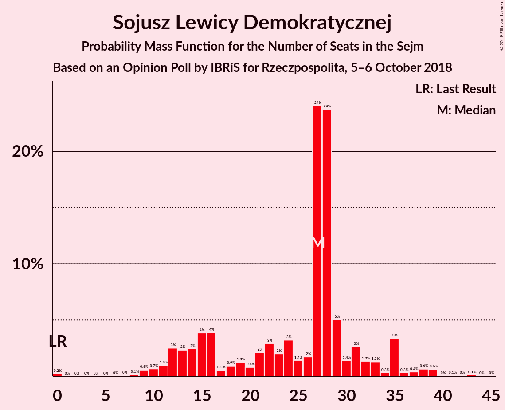

# Opinion Poll by IBRiS for Rzeczpospolita, 5–6 October 2018

<a href="#voting-intentions">Voting Intentions</a> | <a href="#seats">Seats</a> | <a href="#coalitions">Coalitions</a> | <a href="#technical-information">Technical Information</a>

## Voting Intentions

### Confidence Intervals

| Party | Last Result | Poll Result | 80% Confidence Interval | 90% Confidence Interval | 95% Confidence Interval | 99% Confidence Interval |
|:-----:|:-----------:|:-----------:|:-----------------------:|:-----------------------:|:-----------------------:|:-----------------------:|
| Prawo i Sprawiedliwość | 37.6% | 37.2% | 35.3–39.2% |34.7–39.8% |34.2–40.3% |33.3–41.2% |
| Platforma Obywatelska | 24.1% | 30.0% | 28.2–31.9% |27.7–32.4% |27.2–32.9% |26.4–33.9% |
| Kukiz’15 | 8.8% | 10.1% | 9.0–11.4% |8.6–11.8% |8.4–12.1% |7.9–12.8% |
| Sojusz Lewicy Demokratycznej | 7.6% | 7.0% | 6.1–8.2% |5.8–8.5% |5.6–8.8% |5.2–9.3% |
| Polskie Stronnictwo Ludowe | 5.1% | 5.2% | 4.4–6.2% |4.2–6.5% |4.0–6.8% |3.6–7.3% |
| Lewica Razem | 3.6% | 2.6% | 2.1–3.4% |1.9–3.6% |1.8–3.8% |1.6–4.2% |
| KORWiN | 4.8% | 1.1% | 0.8–1.7% |0.7–1.8% |0.6–2.0% |0.5–2.3% |

*Note:* The poll result column reflects the actual value used in the calculations. Published results may vary slightly, and in addition be rounded to fewer digits.

## Seats

### Confidence Intervals

| Party | Last Result | Median | 80% Confidence Interval | 90% Confidence Interval | 95% Confidence Interval | 99% Confidence Interval |
|:-----:|:-----------:|:------:|:-----------------------:|:-----------------------:|:-----------------------:|:-----------------------:|
| <a href="#prawo-i-sprawiedliwość">Prawo i Sprawiedliwość</a> | 235 | 215 | 199–226 |199–229 |195–233 |192–240 |
| <a href="#platforma-obywatelska">Platforma Obywatelska</a> | 138 | 164 | 156–175 |152–181 |148–185 |145–190 |
| <a href="#kukiz’15">Kukiz’15</a> | 42 | 45 | 41–52 |37–52 |35–54 |32–62 |
| <a href="#sojusz-lewicy-demokratycznej">Sojusz Lewicy Demokratycznej</a> | 0 | 27 | 15–31 |12–35 |11–35 |9–39 |
| <a href="#polskie-stronnictwo-ludowe">Polskie Stronnictwo Ludowe</a> | 16 | 15 | 0–21 |0–23 |0–23 |0–27 |
| <a href="#lewica-razem">Lewica Razem</a> | 0 | 0 | 0 |0 |0 |0 |
| <a href="#korwin">KORWiN</a> | 0 | 0 | 0 |0 |0 |0 |

### Prawo i Sprawiedliwość

*For a full overview of the results for this party, see the [Prawo i Sprawiedliwość](party-prawoisprawiedliwość.html) page.*

| Number of Seats | Probability | Accumulated | Special Marks |
|:---------------:|:-----------:|:-----------:|:-------------:|
| 181 | 0% | 100% |  |
| 182 | 0% | 99.9% |  |
| 183 | 0% | 99.9% |  |
| 184 | 0% | 99.9% |  |
| 185 | 0% | 99.9% |  |
| 186 | 0% | 99.9% |  |
| 187 | 0.1% | 99.9% |  |
| 188 | 0.1% | 99.8% |  |
| 189 | 0% | 99.7% |  |
| 190 | 0% | 99.6% |  |
| 191 | 0.1% | 99.6% |  |
| 192 | 1.0% | 99.5% |  |
| 193 | 0.3% | 98.5% |  |
| 194 | 0.6% | 98% |  |
| 195 | 0.5% | 98% |  |
| 196 | 0.2% | 97% |  |
| 197 | 0.4% | 97% |  |
| 198 | 1.2% | 97% |  |
| 199 | 8% | 95% |  |
| 200 | 4% | 87% |  |
| 201 | 3% | 83% |  |
| 202 | 0.2% | 79% |  |
| 203 | 0.7% | 79% |  |
| 204 | 1.2% | 79% |  |
| 205 | 2% | 77% |  |
| 206 | 1.3% | 75% |  |
| 207 | 4% | 74% |  |
| 208 | 3% | 70% |  |
| 209 | 3% | 66% |  |
| 210 | 2% | 63% |  |
| 211 | 2% | 61% |  |
| 212 | 0.8% | 59% |  |
| 213 | 2% | 58% |  |
| 214 | 3% | 57% |  |
| 215 | 4% | 54% | Median |
| 216 | 12% | 50% |  |
| 217 | 5% | 37% |  |
| 218 | 5% | 32% |  |
| 219 | 2% | 27% |  |
| 220 | 2% | 26% |  |
| 221 | 1.1% | 24% |  |
| 222 | 7% | 23% |  |
| 223 | 1.0% | 15% |  |
| 224 | 0.8% | 14% |  |
| 225 | 3% | 14% |  |
| 226 | 3% | 11% |  |
| 227 | 2% | 8% |  |
| 228 | 0.2% | 6% |  |
| 229 | 0.6% | 6% |  |
| 230 | 0.6% | 5% |  |
| 231 | 0.4% | 4% | Majority |
| 232 | 0.9% | 4% |  |
| 233 | 0.6% | 3% |  |
| 234 | 0.8% | 2% |  |
| 235 | 0.1% | 2% | Last Result |
| 236 | 0.1% | 1.4% |  |
| 237 | 0% | 1.4% |  |
| 238 | 0.3% | 1.3% |  |
| 239 | 0.5% | 1.0% |  |
| 240 | 0.1% | 0.5% |  |
| 241 | 0% | 0.4% |  |
| 242 | 0% | 0.4% |  |
| 243 | 0% | 0.3% |  |
| 244 | 0% | 0.3% |  |
| 245 | 0.1% | 0.3% |  |
| 246 | 0% | 0.2% |  |
| 247 | 0.1% | 0.2% |  |
| 248 | 0% | 0.1% |  |
| 249 | 0% | 0% |  |

### Platforma Obywatelska

*For a full overview of the results for this party, see the [Platforma Obywatelska](party-platformaobywatelska.html) page.*

| Number of Seats | Probability | Accumulated | Special Marks |
|:---------------:|:-----------:|:-----------:|:-------------:|
| 138 | 0% | 100% | Last Result |
| 139 | 0% | 99.9% |  |
| 140 | 0% | 99.9% |  |
| 141 | 0% | 99.9% |  |
| 142 | 0% | 99.9% |  |
| 143 | 0.1% | 99.9% |  |
| 144 | 0.3% | 99.8% |  |
| 145 | 0.5% | 99.5% |  |
| 146 | 1.0% | 99.0% |  |
| 147 | 0.2% | 98% |  |
| 148 | 2% | 98% |  |
| 149 | 0.2% | 96% |  |
| 150 | 0.5% | 96% |  |
| 151 | 0.3% | 95% |  |
| 152 | 0.7% | 95% |  |
| 153 | 0.4% | 94% |  |
| 154 | 1.0% | 94% |  |
| 155 | 1.0% | 93% |  |
| 156 | 3% | 92% |  |
| 157 | 3% | 89% |  |
| 158 | 4% | 86% |  |
| 159 | 17% | 82% |  |
| 160 | 4% | 65% |  |
| 161 | 4% | 61% |  |
| 162 | 3% | 58% |  |
| 163 | 4% | 54% |  |
| 164 | 0.8% | 50% | Median |
| 165 | 3% | 49% |  |
| 166 | 2% | 46% |  |
| 167 | 0.8% | 44% |  |
| 168 | 1.3% | 43% |  |
| 169 | 1.2% | 42% |  |
| 170 | 2% | 41% |  |
| 171 | 10% | 38% |  |
| 172 | 8% | 28% |  |
| 173 | 4% | 20% |  |
| 174 | 3% | 16% |  |
| 175 | 3% | 13% |  |
| 176 | 1.4% | 10% |  |
| 177 | 2% | 8% |  |
| 178 | 0.5% | 6% |  |
| 179 | 0.8% | 6% |  |
| 180 | 0.2% | 5% |  |
| 181 | 0.2% | 5% |  |
| 182 | 0.4% | 5% |  |
| 183 | 2% | 4% |  |
| 184 | 0.1% | 3% |  |
| 185 | 0.4% | 3% |  |
| 186 | 0.6% | 2% |  |
| 187 | 0.4% | 2% |  |
| 188 | 0.3% | 1.3% |  |
| 189 | 0.2% | 1.1% |  |
| 190 | 0.6% | 0.9% |  |
| 191 | 0.2% | 0.3% |  |
| 192 | 0% | 0.1% |  |
| 193 | 0% | 0.1% |  |
| 194 | 0% | 0.1% |  |
| 195 | 0% | 0% |  |

### Kukiz’15

*For a full overview of the results for this party, see the [Kukiz’15](party-kukiz’15.html) page.*

| Number of Seats | Probability | Accumulated | Special Marks |
|:---------------:|:-----------:|:-----------:|:-------------:|
| 25 | 0% | 100% |  |
| 26 | 0% | 99.9% |  |
| 27 | 0% | 99.9% |  |
| 28 | 0% | 99.9% |  |
| 29 | 0% | 99.9% |  |
| 30 | 0.1% | 99.9% |  |
| 31 | 0.2% | 99.8% |  |
| 32 | 0.1% | 99.5% |  |
| 33 | 0.2% | 99.4% |  |
| 34 | 2% | 99.2% |  |
| 35 | 2% | 98% |  |
| 36 | 0.4% | 96% |  |
| 37 | 0.8% | 96% |  |
| 38 | 0.7% | 95% |  |
| 39 | 1.1% | 94% |  |
| 40 | 2% | 93% |  |
| 41 | 3% | 91% |  |
| 42 | 13% | 88% | Last Result |
| 43 | 3% | 75% |  |
| 44 | 11% | 71% |  |
| 45 | 15% | 60% | Median |
| 46 | 5% | 45% |  |
| 47 | 9% | 40% |  |
| 48 | 3% | 31% |  |
| 49 | 6% | 28% |  |
| 50 | 5% | 22% |  |
| 51 | 5% | 17% |  |
| 52 | 8% | 13% |  |
| 53 | 1.1% | 4% |  |
| 54 | 0.9% | 3% |  |
| 55 | 0.3% | 2% |  |
| 56 | 0.8% | 2% |  |
| 57 | 0.1% | 1.4% |  |
| 58 | 0.1% | 1.3% |  |
| 59 | 0.1% | 1.1% |  |
| 60 | 0.3% | 1.0% |  |
| 61 | 0.1% | 0.7% |  |
| 62 | 0.1% | 0.6% |  |
| 63 | 0.4% | 0.5% |  |
| 64 | 0% | 0.1% |  |
| 65 | 0% | 0% |  |

### Sojusz Lewicy Demokratycznej

*For a full overview of the results for this party, see the [Sojusz Lewicy Demokratycznej](party-sojuszlewicydemokratycznej.html) page.*

| Number of Seats | Probability | Accumulated | Special Marks |
|:---------------:|:-----------:|:-----------:|:-------------:|
| 0 | 0.2% | 100% | Last Result |
| 1 | 0% | 99.8% |  |
| 2 | 0% | 99.8% |  |
| 3 | 0% | 99.8% |  |
| 4 | 0% | 99.8% |  |
| 5 | 0% | 99.8% |  |
| 6 | 0% | 99.8% |  |
| 7 | 0% | 99.7% |  |
| 8 | 0.1% | 99.7% |  |
| 9 | 0.6% | 99.6% |  |
| 10 | 0.7% | 99.0% |  |
| 11 | 1.0% | 98% |  |
| 12 | 3% | 97% |  |
| 13 | 2% | 95% |  |
| 14 | 2% | 93% |  |
| 15 | 4% | 90% |  |
| 16 | 4% | 86% |  |
| 17 | 0.5% | 82% |  |
| 18 | 0.9% | 82% |  |
| 19 | 1.3% | 81% |  |
| 20 | 0.8% | 80% |  |
| 21 | 2% | 79% |  |
| 22 | 3% | 77% |  |
| 23 | 2% | 74% |  |
| 24 | 3% | 72% |  |
| 25 | 1.4% | 69% |  |
| 26 | 2% | 67% |  |
| 27 | 24% | 65% | Median |
| 28 | 24% | 41% |  |
| 29 | 5% | 18% |  |
| 30 | 1.4% | 13% |  |
| 31 | 3% | 11% |  |
| 32 | 1.3% | 9% |  |
| 33 | 1.3% | 7% |  |
| 34 | 0.3% | 6% |  |
| 35 | 3% | 6% |  |
| 36 | 0.3% | 2% |  |
| 37 | 0.4% | 2% |  |
| 38 | 0.6% | 2% |  |
| 39 | 0.6% | 0.9% |  |
| 40 | 0% | 0.3% |  |
| 41 | 0.1% | 0.3% |  |
| 42 | 0% | 0.2% |  |
| 43 | 0.1% | 0.2% |  |
| 44 | 0% | 0% |  |

### Polskie Stronnictwo Ludowe

*For a full overview of the results for this party, see the [Polskie Stronnictwo Ludowe](party-polskiestronnictwoludowe.html) page.*

| Number of Seats | Probability | Accumulated | Special Marks |
|:---------------:|:-----------:|:-----------:|:-------------:|
| 0 | 38% | 100% |  |
| 1 | 0% | 62% |  |
| 2 | 0% | 62% |  |
| 3 | 0% | 62% |  |
| 4 | 0% | 62% |  |
| 5 | 0% | 62% |  |
| 6 | 0% | 62% |  |
| 7 | 0% | 62% |  |
| 8 | 0% | 62% |  |
| 9 | 0% | 62% |  |
| 10 | 0% | 62% |  |
| 11 | 0.1% | 62% |  |
| 12 | 2% | 62% |  |
| 13 | 4% | 60% |  |
| 14 | 4% | 56% |  |
| 15 | 12% | 51% | Median |
| 16 | 8% | 40% | Last Result |
| 17 | 10% | 31% |  |
| 18 | 2% | 21% |  |
| 19 | 3% | 20% |  |
| 20 | 5% | 17% |  |
| 21 | 3% | 12% |  |
| 22 | 3% | 9% |  |
| 23 | 5% | 7% |  |
| 24 | 0.5% | 2% |  |
| 25 | 0.2% | 1.1% |  |
| 26 | 0.4% | 0.9% |  |
| 27 | 0.5% | 0.5% |  |
| 28 | 0% | 0% |  |

### Lewica Razem

*For a full overview of the results for this party, see the [Lewica Razem](party-lewicarazem.html) page.*

| Number of Seats | Probability | Accumulated | Special Marks |
|:---------------:|:-----------:|:-----------:|:-------------:|
| 0 | 100% | 100% | Last Result, Median |

### KORWiN

*For a full overview of the results for this party, see the [KORWiN](party-korwin.html) page.*

| Number of Seats | Probability | Accumulated | Special Marks |
|:---------------:|:-----------:|:-----------:|:-------------:|
| 0 | 100% | 100% | Last Result, Median |

## Coalitions

### Confidence Intervals

| Coalition | Last Result | Median | Majority? | 80% Confidence Interval | 90% Confidence Interval | 95% Confidence Interval | 99% Confidence Interval |
|:---------:|:-----------:|:------:|:---------:|:-----------------------:|:-----------------------:|:-----------------------:|:-----------------------:|
| Prawo i Sprawiedliwość | 235 | 215 | 4% | 199–226 | 199–229 | 195–233 | 192–240 |
| Platforma Obywatelska | 138 | 164 | 0% | 156–175 | 152–181 | 148–185 | 145–190 |

### Prawo i Sprawiedliwość

| Number of Seats | Probability | Accumulated | Special Marks |
|:---------------:|:-----------:|:-----------:|:-------------:|
| 181 | 0% | 100% |  |
| 182 | 0% | 99.9% |  |
| 183 | 0% | 99.9% |  |
| 184 | 0% | 99.9% |  |
| 185 | 0% | 99.9% |  |
| 186 | 0% | 99.9% |  |
| 187 | 0.1% | 99.9% |  |
| 188 | 0.1% | 99.8% |  |
| 189 | 0% | 99.7% |  |
| 190 | 0% | 99.6% |  |
| 191 | 0.1% | 99.6% |  |
| 192 | 1.0% | 99.5% |  |
| 193 | 0.3% | 98.5% |  |
| 194 | 0.6% | 98% |  |
| 195 | 0.5% | 98% |  |
| 196 | 0.2% | 97% |  |
| 197 | 0.4% | 97% |  |
| 198 | 1.2% | 97% |  |
| 199 | 8% | 95% |  |
| 200 | 4% | 87% |  |
| 201 | 3% | 83% |  |
| 202 | 0.2% | 79% |  |
| 203 | 0.7% | 79% |  |
| 204 | 1.2% | 79% |  |
| 205 | 2% | 77% |  |
| 206 | 1.3% | 75% |  |
| 207 | 4% | 74% |  |
| 208 | 3% | 70% |  |
| 209 | 3% | 66% |  |
| 210 | 2% | 63% |  |
| 211 | 2% | 61% |  |
| 212 | 0.8% | 59% |  |
| 213 | 2% | 58% |  |
| 214 | 3% | 57% |  |
| 215 | 4% | 54% | Median |
| 216 | 12% | 50% |  |
| 217 | 5% | 37% |  |
| 218 | 5% | 32% |  |
| 219 | 2% | 27% |  |
| 220 | 2% | 26% |  |
| 221 | 1.1% | 24% |  |
| 222 | 7% | 23% |  |
| 223 | 1.0% | 15% |  |
| 224 | 0.8% | 14% |  |
| 225 | 3% | 14% |  |
| 226 | 3% | 11% |  |
| 227 | 2% | 8% |  |
| 228 | 0.2% | 6% |  |
| 229 | 0.6% | 6% |  |
| 230 | 0.6% | 5% |  |
| 231 | 0.4% | 4% | Majority |
| 232 | 0.9% | 4% |  |
| 233 | 0.6% | 3% |  |
| 234 | 0.8% | 2% |  |
| 235 | 0.1% | 2% | Last Result |
| 236 | 0.1% | 1.4% |  |
| 237 | 0% | 1.4% |  |
| 238 | 0.3% | 1.3% |  |
| 239 | 0.5% | 1.0% |  |
| 240 | 0.1% | 0.5% |  |
| 241 | 0% | 0.4% |  |
| 242 | 0% | 0.4% |  |
| 243 | 0% | 0.3% |  |
| 244 | 0% | 0.3% |  |
| 245 | 0.1% | 0.3% |  |
| 246 | 0% | 0.2% |  |
| 247 | 0.1% | 0.2% |  |
| 248 | 0% | 0.1% |  |
| 249 | 0% | 0% |  |

### Platforma Obywatelska

| Number of Seats | Probability | Accumulated | Special Marks |
|:---------------:|:-----------:|:-----------:|:-------------:|
| 138 | 0% | 100% | Last Result |
| 139 | 0% | 99.9% |  |
| 140 | 0% | 99.9% |  |
| 141 | 0% | 99.9% |  |
| 142 | 0% | 99.9% |  |
| 143 | 0.1% | 99.9% |  |
| 144 | 0.3% | 99.8% |  |
| 145 | 0.5% | 99.5% |  |
| 146 | 1.0% | 99.0% |  |
| 147 | 0.2% | 98% |  |
| 148 | 2% | 98% |  |
| 149 | 0.2% | 96% |  |
| 150 | 0.5% | 96% |  |
| 151 | 0.3% | 95% |  |
| 152 | 0.7% | 95% |  |
| 153 | 0.4% | 94% |  |
| 154 | 1.0% | 94% |  |
| 155 | 1.0% | 93% |  |
| 156 | 3% | 92% |  |
| 157 | 3% | 89% |  |
| 158 | 4% | 86% |  |
| 159 | 17% | 82% |  |
| 160 | 4% | 65% |  |
| 161 | 4% | 61% |  |
| 162 | 3% | 58% |  |
| 163 | 4% | 54% |  |
| 164 | 0.8% | 50% | Median |
| 165 | 3% | 49% |  |
| 166 | 2% | 46% |  |
| 167 | 0.8% | 44% |  |
| 168 | 1.3% | 43% |  |
| 169 | 1.2% | 42% |  |
| 170 | 2% | 41% |  |
| 171 | 10% | 38% |  |
| 172 | 8% | 28% |  |
| 173 | 4% | 20% |  |
| 174 | 3% | 16% |  |
| 175 | 3% | 13% |  |
| 176 | 1.4% | 10% |  |
| 177 | 2% | 8% |  |
| 178 | 0.5% | 6% |  |
| 179 | 0.8% | 6% |  |
| 180 | 0.2% | 5% |  |
| 181 | 0.2% | 5% |  |
| 182 | 0.4% | 5% |  |
| 183 | 2% | 4% |  |
| 184 | 0.1% | 3% |  |
| 185 | 0.4% | 3% |  |
| 186 | 0.6% | 2% |  |
| 187 | 0.4% | 2% |  |
| 188 | 0.3% | 1.3% |  |
| 189 | 0.2% | 1.1% |  |
| 190 | 0.6% | 0.9% |  |
| 191 | 0.2% | 0.3% |  |
| 192 | 0% | 0.1% |  |
| 193 | 0% | 0.1% |  |
| 194 | 0% | 0.1% |  |
| 195 | 0% | 0% |  |

## Technical Information

### Opinion Poll

+ **Polling firm:** IBRiS
+ **Commissioner(s):** Rzeczpospolita
+ **Fieldwork period:** 5–6 October 2018

### Calculations

+ **Sample size:** 1000
+ **Simulations done:** 131,072
+ **Error estimate:** 2.13%

