# Opinion Poll by Kantar Public, 12–17 October 2018

<a href="#voting-intentions">Voting Intentions</a> | <a href="#seats">Seats</a> | <a href="#coalitions">Coalitions</a> | <a href="#technical-information">Technical Information</a>

## Voting Intentions

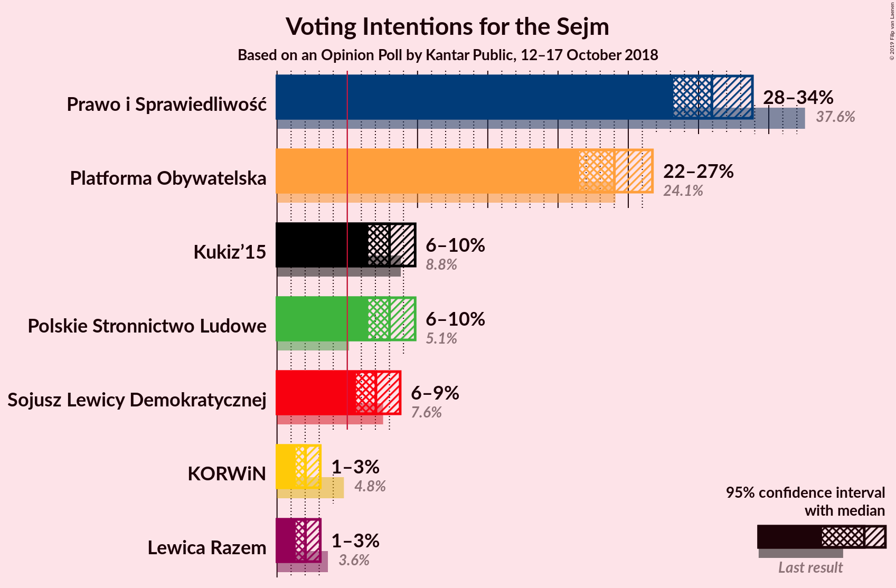

### Confidence Intervals

| Party | Last Result | Poll Result | 80% Confidence Interval | 90% Confidence Interval | 95% Confidence Interval | 99% Confidence Interval |
|:-----:|:-----------:|:-----------:|:-----------------------:|:-----------------------:|:-----------------------:|:-----------------------:|
| Prawo i Sprawiedliwość | 37.6% | 31.0% | 29.2–32.8% |28.6–33.4% |28.2–33.8% |27.4–34.8% |
| Platforma Obywatelska | 24.1% | 24.0% | 22.4–25.8% |21.9–26.3% |21.5–26.7% |20.7–27.6% |
| Kukiz’15 | 8.8% | 8.0% | 7.0–9.2% |6.7–9.5% |6.5–9.8% |6.1–10.4% |
| Polskie Stronnictwo Ludowe | 5.1% | 8.0% | 7.0–9.2% |6.7–9.5% |6.5–9.8% |6.1–10.4% |
| Sojusz Lewicy Demokratycznej | 7.6% | 7.0% | 6.1–8.2% |5.9–8.5% |5.6–8.8% |5.2–9.3% |
| KORWiN | 4.8% | 2.0% | 1.6–2.7% |1.4–2.9% |1.3–3.1% |1.1–3.4% |
| Lewica Razem | 3.6% | 2.0% | 1.6–2.7% |1.4–2.9% |1.3–3.1% |1.1–3.4% |

*Note:* The poll result column reflects the actual value used in the calculations. Published results may vary slightly, and in addition be rounded to fewer digits.

## Seats

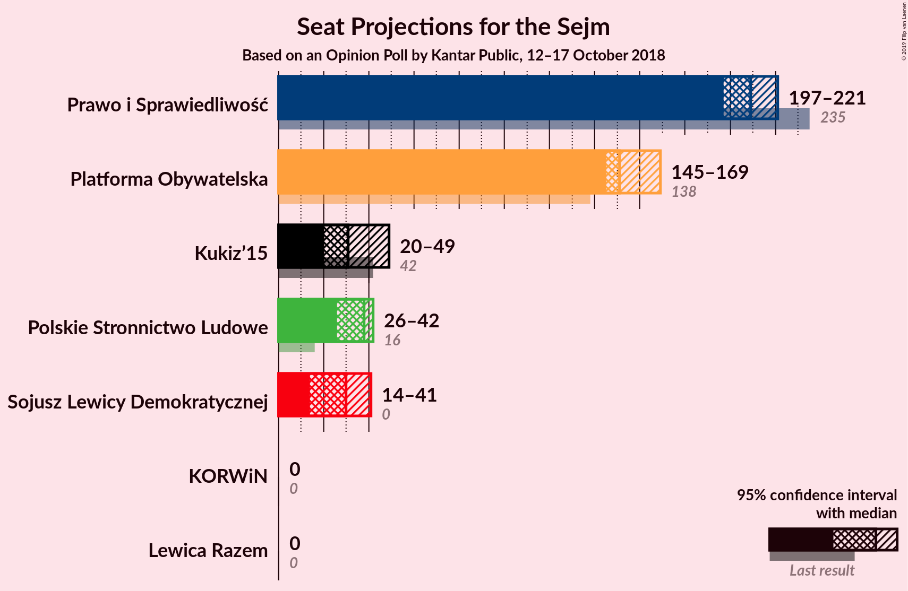

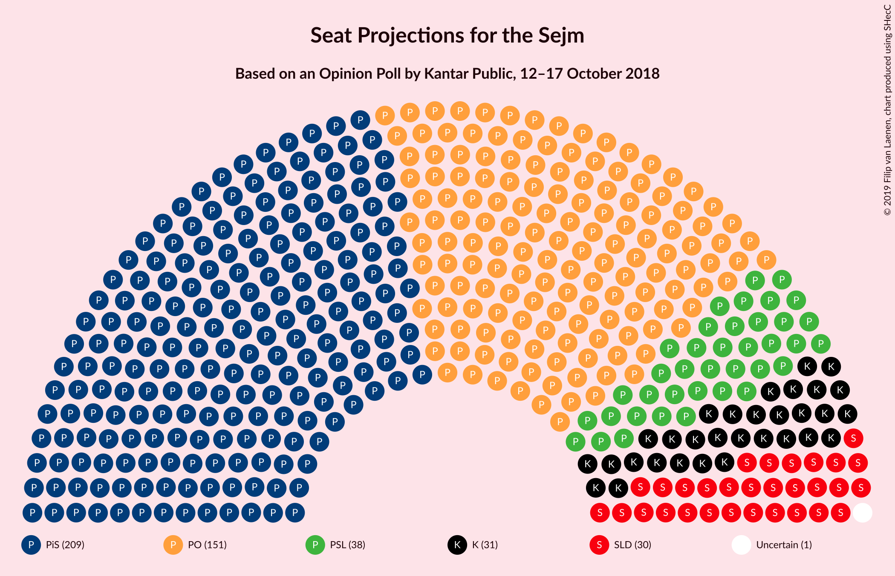

### Confidence Intervals

| Party | Last Result | Median | 80% Confidence Interval | 90% Confidence Interval | 95% Confidence Interval | 99% Confidence Interval |
|:-----:|:-----------:|:------:|:-----------------------:|:-----------------------:|:-----------------------:|:-----------------------:|
| <a href="#prawo-i-sprawiedliwość">Prawo i Sprawiedliwość</a> | 235 | 209 | 204–221 |198–221 |197–221 |197–225 |
| <a href="#platforma-obywatelska">Platforma Obywatelska</a> | 138 | 151 | 146–165 |146–165 |145–169 |136–169 |
| <a href="#kukiz’15">Kukiz’15</a> | 42 | 31 | 20–40 |20–41 |20–49 |18–55 |
| <a href="#polskie-stronnictwo-ludowe">Polskie Stronnictwo Ludowe</a> | 16 | 38 | 27–41 |26–42 |26–42 |25–42 |
| <a href="#sojusz-lewicy-demokratycznej">Sojusz Lewicy Demokratycznej</a> | 0 | 30 | 17–40 |17–41 |14–41 |14–42 |
| <a href="#korwin">KORWiN</a> | 0 | 0 | 0 |0 |0 |0 |
| <a href="#lewica-razem">Lewica Razem</a> | 0 | 0 | 0 |0 |0 |0 |

### Prawo i Sprawiedliwość

*For a full overview of the results for this party, see the [Prawo i Sprawiedliwość](party-prawoisprawiedliwość.html) page.*

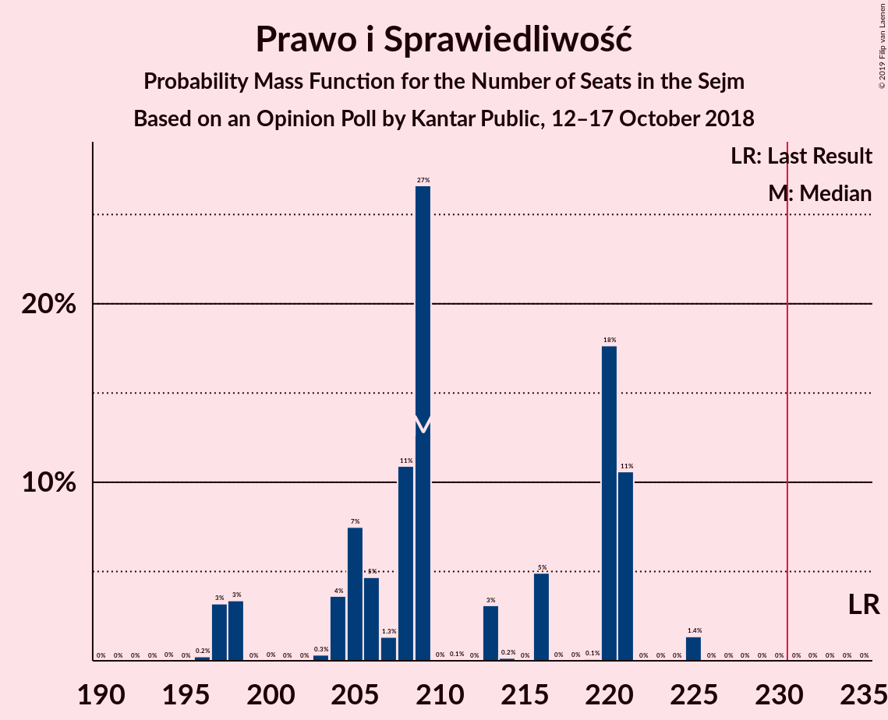

| Number of Seats | Probability | Accumulated | Special Marks |
|:---------------:|:-----------:|:-----------:|:-------------:|
| 193 | 0% | 100% |  |
| 194 | 0% | 99.9% |  |
| 195 | 0% | 99.9% |  |
| 196 | 0.2% | 99.9% |  |
| 197 | 3% | 99.7% |  |
| 198 | 3% | 96% |  |
| 199 | 0% | 93% |  |
| 200 | 0% | 93% |  |
| 201 | 0% | 93% |  |
| 202 | 0% | 93% |  |
| 203 | 0.3% | 93% |  |
| 204 | 4% | 93% |  |
| 205 | 7% | 89% |  |
| 206 | 5% | 82% |  |
| 207 | 1.3% | 77% |  |
| 208 | 11% | 76% |  |
| 209 | 27% | 65% | Median |
| 210 | 0% | 38% |  |
| 211 | 0.1% | 38% |  |
| 212 | 0% | 38% |  |
| 213 | 3% | 38% |  |
| 214 | 0.2% | 35% |  |
| 215 | 0% | 35% |  |
| 216 | 5% | 35% |  |
| 217 | 0% | 30% |  |
| 218 | 0% | 30% |  |
| 219 | 0.1% | 30% |  |
| 220 | 18% | 30% |  |
| 221 | 11% | 12% |  |
| 222 | 0% | 1.4% |  |
| 223 | 0% | 1.4% |  |
| 224 | 0% | 1.4% |  |
| 225 | 1.4% | 1.4% |  |
| 226 | 0% | 0% |  |
| 227 | 0% | 0% |  |
| 228 | 0% | 0% |  |
| 229 | 0% | 0% |  |
| 230 | 0% | 0% |  |
| 231 | 0% | 0% | Majority |
| 232 | 0% | 0% |  |
| 233 | 0% | 0% |  |
| 234 | 0% | 0% |  |
| 235 | 0% | 0% | Last Result |

### Platforma Obywatelska

*For a full overview of the results for this party, see the [Platforma Obywatelska](party-platformaobywatelska.html) page.*

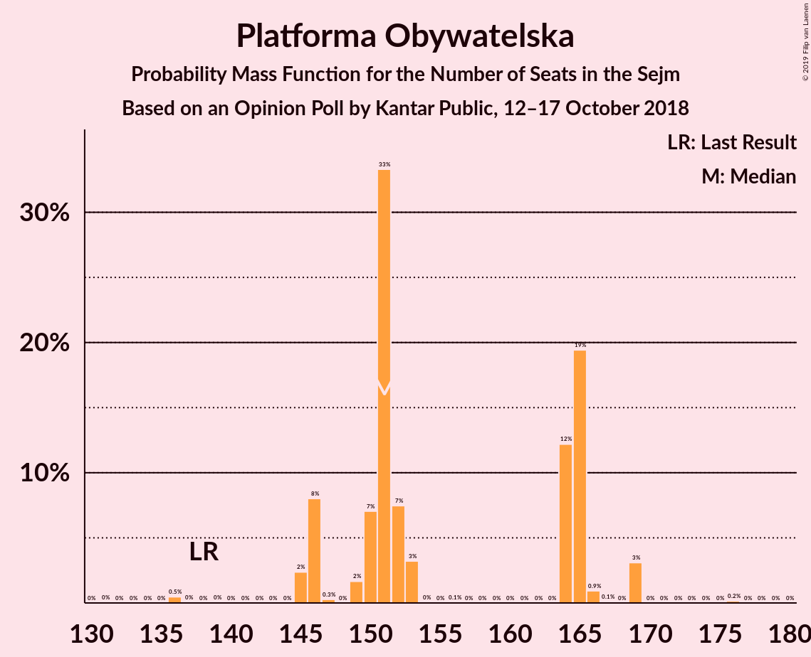

| Number of Seats | Probability | Accumulated | Special Marks |
|:---------------:|:-----------:|:-----------:|:-------------:|
| 131 | 0% | 100% |  |
| 132 | 0% | 99.9% |  |
| 133 | 0% | 99.9% |  |
| 134 | 0% | 99.9% |  |
| 135 | 0% | 99.9% |  |
| 136 | 0.5% | 99.9% |  |
| 137 | 0% | 99.4% |  |
| 138 | 0% | 99.4% | Last Result |
| 139 | 0% | 99.4% |  |
| 140 | 0% | 99.4% |  |
| 141 | 0% | 99.4% |  |
| 142 | 0% | 99.4% |  |
| 143 | 0% | 99.4% |  |
| 144 | 0% | 99.4% |  |
| 145 | 2% | 99.4% |  |
| 146 | 8% | 97% |  |
| 147 | 0.3% | 89% |  |
| 148 | 0% | 89% |  |
| 149 | 2% | 89% |  |
| 150 | 7% | 87% |  |
| 151 | 33% | 80% | Median |
| 152 | 7% | 47% |  |
| 153 | 3% | 39% |  |
| 154 | 0% | 36% |  |
| 155 | 0% | 36% |  |
| 156 | 0.1% | 36% |  |
| 157 | 0% | 36% |  |
| 158 | 0% | 36% |  |
| 159 | 0% | 36% |  |
| 160 | 0% | 36% |  |
| 161 | 0% | 36% |  |
| 162 | 0% | 36% |  |
| 163 | 0% | 36% |  |
| 164 | 12% | 36% |  |
| 165 | 19% | 24% |  |
| 166 | 0.9% | 4% |  |
| 167 | 0.1% | 3% |  |
| 168 | 0% | 3% |  |
| 169 | 3% | 3% |  |
| 170 | 0% | 0.2% |  |
| 171 | 0% | 0.2% |  |
| 172 | 0% | 0.2% |  |
| 173 | 0% | 0.2% |  |
| 174 | 0% | 0.2% |  |
| 175 | 0% | 0.2% |  |
| 176 | 0.2% | 0.2% |  |
| 177 | 0% | 0% |  |

### Kukiz’15

*For a full overview of the results for this party, see the [Kukiz’15](party-kukiz’15.html) page.*

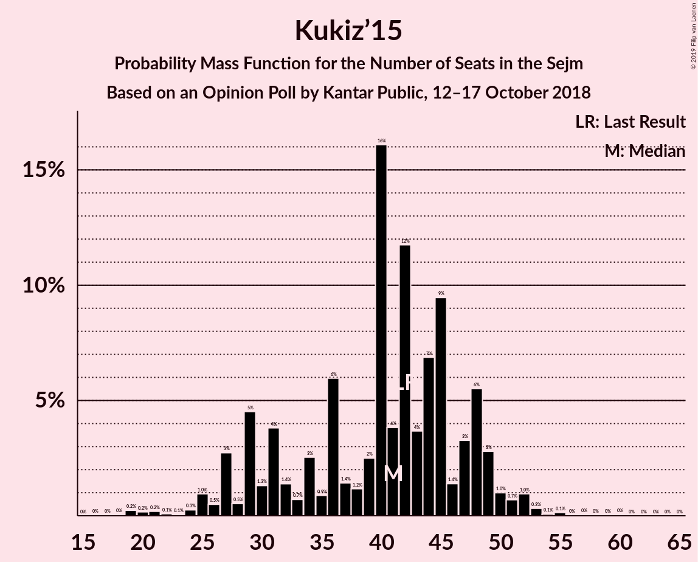

| Number of Seats | Probability | Accumulated | Special Marks |
|:---------------:|:-----------:|:-----------:|:-------------:|
| 18 | 1.3% | 100% |  |
| 19 | 0% | 98.7% |  |
| 20 | 11% | 98.7% |  |
| 21 | 18% | 88% |  |
| 22 | 5% | 70% |  |
| 23 | 0% | 66% |  |
| 24 | 0.2% | 66% |  |
| 25 | 0% | 66% |  |
| 26 | 0% | 66% |  |
| 27 | 0% | 65% |  |
| 28 | 0% | 65% |  |
| 29 | 3% | 65% |  |
| 30 | 0% | 62% |  |
| 31 | 12% | 62% | Median |
| 32 | 25% | 50% |  |
| 33 | 1.3% | 25% |  |
| 34 | 2% | 23% |  |
| 35 | 0% | 22% |  |
| 36 | 0.1% | 22% |  |
| 37 | 0% | 22% |  |
| 38 | 0% | 22% |  |
| 39 | 0.3% | 22% |  |
| 40 | 15% | 21% |  |
| 41 | 2% | 7% |  |
| 42 | 0% | 4% | Last Result |
| 43 | 0.1% | 4% |  |
| 44 | 0.1% | 4% |  |
| 45 | 0% | 4% |  |
| 46 | 0% | 4% |  |
| 47 | 0% | 4% |  |
| 48 | 0% | 4% |  |
| 49 | 3% | 4% |  |
| 50 | 0% | 0.6% |  |
| 51 | 0% | 0.5% |  |
| 52 | 0% | 0.5% |  |
| 53 | 0% | 0.5% |  |
| 54 | 0% | 0.5% |  |
| 55 | 0.4% | 0.5% |  |
| 56 | 0.1% | 0.1% |  |
| 57 | 0% | 0% |  |

### Polskie Stronnictwo Ludowe

*For a full overview of the results for this party, see the [Polskie Stronnictwo Ludowe](party-polskiestronnictwoludowe.html) page.*

| Number of Seats | Probability | Accumulated | Special Marks |
|:---------------:|:-----------:|:-----------:|:-------------:|
| 16 | 0% | 100% | Last Result |
| 17 | 0% | 100% |  |
| 18 | 0% | 100% |  |
| 19 | 0% | 100% |  |
| 20 | 0% | 100% |  |
| 21 | 0% | 100% |  |
| 22 | 0% | 100% |  |
| 23 | 0% | 100% |  |
| 24 | 0% | 100% |  |
| 25 | 2% | 100% |  |
| 26 | 6% | 98% |  |
| 27 | 3% | 92% |  |
| 28 | 5% | 89% |  |
| 29 | 9% | 84% |  |
| 30 | 0% | 75% |  |
| 31 | 0.2% | 75% |  |
| 32 | 0% | 74% |  |
| 33 | 0% | 74% |  |
| 34 | 0% | 74% |  |
| 35 | 3% | 74% |  |
| 36 | 1.3% | 71% |  |
| 37 | 14% | 70% |  |
| 38 | 40% | 56% | Median |
| 39 | 0% | 16% |  |
| 40 | 0% | 16% |  |
| 41 | 8% | 16% |  |
| 42 | 8% | 8% |  |
| 43 | 0.1% | 0.2% |  |
| 44 | 0% | 0.1% |  |
| 45 | 0% | 0.1% |  |
| 46 | 0.1% | 0.1% |  |
| 47 | 0% | 0% |  |

### Sojusz Lewicy Demokratycznej

*For a full overview of the results for this party, see the [Sojusz Lewicy Demokratycznej](party-sojuszlewicydemokratycznej.html) page.*

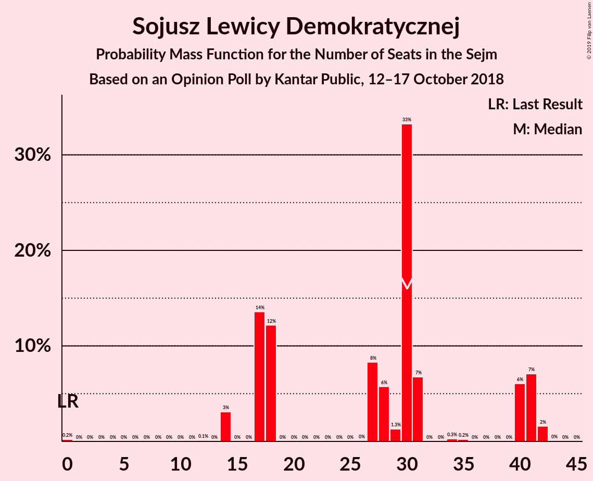

| Number of Seats | Probability | Accumulated | Special Marks |
|:---------------:|:-----------:|:-----------:|:-------------:|
| 0 | 0.2% | 100% | Last Result |
| 1 | 0% | 99.8% |  |
| 2 | 0% | 99.8% |  |
| 3 | 0% | 99.8% |  |
| 4 | 0% | 99.8% |  |
| 5 | 0% | 99.8% |  |
| 6 | 0% | 99.8% |  |
| 7 | 0% | 99.8% |  |
| 8 | 0% | 99.8% |  |
| 9 | 0% | 99.8% |  |
| 10 | 0% | 99.8% |  |
| 11 | 0% | 99.8% |  |
| 12 | 0.1% | 99.8% |  |
| 13 | 0% | 99.7% |  |
| 14 | 3% | 99.7% |  |
| 15 | 0% | 97% |  |
| 16 | 0% | 97% |  |
| 17 | 14% | 97% |  |
| 18 | 12% | 83% |  |
| 19 | 0% | 71% |  |
| 20 | 0% | 71% |  |
| 21 | 0% | 71% |  |
| 22 | 0% | 71% |  |
| 23 | 0% | 71% |  |
| 24 | 0% | 71% |  |
| 25 | 0% | 71% |  |
| 26 | 0% | 71% |  |
| 27 | 8% | 71% |  |
| 28 | 6% | 62% |  |
| 29 | 1.3% | 57% |  |
| 30 | 33% | 55% | Median |
| 31 | 7% | 22% |  |
| 32 | 0% | 15% |  |
| 33 | 0% | 15% |  |
| 34 | 0.3% | 15% |  |
| 35 | 0.2% | 15% |  |
| 36 | 0% | 15% |  |
| 37 | 0% | 15% |  |
| 38 | 0% | 15% |  |
| 39 | 0% | 15% |  |
| 40 | 6% | 15% |  |
| 41 | 7% | 9% |  |
| 42 | 2% | 2% |  |
| 43 | 0% | 0.1% |  |
| 44 | 0% | 0% |  |

### KORWiN

*For a full overview of the results for this party, see the [KORWiN](party-korwin.html) page.*

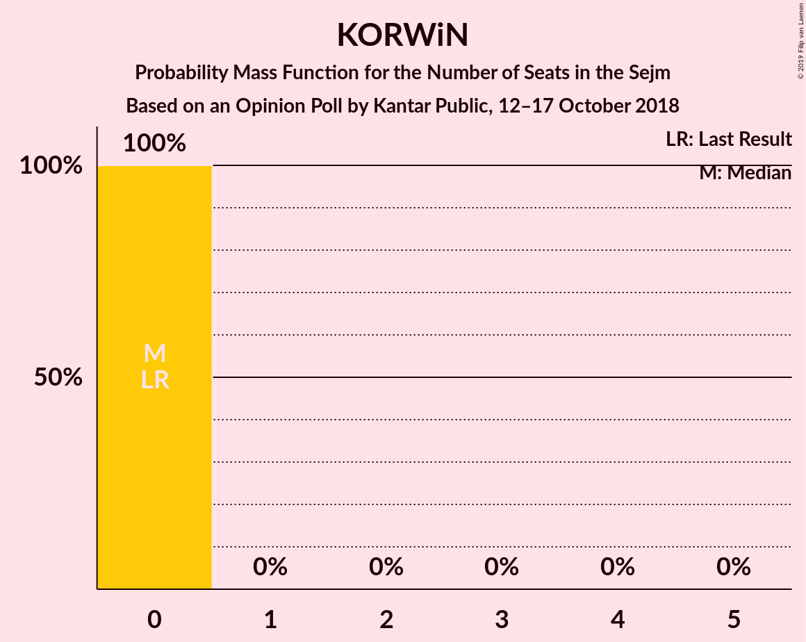

| Number of Seats | Probability | Accumulated | Special Marks |
|:---------------:|:-----------:|:-----------:|:-------------:|
| 0 | 100% | 100% | Last Result, Median |

### Lewica Razem

*For a full overview of the results for this party, see the [Lewica Razem](party-lewicarazem.html) page.*

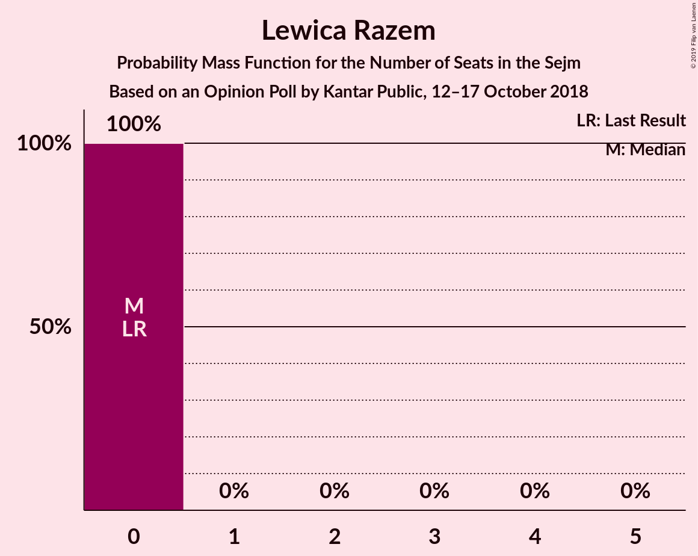

| Number of Seats | Probability | Accumulated | Special Marks |
|:---------------:|:-----------:|:-----------:|:-------------:|
| 0 | 100% | 100% | Last Result, Median |

## Coalitions

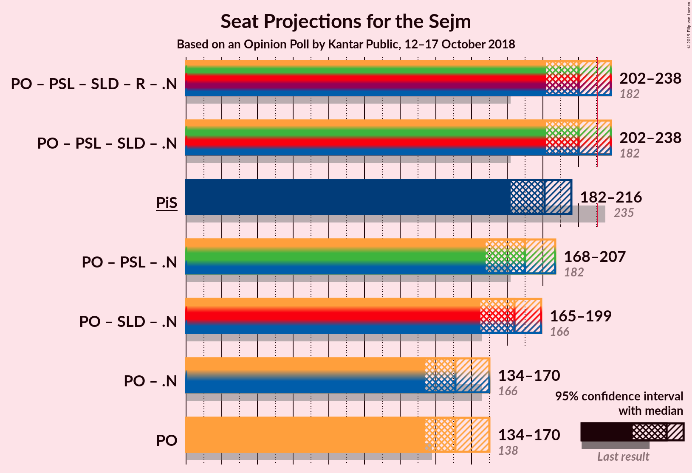

### Confidence Intervals

| Coalition | Last Result | Median | Majority? | 80% Confidence Interval | 90% Confidence Interval | 95% Confidence Interval | 99% Confidence Interval |
|:---------:|:-----------:|:------:|:---------:|:-----------------------:|:-----------------------:|:-----------------------:|:-----------------------:|
| Prawo i Sprawiedliwość | 235 | 209 | 0% | 204–221 | 198–221 | 197–221 | 197–225 |
| Platforma Obywatelska | 138 | 151 | 0% | 146–165 | 146–165 | 145–169 | 136–169 |

### Prawo i Sprawiedliwość

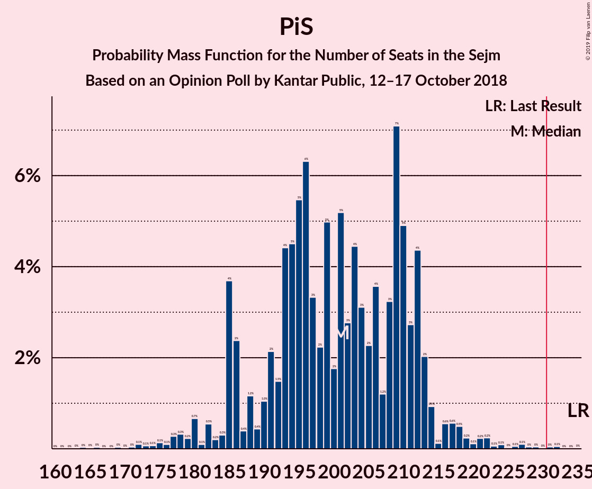

| Number of Seats | Probability | Accumulated | Special Marks |
|:---------------:|:-----------:|:-----------:|:-------------:|
| 193 | 0% | 100% |  |
| 194 | 0% | 99.9% |  |
| 195 | 0% | 99.9% |  |
| 196 | 0.2% | 99.9% |  |
| 197 | 3% | 99.7% |  |
| 198 | 3% | 96% |  |
| 199 | 0% | 93% |  |
| 200 | 0% | 93% |  |
| 201 | 0% | 93% |  |
| 202 | 0% | 93% |  |
| 203 | 0.3% | 93% |  |
| 204 | 4% | 93% |  |
| 205 | 7% | 89% |  |
| 206 | 5% | 82% |  |
| 207 | 1.3% | 77% |  |
| 208 | 11% | 76% |  |
| 209 | 27% | 65% | Median |
| 210 | 0% | 38% |  |
| 211 | 0.1% | 38% |  |
| 212 | 0% | 38% |  |
| 213 | 3% | 38% |  |
| 214 | 0.2% | 35% |  |
| 215 | 0% | 35% |  |
| 216 | 5% | 35% |  |
| 217 | 0% | 30% |  |
| 218 | 0% | 30% |  |
| 219 | 0.1% | 30% |  |
| 220 | 18% | 30% |  |
| 221 | 11% | 12% |  |
| 222 | 0% | 1.4% |  |
| 223 | 0% | 1.4% |  |
| 224 | 0% | 1.4% |  |
| 225 | 1.4% | 1.4% |  |
| 226 | 0% | 0% |  |
| 227 | 0% | 0% |  |
| 228 | 0% | 0% |  |
| 229 | 0% | 0% |  |
| 230 | 0% | 0% |  |
| 231 | 0% | 0% | Majority |
| 232 | 0% | 0% |  |
| 233 | 0% | 0% |  |
| 234 | 0% | 0% |  |
| 235 | 0% | 0% | Last Result |

### Platforma Obywatelska

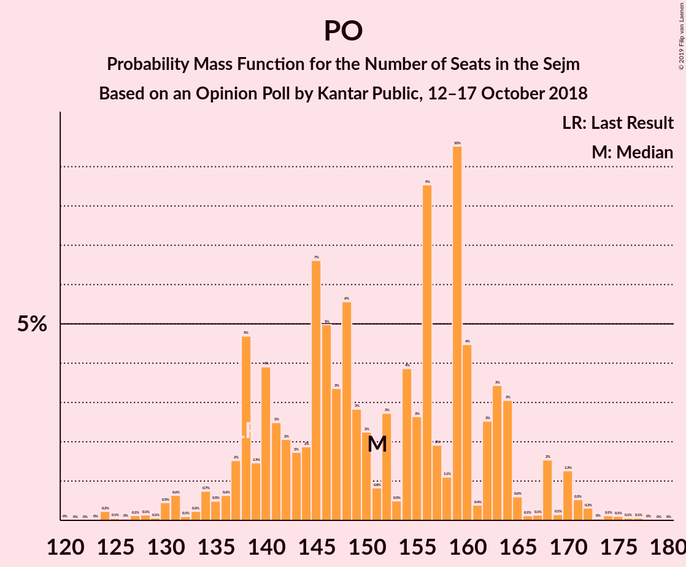

| Number of Seats | Probability | Accumulated | Special Marks |
|:---------------:|:-----------:|:-----------:|:-------------:|
| 131 | 0% | 100% |  |
| 132 | 0% | 99.9% |  |
| 133 | 0% | 99.9% |  |
| 134 | 0% | 99.9% |  |
| 135 | 0% | 99.9% |  |
| 136 | 0.5% | 99.9% |  |
| 137 | 0% | 99.4% |  |
| 138 | 0% | 99.4% | Last Result |
| 139 | 0% | 99.4% |  |
| 140 | 0% | 99.4% |  |
| 141 | 0% | 99.4% |  |
| 142 | 0% | 99.4% |  |
| 143 | 0% | 99.4% |  |
| 144 | 0% | 99.4% |  |
| 145 | 2% | 99.4% |  |
| 146 | 8% | 97% |  |
| 147 | 0.3% | 89% |  |
| 148 | 0% | 89% |  |
| 149 | 2% | 89% |  |
| 150 | 7% | 87% |  |
| 151 | 33% | 80% | Median |
| 152 | 7% | 47% |  |
| 153 | 3% | 39% |  |
| 154 | 0% | 36% |  |
| 155 | 0% | 36% |  |
| 156 | 0.1% | 36% |  |
| 157 | 0% | 36% |  |
| 158 | 0% | 36% |  |
| 159 | 0% | 36% |  |
| 160 | 0% | 36% |  |
| 161 | 0% | 36% |  |
| 162 | 0% | 36% |  |
| 163 | 0% | 36% |  |
| 164 | 12% | 36% |  |
| 165 | 19% | 24% |  |
| 166 | 0.9% | 4% |  |
| 167 | 0.1% | 3% |  |
| 168 | 0% | 3% |  |
| 169 | 3% | 3% |  |
| 170 | 0% | 0.2% |  |
| 171 | 0% | 0.2% |  |
| 172 | 0% | 0.2% |  |
| 173 | 0% | 0.2% |  |
| 174 | 0% | 0.2% |  |
| 175 | 0% | 0.2% |  |
| 176 | 0.2% | 0.2% |  |
| 177 | 0% | 0% |  |

## Technical Information

### Opinion Poll

+ **Polling firm:** Kantar Public
+ **Commissioner(s):** —
+ **Fieldwork period:** 12–17 October 2018

### Calculations

+ **Sample size:** 1037
+ **Simulations done:** 1,024
+ **Error estimate:** 2.09%

