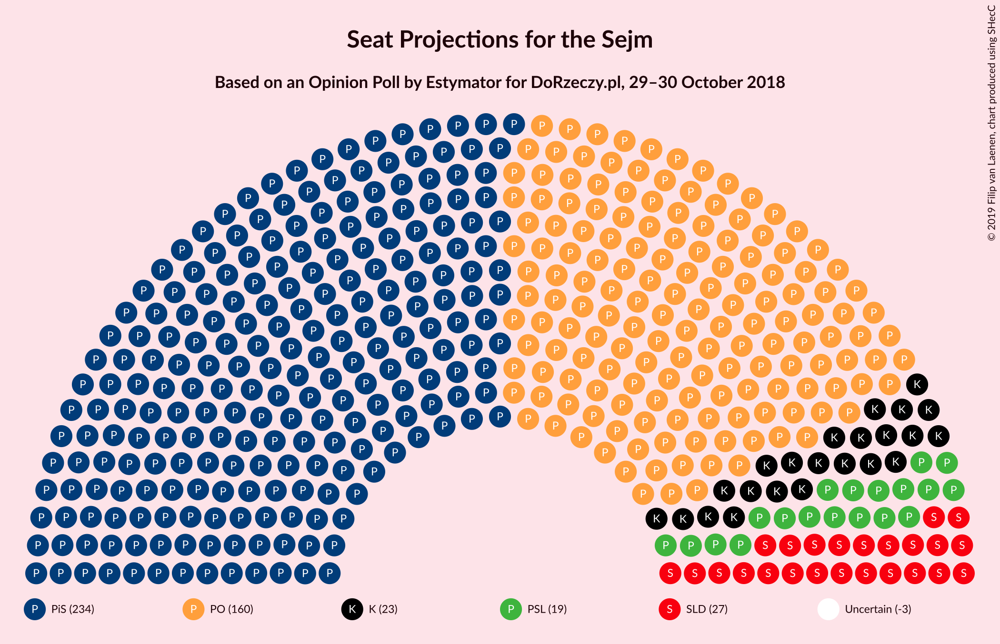
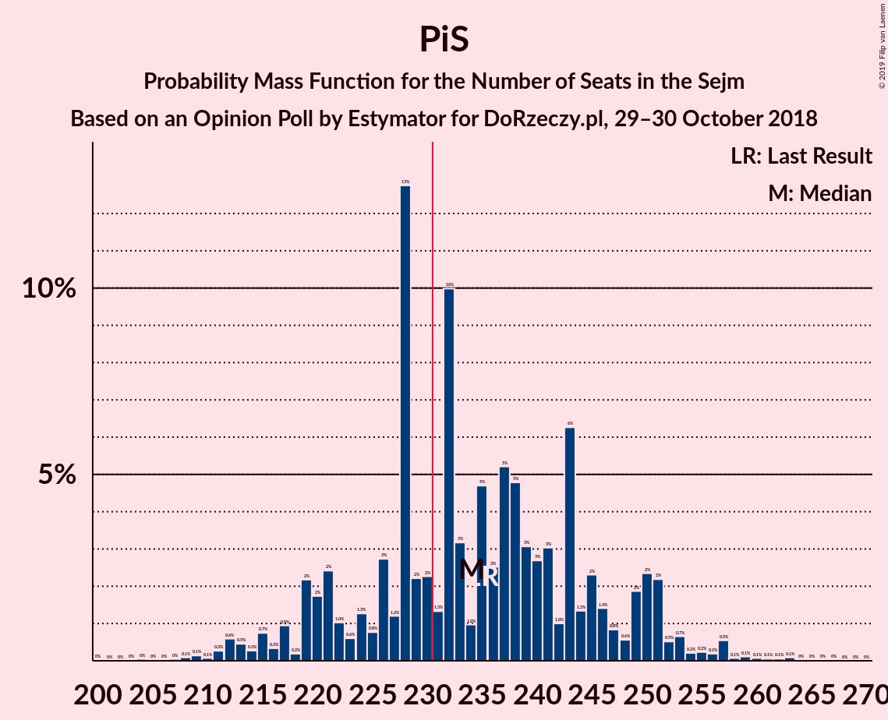

# Opinion Poll by Estymator for DoRzeczy.pl, 29–30 October 2018

<a href="#voting-intentions">Voting Intentions</a> | <a href="#seats">Seats</a> | <a href="#coalitions">Coalitions</a> | <a href="#technical-information">Technical Information</a>

## Voting Intentions

### Confidence Intervals

| Party | Last Result | Poll Result | 80% Confidence Interval | 90% Confidence Interval | 95% Confidence Interval | 99% Confidence Interval |
|:-----:|:-----------:|:-----------:|:-----------------------:|:-----------------------:|:-----------------------:|:-----------------------:|
| Prawo i Sprawiedliwość | 37.6% | 42.4% | 40.4–44.4% |39.9–45.0% |39.4–45.5% |38.4–46.4% |
| Platforma Obywatelska | 24.1% | 30.0% | 28.2–31.9% |27.7–32.4% |27.3–32.9% |26.4–33.8% |
| Sojusz Lewicy Demokratycznej | 7.6% | 7.4% | 6.4–8.5% |6.1–8.9% |5.9–9.2% |5.5–9.7% |
| Kukiz’15 | 8.8% | 7.3% | 6.3–8.4% |6.1–8.8% |5.8–9.1% |5.4–9.6% |
| Polskie Stronnictwo Ludowe | 5.1% | 6.0% | 5.1–7.1% |4.9–7.4% |4.7–7.6% |4.3–8.2% |
| Lewica Razem | 3.6% | 2.4% | 1.8–3.1% |1.7–3.3% |1.6–3.5% |1.4–3.9% |
| KORWiN | 4.8% | 1.9% | 1.4–2.5% |1.3–2.7% |1.2–2.9% |1.0–3.3% |

*Note:* The poll result column reflects the actual value used in the calculations. Published results may vary slightly, and in addition be rounded to fewer digits.

## Seats

### Confidence Intervals

| Party | Last Result | Median | 80% Confidence Interval | 90% Confidence Interval | 95% Confidence Interval | 99% Confidence Interval |
|:-----:|:-----------:|:------:|:-----------------------:|:-----------------------:|:-----------------------:|:-----------------------:|
| <a href="#prawo-i-sprawiedliwość">Prawo i Sprawiedliwość</a> | 235 | 234 | 221–247 |219–251 |215–252 |210–258 |
| <a href="#platforma-obywatelska">Platforma Obywatelska</a> | 138 | 160 | 149–168 |147–174 |145–177 |138–184 |
| <a href="#sojusz-lewicy-demokratycznej">Sojusz Lewicy Demokratycznej</a> | 0 | 27 | 16–30 |13–33 |12–36 |9–38 |
| <a href="#kukiz’15">Kukiz’15</a> | 42 | 23 | 13–33 |12–35 |10–38 |6–42 |
| <a href="#polskie-stronnictwo-ludowe">Polskie Stronnictwo Ludowe</a> | 16 | 19 | 11–24 |0–24 |0–26 |0–28 |
| <a href="#lewica-razem">Lewica Razem</a> | 0 | 0 | 0 |0 |0 |0 |
| <a href="#korwin">KORWiN</a> | 0 | 0 | 0 |0 |0 |0 |

### Prawo i Sprawiedliwość

*For a full overview of the results for this party, see the [Prawo i Sprawiedliwość](party-prawoisprawiedliwość.html) page.*

| Number of Seats | Probability | Accumulated | Special Marks |
|:---------------:|:-----------:|:-----------:|:-------------:|
| 203 | 0% | 100% |  |
| 204 | 0% | 99.9% |  |
| 205 | 0% | 99.9% |  |
| 206 | 0% | 99.9% |  |
| 207 | 0% | 99.8% |  |
| 208 | 0.1% | 99.8% |  |
| 209 | 0.1% | 99.7% |  |
| 210 | 0.1% | 99.6% |  |
| 211 | 0.3% | 99.5% |  |
| 212 | 0.6% | 99.2% |  |
| 213 | 0.5% | 98.6% |  |
| 214 | 0.3% | 98% |  |
| 215 | 0.7% | 98% |  |
| 216 | 0.3% | 97% |  |
| 217 | 0.9% | 97% |  |
| 218 | 0.2% | 96% |  |
| 219 | 2% | 96% |  |
| 220 | 2% | 94% |  |
| 221 | 2% | 92% |  |
| 222 | 1.0% | 89% |  |
| 223 | 0.6% | 88% |  |
| 224 | 1.3% | 88% |  |
| 225 | 0.8% | 86% |  |
| 226 | 3% | 86% |  |
| 227 | 1.2% | 83% |  |
| 228 | 13% | 82% |  |
| 229 | 2% | 69% |  |
| 230 | 2% | 67% |  |
| 231 | 1.3% | 65% | Majority |
| 232 | 10% | 63% |  |
| 233 | 3% | 53% |  |
| 234 | 1.0% | 50% | Median |
| 235 | 5% | 49% | Last Result |
| 236 | 3% | 44% |  |
| 237 | 5% | 42% |  |
| 238 | 5% | 37% |  |
| 239 | 3% | 32% |  |
| 240 | 3% | 29% |  |
| 241 | 3% | 26% |  |
| 242 | 1.0% | 23% |  |
| 243 | 6% | 22% |  |
| 244 | 1.3% | 16% |  |
| 245 | 2% | 14% |  |
| 246 | 1.4% | 12% |  |
| 247 | 0.8% | 11% |  |
| 248 | 0.6% | 10% |  |
| 249 | 2% | 9% |  |
| 250 | 2% | 7% |  |
| 251 | 2% | 5% |  |
| 252 | 0.5% | 3% |  |
| 253 | 0.7% | 2% |  |
| 254 | 0.2% | 2% |  |
| 255 | 0.2% | 2% |  |
| 256 | 0.2% | 1.3% |  |
| 257 | 0.5% | 1.1% |  |
| 258 | 0.1% | 0.6% |  |
| 259 | 0.1% | 0.5% |  |
| 260 | 0.1% | 0.4% |  |
| 261 | 0.1% | 0.3% |  |
| 262 | 0.1% | 0.2% |  |
| 263 | 0.1% | 0.2% |  |
| 264 | 0% | 0.1% |  |
| 265 | 0% | 0.1% |  |
| 266 | 0% | 0.1% |  |
| 267 | 0% | 0% |  |

### Platforma Obywatelska

*For a full overview of the results for this party, see the [Platforma Obywatelska](party-platformaobywatelska.html) page.*

| Number of Seats | Probability | Accumulated | Special Marks |
|:---------------:|:-----------:|:-----------:|:-------------:|
| 131 | 0% | 100% |  |
| 132 | 0.2% | 99.9% |  |
| 133 | 0% | 99.8% |  |
| 134 | 0% | 99.8% |  |
| 135 | 0.1% | 99.8% |  |
| 136 | 0.1% | 99.7% |  |
| 137 | 0.1% | 99.6% |  |
| 138 | 0% | 99.5% | Last Result |
| 139 | 0.1% | 99.5% |  |
| 140 | 0.2% | 99.3% |  |
| 141 | 0.2% | 99.2% |  |
| 142 | 0.4% | 99.0% |  |
| 143 | 0.3% | 98.5% |  |
| 144 | 0.8% | 98% |  |
| 145 | 0.2% | 98% |  |
| 146 | 0.5% | 97% |  |
| 147 | 3% | 97% |  |
| 148 | 3% | 94% |  |
| 149 | 1.4% | 91% |  |
| 150 | 1.3% | 89% |  |
| 151 | 4% | 88% |  |
| 152 | 3% | 84% |  |
| 153 | 3% | 81% |  |
| 154 | 4% | 78% |  |
| 155 | 4% | 74% |  |
| 156 | 1.4% | 70% |  |
| 157 | 7% | 68% |  |
| 158 | 3% | 62% |  |
| 159 | 8% | 59% |  |
| 160 | 5% | 51% | Median |
| 161 | 11% | 45% |  |
| 162 | 12% | 34% |  |
| 163 | 2% | 23% |  |
| 164 | 3% | 21% |  |
| 165 | 2% | 18% |  |
| 166 | 4% | 16% |  |
| 167 | 2% | 13% |  |
| 168 | 0.9% | 11% |  |
| 169 | 0.4% | 10% |  |
| 170 | 0.9% | 9% |  |
| 171 | 0.8% | 8% |  |
| 172 | 0.8% | 8% |  |
| 173 | 1.1% | 7% |  |
| 174 | 1.5% | 6% |  |
| 175 | 0.9% | 4% |  |
| 176 | 0.4% | 3% |  |
| 177 | 0.6% | 3% |  |
| 178 | 0.3% | 2% |  |
| 179 | 0.3% | 2% |  |
| 180 | 0.1% | 2% |  |
| 181 | 0.7% | 1.5% |  |
| 182 | 0.2% | 0.8% |  |
| 183 | 0% | 0.6% |  |
| 184 | 0.2% | 0.5% |  |
| 185 | 0.1% | 0.3% |  |
| 186 | 0.1% | 0.2% |  |
| 187 | 0.1% | 0.2% |  |
| 188 | 0% | 0.1% |  |
| 189 | 0% | 0.1% |  |
| 190 | 0% | 0.1% |  |
| 191 | 0% | 0% |  |

### Sojusz Lewicy Demokratycznej

*For a full overview of the results for this party, see the [Sojusz Lewicy Demokratycznej](party-sojuszlewicydemokratycznej.html) page.*

| Number of Seats | Probability | Accumulated | Special Marks |
|:---------------:|:-----------:|:-----------:|:-------------:|
| 0 | 0.1% | 100% | Last Result |
| 1 | 0% | 99.9% |  |
| 2 | 0% | 99.9% |  |
| 3 | 0% | 99.9% |  |
| 4 | 0% | 99.9% |  |
| 5 | 0% | 99.9% |  |
| 6 | 0% | 99.9% |  |
| 7 | 0% | 99.9% |  |
| 8 | 0.2% | 99.9% |  |
| 9 | 0.3% | 99.7% |  |
| 10 | 0.4% | 99.4% |  |
| 11 | 1.2% | 99.1% |  |
| 12 | 2% | 98% |  |
| 13 | 2% | 96% |  |
| 14 | 0.4% | 95% |  |
| 15 | 2% | 94% |  |
| 16 | 4% | 93% |  |
| 17 | 1.2% | 89% |  |
| 18 | 3% | 88% |  |
| 19 | 0.6% | 85% |  |
| 20 | 0.9% | 84% |  |
| 21 | 2% | 83% |  |
| 22 | 3% | 81% |  |
| 23 | 2% | 78% |  |
| 24 | 3% | 77% |  |
| 25 | 3% | 74% |  |
| 26 | 5% | 71% |  |
| 27 | 21% | 66% | Median |
| 28 | 9% | 45% |  |
| 29 | 20% | 36% |  |
| 30 | 8% | 16% |  |
| 31 | 2% | 9% |  |
| 32 | 1.2% | 7% |  |
| 33 | 1.0% | 6% |  |
| 34 | 0.8% | 5% |  |
| 35 | 1.1% | 4% |  |
| 36 | 1.0% | 3% |  |
| 37 | 1.2% | 2% |  |
| 38 | 0.2% | 0.7% |  |
| 39 | 0.1% | 0.5% |  |
| 40 | 0.1% | 0.3% |  |
| 41 | 0.1% | 0.3% |  |
| 42 | 0.1% | 0.2% |  |
| 43 | 0% | 0% |  |

### Kukiz’15

*For a full overview of the results for this party, see the [Kukiz’15](party-kukiz’15.html) page.*

| Number of Seats | Probability | Accumulated | Special Marks |
|:---------------:|:-----------:|:-----------:|:-------------:|
| 0 | 0.1% | 100% |  |
| 1 | 0% | 99.9% |  |
| 2 | 0% | 99.9% |  |
| 3 | 0.1% | 99.9% |  |
| 4 | 0.1% | 99.8% |  |
| 5 | 0.1% | 99.7% |  |
| 6 | 0.3% | 99.6% |  |
| 7 | 0.3% | 99.3% |  |
| 8 | 0.7% | 99.0% |  |
| 9 | 0.4% | 98% |  |
| 10 | 2% | 98% |  |
| 11 | 1.1% | 96% |  |
| 12 | 4% | 95% |  |
| 13 | 1.4% | 91% |  |
| 14 | 6% | 89% |  |
| 15 | 4% | 83% |  |
| 16 | 0.5% | 79% |  |
| 17 | 1.5% | 79% |  |
| 18 | 1.3% | 77% |  |
| 19 | 12% | 76% |  |
| 20 | 2% | 64% |  |
| 21 | 4% | 62% |  |
| 22 | 5% | 57% |  |
| 23 | 2% | 52% | Median |
| 24 | 4% | 50% |  |
| 25 | 2% | 46% |  |
| 26 | 3% | 44% |  |
| 27 | 16% | 41% |  |
| 28 | 2% | 25% |  |
| 29 | 2% | 24% |  |
| 30 | 2% | 22% |  |
| 31 | 5% | 20% |  |
| 32 | 3% | 15% |  |
| 33 | 3% | 12% |  |
| 34 | 0.9% | 9% |  |
| 35 | 3% | 8% |  |
| 36 | 1.4% | 5% |  |
| 37 | 1.0% | 3% |  |
| 38 | 0.5% | 3% |  |
| 39 | 0.4% | 2% |  |
| 40 | 0.3% | 2% |  |
| 41 | 0.6% | 1.3% |  |
| 42 | 0.5% | 0.7% | Last Result |
| 43 | 0.2% | 0.2% |  |
| 44 | 0% | 0.1% |  |
| 45 | 0% | 0.1% |  |
| 46 | 0% | 0% |  |

### Polskie Stronnictwo Ludowe

*For a full overview of the results for this party, see the [Polskie Stronnictwo Ludowe](party-polskiestronnictwoludowe.html) page.*

| Number of Seats | Probability | Accumulated | Special Marks |
|:---------------:|:-----------:|:-----------:|:-------------:|
| 0 | 8% | 100% |  |
| 1 | 0% | 92% |  |
| 2 | 0% | 92% |  |
| 3 | 0% | 92% |  |
| 4 | 0% | 92% |  |
| 5 | 0% | 92% |  |
| 6 | 0% | 92% |  |
| 7 | 0% | 92% |  |
| 8 | 0% | 92% |  |
| 9 | 0% | 92% |  |
| 10 | 0.1% | 92% |  |
| 11 | 4% | 92% |  |
| 12 | 4% | 88% |  |
| 13 | 2% | 85% |  |
| 14 | 3% | 83% |  |
| 15 | 3% | 80% |  |
| 16 | 15% | 77% | Last Result |
| 17 | 4% | 62% |  |
| 18 | 6% | 58% |  |
| 19 | 14% | 52% | Median |
| 20 | 5% | 38% |  |
| 21 | 6% | 33% |  |
| 22 | 10% | 27% |  |
| 23 | 5% | 16% |  |
| 24 | 8% | 12% |  |
| 25 | 0.9% | 4% |  |
| 26 | 1.3% | 3% |  |
| 27 | 1.0% | 2% |  |
| 28 | 0.4% | 0.7% |  |
| 29 | 0.2% | 0.3% |  |
| 30 | 0.1% | 0.2% |  |
| 31 | 0% | 0.1% |  |
| 32 | 0% | 0.1% |  |
| 33 | 0% | 0% |  |

### Lewica Razem

*For a full overview of the results for this party, see the [Lewica Razem](party-lewicarazem.html) page.*

| Number of Seats | Probability | Accumulated | Special Marks |
|:---------------:|:-----------:|:-----------:|:-------------:|
| 0 | 100% | 100% | Last Result, Median |

### KORWiN

*For a full overview of the results for this party, see the [KORWiN](party-korwin.html) page.*

| Number of Seats | Probability | Accumulated | Special Marks |
|:---------------:|:-----------:|:-----------:|:-------------:|
| 0 | 100% | 100% | Last Result, Median |

## Coalitions

### Confidence Intervals

| Coalition | Last Result | Median | Majority? | 80% Confidence Interval | 90% Confidence Interval | 95% Confidence Interval | 99% Confidence Interval |
|:---------:|:-----------:|:------:|:---------:|:-----------------------:|:-----------------------:|:-----------------------:|:-----------------------:|
| Prawo i Sprawiedliwość | 235 | 234 | 65% | 221–247 | 219–251 | 215–252 | 210–258 |
| Platforma Obywatelska | 138 | 160 | 0% | 149–168 | 147–174 | 145–177 | 138–184 |

### Prawo i Sprawiedliwość

| Number of Seats | Probability | Accumulated | Special Marks |
|:---------------:|:-----------:|:-----------:|:-------------:|
| 203 | 0% | 100% |  |
| 204 | 0% | 99.9% |  |
| 205 | 0% | 99.9% |  |
| 206 | 0% | 99.9% |  |
| 207 | 0% | 99.8% |  |
| 208 | 0.1% | 99.8% |  |
| 209 | 0.1% | 99.7% |  |
| 210 | 0.1% | 99.6% |  |
| 211 | 0.3% | 99.5% |  |
| 212 | 0.6% | 99.2% |  |
| 213 | 0.5% | 98.6% |  |
| 214 | 0.3% | 98% |  |
| 215 | 0.7% | 98% |  |
| 216 | 0.3% | 97% |  |
| 217 | 0.9% | 97% |  |
| 218 | 0.2% | 96% |  |
| 219 | 2% | 96% |  |
| 220 | 2% | 94% |  |
| 221 | 2% | 92% |  |
| 222 | 1.0% | 89% |  |
| 223 | 0.6% | 88% |  |
| 224 | 1.3% | 88% |  |
| 225 | 0.8% | 86% |  |
| 226 | 3% | 86% |  |
| 227 | 1.2% | 83% |  |
| 228 | 13% | 82% |  |
| 229 | 2% | 69% |  |
| 230 | 2% | 67% |  |
| 231 | 1.3% | 65% | Majority |
| 232 | 10% | 63% |  |
| 233 | 3% | 53% |  |
| 234 | 1.0% | 50% | Median |
| 235 | 5% | 49% | Last Result |
| 236 | 3% | 44% |  |
| 237 | 5% | 42% |  |
| 238 | 5% | 37% |  |
| 239 | 3% | 32% |  |
| 240 | 3% | 29% |  |
| 241 | 3% | 26% |  |
| 242 | 1.0% | 23% |  |
| 243 | 6% | 22% |  |
| 244 | 1.3% | 16% |  |
| 245 | 2% | 14% |  |
| 246 | 1.4% | 12% |  |
| 247 | 0.8% | 11% |  |
| 248 | 0.6% | 10% |  |
| 249 | 2% | 9% |  |
| 250 | 2% | 7% |  |
| 251 | 2% | 5% |  |
| 252 | 0.5% | 3% |  |
| 253 | 0.7% | 2% |  |
| 254 | 0.2% | 2% |  |
| 255 | 0.2% | 2% |  |
| 256 | 0.2% | 1.3% |  |
| 257 | 0.5% | 1.1% |  |
| 258 | 0.1% | 0.6% |  |
| 259 | 0.1% | 0.5% |  |
| 260 | 0.1% | 0.4% |  |
| 261 | 0.1% | 0.3% |  |
| 262 | 0.1% | 0.2% |  |
| 263 | 0.1% | 0.2% |  |
| 264 | 0% | 0.1% |  |
| 265 | 0% | 0.1% |  |
| 266 | 0% | 0.1% |  |
| 267 | 0% | 0% |  |

### Platforma Obywatelska

| Number of Seats | Probability | Accumulated | Special Marks |
|:---------------:|:-----------:|:-----------:|:-------------:|
| 131 | 0% | 100% |  |
| 132 | 0.2% | 99.9% |  |
| 133 | 0% | 99.8% |  |
| 134 | 0% | 99.8% |  |
| 135 | 0.1% | 99.8% |  |
| 136 | 0.1% | 99.7% |  |
| 137 | 0.1% | 99.6% |  |
| 138 | 0% | 99.5% | Last Result |
| 139 | 0.1% | 99.5% |  |
| 140 | 0.2% | 99.3% |  |
| 141 | 0.2% | 99.2% |  |
| 142 | 0.4% | 99.0% |  |
| 143 | 0.3% | 98.5% |  |
| 144 | 0.8% | 98% |  |
| 145 | 0.2% | 98% |  |
| 146 | 0.5% | 97% |  |
| 147 | 3% | 97% |  |
| 148 | 3% | 94% |  |
| 149 | 1.4% | 91% |  |
| 150 | 1.3% | 89% |  |
| 151 | 4% | 88% |  |
| 152 | 3% | 84% |  |
| 153 | 3% | 81% |  |
| 154 | 4% | 78% |  |
| 155 | 4% | 74% |  |
| 156 | 1.4% | 70% |  |
| 157 | 7% | 68% |  |
| 158 | 3% | 62% |  |
| 159 | 8% | 59% |  |
| 160 | 5% | 51% | Median |
| 161 | 11% | 45% |  |
| 162 | 12% | 34% |  |
| 163 | 2% | 23% |  |
| 164 | 3% | 21% |  |
| 165 | 2% | 18% |  |
| 166 | 4% | 16% |  |
| 167 | 2% | 13% |  |
| 168 | 0.9% | 11% |  |
| 169 | 0.4% | 10% |  |
| 170 | 0.9% | 9% |  |
| 171 | 0.8% | 8% |  |
| 172 | 0.8% | 8% |  |
| 173 | 1.1% | 7% |  |
| 174 | 1.5% | 6% |  |
| 175 | 0.9% | 4% |  |
| 176 | 0.4% | 3% |  |
| 177 | 0.6% | 3% |  |
| 178 | 0.3% | 2% |  |
| 179 | 0.3% | 2% |  |
| 180 | 0.1% | 2% |  |
| 181 | 0.7% | 1.5% |  |
| 182 | 0.2% | 0.8% |  |
| 183 | 0% | 0.6% |  |
| 184 | 0.2% | 0.5% |  |
| 185 | 0.1% | 0.3% |  |
| 186 | 0.1% | 0.2% |  |
| 187 | 0.1% | 0.2% |  |
| 188 | 0% | 0.1% |  |
| 189 | 0% | 0.1% |  |
| 190 | 0% | 0.1% |  |
| 191 | 0% | 0% |  |

## Technical Information

### Opinion Poll

+ **Polling firm:** Estymator
+ **Commissioner(s):** DoRzeczy.pl
+ **Fieldwork period:** 29–30 October 2018

### Calculations

+ **Sample size:** 1017
+ **Simulations done:** 131,072
+ **Error estimate:** 1.05%

