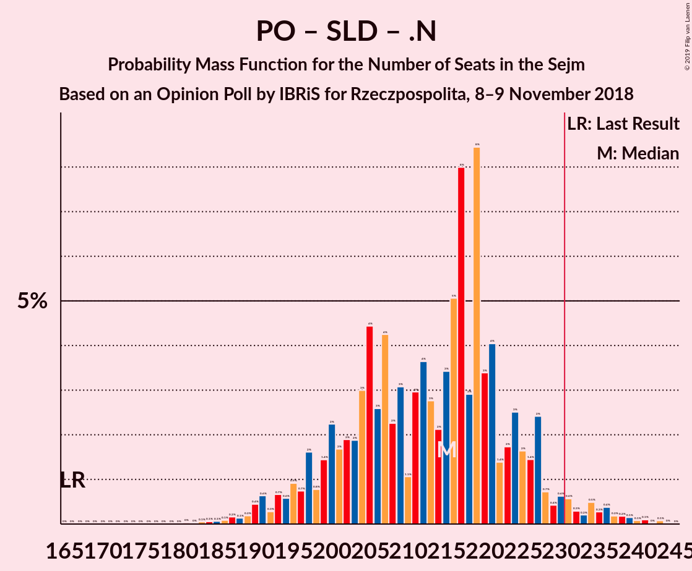
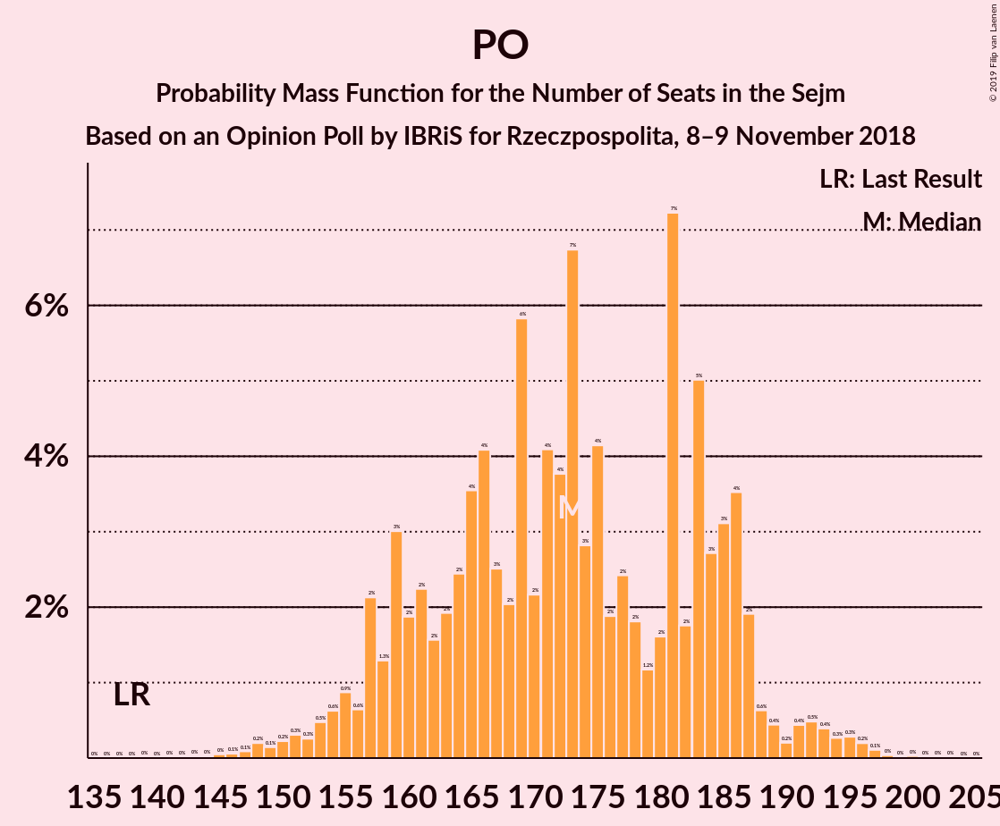

# Opinion Poll by IBRiS for Rzeczpospolita, 8–9 November 2018

<a href="#voting-intentions">Voting Intentions</a> | <a href="#seats">Seats</a> | <a href="#coalitions">Coalitions</a> | <a href="#technical-information">Technical Information</a>

## Voting Intentions

### Confidence Intervals

| Party | Last Result | Poll Result | 80% Confidence Interval | 90% Confidence Interval | 95% Confidence Interval | 99% Confidence Interval |
|:-----:|:-----------:|:-----------:|:-----------------------:|:-----------------------:|:-----------------------:|:-----------------------:|
| Prawo i Sprawiedliwość | 37.6% | 37.3% | 35.4–39.2% |34.9–39.7% |34.5–40.2% |33.6–41.1% |
| Platforma Obywatelska | 24.1% | 28.3% | 26.6–30.1% |26.1–30.6% |25.7–31.0% |24.9–31.9% |
| Sojusz Lewicy Demokratycznej | 7.6% | 7.9% | 7.0–9.1% |6.7–9.4% |6.4–9.7% |6.0–10.2% |
| Kukiz’15 | 8.8% | 4.8% | 4.1–5.8% |3.9–6.0% |3.7–6.3% |3.4–6.7% |
| .Nowoczesna | 7.6% | 4.8% | 4.1–5.8% |3.9–6.0% |3.7–6.3% |3.4–6.7% |
| Polskie Stronnictwo Ludowe | 5.1% | 4.2% | 3.5–5.1% |3.3–5.3% |3.1–5.5% |2.9–6.0% |
| Lewica Razem | 3.6% | 2.0% | 1.6–2.7% |1.4–2.9% |1.3–3.0% |1.1–3.4% |
| KORWiN | 4.8% | 1.3% | 0.9–1.8% |0.8–2.0% |0.8–2.1% |0.6–2.4% |

*Note:* The poll result column reflects the actual value used in the calculations. Published results may vary slightly, and in addition be rounded to fewer digits.

## Seats

### Confidence Intervals

| Party | Last Result | Median | 80% Confidence Interval | 90% Confidence Interval | 95% Confidence Interval | 99% Confidence Interval |
|:-----:|:-----------:|:------:|:-----------------------:|:-----------------------:|:-----------------------:|:-----------------------:|
| <a href="#prawo-i-sprawiedliwość">Prawo i Sprawiedliwość</a> | 235 | 218 | 211–244 |211–253 |211–253 |211–253 |
| <a href="#platforma-obywatelska">Platforma Obywatelska</a> | 138 | 169 | 168–184 |168–185 |163–190 |160–190 |
| <a href="#sojusz-lewicy-demokratycznej">Sojusz Lewicy Demokratycznej</a> | 0 | 36 | 32–44 |32–49 |28–49 |27–54 |
| <a href="#kukiz’15">Kukiz’15</a> | 42 | 11 | 0–14 |0–18 |0–30 |0–34 |
| <a href="#.nowoczesna">.Nowoczesna</a> | 28 | 0 | 0–13 |0–13 |0–14 |0–15 |
| <a href="#polskie-stronnictwo-ludowe">Polskie Stronnictwo Ludowe</a> | 16 | 0 | 0–21 |0–21 |0–21 |0–21 |
| <a href="#lewica-razem">Lewica Razem</a> | 0 | 0 | 0 |0 |0 |0 |
| <a href="#korwin">KORWiN</a> | 0 | 0 | 0 |0 |0 |0 |

### Prawo i Sprawiedliwość

*For a full overview of the results for this party, see the [Prawo i Sprawiedliwość](party-prawoisprawiedliwość.html) page.*

| Number of Seats | Probability | Accumulated | Special Marks |
|:---------------:|:-----------:|:-----------:|:-------------:|
| 200 | 0.3% | 100% |  |
| 201 | 0% | 99.7% |  |
| 202 | 0% | 99.7% |  |
| 203 | 0% | 99.7% |  |
| 204 | 0% | 99.7% |  |
| 205 | 0% | 99.7% |  |
| 206 | 0% | 99.7% |  |
| 207 | 0% | 99.7% |  |
| 208 | 0% | 99.7% |  |
| 209 | 0% | 99.7% |  |
| 210 | 0% | 99.7% |  |
| 211 | 42% | 99.7% |  |
| 212 | 0% | 58% |  |
| 213 | 0% | 58% |  |
| 214 | 0% | 58% |  |
| 215 | 0.4% | 58% |  |
| 216 | 0% | 58% |  |
| 217 | 2% | 58% |  |
| 218 | 7% | 55% | Median |
| 219 | 1.3% | 48% |  |
| 220 | 0% | 47% |  |
| 221 | 0% | 47% |  |
| 222 | 0.1% | 47% |  |
| 223 | 0% | 47% |  |
| 224 | 0.1% | 47% |  |
| 225 | 5% | 47% |  |
| 226 | 0% | 42% |  |
| 227 | 0.1% | 42% |  |
| 228 | 0% | 42% |  |
| 229 | 0.1% | 42% |  |
| 230 | 2% | 42% |  |
| 231 | 0% | 40% | Majority |
| 232 | 0% | 40% |  |
| 233 | 0% | 40% |  |
| 234 | 0.1% | 40% |  |
| 235 | 0% | 40% | Last Result |
| 236 | 0% | 40% |  |
| 237 | 0% | 40% |  |
| 238 | 0% | 40% |  |
| 239 | 0% | 40% |  |
| 240 | 0.1% | 40% |  |
| 241 | 0% | 40% |  |
| 242 | 0% | 40% |  |
| 243 | 1.3% | 40% |  |
| 244 | 30% | 38% |  |
| 245 | 0% | 8% |  |
| 246 | 0.1% | 8% |  |
| 247 | 0% | 8% |  |
| 248 | 0% | 8% |  |
| 249 | 0% | 8% |  |
| 250 | 0% | 8% |  |
| 251 | 0% | 8% |  |
| 252 | 0% | 8% |  |
| 253 | 8% | 8% |  |
| 254 | 0% | 0% |  |

### Platforma Obywatelska

*For a full overview of the results for this party, see the [Platforma Obywatelska](party-platformaobywatelska.html) page.*

| Number of Seats | Probability | Accumulated | Special Marks |
|:---------------:|:-----------:|:-----------:|:-------------:|
| 138 | 0% | 100% | Last Result |
| 139 | 0% | 100% |  |
| 140 | 0% | 100% |  |
| 141 | 0% | 100% |  |
| 142 | 0% | 100% |  |
| 143 | 0% | 100% |  |
| 144 | 0% | 100% |  |
| 145 | 0% | 100% |  |
| 146 | 0% | 100% |  |
| 147 | 0% | 100% |  |
| 148 | 0% | 100% |  |
| 149 | 0% | 100% |  |
| 150 | 0% | 100% |  |
| 151 | 0% | 100% |  |
| 152 | 0% | 100% |  |
| 153 | 0% | 100% |  |
| 154 | 0% | 100% |  |
| 155 | 0.2% | 100% |  |
| 156 | 0% | 99.8% |  |
| 157 | 0% | 99.8% |  |
| 158 | 0% | 99.8% |  |
| 159 | 0.2% | 99.8% |  |
| 160 | 0.4% | 99.6% |  |
| 161 | 0% | 99.2% |  |
| 162 | 0% | 99.2% |  |
| 163 | 2% | 99.2% |  |
| 164 | 0% | 97% |  |
| 165 | 0% | 97% |  |
| 166 | 0.7% | 97% |  |
| 167 | 0% | 96% |  |
| 168 | 39% | 96% |  |
| 169 | 10% | 57% | Median |
| 170 | 0.2% | 47% |  |
| 171 | 0% | 47% |  |
| 172 | 0% | 47% |  |
| 173 | 0.9% | 47% |  |
| 174 | 0% | 46% |  |
| 175 | 0.1% | 46% |  |
| 176 | 0% | 46% |  |
| 177 | 0% | 46% |  |
| 178 | 0% | 46% |  |
| 179 | 7% | 46% |  |
| 180 | 0% | 39% |  |
| 181 | 0.1% | 39% |  |
| 182 | 0% | 39% |  |
| 183 | 2% | 39% |  |
| 184 | 32% | 37% |  |
| 185 | 2% | 5% |  |
| 186 | 0.1% | 3% |  |
| 187 | 0% | 3% |  |
| 188 | 0% | 3% |  |
| 189 | 0% | 3% |  |
| 190 | 3% | 3% |  |
| 191 | 0% | 0.2% |  |
| 192 | 0% | 0.2% |  |
| 193 | 0% | 0.2% |  |
| 194 | 0% | 0.1% |  |
| 195 | 0.1% | 0.1% |  |
| 196 | 0% | 0% |  |

### Sojusz Lewicy Demokratycznej

*For a full overview of the results for this party, see the [Sojusz Lewicy Demokratycznej](party-sojuszlewicydemokratycznej.html) page.*

| Number of Seats | Probability | Accumulated | Special Marks |
|:---------------:|:-----------:|:-----------:|:-------------:|
| 0 | 0% | 100% | Last Result |
| 1 | 0% | 100% |  |
| 2 | 0% | 100% |  |
| 3 | 0% | 100% |  |
| 4 | 0% | 100% |  |
| 5 | 0% | 100% |  |
| 6 | 0% | 100% |  |
| 7 | 0% | 100% |  |
| 8 | 0% | 100% |  |
| 9 | 0% | 100% |  |
| 10 | 0% | 100% |  |
| 11 | 0% | 100% |  |
| 12 | 0% | 100% |  |
| 13 | 0% | 100% |  |
| 14 | 0% | 100% |  |
| 15 | 0.1% | 100% |  |
| 16 | 0.1% | 99.9% |  |
| 17 | 0% | 99.8% |  |
| 18 | 0% | 99.8% |  |
| 19 | 0% | 99.8% |  |
| 20 | 0% | 99.8% |  |
| 21 | 0% | 99.8% |  |
| 22 | 0% | 99.8% |  |
| 23 | 0% | 99.8% |  |
| 24 | 0% | 99.8% |  |
| 25 | 0% | 99.8% |  |
| 26 | 0.1% | 99.8% |  |
| 27 | 0.9% | 99.6% |  |
| 28 | 3% | 98.8% |  |
| 29 | 0% | 96% |  |
| 30 | 0% | 96% |  |
| 31 | 0% | 96% |  |
| 32 | 31% | 96% |  |
| 33 | 0.4% | 65% |  |
| 34 | 1.3% | 65% |  |
| 35 | 0.7% | 64% |  |
| 36 | 41% | 63% | Median |
| 37 | 0.1% | 22% |  |
| 38 | 8% | 22% |  |
| 39 | 0% | 14% |  |
| 40 | 0.2% | 14% |  |
| 41 | 0.4% | 14% |  |
| 42 | 0% | 13% |  |
| 43 | 2% | 13% |  |
| 44 | 2% | 11% |  |
| 45 | 0.1% | 9% |  |
| 46 | 0% | 9% |  |
| 47 | 0% | 9% |  |
| 48 | 0% | 9% |  |
| 49 | 7% | 9% |  |
| 50 | 0.1% | 2% |  |
| 51 | 0% | 2% |  |
| 52 | 0% | 2% |  |
| 53 | 0% | 2% |  |
| 54 | 2% | 2% |  |
| 55 | 0% | 0% |  |

### Kukiz’15

*For a full overview of the results for this party, see the [Kukiz’15](party-kukiz’15.html) page.*

| Number of Seats | Probability | Accumulated | Special Marks |
|:---------------:|:-----------:|:-----------:|:-------------:|
| 0 | 46% | 100% |  |
| 1 | 0% | 54% |  |
| 2 | 0% | 54% |  |
| 3 | 0% | 54% |  |
| 4 | 0% | 54% |  |
| 5 | 0% | 54% |  |
| 6 | 0% | 54% |  |
| 7 | 0.3% | 54% |  |
| 8 | 0.7% | 54% |  |
| 9 | 0% | 53% |  |
| 10 | 0.2% | 53% |  |
| 11 | 40% | 53% | Median |
| 12 | 0.2% | 13% |  |
| 13 | 0% | 12% |  |
| 14 | 7% | 12% |  |
| 15 | 0.1% | 5% |  |
| 16 | 0% | 5% |  |
| 17 | 0% | 5% |  |
| 18 | 2% | 5% |  |
| 19 | 0% | 3% |  |
| 20 | 0% | 3% |  |
| 21 | 0% | 3% |  |
| 22 | 0% | 3% |  |
| 23 | 0% | 3% |  |
| 24 | 0% | 3% |  |
| 25 | 0% | 3% |  |
| 26 | 0% | 3% |  |
| 27 | 0% | 3% |  |
| 28 | 0% | 3% |  |
| 29 | 0% | 3% |  |
| 30 | 0.9% | 3% |  |
| 31 | 0% | 2% |  |
| 32 | 0.7% | 2% |  |
| 33 | 0% | 1.5% |  |
| 34 | 1.5% | 1.5% |  |
| 35 | 0% | 0% |  |
| 36 | 0% | 0% |  |
| 37 | 0% | 0% |  |
| 38 | 0% | 0% |  |
| 39 | 0% | 0% |  |
| 40 | 0% | 0% |  |
| 41 | 0% | 0% |  |
| 42 | 0% | 0% | Last Result |

### .Nowoczesna

*For a full overview of the results for this party, see the [.Nowoczesna](party-nowoczesna.html) page.*

| Number of Seats | Probability | Accumulated | Special Marks |
|:---------------:|:-----------:|:-----------:|:-------------:|
| 0 | 53% | 100% | Median |
| 1 | 0% | 47% |  |
| 2 | 0% | 47% |  |
| 3 | 0% | 47% |  |
| 4 | 0% | 47% |  |
| 5 | 0% | 47% |  |
| 6 | 0% | 47% |  |
| 7 | 0% | 47% |  |
| 8 | 0% | 47% |  |
| 9 | 0% | 47% |  |
| 10 | 2% | 47% |  |
| 11 | 0.2% | 46% |  |
| 12 | 0.6% | 45% |  |
| 13 | 41% | 45% |  |
| 14 | 3% | 4% |  |
| 15 | 0.3% | 0.6% |  |
| 16 | 0% | 0.4% |  |
| 17 | 0% | 0.3% |  |
| 18 | 0% | 0.3% |  |
| 19 | 0% | 0.3% |  |
| 20 | 0% | 0.3% |  |
| 21 | 0% | 0.3% |  |
| 22 | 0% | 0.3% |  |
| 23 | 0.2% | 0.3% |  |
| 24 | 0% | 0.1% |  |
| 25 | 0% | 0.1% |  |
| 26 | 0.1% | 0.1% |  |
| 27 | 0% | 0% |  |
| 28 | 0% | 0% | Last Result |

### Polskie Stronnictwo Ludowe

*For a full overview of the results for this party, see the [Polskie Stronnictwo Ludowe](party-polskiestronnictwoludowe.html) page.*

| Number of Seats | Probability | Accumulated | Special Marks |
|:---------------:|:-----------:|:-----------:|:-------------:|
| 0 | 57% | 100% | Median |
| 1 | 0% | 43% |  |
| 2 | 0% | 43% |  |
| 3 | 0% | 43% |  |
| 4 | 0% | 43% |  |
| 5 | 0% | 43% |  |
| 6 | 0% | 43% |  |
| 7 | 0% | 43% |  |
| 8 | 0% | 43% |  |
| 9 | 0% | 43% |  |
| 10 | 0% | 43% |  |
| 11 | 0% | 43% |  |
| 12 | 0% | 43% |  |
| 13 | 0% | 43% |  |
| 14 | 0% | 43% |  |
| 15 | 0% | 43% |  |
| 16 | 0% | 43% | Last Result |
| 17 | 3% | 43% |  |
| 18 | 0% | 40% |  |
| 19 | 0% | 40% |  |
| 20 | 0% | 40% |  |
| 21 | 40% | 40% |  |
| 22 | 0.3% | 0.3% |  |
| 23 | 0% | 0.1% |  |
| 24 | 0% | 0.1% |  |
| 25 | 0% | 0.1% |  |
| 26 | 0% | 0% |  |

### Lewica Razem

*For a full overview of the results for this party, see the [Lewica Razem](party-lewicarazem.html) page.*

| Number of Seats | Probability | Accumulated | Special Marks |
|:---------------:|:-----------:|:-----------:|:-------------:|
| 0 | 100% | 100% | Last Result, Median |

### KORWiN

*For a full overview of the results for this party, see the [KORWiN](party-korwin.html) page.*

| Number of Seats | Probability | Accumulated | Special Marks |
|:---------------:|:-----------:|:-----------:|:-------------:|
| 0 | 100% | 100% | Last Result, Median |

## Coalitions

### Confidence Intervals

| Coalition | Last Result | Median | Majority? | 80% Confidence Interval | 90% Confidence Interval | 95% Confidence Interval | 99% Confidence Interval |
|:---------:|:-----------:|:------:|:---------:|:-----------------------:|:-----------------------:|:-----------------------:|:-----------------------:|
| Prawo i Sprawiedliwość | 235 | 218 | 40% | 211–244 | 211–253 | 211–253 | 211–253 |
| Platforma Obywatelska – Sojusz Lewicy Demokratycznej – .Nowoczesna – Polskie Stronnictwo Ludowe – Lewica Razem | 182 | 228 | 47% | 215–238 | 207–238 | 207–241 | 200–243 |
| Platforma Obywatelska – Sojusz Lewicy Demokratycznej – .Nowoczesna – Polskie Stronnictwo Ludowe | 182 | 228 | 47% | 215–238 | 207–238 | 207–241 | 200–243 |
| Platforma Obywatelska – Sojusz Lewicy Demokratycznej – .Nowoczesna | 166 | 217 | 4% | 215–228 | 207–228 | 207–241 | 200–243 |
| Platforma Obywatelska – .Nowoczesna – Polskie Stronnictwo Ludowe | 182 | 184 | 0% | 169–202 | 169–202 | 169–207 | 163–207 |
| Platforma Obywatelska – .Nowoczesna | 166 | 181 | 0% | 169–184 | 169–190 | 169–198 | 163–199 |
| Platforma Obywatelska | 138 | 169 | 0% | 168–184 | 168–185 | 163–190 | 160–190 |

### Prawo i Sprawiedliwość

| Number of Seats | Probability | Accumulated | Special Marks |
|:---------------:|:-----------:|:-----------:|:-------------:|
| 200 | 0.3% | 100% |  |
| 201 | 0% | 99.7% |  |
| 202 | 0% | 99.7% |  |
| 203 | 0% | 99.7% |  |
| 204 | 0% | 99.7% |  |
| 205 | 0% | 99.7% |  |
| 206 | 0% | 99.7% |  |
| 207 | 0% | 99.7% |  |
| 208 | 0% | 99.7% |  |
| 209 | 0% | 99.7% |  |
| 210 | 0% | 99.7% |  |
| 211 | 42% | 99.7% |  |
| 212 | 0% | 58% |  |
| 213 | 0% | 58% |  |
| 214 | 0% | 58% |  |
| 215 | 0.4% | 58% |  |
| 216 | 0% | 58% |  |
| 217 | 2% | 58% |  |
| 218 | 7% | 55% | Median |
| 219 | 1.3% | 48% |  |
| 220 | 0% | 47% |  |
| 221 | 0% | 47% |  |
| 222 | 0.1% | 47% |  |
| 223 | 0% | 47% |  |
| 224 | 0.1% | 47% |  |
| 225 | 5% | 47% |  |
| 226 | 0% | 42% |  |
| 227 | 0.1% | 42% |  |
| 228 | 0% | 42% |  |
| 229 | 0.1% | 42% |  |
| 230 | 2% | 42% |  |
| 231 | 0% | 40% | Majority |
| 232 | 0% | 40% |  |
| 233 | 0% | 40% |  |
| 234 | 0.1% | 40% |  |
| 235 | 0% | 40% | Last Result |
| 236 | 0% | 40% |  |
| 237 | 0% | 40% |  |
| 238 | 0% | 40% |  |
| 239 | 0% | 40% |  |
| 240 | 0.1% | 40% |  |
| 241 | 0% | 40% |  |
| 242 | 0% | 40% |  |
| 243 | 1.3% | 40% |  |
| 244 | 30% | 38% |  |
| 245 | 0% | 8% |  |
| 246 | 0.1% | 8% |  |
| 247 | 0% | 8% |  |
| 248 | 0% | 8% |  |
| 249 | 0% | 8% |  |
| 250 | 0% | 8% |  |
| 251 | 0% | 8% |  |
| 252 | 0% | 8% |  |
| 253 | 8% | 8% |  |
| 254 | 0% | 0% |  |

### Platforma Obywatelska – Sojusz Lewicy Demokratycznej – .Nowoczesna – Polskie Stronnictwo Ludowe – Lewica Razem

| Number of Seats | Probability | Accumulated | Special Marks |
|:---------------:|:-----------:|:-----------:|:-------------:|
| 182 | 0% | 100% | Last Result |
| 183 | 0% | 100% |  |
| 184 | 0% | 100% |  |
| 185 | 0% | 100% |  |
| 186 | 0% | 100% |  |
| 187 | 0% | 100% |  |
| 188 | 0% | 100% |  |
| 189 | 0% | 100% |  |
| 190 | 0% | 100% |  |
| 191 | 0% | 100% |  |
| 192 | 0% | 100% |  |
| 193 | 0% | 100% |  |
| 194 | 0% | 100% |  |
| 195 | 0% | 100% |  |
| 196 | 0% | 100% |  |
| 197 | 0% | 100% |  |
| 198 | 0% | 100% |  |
| 199 | 0% | 100% |  |
| 200 | 0.9% | 100% |  |
| 201 | 0% | 99.1% |  |
| 202 | 0% | 99.1% |  |
| 203 | 0% | 99.1% |  |
| 204 | 0% | 99.1% |  |
| 205 | 0% | 99.1% | Median |
| 206 | 0.2% | 99.1% |  |
| 207 | 8% | 99.0% |  |
| 208 | 0% | 91% |  |
| 209 | 0.2% | 91% |  |
| 210 | 0.1% | 91% |  |
| 211 | 0% | 91% |  |
| 212 | 0% | 91% |  |
| 213 | 0.5% | 91% |  |
| 214 | 0.2% | 90% |  |
| 215 | 1.5% | 90% |  |
| 216 | 31% | 89% |  |
| 217 | 3% | 58% |  |
| 218 | 0% | 55% |  |
| 219 | 0% | 55% |  |
| 220 | 0% | 55% |  |
| 221 | 0.1% | 55% |  |
| 222 | 0.7% | 55% |  |
| 223 | 0% | 54% |  |
| 224 | 0% | 54% |  |
| 225 | 0.1% | 54% |  |
| 226 | 0% | 54% |  |
| 227 | 0% | 54% |  |
| 228 | 7% | 54% |  |
| 229 | 0% | 47% |  |
| 230 | 0% | 47% |  |
| 231 | 0.1% | 47% | Majority |
| 232 | 0% | 47% |  |
| 233 | 0.1% | 47% |  |
| 234 | 0% | 47% |  |
| 235 | 3% | 47% |  |
| 236 | 0% | 44% |  |
| 237 | 0% | 44% |  |
| 238 | 40% | 44% |  |
| 239 | 0% | 4% |  |
| 240 | 0% | 4% |  |
| 241 | 1.1% | 4% |  |
| 242 | 0% | 2% |  |
| 243 | 2% | 2% |  |
| 244 | 0% | 0.3% |  |
| 245 | 0% | 0.3% |  |
| 246 | 0% | 0.3% |  |
| 247 | 0% | 0.3% |  |
| 248 | 0% | 0.3% |  |
| 249 | 0% | 0.3% |  |
| 250 | 0% | 0.3% |  |
| 251 | 0% | 0.3% |  |
| 252 | 0% | 0.3% |  |
| 253 | 0.3% | 0.3% |  |
| 254 | 0% | 0% |  |

### Platforma Obywatelska – Sojusz Lewicy Demokratycznej – .Nowoczesna – Polskie Stronnictwo Ludowe

| Number of Seats | Probability | Accumulated | Special Marks |
|:---------------:|:-----------:|:-----------:|:-------------:|
| 182 | 0% | 100% | Last Result |
| 183 | 0% | 100% |  |
| 184 | 0% | 100% |  |
| 185 | 0% | 100% |  |
| 186 | 0% | 100% |  |
| 187 | 0% | 100% |  |
| 188 | 0% | 100% |  |
| 189 | 0% | 100% |  |
| 190 | 0% | 100% |  |
| 191 | 0% | 100% |  |
| 192 | 0% | 100% |  |
| 193 | 0% | 100% |  |
| 194 | 0% | 100% |  |
| 195 | 0% | 100% |  |
| 196 | 0% | 100% |  |
| 197 | 0% | 100% |  |
| 198 | 0% | 100% |  |
| 199 | 0% | 100% |  |
| 200 | 0.9% | 100% |  |
| 201 | 0% | 99.1% |  |
| 202 | 0% | 99.1% |  |
| 203 | 0% | 99.1% |  |
| 204 | 0% | 99.1% |  |
| 205 | 0% | 99.1% | Median |
| 206 | 0.2% | 99.1% |  |
| 207 | 8% | 99.0% |  |
| 208 | 0% | 91% |  |
| 209 | 0.2% | 91% |  |
| 210 | 0.1% | 91% |  |
| 211 | 0% | 91% |  |
| 212 | 0% | 91% |  |
| 213 | 0.5% | 91% |  |
| 214 | 0.2% | 90% |  |
| 215 | 1.5% | 90% |  |
| 216 | 31% | 89% |  |
| 217 | 3% | 58% |  |
| 218 | 0% | 55% |  |
| 219 | 0% | 55% |  |
| 220 | 0% | 55% |  |
| 221 | 0.1% | 55% |  |
| 222 | 0.7% | 55% |  |
| 223 | 0% | 54% |  |
| 224 | 0% | 54% |  |
| 225 | 0.1% | 54% |  |
| 226 | 0% | 54% |  |
| 227 | 0% | 54% |  |
| 228 | 7% | 54% |  |
| 229 | 0% | 47% |  |
| 230 | 0% | 47% |  |
| 231 | 0.1% | 47% | Majority |
| 232 | 0% | 47% |  |
| 233 | 0.1% | 47% |  |
| 234 | 0% | 47% |  |
| 235 | 3% | 47% |  |
| 236 | 0% | 44% |  |
| 237 | 0% | 44% |  |
| 238 | 40% | 44% |  |
| 239 | 0% | 4% |  |
| 240 | 0% | 4% |  |
| 241 | 1.1% | 4% |  |
| 242 | 0% | 2% |  |
| 243 | 2% | 2% |  |
| 244 | 0% | 0.3% |  |
| 245 | 0% | 0.3% |  |
| 246 | 0% | 0.3% |  |
| 247 | 0% | 0.3% |  |
| 248 | 0% | 0.3% |  |
| 249 | 0% | 0.3% |  |
| 250 | 0% | 0.3% |  |
| 251 | 0% | 0.3% |  |
| 252 | 0% | 0.3% |  |
| 253 | 0.3% | 0.3% |  |
| 254 | 0% | 0% |  |

### Platforma Obywatelska – Sojusz Lewicy Demokratycznej – .Nowoczesna

| Number of Seats | Probability | Accumulated | Special Marks |
|:---------------:|:-----------:|:-----------:|:-------------:|
| 166 | 0% | 100% | Last Result |
| 167 | 0% | 100% |  |
| 168 | 0% | 100% |  |
| 169 | 0% | 100% |  |
| 170 | 0% | 100% |  |
| 171 | 0% | 100% |  |
| 172 | 0% | 100% |  |
| 173 | 0% | 100% |  |
| 174 | 0% | 100% |  |
| 175 | 0% | 100% |  |
| 176 | 0% | 100% |  |
| 177 | 0% | 100% |  |
| 178 | 0% | 100% |  |
| 179 | 0% | 100% |  |
| 180 | 0% | 100% |  |
| 181 | 0% | 100% |  |
| 182 | 0% | 100% |  |
| 183 | 0% | 100% |  |
| 184 | 0% | 100% |  |
| 185 | 0% | 100% |  |
| 186 | 0% | 100% |  |
| 187 | 0% | 100% |  |
| 188 | 0% | 100% |  |
| 189 | 0% | 100% |  |
| 190 | 0% | 100% |  |
| 191 | 0% | 100% |  |
| 192 | 0% | 100% |  |
| 193 | 0% | 100% |  |
| 194 | 0% | 100% |  |
| 195 | 0% | 100% |  |
| 196 | 0% | 100% |  |
| 197 | 0% | 100% |  |
| 198 | 0% | 100% |  |
| 199 | 0% | 100% |  |
| 200 | 0.9% | 100% |  |
| 201 | 0% | 99.1% |  |
| 202 | 0% | 99.1% |  |
| 203 | 0% | 99.1% |  |
| 204 | 0% | 99.1% |  |
| 205 | 0% | 99.1% | Median |
| 206 | 0.2% | 99.1% |  |
| 207 | 8% | 98.9% |  |
| 208 | 0% | 91% |  |
| 209 | 0.2% | 91% |  |
| 210 | 0.1% | 91% |  |
| 211 | 0% | 91% |  |
| 212 | 0% | 91% |  |
| 213 | 0.5% | 91% |  |
| 214 | 0.2% | 90% |  |
| 215 | 1.5% | 90% |  |
| 216 | 31% | 89% |  |
| 217 | 43% | 58% |  |
| 218 | 3% | 15% |  |
| 219 | 0% | 12% |  |
| 220 | 0% | 12% |  |
| 221 | 0.1% | 12% |  |
| 222 | 0.7% | 12% |  |
| 223 | 0% | 11% |  |
| 224 | 0% | 11% |  |
| 225 | 0.1% | 11% |  |
| 226 | 0% | 11% |  |
| 227 | 0% | 11% |  |
| 228 | 7% | 11% |  |
| 229 | 0% | 4% |  |
| 230 | 0% | 4% |  |
| 231 | 0.4% | 4% | Majority |
| 232 | 0% | 3% |  |
| 233 | 0.1% | 3% |  |
| 234 | 0% | 3% |  |
| 235 | 0% | 3% |  |
| 236 | 0% | 3% |  |
| 237 | 0% | 3% |  |
| 238 | 0% | 3% |  |
| 239 | 0% | 3% |  |
| 240 | 0% | 3% |  |
| 241 | 1.1% | 3% |  |
| 242 | 0% | 2% |  |
| 243 | 2% | 2% |  |
| 244 | 0% | 0% |  |

### Platforma Obywatelska – .Nowoczesna – Polskie Stronnictwo Ludowe

| Number of Seats | Probability | Accumulated | Special Marks |
|:---------------:|:-----------:|:-----------:|:-------------:|
| 163 | 2% | 100% |  |
| 164 | 0% | 98% |  |
| 165 | 0% | 98% |  |
| 166 | 0% | 98% |  |
| 167 | 0% | 98% |  |
| 168 | 0% | 98% |  |
| 169 | 8% | 98% | Median |
| 170 | 0% | 90% |  |
| 171 | 0% | 90% |  |
| 172 | 0.4% | 90% |  |
| 173 | 0.9% | 89% |  |
| 174 | 0% | 89% |  |
| 175 | 0.1% | 89% |  |
| 176 | 0% | 88% |  |
| 177 | 0% | 88% |  |
| 178 | 0.1% | 88% |  |
| 179 | 9% | 88% |  |
| 180 | 0% | 79% |  |
| 181 | 0.2% | 79% |  |
| 182 | 0.1% | 79% | Last Result |
| 183 | 1.3% | 79% |  |
| 184 | 30% | 78% |  |
| 185 | 0% | 47% |  |
| 186 | 0% | 47% |  |
| 187 | 0% | 47% |  |
| 188 | 0% | 47% |  |
| 189 | 0% | 47% |  |
| 190 | 0% | 47% |  |
| 191 | 0% | 47% |  |
| 192 | 0% | 47% |  |
| 193 | 0% | 47% |  |
| 194 | 0% | 47% |  |
| 195 | 0.2% | 47% |  |
| 196 | 0.2% | 47% |  |
| 197 | 0% | 47% |  |
| 198 | 1.2% | 47% |  |
| 199 | 2% | 45% |  |
| 200 | 0% | 43% |  |
| 201 | 0% | 43% |  |
| 202 | 39% | 43% |  |
| 203 | 0.7% | 4% |  |
| 204 | 0% | 3% |  |
| 205 | 0% | 3% |  |
| 206 | 0% | 3% |  |
| 207 | 3% | 3% |  |
| 208 | 0% | 0.3% |  |
| 209 | 0% | 0.3% |  |
| 210 | 0% | 0.3% |  |
| 211 | 0% | 0.3% |  |
| 212 | 0% | 0.3% |  |
| 213 | 0% | 0.3% |  |
| 214 | 0% | 0.3% |  |
| 215 | 0% | 0.3% |  |
| 216 | 0% | 0.3% |  |
| 217 | 0% | 0.3% |  |
| 218 | 0% | 0.3% |  |
| 219 | 0% | 0.3% |  |
| 220 | 0.3% | 0.3% |  |
| 221 | 0% | 0% |  |

### Platforma Obywatelska – .Nowoczesna

| Number of Seats | Probability | Accumulated | Special Marks |
|:---------------:|:-----------:|:-----------:|:-------------:|
| 161 | 0% | 100% |  |
| 162 | 0% | 99.9% |  |
| 163 | 2% | 99.9% |  |
| 164 | 0% | 98% |  |
| 165 | 0% | 98% |  |
| 166 | 0% | 98% | Last Result |
| 167 | 0% | 98% |  |
| 168 | 0% | 98% |  |
| 169 | 8% | 98% | Median |
| 170 | 0% | 90% |  |
| 171 | 0% | 90% |  |
| 172 | 0.4% | 90% |  |
| 173 | 0.9% | 89% |  |
| 174 | 0% | 88% |  |
| 175 | 0.1% | 88% |  |
| 176 | 0% | 88% |  |
| 177 | 0% | 88% |  |
| 178 | 0.1% | 88% |  |
| 179 | 9% | 88% |  |
| 180 | 0% | 79% |  |
| 181 | 40% | 79% |  |
| 182 | 0.8% | 40% |  |
| 183 | 1.3% | 39% |  |
| 184 | 30% | 37% |  |
| 185 | 0% | 7% |  |
| 186 | 0% | 7% |  |
| 187 | 0% | 7% |  |
| 188 | 0% | 7% |  |
| 189 | 0% | 7% |  |
| 190 | 3% | 7% |  |
| 191 | 0% | 4% |  |
| 192 | 0% | 4% |  |
| 193 | 0% | 4% |  |
| 194 | 0% | 4% |  |
| 195 | 0.2% | 4% |  |
| 196 | 0.1% | 4% |  |
| 197 | 0% | 4% |  |
| 198 | 1.4% | 4% |  |
| 199 | 2% | 2% |  |
| 200 | 0% | 0% |  |

### Platforma Obywatelska

| Number of Seats | Probability | Accumulated | Special Marks |
|:---------------:|:-----------:|:-----------:|:-------------:|
| 138 | 0% | 100% | Last Result |
| 139 | 0% | 100% |  |
| 140 | 0% | 100% |  |
| 141 | 0% | 100% |  |
| 142 | 0% | 100% |  |
| 143 | 0% | 100% |  |
| 144 | 0% | 100% |  |
| 145 | 0% | 100% |  |
| 146 | 0% | 100% |  |
| 147 | 0% | 100% |  |
| 148 | 0% | 100% |  |
| 149 | 0% | 100% |  |
| 150 | 0% | 100% |  |
| 151 | 0% | 100% |  |
| 152 | 0% | 100% |  |
| 153 | 0% | 100% |  |
| 154 | 0% | 100% |  |
| 155 | 0.2% | 100% |  |
| 156 | 0% | 99.8% |  |
| 157 | 0% | 99.8% |  |
| 158 | 0% | 99.8% |  |
| 159 | 0.2% | 99.8% |  |
| 160 | 0.4% | 99.6% |  |
| 161 | 0% | 99.2% |  |
| 162 | 0% | 99.2% |  |
| 163 | 2% | 99.2% |  |
| 164 | 0% | 97% |  |
| 165 | 0% | 97% |  |
| 166 | 0.7% | 97% |  |
| 167 | 0% | 96% |  |
| 168 | 39% | 96% |  |
| 169 | 10% | 57% | Median |
| 170 | 0.2% | 47% |  |
| 171 | 0% | 47% |  |
| 172 | 0% | 47% |  |
| 173 | 0.9% | 47% |  |
| 174 | 0% | 46% |  |
| 175 | 0.1% | 46% |  |
| 176 | 0% | 46% |  |
| 177 | 0% | 46% |  |
| 178 | 0% | 46% |  |
| 179 | 7% | 46% |  |
| 180 | 0% | 39% |  |
| 181 | 0.1% | 39% |  |
| 182 | 0% | 39% |  |
| 183 | 2% | 39% |  |
| 184 | 32% | 37% |  |
| 185 | 2% | 5% |  |
| 186 | 0.1% | 3% |  |
| 187 | 0% | 3% |  |
| 188 | 0% | 3% |  |
| 189 | 0% | 3% |  |
| 190 | 3% | 3% |  |
| 191 | 0% | 0.2% |  |
| 192 | 0% | 0.2% |  |
| 193 | 0% | 0.2% |  |
| 194 | 0% | 0.1% |  |
| 195 | 0.1% | 0.1% |  |
| 196 | 0% | 0% |  |

## Technical Information

### Opinion Poll

+ **Polling firm:** IBRiS
+ **Commissioner(s):** Rzeczpospolita
+ **Fieldwork period:** 8–9 November 2018

### Calculations

+ **Sample size:** 1100
+ **Simulations done:** 1,024
+ **Error estimate:** 3.84%

