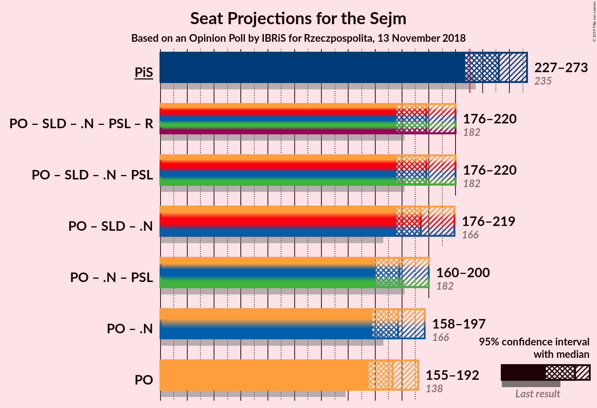

# Opinion Poll by IBRiS for Rzeczpospolita, 13 November 2018

<a href="#voting-intentions">Voting Intentions</a> | <a href="#seats">Seats</a> | <a href="#coalitions">Coalitions</a> | <a href="#technical-information">Technical Information</a>

## Voting Intentions

### Confidence Intervals

| Party | Last Result | Poll Result | 80% Confidence Interval | 90% Confidence Interval | 95% Confidence Interval | 99% Confidence Interval |
|:-----:|:-----------:|:-----------:|:-----------------------:|:-----------------------:|:-----------------------:|:-----------------------:|
| Prawo i Sprawiedliwość | 37.6% | 40.1% | 38.2–42.0% |37.7–42.6% |37.2–43.0% |36.3–43.9% |
| Platforma Obywatelska | 24.1% | 29.6% | 27.9–31.5% |27.4–32.0% |27.0–32.4% |26.2–33.3% |
| Sojusz Lewicy Demokratycznej | 7.6% | 6.2% | 5.3–7.2% |5.1–7.5% |4.9–7.8% |4.5–8.3% |
| Kukiz’15 | 8.8% | 5.6% | 4.8–6.6% |4.6–6.9% |4.4–7.2% |4.1–7.7% |
| .Nowoczesna | 7.6% | 4.7% | 4.0–5.7% |3.8–5.9% |3.6–6.2% |3.3–6.6% |
| Polskie Stronnictwo Ludowe | 5.1% | 4.0% | 3.3–4.9% |3.1–5.1% |3.0–5.3% |2.7–5.8% |
| Lewica Razem | 3.6% | 1.7% | 1.3–2.3% |1.2–2.5% |1.1–2.7% |0.9–3.0% |
| KORWiN | 4.8% | 1.0% | 0.7–1.5% |0.6–1.7% |0.6–1.8% |0.4–2.1% |

*Note:* The poll result column reflects the actual value used in the calculations. Published results may vary slightly, and in addition be rounded to fewer digits.

## Seats

### Confidence Intervals

| Party | Last Result | Median | 80% Confidence Interval | 90% Confidence Interval | 95% Confidence Interval | 99% Confidence Interval |
|:-----:|:-----------:|:------:|:-----------------------:|:-----------------------:|:-----------------------:|:-----------------------:|
| <a href="#prawo-i-sprawiedliwość">Prawo i Sprawiedliwość</a> | 235 | 252 | 236–264 |231–270 |227–273 |222–274 |
| <a href="#platforma-obywatelska">Platforma Obywatelska</a> | 138 | 173 | 159–186 |156–188 |155–192 |152–197 |
| <a href="#sojusz-lewicy-demokratycznej">Sojusz Lewicy Demokratycznej</a> | 0 | 18 | 11–30 |0–31 |0–32 |0–35 |
| <a href="#kukiz’15">Kukiz’15</a> | 42 | 10 | 0–24 |0–26 |0–29 |0–32 |
| <a href="#.nowoczesna">.Nowoczesna</a> | 28 | 0 | 0–12 |0–12 |0–14 |0–22 |
| <a href="#polskie-stronnictwo-ludowe">Polskie Stronnictwo Ludowe</a> | 16 | 0 | 0 |0–16 |0–17 |0–23 |
| <a href="#lewica-razem">Lewica Razem</a> | 0 | 0 | 0 |0 |0 |0 |
| <a href="#korwin">KORWiN</a> | 0 | 0 | 0 |0 |0 |0 |

### Prawo i Sprawiedliwość

*For a full overview of the results for this party, see the [Prawo i Sprawiedliwość](party-prawoisprawiedliwość.html) page.*

| Number of Seats | Probability | Accumulated | Special Marks |
|:---------------:|:-----------:|:-----------:|:-------------:|
| 216 | 0% | 100% |  |
| 217 | 0% | 99.9% |  |
| 218 | 0.1% | 99.9% |  |
| 219 | 0.1% | 99.8% |  |
| 220 | 0.1% | 99.7% |  |
| 221 | 0% | 99.6% |  |
| 222 | 0.4% | 99.5% |  |
| 223 | 0.2% | 99.2% |  |
| 224 | 0.2% | 99.0% |  |
| 225 | 0.5% | 98.8% |  |
| 226 | 0.5% | 98% |  |
| 227 | 1.1% | 98% |  |
| 228 | 0.3% | 97% |  |
| 229 | 0.6% | 96% |  |
| 230 | 0.2% | 96% |  |
| 231 | 0.9% | 96% | Majority |
| 232 | 1.3% | 95% |  |
| 233 | 0.7% | 93% |  |
| 234 | 1.0% | 93% |  |
| 235 | 1.1% | 92% | Last Result |
| 236 | 1.0% | 91% |  |
| 237 | 0.2% | 90% |  |
| 238 | 3% | 89% |  |
| 239 | 1.4% | 86% |  |
| 240 | 0.6% | 85% |  |
| 241 | 3% | 84% |  |
| 242 | 0.3% | 82% |  |
| 243 | 3% | 81% |  |
| 244 | 2% | 79% |  |
| 245 | 7% | 77% |  |
| 246 | 6% | 70% |  |
| 247 | 4% | 64% |  |
| 248 | 4% | 60% |  |
| 249 | 2% | 56% |  |
| 250 | 2% | 54% |  |
| 251 | 2% | 52% |  |
| 252 | 5% | 51% | Median |
| 253 | 3% | 46% |  |
| 254 | 0.8% | 42% |  |
| 255 | 1.5% | 42% |  |
| 256 | 2% | 40% |  |
| 257 | 3% | 39% |  |
| 258 | 13% | 36% |  |
| 259 | 8% | 22% |  |
| 260 | 0.8% | 14% |  |
| 261 | 0.1% | 14% |  |
| 262 | 0.2% | 14% |  |
| 263 | 2% | 13% |  |
| 264 | 4% | 11% |  |
| 265 | 0.2% | 7% |  |
| 266 | 0.5% | 7% |  |
| 267 | 0.4% | 6% |  |
| 268 | 0.1% | 6% |  |
| 269 | 0.2% | 6% |  |
| 270 | 2% | 6% |  |
| 271 | 0.1% | 3% |  |
| 272 | 0.3% | 3% |  |
| 273 | 3% | 3% |  |
| 274 | 0% | 0.5% |  |
| 275 | 0% | 0.5% |  |
| 276 | 0.1% | 0.4% |  |
| 277 | 0.1% | 0.3% |  |
| 278 | 0% | 0.1% |  |
| 279 | 0% | 0.1% |  |
| 280 | 0.1% | 0.1% |  |
| 281 | 0% | 0.1% |  |
| 282 | 0% | 0.1% |  |
| 283 | 0% | 0.1% |  |
| 284 | 0% | 0% |  |

### Platforma Obywatelska

*For a full overview of the results for this party, see the [Platforma Obywatelska](party-platformaobywatelska.html) page.*

| Number of Seats | Probability | Accumulated | Special Marks |
|:---------------:|:-----------:|:-----------:|:-------------:|
| 138 | 0% | 100% | Last Result |
| 139 | 0% | 100% |  |
| 140 | 0% | 100% |  |
| 141 | 0% | 100% |  |
| 142 | 0% | 100% |  |
| 143 | 0% | 100% |  |
| 144 | 0% | 100% |  |
| 145 | 0% | 100% |  |
| 146 | 0% | 99.9% |  |
| 147 | 0% | 99.9% |  |
| 148 | 0.1% | 99.9% |  |
| 149 | 0% | 99.8% |  |
| 150 | 0.1% | 99.8% |  |
| 151 | 0.1% | 99.7% |  |
| 152 | 0.4% | 99.6% |  |
| 153 | 0.7% | 99.1% |  |
| 154 | 0.2% | 98% |  |
| 155 | 3% | 98% |  |
| 156 | 2% | 95% |  |
| 157 | 0.3% | 93% |  |
| 158 | 0.8% | 93% |  |
| 159 | 4% | 92% |  |
| 160 | 2% | 89% |  |
| 161 | 2% | 87% |  |
| 162 | 2% | 85% |  |
| 163 | 3% | 83% |  |
| 164 | 5% | 80% |  |
| 165 | 8% | 75% |  |
| 166 | 2% | 67% |  |
| 167 | 0.5% | 66% |  |
| 168 | 6% | 65% |  |
| 169 | 0.9% | 59% |  |
| 170 | 2% | 58% |  |
| 171 | 3% | 56% |  |
| 172 | 2% | 53% |  |
| 173 | 3% | 50% | Median |
| 174 | 1.4% | 47% |  |
| 175 | 3% | 46% |  |
| 176 | 2% | 42% |  |
| 177 | 1.0% | 40% |  |
| 178 | 11% | 39% |  |
| 179 | 8% | 28% |  |
| 180 | 0.3% | 20% |  |
| 181 | 0.7% | 20% |  |
| 182 | 0.9% | 19% |  |
| 183 | 0.8% | 18% |  |
| 184 | 2% | 17% |  |
| 185 | 0.9% | 16% |  |
| 186 | 5% | 15% |  |
| 187 | 4% | 10% |  |
| 188 | 2% | 6% |  |
| 189 | 0.3% | 4% |  |
| 190 | 0.3% | 4% |  |
| 191 | 0.7% | 4% |  |
| 192 | 0.4% | 3% |  |
| 193 | 1.1% | 2% |  |
| 194 | 0.4% | 1.3% |  |
| 195 | 0.1% | 0.9% |  |
| 196 | 0.1% | 0.8% |  |
| 197 | 0.3% | 0.7% |  |
| 198 | 0.1% | 0.5% |  |
| 199 | 0.1% | 0.4% |  |
| 200 | 0.1% | 0.3% |  |
| 201 | 0% | 0.2% |  |
| 202 | 0% | 0.1% |  |
| 203 | 0% | 0.1% |  |
| 204 | 0% | 0.1% |  |
| 205 | 0% | 0.1% |  |
| 206 | 0% | 0.1% |  |
| 207 | 0% | 0% |  |

### Sojusz Lewicy Demokratycznej

*For a full overview of the results for this party, see the [Sojusz Lewicy Demokratycznej](party-sojuszlewicydemokratycznej.html) page.*

| Number of Seats | Probability | Accumulated | Special Marks |
|:---------------:|:-----------:|:-----------:|:-------------:|
| 0 | 9% | 100% | Last Result |
| 1 | 0% | 91% |  |
| 2 | 0% | 91% |  |
| 3 | 0% | 91% |  |
| 4 | 0% | 91% |  |
| 5 | 0% | 91% |  |
| 6 | 0% | 91% |  |
| 7 | 0% | 91% |  |
| 8 | 0% | 91% |  |
| 9 | 0% | 91% |  |
| 10 | 0.5% | 91% |  |
| 11 | 2% | 90% |  |
| 12 | 2% | 89% |  |
| 13 | 1.1% | 86% |  |
| 14 | 15% | 85% |  |
| 15 | 12% | 70% |  |
| 16 | 6% | 58% |  |
| 17 | 1.0% | 53% |  |
| 18 | 2% | 52% | Median |
| 19 | 4% | 50% |  |
| 20 | 2% | 46% |  |
| 21 | 1.2% | 45% |  |
| 22 | 2% | 43% |  |
| 23 | 1.4% | 42% |  |
| 24 | 5% | 40% |  |
| 25 | 2% | 35% |  |
| 26 | 4% | 33% |  |
| 27 | 5% | 29% |  |
| 28 | 3% | 24% |  |
| 29 | 7% | 21% |  |
| 30 | 5% | 15% |  |
| 31 | 6% | 9% |  |
| 32 | 2% | 3% |  |
| 33 | 0.9% | 2% |  |
| 34 | 0.1% | 0.7% |  |
| 35 | 0.1% | 0.6% |  |
| 36 | 0.2% | 0.5% |  |
| 37 | 0.1% | 0.3% |  |
| 38 | 0.1% | 0.2% |  |
| 39 | 0% | 0.1% |  |
| 40 | 0% | 0.1% |  |
| 41 | 0% | 0.1% |  |
| 42 | 0.1% | 0.1% |  |
| 43 | 0% | 0% |  |

### Kukiz’15

*For a full overview of the results for this party, see the [Kukiz’15](party-kukiz’15.html) page.*

| Number of Seats | Probability | Accumulated | Special Marks |
|:---------------:|:-----------:|:-----------:|:-------------:|
| 0 | 22% | 100% |  |
| 1 | 0% | 78% |  |
| 2 | 0% | 78% |  |
| 3 | 0% | 78% |  |
| 4 | 0% | 78% |  |
| 5 | 0% | 78% |  |
| 6 | 0% | 78% |  |
| 7 | 4% | 78% |  |
| 8 | 6% | 74% |  |
| 9 | 13% | 68% |  |
| 10 | 16% | 55% | Median |
| 11 | 3% | 39% |  |
| 12 | 2% | 36% |  |
| 13 | 4% | 34% |  |
| 14 | 2% | 30% |  |
| 15 | 1.0% | 28% |  |
| 16 | 3% | 27% |  |
| 17 | 1.1% | 25% |  |
| 18 | 1.2% | 23% |  |
| 19 | 0.7% | 22% |  |
| 20 | 7% | 22% |  |
| 21 | 0.3% | 15% |  |
| 22 | 4% | 15% |  |
| 23 | 0.7% | 11% |  |
| 24 | 2% | 10% |  |
| 25 | 1.4% | 8% |  |
| 26 | 2% | 7% |  |
| 27 | 1.0% | 5% |  |
| 28 | 0.4% | 4% |  |
| 29 | 1.1% | 3% |  |
| 30 | 0.4% | 2% |  |
| 31 | 0.3% | 2% |  |
| 32 | 0.9% | 1.3% |  |
| 33 | 0.1% | 0.4% |  |
| 34 | 0.1% | 0.3% |  |
| 35 | 0.1% | 0.2% |  |
| 36 | 0.1% | 0.2% |  |
| 37 | 0% | 0.1% |  |
| 38 | 0% | 0.1% |  |
| 39 | 0% | 0% |  |
| 40 | 0% | 0% |  |
| 41 | 0% | 0% |  |
| 42 | 0% | 0% | Last Result |

### .Nowoczesna

*For a full overview of the results for this party, see the [.Nowoczesna](party-nowoczesna.html) page.*

| Number of Seats | Probability | Accumulated | Special Marks |
|:---------------:|:-----------:|:-----------:|:-------------:|
| 0 | 55% | 100% | Median |
| 1 | 0% | 45% |  |
| 2 | 0% | 45% |  |
| 3 | 0% | 45% |  |
| 4 | 0% | 45% |  |
| 5 | 0% | 45% |  |
| 6 | 0% | 45% |  |
| 7 | 5% | 45% |  |
| 8 | 8% | 40% |  |
| 9 | 3% | 32% |  |
| 10 | 2% | 29% |  |
| 11 | 15% | 27% |  |
| 12 | 7% | 12% |  |
| 13 | 1.3% | 5% |  |
| 14 | 0.9% | 3% |  |
| 15 | 0.6% | 2% |  |
| 16 | 0.4% | 2% |  |
| 17 | 0.1% | 1.3% |  |
| 18 | 0% | 1.1% |  |
| 19 | 0.1% | 1.1% |  |
| 20 | 0% | 1.0% |  |
| 21 | 0.1% | 1.0% |  |
| 22 | 0.8% | 0.9% |  |
| 23 | 0% | 0.1% |  |
| 24 | 0% | 0.1% |  |
| 25 | 0% | 0% |  |
| 26 | 0% | 0% |  |
| 27 | 0% | 0% |  |
| 28 | 0% | 0% | Last Result |

### Polskie Stronnictwo Ludowe

*For a full overview of the results for this party, see the [Polskie Stronnictwo Ludowe](party-polskiestronnictwoludowe.html) page.*

| Number of Seats | Probability | Accumulated | Special Marks |
|:---------------:|:-----------:|:-----------:|:-------------:|
| 0 | 90% | 100% | Median |
| 1 | 0% | 10% |  |
| 2 | 0% | 10% |  |
| 3 | 0% | 10% |  |
| 4 | 0% | 10% |  |
| 5 | 0% | 10% |  |
| 6 | 0% | 10% |  |
| 7 | 0% | 10% |  |
| 8 | 0% | 10% |  |
| 9 | 0% | 10% |  |
| 10 | 0% | 10% |  |
| 11 | 0% | 10% |  |
| 12 | 0% | 10% |  |
| 13 | 0.1% | 10% |  |
| 14 | 0.8% | 10% |  |
| 15 | 3% | 9% |  |
| 16 | 0.7% | 6% | Last Result |
| 17 | 3% | 5% |  |
| 18 | 0.2% | 2% |  |
| 19 | 0.5% | 2% |  |
| 20 | 0.3% | 1.3% |  |
| 21 | 0.3% | 0.9% |  |
| 22 | 0.1% | 0.6% |  |
| 23 | 0.3% | 0.6% |  |
| 24 | 0.3% | 0.3% |  |
| 25 | 0% | 0% |  |

### Lewica Razem

*For a full overview of the results for this party, see the [Lewica Razem](party-lewicarazem.html) page.*

| Number of Seats | Probability | Accumulated | Special Marks |
|:---------------:|:-----------:|:-----------:|:-------------:|
| 0 | 100% | 100% | Last Result, Median |

### KORWiN

*For a full overview of the results for this party, see the [KORWiN](party-korwin.html) page.*

| Number of Seats | Probability | Accumulated | Special Marks |
|:---------------:|:-----------:|:-----------:|:-------------:|
| 0 | 100% | 100% | Last Result, Median |

## Coalitions

### Confidence Intervals

| Coalition | Last Result | Median | Majority? | 80% Confidence Interval | 90% Confidence Interval | 95% Confidence Interval | 99% Confidence Interval |
|:---------:|:-----------:|:------:|:---------:|:-----------------------:|:-----------------------:|:-----------------------:|:-----------------------:|
| Prawo i Sprawiedliwość | 235 | 252 | 96% | 236–264 | 231–270 | 227–273 | 222–274 |
| Platforma Obywatelska – Sojusz Lewicy Demokratycznej – .Nowoczesna – Polskie Stronnictwo Ludowe – Lewica Razem | 182 | 198 | 0.2% | 185–215 | 176–217 | 176–220 | 171–225 |
| Platforma Obywatelska – Sojusz Lewicy Demokratycznej – .Nowoczesna – Polskie Stronnictwo Ludowe | 182 | 198 | 0.2% | 185–215 | 176–217 | 176–220 | 171–225 |
| Platforma Obywatelska – Sojusz Lewicy Demokratycznej – .Nowoczesna | 166 | 194 | 0.1% | 184–212 | 176–215 | 176–219 | 169–222 |
| Platforma Obywatelska – .Nowoczesna – Polskie Stronnictwo Ludowe | 182 | 178 | 0% | 164–190 | 162–196 | 160–200 | 155–207 |
| Platforma Obywatelska – .Nowoczesna | 166 | 177 | 0% | 163–190 | 162–193 | 158–197 | 155–202 |
| Platforma Obywatelska | 138 | 173 | 0% | 159–186 | 156–188 | 155–192 | 152–197 |

### Prawo i Sprawiedliwość

| Number of Seats | Probability | Accumulated | Special Marks |
|:---------------:|:-----------:|:-----------:|:-------------:|
| 216 | 0% | 100% |  |
| 217 | 0% | 99.9% |  |
| 218 | 0.1% | 99.9% |  |
| 219 | 0.1% | 99.8% |  |
| 220 | 0.1% | 99.7% |  |
| 221 | 0% | 99.6% |  |
| 222 | 0.4% | 99.5% |  |
| 223 | 0.2% | 99.2% |  |
| 224 | 0.2% | 99.0% |  |
| 225 | 0.5% | 98.8% |  |
| 226 | 0.5% | 98% |  |
| 227 | 1.1% | 98% |  |
| 228 | 0.3% | 97% |  |
| 229 | 0.6% | 96% |  |
| 230 | 0.2% | 96% |  |
| 231 | 0.9% | 96% | Majority |
| 232 | 1.3% | 95% |  |
| 233 | 0.7% | 93% |  |
| 234 | 1.0% | 93% |  |
| 235 | 1.1% | 92% | Last Result |
| 236 | 1.0% | 91% |  |
| 237 | 0.2% | 90% |  |
| 238 | 3% | 89% |  |
| 239 | 1.4% | 86% |  |
| 240 | 0.6% | 85% |  |
| 241 | 3% | 84% |  |
| 242 | 0.3% | 82% |  |
| 243 | 3% | 81% |  |
| 244 | 2% | 79% |  |
| 245 | 7% | 77% |  |
| 246 | 6% | 70% |  |
| 247 | 4% | 64% |  |
| 248 | 4% | 60% |  |
| 249 | 2% | 56% |  |
| 250 | 2% | 54% |  |
| 251 | 2% | 52% |  |
| 252 | 5% | 51% | Median |
| 253 | 3% | 46% |  |
| 254 | 0.8% | 42% |  |
| 255 | 1.5% | 42% |  |
| 256 | 2% | 40% |  |
| 257 | 3% | 39% |  |
| 258 | 13% | 36% |  |
| 259 | 8% | 22% |  |
| 260 | 0.8% | 14% |  |
| 261 | 0.1% | 14% |  |
| 262 | 0.2% | 14% |  |
| 263 | 2% | 13% |  |
| 264 | 4% | 11% |  |
| 265 | 0.2% | 7% |  |
| 266 | 0.5% | 7% |  |
| 267 | 0.4% | 6% |  |
| 268 | 0.1% | 6% |  |
| 269 | 0.2% | 6% |  |
| 270 | 2% | 6% |  |
| 271 | 0.1% | 3% |  |
| 272 | 0.3% | 3% |  |
| 273 | 3% | 3% |  |
| 274 | 0% | 0.5% |  |
| 275 | 0% | 0.5% |  |
| 276 | 0.1% | 0.4% |  |
| 277 | 0.1% | 0.3% |  |
| 278 | 0% | 0.1% |  |
| 279 | 0% | 0.1% |  |
| 280 | 0.1% | 0.1% |  |
| 281 | 0% | 0.1% |  |
| 282 | 0% | 0.1% |  |
| 283 | 0% | 0.1% |  |
| 284 | 0% | 0% |  |

### Platforma Obywatelska – Sojusz Lewicy Demokratycznej – .Nowoczesna – Polskie Stronnictwo Ludowe – Lewica Razem

| Number of Seats | Probability | Accumulated | Special Marks |
|:---------------:|:-----------:|:-----------:|:-------------:|
| 165 | 0.1% | 100% |  |
| 166 | 0% | 99.8% |  |
| 167 | 0% | 99.8% |  |
| 168 | 0.2% | 99.8% |  |
| 169 | 0.1% | 99.6% |  |
| 170 | 0% | 99.5% |  |
| 171 | 0% | 99.5% |  |
| 172 | 0.1% | 99.5% |  |
| 173 | 0.1% | 99.4% |  |
| 174 | 0% | 99.3% |  |
| 175 | 0.1% | 99.3% |  |
| 176 | 4% | 99.1% |  |
| 177 | 0.1% | 95% |  |
| 178 | 0.2% | 95% |  |
| 179 | 0.2% | 94% |  |
| 180 | 0.6% | 94% |  |
| 181 | 0.2% | 94% |  |
| 182 | 0.5% | 93% | Last Result |
| 183 | 0.4% | 93% |  |
| 184 | 0.8% | 93% |  |
| 185 | 2% | 92% |  |
| 186 | 1.3% | 90% |  |
| 187 | 5% | 89% |  |
| 188 | 1.1% | 83% |  |
| 189 | 0.9% | 82% |  |
| 190 | 4% | 81% |  |
| 191 | 0.4% | 78% | Median |
| 192 | 11% | 78% |  |
| 193 | 8% | 66% |  |
| 194 | 4% | 58% |  |
| 195 | 2% | 54% |  |
| 196 | 0.8% | 52% |  |
| 197 | 1.0% | 51% |  |
| 198 | 3% | 50% |  |
| 199 | 3% | 47% |  |
| 200 | 2% | 44% |  |
| 201 | 3% | 41% |  |
| 202 | 4% | 38% |  |
| 203 | 3% | 34% |  |
| 204 | 2% | 31% |  |
| 205 | 6% | 29% |  |
| 206 | 1.1% | 23% |  |
| 207 | 2% | 22% |  |
| 208 | 2% | 20% |  |
| 209 | 2% | 17% |  |
| 210 | 0.4% | 16% |  |
| 211 | 2% | 15% |  |
| 212 | 0.7% | 14% |  |
| 213 | 2% | 13% |  |
| 214 | 1.2% | 12% |  |
| 215 | 4% | 10% |  |
| 216 | 0.5% | 6% |  |
| 217 | 1.0% | 5% |  |
| 218 | 0.7% | 4% |  |
| 219 | 0.6% | 4% |  |
| 220 | 0.8% | 3% |  |
| 221 | 1.2% | 2% |  |
| 222 | 0.1% | 1.2% |  |
| 223 | 0.3% | 1.1% |  |
| 224 | 0.1% | 0.8% |  |
| 225 | 0.3% | 0.7% |  |
| 226 | 0% | 0.4% |  |
| 227 | 0.1% | 0.4% |  |
| 228 | 0% | 0.3% |  |
| 229 | 0.1% | 0.3% |  |
| 230 | 0.1% | 0.2% |  |
| 231 | 0.1% | 0.2% | Majority |
| 232 | 0% | 0.1% |  |
| 233 | 0% | 0% |  |

### Platforma Obywatelska – Sojusz Lewicy Demokratycznej – .Nowoczesna – Polskie Stronnictwo Ludowe

| Number of Seats | Probability | Accumulated | Special Marks |
|:---------------:|:-----------:|:-----------:|:-------------:|
| 165 | 0.1% | 100% |  |
| 166 | 0% | 99.8% |  |
| 167 | 0% | 99.8% |  |
| 168 | 0.2% | 99.8% |  |
| 169 | 0.1% | 99.6% |  |
| 170 | 0% | 99.5% |  |
| 171 | 0% | 99.5% |  |
| 172 | 0.1% | 99.5% |  |
| 173 | 0.1% | 99.4% |  |
| 174 | 0% | 99.3% |  |
| 175 | 0.1% | 99.3% |  |
| 176 | 4% | 99.1% |  |
| 177 | 0.1% | 95% |  |
| 178 | 0.2% | 95% |  |
| 179 | 0.2% | 94% |  |
| 180 | 0.6% | 94% |  |
| 181 | 0.2% | 94% |  |
| 182 | 0.5% | 93% | Last Result |
| 183 | 0.4% | 93% |  |
| 184 | 0.8% | 93% |  |
| 185 | 2% | 92% |  |
| 186 | 1.3% | 90% |  |
| 187 | 5% | 89% |  |
| 188 | 1.1% | 83% |  |
| 189 | 0.9% | 82% |  |
| 190 | 4% | 81% |  |
| 191 | 0.4% | 78% | Median |
| 192 | 11% | 78% |  |
| 193 | 8% | 66% |  |
| 194 | 4% | 58% |  |
| 195 | 2% | 54% |  |
| 196 | 0.8% | 52% |  |
| 197 | 1.0% | 51% |  |
| 198 | 3% | 50% |  |
| 199 | 3% | 47% |  |
| 200 | 2% | 44% |  |
| 201 | 3% | 41% |  |
| 202 | 4% | 38% |  |
| 203 | 3% | 34% |  |
| 204 | 2% | 31% |  |
| 205 | 6% | 29% |  |
| 206 | 1.1% | 23% |  |
| 207 | 2% | 22% |  |
| 208 | 2% | 20% |  |
| 209 | 2% | 17% |  |
| 210 | 0.4% | 16% |  |
| 211 | 2% | 15% |  |
| 212 | 0.7% | 14% |  |
| 213 | 2% | 13% |  |
| 214 | 1.2% | 12% |  |
| 215 | 4% | 10% |  |
| 216 | 0.5% | 6% |  |
| 217 | 1.0% | 5% |  |
| 218 | 0.7% | 4% |  |
| 219 | 0.6% | 4% |  |
| 220 | 0.8% | 3% |  |
| 221 | 1.2% | 2% |  |
| 222 | 0.1% | 1.2% |  |
| 223 | 0.3% | 1.1% |  |
| 224 | 0.1% | 0.8% |  |
| 225 | 0.3% | 0.7% |  |
| 226 | 0% | 0.4% |  |
| 227 | 0.1% | 0.4% |  |
| 228 | 0% | 0.3% |  |
| 229 | 0.1% | 0.3% |  |
| 230 | 0.1% | 0.2% |  |
| 231 | 0.1% | 0.2% | Majority |
| 232 | 0% | 0.1% |  |
| 233 | 0% | 0% |  |

### Platforma Obywatelska – Sojusz Lewicy Demokratycznej – .Nowoczesna

| Number of Seats | Probability | Accumulated | Special Marks |
|:---------------:|:-----------:|:-----------:|:-------------:|
| 161 | 0.1% | 100% |  |
| 162 | 0% | 99.9% |  |
| 163 | 0% | 99.9% |  |
| 164 | 0% | 99.9% |  |
| 165 | 0.1% | 99.9% |  |
| 166 | 0% | 99.8% | Last Result |
| 167 | 0% | 99.8% |  |
| 168 | 0.2% | 99.7% |  |
| 169 | 0.1% | 99.5% |  |
| 170 | 0% | 99.5% |  |
| 171 | 0.6% | 99.5% |  |
| 172 | 0.1% | 98.9% |  |
| 173 | 0.2% | 98.8% |  |
| 174 | 0.1% | 98.7% |  |
| 175 | 0.1% | 98.6% |  |
| 176 | 4% | 98% |  |
| 177 | 0.2% | 94% |  |
| 178 | 0.2% | 94% |  |
| 179 | 0.9% | 94% |  |
| 180 | 0.8% | 93% |  |
| 181 | 0.3% | 92% |  |
| 182 | 0.5% | 92% |  |
| 183 | 0.5% | 91% |  |
| 184 | 4% | 91% |  |
| 185 | 2% | 87% |  |
| 186 | 2% | 85% |  |
| 187 | 5% | 83% |  |
| 188 | 0.6% | 78% |  |
| 189 | 0.8% | 77% |  |
| 190 | 4% | 77% |  |
| 191 | 0.7% | 73% | Median |
| 192 | 11% | 72% |  |
| 193 | 8% | 61% |  |
| 194 | 4% | 53% |  |
| 195 | 2% | 49% |  |
| 196 | 0.8% | 47% |  |
| 197 | 2% | 46% |  |
| 198 | 4% | 44% |  |
| 199 | 0.7% | 40% |  |
| 200 | 2% | 39% |  |
| 201 | 4% | 37% |  |
| 202 | 4% | 33% |  |
| 203 | 3% | 30% |  |
| 204 | 2% | 27% |  |
| 205 | 6% | 25% |  |
| 206 | 1.0% | 19% |  |
| 207 | 2% | 18% |  |
| 208 | 2% | 16% |  |
| 209 | 1.4% | 14% |  |
| 210 | 0.2% | 12% |  |
| 211 | 2% | 12% |  |
| 212 | 0.7% | 11% |  |
| 213 | 2% | 10% |  |
| 214 | 0.3% | 8% |  |
| 215 | 3% | 8% |  |
| 216 | 0.4% | 5% |  |
| 217 | 0.8% | 4% |  |
| 218 | 0.7% | 3% |  |
| 219 | 0.6% | 3% |  |
| 220 | 0.7% | 2% |  |
| 221 | 1.0% | 1.5% |  |
| 222 | 0.1% | 0.5% |  |
| 223 | 0% | 0.4% |  |
| 224 | 0.1% | 0.4% |  |
| 225 | 0.1% | 0.3% |  |
| 226 | 0% | 0.2% |  |
| 227 | 0% | 0.2% |  |
| 228 | 0% | 0.2% |  |
| 229 | 0% | 0.1% |  |
| 230 | 0% | 0.1% |  |
| 231 | 0.1% | 0.1% | Majority |
| 232 | 0% | 0% |  |

### Platforma Obywatelska – .Nowoczesna – Polskie Stronnictwo Ludowe

| Number of Seats | Probability | Accumulated | Special Marks |
|:---------------:|:-----------:|:-----------:|:-------------:|
| 150 | 0% | 100% |  |
| 151 | 0% | 99.9% |  |
| 152 | 0.1% | 99.9% |  |
| 153 | 0% | 99.8% |  |
| 154 | 0.1% | 99.8% |  |
| 155 | 1.0% | 99.7% |  |
| 156 | 0.4% | 98.7% |  |
| 157 | 0.2% | 98% |  |
| 158 | 0.5% | 98% |  |
| 159 | 0% | 98% |  |
| 160 | 1.0% | 98% |  |
| 161 | 0.5% | 97% |  |
| 162 | 3% | 96% |  |
| 163 | 3% | 93% |  |
| 164 | 2% | 90% |  |
| 165 | 0.6% | 89% |  |
| 166 | 1.4% | 88% |  |
| 167 | 0.9% | 87% |  |
| 168 | 1.1% | 86% |  |
| 169 | 0.6% | 85% |  |
| 170 | 3% | 84% |  |
| 171 | 4% | 81% |  |
| 172 | 0.9% | 77% |  |
| 173 | 3% | 76% | Median |
| 174 | 2% | 74% |  |
| 175 | 4% | 72% |  |
| 176 | 6% | 68% |  |
| 177 | 7% | 61% |  |
| 178 | 11% | 55% |  |
| 179 | 2% | 44% |  |
| 180 | 4% | 41% |  |
| 181 | 0.4% | 37% |  |
| 182 | 2% | 37% | Last Result |
| 183 | 3% | 35% |  |
| 184 | 1.2% | 33% |  |
| 185 | 2% | 31% |  |
| 186 | 5% | 29% |  |
| 187 | 4% | 24% |  |
| 188 | 2% | 20% |  |
| 189 | 2% | 18% |  |
| 190 | 7% | 16% |  |
| 191 | 0.8% | 9% |  |
| 192 | 0.5% | 8% |  |
| 193 | 1.1% | 7% |  |
| 194 | 0.5% | 6% |  |
| 195 | 0.6% | 6% |  |
| 196 | 0.8% | 5% |  |
| 197 | 1.0% | 4% |  |
| 198 | 0.1% | 3% |  |
| 199 | 0.3% | 3% |  |
| 200 | 0.7% | 3% |  |
| 201 | 0.2% | 2% |  |
| 202 | 0.8% | 2% |  |
| 203 | 0.3% | 1.3% |  |
| 204 | 0.1% | 1.0% |  |
| 205 | 0% | 0.9% |  |
| 206 | 0.3% | 0.8% |  |
| 207 | 0.1% | 0.5% |  |
| 208 | 0.1% | 0.4% |  |
| 209 | 0.3% | 0.4% |  |
| 210 | 0% | 0.1% |  |
| 211 | 0% | 0.1% |  |
| 212 | 0% | 0.1% |  |
| 213 | 0% | 0.1% |  |
| 214 | 0% | 0% |  |

### Platforma Obywatelska – .Nowoczesna

| Number of Seats | Probability | Accumulated | Special Marks |
|:---------------:|:-----------:|:-----------:|:-------------:|
| 149 | 0% | 100% |  |
| 150 | 0% | 99.9% |  |
| 151 | 0% | 99.9% |  |
| 152 | 0.1% | 99.9% |  |
| 153 | 0% | 99.8% |  |
| 154 | 0.1% | 99.8% |  |
| 155 | 1.0% | 99.7% |  |
| 156 | 0.4% | 98.7% |  |
| 157 | 0.3% | 98% |  |
| 158 | 0.5% | 98% |  |
| 159 | 0.1% | 97% |  |
| 160 | 1.3% | 97% |  |
| 161 | 0.5% | 96% |  |
| 162 | 3% | 95% |  |
| 163 | 3% | 93% |  |
| 164 | 2% | 90% |  |
| 165 | 4% | 88% |  |
| 166 | 2% | 84% | Last Result |
| 167 | 0.9% | 82% |  |
| 168 | 2% | 81% |  |
| 169 | 0.6% | 79% |  |
| 170 | 3% | 79% |  |
| 171 | 5% | 76% |  |
| 172 | 2% | 71% |  |
| 173 | 3% | 69% | Median |
| 174 | 2% | 66% |  |
| 175 | 4% | 64% |  |
| 176 | 6% | 60% |  |
| 177 | 7% | 54% |  |
| 178 | 11% | 47% |  |
| 179 | 2% | 36% |  |
| 180 | 2% | 34% |  |
| 181 | 0.4% | 32% |  |
| 182 | 2% | 32% |  |
| 183 | 2% | 30% |  |
| 184 | 1.4% | 28% |  |
| 185 | 1.2% | 26% |  |
| 186 | 5% | 25% |  |
| 187 | 4% | 20% |  |
| 188 | 2% | 16% |  |
| 189 | 0.8% | 15% |  |
| 190 | 7% | 14% |  |
| 191 | 0.4% | 7% |  |
| 192 | 0.7% | 6% |  |
| 193 | 0.9% | 6% |  |
| 194 | 0.4% | 5% |  |
| 195 | 0.4% | 4% |  |
| 196 | 0.6% | 4% |  |
| 197 | 1.0% | 3% |  |
| 198 | 0% | 2% |  |
| 199 | 0.2% | 2% |  |
| 200 | 0.7% | 2% |  |
| 201 | 0.2% | 1.4% |  |
| 202 | 0.8% | 1.1% |  |
| 203 | 0% | 0.4% |  |
| 204 | 0.1% | 0.3% |  |
| 205 | 0% | 0.3% |  |
| 206 | 0% | 0.3% |  |
| 207 | 0.1% | 0.2% |  |
| 208 | 0% | 0.1% |  |
| 209 | 0.1% | 0.1% |  |
| 210 | 0% | 0% |  |

### Platforma Obywatelska

| Number of Seats | Probability | Accumulated | Special Marks |
|:---------------:|:-----------:|:-----------:|:-------------:|
| 138 | 0% | 100% | Last Result |
| 139 | 0% | 100% |  |
| 140 | 0% | 100% |  |
| 141 | 0% | 100% |  |
| 142 | 0% | 100% |  |
| 143 | 0% | 100% |  |
| 144 | 0% | 100% |  |
| 145 | 0% | 100% |  |
| 146 | 0% | 99.9% |  |
| 147 | 0% | 99.9% |  |
| 148 | 0.1% | 99.9% |  |
| 149 | 0% | 99.8% |  |
| 150 | 0.1% | 99.8% |  |
| 151 | 0.1% | 99.7% |  |
| 152 | 0.4% | 99.6% |  |
| 153 | 0.7% | 99.1% |  |
| 154 | 0.2% | 98% |  |
| 155 | 3% | 98% |  |
| 156 | 2% | 95% |  |
| 157 | 0.3% | 93% |  |
| 158 | 0.8% | 93% |  |
| 159 | 4% | 92% |  |
| 160 | 2% | 89% |  |
| 161 | 2% | 87% |  |
| 162 | 2% | 85% |  |
| 163 | 3% | 83% |  |
| 164 | 5% | 80% |  |
| 165 | 8% | 75% |  |
| 166 | 2% | 67% |  |
| 167 | 0.5% | 66% |  |
| 168 | 6% | 65% |  |
| 169 | 0.9% | 59% |  |
| 170 | 2% | 58% |  |
| 171 | 3% | 56% |  |
| 172 | 2% | 53% |  |
| 173 | 3% | 50% | Median |
| 174 | 1.4% | 47% |  |
| 175 | 3% | 46% |  |
| 176 | 2% | 42% |  |
| 177 | 1.0% | 40% |  |
| 178 | 11% | 39% |  |
| 179 | 8% | 28% |  |
| 180 | 0.3% | 20% |  |
| 181 | 0.7% | 20% |  |
| 182 | 0.9% | 19% |  |
| 183 | 0.8% | 18% |  |
| 184 | 2% | 17% |  |
| 185 | 0.9% | 16% |  |
| 186 | 5% | 15% |  |
| 187 | 4% | 10% |  |
| 188 | 2% | 6% |  |
| 189 | 0.3% | 4% |  |
| 190 | 0.3% | 4% |  |
| 191 | 0.7% | 4% |  |
| 192 | 0.4% | 3% |  |
| 193 | 1.1% | 2% |  |
| 194 | 0.4% | 1.3% |  |
| 195 | 0.1% | 0.9% |  |
| 196 | 0.1% | 0.8% |  |
| 197 | 0.3% | 0.7% |  |
| 198 | 0.1% | 0.5% |  |
| 199 | 0.1% | 0.4% |  |
| 200 | 0.1% | 0.3% |  |
| 201 | 0% | 0.2% |  |
| 202 | 0% | 0.1% |  |
| 203 | 0% | 0.1% |  |
| 204 | 0% | 0.1% |  |
| 205 | 0% | 0.1% |  |
| 206 | 0% | 0.1% |  |
| 207 | 0% | 0% |  |

## Technical Information

### Opinion Poll

+ **Polling firm:** IBRiS
+ **Commissioner(s):** Rzeczpospolita
+ **Fieldwork period:** 13 November 2018

### Calculations

+ **Sample size:** 1100
+ **Simulations done:** 131,072
+ **Error estimate:** 1.86%

