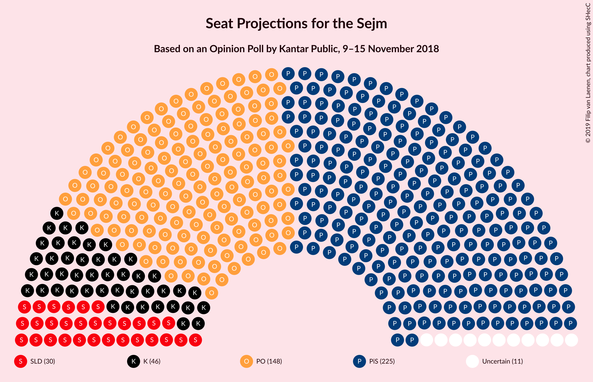

# Opinion Poll by Kantar Public, 9–15 November 2018

<a href="#voting-intentions">Voting Intentions</a> | <a href="#seats">Seats</a> | <a href="#coalitions">Coalitions</a> | <a href="#technical-information">Technical Information</a>

## Voting Intentions

### Confidence Intervals

| Party | Last Result | Poll Result | 80% Confidence Interval | 90% Confidence Interval | 95% Confidence Interval | 99% Confidence Interval |
|:-----:|:-----------:|:-----------:|:-----------------------:|:-----------------------:|:-----------------------:|:-----------------------:|
| Prawo i Sprawiedliwość | 37.6% | 34.0% | 32.1–35.9% |31.6–36.5% |31.1–36.9% |30.3–37.9% |
| Platforma Obywatelska | 24.1% | 24.0% | 22.4–25.8% |21.9–26.3% |21.5–26.7% |20.7–27.6% |
| Kukiz’15 | 8.8% | 9.0% | 7.9–10.2% |7.6–10.6% |7.4–10.9% |6.9–11.5% |
| Sojusz Lewicy Demokratycznej | 7.6% | 7.0% | 6.1–8.2% |5.8–8.5% |5.6–8.8% |5.2–9.3% |
| Polskie Stronnictwo Ludowe | 5.1% | 5.0% | 4.2–6.0% |4.0–6.2% |3.8–6.5% |3.5–7.0% |
| KORWiN | 4.8% | 2.0% | 1.5–2.6% |1.4–2.8% |1.3–3.0% |1.1–3.4% |
| Lewica Razem | 3.6% | 2.0% | 1.5–2.6% |1.4–2.8% |1.3–3.0% |1.1–3.4% |

*Note:* The poll result column reflects the actual value used in the calculations. Published results may vary slightly, and in addition be rounded to fewer digits.

## Seats

### Confidence Intervals

| Party | Last Result | Median | 80% Confidence Interval | 90% Confidence Interval | 95% Confidence Interval | 99% Confidence Interval |
|:-----:|:-----------:|:------:|:-----------------------:|:-----------------------:|:-----------------------:|:-----------------------:|
| <a href="#prawo-i-sprawiedliwość">Prawo i Sprawiedliwość</a> | 235 | 226 | 226–228 |218–228 |218–228 |213–230 |
| <a href="#platforma-obywatelska">Platforma Obywatelska</a> | 138 | 157 | 156–157 |146–157 |144–157 |144–159 |
| <a href="#kukiz’15">Kukiz’15</a> | 42 | 49 | 48–49 |48–58 |43–59 |28–61 |
| <a href="#sojusz-lewicy-demokratycznej">Sojusz Lewicy Demokratycznej</a> | 0 | 28 | 28 |28–39 |28–39 |27–40 |
| <a href="#polskie-stronnictwo-ludowe">Polskie Stronnictwo Ludowe</a> | 16 | 0 | 0 |0 |0 |0–23 |
| <a href="#korwin">KORWiN</a> | 0 | 0 | 0 |0 |0 |0 |
| <a href="#lewica-razem">Lewica Razem</a> | 0 | 0 | 0 |0 |0 |0 |

### Prawo i Sprawiedliwość

*For a full overview of the results for this party, see the [Prawo i Sprawiedliwość](party-prawoisprawiedliwość.html) page.*

| Number of Seats | Probability | Accumulated | Special Marks |
|:---------------:|:-----------:|:-----------:|:-------------:|
| 213 | 0.5% | 100% |  |
| 214 | 0% | 99.5% |  |
| 215 | 0.5% | 99.5% |  |
| 216 | 0.1% | 98.9% |  |
| 217 | 0% | 98.8% |  |
| 218 | 4% | 98.8% |  |
| 219 | 0.3% | 94% |  |
| 220 | 0.3% | 94% |  |
| 221 | 0% | 94% |  |
| 222 | 0% | 94% |  |
| 223 | 1.0% | 94% |  |
| 224 | 0.1% | 93% |  |
| 225 | 0.5% | 93% |  |
| 226 | 67% | 92% | Median |
| 227 | 0.1% | 25% |  |
| 228 | 24% | 25% |  |
| 229 | 0% | 1.5% |  |
| 230 | 1.0% | 1.5% |  |
| 231 | 0.1% | 0.5% | Majority |
| 232 | 0% | 0.4% |  |
| 233 | 0.1% | 0.4% |  |
| 234 | 0.2% | 0.3% |  |
| 235 | 0% | 0% | Last Result |

### Platforma Obywatelska

*For a full overview of the results for this party, see the [Platforma Obywatelska](party-platformaobywatelska.html) page.*

| Number of Seats | Probability | Accumulated | Special Marks |
|:---------------:|:-----------:|:-----------:|:-------------:|
| 138 | 0% | 100% | Last Result |
| 139 | 0% | 100% |  |
| 140 | 0% | 100% |  |
| 141 | 0% | 100% |  |
| 142 | 0% | 100% |  |
| 143 | 0% | 100% |  |
| 144 | 5% | 100% |  |
| 145 | 0% | 95% |  |
| 146 | 0.7% | 95% |  |
| 147 | 0% | 94% |  |
| 148 | 0% | 94% |  |
| 149 | 0% | 94% |  |
| 150 | 0.1% | 94% |  |
| 151 | 0% | 94% |  |
| 152 | 0% | 94% |  |
| 153 | 0% | 94% |  |
| 154 | 0% | 94% |  |
| 155 | 0.6% | 94% |  |
| 156 | 25% | 94% |  |
| 157 | 67% | 69% | Median |
| 158 | 0% | 2% |  |
| 159 | 2% | 2% |  |
| 160 | 0.2% | 0.4% |  |
| 161 | 0.2% | 0.2% |  |
| 162 | 0% | 0% |  |

### Kukiz’15

*For a full overview of the results for this party, see the [Kukiz’15](party-kukiz’15.html) page.*

| Number of Seats | Probability | Accumulated | Special Marks |
|:---------------:|:-----------:|:-----------:|:-------------:|
| 28 | 0.8% | 100% |  |
| 29 | 0% | 99.2% |  |
| 30 | 0% | 99.2% |  |
| 31 | 0% | 99.2% |  |
| 32 | 0.5% | 99.2% |  |
| 33 | 0% | 98.7% |  |
| 34 | 0% | 98.7% |  |
| 35 | 0% | 98.7% |  |
| 36 | 0.2% | 98.7% |  |
| 37 | 0% | 98% |  |
| 38 | 0% | 98% |  |
| 39 | 0.2% | 98% |  |
| 40 | 0.1% | 98% |  |
| 41 | 0% | 98% |  |
| 42 | 0% | 98% | Last Result |
| 43 | 2% | 98% |  |
| 44 | 0.5% | 97% |  |
| 45 | 0% | 96% |  |
| 46 | 0% | 96% |  |
| 47 | 0.1% | 96% |  |
| 48 | 24% | 96% |  |
| 49 | 67% | 72% | Median |
| 50 | 0% | 5% |  |
| 51 | 0% | 5% |  |
| 52 | 0% | 5% |  |
| 53 | 0% | 5% |  |
| 54 | 0% | 5% |  |
| 55 | 0% | 5% |  |
| 56 | 0% | 5% |  |
| 57 | 0% | 5% |  |
| 58 | 0.2% | 5% |  |
| 59 | 4% | 5% |  |
| 60 | 0% | 0.5% |  |
| 61 | 0.5% | 0.5% |  |
| 62 | 0% | 0% |  |

### Sojusz Lewicy Demokratycznej

*For a full overview of the results for this party, see the [Sojusz Lewicy Demokratycznej](party-sojuszlewicydemokratycznej.html) page.*

| Number of Seats | Probability | Accumulated | Special Marks |
|:---------------:|:-----------:|:-----------:|:-------------:|
| 0 | 0% | 100% | Last Result |
| 1 | 0% | 100% |  |
| 2 | 0% | 100% |  |
| 3 | 0% | 100% |  |
| 4 | 0% | 100% |  |
| 5 | 0% | 100% |  |
| 6 | 0% | 100% |  |
| 7 | 0% | 100% |  |
| 8 | 0% | 100% |  |
| 9 | 0% | 100% |  |
| 10 | 0% | 100% |  |
| 11 | 0% | 100% |  |
| 12 | 0% | 100% |  |
| 13 | 0% | 100% |  |
| 14 | 0% | 99.9% |  |
| 15 | 0% | 99.9% |  |
| 16 | 0% | 99.9% |  |
| 17 | 0% | 99.9% |  |
| 18 | 0% | 99.9% |  |
| 19 | 0% | 99.9% |  |
| 20 | 0% | 99.9% |  |
| 21 | 0% | 99.9% |  |
| 22 | 0% | 99.9% |  |
| 23 | 0% | 99.9% |  |
| 24 | 0% | 99.9% |  |
| 25 | 0% | 99.9% |  |
| 26 | 0% | 99.9% |  |
| 27 | 1.1% | 99.9% |  |
| 28 | 91% | 98.8% | Median |
| 29 | 0.8% | 7% |  |
| 30 | 0% | 7% |  |
| 31 | 0% | 7% |  |
| 32 | 0% | 7% |  |
| 33 | 0% | 7% |  |
| 34 | 0.2% | 7% |  |
| 35 | 0% | 6% |  |
| 36 | 0.7% | 6% |  |
| 37 | 0.5% | 6% |  |
| 38 | 0.1% | 5% |  |
| 39 | 4% | 5% |  |
| 40 | 0.5% | 0.8% |  |
| 41 | 0% | 0.2% |  |
| 42 | 0% | 0.2% |  |
| 43 | 0% | 0.2% |  |
| 44 | 0.1% | 0.2% |  |
| 45 | 0.1% | 0.1% |  |
| 46 | 0% | 0% |  |

### Polskie Stronnictwo Ludowe

*For a full overview of the results for this party, see the [Polskie Stronnictwo Ludowe](party-polskiestronnictwoludowe.html) page.*

| Number of Seats | Probability | Accumulated | Special Marks |
|:---------------:|:-----------:|:-----------:|:-------------:|
| 0 | 98% | 100% | Median |
| 1 | 0% | 2% |  |
| 2 | 0% | 2% |  |
| 3 | 0% | 2% |  |
| 4 | 0% | 2% |  |
| 5 | 0% | 2% |  |
| 6 | 0% | 2% |  |
| 7 | 0% | 2% |  |
| 8 | 0% | 2% |  |
| 9 | 0% | 2% |  |
| 10 | 0% | 2% |  |
| 11 | 0% | 2% |  |
| 12 | 0% | 2% |  |
| 13 | 0% | 2% |  |
| 14 | 0% | 2% |  |
| 15 | 0% | 2% |  |
| 16 | 0% | 2% | Last Result |
| 17 | 0% | 2% |  |
| 18 | 0% | 2% |  |
| 19 | 0% | 2% |  |
| 20 | 0.1% | 2% |  |
| 21 | 0.5% | 2% |  |
| 22 | 0% | 1.2% |  |
| 23 | 0.8% | 1.2% |  |
| 24 | 0.3% | 0.3% |  |
| 25 | 0% | 0% |  |

### KORWiN

*For a full overview of the results for this party, see the [KORWiN](party-korwin.html) page.*

| Number of Seats | Probability | Accumulated | Special Marks |
|:---------------:|:-----------:|:-----------:|:-------------:|
| 0 | 100% | 100% | Last Result, Median |

### Lewica Razem

*For a full overview of the results for this party, see the [Lewica Razem](party-lewicarazem.html) page.*

| Number of Seats | Probability | Accumulated | Special Marks |
|:---------------:|:-----------:|:-----------:|:-------------:|
| 0 | 100% | 100% | Last Result, Median |

## Coalitions

### Confidence Intervals

| Coalition | Last Result | Median | Majority? | 80% Confidence Interval | 90% Confidence Interval | 95% Confidence Interval | 99% Confidence Interval |
|:---------:|:-----------:|:------:|:---------:|:-----------------------:|:-----------------------:|:-----------------------:|:-----------------------:|
| Prawo i Sprawiedliwość | 235 | 226 | 0.5% | 226–228 | 218–228 | 218–228 | 213–230 |
| Platforma Obywatelska | 138 | 157 | 0% | 156–157 | 146–157 | 144–157 | 144–159 |

### Prawo i Sprawiedliwość

| Number of Seats | Probability | Accumulated | Special Marks |
|:---------------:|:-----------:|:-----------:|:-------------:|
| 213 | 0.5% | 100% |  |
| 214 | 0% | 99.5% |  |
| 215 | 0.5% | 99.5% |  |
| 216 | 0.1% | 98.9% |  |
| 217 | 0% | 98.8% |  |
| 218 | 4% | 98.8% |  |
| 219 | 0.3% | 94% |  |
| 220 | 0.3% | 94% |  |
| 221 | 0% | 94% |  |
| 222 | 0% | 94% |  |
| 223 | 1.0% | 94% |  |
| 224 | 0.1% | 93% |  |
| 225 | 0.5% | 93% |  |
| 226 | 67% | 92% | Median |
| 227 | 0.1% | 25% |  |
| 228 | 24% | 25% |  |
| 229 | 0% | 1.5% |  |
| 230 | 1.0% | 1.5% |  |
| 231 | 0.1% | 0.5% | Majority |
| 232 | 0% | 0.4% |  |
| 233 | 0.1% | 0.4% |  |
| 234 | 0.2% | 0.3% |  |
| 235 | 0% | 0% | Last Result |

### Platforma Obywatelska

| Number of Seats | Probability | Accumulated | Special Marks |
|:---------------:|:-----------:|:-----------:|:-------------:|
| 138 | 0% | 100% | Last Result |
| 139 | 0% | 100% |  |
| 140 | 0% | 100% |  |
| 141 | 0% | 100% |  |
| 142 | 0% | 100% |  |
| 143 | 0% | 100% |  |
| 144 | 5% | 100% |  |
| 145 | 0% | 95% |  |
| 146 | 0.7% | 95% |  |
| 147 | 0% | 94% |  |
| 148 | 0% | 94% |  |
| 149 | 0% | 94% |  |
| 150 | 0.1% | 94% |  |
| 151 | 0% | 94% |  |
| 152 | 0% | 94% |  |
| 153 | 0% | 94% |  |
| 154 | 0% | 94% |  |
| 155 | 0.6% | 94% |  |
| 156 | 25% | 94% |  |
| 157 | 67% | 69% | Median |
| 158 | 0% | 2% |  |
| 159 | 2% | 2% |  |
| 160 | 0.2% | 0.4% |  |
| 161 | 0.2% | 0.2% |  |
| 162 | 0% | 0% |  |

## Technical Information

### Opinion Poll

+ **Polling firm:** Kantar Public
+ **Commissioner(s):** —
+ **Fieldwork period:** 9–15 November 2018

### Calculations

+ **Sample size:** 1024
+ **Simulations done:** 1,024
+ **Error estimate:** 1.25%

