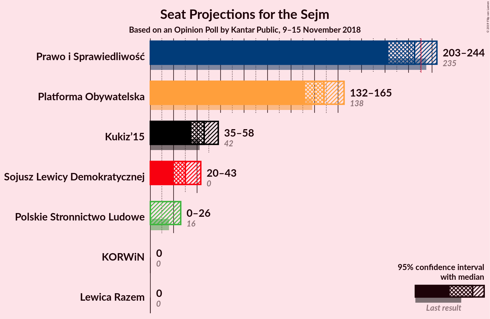
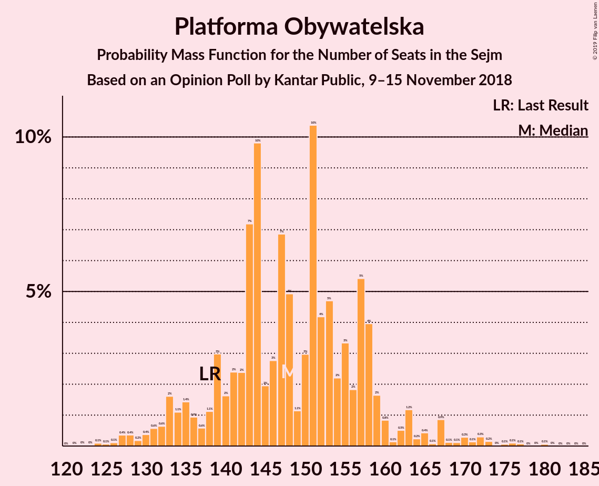
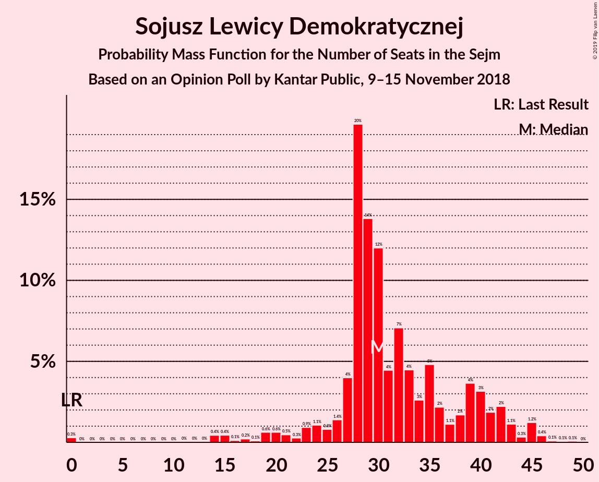
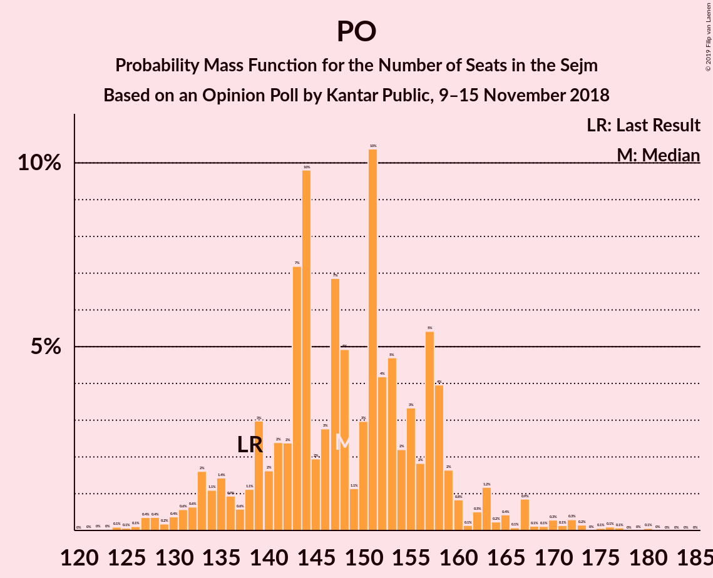

# Opinion Poll by Kantar Public, 9–15 November 2018

<a href="#voting-intentions">Voting Intentions</a> | <a href="#seats">Seats</a> | <a href="#coalitions">Coalitions</a> | <a href="#technical-information">Technical Information</a>

## Voting Intentions

### Confidence Intervals

| Party | Last Result | Poll Result | 80% Confidence Interval | 90% Confidence Interval | 95% Confidence Interval | 99% Confidence Interval |
|:-----:|:-----------:|:-----------:|:-----------------------:|:-----------------------:|:-----------------------:|:-----------------------:|
| Prawo i Sprawiedliwość | 37.6% | 34.0% | 32.1–35.9% |31.6–36.5% |31.1–36.9% |30.3–37.9% |
| Platforma Obywatelska | 24.1% | 24.0% | 22.4–25.8% |21.9–26.3% |21.5–26.7% |20.7–27.6% |
| Kukiz’15 | 8.8% | 9.0% | 7.9–10.2% |7.6–10.6% |7.4–10.9% |6.9–11.5% |
| Sojusz Lewicy Demokratycznej | 7.6% | 7.0% | 6.1–8.2% |5.8–8.5% |5.6–8.8% |5.2–9.3% |
| Polskie Stronnictwo Ludowe | 5.1% | 5.0% | 4.2–6.0% |4.0–6.2% |3.8–6.5% |3.5–7.0% |
| KORWiN | 4.8% | 2.0% | 1.5–2.6% |1.4–2.8% |1.3–3.0% |1.1–3.4% |
| Lewica Razem | 3.6% | 2.0% | 1.5–2.6% |1.4–2.8% |1.3–3.0% |1.1–3.4% |

*Note:* The poll result column reflects the actual value used in the calculations. Published results may vary slightly, and in addition be rounded to fewer digits.

## Seats

### Confidence Intervals

| Party | Last Result | Median | 80% Confidence Interval | 90% Confidence Interval | 95% Confidence Interval | 99% Confidence Interval |
|:-----:|:-----------:|:------:|:-----------------------:|:-----------------------:|:-----------------------:|:-----------------------:|
| <a href="#prawo-i-sprawiedliwość">Prawo i Sprawiedliwość</a> | 235 | 225 | 210–239 |206–243 |203–244 |197–248 |
| <a href="#platforma-obywatelska">Platforma Obywatelska</a> | 138 | 148 | 139–158 |134–160 |132–165 |127–173 |
| <a href="#kukiz’15">Kukiz’15</a> | 42 | 46 | 41–52 |37–53 |35–58 |31–62 |
| <a href="#sojusz-lewicy-demokratycznej">Sojusz Lewicy Demokratycznej</a> | 0 | 30 | 27–40 |24–42 |20–43 |14–46 |
| <a href="#polskie-stronnictwo-ludowe">Polskie Stronnictwo Ludowe</a> | 16 | 0 | 0–23 |0–24 |0–26 |0–28 |
| <a href="#korwin">KORWiN</a> | 0 | 0 | 0 |0 |0 |0 |
| <a href="#lewica-razem">Lewica Razem</a> | 0 | 0 | 0 |0 |0 |0 |

### Prawo i Sprawiedliwość

*For a full overview of the results for this party, see the [Prawo i Sprawiedliwość](party-prawoisprawiedliwość.html) page.*

| Number of Seats | Probability | Accumulated | Special Marks |
|:---------------:|:-----------:|:-----------:|:-------------:|
| 192 | 0.1% | 100% |  |
| 193 | 0% | 99.9% |  |
| 194 | 0.2% | 99.8% |  |
| 195 | 0% | 99.6% |  |
| 196 | 0.1% | 99.6% |  |
| 197 | 0.3% | 99.6% |  |
| 198 | 0.2% | 99.2% |  |
| 199 | 0.3% | 99.1% |  |
| 200 | 0.4% | 98.8% |  |
| 201 | 0.3% | 98% |  |
| 202 | 0.5% | 98% |  |
| 203 | 0.2% | 98% |  |
| 204 | 0.5% | 97% |  |
| 205 | 0.5% | 97% |  |
| 206 | 2% | 96% |  |
| 207 | 2% | 94% |  |
| 208 | 0.3% | 93% |  |
| 209 | 2% | 93% |  |
| 210 | 5% | 91% |  |
| 211 | 0.3% | 86% |  |
| 212 | 0.6% | 86% |  |
| 213 | 5% | 85% |  |
| 214 | 2% | 80% |  |
| 215 | 5% | 79% |  |
| 216 | 2% | 73% |  |
| 217 | 3% | 71% |  |
| 218 | 4% | 68% |  |
| 219 | 1.0% | 65% |  |
| 220 | 2% | 64% |  |
| 221 | 4% | 61% |  |
| 222 | 2% | 58% |  |
| 223 | 3% | 56% |  |
| 224 | 1.4% | 53% |  |
| 225 | 5% | 52% | Median |
| 226 | 5% | 47% |  |
| 227 | 1.1% | 42% |  |
| 228 | 5% | 41% |  |
| 229 | 3% | 35% |  |
| 230 | 1.4% | 32% |  |
| 231 | 2% | 31% | Majority |
| 232 | 4% | 28% |  |
| 233 | 1.0% | 24% |  |
| 234 | 2% | 23% |  |
| 235 | 2% | 21% | Last Result |
| 236 | 5% | 19% |  |
| 237 | 1.3% | 14% |  |
| 238 | 2% | 13% |  |
| 239 | 4% | 11% |  |
| 240 | 0.7% | 7% |  |
| 241 | 0.3% | 6% |  |
| 242 | 0.5% | 6% |  |
| 243 | 1.3% | 6% |  |
| 244 | 3% | 4% |  |
| 245 | 0.4% | 2% |  |
| 246 | 0.6% | 1.5% |  |
| 247 | 0.1% | 0.9% |  |
| 248 | 0.3% | 0.7% |  |
| 249 | 0% | 0.4% |  |
| 250 | 0.1% | 0.4% |  |
| 251 | 0.1% | 0.2% |  |
| 252 | 0.1% | 0.1% |  |
| 253 | 0% | 0.1% |  |
| 254 | 0% | 0.1% |  |
| 255 | 0% | 0.1% |  |
| 256 | 0% | 0.1% |  |
| 257 | 0% | 0% |  |

### Platforma Obywatelska

*For a full overview of the results for this party, see the [Platforma Obywatelska](party-platformaobywatelska.html) page.*

| Number of Seats | Probability | Accumulated | Special Marks |
|:---------------:|:-----------:|:-----------:|:-------------:|
| 122 | 0% | 100% |  |
| 123 | 0% | 99.9% |  |
| 124 | 0.1% | 99.9% |  |
| 125 | 0.1% | 99.8% |  |
| 126 | 0.1% | 99.8% |  |
| 127 | 0.4% | 99.6% |  |
| 128 | 0.4% | 99.3% |  |
| 129 | 0.2% | 98.9% |  |
| 130 | 0.4% | 98.8% |  |
| 131 | 0.6% | 98% |  |
| 132 | 0.6% | 98% |  |
| 133 | 2% | 97% |  |
| 134 | 1.1% | 96% |  |
| 135 | 1.4% | 94% |  |
| 136 | 0.9% | 93% |  |
| 137 | 0.6% | 92% |  |
| 138 | 1.1% | 92% | Last Result |
| 139 | 3% | 90% |  |
| 140 | 2% | 87% |  |
| 141 | 2% | 86% |  |
| 142 | 2% | 83% |  |
| 143 | 7% | 81% |  |
| 144 | 10% | 74% |  |
| 145 | 2% | 64% |  |
| 146 | 3% | 62% |  |
| 147 | 7% | 59% |  |
| 148 | 5% | 52% | Median |
| 149 | 1.1% | 47% |  |
| 150 | 3% | 46% |  |
| 151 | 10% | 43% |  |
| 152 | 4% | 33% |  |
| 153 | 5% | 29% |  |
| 154 | 2% | 24% |  |
| 155 | 3% | 22% |  |
| 156 | 2% | 19% |  |
| 157 | 5% | 17% |  |
| 158 | 4% | 11% |  |
| 159 | 2% | 7% |  |
| 160 | 0.8% | 6% |  |
| 161 | 0.1% | 5% |  |
| 162 | 0.5% | 5% |  |
| 163 | 1.2% | 4% |  |
| 164 | 0.2% | 3% |  |
| 165 | 0.4% | 3% |  |
| 166 | 0.1% | 2% |  |
| 167 | 0.9% | 2% |  |
| 168 | 0.1% | 1.5% |  |
| 169 | 0.1% | 1.3% |  |
| 170 | 0.3% | 1.2% |  |
| 171 | 0.1% | 0.9% |  |
| 172 | 0.3% | 0.8% |  |
| 173 | 0.2% | 0.5% |  |
| 174 | 0% | 0.4% |  |
| 175 | 0.1% | 0.3% |  |
| 176 | 0.1% | 0.3% |  |
| 177 | 0.1% | 0.2% |  |
| 178 | 0% | 0.1% |  |
| 179 | 0% | 0.1% |  |
| 180 | 0.1% | 0.1% |  |
| 181 | 0% | 0% |  |

### Kukiz’15

*For a full overview of the results for this party, see the [Kukiz’15](party-kukiz’15.html) page.*

| Number of Seats | Probability | Accumulated | Special Marks |
|:---------------:|:-----------:|:-----------:|:-------------:|
| 26 | 0% | 100% |  |
| 27 | 0.1% | 99.9% |  |
| 28 | 0.1% | 99.9% |  |
| 29 | 0% | 99.8% |  |
| 30 | 0.2% | 99.8% |  |
| 31 | 0.1% | 99.6% |  |
| 32 | 0.2% | 99.5% |  |
| 33 | 0.3% | 99.3% |  |
| 34 | 0.4% | 99.0% |  |
| 35 | 3% | 98.6% |  |
| 36 | 0.4% | 96% |  |
| 37 | 2% | 95% |  |
| 38 | 0.8% | 94% |  |
| 39 | 0.7% | 93% |  |
| 40 | 1.2% | 92% |  |
| 41 | 3% | 91% |  |
| 42 | 8% | 88% | Last Result |
| 43 | 6% | 80% |  |
| 44 | 4% | 73% |  |
| 45 | 6% | 69% |  |
| 46 | 15% | 63% | Median |
| 47 | 10% | 48% |  |
| 48 | 9% | 38% |  |
| 49 | 9% | 29% |  |
| 50 | 3% | 20% |  |
| 51 | 7% | 17% |  |
| 52 | 1.1% | 10% |  |
| 53 | 5% | 9% |  |
| 54 | 0.7% | 4% |  |
| 55 | 0.2% | 4% |  |
| 56 | 0.8% | 3% |  |
| 57 | 0.2% | 3% |  |
| 58 | 0.5% | 3% |  |
| 59 | 0.9% | 2% |  |
| 60 | 0.3% | 1.2% |  |
| 61 | 0.2% | 0.8% |  |
| 62 | 0.1% | 0.6% |  |
| 63 | 0.1% | 0.5% |  |
| 64 | 0.1% | 0.4% |  |
| 65 | 0% | 0.2% |  |
| 66 | 0.1% | 0.2% |  |
| 67 | 0.1% | 0.1% |  |
| 68 | 0% | 0% |  |

### Sojusz Lewicy Demokratycznej

*For a full overview of the results for this party, see the [Sojusz Lewicy Demokratycznej](party-sojuszlewicydemokratycznej.html) page.*

| Number of Seats | Probability | Accumulated | Special Marks |
|:---------------:|:-----------:|:-----------:|:-------------:|
| 0 | 0.3% | 100% | Last Result |
| 1 | 0% | 99.7% |  |
| 2 | 0% | 99.7% |  |
| 3 | 0% | 99.7% |  |
| 4 | 0% | 99.7% |  |
| 5 | 0% | 99.7% |  |
| 6 | 0% | 99.7% |  |
| 7 | 0% | 99.7% |  |
| 8 | 0% | 99.7% |  |
| 9 | 0% | 99.7% |  |
| 10 | 0% | 99.7% |  |
| 11 | 0% | 99.7% |  |
| 12 | 0% | 99.7% |  |
| 13 | 0% | 99.6% |  |
| 14 | 0.4% | 99.6% |  |
| 15 | 0.4% | 99.2% |  |
| 16 | 0.1% | 98.7% |  |
| 17 | 0.2% | 98.6% |  |
| 18 | 0.1% | 98% |  |
| 19 | 0.6% | 98% |  |
| 20 | 0.6% | 98% |  |
| 21 | 0.5% | 97% |  |
| 22 | 0.3% | 97% |  |
| 23 | 0.9% | 96% |  |
| 24 | 1.1% | 95% |  |
| 25 | 0.8% | 94% |  |
| 26 | 1.4% | 94% |  |
| 27 | 4% | 92% |  |
| 28 | 20% | 88% |  |
| 29 | 14% | 68% |  |
| 30 | 12% | 55% | Median |
| 31 | 4% | 43% |  |
| 32 | 7% | 38% |  |
| 33 | 4% | 31% |  |
| 34 | 3% | 27% |  |
| 35 | 5% | 24% |  |
| 36 | 2% | 19% |  |
| 37 | 1.1% | 17% |  |
| 38 | 2% | 16% |  |
| 39 | 4% | 14% |  |
| 40 | 3% | 11% |  |
| 41 | 2% | 7% |  |
| 42 | 2% | 6% |  |
| 43 | 1.1% | 3% |  |
| 44 | 0.3% | 2% |  |
| 45 | 1.2% | 2% |  |
| 46 | 0.4% | 0.7% |  |
| 47 | 0.1% | 0.3% |  |
| 48 | 0.1% | 0.2% |  |
| 49 | 0.1% | 0.1% |  |
| 50 | 0% | 0% |  |

### Polskie Stronnictwo Ludowe

*For a full overview of the results for this party, see the [Polskie Stronnictwo Ludowe](party-polskiestronnictwoludowe.html) page.*

| Number of Seats | Probability | Accumulated | Special Marks |
|:---------------:|:-----------:|:-----------:|:-------------:|
| 0 | 52% | 100% | Median |
| 1 | 0% | 48% |  |
| 2 | 0% | 48% |  |
| 3 | 0% | 48% |  |
| 4 | 0% | 48% |  |
| 5 | 0% | 48% |  |
| 6 | 0% | 48% |  |
| 7 | 0% | 48% |  |
| 8 | 0% | 48% |  |
| 9 | 0% | 48% |  |
| 10 | 0% | 48% |  |
| 11 | 0% | 48% |  |
| 12 | 0% | 48% |  |
| 13 | 0% | 48% |  |
| 14 | 0% | 48% |  |
| 15 | 0.4% | 48% |  |
| 16 | 3% | 48% | Last Result |
| 17 | 1.2% | 45% |  |
| 18 | 6% | 44% |  |
| 19 | 5% | 38% |  |
| 20 | 7% | 33% |  |
| 21 | 6% | 26% |  |
| 22 | 4% | 20% |  |
| 23 | 6% | 16% |  |
| 24 | 7% | 10% |  |
| 25 | 0.6% | 3% |  |
| 26 | 1.1% | 3% |  |
| 27 | 0.6% | 1.4% |  |
| 28 | 0.4% | 0.7% |  |
| 29 | 0.2% | 0.4% |  |
| 30 | 0% | 0.2% |  |
| 31 | 0.1% | 0.1% |  |
| 32 | 0% | 0.1% |  |
| 33 | 0% | 0.1% |  |
| 34 | 0% | 0% |  |

### KORWiN

*For a full overview of the results for this party, see the [KORWiN](party-korwin.html) page.*

| Number of Seats | Probability | Accumulated | Special Marks |
|:---------------:|:-----------:|:-----------:|:-------------:|
| 0 | 100% | 100% | Last Result, Median |

### Lewica Razem

*For a full overview of the results for this party, see the [Lewica Razem](party-lewicarazem.html) page.*

| Number of Seats | Probability | Accumulated | Special Marks |
|:---------------:|:-----------:|:-----------:|:-------------:|
| 0 | 100% | 100% | Last Result, Median |

## Coalitions

### Confidence Intervals

| Coalition | Last Result | Median | Majority? | 80% Confidence Interval | 90% Confidence Interval | 95% Confidence Interval | 99% Confidence Interval |
|:---------:|:-----------:|:------:|:---------:|:-----------------------:|:-----------------------:|:-----------------------:|:-----------------------:|
| Prawo i Sprawiedliwość | 235 | 225 | 31% | 210–239 | 206–243 | 203–244 | 197–248 |
| Platforma Obywatelska | 138 | 148 | 0% | 139–158 | 134–160 | 132–165 | 127–173 |

### Prawo i Sprawiedliwość

| Number of Seats | Probability | Accumulated | Special Marks |
|:---------------:|:-----------:|:-----------:|:-------------:|
| 192 | 0.1% | 100% |  |
| 193 | 0% | 99.9% |  |
| 194 | 0.2% | 99.8% |  |
| 195 | 0% | 99.6% |  |
| 196 | 0.1% | 99.6% |  |
| 197 | 0.3% | 99.6% |  |
| 198 | 0.2% | 99.2% |  |
| 199 | 0.3% | 99.1% |  |
| 200 | 0.4% | 98.8% |  |
| 201 | 0.3% | 98% |  |
| 202 | 0.5% | 98% |  |
| 203 | 0.2% | 98% |  |
| 204 | 0.5% | 97% |  |
| 205 | 0.5% | 97% |  |
| 206 | 2% | 96% |  |
| 207 | 2% | 94% |  |
| 208 | 0.3% | 93% |  |
| 209 | 2% | 93% |  |
| 210 | 5% | 91% |  |
| 211 | 0.3% | 86% |  |
| 212 | 0.6% | 86% |  |
| 213 | 5% | 85% |  |
| 214 | 2% | 80% |  |
| 215 | 5% | 79% |  |
| 216 | 2% | 73% |  |
| 217 | 3% | 71% |  |
| 218 | 4% | 68% |  |
| 219 | 1.0% | 65% |  |
| 220 | 2% | 64% |  |
| 221 | 4% | 61% |  |
| 222 | 2% | 58% |  |
| 223 | 3% | 56% |  |
| 224 | 1.4% | 53% |  |
| 225 | 5% | 52% | Median |
| 226 | 5% | 47% |  |
| 227 | 1.1% | 42% |  |
| 228 | 5% | 41% |  |
| 229 | 3% | 35% |  |
| 230 | 1.4% | 32% |  |
| 231 | 2% | 31% | Majority |
| 232 | 4% | 28% |  |
| 233 | 1.0% | 24% |  |
| 234 | 2% | 23% |  |
| 235 | 2% | 21% | Last Result |
| 236 | 5% | 19% |  |
| 237 | 1.3% | 14% |  |
| 238 | 2% | 13% |  |
| 239 | 4% | 11% |  |
| 240 | 0.7% | 7% |  |
| 241 | 0.3% | 6% |  |
| 242 | 0.5% | 6% |  |
| 243 | 1.3% | 6% |  |
| 244 | 3% | 4% |  |
| 245 | 0.4% | 2% |  |
| 246 | 0.6% | 1.5% |  |
| 247 | 0.1% | 0.9% |  |
| 248 | 0.3% | 0.7% |  |
| 249 | 0% | 0.4% |  |
| 250 | 0.1% | 0.4% |  |
| 251 | 0.1% | 0.2% |  |
| 252 | 0.1% | 0.1% |  |
| 253 | 0% | 0.1% |  |
| 254 | 0% | 0.1% |  |
| 255 | 0% | 0.1% |  |
| 256 | 0% | 0.1% |  |
| 257 | 0% | 0% |  |

### Platforma Obywatelska

| Number of Seats | Probability | Accumulated | Special Marks |
|:---------------:|:-----------:|:-----------:|:-------------:|
| 122 | 0% | 100% |  |
| 123 | 0% | 99.9% |  |
| 124 | 0.1% | 99.9% |  |
| 125 | 0.1% | 99.8% |  |
| 126 | 0.1% | 99.8% |  |
| 127 | 0.4% | 99.6% |  |
| 128 | 0.4% | 99.3% |  |
| 129 | 0.2% | 98.9% |  |
| 130 | 0.4% | 98.8% |  |
| 131 | 0.6% | 98% |  |
| 132 | 0.6% | 98% |  |
| 133 | 2% | 97% |  |
| 134 | 1.1% | 96% |  |
| 135 | 1.4% | 94% |  |
| 136 | 0.9% | 93% |  |
| 137 | 0.6% | 92% |  |
| 138 | 1.1% | 92% | Last Result |
| 139 | 3% | 90% |  |
| 140 | 2% | 87% |  |
| 141 | 2% | 86% |  |
| 142 | 2% | 83% |  |
| 143 | 7% | 81% |  |
| 144 | 10% | 74% |  |
| 145 | 2% | 64% |  |
| 146 | 3% | 62% |  |
| 147 | 7% | 59% |  |
| 148 | 5% | 52% | Median |
| 149 | 1.1% | 47% |  |
| 150 | 3% | 46% |  |
| 151 | 10% | 43% |  |
| 152 | 4% | 33% |  |
| 153 | 5% | 29% |  |
| 154 | 2% | 24% |  |
| 155 | 3% | 22% |  |
| 156 | 2% | 19% |  |
| 157 | 5% | 17% |  |
| 158 | 4% | 11% |  |
| 159 | 2% | 7% |  |
| 160 | 0.8% | 6% |  |
| 161 | 0.1% | 5% |  |
| 162 | 0.5% | 5% |  |
| 163 | 1.2% | 4% |  |
| 164 | 0.2% | 3% |  |
| 165 | 0.4% | 3% |  |
| 166 | 0.1% | 2% |  |
| 167 | 0.9% | 2% |  |
| 168 | 0.1% | 1.5% |  |
| 169 | 0.1% | 1.3% |  |
| 170 | 0.3% | 1.2% |  |
| 171 | 0.1% | 0.9% |  |
| 172 | 0.3% | 0.8% |  |
| 173 | 0.2% | 0.5% |  |
| 174 | 0% | 0.4% |  |
| 175 | 0.1% | 0.3% |  |
| 176 | 0.1% | 0.3% |  |
| 177 | 0.1% | 0.2% |  |
| 178 | 0% | 0.1% |  |
| 179 | 0% | 0.1% |  |
| 180 | 0.1% | 0.1% |  |
| 181 | 0% | 0% |  |

## Technical Information

### Opinion Poll

+ **Polling firm:** Kantar Public
+ **Commissioner(s):** —
+ **Fieldwork period:** 9–15 November 2018

### Calculations

+ **Sample size:** 1024
+ **Simulations done:** 131,072
+ **Error estimate:** 1.63%

