# Opinion Poll by Kantar Millward Brown for TVN and TVN24, 19–20 November 2018

<a href="#voting-intentions">Voting Intentions</a> | <a href="#seats">Seats</a> | <a href="#coalitions">Coalitions</a> | <a href="#technical-information">Technical Information</a>

## Voting Intentions

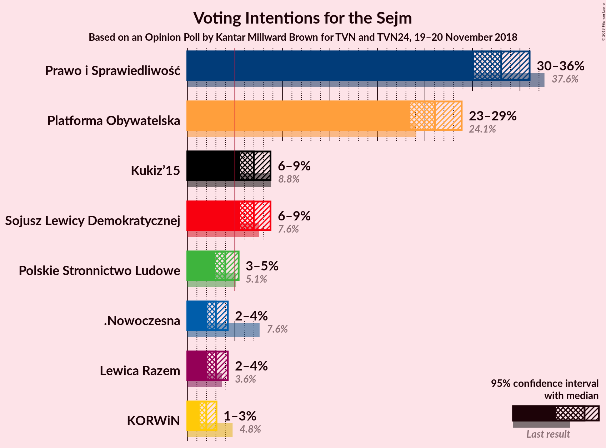

### Confidence Intervals

| Party | Last Result | Poll Result | 80% Confidence Interval | 90% Confidence Interval | 95% Confidence Interval | 99% Confidence Interval |
|:-----:|:-----------:|:-----------:|:-----------------------:|:-----------------------:|:-----------------------:|:-----------------------:|
| Prawo i Sprawiedliwość | 37.6% | 33.0% | 31.2–35.0% |30.6–35.5% |30.2–36.0% |29.3–37.0% |
| Platforma Obywatelska | 24.1% | 26.0% | 24.3–27.9% |23.8–28.4% |23.4–28.9% |22.6–29.8% |
| Kukiz’15 | 8.8% | 7.0% | 6.1–8.1% |5.8–8.5% |5.6–8.7% |5.1–9.3% |
| Sojusz Lewicy Demokratycznej | 7.6% | 7.0% | 6.1–8.1% |5.8–8.5% |5.6–8.7% |5.1–9.3% |
| Polskie Stronnictwo Ludowe | 5.1% | 4.0% | 3.3–4.9% |3.1–5.2% |2.9–5.4% |2.6–5.9% |
| .Nowoczesna | 7.6% | 3.0% | 2.4–3.8% |2.2–4.0% |2.1–4.3% |1.8–4.7% |
| Lewica Razem | 3.6% | 3.0% | 2.4–3.8% |2.2–4.0% |2.1–4.3% |1.8–4.7% |
| KORWiN | 4.8% | 2.0% | 1.5–2.7% |1.4–2.9% |1.3–3.1% |1.1–3.4% |

*Note:* The poll result column reflects the actual value used in the calculations. Published results may vary slightly, and in addition be rounded to fewer digits.

## Seats

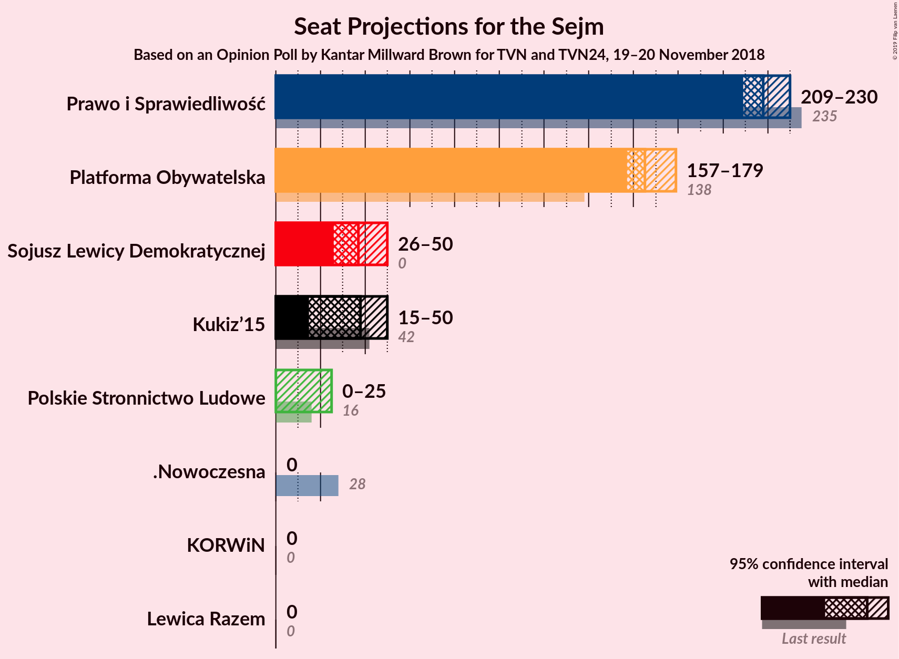

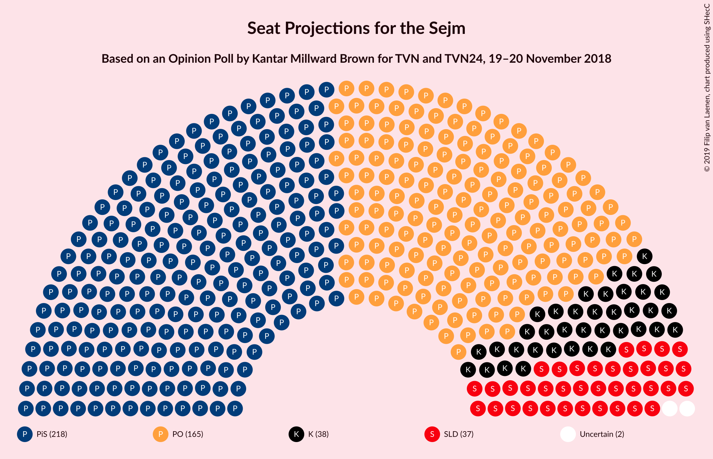

### Confidence Intervals

| Party | Last Result | Median | 80% Confidence Interval | 90% Confidence Interval | 95% Confidence Interval | 99% Confidence Interval |
|:-----:|:-----------:|:------:|:-----------------------:|:-----------------------:|:-----------------------:|:-----------------------:|
| <a href="#prawo-i-sprawiedliwość">Prawo i Sprawiedliwość</a> | 235 | 218 | 209–228 |209–228 |209–230 |206–230 |
| <a href="#platforma-obywatelska">Platforma Obywatelska</a> | 138 | 165 | 164–176 |158–176 |157–179 |156–185 |
| <a href="#kukiz’15">Kukiz’15</a> | 42 | 38 | 19–50 |19–50 |15–50 |14–50 |
| <a href="#sojusz-lewicy-demokratycznej">Sojusz Lewicy Demokratycznej</a> | 0 | 37 | 28–50 |28–50 |26–50 |26–50 |
| <a href="#polskie-stronnictwo-ludowe">Polskie Stronnictwo Ludowe</a> | 16 | 0 | 0–15 |0–25 |0–25 |0–26 |
| <a href="#.nowoczesna">.Nowoczesna</a> | 28 | 0 | 0 |0 |0 |0 |
| <a href="#lewica-razem">Lewica Razem</a> | 0 | 0 | 0 |0 |0 |0 |
| <a href="#korwin">KORWiN</a> | 0 | 0 | 0 |0 |0 |0 |

### Prawo i Sprawiedliwość

*For a full overview of the results for this party, see the [Prawo i Sprawiedliwość](party-prawoisprawiedliwość.html) page.*

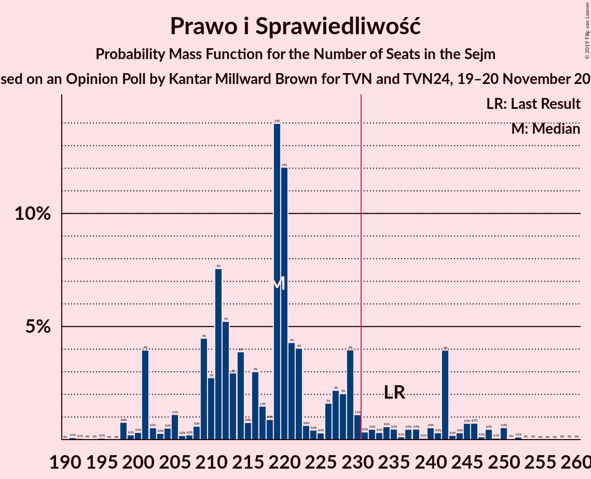

| Number of Seats | Probability | Accumulated | Special Marks |
|:---------------:|:-----------:|:-----------:|:-------------:|
| 200 | 0% | 100% |  |
| 201 | 0% | 99.9% |  |
| 202 | 0% | 99.9% |  |
| 203 | 0% | 99.9% |  |
| 204 | 0% | 99.9% |  |
| 205 | 0% | 99.9% |  |
| 206 | 1.1% | 99.9% |  |
| 207 | 0.2% | 98.9% |  |
| 208 | 0% | 98.6% |  |
| 209 | 9% | 98.6% |  |
| 210 | 0% | 90% |  |
| 211 | 1.5% | 90% |  |
| 212 | 1.5% | 88% |  |
| 213 | 2% | 87% |  |
| 214 | 0.1% | 85% |  |
| 215 | 0% | 85% |  |
| 216 | 0% | 85% |  |
| 217 | 2% | 85% |  |
| 218 | 37% | 83% | Median |
| 219 | 18% | 46% |  |
| 220 | 10% | 28% |  |
| 221 | 0.1% | 19% |  |
| 222 | 0% | 18% |  |
| 223 | 0% | 18% |  |
| 224 | 0% | 18% |  |
| 225 | 0% | 18% |  |
| 226 | 0.9% | 18% |  |
| 227 | 0.2% | 18% |  |
| 228 | 14% | 17% |  |
| 229 | 0% | 4% |  |
| 230 | 3% | 4% |  |
| 231 | 0% | 0.2% | Majority |
| 232 | 0% | 0.1% |  |
| 233 | 0% | 0.1% |  |
| 234 | 0% | 0.1% |  |
| 235 | 0.1% | 0.1% | Last Result |
| 236 | 0% | 0% |  |

### Platforma Obywatelska

*For a full overview of the results for this party, see the [Platforma Obywatelska](party-platformaobywatelska.html) page.*

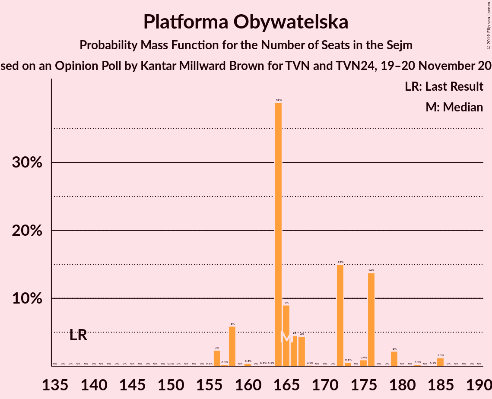

| Number of Seats | Probability | Accumulated | Special Marks |
|:---------------:|:-----------:|:-----------:|:-------------:|
| 138 | 0% | 100% | Last Result |
| 139 | 0% | 100% |  |
| 140 | 0% | 100% |  |
| 141 | 0% | 100% |  |
| 142 | 0% | 100% |  |
| 143 | 0% | 100% |  |
| 144 | 0% | 100% |  |
| 145 | 0% | 100% |  |
| 146 | 0% | 100% |  |
| 147 | 0% | 100% |  |
| 148 | 0% | 100% |  |
| 149 | 0% | 100% |  |
| 150 | 0.1% | 100% |  |
| 151 | 0% | 99.9% |  |
| 152 | 0% | 99.9% |  |
| 153 | 0% | 99.9% |  |
| 154 | 0% | 99.9% |  |
| 155 | 0.1% | 99.9% |  |
| 156 | 2% | 99.9% |  |
| 157 | 0.2% | 98% |  |
| 158 | 6% | 97% |  |
| 159 | 0% | 91% |  |
| 160 | 0.4% | 91% |  |
| 161 | 0% | 91% |  |
| 162 | 0.1% | 91% |  |
| 163 | 0.1% | 91% |  |
| 164 | 39% | 91% |  |
| 165 | 9% | 52% | Median |
| 166 | 4% | 43% |  |
| 167 | 4% | 39% |  |
| 168 | 0.1% | 34% |  |
| 169 | 0% | 34% |  |
| 170 | 0% | 34% |  |
| 171 | 0% | 34% |  |
| 172 | 15% | 34% |  |
| 173 | 0.6% | 19% |  |
| 174 | 0% | 18% |  |
| 175 | 0.9% | 18% |  |
| 176 | 14% | 18% |  |
| 177 | 0% | 4% |  |
| 178 | 0% | 4% |  |
| 179 | 2% | 4% |  |
| 180 | 0% | 2% |  |
| 181 | 0% | 2% |  |
| 182 | 0.2% | 2% |  |
| 183 | 0% | 1.3% |  |
| 184 | 0.1% | 1.3% |  |
| 185 | 1.2% | 1.2% |  |
| 186 | 0% | 0% |  |

### Kukiz’15

*For a full overview of the results for this party, see the [Kukiz’15](party-kukiz’15.html) page.*

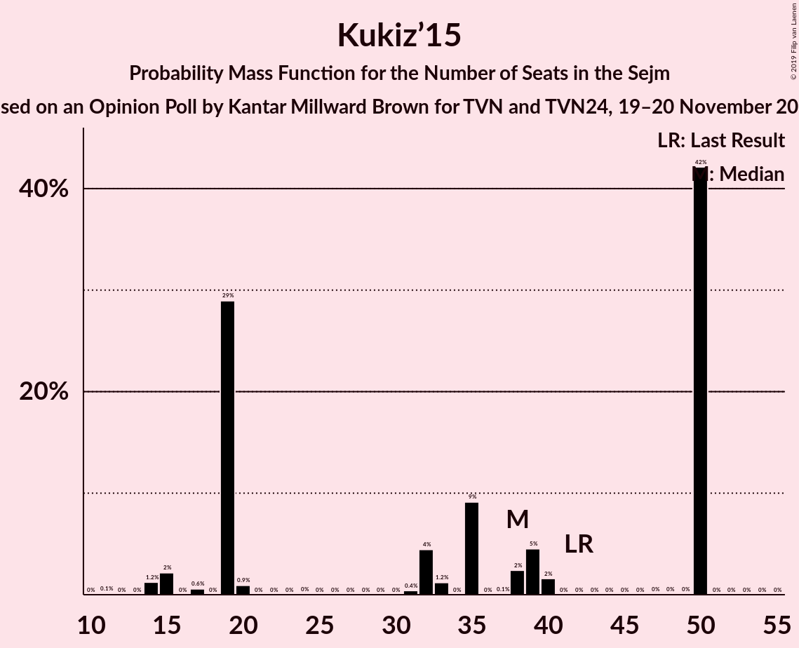

| Number of Seats | Probability | Accumulated | Special Marks |
|:---------------:|:-----------:|:-----------:|:-------------:|
| 11 | 0.1% | 100% |  |
| 12 | 0% | 99.9% |  |
| 13 | 0% | 99.9% |  |
| 14 | 1.2% | 99.9% |  |
| 15 | 2% | 98.6% |  |
| 16 | 0% | 96% |  |
| 17 | 0.6% | 96% |  |
| 18 | 0% | 96% |  |
| 19 | 29% | 96% |  |
| 20 | 0.9% | 67% |  |
| 21 | 0% | 66% |  |
| 22 | 0% | 66% |  |
| 23 | 0% | 66% |  |
| 24 | 0% | 66% |  |
| 25 | 0% | 66% |  |
| 26 | 0% | 66% |  |
| 27 | 0% | 66% |  |
| 28 | 0% | 66% |  |
| 29 | 0% | 66% |  |
| 30 | 0% | 66% |  |
| 31 | 0.4% | 66% |  |
| 32 | 4% | 66% |  |
| 33 | 1.2% | 61% |  |
| 34 | 0% | 60% |  |
| 35 | 9% | 60% |  |
| 36 | 0% | 51% |  |
| 37 | 0.1% | 51% |  |
| 38 | 2% | 51% | Median |
| 39 | 5% | 48% |  |
| 40 | 2% | 44% |  |
| 41 | 0% | 42% |  |
| 42 | 0% | 42% | Last Result |
| 43 | 0% | 42% |  |
| 44 | 0% | 42% |  |
| 45 | 0% | 42% |  |
| 46 | 0% | 42% |  |
| 47 | 0% | 42% |  |
| 48 | 0% | 42% |  |
| 49 | 0% | 42% |  |
| 50 | 42% | 42% |  |
| 51 | 0% | 0% |  |

### Sojusz Lewicy Demokratycznej

*For a full overview of the results for this party, see the [Sojusz Lewicy Demokratycznej](party-sojuszlewicydemokratycznej.html) page.*

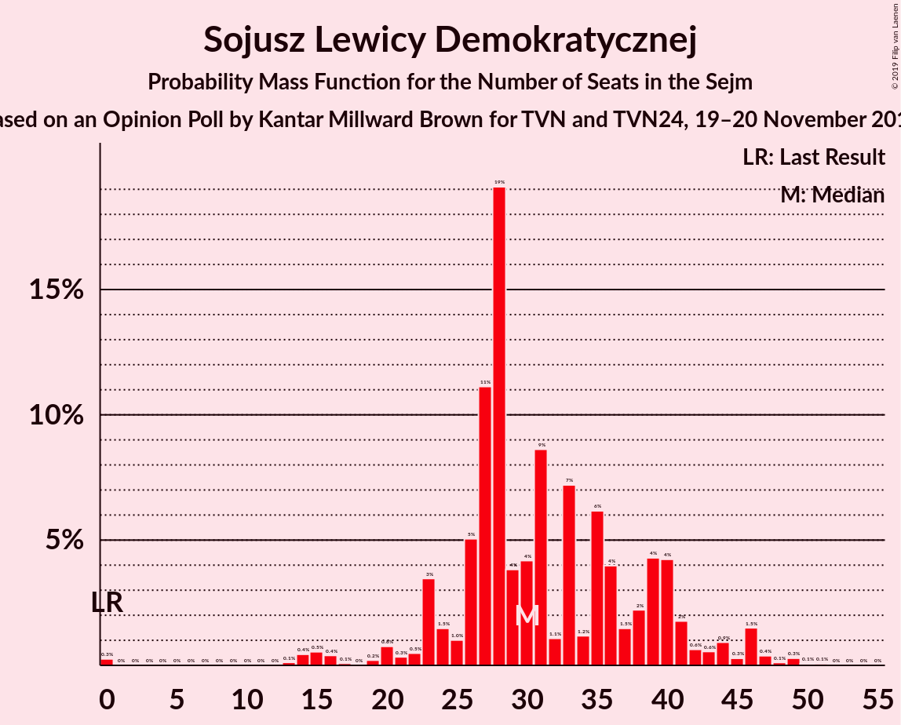

| Number of Seats | Probability | Accumulated | Special Marks |
|:---------------:|:-----------:|:-----------:|:-------------:|
| 0 | 0% | 100% | Last Result |
| 1 | 0% | 100% |  |
| 2 | 0% | 100% |  |
| 3 | 0% | 100% |  |
| 4 | 0% | 100% |  |
| 5 | 0% | 100% |  |
| 6 | 0% | 100% |  |
| 7 | 0% | 100% |  |
| 8 | 0% | 100% |  |
| 9 | 0% | 100% |  |
| 10 | 0% | 100% |  |
| 11 | 0% | 100% |  |
| 12 | 0% | 100% |  |
| 13 | 0% | 100% |  |
| 14 | 0% | 100% |  |
| 15 | 0% | 100% |  |
| 16 | 0% | 100% |  |
| 17 | 0% | 100% |  |
| 18 | 0% | 100% |  |
| 19 | 0% | 100% |  |
| 20 | 0% | 100% |  |
| 21 | 0% | 100% |  |
| 22 | 0% | 100% |  |
| 23 | 0% | 100% |  |
| 24 | 0% | 100% |  |
| 25 | 0.1% | 100% |  |
| 26 | 3% | 99.9% |  |
| 27 | 0% | 97% |  |
| 28 | 37% | 97% |  |
| 29 | 5% | 60% |  |
| 30 | 1.1% | 55% |  |
| 31 | 1.2% | 54% |  |
| 32 | 0.2% | 53% |  |
| 33 | 0% | 53% |  |
| 34 | 0% | 53% |  |
| 35 | 0% | 53% |  |
| 36 | 2% | 53% |  |
| 37 | 14% | 50% | Median |
| 38 | 4% | 37% |  |
| 39 | 10% | 32% |  |
| 40 | 0.1% | 22% |  |
| 41 | 4% | 22% |  |
| 42 | 0% | 19% |  |
| 43 | 1.0% | 19% |  |
| 44 | 0% | 18% |  |
| 45 | 0% | 18% |  |
| 46 | 0% | 18% |  |
| 47 | 0% | 18% |  |
| 48 | 0% | 18% |  |
| 49 | 0.4% | 18% |  |
| 50 | 17% | 17% |  |
| 51 | 0.2% | 0.2% |  |
| 52 | 0% | 0% |  |

### Polskie Stronnictwo Ludowe

*For a full overview of the results for this party, see the [Polskie Stronnictwo Ludowe](party-polskiestronnictwoludowe.html) page.*

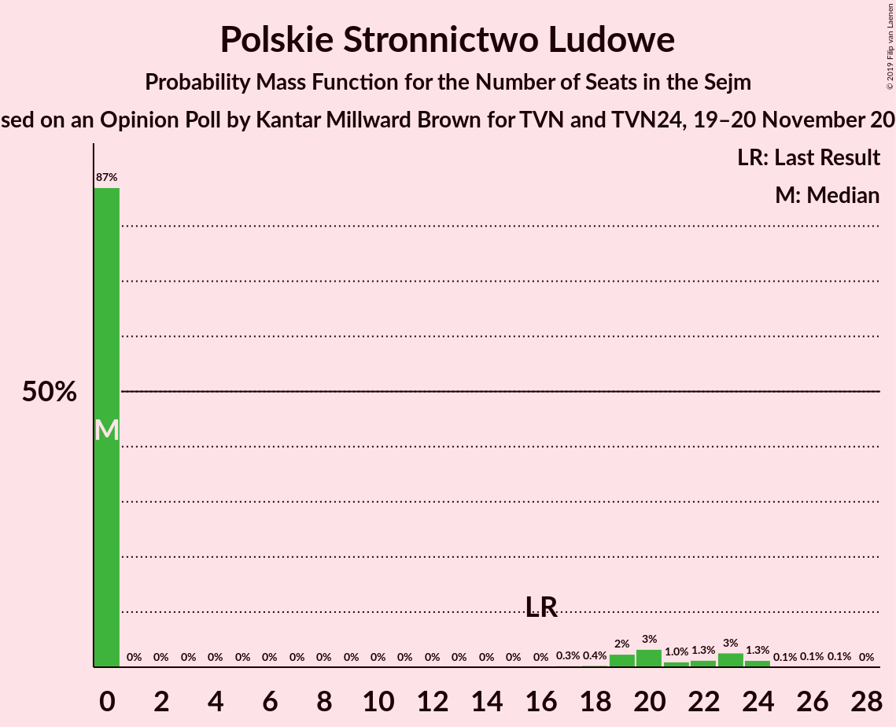

| Number of Seats | Probability | Accumulated | Special Marks |
|:---------------:|:-----------:|:-----------:|:-------------:|
| 0 | 90% | 100% | Median |
| 1 | 0% | 10% |  |
| 2 | 0% | 10% |  |
| 3 | 0% | 10% |  |
| 4 | 0% | 10% |  |
| 5 | 0% | 10% |  |
| 6 | 0% | 10% |  |
| 7 | 0% | 10% |  |
| 8 | 0% | 10% |  |
| 9 | 0% | 10% |  |
| 10 | 0% | 10% |  |
| 11 | 0% | 10% |  |
| 12 | 0% | 10% |  |
| 13 | 0% | 10% |  |
| 14 | 0% | 10% |  |
| 15 | 4% | 10% |  |
| 16 | 0% | 6% | Last Result |
| 17 | 0% | 6% |  |
| 18 | 0.2% | 6% |  |
| 19 | 0% | 6% |  |
| 20 | 0% | 6% |  |
| 21 | 0% | 6% |  |
| 22 | 0% | 6% |  |
| 23 | 0% | 6% |  |
| 24 | 0.4% | 6% |  |
| 25 | 4% | 6% |  |
| 26 | 1.1% | 1.1% |  |
| 27 | 0% | 0% |  |

### .Nowoczesna

*For a full overview of the results for this party, see the [.Nowoczesna](party-nowoczesna.html) page.*

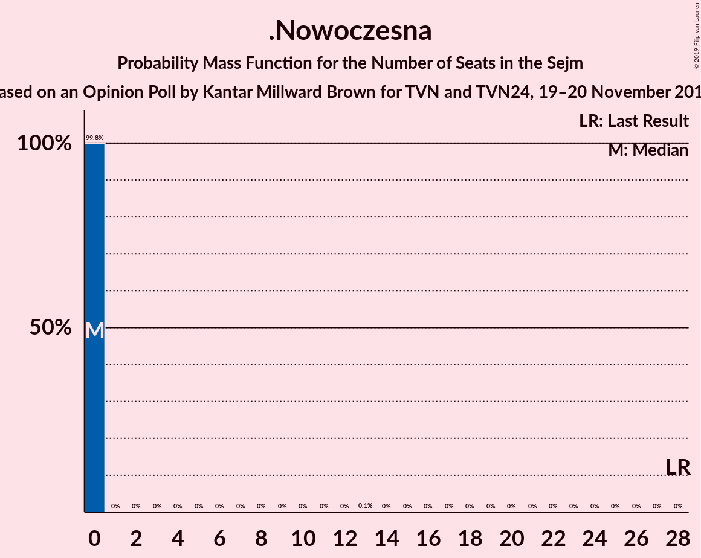

| Number of Seats | Probability | Accumulated | Special Marks |
|:---------------:|:-----------:|:-----------:|:-------------:|
| 0 | 99.8% | 100% | Median |
| 1 | 0% | 0.2% |  |
| 2 | 0% | 0.2% |  |
| 3 | 0% | 0.2% |  |
| 4 | 0% | 0.2% |  |
| 5 | 0% | 0.2% |  |
| 6 | 0% | 0.2% |  |
| 7 | 0% | 0.2% |  |
| 8 | 0% | 0.2% |  |
| 9 | 0% | 0.2% |  |
| 10 | 0% | 0.2% |  |
| 11 | 0% | 0.2% |  |
| 12 | 0% | 0.2% |  |
| 13 | 0.1% | 0.2% |  |
| 14 | 0% | 0% |  |
| 15 | 0% | 0% |  |
| 16 | 0% | 0% |  |
| 17 | 0% | 0% |  |
| 18 | 0% | 0% |  |
| 19 | 0% | 0% |  |
| 20 | 0% | 0% |  |
| 21 | 0% | 0% |  |
| 22 | 0% | 0% |  |
| 23 | 0% | 0% |  |
| 24 | 0% | 0% |  |
| 25 | 0% | 0% |  |
| 26 | 0% | 0% |  |
| 27 | 0% | 0% |  |
| 28 | 0% | 0% | Last Result |

### Lewica Razem

*For a full overview of the results for this party, see the [Lewica Razem](party-lewicarazem.html) page.*

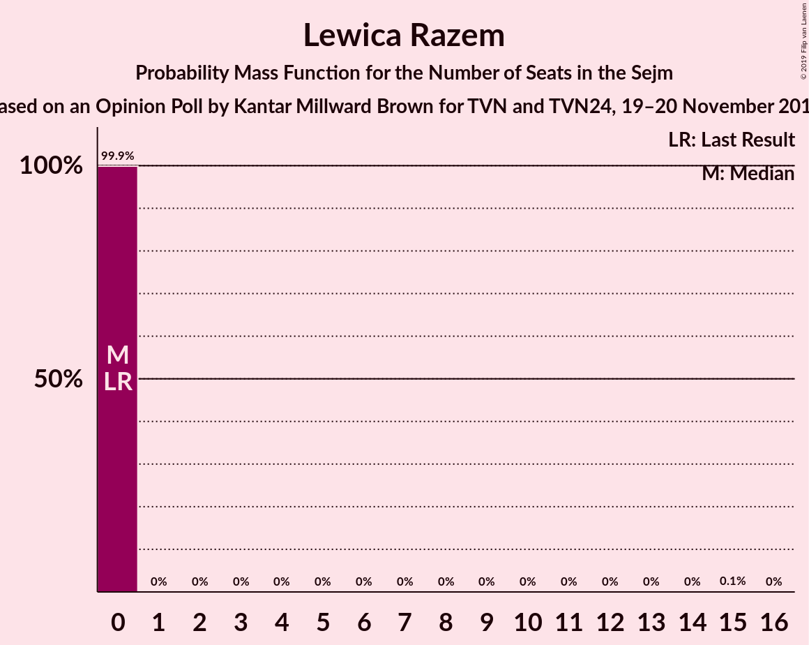

| Number of Seats | Probability | Accumulated | Special Marks |
|:---------------:|:-----------:|:-----------:|:-------------:|
| 0 | 99.9% | 100% | Last Result, Median |
| 1 | 0% | 0.1% |  |
| 2 | 0% | 0.1% |  |
| 3 | 0% | 0.1% |  |
| 4 | 0% | 0.1% |  |
| 5 | 0% | 0.1% |  |
| 6 | 0% | 0.1% |  |
| 7 | 0% | 0.1% |  |
| 8 | 0% | 0.1% |  |
| 9 | 0% | 0.1% |  |
| 10 | 0% | 0.1% |  |
| 11 | 0% | 0.1% |  |
| 12 | 0% | 0.1% |  |
| 13 | 0% | 0.1% |  |
| 14 | 0% | 0.1% |  |
| 15 | 0.1% | 0.1% |  |
| 16 | 0% | 0% |  |

### KORWiN

*For a full overview of the results for this party, see the [KORWiN](party-korwin.html) page.*

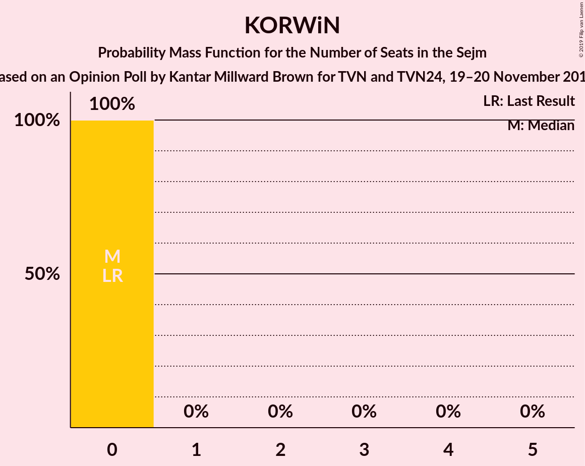

| Number of Seats | Probability | Accumulated | Special Marks |
|:---------------:|:-----------:|:-----------:|:-------------:|
| 0 | 100% | 100% | Last Result, Median |

## Coalitions

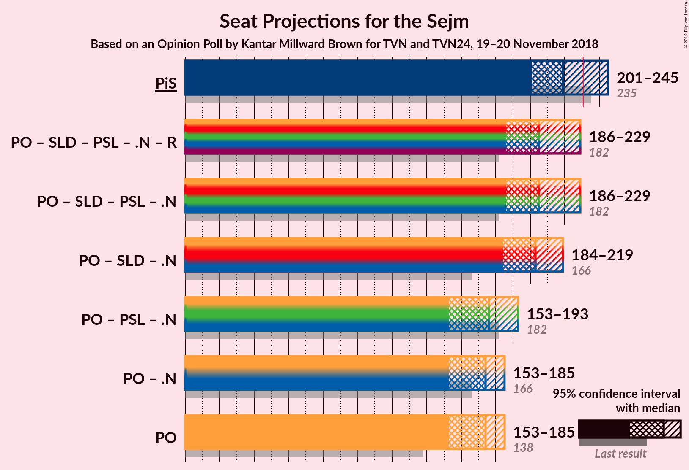

### Confidence Intervals

| Coalition | Last Result | Median | Majority? | 80% Confidence Interval | 90% Confidence Interval | 95% Confidence Interval | 99% Confidence Interval |
|:---------:|:-----------:|:------:|:---------:|:-----------------------:|:-----------------------:|:-----------------------:|:-----------------------:|
| Prawo i Sprawiedliwość | 235 | 218 | 0.2% | 209–228 | 209–228 | 209–230 | 206–230 |
| Platforma Obywatelska – Sojusz Lewicy Demokratycznej – Polskie Stronnictwo Ludowe – .Nowoczesna – Lewica Razem | 182 | 205 | 0% | 192–222 | 192–222 | 191–222 | 191–223 |
| Platforma Obywatelska – Sojusz Lewicy Demokratycznej – Polskie Stronnictwo Ludowe – .Nowoczesna | 182 | 205 | 0% | 192–222 | 192–222 | 191–222 | 191–223 |
| Platforma Obywatelska – Sojusz Lewicy Demokratycznej – .Nowoczesna | 166 | 197 | 0% | 192–222 | 192–222 | 191–222 | 191–223 |
| Platforma Obywatelska – Polskie Stronnictwo Ludowe – .Nowoczesna | 182 | 166 | 0% | 164–176 | 164–190 | 158–190 | 156–191 |
| Platforma Obywatelska – .Nowoczesna | 166 | 165 | 0% | 164–176 | 158–176 | 157–179 | 156–185 |
| Platforma Obywatelska | 138 | 165 | 0% | 164–176 | 158–176 | 157–179 | 156–185 |

### Prawo i Sprawiedliwość

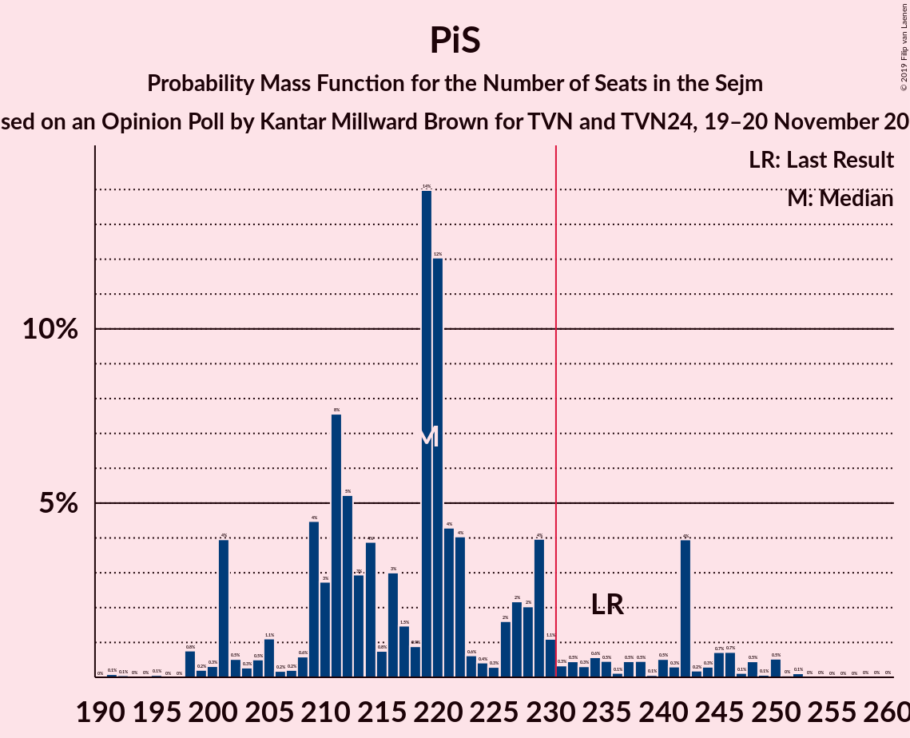

| Number of Seats | Probability | Accumulated | Special Marks |
|:---------------:|:-----------:|:-----------:|:-------------:|
| 200 | 0% | 100% |  |
| 201 | 0% | 99.9% |  |
| 202 | 0% | 99.9% |  |
| 203 | 0% | 99.9% |  |
| 204 | 0% | 99.9% |  |
| 205 | 0% | 99.9% |  |
| 206 | 1.1% | 99.9% |  |
| 207 | 0.2% | 98.9% |  |
| 208 | 0% | 98.6% |  |
| 209 | 9% | 98.6% |  |
| 210 | 0% | 90% |  |
| 211 | 1.5% | 90% |  |
| 212 | 1.5% | 88% |  |
| 213 | 2% | 87% |  |
| 214 | 0.1% | 85% |  |
| 215 | 0% | 85% |  |
| 216 | 0% | 85% |  |
| 217 | 2% | 85% |  |
| 218 | 37% | 83% | Median |
| 219 | 18% | 46% |  |
| 220 | 10% | 28% |  |
| 221 | 0.1% | 19% |  |
| 222 | 0% | 18% |  |
| 223 | 0% | 18% |  |
| 224 | 0% | 18% |  |
| 225 | 0% | 18% |  |
| 226 | 0.9% | 18% |  |
| 227 | 0.2% | 18% |  |
| 228 | 14% | 17% |  |
| 229 | 0% | 4% |  |
| 230 | 3% | 4% |  |
| 231 | 0% | 0.2% | Majority |
| 232 | 0% | 0.1% |  |
| 233 | 0% | 0.1% |  |
| 234 | 0% | 0.1% |  |
| 235 | 0.1% | 0.1% | Last Result |
| 236 | 0% | 0% |  |

### Platforma Obywatelska – Sojusz Lewicy Demokratycznej – Polskie Stronnictwo Ludowe – .Nowoczesna – Lewica Razem

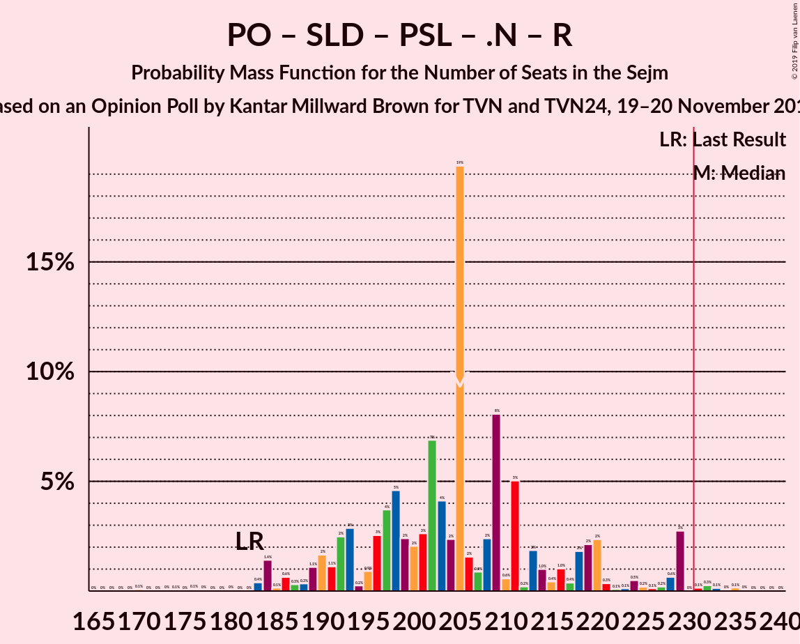

| Number of Seats | Probability | Accumulated | Special Marks |
|:---------------:|:-----------:|:-----------:|:-------------:|
| 182 | 0% | 100% | Last Result |
| 183 | 0% | 100% |  |
| 184 | 0% | 100% |  |
| 185 | 0% | 100% |  |
| 186 | 0% | 100% |  |
| 187 | 0% | 100% |  |
| 188 | 0% | 100% |  |
| 189 | 0% | 100% |  |
| 190 | 0% | 100% |  |
| 191 | 3% | 100% |  |
| 192 | 37% | 97% |  |
| 193 | 0% | 60% |  |
| 194 | 0% | 60% |  |
| 195 | 0% | 60% |  |
| 196 | 0% | 60% |  |
| 197 | 1.4% | 60% |  |
| 198 | 0% | 59% |  |
| 199 | 0.9% | 59% |  |
| 200 | 0% | 58% |  |
| 201 | 0% | 58% |  |
| 202 | 0% | 58% | Median |
| 203 | 0% | 58% |  |
| 204 | 0.1% | 58% |  |
| 205 | 11% | 58% |  |
| 206 | 0.1% | 47% |  |
| 207 | 0% | 47% |  |
| 208 | 1.4% | 47% |  |
| 209 | 0.5% | 45% |  |
| 210 | 0% | 45% |  |
| 211 | 0% | 45% |  |
| 212 | 4% | 45% |  |
| 213 | 14% | 40% |  |
| 214 | 1.5% | 26% |  |
| 215 | 2% | 25% |  |
| 216 | 1.3% | 23% |  |
| 217 | 0% | 21% |  |
| 218 | 0.4% | 21% |  |
| 219 | 4% | 21% |  |
| 220 | 0% | 17% |  |
| 221 | 1.1% | 17% |  |
| 222 | 15% | 16% |  |
| 223 | 0.6% | 0.6% |  |
| 224 | 0% | 0% |  |

### Platforma Obywatelska – Sojusz Lewicy Demokratycznej – Polskie Stronnictwo Ludowe – .Nowoczesna

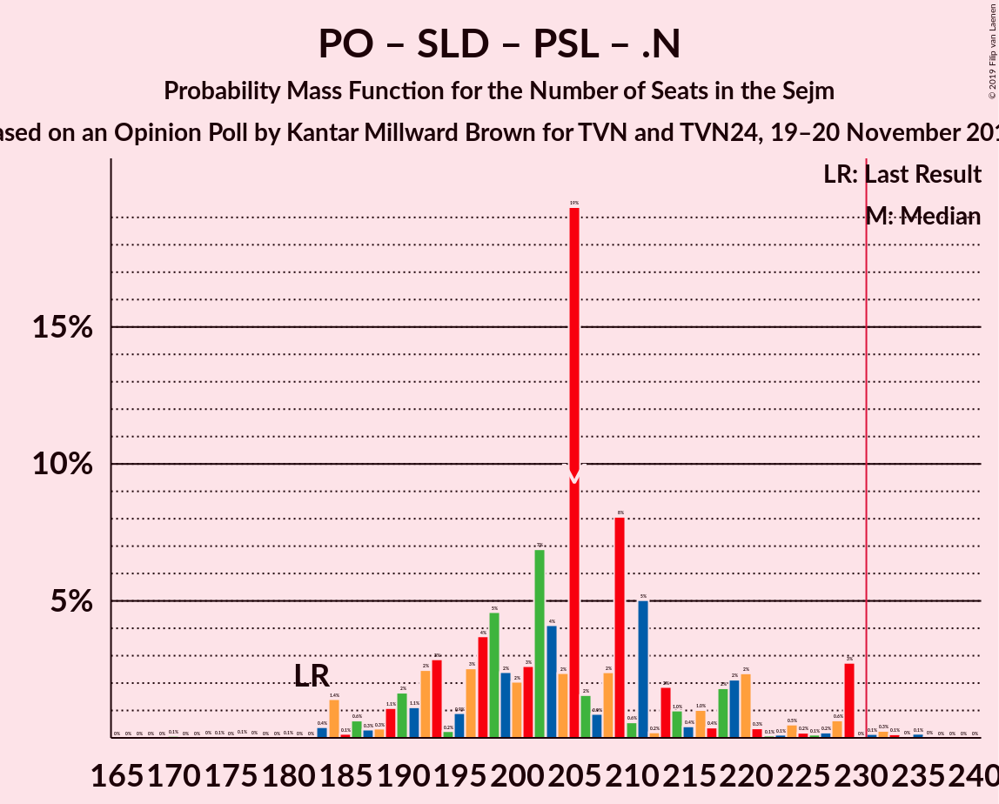

| Number of Seats | Probability | Accumulated | Special Marks |
|:---------------:|:-----------:|:-----------:|:-------------:|
| 182 | 0% | 100% | Last Result |
| 183 | 0% | 100% |  |
| 184 | 0% | 100% |  |
| 185 | 0% | 100% |  |
| 186 | 0% | 100% |  |
| 187 | 0% | 100% |  |
| 188 | 0% | 100% |  |
| 189 | 0% | 100% |  |
| 190 | 0.1% | 100% |  |
| 191 | 3% | 99.9% |  |
| 192 | 37% | 97% |  |
| 193 | 0% | 60% |  |
| 194 | 0% | 60% |  |
| 195 | 0% | 60% |  |
| 196 | 0% | 60% |  |
| 197 | 1.4% | 60% |  |
| 198 | 0% | 59% |  |
| 199 | 0.9% | 59% |  |
| 200 | 0% | 58% |  |
| 201 | 0% | 58% |  |
| 202 | 0% | 58% | Median |
| 203 | 0% | 58% |  |
| 204 | 0.1% | 58% |  |
| 205 | 11% | 58% |  |
| 206 | 0.1% | 47% |  |
| 207 | 0% | 47% |  |
| 208 | 1.5% | 47% |  |
| 209 | 0.5% | 45% |  |
| 210 | 0% | 45% |  |
| 211 | 0% | 45% |  |
| 212 | 4% | 45% |  |
| 213 | 14% | 40% |  |
| 214 | 1.5% | 26% |  |
| 215 | 2% | 25% |  |
| 216 | 1.3% | 23% |  |
| 217 | 0% | 21% |  |
| 218 | 0.4% | 21% |  |
| 219 | 4% | 21% |  |
| 220 | 0% | 17% |  |
| 221 | 1.1% | 17% |  |
| 222 | 15% | 16% |  |
| 223 | 0.6% | 0.6% |  |
| 224 | 0% | 0% |  |

### Platforma Obywatelska – Sojusz Lewicy Demokratycznej – .Nowoczesna

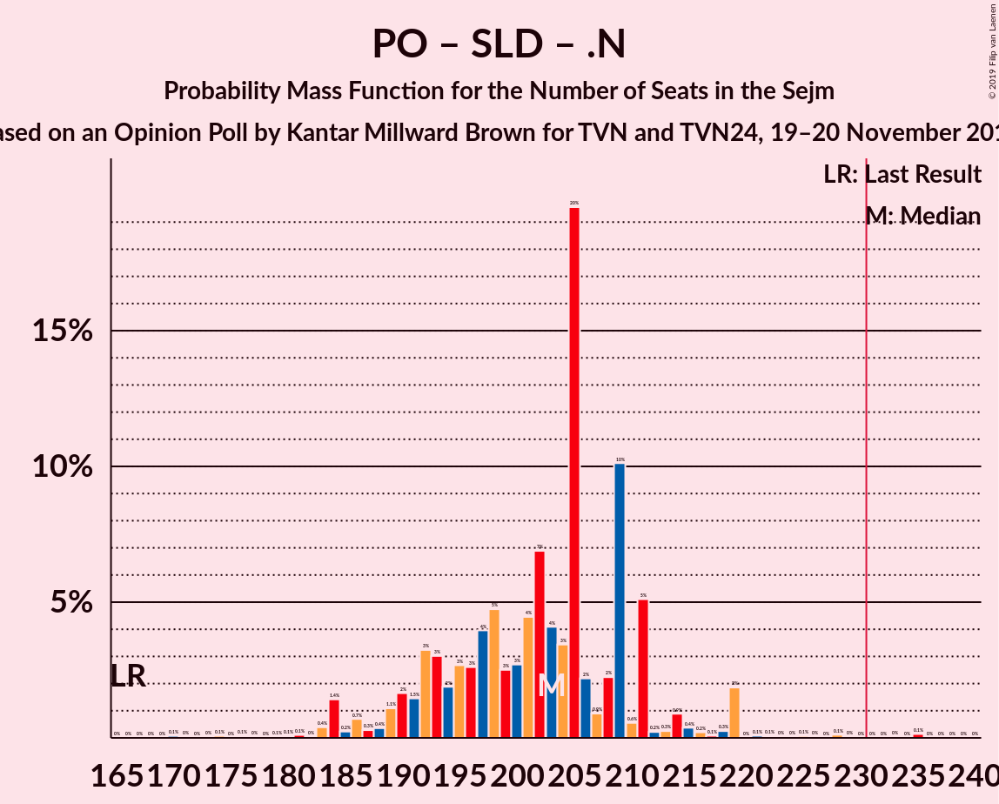

| Number of Seats | Probability | Accumulated | Special Marks |
|:---------------:|:-----------:|:-----------:|:-------------:|
| 166 | 0% | 100% | Last Result |
| 167 | 0% | 100% |  |
| 168 | 0% | 100% |  |
| 169 | 0% | 100% |  |
| 170 | 0% | 100% |  |
| 171 | 0% | 100% |  |
| 172 | 0% | 100% |  |
| 173 | 0% | 100% |  |
| 174 | 0% | 100% |  |
| 175 | 0% | 100% |  |
| 176 | 0% | 100% |  |
| 177 | 0% | 100% |  |
| 178 | 0% | 100% |  |
| 179 | 0% | 100% |  |
| 180 | 0% | 100% |  |
| 181 | 0% | 100% |  |
| 182 | 0% | 100% |  |
| 183 | 0% | 100% |  |
| 184 | 0% | 100% |  |
| 185 | 0% | 100% |  |
| 186 | 0% | 100% |  |
| 187 | 0% | 100% |  |
| 188 | 0% | 100% |  |
| 189 | 0.1% | 100% |  |
| 190 | 0.1% | 99.9% |  |
| 191 | 3% | 99.9% |  |
| 192 | 37% | 97% |  |
| 193 | 0% | 60% |  |
| 194 | 5% | 60% |  |
| 195 | 1.1% | 55% |  |
| 196 | 0.2% | 54% |  |
| 197 | 6% | 54% |  |
| 198 | 0% | 48% |  |
| 199 | 0.9% | 48% |  |
| 200 | 0% | 47% |  |
| 201 | 0% | 47% |  |
| 202 | 0% | 47% | Median |
| 203 | 0% | 47% |  |
| 204 | 0.2% | 47% |  |
| 205 | 11% | 47% |  |
| 206 | 0.1% | 36% |  |
| 207 | 0% | 36% |  |
| 208 | 1.5% | 36% |  |
| 209 | 0.5% | 35% |  |
| 210 | 0% | 34% |  |
| 211 | 0% | 34% |  |
| 212 | 0% | 34% |  |
| 213 | 14% | 34% |  |
| 214 | 1.2% | 20% |  |
| 215 | 2% | 19% |  |
| 216 | 1.2% | 17% |  |
| 217 | 0% | 16% |  |
| 218 | 0% | 16% |  |
| 219 | 0% | 16% |  |
| 220 | 0% | 16% |  |
| 221 | 0% | 16% |  |
| 222 | 15% | 16% |  |
| 223 | 0.6% | 0.6% |  |
| 224 | 0% | 0% |  |

### Platforma Obywatelska – Polskie Stronnictwo Ludowe – .Nowoczesna

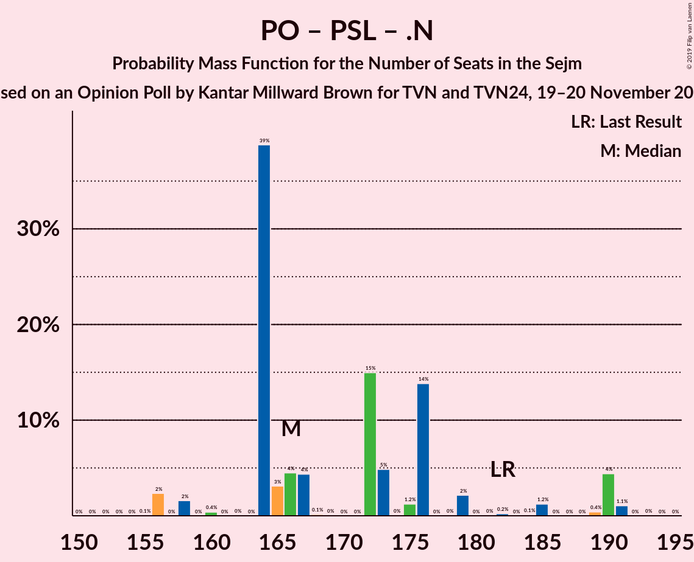

| Number of Seats | Probability | Accumulated | Special Marks |
|:---------------:|:-----------:|:-----------:|:-------------:|
| 155 | 0.1% | 100% |  |
| 156 | 2% | 99.9% |  |
| 157 | 0% | 98% |  |
| 158 | 2% | 98% |  |
| 159 | 0% | 96% |  |
| 160 | 0.4% | 96% |  |
| 161 | 0% | 96% |  |
| 162 | 0% | 96% |  |
| 163 | 0% | 96% |  |
| 164 | 39% | 96% |  |
| 165 | 3% | 57% | Median |
| 166 | 4% | 54% |  |
| 167 | 4% | 49% |  |
| 168 | 0.1% | 45% |  |
| 169 | 0% | 45% |  |
| 170 | 0% | 45% |  |
| 171 | 0% | 45% |  |
| 172 | 15% | 45% |  |
| 173 | 5% | 30% |  |
| 174 | 0% | 25% |  |
| 175 | 1.2% | 25% |  |
| 176 | 14% | 24% |  |
| 177 | 0% | 10% |  |
| 178 | 0% | 10% |  |
| 179 | 2% | 10% |  |
| 180 | 0% | 8% |  |
| 181 | 0% | 8% |  |
| 182 | 0.2% | 7% | Last Result |
| 183 | 0% | 7% |  |
| 184 | 0.1% | 7% |  |
| 185 | 1.2% | 7% |  |
| 186 | 0% | 6% |  |
| 187 | 0% | 6% |  |
| 188 | 0% | 6% |  |
| 189 | 0.4% | 6% |  |
| 190 | 4% | 6% |  |
| 191 | 1.1% | 1.1% |  |
| 192 | 0% | 0.1% |  |
| 193 | 0% | 0.1% |  |
| 194 | 0% | 0% |  |

### Platforma Obywatelska – .Nowoczesna

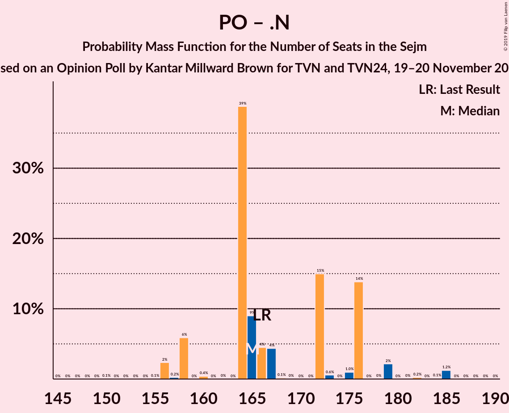

| Number of Seats | Probability | Accumulated | Special Marks |
|:---------------:|:-----------:|:-----------:|:-------------:|
| 150 | 0.1% | 100% |  |
| 151 | 0% | 99.9% |  |
| 152 | 0% | 99.9% |  |
| 153 | 0% | 99.9% |  |
| 154 | 0% | 99.9% |  |
| 155 | 0.1% | 99.9% |  |
| 156 | 2% | 99.9% |  |
| 157 | 0.2% | 98% |  |
| 158 | 6% | 97% |  |
| 159 | 0% | 91% |  |
| 160 | 0.4% | 91% |  |
| 161 | 0% | 91% |  |
| 162 | 0% | 91% |  |
| 163 | 0% | 91% |  |
| 164 | 39% | 91% |  |
| 165 | 9% | 52% | Median |
| 166 | 4% | 43% | Last Result |
| 167 | 4% | 39% |  |
| 168 | 0.1% | 34% |  |
| 169 | 0% | 34% |  |
| 170 | 0% | 34% |  |
| 171 | 0% | 34% |  |
| 172 | 15% | 34% |  |
| 173 | 0.6% | 19% |  |
| 174 | 0% | 19% |  |
| 175 | 1.0% | 19% |  |
| 176 | 14% | 18% |  |
| 177 | 0% | 4% |  |
| 178 | 0% | 4% |  |
| 179 | 2% | 4% |  |
| 180 | 0% | 2% |  |
| 181 | 0% | 2% |  |
| 182 | 0.2% | 2% |  |
| 183 | 0% | 1.4% |  |
| 184 | 0.1% | 1.4% |  |
| 185 | 1.2% | 1.3% |  |
| 186 | 0% | 0% |  |

### Platforma Obywatelska

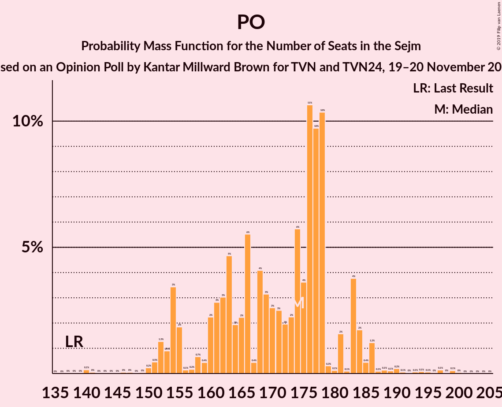

| Number of Seats | Probability | Accumulated | Special Marks |
|:---------------:|:-----------:|:-----------:|:-------------:|
| 138 | 0% | 100% | Last Result |
| 139 | 0% | 100% |  |
| 140 | 0% | 100% |  |
| 141 | 0% | 100% |  |
| 142 | 0% | 100% |  |
| 143 | 0% | 100% |  |
| 144 | 0% | 100% |  |
| 145 | 0% | 100% |  |
| 146 | 0% | 100% |  |
| 147 | 0% | 100% |  |
| 148 | 0% | 100% |  |
| 149 | 0% | 100% |  |
| 150 | 0.1% | 100% |  |
| 151 | 0% | 99.9% |  |
| 152 | 0% | 99.9% |  |
| 153 | 0% | 99.9% |  |
| 154 | 0% | 99.9% |  |
| 155 | 0.1% | 99.9% |  |
| 156 | 2% | 99.9% |  |
| 157 | 0.2% | 98% |  |
| 158 | 6% | 97% |  |
| 159 | 0% | 91% |  |
| 160 | 0.4% | 91% |  |
| 161 | 0% | 91% |  |
| 162 | 0.1% | 91% |  |
| 163 | 0.1% | 91% |  |
| 164 | 39% | 91% |  |
| 165 | 9% | 52% | Median |
| 166 | 4% | 43% |  |
| 167 | 4% | 39% |  |
| 168 | 0.1% | 34% |  |
| 169 | 0% | 34% |  |
| 170 | 0% | 34% |  |
| 171 | 0% | 34% |  |
| 172 | 15% | 34% |  |
| 173 | 0.6% | 19% |  |
| 174 | 0% | 18% |  |
| 175 | 0.9% | 18% |  |
| 176 | 14% | 18% |  |
| 177 | 0% | 4% |  |
| 178 | 0% | 4% |  |
| 179 | 2% | 4% |  |
| 180 | 0% | 2% |  |
| 181 | 0% | 2% |  |
| 182 | 0.2% | 2% |  |
| 183 | 0% | 1.3% |  |
| 184 | 0.1% | 1.3% |  |
| 185 | 1.2% | 1.2% |  |
| 186 | 0% | 0% |  |

## Technical Information

### Opinion Poll

+ **Polling firm:** Kantar Millward Brown
+ **Commissioner(s):** TVN and TVN24
+ **Fieldwork period:** 19–20 November 2018

### Calculations

+ **Sample size:** 1002
+ **Simulations done:** 1,024
+ **Error estimate:** 4.01%

