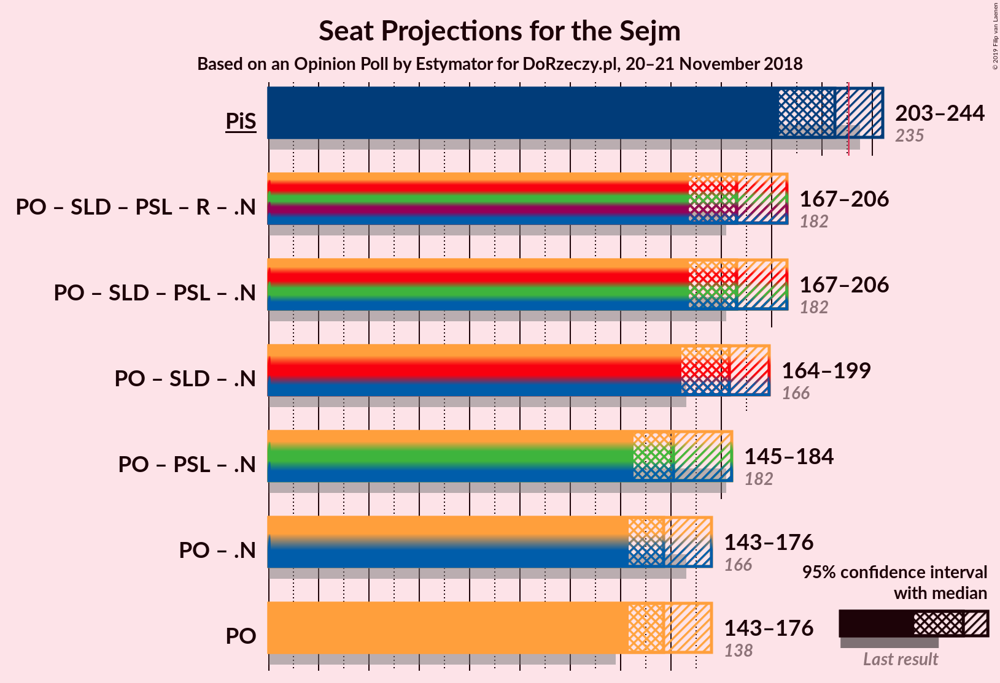

# Opinion Poll by Estymator for DoRzeczy.pl, 20–21 November 2018

<a href="#voting-intentions">Voting Intentions</a> | <a href="#seats">Seats</a> | <a href="#coalitions">Coalitions</a> | <a href="#technical-information">Technical Information</a>

## Voting Intentions

### Confidence Intervals

| Party | Last Result | Poll Result | 80% Confidence Interval | 90% Confidence Interval | 95% Confidence Interval | 99% Confidence Interval |
|:-----:|:-----------:|:-----------:|:-----------------------:|:-----------------------:|:-----------------------:|:-----------------------:|
| Prawo i Sprawiedliwość | 37.6% | 40.7% | 38.7–42.7% |38.2–43.3% |37.7–43.8% |36.8–44.7% |
| Platforma Obywatelska | 24.1% | 30.4% | 28.6–32.3% |28.1–32.8% |27.6–33.3% |26.8–34.2% |
| Kukiz’15 | 8.8% | 11.6% | 10.4–13.0% |10.0–13.4% |9.8–13.7% |9.2–14.4% |
| Sojusz Lewicy Demokratycznej | 7.6% | 7.3% | 6.4–8.5% |6.1–8.8% |5.9–9.1% |5.4–9.7% |
| Polskie Stronnictwo Ludowe | 5.1% | 4.7% | 3.9–5.6% |3.7–5.9% |3.5–6.1% |3.2–6.6% |
| Lewica Razem | 3.6% | 1.9% | 1.4–2.6% |1.3–2.8% |1.2–2.9% |1.0–3.3% |
| KORWiN | 4.8% | 1.3% | 0.9–1.9% |0.8–2.0% |0.7–2.2% |0.6–2.5% |

*Note:* The poll result column reflects the actual value used in the calculations. Published results may vary slightly, and in addition be rounded to fewer digits.

## Seats

### Confidence Intervals

| Party | Last Result | Median | 80% Confidence Interval | 90% Confidence Interval | 95% Confidence Interval | 99% Confidence Interval |
|:-----:|:-----------:|:------:|:-----------------------:|:-----------------------:|:-----------------------:|:-----------------------:|
| <a href="#prawo-i-sprawiedliwość">Prawo i Sprawiedliwość</a> | 235 | 225 | 210–237 |205–241 |203–244 |199–246 |
| <a href="#platforma-obywatelska">Platforma Obywatelska</a> | 138 | 157 | 147–167 |145–172 |143–176 |139–184 |
| <a href="#kukiz’15">Kukiz’15</a> | 42 | 49 | 44–55 |43–59 |41–61 |37–67 |
| <a href="#sojusz-lewicy-demokratycznej">Sojusz Lewicy Demokratycznej</a> | 0 | 27 | 15–30 |12–33 |11–35 |9–38 |
| <a href="#polskie-stronnictwo-ludowe">Polskie Stronnictwo Ludowe</a> | 16 | 0 | 0–13 |0–16 |0–17 |0–22 |
| <a href="#lewica-razem">Lewica Razem</a> | 0 | 0 | 0 |0 |0 |0 |
| <a href="#korwin">KORWiN</a> | 0 | 0 | 0 |0 |0 |0 |

### Prawo i Sprawiedliwość

*For a full overview of the results for this party, see the [Prawo i Sprawiedliwość](party-prawoisprawiedliwość.html) page.*

| Number of Seats | Probability | Accumulated | Special Marks |
|:---------------:|:-----------:|:-----------:|:-------------:|
| 193 | 0% | 100% |  |
| 194 | 0% | 99.9% |  |
| 195 | 0% | 99.9% |  |
| 196 | 0.1% | 99.9% |  |
| 197 | 0.1% | 99.8% |  |
| 198 | 0.1% | 99.6% |  |
| 199 | 0% | 99.5% |  |
| 200 | 0.3% | 99.5% |  |
| 201 | 1.0% | 99.2% |  |
| 202 | 0.6% | 98% |  |
| 203 | 0.2% | 98% |  |
| 204 | 0.8% | 97% |  |
| 205 | 2% | 97% |  |
| 206 | 1.0% | 94% |  |
| 207 | 0.3% | 94% |  |
| 208 | 0.4% | 93% |  |
| 209 | 1.0% | 93% |  |
| 210 | 2% | 92% |  |
| 211 | 0.5% | 89% |  |
| 212 | 2% | 89% |  |
| 213 | 0.9% | 87% |  |
| 214 | 0.5% | 86% |  |
| 215 | 3% | 85% |  |
| 216 | 3% | 83% |  |
| 217 | 0.5% | 79% |  |
| 218 | 7% | 79% |  |
| 219 | 3% | 72% |  |
| 220 | 2% | 69% |  |
| 221 | 2% | 67% |  |
| 222 | 5% | 65% |  |
| 223 | 1.3% | 60% |  |
| 224 | 6% | 59% |  |
| 225 | 5% | 52% | Median |
| 226 | 4% | 47% |  |
| 227 | 2% | 43% |  |
| 228 | 1.5% | 41% |  |
| 229 | 12% | 39% |  |
| 230 | 4% | 27% |  |
| 231 | 5% | 22% | Majority |
| 232 | 3% | 18% |  |
| 233 | 0.8% | 14% |  |
| 234 | 0.8% | 14% |  |
| 235 | 1.4% | 13% | Last Result |
| 236 | 0.7% | 11% |  |
| 237 | 2% | 11% |  |
| 238 | 2% | 8% |  |
| 239 | 0.2% | 6% |  |
| 240 | 0.6% | 6% |  |
| 241 | 1.1% | 5% |  |
| 242 | 0.4% | 4% |  |
| 243 | 1.4% | 4% |  |
| 244 | 2% | 3% |  |
| 245 | 0.1% | 0.8% |  |
| 246 | 0.3% | 0.7% |  |
| 247 | 0.2% | 0.5% |  |
| 248 | 0% | 0.3% |  |
| 249 | 0% | 0.2% |  |
| 250 | 0.1% | 0.2% |  |
| 251 | 0% | 0.1% |  |
| 252 | 0% | 0.1% |  |
| 253 | 0% | 0% |  |

### Platforma Obywatelska

*For a full overview of the results for this party, see the [Platforma Obywatelska](party-platformaobywatelska.html) page.*

| Number of Seats | Probability | Accumulated | Special Marks |
|:---------------:|:-----------:|:-----------:|:-------------:|
| 133 | 0% | 100% |  |
| 134 | 0% | 99.9% |  |
| 135 | 0% | 99.9% |  |
| 136 | 0.1% | 99.9% |  |
| 137 | 0.1% | 99.7% |  |
| 138 | 0.1% | 99.6% | Last Result |
| 139 | 0.5% | 99.5% |  |
| 140 | 0.4% | 99.0% |  |
| 141 | 0.3% | 98.6% |  |
| 142 | 0.7% | 98% |  |
| 143 | 0.6% | 98% |  |
| 144 | 2% | 97% |  |
| 145 | 0.6% | 95% |  |
| 146 | 3% | 95% |  |
| 147 | 2% | 91% |  |
| 148 | 1.4% | 90% |  |
| 149 | 2% | 88% |  |
| 150 | 4% | 87% |  |
| 151 | 5% | 82% |  |
| 152 | 0.6% | 78% |  |
| 153 | 6% | 77% |  |
| 154 | 2% | 71% |  |
| 155 | 13% | 69% |  |
| 156 | 2% | 56% |  |
| 157 | 10% | 54% | Median |
| 158 | 7% | 43% |  |
| 159 | 0.9% | 36% |  |
| 160 | 6% | 36% |  |
| 161 | 5% | 30% |  |
| 162 | 2% | 24% |  |
| 163 | 0.6% | 22% |  |
| 164 | 5% | 22% |  |
| 165 | 3% | 17% |  |
| 166 | 3% | 14% |  |
| 167 | 0.7% | 11% |  |
| 168 | 1.3% | 10% |  |
| 169 | 0.9% | 9% |  |
| 170 | 0.6% | 8% |  |
| 171 | 0.4% | 7% |  |
| 172 | 2% | 7% |  |
| 173 | 0.6% | 4% |  |
| 174 | 0.7% | 4% |  |
| 175 | 0.4% | 3% |  |
| 176 | 0.4% | 3% |  |
| 177 | 0.5% | 2% |  |
| 178 | 0.7% | 2% |  |
| 179 | 0.1% | 1.1% |  |
| 180 | 0.1% | 1.1% |  |
| 181 | 0.2% | 0.9% |  |
| 182 | 0.1% | 0.7% |  |
| 183 | 0% | 0.6% |  |
| 184 | 0.3% | 0.6% |  |
| 185 | 0% | 0.2% |  |
| 186 | 0.1% | 0.2% |  |
| 187 | 0.1% | 0.1% |  |
| 188 | 0% | 0.1% |  |
| 189 | 0% | 0% |  |

### Kukiz’15

*For a full overview of the results for this party, see the [Kukiz’15](party-kukiz’15.html) page.*

| Number of Seats | Probability | Accumulated | Special Marks |
|:---------------:|:-----------:|:-----------:|:-------------:|
| 34 | 0.2% | 100% |  |
| 35 | 0.2% | 99.8% |  |
| 36 | 0.1% | 99.6% |  |
| 37 | 0.1% | 99.5% |  |
| 38 | 0.2% | 99.5% |  |
| 39 | 0.1% | 99.2% |  |
| 40 | 0.3% | 99.1% |  |
| 41 | 1.5% | 98.8% |  |
| 42 | 1.3% | 97% | Last Result |
| 43 | 3% | 96% |  |
| 44 | 5% | 93% |  |
| 45 | 11% | 88% |  |
| 46 | 13% | 77% |  |
| 47 | 4% | 64% |  |
| 48 | 7% | 59% |  |
| 49 | 5% | 52% | Median |
| 50 | 11% | 47% |  |
| 51 | 6% | 36% |  |
| 52 | 15% | 31% |  |
| 53 | 4% | 15% |  |
| 54 | 1.0% | 11% |  |
| 55 | 2% | 10% |  |
| 56 | 1.4% | 8% |  |
| 57 | 1.0% | 7% |  |
| 58 | 1.0% | 6% |  |
| 59 | 0.9% | 5% |  |
| 60 | 0.3% | 4% |  |
| 61 | 2% | 4% |  |
| 62 | 0.2% | 2% |  |
| 63 | 0.6% | 2% |  |
| 64 | 0.6% | 2% |  |
| 65 | 0.1% | 0.9% |  |
| 66 | 0.2% | 0.9% |  |
| 67 | 0.5% | 0.7% |  |
| 68 | 0.1% | 0.2% |  |
| 69 | 0.1% | 0.1% |  |
| 70 | 0% | 0.1% |  |
| 71 | 0% | 0.1% |  |
| 72 | 0% | 0% |  |

### Sojusz Lewicy Demokratycznej

*For a full overview of the results for this party, see the [Sojusz Lewicy Demokratycznej](party-sojuszlewicydemokratycznej.html) page.*

| Number of Seats | Probability | Accumulated | Special Marks |
|:---------------:|:-----------:|:-----------:|:-------------:|
| 0 | 0.1% | 100% | Last Result |
| 1 | 0% | 99.9% |  |
| 2 | 0% | 99.9% |  |
| 3 | 0% | 99.9% |  |
| 4 | 0% | 99.9% |  |
| 5 | 0% | 99.9% |  |
| 6 | 0% | 99.9% |  |
| 7 | 0.1% | 99.9% |  |
| 8 | 0.3% | 99.9% |  |
| 9 | 0.4% | 99.6% |  |
| 10 | 0.8% | 99.2% |  |
| 11 | 2% | 98% |  |
| 12 | 3% | 96% |  |
| 13 | 2% | 93% |  |
| 14 | 0.8% | 91% |  |
| 15 | 2% | 90% |  |
| 16 | 3% | 88% |  |
| 17 | 1.5% | 85% |  |
| 18 | 0.7% | 84% |  |
| 19 | 0.9% | 83% |  |
| 20 | 0.9% | 82% |  |
| 21 | 0.5% | 81% |  |
| 22 | 3% | 81% |  |
| 23 | 8% | 78% |  |
| 24 | 5% | 70% |  |
| 25 | 6% | 65% |  |
| 26 | 9% | 59% |  |
| 27 | 10% | 50% | Median |
| 28 | 25% | 40% |  |
| 29 | 3% | 14% |  |
| 30 | 3% | 12% |  |
| 31 | 3% | 9% |  |
| 32 | 0.4% | 6% |  |
| 33 | 2% | 5% |  |
| 34 | 0.5% | 4% |  |
| 35 | 2% | 3% |  |
| 36 | 0.9% | 2% |  |
| 37 | 0.2% | 0.9% |  |
| 38 | 0.2% | 0.7% |  |
| 39 | 0.1% | 0.5% |  |
| 40 | 0.2% | 0.4% |  |
| 41 | 0.1% | 0.2% |  |
| 42 | 0% | 0.1% |  |
| 43 | 0% | 0% |  |

### Polskie Stronnictwo Ludowe

*For a full overview of the results for this party, see the [Polskie Stronnictwo Ludowe](party-polskiestronnictwoludowe.html) page.*

| Number of Seats | Probability | Accumulated | Special Marks |
|:---------------:|:-----------:|:-----------:|:-------------:|
| 0 | 65% | 100% | Median |
| 1 | 0% | 35% |  |
| 2 | 0% | 35% |  |
| 3 | 0% | 35% |  |
| 4 | 0% | 35% |  |
| 5 | 0% | 35% |  |
| 6 | 0% | 35% |  |
| 7 | 0% | 35% |  |
| 8 | 0% | 35% |  |
| 9 | 0% | 35% |  |
| 10 | 0.1% | 35% |  |
| 11 | 11% | 35% |  |
| 12 | 11% | 24% |  |
| 13 | 3% | 13% |  |
| 14 | 2% | 10% |  |
| 15 | 2% | 7% |  |
| 16 | 2% | 6% | Last Result |
| 17 | 2% | 4% |  |
| 18 | 0.4% | 2% |  |
| 19 | 0.4% | 2% |  |
| 20 | 0.4% | 1.3% |  |
| 21 | 0.2% | 0.9% |  |
| 22 | 0.4% | 0.7% |  |
| 23 | 0.2% | 0.3% |  |
| 24 | 0.1% | 0.1% |  |
| 25 | 0% | 0% |  |

### Lewica Razem

*For a full overview of the results for this party, see the [Lewica Razem](party-lewicarazem.html) page.*

| Number of Seats | Probability | Accumulated | Special Marks |
|:---------------:|:-----------:|:-----------:|:-------------:|
| 0 | 100% | 100% | Last Result, Median |

### KORWiN

*For a full overview of the results for this party, see the [KORWiN](party-korwin.html) page.*

| Number of Seats | Probability | Accumulated | Special Marks |
|:---------------:|:-----------:|:-----------:|:-------------:|
| 0 | 100% | 100% | Last Result, Median |

## Coalitions

### Confidence Intervals

| Coalition | Last Result | Median | Majority? | 80% Confidence Interval | 90% Confidence Interval | 95% Confidence Interval | 99% Confidence Interval |
|:---------:|:-----------:|:------:|:---------:|:-----------------------:|:-----------------------:|:-----------------------:|:-----------------------:|
| Prawo i Sprawiedliwość | 235 | 225 | 22% | 210–237 | 205–241 | 203–244 | 199–246 |
| Platforma Obywatelska | 138 | 157 | 0% | 147–167 | 145–172 | 143–176 | 139–184 |

### Prawo i Sprawiedliwość

| Number of Seats | Probability | Accumulated | Special Marks |
|:---------------:|:-----------:|:-----------:|:-------------:|
| 193 | 0% | 100% |  |
| 194 | 0% | 99.9% |  |
| 195 | 0% | 99.9% |  |
| 196 | 0.1% | 99.9% |  |
| 197 | 0.1% | 99.8% |  |
| 198 | 0.1% | 99.6% |  |
| 199 | 0% | 99.5% |  |
| 200 | 0.3% | 99.5% |  |
| 201 | 1.0% | 99.2% |  |
| 202 | 0.6% | 98% |  |
| 203 | 0.2% | 98% |  |
| 204 | 0.8% | 97% |  |
| 205 | 2% | 97% |  |
| 206 | 1.0% | 94% |  |
| 207 | 0.3% | 94% |  |
| 208 | 0.4% | 93% |  |
| 209 | 1.0% | 93% |  |
| 210 | 2% | 92% |  |
| 211 | 0.5% | 89% |  |
| 212 | 2% | 89% |  |
| 213 | 0.9% | 87% |  |
| 214 | 0.5% | 86% |  |
| 215 | 3% | 85% |  |
| 216 | 3% | 83% |  |
| 217 | 0.5% | 79% |  |
| 218 | 7% | 79% |  |
| 219 | 3% | 72% |  |
| 220 | 2% | 69% |  |
| 221 | 2% | 67% |  |
| 222 | 5% | 65% |  |
| 223 | 1.3% | 60% |  |
| 224 | 6% | 59% |  |
| 225 | 5% | 52% | Median |
| 226 | 4% | 47% |  |
| 227 | 2% | 43% |  |
| 228 | 1.5% | 41% |  |
| 229 | 12% | 39% |  |
| 230 | 4% | 27% |  |
| 231 | 5% | 22% | Majority |
| 232 | 3% | 18% |  |
| 233 | 0.8% | 14% |  |
| 234 | 0.8% | 14% |  |
| 235 | 1.4% | 13% | Last Result |
| 236 | 0.7% | 11% |  |
| 237 | 2% | 11% |  |
| 238 | 2% | 8% |  |
| 239 | 0.2% | 6% |  |
| 240 | 0.6% | 6% |  |
| 241 | 1.1% | 5% |  |
| 242 | 0.4% | 4% |  |
| 243 | 1.4% | 4% |  |
| 244 | 2% | 3% |  |
| 245 | 0.1% | 0.8% |  |
| 246 | 0.3% | 0.7% |  |
| 247 | 0.2% | 0.5% |  |
| 248 | 0% | 0.3% |  |
| 249 | 0% | 0.2% |  |
| 250 | 0.1% | 0.2% |  |
| 251 | 0% | 0.1% |  |
| 252 | 0% | 0.1% |  |
| 253 | 0% | 0% |  |

### Platforma Obywatelska

| Number of Seats | Probability | Accumulated | Special Marks |
|:---------------:|:-----------:|:-----------:|:-------------:|
| 133 | 0% | 100% |  |
| 134 | 0% | 99.9% |  |
| 135 | 0% | 99.9% |  |
| 136 | 0.1% | 99.9% |  |
| 137 | 0.1% | 99.7% |  |
| 138 | 0.1% | 99.6% | Last Result |
| 139 | 0.5% | 99.5% |  |
| 140 | 0.4% | 99.0% |  |
| 141 | 0.3% | 98.6% |  |
| 142 | 0.7% | 98% |  |
| 143 | 0.6% | 98% |  |
| 144 | 2% | 97% |  |
| 145 | 0.6% | 95% |  |
| 146 | 3% | 95% |  |
| 147 | 2% | 91% |  |
| 148 | 1.4% | 90% |  |
| 149 | 2% | 88% |  |
| 150 | 4% | 87% |  |
| 151 | 5% | 82% |  |
| 152 | 0.6% | 78% |  |
| 153 | 6% | 77% |  |
| 154 | 2% | 71% |  |
| 155 | 13% | 69% |  |
| 156 | 2% | 56% |  |
| 157 | 10% | 54% | Median |
| 158 | 7% | 43% |  |
| 159 | 0.9% | 36% |  |
| 160 | 6% | 36% |  |
| 161 | 5% | 30% |  |
| 162 | 2% | 24% |  |
| 163 | 0.6% | 22% |  |
| 164 | 5% | 22% |  |
| 165 | 3% | 17% |  |
| 166 | 3% | 14% |  |
| 167 | 0.7% | 11% |  |
| 168 | 1.3% | 10% |  |
| 169 | 0.9% | 9% |  |
| 170 | 0.6% | 8% |  |
| 171 | 0.4% | 7% |  |
| 172 | 2% | 7% |  |
| 173 | 0.6% | 4% |  |
| 174 | 0.7% | 4% |  |
| 175 | 0.4% | 3% |  |
| 176 | 0.4% | 3% |  |
| 177 | 0.5% | 2% |  |
| 178 | 0.7% | 2% |  |
| 179 | 0.1% | 1.1% |  |
| 180 | 0.1% | 1.1% |  |
| 181 | 0.2% | 0.9% |  |
| 182 | 0.1% | 0.7% |  |
| 183 | 0% | 0.6% |  |
| 184 | 0.3% | 0.6% |  |
| 185 | 0% | 0.2% |  |
| 186 | 0.1% | 0.2% |  |
| 187 | 0.1% | 0.1% |  |
| 188 | 0% | 0.1% |  |
| 189 | 0% | 0% |  |

## Technical Information

### Opinion Poll

+ **Polling firm:** Estymator
+ **Commissioner(s):** DoRzeczy.pl
+ **Fieldwork period:** 20–21 November 2018

### Calculations

+ **Sample size:** 1010
+ **Simulations done:** 131,072
+ **Error estimate:** 1.75%

