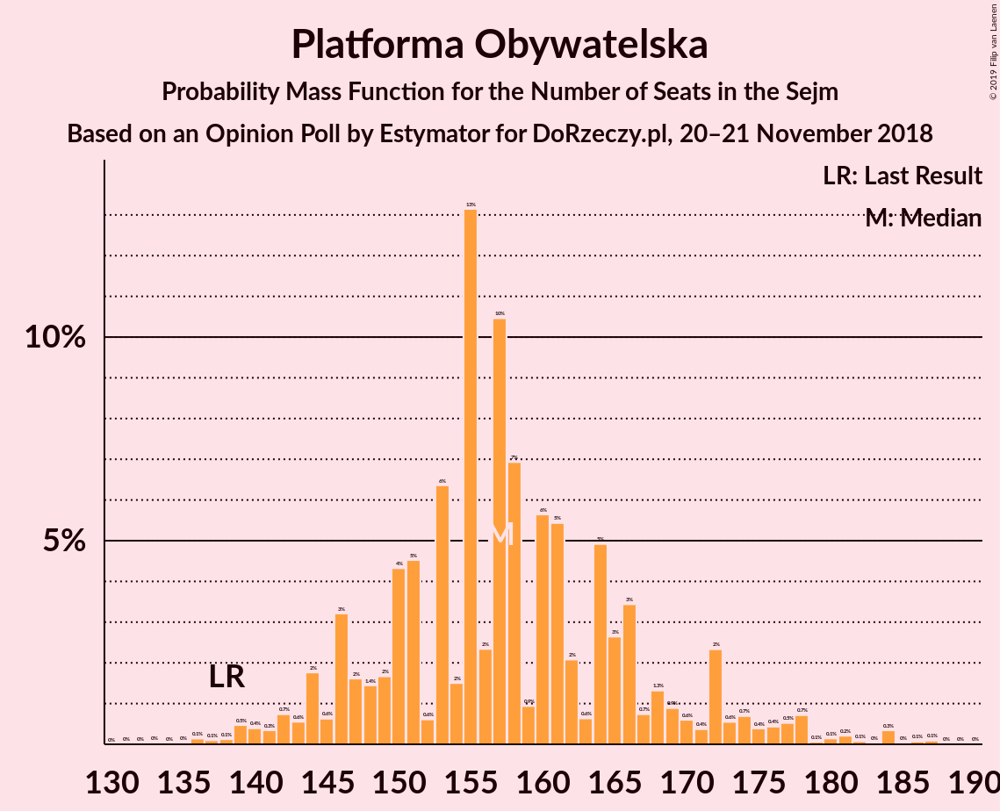
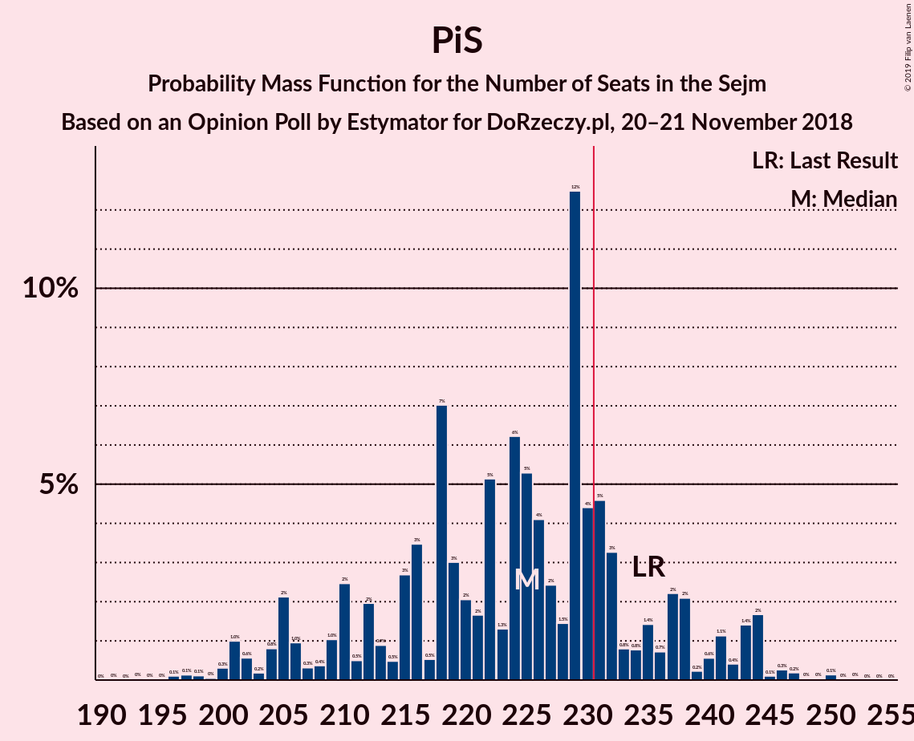

# Opinion Poll by Estymator for DoRzeczy.pl, 20–21 November 2018

<a href="#voting-intentions">Voting Intentions</a> | <a href="#seats">Seats</a> | <a href="#coalitions">Coalitions</a> | <a href="#technical-information">Technical Information</a>

## Voting Intentions

### Confidence Intervals

| Party | Last Result | Poll Result | 80% Confidence Interval | 90% Confidence Interval | 95% Confidence Interval | 99% Confidence Interval |
|:-----:|:-----------:|:-----------:|:-----------------------:|:-----------------------:|:-----------------------:|:-----------------------:|
| Prawo i Sprawiedliwość | 37.6% | 40.7% | 38.7–42.7% |38.2–43.3% |37.7–43.8% |36.8–44.7% |
| Platforma Obywatelska | 24.1% | 30.4% | 28.6–32.3% |28.1–32.8% |27.6–33.3% |26.8–34.2% |
| Kukiz’15 | 8.8% | 11.6% | 10.4–13.0% |10.0–13.4% |9.8–13.7% |9.2–14.4% |
| Sojusz Lewicy Demokratycznej | 7.6% | 7.3% | 6.4–8.5% |6.1–8.8% |5.9–9.1% |5.4–9.7% |
| Polskie Stronnictwo Ludowe | 5.1% | 4.7% | 3.9–5.6% |3.7–5.9% |3.5–6.1% |3.2–6.6% |
| Lewica Razem | 3.6% | 1.9% | 1.4–2.6% |1.3–2.8% |1.2–2.9% |1.0–3.3% |
| KORWiN | 4.8% | 1.3% | 0.9–1.9% |0.8–2.0% |0.7–2.2% |0.6–2.5% |

*Note:* The poll result column reflects the actual value used in the calculations. Published results may vary slightly, and in addition be rounded to fewer digits.

## Seats

### Confidence Intervals

| Party | Last Result | Median | 80% Confidence Interval | 90% Confidence Interval | 95% Confidence Interval | 99% Confidence Interval |
|:-----:|:-----------:|:------:|:-----------------------:|:-----------------------:|:-----------------------:|:-----------------------:|
| <a href="#prawo-i-sprawiedliwość">Prawo i Sprawiedliwość</a> | 235 | 222 | 212–222 |209–225 |209–233 |206–236 |
| <a href="#platforma-obywatelska">Platforma Obywatelska</a> | 138 | 156 | 150–156 |148–162 |148–163 |143–166 |
| <a href="#kukiz’15">Kukiz’15</a> | 42 | 63 | 53–65 |50–65 |35–66 |33–66 |
| <a href="#sojusz-lewicy-demokratycznej">Sojusz Lewicy Demokratycznej</a> | 0 | 19 | 17–29 |14–33 |14–37 |8–46 |
| <a href="#polskie-stronnictwo-ludowe">Polskie Stronnictwo Ludowe</a> | 16 | 0 | 0–15 |0–18 |0–19 |0–23 |
| <a href="#lewica-razem">Lewica Razem</a> | 0 | 0 | 0 |0 |0 |0 |
| <a href="#korwin">KORWiN</a> | 0 | 0 | 0 |0 |0 |0 |

### Prawo i Sprawiedliwość

*For a full overview of the results for this party, see the [Prawo i Sprawiedliwość](party-prawoisprawiedliwość.html) page.*

| Number of Seats | Probability | Accumulated | Special Marks |
|:---------------:|:-----------:|:-----------:|:-------------:|
| 206 | 1.3% | 100% |  |
| 207 | 0% | 98.6% |  |
| 208 | 0% | 98.6% |  |
| 209 | 4% | 98.6% |  |
| 210 | 3% | 94% |  |
| 211 | 0% | 92% |  |
| 212 | 3% | 92% |  |
| 213 | 3% | 89% |  |
| 214 | 0% | 86% |  |
| 215 | 0% | 86% |  |
| 216 | 4% | 86% |  |
| 217 | 1.0% | 82% |  |
| 218 | 5% | 81% |  |
| 219 | 12% | 76% |  |
| 220 | 0.4% | 64% |  |
| 221 | 0% | 63% |  |
| 222 | 58% | 63% | Median |
| 223 | 0% | 6% |  |
| 224 | 0% | 6% |  |
| 225 | 2% | 6% |  |
| 226 | 0% | 4% |  |
| 227 | 0% | 4% |  |
| 228 | 0.2% | 4% |  |
| 229 | 0% | 4% |  |
| 230 | 0% | 4% |  |
| 231 | 0% | 4% | Majority |
| 232 | 0% | 4% |  |
| 233 | 3% | 4% |  |
| 234 | 0% | 0.7% |  |
| 235 | 0% | 0.7% | Last Result |
| 236 | 0.6% | 0.7% |  |
| 237 | 0% | 0.1% |  |
| 238 | 0.1% | 0.1% |  |
| 239 | 0% | 0% |  |

### Platforma Obywatelska

*For a full overview of the results for this party, see the [Platforma Obywatelska](party-platformaobywatelska.html) page.*

| Number of Seats | Probability | Accumulated | Special Marks |
|:---------------:|:-----------:|:-----------:|:-------------:|
| 138 | 0% | 100% | Last Result |
| 139 | 0% | 100% |  |
| 140 | 0% | 100% |  |
| 141 | 0% | 100% |  |
| 142 | 0% | 100% |  |
| 143 | 1.3% | 100% |  |
| 144 | 0% | 98.7% |  |
| 145 | 0.1% | 98.7% |  |
| 146 | 0% | 98.6% |  |
| 147 | 0% | 98.6% |  |
| 148 | 4% | 98.6% |  |
| 149 | 0% | 94% |  |
| 150 | 5% | 94% |  |
| 151 | 1.4% | 89% |  |
| 152 | 4% | 88% |  |
| 153 | 12% | 83% |  |
| 154 | 5% | 71% |  |
| 155 | 1.5% | 66% |  |
| 156 | 59% | 65% | Median |
| 157 | 0.3% | 6% |  |
| 158 | 0.1% | 6% |  |
| 159 | 0% | 6% |  |
| 160 | 0% | 6% |  |
| 161 | 0% | 6% |  |
| 162 | 1.4% | 6% |  |
| 163 | 3% | 4% |  |
| 164 | 0.4% | 1.1% |  |
| 165 | 0% | 0.7% |  |
| 166 | 0.6% | 0.7% |  |
| 167 | 0.1% | 0.2% |  |
| 168 | 0% | 0% |  |

### Kukiz’15

*For a full overview of the results for this party, see the [Kukiz’15](party-kukiz’15.html) page.*

| Number of Seats | Probability | Accumulated | Special Marks |
|:---------------:|:-----------:|:-----------:|:-------------:|
| 33 | 0.9% | 100% |  |
| 34 | 0% | 99.1% |  |
| 35 | 3% | 99.1% |  |
| 36 | 0.5% | 96% |  |
| 37 | 0.1% | 96% |  |
| 38 | 0% | 95% |  |
| 39 | 0% | 95% |  |
| 40 | 0% | 95% |  |
| 41 | 0% | 95% |  |
| 42 | 0% | 95% | Last Result |
| 43 | 0% | 95% |  |
| 44 | 0% | 95% |  |
| 45 | 0% | 95% |  |
| 46 | 0% | 95% |  |
| 47 | 0% | 95% |  |
| 48 | 0% | 95% |  |
| 49 | 0% | 95% |  |
| 50 | 3% | 95% |  |
| 51 | 2% | 92% |  |
| 52 | 0% | 91% |  |
| 53 | 3% | 91% |  |
| 54 | 1.3% | 88% |  |
| 55 | 0% | 87% |  |
| 56 | 0% | 87% |  |
| 57 | 0% | 87% |  |
| 58 | 0% | 86% |  |
| 59 | 0% | 86% |  |
| 60 | 0% | 86% |  |
| 61 | 0% | 86% |  |
| 62 | 0.1% | 86% |  |
| 63 | 66% | 86% | Median |
| 64 | 4% | 20% |  |
| 65 | 12% | 16% |  |
| 66 | 4% | 4% |  |
| 67 | 0% | 0% |  |

### Sojusz Lewicy Demokratycznej

*For a full overview of the results for this party, see the [Sojusz Lewicy Demokratycznej](party-sojuszlewicydemokratycznej.html) page.*

| Number of Seats | Probability | Accumulated | Special Marks |
|:---------------:|:-----------:|:-----------:|:-------------:|
| 0 | 0% | 100% | Last Result |
| 1 | 0% | 100% |  |
| 2 | 0% | 100% |  |
| 3 | 0% | 100% |  |
| 4 | 0% | 100% |  |
| 5 | 0% | 100% |  |
| 6 | 0% | 100% |  |
| 7 | 0% | 100% |  |
| 8 | 1.0% | 100% |  |
| 9 | 1.4% | 98.9% |  |
| 10 | 0% | 98% |  |
| 11 | 0% | 98% |  |
| 12 | 0% | 98% |  |
| 13 | 0% | 98% |  |
| 14 | 5% | 98% |  |
| 15 | 0% | 92% |  |
| 16 | 0% | 92% |  |
| 17 | 3% | 92% |  |
| 18 | 0% | 89% |  |
| 19 | 60% | 89% | Median |
| 20 | 0% | 29% |  |
| 21 | 0% | 29% |  |
| 22 | 0.1% | 29% |  |
| 23 | 12% | 29% |  |
| 24 | 0% | 17% |  |
| 25 | 0.6% | 17% |  |
| 26 | 4% | 17% |  |
| 27 | 0% | 13% |  |
| 28 | 2% | 13% |  |
| 29 | 3% | 11% |  |
| 30 | 0.2% | 8% |  |
| 31 | 0% | 8% |  |
| 32 | 0% | 8% |  |
| 33 | 3% | 8% |  |
| 34 | 1.3% | 5% |  |
| 35 | 0.5% | 4% |  |
| 36 | 0% | 3% |  |
| 37 | 2% | 3% |  |
| 38 | 0% | 2% |  |
| 39 | 0% | 2% |  |
| 40 | 0.1% | 2% |  |
| 41 | 0.1% | 1.4% |  |
| 42 | 0% | 1.4% |  |
| 43 | 0% | 1.4% |  |
| 44 | 0% | 1.4% |  |
| 45 | 0% | 1.4% |  |
| 46 | 1.3% | 1.3% |  |
| 47 | 0% | 0% |  |

### Polskie Stronnictwo Ludowe

*For a full overview of the results for this party, see the [Polskie Stronnictwo Ludowe](party-polskiestronnictwoludowe.html) page.*

| Number of Seats | Probability | Accumulated | Special Marks |
|:---------------:|:-----------:|:-----------:|:-------------:|
| 0 | 81% | 100% | Median |
| 1 | 0% | 19% |  |
| 2 | 0% | 19% |  |
| 3 | 0% | 19% |  |
| 4 | 0% | 19% |  |
| 5 | 0% | 19% |  |
| 6 | 0% | 19% |  |
| 7 | 0% | 19% |  |
| 8 | 0% | 19% |  |
| 9 | 0% | 19% |  |
| 10 | 0% | 19% |  |
| 11 | 5% | 19% |  |
| 12 | 0% | 14% |  |
| 13 | 1.5% | 14% |  |
| 14 | 0% | 13% |  |
| 15 | 5% | 13% |  |
| 16 | 0.3% | 8% | Last Result |
| 17 | 1.0% | 8% |  |
| 18 | 3% | 7% |  |
| 19 | 3% | 4% |  |
| 20 | 0% | 1.3% |  |
| 21 | 0% | 1.3% |  |
| 22 | 0% | 1.3% |  |
| 23 | 1.3% | 1.3% |  |
| 24 | 0% | 0% |  |

### Lewica Razem

*For a full overview of the results for this party, see the [Lewica Razem](party-lewicarazem.html) page.*

| Number of Seats | Probability | Accumulated | Special Marks |
|:---------------:|:-----------:|:-----------:|:-------------:|
| 0 | 100% | 100% | Last Result, Median |

### KORWiN

*For a full overview of the results for this party, see the [KORWiN](party-korwin.html) page.*

| Number of Seats | Probability | Accumulated | Special Marks |
|:---------------:|:-----------:|:-----------:|:-------------:|
| 0 | 100% | 100% | Last Result, Median |

## Coalitions

### Confidence Intervals

| Coalition | Last Result | Median | Majority? | 80% Confidence Interval | 90% Confidence Interval | 95% Confidence Interval | 99% Confidence Interval |
|:---------:|:-----------:|:------:|:---------:|:-----------------------:|:-----------------------:|:-----------------------:|:-----------------------:|
| Prawo i Sprawiedliwość | 235 | 222 | 4% | 212–222 | 209–225 | 209–233 | 206–236 |
| Platforma Obywatelska | 138 | 156 | 0% | 150–156 | 148–162 | 148–163 | 143–166 |

### Prawo i Sprawiedliwość

| Number of Seats | Probability | Accumulated | Special Marks |
|:---------------:|:-----------:|:-----------:|:-------------:|
| 206 | 1.3% | 100% |  |
| 207 | 0% | 98.6% |  |
| 208 | 0% | 98.6% |  |
| 209 | 4% | 98.6% |  |
| 210 | 3% | 94% |  |
| 211 | 0% | 92% |  |
| 212 | 3% | 92% |  |
| 213 | 3% | 89% |  |
| 214 | 0% | 86% |  |
| 215 | 0% | 86% |  |
| 216 | 4% | 86% |  |
| 217 | 1.0% | 82% |  |
| 218 | 5% | 81% |  |
| 219 | 12% | 76% |  |
| 220 | 0.4% | 64% |  |
| 221 | 0% | 63% |  |
| 222 | 58% | 63% | Median |
| 223 | 0% | 6% |  |
| 224 | 0% | 6% |  |
| 225 | 2% | 6% |  |
| 226 | 0% | 4% |  |
| 227 | 0% | 4% |  |
| 228 | 0.2% | 4% |  |
| 229 | 0% | 4% |  |
| 230 | 0% | 4% |  |
| 231 | 0% | 4% | Majority |
| 232 | 0% | 4% |  |
| 233 | 3% | 4% |  |
| 234 | 0% | 0.7% |  |
| 235 | 0% | 0.7% | Last Result |
| 236 | 0.6% | 0.7% |  |
| 237 | 0% | 0.1% |  |
| 238 | 0.1% | 0.1% |  |
| 239 | 0% | 0% |  |

### Platforma Obywatelska

| Number of Seats | Probability | Accumulated | Special Marks |
|:---------------:|:-----------:|:-----------:|:-------------:|
| 138 | 0% | 100% | Last Result |
| 139 | 0% | 100% |  |
| 140 | 0% | 100% |  |
| 141 | 0% | 100% |  |
| 142 | 0% | 100% |  |
| 143 | 1.3% | 100% |  |
| 144 | 0% | 98.7% |  |
| 145 | 0.1% | 98.7% |  |
| 146 | 0% | 98.6% |  |
| 147 | 0% | 98.6% |  |
| 148 | 4% | 98.6% |  |
| 149 | 0% | 94% |  |
| 150 | 5% | 94% |  |
| 151 | 1.4% | 89% |  |
| 152 | 4% | 88% |  |
| 153 | 12% | 83% |  |
| 154 | 5% | 71% |  |
| 155 | 1.5% | 66% |  |
| 156 | 59% | 65% | Median |
| 157 | 0.3% | 6% |  |
| 158 | 0.1% | 6% |  |
| 159 | 0% | 6% |  |
| 160 | 0% | 6% |  |
| 161 | 0% | 6% |  |
| 162 | 1.4% | 6% |  |
| 163 | 3% | 4% |  |
| 164 | 0.4% | 1.1% |  |
| 165 | 0% | 0.7% |  |
| 166 | 0.6% | 0.7% |  |
| 167 | 0.1% | 0.2% |  |
| 168 | 0% | 0% |  |

## Technical Information

### Opinion Poll

+ **Polling firm:** Estymator
+ **Commissioner(s):** DoRzeczy.pl
+ **Fieldwork period:** 20–21 November 2018

### Calculations

+ **Sample size:** 1010
+ **Simulations done:** 1,024
+ **Error estimate:** 2.21%

