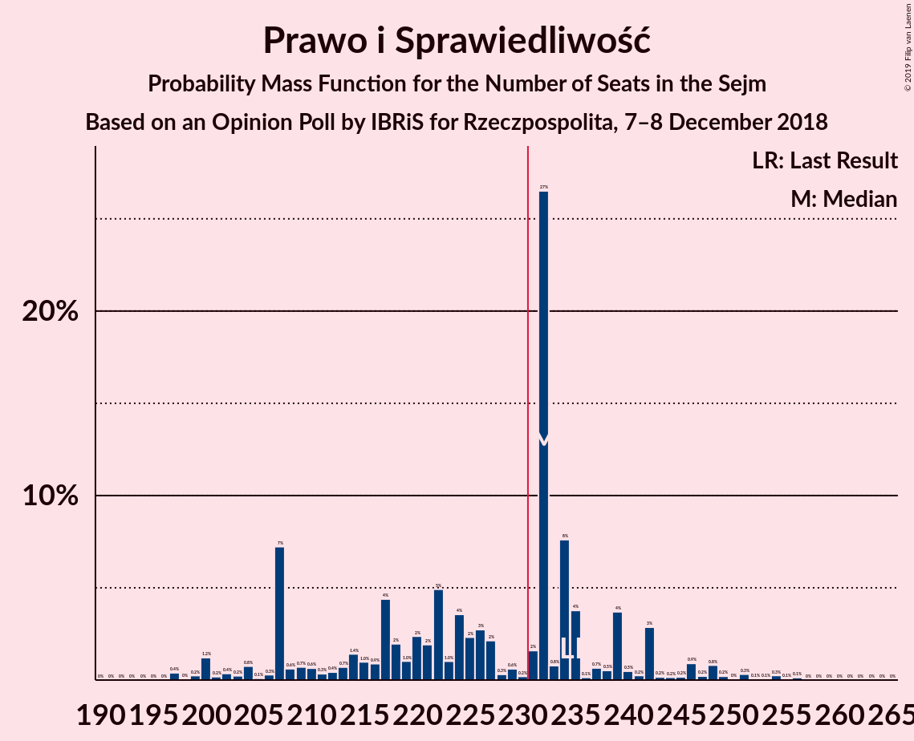
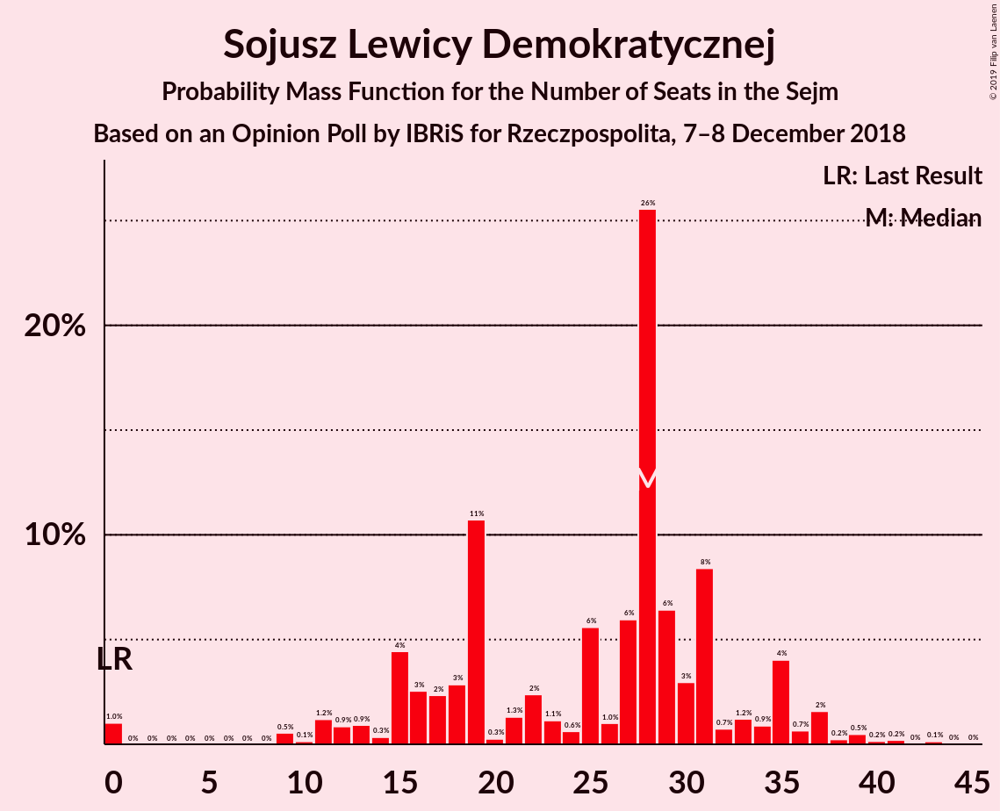
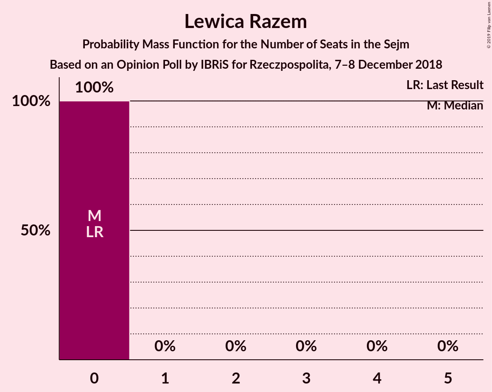
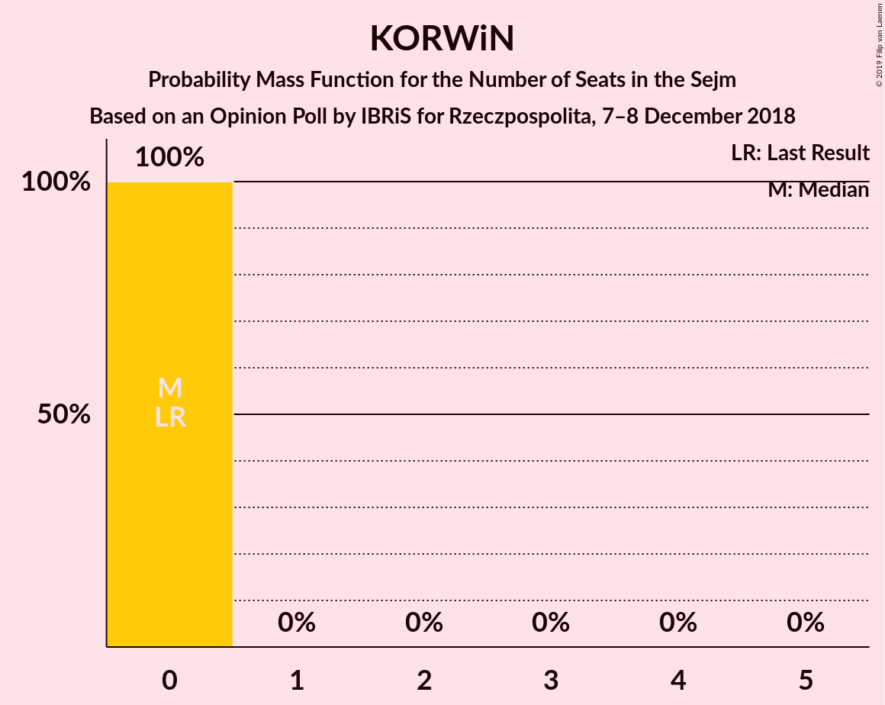
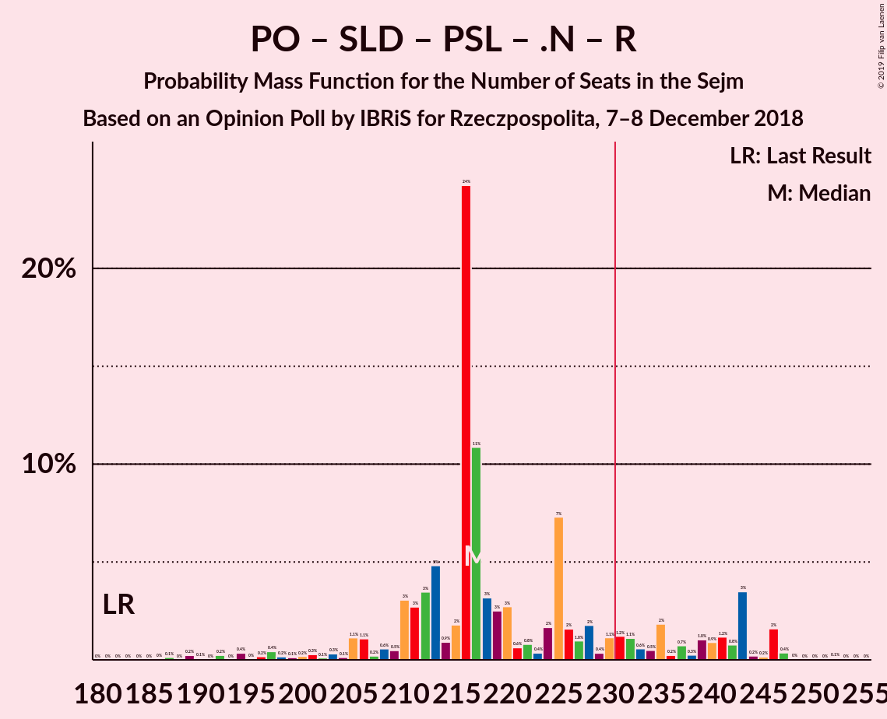
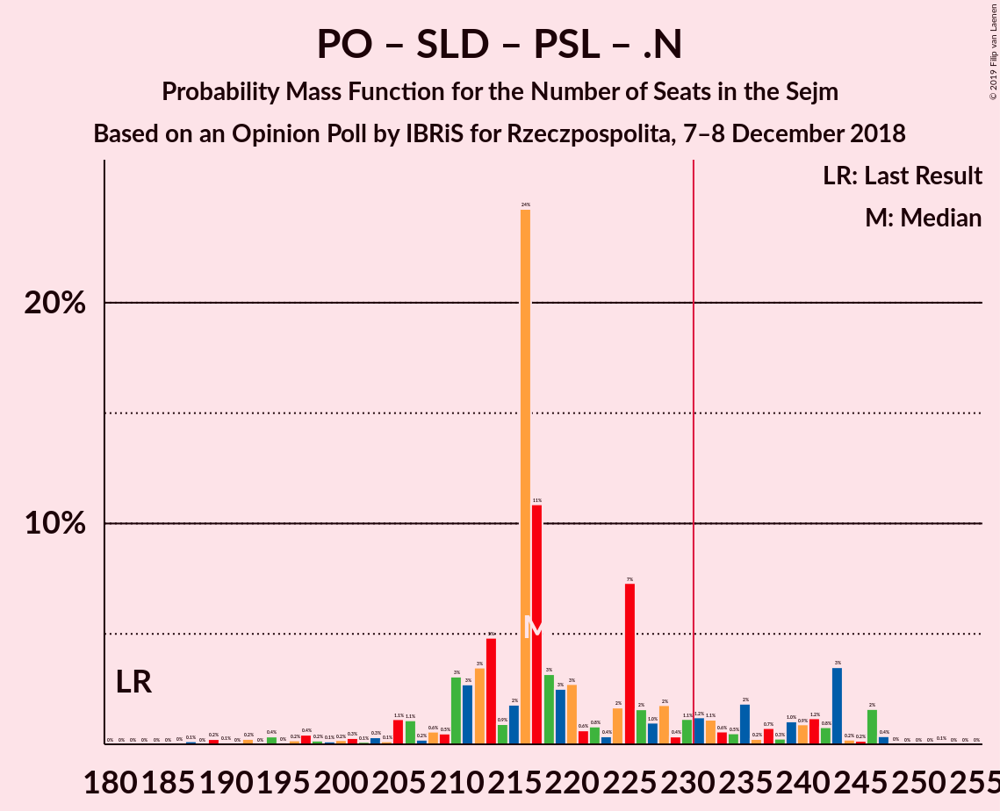

# Opinion Poll by IBRiS for Rzeczpospolita, 7–8 December 2018

<a href="#voting-intentions">Voting Intentions</a> | <a href="#seats">Seats</a> | <a href="#coalitions">Coalitions</a> | <a href="#technical-information">Technical Information</a>

## Voting Intentions

### Confidence Intervals

| Party | Last Result | Poll Result | 80% Confidence Interval | 90% Confidence Interval | 95% Confidence Interval | 99% Confidence Interval |
|:-----:|:-----------:|:-----------:|:-----------------------:|:-----------------------:|:-----------------------:|:-----------------------:|
| Prawo i Sprawiedliwość | 37.6% | 37.2% | 35.3–39.2% |34.7–39.8% |34.2–40.3% |33.3–41.2% |
| Platforma Obywatelska | 24.1% | 31.3% | 29.5–33.2% |28.9–33.8% |28.5–34.2% |27.6–35.2% |
| Sojusz Lewicy Demokratycznej | 7.6% | 6.7% | 5.8–7.8% |5.5–8.2% |5.3–8.4% |4.9–9.0% |
| Kukiz’15 | 8.8% | 5.7% | 4.9–6.8% |4.6–7.1% |4.4–7.3% |4.1–7.9% |
| Polskie Stronnictwo Ludowe | 5.1% | 5.1% | 4.3–6.1% |4.1–6.4% |3.9–6.6% |3.6–7.2% |
| .Nowoczesna | 7.6% | 4.0% | 3.3–4.9% |3.1–5.2% |2.9–5.4% |2.7–5.9% |
| Lewica Razem | 3.6% | 2.4% | 1.9–3.2% |1.7–3.4% |1.6–3.6% |1.4–3.9% |
| KORWiN | 4.8% | 0.9% | 0.6–1.4% |0.5–1.6% |0.5–1.7% |0.4–2.0% |

*Note:* The poll result column reflects the actual value used in the calculations. Published results may vary slightly, and in addition be rounded to fewer digits.

## Seats

### Confidence Intervals

| Party | Last Result | Median | 80% Confidence Interval | 90% Confidence Interval | 95% Confidence Interval | 99% Confidence Interval |
|:-----:|:-----------:|:------:|:-----------------------:|:-----------------------:|:-----------------------:|:-----------------------:|
| <a href="#prawo-i-sprawiedliwość">Prawo i Sprawiedliwość</a> | 235 | 250 | 215–252 |215–252 |215–252 |194–254 |
| <a href="#platforma-obywatelska">Platforma Obywatelska</a> | 138 | 181 | 169–182 |158–182 |153–182 |153–199 |
| <a href="#sojusz-lewicy-demokratycznej">Sojusz Lewicy Demokratycznej</a> | 0 | 26 | 26–36 |26–36 |25–37 |11–47 |
| <a href="#kukiz’15">Kukiz’15</a> | 42 | 0 | 0–21 |0–26 |0–26 |0–44 |
| <a href="#polskie-stronnictwo-ludowe">Polskie Stronnictwo Ludowe</a> | 16 | 0 | 0–17 |0–20 |0–23 |0–27 |
| <a href="#.nowoczesna">.Nowoczesna</a> | 28 | 0 | 0 |0 |0–8 |0–8 |
| <a href="#lewica-razem">Lewica Razem</a> | 0 | 0 | 0 |0 |0 |0 |
| <a href="#korwin">KORWiN</a> | 0 | 0 | 0 |0 |0 |0 |

### Prawo i Sprawiedliwość

*For a full overview of the results for this party, see the [Prawo i Sprawiedliwość](party-prawoisprawiedliwość.html) page.*

| Number of Seats | Probability | Accumulated | Special Marks |
|:---------------:|:-----------:|:-----------:|:-------------:|
| 188 | 0.2% | 100% |  |
| 189 | 0% | 99.8% |  |
| 190 | 0% | 99.8% |  |
| 191 | 0% | 99.8% |  |
| 192 | 0.1% | 99.8% |  |
| 193 | 0% | 99.7% |  |
| 194 | 0.5% | 99.7% |  |
| 195 | 0% | 99.3% |  |
| 196 | 0% | 99.3% |  |
| 197 | 0% | 99.3% |  |
| 198 | 0% | 99.3% |  |
| 199 | 0% | 99.2% |  |
| 200 | 0% | 99.2% |  |
| 201 | 0% | 99.2% |  |
| 202 | 0% | 99.2% |  |
| 203 | 0% | 99.2% |  |
| 204 | 0% | 99.2% |  |
| 205 | 0% | 99.2% |  |
| 206 | 0% | 99.2% |  |
| 207 | 0% | 99.2% |  |
| 208 | 0% | 99.2% |  |
| 209 | 0% | 99.2% |  |
| 210 | 0% | 99.2% |  |
| 211 | 0% | 99.2% |  |
| 212 | 0% | 99.2% |  |
| 213 | 0% | 99.2% |  |
| 214 | 0.1% | 99.2% |  |
| 215 | 34% | 99.2% |  |
| 216 | 0% | 65% |  |
| 217 | 0.1% | 65% |  |
| 218 | 0.9% | 65% |  |
| 219 | 0% | 65% |  |
| 220 | 0% | 65% |  |
| 221 | 0% | 65% |  |
| 222 | 0% | 65% |  |
| 223 | 0% | 65% |  |
| 224 | 0% | 65% |  |
| 225 | 0% | 65% |  |
| 226 | 4% | 65% |  |
| 227 | 0% | 61% |  |
| 228 | 0% | 61% |  |
| 229 | 0% | 61% |  |
| 230 | 0% | 61% |  |
| 231 | 0% | 61% | Majority |
| 232 | 0.4% | 61% |  |
| 233 | 0.4% | 60% |  |
| 234 | 0% | 60% |  |
| 235 | 0.1% | 60% | Last Result |
| 236 | 0.8% | 60% |  |
| 237 | 0.2% | 59% |  |
| 238 | 5% | 59% |  |
| 239 | 3% | 54% |  |
| 240 | 0% | 51% |  |
| 241 | 0% | 51% |  |
| 242 | 0% | 51% |  |
| 243 | 0.1% | 51% |  |
| 244 | 0% | 50% |  |
| 245 | 0% | 50% |  |
| 246 | 0% | 50% |  |
| 247 | 0% | 50% |  |
| 248 | 0% | 50% |  |
| 249 | 0% | 50% |  |
| 250 | 0.8% | 50% | Median |
| 251 | 0% | 50% |  |
| 252 | 48% | 50% |  |
| 253 | 0% | 1.4% |  |
| 254 | 1.4% | 1.4% |  |
| 255 | 0% | 0% |  |

### Platforma Obywatelska

*For a full overview of the results for this party, see the [Platforma Obywatelska](party-platformaobywatelska.html) page.*

| Number of Seats | Probability | Accumulated | Special Marks |
|:---------------:|:-----------:|:-----------:|:-------------:|
| 138 | 0% | 100% | Last Result |
| 139 | 0% | 100% |  |
| 140 | 0% | 100% |  |
| 141 | 0% | 100% |  |
| 142 | 0% | 100% |  |
| 143 | 0% | 100% |  |
| 144 | 0% | 100% |  |
| 145 | 0% | 100% |  |
| 146 | 0% | 100% |  |
| 147 | 0% | 100% |  |
| 148 | 0% | 100% |  |
| 149 | 0% | 100% |  |
| 150 | 0% | 100% |  |
| 151 | 0% | 100% |  |
| 152 | 0% | 100% |  |
| 153 | 5% | 100% |  |
| 154 | 0% | 95% |  |
| 155 | 0% | 95% |  |
| 156 | 0% | 95% |  |
| 157 | 0% | 95% |  |
| 158 | 0.1% | 95% |  |
| 159 | 0% | 95% |  |
| 160 | 0% | 95% |  |
| 161 | 0.1% | 95% |  |
| 162 | 0.1% | 95% |  |
| 163 | 0.8% | 95% |  |
| 164 | 0% | 94% |  |
| 165 | 0.2% | 94% |  |
| 166 | 0% | 94% |  |
| 167 | 0.1% | 94% |  |
| 168 | 0.2% | 94% |  |
| 169 | 4% | 94% |  |
| 170 | 0% | 89% |  |
| 171 | 34% | 89% |  |
| 172 | 0% | 55% |  |
| 173 | 4% | 55% |  |
| 174 | 0% | 51% |  |
| 175 | 0% | 51% |  |
| 176 | 0% | 51% |  |
| 177 | 0.8% | 51% |  |
| 178 | 0% | 50% |  |
| 179 | 0% | 50% |  |
| 180 | 0% | 50% |  |
| 181 | 1.4% | 50% | Median |
| 182 | 48% | 49% |  |
| 183 | 0% | 0.8% |  |
| 184 | 0% | 0.8% |  |
| 185 | 0% | 0.8% |  |
| 186 | 0% | 0.8% |  |
| 187 | 0% | 0.8% |  |
| 188 | 0% | 0.8% |  |
| 189 | 0% | 0.8% |  |
| 190 | 0% | 0.8% |  |
| 191 | 0% | 0.8% |  |
| 192 | 0% | 0.8% |  |
| 193 | 0.3% | 0.8% |  |
| 194 | 0% | 0.5% |  |
| 195 | 0% | 0.5% |  |
| 196 | 0% | 0.5% |  |
| 197 | 0% | 0.5% |  |
| 198 | 0% | 0.5% |  |
| 199 | 0.5% | 0.5% |  |
| 200 | 0% | 0.1% |  |
| 201 | 0% | 0.1% |  |
| 202 | 0% | 0.1% |  |
| 203 | 0% | 0.1% |  |
| 204 | 0% | 0% |  |

### Sojusz Lewicy Demokratycznej

*For a full overview of the results for this party, see the [Sojusz Lewicy Demokratycznej](party-sojuszlewicydemokratycznej.html) page.*

| Number of Seats | Probability | Accumulated | Special Marks |
|:---------------:|:-----------:|:-----------:|:-------------:|
| 0 | 0.1% | 100% | Last Result |
| 1 | 0% | 99.9% |  |
| 2 | 0% | 99.9% |  |
| 3 | 0% | 99.9% |  |
| 4 | 0% | 99.9% |  |
| 5 | 0% | 99.9% |  |
| 6 | 0% | 99.9% |  |
| 7 | 0% | 99.9% |  |
| 8 | 0% | 99.9% |  |
| 9 | 0% | 99.9% |  |
| 10 | 0% | 99.9% |  |
| 11 | 1.0% | 99.9% |  |
| 12 | 0.1% | 98.9% |  |
| 13 | 0.2% | 98.9% |  |
| 14 | 0% | 98.7% |  |
| 15 | 0% | 98.7% |  |
| 16 | 0% | 98.7% |  |
| 17 | 0% | 98.7% |  |
| 18 | 0% | 98.7% |  |
| 19 | 0% | 98.7% |  |
| 20 | 0% | 98.7% |  |
| 21 | 0% | 98.7% |  |
| 22 | 0% | 98.7% |  |
| 23 | 0% | 98.7% |  |
| 24 | 0% | 98.7% |  |
| 25 | 1.4% | 98.7% |  |
| 26 | 52% | 97% | Median |
| 27 | 4% | 45% |  |
| 28 | 2% | 42% |  |
| 29 | 0.1% | 40% |  |
| 30 | 0.2% | 40% |  |
| 31 | 0% | 40% |  |
| 32 | 0% | 40% |  |
| 33 | 0.5% | 40% |  |
| 34 | 0.7% | 39% |  |
| 35 | 0.6% | 39% |  |
| 36 | 34% | 38% |  |
| 37 | 3% | 4% |  |
| 38 | 0% | 1.0% |  |
| 39 | 0% | 1.0% |  |
| 40 | 0% | 1.0% |  |
| 41 | 0% | 1.0% |  |
| 42 | 0% | 1.0% |  |
| 43 | 0.1% | 1.0% |  |
| 44 | 0.1% | 0.9% |  |
| 45 | 0% | 0.8% |  |
| 46 | 0% | 0.8% |  |
| 47 | 0.8% | 0.8% |  |
| 48 | 0% | 0% |  |

### Kukiz’15

*For a full overview of the results for this party, see the [Kukiz’15](party-kukiz’15.html) page.*

| Number of Seats | Probability | Accumulated | Special Marks |
|:---------------:|:-----------:|:-----------:|:-------------:|
| 0 | 54% | 100% | Median |
| 1 | 0% | 46% |  |
| 2 | 0% | 46% |  |
| 3 | 0% | 46% |  |
| 4 | 0.1% | 46% |  |
| 5 | 0% | 45% |  |
| 6 | 0% | 45% |  |
| 7 | 0.5% | 45% |  |
| 8 | 0% | 45% |  |
| 9 | 0% | 45% |  |
| 10 | 0% | 45% |  |
| 11 | 0% | 45% |  |
| 12 | 0% | 45% |  |
| 13 | 0% | 45% |  |
| 14 | 0% | 45% |  |
| 15 | 0.1% | 45% |  |
| 16 | 0% | 45% |  |
| 17 | 0% | 45% |  |
| 18 | 0% | 45% |  |
| 19 | 0% | 45% |  |
| 20 | 5% | 45% |  |
| 21 | 34% | 40% |  |
| 22 | 0% | 6% |  |
| 23 | 0.2% | 6% |  |
| 24 | 0.1% | 6% |  |
| 25 | 0% | 6% |  |
| 26 | 5% | 6% |  |
| 27 | 0% | 1.3% |  |
| 28 | 0% | 1.3% |  |
| 29 | 0% | 1.3% |  |
| 30 | 0% | 1.3% |  |
| 31 | 0% | 1.3% |  |
| 32 | 0% | 1.3% |  |
| 33 | 0.2% | 1.3% |  |
| 34 | 0% | 1.1% |  |
| 35 | 0% | 1.1% |  |
| 36 | 0% | 1.1% |  |
| 37 | 0% | 1.1% |  |
| 38 | 0% | 1.1% |  |
| 39 | 0% | 1.1% |  |
| 40 | 0% | 1.1% |  |
| 41 | 0% | 1.1% |  |
| 42 | 0% | 1.1% | Last Result |
| 43 | 0.2% | 1.1% |  |
| 44 | 0.9% | 0.9% |  |
| 45 | 0% | 0% |  |

### Polskie Stronnictwo Ludowe

*For a full overview of the results for this party, see the [Polskie Stronnictwo Ludowe](party-polskiestronnictwoludowe.html) page.*

| Number of Seats | Probability | Accumulated | Special Marks |
|:---------------:|:-----------:|:-----------:|:-------------:|
| 0 | 56% | 100% | Median |
| 1 | 0% | 44% |  |
| 2 | 0% | 44% |  |
| 3 | 0% | 44% |  |
| 4 | 0% | 44% |  |
| 5 | 0% | 44% |  |
| 6 | 0% | 44% |  |
| 7 | 0% | 44% |  |
| 8 | 0% | 44% |  |
| 9 | 0% | 44% |  |
| 10 | 0% | 44% |  |
| 11 | 0% | 44% |  |
| 12 | 0% | 44% |  |
| 13 | 0% | 44% |  |
| 14 | 0% | 44% |  |
| 15 | 6% | 44% |  |
| 16 | 0% | 39% | Last Result |
| 17 | 34% | 39% |  |
| 18 | 0.1% | 5% |  |
| 19 | 0% | 5% |  |
| 20 | 0.2% | 5% |  |
| 21 | 0% | 5% |  |
| 22 | 0% | 5% |  |
| 23 | 3% | 5% |  |
| 24 | 0.8% | 2% |  |
| 25 | 0.1% | 0.8% |  |
| 26 | 0.2% | 0.7% |  |
| 27 | 0.5% | 0.5% |  |
| 28 | 0% | 0% |  |

### .Nowoczesna

*For a full overview of the results for this party, see the [.Nowoczesna](party-nowoczesna.html) page.*

| Number of Seats | Probability | Accumulated | Special Marks |
|:---------------:|:-----------:|:-----------:|:-------------:|
| 0 | 96% | 100% | Median |
| 1 | 0% | 4% |  |
| 2 | 0% | 4% |  |
| 3 | 0% | 4% |  |
| 4 | 0% | 4% |  |
| 5 | 0% | 4% |  |
| 6 | 0% | 4% |  |
| 7 | 0% | 4% |  |
| 8 | 4% | 4% |  |
| 9 | 0% | 0.2% |  |
| 10 | 0% | 0.2% |  |
| 11 | 0% | 0.2% |  |
| 12 | 0.2% | 0.2% |  |
| 13 | 0% | 0% |  |
| 14 | 0% | 0% |  |
| 15 | 0% | 0% |  |
| 16 | 0% | 0% |  |
| 17 | 0% | 0% |  |
| 18 | 0% | 0% |  |
| 19 | 0% | 0% |  |
| 20 | 0% | 0% |  |
| 21 | 0% | 0% |  |
| 22 | 0% | 0% |  |
| 23 | 0% | 0% |  |
| 24 | 0% | 0% |  |
| 25 | 0% | 0% |  |
| 26 | 0% | 0% |  |
| 27 | 0% | 0% |  |
| 28 | 0% | 0% | Last Result |

### Lewica Razem

*For a full overview of the results for this party, see the [Lewica Razem](party-lewicarazem.html) page.*

| Number of Seats | Probability | Accumulated | Special Marks |
|:---------------:|:-----------:|:-----------:|:-------------:|
| 0 | 100% | 100% | Last Result, Median |

### KORWiN

*For a full overview of the results for this party, see the [KORWiN](party-korwin.html) page.*

| Number of Seats | Probability | Accumulated | Special Marks |
|:---------------:|:-----------:|:-----------:|:-------------:|
| 0 | 100% | 100% | Last Result, Median |

## Coalitions

### Confidence Intervals

| Coalition | Last Result | Median | Majority? | 80% Confidence Interval | 90% Confidence Interval | 95% Confidence Interval | 99% Confidence Interval |
|:---------:|:-----------:|:------:|:---------:|:-----------------------:|:-----------------------:|:-----------------------:|:-----------------------:|
| Prawo i Sprawiedliwość | 235 | 250 | 61% | 215–252 | 215–252 | 215–252 | 194–254 |
| Platforma Obywatelska – Sojusz Lewicy Demokratycznej – Polskie Stronnictwo Ludowe – .Nowoczesna – Lewica Razem | 182 | 208 | 0.8% | 208–224 | 196–224 | 195–224 | 180–249 |
| Platforma Obywatelska – Sojusz Lewicy Demokratycznej – Polskie Stronnictwo Ludowe – .Nowoczesna | 182 | 208 | 0.8% | 208–224 | 196–224 | 195–224 | 180–249 |
| Platforma Obywatelska – Sojusz Lewicy Demokratycznej – .Nowoczesna | 166 | 208 | 0.5% | 204–208 | 181–210 | 180–214 | 180–232 |
| Platforma Obywatelska – Polskie Stronnictwo Ludowe – .Nowoczesna | 182 | 182 | 0% | 177–188 | 168–188 | 168–196 | 163–226 |
| Platforma Obywatelska – .Nowoczesna | 166 | 181 | 0% | 171–182 | 161–182 | 153–182 | 153–199 |
| Platforma Obywatelska | 138 | 181 | 0% | 169–182 | 158–182 | 153–182 | 153–199 |

### Prawo i Sprawiedliwość

| Number of Seats | Probability | Accumulated | Special Marks |
|:---------------:|:-----------:|:-----------:|:-------------:|
| 188 | 0.2% | 100% |  |
| 189 | 0% | 99.8% |  |
| 190 | 0% | 99.8% |  |
| 191 | 0% | 99.8% |  |
| 192 | 0.1% | 99.8% |  |
| 193 | 0% | 99.7% |  |
| 194 | 0.5% | 99.7% |  |
| 195 | 0% | 99.3% |  |
| 196 | 0% | 99.3% |  |
| 197 | 0% | 99.3% |  |
| 198 | 0% | 99.3% |  |
| 199 | 0% | 99.2% |  |
| 200 | 0% | 99.2% |  |
| 201 | 0% | 99.2% |  |
| 202 | 0% | 99.2% |  |
| 203 | 0% | 99.2% |  |
| 204 | 0% | 99.2% |  |
| 205 | 0% | 99.2% |  |
| 206 | 0% | 99.2% |  |
| 207 | 0% | 99.2% |  |
| 208 | 0% | 99.2% |  |
| 209 | 0% | 99.2% |  |
| 210 | 0% | 99.2% |  |
| 211 | 0% | 99.2% |  |
| 212 | 0% | 99.2% |  |
| 213 | 0% | 99.2% |  |
| 214 | 0.1% | 99.2% |  |
| 215 | 34% | 99.2% |  |
| 216 | 0% | 65% |  |
| 217 | 0.1% | 65% |  |
| 218 | 0.9% | 65% |  |
| 219 | 0% | 65% |  |
| 220 | 0% | 65% |  |
| 221 | 0% | 65% |  |
| 222 | 0% | 65% |  |
| 223 | 0% | 65% |  |
| 224 | 0% | 65% |  |
| 225 | 0% | 65% |  |
| 226 | 4% | 65% |  |
| 227 | 0% | 61% |  |
| 228 | 0% | 61% |  |
| 229 | 0% | 61% |  |
| 230 | 0% | 61% |  |
| 231 | 0% | 61% | Majority |
| 232 | 0.4% | 61% |  |
| 233 | 0.4% | 60% |  |
| 234 | 0% | 60% |  |
| 235 | 0.1% | 60% | Last Result |
| 236 | 0.8% | 60% |  |
| 237 | 0.2% | 59% |  |
| 238 | 5% | 59% |  |
| 239 | 3% | 54% |  |
| 240 | 0% | 51% |  |
| 241 | 0% | 51% |  |
| 242 | 0% | 51% |  |
| 243 | 0.1% | 51% |  |
| 244 | 0% | 50% |  |
| 245 | 0% | 50% |  |
| 246 | 0% | 50% |  |
| 247 | 0% | 50% |  |
| 248 | 0% | 50% |  |
| 249 | 0% | 50% |  |
| 250 | 0.8% | 50% | Median |
| 251 | 0% | 50% |  |
| 252 | 48% | 50% |  |
| 253 | 0% | 1.4% |  |
| 254 | 1.4% | 1.4% |  |
| 255 | 0% | 0% |  |

### Platforma Obywatelska – Sojusz Lewicy Demokratycznej – Polskie Stronnictwo Ludowe – .Nowoczesna – Lewica Razem

| Number of Seats | Probability | Accumulated | Special Marks |
|:---------------:|:-----------:|:-----------:|:-------------:|
| 180 | 0.8% | 100% |  |
| 181 | 0% | 99.2% |  |
| 182 | 0% | 99.1% | Last Result |
| 183 | 0% | 99.1% |  |
| 184 | 0% | 99.1% |  |
| 185 | 0% | 99.1% |  |
| 186 | 0% | 99.1% |  |
| 187 | 0% | 99.1% |  |
| 188 | 0% | 99.1% |  |
| 189 | 0% | 99.1% |  |
| 190 | 0.2% | 99.1% |  |
| 191 | 0% | 99.0% |  |
| 192 | 0% | 99.0% |  |
| 193 | 0% | 99.0% |  |
| 194 | 0% | 99.0% |  |
| 195 | 3% | 99.0% |  |
| 196 | 2% | 96% |  |
| 197 | 0% | 94% |  |
| 198 | 0% | 94% |  |
| 199 | 0.2% | 94% |  |
| 200 | 0% | 94% |  |
| 201 | 0% | 94% |  |
| 202 | 0.1% | 94% |  |
| 203 | 0% | 94% |  |
| 204 | 0% | 94% |  |
| 205 | 0% | 94% |  |
| 206 | 1.4% | 94% |  |
| 207 | 0% | 92% | Median |
| 208 | 48% | 92% |  |
| 209 | 0% | 44% |  |
| 210 | 0.8% | 44% |  |
| 211 | 0% | 43% |  |
| 212 | 0% | 43% |  |
| 213 | 0% | 43% |  |
| 214 | 4% | 43% |  |
| 215 | 0% | 39% |  |
| 216 | 0% | 39% |  |
| 217 | 0% | 39% |  |
| 218 | 0% | 39% |  |
| 219 | 0% | 39% |  |
| 220 | 0% | 39% |  |
| 221 | 0.1% | 39% |  |
| 222 | 4% | 39% |  |
| 223 | 0% | 35% |  |
| 224 | 34% | 35% |  |
| 225 | 0% | 2% |  |
| 226 | 0% | 2% |  |
| 227 | 0.4% | 2% |  |
| 228 | 0.4% | 1.2% |  |
| 229 | 0% | 0.8% |  |
| 230 | 0% | 0.8% |  |
| 231 | 0% | 0.8% | Majority |
| 232 | 0% | 0.8% |  |
| 233 | 0% | 0.8% |  |
| 234 | 0% | 0.8% |  |
| 235 | 0% | 0.8% |  |
| 236 | 0% | 0.8% |  |
| 237 | 0% | 0.8% |  |
| 238 | 0% | 0.8% |  |
| 239 | 0% | 0.8% |  |
| 240 | 0% | 0.8% |  |
| 241 | 0% | 0.8% |  |
| 242 | 0% | 0.8% |  |
| 243 | 0% | 0.8% |  |
| 244 | 0% | 0.8% |  |
| 245 | 0% | 0.8% |  |
| 246 | 0% | 0.8% |  |
| 247 | 0.1% | 0.8% |  |
| 248 | 0% | 0.7% |  |
| 249 | 0.2% | 0.7% |  |
| 250 | 0% | 0.5% |  |
| 251 | 0% | 0.5% |  |
| 252 | 0% | 0.5% |  |
| 253 | 0% | 0.5% |  |
| 254 | 0% | 0.5% |  |
| 255 | 0% | 0.5% |  |
| 256 | 0% | 0.5% |  |
| 257 | 0% | 0.5% |  |
| 258 | 0% | 0.5% |  |
| 259 | 0.5% | 0.5% |  |
| 260 | 0% | 0% |  |

### Platforma Obywatelska – Sojusz Lewicy Demokratycznej – Polskie Stronnictwo Ludowe – .Nowoczesna

| Number of Seats | Probability | Accumulated | Special Marks |
|:---------------:|:-----------:|:-----------:|:-------------:|
| 180 | 0.8% | 100% |  |
| 181 | 0% | 99.2% |  |
| 182 | 0% | 99.1% | Last Result |
| 183 | 0% | 99.1% |  |
| 184 | 0% | 99.1% |  |
| 185 | 0% | 99.1% |  |
| 186 | 0% | 99.1% |  |
| 187 | 0% | 99.1% |  |
| 188 | 0% | 99.1% |  |
| 189 | 0% | 99.1% |  |
| 190 | 0.2% | 99.1% |  |
| 191 | 0% | 99.0% |  |
| 192 | 0% | 99.0% |  |
| 193 | 0% | 99.0% |  |
| 194 | 0% | 99.0% |  |
| 195 | 3% | 99.0% |  |
| 196 | 2% | 96% |  |
| 197 | 0% | 94% |  |
| 198 | 0% | 94% |  |
| 199 | 0.2% | 94% |  |
| 200 | 0% | 94% |  |
| 201 | 0% | 94% |  |
| 202 | 0.1% | 94% |  |
| 203 | 0% | 94% |  |
| 204 | 0% | 94% |  |
| 205 | 0% | 94% |  |
| 206 | 1.4% | 94% |  |
| 207 | 0% | 92% | Median |
| 208 | 48% | 92% |  |
| 209 | 0% | 44% |  |
| 210 | 0.8% | 44% |  |
| 211 | 0% | 43% |  |
| 212 | 0% | 43% |  |
| 213 | 0% | 43% |  |
| 214 | 4% | 43% |  |
| 215 | 0% | 39% |  |
| 216 | 0% | 39% |  |
| 217 | 0% | 39% |  |
| 218 | 0% | 39% |  |
| 219 | 0% | 39% |  |
| 220 | 0% | 39% |  |
| 221 | 0.1% | 39% |  |
| 222 | 4% | 39% |  |
| 223 | 0% | 35% |  |
| 224 | 34% | 35% |  |
| 225 | 0% | 2% |  |
| 226 | 0% | 2% |  |
| 227 | 0.4% | 2% |  |
| 228 | 0.4% | 1.2% |  |
| 229 | 0% | 0.8% |  |
| 230 | 0% | 0.8% |  |
| 231 | 0% | 0.8% | Majority |
| 232 | 0% | 0.8% |  |
| 233 | 0% | 0.8% |  |
| 234 | 0% | 0.8% |  |
| 235 | 0% | 0.8% |  |
| 236 | 0% | 0.8% |  |
| 237 | 0% | 0.8% |  |
| 238 | 0% | 0.8% |  |
| 239 | 0% | 0.8% |  |
| 240 | 0% | 0.8% |  |
| 241 | 0% | 0.8% |  |
| 242 | 0% | 0.8% |  |
| 243 | 0% | 0.8% |  |
| 244 | 0% | 0.8% |  |
| 245 | 0% | 0.8% |  |
| 246 | 0% | 0.8% |  |
| 247 | 0.1% | 0.8% |  |
| 248 | 0% | 0.7% |  |
| 249 | 0.2% | 0.7% |  |
| 250 | 0% | 0.5% |  |
| 251 | 0% | 0.5% |  |
| 252 | 0% | 0.5% |  |
| 253 | 0% | 0.5% |  |
| 254 | 0% | 0.5% |  |
| 255 | 0% | 0.5% |  |
| 256 | 0% | 0.5% |  |
| 257 | 0% | 0.5% |  |
| 258 | 0% | 0.5% |  |
| 259 | 0.5% | 0.5% |  |
| 260 | 0% | 0% |  |

### Platforma Obywatelska – Sojusz Lewicy Demokratycznej – .Nowoczesna

| Number of Seats | Probability | Accumulated | Special Marks |
|:---------------:|:-----------:|:-----------:|:-------------:|
| 166 | 0% | 100% | Last Result |
| 167 | 0% | 100% |  |
| 168 | 0% | 100% |  |
| 169 | 0% | 100% |  |
| 170 | 0% | 100% |  |
| 171 | 0% | 100% |  |
| 172 | 0% | 100% |  |
| 173 | 0% | 100% |  |
| 174 | 0% | 100% |  |
| 175 | 0% | 100% |  |
| 176 | 0% | 100% |  |
| 177 | 0% | 100% |  |
| 178 | 0% | 100% |  |
| 179 | 0.2% | 100% |  |
| 180 | 4% | 99.8% |  |
| 181 | 2% | 96% |  |
| 182 | 0% | 94% |  |
| 183 | 0% | 94% |  |
| 184 | 0% | 94% |  |
| 185 | 0% | 94% |  |
| 186 | 0% | 94% |  |
| 187 | 0% | 94% |  |
| 188 | 0% | 94% |  |
| 189 | 0% | 94% |  |
| 190 | 0.2% | 94% |  |
| 191 | 0% | 94% |  |
| 192 | 0% | 94% |  |
| 193 | 0% | 94% |  |
| 194 | 0% | 94% |  |
| 195 | 0% | 94% |  |
| 196 | 0% | 94% |  |
| 197 | 0% | 94% |  |
| 198 | 0.1% | 94% |  |
| 199 | 3% | 94% |  |
| 200 | 0% | 91% |  |
| 201 | 0% | 91% |  |
| 202 | 0.1% | 91% |  |
| 203 | 0.4% | 90% |  |
| 204 | 0.4% | 90% |  |
| 205 | 0.1% | 90% |  |
| 206 | 1.4% | 90% |  |
| 207 | 34% | 88% | Median |
| 208 | 48% | 54% |  |
| 209 | 0% | 5% |  |
| 210 | 0.8% | 5% |  |
| 211 | 0% | 5% |  |
| 212 | 0% | 5% |  |
| 213 | 0% | 5% |  |
| 214 | 4% | 5% |  |
| 215 | 0% | 0.8% |  |
| 216 | 0% | 0.8% |  |
| 217 | 0% | 0.8% |  |
| 218 | 0% | 0.8% |  |
| 219 | 0% | 0.8% |  |
| 220 | 0% | 0.8% |  |
| 221 | 0% | 0.8% |  |
| 222 | 0.1% | 0.8% |  |
| 223 | 0.2% | 0.7% |  |
| 224 | 0% | 0.5% |  |
| 225 | 0% | 0.5% |  |
| 226 | 0% | 0.5% |  |
| 227 | 0% | 0.5% |  |
| 228 | 0% | 0.5% |  |
| 229 | 0% | 0.5% |  |
| 230 | 0% | 0.5% |  |
| 231 | 0% | 0.5% | Majority |
| 232 | 0.5% | 0.5% |  |
| 233 | 0% | 0% |  |

### Platforma Obywatelska – Polskie Stronnictwo Ludowe – .Nowoczesna

| Number of Seats | Probability | Accumulated | Special Marks |
|:---------------:|:-----------:|:-----------:|:-------------:|
| 158 | 0.1% | 100% |  |
| 159 | 0% | 99.9% |  |
| 160 | 0% | 99.9% |  |
| 161 | 0% | 99.9% |  |
| 162 | 0% | 99.9% |  |
| 163 | 0.8% | 99.9% |  |
| 164 | 0% | 99.1% |  |
| 165 | 0% | 99.1% |  |
| 166 | 0% | 99.1% |  |
| 167 | 0% | 99.1% |  |
| 168 | 5% | 99.1% |  |
| 169 | 0.9% | 94% |  |
| 170 | 0% | 93% |  |
| 171 | 0% | 93% |  |
| 172 | 0% | 93% |  |
| 173 | 0% | 93% |  |
| 174 | 0% | 93% |  |
| 175 | 0% | 93% |  |
| 176 | 0% | 93% |  |
| 177 | 3% | 93% |  |
| 178 | 0% | 90% |  |
| 179 | 0.6% | 90% |  |
| 180 | 0% | 89% |  |
| 181 | 1.4% | 89% | Median |
| 182 | 48% | 88% | Last Result |
| 183 | 0% | 40% |  |
| 184 | 0.1% | 40% |  |
| 185 | 0.1% | 40% |  |
| 186 | 0.1% | 39% |  |
| 187 | 0.1% | 39% |  |
| 188 | 35% | 39% |  |
| 189 | 0% | 5% |  |
| 190 | 0% | 5% |  |
| 191 | 0% | 5% |  |
| 192 | 0% | 5% |  |
| 193 | 0% | 5% |  |
| 194 | 0.1% | 5% |  |
| 195 | 0% | 5% |  |
| 196 | 3% | 5% |  |
| 197 | 0% | 2% |  |
| 198 | 0% | 2% |  |
| 199 | 0% | 2% |  |
| 200 | 0% | 2% |  |
| 201 | 0.8% | 2% |  |
| 202 | 0% | 0.8% |  |
| 203 | 0% | 0.8% |  |
| 204 | 0% | 0.8% |  |
| 205 | 0% | 0.8% |  |
| 206 | 0% | 0.8% |  |
| 207 | 0% | 0.8% |  |
| 208 | 0% | 0.8% |  |
| 209 | 0% | 0.8% |  |
| 210 | 0% | 0.8% |  |
| 211 | 0% | 0.8% |  |
| 212 | 0% | 0.8% |  |
| 213 | 0% | 0.8% |  |
| 214 | 0% | 0.8% |  |
| 215 | 0% | 0.8% |  |
| 216 | 0% | 0.8% |  |
| 217 | 0% | 0.8% |  |
| 218 | 0.1% | 0.8% |  |
| 219 | 0.2% | 0.7% |  |
| 220 | 0% | 0.5% |  |
| 221 | 0% | 0.5% |  |
| 222 | 0% | 0.5% |  |
| 223 | 0% | 0.5% |  |
| 224 | 0% | 0.5% |  |
| 225 | 0% | 0.5% |  |
| 226 | 0.5% | 0.5% |  |
| 227 | 0% | 0% |  |

### Platforma Obywatelska – .Nowoczesna

| Number of Seats | Probability | Accumulated | Special Marks |
|:---------------:|:-----------:|:-----------:|:-------------:|
| 153 | 5% | 100% |  |
| 154 | 0% | 95% |  |
| 155 | 0% | 95% |  |
| 156 | 0% | 95% |  |
| 157 | 0% | 95% |  |
| 158 | 0.1% | 95% |  |
| 159 | 0% | 95% |  |
| 160 | 0% | 95% |  |
| 161 | 0.1% | 95% |  |
| 162 | 0.1% | 95% |  |
| 163 | 0.8% | 95% |  |
| 164 | 0% | 94% |  |
| 165 | 0% | 94% |  |
| 166 | 0% | 94% | Last Result |
| 167 | 0.1% | 94% |  |
| 168 | 0.2% | 94% |  |
| 169 | 0.9% | 94% |  |
| 170 | 0% | 93% |  |
| 171 | 34% | 93% |  |
| 172 | 0% | 59% |  |
| 173 | 4% | 59% |  |
| 174 | 0% | 55% |  |
| 175 | 0% | 55% |  |
| 176 | 0% | 55% |  |
| 177 | 4% | 55% |  |
| 178 | 0% | 51% |  |
| 179 | 0.6% | 51% |  |
| 180 | 0% | 50% |  |
| 181 | 1.4% | 50% | Median |
| 182 | 48% | 49% |  |
| 183 | 0% | 0.8% |  |
| 184 | 0% | 0.8% |  |
| 185 | 0% | 0.8% |  |
| 186 | 0% | 0.8% |  |
| 187 | 0% | 0.8% |  |
| 188 | 0% | 0.8% |  |
| 189 | 0% | 0.8% |  |
| 190 | 0% | 0.8% |  |
| 191 | 0% | 0.8% |  |
| 192 | 0% | 0.8% |  |
| 193 | 0.3% | 0.8% |  |
| 194 | 0% | 0.5% |  |
| 195 | 0% | 0.5% |  |
| 196 | 0% | 0.5% |  |
| 197 | 0% | 0.5% |  |
| 198 | 0% | 0.5% |  |
| 199 | 0.5% | 0.5% |  |
| 200 | 0% | 0.1% |  |
| 201 | 0% | 0.1% |  |
| 202 | 0% | 0.1% |  |
| 203 | 0% | 0.1% |  |
| 204 | 0% | 0% |  |

### Platforma Obywatelska

| Number of Seats | Probability | Accumulated | Special Marks |
|:---------------:|:-----------:|:-----------:|:-------------:|
| 138 | 0% | 100% | Last Result |
| 139 | 0% | 100% |  |
| 140 | 0% | 100% |  |
| 141 | 0% | 100% |  |
| 142 | 0% | 100% |  |
| 143 | 0% | 100% |  |
| 144 | 0% | 100% |  |
| 145 | 0% | 100% |  |
| 146 | 0% | 100% |  |
| 147 | 0% | 100% |  |
| 148 | 0% | 100% |  |
| 149 | 0% | 100% |  |
| 150 | 0% | 100% |  |
| 151 | 0% | 100% |  |
| 152 | 0% | 100% |  |
| 153 | 5% | 100% |  |
| 154 | 0% | 95% |  |
| 155 | 0% | 95% |  |
| 156 | 0% | 95% |  |
| 157 | 0% | 95% |  |
| 158 | 0.1% | 95% |  |
| 159 | 0% | 95% |  |
| 160 | 0% | 95% |  |
| 161 | 0.1% | 95% |  |
| 162 | 0.1% | 95% |  |
| 163 | 0.8% | 95% |  |
| 164 | 0% | 94% |  |
| 165 | 0.2% | 94% |  |
| 166 | 0% | 94% |  |
| 167 | 0.1% | 94% |  |
| 168 | 0.2% | 94% |  |
| 169 | 4% | 94% |  |
| 170 | 0% | 89% |  |
| 171 | 34% | 89% |  |
| 172 | 0% | 55% |  |
| 173 | 4% | 55% |  |
| 174 | 0% | 51% |  |
| 175 | 0% | 51% |  |
| 176 | 0% | 51% |  |
| 177 | 0.8% | 51% |  |
| 178 | 0% | 50% |  |
| 179 | 0% | 50% |  |
| 180 | 0% | 50% |  |
| 181 | 1.4% | 50% | Median |
| 182 | 48% | 49% |  |
| 183 | 0% | 0.8% |  |
| 184 | 0% | 0.8% |  |
| 185 | 0% | 0.8% |  |
| 186 | 0% | 0.8% |  |
| 187 | 0% | 0.8% |  |
| 188 | 0% | 0.8% |  |
| 189 | 0% | 0.8% |  |
| 190 | 0% | 0.8% |  |
| 191 | 0% | 0.8% |  |
| 192 | 0% | 0.8% |  |
| 193 | 0.3% | 0.8% |  |
| 194 | 0% | 0.5% |  |
| 195 | 0% | 0.5% |  |
| 196 | 0% | 0.5% |  |
| 197 | 0% | 0.5% |  |
| 198 | 0% | 0.5% |  |
| 199 | 0.5% | 0.5% |  |
| 200 | 0% | 0.1% |  |
| 201 | 0% | 0.1% |  |
| 202 | 0% | 0.1% |  |
| 203 | 0% | 0.1% |  |
| 204 | 0% | 0% |  |

## Technical Information

### Opinion Poll

+ **Polling firm:** IBRiS
+ **Commissioner(s):** Rzeczpospolita
+ **Fieldwork period:** 7–8 December 2018

### Calculations

+ **Sample size:** 1000
+ **Simulations done:** 1,024
+ **Error estimate:** 3.66%

