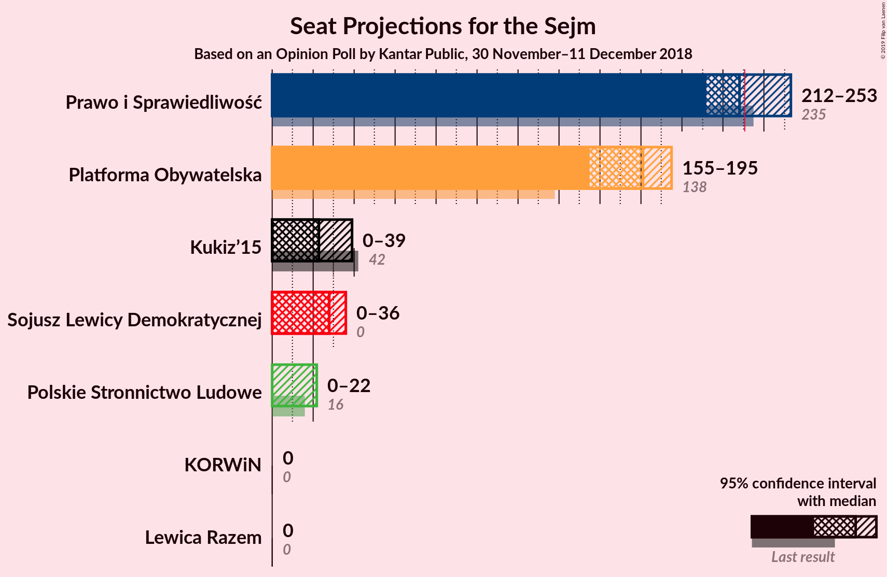
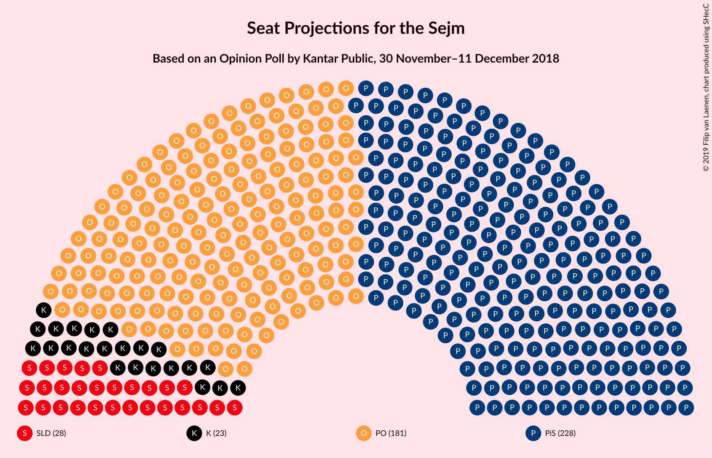
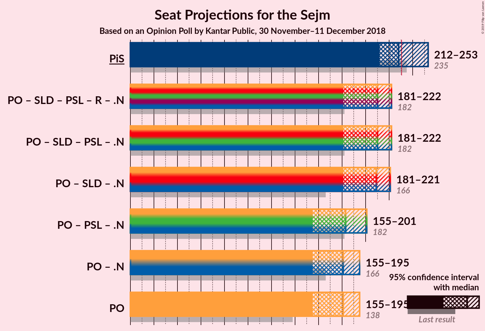
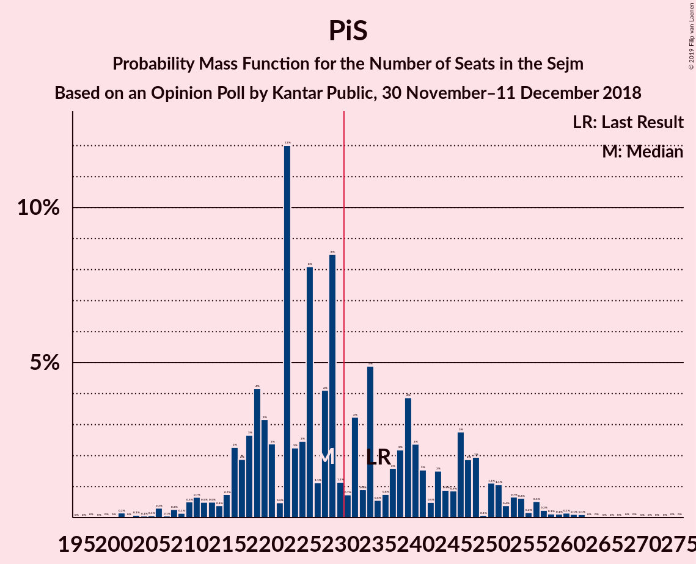

# Opinion Poll by Kantar Public, 30 November–11 December 2018

<a href="#voting-intentions">Voting Intentions</a> | <a href="#seats">Seats</a> | <a href="#coalitions">Coalitions</a> | <a href="#technical-information">Technical Information</a>

## Voting Intentions

### Confidence Intervals

| Party | Last Result | Poll Result | 80% Confidence Interval | 90% Confidence Interval | 95% Confidence Interval | 99% Confidence Interval |
|:-----:|:-----------:|:-----------:|:-----------------------:|:-----------------------:|:-----------------------:|:-----------------------:|
| Prawo i Sprawiedliwość | 37.6% | 34.0% | 32.2–36.0% |31.7–36.5% |31.2–37.0% |30.3–37.9% |
| Platforma Obywatelska | 24.1% | 27.0% | 25.3–28.9% |24.8–29.4% |24.4–29.8% |23.6–30.7% |
| Kukiz’15 | 8.8% | 6.0% | 5.2–7.1% |4.9–7.4% |4.7–7.7% |4.3–8.2% |
| Sojusz Lewicy Demokratycznej | 7.6% | 6.0% | 5.2–7.1% |4.9–7.4% |4.7–7.7% |4.3–8.2% |
| Polskie Stronnictwo Ludowe | 5.1% | 4.0% | 3.3–4.9% |3.1–5.2% |3.0–5.4% |2.7–5.8% |
| KORWiN | 4.8% | 2.0% | 1.6–2.7% |1.4–2.9% |1.3–3.1% |1.1–3.5% |
| Lewica Razem | 3.6% | 2.0% | 1.6–2.7% |1.4–2.9% |1.3–3.1% |1.1–3.5% |

*Note:* The poll result column reflects the actual value used in the calculations. Published results may vary slightly, and in addition be rounded to fewer digits.

## Seats

### Confidence Intervals

| Party | Last Result | Median | 80% Confidence Interval | 90% Confidence Interval | 95% Confidence Interval | 99% Confidence Interval |
|:-----:|:-----------:|:------:|:-----------------------:|:-----------------------:|:-----------------------:|:-----------------------:|
| <a href="#prawo-i-sprawiedliwość">Prawo i Sprawiedliwość</a> | 235 | 222 | 222–235 |215–235 |215–235 |215–237 |
| <a href="#platforma-obywatelska">Platforma Obywatelska</a> | 138 | 172 | 172–188 |163–188 |163–188 |163–189 |
| <a href="#kukiz’15">Kukiz’15</a> | 42 | 31 | 13–31 |13–31 |13–31 |11–31 |
| <a href="#sojusz-lewicy-demokratycznej">Sojusz Lewicy Demokratycznej</a> | 0 | 34 | 0–35 |0–35 |0–35 |0–35 |
| <a href="#polskie-stronnictwo-ludowe">Polskie Stronnictwo Ludowe</a> | 16 | 0 | 0–24 |0–24 |0–24 |0–24 |
| <a href="#korwin">KORWiN</a> | 0 | 0 | 0 |0 |0 |0 |
| <a href="#lewica-razem">Lewica Razem</a> | 0 | 0 | 0 |0 |0 |0 |

### Prawo i Sprawiedliwość

*For a full overview of the results for this party, see the [Prawo i Sprawiedliwość](party-prawoisprawiedliwość.html) page.*

| Number of Seats | Probability | Accumulated | Special Marks |
|:---------------:|:-----------:|:-----------:|:-------------:|
| 203 | 0.1% | 100% |  |
| 204 | 0% | 99.9% |  |
| 205 | 0.2% | 99.9% |  |
| 206 | 0% | 99.8% |  |
| 207 | 0% | 99.8% |  |
| 208 | 0% | 99.7% |  |
| 209 | 0% | 99.7% |  |
| 210 | 0% | 99.7% |  |
| 211 | 0% | 99.7% |  |
| 212 | 0% | 99.7% |  |
| 213 | 0% | 99.7% |  |
| 214 | 0% | 99.7% |  |
| 215 | 5% | 99.7% |  |
| 216 | 0% | 95% |  |
| 217 | 0% | 95% |  |
| 218 | 0% | 95% |  |
| 219 | 0% | 95% |  |
| 220 | 0% | 95% |  |
| 221 | 0% | 95% |  |
| 222 | 45% | 95% | Median |
| 223 | 0% | 49% |  |
| 224 | 26% | 49% |  |
| 225 | 0% | 23% |  |
| 226 | 0% | 23% |  |
| 227 | 4% | 23% |  |
| 228 | 0% | 19% |  |
| 229 | 0% | 19% |  |
| 230 | 0% | 19% |  |
| 231 | 0% | 19% | Majority |
| 232 | 0% | 19% |  |
| 233 | 0% | 19% |  |
| 234 | 0% | 19% |  |
| 235 | 17% | 19% | Last Result |
| 236 | 0% | 2% |  |
| 237 | 2% | 2% |  |
| 238 | 0% | 0% |  |

### Platforma Obywatelska

*For a full overview of the results for this party, see the [Platforma Obywatelska](party-platformaobywatelska.html) page.*

| Number of Seats | Probability | Accumulated | Special Marks |
|:---------------:|:-----------:|:-----------:|:-------------:|
| 138 | 0% | 100% | Last Result |
| 139 | 0% | 100% |  |
| 140 | 0% | 100% |  |
| 141 | 0% | 100% |  |
| 142 | 0% | 100% |  |
| 143 | 0% | 100% |  |
| 144 | 0% | 100% |  |
| 145 | 0% | 100% |  |
| 146 | 0% | 100% |  |
| 147 | 0% | 100% |  |
| 148 | 0% | 100% |  |
| 149 | 0% | 100% |  |
| 150 | 0% | 100% |  |
| 151 | 0% | 100% |  |
| 152 | 0% | 100% |  |
| 153 | 0.1% | 100% |  |
| 154 | 0% | 99.9% |  |
| 155 | 0.2% | 99.9% |  |
| 156 | 0% | 99.8% |  |
| 157 | 0% | 99.7% |  |
| 158 | 0% | 99.7% |  |
| 159 | 0% | 99.7% |  |
| 160 | 0% | 99.7% |  |
| 161 | 0% | 99.7% |  |
| 162 | 0% | 99.7% |  |
| 163 | 5% | 99.7% |  |
| 164 | 0% | 95% |  |
| 165 | 0% | 95% |  |
| 166 | 0% | 95% |  |
| 167 | 0% | 95% |  |
| 168 | 0% | 95% |  |
| 169 | 0% | 95% |  |
| 170 | 0% | 95% |  |
| 171 | 0% | 95% |  |
| 172 | 45% | 95% | Median |
| 173 | 28% | 49% |  |
| 174 | 0% | 22% |  |
| 175 | 0% | 22% |  |
| 176 | 0% | 22% |  |
| 177 | 0% | 22% |  |
| 178 | 0% | 22% |  |
| 179 | 0% | 22% |  |
| 180 | 0% | 22% |  |
| 181 | 0% | 22% |  |
| 182 | 0% | 22% |  |
| 183 | 0% | 22% |  |
| 184 | 3% | 22% |  |
| 185 | 0% | 19% |  |
| 186 | 0% | 19% |  |
| 187 | 0% | 19% |  |
| 188 | 17% | 19% |  |
| 189 | 2% | 2% |  |
| 190 | 0% | 0% |  |

### Kukiz’15

*For a full overview of the results for this party, see the [Kukiz’15](party-kukiz’15.html) page.*

| Number of Seats | Probability | Accumulated | Special Marks |
|:---------------:|:-----------:|:-----------:|:-------------:|
| 11 | 2% | 100% |  |
| 12 | 0% | 98% |  |
| 13 | 17% | 98% |  |
| 14 | 3% | 81% |  |
| 15 | 0% | 78% |  |
| 16 | 0% | 78% |  |
| 17 | 0% | 78% |  |
| 18 | 0% | 78% |  |
| 19 | 0% | 78% |  |
| 20 | 0% | 78% |  |
| 21 | 0% | 78% |  |
| 22 | 0% | 78% |  |
| 23 | 0% | 78% |  |
| 24 | 0% | 78% |  |
| 25 | 0% | 78% |  |
| 26 | 0% | 78% |  |
| 27 | 0% | 78% |  |
| 28 | 0% | 78% |  |
| 29 | 28% | 78% |  |
| 30 | 0% | 51% |  |
| 31 | 50% | 51% | Median |
| 32 | 0% | 0.3% |  |
| 33 | 0.2% | 0.3% |  |
| 34 | 0% | 0.1% |  |
| 35 | 0% | 0.1% |  |
| 36 | 0.1% | 0.1% |  |
| 37 | 0% | 0% |  |
| 38 | 0% | 0% |  |
| 39 | 0% | 0% |  |
| 40 | 0% | 0% |  |
| 41 | 0% | 0% |  |
| 42 | 0% | 0% | Last Result |

### Sojusz Lewicy Demokratycznej

*For a full overview of the results for this party, see the [Sojusz Lewicy Demokratycznej](party-sojuszlewicydemokratycznej.html) page.*

| Number of Seats | Probability | Accumulated | Special Marks |
|:---------------:|:-----------:|:-----------:|:-------------:|
| 0 | 19% | 100% | Last Result |
| 1 | 0% | 81% |  |
| 2 | 0% | 81% |  |
| 3 | 0% | 81% |  |
| 4 | 0% | 81% |  |
| 5 | 0% | 81% |  |
| 6 | 0% | 81% |  |
| 7 | 0% | 81% |  |
| 8 | 0% | 81% |  |
| 9 | 0% | 81% |  |
| 10 | 0% | 81% |  |
| 11 | 3% | 81% |  |
| 12 | 0% | 78% |  |
| 13 | 0% | 78% |  |
| 14 | 0% | 78% |  |
| 15 | 0% | 78% |  |
| 16 | 0% | 78% |  |
| 17 | 0% | 78% |  |
| 18 | 0% | 78% |  |
| 19 | 0% | 78% |  |
| 20 | 0% | 78% |  |
| 21 | 0% | 78% |  |
| 22 | 0% | 78% |  |
| 23 | 0% | 78% |  |
| 24 | 0% | 78% |  |
| 25 | 0% | 78% |  |
| 26 | 0% | 78% |  |
| 27 | 0% | 78% |  |
| 28 | 0% | 78% |  |
| 29 | 0% | 78% |  |
| 30 | 0% | 78% |  |
| 31 | 1.3% | 78% |  |
| 32 | 0% | 77% |  |
| 33 | 0% | 77% |  |
| 34 | 31% | 77% | Median |
| 35 | 45% | 46% |  |
| 36 | 0% | 0.3% |  |
| 37 | 0% | 0.3% |  |
| 38 | 0% | 0.3% |  |
| 39 | 0% | 0.3% |  |
| 40 | 0% | 0.3% |  |
| 41 | 0% | 0.3% |  |
| 42 | 0% | 0.3% |  |
| 43 | 0% | 0.3% |  |
| 44 | 0% | 0.3% |  |
| 45 | 0.3% | 0.3% |  |
| 46 | 0% | 0% |  |

### Polskie Stronnictwo Ludowe

*For a full overview of the results for this party, see the [Polskie Stronnictwo Ludowe](party-polskiestronnictwoludowe.html) page.*

| Number of Seats | Probability | Accumulated | Special Marks |
|:---------------:|:-----------:|:-----------:|:-------------:|
| 0 | 73% | 100% | Median |
| 1 | 0% | 27% |  |
| 2 | 0% | 27% |  |
| 3 | 0% | 27% |  |
| 4 | 0% | 27% |  |
| 5 | 0% | 27% |  |
| 6 | 0% | 27% |  |
| 7 | 0% | 27% |  |
| 8 | 0% | 27% |  |
| 9 | 0% | 27% |  |
| 10 | 0% | 27% |  |
| 11 | 0% | 27% |  |
| 12 | 0% | 27% |  |
| 13 | 0% | 27% |  |
| 14 | 0% | 27% |  |
| 15 | 0% | 27% |  |
| 16 | 0% | 27% | Last Result |
| 17 | 5% | 27% |  |
| 18 | 0% | 22% |  |
| 19 | 0% | 22% |  |
| 20 | 0% | 22% |  |
| 21 | 0% | 22% |  |
| 22 | 0.2% | 22% |  |
| 23 | 2% | 22% |  |
| 24 | 20% | 20% |  |
| 25 | 0% | 0% |  |

### KORWiN

*For a full overview of the results for this party, see the [KORWiN](party-korwin.html) page.*

| Number of Seats | Probability | Accumulated | Special Marks |
|:---------------:|:-----------:|:-----------:|:-------------:|
| 0 | 100% | 100% | Last Result, Median |

### Lewica Razem

*For a full overview of the results for this party, see the [Lewica Razem](party-lewicarazem.html) page.*

| Number of Seats | Probability | Accumulated | Special Marks |
|:---------------:|:-----------:|:-----------:|:-------------:|
| 0 | 100% | 100% | Last Result, Median |

## Coalitions

### Confidence Intervals

| Coalition | Last Result | Median | Majority? | 80% Confidence Interval | 90% Confidence Interval | 95% Confidence Interval | 99% Confidence Interval |
|:---------:|:-----------:|:------:|:---------:|:-----------------------:|:-----------------------:|:-----------------------:|:-----------------------:|
| Prawo i Sprawiedliwość | 235 | 222 | 19% | 222–235 | 215–235 | 215–235 | 215–237 |
| Platforma Obywatelska | 138 | 172 | 0% | 172–188 | 163–188 | 163–188 | 163–189 |

### Prawo i Sprawiedliwość

| Number of Seats | Probability | Accumulated | Special Marks |
|:---------------:|:-----------:|:-----------:|:-------------:|
| 203 | 0.1% | 100% |  |
| 204 | 0% | 99.9% |  |
| 205 | 0.2% | 99.9% |  |
| 206 | 0% | 99.8% |  |
| 207 | 0% | 99.8% |  |
| 208 | 0% | 99.7% |  |
| 209 | 0% | 99.7% |  |
| 210 | 0% | 99.7% |  |
| 211 | 0% | 99.7% |  |
| 212 | 0% | 99.7% |  |
| 213 | 0% | 99.7% |  |
| 214 | 0% | 99.7% |  |
| 215 | 5% | 99.7% |  |
| 216 | 0% | 95% |  |
| 217 | 0% | 95% |  |
| 218 | 0% | 95% |  |
| 219 | 0% | 95% |  |
| 220 | 0% | 95% |  |
| 221 | 0% | 95% |  |
| 222 | 45% | 95% | Median |
| 223 | 0% | 49% |  |
| 224 | 26% | 49% |  |
| 225 | 0% | 23% |  |
| 226 | 0% | 23% |  |
| 227 | 4% | 23% |  |
| 228 | 0% | 19% |  |
| 229 | 0% | 19% |  |
| 230 | 0% | 19% |  |
| 231 | 0% | 19% | Majority |
| 232 | 0% | 19% |  |
| 233 | 0% | 19% |  |
| 234 | 0% | 19% |  |
| 235 | 17% | 19% | Last Result |
| 236 | 0% | 2% |  |
| 237 | 2% | 2% |  |
| 238 | 0% | 0% |  |

### Platforma Obywatelska

| Number of Seats | Probability | Accumulated | Special Marks |
|:---------------:|:-----------:|:-----------:|:-------------:|
| 138 | 0% | 100% | Last Result |
| 139 | 0% | 100% |  |
| 140 | 0% | 100% |  |
| 141 | 0% | 100% |  |
| 142 | 0% | 100% |  |
| 143 | 0% | 100% |  |
| 144 | 0% | 100% |  |
| 145 | 0% | 100% |  |
| 146 | 0% | 100% |  |
| 147 | 0% | 100% |  |
| 148 | 0% | 100% |  |
| 149 | 0% | 100% |  |
| 150 | 0% | 100% |  |
| 151 | 0% | 100% |  |
| 152 | 0% | 100% |  |
| 153 | 0.1% | 100% |  |
| 154 | 0% | 99.9% |  |
| 155 | 0.2% | 99.9% |  |
| 156 | 0% | 99.8% |  |
| 157 | 0% | 99.7% |  |
| 158 | 0% | 99.7% |  |
| 159 | 0% | 99.7% |  |
| 160 | 0% | 99.7% |  |
| 161 | 0% | 99.7% |  |
| 162 | 0% | 99.7% |  |
| 163 | 5% | 99.7% |  |
| 164 | 0% | 95% |  |
| 165 | 0% | 95% |  |
| 166 | 0% | 95% |  |
| 167 | 0% | 95% |  |
| 168 | 0% | 95% |  |
| 169 | 0% | 95% |  |
| 170 | 0% | 95% |  |
| 171 | 0% | 95% |  |
| 172 | 45% | 95% | Median |
| 173 | 28% | 49% |  |
| 174 | 0% | 22% |  |
| 175 | 0% | 22% |  |
| 176 | 0% | 22% |  |
| 177 | 0% | 22% |  |
| 178 | 0% | 22% |  |
| 179 | 0% | 22% |  |
| 180 | 0% | 22% |  |
| 181 | 0% | 22% |  |
| 182 | 0% | 22% |  |
| 183 | 0% | 22% |  |
| 184 | 3% | 22% |  |
| 185 | 0% | 19% |  |
| 186 | 0% | 19% |  |
| 187 | 0% | 19% |  |
| 188 | 17% | 19% |  |
| 189 | 2% | 2% |  |
| 190 | 0% | 0% |  |

## Technical Information

### Opinion Poll

+ **Polling firm:** Kantar Public
+ **Commissioner(s):** —
+ **Fieldwork period:** 30 November–11 December 2018

### Calculations

+ **Sample size:** 1028
+ **Simulations done:** 128
+ **Error estimate:** 2.67%

