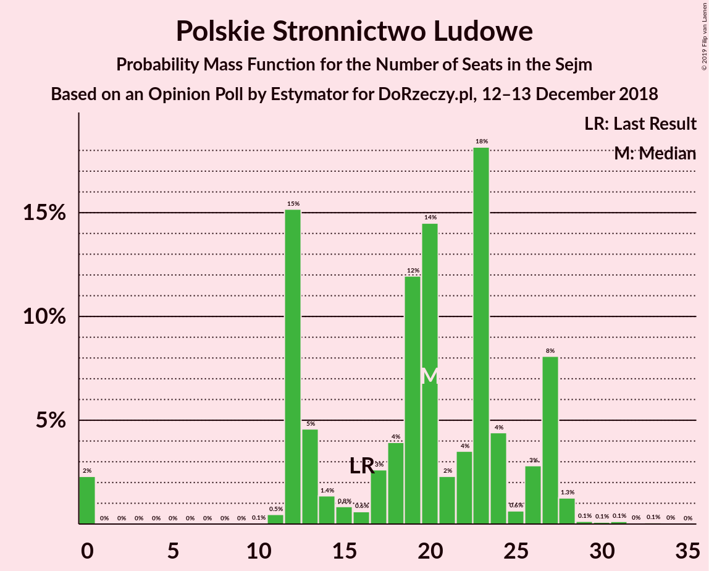
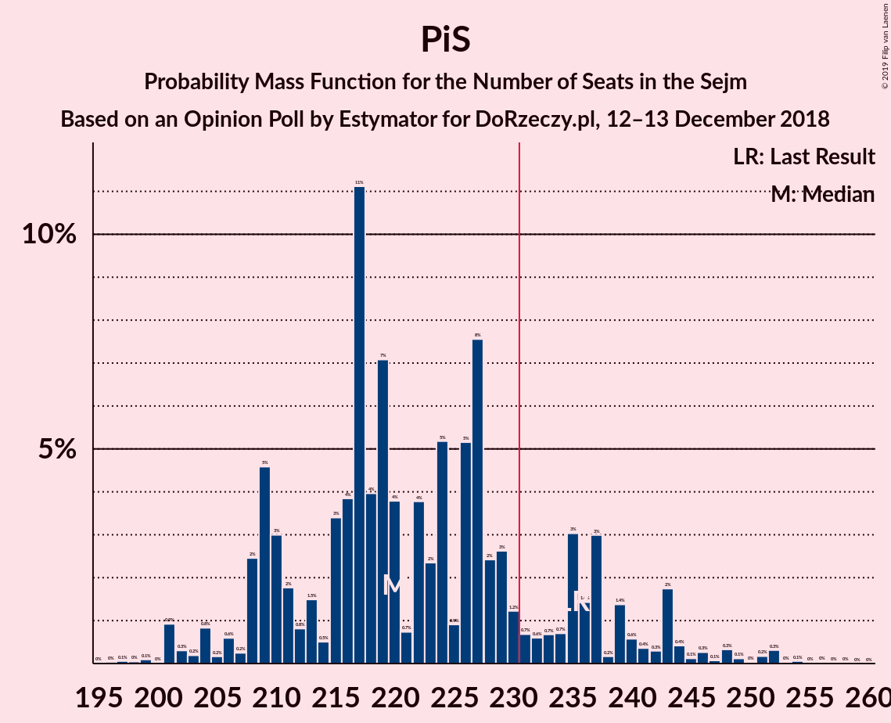
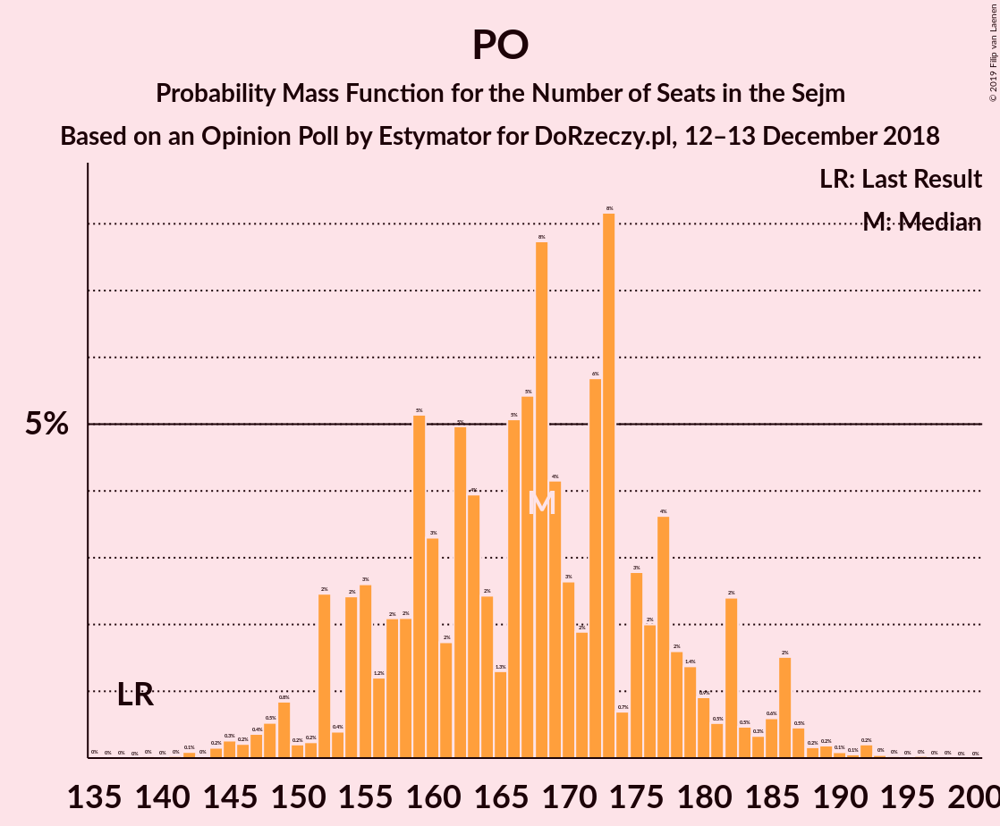

# Opinion Poll by Estymator for DoRzeczy.pl, 12–13 December 2018

<a href="#voting-intentions">Voting Intentions</a> | <a href="#seats">Seats</a> | <a href="#coalitions">Coalitions</a> | <a href="#technical-information">Technical Information</a>

## Voting Intentions

### Confidence Intervals

| Party | Last Result | Poll Result | 80% Confidence Interval | 90% Confidence Interval | 95% Confidence Interval | 99% Confidence Interval |
|:-----:|:-----------:|:-----------:|:-----------------------:|:-----------------------:|:-----------------------:|:-----------------------:|
| Prawo i Sprawiedliwość | 37.6% | 41.9% | 39.9–43.9% |39.4–44.4% |38.9–44.9% |38.0–45.9% |
| Platforma Obywatelska | 24.1% | 32.1% | 30.3–34.0% |29.7–34.5% |29.3–35.0% |28.4–35.9% |
| Kukiz’15 | 8.8% | 9.0% | 8.0–10.3% |7.7–10.6% |7.4–10.9% |6.9–11.6% |
| Polskie Stronnictwo Ludowe | 5.1% | 6.4% | 5.5–7.5% |5.3–7.8% |5.1–8.1% |4.7–8.6% |
| Sojusz Lewicy Demokratycznej | 7.6% | 6.3% | 5.4–7.4% |5.2–7.7% |5.0–8.0% |4.6–8.5% |
| Lewica Razem | 3.6% | 1.8% | 1.4–2.5% |1.3–2.7% |1.2–2.9% |1.0–3.2% |
| KORWiN | 4.8% | 1.1% | 0.7–1.6% |0.7–1.8% |0.6–1.9% |0.5–2.2% |

*Note:* The poll result column reflects the actual value used in the calculations. Published results may vary slightly, and in addition be rounded to fewer digits.

## Seats

### Confidence Intervals

| Party | Last Result | Median | 80% Confidence Interval | 90% Confidence Interval | 95% Confidence Interval | 99% Confidence Interval |
|:-----:|:-----------:|:------:|:-----------------------:|:-----------------------:|:-----------------------:|:-----------------------:|
| <a href="#prawo-i-sprawiedliwość">Prawo i Sprawiedliwość</a> | 235 | 220 | 209–236 |208–239 |204–243 |201–251 |
| <a href="#platforma-obywatelska">Platforma Obywatelska</a> | 138 | 168 | 155–178 |152–182 |149–186 |145–189 |
| <a href="#kukiz’15">Kukiz’15</a> | 42 | 38 | 29–44 |22–45 |21–45 |18–49 |
| <a href="#polskie-stronnictwo-ludowe">Polskie Stronnictwo Ludowe</a> | 16 | 20 | 12–26 |12–27 |11–27 |0–29 |
| <a href="#sojusz-lewicy-demokratycznej">Sojusz Lewicy Demokratycznej</a> | 0 | 13 | 8–25 |6–28 |0–29 |0–30 |
| <a href="#lewica-razem">Lewica Razem</a> | 0 | 0 | 0 |0 |0 |0 |
| <a href="#korwin">KORWiN</a> | 0 | 0 | 0 |0 |0 |0 |

### Prawo i Sprawiedliwość

*For a full overview of the results for this party, see the [Prawo i Sprawiedliwość](party-prawoisprawiedliwość.html) page.*

| Number of Seats | Probability | Accumulated | Special Marks |
|:---------------:|:-----------:|:-----------:|:-------------:|
| 196 | 0% | 100% |  |
| 197 | 0.1% | 99.9% |  |
| 198 | 0% | 99.9% |  |
| 199 | 0.1% | 99.8% |  |
| 200 | 0% | 99.7% |  |
| 201 | 0.9% | 99.7% |  |
| 202 | 0.3% | 98.8% |  |
| 203 | 0.2% | 98% |  |
| 204 | 0.8% | 98% |  |
| 205 | 0.2% | 97% |  |
| 206 | 0.6% | 97% |  |
| 207 | 0.2% | 97% |  |
| 208 | 2% | 96% |  |
| 209 | 5% | 94% |  |
| 210 | 3% | 89% |  |
| 211 | 2% | 86% |  |
| 212 | 0.8% | 85% |  |
| 213 | 1.5% | 84% |  |
| 214 | 0.5% | 82% |  |
| 215 | 3% | 82% |  |
| 216 | 4% | 78% |  |
| 217 | 11% | 75% |  |
| 218 | 4% | 63% |  |
| 219 | 7% | 59% |  |
| 220 | 4% | 52% | Median |
| 221 | 0.7% | 49% |  |
| 222 | 4% | 48% |  |
| 223 | 2% | 44% |  |
| 224 | 5% | 42% |  |
| 225 | 0.9% | 37% |  |
| 226 | 5% | 36% |  |
| 227 | 8% | 30% |  |
| 228 | 2% | 23% |  |
| 229 | 3% | 21% |  |
| 230 | 1.2% | 18% |  |
| 231 | 0.7% | 17% | Majority |
| 232 | 0.6% | 16% |  |
| 233 | 0.7% | 15% |  |
| 234 | 0.7% | 15% |  |
| 235 | 3% | 14% | Last Result |
| 236 | 1.4% | 11% |  |
| 237 | 3% | 10% |  |
| 238 | 0.2% | 7% |  |
| 239 | 1.4% | 6% |  |
| 240 | 0.6% | 5% |  |
| 241 | 0.4% | 4% |  |
| 242 | 0.3% | 4% |  |
| 243 | 2% | 4% |  |
| 244 | 0.4% | 2% |  |
| 245 | 0.1% | 2% |  |
| 246 | 0.3% | 1.5% |  |
| 247 | 0.1% | 1.2% |  |
| 248 | 0.3% | 1.1% |  |
| 249 | 0.1% | 0.8% |  |
| 250 | 0% | 0.7% |  |
| 251 | 0.2% | 0.7% |  |
| 252 | 0.3% | 0.5% |  |
| 253 | 0% | 0.2% |  |
| 254 | 0.1% | 0.1% |  |
| 255 | 0% | 0.1% |  |
| 256 | 0% | 0.1% |  |
| 257 | 0% | 0% |  |

### Platforma Obywatelska

*For a full overview of the results for this party, see the [Platforma Obywatelska](party-platformaobywatelska.html) page.*

| Number of Seats | Probability | Accumulated | Special Marks |
|:---------------:|:-----------:|:-----------:|:-------------:|
| 138 | 0% | 100% | Last Result |
| 139 | 0% | 100% |  |
| 140 | 0% | 99.9% |  |
| 141 | 0% | 99.9% |  |
| 142 | 0.1% | 99.9% |  |
| 143 | 0% | 99.8% |  |
| 144 | 0.2% | 99.8% |  |
| 145 | 0.3% | 99.6% |  |
| 146 | 0.2% | 99.4% |  |
| 147 | 0.4% | 99.2% |  |
| 148 | 0.5% | 98.8% |  |
| 149 | 0.8% | 98% |  |
| 150 | 0.2% | 97% |  |
| 151 | 0.2% | 97% |  |
| 152 | 2% | 97% |  |
| 153 | 0.4% | 95% |  |
| 154 | 2% | 94% |  |
| 155 | 3% | 92% |  |
| 156 | 1.2% | 89% |  |
| 157 | 2% | 88% |  |
| 158 | 2% | 86% |  |
| 159 | 5% | 84% |  |
| 160 | 3% | 79% |  |
| 161 | 2% | 75% |  |
| 162 | 5% | 74% |  |
| 163 | 4% | 69% |  |
| 164 | 2% | 65% |  |
| 165 | 1.3% | 62% |  |
| 166 | 5% | 61% |  |
| 167 | 5% | 56% |  |
| 168 | 8% | 50% | Median |
| 169 | 4% | 43% |  |
| 170 | 3% | 39% |  |
| 171 | 2% | 36% |  |
| 172 | 6% | 34% |  |
| 173 | 8% | 28% |  |
| 174 | 0.7% | 20% |  |
| 175 | 3% | 19% |  |
| 176 | 2% | 17% |  |
| 177 | 4% | 15% |  |
| 178 | 2% | 11% |  |
| 179 | 1.4% | 9% |  |
| 180 | 0.9% | 8% |  |
| 181 | 0.5% | 7% |  |
| 182 | 2% | 7% |  |
| 183 | 0.5% | 4% |  |
| 184 | 0.3% | 4% |  |
| 185 | 0.6% | 3% |  |
| 186 | 2% | 3% |  |
| 187 | 0.5% | 1.3% |  |
| 188 | 0.2% | 0.8% |  |
| 189 | 0.2% | 0.7% |  |
| 190 | 0.1% | 0.5% |  |
| 191 | 0.1% | 0.4% |  |
| 192 | 0.2% | 0.3% |  |
| 193 | 0% | 0.1% |  |
| 194 | 0% | 0.1% |  |
| 195 | 0% | 0.1% |  |
| 196 | 0% | 0.1% |  |
| 197 | 0% | 0% |  |

### Kukiz’15

*For a full overview of the results for this party, see the [Kukiz’15](party-kukiz’15.html) page.*

| Number of Seats | Probability | Accumulated | Special Marks |
|:---------------:|:-----------:|:-----------:|:-------------:|
| 12 | 0% | 100% |  |
| 13 | 0.1% | 99.9% |  |
| 14 | 0.1% | 99.9% |  |
| 15 | 0.1% | 99.8% |  |
| 16 | 0% | 99.7% |  |
| 17 | 0% | 99.7% |  |
| 18 | 0.1% | 99.6% |  |
| 19 | 0.2% | 99.5% |  |
| 20 | 0.9% | 99.3% |  |
| 21 | 3% | 98% |  |
| 22 | 2% | 95% |  |
| 23 | 0.4% | 93% |  |
| 24 | 0.7% | 93% |  |
| 25 | 0.2% | 92% |  |
| 26 | 0.2% | 92% |  |
| 27 | 0.7% | 92% |  |
| 28 | 0.9% | 91% |  |
| 29 | 3% | 90% |  |
| 30 | 6% | 87% |  |
| 31 | 2% | 81% |  |
| 32 | 4% | 79% |  |
| 33 | 6% | 75% |  |
| 34 | 4% | 69% |  |
| 35 | 2% | 65% |  |
| 36 | 2% | 64% |  |
| 37 | 8% | 62% |  |
| 38 | 12% | 54% | Median |
| 39 | 7% | 42% |  |
| 40 | 5% | 36% |  |
| 41 | 6% | 30% |  |
| 42 | 3% | 24% | Last Result |
| 43 | 10% | 21% |  |
| 44 | 2% | 11% |  |
| 45 | 6% | 9% |  |
| 46 | 1.1% | 2% |  |
| 47 | 0.2% | 1.4% |  |
| 48 | 0.4% | 1.2% |  |
| 49 | 0.3% | 0.8% |  |
| 50 | 0.2% | 0.5% |  |
| 51 | 0.2% | 0.2% |  |
| 52 | 0% | 0% |  |

### Polskie Stronnictwo Ludowe

*For a full overview of the results for this party, see the [Polskie Stronnictwo Ludowe](party-polskiestronnictwoludowe.html) page.*

| Number of Seats | Probability | Accumulated | Special Marks |
|:---------------:|:-----------:|:-----------:|:-------------:|
| 0 | 2% | 100% |  |
| 1 | 0% | 98% |  |
| 2 | 0% | 98% |  |
| 3 | 0% | 98% |  |
| 4 | 0% | 98% |  |
| 5 | 0% | 98% |  |
| 6 | 0% | 98% |  |
| 7 | 0% | 98% |  |
| 8 | 0% | 98% |  |
| 9 | 0% | 98% |  |
| 10 | 0.1% | 98% |  |
| 11 | 0.5% | 98% |  |
| 12 | 15% | 97% |  |
| 13 | 5% | 82% |  |
| 14 | 1.4% | 77% |  |
| 15 | 0.8% | 76% |  |
| 16 | 0.6% | 75% | Last Result |
| 17 | 3% | 75% |  |
| 18 | 4% | 72% |  |
| 19 | 12% | 68% |  |
| 20 | 14% | 56% | Median |
| 21 | 2% | 42% |  |
| 22 | 4% | 39% |  |
| 23 | 18% | 36% |  |
| 24 | 4% | 18% |  |
| 25 | 0.6% | 13% |  |
| 26 | 3% | 13% |  |
| 27 | 8% | 10% |  |
| 28 | 1.3% | 2% |  |
| 29 | 0.1% | 0.5% |  |
| 30 | 0.1% | 0.4% |  |
| 31 | 0.1% | 0.3% |  |
| 32 | 0% | 0.2% |  |
| 33 | 0.1% | 0.1% |  |
| 34 | 0% | 0.1% |  |
| 35 | 0% | 0% |  |

### Sojusz Lewicy Demokratycznej

*For a full overview of the results for this party, see the [Sojusz Lewicy Demokratycznej](party-sojuszlewicydemokratycznej.html) page.*

| Number of Seats | Probability | Accumulated | Special Marks |
|:---------------:|:-----------:|:-----------:|:-------------:|
| 0 | 4% | 100% | Last Result |
| 1 | 0% | 96% |  |
| 2 | 0% | 96% |  |
| 3 | 0% | 96% |  |
| 4 | 0% | 96% |  |
| 5 | 0.8% | 96% |  |
| 6 | 2% | 96% |  |
| 7 | 3% | 93% |  |
| 8 | 5% | 91% |  |
| 9 | 4% | 86% |  |
| 10 | 8% | 82% |  |
| 11 | 7% | 74% |  |
| 12 | 13% | 67% |  |
| 13 | 7% | 53% | Median |
| 14 | 4% | 47% |  |
| 15 | 1.5% | 43% |  |
| 16 | 3% | 42% |  |
| 17 | 3% | 38% |  |
| 18 | 2% | 36% |  |
| 19 | 6% | 34% |  |
| 20 | 4% | 28% |  |
| 21 | 0.6% | 24% |  |
| 22 | 3% | 23% |  |
| 23 | 2% | 20% |  |
| 24 | 7% | 18% |  |
| 25 | 3% | 12% |  |
| 26 | 2% | 9% |  |
| 27 | 1.3% | 7% |  |
| 28 | 2% | 6% |  |
| 29 | 3% | 3% |  |
| 30 | 0.1% | 0.6% |  |
| 31 | 0.3% | 0.4% |  |
| 32 | 0.1% | 0.2% |  |
| 33 | 0.1% | 0.1% |  |
| 34 | 0% | 0.1% |  |
| 35 | 0% | 0% |  |

### Lewica Razem

*For a full overview of the results for this party, see the [Lewica Razem](party-lewicarazem.html) page.*

| Number of Seats | Probability | Accumulated | Special Marks |
|:---------------:|:-----------:|:-----------:|:-------------:|
| 0 | 100% | 100% | Last Result, Median |

### KORWiN

*For a full overview of the results for this party, see the [KORWiN](party-korwin.html) page.*

| Number of Seats | Probability | Accumulated | Special Marks |
|:---------------:|:-----------:|:-----------:|:-------------:|
| 0 | 100% | 100% | Last Result, Median |

## Coalitions

### Confidence Intervals

| Coalition | Last Result | Median | Majority? | 80% Confidence Interval | 90% Confidence Interval | 95% Confidence Interval | 99% Confidence Interval |
|:---------:|:-----------:|:------:|:---------:|:-----------------------:|:-----------------------:|:-----------------------:|:-----------------------:|
| Prawo i Sprawiedliwość | 235 | 220 | 17% | 209–236 | 208–239 | 204–243 | 201–251 |
| Platforma Obywatelska | 138 | 168 | 0% | 155–178 | 152–182 | 149–186 | 145–189 |

### Prawo i Sprawiedliwość

| Number of Seats | Probability | Accumulated | Special Marks |
|:---------------:|:-----------:|:-----------:|:-------------:|
| 196 | 0% | 100% |  |
| 197 | 0.1% | 99.9% |  |
| 198 | 0% | 99.9% |  |
| 199 | 0.1% | 99.8% |  |
| 200 | 0% | 99.7% |  |
| 201 | 0.9% | 99.7% |  |
| 202 | 0.3% | 98.8% |  |
| 203 | 0.2% | 98% |  |
| 204 | 0.8% | 98% |  |
| 205 | 0.2% | 97% |  |
| 206 | 0.6% | 97% |  |
| 207 | 0.2% | 97% |  |
| 208 | 2% | 96% |  |
| 209 | 5% | 94% |  |
| 210 | 3% | 89% |  |
| 211 | 2% | 86% |  |
| 212 | 0.8% | 85% |  |
| 213 | 1.5% | 84% |  |
| 214 | 0.5% | 82% |  |
| 215 | 3% | 82% |  |
| 216 | 4% | 78% |  |
| 217 | 11% | 75% |  |
| 218 | 4% | 63% |  |
| 219 | 7% | 59% |  |
| 220 | 4% | 52% | Median |
| 221 | 0.7% | 49% |  |
| 222 | 4% | 48% |  |
| 223 | 2% | 44% |  |
| 224 | 5% | 42% |  |
| 225 | 0.9% | 37% |  |
| 226 | 5% | 36% |  |
| 227 | 8% | 30% |  |
| 228 | 2% | 23% |  |
| 229 | 3% | 21% |  |
| 230 | 1.2% | 18% |  |
| 231 | 0.7% | 17% | Majority |
| 232 | 0.6% | 16% |  |
| 233 | 0.7% | 15% |  |
| 234 | 0.7% | 15% |  |
| 235 | 3% | 14% | Last Result |
| 236 | 1.4% | 11% |  |
| 237 | 3% | 10% |  |
| 238 | 0.2% | 7% |  |
| 239 | 1.4% | 6% |  |
| 240 | 0.6% | 5% |  |
| 241 | 0.4% | 4% |  |
| 242 | 0.3% | 4% |  |
| 243 | 2% | 4% |  |
| 244 | 0.4% | 2% |  |
| 245 | 0.1% | 2% |  |
| 246 | 0.3% | 1.5% |  |
| 247 | 0.1% | 1.2% |  |
| 248 | 0.3% | 1.1% |  |
| 249 | 0.1% | 0.8% |  |
| 250 | 0% | 0.7% |  |
| 251 | 0.2% | 0.7% |  |
| 252 | 0.3% | 0.5% |  |
| 253 | 0% | 0.2% |  |
| 254 | 0.1% | 0.1% |  |
| 255 | 0% | 0.1% |  |
| 256 | 0% | 0.1% |  |
| 257 | 0% | 0% |  |

### Platforma Obywatelska

| Number of Seats | Probability | Accumulated | Special Marks |
|:---------------:|:-----------:|:-----------:|:-------------:|
| 138 | 0% | 100% | Last Result |
| 139 | 0% | 100% |  |
| 140 | 0% | 99.9% |  |
| 141 | 0% | 99.9% |  |
| 142 | 0.1% | 99.9% |  |
| 143 | 0% | 99.8% |  |
| 144 | 0.2% | 99.8% |  |
| 145 | 0.3% | 99.6% |  |
| 146 | 0.2% | 99.4% |  |
| 147 | 0.4% | 99.2% |  |
| 148 | 0.5% | 98.8% |  |
| 149 | 0.8% | 98% |  |
| 150 | 0.2% | 97% |  |
| 151 | 0.2% | 97% |  |
| 152 | 2% | 97% |  |
| 153 | 0.4% | 95% |  |
| 154 | 2% | 94% |  |
| 155 | 3% | 92% |  |
| 156 | 1.2% | 89% |  |
| 157 | 2% | 88% |  |
| 158 | 2% | 86% |  |
| 159 | 5% | 84% |  |
| 160 | 3% | 79% |  |
| 161 | 2% | 75% |  |
| 162 | 5% | 74% |  |
| 163 | 4% | 69% |  |
| 164 | 2% | 65% |  |
| 165 | 1.3% | 62% |  |
| 166 | 5% | 61% |  |
| 167 | 5% | 56% |  |
| 168 | 8% | 50% | Median |
| 169 | 4% | 43% |  |
| 170 | 3% | 39% |  |
| 171 | 2% | 36% |  |
| 172 | 6% | 34% |  |
| 173 | 8% | 28% |  |
| 174 | 0.7% | 20% |  |
| 175 | 3% | 19% |  |
| 176 | 2% | 17% |  |
| 177 | 4% | 15% |  |
| 178 | 2% | 11% |  |
| 179 | 1.4% | 9% |  |
| 180 | 0.9% | 8% |  |
| 181 | 0.5% | 7% |  |
| 182 | 2% | 7% |  |
| 183 | 0.5% | 4% |  |
| 184 | 0.3% | 4% |  |
| 185 | 0.6% | 3% |  |
| 186 | 2% | 3% |  |
| 187 | 0.5% | 1.3% |  |
| 188 | 0.2% | 0.8% |  |
| 189 | 0.2% | 0.7% |  |
| 190 | 0.1% | 0.5% |  |
| 191 | 0.1% | 0.4% |  |
| 192 | 0.2% | 0.3% |  |
| 193 | 0% | 0.1% |  |
| 194 | 0% | 0.1% |  |
| 195 | 0% | 0.1% |  |
| 196 | 0% | 0.1% |  |
| 197 | 0% | 0% |  |

## Technical Information

### Opinion Poll

+ **Polling firm:** Estymator
+ **Commissioner(s):** DoRzeczy.pl
+ **Fieldwork period:** 12–13 December 2018

### Calculations

+ **Sample size:** 1032
+ **Simulations done:** 131,072
+ **Error estimate:** 1.57%

