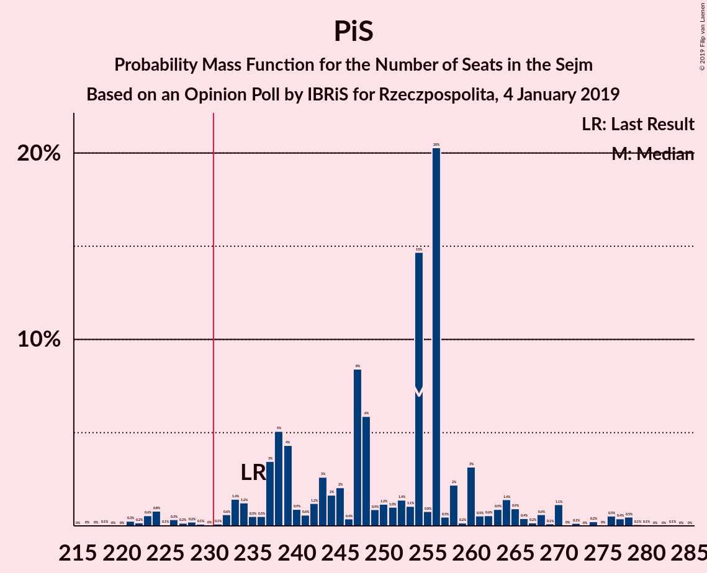
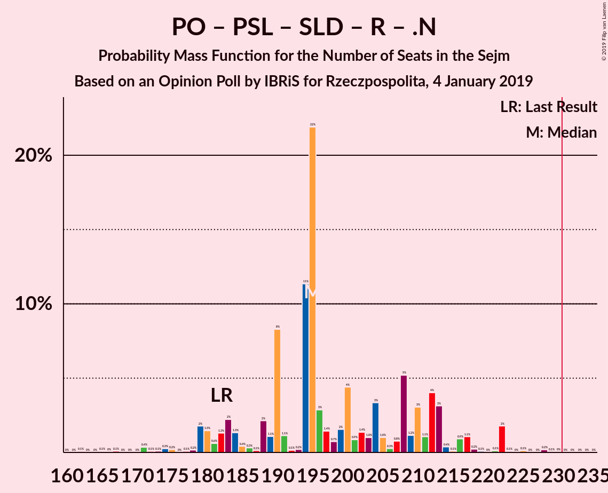
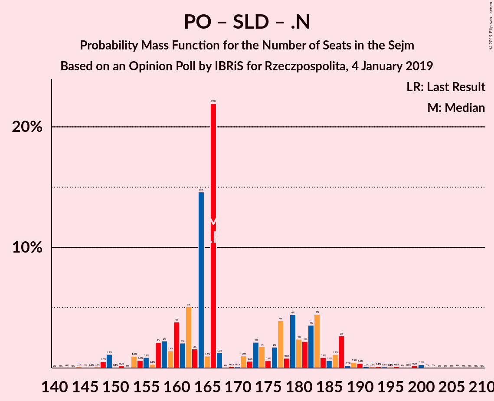

# Opinion Poll by IBRiS for Rzeczpospolita, 4 January 2019

<a href="#voting-intentions">Voting Intentions</a> | <a href="#seats">Seats</a> | <a href="#coalitions">Coalitions</a> | <a href="#technical-information">Technical Information</a>

## Voting Intentions

### Confidence Intervals

| Party | Last Result | Poll Result | 80% Confidence Interval | 90% Confidence Interval | 95% Confidence Interval | 99% Confidence Interval |
|:-----:|:-----------:|:-----------:|:-----------------------:|:-----------------------:|:-----------------------:|:-----------------------:|
| Prawo i Sprawiedliwość | 37.6% | 39.1% | 37.2–41.0% |36.7–41.5% |36.2–42.0% |35.4–42.9% |
| Platforma Obywatelska | 24.1% | 26.3% | 24.6–28.0% |24.2–28.5% |23.7–29.0% |23.0–29.8% |
| Polskie Stronnictwo Ludowe | 5.1% | 6.7% | 5.8–7.8% |5.6–8.1% |5.4–8.4% |5.0–8.9% |
| Kukiz’15 | 8.8% | 5.5% | 4.7–6.4% |4.5–6.7% |4.3–7.0% |3.9–7.5% |
| Sojusz Lewicy Demokratycznej | 7.6% | 5.0% | 4.3–6.0% |4.0–6.2% |3.9–6.5% |3.5–7.0% |
| KORWiN | 4.8% | 2.8% | 2.3–3.6% |2.1–3.8% |2.0–4.0% |1.8–4.4% |
| Lewica Razem | 3.6% | 1.4% | 1.0–1.9% |0.9–2.1% |0.8–2.2% |0.7–2.5% |
| .Nowoczesna | 7.6% | 0.9% | 0.6–1.4% |0.5–1.5% |0.5–1.7% |0.4–1.9% |

*Note:* The poll result column reflects the actual value used in the calculations. Published results may vary slightly, and in addition be rounded to fewer digits.

## Seats

### Confidence Intervals

| Party | Last Result | Median | 80% Confidence Interval | 90% Confidence Interval | 95% Confidence Interval | 99% Confidence Interval |
|:-----:|:-----------:|:------:|:-----------------------:|:-----------------------:|:-----------------------:|:-----------------------:|
| <a href="#prawo-i-sprawiedliwość">Prawo i Sprawiedliwość</a> | 235 | 247 | 244–252 |243–253 |243–264 |243–264 |
| <a href="#platforma-obywatelska">Platforma Obywatelska</a> | 138 | 173 | 154–173 |153–177 |153–179 |153–179 |
| <a href="#polskie-stronnictwo-ludowe">Polskie Stronnictwo Ludowe</a> | 16 | 28 | 18–30 |18–30 |0–30 |0–38 |
| <a href="#kukiz’15">Kukiz’15</a> | 42 | 0 | 0–21 |0–22 |0–22 |0–28 |
| <a href="#sojusz-lewicy-demokratycznej">Sojusz Lewicy Demokratycznej</a> | 0 | 12 | 0–12 |0–12 |0–12 |0–12 |
| <a href="#korwin">KORWiN</a> | 0 | 0 | 0 |0 |0 |0 |
| <a href="#lewica-razem">Lewica Razem</a> | 0 | 0 | 0 |0 |0 |0 |
| <a href="#.nowoczesna">.Nowoczesna</a> | 28 | 0 | 0 |0 |0 |0 |

### Prawo i Sprawiedliwość

*For a full overview of the results for this party, see the [Prawo i Sprawiedliwość](party-prawoisprawiedliwość.html) page.*

| Number of Seats | Probability | Accumulated | Special Marks |
|:---------------:|:-----------:|:-----------:|:-------------:|
| 235 | 0% | 100% | Last Result |
| 236 | 0% | 100% |  |
| 237 | 0% | 100% |  |
| 238 | 0.2% | 100% |  |
| 239 | 0% | 99.8% |  |
| 240 | 0.1% | 99.7% |  |
| 241 | 0% | 99.7% |  |
| 242 | 0% | 99.7% |  |
| 243 | 6% | 99.6% |  |
| 244 | 26% | 94% |  |
| 245 | 0% | 68% |  |
| 246 | 1.2% | 68% |  |
| 247 | 50% | 67% | Median |
| 248 | 0% | 16% |  |
| 249 | 0.7% | 16% |  |
| 250 | 0% | 15% |  |
| 251 | 0.5% | 15% |  |
| 252 | 10% | 15% |  |
| 253 | 3% | 5% |  |
| 254 | 0% | 3% |  |
| 255 | 0% | 3% |  |
| 256 | 0% | 3% |  |
| 257 | 0% | 3% |  |
| 258 | 0% | 3% |  |
| 259 | 0% | 3% |  |
| 260 | 0% | 3% |  |
| 261 | 0% | 3% |  |
| 262 | 0% | 3% |  |
| 263 | 0% | 3% |  |
| 264 | 3% | 3% |  |
| 265 | 0% | 0% |  |

### Platforma Obywatelska

*For a full overview of the results for this party, see the [Platforma Obywatelska](party-platformaobywatelska.html) page.*

| Number of Seats | Probability | Accumulated | Special Marks |
|:---------------:|:-----------:|:-----------:|:-------------:|
| 138 | 0% | 100% | Last Result |
| 139 | 0% | 100% |  |
| 140 | 0% | 100% |  |
| 141 | 0.1% | 100% |  |
| 142 | 0% | 99.9% |  |
| 143 | 0% | 99.9% |  |
| 144 | 0% | 99.9% |  |
| 145 | 0% | 99.9% |  |
| 146 | 0% | 99.9% |  |
| 147 | 0% | 99.9% |  |
| 148 | 0% | 99.9% |  |
| 149 | 0% | 99.9% |  |
| 150 | 0% | 99.9% |  |
| 151 | 0% | 99.9% |  |
| 152 | 0% | 99.9% |  |
| 153 | 6% | 99.9% |  |
| 154 | 8% | 94% |  |
| 155 | 0% | 86% |  |
| 156 | 0.8% | 86% |  |
| 157 | 0.6% | 85% |  |
| 158 | 0.1% | 84% |  |
| 159 | 0% | 84% |  |
| 160 | 0.6% | 84% |  |
| 161 | 0% | 84% |  |
| 162 | 0% | 84% |  |
| 163 | 0% | 84% |  |
| 164 | 0% | 84% |  |
| 165 | 0% | 84% |  |
| 166 | 0% | 84% |  |
| 167 | 0% | 84% |  |
| 168 | 18% | 84% |  |
| 169 | 0% | 66% |  |
| 170 | 0% | 66% |  |
| 171 | 0% | 66% |  |
| 172 | 0% | 66% |  |
| 173 | 61% | 66% | Median |
| 174 | 0% | 5% |  |
| 175 | 0% | 5% |  |
| 176 | 0% | 5% |  |
| 177 | 3% | 5% |  |
| 178 | 0% | 3% |  |
| 179 | 3% | 3% |  |
| 180 | 0% | 0% |  |

### Polskie Stronnictwo Ludowe

*For a full overview of the results for this party, see the [Polskie Stronnictwo Ludowe](party-polskiestronnictwoludowe.html) page.*

| Number of Seats | Probability | Accumulated | Special Marks |
|:---------------:|:-----------:|:-----------:|:-------------:|
| 0 | 3% | 100% |  |
| 1 | 0% | 97% |  |
| 2 | 0% | 97% |  |
| 3 | 0% | 97% |  |
| 4 | 0% | 97% |  |
| 5 | 0% | 97% |  |
| 6 | 0% | 97% |  |
| 7 | 0% | 97% |  |
| 8 | 0% | 97% |  |
| 9 | 0% | 97% |  |
| 10 | 0% | 97% |  |
| 11 | 0% | 97% |  |
| 12 | 0% | 97% |  |
| 13 | 0% | 97% |  |
| 14 | 0% | 97% |  |
| 15 | 0% | 97% |  |
| 16 | 0% | 97% | Last Result |
| 17 | 0% | 97% |  |
| 18 | 10% | 97% |  |
| 19 | 0.4% | 88% |  |
| 20 | 0% | 87% |  |
| 21 | 0% | 87% |  |
| 22 | 0% | 87% |  |
| 23 | 0% | 87% |  |
| 24 | 0% | 87% |  |
| 25 | 0.2% | 87% |  |
| 26 | 0.4% | 87% |  |
| 27 | 0% | 87% |  |
| 28 | 68% | 87% | Median |
| 29 | 8% | 18% |  |
| 30 | 8% | 10% |  |
| 31 | 0% | 2% |  |
| 32 | 0.6% | 2% |  |
| 33 | 0.1% | 1.2% |  |
| 34 | 0% | 1.1% |  |
| 35 | 0% | 1.1% |  |
| 36 | 0% | 1.1% |  |
| 37 | 0% | 1.1% |  |
| 38 | 0.9% | 1.1% |  |
| 39 | 0% | 0.3% |  |
| 40 | 0.2% | 0.3% |  |
| 41 | 0% | 0.1% |  |
| 42 | 0% | 0.1% |  |
| 43 | 0.1% | 0.1% |  |
| 44 | 0% | 0% |  |

### Kukiz’15

*For a full overview of the results for this party, see the [Kukiz’15](party-kukiz’15.html) page.*

| Number of Seats | Probability | Accumulated | Special Marks |
|:---------------:|:-----------:|:-----------:|:-------------:|
| 0 | 53% | 100% | Median |
| 1 | 0% | 47% |  |
| 2 | 0% | 47% |  |
| 3 | 0% | 47% |  |
| 4 | 0% | 47% |  |
| 5 | 0% | 47% |  |
| 6 | 0% | 47% |  |
| 7 | 0% | 47% |  |
| 8 | 18% | 47% |  |
| 9 | 0% | 29% |  |
| 10 | 0% | 29% |  |
| 11 | 0% | 29% |  |
| 12 | 0% | 29% |  |
| 13 | 0% | 29% |  |
| 14 | 0% | 29% |  |
| 15 | 0% | 29% |  |
| 16 | 0% | 29% |  |
| 17 | 13% | 29% |  |
| 18 | 0.1% | 16% |  |
| 19 | 0.2% | 16% |  |
| 20 | 0.8% | 16% |  |
| 21 | 8% | 15% |  |
| 22 | 6% | 7% |  |
| 23 | 0% | 0.8% |  |
| 24 | 0.1% | 0.8% |  |
| 25 | 0% | 0.7% |  |
| 26 | 0.2% | 0.7% |  |
| 27 | 0% | 0.5% |  |
| 28 | 0.4% | 0.5% |  |
| 29 | 0% | 0.2% |  |
| 30 | 0% | 0.2% |  |
| 31 | 0% | 0.2% |  |
| 32 | 0% | 0.1% |  |
| 33 | 0% | 0.1% |  |
| 34 | 0% | 0.1% |  |
| 35 | 0% | 0.1% |  |
| 36 | 0.1% | 0.1% |  |
| 37 | 0% | 0% |  |
| 38 | 0% | 0% |  |
| 39 | 0% | 0% |  |
| 40 | 0% | 0% |  |
| 41 | 0% | 0% |  |
| 42 | 0% | 0% | Last Result |

### Sojusz Lewicy Demokratycznej

*For a full overview of the results for this party, see the [Sojusz Lewicy Demokratycznej](party-sojuszlewicydemokratycznej.html) page.*

| Number of Seats | Probability | Accumulated | Special Marks |
|:---------------:|:-----------:|:-----------:|:-------------:|
| 0 | 18% | 100% | Last Result |
| 1 | 0% | 82% |  |
| 2 | 0% | 82% |  |
| 3 | 0% | 82% |  |
| 4 | 0% | 82% |  |
| 5 | 0% | 82% |  |
| 6 | 0% | 82% |  |
| 7 | 0% | 82% |  |
| 8 | 0% | 82% |  |
| 9 | 0% | 82% |  |
| 10 | 0.2% | 82% |  |
| 11 | 0% | 82% |  |
| 12 | 82% | 82% | Median |
| 13 | 0% | 0% |  |

### KORWiN

*For a full overview of the results for this party, see the [KORWiN](party-korwin.html) page.*

| Number of Seats | Probability | Accumulated | Special Marks |
|:---------------:|:-----------:|:-----------:|:-------------:|
| 0 | 100% | 100% | Last Result, Median |

### Lewica Razem

*For a full overview of the results for this party, see the [Lewica Razem](party-lewicarazem.html) page.*

| Number of Seats | Probability | Accumulated | Special Marks |
|:---------------:|:-----------:|:-----------:|:-------------:|
| 0 | 100% | 100% | Last Result, Median |

### .Nowoczesna

*For a full overview of the results for this party, see the [.Nowoczesna](party-nowoczesna.html) page.*

| Number of Seats | Probability | Accumulated | Special Marks |
|:---------------:|:-----------:|:-----------:|:-------------:|
| 0 | 100% | 100% | Median |
| 1 | 0% | 0% |  |
| 2 | 0% | 0% |  |
| 3 | 0% | 0% |  |
| 4 | 0% | 0% |  |
| 5 | 0% | 0% |  |
| 6 | 0% | 0% |  |
| 7 | 0% | 0% |  |
| 8 | 0% | 0% |  |
| 9 | 0% | 0% |  |
| 10 | 0% | 0% |  |
| 11 | 0% | 0% |  |
| 12 | 0% | 0% |  |
| 13 | 0% | 0% |  |
| 14 | 0% | 0% |  |
| 15 | 0% | 0% |  |
| 16 | 0% | 0% |  |
| 17 | 0% | 0% |  |
| 18 | 0% | 0% |  |
| 19 | 0% | 0% |  |
| 20 | 0% | 0% |  |
| 21 | 0% | 0% |  |
| 22 | 0% | 0% |  |
| 23 | 0% | 0% |  |
| 24 | 0% | 0% |  |
| 25 | 0% | 0% |  |
| 26 | 0% | 0% |  |
| 27 | 0% | 0% |  |
| 28 | 0% | 0% | Last Result |

## Coalitions

### Confidence Intervals

| Coalition | Last Result | Median | Majority? | 80% Confidence Interval | 90% Confidence Interval | 95% Confidence Interval | 99% Confidence Interval |
|:---------:|:-----------:|:------:|:---------:|:-----------------------:|:-----------------------:|:-----------------------:|:-----------------------:|
| Prawo i Sprawiedliwość | 235 | 247 | 100% | 244–252 | 243–253 | 243–264 | 243–264 |
| Platforma Obywatelska – Polskie Stronnictwo Ludowe – Sojusz Lewicy Demokratycznej – Lewica Razem – .Nowoczesna | 182 | 213 | 0% | 191–213 | 191–213 | 179–213 | 179–213 |
| Platforma Obywatelska – Polskie Stronnictwo Ludowe – Sojusz Lewicy Demokratycznej – .Nowoczesna | 182 | 213 | 0% | 191–213 | 191–213 | 179–213 | 179–213 |
| Platforma Obywatelska – Polskie Stronnictwo Ludowe – .Nowoczesna | 182 | 201 | 0% | 183–201 | 183–201 | 179–207 | 179–207 |
| Platforma Obywatelska – Sojusz Lewicy Demokratycznej – .Nowoczesna | 166 | 185 | 0% | 166–185 | 165–185 | 165–185 | 156–185 |
| Platforma Obywatelska – .Nowoczesna | 166 | 173 | 0% | 154–173 | 153–177 | 153–179 | 153–179 |
| Platforma Obywatelska | 138 | 173 | 0% | 154–173 | 153–177 | 153–179 | 153–179 |

### Prawo i Sprawiedliwość

| Number of Seats | Probability | Accumulated | Special Marks |
|:---------------:|:-----------:|:-----------:|:-------------:|
| 235 | 0% | 100% | Last Result |
| 236 | 0% | 100% |  |
| 237 | 0% | 100% |  |
| 238 | 0.2% | 100% |  |
| 239 | 0% | 99.8% |  |
| 240 | 0.1% | 99.7% |  |
| 241 | 0% | 99.7% |  |
| 242 | 0% | 99.7% |  |
| 243 | 6% | 99.6% |  |
| 244 | 26% | 94% |  |
| 245 | 0% | 68% |  |
| 246 | 1.2% | 68% |  |
| 247 | 50% | 67% | Median |
| 248 | 0% | 16% |  |
| 249 | 0.7% | 16% |  |
| 250 | 0% | 15% |  |
| 251 | 0.5% | 15% |  |
| 252 | 10% | 15% |  |
| 253 | 3% | 5% |  |
| 254 | 0% | 3% |  |
| 255 | 0% | 3% |  |
| 256 | 0% | 3% |  |
| 257 | 0% | 3% |  |
| 258 | 0% | 3% |  |
| 259 | 0% | 3% |  |
| 260 | 0% | 3% |  |
| 261 | 0% | 3% |  |
| 262 | 0% | 3% |  |
| 263 | 0% | 3% |  |
| 264 | 3% | 3% |  |
| 265 | 0% | 0% |  |

### Platforma Obywatelska – Polskie Stronnictwo Ludowe – Sojusz Lewicy Demokratycznej – Lewica Razem – .Nowoczesna

| Number of Seats | Probability | Accumulated | Special Marks |
|:---------------:|:-----------:|:-----------:|:-------------:|
| 179 | 3% | 100% |  |
| 180 | 0% | 97% |  |
| 181 | 0% | 97% |  |
| 182 | 0% | 97% | Last Result |
| 183 | 0% | 97% |  |
| 184 | 0.1% | 97% |  |
| 185 | 0.2% | 97% |  |
| 186 | 0.4% | 97% |  |
| 187 | 0% | 97% |  |
| 188 | 0% | 97% |  |
| 189 | 0.6% | 97% |  |
| 190 | 0% | 96% |  |
| 191 | 10% | 96% |  |
| 192 | 0.4% | 86% |  |
| 193 | 0% | 86% |  |
| 194 | 0.8% | 86% |  |
| 195 | 14% | 85% |  |
| 196 | 0.1% | 71% |  |
| 197 | 0% | 71% |  |
| 198 | 0.1% | 71% |  |
| 199 | 0% | 71% |  |
| 200 | 0% | 71% |  |
| 201 | 0% | 71% |  |
| 202 | 0% | 71% |  |
| 203 | 0.2% | 71% |  |
| 204 | 0% | 71% |  |
| 205 | 0% | 71% |  |
| 206 | 0% | 71% |  |
| 207 | 3% | 71% |  |
| 208 | 18% | 68% |  |
| 209 | 0% | 50% |  |
| 210 | 0% | 50% |  |
| 211 | 0% | 50% |  |
| 212 | 0% | 50% |  |
| 213 | 50% | 50% | Median |
| 214 | 0% | 0% |  |

### Platforma Obywatelska – Polskie Stronnictwo Ludowe – Sojusz Lewicy Demokratycznej – .Nowoczesna

| Number of Seats | Probability | Accumulated | Special Marks |
|:---------------:|:-----------:|:-----------:|:-------------:|
| 179 | 3% | 100% |  |
| 180 | 0% | 97% |  |
| 181 | 0% | 97% |  |
| 182 | 0% | 97% | Last Result |
| 183 | 0% | 97% |  |
| 184 | 0.1% | 97% |  |
| 185 | 0.2% | 97% |  |
| 186 | 0.4% | 97% |  |
| 187 | 0% | 97% |  |
| 188 | 0% | 97% |  |
| 189 | 0.6% | 97% |  |
| 190 | 0% | 96% |  |
| 191 | 10% | 96% |  |
| 192 | 0.4% | 86% |  |
| 193 | 0% | 86% |  |
| 194 | 0.8% | 86% |  |
| 195 | 14% | 85% |  |
| 196 | 0.1% | 71% |  |
| 197 | 0% | 71% |  |
| 198 | 0.1% | 71% |  |
| 199 | 0% | 71% |  |
| 200 | 0% | 71% |  |
| 201 | 0% | 71% |  |
| 202 | 0% | 71% |  |
| 203 | 0.2% | 71% |  |
| 204 | 0% | 71% |  |
| 205 | 0% | 71% |  |
| 206 | 0% | 71% |  |
| 207 | 3% | 71% |  |
| 208 | 18% | 68% |  |
| 209 | 0% | 50% |  |
| 210 | 0% | 50% |  |
| 211 | 0% | 50% |  |
| 212 | 0% | 50% |  |
| 213 | 50% | 50% | Median |
| 214 | 0% | 0% |  |

### Platforma Obywatelska – Polskie Stronnictwo Ludowe – .Nowoczesna

| Number of Seats | Probability | Accumulated | Special Marks |
|:---------------:|:-----------:|:-----------:|:-------------:|
| 179 | 3% | 100% |  |
| 180 | 0% | 97% |  |
| 181 | 0% | 97% |  |
| 182 | 0% | 97% | Last Result |
| 183 | 14% | 97% |  |
| 184 | 0.1% | 83% |  |
| 185 | 0.2% | 83% |  |
| 186 | 0.5% | 83% |  |
| 187 | 0% | 83% |  |
| 188 | 0% | 83% |  |
| 189 | 0.6% | 83% |  |
| 190 | 0% | 82% |  |
| 191 | 10% | 82% |  |
| 192 | 0.4% | 72% |  |
| 193 | 0.2% | 72% |  |
| 194 | 0.8% | 71% |  |
| 195 | 0% | 71% |  |
| 196 | 18% | 71% |  |
| 197 | 0% | 53% |  |
| 198 | 0% | 53% |  |
| 199 | 0% | 53% |  |
| 200 | 0% | 53% |  |
| 201 | 50% | 53% | Median |
| 202 | 0% | 3% |  |
| 203 | 0% | 3% |  |
| 204 | 0% | 3% |  |
| 205 | 0% | 3% |  |
| 206 | 0% | 3% |  |
| 207 | 3% | 3% |  |
| 208 | 0% | 0% |  |

### Platforma Obywatelska – Sojusz Lewicy Demokratycznej – .Nowoczesna

| Number of Seats | Probability | Accumulated | Special Marks |
|:---------------:|:-----------:|:-----------:|:-------------:|
| 141 | 0.1% | 100% |  |
| 142 | 0% | 99.9% |  |
| 143 | 0% | 99.9% |  |
| 144 | 0% | 99.9% |  |
| 145 | 0% | 99.9% |  |
| 146 | 0% | 99.9% |  |
| 147 | 0% | 99.9% |  |
| 148 | 0% | 99.9% |  |
| 149 | 0% | 99.9% |  |
| 150 | 0% | 99.9% |  |
| 151 | 0% | 99.9% |  |
| 152 | 0% | 99.9% |  |
| 153 | 0% | 99.9% |  |
| 154 | 0% | 99.9% |  |
| 155 | 0% | 99.9% |  |
| 156 | 0.8% | 99.9% |  |
| 157 | 0.6% | 99.1% |  |
| 158 | 0.1% | 98.5% |  |
| 159 | 0% | 98% |  |
| 160 | 0.6% | 98% |  |
| 161 | 0% | 98% |  |
| 162 | 0% | 98% |  |
| 163 | 0.2% | 98% |  |
| 164 | 0% | 98% |  |
| 165 | 6% | 98% |  |
| 166 | 8% | 92% | Last Result |
| 167 | 0% | 84% |  |
| 168 | 0% | 84% |  |
| 169 | 0% | 84% |  |
| 170 | 0% | 84% |  |
| 171 | 0% | 84% |  |
| 172 | 0% | 84% |  |
| 173 | 10% | 84% |  |
| 174 | 0% | 73% |  |
| 175 | 0% | 73% |  |
| 176 | 0% | 73% |  |
| 177 | 3% | 73% |  |
| 178 | 0% | 71% |  |
| 179 | 3% | 71% |  |
| 180 | 18% | 68% |  |
| 181 | 0% | 50% |  |
| 182 | 0% | 50% |  |
| 183 | 0% | 50% |  |
| 184 | 0% | 50% |  |
| 185 | 50% | 50% | Median |
| 186 | 0% | 0% |  |

### Platforma Obywatelska – .Nowoczesna

| Number of Seats | Probability | Accumulated | Special Marks |
|:---------------:|:-----------:|:-----------:|:-------------:|
| 141 | 0.1% | 100% |  |
| 142 | 0% | 99.9% |  |
| 143 | 0% | 99.9% |  |
| 144 | 0% | 99.9% |  |
| 145 | 0% | 99.9% |  |
| 146 | 0% | 99.9% |  |
| 147 | 0% | 99.9% |  |
| 148 | 0% | 99.9% |  |
| 149 | 0% | 99.9% |  |
| 150 | 0% | 99.9% |  |
| 151 | 0% | 99.9% |  |
| 152 | 0% | 99.9% |  |
| 153 | 6% | 99.9% |  |
| 154 | 8% | 94% |  |
| 155 | 0% | 86% |  |
| 156 | 0.8% | 86% |  |
| 157 | 0.6% | 85% |  |
| 158 | 0.1% | 84% |  |
| 159 | 0% | 84% |  |
| 160 | 0.6% | 84% |  |
| 161 | 0% | 84% |  |
| 162 | 0% | 84% |  |
| 163 | 0% | 84% |  |
| 164 | 0% | 84% |  |
| 165 | 0% | 84% |  |
| 166 | 0% | 84% | Last Result |
| 167 | 0% | 84% |  |
| 168 | 18% | 84% |  |
| 169 | 0% | 66% |  |
| 170 | 0% | 66% |  |
| 171 | 0% | 66% |  |
| 172 | 0% | 66% |  |
| 173 | 61% | 66% | Median |
| 174 | 0% | 5% |  |
| 175 | 0% | 5% |  |
| 176 | 0% | 5% |  |
| 177 | 3% | 5% |  |
| 178 | 0% | 3% |  |
| 179 | 3% | 3% |  |
| 180 | 0% | 0% |  |

### Platforma Obywatelska

| Number of Seats | Probability | Accumulated | Special Marks |
|:---------------:|:-----------:|:-----------:|:-------------:|
| 138 | 0% | 100% | Last Result |
| 139 | 0% | 100% |  |
| 140 | 0% | 100% |  |
| 141 | 0.1% | 100% |  |
| 142 | 0% | 99.9% |  |
| 143 | 0% | 99.9% |  |
| 144 | 0% | 99.9% |  |
| 145 | 0% | 99.9% |  |
| 146 | 0% | 99.9% |  |
| 147 | 0% | 99.9% |  |
| 148 | 0% | 99.9% |  |
| 149 | 0% | 99.9% |  |
| 150 | 0% | 99.9% |  |
| 151 | 0% | 99.9% |  |
| 152 | 0% | 99.9% |  |
| 153 | 6% | 99.9% |  |
| 154 | 8% | 94% |  |
| 155 | 0% | 86% |  |
| 156 | 0.8% | 86% |  |
| 157 | 0.6% | 85% |  |
| 158 | 0.1% | 84% |  |
| 159 | 0% | 84% |  |
| 160 | 0.6% | 84% |  |
| 161 | 0% | 84% |  |
| 162 | 0% | 84% |  |
| 163 | 0% | 84% |  |
| 164 | 0% | 84% |  |
| 165 | 0% | 84% |  |
| 166 | 0% | 84% |  |
| 167 | 0% | 84% |  |
| 168 | 18% | 84% |  |
| 169 | 0% | 66% |  |
| 170 | 0% | 66% |  |
| 171 | 0% | 66% |  |
| 172 | 0% | 66% |  |
| 173 | 61% | 66% | Median |
| 174 | 0% | 5% |  |
| 175 | 0% | 5% |  |
| 176 | 0% | 5% |  |
| 177 | 3% | 5% |  |
| 178 | 0% | 3% |  |
| 179 | 3% | 3% |  |
| 180 | 0% | 0% |  |

## Technical Information

### Opinion Poll

+ **Polling firm:** IBRiS
+ **Commissioner(s):** Rzeczpospolita
+ **Fieldwork period:** 4 January 2019

### Calculations

+ **Sample size:** 1100
+ **Simulations done:** 1,024
+ **Error estimate:** 2.09%

